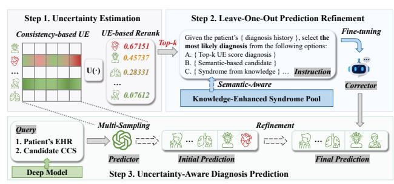
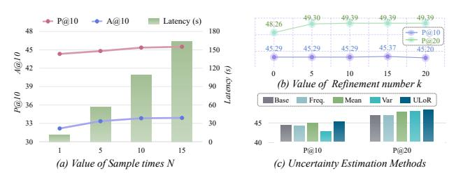

# **ULoR**: Uncertainty-Aware Leave-One-Out Refinement Framework for Diagnosis Prediction

Jie Zhang College of Computer and Data Science, Fuzhou University Fuzhou, China ee6r1c7@gmail.com

Wanzi Shao College of Computer and Data Science, Fuzhou University Fuzhou, China shaowz0302@163.com

Yanchao Tan∗ College of Computer and Data Science, Fuzhou University Fuzhou, China yctan@fzu.edu.cn

# Abstract

Recent advances in clinical prediction leverage large language models (LLMs) to extract semantic information from Electronic Health Records (EHRs). However, LLMs could produce biased or hallucinated responses camouflaged by their fluency and realistic appearance, which is unacceptable in diagnosis prediction. Uncertainty estimation (UE) has emerged as an effective approach to address this challenge by quantifying hallucination levels and prediction confidence in LLM outputs. Yet, directly determining diagnosis predictions based on UE remains insufficient, as diagnoses with high uncertainty may still correspond to correct outcomes. To this end, we propose ULoR, an uncertainty-aware leave-one-out refinement framework for reliable diagnosis prediction. Specifically, we first compute the UE scores by integrating statistical information from multiple samples of the model's diagnosis ranking distributions and leverage these scores for initial predictions. Then, guided by the leave-one-out strategy, we construct multiple-choice tasks for high-uncertainty diagnoses using external syndrome knowledge and fine-tune the refinement component to resolve them, thereby confirming or replacing uncertain predictions. Extensive experiments on two real-world EHR datasets demonstrate that ULoR consistently outperforms state-of-the-art baselines, showcasing its practical utility in real-world clinical settings.

# CCS Concepts

• Applied computing → Health care information systems.

# Keywords

Diagnosis Prediction, Large Language Model, Uncertainty Estimation, Leave-One-Out

#### ACM Reference Format:

Jie Zhang, Wanzi Shao, and Yanchao Tan. 2026. ULoR: Uncertainty-Aware Leave-One-Out Refinement Framework for Diagnosis Prediction. In Proceedings of the ACM Web Conference 2026 (WWW '26), April 13–17, 2026, Dubai, United Arab Emirates. ACM, New York, NY, USA, [4](#page-3-0) pages. [https:](https://doi.org/10.1145/3774904.3792963) [//doi.org/10.1145/3774904.3792963](https://doi.org/10.1145/3774904.3792963)

∗Yanchao Tan is the corresponding author.

[This work is licensed under a Creative Commons Attribution 4.0 International License.](https://creativecommons.org/licenses/by/4.0) WWW '26, Dubai, United Arab Emirates. © 2026 Copyright held by the owner/author(s). ACM ISBN 979-8-4007-2307-0/2026/04 <https://doi.org/10.1145/3774904.3792963>

# 1 Introduction

Electronic Health Records (EHRs) provide longitudinal clinical information essential for accurate diagnosis prediction and early intervention [\[9,](#page-3-1) [10,](#page-3-2) [14\]](#page-3-3). Traditional deep-learning models learn temporal patterns effectively but lack interpretability and semantic grounding, limiting their reliability in safety-critical medical scenarios [\[3,](#page-3-4) [4\]](#page-3-5). Recent advances in large language models (LLMs) and retrieval-augmented generation (RAG) have improved clinical reasoning, yet these models remain prone to hallucinations: pretrained LLMs may rely on internal knowledge [\[11\]](#page-3-6), while RAG models can introduce noisy or conflicting evidence [\[5,](#page-3-7) [7\]](#page-3-8). Such overconfident or biased outputs, despite their fluency, are unacceptable for diagnosis prediction and increase clinicians' verification burden.

Recent studies have explored uncertainty estimation (UE) as an effective approach to quantify the reliability of LLM outputs, providing a principled mechanism to detect hallucinations and assess prediction confidence [\[16,](#page-3-9) [18\]](#page-3-10). UE operates on the model's intrinsic prediction patterns, enabling faithful detection of unreliable behaviors and timely adjustment of responses. This makes UE particularly valuable in clinical settings that demand high precision, real-time decisions, and reliable feedback for complex medical scenarios.

However, directly applying existing UE methods to EHR-based diagnosis prediction poses significant challenges. First, most UE techniques, such as entropy [\[18\]](#page-3-10) or logit-based approaches [\[16\]](#page-3-9), are designed for single-answer question answering; they struggle to remain informative under multi-entity, multi-diagnosis clinical inputs, where interactions among medical codes can distort uncertainty signals [\[19\]](#page-3-11). Second, making decisions solely based on UE scores is insufficient: diagnoses with high estimated uncertainty may still be correct due to intrinsic clinical ambiguity or overlapping comorbidities [\[18\]](#page-3-10). For example, in cardiovascular cases, "chest discomfort" may receive a high uncertainty score even though it correctly reflects an early manifestation of myocardial ischemia when interpreted alongside the patient's clinical history.

To address these challenges, we propose ULoR, an Uncertaintyaware Leave-One-Out Refinement framework for reliable EHRbased diagnosis prediction. ULoR enhances predictive accuracy and robustness by jointly modeling uncertainty signals and knowledgeguided refinement. The framework consists of three key components: (1) Code-Level Uncertainty Estimation, which evaluates prediction stability by multi-sampling LLM outputs at the diagnosis-code level; (2) Leave-One-Out Prediction Refinement, a refinement mechanism that leverages external medical knowledge and LLM-based reasoning to confirm or correct high-uncertainty diagnoses; and (3) Uncertainty-Aware Diagnosis Prediction,

which integrates low-uncertainty predictions with refined highuncertainty cases to produce reliable final outputs.

Evaluation on two real-world EHR datasets against 11 competitive baselines shows that ULoR significantly enhances prediction accuracy, outperforming state-of-the-art (SOTA) models. Our main contributions are as follows:

- We propose ULoR, a novel uncertainty-aware refinement framework that integrates code-level UE with leave-one-out reasoning. This design mitigates hallucination-driven errors and enhances reliability in multi-entity clinical prediction tasks.
- We conduct extensive experiments on real-world EHR datasets, demonstrating that ULoR consistently outperforms stateof-the-art models in both visit-level and code-level diagnosis prediction.
- ULoR provides explicit, numerically traceable uncertainty estimates, enabling transparent confidence assessment in clinical decision support and reducing the secondary verification burden for medical professionals. troduce Code-Level Uncertainty Estimation, a lightweight method **1. Patient's EHR**

### 2 Related work

Diagnosis prediction has been extensively studied due to its pivotal role in healthcare. Traditional DL-based methods like RETAIN [\[4\]](#page-3-5), TRANS [\[3\]](#page-3-4) and BoxLM [\[14\]](#page-3-3) rely on structured EHRs to model patient visit sequences for diagnosis prediction. However, these models face challenges from data sparsity and limited reliable knowledge integration. LLM-based methods like MedReason [\[17\]](#page-3-12) and MedicalCoT [\[11\]](#page-3-6) show strong diagnostic ability but still suffer from hallucinations and instability due to limited domain knowledge.

Recent RAG studies focus on strategies integrating external knowledge to enhance LLMs. Some general-task RAG methods [\[2,](#page-3-13) [5,](#page-3-7) [7\]](#page-3-8) showing strong potential for healthcare applications. These methods indirectly trace uncertain answers via external knowledge but are prone to noise and lack explicit uncertainty modeling.

# 3 Methodology of **ULoR**

In this section, we define the problem and then present our proposed ULoR, with the overall framework illustrated in Figure [1.](#page-1-0) It comprises three key steps: (1) Code-Level Uncertainty Estimation, (2) Leave-One-Out Prediction Refinement and (3) Uncertainty-Aware Diagnosis Prediction.

#### 3.1 Problem Definition

Given a patient's EHR data, consisting of a sequence of visits where each medical event is represented by a unique code (e.g., diagnoses and CCS codes) and associated with a name in the form of a short text snippet, the task is to predict the relevant CCS codes for the patient's next visit.

# 3.2 Code-Level Uncertainty Estimation

Reliable confidence estimation is vital in clinical decision support, as inaccurate or overconfident predictions increase clinicians' verification burden and compromise patient safety. Yet most deep-learning and LLM-based healthcare models provide point predictions without explicit uncertainty assessment. To address this gap, we in-

Figure 1: The overall framework of our proposed **ULoR**.

that evaluates prediction confidence through the consistency of multi-sampled LLM outputs.

3.2.1 UE-Adaptive Query Construction. For a patient ��, the EHR is represented as a sequence of visits {��1, ��2, . . . , ���� }, where each visit contains ICD and CCS codes forming the medical history MHist. In our setting, LLMs are required to reason over rich multientity medical histories to infer or select potential future diagnoses (e.g., from all 285 CCS categories in MIMIC-III). However, directly querying over the full CCS space leads to highly unstable UE signals, as UE accuracy degrades markedly under such complex multi-entity conditions [\[19\]](#page-3-11). Thus, we incorporate a clinically trained predictor Fpred (TRANS [\[3\]](#page-3-4) in this work) to obtain a compact set of candidate diagnoses. We select the top-�� predictions (�� = 30) to balance coverage and query simplicity:

MPred = Top-�� Fpred ({��1, ��2, . . . , ���� }) . (1)

The query is constructed as���� = {MHist∪MPred, ��������pred}, where ��������pred denotes the diagnosis prediction prompt as follow:

Simplified Prompt for Diagnosis Prediction

You are a medical diagnosis expert. Given the patient's past diagnosis history: { Diagnosis History } Please identify and re-rank the { Candidate Number �� } most likely diseases the patient currently has from the list below, ordering them from most to least likely: { Candidate Diagnoses List }

3.2.2 Consistency-based Uncertainty Estimation. Given query ���� , we run �� stochastic forward passes of the LLM predictor ����������pred (Qwen3-32B) to obtain a rank matrix C ∈ R ��×�� , where each col-

umn represents one sampled ranking of the �� candidate diagnoses. To obtain a consistency-based uncertainty score, we first normalize each sampled ranking into a probability simplex via a columnwise softmax (with �� = 1.0 in this task):

P = Softmaxcol C , P ∈ Δ ��−1 × ��. (2)

Let

�� = 1 �� P1, �� = √︃ 1 �� (P − ��1 ⊤) ⊙2 1, (3)

denote the per-diagnosis mean and standard deviation across the �� samples (⊙ denotes Hadamard product).

We then define the consistency-based uncertainty score as a convex combination of location and dispersion:

U = �� �� + (1 − ��) ��, �� ∈ [0, 1]. (4)

The resulting U ∈ R �� assigns each candidate diagnosis a scalar uncertainty score, where larger values indicate lower ranking consistency and hence higher predictive uncertainty.

3.2.3 UE-based Rerank. Given the score U ∈ R �� , we sort the candidate diagnoses in ascending order of uncertainty, i.e., RankUE = argsort(U). For downstream @R evaluation, the top-�� entries form the initial UE-guided prediction Ans(1:��) init = RankUE [1 : ��], providing a stable baseline. The last �� entries in this range, Mrefine = RankUE [�� − �� + 1 : ��], are selected as the primary candidates for subsequent refinement, targeting diagnoses with high uncertainty that benefit most from knowledge-guided adjustment.

#### 3.3 Leave-One-Out Prediction Refinement

Although the UE-based reranked predictions provide a reliable baseline, with low-uncertainty diseases typically predicted correctly, high-uncertainty diagnoses remain ambiguous and may still correspond to correct outcomes.

Motivated by the leave-one-out principle, which evaluates the influence of individual elements by temporarily omitting them, mitigates bias from dominant factors, and provides robust estimates, we design a refinement strategy for these uncertain diagnoses. Specifically, we construct multiple-choice instructions for high-UE candidates and fine-tune a dedicated LLM corrector (Qwen3-1.7B in this work) to confirm or correct such diagnoses, thereby improving prediction reliability for ambiguous cases.

3.3.1 Knowledge-Enhanced Refinement Instruction Creation. For high-uncertainty diagnoses, we aim to confirm correct predictions or replace incorrect ones. The refinement task is formulated as a four-choice multiple-choice problem: one target diagnosis ��, one syndrome option, and two additional candidates, forming the training set Dtrain, as shown in Figure [1.](#page-1-0)

Syndrome Option Construction. Syndromes are derived by retrieving and summarizing external medical knowledge for each diagnosis, from which related disease entities are extracted to form a syndrome pool [\[20\]](#page-3-14). Specifically, for each code ��, we retrieve and condense its external knowledge as:

T�� = Ret(��, ��, Dmed), ���� = Summarizer(��������sum, T�� ), (5)

where �� is the disease surface name, Dmed is the medical corpus (PubMed [\[1\]](#page-3-15) in this work), and �� = 50. The summarized knowledge ���� is then used to extract clinically associated diseases, forming a high-quality entity pool for constructing syndrome options.

To select the most semantically relevant syndrome in the pool, we embed both the target diagnosis �� and candidate syndromes using BioBERT [\[12\]](#page-3-16) and pick the closest one:

syndrome = arg max �� ′ ∈ Epool cosine(BioBERT(��), BioBERT(�� ′ )), (6)

where Epool is the set of candidate syndrome embeddings.

Other Candidate Options. The remaining two options are drawn from the low-ranked UE diagnoses RankUE [��+1 : ��] and the rest of the CCS code space, selected by choosing those with the highest semantic similarity to the target code.

3.3.2 Fine-tune on Corrector. We fine-tune the ����������cor with LoRA [\[8\]](#page-3-17) on Dtrain with 6,195 corpus. This stage enables model to resolve cases with high comorbidity or semantic confusion, refining the preliminary predictions toward the most likely diagnosis.

Table 1: Statistics of the datasets used in our experiments.

| Dataset                   | MIMIC-III | MIMIC-IV |
|---------------------------|-----------|----------|
| # of patients             | 5,449     | 79,393   |
| # of visits               | 14,141    | 329,605  |
| Avg. # visits per patient | 2.60      | 4.15     |
| Max. # visits per patient | 29        | 169      |
| Avg. # all CCS per visit  | 12.08     | 10.62    |
| # of unique diagnoses     | 3,874     | 37,917   |
| # of CCS codes            | 285       | 842      |

### 3.4 Uncertainty-Aware Diagnosis Prediction

For a patient �� with query ���� , Code-Level Uncertainty Estimation on the predictor ����������pred yields an initial ranking Ansinit. The SFTtrained Corrector ����������cor then refines the top-�� high-uncertainty diagnoses ��refine = Ans(��−��+1:��) init . The final prediction is defined as:

Ansfinal = h Ans(1:��−��) init , ����������cor(��refine | ����) . (7)

#### 4 Experiment

# 4.1 Experimental Setup

Datasets and Metrics. We use two real-world EHR dataset MIMIC-III [\[9\]](#page-3-1) and MIMIC-IV [\[10\]](#page-3-2). The statistics are summarized in Table [1.](#page-2-0) We use visit-level Precision@R (P@R) and code-level Accuracy@R (A@R), which are consistent with prior work [\[3,](#page-3-4) [14\]](#page-3-3).

Baselines. We compare ULoR with 11 representative SOTA methods across three categories: (1) DL-based methods: Transfomer [\[15\]](#page-3-18), RETAIN [\[4\]](#page-3-5), Stagenet [\[6\]](#page-3-19), KAME [\[13\]](#page-3-20), Boxlm [\[14\]](#page-3-3), TRANS [\[3\]](#page-3-4); (2) LLM-based methods: MedicalCoT [\[11\]](#page-3-6), MedReason [\[17\]](#page-3-12); (3) RAGbased methods: NaïveRAG [\[7\]](#page-3-8), GraphRAG [\[5\]](#page-3-7), PathRAG [\[2\]](#page-3-13).

Implementation Details. We use Qwen3-32B as predictor and Qwen3-1.7B as fine-tuned corrector on 4 NVIDIA RTX 3090 GPUs.

# 4.2 Overall Diagnosis Prediction Results

As shown in Table [2,](#page-2-1) ULoR consistently outperforms all baselines on both the MIMIC-III and MIMIC-IV datasets.

Comparison with DL-based methods. BoxLM captures medical code hierarchies via box embeddings but relies on static EHR knowledge, limiting semantic richness and interpretability. ULoR integrates reliable knowledge to enhance predictions, outperforming BoxLM by 9.70% (P@10) on MIMIC-III and 8.48% on MIMIC-IV.

Table 2: Results of diagnosis prediction (%) on MIMIC-III/IV with 5% training data. Best in bold; second best underlined.

| Dataset Metric        | Visit-Level P@10 | P@20  | MIMIC-III Code-Level A@10 | A@20  | P@10  | MIMIC-IV Visit-Level P@20 | Code-Level A@10 | A@20  |
|-----------------------|------------------|-------|---------------------------|-------|-------|---------------------------|-----------------|-------|
| Transformer           | 35.09            | 43.94 | 26.25                     | 42.90 | 36.27 | 40.34                     | 25.35           | 43.92 |
| RETAIN                | 38.54            | 46.25 | 28.61                     | 44.78 | 43.19 | 49.05                     | 31.49           | 45.60 |
| StageNet              | 35.63            | 43.72 | 26.75                     | 42.94 | 37.69 | 43.45                     | 27.69           | 40.89 |
| KAME                  | 35.61            | 44.36 | 26.59                     | 43.18 | 30.54 | 37.16                     | 22.29           | 34.10 |
| Boxlm                 | 41.36            | 48.84 | 29.96                     | 46.30 | 43.02 | 48.12                     | 31.20           | 44.44 |
| TRANS                 | 36.67            | 44.92 | 27.44                     | 43.78 | 36.00 | 41.95                     | 26.52           | 39.83 |
| MedicalCoT            | 41.66            | 44.77 | 29.17                     | 43.91 | 42.53 | 44.03                     | 30.37           | 42.57 |
| MedReason             | 42.36            | 45.84 | 28.61                     | 43.58 | 43.96 | 45.28                     | 30.28           | 42.36 |
| NaïveRAG              | 40.28            | 44.76 | 29.54                     | 43.35 | 44.37 | 45.63                     | 29.42           | 44.24 |
| GraphRAG              | 43.24            | 46.56 | 32.29                     | 45.82 | 43.78 | 48.02                     | 32.67           | 44.96 |
| PathRAG               | 39.72            | 44.38 | 28.27                     | 41.46 | 40.68 | 45.37                     | 30.07           | 43.25 |
| Base (Qwen3-32B)      | 44.34            | 46.88 | 32.16                     | 44.41 | 45.53 | 47.48                     | 32.27           | 44.73 |
| + UE-based Rerank     | 45.37            | 48.26 | 33.83                     | 45.63 | 46.67 | 48.59                     | 33.86           | 45.58 |
| + Refinement ( ULoR ) | 45.37            | 49.39 | 33.83                     | 46.47 | 46.67 | 49.57                     | 33.86           | 46.36 |

Figure 2: Performance of our framework with different hyperparameter settings on MIMIC-III.

Comparison with LLM-based methods. MedicalCoT and MedReason rely on pretrained LLM knowledge for semantic modeling but can produce unstable or overconfident predictions in uncertain cases. By directly estimating uncertainty, ULoR selectively refines diagnosis to enhance reliability. On MIMIC-III and MIMIC-IV, it improves P@20 by 10.03% on average, demonstrating effectiveness in real-world clinical scenarios.

Comparison with RAG-based methods. RAG-based models can indirectly trace uncertain answers via external knowledge but are prone to noise and lack explicit uncertainty modeling. ULoR addresses these by structuring knowledge and leveraging the most relevant syndromes for interpretable, accurate predictions, improving MIMIC-III A@20 by 6.90% on average.

# 4.3 Ablation Study

We evaluate the contributions of uncertainty estimation and prediction refinement in ULoR: (1) Base: A single LLM inference over patient history and candidate diagnoses; (2) + UE-based Rerank: Improves prediction by multi-sample uncertainty–aware reranking; (3) + Refinement (ULoR): Confirms or corrects high-uncertainty diagnoses via leave-one-out refinement.

The introduction of uncertainty estimation substantially reduces prediction instability in a quantitatively verifiable manner, yielding average gains of +3.30% on MIMIC-III and +2.92% on MIMIC-IV.

The prediction refinement module further strengthens the model by resolving ambiguous cases, producing consistent improvements across all metrics and achieving SOTA performance on both datasets, underscoring its reliability in complex clinical scenarios.

# 4.4 Hyperparameter Analysis

We first study the effect of sample times under latency constraints. As shown in Figure [2\(](#page-3-21)a), using 10 samples strikes a favorable balance between accuracy and computational cost, providing strong performance at an acceptable latency. Increasing the sample count to 15 leads to slightly better accuracy, but the improvement is minor relative to the nearly doubled computational overhead.

To evaluate the influence of the refinement scope, we analyze the top-�� setting in Step 2. As illustrated in Figure [2\(](#page-3-21)b), setting �� = 15 yields the highest P@10 and P@20, enabling the most effective uncertainty-guided refinement.

We further compare different UE scoring strategies in Figure [2\(](#page-3-21)c). Simple statistics (e.g., frequency, mean, variance) are less effective, whereas our integrated scoring method provides more reliable uncertainty estimates and consistently enhances diagnostic accuracy.

#### 5 Conclusion

In this paper, we propose ULoR, an uncertainty-aware leave-oneout refinement framework for reliable diagnosis prediction. Experiments on real-world EHR data confirm its effectiveness, highlighting the promise of uncertainty estimation refinement for clinical practice. Future work will extend this approach to broader healthcare tasks and real-world deployment.

# Acknowledgments

This work was supported in part by the National Natural Science Foundation of China under Grants (62302098), Fujian Provincial Artificial Intelligence Industry Development Technology Project under Grant (2025H0042), and Fujian Provincial Natural Science Foundation of China under Grants (2025J01540).

### References

[1] Kathi Canese and Sarah Weis. 2013. PubMed: the bibliographic database. The NCBI handbook 2, 1 (2013), 2013. [2] Boyu Chen, Zirui Guo, Zidan Yang, Yuluo Chen, Junze Chen, et al. 2025. PathRAG: Pruning Graph-based Retrieval Augmented Generation with Relational Paths. arXiv preprint arXiv:2502.14902 (2025). [3] Jiayuan Chen, Changchang Yin, Yuanlong Wang, and Ping Zhang. 2024. Predictive modeling with temporal graphical representation on electronic health records. In IJCAI: proceedings of the conference, Vol. 2024. 5763. [4] Edward Choi et al. 2016. Retain: An interpretable predictive model for healthcare using reverse time attention mechanism. Advances in neural information processing systems 29 (2016). [5] Darren Edge, Ha Trinh, Newman Cheng, Joshua Bradley, Alex Chao, Apurva Mody, et al. 2024. From local to global: A graph rag approach to query-focused summarization. arXiv preprint arXiv:2404.16130 (2024). [6] Junyi Gao, Cao Xiao, Yasha Wang, Wen Tang, Lucas M Glass, and Jimeng Sun. 2020. Stagenet: Stage-aware neural networks for health risk prediction. In Proceedings of the web conference 2020. 530–540. [7] Yunfan Gao, Yun Xiong, Xinyu Gao, Kangxiang Jia, Jinliu Pan, et al. 2023. Retrieval-augmented generation for large language models: A survey. arXiv preprint arXiv:2312.10997 2 (2023). [8] Edward J Hu, Yelong Shen, Phillip Wallis, Zeyuan Allen-Zhu, Yuanzhi Li, Shean Wang, Lu Wang, Weizhu Chen, et al. 2022. Lora: Low-rank adaptation of large language models. ICLR 1, 2 (2022), 3. [9] Alistair EW Johnson et al. 2016. MIMIC-III, a freely accessible critical care database. Scientific data 3, 1 (2016), 1–9. [10] Alistair EW Johnson, Stone, et al. 2018. The MIMIC Code Repository: enabling reproducibility in critical care research. Journal of the American Medical Informatics Association 25, 1 (2018), 32–39. [11] Emre Karataş. 2025. DeepSeek-R1-Medical-COT. [https://huggingface.co/](https://huggingface.co/emredeveloper/) [emredeveloper/.](https://huggingface.co/emredeveloper/) [12] Jinhyuk Lee et al. 2020. BioBERT: a pre-trained biomedical language representation model for biomedical text mining. 36, 4 (2020), 1234–1240. [13] Fenglong Ma, Quanzeng You, et al. 2018. Kame: Knowledge-based attention model for diagnosis prediction in healthcare. In Proceedings of the 27th ACM international conference on information and knowledge management. 743–752. [14] Yanchao Tan et al. [n. d.]. BoxLM: Unifying Structures and Semantics of Medical Concepts for Diagnosis Prediction in Healthcare. In Forty-second International Conference on Machine Learning. [15] Ashish Vaswani, Noam Shazeer, Niki Parmar, Jakob Uszkoreit, Llion Jones, Aidan N Gomez, Łukasz Kaiser, and Illia Polosukhin. 2017. Attention is all you need. Advances in neural information processing systems 30 (2017). [16] Zhihua Wen et al. 2025. Scenario-independent Uncertainty Estimation for LLMbased Question Answering via Factor Analysis. In Proceedings of the ACM on Web Conference 2025. 2378–2390. [17] Juncheng Wu et al. 2025. Medreason: Eliciting factual medical reasoning steps in llms via knowledge graphs. arXiv preprint arXiv:2504.00993 (2025). [18] Zhiqiu Xia et al. 2025. A survey of uncertainty estimation methods on large language models. arXiv preprint arXiv:2503.00172 (2025). [19] Zijun Yao et al. 2025. Seakr: Self-aware knowledge retrieval for adaptive retrieval augmented generation. In Proceedings of the 63rd Annual Meeting of the Association for Computational Linguistics (Volume 1: Long Papers). 27022–27043. [20] Jie Zhang, Bo Tang, Wanzi Shao, Wenqiang Wei, Jihao Zhao, Jianqing Zhu, et al. 2025. TAdaRAG: Task Adaptive Retrieval-Augmented Generation via On-the-Fly Knowledge Graph Construction. arXiv preprint arXiv:2511.12520 (2025).