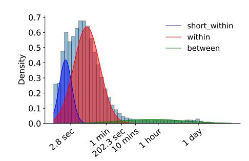
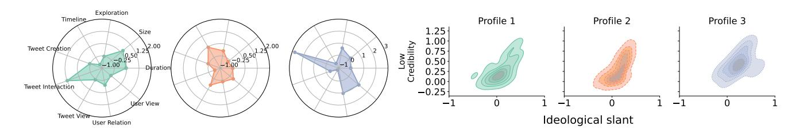

# Lurkers, Interactors, Creators: Modeling Behavioral and Ideological Diversity on X

Cai Yang National University of Singapore Singapore, Singapore cai.yang@u.nus.edu

Kokil Jaidka National University of Singapore Singapore, Singapore jaidka@nus.edu.sg

Yphtach Lelkes University of Pennsylvania Philadelphia, USA

Subhayan Mukerjee National University of Singapore Singapore, Singapore

## Abstract

User behavior on social media—from scrolling and viewing to liking, reposting, and posting—yet most research relies on self-reports that obscure fine-grained usage patterns. We analyze high-resolution activity logs from 209 U.S. X (Twitter) users tracked over four weeks to identify distinct behavioral profiles based on session-level features. Latent profile analysis reveals three groups—interactors (32.52%), lurkers (60.45%), and creators (7.03%) that differ in engagement intensity, demographics, and content exposure. Interactors and lurkers skew younger and Democratic, whereas creators skew older and more Republican, consuming more ideological and low-credibility content. These results link behavioral heterogeneity to systematically different information environments and suggest that platform interventions may operate unevenly across user types. Our findings demonstrate the value of log-based behavioral segmentation for understanding online participation and motivate profile-aware platform governance and content moderation strategies.

#### CCS Concepts

• Human-centered computing → Empirical studies in collaborative and social computing.

#### Keywords

Social media behavior, Latent profile analysis, Content consumption

#### ACM Reference Format:

Cai Yang, Kokil Jaidka, Yphtach Lelkes, and Subhayan Mukerjee . 2026. Lurkers, Interactors, Creators: Modeling Behavioral and Ideological Diversity on X. In Proceedings of the ACM Web Conference 2026 (WWW '26), April 13–17, 2026, Dubai, United Arab Emirates. ACM, New York, NY, USA, [4](#page-3-0) pages. <https://doi.org/10.1145/3774904.3792964>

## 1 Introduction

Social media use is highly heterogeneous: some users actively like, repost, and reply, while others mostly scroll and view. Existing research has linked such patterns to demographic and political characteristics, but most work relies on self-reported measures

[This work is licensed under a Creative Commons Attribution 4.0 International License.](https://creativecommons.org/licenses/by/4.0) WWW '26, Dubai, United Arab Emirates © 2026 Copyright held by the owner/author(s). ACM ISBN 979-8-4007-2307-0/2026/04 <https://doi.org/10.1145/3774904.3792964>

of social media use, which are often unreliable compared to digital trace data [\[10,](#page-3-1) [14\]](#page-3-2). As a result, many findings rest on noisy behavioral measurement and have limited behavioral validity.

Prior research suggests that exposure is shaped not by partisanship alone; it also depends on how people use the platform and on platform curation and recommendation [\[1,](#page-3-3) [3,](#page-3-4) [8,](#page-3-5) [17\]](#page-3-6). Measuring content ideology and credibility alongside behavioral profiles therefore helps characterize the information environments users inhabit and the materials they are most likely to engage with.

To address these gaps, we leveraged high-resolution digital trace data collected through a custom-built X client to examine how users behave and what they consume. Our work addresses three research questions:

- (1) RQ1: What distinct session-level usage profiles characterize X users?
- (2) RQ2: How do these profiles differ in their demographic characteristics and political orientations?
- (3) RQ3: How do these behavioral profiles differ in the ideological slant and credibility of the content consumption?

Using latent profile analysis, we identified distinct groups based on session-level activity patterns. We then linked these behavioral profiles to demographic composition and ideological and credibility characteristics of consumed content. Our findings revealed three interpretable profiles with systematic differences in engagement intensity, age, ideology, and exposure to ideological and lowcredibility content.

# 2 Related Work

A substantial body of research examines how social media use varies across demographic and political groups. Scott et al. [\[18\]](#page-3-7) show that highly engaged Facebook users are more likely to be White, collegeeducated, and female. Similar latent profile or clustering approaches have been applied to TikTok [\[4\]](#page-3-8) and other platforms [\[6\]](#page-3-9), typically using self-reported behavior rather than digital trace data.

However, self-reported metrics often diverge substantially from logged behavior [\[10,](#page-3-1) [14\]](#page-3-2). In practice, common survey items—minutes per day, days per week, or "how often do you post"—provide noisy proxies for the behavioral primitives that platform logs record directly and they are vulnerable to recall error, rounding, and social desirability. In contrast, we use fine-grained, time-stamped activity logs to characterize session dynamics, interaction patterns, and content views as the basis for profiling.

Table 1: Participant demographics (N=209).

| Variable                      | Category   |     | Count | (%)      |
|-------------------------------|------------|-----|-------|----------|
| Gender                        | Male       | [1] | 92    | (44.0%)  |
|                               | Female     | [2] | 112   | (53.6%)  |
|                               | Others     | [3] |       | 5 (2.4%) |
| Age 18–24                     | years      | [1] | 24    | (11.5%)  |
| 25–34                         | years      | [2] | 61    | (29.2%)  |
| 35–44                         | years      | [3] | 70    | (33.5%)  |
| 45–54                         | years      | [4] | 36    | (17.2%)  |
| 55–64                         | years      | [5] | 18    | (8.6%)   |
| 65+                           | years      | [6] |       | 0 (0.0%) |
| Education No formal education |            | [1] | 27    | (12.9%)  |
| High school                   | graduate   | [2] | 39    | (18.7%)  |
| Some                          | college    | [3] | 32    | (15.3%)  |
| Associate                     | degree     | [4] | 79    | (37.8%)  |
| Bachelor’s                    | degree     | [5] | 27    | (12.9%)  |
| Master’s or doctoral          | degree     | [6] |       | 5 (2.4%) |
| Household Income Less than    | \$20,000   | [1] | 16    | (7.7%)   |
| \$20,000–\$44,999             |            | [2] | 54    | (25.8%)  |
| \$45,000–\$139,999            |            | [3] | 104   | (49.8%)  |
| \$140,000–\$149,999           |            | [4] |       | 7 (3.3%) |
| \$150,000–\$199,999           |            | [5] | 18    | (8.6%)   |
| More than                     | \$200,000  | [6] | 10    | (4.8%)   |
| Political Ideology            | Democratic |     | 146   | (69.9%)  |
|                               | Republican |     | 63    | (30.1%)  |

Beyond usage patterns, a parallel literature has investigated selective exposure and the ideological structure of online information environments [\[15\]](#page-3-10). Findings from social media studies are mixed: some studies document substantial ideological segregation [\[1,](#page-3-3) [3,](#page-3-4) [11\]](#page-3-11), whereas others find comparatively modest ideological filtering [\[2,](#page-3-12) [5\]](#page-3-13). Yet, few studies integrate behavioral profiles with ideological and credibility characteristics of the content consumed. Combining latent behavioral profiles with measures of content ideology and credibility can better capture how user attributes, platform behavior, and exposure jointly structure online experiences.

#### 3 Methodology

Data collection. We built a custom X client to collect high-resolution, in-app behavioral logs and recruited 209 U.S. participants via Cloud Research for a four-week field deployment. Participants installed the client from the Play Store or App Store and were instructed to use it in place of the official X app during the study. Participants received \$25 in exchange for completing pre- and post-study surveys and meeting a minimum usage requirement of ten days.

The application passively recorded all interaction events with millisecond timestamps, enabling fine-grained reconstruction of session structure and timing. No personally identifying information was collected; the app stored only anonymized event data linked to randomly assigned participant IDs. Behavioral logs and survey responses resided on separate secure servers, and a one-way mapping key was held only by the research team member responsible for data management to prevent re-identification. The study was approved by the Institutional Review Boards of the National University of Singapore and the University of Pennsylvania, and conducted in accordance with relevant ethical and data-protection guidelines.

Session identification. Following Halfaker et al. [\[7\]](#page-3-14), Jones and Klinkner [\[9\]](#page-3-15), we define a session as a period of activity separated by sufficiently long idle gaps. To identify session boundaries, we fit a Gaussian Mixture Model (GMM) to the log-transformed interactivity gap distribution. The three-component model fit best, and

Figure 1: Log-transformed inter-activity duration histograms, represented as tri-modal clusters using Gaussian Mixture Models.

we set the session-break threshold at the intersection where the "within-session" and "between-session" components are equally likely, yielding a cutoff of 202s. Using this threshold, we identify 15,539 sessions from 209 users. Session duration has a mean of 269s and a median of 139s; participants produced a mean of 74 sessions (median 36).

Activity. The usage logs captured 35 activity types (e.g., timeline browsing, tweet viewing, liking). To reduce sparsity and improve robustness, we keep the 21 types observed in at least 10% of participants as separate categories and merge the rest into an "Other" class, yielding 22 event types for sequence modeling. For interpretability, we additionally group closely related events into higher-level activity families (e.g., "Timeline" aggregates browsing on the Home and Latest timelines), and use these grouped measures in subsequent analyses. For each session, we compute activity counts and total time per activity type.

Latent profile analysis. We modeled y�� = (����1, . . . , ������ ) ⊤ for person �� = 1, . . . , �� as a finite mixture of �� multivariate normal densities,

�� (y��) = ∑︁�� ��=1 ���� ���� y�� | ���� , �� , ���� &gt; 0, ∑︁�� ��=1 ���� = 1,

where ���� is the class (profile) prior, ���� ∈ R �� are class-specific means, and �� ∈ R ��×�� is the covariance matrix with equal variances and equal covariances.

Estimation was based on maximum likelihood using the expectation–maximization (EM) algorithm, which treats class membership as a latent variable and iteratively updates posterior class probabilities (E-step) and model parameters (M-step) until convergence. The individual posterior probability of class membership was calculated as

������ = Pr(���� = �� | y��) = ���� ���� y�� | ���� , �� Í�� ℎ=1 ��ℎ ���� y�� | ��ℎ , �� ,

We proceed with expected class sizes as ��b�� = �� ��=1 ������ and class proportions ��b�� = ��b�� /��.

Analysis plan.

We adopted a three-step analysis plan. For RQ1, we first built a latent profile model to measure participants' in-app usage using session-level features. We then assigned participants to profiles based on posterior class probabilities.

Table 2: Latent profile model fit statistics.

| Profile |   | AIC   |   | BIC   |   | SABIC |     | LogLik | Prob      | p-value | �� min |
|---------|---|-------|---|-------|---|-------|-----|--------|-----------|---------|--------|
| 1       | 3 | , 875 | 4 | , 056 | 3 | , 884 | − 1 | , 884  |           | – –     | 1.000  |
| 2       | 3 | , 832 | 4 | , 046 | 3 | , 844 | − 1 | , 852  | 0.97-0.98 | 0.010   | 0.498  |
| 3       | 3 | , 680 | 3 | , 927 | 3 | , 693 | − 1 | , 766  | 0.96-1.00 | 0.010   | 0.072  |
| 4       | 3 | , 576 | 3 | , 856 | 3 | , 590 | − 1 | , 704  | 0.96-1.00 | 0.010   | 0.038  |
| 5       | 3 | , 585 | 3 | , 900 | 3 | , 602 | − 1 | , 699  | 0.94-1.00 | 0.822   | 0.019  |

Profile indicators were constructed from session summaries, including the average session duration, size, and the average percentage of activity recorded within each session. Together, these measures captured how users allocated attention and effort across viewing, interacting, and creating during typical platform sessions.

For RQ2, we examined associations between the membership and demographic auxiliary variables (Table [1\)](#page-1-0) while accounting for classification uncertainty, and inspected the distribution of demographics within each profile.

For RQ3, we created auxiliary content variables measuring the ideological slant and the percentage of low-credibility content consumed by users. We considered a post to contain ideological content if it was posted or mentioned any political elites in a list sourced from Mukerjee et al. [\[13\]](#page-3-16), and used the estimated ideological score they provided as a proxy for the ideological slant of each post (higher values indicated more right-leaning content). To assess information quality, we matched account handles (authors and mentioned accounts) and the domains of shared URLs to sourcelevel credibility labels from Mosleh and Rand [\[12\]](#page-3-17), Robertson et al. [\[16\]](#page-3-18). In this manner, we assigned ideological scores to 107,420 out of 583,356 posts (18.41%). We identified 141,416 URLs embedded in posts assigned credibility labels, of which 30,336 (21.45%) were marked as low credibility (5.20% overall).

#### 4 Results and Discussion

Selecting profiles. Table [2](#page-2-0) presents model fit statistics for latent profile solutions with one to five classes. Fit was assessed using the Akaike Information Criterion (AIC), Bayesian Information Criterion (BIC), sample-size adjusted BIC (SABIC), log-likelihood, and bootstrapped likelihood ratio tests comparing models with �� versus ��!−!1 profiles. Model improvement was indicated by lower information criteria and significant test results.

We retained the three-profile solution for primary analyses because it yielded conceptually distinct and interpretable profiles of sufficient size, while the four-profile solution largely split an existing class and resulted in a small residual group.

RQ1. Behavioral profiles. Figure [2a](#page-3-19) shows the distribution of input features and Table [3](#page-2-1) reports summary statistics per profile. We observe an uneven profile size. Profile 2 is the largest group (60.45%), followed by Profile 1 (32.52%) and Profile 3 (7.03%).

We term the profile groups as interactors, lurkers, and creators. Profile 1 (32.52% of users) comprised interactors who have a high proportion of interactions with tweets, such as likes, bookmarks, and retweets. Their sessions were the longest (mean = 314 seconds) and largest (mean = 21 activities), with a high composition of tweet interactions (38.1% of session activities), with additional time spent viewing tweets (19.3%) and browsing the timeline (33.1

Table 3: Descriptive statistics for 3-profile LPA as mean (standard deviation). Auxiliary variables are compared post-hoc. ∗ : �� &lt; 0.01 using Omnibus Wald tests to assess between-profile mean differences. ��b: expected profile size based on posterior probability.

|                 |                     | Profile          | 1                 |                |           |            |          |
|-----------------|---------------------|------------------|-------------------|----------------|-----------|------------|----------|
|                 |                     | �� b = 68        | (32.52%)          |                |           |            |          |
|                 |                     |                  |                   | Profile        | 2         |            |          |
|                 |                     |                  |                   | �� b = 126     | (60.45%)  |            |          |
|                 |                     |                  |                   |                |           | Profile    | 3        |
|                 |                     |                  |                   |                |           | �� b = 15  | (7.03%)  |
|                 |                     | Meta-descriptors |                   | of behavior    |           |            |          |
| Duration        | (s)                 | 313.704          | (22.759)          | 193.463        | (15.791)  | 198.089    | (32.567) |
| Size            | (no. of activities) | 20.707           | (2.093)           | 10.255         | (1.535)   | 13.640     | (1.974)  |
|                 |                     | Ratios of        | activity to       | total activity |           |            |          |
| Exploration     |                     | 0.015            | (0.003)           | 0.028          | (0.003)   | 0.050      | (0.018)  |
| Timeline        |                     | 0.331            | (0.014)           | 0.571          | (0.016)   | 0.352      | (0.033)  |
| Tweet           | Creation            | 0.022            | (0.004)           | 0.022          | (0.002)   | 0.224      | (0.028)  |
| Tweet           | Interaction         | 0.381            | (0.014)           | 0.050          | (0.005)   | 0.102      | (0.028)  |
| Tweet           | View                | 0.193            | (0.011)           | 0.248          | (0.013)   | 0.102      | (0.019)  |
| User            | Relation            | 0.004            | (0.001)           | 0.002          | (0.000)   | 0.013      | (0.006)  |
| User            | View                | 0.053            | (0.005)           | 0.076          | (0.006)   | 0.155      | (0.031)  |
|                 | Auxiliary           | demographics     | variables         | (mode          | class)    |            |          |
| Age             | ∗                   |                  |                   |                |           |            |          |
|                 |                     |                  | 25-34             |                | 35-44     |            | 35-44    |
| Gender          |                     |                  | Male              |                | Male      |            | Male     |
| Income          |                     |                  |                   | \$45,000       | \$139,999 |            |          |
| Education       |                     |                  |                   | Associate      | degree    |            |          |
| Ideology        | ∗                   | Democrat         | (84.80%)          | Democrat       | (64.37%)  | Republican | (52.68%) |
|                 |                     | Auxiliary        | content variables | (posthoc)      |           |            |          |
| Partisan        | ∗                   |                  |                   |                |           |            |          |
|                 |                     | 0.076            | (0.022)           | 0.128          | (0.015)   | 0.231      | (0.047)  |
| Low-credibility | ∗                   |                  |                   |                |           |            |          |
|                 |                     | 0.233            | (0.027)           | 0.293          | (0.023)   | 0.441      | (0.054)  |

Profile 2 (60.45% of users) comprised lurkers. They have shorter session duration (193 seconds) and session size (10 activities) with the highest timeline visits (57.1%) and tweet views (24.8%), but very low tweet interaction (5.0%) and creation (2.2%).

Users from Profile 3 were post creators (7.2%). They exhibited an order-of-magnitude higher creation rate (22.4% of session activities vs. 2.2% in other profiles). Creators spent less of their activity on their Home timeline (10.2%), but recorded the highest views per individual user's timeline (15.5%). Overall, their timeline consumption (35.2%) was lower than Profile 2. Next, we contrasted behavioral patterns across profiles and examined differences in demographics and content exposure.

RQ2. Demographic characteristics. Table [3](#page-2-1) displays the demographic composition for each profile. Age differed substantially across profiles (mode age category 25–34, 35–44, and 35–44 years old for Profiles 1–3, respectively). Unlike Scott et al. [\[18\]](#page-3-7), who demonstrated an association between gender, race, and education with social media use, we found no statistical difference between these attributes. Users had different partisanship across profiles: Profile 1 skews Democratic (84.5%), Profile 2 is more mixed with a lower Democratic ratio (64.6%), and Profile 3 has a higher Republican ratio (52.7%), although comprised very few members (N = 15, Table 3). Taken together, there are more younger Democrats in Profile 1, while more older Republicans are in Profile 3.

RQ3. Content consumption. Users across profiles differed in the ideological slant and credibility of the content they consume. The mean ideological slant of consumed content increases across profiles, from 0.076 (on a -1 to 1 scale) in Profile 1 to 0.128 in Profile 2 and 0.231 in Profile 3, mirroring the shift in profile composition from predominantly Democratic to more Republican users and consistent with increasingly like-minded consumption. Similarly, exposure to low-credibility content rises from 23.3% in Profile 1

Figure 2: (a) Input feature composition for each profile. Feature values are z-score normalized. (b) Density plot of low credibility ratio (y-axis) and ideological slant of content consumed (x-axis).

to 29.3% in Profile 2 and 44.1% in Profile 3, suggesting a potential relationship with each profile's underlying partisan composition.

Figure [2b](#page-3-19) visualizes the ideological slant of consumed content against the ratio of low-credibility consumption, stratified by profile. We observe moderate positive correlations between ideological slant and low-credibility consumption within each profile (Profile 1: �� = 0.67, �� &lt; 0.001; Profile 2: �� = 0.66, �� &lt; 0.001; Profile 3: �� = 0.52, �� &lt; 0.05), indicating that more ideologically-slanted consumption is associated with a higher proportion of low-credibility content. Further comparisons of exposures across profiles indicated that Republican users in our dataset were more likely to consume low-credibility content than Democratic users (Profiles 1–3: Republicans 60.2% vs. Democrats 16.3%; 46.9% vs. 19.4%; 53.5% vs. 31.6%, all Welch's ��-tests: �� &lt; 0.001). These findings corroborate recent work on the asymmetric ideological segregation of misinformation exposure on Facebook leading up to the 2020 elections in the US [\[3\]](#page-3-4).

## 5 Conclusion and Future Work

This paper used latent profile analysis on activity logs from a fourweek field experiment to identify three distinct profiles. Understanding these behaviorally anchored profiles offers a structured way to reason about heterogeneity in platform effects. They also highlight why interventions, such as accuracy prompts, warning labels, or curated feeds, may operate unevenly across user groups, as profiles differ in behavior patterns and content exposure, therefore producing different responses to such interventions. Profile-tailored strategies may therefore be more appropriate when designing interventions aimed at reshaping information consumption.

Our findings highlight that interactors and lurkers were disproportionately younger Democrats, whereas creators comprised a smaller group that skewed older and more Republican. Republican users exhibited higher exposure to ideological and low-credibility content. However, these patterns are not based on a representative sample; for instance, Republicans constituted 30.1% of our sample. While they constituted the majority of the Creator profile, these only comprised 7.1% of the total number of participants. Furthermore, our content analysis relies on external ideological slants and source credibility that offer incomplete coverage of users' feeds.

Future work should validate these profiles in larger and more diverse samples. Integrating longitudinal and causal designs may further clarify how people move between profiles over time, and how these shifts relate to partisanship, platform engagement, and information exposure.

#### Acknowledgments

This work was supported by the Singapore Ministry of Education AcRF TIER 3 Grant (MOET32022-0001), Tier 1 programme (WBS A-8000231-01-00), and A∗STAR OTS Grant (A-8003288-00-00). We're grateful to feedback from CIND at the Annenberg School for Communication, University of Pennsylvania, and the iGyro symposium attendees at CTIC, National University of Singapore.

#### References

[1] Eytan Bakshy, Solomon Messing, and Lada A Adamic. 2015. Exposure to ideologically diverse news and opinion on Facebook. Science 348, 6239 (2015), 1130–1132. [2] Seth Flaxman, Sharad Goel, and Justin Rao. 2016. Filter bubbles, echo chambers, and online news consumption. Public Opinion Quarterly 80, S1 (2016), 298–320. [3] Sandra González-Bailón, David Lazer, Pablo Barberá, Meiqing Zhang, Hunt Allcott, Taylor Brown, Adriana Crespo-Tenorio, Deen Freelon, Matthew Gentzkow, Andrew M Guess, et al. 2023. Asymmetric ideological segregation in exposure to political news on Facebook. Science 381, 6656 (2023), 392–398. [4] Li Gu, Xun Gao, and Yong Li. 2022. What drives me to use TikTok: A latent profile analysis of users' motives. Frontiers in psychology 13 (2022), 992824. [5] Andrew M Guess, Neil Malhotra, Jennifer Pan, Pablo Barberá, Hunt Allcott, Taylor Brown, Adriana Crespo-Tenorio, Drew Dimmery, Deen Freelon, Matthew Gentzkow, et al. 2023. Reshares on social media amplify political news but do not detectably affect beliefs or opinions. Science 381, 6656 (2023), 404–408. [6] Nikita Halaris, Brian Hunt, Vasileios Stavropoulos, Leila Karimi, and Daniel Zarate. 2025. Motivational profiles in problematic social media use: A latent profile analysis. Current Psychology 44, 10 (2025), 8781–8793. [7] Aaron Halfaker, Os Keyes, Daniel Kluver, Jacob Thebault-Spieker, Tien Nguyen, Kate Grandprey-Shores, Anuradha Uduwage, and Morten Warncke-Wang. 2015. User Session Identification Based on Strong Regularities in Inter-activity Time (WWW'15). 410–418. [8] Kokil Jaidka, Subhayan Mukerjee, and Yphtach Lelkes. 2023. Silenced on social media: the gatekeeping functions of shadowbans in the American Twitterverse. Journal of Communication 73, 2 (2023), 163–178. [9] Rosie Jones and Kristina Lisa Klinkner. 2008. Beyond the session timeout: automatic hierarchical segmentation of search topics in query logs. In Proceedings of the 17th ACM conference on Information and knowledge management. 699–708. [10] Reynol Junco. 2013. Comparing actual and self-reported measures of Facebook use. Computers in human behavior 29, 3 (2013), 626–631. [11] Cameron Martel, Mohsen Mosleh, Qinqing Yang, Tauhid Zaman, and David G. Rand. 2024. Blocking of counter-partisan accounts drives political assortment on Twitter. PNAS Nexus 3, 5 (2024), pgae161. [12] Mohsen Mosleh and David G Rand. 2022. Measuring exposure to misinformation from political elites on Twitter. Nature Communications 13, 1 (2022), 7144. [13] Subhayan Mukerjee, Kokil Jaidka, and Yphtach Lelkes. 2022. The political landscape of the US Twitterverse. Political Communication 39, 5 (2022), 565–588. [14] Douglas A Parry, Brittany I Davidson, Craig JR Sewall, Jacob T Fisher, Hannah Mieczkowski, and Daniel S Quintana. 2021. A systematic review and metaanalysis of discrepancies between logged and self-reported digital media use. Nature Human Behaviour 5, 11 (2021), 1535–1547. [15] Markus Prior. 2013. Media and political polarization. Annual review of political science 16, 1 (2013), 101–127. [16] Ronald E Robertson, Shan Jiang, Kenneth Joseph, Lisa Friedland, David Lazer, and Christo Wilson. 2018. Auditing partisan audience bias within google search. Proceedings of the ACM on Human-Computer Interaction 2, CSCW (2018), 1–22. [17] Fernando P Santos, Yphtach Lelkes, and Simon A Levin. 2021. Link recommendation algorithms and dynamics of polarization in online social networks. Proceedings of the National Academy of Sciences 118, 50 (2021), e2102141118. [18] Carol F Scott, Laina Y Bay-Cheng, Mark A Prince, Thomas H Nochajski, and R Lorraine Collins. 2017. Time spent online: Latent profile analyses of emerging adults' social media use. Computers in Human Behavior 75 (2017), 311–319.