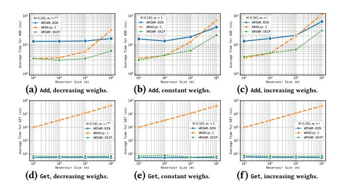
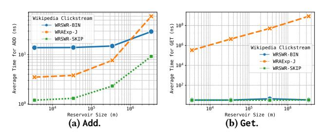

# Weighted Reservoir Sampling With Replacement from Data Streams

Adriano Meligrana∗ Sapienza University of Rome Rome, Italy adriano.meligrana@diag.uniroma1.it

Adriano Fazzone Intesa Sanpaolo Innovation Center Turin, Italy adriano.fazzone@intesasanpaolo.com

### Abstract

In this work, we present a new random sampling method for data streams where the probability of an element's inclusion in the sample is proportional to a weight associated with that element. Our method is based on sampling with replacement, although most of the literature on this topic has focused on sampling without replacement.

Our algorithm generates a weighted random sample in one pass over a population of unknown size. At any point in time, the sample is representative of the population seen so far and can be directly used by other modules without requiring any post-processing. We formally prove the correctness and efficiency of our method.

An experimental analysis shows the performance of our method in practice when compared to state-of-the-art methods.

### Keywords

Reservoir Sampling, Random Sampling, Weighted Sampling, Data Streams

# 1 Introduction

One fundamental problem in several computing fields, including databases and data mining, is the efficient summarization of massive datasets and data streams [\[4,](#page-3-0) [9\]](#page-3-1). Random sampling serves as an essential tool in this environment, effectively reducing large volumes of data to a manageable subset while preserving essential statistical properties [\[3,](#page-3-2) [12\]](#page-3-3). This problem is particularly important in the streaming setting, where data arrive sequentially at a high rate and the total population size is often unknown.

The classical approach for sampling from unknown-sized populations is reservoir sampling [\[10,](#page-3-4) [11,](#page-3-5) [13\]](#page-3-6). Extensions of this model to weighted streams have largely concentrated on selection without replacement, where selected elements must be distinct [\[5\]](#page-3-7). This has led to significant work on efficient, one-pass algorithms for weighted reservoir sampling without replacement (WRSWOR) [\[1,](#page-3-8) [5,](#page-3-7) [7\]](#page-3-9).

However, there are important applications where reservoir sampling with replacement (RSWR) is necessary or strongly preferred, particularly for statistical estimation tasks that rely on the independence of sampled elements [\[10\]](#page-3-4), a property that samples without replacement do not possess. While a sample without replacement can be transformed to satisfy this independence requirement, doing so incurs additional computational costs that direct RSWR avoids. Weighted reservoir sampling with replacement (WRSWR) is essential when uniform selection is inadequate, enabling sophisticated algorithms such as the weighted bootstrap and approximate query

processing in the streaming setting [\[3,](#page-3-2) [8,](#page-3-10) [10,](#page-3-4) [12\]](#page-3-3). While conceptual reductions from weighted to unweighted RSWR have been noted (e.g., duplicating an element �� times [\[7\]](#page-3-9)), the literature remains heavily focused on the without-replacement case [\[1,](#page-3-8) [5,](#page-3-7) [7\]](#page-3-9). Our work addresses this relative scarcity of specialized methods by presenting a novel and efficient approach focused on sampling with replacement.

This paper introduces a WRSWR method designed specifically for data streams. Our algorithm generates a weighted random sample in one pass over a population of unknown size. A critical feature of this algorithm is that at any point in time, the sample is representative of the population seen thus far, allowing it to be used immediately by other modules without requiring any post-processing.

# 2 Related Work

Weighted reservoir sampling with replacement was addressed in the pioneering work of Chaudhuri et al. [\[3\]](#page-3-2). The authors presented an algorithm that uses Bernoulli trials to continuously maintain a weighted reservoir sample of the stream; we refer to this algorithm as WRSWR throughout this paper.

We also define WRSWR-BIN as the improvement to WRSWR, first described in Park et al. [\[10\]](#page-3-4), which substitutes the series of Bernoulli trials with a single Binomial experiment. As we show in Section [4,](#page-2-0) this optimization makes the method practical to use.

However, these algorithms do not implement any weight skipping techniques [\[5,](#page-3-7) [10,](#page-3-4) [13\]](#page-3-6), making their performance suboptimal. A key contribution of our work is the correct adaptation of this technique for the weighted case.

Shekelyan et al. [\[12\]](#page-3-3) presented an online multinomial sampler algorithm based on an adaptation of the sampling technique from Efraimidis and Spirakis [\[5\]](#page-3-7). We refer to this algorithm as WRAExp-J throughout this paper.

However, this method requires transforming a weighted sample without replacement into a weighted sample with replacement when retrieving the reservoir, a weakness that our algorithm avoids.

To the best of our knowledge, there are no other methods that directly address the weighted reservoir sampling with replacement problem.

# 3 Our Method

We first define the notation used in this paper. Let �� be a stream of items, where each item ���� = (����,���� ) for �� ∈ Z≥1 is a pair consisting of a stream element ���� and its corresponding weight ���� ∈ R>0. We denote the reservoir as ℛ, a data structure of fixed size�� that stores stream elements in positions indexed from 1 to ��.

Our contribution is WRSWR-SKIP , a weighted reservoir sampling with replacement algorithm, which we present in Algorithm [1.](#page-1-0)

∗Corresponding author.

Figure 2: Average time (ns) over 100 executions for **Add** (left) and **Get** (right) operations vs. reservoir size (��). Stream of 34M items from Wikipedia Clickstream dataset.

across all three weight distributions. While WRSWR-SKIP has an execution time comparable to WRAExp-J (dashed line) for small ��, its cost scales more slowly as �� increases. The execution time of WRAExp-J increases significantly with��, eventually surpassing that of WRSWR-BIN (solid line) at the largest reservoir size (�� = 10%��). Furthermore, WRSWR-BIN consistently exhibits higher execution times than WRSWR-SKIP across all tested reservoir sizes. The add performance gap between WRSWR-SKIP and WRAExp-J can be attributed to update complexity. WRSWR-SKIP uses constant-time array updates, whereas WRAExp-J requires a priority queue. The resulting ��(log��) update cost contributes to widen the gap as �� increases.

Figures [1d, 1e,](#page-2-4) and [1f](#page-2-4) show the results for the get operation, which highlight a clear distinction in algorithmic complexity. WRSWR-SKIP and WRSWR-BIN show nearly identical, constant-time performance, with execution times remaining flat regardless of reservoir size. This indicates an ��(1) retrieval, consistent with the theory. WRAExp-J, however, shows a clear linear increase in get time relative to ��, which is consistent with its ��(��) retrieval complexity.

Experiments on the Wikipedia Clickstream data. Figure [2](#page-3-14) shows the algorithms' performances on the real-world Wikipedia Clickstream dataset, which contains 34 million items[3](#page-3-15) . In this stream, the item element is the title of the requested Wikipedia article, and the weight is the number of clicks from another Wikipedia page or HTML page class[4](#page-3-16) . As shown in Figure [2a,](#page-3-14) WRSWR-SKIP (dotted line) maintains the lowest execution time for the add operation. WRSWR-BIN (solid line) exhibits the highest cost for most of the range, but its execution time scales better than that of WRAExp-J (dashed line). WRAExp-J shows a steep increase in cost, becoming the least performant at the largest reservoir size. As seen in Figure [2b,](#page-3-14) the get performance on real-world data confirms the previous findings. WRSWR-SKIP and WRSWR-BIN deliver constant ��(1) retrieval, while the cost for WRAExp-J scales linearly with the reservoir size.

# 5 Conclusion

In this paper, we introduce WRSWR-SKIP, a novel one-pass algorithm for weighted sampling with replacement from data streams of unknown population size. We formally prove the correctness of WRSWR-SKIP and analyze its efficiency, showing that the reservoir update operation generates �� (�� log ���� ��1 ) random variates in expectation. Furthermore, WRSWR-SKIP performs sample extraction

optimally in ��(1) time, as its reservoir is continuously maintained as an unbiased sample and requires no post-processing. Experimental results from both synthetic and real-world datasets consistently demonstrate that WRSWR-SKIP outperforms the baselines.

WRSWR-SKIP provides an efficient and theoretically sound solution for weighted reservoir sampling with replacement, making it highly suitable for streaming applications where both fast processing and immediate sample retrieval are critical.

# References

- [1] V. Braverman, R. Ostrovsky, and G. Vorsanger. 2015. Weighted sampling without replacement from data streams. Inform. Process. Lett. 115, 12 (2015), 923–926. [doi:10.1016/j.ipl.2015.07.007](https://doi.org/10.1016/j.ipl.2015.07.007) [2] M. T. Chao. 1982. A general purpose unequal probability sampling plan. Biometrika 69, 3 (12 1982), 653–656. [doi:10.1093/biomet/69.3.653](https://doi.org/10.1093/biomet/69.3.653) [3] S. Chaudhuri, R. Motwani, and V. Narasayya. 1999. On random sampling over joins. ACM SIGMOD Record 28, 2 (1999), 263–274. [4] G. Cormode and K. Yi. 2020. Small summaries for big data. Cambridge University Press. [5] P. S. Efraimidis and P. G. Spirakis. 2006. Weighted random sampling with a reservoir. Inform. Process. Lett. 97, 5 (2006), 181–185. [doi:10.1016/j.ipl.2005.11.003](https://doi.org/10.1016/j.ipl.2005.11.003) [6] L. O. Hafner and Meligrana A. 2025. An Exact and Efficient Sampler for Dynamic Discrete Distributions. arXiv[:2506.14062 \cs.DS]<https://arxiv.org/abs/2506.14062> [7] R. Jayaram, G. Sharma, S. Tirthapura, and D. P. Woodruff. 2019. Weighted Reservoir Sampling from Distributed Streams. In Proceedings of the 38th ACM SIGMOD-SIGACT-SIGAI Symposium on Principles of Database Systems (PODS '19). Association for Computing Machinery, 218–235. [doi:10.1145/3294052.3319696](https://doi.org/10.1145/3294052.3319696) [8] I. Kojadinovic and J. Yan. 2012. Goodness-of-fit testing based on a weighted bootstrap: A fast large-sample alternative to the parametric bootstrap. Canadian Journal of Statistics 40, 3 (2012), 480–500. [9] S. Muthukrishnan. 2005. Data streams: Algorithms and applications. Foundations and Trends in Theoretical Computer Science 1, 2 (2005), 117–236. [10] B. H. Park, G. Ostrouchov, and N. F. Samatova. 2007. Sampling streaming data with replacement. Computational Statistics & Data Analysis 52, 2 (2007), 750–762. [doi:10.1016/j.csda.2007.03.010](https://doi.org/10.1016/j.csda.2007.03.010) [11] B. H. Park, G. Ostrouchov, N. F. Samatova, and A. Geist. 2004. Reservoir-based Random Sampling with Replacement from Data Stream. In Proceedings of the 2004 SIAM International Conference on Data Mining (SDM). , , 492–496. [doi:10.](https://doi.org/10.1137/1.9781611972740.53) [1137/1.9781611972740.53](https://doi.org/10.1137/1.9781611972740.53) [12] M. Shekelyan, G. Cormode, Q. Ma, A. M. Shanghooshabad, and P. Triantafillou. 2023. Streaming weighted sampling over join queries, In . Proceedings 26th International Conference on Extending Database Technology (EDBT 2023) 26, 298–
- 310. [doi:10.48786/edbt.2023.24](https://doi.org/10.48786/edbt.2023.24) [13] J. S. Vitter. 1985. Random sampling with a reservoir. ACM Transactions on Mathematical Software (TOMS) 11, 1 (1985), 37–57. [14] F. Zhang, M. Jiang, and S. Wang. 2023. Efficient dynamic weighted set sampling and its extension. Proceedings of the VLDB Endowment 17, 1 (2023), 15–27.

3December 2024, English Wikipedia pages: [https://dumps.wikimedia.org/other/](https://dumps.wikimedia.org/other/clickstream/2024-12/clickstream-enwiki-2024-12.tsv.gz) [clickstream/2024-12/clickstream-enwiki-2024-12.tsv.gz](https://dumps.wikimedia.org/other/clickstream/2024-12/clickstream-enwiki-2024-12.tsv.gz)

[https://meta.wikimedia.org/wiki/Research:Wikipedia\\_clickstream](https://meta.wikimedia.org/wiki/Research:Wikipedia_clickstream)