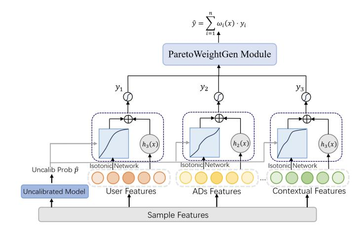

# Multi-field Balance-aware Calibration of Predictions in Online Advertising

Zi-Kang Wang wangzk@lamda.nju.edu.cn School of Intelligence Science and Technology, Nanjing University Nanjing, China

Lei Gong gonglei46@huawei.com Huawei Technologies (China) Nanjing, China

Shu-Ting Shi shishuting2@huawei.com Huawei Technologies (China) Nanjing, China

Lan-Zhe Guo guolz@lamda.nju.edu.cn School of Intelligence Science and Technology, Nanjing University Nanjing, China

Mu-Yu Zhang∗ zhangmuyu@huawei.com Huawei Technologies (China) Shenzhen, China

## Abstract

Online advertising platforms serve as a critical bridge between advertisers and media, requiring precise prediction of user behaviors. Systematic underestimation or overestimation in these predictions can undermine the interests of both parties. Existing calibration methods fall short in addressing two key challenges. First, significant differences in CVR distributions across various targets lead to biased calibration when using global posterior statistics, causing some sample groups to be overestimated while others are underestimated. Second, current field-aware approaches are typically limited to single-field calibration and fail to account for field sensitivity. To overcome these limitations, we propose a Pareto Frontier-based Multi-field Personalized Calibration (PF-MPC) method which formulates multi-field calibration as a multi-objective optimization problem. PF-MPC identifies the optimal Pareto-efficient weight combinations to balance the conflicting calibration errors across different fields. We evaluate PF-MPC on both public calibration benchmark and a large-scale industrial dataset. Experimental results demonstrate that our method achieves significant improvements in calibration performance compared to existing approaches.

### CCS Concepts

### • Information systems → Computational advertising.

# Keywords

Multi-field Calibration, Uncertainty calibration, Multi-objective Optimization, Online Advertising

### ACM Reference Format:

Zi-Kang Wang, Lei Gong, Shu-Ting Shi, Lan-Zhe Guo, and Mu-Yu Zhang. 2026. Multi-field Balance-aware Calibration of Predictions in Online Advertising . In Proceedings of the ACM Web Conference 2026 (WWW '26), April

∗Corresponding Author

© 2026 Copyright held by the owner/author(s). ACM ISBN 979-8-4007-2307-0/2026/04 <https://doi.org/10.1145/3774904.3792967>

13–17, 2026, Dubai, United Arab Emirates. ACM, New York, NY, USA, [4](#page-3-0) pages. <https://doi.org/10.1145/3774904.3792967>

# 1 Introduction

In the ranking stage of online advertising systems, it is critical to ensure not only the relative ordering accuracy of items but also the numerical reliability of the predicted probabilities [\[2,](#page-3-1) [4\]](#page-3-2). Under the application of optimized Cost-Per-X (oCPX) advertising, the predicted click-through rate (CTR) and conversion rate (CVR) for each impression directly determine accuracy and stability of bidding. From the platform's perspective, prediction accuracy further influences both advertiser settlements and platform revenue. Specifically, consistent overestimation prevents advertisers from acquiring the expected volume of valuable traffic, undermining their trust in the platform. Conversely, persistent underestimation leads to undervalued transactions and reduced platform and media earnings.

Model calibration is a classic machine learning task that eliminates the discrepancy between predicted probabilities and true probabilities [\[5,](#page-3-3) [13\]](#page-3-4). As a post-processing step in online advertising, it corrects the output of the ranking model by leveraging collected posterior data [\[2\]](#page-3-1). This process ensures that the predicted values constitute a faithful reflection of the observed empirical probabilities. The resulting calibrated estimates are then employed in subsequent ranking and bidding stages.

However, classical calibration methods such as Platt Scaling [\[8\]](#page-3-5) and Histogram Binning [\[12\]](#page-3-6) are often inadequate for real-world advertising systems. This is primarily due to their reliance on strong assumptions and failure to model complex, non-stationary online distributions. More recent field-aware calibration methods, such as NeuralCalib [\[7\]](#page-3-7), AdaCalib [\[10\]](#page-3-8), and DESC [\[11\]](#page-3-9), aim to address distribution shifts by incorporating domain information into the calibration process. These approaches typically employ neural networks to adaptively learn the parameters of transformation functions, thereby tailoring the calibration for samples with different feature characteristics.

Despite these advancements, two fundamental limitations persist. First, these deep methods still rely heavily on global posterior statistics. While the overall calibration metrics may be optimized, systematic biases emerge at the local sample level: predictions

[This work is licensed under a Creative Commons Attribution 4.0 International License.](https://creativecommons.org/licenses/by/4.0) WWW '26, Dubai, United Arab Emirates

Table 1: Performance comparison on calibration metrics (lower is better) and AUC (higher is better). All values are reported on the test set of the AliCCP dataset and industrial OCPX conversion dataset.

| Method       | AUC    | PCOC   | CTR ECE | Task(public MFECE | data) FRCE | MFRCE  | AUC    | PCOC   | CVR ECE | Task(industrial MFECE | data) FRCE | MFRCE  |
|--------------|--------|--------|---------|-------------------|------------|--------|--------|--------|---------|-----------------------|------------|--------|
| Uncalib      | 0.6348 | 1.6097 | 0.0202  | 0.0230            | 1.4869     | 0.7327 | 0.9312 | 1.1615 | 0.2133  | 0.4351                | 0.3673     | 0.3341 |
| HistoBin     | 0.5241 | 1.2282 | 0.0076  | 0.0118            | 1.2110     | 0.3909 | 0.8712 | 0.9573 | 0.1190  | 0.3276                | 0.2950     | 0.2212 |
| IsoReg       | 0.6348 | 1.2352 | 0.0078  | 0.0117            | 1.0170     | 0.3557 | 0.9312 | 1.1214 | 0.1115  | 0.3465                | 0.2841     | 0.2123 |
| PlattScaling | 0.6348 | 1.2355 | 0.0078  | 0.0117            | 1.0180     | 0.3561 | 0.9252 | 1.1145 | 0.0823  | 0.3414                | 0.2947     | 0.2134 |
| SIR          | 0.6347 | 1.2457 | 0.0083  | 0.0120            | 1.0869     | 0.3776 | 0.9312 | 1.1023 | 0.0651  | 0.3314                | 0.2812     | 0.1912 |
| NeuralCalib  | 0.6357 | 1.2094 | 0.0070  | 0.0109            | 0.9906     | 0.3316 | 0.9342 | 1.0512 | 0.0368  | 0.1031                | 0.1434     | 0.1334 |
| DESC         | 0.6352 | 1.2187 | 0.0073  | 0.0112            | 1.0018     | 0.3404 | 0.9336 | 1.0410 | 0.0312  | 0.0814                | 0.1528     | 0.0841 |
| UMC          | 0.6358 | 1.1711 | 0.0057  | 0.0098            | 0.9496     | 0.2942 | 0.9348 | 1.0501 | 0.0212  | 0.1041                | 0.1423     | 0.1134 |
| PF-MPC       | 0.6349 | 1.1032 | 0.0051  | 0.0084            | 0.8648     | 0.2270 | 0.9303 | 1.0261 | 0.0089  | 0.0312                | 0.1237     | 0.0613 |

and test sets. The industrial dataset comprises over 400 million anonymized samples from 7 days of advertising logs.

4.1.2 baseline. We compare our proposed method with a range of baselines to demonstrate its superiority in multi-field calibration. The uncalibrated baseline directly uses the raw prediction scores from the base model without any calibration. Histogram Binning [\[12\]](#page-3-6) works by grouping predictions into bins and assigning the empirical accuracy of each bin as the calibrated probability; Platt Scaling [\[8\]](#page-3-5) is a parametric approach that assumes a logistic distribution; SIR [\[2\]](#page-3-1) introduces a linear interpolation strategy on top of IR to enhance calibration smoothness; NeuralCalib [\[7\]](#page-3-7) combines a simple piece-wise linear model with a field-aware auxiliary neural network; DESC [\[11\]](#page-3-9) leverages deep ensembles for scaling; and UMC [\[1\]](#page-3-10) utilizes monotonic networks to learn infinitely smooth order-preserving functions for calibration.

4.1.3 Implementation Details. All calibration methods (including ours) are trained for exactly 1 epoch on the training set, with the base model completely frozen. Hyper-parameters are tuned on the development set and reported on the test set. For FRCE computation, the distinctive field is designated as '101' in the AliCCP dataset, consistent with prior methods for fair comparison.

### 4.2 Performance Comparison

As shown in Table [1,](#page-3-14) our PF-MPC method achieves state-of-the-art calibration performance on both the public AliCCP and industrial datasets. It significantly outperforms all baselines on field-aware metrics (MF-ECE, MF-RCE) and also leads on classic calibration metrics (ECE, PCOC). However, as its primary focus is calibration, it achieves competitive but not leading AUC.

### 5 Conclusion

This paper proposes a multi-field calibration framework named PF-MPC for calibrating online advertising predictions. The method leverages basic isotonic calibrators for intra-field calibration and Pareto front optimization to ensure balanced peformance across defined domains. Empirical evaluation on two industrial datasets demonstrated that PF-MPC achieves state-of-the-art calibration performance. Future work will focus on enhancing its isotonicitypreserving capability and extending the framework to online environment.

### References

[1] Yimeng Bai, Shunyu Zhang, Yang Zhang, Hu Liu, Wentian Bao, Enyun Yu, Fuli Feng, and Wenwu Ou. 2025. Unconstrained Monotonic Calibration of Predictions in Deep Ranking Systems. In Proceedings of the 48th International ACM SIGIR Conference on Research and Development in Information Retrieval (SIGIR '25). Association for Computing Machinery. [2] Chao Deng, Hao Wang, Qing Tan, Jian Xu, and Kun Gai. 2021. Calibrating User Response Predictions in Online Advertising. In Machine Learning and Knowledge Discovery in Databases: Applied Data Science Track. Springer International Publishing. [3] Ziyu Guan and Hongchang Wu et al. 2021. Multi-Agent Cooperative Bidding Games for Multi-Objective Optimization in e-Commercial Sponsored Search. In Proceedings of the 27th ACM SIGKDD Conference on Knowledge Discovery & Data Mining. [4] Siguang Huang, Yunli Wang, Lili Mou, Huayue Zhang, Han Zhu, Chuan Yu, and Bo Zheng. 2022. MBCT: Tree-Based Feature-Aware Binning for Individual Uncertainty Calibration. In The Web Conference 2022 (WWW '22),. [5] Ananya Kumar, Percy S Liang, and Tengyu Ma. 2019. Verified Uncertainty Calibration. In Advances in Neural Information Processing Systems, Vol. 32. Curran Associates, Inc. [6] Xiao Ma and Liqin Zhao et al. 2018. Entire Space Multi-Task Model: An Effective Approach for Estimating Post-Click Conversion Rate. In The 41st International ACM SIGIR Conference. [7] Feiyang Pan, Xiang Ao, Pingzhong Tang, Min Lu, Dapeng Liu, Lei Xiao, and Qing He. 2020. Field-aware Calibration: A Simple and Empirically Strong Method for Reliable Probabilistic Predictions. In The Web Conference 2020 (WWW '20),. [8] John C. Platt. 2000. Probabilistic Outputs for Support Vector Machines and Comparisons to Regularized Likelihood Methods. Advances in Large Margin Classifiers (2000). [9] Antoine Wehenkel and Gilles Louppe. 2019. Unconstrained Monotonic Neural Networks. In Advances in Neural Information Processing Systems 32, Volume 2 of 20: 32nd Conference on Neural Information Processing Systems (NeurIPS 2019).Vancouver(CA).8-14 December 2019. [10] Penghui Wei, Weimin Zhang, Ruijie Hou, Jinquan Liu, Shaoguo Liu, Liang Wang, and Bo Zheng. 2022. Posterior Probability Matters: Doubly-Adaptive Calibration for Neural Predictions in Online Advertising. In Proceedings of the 45th International ACM SIGIR Conference on Research and Development in Information Retrieval. [11] Shuai Yang, Hao Yang, Zhuang Zou, Linhe Xu, Shuo Yuan, and Yifan Zeng. 2024. Deep Ensemble Shape Calibration: Multi-Field Post-hoc Calibration in Online Advertising. In Proceedings of the 30th ACM SIGKDD Conference on Knowledge Discovery and Data Mining. [12] Bianca Zadrozny and Charles Elkan. 2001. Obtaining Calibrated Probability Estimates from Decision Trees and Naive Bayesian Classifiers. In International Conference on Machine Learning. [13] Yuang Zhao, Chuhan Wu, Qinglin Jia, Hong Zhu, Jia Yan, Libin Zong, Linxuan Zhang, Zhenhua Dong, and Muyu Zhang. 2024. Confidence-Aware Multi-Field Model Calibration. In Proceedings of the 33rd ACM International Conference on Information and Knowledge Management (CIKM '24). Association for Computing Machinery.