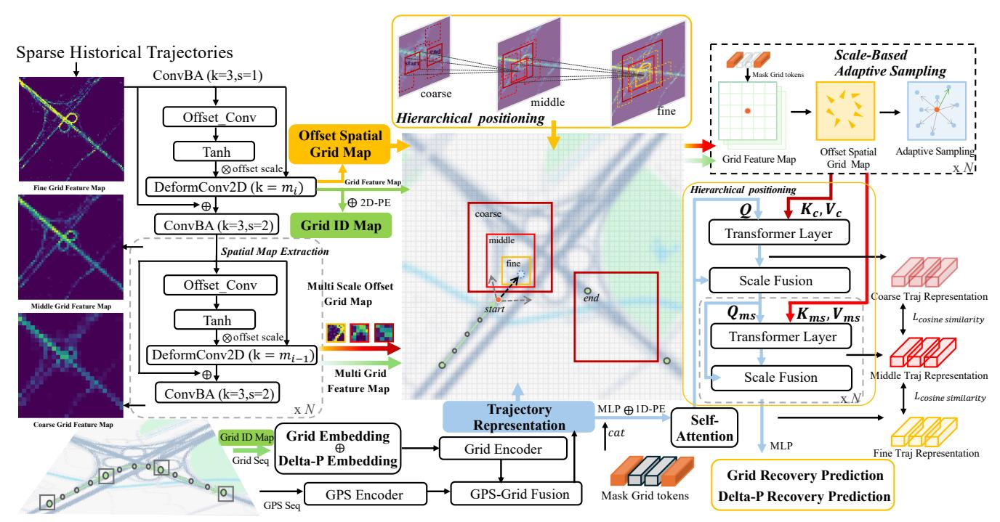
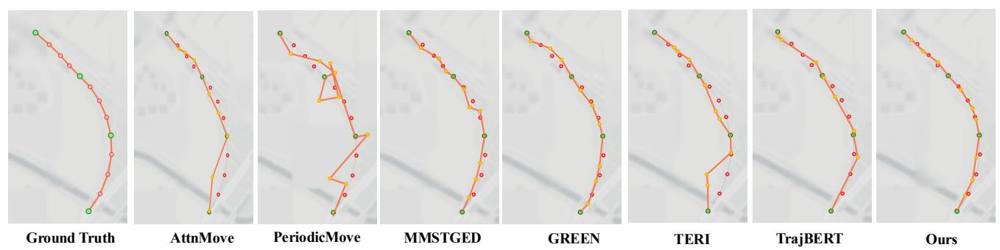

# Accurate Trajectory Recovery in Underserved Areas via Location Inference from Web Crowdsourced Data

[Tangwei Ye](https://orcid.org/0000-0002-2096-8495) yetw@tongji.edu.cn Tongji University Shanghai, China

Liang Hu∗ lianghu@tongji.edu.cn Tongji University Shanghai, China

Zhongyuan Lai zhongyuan.lai@ballsnow.com Shanghai Ballsnow Intelligent Technology Co. Ltd Shanghai, China

Qi Zhang zhangqi\_cs@tongji.edu.cn Tongji University Shanghai, China

Yiming Wu 2410937@tongji.edu.cn Tongji University Shanghai, China

Jiaxing Miao JiaxingMiao@tongji.edu.cn Tongji University Shanghai, China

Yijun Yang 2453020@tongji.edu.cn Tongji University Shanghai, China

Kun Yi yikun@bit.edu.cn State Information Center Beijing, China

# Abstract

In remote or underserved regions, where road networks are often either unavailable or poorly mapped, and GPS signals are sparse and unreliable, the quality of individual trajectories is severely compromised. In such contexts, web crowdsourced data becomes essential for accurately recovering trajectories and compensating for missing spatial information in the absence of explicit road networks. However, this situation introduces two key challenges:(i) scarcity of data in unseen regions, restricting transfer learning; and (ii) the necessity to infer latent movement structures under roadless conditions. To address these, we propose Region-aware Hierarchical Trajectory Recovery (RHTR) model, designed for location inference from web crowdsourced data in sparse, roadless scenarios. RHTR constructs multi-scale implicit grid-based offset maps from historical location data, with coarse grids capturing global patterns and fine grids refining local details. These sequential representations form region-aware encodings by sampling information around observed points, facilitating trajectory recovery. A coarse-to-fine mechanism leverages contextual information to progressively reconstruct missing segments. Experiments on two public datasets—simulating underserved and disaster-like settings with cross-region transfer—demonstrate that RHTR achieves stateof-the-art performance in trajectory recovery.

# CCS Concepts

### • Information systems → Spatial-temporal systems; Crowdsourcing.

∗Corresponding author

[This work is licensed under a Creative Commons Attribution-NonCommercial-](https://creativecommons.org/licenses/by-nc-nd/4.0)[NoDerivatives 4.0 International License.](https://creativecommons.org/licenses/by-nc-nd/4.0) WWW '26, Dubai, United Arab Emirates © 2026 Copyright held by the owner/author(s). ACM ISBN 979-8-4007-2307-0/2026/04 <https://doi.org/10.1145/3774904.3792970>

# Keywords

Web Crowdsourced Data; Trajectory Recovery; Cross-regional modeling; Hierarchical learning.

### ACM Reference Format:

Tangwei Ye, Liang Hu, Zhongyuan Lai, Qi Zhang, Yiming Wu, Jiaxing Miao, Yijun Yang, and Kun Yi. 2026. Accurate Trajectory Recovery in Underserved Areas via Location Inference from Web Crowdsourced Data. In Proceedings of the ACM Web Conference 2026 (WWW '26), April 13–17, 2026, Dubai, United Arab Emirates. ACM, New York, NY, USA, [10](#page-9-0) pages. [https://doi.org/10.1145/](https://doi.org/10.1145/3774904.3792970) [3774904.3792970](https://doi.org/10.1145/3774904.3792970)

# 1 Introduction

In today's web and mobile ecosystems, applications increasingly rely on web crowdsourced mobility traces to model collective spatial perception and human movement patterns. Individual users typically produce sparse, irregular trajectories that cover only a tiny fraction of the environment; aggregating many such traces via web platforms yields rich spatial priors that in turn enable trajectory recovery, i.e., reconstructing travel paths from sparse GPS observations, especially in unmapped or roadless areas. This collective data powers critical functions like disaster mitigation, equitable mobility planning, community paths, and broad location-based services, all of which underscore the need for robust trajectory quality. Trajectory recovery has therefore drawn considerable research interest, with state-of-the-art methods delivering strong results in well-mapped urban settings featuring dense, up-to-date road networks [\[27\]](#page-8-0). Although road-based methods dominate the trajectory recovery field, they face significant limitations in areas where infrastructure is compromised, especially in road-network-free trajectory recovery for emergency response and disaster mitigation scenarios [\[19\]](#page-8-1). In these cases, individual trajectories become even sparser, communication infrastructure may be partially or totally degraded, and the road network is often sparsely covered, outdated, or completely unavailable. This makes road-network-dependent methods inapplicable, highlighting the importance of robust, crowdsourced, map-agnostic trajectory recovery. Models trained on dense, **Web Crowdsourced Data**

**Crowdsourced Training Data**

**Trajectory Recovery in Underserved Areas**

**Same Regions (Past)**

**Different Regions (Ours)** Figure 1: In contrast to existing methods, our approach enables the reconstruction of sparse trajectories in unknown domains by leveraging from web crowdsourced location data

Sub-regions

Unseen Regions

Train Regions Test Regions

Train Regions Test Regions

high-quality urban data often underperform when applied to such domains [\[13\]](#page-8-2). As shown in Fig. [1,](#page-1-0) other methods are typically evaluated on varied trajectories in familiar regions, but in damaged areas, the environment may also change. Therefore, our focus is on trajectory recovery in previously unseen regions using web crowdsourced data. In this work, we directly address the dual challenges: trajectory recovery from sparse GPS in no-road-network scenarios, and cross-region generalization under severe cold-start conditions. We achieve this by harnessing low-cost, phone-collected, and web crowdsourced GPS data, enabling advanced recovery methods to be transferable and replicable in the world's most underserved areas. A common strategy in recent trajectory recovery models is to discretize geographic space into a grid and encode each trajectory as a sequence of grid cells, analogous to word embeddings in natural language processing [\[2,](#page-8-3) [36\]](#page-8-4). Grid-based modeling offers clear advantages: it regularizes continuous coordinates into a compact vocabulary, facilitates the use of sequence models over cell indices, and provides a natural way to incorporate local spatial context. At the same time, it introduces new dependencies and failure modes. The quality of the recovered trajectories becomes highly sensitive to the grid scale: overly coarse grids smear out fine-grained motion patterns, while overly fine grids fragment trajectories and exacerbate data sparsity. Incorporating grid connectivity (e.g., adjacency or higher-order neighborhood relationships) can partially mitigate these issues [\[1\]](#page-8-5). Consequently, how to design grid-based representations that remain efficient, robust, and transferable across regions with dramatically different densities and map conditions emerges as a central research problem and is one that our proposed model is specifically designed to address. Our approach leverages the flexibility of grid partitioning to learn generalizable spatial representations, even under severely sparse sampling. At coarse, middle, and fine scales, each grid cell is represented by a learned embedding that aggregates local trajectory evidence from sparse GPS points together with relational information from neighboring cells via a deformable grid encoder and neighbor sampling. This yields transferable spatial embeddings that remain robust in unseen areas and under distribution shift. To address the multi-scale nature of geographical data, we employ a Hierarchical Multi-Scale Grid Transformer that propagates information across scales with an attention-based method, enforcing consistency between fine- and

coarse-level recoveries. Together, these components directly tackle the dual challenges of cross-region generalization and multi-scale spatial reasoning, as well as trajectory recovery from sparse GPS traces, as validated by extensive experiments on multiple real-world datasets. Our contributions are as follows:

- We propose a grid-based formulation of road-network-free, cross-region trajectory recovery from sparse GPS observations, where irregular, low-frequency traces are represented on nested coarse–middle–fine grids, enabling region-agnostic spatial priors that transfer to unseen areas.
- We design RHTR, a Region-aware Hierarchical Trajectory Recovery model that couples a deformable multi-scale grid encoder with GPS grid fusion, cross-scale neighborhood sampling, and fine-scale offset regression, explicitly enforcing consistency between coarse skeletons and fine trajectory details while mitigating spatial drift caused by large sampling gaps.
- We conduct extensive experiments on Geolife and Porto, including enlarged ROIs and severe sparsity regimes, showing that RHTR achieves state-of-the-art results on both classification and spatial metrics. Ablation studies further confirm the complementary roles of the grid map, multi-scale hierarchy, neighbor sampling, and deformable alignment in handling sparsity and distribution shift.

# 2 Related Work

# 2.1 Network-free Trajectory Recovery

Network-free trajectory recovery techniques aim to reconstruct trajectories without relying on predefined road networks. Early studies [\[4,](#page-8-6) [7,](#page-8-7) [12,](#page-8-8) [24\]](#page-8-9) explore forecasting the chain of visited spots linking start and end points, employing tactics such as optimization frameworks, established reference markers for adjustment, or Markovbased techniques. With the advent of deep learning, especially with the development of time series models [\[34,](#page-8-10) [35\]](#page-8-11), sequential modeling paradigms leveraging RNNs [\[8,](#page-8-12) [15,](#page-8-13) [29\]](#page-8-14) and Transformers [\[28\]](#page-8-15) have been increasingly adopted to tackle trajectory-related challenges, while Si et al. [\[23\]](#page-8-16) propose another transformer-based method for recovering implicit trajectories from sparse data. Xia et al. [\[32\]](#page-8-17) propose a novel attentional-based framework to address the problem of data sparsity and to take long-term history into account. Their main contributions come in the form of measured use of historical data to augment the learning of trajectories. Sun et al. [\[25\]](#page-8-18) propose another architecture that combines measured model building with analysis of temporally varying human movement patterns, which could include both full and sparse movement data. Their model is mainly based on the use of graph neural networks (GNN) which are able to capture temporal patterns and complex location transition information. Elshrif et al. [\[10\]](#page-8-19) employ a heuristic algorithm to enable long-distance trajectory completion. However, the aforementioned methods are typically evaluated within the same regions as their training data, lacking geographic awareness capabilities. In contrast, our model leverages web crowdsourced location data to learn spatial variations in routes, thereby capturing the intrinsic logic underlying true trajectory dynamics.

# 2.2 Grid-based Trajectory Recovery

Grid-based methods focus on simplifying road network or trajectory representation learning by discretizing spatial domains into individual cells [\[18,](#page-8-20) [22,](#page-8-21) [33\]](#page-8-22). As a pioneering effort in the field, Li et al. [\[18\]](#page-8-20) adopt an encoder-decoder structure [\[26\]](#page-8-23) to derive durable grid-aligned trajectory embeddings from sparse datasets. In particular, they do not rely on the presence of pre-determined road maps, which alleviates the need for additional map-matching procedures. Chang et al. [\[3\]](#page-8-24) proposes a method for trajectory recovery based on integration of contrastive learning with an attentionbased backbone encoder. Their model introduces a novel similarity measure that alleviates some known problems with conventional metrics, such as sensitivity to measurement errors and inefficiency. Chen et al. [\[6\]](#page-8-25) propose a framework that combines road network (via grid discretization) with GPS trajectory representation learning for trajectory recovery. Their main module is the GridGNN, which learns spatial features for each road segment in their respective grids. Finally, Zhou et al. [\[36\]](#page-8-4) leverage the complementary strengths of grid-based spatial discretization for capturing regional patterns, road network topology for structural semantics, and raw GPS sequences for fine-grained spatio-temporal details, resulting in enhanced trajectory representation. Although grid-based discretization approaches have substantially augmented the representational capacity of trajectories, prevailing methods often underutilize the inherent advantages of grid encoding. In particular, distinct from alternative techniques, our methodology capitalizes on the positional encoding embedded within grid maps, which inherently captures the distinctive spatial interrelationships among grid cells.

### 2.3 Cross-region Generalizability for Trajectory Recovery

Cross-region generalizability refers to the ability of our learned model to produce useful inference results outside of its learned domain. For the trajectory recovery task, cross-region generalizability has not been fully explored. Most such methods [\[11,](#page-8-26) [16,](#page-8-27) [20\]](#page-8-28) are based on the learning of trajectory encoders that map physical trajectories to embedding vectors. With the advent of large-scale models, large language models (LLMs) demonstrate inherent generalization prowess [\[14,](#page-8-29) [21\]](#page-8-30), thereby catalyzing advancements in research on the generalizability of trajectory representations. For example, Wei et al. [\[31\]](#page-8-31) harness LLMs to interpret road networks alongside peripheral points of interest (POI) data, thereby augmenting the representational efficacy of trajectories, while incorporating a multi-expert mechanism to discern intricate motion states within trajectories. Likewise, Zhou et al. [\[37\]](#page-9-1) exploit LLMs to assimilate trajectory motion patterns and underlying travel intents, facilitating high-fidelity performance in downstream trajectory-centric applications. Nevertheless, prevailing approaches have yet to leverage web crowdsourced location data for deriving spatial embeddings of mobility patterns, which could bolster trajectory generalization across unfamiliar domains. This forms the pivotal core of our method: by inferring precise locations via web crowdsourced location data, we enable robust and accurate trajectory recovery tasks.

# 3 Proposed Approach

In this section, we introduce our Region-aware Hierarchical Trajectory Recovery (RHTR) model, designed for recovering dense user trajectories from sparse location data by leveraging multi-scale implicit spatial grid representations. Fig. [2](#page-3-0) provides an overview of the RHTR model. The RHTR model comprises four key components: (1) multi-scale spatial grid map representation learning from web crowdsourced data, (2) trajectory representation learning, (3) multi-scale neighborhood sampling, and (4) hierarchical cross-attention for location inference. We go into each module in detail in the following.

# 3.1 Multi-scale Spatial Grid Map Representation Learning

We aggregate sparse user trajectories across the target region and discretize them into a uniform �� × �� grid. Cell-wise visitation densities are normalized to form a preliminary density-aware grid map. We then reframe this grid map as a semantically enriched multi-channel feature map M ∈ R 3×��×�� , where the first channel encodes the normalized visitation intensity for each cell���� , while the remaining two channels embed the normalized centroid coordinates to ensure spatial awareness.

To further distill multi-scale adaptive representations from the crowdsourced grid map, we introduce a hierarchical spatial map extraction method, inspired by Deformable Convolutional Networks[\[9\]](#page-8-32). This multi-scale approach enables the model to capture spatial hierarchies at varying scales, accommodating diverse urban structures such as fine-grained local patterns in dense areas and broader regional contexts in sparse zones. By employing deformable convolutions with decreasing kernel sizes and offset scales across stages, the network dynamically adjusts receptive fields to irregular mobility distributions, enhancing robustness to variations in crowdsourced data density and geometry. Specifically, the input feature map M ∈ R 3×��×�� undergoes an initial convolutional block to project it into a higher-dimensional space:

X1 = ConvBA(M), (1)

where X1 ∈ R ��×��×�� and �� is the hidden embedding dimension. We then apply a ConvBA block—a composite layer consisting of a convolutional neural network (CNN) [\[17\]](#page-8-33) followed by batch normalization (BatchNorm) and ReLU activation. This is followed by a series of deformable stages interleaved with downsampling operations. For each stage �� (where �� = 1, . . . , �� and �� is the number of stages), the process is:

O�� , offset�� = DeformStage(X�� ; ���� , ����), (2)

X��+1 = ConvBA(O�� + X�� ;�� = 2), (3)

where ���� denotes the kernel size and ���� is the offset scale for stage ��, with ���� and ���� decreasing to focus on finer details at deeper levels. Within each deformable stage, we first predict adaptive offsets to enable flexible deformation of the convolutional kernels, allowing the network to focus on relevant spatial features in the crowdsourced grid. Given the input X�� ∈ R ��×���� ×���� , the offsets are predicted using a standard convolution:

offset�� = tanh(Conv���� ×���� (X��)) · ���� , (4)

where �� denotes the softmax function. The total loss is the sum of these three terms:

L = L���� + L������ + L���� . (15)

The hierarchical localization strategy in our model offers several key advantages, including enhanced inference efficiency through progressive refinement of the search space, superior accuracy in reconstructing sparse trajectories, and better handling of multi-scale spatial contexts compared to conventional flat attention mechanisms.

# 4 Experiments

# 4.1 Experimental Settings

4.1.1 Datasets. Our experiments are based on real-world trajectory datasets recorded from the web: the GeoLife dataset and the Porto dataset. These datasets capture the actual travel trajectories of users in the Beijing and Porto regions, respectively. For the GeoLife dataset, we first resample the original GPS trajectories and retain those with an effective sampling interval between 3–6 seconds, ensuring the quality of trajectory positions, while for Porto we sample with a 15-second interval, emphasizing a more sparse data scenario. In terms of spatial processing, we restrict all trajectories in both datasets to a predefined study area and divide this area into regular subregions, where each subregion contains the trajectories of multiple users within that area. Specifically, we divide the densely covered Beijing region in the GeoLife dataset into 16×16 subregions, while for the Porto dataset, it is divided into 14×14 subregions, with each subregion covering approximately 1km2 . Additionally, we filter the position points based on the grid boundaries to align with the Underserved Areas scenario. After completing the above preprocessing, we partition the datasets based on the number of subregions, following an 8:1:1 ratio to create training, validation, and test sets. All experimental results are reported on the independent test set, with the validation set being used exclusively for model selection and hyperparameter tuning.

4.1.2 Baseline Methods. We benchmark our approach against a representative suite of trajectory-recovery baselines. TransformerID centers on the Transformer [\[28\]](#page-8-15) architecture, fusing GPS data with grid IDs to learn trajectory representations. TERI [\[5\]](#page-8-34) is a transformer-based two-stage framework for irregularly sampled traces, combining a detection stage with a recovery stage and a robust temporal encoding module. TrajBERT [\[23\]](#page-8-16) treats trajectories as token sequences and leverages bidirectional transformer masking to recover missing segments from sparse observations. MMSTGED [\[30\]](#page-8-35) integrates micro- and macro-level trajectory semantics on a learned graph, coupling node/edge representations with sequence attention for reconstruction. GREEN [\[36\]](#page-8-4) is a hybrid method that fuses grid discretization, GPS observations, and road-network cues to enforce spatial consistency. AttenMove [\[32\]](#page-8-17) employs attentional mechanisms over historical mobility context to mitigate sparsity and capture long-range dependencies, while PeriodicMove [\[25\]](#page-8-18) augments representation learning with periodic/temporal regularities using graph-based encoders.

4.1.3 Evaluation Metrics. We evaluate trajectory recovery from two complementary perspectives: point-wise localization and overall trajectory quality. For localization, we report Accuracy, Precision, Recall, and F1 on a 100×100 grid, where Accuracy is the proportion of recovered points that fall into the correct cell, Precision and Recall measure false positives and false negatives respectively, and F1 is their harmonic mean. For overall trajectory quality, we use Mean Squared Error (MSE), Root Mean Squared Error (RMSE), and Fréchet Distance (FD) between recovered and ground-truth trajectories, with FD capturing shape similarity as the minimal "walking distance" required to traverse both curves in synchrony. Together, these metrics jointly assess local localization accuracy and global trajectory fidelity in sparse, underserved regions.

4.1.4 Parameter Settings. We implement our model in PyTorch and train for up to 200 epochs with early stopping, using a batch size of 256, an initial learning rate of 1 × 10−3 , the AdamW optimizer, and a learning-rate scheduler with patience 5 and decay factor 0.5. The model hidden dimension is set to �� = 512. The offset scales ���� and kernel sizes ���� are set to 4, 2, 1 and 7, 5, 3 respectively for �� = 1, 2, 3. respectively, enabling multi-scale receptive fields from coarse to fine for sparse GPS signals.

# 4.2 Performance Analysis

Table [1](#page-6-0) reports the main comparison between RHTR and all baselines under three sampling regimes, �� ∈ {4, 3, 2} multiples of the dataset's unit time interval, on both Geolife and Porto. Overall, RHTR achieves state-of-the-art results across conventional classification metrics (Accuracy, Precision, Recall, F1) and localization metrics (MAE, FD), and maintains these gains as trajectories become sparser.

Robustness under sparse sampling. When observations are most sparse (�� = 4), RHTR shows the clearest advantage. On Geolife, it outperforms the strongest baseline MMSTGED on both Acc and F1, while also reducing spatial error, as evidenced by the relative reduction in MAE. On Porto at �� = 4, the margins are similar, with concurrent reduction in MAE and FD. On the other hand, we see that in terms of precision, the MMSTGED outperforms our model on the Porto dataset. MMSTGED's precision advantage likely stems from its fixed interaction graph, which is well aligned with this dense, taxi-style road network and thus favors only highconfidence, high-traffic cells, reducing false positives. In contrast, RHTR deliberately explores a broader set of plausible cells via multi-scale deformable modeling and offset regression, slightly lowering precision but ensuring consistently high performance on other metrics. Our numbers indicate that multi-scale spatial reasoning, GPS–grid fusion, and offset-aware alignment extract more usable signal from low-frequency traces than attention-only or single-scale designs.

Enlarged ROI and map-level robustness. Table [3](#page-7-0) further evaluates RHTR and baselines on an enlarged region of interest (ROI, 2× area), again at multiple sampling rates. The larger ROI introduces more diverse GPS configurations and increases the difficulty of correctly reconstructing underlying road structures, leading to performance drops for all models, especially in MAE and FD. Nonetheless, RHTR consistently attains the lowest FD as well. On Porto, the gains are more pronounced, relative to the best baseline across the same sampling regimes. These results indicate that, even when the spatial search space is doubled and the number of plausible configurations grows, RHTR's multi-scale grid modeling and

Table 1: Performance comparison on Geolife and Porto datasets under different sampling intervals.

| IS       | Methods       | Acc(%) | Pre(%) | Recall(%) | Geolife F1(%) | MAE(m) | FD(m)  | Acc(%) | Pre(%) | Recall(%) | Porto F1(%) | MAE(m) | FD(m) |
|----------|---------------|--------|--------|-----------|---------------|--------|--------|--------|--------|-----------|-------------|--------|-------|
| 4 ×      |               |        |        |           |               |        |        |        |        |           |             |        |       |
| interval | TransformerID | 20.7   | 12.36  | 15.75     | 11.32         | 16.87  | 27.56  | 4.5    | 4.87   | 4.45      | 3.08        | 49.71  | 77.12 |
|          | MMSTGED       | 37.29  | 28.36  | 26.66     | 24.83         | 13.1   | 25.02  | 30.51  | 38.92  | 23.45     | 25.16       | 55.81  | 96.51 |
|          | GREEN         | 27.6   | 18.26  | 19.09     | 16.1          | 16.63  | 29.13  | 14.53  | 18.74  | 14.5      | 13.69       | 47.61  | 78.99 |
| time     | PeriodicMove  | 29.22  | 17.26  | 17.28     | 15.67         | 36.16  | 79.46  | 26.5   | 35.39  | 26.5      | 28.17       | 53.3   | 91.58 |
|          | TrajBERT      | 26.47  | 14.38  | 14.58     | 13.2          | 51.08  | 117.46 | 29.52  | 37.01  | 29.52     | 30.2        | 56.09  | 99.69 |
| =        | TERI          | 28.9   | 16.3   | 16.49     | 14.81         | 22.84  | 41.05  | 27.33  | 33.68  | 27.31     | 27.44       | 48.25  | 78.09 |
| ��       | AttnMove      | 28.47  | 16.89  | 17.34     | 15.26         | 27.03  | 55.67  | 29.57  | 37.93  | 29.53     | 30.39       | 55.64  | 93.16 |
|          | Ours          | 43.57  | 31.7   | 31.57     | 29.49         | 12.07  | 20.82  | 30.53  | 38.09  | 30.5      | 31.06       | 39.68  | 66.77 |
| 3 ×      |               |        |        |           |               |        |        |        |        |           |             |        |       |
| interval | TransformerID | 32.67  | 22.96  | 24.84     | 20.69         | 12.29  | 20.29  | 5.88   | 7.05   | 5.84      | 4.4         | 38.89  | 64.74 |
|          | MMSTGED       | 47.08  | 37.07  | 34.76     | 33.05         | 10.85  | 20.86  | 33.67  | 44.8   | 27.11     | 28.42       | 42.51  | 77.84 |
|          | GREEN         | 34.66  | 24.04  | 25.13     | 21.70         | 13.04  | 22.36  | 20.3   | 25.83  | 20.31     | 19.8        | 37.78  | 68.56 |
| time     | PeriodicMove  | 32.09  | 20.34  | 20.48     | 18.30         | 26.01  | 58.64  | 29.35  | 38.37  | 29.35     | 31.18       | 43.81  | 80.79 |
|          | TrajBERT      | 32.61  | 19.20  | 19.33     | 17.77         | 42.52  | 106.15 | 33.23  | 41.11  | 33.13     | 33.99       | 44.63  | 84.14 |
| =        | TERI          | 36.32  | 22.44  | 22.58     | 20.68         | 17.18  | 31.91  | 31.82  | 39.35  | 31.78     | 32.3        | 38.08  | 67.67 |
| ��       | AttnMove      | 37.52  | 24.51  | 24.94     | 22.59         | 19.60  | 43.89  | 32.91  | 41.75  | 32.85     | 33.91       | 44.93  | 80.66 |
|          | Ours          | 52.09  | 39.44  | 39.37     | 37.15         | 10.07  | 18.41  | 34.21  | 42.32  | 34.17     | 35.19       | 31.31  | 57.76 |
| 2 ×      |               |        |        |           |               |        |        |        |        |           |             |        |       |
| interval | TransformerID | 32.93  | 22.99  | 25.85     | 21.12         | 11.83  | 19.59  | 8.91   | 11.11  | 3.85      | 8.9         | 27.83  | 48.57 |
|          | MMSTGED       | 55.9   | 46.85  | 43.8      | 42.2          | 9.71   | 17.71  | 35.33  | 52.54  | 34.98     | 36.45       | 31.45  | 60.52 |
|          | GREEN         | 43.84  | 31.67  | 32.11     | 29.11         | 11.21  | 19.62  | 25.87  | 32.97  | 25.9      | 25.78       | 26.65  | 51.96 |
| time     | PeriodicMove  | 36.95  | 23.92  | 23.89     | 21.77         | 35.75  | 87.52  | 34.37  | 44.7   | 34.29     | 35.33       | 41.22  | 86.48 |
|          | TrajBERT      | 37.83  | 23.74  | 23.82     | 22.14         | 34.15  | 80.61  | 37.14  | 45.8   | 37.06     | 38.12       | 39.03  | 72.17 |
| =        | TERI          | 44.13  | 30.02  | 29.97     | 27.94         | 14.38  | 27.22  | 36.84  | 45.22  | 36.77     | 37.51       | 27.73  | 52.90 |
| ��       | AttnMove      | 44.12  | 30.51  | 31.00     | 28.40         | 18.30  | 41.28  | 36.18  | 45.43  | 36.11     | 36.98       | 35.76  | 70.13 |
|          | Ours          | 61.31  | 48.53  | 48.34     | 46.16         | 9.61   | 19.11  | 38.23  | 48.34  | 38.13     | 39.35       | 23.24  | 46.46 |

deformable alignment preserve its advantage in both local accuracy and global trajectory shape.

Cross-region consistency and metric behavior. As sampling densifies, all methods predictably improve, but RHTR's advantage persists for both datasets: it achieves the best performance on most metrics across both sampling intervals and datasets, hinting at its ability to learn from stronger spatial fidelities under differing mobility and topology distributions. Improvements are balanced across classification metrics (Acc/Pre/Recall/F1), with precision and recall rising together rather than trading off, while localization metrics (MAE/FD) see the largest relative gains in the sparsest regime. This behavior aligns with the design of multi-scale offset modeling and deformable sampling, which directly mitigate spatial drift accumulated between distant observations.

Baseline-specific observations. Among baselines, MMSTGED is often strongest at higher sampling densities due to its fusion of micro/macro semantics on a learned graph, yet RHTR consistently surpasses it as observations thin out, suggesting benefits beyond fixed-graph semantics. TERI, designed for irregular intervals, remains robust to non-uniform sampling but falls behind MMSTGED and RHTR in the highest-sparsity regimes, indicating that temporal encoding alone is insufficient without explicit multi-scale spatial fusion. TrajBERT is competitive on sequence-level metrics but lags on MAE and Fréchet Distance, especially under sparse

sampling, showing that masked-token pretraining cannot fully correct spatial misalignment without explicit spatial cues. GREEN and other grid-style methods benefit from discretization but suffer from cell-boundary artifacts and scale sensitivity; by contrast, RHTR's deformable alignment alleviates these issues and yields lower MAE/FD at matched recall. Finally, AttenMove, PeriodicMove, and vanilla Transformer baselines leverage temporal attention and long-range context but still exhibit the largest deficits in spatial metrics, underscoring that temporal priors alone cannot replace explicit spatial offset modeling and cross-scale fusion. We summarize this section via Fig. [3,](#page-7-1) which qualitatively compares recovered trajectories from all baselines against the ground truth. It is clear that almost every baseline model introduce noticeable zig-zags, local kinks, or systematic shifts away from the true curved trajectory. In contrast, MMSTGED and especially RHTR produce trajectories that adhere much more closely to the ground-truth geometry, with RHTR best preserving both the global curvature and local alignment of points.

# 4.3 Ablation Study

In our ablation experiments we studied the influence of important modules on overall model performance. The largest relative performance drop occurs when the grid map is excluded. This is because the grid partitions geographical information into discrete

Figure 3: Performance comparison of different trajectory recovery models on sparse GPS data. Green points represent known observed trajectory points, red points indicate missing trajectory points to be recovered, and orange lines/points denote the recovery results from various models (including baselines and our RHTR method).

Table 2: Model Performance in a Large Area

| SI       | Model         | MAE   | Geolife RMSE | FD     | MAE    | Porto RMSE | FD     |
|----------|---------------|-------|--------------|--------|--------|------------|--------|
| 4 ×      |               |       |              |        |        |            |        |
| interval | TransformerID | 30.98 | 37.59        | 43.77  | 63.48  | 101.02     | 91.86  |
|          | MMSTGED       | 21.19 | 35.22        | 33.83  | 66.38  | 99.93      | 102.72 |
| time     | GREEN         | 21.52 | 31.96        | 32.83  | 58.45  | 100.66     | 89.65  |
|          | PeriodicMove  | 31.88 | 83.7         | 72.24  | 89.88  | 206.55     | 171.38 |
|          | TrajBERT      | 36.05 | 88.93        | 79.67  | 118.27 | 323.39     | 280.06 |
| = ��     | TERI          | 40.16 | 65.91        | 71.63  | 61.83  | 115.22     | 99.85  |
|          | AttnMove      | 29.4  | 99.05        | 68.02  | 75.84  | 132.3      | 127.13 |
|          | Ours          | 19.21 | 29.1         | 31.18  | 53.37  | 99.86      | 87.84  |
| 3 ×      |               |       |              |        |        |            |        |
| interval | TransformerID | 23.27 | 27.84        | 33.42  | 50.54  | 77.41      | 75.23  |
|          | MMSTGED       | 21.19 | 35.22        | 33.83  | 53.39  | 77.08      | 89.43  |
| time     | GREEN         | 18.83 | 28.64        | 29.51  | 46.61  | 77.15      | 74.52  |
|          | PeriodicMove  | 25.78 | 60.32        | 58.94  | 114.27 | 267.34     | 201.65 |
|          | TrajBERT      | 37.17 | 128.56       | 107.49 | 289.04 | 99.52      | 241.02 |
| = ��     | TERI          | 33.1  | 51.51        | 49.44  | 52.57  | 92.81      | 109.26 |
|          | AttnMove      | 26.04 | 96.26        | 61.05  | 62.08  | 108.28     | 107.03 |
|          | Ours          | 16.46 | 25.37        | 26.57  | 39.74  | 76.49      | 70.98  |
| 2 ×      |               |       |              |        |        |            |        |
| interval | TransformerID | 21.07 | 25.69        | 29.76  | 36.66  | 54.25      | 55.26  |
|          | MMSTGED       | 15.93 | 26.68        | 25.07  | 39.6   | 58.13      | 68.7   |
| time     | GREEN         | 21.52 | 31.96        | 32.83  | 36.39  | 58.67      | 59.15  |
|          | PeriodicMove  | 21.19 | 57.11        | 43.47  | 53.16  | 146.53     | 111.76 |
|          | TrajBERT      | 27.33 | 43.9         | 40.72  | 240.31 | 79.56      | 181.36 |
| = ��     | TERI          | 27.33 | 43.9         | 40.72  | 40.46  | 78.85      | 69.54  |
|          | AttnMove      | 24.01 | 98.441       | 54.55  | 45.46  | 89.96      | 105.72 |
|          | Ours          | 14.55 | 24.43        | 22.51  | 28.24  | 50.01      | 50.57  |

chunks that are easier to process and learn from; without it, the model must learn from the continuous map, leading to substantial degradation in both classification metrics and spatial fidelity. Removing the multiscale module also causes notable loss, especially on spatial discrepancy metrics (MAE, FD), due to the effectiveness of the multiscale module in decomposing, extracting and effectively integrating relevant information from different spatial scales. Similarly, dropping neighbor sampling (w/o neighbor) reduces Acc/F1 and increases MAE/FD, indicating that cross-scale fusion alone is insufficient—explicitly attending to local neighborhoods around start/end points provides crucial fine-grained context. Finally, replacing deformable convolutions with standard convolutions (w/o

deformable) yields a more moderate but consistent performance drop. This suggests that while the grid map and multiscale hierarchy account for most of the gains, offset-aware sampling further refines spatial alignment and reduces trajectory distortion.

Table 3: Ablation Study Results on Geolife Dataset

|      | Model       | Acc.  | Prec. | Rec.  | F1    | MAE   | FD    |
|------|-------------|-------|-------|-------|-------|-------|-------|
| Full | model       | 43.57 | 31.70 | 31.57 | 29.49 | 12.07 | 20.82 |
| w/o  | grid map    | 32.07 | 19.90 | 19.97 | 18.30 | 20.93 | 40.33 |
| w/o  | neighbor    | 39.67 | 28.02 | 28.04 | 25.69 | 13.92 | 26.19 |
| w/o  | multi scale | 39.56 | 27.93 | 28.04 | 25.52 | 13.90 | 25.43 |
| w/o  | deformable  | 40.87 | 28.75 | 28.94 | 26.36 | 13.31 | 23.92 |

# 5 Conclusion

In this paper, we address the problem of trajectory recovery in roadnetwork-free, data-scarce environments with sparse, low-frequency GPS observations by leveraging web crowdsourced mobility data. We formulate a cross-region trajectory recovery task that emphasizes both point-wise localization and global trajectory fidelity under severe sampling gaps, and propose RHTR, a Region-aware Hierarchical Trajectory Recovery model instantiated via a Hierarchical Multi-Scale Grid Transformer. By combining a deformable multiscale grid encoder, GPS–grid fusion, hierarchical cross-attention, and fine-scale offset regression, RHTR explicitly models spatial structure across multiple scales while remaining agnostic to any pre-defined road network and robust to sparsity. Extensive experiments on two real-world datasets (Geolife and Porto), across multiple sampling regimes and enlarged regions of interest, demonstrate that RHTR consistently achieves state-of-the-art performance on both classification-style (Accuracy, Precision, Recall, F1) and spatial metrics (MAE, FD) , with gains most pronounced in the sparsest settings and on the more challenging Porto dataset, highlighting the benefits of multi-scale spatial fusion and offset-aware alignment under severe observation gaps.

# 6 Acknowledgment

This work is supported by the National Natural Science Foundation of China (Granted No.62276190 and No.62406225).

### References

[1] Fatin Hassan Ajeil, Ibraheem Kasim Ibraheem, Ahmad Taher Azar, and Amjad J. Humaidi. 2020. Grid-Based Mobile Robot Path Planning Using Aging-Based Ant Colony Optimization Algorithm in Static and Dynamic Environments. Sensors 20, 7 (2020). [doi:10.3390/s20071880](https://doi.org/10.3390/s20071880) [2] Hocine Boukhedouma, Abdelkrim Meziane, Slimane Hammoudi, and Amel Benna. 2024. A Grid-Based and a Context-Oriented Trajectory Modeling for Mobility Prediction in Smart Cities. In Innovations in Smart Cities Applications Volume 7, Mohamed Ben Ahmed, Anouar Abdelhakim Boudhir, Rani El Meouche, and İsmail Rakıp Karas, (Eds.). Springer Nature Switzerland, Cham, 148–157. [3] Yanchuan Chang, Jianzhong Qi, Yuxuan Liang, and Egemen Tanin. 2023. Contrastive Trajectory Similarity Learning with Dual-Feature Attention. In 39th IEEE International Conference on Data Engineering, ICDE 2023, Anaheim, CA, USA, April 3-7, 2023. IEEE, 2933–2945. [doi:10.1109/ICDE55515.2023.00224](https://doi.org/10.1109/ICDE55515.2023.00224) [4] Dawei Chen, Cheng Soon Ong, and Lexing Xie. 2016. Learning Points and Routes to Recommend Trajectories. In Proceedings of the 25th ACM International on Conference on Information and Knowledge Management (Indianapolis, Indiana, USA) (CIKM '16). Association for Computing Machinery, New York, NY, USA, 2227–2232. [doi:10.1145/2983323.2983672](https://doi.org/10.1145/2983323.2983672) [5] Yile Chen, Gao Cong, and Cuauhtemoc Anda. 2023. TERI: An Effective Framework for Trajectory Recovery with Irregular Time Intervals. Proc. VLDB Endow. 17, 3 (2023), 414–426. [doi:10.14778/3632093.3632105](https://doi.org/10.14778/3632093.3632105) [6] Yuqi Chen, Hanyuan Zhang, Weiwei Sun, and Baihua Zheng. 2023. RNTrajRec: Road Network Enhanced Trajectory Recovery with Spatial-Temporal Transformer. In 39th IEEE International Conference on Data Engineering, ICDE 2023, Anaheim, CA, USA, April 3-7, 2023. IEEE, 829–842. [doi:10.1109/ICDE55515.2023.00069](https://doi.org/10.1109/ICDE55515.2023.00069) [7] Zaiben Chen, Heng Tao Shen, and Xiaofang Zhou. 2011. Discovering popular routes from trajectories. In 2011 IEEE 27th International Conference on Data Engineering. 900–911. [doi:10.1109/ICDE.2011.5767890](https://doi.org/10.1109/ICDE.2011.5767890) [8] Kyunghyun Cho, Bart van Merriënboer, Caglar Gulcehre, Dzmitry Bahdanau, Fethi Bougares, Holger Schwenk, and Yoshua Bengio. 2014. Learning Phrase Representations using RNN Encoder–Decoder for Statistical Machine Translation. In Proceedings of the 2014 Conference on Empirical Methods in Natural Language Processing (EMNLP), Alessandro Moschitti, Bo Pang, and Walter Daelemans (Eds.). Association for Computational Linguistics, Doha, Qatar, 1724–1734. [doi:10.3115/](https://doi.org/10.3115/v1/D14-1179) [v1/D14-1179](https://doi.org/10.3115/v1/D14-1179) [9] Jifeng Dai, Haozhi Qi, Yuwen Xiong, Yi Li, Guodong Zhang, Han Hu, and Yichen Wei. 2017. Deformable Convolutional Networks. In 2017 IEEE International Conference on Computer Vision (ICCV). 764–773. [doi:10.1109/ICCV.2017.89](https://doi.org/10.1109/ICCV.2017.89) [10] Mohamed M. Elshrif, Keivin Isufaj, and Mohamed F. Mokbel. 2022. Network-less trajectory imputation. In Proceedings of the 30th International Conference on Advances in Geographic Information Systems (Seattle, Washington) (SIGSPATIAL '22). Association for Computing Machinery, New York, NY, USA, Article 8, 10 pages. [doi:10.1145/3557915.3560942](https://doi.org/10.1145/3557915.3560942) [11] Tao-Yang Fu and Wang-Chien Lee. 2020. Trembr: Exploring Road Networks for Trajectory Representation Learning. ACM Trans. Intell. Syst. Technol. 11, 1, Article 10 (Feb. 2020), 25 pages. [doi:10.1145/3361741](https://doi.org/10.1145/3361741) [12] Aristides Gionis, Theodoros Lappas, Konstantinos Pelechrinis, and Evimaria Terzi. 2014. Customized tour recommendations in urban areas. In Proceedings of the 7th ACM International Conference on Web Search and Data Mining (New York, New York, USA) (WSDM '14). Association for Computing Machinery, New York, NY, USA, 313–322. [doi:10.1145/2556195.2559893](https://doi.org/10.1145/2556195.2559893) [13] Daniel Grimm, Ahmed Abouelazm, and J. Marius Zöllner. 2025. Goalbased Trajectory Prediction for improved Cross-Dataset Generalization. arXiv[:2507.18196](https://arxiv.org/abs/2507.18196) [cs.LG]<https://arxiv.org/abs/2507.18196> [14] Roger Grosse, Juhan Bae, Cem Anil, Nelson Elhage, Alex Tamkin, Amirhossein Tajdini, Benoit Steiner, Dustin Li, Esin Durmus, Ethan Perez, Evan Hubinger, Kamile Lukoši ˙ ut¯ e, Karina Nguyen, Nicholas Joseph, Sam McCandlish, ˙ Jared Kaplan, and Samuel R. Bowman. 2023. Studying Large Language Model Generalization with Influence Functions. arXiv[:2308.03296](https://arxiv.org/abs/2308.03296) [cs.LG] [https:](https://arxiv.org/abs/2308.03296) [//arxiv.org/abs/2308.03296](https://arxiv.org/abs/2308.03296) [15] Sepp Hochreiter and Jürgen Schmidhuber. 1997. Long Short-Term Memory. Neural Computation 9, 8 (1997), 1735–1780. [doi:10.1162/neco.1997.9.8.1735](https://doi.org/10.1162/neco.1997.9.8.1735) [16] Jiawei Jiang, Dayan Pan, Houxing Ren, Xiaohan Jiang, Chao Li, and Jingyuan Wang. 2023. Self-supervised Trajectory Representation Learning with Temporal Regularities and Travel Semantics. In 2023 IEEE 39th International Conference on Data Engineering (ICDE). 843–855. [doi:10.1109/ICDE55515.2023.00070](https://doi.org/10.1109/ICDE55515.2023.00070) [17] Y. Lecun, L. Bottou, Y. Bengio, and P. Haffner. 1998. Gradient-based learning applied to document recognition. Proc. IEEE 86, 11 (1998), 2278–2324. [doi:10.](https://doi.org/10.1109/5.726791) [1109/5.726791](https://doi.org/10.1109/5.726791) [18] Xiucheng Li, Kaiqi Zhao, Gao Cong, Christian S. Jensen, and Wei Wei. 2018. Deep Representation Learning for Trajectory Similarity Computation. In 2018 IEEE 34th International Conference on Data Engineering (ICDE). 617–628. [doi:10.1109/](https://doi.org/10.1109/ICDE.2018.00062) [ICDE.2018.00062](https://doi.org/10.1109/ICDE.2018.00062) [19] Yonghui Liu, Qian Li, and Inhi Kim. 2025. Enhanced trajectory reconstruction from sparse and noisy GPS data: A progressive chunked transformer approach. Communications in Transportation Research 5 (2025), 100200. [doi:10.1016/](https://doi.org/10.1016/j.commtr.2025.100200) [j.commtr.2025.100200](https://doi.org/10.1016/j.commtr.2025.100200) [20] Zhipeng Ma, Zheyan Tu, Xinhai Chen, Yan Zhang, Deguo Xia, Guyue Zhou, Yilun Chen, Yu Zheng, and Jiangtao Gong. 2024. More Than Routing: Joint GPS and Route Modeling for Refine Trajectory Representation Learning. In Proceedings of the ACM Web Conference 2024 (Singapore, Singapore) (WWW '24). Association for Computing Machinery, New York, NY, USA, 3064–3075. [doi:10.1145/3589334.3645644](https://doi.org/10.1145/3589334.3645644) [21] Humza Naveed, Asad Ullah Khan, Shi Qiu, Muhammad Saqib, Saeed Anwar, Muhammad Usman, Naveed Akhtar, Nick Barnes, and Ajmal Mian. 2025. A Comprehensive Overview of Large Language Models. ACM Trans. Intell. Syst. Technol. 16, 5, Article 106 (Aug. 2025), 72 pages. [doi:10.1145/3744746](https://doi.org/10.1145/3744746) [22] Stefan Schestakov and Simon Gottschalk. 2025. Trajectory Representation Learning on Grids and Road Networks with Spatio-Temporal Dynamics. ACM Trans. Intell. Syst. Technol. (Aug. 2025). [doi:10.1145/3757929](https://doi.org/10.1145/3757929) Just Accepted. [23] Junjun Si, Jin Yang, Yang Xiang, Hanqiu Wang, Li Li, Rongqing Zhang, Bo Tu, and Xiangqun Chen. 2024. TrajBERT: BERT-Based Trajectory Recovery With Spatial-Temporal Refinement for Implicit Sparse Trajectories. IEEE Trans. Mob. Comput. 23, 5 (2024), 4849–4860. [doi:10.1109/TMC.2023.3297115](https://doi.org/10.1109/TMC.2023.3297115) [24] Han Su, Kai Zheng, Haozhou Wang, Jiamin Huang, and Xiaofang Zhou. 2013. Calibrating trajectory data for similarity-based analysis. In Proceedings of the 2013 ACM SIGMOD International Conference on Management of Data (New York, New York, USA) (SIGMOD '13). Association for Computing Machinery, New York, NY, USA, 833–844. [doi:10.1145/2463676.2465303](https://doi.org/10.1145/2463676.2465303) [25] Hao Sun, Changjie Yang, Liwei Deng, Fan Zhou, Feiteng Huang, and Kai Zheng. 2021. PeriodicMove: Shift-aware Human Mobility Recovery with Graph Neural Network. In CIKM '21: The 30th ACM International Conference on Information and Knowledge Management, Virtual Event, Queensland, Australia, November 1 - 5, 2021, Gianluca Demartini, Guido Zuccon, J. Shane Culpepper, Zi Huang, and Hanghang Tong (Eds.). ACM, 1734–1743. [doi:10.1145/3459637.3482284](https://doi.org/10.1145/3459637.3482284) [26] Ilya Sutskever, Oriol Vinyals, and Quoc V. Le. 2014. Sequence to sequence learning with neural networks. In Proceedings of the 28th International Conference on Neural Information Processing Systems - Volume 2 (Montreal, Canada) (NIPS'14). MIT Press, Cambridge, MA, USA, 3104–3112. [27] Wei Tian, Jieming Shi, and Man Lung Yiu. 2025. Efficient Methods for Accurate Sparse Trajectory Recovery and Map Matching. In 2025 IEEE 41st International Conference on Data Engineering (ICDE). 363–375. [doi:10.1109/ICDE65448.2025.](https://doi.org/10.1109/ICDE65448.2025.00034) [00034](https://doi.org/10.1109/ICDE65448.2025.00034) [28] Ashish Vaswani, Noam Shazeer, Niki Parmar, Jakob Uszkoreit, Llion Jones, Aidan N. Gomez, Łukasz Kaiser, and Illia Polosukhin. 2017. Attention is all you need. In Proceedings of the 31st International Conference on Neural Information Processing Systems (Long Beach, California, USA) (NIPS'17). Curran Associates Inc., Red Hook, NY, USA, 6000–6010. [29] Jingyuan Wang, Ning Wu, Xinxi Lu, Wayne Xin Zhao, and Kai Feng. 2021. Deep Trajectory Recovery with Fine-Grained Calibration using Kalman Filter. IEEE Transactions on Knowledge and Data Engineering 33, 3 (2021), 921–934. [doi:10.](https://doi.org/10.1109/TKDE.2019.2940950) [1109/TKDE.2019.2940950](https://doi.org/10.1109/TKDE.2019.2940950) [30] Tonglong Wei, Youfang Lin, Yan Lin, Shengnan Guo, Lan Zhang, and Huaiyu Wan. 2024. Micro-Macro Spatial-Temporal Graph-Based Encoder-Decoder for Map-Constrained Trajectory Recovery. IEEE Trans. Knowl. Data Eng. 36, 11 (2024), 6574–6587. [doi:10.1109/TKDE.2024.3396158](https://doi.org/10.1109/TKDE.2024.3396158) [31] Tonglong Wei, Yan Lin, Zeyu Zhou, Haomin Wen, Jilin Hu, Shengnan Guo, Youfang Lin, Gao Cong, and Huaiyu Wan. 2025. TransferTraj: A Vehicle Trajectory Learning Model for Region and Task Transferability. CoRR abs/2505.12672 (2025). arXiv[:2505.12672](https://arxiv.org/abs/2505.12672) [doi:10.48550/ARXIV.2505.12672](https://doi.org/10.48550/ARXIV.2505.12672) [32] Tong Xia, Yunhan Qi, Jie Feng, Fengli Xu, Funing Sun, Diansheng Guo, and Yong Li. 2021. AttnMove: History Enhanced Trajectory Recovery via Attentional Network. In Thirty-Fifth AAAI Conference on Artificial Intelligence, AAAI 2021, Thirty-Third Conference on Innovative Applications of Artificial Intelligence, IAAI 2021, The Eleventh Symposium on Educational Advances in Artificial Intelligence, EAAI 2021, Virtual Event, February 2-9, 2021. AAAI Press, 4494–4502. [doi:10.1609/](https://doi.org/10.1609/AAAI.V35I5.16577) [AAAI.V35I5.16577](https://doi.org/10.1609/AAAI.V35I5.16577) [33] Bingqi Yan, Geng Zhao, Lexue Song, Yanwei Yu, and Junyu Dong. 2022. PreCLN: Pretrained-based contrastive learning network for vehicle trajectory prediction. World Wide Web 26, 4 (Nov. 2022), 1853–1875. [doi:10.1007/s11280-022-01121-3](https://doi.org/10.1007/s11280-022-01121-3) [34] Kun Yi, Jingru Fei, Qi Zhang, Hui He, Shufeng Hao, Defu Lian, and Wei Fan. 2024. FilterNet: harnessing frequency filters for time series forecasting. In Proceedings of the 38th International Conference on Neural Information Processing Systems (Vancouver, BC, Canada) (NIPS '24). Curran Associates Inc., Red Hook, NY, USA, Article 1749, 26 pages. [35] Kun Yi, Qi Zhang, Wei Fan, Longbing Cao, Shoujin Wang, Hui He, Guodong Long, Liang Hu, Qingsong Wen, and Hui Xiong. 2025. A Survey on Deep Learning based Time Series Analysis with Frequency Transformation. In Proceedings of the 31st ACM SIGKDD Conference on Knowledge Discovery and Data Mining V.2 (Toronto ON, Canada) (KDD '25). Association for Computing Machinery, New York, NY, USA, 6206–6215. [doi:10.1145/3711896.3736571](https://doi.org/10.1145/3711896.3736571) [36] Silin Zhou, Shuo Shang, Lisi Chen, Peng Han, and Christian S. Jensen. 2025. Grid and Road Expressions Are Complementary for Trajectory Representation Learning. In Proceedings of the 31st ACM SIGKDD Conference on Knowledge

Discovery and Data Mining, V.1, KDD 2025, Toronto, ON, Canada, August 3-7, 2025, Yizhou Sun, Flavio Chierichetti, Hady W. Lauw, Claudia Perlich, Wee Hyong Tok, and Andrew Tomkins (Eds.). ACM, 2135–2146. [doi:10.1145/3690624.3709272](https://doi.org/10.1145/3690624.3709272) [37] Zeyu Zhou, Yan Lin, Haomin Wen, Shengnan Guo, Jilin Hu, Youfang Lin, and Huaiyu Wan. 2025. TrajCogn: Leveraging LLMs for Cognizing Movement Patterns and Travel Purposes from Trajectories. In Proceedings of the Thirty-Fourth

International Joint Conference on Artificial Intelligence, IJCAI-25, James Kwok (Ed.). International Joint Conferences on Artificial Intelligence Organization, 3698–3706. [doi:10.24963/ijcai.2025/411](https://doi.org/10.24963/ijcai.2025/411) Main Track.