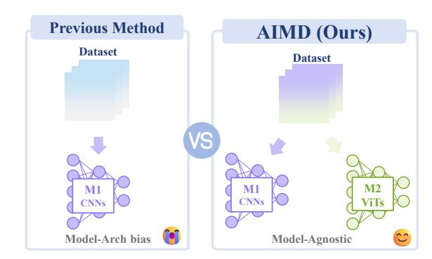
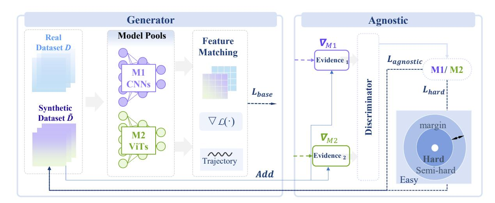
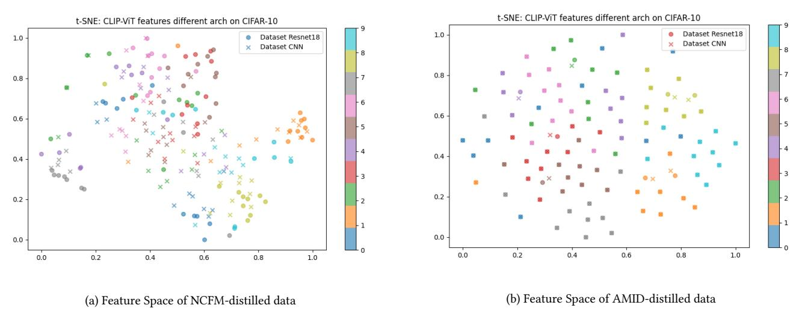
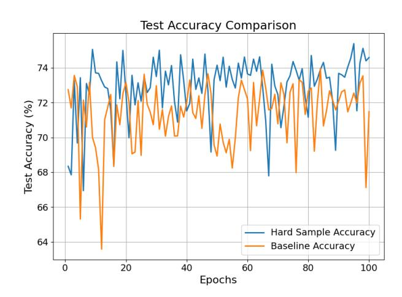

# AMID: Model-Agnostic Dataset Distillation by Adversarial Mutual Information Minimization

Aoqi Wu 2331930@tongji.edu.cn Tongji University Shanghai, China

Junming Liu 2331890@tongji.edu.cn Tongji University Shanghai, China

Yuwei Zhang 2331931@tongji.edu.cn Tongji University Shanghai, China

Weiquan Huang weiquanh@tongji.edu.cn Tongji University Shanghai, China

Liang Hu∗ lianghu@tongji.edu.cn Tongji University Shanghai, China

Yifan Yang yifanyang@microsoft.com Microsoft Research Asia Shanghai, China

Qi Zhang zhangqi\_cs@tongji.edu.cn Tongji University Shanghai, China

Jiaxing Miao JiaxingMiao@tongji.edu.cn Tongji University Shanghai, China

Yuhan Tang 2250388@tongji.edu.cn Tongji University Shanghai, China

Zhongyuan Lai abrikosof@yahoo.com Shanghai Ballsnow Intelligent Technology Co. Ltd Shanghai, China

# Abstract

The escalating energy consumption and carbon footprint of training large-scale Web AI models pose urgent challenges for sustainable development. Dataset Distillation (DD) offers a promising avenue for green AI by compressing large datasets into small synthetic ones for efficient training. However, most existing DD methods overfit to the inductive biases of specific source architectures (e.g., CNNs or ViTs), resulting in poor cross-model generalization. This limitation necessitates redundant re-distillation processes for different architectures, severely undermining the energy-saving potential of DD. To address this, we introduce Adversarial Mutual Information Distillation (AMID), a rigorous framework designed to create highly reusable and robust synthetic datasets. From an information-theoretic perspective, we cast model-agnosticism as minimizing the mutual information (MI) between the synthetic data and the specific identity of the distillation model. We convert this intractable objective into a tractable two-player adversarial game, which unifies knowledge preservation with adversarial unlearning of architectural bias. Extensive experiments on CIFAR-10 and Tiny ImageNet demonstrate that AMID achieves state-of-the-art cross-architecture generalization across diverse CNNs and ViTs. Crucially, our analysis confirms that AMID significantly reduces

∗Corresponding author.

[This work is licensed under a Creative Commons Attribution-NonCommercial-](https://creativecommons.org/licenses/by-nc-nd/4.0)[NoDerivatives 4.0 International License.](https://creativecommons.org/licenses/by-nc-nd/4.0)

WWW '26, Dubai, United Arab Emirates © 2026 Copyright held by the owner/author(s). ACM ISBN 979-8-4007-2307-0/2026/04 <https://doi.org/10.1145/3774904.3792973>

the computational overhead and CO2 emissions of downstream training while maintaining robust performance, paving the way for energy-efficient, transferable, and sustainable Web AI ecosystems.

# CCS Concepts

• Computing methodologies → Computer vision; Neural networks; • Mathematics of computing → Mutual information; • Social and professional topics → Sustainability.

# Keywords

Dataset Distillation; Green AI; Adversarial Learning; Mutual Information; Sustainable Web AI

### ACM Reference Format:

Aoqi Wu, Junming Liu, Yuwei Zhang, Weiquan Huang, Liang Hu, Yifan Yang, Qi Zhang, Jiaxing Miao, Yuhan Tang, and Zhongyuan Lai. 2026. AMID: Model-Agnostic Dataset Distillation by Adversarial Mutual Information Minimization. In Proceedings of the ACM Web Conference 2026 (WWW '26), April 13–17, 2026, Dubai, United Arab Emirates. ACM, New York, NY, USA, [11](#page-10-0) pages.<https://doi.org/10.1145/3774904.3792973>

# 1 Introduction

Deep learning has led to transformative advances in web intelligence and computer vision, largely fueled by access to massive, meticulously labeled datasets [\[6,](#page-7-0) [14,](#page-8-0) [15\]](#page-8-1). However, the environmental cost of this progress is staggering: training large-scale models imposes exorbitant computational burdens and carbon footprints, posing a severe challenge to the sustainability of modern AI ecosystems. Dataset Distillation (DD) [\[33\]](#page-8-2) has emerged as a promising solution for Green AI: by compressing the knowledge of a large

dataset into a small set of synthetic samples, DD can drastically reduce the energy consumption of downstream model training.

Figure 1: Conceptual illustration of our AMID. (Left) Standard dataset distillation methods produce synthetic data biased to the source architecture, resulting in poor generalization to other models. (Right) AMID uses adversarial learning and hard-sample mining to create model-agnostic synthetic data that generalizes well across architectures.

Despite its promise for sustainability, a critical bottleneck limits the practical utility of distilled data: existing methods often overfit the inductive biases of the specific source architecture used during distillation. As illustrated in Figure [1](#page-1-0) (left), this leads to significant performance degradation when the distilled data is transferred to different architectures. This limitation is characteristic of dominant DD paradigms, including feature [\[32,](#page-8-3) [35\]](#page-8-4), gradient [\[38,](#page-8-5) [39\]](#page-8-6), and trajectory matching [\[11,](#page-8-7) [37\]](#page-8-8). For instance, a dataset synthesized using a Convolutional Neural Network (CNN) implicitly encodes CNN-specific priors (e.g., local connectivity), failing to generalize to Vision Transformers (ViTs) [\[7\]](#page-8-9). From a sustainability perspective, this lack of transferability is wasteful: it renders synthetic datasets as "single-use" assets, necessitating redundant, energyintensive re-distillation processes for every new target architecture. To realize the vision of an energy-aware web, we need distilled datasets that are robust and universally reusable.

Recognizing this, recent studies have attempted to improve crossarchitecture transfer [\[21,](#page-8-10) [41,](#page-8-11) [42\]](#page-8-12). However, these approaches primarily rely on empirical strategies, such as model ensembling or heuristic data augmentations. They treat the symptoms of architectural overfitting rather than its root cause, lacking a principled framework to ensure the synthetic dataset systematically disentangles itself from the creator model's identity. This leaves a fundamental question unanswered: How can we establish a rigorous information-theoretic foundation for model-agnostic, sustainable dataset distillation?

In this work, we approach this challenge through an informationtheoretic lens. We posit that the key barrier to universal (and thus energy-efficient) distillation lies in the residual "architectural fingerprints" retained within the synthetic data. For true model-agnostic generalization, it is paramount that the synthetic dataset contains no learnable information about the distillation architecture. This desideratum can be formalized using mutual information (MI) [\[3,](#page-7-1) [27\]](#page-8-13). We propose to minimize the mutual information ��(��syn; ��) between the synthetic dataset ��syn and the generating architecture ��. By making the synthetic data statistically independent from the architecture, we ensure it captures only the essential, universally transferable knowledge, maximizing its reuse potential across diverse web AI systems.

However, directly optimizing MI is intractable in high-dimensional settings. To circumvent this, we introduce Adversarial Mutual Information Distillation (AMID), a principled framework that operationalizes MI minimization through an adversarial game. A discriminator is trained to recover the source architecture from the synthetic data, while the distiller learns to obfuscate these architectural cues. To further enhance data quality, AMID actively encourages the generation of hard, challenging samples that expose limitations across a diverse pool of models. These design choices bridge the gap between information-theoretic ideals and practical Green AI.

Our principal contributions are as follows:

- Information-theoretic foundation for Green AI: We establish a rigorous MI-based formulation for model-agnostic dataset distillation, providing a new theoretical perspective on eliminating architecture-specific bias to create universally reusable data.
- Effective framework: We develop AMID, an adversarial MIminimization method combined with hard-sample mining. This framework ensures the distilled data is robust against architectural shifts, significantly reducing the need for redundant dataset generation.
- Sustainability and Performance: Extensive experiments on CIFAR-10 [\[13\]](#page-8-14) and Tiny ImageNet [\[25\]](#page-8-15) demonstrate that AMID achieves state-of-the-art cross-architecture generalization. Crucially, we provide an analysis of energy efficiency, showing that our method significantly lowers the carbon footprint of training robust models compared to traditional baselines.

# 2 Related Works

# 2.1 Dataset Distillation as a Pillar of Green AI

As deep learning models scale exponentially in size and complexity, their environmental impact has become a critical concern. Recent studies [\[22,](#page-8-16) [29\]](#page-8-17) estimate that training a single large-scale model can emit as much carbon as five cars over their lifetimes. This trend has catalyzed the movement toward Green AI [\[26\]](#page-8-18), which prioritizes efficiency and sustainability alongside accuracy.

In this context, Dataset Distillation (DD) [\[33\]](#page-8-2) has emerged as a transformative technique for reducing the energy footprint of AI training. By condensing massive datasets into tiny, high-fidelity synthetic sets, DD enables downstream models to be trained with a fraction of the original computational cost. Existing approaches generally fall into three categories:

- Gradient Matching [\[8,](#page-8-19) [28,](#page-8-20) [37,](#page-8-8) [38\]](#page-8-5), which optimizes synthetic data so that the gradients effectively match those derived from real data;
- Trajectory Matching [\[2,](#page-7-2) [11,](#page-8-7) [16,](#page-8-21) [18\]](#page-8-22), which aligns the longterm training trajectories of student models on synthetic versus real data;

- Distribution Matching [\[31,](#page-8-23) [32,](#page-8-3) [35,](#page-8-4) [36,](#page-8-24) [40\]](#page-8-25), which statistically matches the feature distributions in a latent space.

Despite their success in "same-architecture" settings, these methods suffer from a critical sustainability flaw: architectural overfitting. The synthesized data heavily encodes the inductive biases of the source model used during distillation. Consequently, data distilled from a CNN fails to train a ViT effectively. This lack of transferability forces practitioners to perform redundant, energyintensive re-distillation for every new target architecture, severely undermining the potential of DD as a general-purpose Green AI tool.

To address this, recent works have explored model-agnostic DD. Some employ ensemble-based strategies [\[5,](#page-7-3) [42\]](#page-8-12), distilling knowledge from a committee of diverse teachers. Others use regularizationbased heuristics [\[21,](#page-8-10) [41\]](#page-8-11) to encourage broader compatibility. However, ensemble methods inevitably inflate the computational cost of the distillation phase itself (scaling linearly with the number of teachers), creating a "sustainability paradox." In contrast, our work seeks a principled, unified solution that ensures cross-model reusability without the prohibitive carbon cost of maintaining massive model ensembles.

### 2.2 Adversarial Learning: From Algorithmic Fairness to Architecture Invariance

Our approach draws inspiration from the rich literature on learning invariant representations via adversarial training. This paradigm is widely adopted in Responsible AI and Algorithmic Fairness to mitigate unwanted biases. For instance, in fair classification, adversarial games are employed to ensure that model predictions are statistically independent of sensitive attributes such as gender, race, or age [\[20,](#page-8-26) [34\]](#page-8-27). Similarly, in Domain Adaptation (DA), methods like DANN [\[9\]](#page-8-28) and ADDA [\[30\]](#page-8-29) utilize a domain discriminator to force the feature extractor to learn domain-invariant representations, thereby enabling generalization across varying data distributions [\[17,](#page-8-30) [24\]](#page-8-31).

In this paper, we bridge the gap between these responsible AI principles and data synthesis. We are the first to formalize "architectural bias" in Dataset Distillation as an analogue to "societal bias" or "domain shift." From an information-theoretic perspective, we aim to minimize the mutual information between the synthetic dataset and the source architecture's identity. While generative adversarial networks (GANs) [\[10\]](#page-8-32) are typically used in DD to generate realistic images, our framework, AMID, employs the adversarial mechanism for a fundamentally different purpose: disentanglement. By training a discriminator to identify the source architecture and a generator to fool it, AMID systematically "erases" the architectural fingerprints from the distilled data. This results in a truly robust and reusable dataset that supports the sustainable development of diverse Web AI systems, surpassing the limitations of heuristic baselines.

# 3 Preliminaries

We first define the dataset distillation (DD) problem through the lens of efficiency, then introduce feature matching as a mainstream distillation proxy, highlighting its limitations regarding sustainable cross-model reuse.

### 3.1 Dataset Distillation: Fundamentals

Dataset Distillation (DD) [\[33\]](#page-8-2) aims to compress a large dataset ��large = {(���� , ����)}�� ��=1 into a tiny synthetic dataset��syn = {(�� ′ , ��′ )}�� ��=1 (�� ≪ ��). The goal is twofold: ensuring models trained on ��syn achieve accuracy comparable to those trained on ��large, while enabling rapid, low-energy training downstream.

Formally, this is expressed as a bi-level optimization [\[33\]](#page-8-2):

�� ∗ syn = arg min ��syn Lmeta (�� ∗ (��syn), ��large) subject to �� ∗ (��syn) = arg min Ltrain (��, ��syn)

The inner loop trains parameters �� on ��syn; the outer loop updates ��syn to minimize performance loss on ��large. Directly solving this is generally intractable, so surrogate objectives such as feature matching are often used.

### 3.2 Feature Matching as a Distillation Proxy

Feature Matching (FM) [\[32,](#page-8-3) [35\]](#page-8-4) acts as a computationally efficient proxy for the bi-level objective. It aligns feature distributions between real and synthetic data using a fixed, pre-trained expert model ��expert. Let Φ(·) denote features extracted from an intermediate layer. The FM objective minimizes the distance between feature sets ��large = {Φ(��)|�� ∈ ��large} and ��syn = {Φ(�� ′ )|�� ′ ∈ ��syn}:

LFM = �� (��(��large), ��(��syn)) + �� · �� (Σ(��large), Σ(��syn))

where �� (·, ·) is a distance metric (e.g., L2), and �� balances the terms. While FM effectively preserves semantic content, it creates a sustainability bottleneck: since the synthesis is guided by a specific expert's view, ��syn implicitly inherits that expert's inductive biases. This "architectural lock-in" renders the data non-transferable to other models (e.g., ViTs), necessitating wasteful re-distillation for new architectures.

### 4 Methods

In this section, we detail our proposed framework, Adversarial Mutual Information Distillation (AMID). We begin by formalizing our information-theoretic core principle (Section [4.1\)](#page-2-0), defining model-agnosticism as mutual information minimization. Next, we present the practical realization of this principle via an adversarial learning framework (Section [4.2\)](#page-3-0), including the construction of evidence and the roles of each player. We then introduce our explicit hard-sample mining mechanism (Section [4.4\)](#page-4-0), which enhances the informativeness and universality of the synthetic data. Finally, Section [4.5](#page-4-1) describes the full objective and optimization procedure for sustainable data synthesis.

### 4.1 Model-Agnosticism as Mutual Information Minimization

The key challenge of dataset distillation is that the synthetic data �������� often overfits the architecture �� from which it is distilled, thus limiting cross-architecture generalization. To fundamentally address this and enable energy-efficient data reuse, we seek a dataset that is maximally informative yet independent of model-specific biases. Formally, from an information-theoretic perspective, the distribution of �������� should reveal no information about model identity ��, i.e., �������� and �� should be statistically independent. This

| IPC Method |                 |          | CNN       | Architectures |          |               | Transformer |           | Architectures | Overall   |
|------------|-----------------|----------|-----------|---------------|----------|---------------|-------------|-----------|---------------|-----------|
|            | ConvNet         | ResNet18 | ResNet50  | ResNet101     | CNN      | Avg. ViT-Tiny | ViT-Sm      | ViT-Base  | Trans.        | Avg. Avg. |
| CAFE       | 27.2±0.7        | 22.7±4.1 | 24.8±1.9  | 24.1±1.5      | 24.7±2.1 | 16.5±2.7      | 19.4±3.7    | 22.1±7.7  | 19.3±4.7      | 22.4±3.2  |
| IDM        | 37.5±0.3        | 17.5±2.4 | 16.1±1.2  | 11.5±0.6      | 20.6±1.1 | 12.9±0.7      | 11.4±1.6    | 12.1±4.3  | 12.1±2.2      | 17.0±1.6  |
| IDC        | 32.9±0.2        | 18.7±1.5 | 20.5±2.8  | 18.7±2.1      | 22.7±1.7 | 18.5±0.9      | 15.9±2.8    | 12.5±4.1  | 15.6±2.6      | 19.7±2.0  |
| DREAM      | 38.8±0.5        | 29.8±2.4 | 29.0±2.5  | 33.2±8.0      | 32.7±3.3 | 19.9±1.0      | 21.8±2.0    | 22.0±4.5  | 21.2±2.5      | 27.8±3.0  |
| HMDC       | 38.7±0.4        | 52.8±2.5 | 57.4±4.4  | 51.7±0.8      | 50.2±2.0 | 39.3±6.1      | 56.2±8.0    | 49.5±10.9 | 48.3±8.3      | 49.4±4.7  |
| AMID       | (OURS) 48.5±0.2 | 53.5±0.2 | 59.2±0.3  | 50.9±0.4      | 53.9±0.3 | 43.5±0.2      | 57.1±0.3    | 52.2±0.2  | 54.3±0.2      | 52.5±0.2  |
| CAFE       | 34.9±0.6        | 49.9±4.9 | 61.5±10.8 | 65.7±6.2      | 53.0±5.6 | 47.9±5.2      | 88.7±2.9    | 75.1±11.9 | 70.6±6.7      | 60.5±6.1  |
| IDM        | 48.2±0.3        | 31.1±2.0 | 30.9±4.1  | 25.8±2.5      | 34.0±2.2 | 21.9±2.0      | 28.4±2.9    | 26.7±4.9  | 25.7±3.3      | 30.4±2.7  |
| IDC        | 46.7±0.2        | 56.4±1.9 | 67.5±2.8  | 60.9±4.5      | 57.9±2.3 | 50.2±8.4      | 68.7±8.5    | 64.3±12.3 | 61.1±9.7      | 59.2±5.5  |
| DREAM      | 49.2±0.2        | 58.0±2.8 | 67.9±2.5  | 64.1±4.0      | 59.8±2.4 | 55.4±6.1      | 71.8±8.7    | 68.9±8.2  | 65.4±7.7      | 62.2±4.6  |
| HMDC       | 47.5±0.7        | 69.8±0.3 | 78.0±1.5  | 82.3±0.9      | 69.4±0.9 | 73.6±4.2      | 89.0±1.4    | 85.6±1.8  | 82.7±2.5      | 75.1±1.6  |
| AMID       | (OURS) 72.0±0.2 | 71.4±0.3 | 80.1±0.3  | 84.3±0.4      | 76.9±0.3 | 74.0±0.2      | 89.5±0.2    | 86.8±0.3  | 83.4±0.2      | 79.7±0.2  |
| CAFE       | 44.3±0.1        | 75.1±1.3 | 83.5±3.5  | 91.9±0.4      | 73.7±1.3 | 67.8±3.1      | 95.8±0.9    | 92.9±2.9  | 85.5±2.3      | 78.8±1.7  |
| IDM        | 52.8±0.3        | 64.0±0.5 | 72.6±0.5  | 67.2±12.6     | 64.1±3.5 | 53.6±4.1      | 77.5±15.4   | 74.6±11.6 | 68.5±10.4     | 66.0±6.4  |
| IDC        | 49.8±0.2        | 71.2±1.3 | 82.8±3.2  | 91.5±0.5      | 73.8±1.3 | 70.4±1.5      | 95.4±0.3    | 92.7±1.6  | 86.2±1.1      | 79.1±1.2  |
| DREAM      | 52.9±0.2        | 72.5±0.9 | 79.6±0.7  | 86.7±2.3      | 72.9±1.0 | 67.3±4.4      | 91.4±0.8    | 90.0±3.7  | 82.9±3.0      | 77.2±1.9  |
| HMDC       | 52.4±0.0        | 75.8±0.6 | 84.1±0.8  | 89.1±0.3      | 75.3±0.4 | 76.0±5.2      | 90.9±0.5    | 91.5±0.7  | 86.1±2.2      | 80.0±1.2  |
| AMID       | (OURS) 77.8±0.2 | 76.4±0.2 | 86.1±0.3  | 90.3±0.4      | 82.6±0.3 | 79.8±0.3      | 91.2±0.2    | 91.5±0.3  | 87.5±0.3      | 84.7±0.2  |

Table 1: Comprehensive cross-architecture generalization results on CIFAR-10 across various IPC settings. Our evaluation suite includes four distinct CNNs and three distinct Transformers. The best result in each column is in bold.

### 5.1 Experimental Setup and Protocol

To ensure a direct and rigorous comparison, our entire experimental design—including datasets, augmentation strategies, evaluation models, and training procedures—strictly follows the public benchmark and best practices established by recent state-of-the-art works in dataset distillation [\[12,](#page-8-34) [21\]](#page-8-10). This allows for an unbiased assessment of performance against a wide range of competing methods.

Baselines. We conduct a comprehensive comparative analysis, assessing our method against cutting-edge techniques from all major technical streams. All baselines are implemented using their official public codebases. Our selection includes:

- Model-Agnostic Competitor: Our primary comparison is against HMDC [\[21\]](#page-8-10), the current state-of-the-art method designed specifically for model-agnostic distillation.
- Gradient Matching: We compare against leading methods in this dominant paradigm, i.e., the classic IDC [\[12\]](#page-8-34) and the powerful DREAM [\[19\]](#page-8-35).
- Distribution Matching: To broaden our evaluation, we select strong benchmarks from this stream, including CAFE [\[31\]](#page-8-23) and IDM [\[39\]](#page-8-6).

Datasets and Evaluation. Following the established benchmark, we conduct experiments on CIFAR-10 (at IPC 1, 10, 50) and Tiny-ImageNet (at IPC 1, 10). The quality of the distilled datasets is evaluated by training a comprehensive suite of unseen target architectures, including various ResNets and Vision Transformers (e.g., ResNet-50, ViT-Base). Consistent with the protocol, these evaluation models are initialized with ImageNet-1K pre-trained weights[\[21\]](#page-8-10) and trained for a fixed number of epochs to report the best-achieved accuracy.

Our Method's Configuration. Within this standardized framework, our proposed AMID is uniquely configured with a distillation pool, which consists of a ConvNet and a ViT-tiny. The hyperparameters ��1 and ��2 for our novel loss terms are set to 1.0 and 0.5, respectively.

# 5.2 Main Results and Analysis

The comprehensive results on CIFAR-10, presented in Table [1,](#page-5-0) demonstrate that AMID consistently and significantly outperforms all baseline methods across every IPC setting and evaluation architecture. This establishes a new state of the art in model-agnostic dataset distillation.

The superiority of our approach is most evident in the challenging low-data regime. At an IPC of 1, AMID achieves an overall average accuracy of 52.5%, surpassing the next-best competitor, HMDC, by a substantial 3.1 absolute percentage points. This performance gap is driven by remarkable gains on Transformer architectures—a key weakness for prior methods—where AMID (54.3% avg.) exceeds HMDC (48.3% avg.) by a remarkable 6.0 points. Crucially, unlike methods that trade performance on one architecture type for another, AMID also sets a new SOTA on CNNs (53.9% avg.), proving its ability to generate universally effective data.

This trend of robust outperformance continues at higher IPCs. At IPC=10 and IPC=50, AMID leads the strongest baseline (HMDC) by an average of 4.6 and 4.7 points, respectively. The consistent and sizable gains across a diverse suite of unseen models provide strong empirical validation for our core thesis: directly optimizing for architectural invariance via our information-theoretic framework is a more principled and effective path to generalization than prior heuristic or ensemble-based strategies.

| IPC  | Method |          |          | CNN      | Architectures |          |               | Transformer |          | Architectures | Overall   |
|------|--------|----------|----------|----------|---------------|----------|---------------|-------------|----------|---------------|-----------|
|      |        | ConvNet  | ResNet18 | ResNet50 | ResNet101     | CNN      | Avg. ViT-Tiny | ViT-Small   | ViT-Base | Trans.        | Avg. Avg. |
| HMDC |        | 11.6±0.3 | 11.4±0.2 | 11.1±0.4 | 10.5±0.5      | 11.2±0.3 | 12.5±0.2      | 12.8±0.2    | 13.1±0.3 | 12.8±0.2      | 11.9±0.3  |
| AMID | (Ours) | 12.2±0.2 | 12.4±0.3 | 12.5±0.2 | 11.8±0.4      | 12.2±0.3 | 13.3±0.2      | 13.1±0.3    | 13.6±0.2 | 13.3±0.2      | 12.7±0.2  |
| HMDC |        | 12.1±0.3 | 12.3±0.4 | 12.5±0.3 | 12.8±0.5      | 12.4±0.4 | 14.0±0.2      | 14.4±0.3    | 14.2±0.2 | 14.2±0.2      | 13.1±0.3  |
| AMID | (Ours) | 12.5±0.2 | 12.9±0.2 | 12.5±0.3 | 13.1±0.4      | 12.7±0.3 | 14.4±0.2      | 14.7±0.2    | 14.9±0.3 | 14.6±0.2      | 13.5±0.2  |

Table 2: Cross-architecture generalization on Tiny ImageNet at IPC=1 and 10. Results confirm AMID's superior scalability and generalization across diverse model families and sizes. Best results are in bold.

| Method      | IPC Accuracy | = 10 (%) | IPC Accuracy | = 50 (%) |
|-------------|--------------|----------|--------------|----------|
| DC          | 44.9         | ± 0.5    | 53.9         | ± 0.5    |
| DM          | 48.9         | ± 0.6    | 63.0         | ± 0.4    |
| MTT         | 65.3         | ± 0.7    | 71.6         | ± 0.2    |
| FrePo       | 65.5         | ± 0.4    | 71.7         | ± 0.2    |
| DSDM        | 66.5         | ± 0.3    | 75.8         | ± 0.3    |
| NCFM        | 71.8         | ± 0.3    | 77.4         | ± 0.3    |
| AMID (Ours) | 72.0         | ± 0.4    | 77.8         | ± 0.2    |

Table 3: Homogeneous setting results on CIFAR-10 with ConvNet. Baseline results from NCFM [\[32\]](#page-8-3).

To further validate the scalability and robustness of our method, we conducted experiments on the more challenging Tiny ImageNet dataset, with results presented in Table [2.](#page-6-0) The data confirms that AMID consistently outperforms the strong model-agnostic baseline, HMDC, across all tested settings. Specifically, at both IPC=1 and IPC=10, AMID achieves higher average accuracy on CNNs, Transformers, and overall. This demonstrates that the benefits of our information-theoretic, adversarial approach are not confined to a single dataset but generalize effectively to more complex and diverse visual domains, underscoring the principled nature of our framework.Furthermore, the ability to achieve such high performance on diverse architectures with a single synthetic dataset highlights the resource efficiency of AMID, directly contributing to the reduction of redundant computations in web-scale model training.

As shown in Table [3,](#page-6-1) AMID achieves best performance on CIFAR-10, with accuracies of 72.0% at IPC=10 and 77.8% at IPC=50, slightly outperforming NCFM (71.8% and 77.4%). While NCFM performs well under ConvNet evaluation, we observe that its distilled data tends to be more sensitive to the model architecture: its performance notably drops when evaluated on ResNet, indicating a preference toward the architecture with which it was distilled. In contrast, AMID shows stronger generalization across architectures, further highlighting its robustness and transferability.

# 5.3 Ablation Studies and Analysis

To dissect our framework and validate its core design principles, we conduct a series of detailed ablation studies and present results in Table [4.](#page-7-6) We analyze the contribution of our proposed loss terms, the distillation pool strategy, and the specific formulation of our hard-sample mining objective.

Analysis of AMID Components. Part 1 of the table isolates the impact of our two primary components, L���������������� and Lℎ������ . Adding only the adversarial loss (b) brings a substantial improvement of over 4 percentage points on the unseen ViT-Base architecture compared to the baseline (a), confirming its crucial role in promoting generalization. However, adding only the hard-sample loss (c) is insufficient for cross-architecture transfer. The full AMID model (d) demonstrates a powerful synergistic effect: it significantly outperforms all other variants on both ResNet50 and ViT-Base, proving that both components are necessary and work in concert to achieve robust, universal performance.

Analysis of Distillation Pool Strategy. Part 2 investigates the necessity of using a diverse, cross-architecture distillation pool. The results show a stark trade-off: using a CNNs-Only pool (e) achieves a high accuracy of 82.8% on the architecturally-similar ResNet50 but collapses to just 63.2% on ViT-Base. In contrast, our proposed Mixed Pool approach (f) boosts ViT-Base performance by over 23 absolute points. This provides definitive evidence that the diversity of the distillation pool is a critical factor for successful cross-architecture generalization, and that including out-of-distribution architectures is essential.

Analysis of Lℎ������ Formulation. Finally, Part 3 justifies our specific design choice for the hard-sample mining loss. We compare our proposed loss-based formulation (h) against a common alternative that uses prediction entropy (g). The results clearly indicate that the loss-based approach yields superior performance on both CNN and Transformer architectures, validating its selection as the more effective method for discovering universally challenging and informative samples.

### 5.4 Efficiency and Sustainability Discussion

While explicit energy measurements depend on hardware, we analyze the computational efficiency of AMID through the lens of amortized cost in a multi-model Web ecosystem.

Consider a scenario where synthesized data must serve �� diverse target architectures (e.g., varying user devices from edge CNNs to cloud ViTs).

Baseline Cost (��(��)): Traditional methods suffer from architectural lock-in. To achieve optimal performance for each target, the distillation process must be repeated �� times. The total energy cost scales linearly:

�� base total ≈ ∑︁�� ��=1 ��distill(����) (8)

Table 4: Ablation studies on CIFAR-10 at IPC=10. We analyze the contribution of our core components, the distillation pool strategy, and the formulation of the hard-sample mining loss (Lℎ������ ). Results validate all key designs of our AMID.

AMID Cost (��(��)): In contrast, AMID utilizes a fixed, small distillation pool of size �� (e.g., �� = 2 in our experiments) to extract universally transferable knowledge. Although distilling with a pool incurs a higher one-time cost than a single model, this cost is constant and independent of the number of downstream targets ��:

�� AMID total ≈ ��distill(Pool�� ) + ��adv (9)

where ��adv is the marginal overhead of the adversarial discriminator.

The Sustainability Advantage: Since the number of potential target architectures in the wild (��) is typically much larger than our compact pool (��), AMID achieves significant energy savings. For instance, with a pool of just 2 proxies (ConvNet + ViT), AMID generates data that generalizes to dozens of unseen architectures. As �� → ∞, the amortized carbon footprint per deployed model approaches zero for AMID, whereas it remains constant and high for baselines. This makes AMID a fundamentally more sustainable solution for scalable Web AI.

# 5.5 Qualitative Analysis and Case Studies

Case Study 1: In-depth Analysis of "Hard Samples". To assess the impact of our hard-sample mining (Lhard), we compare the hardest samples (with highest classification loss, as judged by a pre-trained ResNet-50) between AMID and baseline methods. As shown in Figure [4,](#page-9-0) AMID's hard samples consistently achieve higher accuracy than the baseline across different models. This confirms that Lhard identifies meaningful and informative data points, rather than introducing random noise.

Case Study 2: Feature Space Visualization. We visualize the feature distributions of synthetic datasets distilled by AMID and baseline methods using t-SNE on CLIP embeddings. As shown in Figure [3,](#page-9-1) the baseline's datasets distilled from different architectures appear as clearly separated clusters in feature space, indicating poor crossarchitecture consistency. In contrast, AMID's synthetic data distributions are almost completely overlapping across architectures, forming a unified cluster. This demonstrates AMID's superior ability to produce model-agnostic data that generalizes well to diverse architectures.

### 6 Conclusion

This work addresses a critical sustainability bottleneck in Dataset Distillation: the architectural overfitting that limits data reusability and necessitates energy-intensive re-generation. We are the first to formulate this problem from an information-theoretic perspective by minimizing the mutual information ��(��syn; ��) between synthetic data and model identity. To operationalize this, we propose AMID, a practical framework combining adversarial learning and hard-sample mining.

Our results demonstrate that AMID effectively decouples data from model-specific priors, enabling a "Train Once, Deploy Everywhere" paradigm. This capability is pivotal for Green AI, as it significantly reduces the carbon footprint associated with adapting data for diverse Web AI ecosystems. While our current implementation relies on a discriminator proxy—whose optimal design remains an avenue for future research—AMID establishes a rigorous foundation for energy-efficient, model-agnostic data synthesis. We hope this work inspires further research into sustainable, transferable representations for the evolving web.

## Acknowledgments

This work is supported by the National Natural Science Foundation of China (Grant No. 62276190).

### References

[1] Mohamed Ishmael Belghazi, Aristide Baratin, Sai Rajeshwar, Sherjil Ozair, Yoshua Bengio, Aaron Courville, and Devon Hjelm. 2018. Mutual information neural estimation. In International conference on machine learning. PMLR, 531–540. [2] George Cazenavette, Tongzhou Wang, Antonio Torralba, Alexei A. Efros, and Jun-Yan Zhu. 2022. Dataset Distillation by Matching Training Trajectories. In Proceedings of the IEEE/CVF Conference on Computer Vision and Pattern Recognition. [3] Xi Chen, Yan Duan, Rein Houthooft, John Schulman, Ilya Sutskever, and Pieter Abbeel. 2016. Infogan: Interpretable representation learning by information maximizing generative adversarial nets. Advances in neural information processing systems 29 (2016). [4] Pengyu Cheng, Weituo Hao, Shuyang Dai, Jiachang Liu, Zhe Gan, and Lawrence Carin. 2020. Club: A contrastive log-ratio upper bound of mutual information. In International conference on machine learning. PMLR, 1779–1788. [5] Jiacheng Cui, Zhaoyi Li, Xiaochen Ma, Xinyue Bi, Yaxin Luo, and Zhiqiang Shen. 2025. Dataset Distillation via Committee Voting. arXiv[:2501.07575](https://arxiv.org/abs/2501.07575) [cs.CV] <https://arxiv.org/abs/2501.07575> [6] Jia Deng, Wei Dong, Richard Socher, Li-Jia Li, Kai Li, and Li Fei-Fei. 2009. Imagenet: A large-scale hierarchical image database. In 2009 IEEE conference on computer

vision and pattern recognition. Ieee, 248–255. [7] Alexey Dosovitskiy, Lucas Beyer, Alexander Kolesnikov, Dirk Weissenborn, Xiaohua Zhai, Thomas Unterthiner, Mostafa Dehghani, Matthias Minderer, Georg Heigold, Sylvain Gelly, et al. 2020. An image is worth 16x16 words: Transformers for image recognition at scale. arXiv preprint arXiv:2010.11929 (2020). [8] Jiawei Du, Yidi Jiang, Vincent T. F. Tan, Joey Tianyi Zhou, and Haizhou Li. 2023. Minimizing the Accumulated Trajectory Error to Improve Dataset Distillation. In Proceedings of the IEEE/CVF Conference on Computer Vision and Pattern Recognition (CVPR). 3749–3758. [9] Yaroslav Ganin, Evgeniya Ustinova, Hana Ajakan, Pascal Germain, Hugo Larochelle, François Laviolette, Mario March, and Victor Lempitsky. 2016. Domain-adversarial training of neural networks. Journal of machine learning research 17, 59 (2016), 1–35. [10] Ian J Goodfellow, Jean Pouget-Abadie, Mehdi Mirza, Bing Xu, David Warde-Farley, Sherjil Ozair, Aaron Courville, and Yoshua Bengio. 2014. Generative adversarial nets. Advances in neural information processing systems 27 (2014). [11] Ziyao Guo, Kai Wang, George Cazenavette, Hui Li, Kaipeng Zhang, and Yang You. 2024. Towards Lossless Dataset Distillation via Difficulty-Aligned Trajectory Matching. In The Twelfth International Conference on Learning Representations. [12] Jang-Hyun Kim, Jinuk Kim, Seong Joon Oh, Sangdoo Yun, Hwanjun Song, Joonhyun Jeong, Jung-Woo Ha, and Hyun Oh Song. 2022. Dataset condensation via efficient synthetic-data parameterization. In International Conference on Machine Learning. PMLR, 11102–11118. [13] Alex Krizhevsky, Geoffrey Hinton, et al. 2009. Learning multiple layers of features from tiny images. (2009). [14] Yann LeCun, Yoshua Bengio, and Geoffrey Hinton. 2015. Deep learning. nature 521, 7553 (2015), 436–444. [15] Yann LeCun, Léon Bottou, Yoshua Bengio, and Patrick Haffner. 2002. Gradientbased learning applied to document recognition. Proc. IEEE 86, 11 (2002), 2278– 2324. [16] Yongmin Lee and Hye Won Chung. 2024. SelMatch: Effectively Scaling Up Dataset Distillation via Selection-Based Initialization and Partial Updates by Trajectory Matching. In Proceedings of the International Conference on Machine Learning (ICML). [17] Haoliang Li, Sinno Jialin Pan, Shiqi Wang, and Alex C Kot. 2018. Domain generalization with adversarial feature learning. In Proceedings of the IEEE conference on computer vision and pattern recognition. 5400–5409. [18] Dai Liu, Jindong Gu, Hu Cao, Carsten Trinitis, and Martin Schulz. 2024. Dataset Distillation by Automatic Training Trajectories. In Proceedings of the European Conference on Computer Vision (ECCV). [19] Yanqing Liu, Jianyang Gu, Kai Wang, Zheng Zhu, Wei Jiang, and Yang You. 2023. Dream: Efficient dataset distillation by representative matching. In Proceedings of the IEEE/CVF International Conference on Computer Vision. 17314–17324. [20] David Madras, Elliot Creager, Toniann Pitassi, and Richard Zemel. 2018. Learning adversarially fair and transferable representations. In International Conference on Machine Learning. PMLR, 3384–3393. [21] Jun-Yeong Moon, Jung Uk Kim, and Gyeong-Moon Park. 2024. Towards Model-Agnostic Dataset Condensation by Heterogeneous Models. arXiv[:2409.14538](https://arxiv.org/abs/2409.14538) [cs.CV]<https://arxiv.org/abs/2409.14538> [22] David Patterson, Joseph Gonzalez, Quoc Le, Chen Liang, Lluis-Miquel Munguia, Daniel Rothchild, David So, Maud Texier, and Jeff Dean. 2014. Carbon emissions and large neural network training. arXiv 2021. arXiv preprint arXiv:2104.10350 (2014). [23] Ben Poole, Sherjil Ozair, Aaron Van Den Oord, Alex Alemi, and George Tucker. 2019. On variational bounds of mutual information. In International conference on machine learning. PMLR, 5171–5180. [24] Harsh Rangwani, Sumukh K Aithal, Mayank Mishra, Arihant Jain, and Venkatesh Babu Radhakrishnan. 2022. A closer look at smoothness in domain adversarial training. In International conference on machine learning. PMLR, 18378– 18399. [25] Olga Russakovsky and Li Fei-Fei. 2015. CS231n: Convolutional Neural Networks for Visual Recognition. [http://cs231n.stanford.edu/.](http://cs231n.stanford.edu/) Tiny ImageNet dataset. [26] Roy Schwartz, Jesse Dodge, Noah A Smith, and Oren Etzioni. 2020. Green ai. Commun. ACM 63, 12 (2020), 54–63. [27] Claude E Shannon. 1948. A mathematical theory of communication. The Bell system technical journal 27, 3 (1948), 379–423. [28] Seungjae Shin, Heesun Bae, Donghyeok Shin, Weonyoung Joo, and Il-Chul Moon. 2023. Loss-Curvature Matching for Dataset Selection and Condensation. In Proceedings of the International Conference on Artificial Intelligence and Statistics (AISTATS). [29] Emma Strubell, Ananya Ganesh, and Andrew McCallum. 2019. Energy and policy considerations for deep learning in NLP. In Proceedings of the 57th annual meeting of the association for computational linguistics. 3645–3650. [30] Eric Tzeng, Judy Hoffman, Kate Saenko, and Trevor Darrell. 2017. Adversarial discriminative domain adaptation. In Proceedings of the IEEE conference on computer vision and pattern recognition. 7167–7176. [31] Kai Wang, Bo Zhao, Xiangyu Peng, Zheng Zhu, Shuo Yang, Shuo Wang, Guan Huang, Hakan Bilen, Xinchao Wang, and Yang You. 2022. Cafe: Learning to condense dataset by aligning features. In Proceedings of the IEEE/CVF Conference on Computer Vision and Pattern Recognition. 12196–12205. [32] Shaobo Wang, Yicun Yang, Zhiyuan Liu, Chenghao Sun, Xuming Hu, Conghui He, and Linfeng Zhang. 2025. Dataset Distillation with Neural Characteristic Function: A Minmax Perspective. In Proceedings of the IEEE/CVF Conference on Computer Vision and Pattern Recognition (CVPR). [33] Tongzhou Wang, Jun-Yan Zhu, Antonio Torralba, and Alexei A Efros. 2018. Dataset distillation. arXiv preprint arXiv:1811.10959 (2018). [34] Brian Hu Zhang, Blake Lemoine, and Margaret Mitchell. 2018. Mitigating unwanted biases with adversarial learning. In Proceedings of the 2018 AAAI/ACM Conference on AI, Ethics, and Society. 335–340. [35] Hansong Zhang, Shikun Li, Fanzhao Lin, Weiping Wang, Zhenxing Qian, and Shiming Ge. 2024. DANCE: Dual-View Distribution Alignment for Dataset Condensation. In Proceedings of the International Joint Conference on Artificial Intelligence (IJCAI). [36] Hansong Zhang, Shikun Li, Pengju Wang, and Shiming Zeng, Dan Ge. 2024. M3D: Dataset Condensation by Minimizing Maximum Mean Discrepancy. In Proceedings of the AAAI Conference on Artificial Intelligence (AAAI). [37] Bo Zhao and Hakan Bilen. 2021. Dataset Condensation with Differentiable Siamese Augmentation. In International Conference on Machine Learning. [38] Bo Zhao, Konda Reddy Mopuri, and Hakan Bilen. 2021. Dataset Condensation with Gradient Matching. In International Conference on Learning Representations. <https://openreview.net/forum?id=mSAKhLYLSsl> [39] Ganlong Zhao, Guanbin Li, Yipeng Qin, and Yizhou Yu. 2023. Improved distribution matching for dataset condensation. In Proceedings of the IEEE/CVF Conference on Computer Vision and Pattern Recognition. 7856–7865. [40] Ganlong Zhao, Guanbin Li, Yipeng Qin, and Yizhou Yu. 2023. Improved Distribution Matching for Dataset Condensation. In Proceedings of the IEEE/CVF Conference on Computer Vision and Pattern Recognition (CVPR). 7856–7865. [41] Yunlong Zhao, Xiaoheng Deng, Xiu Su, Hongyan Xu, Xiuxing Li, Yijing Liu, and Shan You. 2024. MetaDD: Boosting Dataset Distillation with Neural Network Architecture-Invariant Generalization. arXiv preprint arXiv:2410.05103 (2024). [42] Binglin Zhou, Linhao Zhong, and Wentao Chen. 2024. Improve cross-architecture generalization on dataset distillation. arXiv preprint arXiv:2402.13007 (2024). Appendix: Supplementary Material for AMID In this supplementary document, we provide additional details to ensure the reproducibility and further understanding of our work. This includes comprehensive implementation details, a discussion on the theoretical underpinnings of our framework, and a reflection on its limitations and broader impact. A Additional Visualizations Beyond quantitative results, we further provide qualitative insight into AMID. Specifically, we visualize: (1) the nature of "hard samples" identified by our method, and (2) how AMID's feature distribution promotes generalization. B Implementation Details Hardware and Software Environment. All experiments were conducted on a server equipped with four NVIDIA A100 GPUs. Our implementation is built using PyTorch (version 2.1.0) and CUDA (version 12.1). All training and evaluation scripts were run on the Ubuntu 20.04 operating system. Training Hyperparameters. The optimization of the synthetic dataset parameters (��������) was performed using the Adam optimizer with a learning rate of 1 × 10−2 and (��1, ��2) = (0.9, 0.999). The discriminator network (���� ) was also trained with the Adam optimizer, but with a slower learning rate of 1 × 10−4 to maintain stability in the adversarial game. The batch size for sampling from the real dataset was set to 256. The total number of distillation iterations was 10,000 for all experiments. The weights for our novel loss terms were fixed at ��1 = 1.0 for L���������������� and ��2 = 0.5 for Lℎ������ , with the gradient scaling factor �� set to 0.1.

Figure 3: t-SNE of CIFAR-10 features (IPC=10, CLIP). (a) Baseline: Distilled data from different architectures forms separate clusters. (b) AMID: Data from different architectures largely overlaps, reflecting strong model-agnostic generalization.

Figure 4: Test accuracy on "hardest" and "easiest" samples (CIFAR-10, judged by a pre-trained model). AMID consistently outperforms baselines, especially on hard samples.

Architectural Details.

- Distillation Pool (��): Our mixed-architecture pool for the main experiments consisted of two models:
- (1) A simple ConvNet with 3 Conv-BN-LeakyReLU blocks. The channel sizes for the convolutional layers were [128, 128, 256].
- (2) A standard ViT-Tiny architecture with a patch size of 16, an embedding dimension of 192, 3 attention layers, and 12 attention heads.
- Discriminator (���� ): The architecture discriminator was implemented as a 4-layer Multi-Layer Perceptron (MLP). It takes the flattened input evidence and passes it through hidden layers of size [512, 512, 256], using LeakyReLU as the

activation function. The output layer is a softmax over the �� possible architectures in the pool.

### C Theoretical Connection to Mutual Information

Our use of the adversarial loss L���������������� serves as a practical and effective proxy for the information-theoretic goal of minimizing the mutual information ��(��syn; ��). This approach is theoretically grounded in the connection between adversarial training and fdivergences. Specifically, the min-max game in our framework can be seen as an attempt to minimize the Jensen-Shannon (JS) divergence between the conditional distributions ��(evidence|�� = ��1) and ��(evidence|�� = ��2). Minimizing this divergence ensures that the evidence generated from interacting with different architectures is indistinguishable.

When the distiller is optimal and "fools" the discriminator completely, the discriminator's posterior belief over the architecture identity, ��(��|evidence), approaches a uniform distribution. Our loss, which explicitly minimizes the KL-divergence between the discriminator's output and a uniform distribution (������ (���� ||�� )), directly enforces this condition. This state of maximal confusion implies that the evidence contains minimal learnable information about the architecture ��, thereby effectively minimizing the mutual information ��(��syn; ��) and achieving our goal of architectural invariance. This principle shares its roots with frameworks like InfoGAN [\[3\]](#page-7-1), which also leverage adversarial learning to manipulate mutual information for representation learning.

# D Limitations and Broader Impact

Limitations. While AMID demonstrates state-of-the-art performance, we acknowledge several limitations. First, the adversarial training process is inherently more complex and can be computationally more expensive than simpler distillation methods like feature matching alone. The stability of this min-max game can

sometimes be sensitive to initialization and hyperparameter settings. Second, our framework introduces several key hyperparameters, including the loss weights ��1, ��2 and the gradient scaling factor ��. Although we found our method to be reasonably robust, finding the optimal set of hyperparameters for a new dataset or a different model pool may require a non-trivial amount of tuning. Lastly, the effectiveness of the hard-sample mining component may vary depending on the nature of the dataset; for datasets with very simple, linearly separable classes, its contribution may be less pronounced.

Broader Impact. The advancement of powerful dataset distillation techniques carries significant positive potential. By drastically reducing the computational resources required for model training, methods like AMID can lower the barrier to entry for deep learning research, making it more accessible to institutions and individuals with limited hardware. This also contributes to "Green AI" by reducing the overall energy footprint of the machine learning community. However, potential negative societal impacts must also be considered. The ability to create highly compact and effective datasets could potentially be exploited for malicious purposes. Furthermore, like all data-driven methods, dataset distillation risks inheriting and even amplifying biases present in the original large-scale datasets. Continued research into the fairness, transparency, and security of these compressed datasets is crucial to ensure the responsible development and deployment of this technology.