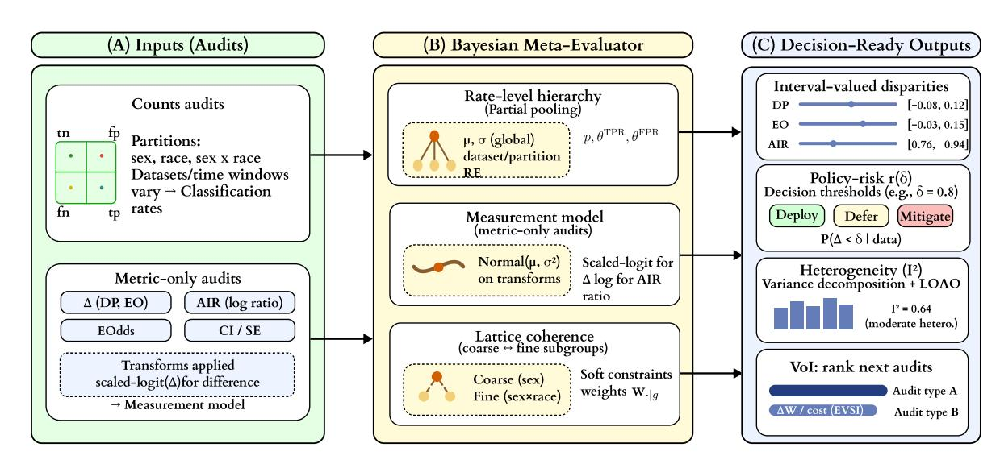
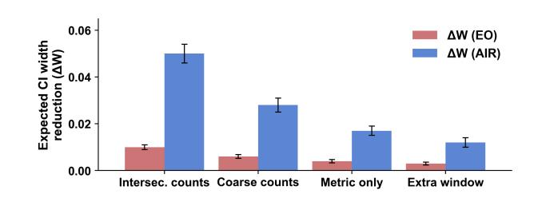
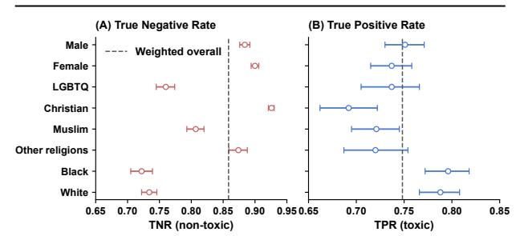

# Audit-of-Audits for the Web: Bayesian Meta-Evaluation that Yields Interval-Valued, Threshold-Aligned Fairness Claims

Dandan Liu s2134717@siswa.um.edu.my Universiti Malaya Kuala Lumpur, Malaysia

Aznul Qalid Md Sabri aznulqalid@um.edu.my Universiti Malaya Kuala Lumpur, Malaysia

Lihu Pan panlh@tyust.edu.cn Taiyuan University of Science and Technology Taiyuan, China

Guangrui Fan∗ fgr@tyust.edu.cn Taiyuan University of Science and Technology Taiyuan, China

# Abstract

For web platforms facing regulatory scrutiny—from content moderation to ad delivery and recommendations—fairness audits routinely disagree due to metric choice, subgroup granularity, sampling variance, and dataset shift. Point estimates yield brittle pass/fail narratives that are hard to defend in governance contexts. We propose a Bayesian audit-of-audits that pools heterogeneous audits—countbased and metric-only—into interval-valued fairness claims with explicit uncertainty and policy-risk tables aligned to practitioner thresholds. The framework unifies classification and exposure metrics, enforces consistency across coarse and intersectional group definitions via soft coherence constraints, and quantifies the Valueof-Information of prospective audits. We also provide heterogeneity diagnostics and leave-one-audit-out sensitivities. Across a synthetic Audit Zoo, a content-moderation case study on CivilComments– WILDS, and an ad-delivery simulation, our meta-evaluator attains near-nominal coverage with narrower intervals and fewer decision flips than per-audit baselines, while integrating partial-information audits.

# CCS Concepts

- Information systems → Page and site ranking; Online advertising; • Social and professional topics → Sustainability.

# Keywords

Algorithmic fairness, Bayesian meta-analysis, Uncertainty quantification, Content moderation, Ranking fairness, Exposure fairness, Value of information

### ACM Reference Format:

Dandan Liu, Aznul Qalid Md Sabri, Lihu Pan, and Guangrui Fan. 2026. Audit-of-Audits for the Web: Bayesian Meta-Evaluation that Yields Interval-Valued, Threshold-Aligned Fairness Claims. In Proceedings of the ACM Web Conference 2026 (WWW '26), April 13–17, 2026, Dubai, United Arab Emirates. ACM, New York, NY, USA, [12](#page-11-0) pages.<https://doi.org/10.1145/3774904.3792974>

© 2026 Copyright held by the owner/author(s). ACM ISBN 979-8-4007-2307-0/2026/04 <https://doi.org/10.1145/3774904.3792974>

# 1 Introduction

Fairness audits are now routine across web platforms: content moderation, recommendations, search, and ad delivery, yet practitioners frequently observe conflicting conclusions across audits of the same system. Results hinge on metric choice (e.g., selection rate vs. TPR/FPR), subgroup granularity (coarse vs. intersectional), dataset idiosyncrasies (sampling frames, label noise), and finite-sample variance. Widely used audit toolkits (AIF360, Fairlearn, Aeqitas) make single-audit assessments accessible but ultimately produce per-audit point estimates or per-audit intervals rather than a synthesized, decision-ready view [\[2,](#page-8-0) [23,](#page-8-1) [29\]](#page-8-2). Meanwhile, evidence from the web domain illustrates how optimization and platform mechanics can induce disparate outcomes (e.g., ad-delivery skew even under neutral targeting), underscoring the risks of drawing strong claims from any one audit [\[1\]](#page-8-3). At the same time, dataset reviews document label noise, prevalence drift, and other quirks that complicate audit comparability [\[9\]](#page-8-4). From a policy perspective, organizations are asked to reason about risk under uncertainty, which requires more than a brittle pass/fail decision [\[8,](#page-8-5) [21,](#page-8-6) [27\]](#page-8-7).

Theory shows that auditing only a handful of groups can mask violations on structured subgroups and that calibration should hold on rich families of subpopulations (multicalibration) [\[13,](#page-8-8) [16\]](#page-8-9). In practice, re-binning groups can even reverse aggregate conclusions (Simpson's paradox) [\[25\]](#page-8-10). Intersectional settings suffer from small cells; Bayesian modeling improves coverage but is typically deployed within a single dataset rather than across heterogeneous audits [\[11,](#page-8-11) [12\]](#page-8-12). On the web, harms often arise through exposure and attention in ranking—where fairness is naturally pairwise/exposurebased rather than purely classification-based [\[3,](#page-8-13) [24\]](#page-8-14). These considerations motivate moving from per-audit point estimates to intervalvalued statements that pool evidence across audits, with explicit uncertainty that supports governance. Methodologically, decades of evidence synthesis suggest how to aggregate heterogeneous studies (random-effects, beta–binomial/Dirichlet–multinomial), but fairness audits introduce additional structure: multiple metric families, subgroup lattices, and frequent "metric-only" reports without counts [\[6,](#page-8-15) [19\]](#page-8-16). Fairness definitions are known to be mutually incompatible under realistic conditions; as a result, auditing a single metric can be misleading about overall risk. Pooling across multiple audits and metrics helps contextualize these tradeoffs. Because deployment decisions often depend on which audits are available, we complement pooling with between-audit heterogeneity reporting and leave-one-audit-out (LOAO) sensitivity to assess external validity.

We propose a Bayesian audit-of-audits that pools heterogeneous audits—including both count-based and metric-only reports and

∗Corresponding author.

[This work is licensed under a Creative Commons Attribution 4.0 International License.](https://creativecommons.org/licenses/by/4.0) WWW '26, Dubai, United Arab Emirates.

spanning classification and exposure/ranking settings—into intervalvalued fairness claims with explicit uncertainty and policy-risk tables aligned to practitioner thresholds. We study: RQ1 (Robustness). Do posterior credible intervals from a cross-audit hierarchical model achieve nominal coverage and improved resolution (narrower width) relative to single-audit intervals across metric choices, subgroup granularities (including intersectional), and perturbations (re-binning, label noise, dataset shift)? RQ2 (Decision stability). Do interval-valued claims with policy-risk summaries yield fewer deploy/defer/mitigate decision flips than point-estimate audits under realistic perturbations, including web-native exposure/ranking scenarios? RQ3 (Partial information). When some audits provide only aggregated metric values (no counts), can the meta-evaluator integrate them without bias, and quantify the expected interval shrinkage contributed by a prospective audit (VoI), in line with evidence-synthesis best practices?

Consider an ad-delivery system that has been audited repeatedly over the past year. Internal and external teams have produced a dozen fairness audits spanning different markets, subgroup partitions, metric families, and report formats. The legal and policy teams must answer questions such as: "Over this period of operation, how likely is it that we violated the 80% rule by gender?" and "Under plausible label-noise and dataset-shift scenarios, is it defensible to deploy the current model in a new market without further auditing?" Our audit-of-audits is designed to support exactly such governance questions. It consumes heterogeneous audits, pools information at the rate level while respecting subgroup lattices and between-audit heterogeneity, and produces interval-valued, threshold-aligned fairness claims together with policy-risk tables that can be attached to internal documentation or regulator-facing reports.

Contributions. We introduce a Bayesian audit-of-audits that turns heterogeneous fairness audits into interval-valued, decision-ready claims. Rate-level pooling across audits. A hierarchical model on latent rates (prevalence, TPR/FPR; exposure/CTR) pools evidence across datasets, time windows, and subgroup partitions; fairness disparities are derived from posterior draws. Metric-only integration. A transform-aware measurement model (stabilized logit for bounded differences; log for ratios) ingests audits that report only metric values and CIs/SEs, maintaining calibrated uncertainty. Crossgranularity coherence. Soft, class-conditional coherence links coarse and intersectional partitions via learned composition weights, mitigating Simpson-type reversals while propagating uncertainty. Decision support. Threshold-aligned tail probabilities (e.g., 80% rule), heterogeneity (I2 -like) and LOAO diagnostics, and a Value-of-Information procedure to prioritize the next audit. Figure [1](#page-3-0) provides a high-level overview of the framework.

### 2 Related Work

# 2.1 Tooling for per–audit fairness assessment

Early open–source toolkits made group fairness auditing accessible and reproducible at the level of a single audit. AI Fairness 360 (AIF360) aggregates datasets, metrics, and mitigations into a unified workflow but reports primarily point estimates or per–audit intervals without cross–audit synthesis [\[2\]](#page-8-0). Fairlearn contributes assessors (e.g., MetricFrame) and reduction–based mitigations, with

an emphasis on transparent reporting and sociotechnical framing [\[5,](#page-8-17) [29\]](#page-8-2). Aeqitas focuses on audit usability and a dashboarded report flow [\[23\]](#page-8-1), while fairkit-learn supports model comparison under fairness constraints [\[15\]](#page-8-18). These libraries are complementary to our work: they generate the inputs (counts or metric summaries) we meta–analyze. None aims to pool heterogeneous audits (differing metrics, subgroup partitions, datasets/time windows) into interval–valued, policy–aligned claims across audits.

## 2.2 Subgroup and intersectional fairness

Auditing only a small set of pre–defined groups can conceal large violations over richer subgroup structures. The subgroup–fairness framework and the associated fairness gerrymandering phenomenon formalize this risk and propose auditor–learner procedures to test/learn with exponentially many subgroups [\[16\]](#page-8-9). Multicalibration tightens guarantees by enforcing calibration over computationally identifiable subpopulations [\[13\]](#page-8-8). Intersectional fairness criteria such as Differential Fairness provide privacy–style guarantees across intersections and motivate explicit modeling of small cells [\[12\]](#page-8-12). Bayesian approaches for intersectional fairness pool information to improve estimation robustness and credible–interval coverage when group counts are scarce [\[11\]](#page-8-11). Our lattice–coherence constraints operationalize these insights in a meta–evaluation setting: coarse partitions (e.g., sex) and fine partitions (e.g., sex×race) are linked by estimated composition weights so that pooled intervals remain coherent across granularities.

# 2.3 Fairness for ranking and exposure

On the Web, harms often arise through exposure and attention. Exposure–aware formulations treat exposure as a constrained resource in ranking [\[24\]](#page-8-14), and equity–of–attention proposes amortized individual fairness across sequences of rankings where cumulative attention matters [\[4\]](#page-8-19). In recommender ranking, pairwise notions of fairness measure disparities in win rates or pairwise accuracy and lead to natural BTL–style objectives [\[3,](#page-8-13) [20\]](#page-8-20). Representation–constrained top–�� ranking (FA\*IR and extensions) addresses fairness for multiple protected groups [\[30,](#page-8-21) [31\]](#page-8-22). We contribute a statistical complement: Poisson/Binomial count models for exposures and clicks with offsets, a BTL branch for pairwise wins, and a measurement model for audits that release only exposure–disparity metrics. This places ranking and exposure on equal footing with classification in a single meta–evaluation framework.

### 2.4 Uncertainty for fairness

A growing line of work argues that fairness should be reported with uncertainty. Bayesian inference can produce calibrated intervals for fairness metrics even when labels are missing or scarce [\[14\]](#page-8-23). In retrieval/ranking, recent work quantifies uncertainty in fairness under partial feedback and derives finite–sample intervals that guide thresholding decisions [\[28\]](#page-8-24). Benchmarking studies highlight that ad hoc uncertainty estimates can be unstable or miscalibrated, advocating principled uncertainty reporting for fair decision making [\[22\]](#page-8-25). Our contribution aligns with this trajectory but addresses a distinct gap: we deliver cross–audit posteriors—intervals and policy–risk tables that synthesize evidence across metrics, partitions,

### 3.5 Posterior summaries and decision metrics

From posterior draws of Θ = {��, ��TPR, �� FPR} we compute disparities Δ��,�� (Θ) or ratios ����,�� (Θ) and report: (i) (1 − ��) credible intervals (default 90%), and (ii) policy-risk tail probabilities for a threshold ��,

�� diff ��,�� (��) = Pr |Δ��,�� (Θ)| &gt; ��  D , (3.13)

�� ratio ��,�� (��) = Pr min{����,�� (Θ), 1/����,�� (Θ)} &lt; ��  D . (3.14)

For equalized odds we report componentwise risks and the union event. Worst-group functionals (e.g., WGAcc) are computed as minima over groups on each posterior draw (details for overlapping groups in App. [B.5\)](#page-9-0).

### 3.6 Between-audit heterogeneity and Value-of-Information

We summarize between-audit heterogeneity by an �� 2 -like diagnostic that compares between- and within-audit variance of per-audit disparities; see App. [B.9](#page-9-1) for details. An �� 2 value near zero indicates that most posterior variance arises from within-audit noise, while larger values signal meaningful cross-audit differences. We report �� for each metric family (DP, EO, AIR) in Sec. [5.2.](#page-5-0) To prioritize future audits, we compute a Value-of-Information (VoI) score for each candidate audit design, defined as the expected reduction in a target interval width when that audit is hypothetically added to the bundle. We follow a standard EVSI-style Monte Carlo procedure (App. [B.10\)](#page-9-2) and report VoI for synthetic and ads settings in Sec. [5.1](#page-5-1) and Sec. [5.4.](#page-6-0)

### 3.7 Variants used only where needed

In a few settings we deviate from the default Binomial/Multinomial + logit-normal random-effects path. For overlapping identity groups (CivilComments–WILDS), we switch to a Beta–Binomial overdispersed likelihood and disable lattice coherence (App. [B.5\)](#page-9-0). For label-noise sensitivity, we introduce a group-specific misclassification matrix that maps latent (��, �� ˆ ★) rates to observed (��, �� ˆ ) (App. [B.8\)](#page-9-3). For exposure/CTR and pairwise ranking, we extend the rate-level setup to Poisson/Binomial and BTL models with an optional propensity-weighted path (App. [B.6\)](#page-9-4). These variants share the same posterior summarization as the core model.

# 3.8 Inference and implementation

We fit the model by HMC/NUTS; for larger bundles we use mean-field VI with PSIS correction and spot-check with HMC. All priors, hyperpriors, and sampling settings are summarized in Appendix [B.1](#page-8-28) and [B.11.](#page-9-5) We verify calibration via simulation-based calibration and posterior predictive checks (Appendix [B.12\)](#page-9-6).

# 4 Experimental

We evaluate the meta-evaluator on three settings: (i) a synthetic Audit Zoo stressing calibration and stability, (ii) a web-native CivilComments–WILDS moderation task with overlapping identity groups, and (iii) an ad-delivery simulation with optimizationinduced skew. We compare against strong baselines and report calibration, resolution, decision stability, and threshold-aligned policy risk.

### 4.1 Global experimental protocol

Unless noted, we evaluate (i) ΔDP and ΔEO at thresholds �� ∈ {0.02, 0.05}, and (ii) ��AIR at �� = 0.8 (80% rule). Policy risk is computed as in Sec. [3.5.](#page-4-0) For CivilComments–WILDS, worst-group functionals use �� ∈ {0.70, 0.75} for WGAcc and {0.70, 0.80} for WGTPR/WGTNR.

We report: Calibration: empirical coverage of (1 − ��) credible intervals vs. nominal (default �� = 0.1). Resolution: median posterior interval width at fixed nominal coverage. Decision stability: fraction of (deploy/defer/mitigate) flips under (a) subgroup re-binning, (b) +2pp label-noise, (c) dataset shift (Audit Zoo). Policy risk: ��(��) tail probability against the thresholds above. We compare to five common baselines (Table [1\)](#page-4-1): Single-audit point/CI, per-audit bootstrap, random-effects meta-analysis on reported disparities, beta–binomial meta-synthesis on counts, and toolkit metrics (AIF360/Fairlearn/Aequitas-like). The baseline set is consistent across settings.

Table 1: Baselines compared in all settings.

| Baseline  | Description                                              |
|-----------|----------------------------------------------------------|
| point     | [17]                                                     |
|           | Compute disparity from one audit (chosen by sample       |
|           | size) without pooling; no uncertainty or only plugin CI. |
| Bootstrap | per                                                     |
| audit     | [7]                                                      |
|           | Nonparametric bootstrap CIs per audit; ignores cross    |
|           | audit variability and lattice coherence.                 |
|           | DerSimonian–Laird on reported disparities (differ       |
|           | ences/ratios), metric-wise; no rate-level modeling.      |
| [10,      | 19]                                                      |
|           | Meta-analysis on counts using beta–binomial compo       |
|           | nents; no lattice coherence or metric-bridging.          |
| Toolkit   | metrics                                                  |
| [2, 23,   | 29]                                                      |
|           | AIF360/Fairlearn/Aequitas-style per-audit metrics and    |
|           | (when available) per-audit CIs; no cross-audit pooling.  |

We use weakly-informative Gaussian priors on logit-scale rates, half-normal priors on random-effect scales, and HalfNormal(0.1) for the lattice penalty (Sec. [3.4\)](#page-3-3). Unless stated otherwise, we run NUTS with 4 chains (1,000 warmup + 1,000 draws; target accept 0.9); for large bundles we use mean-field VI with 20,000 iterations and PSIS correction, spot-checking a subset with HMC. Diagnostics: ��b &lt; 1.01, bulk/tail ESS&gt; 400. Unless otherwise noted, deploy if ��(��) &lt; 0.1, defer if 0.1 ≤ ��(��) ≤ 0.4, and mitigate if ��(��) &gt; 0.4. These cutoffs are illustrative and should in practice be negotiated with domain experts, legal teams, and affected stakeholders.

### 4.2 Settings

4.2.1 Audit Zoo. We simulate features ��, protected attributes �� (sex, race), and outcomes �� from logistic models with group effects on prevalence and error rates. A stochastic decision rule generates ��ˆ with controllable TPR/FPR gaps, class imbalance, and label noise. Each bundle draws ��=12 audits from a factor grid. We vary (i) metric family (DP, EO, EOdds, AIR, and combinations), (ii) subgroup partition (sex, race, sex×race), (iii) sample sizes per group (500, 2,000, 10,000 with mild imbalance), (iv) label noise levels (0, 2, 5 percentage points), (v) dataset shift type (none, prevalence, TPR, FPR, or all), (vi) report type (counts, metric-only, or a 50/50 mix), and (vii) an optional exposure/ranking branch. We replicate each grid cell ��=50 times. Lattice coherence (Sec. [3.4\)](#page-3-3) is enabled by default. The full factor grid appears in App. [C.1.](#page-10-2)

4.2.2 CivilComments–WILDS. We follow WILDS splits [\[18\]](#page-8-32). Identity indicators: male, female, LGBTQ, Christian, Muslim, other\_religions, Black, White. We form 16 identity × label cells and audit (i) peridentity TPR/TNR with uncertainty and (ii) worst-group functionals (WGAcc, WGTPR, WGTNR). We create a bundle by varying model/training objective (ERM; label-reweighted; GroupDRO), seed (5), and threshold (5 ROC points). To mimic partner constraints, 50% of audits are converted to metric-only reports with CIs. Overlap handling. Identity groups overlap; we therefore switch to the Beta– Binomial overdispersed variant and disable lattice coherence. The identity-size table is in App. [C.3.](#page-10-3)

4.2.3 Ad-delivery simulation. We simulate six campaigns with budget caps, pacing, and inventory constraints. Even with neutral targeting, optimization can induce skew; we also include a mild proxy-targeting variant. We vary budget (low/medium/high), optimization objective (CTR-only vs. CTR+CPA), targeting (neutral vs. mild demographic proxy), and partitions (sex, race, sex×race). For each campaign we produce audits across 3 time windows with 20 replicates per cell. We report selection/exposure AIR and (when defined) EO-like click outcomes. We log impression-level propensities to enable an IPW CTR sensitivity. The full factor grid appears in App. [C.2.](#page-10-4)

# 4.3 Sensitivities and diagnostics

We complement the core experiments with three sensitivity analyses: (i) a selection-bias sensitivity where audits are included with probabilities that depend on their disparity magnitude and interval width, (ii) a propensity-weighted CTR analysis for exposure audits to assess position/selection bias, and (iii) a leave-one-audit-out (LOAO) analysis and �� -like heterogeneity diagnostic. We refer to App. [B.7,](#page-9-7) [B.6,](#page-9-4) and [B.9](#page-9-1) for the full specifications of these procedures.

### 5 Results

# 5.1 Audit Zoo (RQ1–RQ3)

Calibration and resolution. Table [2](#page-5-2) summarizes empirical coverage and widths over 50 replicates per factor cell (averaged across cells). Our meta-evaluator attains near-nominal coverage with narrower intervals than bootstrap and random-effects meta-analysis, reflecting partial pooling at the rate level.

Table 2: Audit Zoo: Empirical 90% coverage and median CI width (averaged across factor grid). Differences reported on absolute scale; AIR width reported for min(��, 1/��).

| Method                       | DP Cov. | diff Width | EO Cov. | diff Width | AIR Cov. | ratio Width |
|------------------------------|---------|------------|---------|------------|----------|-------------|
| Ours (pooled + coherence)    | 0.91    | 0.036      | 0.90    | 0.039      | 0.90     | 0.120       |
| Random-effects meta-analysis | 0.85    | 0.046      | 0.84    | 0.050      | 0.83     | 0.160       |
| Bootstrap per-audit only     | 0.82    | 0.043      | 0.81    | 0.047      | 0.80     | 0.175       |
| Single-audit point/CI        | 0.76    | 0.034      | 0.75    | 0.036      | 0.74     | 0.150       |

Decision stability. We measure the fraction of (deploy/defer/mitigate) decision flips when we (i) re-bin subgroups, (ii) increase label noise by +2pp, and (iii) shift prevalence across datasets. Our intervals reduce flips relative to non-pooled baselines (Table [3\)](#page-5-3). Flip rates are consistently lower for our meta-evaluator than for per-audit bootstrap, with the largest gains under re-binning and dataset shift.

Table 3: Audit Zoo: Decision flip rate (%) under perturbations (lower is better).

Partial-information robustness (RQ3). We degrade the bundle so that 50% of audits are metric-only. Our measurement model maintains calibration and only slightly widens intervals (Table [4\)](#page-5-4). Using EVSI (Appendix [B.10\)](#page-9-2), we rank prospective audits by expected interval-width shrinkage per unit cost. Intersectional counts provide the largest return (Table [5\)](#page-5-5). Intersectional counts deliver the largest expected shrinkage (Fig. [2\)](#page-5-6), while metric-only reports remain cost-efficient.

Table 4: Audit Zoo: Partial-information (50% metric-only). EO results shown; DP/AIR similar.

| Variant        |              |                | 90% Coverage | Median Width |
|----------------|--------------|----------------|--------------|--------------|
| Ours           | (counts      | + metric-only) | 0.89         | 0.041        |
| Ours           | (counts      | only)          | 0.90         | 0.039        |
| Ours           | (metric-only | only)          | 0.87         | 0.046        |
| Random-effects |              | meta-analysis  | 0.83         | 0.052        |

Table 5: Audit Zoo: VoI ranking (average across bundles). Efficiency is total width shrink per cost unit.

| Candidate audit                     | Δ �� EO | Δ �� AIR | Cost | Efficiency |
|-------------------------------------|---------|----------|------|------------|
| Intersectional counts (2k/group)    | 0.010   | 0.050    | 5.0  | 0.012      |
| Coarse counts (5k/group)            | 0.006   | 0.028    | 4.0  | 0.0085     |
| Metric-only (EO + AIR)              | 0.004   | 0.017    | 1.5  | 0.014      |
| Extra time-window (counts 1k/group) | 0.003   | 0.012    | 1.2  | 0.0125     |

Figure 2: Expected interval-width shrink (EVSI) across candidate audits.

# 5.2 Additional sensitivities

We briefly summarize four additional sensitivity analyses (full details and plots in App. [B.9](#page-9-1)[–H\)](#page-11-1). Heterogeneity and LOAO: Across settings, �� 2 remains moderate (median 0.31 for EO; 0.28 for AIR), indicating meaningful but not overwhelming between-audit variability. LOAO changes in policy-risk are small (median absolute change &lt; 0.02), with the 95th percentile &lt; 0.08. Coherence: With lattice coherence disabled, mean absolute coherence residuals increase and Simpson-style reversals occur in roughly 5–8% of synthetic cells, supporting the role of the coherence penalty. Selection-bias: Under an adverse selection scenario where audits with large |Δ| are more likely to be included, pooled EO intervals widen by about 0.004 on average and �� increases by ≈ 0.05, while policy decisions remain largely stable (the defer region expands slightly). IPW exposure/CTR: In the ad-delivery setting, propensity-weighted CTR analyses shift AIR and CTR gaps by 1–3 points and change ��(��=0.8) by 0.05–0.12, indicating that position/selection bias can materially affect apparent disparities when propensities differ sharply by group.

### 5.3 CivilComments–WILDS

Pooling across seeds, thresholds, and training objectives improves calibration of per-identity TPR/TNR and yields tighter intervals for worst-group metrics (Table [6](#page-6-1) and Table [7\)](#page-6-2). For example, our 90% CI for WGAcc narrows by ∼20–30% vs. per-audit bootstrap while maintaining near-nominal coverage. Policy-risk tables at �� ∈ {0.70, 0.75} show fewer defer/mitigate flips across model variants relative to single-audit decisions. Identity-wise uncertainty narrows for larger groups (Fig. [3\)](#page-6-3) for TNR and TPR, while notably hard identities retain wider CIs. WGAcc is the minimum of identity-wise accuracy across the 16 identity×label cells; WGTPR (resp. WGTNR) is the minimum of identity-wise TPR (resp. TNR). We compute policy-risk tail probabilities��(��) = Pr(WG &lt; �� | D) from posterior draws.

Table 6: CivilComments–WILDS: Worst-group summaries (posterior median [90% CI]) and policy risk ��(��).

From a moderation perspective, Table [6](#page-6-1) indicates that even after pooling across models, seeds, and thresholds, the system exhibits substantial uncertainty in its worst-group performance. For example, the posterior median worst-group accuracy (WGAcc) is 0.71 with a 90% credible interval [0.68, 0.74], and there is a 91% posterior probability that WGAcc falls below 0.75. In other words, under most plausible parameter values the system fails to achieve what many stakeholders might consider an acceptable worst-group accuracy threshold. Our framework makes this residual risk explicit, rather than allowing a single favorable audit to obscure the possibility that some identity group experiences much lower accuracy.

Table [7](#page-6-2) reveals notable variation across identities. In particular, Black and White groups exhibit the lowest TNR (non-toxic classification), suggesting that the model over-predicts toxicity for comments mentioning these identities. LGBTQ and Muslim identities also show elevated false-positive rates. This pattern—higher TPR but lower TNR for race-related identities—aligns with known annotation biases in toxicity datasets.

### 5.4 Ad-delivery Simulation

We simulate six campaigns with neutral vs. mild proxy targeting across budgets (low/med/high), creating audits over sex, race, and intersections. Pooling across campaigns and windows separates

Table 7: CivilComments–WILDS: Per-identity performance (posterior median [90% CI]) for TNR (non-toxic) and TPR (toxic).

|                 |   | TNR |     |     |     |     |     |     | TPR |     | (toxic) |     |   |
|-----------------|---|-----|-----|-----|-----|-----|-----|-----|-----|-----|---------|-----|---|
| Male            | 0 | 884 | [ 0 | 876 | , 0 | 892 | ] 0 | 751 | [ 0 | 730 | , 0     | 771 | ] |
| Female          | 0 | 900 | [ 0 | 894 | , 0 | 906 | ] 0 | 737 | [ 0 | 715 | , 0     | 758 | ] |
| LGBTQ           | 0 | 760 | [ 0 | 745 | , 0 | 774 | ] 0 | 737 | [ 0 | 705 | , 0     | 766 | ] |
| Christian       | 0 | 926 | [ 0 | 921 | , 0 | 930 | ] 0 | 692 | [ 0 | 662 | , 0     | 722 | ] |
| Muslim          | 0 | 807 | [ 0 | 793 | , 0 | 820 | ] 0 | 721 | [ 0 | 695 | , 0     | 745 | ] |
| Other religions | 0 | 874 | [ 0 | 859 | , 0 | 888 | ] 0 | 720 | [ 0 | 687 | , 0     | 754 | ] |
| Black           | 0 | 722 | [ 0 | 705 | , 0 | 739 | ] 0 | 796 | [ 0 | 772 | , 0     | 818 | ] |
| White           | 0 | 734 | [ 0 | 722 | , 0 | 746 | ] 0 | 788 | [ 0 | 766 | , 0     | 808 | ] |

Figure 3: Per-identity TNR and TPR side-by-side with 90% CIs.

sampling variance from optimization-induced skew (Table [8\)](#page-6-4). Risk varies across campaigns and time windows; proxy targeting increases the probability of violating the 80% rule. Intersectional counts at medium budget delivered the largest Δ�� for AIR (≈ 0.05 average shrink), while an extra neutral high-budget window yielded smaller but cost-efficient gains (Table [5\)](#page-5-5).

Table 8: Ad-delivery: AIR for female vs. male exposure by campaign. Reported as median [90% CI] with ��(��=0.8).

|          |         |      |          | Ours: |    | AIR |    | [90% |    | CI] �� | ( �� ) |   |    |     |    |     |    | AIR |
|----------|---------|------|----------|-------|----|-----|----|------|----|--------|--------|---|----|-----|----|-----|----|-----|
| Neutral  | /       | Low  | budget   | 0     | 86 | [ 0 | 79 | , 0  | 94 | ] 0    | 31     | 0 | 83 | [ 0 | 73 | , 0 | 95 | ]   |
| Neutral  | /       | High | budget   | 0     | 91 | [ 0 | 86 | , 0  | 97 | ] 0    | 12     | 0 | 90 | [ 0 | 82 | , 1 | 00 | ]   |
| Proxy    | (mild)  |      | / Medium | 0     | 78 | [ 0 | 72 | , 0  | 84 | ] 0    | 67     | 0 | 75 | [ 0 | 66 | , 0 | 85 | ]   |
| Proxy    | (mild)  |      | / High   | 0     | 81 | [ 0 | 75 | , 0  | 87 | ] 0    | 44     | 0 | 80 | [ 0 | 71 | , 0 | 91 | ]   |
| Creative | variant |      | A / Med  | 0     | 88 | [ 0 | 82 | , 0  | 95 | ] 0    | 21     | 0 | 86 | [ 0 | 77 | , 0 | 97 | ]   |
| Creative | variant |      | B / Med  | 0     | 84 | [ 0 | 78 | , 0  | 91 | ] 0    | 36     | 0 | 81 | [ 0 | 71 | , 0 | 93 | ]   |

For the ad-delivery simulation, pooling across campaigns and time windows distinguishes sampling variability from optimizationinduced skew. For instance, the "Proxy (mild) / Medium" campaign has a pooled female-to-male exposure AIR of 0.78 with a 90% credible interval [0.72, 0.84], and a 67% posterior probability of violating the 80% rule (��(��=0.8) = 0.67). By contrast, the neutral high-budget campaign has ��(��=0.8) = 0.12. This suggests that even mild proxy targeting can produce substantively higher policy risk than neutral targeting, and that relying on a single audit window could easily undervalue or overstate this risk depending on when the audit was conducted. Our audit-of-audits aggregates over these windows and reports a stable risk profile aligned with governance thresholds.

### 5.5 Ablations and Sensitivity

We ablate key components on the Audit Zoo and report sensitivity to priors and label-noise assumptions. Table [9](#page-7-0) shows coverage/width for EO and decision flips.

Table 9: Ablations (Audit Zoo, EO metric). Left: empirical coverage and width. Right: flip rate (%).

|               | Variant Full (pooled | + coherence)   | Cov. 0.90 | Coverage/Width Width 0.039 | Flip Re-binning 7.2 | rate (%) Shift 11.1 |
|---------------|----------------------|----------------|-----------|----------------------------|---------------------|---------------------|
| No            | hierarchical         | pooling        | 0.84      | 0.047                      | 12.9                | 17.8                |
| No            | lattice              | coherence      | 0.88      | 0.043                      | 9.6                 | 13.9                |
| No            | label-noise          | model          | 0.88      | 0.040                      | 8.4                 | 12.7                |
| Overdispersed |                      | like. only 1   | 0.87      | 0.044                      | 10.2                | 14.6                |
| Stronger      | priors               | (scales × 0 5) | 0.91      | 0.037                      | 7.0                 | 10.8                |
| Weaker        | priors               | (scales × 2)   | 0.89      | 0.041                      | 7.6                 | 11.9                |
| Diff.         | vs. log-ratio        | (AIR)          | 0.90      | 0.120 (AIR)                | –                   | –                   |

### 6 Discussion and Conclusion

This paper introduces a Bayesian audit-of-audits that synthesizes heterogeneous fairness audits—count-based and metric-only, classification and exposure—into interval-valued, threshold-aligned claims. By pooling at the rate level and enforcing soft coherence across subgroup granularities, the method achieves near-nominal coverage with tighter intervals, reduces decision flips under realistic perturbations, and integrates partial-information audits without ad hoc adjustments. The approach is intentionally pragmatic: it fits within current audit toolchains, aligns with risk-based governance practices, and foregrounds uncertainty in deployment decisions.

Our results demonstrate that estimating uncertainty at the rate level and deriving disparities post hoc yields claims that are both calibrated and decision-stable. This directly addresses three core tensions: disagreement across metric families, instability under subgroup re-binning, and fragmented evidence when partners share only metric summaries. By reporting threshold-aligned tail probabilities (policy risk), our summaries map cleanly to governance thresholds such as the 80% adverse-impact rule [\[27\]](#page-8-7) and contemporary risk-management guidance [\[8,](#page-8-5) [21\]](#page-8-6). Methodologically, pooling latent rates generalizes Beta-Binomial meta-analysis [\[6,](#page-8-15) [19\]](#page-8-16) to multi-metric, multi-partition regimes. The transform-aware measurement model allows principled incorporation of metric-only audits without requiring raw counts, while the subgroup-lattice penalties integrate insights from intersectional fairness—mitigating Simpson-style reversals by softly linking coarse and intersectional partitions [\[12,](#page-8-12) [16,](#page-8-9) [25\]](#page-8-10). For ranking and feeds, the exposure/CTR branch places pairwise and exposure fairness on the same statistical footing as classification audits [\[3,](#page-8-13) [24\]](#page-8-14).

Practically, a single posterior over rate parameters supports a compact workflow: audits are encoded as counts or metric-only measurements with CIs/SEs; the model is fit once using the default dispersion path (Binomial/Multinomial with logit-normal random effects); and decision summaries are read directly from posterior intervals and policy-risk tables. Between-audit heterogeneity (�� ) and leave-one-audit-out sensitivity provide external-validity diagnostics—�� remains moderate across our studies, and LOAO

perturbations of policy risk are correspondingly small, suggesting pooled claims are not dominated by any single audit. Value-of-Information calculations operationalize audit planning by ranking prospective audits by expected interval-width reduction, which is particularly useful when partners must decide whether to invest in intersectional counts versus lower-cost metric-only reports.

Audits should be pooled only when they plausibly measure the same underlying system in comparable contexts—same model family and product surface, with differences across datasets or time windows viewed as sampling variation rather than fundamentally different causal regimes. Regulatory or governance questions should be posed at the level of the pooled object. When �� is low or moderate and LOAO perturbations are small, pooled intervals offer compact and defensible summaries; when �� 2 is high or LOAO reveals large changes when individual audits are removed, practitioners should treat pooled summaries as exploratory and inspect per-audit intervals or fit separate models per system version, region, or other salient context.

Our outputs—interval-valued disparities and policy-risk tables serve three stakeholder groups. Internal audit and responsible-AI teams can use pooled intervals to avoid cherry-picking single favorable audits and quantify residual risk of threshold violations under realistic uncertainty. Legal and compliance teams can attach these summaries to documentation as part of risk-based governance frameworks such as the NIST AI RMF and EU AI Act, which explicitly call for uncertainty-aware measurement. External auditors and civil-society partners can use the same tools to interrogate whether a platform is presenting a balanced picture of audit outcomes. Risk tables can be rendered in plain language for nontechnical stakeholders. Any meta-analytic tool can be misused for "audit washing"—selectively including favorable audits or choosing pooling strategies that downplay heterogeneity. We recommend three safeguards: (i) transparent disclosure of included audits and their basic characteristics (time window, system version, partitions, metrics), (ii) routine sensitivity checks (selection-bias, LOAO) with reported envelopes of policy risk ��(��), and (iii) independent crossfunctional review involving legal, policy, and affected stakeholders in decisions about audit inclusion and threshold choices. These safeguards make it easier for external observers to detect and contest results inconsistent with underlying evidence.

The analysis is observational: we quantify statistical disparities, not causal effects, and platform-level confounding can persist without additional identification structure. The measurement model for metric-only audits inherits the quality of external CIs/SEs; weakly informative noise priors help guard against mis-specification but cannot fully repair biased uncertainty reports. Lattice coherence relies on partially identified composition weights when only oneway marginals are available; the Dirichlet prior and learned penalty variance let the data relax the constraint, yet residual misspecification is possible. These limitations are visible through our sensitivity analyses.

Three directions appear impactful: extending rate-level synthesis to multiclass and multilabel moderation and recommendation tasks; adding privacy-preserving metric-only interfaces with uncertainty propagation; and developing streaming/amortized inference for continuous auditing.

1Enable either REs or overdispersion, not both.

References [1] Muhammad Ali, Piotr Sapiezynski, Miranda Bogen, Aleksandra Korolova, Alan Mislove, and Aaron Rieke. 2019. Discrimination through Optimization: How Facebook's Ad Delivery Can Lead to Skewed Outcomes. arXiv preprint arXiv:1904.02095 (2019).<https://arxiv.org/abs/1904.02095> [2] Rachel KE Bellamy, Kuntal Dey, Michael Hind, and et al. 2018. AI Fairness 360: An Extensible Toolkit for Detecting, Understanding, and Mitigating Unwanted Algorithmic Bias. arXiv preprint arXiv:1810.01943 (2018). [https://arxiv.org/abs/](https://arxiv.org/abs/1810.01943) [1810.01943](https://arxiv.org/abs/1810.01943) [3] Alex Beutel, Jilin Chen, Tulsee Doshi, Hai Qian, Li Wei, Yi Wu, Lukasz Heldt, Zhe Zhao, Lichan Hong, Ed H. Chi, and Cristos Goodrow. 2019. Fairness in Recommendation Ranking through Pairwise Comparisons. In Proceedings of KDD. [doi:10.1145/3292500.3330745](https://doi.org/10.1145/3292500.3330745) [4] Asia J. Biega, Krishna P. Gummadi, and Gerhard Weikum. 2018. Equity of Attention: Amortizing Individual Fairness in Rankings. In Proceedings of SIGIR. 405–414. [doi:10.1145/3209978.3210063](https://doi.org/10.1145/3209978.3210063) [5] Sarah Bird, Miroslav Dudík, Richard Edgar, Brandon Horn, Roman Lutz, Vanessa Milan, Mehrnoosh Sameki, Hanna Wallach, and Kathleen Walker. 2020. Fairlearn: A toolkit for assessing and improving fairness in AI. Technical Report MSR-TR-2020-32. Microsoft Research. [https://www.microsoft.com/en-us/research/wp](https://www.microsoft.com/en-us/research/wp-content/uploads/2020/05/Fairlearn_WhitePaper-2020-09-22.pdf)[content/uploads/2020/05/Fairlearn\\_WhitePaper-2020-09-22.pdf](https://www.microsoft.com/en-us/research/wp-content/uploads/2020/05/Fairlearn_WhitePaper-2020-09-22.pdf) [6] Rebecca DerSimonian and Nan Laird. 1986. Meta-analysis in Clinical Trials. Controlled Clinical Trials 7, 3 (1986), 177–188. [https://pubmed.ncbi.nlm.nih.gov/](https://pubmed.ncbi.nlm.nih.gov/3802833/) [3802833/](https://pubmed.ncbi.nlm.nih.gov/3802833/) [7] Bradley Efron and Robert J. Tibshirani. 1994. An Introduction to the Bootstrap. Chapman and Hall/CRC, New York. [doi:10.1201/9780429246593](https://doi.org/10.1201/9780429246593) [8] European Union. 2024. Regulation (EU) 2024/1689 of the European Parliament and of the Council of 13 June 2024 (EU AI Act). Official Journal of the European Union.<https://eur-lex.europa.eu/eli/reg/2024/1689/oj/eng> [9] Alessandro Fabris, Stefano Messina, Gianmaria Silvello, and Gian Antonio Susto. 2022. Algorithmic Fairness Datasets: The Story So Far. Data Mining and Knowledge Discovery 36 (2022), 2074–2152. [doi:10.1007/s10618-022-00854-z](https://doi.org/10.1007/s10618-022-00854-z) [10] Moritz Felsch, Lars Beckmann, Ralf Bender, Oliver Kuss, Guido Skipka, and Tim Mathes. 2022. Performance of several types of beta-binomial models in comparison to standard approaches for meta-analyses with very few studies. BMC Medical Research Methodology 22, 1 (2022), 319. [https://link.springer.com/](https://link.springer.com/article/10.1186/s12874-022-01779-3) [article/10.1186/s12874-022-01779-3](https://link.springer.com/article/10.1186/s12874-022-01779-3) [11] James R. Foulds, Rashidul Islam, Kamrun N. Keya, and Shimei Pan. 2020. Bayesian Modeling of Intersectional Fairness: The Variance of Bias. In Proceedings of SDM. [doi:10.1137/1.9781611976236.48](https://doi.org/10.1137/1.9781611976236.48) [12] James R. Foulds, Rashidul Islam, Kamrun Naher Keya, and Shimei Pan. 2020. An Intersectional Definition of Fairness. In IEEE International Conference on Data Engineering (ICDE). 1918–1921. [doi:10.1109/ICDE48307.2020.00203](https://doi.org/10.1109/ICDE48307.2020.00203) [13] Úrsula Hébert-Johnson, Michael P. Kim, Omer Reingold, and Guy N. Rothblum. 2018. Multicalibration: Calibration for the (Computationally-Identifiable) Masses. In Proceedings of ICML (PMLR, Vol. 80). 1939–1948. [https://proceedings.mlr.press/](https://proceedings.mlr.press/v80/hebert-johnson18a.html) [v80/hebert-johnson18a.html](https://proceedings.mlr.press/v80/hebert-johnson18a.html) [14] Disi Ji, Padhraic Smyth, and Mark Steyvers. 2020. Can I Trust My Fairness Metric? Assessing Fairness with Unlabeled Data and Bayesian Inference. In Advances in Neural Information Processing Systems (NeurIPS). [https://proceedings.neurips.cc/](https://proceedings.neurips.cc/paper/2020/file/d83de59e10227072a9c034ce10029c39-Paper.pdf) [paper/2020/file/d83de59e10227072a9c034ce10029c39-Paper.pdf](https://proceedings.neurips.cc/paper/2020/file/d83de59e10227072a9c034ce10029c39-Paper.pdf) [15] Brittany Johnson and Yuriy Brun. 2022. Fairkit-learn: a fairness evaluation and comparison toolkit. In Proceedings of the ACM/IEEE 44th international conference on software engineering: Companion proceedings. 70–74. [doi:10.1145/3510454.](https://doi.org/10.1145/3510454.3516830) [3516830](https://doi.org/10.1145/3510454.3516830) [16] Michael Kearns, Seth Neel, Aaron Roth, and Zhiwei Steven Wu. 2018. Preventing Fairness Gerrymandering: Auditing and Learning for Subgroup Fairness. In Proceedings of ICML (PMLR, Vol. 80). 2564–2572. [https://proceedings.mlr.press/](https://proceedings.mlr.press/v80/kearns18a.html) [v80/kearns18a.html](https://proceedings.mlr.press/v80/kearns18a.html) [17] Donguk Kim. 2013. Categorical data analysis, by AGRESTI, ALAN. [18] Pang Wei Koh, Shiori Sagawa, et al. 2021. WILDS: A Benchmark of in-the-wild Distribution Shifts. In ICML. [19] Tim Mathes and Oliver Kuss. 2021. Beta-binomial models for meta-analysis with binary outcomes: variations, extensions, and additional insights from econometrics. Research Methods in Medicine & Health Sciences 2, 2 (2021), 82–89. [doi:10.1177/2632084321996225](https://doi.org/10.1177/2632084321996225) [20] Harikrishna Narasimhan, Andrew Cotter, Maya Gupta, and Serena Wang. 2020. Pairwise fairness for ranking and regression. In Proceedings of the AAAI Conference on Artificial Intelligence, Vol. 34. 5248–5255. [https://ojs.aaai.org/index.php/](https://ojs.aaai.org/index.php/AAAI/article/view/5970) [AAAI/article/view/5970](https://ojs.aaai.org/index.php/AAAI/article/view/5970) [21] NIST. 2023. Artificial Intelligence Risk Management Framework (AI RMF 1.0). Technical Report NIST AI 100-1. National Institute of Standards and Technology. [doi:10.6028/NIST.AI.100-1](https://doi.org/10.6028/NIST.AI.100-1) [22] Lucas Rosenblatt and R. Teal Witter. 2025. FairlyUncertain: A Comprehensive Benchmark of Uncertainty in Algorithmic Fairness. ICLR 2025 (OpenReview preprint).<https://openreview.net/forum?id=C1Wp4ubvXZ> [23] Pedro Saleiro, Benedict Kuester, Loren Hinkson, Jesse London, Abby Stevens, Ari Anisfeld, Kit T. Rodolfa, and Rayid Ghani. 2018. Aequitas: A Bias and Fairness Audit Toolkit. arXiv preprint arXiv:1811.05577 (2018). [https://arxiv.org/abs/1811.](https://arxiv.org/abs/1811.05577) [05577](https://arxiv.org/abs/1811.05577) [24] Ashudeep Singh and Thorsten Joachims. 2018. Fairness of Exposure in Rankings. In Proceedings of KDD. 2219–2228. [doi:10.1145/3219819.3220088](https://doi.org/10.1145/3219819.3220088) [25] Jan Sprenger. 2021. Simpson's Paradox. In Stanford Encyclopedia of Philosophy (Fall 2024 Edition), Edward N. Zalta and Uri Nodelman (Eds.). [https://plato.](https://plato.stanford.edu/archives/fall2024/entries/paradox-simpson/) [stanford.edu/archives/fall2024/entries/paradox-simpson/](https://plato.stanford.edu/archives/fall2024/entries/paradox-simpson/) [26] Daniel O Stram. 1996. Meta-analysis of published data using a linear mixed-effects model. Biometrics (1996), 536–544.<https://pubmed.ncbi.nlm.nih.gov/8672702/> [27] U.S. Equal Employment Opportunity Commission. 1979. Questions and Answers to Clarify and Provide a Common Interpretation of the Uniform Guidelines on Employee Selection Procedures. [https://www.eeoc.gov/laws/guidance/questions](https://www.eeoc.gov/laws/guidance/questions-and-answers-clarify-and-provide-common-interpretation-uniform-guidelines)[and-answers-clarify-and-provide-common-interpretation-uniform-guidelines](https://www.eeoc.gov/laws/guidance/questions-and-answers-clarify-and-provide-common-interpretation-uniform-guidelines) [28] Lequn Wang and Thorsten Joachims. 2023. Uncertainty Quantification for Fairness in Two-Stage Recommender Systems. (2023), 940–948. [doi:10.1145/3539597.](https://doi.org/10.1145/3539597.3570469) [3570469](https://doi.org/10.1145/3539597.3570469) [29] Hilde Weerts, Miroslav Dudík, Richard Edgar, Adrin Jalali, Roman Lutz, and Michael Madaio. 2023. Fairlearn: Assessing and Improving Fairness of AI Systems. Journal of Machine Learning Research 24 (2023), 1–8. [https://www.jmlr.org/](https://www.jmlr.org/papers/volume24/23-0389/23-0389.pdf) [papers/volume24/23-0389/23-0389.pdf](https://www.jmlr.org/papers/volume24/23-0389/23-0389.pdf) [30] Meike Zehlike, Francesco Bonchi, Carlos Castillo, Sara Hajian, Mohamed Megahed, and Ricardo Baeza-Yates. 2017. FA\*IR: A Fair Top-k Ranking Algorithm. arXiv preprint arXiv:1706.06368 (2017).<https://arxiv.org/abs/1706.06368> [31] Meike Zehlike, Tom Sühr, Ricardo Baeza-Yates, Francesco Bonchi, Carlos Castillo, and Sara Hajian. 2022. Fair Top-k Ranking with multiple protected groups. Information Processing Management 59, 1 (2022), 102707. [doi:10.1016/j.ipm.2021.](https://doi.org/10.1016/j.ipm.2021.102707) [102707](https://doi.org/10.1016/j.ipm.2021.102707) A Notation Reference Table [10](#page-9-8) summarizes the key symbols and their meanings used throughout this paper. B Additional Method Details B.1 Priors and hyperpriors We use weakly informative Gaussian priors on logit-scaled rates with half-normal priors on RE scales (����,· , ����,· , ����,· ). Defaults and ranges are in Table [14.](#page-10-5) We keep the same priors across datasets for comparability. B.2 Dispersion modes: when to use which Mode A (default): Multinomial/Binomial + logit-normal REs. Use when groups form a partition and counts are independent given rates. Mode B (overdispersed): Dirichlet–Multinomial or Beta– Binomial with no per-cell idiosyncratic REs. Use when within-cell dependence or overlap violates independence (e.g., CivilComments– WILDS). Do not combine per-cell REs and overdispersion. B.3 Metric-only calibration and delta method When a partner reports a disparity ��b with CI (��,�� ), we set �� in [\(3.8\)](#page-3-1)–[\(3.9\)](#page-3-2) from the reported scale or via the delta method on the transformation ℎ(·). We validate calibration by simulating audits from known counts, fitting the measurement model, and checking empirical coverage (SBC plots included). metric-only uncertainty, we rerun the Audit Zoo with metric-only audits whose reported CIs are artificially shrunk (by 30%) or inflated (by 30%) relative to the truth. In the under-confident case, the pooled intervals modestly narrow and empirical coverage decreases by ≈ 2–3 percentage points; in the over-confident case, intervals widen and coverage increases slightly. In both cases, the �� 2 diagnostic and LOAO curves signal discordant audits when they

Robustness to miscalibrated CIs. To probe sensitivity to mis-specified

| Factor                | Levels                                               | Symbol / Notes           |
|-----------------------|------------------------------------------------------|--------------------------|
| Metric family         | DP diff; EO diff; EOdds vector; AIR ratio; DP+EO+AIR | Δ DP , Δ EO , �� AIR     |
| Subgroup partition    | sex ; race ; sex × race                              | lattice coherence active |
| Sample size per group | �� ∈ { 500 , 2 , 000 , 10 , 000 }                    | imbalanced cells         |
| Label noise           | ��                                                   |                          |
|                       | ± ∈ { 0 , 0 02 , 0 05 }                              | flip probabilities       |
| Dataset shift         | none; prevalence; TPR; FPR; all                      | shift across ��          |
| Report type           | counts; metric-only; mix 50/50                       | metric-only has CIs      |
| Exposure/ranking      | off; on                                              | optional                 |
| Replicates            | �� = 50                                              | per factor cell          |

| Factor       |      | Levels  |          |             |              | Notes       |                              |
|--------------|------|---------|----------|-------------|--------------|-------------|------------------------------|
| Budget       |      | low     | / medium | /           | high         | affects     | pacing                       |
| Optimization |      |         | CTR-only | /           | CTR+CPA      |             | exploration vs. exploitation |
| Targeting    |      | neutral | /        | mild        | proxy        | no          | explicit protected targeting |
| Partitions   |      | sex ,   | race ,   |             | intersection | coherence   | active                       |
| Report       | type | counts  | /        | metric-only |              | AIR emulate | partner reports              |
| Windows      | 3    | per     |          | campaign    |              | delivery    | shift over time              |
| Replicates   | 20   | per     | cell     |             |              | stochastic  | auctions                     |

| Identity        | Non-toxic | Toxic |
|-----------------|-----------|-------|
| Male            | 12,092    | 2,203 |
| Female          | 14,179    | 2,270 |
| LGBTQ           | 3,210     | 1,216 |
| Christian       | 12,101    | 1,260 |
| Muslim          | 5,355     | 1,627 |
| Other religions | 2,980     | 520   |
| Black           | 3,335     | 1,537 |
| White           | 5,723     | 2,246 |

| Outcome                 | Median CI width Δ | Decision flips (%) |
|-------------------------|-------------------|--------------------|
| EO diff (coherence ON)  | +0.004            | 2.8                |
| EO diff (coherence OFF) | +0.006            | 4.1                |
| AIR (coherence ON)      | +0.013            | 3.5                |
| AIR (coherence OFF)     | +0.017            | 5.0                |

|        | Cutoffs | Deploy | Defer | Mitigate |
|--------|---------|--------|-------|----------|
| (0.10, | 0.40)   | 58%    | 24%   | 18%      |
| (0.15, | 0.45)   | 55%    | 27%   | 18%      |
| (0.10, | 0.30)   | 53%    | 29%   | 18%      |

