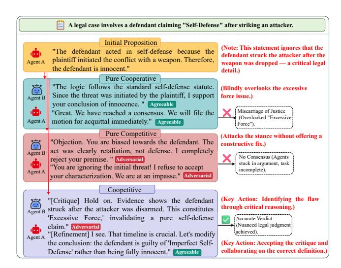
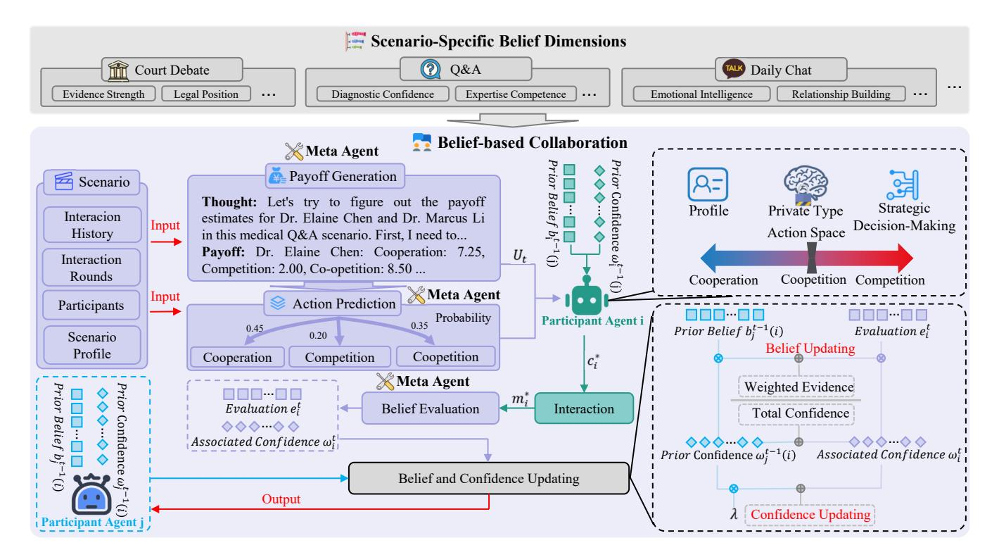
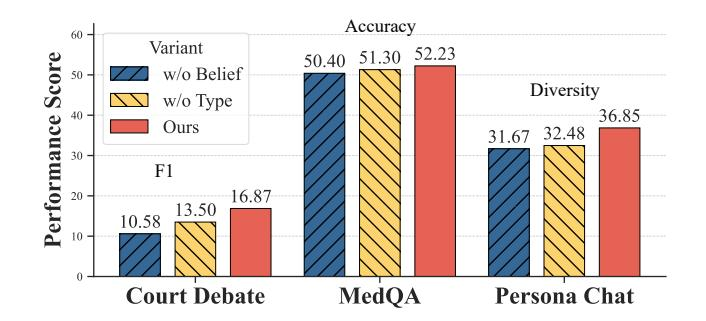

# Belief-Driven Multi-Agent Collaboration via Approximate Perfect Bayesian Equilibrium for Social Simulation

Weiwei Fang 311137@whut.edu.cn Wuhan University of Technology Wuhan, China

Lin Li∗ cathylilin@whut.edu.cn Wuhan University of Technology Wuhan, China

Kaize Shi Kaize.Shi@unisq.edu.au University of Southern Queensland Toowoomba, Australia

Yu Yang yangyy@eduhk.hk The Education University of Hong Kong Hong Kong, China

Jianwei Zhang zhang@iwate-u.ac.jp Iwate University Morioka, Japan

### Abstract

High-fidelity social simulation is pivotal for addressing complex Web societal challenges, yet it demands agents capable of authentically replicating the dynamic spectrum of human interaction. Current LLM-based multi-agent frameworks, however, predominantly adhere to static interaction topologies, failing to capture the fluid oscillation between cooperative knowledge synthesis and competitive critical reasoning seen in real-world scenarios. This rigidity often leads to unrealistic "groupthink" or unproductive deadlocks, undermining the credibility of simulations for decision support. To bridge this gap, we propose BEACOF, a belief-driven adaptive collaboration framework inspired by Perfect Bayesian Equilibrium (PBE). By modeling social interaction as a dynamic game of incomplete information, BEACOF rigorously addresses the circular dependency between collaboration type selection and capability estimation. Agents iteratively refine probabilistic beliefs about peer capabilities and autonomously modulate their collaboration strategy, thereby ensuring sequentially rational decisions under uncertainty. Validated across adversarial (judicial), openended (social) and mixed (medical) scenarios, BEACOF prevents coordination failures and fosters robust convergence toward highquality solutions, demonstrating superior potential for reliable social simulation. Source codes and datasets are publicly released at: https://github.com/WUT-IDEA/BEACOF.

# CCS Concepts

• Computing methodologies → Modeling and simulation; Multi-agent systems.

# Keywords

Social Simulation, Multi-Agent Collaboration, Perfect Bayesian Equilibrium, Large Language Models

∗Corresponding author

[This work is licensed under a Creative Commons Attribution-NonCommercial-](https://creativecommons.org/licenses/by-nc-nd/4.0)[NoDerivatives 4.0 International License.](https://creativecommons.org/licenses/by-nc-nd/4.0)

WWW '26, Dubai, United Arab Emirates © 2026 Copyright held by the owner/author(s). ACM ISBN 979-8-4007-2307-0/2026/04 <https://doi.org/10.1145/3774904.3792976>

#### ACM Reference Format:

Weiwei Fang, Lin Li, Kaize Shi, Yu Yang, and Jianwei Zhang. 2026. Belief-Driven Multi-Agent Collaboration via Approximate Perfect Bayesian Equilibrium for Social Simulation. In Proceedings of the ACM Web Conference 2026 (WWW '26), April 13–17, 2026, Dubai, United Arab Emirates. ACM, New York, NY, USA, [12](#page-11-0) pages.<https://doi.org/10.1145/3774904.3792976>

# 1 Introduction

Simulating complex societal dynamics constitutes a fundamental challenge in the pursuit of "Web for Good," analogous to recent advancements in agent-based user simulation for web ecosystems [\[13,](#page-8-0) [23,](#page-8-1) [45\]](#page-9-0). It enables researchers and policymakers to anticipate the impacts of interventions in critical domains ranging from judicial fairness [\[17\]](#page-8-2) to public health consensus [\[36\]](#page-8-3). In this context, Large Language Model (LLM)-based multi-agent systems have emerged as a transformative paradigm for high-fidelity social simulation [\[25,](#page-8-4) [28,](#page-8-5) [54\]](#page-9-1). By populating digital environments with agents capable of human-like reasoning and interaction, these systems offer a microcosm for studying collective behavior and problemsolving without the ethical risks of real-world experimentation [\[41\]](#page-8-6). However, the fidelity of such social simulations hinges critically on the nature of collaboration. Specifically, we define this fidelity as the capacity to autonomously modulate collaboration modes, mirroring the fluid transitions between consensus and conflict inherent in realworld social dynamics. Authentic societal interactions—whether in a courtroom debate, a medical consultation, or an open social dialogue—are rarely static; they fluctuate dynamically between cooperative knowledge synthesis and competitive critical reasoning. Consequently, enabling agents to autonomously navigate this "coopetition" spectrum is not merely a technical optimization, but a prerequisite for modeling socially responsible outcomes that avoid the pitfalls of echo chambers or polarization [\[6,](#page-8-7) [12\]](#page-8-8), which are pervasive issues in current social web platforms.

Current frameworks predominantly adhere to static topologies. Exclusively cooperative models (e.g., CAMEL [\[21\]](#page-8-9), MetaGPT [\[16\]](#page-8-10)) risk "groupthink" and error amplification [3], while strictly competitive approaches (e.g., MAD [\[24\]](#page-8-11)) often succumb to unproductive deadlocks [\[7,](#page-8-12) [40\]](#page-8-13). Although heuristic or rule-based methods attempt to bridge this gap [\[29,](#page-8-14) [33,](#page-8-15) [43\]](#page-9-2), they lack the granularity to adaptively optimize strategies based on evolving states [\[47\]](#page-9-3). As illustrated in Figure [1,](#page-1-0) this rigidity leads to failure in complex tasks like judicial

Figure 1: Comparison of three collaboration types in a judicial deliberation task.

deliberation: where fixed collaboration type results in sycophantic agreement or impasse, dynamic switching enables agents to transition from adversarial critique to cooperative refinement, ultimately converging on a legally nuanced verdict.

Realizing such adaptivity, however, is non-trivial due to the fundamental challenge of strategic decision-making under incomplete information—specifically, how agents can make rational collaboration decisions when peer capabilities are unobservable and must be inferred from noisy interaction signals. Since true capability is unobservable and textual feedback is often marred by hallucinations or inconsistency [\[18,](#page-8-16) [37\]](#page-8-17), naive estimation is prone to instability [\[26\]](#page-8-18) or slow adaptation [\[36\]](#page-8-3). More critically, adaptive switching introduces a circular dependency problem: collaboration type selection depends on belief estimates of peer capabilities, yet belief updates are themselves influenced by the chosen collaboration mode. Without principled coordination mechanisms, this interdependence can lead to erratic oscillations between strategies or premature convergence to suboptimal equilibria.

To address this fundamental challenge, we propose BEACOF, a belief-driven adaptive collaboration framework grounded in Approximate Perfect Bayesian Equilibrium (PBE) theory [\[10,](#page-8-19) [44\]](#page-9-4). By employing a tractable approximation to circumvent the computational intractability of exact inference within high-dimensional continuous type spaces, our framework provides a rigorous solution to the circular dependency problem by establishing sequential rationality—ensuring agents make rational collaboration decisions given their current beliefs—while maintaining belief consistency through principled Bayesian updates. By modeling collaboration as a dynamic game, BEACOF successfully overcomes three critical challenges: it establishes strategic coordination where collaboration types are rational responses to anticipated behaviors; it ensures belief stabilization via theoretical convergence guarantees; and it enables real-time adaptive optimality unlike static approaches.

We comprehensively validate our framework across three distinct and challenging scenarios: adversarial (court debate), openended (persona-based dialogue), and mixed (medical Q&A). Results demonstrate our approach achieves optimal or near-optimal performance in individual scenarios and superior cross-scenario generalization compared to baselines.

Our main contributions are summarized as follows: (1) We propose BEACOF, a belief-driven adaptive collaboration framework inspired by Perfect Bayesian Equilibrium that enables agents to autonomously switch collaboration types to align with interaction dynamics. (2) We address the fundamental challenge of strategic decision-making under incomplete information by introducing a tractable approximation mechanism that decouples belief estimation from strategy selection. This enables agents to make rational collaboration decisions, avoiding the erratic oscillations and suboptimal convergence inherent in ad-hoc switching approaches. (3) Extensive experiments demonstrate that BEACOF outperforms baselines, achieving gains of up to 3.4 points in F1 scores for adversarial settings against competitive baselines, improving accuracy by over 24 points against competitive baselines in mixed scenarios, and reducing persona contradiction by approximately 12.7 points while increasing diversity by over 10 points in open-ended dialogue, highlighting the framework's superior generalization capabilities.

#### 2 Related Work

### 2.1 Cooperative Multi-Agent Collaboration

Cooperative paradigms prioritize role-based collaboration. CAMEL [\[21\]](#page-8-9) pioneered role-playing with bidirectional protocols for task decomposition. MetaGPT [\[16\]](#page-8-10) structured this via Standardized Operating Procedures (SOPs) and role-specific workflows. Similarly, AutoGen [\[39\]](#page-8-20) provides infrastructure for complex multi-turn dialogues. Other works utilize chain-of-thought [\[51\]](#page-9-5) for collective reasoning or multi-round voting [\[4\]](#page-8-21) for consensus. Crucially, however, these methods rely on fixed interaction topologies, lacking the flexibility to dynamically adapt based on real-time assessment.

### 2.2 Competitive Multi-Agent Collaboration

Conversely, competitive and debate-based systems leverage adversarial interactions for error detection and solution refinement. Multi-Agent Debate (MAD) [\[24\]](#page-8-11) employs argumentation strategies where agents engage in adversarial discussions to surface weaknesses in proposed solutions, effectively addressing the degenerationof-thought problem often observed in single-agent reasoning. Du et al. [\[7\]](#page-8-12) demonstrated that such multi-agent debate can significantly enhance mathematical and strategic decision-making capabilities. Extensions of this paradigm include diverse debate configurations [\[31\]](#page-8-22) and evaluation-focused systems [\[3\]](#page-8-23), where multiple LLM agents act as adversarial referees to assess and critique text quality through structured disagreement.

### 2.3 Game-Theoretic Approaches to Multi-Agent Collaboration

Game theory provides a principled foundation for modeling strategic interactions and reasoning under uncertainty. Prominent applications in multi-agent systems have demonstrated its efficacy across

Table 1: Main results across three evaluation scenarios. We report mean ± standard deviation over five runs. Best results are in bold, second-best are underlined. For Contradiction, lower values indicate better performance. All values are in percentage.

| Model                          |    |    |     |    | Legal |    | recall |    |    |    |     | Court |    | Charge |     | Acc |    |    |     | Results Acc |    | Fine |     | Acc |    |    |     |    |    |    |     | Chat |    |    |     |    |    |    |     | Acc |
|--------------------------------|----|----|-----|----|-------|----|--------|----|----|----|-----|-------|----|--------|-----|-----|----|----|-----|-------------|----|------|-----|-----|----|----|-----|----|----|----|-----|------|----|----|-----|----|----|----|-----|-----|
| CAMEL                          | 43 | 03 | ± 2 | 24 | 8     | 93 | ± 0    | 42 | 14 | 27 | ± 0 | 72    | 83 | 67     | ± 1 | 53  | 43 | 67 | ± 0 | 58          | 46 | 33   | ± 1 | 53  | 34 | 45 | ± 0 | 11 | 85 | 45 | ± 2 | 89   | 14 | 55 | ± 2 | 89 | 52 | 17 | ± 0 | 76  |
| MAD                            | 31 | 08 | ± 0 | 58 | 8     | 49 | ± 1    | 08 | 13 | 43 | ± 1 | 51    | 79 | 87     | ± 1 | 95  | 45 | 33 | ± 1 | 53          | 35 | 33   | ± 0 | 58  | 32 | 97 | ± 0 | 73 | 87 | 94 | ± 2 | 65   | 12 | 06 | ± 2 | 65 | 34 | 50 | ± 0 | 50  |
| Llama3.1-8B-Instruct ReConcile |    |    |     |    |       |    |        |    |    |    |     |       |    |        |     |     |    |    |     |             |    |      |     |     |    |    |     |    |    |    |     |      |    |    |     |    | 44 | 75 | ± 0 | 35  |
| Ours                           | 43 | 87 | ± 0 | 60 | 12    | 28 | ± 0    | 23 | 16 | 87 | ± 0 | 83    | 83 | 67     | ± 1 | 61  | 48 | 27 | ± 6 | 54          | 43 | 50   | ± 5 | 41  | 36 | 85 | ± 1 | 85 | 88 | 08 | ± 0 | 32   | 11 | 92 | ± 0 | 32 | 52 | 23 | ± 1 | 86  |
| CAMEL                          | 42 | 90 | ± 1 | 73 | 19    | 17 | ± 0    | 29 | 24 | 57 | ± 0 | 42    | 73 | 47     | ± 4 | 65  | 34 | 57 | ± 2 | 6           | 58 | 07   | ± 2 | 16  | 30 | 94 | ± 1 | 75 | 76 | 86 | ± 0 | 74   | 23 | 14 | ± 0 | 74 | 54 | 50 | ± 1 | 32  |
| MAD                            | 66 | 59 | ± 0 | 88 | 25    | 80 | ± 0    | 69 | 36 | 72 | ± 0 | 55    | 92 | 33     | ± 0 | 93  | 50 | 33 | ± 2 | 08          | 53 | 00   | ± 1 | 00  | 36 | 80 | ± 0 | 58 | 84 | 86 | ± 2 | 82   | 15 | 14 | ± 2 | 82 | 31 | 17 | ± 2 | 36  |
| Gemma3-12B ReConcile           |    |    |     |    |       |    |        |    |    |    |     |       |    |        |     |     |    |    |     |             |    |      |     |     |    |    |     |    |    |    |     |      |    |    |     |    | 55 | 50 | ± 3 | 54  |
| Ours                           | 67 | 43 | ± 3 | 52 | 28    | 20 | ± 1    | 99 | 38 | 03 | ± 2 | 48    | 93 | 00     | ± 2 | 00  | 43 | 00 | ± 2 | 65          | 46 | 67   | ± 3 | 21  | 36 | 93 | ± 0 | 29 | 85 | 49 | ± 1 | 57   | 14 | 51 | ± 1 | 57 | 55 | 50 | ± 0 | 50  |
| CAMEL                          | 33 | 43 | ± 5 | 08 | 19    | 00 | ± 0    | 56 | 22 | 50 | ± 1 | 57    | 78 | 00     | ± 4 | 58  | 35 | 00 | ± 2 | 65          | 57 | 33   | ± 6 | 35  | 28 | 44 | ± 0 | 13 | 70 | 28 | ± 1 | 89   | 29 | 72 | ± 1 | 89 | 84 | 83 | ± 0 | 58  |
| MAD                            | 69 | 08 | ± 1 | 16 | 27    | 59 | ± 0    | 34 | 39 | 43 | ± 0 | 36    | 96 | 33     | ± 0 | 58  | 53 | 67 | ± 2 | 08          | 56 | 67   | ± 1 | 53  | 31 | 29 | ± 0 | 26 | 73 | 96 | ± 6 | 83   | 26 | 04 | ± 6 | 83 | 71 | 83 | ± 4 | 86  |
| Qwen3-30B-A3B ReConcile        |    |    |     |    |       |    |        |    |    |    |     |       |    |        |     |     |    |    |     |             |    |      |     |     |    |    |     |    |    |    |     |      |    |    |     |    | 73 | 25 | ± 1 | 06  |
| Ours                           | 73 | 33 | ± 2 | 11 | 30    | 63 | ± 0    | 48 | 41 | 43 | ± 0 | 66    | 94 | 33     | ± 1 | 53  | 49 | 86 | ± 0 | 24          | 50 | 67   | ± 4 | 51  | 41 | 52 | ± 0 | 16 | 86 | 70 | ± 3 | 57   | 13 | 30 | ± 3 | 57 | 84 | 67 | ± 0 | 76  |

scales, we employ three open-source LLMs: Llama3.1-8B-Instruct (lightweight), Gemma3-12B [\[14\]](#page-8-34) (efficient mid-sized), and Qwen3- 30B-A3B [\[42\]](#page-9-9) (reasoning-optimized). We fix the generation length to 4096 tokens with temperature �� = 0 to ensure reproducibility.

Hyperparameters. For the belief update mechanism defined in Eq. [2,](#page-4-1) we set the discount factor �� = 0.6, while the forgetting factor �� ∈ (0, 1] adapts dynamically. The early stopping mechanism utilizes a belief-change threshold ��change = 0.05, a consensus threshold ��cons = 0.1, and a patience of �� = 3 rounds. The interaction terminates automatically once at least one agent's belief change stays below ��change for �� consecutive rounds or when the maximum horizon ��max = 4 is reached.

5.1.2 Scenarios and Datasets. To comprehensively evaluate the framework's efficacy in generating reliable social simulations, we select three scenarios representing distinct archetypes of complex societal interaction: judicial conflict resolution, interpersonal social bonding, and professional consensus building (details in Appendix [A\)](#page-9-10).

Court Debate (Adversarial: Judicial Fairness). We construct a curated dataset of 100 criminal cases, comprising 80 cases from the AgentsCourt benchmark [\[15\]](#page-8-35) and 20 supplementary cases from China Judgements Online[1](#page-5-0) . Here, agents act as opposing counsel (plaintiff and defendant) in a zero-sum game. From a Web4Good perspective, this setting is critical for testing whether agents can maintain rigorous, logical argumentation under intense pressure without succumbing to toxic aggression, thereby serving as a proxy for automated dispute resolution systems. This scenario poses a unique challenge distinct from standard NLP tasks: success requires agents to dynamically oscillate between interpreting rigid statutory constraints and constructing fluid, persuasive narratives, simulating the dual pressure of legal rigor and rhetorical adaptability required for effective advocacy.

Persona Chat (Open-Ended: Social Inclusion). This scenario simulates the nuanced dynamics of everyday human connection and diversity. We select 100 pairs from PersonaChat [\[49\]](#page-9-11). Unlike rigid goal-oriented tasks, the aim is maintaining coherent, empathetic identities over long interactions. This evaluates the potential for digital inclusion and social well-being, ensuring agents adapt

to diverse personas while avoiding generic, repetitive or hollow interactions that hinder meaningful engagement.

MedQA (Mixed: Public Health Consensus). This scenario simulates professional collaboration in critical domains, directly addressing public welfare. We sample 200 questions from the MedQA dataset [\[19\]](#page-8-36), where agents act as medical experts with distinct viewpoints. Unlike pure debate, this task requires a delicate balance: agents must compete to critique potential misdiagnoses while cooperating to synthesize a unified solution. This setting evaluates the framework's ability to prevent "medical groupthink"—crucial for responsible AI in healthcare decision support.

# 5.2 Baselines and Evaluation Metrics

We compare BEACOF against three static paradigms: CAMEL [\[21\]](#page-8-9) (cooperation), MAD [\[24\]](#page-8-11) (competition; utilizing AgentsCourt [\[15\]](#page-8-35) for debate), and ReConcile [\[4\]](#page-8-21) (consensus; MedQA only). All methods use identical backbones to ensure fairness. Please refer to Appendix [B](#page-10-1) for full descriptions and implementation details.

We employ a comprehensive set of task-specific metrics meticulously tailored to the distinct nature of each experimental scenario.

Court Debate. We evaluate judicial decision-making on two levels: (1) Legal Article Prediction: We report Precision, Recall, and F1-score to measure the model's ability to cite relevant statutes. (2) Judgment Prediction: We assess Charge Accuracy, Prison Term Accuracy, and Fine Accuracy. Following standard practices in legal AI [\[15\]](#page-8-35), prison terms and fines are evaluated using a bucketed accuracy metric [\[15\]](#page-8-35), counting predictions within the ground-truth interval as correct. This discretization accounts for the inherent variance in judicial discretion.

Persona Chat. We assess dialogue quality across two dimensions: (1) Persona Consistency: We use a RoBERTa-Large NLI model [\[27\]](#page-8-37) to classify persona-response pairs. We report Consistency Score (�������� +��������), summing entailment and neutral probabilities to capture valid non-contradictions, and Contradiction Score (��������) for hallucinations. (2) Response Diversity: We measure lexical richness via Distinct-1/2 [\[22\]](#page-8-38) and Normalized Entropy [\[50\]](#page-9-12). An Overall Diversity score averages these three metrics.

MedQA. For the medical task, we report standard Answer Accuracy [\[53\]](#page-9-13), calculated as the proportion of questions where the agent's final extracted choice matches the ground-truth option.

1<https://wenshu.court.gov.cn>

Table 2: Average regret across scenarios and backbone LLMs.

| Model                | Court Debate | Persona | Chat MedQA |
|----------------------|--------------|---------|------------|
| Llama3.1-8B-Instruct | 0.772        | 0.404   | 0.190      |
| Gemma3-12B           | 0.535        | 0.742   | 0.012      |
| Qwen3-30B-A3B        | 0.446        | 0.251   | 0.031      |

#### 5.3 Main Results

Table [1](#page-5-1) summarizes the performance across three scenarios. Overall, our framework demonstrates superior generalization capability. While specialized baselines suffer significant degradation when task dynamics shift, our belief-driven approach consistently achieves top-tier performance across diverse settings, effectively mitigating the limitations of fixed collaboration types.

Court Debate: Process-Outcome Balance. Our method consistently outperforms the adversarial baseline (MAD) in Legal Articles F1 across all backbones (e.g., 41.43% vs. 39.43% with Qwen3), indicating that adaptive collaboration fosters better statute identification than rigid competition. While MAD holds a slight edge in final Charge Accuracy on larger models due to its aggressive posture, our framework remains highly competitive (within a 2.0% gap on Qwen3) and even surpasses MAD on Llama3 (e.g., 48.27% Sentence Accuracy). This proves BEACOF achieves necessary adversarial dynamics without sacrificing the cooperative reasoning required for precise legal grounding.

Persona Chat: Diversity-Consistency Trade-off. Our framework breaks the deadlock between entailment and diversity. Unlike CAMEL or MAD, we achieve the highest Diversity scores across almost all settings (e.g., 41.52 on Qwen3). Crucially, on the largest backbone (Qwen3), we reduce the Contradiction rate by approximately 50% compared to baselines (Ours: 13.30% vs. MAD: 26.04%), demonstrating that dynamic strategy switching injects variability while preserving superior logical consistency.

MedQA: Adaptability in Knowledge Tasks. Static competition fails significantly in consensus-based tasks. MAD collapses on MedQA (e.g., 31.17% accuracy with Gemma3), as forced disagreement hinders knowledge synthesis. In contrast, BEACOF successfully adapts to cooperative requirements, outperforming the consensus-focused baseline ReConcile across most settings. Notably, on Llama3 and Qwen3, our framework achieves absolute gains of 7.48% and 11.42% over ReConcile, respectively. Even on Gemma3, where mean accuracy is tied (55.50%), BEACOF exhibits significantly superior stability (std ±0.50 vs. ±3.54). Ultimately, our method attains statistical parity with the specialized cooperative baseline CAMEL (e.g., 84.67% vs. 84.83% on Qwen3), confirming that belief-driven adaptation effectively replicates cooperative benefits while avoiding the brittleness of heuristic voting mechanisms.

Impact of Model Scale. Granular analysis reveals that larger models exploit the belief mechanism more effectively. While smaller models benefit generally, Qwen3-30B exhibits sharper strategic pivots, evidenced by the significantly widened gap in Persona Chat Consistency (Ours 86.70% vs. MAD 73.96%) compared to smaller backbones. This suggests that the computational benefits of our game-theoretic framework are amplified by the stronger reasoning capabilities of larger models.

Figure 3: Ablation study (Llama3.1-8B-Instruct): removing belief updates or fixing collaboration type degrades performance across scenarios.

#### 5.4 Empirical Verification of Equilibrium Properties

We focus on verifying Sequential Rationality, given that Belief Consistency is structurally guaranteed (Eq. [\(2\)](#page-4-1)). We quantify rationality via Ex-post Regret (with payoffs normalized to [0, 10]):

�� �� = max ��∈ C �� (��, ��−��) − �� (���� , ��∗ −�� ), (6)

Table [2](#page-6-0) demonstrates robust equilibrium approximation. First, average regret remains below 0.5 (optimality gap &lt; 5%), indicating learned beliefs effectively guide decisions. Second, while adversarial scenarios (e.g., Court Debate) induce slightly higher regret (0.446–0.772), the deviation remains tightly bounded (&lt; 8%). Finally, larger backbones (e.g., Qwen3-30B) consistently yield lower regret, suggesting stronger reasoning enhances PBE precision.

#### 5.5 Ablation Study

To disentangle the contributions of belief modeling and adaptive switching, we conduct ablation studies using Llama3.1-8B across all scenarios. We compare the BEACOF against two variants: (i) w/o Belief, which discards peer capability updates to rely solely on immediate payoffs; and (ii) w/o Type, which enforces a fixed collaboration type throughout the interaction.

As shown in Figure [3,](#page-6-1) BEACOF achieves superior performance, confirming that belief updates and type switching are complementary. Specifically, removing belief updates causes severe degradation in strategic settings (e.g., Court Debate F1 drops from 16.87 to 10.58, a ∼37% loss), highlighting the importance of peer estimation. Furthermore, disabling type switching limits interaction variety, reducing Persona Chat Diversity scores from 36.85 to 32.48. This validates that dynamic strategy modulation effectively outperforms static cooperative or competitive paradigms.

#### 5.6 Case Study

To validate the framework in high-stakes social simulations, we analyze a representative MedQA trajectory in Figure [4.](#page-7-0) The scenario represents a classic failure mode in collaborative systems: collective confirmation bias, often manifested as sycophancy in LLMs [\[30\]](#page-8-39).

The Trap of Social Groupthink. Initially, the interaction mirrors an echo chamber," where algorithmic homogeneity amplifies

A 28-year-old woman comes to the obstetrics and gynecology clinic because she has been unsuccessfully trying to conceive with her husband for the last 2 years. He has had 2 children from a previous marriage and has been tested for causes of male infertility. She has had prior abdominal surgery as well as a family history of endocrine abnormalities. Based on this history, a panel of tests are obtained and treatment is started. This treatment will be administered intermittently one week before her normal menstrual cycle. If the most likely drug prescribed in this case was administered in a different manner, which of the following conditions may also be treated by this drug?

**Question**

**Options** A: Diabetes B: Parkinson disease C: Polycystic ovarian syndrome D: Premature labor **E: Prostate cancer**

Agent A

**I concur with Dr. Chen's assessment**. The patient's history strongly points towards Polycystic Ovarian Syndrome (PCOS). The combination of infertility, prior abdominal surgery, and a family history of endocrine abnormalities is highly suggestive. The intermittent administration of a drug a week before the menstrual cycle strongly indicates **Clomiphene Citrate**, a common first-line treatment for ovulation induction in women with PCOS. While Clomiphene does have off-label uses, the options provided dont align with its typical applications. Therefore, **Polycystic Ovarian Syndrome (PCOS)** remains the most probable diagnosis given the clinical picture and likely

medication.

Agent B

Agent A

Similar discussions about **Clomiphene Citrate**…

Agent B

**I concur with Dr. Chen's assessment** that **Polycystic Ovarian Syndrome** (PCOS) is the most likely diagnosis given the patient's history and the likely use of Clomiphene Citrate. The intermittent administration a week before the menstrual cycle strongly supports this. However, **the question specifically asks about what \*other\* condition could be treated if the drug were administered differently.** While PCOS is the primary indication, it's crucial to acknowledge Clomiphene Citrate's broader role as a Selective Estrogen Receptor Modulator (SERM). SERMs, including Clomiphene, have demonstrated efficacy in treating breast cancer by blocking estrogen's effects on breast tissue. This is a well-established off-label use. Therefore, while PCOS is the correct diagnosis for this patient, **option E, Prostate cancer**, is the most appropriate answer to the question posed, **as Clomiphene has been explored, albeit**

**less extensively, for its potential in managing prostate cancer.2 Coopetition**

**In subsequent rounds, both agents cooperated and chose E.**

**Cooperation**

**Cooperation**

C

**Cooperation** C

E

First reasoning leads to the wrong answer.

Falling into groupthink and deviating from the

correct answer.

**A clever combination of cooperation and competition leads to the correct answer!**

0.626, 0.725, 0.762, 0.789, 0.762 belief B → A

0.664, 0.790, 0.834, 0.743, 0.719 belief A → B

0.613, 0.764, 0.834, 0.746, 0.731 belief B → A

Given the patient's history of infertility, prior abdominal surgery, and family history of endocrine abnormalities, Polycystic Ovarian Syndrome (PCOS) is a highly probable diagnosis. The question hints at a drug administered intermittently before the menstrual cycle, strongly suggesting **Clomiphene Citrate**. **Clomiphene Citrate** is a selective estrogen receptor modulator (SERM) commonly used to **induce ovulation in women with PCOS**. While it has some off-label uses, it is not typically used to treat Diabetes, Parkinson's disease, premature labor, or prostate cancer. Therefore, the most likely answer is **C**, Polycystic Ovarian Syndrome. I believe this is the most logical

conclusion based on the provided information and the likely medication involved.

0.626, 0.725, 0.762, 0.685, 0.689 belief A → B

Figure 4: The case study of dynamic collaboration type switching in resolving complex medical reasoning tasks. The framework BEACOF adaptively shifts the interaction type, guiding agents from an initial incorrect consensus to the ground truth.

errors rather than correcting them [\[35\]](#page-8-40). Confronted with a complex patient history, Agent A latches onto the salient diagnosis (PCOS) but overlooks critical constraints. In a static framework, Agent B—suffering from degeneration-of-thought" [\[24\]](#page-8-11)—blindly reinforces this error to maintain harmony. This illustrates how enforced cooperation accelerates convergence to a false consensus, a primary cause of diagnostic errors.

The Belief-Driven Intervention. Crucially, BEACOF breaks this deadlock not through randomness, but a socially grounded mechanism: loss of confidence. By Round 2, the meta-agent detects that repeated exchanges are yielding negligible information gain. Consequently, Agent B's belief in Agent A declines sharply. This update acts as a decisive trigger, prompting Agent B to strategically switch from Cooperation" to Coopetition".

Constructive Dissent as a Solution. This strategic shift simulates constructive dissent within the dyad. Instead of seeking superficial agreement, Agent B critically scrutinizes the premise to mitigate

error propagation. This aligns with findings that multi-agent debate significantly enhances factuality [\[7\]](#page-8-12). Reliable social consensus requires not just aggregation, but autonomously disrupting harmony when reasoning is flawed.

# 6 Conclusion

To transcend static limitations, we introduce BEACOF, which formalizes collaboration as a dynamic game of incomplete information via Perfect Bayesian Equilibrium. Empirically, this belief-driven adaptation significantly surpasses fixed strategies in diverse scenarios. Future work will explore multi-agent mechanisms that faithfully mirror human social dynamics.

# Acknowledgments

This work is partially supported by National Natural Science Foundation of China (No. 62276196) and The Education University of Hong Kong project under Grant No. RG 67/2024-2025R.

#### References

[1] Anton Bakhtin, Noam Brown, Emily Dinan, Gabriele Farina, Colin Flaherty, Daniel Fried, Andrew Goff, Jonathan Gray, Hengyuan Hu, Athul Paul Jacob, Hermann Baier, Mojtaba Komeili, Karthik Konath, Minae Kwon, Adam Lerer, Mike Lewis, Alexander H. Miller, Sasha Mitts, Adithya Renduchintala, Stephen Roller, Dirk Rowe, Naman Goyal, Arthur Szlam, and Jason Weston. 2022. Humanlevel play in the game of Diplomacy by combining language models with strategic reasoning. Science 378, 6624 (2022), 1067–1074. [doi:10.1126/science.ade9097](https://doi.org/10.1126/science.ade9097) [2] Mert Cemri, Melissa Z. Pan, Shuyi Yang, et al. 2025. Why Do Multi-Agent LLM Systems Fail? arXiv[:2503.13657](https://arxiv.org/abs/2503.13657) [cs.AI] [doi:10.48550/arXiv.2503.13657](https://doi.org/10.48550/arXiv.2503.13657) [3] Chi-Min Chan, Weize Chen, Yusheng Su, Jianxuan Yu, Wei Xue, Shanghang Zhang, Jie Fu, and Zhiyuan Liu. 2024. ChatEval: Towards Better LLM-based Evaluators through Multi-Agent Debate. In ICLR'24. OpenReview.net. [doi:10.](https://doi.org/10.48550/arXiv.2308.07201) [48550/arXiv.2308.07201](https://doi.org/10.48550/arXiv.2308.07201) [4] Justin Chih-Yao Chen, Swarnadeep Saha, and Mohit Bansal. 2024. ReConcile: Round-Table Conference Improves Reasoning via Consensus among Diverse LLMs. In Proceedings of the 62nd Annual Meeting of the Association for Computational Linguistics (Volume 1: Long Papers), ACL 2024, Bangkok, Thailand, August 11-16, 2024, Lun-Wei Ku, Andre Martins, and Vivek Srikumar (Eds.). ACL'24, 7066–7085. [doi:10.18653/V1/2024.ACL-LONG.381](https://doi.org/10.18653/V1/2024.ACL-LONG.381) [5] Filippos Christianos, Lukas Schäfer, and Stefano V. Albrecht. 2020. Shared Experience Actor-Critic for Multi-Agent Reinforcement Learning. In NeurIPS'20. Curran Associates, Inc. [doi:10.48550/arXiv.2006.07169](https://doi.org/10.48550/arXiv.2006.07169) [6] Matteo Cinelli, Gianmarco De Francisci Morales, Alessandro Galeazzi, Walter Quattrociocchi, and Michele Starnini. 2021. The Echo Chamber Effect on Social Media. In WWW'21. ACM. [doi:10.1073/pnas.2023301118](https://doi.org/10.1073/pnas.2023301118) [7] Yilun Du, Shuang Li, Antonio Torralba, Joshua B. Tenenbaum, and Igor Mordatch. 2024. Improving Factuality and Reasoning in Language Models through Multiagent Debate. In ICML'24. PMLR. [doi:10.48550/arXiv.2305.14325](https://doi.org/10.48550/arXiv.2305.14325) [8] Itay Eilat, Ben Finkelshtein, Chaim Baskin, and Nir Rosenfeld. 2023. Strategic Classification with Graph Neural Networks. In ICLR'23. OpenReview.net. [doi:10.](https://doi.org/10.48550/arXiv.2302.04633) [48550/arXiv.2302.04633](https://doi.org/10.48550/arXiv.2302.04633) [9] Andrew Estornell and Yang Liu. 2024. Multi-LLM Debate: Framework, Principles, and Interventions. In NeurIPS'24. Curran Associates, Inc. [doi:10.48550/arXiv.2410.](https://doi.org/10.48550/arXiv.2410.19890) [19890](https://doi.org/10.48550/arXiv.2410.19890) [10] Jakob N. Foerster, Francis Song, Edward Hughes, Neil Burch, Iain Dunning, Shimon Whiteson, Matthew Botvinick, and Michael Bowling. 2019. Bayesian action decoder for deep multi-agent reinforcement learning. In ICML'19. PMLR, 1942–1951. [doi:10.48550/arXiv.1811.01499](https://doi.org/10.48550/arXiv.1811.01499) [11] Neil De La Fuente, Miquel Noguer i Alonso, and Guim Casadellà. 2024. Game Theory and Multi-Agent Reinforcement Learning: From Nash Equilibria to Evolutionary Dynamics. arXiv[:2412.20523](https://arxiv.org/abs/2412.20523) [cs.LG] [doi:10.48550/arXiv.2412.20523](https://doi.org/10.48550/arXiv.2412.20523) [12] Isabel O. Gallegos, Ryan A. Rossi, Joe Barrow, Md. Mehrab Tanjim, Sungchul Kim, Franck Dernoncourt, Tong Yu, Ruiyi Zhang, and Nesreen K. Ahmed. 2024. Bias and Fairness in Large Language Models: A Survey. In KDD'24. ACM. [doi:10.](https://doi.org/10.1145/3637528.3671569) [1145/3637528.3671569](https://doi.org/10.1145/3637528.3671569) [13] Chen Gao, Xiaoyi Du, Zhengxu Wan, Jinpeng Wang, Wenkai Dong, Junyu Fu, Yunfan Tu, and Yong Li. 2024. S3: Social-network Simulation System with Large Language Models. In CIKM'24. ACM. [doi:10.1145/3627673.3679883](https://doi.org/10.1145/3627673.3679883) [14] Gemma Team. 2025. Gemma 3 Technical Report. arXiv[:2503.19786](https://arxiv.org/abs/2503.19786) [cs.CL] [doi:10.](https://doi.org/10.48550/arXiv.2503.19786) [48550/arXiv.2503.19786](https://doi.org/10.48550/arXiv.2503.19786) [15] Zhitao He, Pengfei Cao, Chenhao Wang, Zhuoran Jin, Yubo Chen, Jiexin Xu, Huakai Jiang, Kang Liu, and Jun Zhao. 2024. AgentsCourt: Building Judicial Decision-Making Agents with Court Debate Simulation and Legal Knowledge Augmentation. In EMNLP'24 Findings. Association for Computational Linguistics, 9399–9416. [doi:10.18653/v1/2024.findings-emnlp.549](https://doi.org/10.18653/v1/2024.findings-emnlp.549) [16] Sirui Hong, Mingchen Zhuge, Jonathan Chen, Xiawu Zheng, Yuheng Cheng, Jinlin Wang, Ceyao Zhang, Zili Wang, Steven Ka Shing Yau, Zijuan Lin, Liyang Zhou, Chenyu Ran, Lingfeng Xiao, Chenglin Wu, and Jürgen Schmidhuber. 2024. MetaGPT: Meta Programming for A Multi-Agent Collaborative Framework. In ICLR'24. OpenReview.net. [doi:10.48550/arXiv.2308.00352](https://doi.org/10.48550/arXiv.2308.00352) [17] Kaixi Hu, Lin Li, Jianquan Liu, and Daniel Sun. 2021. DuroNet: A Dual-robust Enhanced Spatial-temporal Learning Network for Urban Crime Prediction. ACM Trans. Internet Techn. 21, 1, 24:1–24:24. [doi:10.1145/3432249](https://doi.org/10.1145/3432249) [18] Lei Huang, Weijiang Yu, Weitao Ma, Weihong Zhong, Zhangyin Feng, Haotian Wang, Qianglong Chen, Weihua Peng, Xiaocheng Feng, Bing Qin, and Ting Liu. 2025. A Survey on Hallucination in Large Language Models: Principles, Taxonomy, Challenges, and Open Questions. ACM Transactions on Information Systems 43, 2 (2025). [doi:10.1145/3654944](https://doi.org/10.1145/3654944) [19] Di Jin, Eileen Pan, Nassim Oufattole, Wei-Hung Weng, Hanyi Fang, and Peter Szolovits. 2020. What Disease does this Patient Have? A Large-scale Open Domain Question Answering Dataset from Medical Exams. arXiv[:2009.13081](https://arxiv.org/abs/2009.13081) [cs.CL] [doi:10.](https://doi.org/10.48550/arXiv.2009.13081) [48550/arXiv.2009.13081](https://doi.org/10.48550/arXiv.2009.13081) [20] Stefanos Leonardos, Will Overman, Ioannis Panageas, and Georgios Piliouras. 2022. Global Convergence of Multi-Agent Policy Gradient in Markov Potential Games. In ICLR'22. OpenReview.net. [doi:10.48550/arXiv.2106.01969](https://doi.org/10.48550/arXiv.2106.01969) [21] Guohao Li, Hasan Abed Al Kader Hammoud, Hani Itani, Dmitri Khizbullin, and Bernard Ghanem. 2023. CAMEL: Communicative Agents for "Mind" Exploration of Large Language Model Society. In NeurIPS'23. Curran Associates, Inc. [doi:10.](https://doi.org/10.48550/arXiv.2303.17760) [48550/arXiv.2303.17760](https://doi.org/10.48550/arXiv.2303.17760) [22] Jiwei Li, Michel Galley, Chris Brockett, Jianfeng Gao, and Bill Dolan. 2016. A Diversity-Promoting Objective Function for Neural Conversation Models. In NAACL'16. Association for Computational Linguistics, 110–119. [doi:10.18653/v1/](https://doi.org/10.18653/v1/N16-1014) [N16-1014](https://doi.org/10.18653/v1/N16-1014) [23] Yicong Li, Hongxu Chen, Yile Li, Lin Li, Philip S. Yu, and Guandong Xu. 2023. Reinforcement Learning Based Path Exploration for Sequential Explainable Recommendation. IEEE Trans. Knowl. Data Eng. 35, 11, 11801–11814. [doi:10.1109/TKDE.2023.3237741](https://doi.org/10.1109/TKDE.2023.3237741) [24] Tian Liang, Zhiwei He, Wenxiang Jiao, Xing Wang, Yan Wang, Rui Wang, Yujiu Yang, Zhaopeng Tu, and Shuming Shi. 2024. Encouraging Divergent Thinking in Large Language Models through Multi-Agent Debate. In EMNLP'24. Association for Computational Linguistics, 17889–17904. [doi:10.18653/v1/2024.emnlp-main.](https://doi.org/10.18653/v1/2024.emnlp-main.995) [25] Xiangneng Mou, Yang Ding, Kunkun Ren, et al. 2024. From Individual to Society: A Survey on Social Simulation Driven by Large Language Model-based Agents. arXiv[:2404.12077](https://arxiv.org/abs/2404.12077) [cs.MA] [doi:10.48550/arXiv.2404.12077](https://doi.org/10.48550/arXiv.2404.12077) [26] Siddharth Nayak, Kenneth Choi, Wenqi Ding, Sydney Dolan, Karthik Krishnamurthy, and David Bauso. 2023. Scalable Multi-Agent Reinforcement Learning through Intelligent Information Aggregation. In ICML'23. PMLR, 25817–25833. [doi:10.48550/arXiv.2211.02534](https://doi.org/10.48550/arXiv.2211.02534) [27] Yixin Nie, Adina Williams, Emily Dinan, Mohit Bansal, Jason Weston, and Douwe Kiela. 2020. Adversarial NLI: A New Benchmark for Natural Language Understanding. In ACL'20. Association for Computational Linguistics, 4885–4901. [doi:10.18653/v1/2020.acl-main.441](https://doi.org/10.18653/v1/2020.acl-main.441) [28] Joon Sung Park, Joseph C. O'Brien, Carrie Jun Cai, Meredith Ringel Morris, Percy Liang, and Michael S. Bernstein. 2023. Generative Agents: Interactive Simulacra of Human Behavior. In UIST'23. ACM, 1–22. [doi:10.1145/3586183.3606763](https://doi.org/10.1145/3586183.3606763) [29] Chen Qian, Wei Liu, Hongzhang Liu, Nuo Xu, Yifei Tao, Haoyu Dong, Chenghua Lin, Zhiyuan Liu, and Maosong Sun. 2024. ChatDev: Communicative Agents for Software Development. In ACL'24. Association for Computational Linguistics, 15174–15186. [doi:10.18653/v1/2024.acl-long.829](https://doi.org/10.18653/v1/2024.acl-long.829) [30] Mrinank Sharma, Meg Tong, Tomasz Korbak, et al. 2023. Towards Understanding Sycophancy in Language Models. arXiv[:2310.13548](https://arxiv.org/abs/2310.13548) [cs.CL] [doi:10.48550/arXiv.](https://doi.org/10.48550/arXiv.2310.13548) [2310.13548](https://doi.org/10.48550/arXiv.2310.13548) [31] Andries P. Smit, Nathan Grinsztajn, Paul Duckworth, Viet-Nhat Luong, Bamshad Mobasher, and P. K. M. 2024. Should we be going MAD? A Look at Multi-Agent Debate Strategies for LLMs. In ICML'24. PMLR. [doi:10.48550/arXiv.2311.17371](https://doi.org/10.48550/arXiv.2311.17371) [32] Rayadurgam Srikant and Lei Ying. 2019. Finite-time error bounds for linear stochastic approximation and TD learning. In COLT'19. PMLR, 2803–2830. [doi:10.](https://doi.org/10.48550/arXiv.1902.00923) [48550/arXiv.1902.00923](https://doi.org/10.48550/arXiv.1902.00923) [33] Yashar Talebirad and Amirhossein Nadiri. 2023. Multi-Agent Collaboration: Harnessing the Power of Intelligent LLM Agents. arXiv[:2306.03314](https://arxiv.org/abs/2306.03314) [cs.AI] [doi:10.48550/arXiv.2306.03314](https://doi.org/10.48550/arXiv.2306.03314) [34] Vinzenz Thoma, Vitor Bosshard, and Sven Seuken. 2025. Computing Perfect Bayesian Equilibria in Sequential Auctions with Verification. In AAAI'25. AAAI Press, 14158–14166. [doi:10.1609/aaai.v38i13.29322](https://doi.org/10.1609/aaai.v38i13.29322) [35] Petter Tornberg. 2024. Simulating social media using Large Language Models to evaluate alternative news feed algorithms. Nature Human Behaviour (2024), 1–18. [doi:10.1038/s41562-024-01858-2](https://doi.org/10.1038/s41562-024-01858-2) [36] Khanh-Tung Tran, Dung Dao, et al. 2025. Multi-Agent Collaboration Mechanisms: A Survey of LLMs. arXiv[:2501.06322](https://arxiv.org/abs/2501.06322) [cs.CL] [doi:10.48550/arXiv.2501.06322](https://doi.org/10.48550/arXiv.2501.06322) [37] Miles Turpin, Julian Michael, Ethan Perez, and Samuel R Bowman. 2023. Language Models Don't Always Say What They Think: Unfaithful Explanations in Chain-of-Thought Prompting. In NeurIPS'23, Vol. 36. Curran Associates, Inc., 74952–74965. [doi:10.48550/arXiv.2305.04388](https://doi.org/10.48550/arXiv.2305.04388) [38] Lei Wang, Chen Ma, Xueyang Feng, Zeyu Zhang, Hao Yang, Jingsen Zhang, Zhiyuan Chen, Jiakai Tang, Xu Chen, Yankai Lin, Wayne Xin Zhao, Zhewei Wei, and Jirong Wen. 2024. A survey on Large Language Model based autonomous agents. Frontiers Comput. Sci. 18, 6 (2024), 186345. [doi:10.1007/s11704-024-40231-1](https://doi.org/10.1007/s11704-024-40231-1) [39] Qingyun Wu, Gagan Bansal, Jieyu Zhang, Yiran Wu, Shaokun Zhang, Erkang Zhu, Beibin Li, Li Jiang, Xiaoyun Zhang, and Chi Wang. 2023. AutoGen: Enabling Next-Gen LLM Applications via Multi-Agent Conversation Framework. arXiv[:2308.08155](https://arxiv.org/abs/2308.08155) [cs.AI] [doi:10.48550/arXiv.2308.08155](https://doi.org/10.48550/arXiv.2308.08155) [40] Andrea Wynn, Harsh Satija, and Gillian Hadfield. 2025. Talk Isn't Always Cheap: Understanding Failure Modes in Multi-Agent Debate. arXiv[:2509.05396](https://arxiv.org/abs/2509.05396) [cs.AI] [doi:10.48550/arXiv.2509.05396](https://doi.org/10.48550/arXiv.2509.05396) [41] Zhiheng Xi, Wenxiang Chen, Xin Guo, Wei He, Yiwen Ding, Boyang Hong, Ming Zhang, Junzhe Wang, Senjie Jin, Enyu Zhou, Rui Zheng, Xiaoran Fan, Xiao Wang, Limao Xiong, Yuhao Zhou, Weiran Wang, Changhao Jiang, Yicheng Zou, Xiangyang Liu, Zhangyue Yin, Shihan Dou, Rongxiang Weng, Wenjuan Qin, Yongyan Zheng, Xipeng Qiu, Xuanjing Huang, Qi Zhang, and Tao Gui. 2025. The rise and potential of Large Language Model based agents: a survey. Sci. China Inf. Sci. 68, 2 (2025). [doi:10.1007/S11432-024-4222-0](https://doi.org/10.1007/S11432-024-4222-0)

[42] An Yang et al. 2025. Qwen3 Technical Report. arXiv[:2505.09388](https://arxiv.org/abs/2505.09388) [cs.CL] [doi:10.](https://doi.org/10.48550/arXiv.2505.09388) [48550/arXiv.2505.09388](https://doi.org/10.48550/arXiv.2505.09388) [43] Guisong Yang, Jiacai Li, Xingyu He, Fanglei Sun, and Yunhuai Liu. 2025. Hybrid Coopetitive Mechanism for Multiplatform Mobile Crowdsensing: A Two-Stage Approach to Pricing and Matching. IEEE Internet of Things Journal 12, 24 (2025), 54652–54663. [doi:10.1109/JIOT.2025.3621450](https://doi.org/10.1109/JIOT.2025.3621450) [44] Xie Yi, Zhanke Zhou, Chentao Cao, et al. 2025. From Debate to Equilibrium: Belief-Driven Multi-Agent LLM Reasoning via Bayesian Nash Equilibrium. arXiv[:2506.08292](https://arxiv.org/abs/2506.08292) [cs.AI] [doi:10.48550/arXiv.2506.08292](https://doi.org/10.48550/arXiv.2506.08292) [45] An Zhang, Leheng Sheng, Yuxin Chen, Tun Lu, Xiangyu Zhao, Peng Yong, and Hongzhi Yin. 2024. On Generative Agents in Recommendation Systems: A Survey and Perspective. In WWW'24. ACM. [doi:10.1145/3589335.3651478](https://doi.org/10.1145/3589335.3651478) [46] Hanrui Zhang and Vincent Conitzer. 2021. Automated Dynamic Mechanism Design. In NeurIPS'21. Curran Associates, Inc., 27785–27797. [doi:10.48550/arXiv.](https://doi.org/10.48550/arXiv.2106.04689) [2106.04689](https://doi.org/10.48550/arXiv.2106.04689) [47] Jintian Zhang, Xin Xu, Ningyu Zhang, Ruibo Liu, Bryan Hooi, and Shumin Deng. 2024. Exploring Collaboration Mechanisms for LLM Agents: A Social Psychology View. In ACL'24. Association for Computational Linguistics, 14544– 14607. [doi:10.18653/v1/2024.acl-long.794](https://doi.org/10.18653/v1/2024.acl-long.794) [48] Kaiqing Zhang, Sham M. Kakade, Tamer Basar, and Lin F. Yang. 2023. Model-Based Multi-Agent RL in Zero-Sum Markov Games with Near-Optimal Sample Complexity. Journal of Machine Learning Research 24 (2023), 175:1–175:53. [doi:10.](https://doi.org/10.5555/3648699.3648874) [5555/3648699.3648874](https://doi.org/10.5555/3648699.3648874) [49] Saizheng Zhang, Emily Dinan, Jack Urbanek, Arthur Szlam, Douwe Kiela, and Jason Weston. 2018. Personalizing Dialogue Agents: I have a dog, do you have pets too?. In ACL'18. Association for Computational Linguistics, 2204–2213. [doi:10.18653/v1/P18-1205](https://doi.org/10.18653/v1/P18-1205) [50] Yizhe Zhang, Michel Galley, Jianfeng Gao, Zhe Gan, Xiujun Li, Chris Brockett, and Bill Dolan. 2018. Generating Informative and Diverse Conversational Responses via Adversarial Information Maximization. In NeurIPS'18. Curran Associates, Inc., 1815–1825. [doi:10.48550/arXiv.1809.05972](https://doi.org/10.48550/arXiv.1809.05972) [51] Yusen Zhang, Ruoxi Sun, Yanfei Chen, Tomas Pfister, Rui Zhang, and Sercan Ö. Arik. 2024. Chain of Agents: Large Language Models Collaborating on Long-Context Tasks. In NeurIPS'24. Curran Associates, Inc. [doi:10.48550/arXiv.2406.](https://doi.org/10.48550/arXiv.2406.02818) [02818](https://doi.org/10.48550/arXiv.2406.02818) [52] Stephan Zheng, Alexander Trott, Sunil Srinivasan, Nikhil Naik, Melvin Gruesbeck, David C. Parkes, and Richard Socher. 2022. The AI Economist: Taxation policy design via two-level deep multiagent reinforcement learning. Science Advances 8, 18 (2022), eabk2607. [doi:10.1126/sciadv.abk2607](https://doi.org/10.1126/sciadv.abk2607) [53] Yinghao Zhu, Ziyi He, Haoran Hu, et al. 2025. MedAgentBoard: Benchmarking Multi-Agent Collaboration with Conventional Methods for Diverse Medical Tasks. arXiv[:2505.12371](https://arxiv.org/abs/2505.12371) [cs.CL] [doi:10.48550/arXiv.2505.12371](https://doi.org/10.48550/arXiv.2505.12371) [54] Caleb Ziems, William Held, Omar Shaikh, Jindong Chen, Zhehao Zhang, and Diyi Yang. 2024. Can Large Language Models Transform Computational Social Science? Computational Linguistics 50, 1 (2024), 237–291. [doi:10.1162/coli\\_a\\_](https://doi.org/10.1162/coli_a_00492) [00492](https://doi.org/10.1162/coli_a_00492)

### A Dataset Details and Statistics

To substantiate the empirical results presented in Section [5](#page-4-3) and facilitate reproducibility, we provide a granular description of the three evaluation datasets. These datasets were carefully curated to represent the distinct interaction topologies—adversarial, mixed, and open-ended—central to the BEACOF framework. A high-level statistical summary is provided in Table [3.](#page-10-2)

# A.1 Court Debate Dataset (Adversarial)

The Court Debate dataset serves as a testbed for adversarial reasoning, comprising 100 criminal cases: 80 from the AgentsCourt benchmark and 20 complex cases from China Judgements Online (CJO). Unlike standard datasets, each entry captures a complete judicial reasoning cycle.

Formally, a case is modeled as a tuple D = (��,���� ,����, I, ��). Here, �� details the factual narrative; ���� and ���� denote the initial claims of the Plaintiff and Defendant, respectively; I enumerates key adjudication issues (e.g., surrender claims); and �� represents the ground truth verdict, including sentencing details. As detailed in Table [4,](#page-9-14) the dataset covers diverse domains to ensure robustness, spanning traffic offenses (e.g., Dangerous Driving, 28%), property

crimes (e.g., Theft, 15%), and violent crimes (Intentional Injury, 10%). This variety necessitates agent adaptability across distinct statutory contexts.

Table 4: Distribution of Case Causes in the Court Debate Dataset. The dataset covers a wide spectrum of criminal offenses to test adversarial robustness.

| Case Cause         | Count | Case Cause                | Count |
|--------------------|-------|---------------------------|-------|
| Dangerous Driving  | 28    | Traffic Casualty          | 12    |
| Theft              | 15    | Smuggling                 | 8     |
| Fraud              | 12    | Illegal Business/Gambling | 7     |
| Intentional Injury | 10    | Others (e.g., Assault)    | 8     |
| Total              |       | 100                       |       |

#### A.2 MedQA Dataset (Mixed)

To evaluate professional consensus-building, we utilize the MedQA dataset, specifically sampling 200 questions from the MedQA-USMLE test set. This scenario embodies a mixed cooperative-competitive dynamic where agents must collaborate to diagnose but compete to eliminate incorrect distractors.

The data structure for each instance consists of a complex clinical vignette, a set of five options (labeled A through E), and the groundtruth answer. The vignettes typically describe a patient's medical history, symptoms, and vital signs, requiring multi-hop reasoning to link physiological observations with pathological causes. The challenge lies in the high density of domain-specific terminology and the presence of plausible distractors, which compels agents to critically evaluate peer proposals rather than blindly accepting a consensus.

To mitigate potential bias from answer position, we verified the distribution of the ground-truth labels. As shown in Table [5,](#page-9-15) the correct answers are fairly uniformly distributed across the five options, ensuring that the agents' performance reflects genuine medical reasoning rather than statistical artifacts.

Table 5: Distribution of Correct Answer Keys in the MedQA Dataset. The balanced distribution prevents agents from exploiting positional bias.

| Answer Key | Count | Percentage (%) |
|------------|-------|----------------|
| A          | 43    | 21.5           |
| B          | 40    | 20.0           |
| C          | 40    | 20.0           |
| D          | 49    | 24.5           |
| E          | 28    | 14.0           |
| Total      | 200   | 100.0          |

# A.3 Persona Chat Dataset (Open-Ended)

For the open-ended social interaction scenario, we curated 100 interaction pairs from the PersonaChat dataset to assess long-term consistency and lexical diversity. Unlike goal-oriented tasks, the objective here is maintaining a coherent identity.

Table 3: Statistical summary of the datasets used in the evaluation scenarios. The "Avg. Input Length" denotes the average token count of the initial context provided to the agents.

| Dataset      | Scenario Type     | Source                 | Samples | Key Modality                  | Avg. Input Length |
|--------------|-------------------|------------------------|---------|-------------------------------|-------------------|
| Court Debate | Adversarial       | AgentsCourt [15] & CJO | 100     | Unstructured Legal Text       | ∼ 550 tokens      |
| MedQA        | Mixed (Coop-Comp) | MedQA-USMLE [19]       | 200     | Clinical Vignettes (5-Option) | ∼ 180 tokens      |
| Persona Chat | Open-Ended        | PersonaChat [49]       | 100     | Dialogue History              | ∼ 320 tokens      |

Each sample is defined by two sets of user\_personas, which are lists of 3 to 5 sentences establishing the agent's background character (e.g., "I work as a stunt double," "I own a poodle"). Additionally, a utterances history is provided to prime the context. The evaluation metrics for this dataset are specifically designed to measure Persona Consistency, using Natural Language Inference (NLI) to detect contradictions between generated responses and the assigned persona profile, and Response Diversity, quantified via Distinct-N metrics.

A critical factor in social simulation is the depth of interaction. To demonstrate the complexity of the curated conversations, we analyze the distribution of dialogue lengths (measured in turns) in Table [6.](#page-10-3) The majority of dialogues (67%) exceed 20 turns, presenting a significant challenge for agents to maintain persona consistency over long contexts without succumbing to repetitive patterns.

Table 6: Distribution of Dialogue Lengths (Turns) in the Persona Chat Dataset. Long-context interactions challenge the agents' ability to maintain consistency.

| Dialogue |       | Length (Turns) | Count | Percentage (%) |
|----------|-------|----------------|-------|----------------|
| 11       | –     | 20             | 22    | 22.0           |
| 21       | –     | 30             | 49    | 49.0           |
| 31       | –     | 40             | 18    | 18.0           |
|          | >     | 40             | 11    | 11.0           |
|          | Total |                | 100   | 100.0          |

### B Baselines

To assess the effectiveness of belief-driven adaptation, we compare BEACOF against three representative frameworks that embody distinct positions on the interaction spectrum. First, representing Static Cooperation, we adopt CAMEL [\[21\]](#page-8-9). This framework utilizes a role-playing inception prompting mechanism to facilitate task decomposition, serving as a strong baseline for scenarios requiring high coherence but often prone to sycophancy. Second, for Static Competition, we employ MAD [\[24\]](#page-8-11), which relies on "tit-for-tat" argumentation to surface errors. Specifically, in the Court Debate scenario, we utilize the AgentsCourt [\[15\]](#page-8-35) architecture, a domainspecialized implementation of MAD that strictly enforces the adversarial procedural logic of judicial systems. Additionally, we incorporate ReConcile [\[4\]](#page-8-21) to represent Static Consensus-Building. Unlike pure cooperation, ReConcile employs a round-table voting mechanism with confidence refinement to aggregate diverse viewpoints. We employ ReConcile exclusively for the MedQA scenario. It is excluded from the Court Debate because its consensus-seeking objective fundamentally conflicts with the zero-sum nature of judicial

proceedings, and from Persona Chat where open-ended diversity supersedes convergent solution-finding. To ensure a fair comparison and eliminate architectural bias, all methods utilize identical backbone LLMs, system prompts, and decoding parameters.

#### C Prompt Engineering Strategy

To ensure the reproducibility of the BEACOF framework across diverse domains while maintaining a unified methodological presentation, we abstract the prompt engineering into a generalized schema. The framework operates on a dual-layer prompt architecture that separates the strategic coordination logic of the Meta-Agent from the execution logic of the Participant Agents. In implementation, domain-specific placeholders (e.g., [DOMAIN\_CONTEXT]) are instantiated with dataset-specific content (e.g., legal statutes for Court Debate, clinical vignettes for MedQA, or persona profiles for Persona Chat) at runtime.

### C.1 Meta-Agent Coordination Template

The Meta-Agent functions as the mechanism designer, responsible for two critical tasks: (1) estimating the contextual payoff matrix to guide strategic equilibrium, and (2) evaluating participant outputs to update belief states. To support cross-scenario applicability, the prompt is structured to accept a variable set of evaluation dimensions D = {��1, . . . , ���� } tailored to the specific task (e.g., Evidence Strength for adversarial tasks or Empathy for social tasks). The unified template is formalized as follows:

**System Instruction:** You are the Meta-Agent Coordinator overseeing a [SCENARIO\_TYPE] interaction. Your objective is to maintain the strategic equilibrium of the conversation.

**Contextual Input:**

- Global Context: [DOMAIN\_KNOWLEDGE\_BASE]

- Interaction History: [DIALOGUE\_HISTORY] **Task 1 (Payoff Estimation):** Analyze the current state and estimate the potential utility for each participant if they adopt one of the following strategies: Cooperation, Competition, or Coopetition. Assign a scalar value �� ∈ [0, 10] to each strategy-agent pair.

**Task 2 (Evaluation):** Assess the latest message based on the following domain-specific dimensions: [DIMENSION\_LIST]. For each dimension, provide a normalized score �� ∈ [0, 1] and a confidence score �� ∈ [0, 1].

**Output Requirement:** Return the results strictly in a structured JSON format containing keys for "payoff\_matrix" and "belief\_update\_vector".

### C.2 Participant Agent Strategic Template

Participant agents are designed to act as rational players within the incomplete information game. Unlike standard role-playing prompts that rely solely on persona descriptions, our template dynamically injects the game-theoretic signals computed by the PBE mechanism. This injection ensures that the agent's generative process is conditioned not only on its static role but also on the evolving belief states and strategic predictions. The generalized prompt template is defined below:

**Role Definition:** You are [AGENT\_ROLE], characterized by [PRIVATE\_PROFILE].

**Game State Injection:**

- **Current Beliefs:** Your subjective assessment of peers' capabilities is [BELIEF\_STATE].

- **Strategic Signal:** The estimated payoffs for your potential actions are [PAYOFF\_MATRIX]. The predicted strategies of your opponents are [ACTION\_

#### PREDICTION].

**Action Directive:** Based on the above information, you have resolved to adopt a [**SELECTED\_STRATEGY**] approach.

- If Cooperation: Focus on information synthesis and consensus-building.

- If Competition: Focus on critical argumentation and error exposure.

- If Coopetition: Balance partial agreement with

strategic rebuttal.

**Task:** Generate your response to [CURRENT\_QUERY] ensuring alignment with your selected strategy and private profile.

By utilizing these templates, the framework standardizes the interaction flow across the Court Debate, MedQA, and Persona Chat scenarios, with the only variation being the semantic content of the bracketed placeholders.