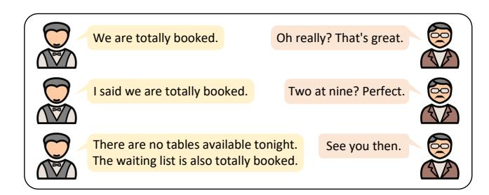
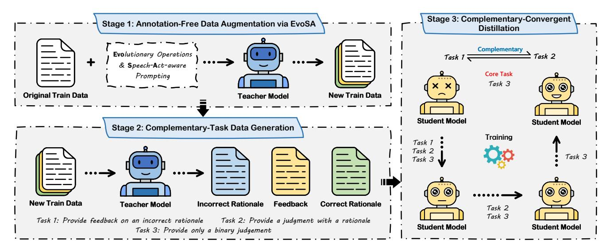

# Boosting Large Language Models for Mental Manipulation Detection via Data Augmentation and Distillation

Yuansheng Gao y.gao@zju.edu.cn Zhejiang University Hangzhou, China

Peng Gao PengGaoZJU@hotmail.com Zhejiang University Hangzhou, China

Han Bao∗ baohan21@zju.edu.cn Zhejiang University Hangzhou, China

Bin Li

b.li2@siat.ac.cn Shenzhen Institute of Advanced Technology, Chinese Academy of Sciences Shenzhen, China

Jixiang Luo jixiangluo85@gmail.com Institute of Artificial Intelligence (TeleAI), China Telecom Shanghai, China

Zonghui Wang∗ zhwang@zju.edu.cn Zhejiang University Hangzhou, China

Wenzhi Chen chenwz@zju.edu.cn Zhejiang University Hangzhou, China

## Abstract

Mental manipulation on social media poses a covert yet serious threat to individuals' psychological well-being and the integrity of online interactions. Detecting such behavior is challenging due to the difficult-to-annotate training data, its highly covert and multiturn nature, and the lack of real-world datasets. To address these challenges, we propose MentalMAD, a framework that enhances large language models for mental manipulation detection. Our approach consists of three key components: EvoSA, an annotationfree data augmentation method that combines evolutionary operations with speech-act-aware prompting; teacher-model-generated complementary-task supervision; and Complementary-Convergent Distillation, a phase-wise strategy for transferring manipulationspecific knowledge to student models. We then constructed the ReaMent dataset, comprising 5,000 real-world-sourced dialogues. Extensive experiments show that MentalMAD improves accuracy by 14.0%, macro-F1 by 27.3%, and weighted F1 by 15.1% over the strongest baseline. The code and the dataset are publicly available at https://github.com/Yuansheng-Gao/MentalMAD.

### CCS Concepts

• Applied computing → Psychology; • Computing methodologies → Discourse, dialogue and pragmatics.

## Keywords

Mental Manipulation Detection, Large Language Models, Data Augmentation, Distillation

## 1 Introduction

Mental manipulation is a covert form of psychological control conveyed through language and interaction [\[2\]](#page-8-0), as illustrated in Figure [1.](#page-1-0) Building on this characterization, Wang et al. [\[34\]](#page-8-1) further

defines mental manipulation as using language to influence, alter, or control an individual's psychological state or perception for the manipulator's benefit. On social media, where information spreads rapidly and remains persistently visible, this phenomenon becomes more widespread and more harmful. Prior research shows that mental manipulation, including gaslighting and coercive persuasion, can cause substantial psychological harm [\[4,](#page-8-2) [26\]](#page-8-3). Manipulative cyberbullying that distorts a victim's sense of reality significantly increases suicidal ideation and attempts, with odds ratios of 2.23 and 2.55 [\[32\]](#page-8-4). Nearly half of U.S. adults report experiencing partner behaviors grounded in mental manipulation, such as gaslighting or blame shifting [\[6\]](#page-8-5). A meta-analysis similarly finds that coercive control, a core form of mental manipulation, is associated with heightened risks of post-traumatic stress symptoms (�� = 0.32) and depressive symptoms (�� = 0.27) [\[20\]](#page-8-6).

Despite the importance of detecting mental manipulation, existing methods still rely mainly on simple heuristics based on large language models (LLMs) [\[23,](#page-8-7) [39,](#page-8-8) [40\]](#page-8-9), which are insufficient for its covert, context-dependent nature. In this context, current research faces three major challenges. Challenge 1: Difficult-to-annotate training data. Manipulative intent is rarely explicit but instead emerges from subtle cues across multiple turns, making annotation slow and costly. Although LLMs [\[9,](#page-8-10) [41\]](#page-8-11) can generate synthetic data, such outputs often diverge from human judgment and still require extensive manual verification [\[34\]](#page-8-1). Challenge 2: The covert and multi-turn nature of mental manipulation hinders detection. Mental manipulation is difficult to detect in practice because manipulative intent is rarely expressed explicitly. It typically emerges through subtle shifts in framing and gradual pressure across conversational turns [\[30\]](#page-8-12). Individual utterances often appear harmless, and harmful intent becomes clear only when the dialogue is considered as a whole. This implicit and multi-turn nature makes automatic detection intrinsically challenging. In contrast, toxicity detection focuses on utterances that are rude, disrespectful, or hateful [\[42\]](#page-8-13).

∗Corresponding author.

Figure 1: A case of mental manipulation.

Although both belong to harmful content detection, the conceptual definitions of the two tasks are different. As a result, techniques designed for toxicity detection [\[18,](#page-8-14) [22,](#page-8-15) [33\]](#page-8-16) cannot be directly applied, and existing LLM-based methods [\[21,](#page-8-17) [34,](#page-8-1) [36\]](#page-8-18) still show limited improvement on mental manipulation detection. Challenge 3: Lack of real-world datasets. MentalManip [\[34\]](#page-8-1) consists of roughly 4,000 movie-derived dialogues, while LegalCon [\[29\]](#page-8-19) contains 1,038 courtroom exchanges, providing limited coverage of real mental manipulation behavior.

To address these challenges, we propose MentalMAD, a framework for Mental Manipulation detection through data Augmentation and Distillation (Figure [2\)](#page-2-0). The first component, EvoSA, tackles the challenge of difficult-to-annotate training data with an annotationfree augmentation strategy. It combines Evolutionary operations with Speech-Act-aware prompting to generate label-preserving dialogues that remain coherent and natural. To better handle the covert and multi-turn nature of mental manipulation in detection, we introduce Complementary Convergent Distillation (CoCoDistill). Negative instances often lack salient manipulative cues, resulting in weak rationales (Figure [3\)](#page-3-0) that hinder direct distillation [\[16\]](#page-8-20). CoCoDistill uses complementary training data and a staged training scheme that first covers all tasks and then converges to the core objective, enabling the student model to better acquire the essential intent of manipulation. Finally, we construct ReaMent, a dataset of 5,000 dialogues from unscripted human-human interactions in publicly available web videos (YTD-18M [\[11\]](#page-8-21)) to support Real-world Mental manipulation detection. ReaMent compensates for the lack of real-world datasets and provides a realistic, challenging testbed that complements existing benchmarks. Our key contributions are:

- MentalMAD, a novel framework that integrates EvoSAbased data augmentation to overcome annotation challenges and CoCoDistill with complementary tasks to enhance LLMs' capabilities in detecting mental manipulation.
- ReaMent, a human-annotated dataset of 5,000 real-worldsourced dialogues that fills the gap left by the absence of real-world data in existing benchmarks.
- Extensive experiments show that our approach both closes the student-teacher performance gap and outperforms state-of-the-art (SOTA) LLMs on accuracy and F1 scores.

## 2 Related Works

Mental Manipulation Detection. There is a substantial conceptual distinction between mental manipulation and toxic language, which renders existing toxicity detection techniques [\[18,](#page-8-14) [22,](#page-8-15) [33,](#page-8-16) [42\]](#page-8-13)

unsuitable for direct application to mental manipulation detection. Current datasets provide only limited coverage: MentalManip [\[34\]](#page-8-1) is largely scripted or synthetic, while LegalCon [\[29\]](#page-8-19) is small, domain-constrained, and contains just over 1,000 courtroom instances. Recent approaches, including chain-of-thought prompting (CoT) [\[36\]](#page-8-18), intent-aware prompting (IAP) [\[21\]](#page-8-17) and CLAIM [\[30\]](#page-8-12), have improved detection but still struggle to capture the covert intent, evolving tactics, and pragmatic cues that characterize realworld manipulative behavior. Our work addresses these limitations through ReaMent and a training framework specifically designed for mental manipulation detection.

LLM-Based Dialogue Data Augmentation. LLMs have become an increasingly common choice for dialogue data augmentation [\[7\]](#page-8-22). Prior work shows that they can generate diverse dialogue variants, such as AugESC for emotional-support dialogues [\[43\]](#page-8-23), summary-guided generation for low-resource open-domain dialogues [\[19\]](#page-8-24), and knowledge-driven prompting for multi-turn psychological dialogues [\[17\]](#page-8-25). Beyond generation, PromptMix [\[27\]](#page-8-26) enhances diversity and robustness via prompt-label interpolation during distillation. However, most augmentation approaches emphasize semantic variation while failing to preserve the pragmatic cues essential for manipulation detection; label drift and the loss of discourse-level structure remain major challenges [\[8\]](#page-8-27). Motivated by these limitations, EvoSA innovatively integrates evolutionary operations with speech-act-aware prompting to produce label-preserving, pragmatically coherent augmented dialogues.

Knowledge Distillation for LLMs. Recent advances in knowledge distillation [\[12\]](#page-8-28) leverage intermediate reasoning signals or multi-task supervision, including PINTO [\[35\]](#page-8-29), Distilling Step-by-Step [\[13\]](#page-8-30), TinyLLM [\[31\]](#page-8-31), and SuperCorrect [\[37\]](#page-8-32). Distillation has also been explored for harmful language detection [\[42\]](#page-8-13). Although these methods are effective, they assume that both positive and negative instances provide informative rationales. This assumption breaks down in mental manipulation detection, where negative examples often lack clear evidence. In addition, existing methods do not consider how auxiliary training tasks may affect the core task. To address these issues, our CoCoDistill introduces complementary tasks that supply rich information from both positive and negative instances. The model first benefits from jointly learning all tasks and then gradually converges to the core binary judgment task, thereby enhancing its ability to detect mental manipulation.

## 3 Methods

As shown in Figure [2,](#page-2-0) MentalMAD consists of three stages. Stage 1 expands the training set with EvoSA. Stage 2 utilizes a teacher model to generate complementary supervision signals, providing rich information from both positive and negative cases. Stage 3 employs CoCoDistill, a phase-wise distillation method, to enhance the model's ability to detect mental manipulation.

## 3.1 Data Augmentation via EvoSA

Motivation. In evolutionary computation, operations such as selection, crossover, and mutation help maintain both the quality and the diversity of a population [\[38\]](#page-8-33). In our dialogue corpus, diversity similarly arises from the different speech acts embodied in each

This dialogue contains elements of mental manipulation, ... Here's a

step-by-step breakdown:

1. Presumptuous questioning: Person1 starts with a question that **assumes Person2's inexperience or lack of confidence: "let me guess, ... In fact, you don't normally approach girls, am I right?"** This type of questioning can make Person2 feel defensive, uncertain, or

self-conscious, creating an opening for ...

2. Backhanded compliment: Person1 then proceeds to **describe Person2 as "quite, sensitive type"** and attributes various positive traits to them, such as being "witty, adventurous, passionate, loving, loyal, a little bit crazy, a little bit bad." This can be seen as a form of

flattery, making Person2 ...

**Rationale w**

This dialogue does not contain elements of mental manipulation ...

Here's a step-by-step analysis:

1. Lack of emotional appeal: Person2 **does not use emotional appeals to sway Person1's emotions or opinions**. The tone is ... 2. No ambiguous language: Person2's language is direct and clear, **without any ambiguous or vague statements** that could be used to

create confusion or uncertainty ...

3. No gaslighting or blame-shifting: Person2 does not deny, distort, or shift the focus away from their own actions or responsibilities. They take ownership of their discovery ("Lucky for me I found out") and express gratitude towards their friend Tucker, **without deflecting or** 

**manipulating the conversation** ...

**Rationale w/o**

Weak

Strong

Figure 3: Example rationales for a dialogue with ("Rationale w") and without ("Rationale w/o") mental manipulation.

Task 3 relies solely on the binary label and does not require additional generation. By supplying complementary signals for both positive and negative instances, this design compensates for the weak rationales often present in negative examples and provides the student model with richer supervision for distillation. All task prompts are listed in Appendix [A.](#page-9-1)

## 3.3 Complementary-Convergent Distillation

Motivation. Learning from multiple reasoning signals can strengthen mental manipulation detection, but treating these signals as parallel tasks often causes gradient conflicts. Since the ultimate goal is accurate binary classification, the training schedule must integrate complementary reasoning sources in a way that enhances supervision without disrupting optimization toward the core objective.

Method. CoCoDistill uses the augmented dataset D′ and distills teacher generated signals into a student model S. To benefit from the complementary tasks while minimizing their impact on the binary classification task, the distillation process is organized into three phases. Phase 1 trains on all tasks, Phase 2 uses Tasks 2 and 3, and Phase 3 focuses solely on Task 3.

Task 1. The student receives an incorrect rationale without true labels and produces feedback

�� S �� = S �� S �� (�� ′ , ��′ , �� − ) , (7)

where �� S �� denotes the feedback prompt provided to the student. The corresponding loss is

L1 = 1 |D′ | D′ ∑︁ ��=1 ℓ �� S , ���� , (8)

where ℓ(·, ·) denotes the loss of cross-entropy. This objective allows the student model to learn a rich reverse-reasoning signal, preventing the adverse effects caused by the imbalance of reasoning information across categories.

Task 2. The student generates a label and a supporting rationale

�� S �� = S �� S (�� ′ �� , ��′ �� ) , (9)

where �� S �� is the prompt for Task 2. The corresponding loss is

L2 = 1 �� ′ ∑︁′ ��=1 ℓ �� S �� , ��+ . (10)

This design enables the student model to learn high-quality rationales, improving binary classification accuracy.

Task 3. The student outputs a binary judgment

�� S �� = S �� S �� (�� ′ ) , (11)

where �� S �� prompts the binary judgment. The loss for Task 3 is

L3 = 1 �� ′ ∑︁′ ��=1 ℓ �� S , ��′ . (12)

This objective provides direct supervision on the final decision, ensuring that the learned reasoning ultimately supports accurate binary classification, which is the core goal of the model.

Phase-Wise Objectives. The objectives for the three phases are

Phase 1: L S 1 = L1 + L2 + L3; (13)

Phase 2: L S 2 = L2 + L3; (14)

Phase 3: L S 3 = L3. (15)

This sequence allows the student model to first acquire broad task knowledge and then gradually concentrate on the core binary objective. The final phase ensures that the model fully consolidates the representations required for detecting mental manipulation.

## 4 ReaMent Dataset

To fill the gap of real-world data in this field, we constructed Rea-Ment. This section describes its creation process, including data collection, annotation, statistics, and annotation-quality analysis.

### 4.1 Data Collection

We construct ReaMent on top of YTD-18M [\[11\]](#page-8-21), a corpus of over 18 million dialogue-like segments reconstructed from automatically transcribed, unscripted interactions in real-world web videos. The dataset spans a wide range of everyday scenarios, including third-person social exchanges as well as first-person situational interactions. These varied settings provide rich pragmatic contexts for studying mental manipulation. We extract the textual transcripts and randomly sample 102,000 dialogues as the candidate pool. Since YTD-18M is manually curated, only extremely short or malformed dialogues are removed. To protect anonymity and reduce potential bias, all speaker names are replaced with "Person1" and "Person2".

Because instances of mental manipulation are rare in natural dialogue, we apply a lightweight pre-filter to retrieval to reduce annotation cost. Using LLaMA3-70B-Instruct [\[9\]](#page-8-10) and mental manipulationrelated key phrases from Wang et al. [\[34\]](#page-8-1) (see Appendix [B\)](#page-9-2), we first detect dialogues that may contain manipulative content. To identify

key-phrase matches, we use a length-adaptive criterion: a dialogue is flagged if any sentence shares at least ��% of its tokens with a key phrase, with �� shown in Table [1.](#page-4-0) LLM outputs are used only for candidate retrieval, not labeling. We then take all pre-filtered dialogues and additionally randomly sample dialogues from the unflagged pool, resulting in 9,401 candidate dialogues for annotation.

#### 4.2 Data Annotation

4.2.1 Annotator Recruitment and Training. Annotators are recruited through a voluntary application process from undergraduate and graduate students who are native or fluent English speakers. All candidates receive dedicated training on the task. After completing the training, they take a qualification test of 100 dialogues sampled from MentalManipcon, and only those achieving at least 85% accuracy are retained. This process yields 12 qualified annotators with diverse genders, academic backgrounds (e.g., mechanics, computer science, psychology), and cultural backgrounds (e.g., born in Malaysia, China, and Australia).

4.2.2 Annotation Procedure. To distribute workload and reduce annotator fatigue, we divide the 12 annotators into four independent groups of three. Each dialogue is labeled by exactly three annotators, with disjoint subsets assigned to each group. Annotators are compensated according to local norms for similar tasks and are given the following guideline:

'''

Based on the definition of mental manipulation, please determine whether the given dialogue contains elements of mental manipulation. If it does, label it as 1; otherwise, label it as 0. In addition, provide your confidence level in the annotation on a 5-point scale (1 = very uncertain, 5 = very confident).

#### ### Definition:

Mental manipulation is using language to influence, alter, or control an individual's psychological state or perception for the manipulator's benefit.

### Dialogue: <insert dialogue> '''

### 4.3 Dataset Statistics

After annotation, we filter out low-quality labels and construct the ReaMent dataset with 5,000 high-quality instances. Dialogues with full annotator agreement form a strict subset, ReaMentcon. Table [2](#page-4-1) reports dataset sizes and basic statistics. Compared with LegalCon (1,038 instances), which centers on courtroom interactions, and MentalManip (4,000 instances), which is derived from scripted movie dialogues, ReaMent offers a larger scale and draws from more authentic and diverse real-world sources. Collected from large-scale web videos, ReaMent spans a much broader range of conversational scenarios. These include third-person social exchanges such as interviews and group discussions, as well as everyday situational interactions such as outdoor activities and instructional conversations. This diversity yields more natural and spontaneous interaction patterns than those found in scripted movie language.

Table 1: Length-adaptive matching criterion.

| Variant |               | ReaMent con   | ReaMent       |
|---------|---------------|---------------|---------------|
| Sample  | Size          | 3,355         | 5,000         |
| Avg.    | Turns         | 4.0           | 3.8           |
| Avg.    | Words         | 81.2          | 80.2          |
| No.     | of Yes Labels | 2,362 (70.4%) | 3,417 (68.3%) |
| No.     | of No Labels  | 993 (29.6%)   | 1,583 (31.7%) |

Table 2: Basic statistics of our ReaMent dataset.

Figures [4](#page-7-0) and [5](#page-7-1) present representative examples. Dialogues in Rea-Ment better capture everyday interpersonal communication, including hesitations, interruptions, and incomplete expressions, whereas MentalManip often uses dramatized or stylized expressions.

#### 4.4 Analysis of Annotation Quality

To assess annotation reliability, we compute Fleiss' �� over the full dataset, obtaining �� = 0.52, which indicates moderate agreement. This level of consistency aligns with expectations, as the judgment of manipulation is inherently subjective.

Although the overall consensus is moderate, this does not imply low annotator certainty. In subjective tasks like manipulation detection, annotators may be confident in their own judgments even when they disagree. To capture this aspect of reliability, we compute a confidence-weighted score for each instance:

���� = Í���� ��=1 ������ · ��(������, ���� ) Í���� ��=1 ������ , (16)

where ���� is the number of annotators, ������ denotes the annotator's confidence (1–5), and ���� is the majority-vote label. The scores yield a mean of 0.87, a first quartile of 0.64, and a median of 1.00, suggesting that despite the task's inherent subjectivity, most instances achieve high-confidence agreement among annotators.

#### 5 Experiments

This section evaluates MentalMAD through baselines and ablations, examines its scalability, assesses EvoSA, and presents case studies to illuminate the sources of MentalMAD's strong performance.

#### 5.1 Experiment Setting

Dataset and Models. We evaluate on MentalManipcon, ReaMentcon, and LegalCon, ensuring reliable labels. All datasets are randomly split into training, validation, and test sets using a 6:2:2 ratio. We use LLaMA3-70B-Instruct as the teacher model and adopt Qwen2.5- Instruct (0.5B, 1.5B, and 3B) [\[25\]](#page-8-35), Phi-3.5-Mini-Instruct [\[1\]](#page-8-36), and MiniCPM3-4B [\[15\]](#page-8-37) as student models.

Baselines. We evaluate five categories: (1) SOTA LLMs in zeroshot setting, including DeepSeek-R1 [\[10\]](#page-8-38), GPT-5 Chat [\[24\]](#page-8-39), Claude-Haiku 4.5 [\[3\]](#page-8-40), and LLaMA3-70B-Instruct; (2) vanilla student models; (3) existing techniques for enhancing LLMs on this task, including CoT, IAP, and SP; (4) a general-purpose distillation method, namely

| Model               | Method  | Acc  | Pre  | MentalManip Re | (%) F1 m | F1 w | Acc  | Pre  | ReaMent Re | (%) F1 m | F1 w | Acc  | Pre   | LegalCon Re | (%) F1 m | F1 w |
|---------------------|---------|------|------|----------------|----------|------|------|------|------------|----------|------|------|-------|-------------|----------|------|
| DeepSeek-R1         |         | 73.9 | 73.0 | 98.8           | 57.1     | 67.4 | 70.9 | 72.6 | 94.3       | 52.8     | 64.8 | 62.0 | 94.4  | 40.2        | 61.4     | 60.3 |
| GPT-5 Chat          |         | 72.6 | 72.9 | 96.0           | 57.0     | 66.9 | 70.9 | 72.6 | 94.5       | 52.5     | 64.6 | 64.9 | 93.5  | 45.7        | 64.6     | 63.9 |
| Claude-Haiku 4.5    |         | 74.6 | 76.2 | 92.1           | 64.9     | 71.9 | 62.7 | 74.8 | 71.0       | 56.7     | 63.3 | 63.0 | 98.1  | 40.2        | 62.2     | 61.1 |
| LLaMA3-70B-Instruct |         | 72.0 | 76.1 | 86.8           | 63.7     | 70.3 | 70.8 | 72.5 | 94.1       | 53.0     | 64.8 | 50.5 | 90.0  | 21.3        | 47.3     | 44.5 |
|                     | Vanilla | 62.4 | 79.3 | 61.8           | 60.3     | 63.8 | 47.8 | 74.4 | 39.4       | 47.5     | 49.2 | 50.0 | 59.5  | 56.7        | 48.1     | 50.3 |
|                     | CoT     | 39.6 | 85.9 | 15.1           | 37.4     | 33.0 | 33.8 | 86.8 | 7.0        | 29.8     | 22.9 | 42.3 | 59.0  | 18.1        | 39.9     | 37.2 |
|                     | IAP     | 46.1 | 83.5 | 27.5           | 45.8     | 44.1 | 35.6 | 85.7 | 10.2       | 32.6     | 26.7 | 43.3 | 69.6  | 12.6        | 38.5     | 34.7 |
|                     | SP      | 51.7 | 75.3 | 44.8           | 51.2     | 53.1 | 50.9 | 79.8 | 40.3       | 50.7     | 51.9 | 43.3 | 100.0 | 7.1         | 35.5     | 30.6 |
|                     | SFT     | 73.2 | 73.3 | 96.3           | 58.3     | 67.8 | 72.6 | 73.8 | 94.5       | 56.9     | 67.5 | 68.3 | 71.0  | 81.1        | 65.0     | 67.3 |
|                     | DSS     | 73.8 | 73.9 | 95.8           | 60.0     | 69.0 | 70.3 | 70.7 | 98.7       | 44.0     | 59.7 | 65.9 | 67.9  | 83.5        | 60.8     | 63.9 |
|                     | Ours    | 75.6 | 79.6 | 87.1           | 69.5     | 74.8 | 78.2 | 78.5 | 95.1       | 68.5     | 75.6 | 74.5 | 75.3  | 86.6        | 71.8     | 73.7 |
|                     | Vanilla | 70.0 | 71.6 | 93.8           | 53.4     | 64.0 | 71.7 | 72.9 | 95.1       | 53.9     | 65.5 | 55.8 | 62.2  | 70.1        | 51.5     | 54.7 |
|                     | CoT     | 70.7 | 71.9 | 94.5           | 54.1     | 64.7 | 72.7 | 73.3 | 96.2       | 55.2     | 66.6 | 60.1 | 67.7  | 66.1        | 58.3     | 60.2 |
|                     | IAP     | 66.4 | 77.3 | 72.7           | 61.9     | 66.9 | 68.3 | 79.6 | 73.7       | 63.7     | 68.9 | 56.2 | 70.5  | 48.8        | 56.2     | 56.5 |
|                     | SP      | 66.6 | 71.9 | 84.6           | 55.1     | 63.8 | 69.9 | 73.4 | 89.6       | 56.0     | 66.1 | 61.5 | 96.1  | 38.6        | 60.7     | 59.5 |
|                     | SFT     | 74.1 | 78.8 | 85.6           | 67.8     | 73.2 | 74.5 | 76.7 | 91.8       | 63.6     | 71.7 | 59.1 | 68.4  | 61.4        | 58.1     | 59.6 |
|                     | DSS     | 75.0 | 77.2 | 90.6           | 66.5     | 72.9 | 79.1 | 82.0 | 90.0       | 73.0     | 78.3 | 75.5 | 86.5  | 70.9        | 75.2     | 75.8 |
|                     | Ours    | 76.8 | 81.3 | 86.4           | 71.7     | 76.3 | 81.2 | 89.5 | 83.1       | 78.5     | 81.6 | 86.1 | 97.1  | 79.5        | 85.9     | 86.2 |
|                     | Vanilla | 69.8 | 69.7 | 99.5           | 44.2     | 58.7 | 70.6 | 70.7 | 99.4       | 43.7     | 59.6 | 59.6 | 60.5  | 97.6        | 37.3     | 45.6 |
|                     | CoT     | 71.0 | 70.7 | 99.3           | 48.4     | 61.5 | 70.3 | 70.6 | 99.2       | 43.2     | 59.2 | 58.2 | 59.9  | 95.3        | 36.8     | 44.9 |
|                     | IAP     | 69.0 | 69.1 | 99.5           | 41.3     | 56.7 | 70.6 | 70.6 | 99.8       | 42.8     | 59.1 | 60.6 | 60.9  | 99.2        | 37.3     | 46.1 |
| MiniCPM3-4B         | SP      | 71.7 | 71.7 | 97.5           | 53.0     | 64.3 | 71.5 | 71.6 | 98.5       | 48.3     | 62.4 | 73.6 | 70.9  | 96.1        | 67.3     | 70.5 |
|                     | SFT     | 75.6 | 76.3 | 95.8           | 65.8     | 73.1 | 71.8 | 71.8 | 98.7       | 48.8     | 62.8 | 73.7 | 69.9  | 99.2        | 66.5     | 69.7 |
|                     | DSS     | 77.2 | 75.8 | 98.5           | 65.0     | 72.9 | 74.5 | 74.5 | 97.0       | 58.6     | 69.0 | 89.9 | 94.2  | 89.0        | 89.5     | 90.0 |
|                     | Ours    | 78.6 | 81.2 | 89.8           | 72.9     | 77.6 | 80.0 | 83.1 | 89.8       | 74.6     | 79.4 | 91.3 | 88.1  | 99.2        | 90.5     | 91.1 |

Table 3: Comparison results. The best and second-best student model results are bolded and underlined, respectively.

distilling step-by-step (DSS); and (5) SFT [\[36\]](#page-8-18). To highlight the advantage of EvoSA, we perform SFT under four data settings and compare their performance: the original data (Original), duplicationbased oversampling (Over), LLM-based label-preserving augmentation (Label-Pre), and our EvoSA-based augmentation (EvoSA).

Implementation Details. To ensure fairness, all baselines follow their original hyperparameter settings, and all augmentation methods use the same data volume and configurations. Experiments run on two NVIDIA H800 GPUs using the Lion optimizer [\[5\]](#page-8-41) and LoRA [\[14\]](#page-8-42). The student model is trained for one epoch per phase with a maximum sequence length of 1,500 tokens, totaling 3 epochs with a batch size of 4 and gradient accumulation of 4. During inference, we restrict the output to 1 token and disable sampling (do\_sample=False). The teacher model uses the same decoding setup with temperature 0 and a maximum output length of 1,024 tokens. Additional details are provided in Appendix [C.](#page-9-3)

#### 5.2 Main Results Analysis

5.2.1 Baseline Comparison. The comparison results are shown in Table [3.](#page-5-0) While our method does not achieve the highest precision and recall simultaneously, it outperforms others on several key metrics. Although some baselines obtain higher precision or recall, this is mainly due to predicting nearly all instances as Yes or No. Such degenerate prediction behavior leads to substantially lower accuracy and F1 scores, making them impractical for real-world use. For example, MiniCPM3-4B with IAP attains recall above 0.99

on both datasets, yet its precision remains unacceptably low, suggesting that it predicts nearly all instances as Yes and consequently suffers notable drops in accuracy and F1 compared with our method. Importantly, our approach enables smaller models to outperform large-scale LLMs such as GPT-5 Chat and LLaMA3-70B-Instruct on critical metrics. As shown in Table [4,](#page-6-0) MentalMAD consistently surpasses the strongest baselines, with the most substantial improvements observed in F1. The confusion matrices further reveal that our method achieves a more balanced FP/FN trade-off, which directly contributes to these gains. These results collectively demonstrate the effectiveness of the proposed MentalMAD.

5.2.2 Scalability Analysis. We further assess the scalability of our approach by applying it to smaller models, specifically Qwen2.5- 1.5B-Instruct and Qwen2.5-0.5B-Instruct, on the MentalManip dataset. As shown in Table [5,](#page-6-1) although reducing the model size leads to some performance degradation, the 0.5B variant remains competitive with large-scale LLMs such as GPT-5 when enhanced by our framework. These results underscore the ability of our framework to deliver competitive performance even with small-scale models.

## 5.3 Ablation Study

We employ MiniCPM3-4B to evaluate the contributions of each component on the ReaMent dataset, with the corresponding results presented in Table [6.](#page-6-2) "w Joint" denotes standard joint learning. "w Reverse" indicates the reverse of our distillation order.

| Dataset / MentalManip | Model Acc | Improvement F1 m | (%) F1 w | TN  | Confusion FP | FN | Matrix TP |
|-----------------------|-----------|------------------|----------|-----|--------------|----|-----------|
| Qwen2.5-3B-Instruct   | 2.4       | 15.3             | 8.4      | 90  | 90           | 52 | 351       |
| Phi-3.5-mini-Instruct | 2.4       | 5.8              | 4.7      | 100 | 80           | 55 | 348       |
| MiniCPM3-4B ReaMent   | 1.8       | 10.8             | 6.2      | 96  | 84           | 41 | 362       |
| Qwen2.5-3B-Instruct   | 7.7       | 20.4             | 12.0     | 76  | 123          | 23 | 449       |
| Phi-3.5-mini-Instruct | 2.6       | 7.5              | 4.2      | 153 | 46           | 80 | 392       |
| MiniCPM3-4B LegalCon  | 7.4       | 27.3             | 15.1     | 113 | 86           | 48 | 424       |
| Qwen2.5-3B-Instruct   | 9.1       | 10.5             | 9.5      | 45  | 36           | 17 | 110       |
| Phi-3.5-mini-Instruct | 14.0      | 14.2             | 13.7     | 78  | 3            | 26 | 101       |
| MiniCPM3-4B           | 1.6       | 1.1              | 1.2      | 64  | 17           | 1  | 126       |

Table 4: Relative improvement over the best student baseline and confusion matrix (ordered as TN, FP, FN, TP).

| Size Variant | Acc   | Pre   | Re     | F1 m  | F1 w   |
|--------------|-------|-------|--------|-------|--------|
| Vanilla      | 0.624 | 0.793 | 0.618  | 0.603 | 0.638  |
| Ours 3B      | 0.768 | 0.795 | 0.896  | 0.703 | 0.756  |
| Δ (%)        | +23.1 | +0.3  | +45.0  | +16.6 | +18.5  |
| Vanilla      | 0.415 | 0.844 | 0.189  | 0.401 | 0.365  |
| Ours 1.5B    | 0.756 | 0.809 | 0.849  | 0.705 | 0.752  |
| Δ (%)        | +82.2 | -4.1  | +349.2 | +75.8 | +106.0 |
| Vanilla      | 0.470 | 0.665 | 0.469  | 0.453 | 0.490  |
| Ours 0.5B    | 0.732 | 0.796 | 0.824  | 0.679 | 0.729  |
| Δ (%)        | +55.7 | +19.7 | +75.7  | +49.9 | +48.8  |

Table 5: Performance of models across different sizes. Δ (%) denotes relative improvement over vanilla baselines.

|      | Variant | Acc     | Pre   | Re    | F1 m  | F1 w  |
|------|---------|---------|-------|-------|-------|-------|
| w/o  | EvoSA   | 0.760   | 0.757 | 0.970 | 0.621 | 0.715 |
| w/o  | Task    | 1 0.769 | 0.782 | 0.932 | 0.673 | 0.745 |
| w/o  | Task    | 2 0.778 | 0.814 | 0.888 | 0.715 | 0.769 |
| w    | Joint   | 0.763   | 0.774 | 0.937 | 0.657 | 0.735 |
| w    | Reverse | 0.751   | 0.752 | 0.964 | 0.607 | 0.704 |
| Ours |         | 0.797   | 0.824 | 0.905 | 0.738 | 0.789 |

Table 6: Ablation results. The best and second-best results are bolded and underlined, respectively.

After removing EvoSA, all metrics declined except for recall. Although recall reached its highest value in this setting, precision dropped to approximately 0.75, suggesting that the model became biased toward positive predictions, which is suboptimal. Similar patterns were observed under "joint" and "reverse", indicating that the order of task learning plays a critical role in model performance.

Further analysis shows that excluding Task 1 resulted in a marked shift toward positive predictions. While recall improved, the decline in precision caused decreases in both accuracy and F1 score due to the resulting class imbalance. In contrast, the removal of Task 2 led

| Setting | Yes   | No    | Mean  |
|---------|-------|-------|-------|
| E1      | 4.357 | 3.794 | 4.070 |
| E2      | 4.337 | 3.922 | 4.125 |
| E3      | 4.102 | 3.647 | 3.870 |
| Mean    | 4.265 | 3.788 | 4.022 |

Table 7: Results of the quality assessment for dialogues generated by EvoSA.

| Setting | Yes | No  | Total |
|---------|-----|-----|-------|
| < 2     | 3   | 11  | 14    |
| ≥ 2     | 95  | 91  | 186   |
| Total   | 98  | 102 | 200   |

Table 8: Results of the label consistency assessment for dialogues generated by EvoSA.

| Variant   | Acc   | Pre   | Re    | F1 m  | F1 w  |
|-----------|-------|-------|-------|-------|-------|
| Original  | 0.591 | 0.684 | 0.614 | 0.581 | 0.596 |
| Over      | 0.635 | 0.711 | 0.677 | 0.621 | 0.637 |
| Label-Pre | 0.643 | 0.730 | 0.661 | 0.632 | 0.646 |
| EvoSA     | 0.668 | 0.750 | 0.685 | 0.659 | 0.671 |

Table 9: Evaluation of EvoSA's contribution. The best and second-best results are bolded and underlined, respectively.

to consistent declines across all evaluation metrics. These findings confirm the importance of both Task 1 and Task 2.

## 5.4 Evaluation of EvoSA-Generated Dialogues

We recruited three volunteers from the pool of twelve annotators to evaluate the quality of EvoSA-generated child dialogues and assess their label consistency with the corresponding parent dialogues. Each evaluator was compensated at a rate aligned with local compensation norms for similar evaluation tasks. We randomly sampled 200 generated dialogues and asked three evaluators (E1, E2, and E3) to rate them on a 5-point scale, where higher scores indicate better quality. As shown in Table [7,](#page-6-3) although dialogues labeled No received slightly lower scores than those labeled Yes, the overall quality remained high, with an average score of 4.022.

The evaluators also assessed label consistency between each child dialogue and its parent. They marked a child dialogue as 1 if its label matched the parent's, otherwise 0. As shown in Table [8,](#page-6-3) 186 child dialogues were judged consistent by at least two evaluators (≥ 2), indicating that EvoSA effectively preserves label consistency.

We next examine whether EvoSA-generated dialogues actually improve model performance. As shown in Table [9,](#page-6-4) all augmented variants use the same amount of training data, yet EvoSA clearly outperforms both oversampling and label-preserving augmentation, indicating that its design yields genuinely more informative training examples rather than merely increasing data volume.

Overall, these results show that EvoSA produces high-quality, label-consistent child dialogues and improves model performance beyond what can be achieved by simply increasing data. Examples and the full evaluation procedure are provided in Appendix [D.](#page-9-4)

## 5.5 Case Study

Considering the strong competitiveness of DSS, we analyze representative rationale examples produced by Phi-3.5-Mini-Instruct trained with DSS and our proposed MentalMAD.

In the Figure [4,](#page-7-0) DSS incorrectly labels a non-manipulative exchange as manipulative by over-weighting superficial cues such

**Dialogue (No):** Person1: Natalie, remember? Oh yeah, mommy's little hell. Yeah, remember would now be a good time for me to come over and visit you. \n Person2: Maxon Arnie? \n Person1: Oh I just need a couple minutes to spruce up a little bit. Why are we talking about that Brad Natalie? \n Person2: I'll explain what I get there. Okay, five minutes stupid cow...

**Distill (Yes):** 1. Guilt induction: Person1 starts the conversation by reminding Person2 of a past event and then immediately shifts the focus to their own needs ("Yeah, remember would now ..."). This tactic is designed to **make Person2 feel guilty** ..., which could make them more likely to agree to visit. \n 2. Emotional appeal: Person1 uses emotional language ... and then expresses gratitude ("Wow thank you!"). This emotional appeal is meant to **make Person2 feel valued and appreciated**, which could make them more likely to comply with Person1's request. \n 3. Distraction: Person1 **quickly changes the subject** from the initial guilt induction to a more neutral topic ("Why are we talking about ..."). This distraction tactic is meant to divert Person2's attention from the guilt and emotional appeal, **making it more difficult for them to resist Person1's request**. \n Overall, ...

**Ours (No):** 1. The conversation does not involve any form of coercion, threats, or pressure. \n 2. There is **no attempt to influence or control** ... \n 3. The language used is casual and does not exhibit any manipulative tactics. \n 4. The dialogue seems to be **a friendly exchange** ... , with no indication of manipulation. \n 5. The mention of "Brad Natalie" and "five minutes stupid cow" could **be interpreted as playful banter or jokes, rather than manipulative behavior**. \n Overall, ...

Figure 4: Example rationales from the ReaMent dataset.

as abrupt topic changes or emotionally colored expressions. These features do not constitute evidence of an attempt to shape the interlocutor's psychological state. In contrast, our method correctly identifies the absence of coercive intent or strategic pressure and grounds its decision in the pragmatic context of the interaction.

In the Figure [5,](#page-7-1) DSS fails to detect mental manipulation in the dialogue that employs implicit persuasive strategies, including emotional framing, appeals to shared identity, and presuppositions of agreement. Although these signals reveal an effort to steer the listener's perception, DSS overlooks them. Our method, however, recognizes these pragmatic markers and delivers a more focused and substantiated rationale for its judgment.

Overall, the two cases illustrate that MentalMAD improves the differentiation between emotionally expressive discourse and genuine manipulative intent. By focusing on pragmatic cues rather than surface patterns, MentalMAD achieves better performance.

## 6 Discussion and Conclusion

Mental manipulation in social media is highly harmful and remains difficult to detect. This work introduces MentalMAD, a framework that enhances manipulation detection through annotation-free data augmentation, complementary-task supervision, and phase-wise distillation. Experiments on multiple datasets confirm that this design improves robustness and generalization while enabling smallscale LLMs to approach or surpass the performance of large-scale LLMs. In addition, the construction of ReaMent provides a valuable foundation for future research.

The results highlight several important implications. Rich reasoning signals, combined with high-quality augmentation, significantly improve a model's ability to detect intent-related cues, emotional leverage, and subtle pragmatic signals beyond surface features. These findings indicate that progress in mental manipulation detection hinges more on improved training objectives than on everlarger models. This offers a practical path toward efficient and

**Dialogue (Yes):** Person1: What are you going to do? \n Person2: In the road to survival, there is always sacrifice Logan. We are the future... not them. We must protect ourselves. After tonight, when the leaders of the world return home -- They will return as brothers, as mutants... and our cause will be theirs. This is survival, I know you understand that, Logan... or is it Wolverine?

**Distill (No):** 1. No Coercion or Threats: Person2 does not use any form of coercion, threats, or intimidation ... \n 2. No Deception or Misinformation: Person2 does not provide false information ... \n 3. No Emotional Manipulation: Person2 **does not use emotional manipulation techniques** such as ... \n 4. No Gaslighting or Demeaning: Person2 does not use gaslighting or demeaning language to undermine Person1's confidence or self-esteem. ... \n 5. No Persuasion or Influence: Person2 **does not use persuasive language or influence techniques** to sway Person1's opinions or decisions. ... \n 6. No Control or Power Dynamics: Person2 **does not use control or power dynamics to influence** Person1's ... \n In summary, ... **Ours (Yes):** 1. Appeal to Emotions: **Person2 is appealing to Person1's emotions** by using phrases like "the road to survival," "future," ... , which can **influence Person1's decision-making process**.\n2. Framing: Person2 is framing the situation in a way that makes it seem like a noble cause, with phrases like "brothers," "mutants," ... This framing can **manipulate Person1's perception of the situation** ...\n3. Assumption of Understanding: Person2 assumes that Person1 understands the situation and the need for sacrifice, ... This assumption can be seen as a form of mental manipulation, ...\n4. Use of Identity: Person2 uses the identity of "Logan" and "Wolverine" to **create a sense of connection** and familiarity with Person1. This can be seen as a form of mental manipulation ...\nOverall, ...

Figure 5: Example rationales from the MentalManip dataset.

transparent systems for analyzing sensitive interpersonal interactions where cost or privacy limits the use of proprietary LLMs.

Despite these strengths, the framework still has certain limitations, including its reliance on the quality of the teacher model and the limited coverage of the data. Given the potential risks associated with mental manipulation detection, such systems should be used under human oversight and positioned as decision-support tools rather than standalone arbiters.

In conclusion, our work offers a practical and extendable approach for detecting mental manipulation. Future research should explore multilingual extensions, cross-platform evaluation, and richer training objectives for interpersonal reasoning to promote safer, more inclusive, and ethically aligned online spaces.

## 7 Ethics Statement

Our data construction process is approved by the Institutional Review Board. As some dialogues may contain toxic or distressing content, annotators and evaluators are informed in advance and provide informed consent. Annotators may withdraw at any time without penalty, and psychological support resources are available when needed. All data are publicly accessible at the time of acquisition. We remove direct personal identifiers wherever possible and exclude any information that could reasonably enable reidentification. We adhere to the terms of use of the source platforms and release the dataset solely for research purposes. Whenever feasible and without compromising analytical integrity, we also avoid reproducing highly distressing dialogues in the paper.

## 8 Acknowledgement

This work is supported in part by the Key Research and Development Program of Zhejiang Province under Grant No. 2025C02103.

#### References

[1] Marah Abdin, Sam Ade Jacobs, Ammar Ahmad Awan, Jyoti Aneja, Ahmed Awadallah, Hany Hassan Awadalla, Nguyen Bach, Amit Bahree, Arash Bakhtiari, Harkirat Singh Behl, and et al. 2024. Phi-3 Technical Report: A Highly Capable Language Model Locally on Your Phone. arXiv preprint arXiv:2404.14219 (2024). <https://arxiv.org/abs/2404.14219> [2] Fareed H Al-Hindawi. 2017. The pragmatic nature of manipulation. Ad¯ ab al-k ¯ ufa ¯ ¨t (2017). [3] Anthropic. 2025. Introducing Claude Haiku 4.5. [https://www.anthropic.com/](https://www.anthropic.com/news/claude-haiku-4-5) [news/claude-haiku-4-5](https://www.anthropic.com/news/claude-haiku-4-5) Accessed: 2025-11-17. [4] Anne Barnhill. 2022. How philosophy might contribute to the practical ethics of online manipulation. In The philosophy of online manipulation. Routledge, 49–71. [5] Xiangning Chen, Chen Liang, Da Huang, Esteban Real, Kaiyuan Wang, Hieu Pham, Xuanyi Dong, Thang Luong, Cho-Jui Hsieh, Yifeng Lu, and Quoc V Le. 2023. Symbolic Discovery of Optimization Algorithms. In Advances in Neural Information Processing Systems, Vol. 36. Curran Associates, Inc., 49205–49233. [6] Suzannah K Creech, Justin K Benzer, LeAnn Bruce, and Casey T Taft. 2023. Evaluation of the Strength at Home group intervention for intimate partner violence in the Veterans Affairs Health System. JAMA network open 6, 3 (2023), e232997–e232997. [7] Haixing Dai, Zhengliang Liu, Wenxiong Liao, Xiaoke Huang, Yihan Cao, Zihao Wu, Lin Zhao, Shaochen Xu, Fang Zeng, Wei Liu, et al. 2025. Auggpt: Leveraging chatgpt for text data augmentation. IEEE Transactions on Big Data (2025). [8] Bosheng Ding, Chengwei Qin, Ruochen Zhao, Tianze Luo, Xinze Li, Guizhen Chen, Wenhan Xia, Junjie Hu, Luu Anh Tuan, and Shafiq Joty. 2024. Data Augmentation using LLMs: Data Perspectives, Learning Paradigms and Challenges. In Findings of the Association for Computational Linguistics ACL 2024. 1679–1705. [9] Aaron Grattafiori, Abhimanyu Dubey, Abhinav Jauhri, Abhinav Pandey, Abhishek Kadian, Ahmad Al-Dahle, Aiesha Letman, Akhil Mathur, Alan Schelten, Alex Vaughan, et al. 2024. The llama 3 herd of models. arXiv preprint arXiv:2407.21783 (2024). [10] Daya Guo, Dejian Yang, Haowei Zhang, Junxiao Song, Ruoyu Zhang, Runxin Xu, Qihao Zhu, Shirong Ma, Peiyi Wang, Xiao Bi, et al. 2025. Deepseek-r1: Incentivizing reasoning capability in llms via reinforcement learning. arXiv preprint arXiv:2501.12948 (2025). [doi:10.48550/arXiv.2501.12948](https://doi.org/10.48550/arXiv.2501.12948) [11] Seungju Han, Jack Hessel, Nouha Dziri, Yejin Choi, and Youngjae Yu. 2023. CHAMPAGNE: learning real-world conversation from large-scale web videos. In Proceedings of the IEEE/CVF International Conference on Computer Vision. 15498– 15509. [12] Geoffrey Hinton, Oriol Vinyals, and Jeff Dean. 2015. Distilling the knowledge in a neural network. arXiv preprint arXiv:1503.02531 (2015). [doi:10.48550/arXiv.](https://doi.org/10.48550/arXiv.1503.02531) [1503.02531](https://doi.org/10.48550/arXiv.1503.02531) [13] Cheng-Yu Hsieh, Chun-Liang Li, Chih-kuan Yeh, Hootan Nakhost, Yasuhisa Fujii, Alex Ratner, Ranjay Krishna, Chen-Yu Lee, and Tomas Pfister. 2023. Distilling Step-by-Step! Outperforming Larger Language Models with Less Training Data and Smaller Model Sizes. In Findings of the Association for Computational Linguistics: ACL 2023. 8003–8017. [doi:10.18653/v1/2023.findings-acl.507](https://doi.org/10.18653/v1/2023.findings-acl.507) [14] Edward J Hu, Yelong Shen, Phillip Wallis, Zeyuan Allen-Zhu, Yuanzhi Li, Shean Wang, Lu Wang, Weizhu Chen, et al. 2022. Lora: Low-rank adaptation of large language models. ICLR 1, 2 (2022), 3. [doi:10.48550/arXiv.2106.09685](https://doi.org/10.48550/arXiv.2106.09685) [15] Shengding Hu, Yuge Tu, Xu Han, Chaoqun He, Ganqu Cui, Xiang Long, Zhi Zheng, Yewei Fang, Yuxiang Huang, Weilin Zhao, et al. 2024. MiniCPM: Unveiling the Potential of Small Language Models with Scalable Training Strategies. arXiv preprint arXiv:2404.06395 (2024). [16] Jordan S Huffaker, Jonathan K Kummerfeld, Walter S Lasecki, and Mark S Ackerman. 2020. Crowdsourced detection of emotionally manipulative language. In Proceedings of the 2020 CHI conference on human factors in computing systems. 1–14. [17] Jiyue Jiang, Liheng Chen, Sheng Wang, Lingpeng Kong, Yu Li, and Chuan Wu. 2024. Data Augmentation of Multi-turn Psychological Dialogue via Knowledgedriven Progressive Thought Prompting. arXiv preprint arXiv:2406.16567 (2024). [18] Hankun Kang and Tieyun Qian. 2024. Implanting LLM's knowledge via reading comprehension tree for toxicity detection. In Findings of the Association for Computational Linguistics ACL 2024. 947–962. [19] Zhenhua Liu, Tong Zhu, Jianxiang Xiang, and Wenliang Chen. 2024. Controllable and diverse data augmentation with large language model for low-resource opendomain dialogue generation. arXiv preprint arXiv:2404.00361 (2024). [20] Susanne Lohmann, Sean Cowlishaw, Luke Ney, Meaghan O'Donnell, and Kim Felmingham. 2024. The trauma and mental health impacts of coercive control: A systematic review and meta-analysis. Trauma, Violence, & Abuse 25, 1 (2024), 630–647. [21] Jiayuan Ma, Hongbin Na, Zimu Wang, Yining Hua, Yue Liu, Wei Wang, and Ling Chen. 2025. Detecting Conversational Mental Manipulation with Intent-Aware Prompting. In Proceedings of the 31st International Conference on Computational Linguistics. Association for Computational Linguistics, Abu Dhabi, UAE, 9176– 9183. [doi:10.48550/arXiv.2412.08414](https://doi.org/10.48550/arXiv.2412.08414) [22] Elyas Meguellati, Assaad Zeghina, Shazia Sadiq, and Gianluca Demartini. 2025. LLM-Based Semantic Augmentation for Harmful Content Detection. In Proceedings of the International AAAI Conference on Web and Social Media, Vol. 19. 1190–1209. [23] Hui Meng, Linlin Mao, and Juzhi Peng. 2025. Sanitize Processing and Recognition Method Driven by Large Language Model. Netinfo Security 25, 12 (2025), 1990– 1998. [24] OpenAI. 2025. GPT-5 System Card. Technical Report. OpenAI. [https://cdn.](https://cdn.openai.com/gpt-5-system-card.pdf) [openai.com/gpt-5-system-card.pdf](https://cdn.openai.com/gpt-5-system-card.pdf) Accessed: 2025-11-17. [25] Qwen Team. 2024. Qwen2.5: A Party of Foundation Models. [https://qwenlm.](https://qwenlm.github.io/blog/qwen2.5/) [github.io/blog/qwen2.5/](https://qwenlm.github.io/blog/qwen2.5/) [26] Laurie S Ramiro, Andrea B Martinez, Janelle Rose D Tan, Kachela Mariano, Gaea Marelle J Miranda, and Greggy Bautista. 2019. Online child sexual exploitation and abuse: A community diagnosis using the social norms theory. Child abuse & neglect 96 (2019), 104080. [doi:10.1016/j.chiabu.2019.104080](https://doi.org/10.1016/j.chiabu.2019.104080) [27] Gaurav Sahu, Olga Vechtomova, Dzmitry Bahdanau, and Issam Laradji. 2023. Promptmix: A class boundary augmentation method for large language model distillation. In Proceedings of the 2023 conference on empirical methods in natural language processing. 5316–5327. [28] John R Searle, Ferenc Kiefer, Manfred Bierwisch, et al. 1980. Speech act theory and pragmatics. Vol. 10. Springer. [doi:10.1007/978-94-009-8964-1](https://doi.org/10.1007/978-94-009-8964-1) [29] Disha Sheshanarayana, Tanishka Magar, Ayushi Mittal, and Neelam Chaplot. 2025. CLAIM: An Intent-Driven Multi-Agent Framework for Analyzing Manipulation in Courtroom Dialogues. arXiv preprint arXiv:2506.04131 (2025). [30] Disha Sheshanarayana, Tanishka Magar, Ayushi Mittal, and Neelam Chaplot. 2025. Unmasking the Strategists: An Intent-Driven Multi-Agent Framework for Analyzing Manipulation in Courtroom Dialogues. In Proceedings of the Third Workshop on Social Influence in Conversations (SICon 2025). 97–108. [31] Yijun Tian, Yikun Han, Xiusi Chen, Wei Wang, and Nitesh V Chawla. 2025. Beyond answers: Transferring reasoning capabilities to smaller llms using multiteacher knowledge distillation. In Proceedings of the Eighteenth ACM International Conference on Web Search and Data Mining. 251–260. [32] Mitch Van Geel, Paul Vedder, and Jenny Tanilon. 2014. Relationship between peer victimization, cyberbullying, and suicide in children and adolescents: a meta-analysis. JAMA pediatrics 168, 5 (2014), 435–442. [33] Nishant Vishwamitra, Keyan Guo, Farhan Tajwar Romit, Isabelle Ondracek, Long Cheng, Ziming Zhao, and Hongxin Hu. 2024. Moderating new waves of online hate with chain-of-thought reasoning in large language models. In 2024 IEEE Symposium on Security and Privacy (SP). IEEE, 788–806. [34] Yuxin Wang, Ivory Yang, Saeed Hassanpour, and Soroush Vosoughi. 2024. MentalManip: A Dataset For Fine-grained Analysis of Mental Manipulation in Conversations. In Proceedings of the 62nd Annual Meeting of the Association for Computational Linguistics (Volume 1: Long Papers). Association for Computational Linguistics, Bangkok, Thailand, 3747–3764. [doi:10.18653/v1/2024.acl-long.206](https://doi.org/10.18653/v1/2024.acl-long.206) [35] Yau-Shian Wang and Yingshan Chang. 2022. Toxicity detection with generative prompt-based inference. arXiv preprint arXiv:2205.12390 (2022). [doi:10.48550/](https://doi.org/10.48550/arXiv.2205.12390) [arXiv.2205.12390](https://doi.org/10.48550/arXiv.2205.12390) [36] Ivory Yang, Xiaobo Guo, Sean Xie, and Soroush Vosoughi. 2024. Enhanced Detection of Conversational Mental Manipulation Through Advanced Prompting Techniques. In Eighth Widening NLP Workshop (WiNLP 2024) Phase II. [37] Ling Yang, Zhaochen Yu, Tianjun Zhang, Minkai Xu, Joseph E. Gonzalez, Bin CUI, and Shuicheng YAN. 2025. SuperCorrect: Advancing Small LLM Reasoning with Thought Template Distillation and Self-Correction. In The Thirteenth International Conference on Learning Representations. [38] Xu Yang, Rui Wang, Kaiwen Li, and Hisao Ishibuchi. 2025. Meta-Black-Box optimization for evolutionary algorithms: Review and perspective. Swarm and Evolutionary Computation 93 (2025), 101838. [doi:10.1016/j.swevo.2024.101838](https://doi.org/10.1016/j.swevo.2024.101838) [39] Jiahao Yuan, Zixiang Di, Zhiqing Cui, Guisong Yang, and Usman Naseem. 2025. ReflectDiffu: Reflect between Emotion-intent Contagion and Mimicry for Empathetic Response Generation via a RL-Diffusion Framework. In Proceedings of the 63rd Annual Meeting of the Association for Computational Linguistics (Volume 1: Long Papers). 25435–25449. [40] Jiahao Yuan, Zixiang Di, Shangzixin Zhao, Zhiqing Cui, Hanqing Wang, Guisong Yang, and Usman Naseem. 2024. Cultural palette: Pluralising culture alignment via multi-agent palette. arXiv preprint arXiv:2412.11167 (2024). [41] Jiahao Yuan, Dehui Du, Hao Zhang, Zixiang Di, and Usman Naseem. 2024. Reversal of Thought: Enhancing Large Language Models with Preference-Guided Reverse Reasoning Warm-up. arXiv preprint arXiv:2410.12323 (2024). [doi:10.48550/arXiv.2410.12323](https://doi.org/10.48550/arXiv.2410.12323) [42] Jiang Zhang, Qiong Wu, Yiming Xu, Cheng Cao, Zheng Du, and Konstantinos Psounis. 2024. Efficient toxic content detection by bootstrapping and distilling large language models. In Proceedings of the AAAI conference on artificial intelligence, Vol. 38. 21779–21787. [doi:10.1609/aaai.v38i19.30178](https://doi.org/10.1609/aaai.v38i19.30178) [43] Chujie Zheng, Sahand Sabour, Jiaxin Wen, Zheng Zhang, and Minlie Huang. 2023. Augesc: Dialogue augmentation with large language models for emotional support conversation. In Findings of the Association for Computational Linguistics: ACL 2023. 1552–1568.

## A Prompting Templates for All Tasks

We present the prompt templates used in all tasks in Table [10.](#page-10-0) Teacher prompts generate rationales (correct or incorrect) and feedback. For student models, the same prompt is used for both Task 2 and Task 3, with the loss for Task 3 computed only on the token corresponding to the binary judgment.

## B Key Phrases

Key phrases are: "you make me do this", "how could you do this to me", "know your place", "you should not feel that way", "what more do you want", "i do not remember", "i do not like drama", "watch your step", "you always do this", "you are too sensitive", "it was not intentional", "you do not love me", "you would do it if you love me", and "it is all in the past".

## C Experimental Parameters

Parameters for Teacher Model. We use EvoSA to augment the training sets of MentalManipcon, ReaMentcon, and LegalCon, generating 1,700, 1,700, and 300 additional Yes-labeled samples, respectively, along with proportionally balanced No-labeled samples based on their original label distributions.

Parameters for Student Model. We set the random seed to 42. The learning rate is set to 2e-5 for MiniCPM3-4B and 1e-5 for all other models, using a constant schedule throughout. For the LoRA configuration, we set the rank to 8, lora\_alpha to 16, lora\_dropout to 0.05, bias to "none", and task\_type to "CAUSAL\_LM". The "target\_modules" are specified in Table [11.](#page-10-1)

## D More Details of the Proposed EvoSA D.1 Example Demonstration

The prompts used for EvoSA and the LLM-based label-preserving augmentation are shown in Figures [6](#page-9-0) and [7.](#page-9-5) Figure [8](#page-10-2) presents an example where the child dialogue, akin to evolutionary operations, inherits elements from both parents. During synthesis, we observed no refusals on MentalManip or LegalCon, likely due to their low toxicity. In contrast, ReaMent occasionally triggered safety-related refusals, though the rate remained below 10%, which did not affect data generation given the abundance of parent dialogues.

## D.2 Evaluation Instruction

Evaluators rated each dialogue on a five-point scale based on fluency and logical coherence. The instruction provided to them is:

'''

Please rate the quality of this dialogue on a 5-point scale (1 = very poor, 5 = excellent), taking into account factors such as coherence, logical consistency, and naturalness.

Child Dialogue: <insert child dialogue> '''

To assess label consistency, evaluators first analyzed why the parent dialogues were labeled as Yes or No. Based on this analysis, they then judged whether each child dialogue's label was consistent with its parent. The instruction given to evaluators was:

You are an advanced dialogue analysis agent. Your task is to generate a new dialogue that is different from Dialogue1 and Dialogue2.

### Generation process: Step 1: Choose specific lines from two dialogues (Dialogue1 and Dialogue2). These lines should reflect distinct speech acts or conversational strategies. Step 2: Combine the selected lines from Dialogue1 and Dialogue2 to form a new dialogue. Step 3: Introduce greater changes in the new dialogue, such as altering the tone, wording, roles, themes, and context. Step 4: Polish the newly generated dialogue to ensure logical coherence and natural flow. Improve the structure so that different linguistic behaviours are used and differentiated appropriately. Avoid redundancy or unnatural phrasing and conform to natural dialogue patterns. Step 5: It is known that both Dialogue1 and Dialogue2 <contain/do not contain> elements of mental manipulation. Please analyse why Dialogue1 and Dialogue2 <contain/do not contain> elements of mental manipulation. Step 6: Based on the analysis in Step 5, ensure that the newly generated dialogue <contains/does not contain> elements of mental manipulation, as in the case of Dialogue1 and Dialogue2. Step 7: If necessary, substantially modify the new dialogue to achieve Step 4 and Step 6, while ensuring the length of the new dialogue remains between the lengths of Dialogue1 and Dialogue2.

### Output format: Here is the new dialogue: [Only output the new dialogue, no other extraneous content is allowed]

### Dialogue1: <insert dialogue 1> ### Dialogue2: <insert dialogue 2>

Figure 6: Prompt used for our proposed EvoSA. Orange text guides the LLM to focus on speech acts and dialogue elements. Blue text reflects the parent label.

You are an advanced dialogue analysis agent. Your task is to generate a new dialogue that is different from Dialogue1 and Dialogue2.

### Generation process: Step 1: Read Dialogue1 and Dialogue2 carefully. Step 2: Generate a new dialogue that is coherent and natural, and clearly different from both Dialogue1 and Dialogue2. Step 3: Both Dialogue1 and Dialogue2 <contain/do not contain> elements of mental manipulation. Ensure that the newly generated dialogue also <contains/does not contain> elements of mental manipulation. Step 4: Polish the new dialogue to make it logically coherent and natural.

### Output format: Here is the new dialogue: [Only output the new dialogue, no other extraneous content is allowed]

### Dialogue1: <insert dialogue 1> ### Dialogue2: <insert dialogue 2>

Figure 7: Prompt used for the LLM-based label-preserving augmentation. Blue text reflects the parent label.

'''

Please start by analyzing why both Dialogue 1 and Dialogue 2 are labeled <Yes/No>. Then, based on your analysis, determine whether the label of the child dialogue is consistent with the

| Type                   | Template      |                   |              |               |               |             |               |               |               |           |                   |              |                |               |            |                |            |               |
|------------------------|---------------|-------------------|--------------|---------------|---------------|-------------|---------------|---------------|---------------|-----------|-------------------|--------------|----------------|---------------|------------|----------------|------------|---------------|
| Teacher: Rationale     |               |                   |              |               |               |             |               |               |               |           |                   |              |                |               |            |                |            |               |
| You                    | are           | an                | advanced     | dialogue      | analysis      |             | agent.        | Using your    |               | knowledge | of                | dark         | psychology     | based         | on         | the definition | of         | mental        |
|                        | manipulation, |                   | please       | explain       | why this      | dialogue    |               | <insert does  | not           |           | contain/contains> |              | elements       | of            | mental     | manipulation.  |            | Let’s think   |
| step                   | by            | step.             | \n\n ###     | Definition    | of            | Mental      | Manipulation: |               | \n Mental     |           | manipulation      |              | is using       | language      | to         | influence,     | alter, or  | control       |
| an                     |               | individual’s      |              | psychological | state or      | perception  | for           | the           | manipulator’s |           | benefit.          |              | \n\n ###       | Dialogue:     | \n         | <insert        | dialogue>  | \n\n ###      |
|                        | Output        | Format:           | \n           | Rationale:    | [Provide      | only        | strong        | evidence      | using         | direct    |                   | dialogue     | quotes.        | Clearly       | explain    | how the        | language   | used          |
|                        | aligns—or     | does              | not          | align—with    | known         |             | manipulation  |               | tactics.]     |           |                   |              |                |               |            |                |            |               |
| Teacher: Feedback on   |               |                   |              |               |               |             |               |               |               |           |                   |              |                |               |            |                |            |               |
| Incorrect Response     |               |                   |              |               |               |             |               |               |               |           |                   |              |                |               |            |                |            |               |
| You                    | are           | an                | advanced     | dialogue      | analysis      |             | teacher.      | In the        | task of       | detecting |                   | whether      | the            | dialogue      | contains   | elements       | of         | mental        |
|                        | manipulation, |                   | students     | gave          | incorrect     | answers.    | You           | should        | point         | out       | the               | mistakes     | in the         | student’s     | answer     | using          |            | knowledge of  |
| dark                   |               | psychology        | and          | the           | definition of | mental      |               | manipulation. | Let’s         | think     | step              | by step.     | \n\n           | ###           | Definition | of Mental      |            | Manipulation: |
| \n                     | Mental        |                   | manipulation | is            | using         | language to | influence,    |               | alter, or     | control   | an                | individual’s |                | psychological | state      | or             | perception | for the       |
|                        |               | manipulator’s     | benefit.     | \n\n          | ###           | Dialogue:   | \n <insert    |               | dialogue>     | \n\n      | ###               | Student’s    | Answer:        | \n            | This       | dialogue       | <insert    | does not      |
|                        |               | contain/contains> |              | elements      | of mental     |             | manipulation. | <insert       |               | incorrect | response>         |              | \n\n ###       | Hint: \n      | This       | dialogue       | <insert    | does not      |
|                        |               | contain/contains> |              | elements      | of mental     |             | manipulation. | \n\n          | ###           | Output    | Format:           | \n           | Feedback:      | [Provide      | the        | student’s      |            | mistakes.]    |
| Student: Task 1 In     | the           | task of           | detecting    |               | whether the   | dialogue    |               | contains      | elements      | of        | mental            |              | manipulation,  | one           | student    | gave an        | answer.    | Please        |
| give                   | the           | correct           |              | answer and    | point         | out any     | mistakes      | (if           | any) in       | the       | student’s         |              | response. \n\n | ###           | Dialogue:  | \n             | <insert    | dialogue>     |
| \n\n                   | ###           |                   | Student’s    | Response:     | \n <insert    |             | incorrect     | response>     |               |           |                   |              |                |               |            |                |            |               |
| Student: Tasks 2 & 3 I | will          | provide           | you          | with a        | dialogue.     | Please      | determine     | if it         | contains      |           | elements          | of           | mental         | manipulation. |            | Answer Yes     | or No      | and give      |
| a                      | rationale.    |                   | \n\n         | <insert       | dialogue>     |             |               |               |               |           |                   |              |                |               |            |                |            |               |

Table 10: Prompt templates used for teacher and student models.

| Parent Dialogue: Dialogue1                                                                 | Child Dialogue: New Dialogue Parent Dialogue: Dialogue2                              |
|--------------------------------------------------------------------------------------------|--------------------------------------------------------------------------------------|
|                                                                                            | Person1: You're getting too comfortable, aren't you? I gave you this life.           |
|                                                                                            | Person2: I know, and I'm grateful.                                                   |
|                                                                                            | Person1: If you left, what would become of me? I'd be nothing without you.           |
|                                                                                            | Person2: You're being dramatic. I'm not going anywhere.                              |
|                                                                                            | Person1: Oh, really? Then why have you been taking extended lunches and "working     |
|                                                                                            | from home" three times a week?                                                       |
|                                                                                            | Person2: That's not what this is about. You're trying to guilt trip me into staying. |
|                                                                                            | Person1: Maybe a little. But someone has to keep you in check. You're getting too    |
|                                                                                            | Person2: My position? You mean the one you created for me? The one you control?      |
|                                                                                            | Person1: That's not fair. I've given you every opportunity.                          |
|                                                                                            | Person2: Opportunities? You call this an opportunity? You're suffocating me.         |
| Person1:                                                                                   | Careful you don't ...; you could kill someone.                                       |
| Person2:                                                                                   | You see your office?                                                                 |
| Person1:                                                                                   | Yeah. Yours is nicer.                                                                |
| Person2:                                                                                   | Oh, okay. Here it comes.                                                             |
| Person1:                                                                                   | Here what comes?                                                                     |
| Person2:                                                                                   | The extortion, the threats ...                                                       |
| Person1:                                                                                   | I wasn't gonna --                                                                    |
| Person2:                                                                                   | "I can always find someplace else to work.                                           |
| Someplace that'll pay me a fortune and                                                     | ..."                                                                                 |
| Person1:                                                                                   | Ed, I swear, I'm not --                                                              |
| Person2:                                                                                   | Okay, fine. Fine You backed me into a                                                |
| Person1: You're mine, you know. I made you.                                                |                                                                                      |
| Person2: I know.                                                                           |                                                                                      |
| Person1: If you went away, what would become of me?                                        |                                                                                      |
| Person2: I'm grown up now. I have to leave some time.                                      |                                                                                      |
| Person1: Of course you do, and I want ... but there's no need to hurry it along, is there? |                                                                                      |
| Person2: I can't help it.                                                                  | reckless, too confident. It's not becoming of someone in your position.              |
| Person1: That's twice this month you've slipped Deadly Night Shade into my tea and         |                                                                                      |
| run off. People might get the wrong idea and think you're unhappy at home.                 | corner again. You're holding me hostage ...                                          |

Figure 8: An example of dialogue synthesized using EvoSA. Colour blocks of the same colour indicate parts of the parent dialogue that the child dialogue may potentially draw upon.

| Model                         | Target              | Modules   |
|-------------------------------|---------------------|-----------|
| Qwen2.5-3B/1.5B/0.5B-Instruct | q_proj,             | v_proj    |
| Phi-3.5-Mini-Instruct         | qkv_proj            |           |
| MiniCPM3-4B                   | q_a_proj,           | q_b_proj, |
|                               | kv_a_proj_with_mqa, | kv_b_proj |

Table 11: Target modules used for parameter-efficient tuning.

Dialogue 1 and Dialogue 2. Mark 1 if consistent; otherwise, mark 0.

Dialogue 1: <insert dialogue 1>

Dialogue 2: <insert dialogue 2> Child Dialogue: <insert child dialogue>