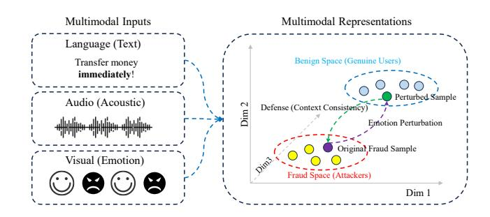
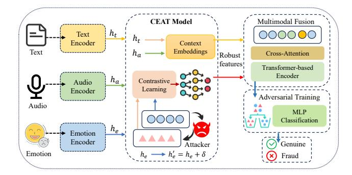
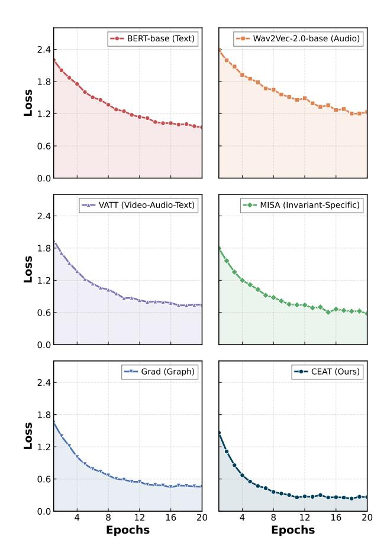
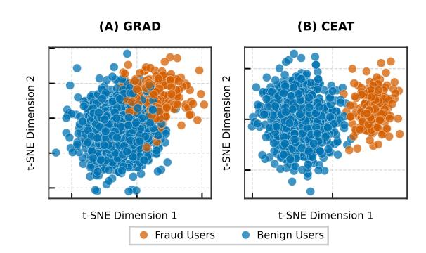

# CEAT: Context-Emotion Adversarial Training Framework for Robust Emotion-Driven Fraud Detection

[Chaoqun Li](https://orcid.org/0000-0002-6720-9445) Shandong University Qingdao, China chaoqunli@mail.sdu.edu.cn

[Si Wu](https://orcid.org/0000-0002-9757-0629) Shandong University Qingdao, China kobesi@sdu.edu.cn

[Yijun Lu](https://orcid.org/0000-0001-6749-5480)∗ Waseda University Tokyo, Japan yijun@ruri.waseda.jp

[Yuyin Ma](https://orcid.org/0009-0007-8894-6077) Xinjiang University Urumqi, China mayuyin@xju.edu.cn

[Jinyao Liu](https://orcid.org/0000-0002-6844-7138) Shandong University Qingdao, China jacelau@mail.sdu.edu.cn

[Dingyi Jia](https://orcid.org/0009-0004-0840-0030) Shandong University Qingdao, China dingyijia@mail.sdu.edu.cn

[Mingda Han](https://orcid.org/0000-0001-8566-2879) Shandong University Qingdao, China mingdhan@mail.sdu.edu.cn

[Feng Li](https://orcid.org/0000-0002-3746-2132) Shandong University Qingdao, China fli@sdu.edu.cn

[Pengfei Hu](https://orcid.org/0000-0002-7935-886X) Shandong University Qingdao, China Quancheng Laboratory Jinan, China phu@sdu.edu.cn

#### Abstract

The rapid proliferation of emotion-aware web services has necessitated the analysis of multimodal user interactions. However, this introduces new vulnerabilities where adversaries exploit emotional signals to circumvent fraud detection systems. Despite its improved utility, the robustness of multimodal fraud detection against emotion-driven adversarial manipulation remains significantly underexplored. Existing paradigms often treat emotional cues as static features, overlooking the adversary's capability to strategically modulate multimodal signals (e.g., facial micro-expressions, vocal intonation, and textual styles) to mimic genuine behavior. Furthermore, prevalent evaluations are typically confined to unimodal perturbations and fail to account for context-consistent, cross-modal attacks, thereby compromising system reliability in real-world deployments. To bridge this gap, we propose Context-Emotion Adversarial Training (CEAT), a robust framework designed to fortify multimodal fraud detection against emotion-based attacks. CEAT leverages a Transformer-based architecture to synergistically model emotional features (e.g., visual dynamics and acoustic prosody) alongside semantic context derived from text, yielding a unified representation. Crucially, CEAT introduces a context-aware perturbation mechanism that injects noise into the emotional latent space during training. This process preserves semantic consistency while encouraging the learning of emotion-invariant and discriminative representations. Additionally, a contrastive learning objective is integrated to maximize the distributional divergence between genuine and adversarial samples within the latent manifold. Extensive

∗Corresponding author: Yijun Lu.

[This work is licensed under a Creative Commons Attribution 4.0 International License.](https://creativecommons.org/licenses/by/4.0) WWW '26, Dubai, United Arab Emirates

© 2026 Copyright held by the owner/author(s). ACM ISBN 979-8-4007-2307-0/2026/04 <https://doi.org/10.1145/3774904.3792981>

experiments on multimodal benchmarks demonstrate that CEAT significantly outperforms state-of-the-art baselines, exhibiting superior robustness under simulated emotion-driven attack scenarios.

# CCS Concepts

#### • Computing methodologies → Feature selection; Natural language processing.

# Keywords

Adversarial Learning, Contrastive Learning, Fraud Detection, Multimodal Fusion, Social Good

#### ACM Reference Format:

Chaoqun Li, Si Wu, Yijun Lu, Yuyin Ma, Jinyao Liu, Dingyi Jia, Mingda Han, Feng Li, and Pengfei Hu. 2026. CEAT: Context-Emotion Adversarial Training Framework for Robust Emotion-Driven Fraud Detection. In Proceedings of the ACM Web Conference 2026 (WWW '26), April 13–17, 2026, Dubai, United Arab Emirates. ACM, New York, NY, USA, [9](#page-8-0) pages. [https://doi.org/10.1145/](https://doi.org/10.1145/3774904.3792981) [3774904.3792981](https://doi.org/10.1145/3774904.3792981)

### 1 Introduction

Safeguarding the digital ecosystem against fraudulent activities is a foundational pillar of the "Web for Good" initiative. While fraud detection has evolved from static, rule-based heuristics to advanced machine learning paradigms that analyze transactional and behavioral logs [\[15\]](#page-8-1), a critical vulnerability remains largely unaddressed: the weaponization of affect in social engineering attacks. Existing detection mechanisms predominantly focus on transactional patterns or lexical cues [\[3\]](#page-8-2), which severely limits their ability to reason about emotional manipulation. As a result, subtle yet powerful affective signals are often overlooked, disproportionately exposing vulnerable users to emotionally charged scams that now account for a substantial share of financial losses and privacy breaches [\[30\]](#page-8-3).

Recent advances in multimodal learning have demonstrated the effectiveness of fusing textual, acoustic, and situational signals for affect-related tasks such as sentiment analysis and emotion recognition. However, existing fraud detection defenses remain fragile in the presence of sophisticated adversaries. Many current approaches either process modalities independently or rely on simplistic fusion strategies that fail to capture the dynamic interplay between semantic content and emotional expression. A representative case of this multimodal dissonance arises when fraudsters combine alarming semantic content (e.g., "Your account will be suspended immediately!") with a calm, authoritative vocal tone to feign legitimacy and suppress victim skepticism. Effectively detecting such deception requires not only multimodal integration but also robustness against adversarial emotional mimicry.

To address this challenge, we propose the Context-Emotion Adversarial Training (CEAT) framework. Unlike conventional approaches that treat emotion as a static or auxiliary feature, CEAT explicitly models emotion as an adversarial attack surface. The framework is built upon three key innovations. First, we introduce an emotion-aware adversarial training mechanism. Instead of injecting generic Gaussian noise [\[18\]](#page-8-4), CEAT generates perturbations directly within the emotional latent space, compelling the model to learn fraud-invariant representations that remain stable even when attackers deliberately modulate emotional attributes. Second, CEAT incorporates a cross-modal contrastive learning objective that aligns fraud instances exhibiting divergent emotional expressions (e.g., aggressive versus sympathetic tones) within a compact latent cluster while separating them from benign interactions, thereby mitigating the effectiveness of emotional camouflage. Third, to address the scarcity of labeled multimodal fraud data, we employ a semi-synthetic data generation strategy that augments real-world transcripts with emotionally calibrated vocal synthesis, enabling coverage of a diverse range of attack scenarios [\[38\]](#page-8-5) (see Figure [1\)](#page-1-0). Consequently, this work makes the following key contributions:

- We conceptualize emotion manipulation as a first-class adversarial attack vector and adapt adversarial training to explicitly decouple fraudulent intent from emotional interference, resulting in robust detection under affective modulation.
- By maximizing distributional divergence between genuine and adversarial samples in a shared latent space, CEAT effectively distinguishes authentic urgency from deceptive manipulation, resolving ambiguities that confound unimodal and naïve multimodal baselines.
- We present a generalizable framework compatible with existing fraud detection pipelines. Moreover, our semi-synthetic data generation strategy lowers the barrier to deploying robust multimodal fraud detection systems in low-resource settings, directly contributing to a safer and more inclusive web.

#### 2 Related Work

### 2.1 Unimodal to Multimodal Fraud Detection

Early fraud detection systems primarily relied on structured transactional data, employing classical machine learning algorithms such as Random Forests [\[35\]](#page-8-6) and Gradient Boosting Machines [\[25\]](#page-8-7) to identify statistical irregularities. While effective for tabular data, these methods largely overlook semantic and affective nuances. In the textual domain, transformer-based models such as VATT [\[1\]](#page-8-8) and BERT-based encoders [\[7\]](#page-8-9) leverage self-attention mechanisms

Figure 1: Illustration of the proposed CEAT framework.

to capture linguistic cues indicative of deception. Feature extraction in such models typically transforms an input sequence �� into a contextualized embedding ℎ:

ℎ = ��(��), (1)

where �� denotes the encoder [\[7\]](#page-8-9). Similarly, graph-based approaches [\[32\]](#page-8-10) analyze transactional networks to uncover relational fraud patterns, yet often neglect unstructured affective signals.

Recent studies increasingly emphasize the necessity of multimodal fusion for robust fraud detection. Approaches such as MENet [\[21\]](#page-8-11), which integrates LiDAR and visual signals, and deep reinforcement learning frameworks [\[8\]](#page-8-12) demonstrate that cross-modal interactions significantly enhance feature discrimination. To integrate heterogeneous signals—ranging from linguistic cues [\[22\]](#page-8-13) and vocal paralinguistics [\[5\]](#page-8-14) to behavioral metadata [\[16\]](#page-8-15)—attention mechanisms are widely adopted. The scaled dot-product attention mechanism is formulated as:

�� = softmax ������ √ ���� , ℎ������ = ���� , (2)

where queries��, keys ��, and values�� enable dynamic weighting of multimodal inputs [\[28\]](#page-8-16). In fraud detection, cross-attention allows textual semantics to query relevant vocal features [\[39\]](#page-8-17), effectively identifying inconsistencies between verbal content and acoustic expression. However, most existing fusion strategies [\[34\]](#page-8-18) implicitly assume modality alignment and fail to explicitly model the deliberate emotional mismatch characteristic of sophisticated fraud schemes.

# 2.2 Multimodal Data Representation

Multimodal architectures are designed to process heterogeneous data sources that often provide complementary information. In fraud detection, three principal modalities are commonly examined: textual content, vocal attributes, and contextual metadata. Textual analysis focuses on linguistic features such as word choice and syntactic patterns that may signal deception [\[22\]](#page-8-13). Vocal attributes convey paralinguistic cues including tone, intensity, and speech rate, which frequently reflect affective states that contradict the verbal message [\[5\]](#page-8-14). Contextual data provides transactional and behavioral indicators, such as payment histories or device fingerprints, that are instrumental in distinguishing legitimate activity from fraud [\[16\]](#page-8-15).

A central challenge lies in effectively integrating these modalities within a unified representation framework. Unlike unimodal

systems, where features typically share comparable scales and distributions, multimodal data necessitates specialized fusion strategies [\[20\]](#page-8-19). Early approaches often relied on naive feature concatenation, resulting in suboptimal performance due to modality-specific biases and dominance effects [\[23\]](#page-8-20). More recent architectures employ attention-based fusion mechanisms that dynamically adjust the contribution of each modality based on its relevance to the detection task [\[34\]](#page-8-18). Despite these advances, existing representations remain limited in their ability to explicitly encode emotional inconsistency across modalities.

# 2.3 Adversarial and Contrastive Learning

2.3.1 Adversarial Robustness. Adversarial training formulates learning as a min–max optimization problem to enhance model robustness against malicious perturbations ��:

min �� max �� L (�� + ��, ��), (3)

where �� is constrained to maximize the loss L [\[14\]](#page-8-21). While gradientbased methods such as FGSM [\[10\]](#page-8-22) are widely used in computer vision, fraud detection applications have largely focused on GANbased data augmentation or facial forgery detection. In multimodal systems, adversarial perturbations may target specific modalities [\[2\]](#page-8-23), exploiting the model's over-reliance on a dominant sensory channel [\[6\]](#page-8-24). Crucially, existing approaches lack principled mechanisms for generating emotion-specific perturbations that realistically simulate the psychological manipulation strategies employed by fraudsters.

2.3.2 Contrastive Representation Learning. Contrastive learning structures the embedding space by drawing semantically similar samples closer while pushing dissimilar samples apart. A commonly used objective is the InfoNCE loss:

L���������������� = ∑︁ (���� ,���� ) ∈�� − log exp(sim(���� , ����)/��) Í (���� ,���� ) ∈��∪�� exp(sim(���� , ���� )/��) , (4)

where �� and �� denote positive and negative sample pairs, respectively [\[13\]](#page-8-25). In fraud detection, contrastive learning helps cluster deceptive behaviors despite superficial variations [\[29\]](#page-8-26). Cross-modal contrastive learning further aligns different modal views of the same instance within a shared latent space [\[37\]](#page-8-27).

Unlike prior approaches that either treat modalities independently [\[32\]](#page-8-10) or focus on generic domain adaptation, our CEAT framework unifies emotion-aware adversarial perturbation with cross-modal contrastive learning. This integration enables CEAT to expose fraudulent scenarios in which emotional expression conflicts with semantic intent—a critical gap insufficiently addressed in existing literature [\[12,](#page-8-28) [27\]](#page-8-29).

# 3 Methodology

### 3.1 Emotion-Driven Fraud Detection Problem

Fraudulent actors increasingly exploit emotional cues to deceive victims or evade automated detection systems. Unlike conventional fraud detection, which primarily relies on anomalous transactional patterns, emotion-driven fraud involves the deliberate manipulation of affective signals, such as feigned distress in voice calls or fabricated urgency in text messages, to induce compliance or bypass

scrutiny [\[31\]](#page-8-30). For example, a scammer may impersonate a distressed family member requesting urgent financial assistance, leveraging emotional triggers to override a victim's rational judgment.

The core challenge lies in distinguishing genuine emotional expressions from adversarially manipulated ones. Traditional fraud detection models, which focus on transactional irregularities or rulebased heuristics [\[15\]](#page-8-1), often fail to capture these subtle emotional cues. Even multimodal systems that incorporate affective features (e.g., sentiment polarity or vocal tone) may be misled when adversarial perturbations remain contextually plausible. This highlights the need for a robust framework that not only detects emotional anomalies but also evaluates their consistency with broader behavioral and transactional contexts [\[19\]](#page-8-31).

Formally, let x�� denote emotional features and x�� represent contextual features (e.g., transaction history or device metadata). The objective is to learn a function �� (x��, x�� ) that predicts the probability of fraud while remaining invariant to adversarial perturbations �� applied to x�� :

min E(x�� ,x�� ,��) -L ���� (x�� + ��, x�� ), �� , (5)

where L denotes the classification loss, �� is the fraud label, and �� is constrained to preserve semantic coherence (e.g., altering vocal pitch to simulate distress without changing linguistic content).

### 3.2 Emotion-Aware Perturbation Generation

Unlike conventional adversarial training approaches that apply generic perturbations, CEAT generates emotion-specific perturbations �� by solving the following constrained optimization problem:

�� = arg max ∥�� ∥ ≤�� L������ ���� (x�� + ��, x�� ), �� , (6)

where �� is optimized to maximize the classification loss L������ while being bounded by �� to ensure imperceptibility. The key innovation lies in restricting �� exclusively to the emotional feature space x�� , thereby preserving the integrity of contextual information. For textual data, this corresponds to perturbing sentiment embeddings while maintaining syntactic correctness; for speech data, it involves modifying prosodic features without distorting linguistic content.

The perturbation process is guided by an emotion saliency map �� (x�� ), which identifies features that exert the greatest influence on the model's decision:

�� (x�� ) = ∇x�� L������ ���� (x��, x�� ), �� . (7)

Perturbations are subsequently weighted by �� (x�� ), ensuring that adversarial modifications target emotionally salient regions. This mechanism effectively simulates real-world fraudsters' tactics of exaggerating specific emotional cues (e.g., increasing vocal stress or textual urgency) to manipulate victims.

### 3.3 Multimodal Feature Extraction

Figure [2](#page-3-0) illustrates the feature extraction stage. We employ modalityspecific encoders to capture heterogeneous representations from each input channel.

Text Encoder (���� ): A pre-trained BERT-based encoder is used to process the textual input x�� . The resulting embedding h�� ∈ R ���� captures the semantic context of the conversation [\[41\]](#page-8-32):

h�� = ���� (x�� ). (8)

Figure 3: Representative multimodal samples from the ChaLearn First Impressions dataset. Each example illustrates the three primary modalities processed by our framework: (1) Visual facial expressions extracted from video frames; (2) Acoustic vocal attributes such as pitch, energy, and tone; and (3) Context describing the interaction scenario (e.g., sales pitch or urgent request).

enables CEAT to learn representations that are both discriminative for fraud detection and robust to deceptive emotional manipulation.

# 4 Experiments

# 4.1 Experimental Setup

4.1.1 Datasets. To evaluate the robustness of CEAT against multimodal deception, we utilize the Real-life Trial (RLT) dataset [\[24\]](#page-8-34), a widely recognized benchmark for high-stakes multimodal deception detection. For consistency with our fraud detection objective, we curate a balanced subset named M-Fraud, comprising 1,200 synchronized sessions of expression frame, audio, and text transcripts. The dataset maintains a fraud (deceptive) to benign (truthful) ratio of roughly 1:5, reflecting real-world anomaly distributions and ensuring a rigorous evaluation of model sensitivity. To evaluate the effectiveness of CEAT in realistic scenarios, we utilize the ChaLearn First Impressions dataset [\[9\]](#page-8-35), which contains a rich collection of multimodal fraud and benign sessions. As illustrated in Figure [3,](#page-4-0) each sample is densely annotated across three dimensions: visual facial expressions, acoustic prosodic features (e.g., pitch, energy), and the specific semantic context (e.g., "Urgent request" or "Sales/Promotion"). This high variance in emotional expression demonstrates the complexity of the fraud detection task and the necessity for emotion-aware modeling.

4.1.2 Baselines. We compare CEAT against a comprehensive set of baselines spanning three categories to validate its effectiveness. First, to assess the contribution of individual modalities, we evaluate unimodal baselines using fine-tuned BERT [\[7\]](#page-8-9) for text and Wav2Vec 2.0 [\[4\]](#page-8-36) for audio. Second, we benchmark against state-ofthe-art (SOTA) multimodal fusion architectures, including MulT [\[26\]](#page-8-37), MMBT [\[17\]](#page-8-38), and VATT [\[1\]](#page-8-8), which utilize varying attention mechanisms for feature integration. Finally, we include specialized fraud and deception detection frameworks such as EANN [\[31\]](#page-8-30), SAFE [\[42\]](#page-8-39), and Emo-FND [\[40\]](#page-8-40) to demonstrate the superiority of our emotion-aware adversarial approach over existing domainspecific methods that typically neglect emotional consistency.

4.1.3 Implementation Details. We employ a modular encoder architecture consisting of BERT-base-uncased [\[7\]](#page-8-9) for text features, pre-trained Wav2Vec-2.0-base [\[4\]](#page-8-36) for acoustic features, and pretrained EmoViT [\[33\]](#page-8-33) for visual emotion extraction. All encoders project features to a unified 768-dimensional latent space, with visual inputs processed at a resolution of 224 × 224. The adversarial perturbation bound �� is strictly set to 0.05 to maintain semantic plausibility. We use the AdamW optimizer with a learning rate of 2�� −5 and a batch size of 32. To prevent overfitting, we apply a dropout rate of 0.3. All experiments are conducted on a cluster of 8×NVIDIA A100 GPUs using PyTorch.

4.1.4 Data Enrichment Strategy. Given the scarcity of high-quality fine-grained emotion labels in fraud datasets, we enhance the visual feature extraction process using the ChaLearn First Impressions dataset [\[9\]](#page-8-35). Specifically, we employ a Transfer Learning approach:

Table 1: Comparative analysis on the M-Fraud (Real Life Trials enhanced with ChaLearn First Impressions) dataset. The Inputs columns indicate the modalities used: Text (T), Audio (A), and Visual/Emotion (V). The best results are marked in bold, and the second-best are underlined.

| Category  |              | Method               |                   |        |        |   |          |           |         |            |
|-----------|--------------|----------------------|-------------------|--------|--------|---|----------|-----------|---------|------------|
|           |              |                      |                   |        | Inputs |   |          |           | Metrics |            |
|           |              |                      |                   | T      | A      | V | Acc. (%) | Prec. (%) | Rec.    | (%) F1 (%) |
| Unimodal  | Text-Only    | (BERT-base)          | [7]               | ✓      | ×      | × | 74.21    | 71.05     | 68.44   | 69.72      |
|           | Audio-Only   | (Wav2Vec-2.0-base)   | [4]               | ×      | ✓      | × | 68.55    | 65.30     | 62.18   | 63.70      |
| MulT      | (Multi-modal |                      | Transformer) [26] | ✓      | ✓      | ✓ | 78.40    | 76.12     | 73.50   | 74.78      |
|           | MMBT         | (Multi-modal         | Bi-Transformer)   | [17] ✓ | ×      | ✓ | 79.15    | 77.05     | 75.20   | 76.11      |
| VATT      |              | (Video-Audio-Text)   | [1]               | ✓      | ✓      | ✓ | 80.02    | 78.44     | 76.10   | 77.25      |
| MISA      |              | (Invariant-Specific) | [11]              | ✓      | ✓      | ✓ | 80.24    | 79.12     | 76.25   | 77.54      |
| EANN      | (Adversarial | Learning)            | [31]              | ✓      | ×      | ✓ | 80.85    | 79.10     | 77.55   | 78.30      |
| SAFE      |              | (Similarity-Aware)   | [42]              | ✓      | ×      | ✓ | 81.50    | 79.80     | 78.33   | 79.05      |
|           | Emo-FND      | (Dual-Emotion)       | [40]              | ✓      | ✓      | ✓ | 82.35    | 80.95     | 79.12   | 80.02      |
| Grad      | (Graph       | Diffusion)           | [36]              | ✓      | ✓      | ✓ | 83.45    | 81.80     | 80.50   | 81.15      |
| Ours CEAT |              |                      |                   | ✓      | ✓      | ✓ | 85.12    | 83.60     | 82.45   | 83.02      |

- (1) Pre-training: We first pre-train the visual emotion encoder on the ChaLearn dataset to capture subtle facial micro-expressions (e.g., conscientiousness, neuroticism) that are highly correlated with deceptive behaviors.
- (2) Feature Alignment: The pre-trained weights are then used to initialize the visual branch of CEAT, which is subsequently fine-tuned on the M-Fraud dataset. This strategy ensures that our model starts with a robust understanding of complex affective signals, rather than learning from scratch on limited fraud samples.

# 4.2 Performance Comparison

Table [1](#page-5-0) summarizes the performance of CEAT against various baselines on the M-Fraud dataset. Our method achieves a consistent improvement across all evaluation metrics.

Necessity of Multimodal Analysis. The unimodal baselines exhibit the lowest performance, with Text-Only achieving 69.72% F1 and Audio-Only lagging at 63.70% F1. This significant gap compared to multimodal methods confirms that relying solely on linguistic semantics or acoustic prosody is insufficient for detecting high-stakes deception. Fraudsters often decouple their verbal content from their vocal/facial expressions, necessitating a holistic view.

Comparison with General Fusion Models. While general multimodal architectures like MulT and VATT effectively fuse features (improving Accuracy to ∼80%), they still fall short of specialized fraud detection frameworks. For instance, CEAT surpasses MISA by 4.88% in Accuracy and 5.48% in F1. This indicates that standard fusion mechanisms, which aim to align modalities, may inadvertently align "camouflaged" emotions with deceptive text, whereas CEAT's adversarial training explicitly learns to disentangle them. Superiority over Specialized Frameworks. CEAT outperforms strong domain-specific baselines, including EANN (Adversarial) and Emo-FND (Dual-Emotion). Notably, CEAT exceeds the strongest

runner-up, Grad-Diff, by 1.67% in Accuracy and 1.87% in F1. More critically, in the context of fraud detection where missing a fraudulent case (false negative) is costly, CEAT achieves a superior Recall of 82.45%. This is a substantial improvement over Emo-FND (79.12%) and SAFE (78.33%), demonstrating CEAT's unique ability to uncover hidden fraud signals such as micro-expression inconsistencies are often masked by manipulated emotions (e.g., a calm face with a high-stress voice).

# 4.3 Ablation Study

To validate the effectiveness of each component in CEAT, we conduct a comprehensive ablation study. We perform paired t-tests to evaluate the statistical significance of the performance drops. The results, summarized in Table [2,](#page-6-0) highlight the indispensability of each module.

- Impact of Adversarial Training (w/o Adv): Removing the emotion-specific perturbations results in a statistically significant deterioration of 3.17% in F1 score (�� &lt; 0.001). This sharp decline indicates that without adversarial training, the model becomes highly susceptible to "emotional camouflage." It tends to over-rely on superficial visual or acoustic features rather than scrutinizing the consistency between emotion and context.
- Impact of Contrastive Learning (w/o CL): Excluding the contrastive loss L�������� leads to a 1.92% drop in F1 (�� &lt; 0.01). While the model retains some predictive power, the lack of contrastive constraints results in a blurred decision boundary in the latent space. The model struggles to cluster "deceptive intent" samples together when their emotional expressions vary widely, confirming that CL is vital for learning emotion-invariant representations.
- Impact of Cross-Attention Fusion (w/o Fusion): Replacing our Cross-Attention Fusion module with simple concatenation causes the most severe performance degradation, with a 3.82% plunge in F1 (�� &lt; 0.01). This significant loss underscores that

Figure 4: Comparison of training dynamics between Unimodal baselines (Top), Multimodal SOTA methods (Middle), and Fraud Detection models (Bottom).

simple feature concatenation cannot effectively model the complex, non-linear dependencies between conflicting modalities, which are hallmark indicators of fraud.

Table 2: Ablation study quantifying the contribution of Adversarial Training (Adv), Contrastive Learning (CL), and Cross-Modal Fusion (CMF). The relative performance drop is shown in parentheses. Statistical significance of the F1 drop compared to the full model is indicated by t-test results ( ∗�� &lt; 0.01).

| Model Variant     | Acc (%)         | F1 (%)          | Δ F1    |
|-------------------|-----------------|-----------------|---------|
| CEAT (Full)       | 85.12           | 83.02           |         |
| w/o Adv ( �� = 0) | 82.40 ( ↓ 3.2%) | 79.85 ( ↓ 3.8%) | -3.17 ∗ |
| w/o CL ( �� = 0)  | 83.15 ( ↓ 2.3%) | 81.10 ( ↓ 2.3%) | -1.92 ∗ |
| w/o CMF           | 81.80 ( ↓ 3.9%) | 79.20 ( ↓ 4.6%) | -3.82 ∗ |

# 4.4 Training Dynamics and Convergence

To further evaluate the optimization efficiency and stability of our proposed framework, we visualize the validation loss curves of CEAT against representative baselines in Figure [4.](#page-6-1) The training process is monitored over 20 epochs.

Unimodal vs. Multimodal. As observed in the top row, unimodal baselines (BERT-base and Wav2Vec 2.0) exhibit the slowest convergence rates and plateau at a significantly higher loss (&gt; 1.0). This empirically confirms that single modalities lack the sufficient information density required to resolve the ambiguity in high-stakes deception detection.

Impact of Fusion Mechanisms. Multimodal baselines like VATT and MISA (middle row) show improved convergence compared to unimodal approaches, settling at a loss range of 0.6 ∼ 0.8. This validates that fusing cross-modal signals aids in learning more discriminative features. However, their descent is relatively gradual, suggesting that standard fusion mechanisms may struggle to quickly align conflicting emotional cues.

Superiority of CEAT. The bottom-right plot highlights the distinct advantage of CEAT.

- Rapid Convergence: CEAT achieves a sharp drop in loss within the first 4 epochs, significantly faster than the Graph-based baseline (Grad). This suggests that our Contrastive Learning objective (L�������� ) effectively guides the model to a discriminative manifold early in the training phase.
- Stability under Adversarial Training: Typically, adversarial training introduces instability and oscillation in loss curves due to the min-max optimization game. Remarkably, CEAT maintains a smooth and stable trajectory, converging to the lowest final loss (≈ 0.25). This stability is attributed to our Emotion-Aware Perturbation strategy, which constrains attacks to the emotion latent space, preventing catastrophic forgetting of semantic context.

In summary, CEAT not only achieves the best detection performance but also demonstrates high training efficiency and optimization stability.

# 4.5 Robustness Analysis

We rigorously evaluate the robustness of CEAT against adversarial interference by subjecting the model to Projected Gradient Descent (PGD) attacks specifically targeting the emotion modality. Table [3](#page-7-0) benchmarks CEAT against general baselines (VATT, MISA) and specialized detectors (EANN, Emo-FND).

Improvement on Clean Data. It is crucial to note that CEAT achieves superior performance even in the absence of attacks (Clean, �� = 0). With an F1-score of 83.02%, it outperforms the strongest baseline, Emo-FND (80.02%). This confirms that our emotion-aware adversarial training acts as an effective regularizer. By introducing perturbations during training, CEAT is forced to learn more robust and generalizable decision boundaries, preventing overfitting to superficial noise in the training data.

Resilience under Attack. As the attack strength �� increases, the limitations of existing methods become apparent:

- General Fusion Models (VATT/MISA): These models suffer catastrophic collapse (e.g., VATT drops 24.4%). Lacking specific defense mechanisms, they blindly trust the perturbed emotional

Table 3: Robustness Comparison under Emotion-PGD Attacks. We report the F1-Score (%) and the relative performance drop (Δ) compared to the clean setting (�� = 0).

| Attack             | Metric | VATT       | MISA       | EANN       | Emo-FND    | CEAT      |
|--------------------|--------|------------|------------|------------|------------|-----------|
| Clean ( �� = 0)    |        |            |            |            |            |           |
|                    | F1     | 77.25      | 77.54      | 78.30      | 80.02      | 83.02     |
|                    | Δ      | ✗          |            | ✗          |            |           |
| Weak ( �� = 0 01)  |        |            |            |            |            |           |
|                    | F1     | 70.15      | 71.30      | 74.20      | 75.40      | 82.10     |
|                    | Δ      | ( ↓ 9.2%)  | ( ↓ 8.0%)  | ( ↓ 5.2%)  | ( ↓ 5.8%)  | ( ↓ 1.1%) |
| Strong ( �� = 0 1) |        |            |            |            |            |           |
|                    | F1     | 58.40      | 61.20      | 68.10      | 65.52      | 79.82     |
|                    | Δ      | ( ↓ 24.4%) | ( ↓ 21.1%) | ( ↓ 13.0%) | ( ↓ 18.1%) | ( ↓ 3.8%) |

features, leading to misclassification when visual/audio cues are subtly manipulated.

- Vulnerability of Specialized Baselines: Emo-FND, which heavily relies on dual-emotion consistency, degrades significantly (- 18.1%) because the attack directly corrupts the features it depends on. Interestingly, EANN shows moderate resilience (-13.0%) due to its event-adversarial training. However, since EANN focuses on event invariance rather than emotion invariance, it still fails to fully counter emotion-specific camouflage.
- Superiority of CEAT: In sharp contrast, CEAT demonstrates graceful degradation. Under strong perturbations (�� = 0.1), its performance dips marginally by only 3.8%, maintaining a high F1 score of 79.82%. This empirically proves that CEAT successfully disentangles genuine fraud intent from manipulatable emotional signals.

# 4.6 Visualization of Learned Representations

To intuitively evaluate the quality of the embeddings learned by CEAT, we utilize t-Distributed Stochastic Neighbor Embedding (t-SNE) to project the high-dimensional feature representations of the test set into a 2D space. Figure [5](#page-7-1) visualizes the distribution of benign users (blue) and fraudsters (orange).

Baseline Analysis (Confusion under Camouflage). As shown in Figure [5\(](#page-7-1)A), the representation space of the baseline model is highly entangled. Significant overlap is observed between the two classes, with fraud samples scattered throughout the benign cluster. This suggests that the baseline is easily misled by "emotional camouflage", where fraudsters mimic the behavioral or emotional patterns of genuine users. Consequently, the model struggles to establish a clear decision boundary, leading to the high false-negative rates observed in Table [1.](#page-5-0)

CEAT Analysis (Discriminative Disentanglement). In contrast, Figure [5\(](#page-7-1)B) demonstrates that CEAT learns a highly discriminative latent space. The fraud and benign samples form two compact, wellseparated clusters with a distinct margin. This separation is a direct result of our joint optimization strategy:

- Contrastive Effect: The contrastive loss L�������� explicitly pulls samples with the same underlying intent closer while pushing apart those with different labels, even if they share similar surfacelevel emotional features.
- Adversarial Effect: The adversarial training forces the encoder to discard non-robust emotional artifacts (which cause the overlap in the baseline) and focus on intrinsic fraud indicators.

Figure 5: Comparison of the latent feature space generated by (A) the Baseline model and (B) our proposed CEAT on the test set. Blue points represent benign users, and orange points represent fraudsters.

The clear separation in the latent space strongly supports the superior classification performance and robustness reported in our quantitative experiments.

#### 5 Conclusion

In this work, we address the critical challenge of emotion-driven fraud by proposing the CEAT framework, which explicitly disentangles genuine fraudulent intent from adversarial emotional camouflage through emotion-specific perturbations and cross-modal contrastive learning. Extensive empirical evaluations on the M-Fraud dataset (Real-life Trial enhanced with ChaLearn First Impressions) demonstrate the effectiveness of CEAT, achieving a state-of-the-art F1-score of 83.02% while exhibiting strong robustness under severe adversarial emotional attacks that cause conventional baselines to degrade substantially. By systematically countering psychological manipulation strategies, CEAT advances the broader mission of trustworthy and socially responsible AI, offering a robust defense layer to protect vulnerable users from sophisticated social engineering fraud. Future work will explore real-time deployment scenarios and deeper integration with large-scale multimodal foundation models.

# 6 Acknowledgements

This work is supported by the National Natural Science Foundation of China (Grant 62422208, 62232010), Ministry of Industry and Information Technology of China (Grant TC240A9ED-70), Shandong Science Fund (Grant ZR2025LZH006), Research Project of Quancheng Laboratory, China (Grant QCL20250106), Project of the Major Innovation Project of Key Laboratory of Computing Power Network and Information Security, Ministry of Education (Grant 2024ZD012); in part by Taishan Scholars Program under Grant (tsqn202507042); in part by National Natural Science Foundation of China (Grant 62472253, U23A20273); in part by Shandong Provincial Natural Science Foundation under Grant ZR2025LZH005; in part by the Taishan Scholars Program under Grant tsqn202408025.

#### References

[1] Hassan Akbari, Liangzhe Yuan, Rui Qian, Wei-Hong Chuang, Shih-Fu Chang, Yin Cui, and Boqing Gong. 2021. Vatt: Transformers for multimodal self-supervised learning from raw video, audio and text. Advances in neural information processing systems 34 (2021), 24206–24221. [2] Alex Andonian, Shixing Chen, and Raffay Hamid. 2022. Robust cross-modal representation learning with progressive self-distillation. In Proceedings of the IEEE/CVF Conference on Computer Vision and Pattern Recognition. 16430–16441. [3] John O Awoyemi, Adebayo O Adetunmbi, and Samuel A Oluwadare. 2017. Credit card fraud detection using machine learning techniques: A comparative analysis. In 2017 international conference on computing networking and informatics (ICCNI). IEEE, 1–9. [4] Alexei Baevski, Yuhao Zhou, Abdelrahman Mohamed, and Michael Auli. 2020. wav2vec 2.0: A framework for self-supervised learning of speech representations. Advances in neural information processing systems 33 (2020), 12449–12460. [5] Gregory Bryant and H Clark Barrett. 2008. Vocal emotion recognition across disparate cultures. Journal of Cognition and Culture 8, 1-2 (2008), 135–148. [6] Xuanming Cui, Alejandro Aparcedo, Young Kyun Jang, and Ser-Nam Lim. 2024. On the robustness of large multimodal models against image adversarial attacks. In Proceedings of the IEEE/CVF Conference on Computer Vision and Pattern Recognition. 24625–24634. [7] Jacob Devlin, Ming-Wei Chang, Kenton Lee, and Kristina Toutanova. 2019. Bert: Pre-training of deep bidirectional transformers for language understanding. In Proceedings of the 2019 conference of the North American chapter of the association for computational linguistics: human language technologies, volume 1 (long and short papers). 4171–4186. [8] Xiaohan Du. 2025. Deep reinforcement learning-based heterogeneous graph neural networks for multi-task financial fraud detection: a new framework incorporating variational self-encoders. J. COMBIN. MATH. COMBIN. COMPUT 127 (2025), 7203–7226. [9] Sergio Escalera, Xavier Baró, Jordi Gonzalez, Miguel A Bautista, Meysam Madadi, Miguel Reyes, Víctor Ponce-López, Hugo J Escalante, Jamie Shotton, and Isabelle Guyon. 2014. Chalearn looking at people challenge 2014: Dataset and results. In European conference on computer vision. Springer, 459–473. [10] Ian J Goodfellow, Jonathon Shlens, and Christian Szegedy. 2014. Explaining and harnessing adversarial examples. arXiv preprint arXiv:1412.6572 (2014). [11] Devamanyu Hazarika, Roger Zimmermann, and Soujanya Poria. 2020. MISA: Modality-Invariant and -Specific Representations for Multimodal Sentiment Analysis. In Proceedings of the 28th ACM International Conference on Multimedia (Seattle, WA, USA) (MM '20). Association for Computing Machinery, New York, NY, USA, 1122–1131. [doi:10.1145/3394171.3413678](https://doi.org/10.1145/3394171.3413678) [12] Frank Horvath. 1982. Detecting deception: the promise and the reality of voice stress analysis. Journal of Forensic Sciences 27, 2 (1982), 340–351. [13] Haigen Hu, Xiaoyuan Wang, Yan Zhang, Qi Chen, and Qiu Guan. 2024. A comprehensive survey on contrastive learning. Neurocomputing 610 (2024), 128645. [14] Ling Huang, Anthony D Joseph, Blaine Nelson, Benjamin IP Rubinstein, and J Doug Tygar. 2011. Adversarial machine learning. In Proceedings of the 4th ACM workshop on Security and artificial intelligence. 43–58. [15] Saiful Islam, Md Mokammel Haque, and Abu Naser Mohammad Rezaul Karim. 2024. A rule-based machine learning model for financial fraud detection. International Journal of Electrical & Computer Engineering (2088-8708) 14, 1 (2024). [16] Johannes Jurgovsky. 2019. Context-aware credit card fraud detection. Ph. D. Dissertation. Université de Lyon; Universität Passau (Allemagne). [17] Douwe Kiela, Suvrat Bhooshan, Hamed Firooz, Ethan Perez, and Davide Testuggine. 2020. Supervised Multimodal Bitransformers for Classifying Images and Text. arXiv[:1909.02950](https://arxiv.org/abs/1909.02950) [cs.CL]<https://arxiv.org/abs/1909.02950> [18] Alexey Kurakin, Ian Goodfellow, and Samy Bengio. 2016. Adversarial machine learning at scale. arXiv preprint arXiv:1611.01236 (2016). [19] Yulong Li, Zhixiang Lu, Feilong Tang, Simin Lai, Ming Hu, Yuxuan Zhang, Haochen Xue, Zhaodong Wu, Imran Razzak, Qingxia Li, and Jionglong Su. 2025. Rhythm of Opinion: A Hawkes-Graph Framework for Dynamic Propagation Analysis. arXiv[:2504.15072](https://arxiv.org/abs/2504.15072) [cs.SI]<https://arxiv.org/abs/2504.15072> [20] Yulong Li, Yuxuan Zhang, Rui Chen, Feilong Tang, Zhixiang Lu, Ming Hu, Jianghao Wu, Haochen Xue, Mian Zhou, Chong Li, Jionglong Su, and Imran Razzak. 2025. Genesis: A Large-Scale Benchmark for Multimodal Large Language Model in Emotional Causality Analysis. In Proceedings of the 33rd ACM International Conference on Multimedia (Dublin, Ireland) (MM '25). Association for Computing Machinery, New York, NY, USA, 12651–12658. [doi:10.1145/3746027.3758202](https://doi.org/10.1145/3746027.3758202) [21] Moyun Liu, Youping Chen, Jingming Xie, Yijie Zhu, Yang Zhang, Lei Yao, Zhenshan Bing, Genghang Zhuang, Kai Huang, and Joey Tianyi Zhou. 2024. MENet: Multi-modal mapping enhancement network for 3D object detection in autonomous driving. IEEE Transactions on Intelligent Transportation Systems 25, 8 (2024), 9397–9410. [22] Zhixiang Lu, Yulong Li, Feilong Tang, Zhengyong Jiang, Chong Li, Mian Zhou, Tenglong Li, and Jionglong Su. 2025. DeepGB-TB: A Risk-Balanced Cross-Attention Gradient-Boosted Convolutional Network for Rapid, Interpretable Tuberculosis Screening. arXiv preprint arXiv:2508.02741 (2025). [23] Maciej Pawłowski, Anna Wróblewska, and Sylwia Sysko-Romańczuk. 2023. Effective techniques for multimodal data fusion: A comparative analysis. Sensors 23, 5 (2023), 2381. [24] Verónica Pérez-Rosas, Mohamed Abouelenien, Rada Mihalcea, and Mihai Burzo. 2015. Deception Detection using Real-life Trial Data. In Proceedings of the 2015 ACM on International Conference on Multimodal Interaction (Seattle, Washington, USA) (ICMI '15). Association for Computing Machinery, New York, NY, USA, 59–66. [doi:10.1145/2818346.2820758](https://doi.org/10.1145/2818346.2820758) [25] Altyeb Altaher Taha and Sharaf Jameel Malebary. 2020. An intelligent approach to credit card fraud detection using an optimized light gradient boosting machine. IEEE access 8 (2020), 25579–25587. [26] Yao-Hung Hubert Tsai, Shaojie Bai, Paul Pu Liang, J. Zico Kolter, Louis-Philippe Morency, and Ruslan Salakhutdinov. 2019. Multimodal Transformer for Unaligned Multimodal Language Sequences. arXiv[:1906.00295](https://arxiv.org/abs/1906.00295) [cs.CL] [https://arxiv.org/](https://arxiv.org/abs/1906.00295) [abs/1906.00295](https://arxiv.org/abs/1906.00295) [27] Panagiotis Tzirakis, George Trigeorgis, Mihalis A Nicolaou, Björn W Schuller, and Stefanos Zafeiriou. 2017. End-to-end multimodal emotion recognition using deep neural networks. IEEE Journal of selected topics in signal processing 11, 8 (2017), 1301–1309. [28] Ashish Vaswani, Noam Shazeer, Niki Parmar, Jakob Uszkoreit, Llion Jones, Aidan N Gomez, Łukasz Kaiser, and Illia Polosukhin. 2017. Attention is all you need. Advances in neural information processing systems 30 (2017). [29] MS Vinay, Shuhan Yuan, and Xintao Wu. 2024. Contrastive learning for fraud detection from noisy labels. In 2024 IEEE 40th International Conference on Data Engineering (ICDE). IEEE, 1421–1434. [30] Gang Wang, Jingling Ma, and Gang Chen. 2023. Attentive statement fraud detection: Distinguishing multimodal financial data with fine-grained attention. Decision Support Systems 167 (2023), 113913. [31] Yaqing Wang, Fenglong Ma, Zhiwei Jin, Ye Yuan, Guangxu Xun, Kishlay Jha, Lu Su, and Jing Gao. 2018. Eann: Event adversarial neural networks for multi-modal fake news detection. In Proceedings of the 24th acm sigkdd international conference on knowledge discovery & data mining. 849–857. [32] Yuqi Wang, Hualin Zhan, and Weinan Jiang. 2024. Time Encoding Graph Attention Model for Financial Fraud Detection in Large-scale Financial Social Networks. In Proceedings of the 2024 3rd International Conference on Cryptography, Network Security and Communication Technology. 70–74. [33] Hongxia Xie, Chu-Jun Peng, Yu-Wen Tseng, Hung-Jen Chen, Chan-Feng Hsu, Hong-Han Shuai, and Wen-Huang Cheng. 2024. EmoVIT: Revolutionizing Emotion Insights with Visual Instruction Tuning. In Proceedings of the IEEE/CVF Conference on Computer Vision and Pattern Recognition (CVPR). 26586–26595. [34] Suchuan Xing and Yihan Wang. 2025. Cross-Modal Attention Networks for Multi-Modal Anomaly Detection in System Software. IEEE Open Journal of the Computer Society (2025). [35] Shiyang Xuan, Guanjun Liu, Zhenchuan Li, Lutao Zheng, Shuo Wang, and Changjun Jiang. 2018. Random forest for credit card fraud detection. In 2018 IEEE 15th international conference on networking, sensing and control (ICNSC). IEEE, 1–6. [36] Jie Yang, Rui Zhang, Ziyang Cheng, Dawei Cheng, Guang Yang, and Bo Wang. 2025. Grad: Guided Relation Diffusion Generation for Graph Augmentation in Graph Fraud Detection. In Proceedings of the ACM on Web Conference 2025 (Sydney NSW, Australia) (WWW '25). Association for Computing Machinery, New York, NY, USA, 5308–5319. [doi:10.1145/3696410.3714520](https://doi.org/10.1145/3696410.3714520) [37] Xin Yuan, Zhe Lin, Jason Kuen, Jianming Zhang, Yilin Wang, Michael Maire, Ajinkya Kale, and Baldo Faieta. 2021. Multimodal contrastive training for visual representation learning. In Proceedings of the IEEE/CVF conference on computer vision and pattern recognition. 6995–7004. [38] Chong Zhang, Mingyu Jin, Qinkai Yu, Chengzhi Liu, Haochen Xue, and Xiaobo Jin. 2024. Goal-guided generative prompt injection attack on large language models. In 2024 IEEE International Conference on Data Mining (ICDM). IEEE, 941–946. [39] Huijun Zhang, Yang Ding, Lei Cao, Xin Wang, and Ling Feng. 2022. Fine-grained question-level deception detection via graph-based learning and cross-modal fusion. IEEE Transactions on Information Forensics and Security 17 (2022), 2452– 2467. [40] Xueyao Zhang, Juan Cao, Xirong Li, Qiang Sheng, Lei Zhong, and Kai Shu. 2021. Mining Dual Emotion for Fake News Detection. In Proceedings of the Web Conference 2021 (Ljubljana, Slovenia) (WWW '21). Association for Computing Machinery, New York, NY, USA, 3465–3476. [doi:10.1145/3442381.3450004](https://doi.org/10.1145/3442381.3450004) [41] Yuxuan Zhang, Yulong Li, Feilong Tang, Zichen Yu, Ming Hu, Zhixiang Lu, Haochen Xue, Zhaodong Wu, Kang Dang, Imran Razzak, and Jionglong Su. 2025. Decoding the Flow: CauseMotion for Emotional Causality Analysis in Long-form Conversations. In 2025 IEEE International Conference on Advanced Visual and Signal-Based Systems (AVSS). 1–6. [doi:10.1109/AVSS65446.2025.11149922](https://doi.org/10.1109/AVSS65446.2025.11149922) [42] Xinyi Zhou, Jindi Wu, and Reza Zafarani. 2020. SAFE: Similarity-Aware Multi-Modal Fake News Detection. arXiv[:2003.04981](https://arxiv.org/abs/2003.04981) [cs.CL] [https://arxiv.org/abs/2003.](https://arxiv.org/abs/2003.04981) [04981](https://arxiv.org/abs/2003.04981)