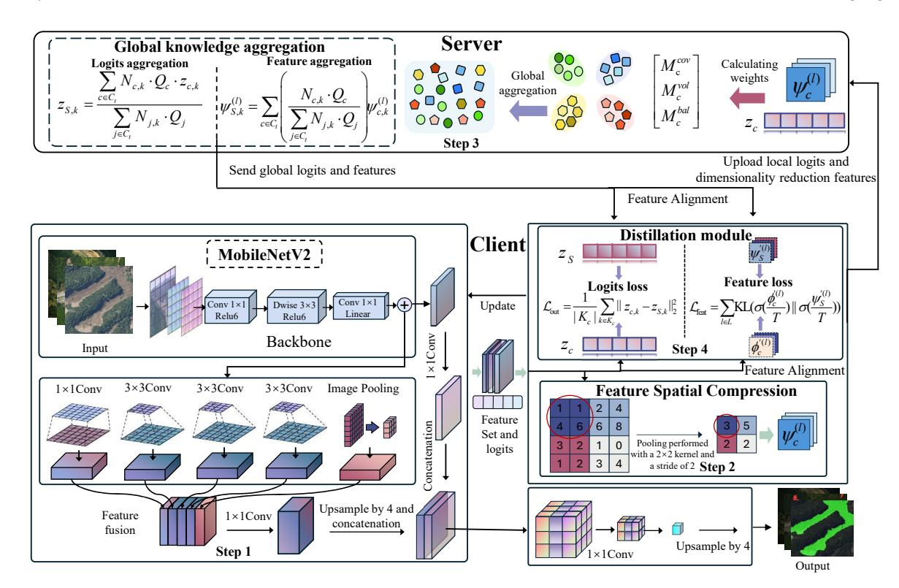
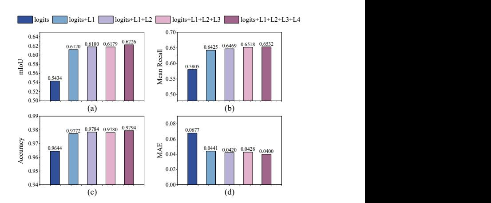
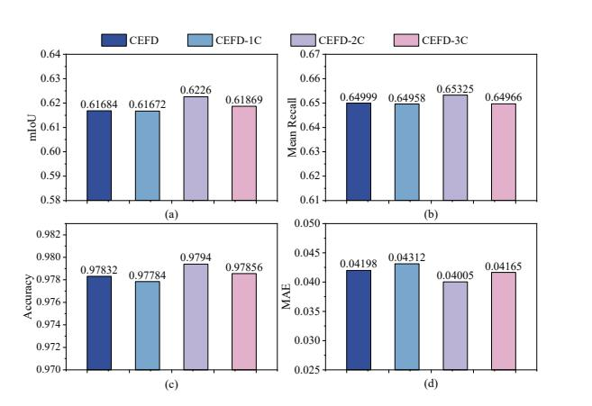
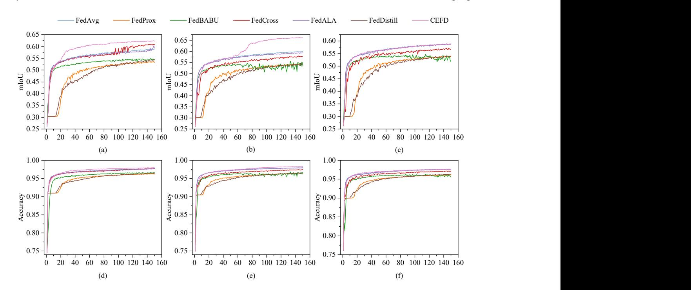
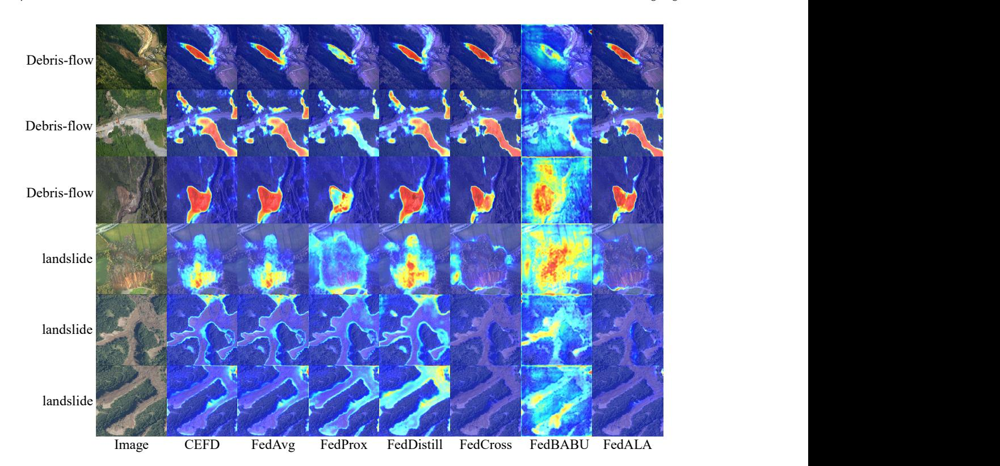
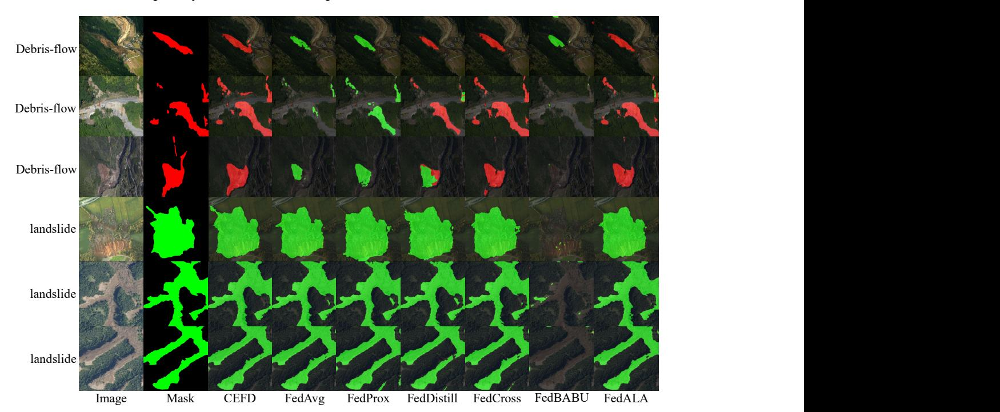

# Communication-Efficient Federated Learning for Post-Flood Risk Assessment Using UAV Swarms

[Yongkang Zhao](https://orcid.org/0009-0004-3390-7503)∗ College of Mathematics and Computer Science Zhejiang A&F University Hangzhou, Zhejiang, China ykzhao@ieee.org

[Hailin Feng](https://orcid.org/0000-0003-2734-480X)∗ College of Mathematics and Computer Science Zhejiang A&F University Hangzhou, Zhejiang, China hlfeng@zafu.edu.cn

[Tingting Wang](https://orcid.org/0000-0002-2666-7159) Zhuhai UM Science and Technology Research Institute Zhuhai, China tingtingwang@ieee.org

[Thippa Reddy Gadekallu](https://orcid.org/0000-0003-0097-801X) College of Mathematics and Computer Science Zhejiang A&F University Hangzhou, Zhejiang, China thippareddy@ieee.org

[Kai Fang](https://orcid.org/0009-0005-3386-4256)† College of Mathematics and Computer Science Zhejiang A&F University Hangzhou, Zhejiang, China kaifang@zafu.edu.cn

[Wei Wang](https://orcid.org/0000-0002-9325-3677) Engineering Research Centre of Applied Technology on Machine Translation and Artificial Intelligence Macao Polytechnic University Macao, China weiwang@mpu.edu.mo

### Abstract

Accurate semantic segmentation is crucial for rapid risk and severity assessment following flash flood disasters. However, in drone networks deployed for disaster recovery, bandwidth constraints mean the backhaul transmission of massive imagery required for centralized processing is highly prone to causing network congestion. Federated Learning, a decentralized collaborative paradigm that permits drones to process data locally, offers an ideal pathway to address this challenge. Nonetheless, existing FL methods are plagued by the dilemma of excessive communication overhead and insufficient segmentation performance. Therefore, this paper proposes a Communication-Efficient Federated Distillation (CEFD) framework. The core of this framework lies in the design of a lightweight, multi-level knowledge representation. It discards the transmission of bulky parameters, opting instead for the efficient exchange of high-level semantic logits and key intermediate features that have undergone feature-space dimensionality reduction. On the server side, adaptive weighted aggregation is then utilized to construct a robust global knowledge model. Experimental results show that CEFD achieved high segmentation performance on the LSD dataset, attaining an mIoU of 0.6226, a Mean Recall of 0.6532, an Accuracy of 0.9794, and an MAE of 0.0400, while reducing communication overhead by approximately 99.5%. This enables scalable collaborative intelligence for resource-constrained edge devices, a key capability for the future web systems.

WWW '26, Dubai, United Arab Emirates. © 2026 Copyright held by the owner/author(s). ACM ISBN 979-8-4007-2307-0/2026/04 <https://doi.org/10.1145/3774904.3792983>

### CCS Concepts

• Computing methodologies → Distributed artificial intelligence; • Networks → Network resources allocation; Mobile networks.

# Keywords

Post-disaster assessment; Federated learning; Efficient communication; Image segmentation; UAV Swarms network

### ACM Reference Format:

Yongkang Zhao, Hailin Feng, Tingting Wang, Thippa Reddy Gadekallu, Kai Fang, and Wei Wang. 2026. Communication-Efficient Federated Learning for Post-Flood Risk Assessment Using UAV Swarms. In Proceedings of the ACM Web Conference 2026 (WWW '26), April 13–17, 2026, Dubai, United Arab Emirates. ACM, New York, NY, USA, [11](#page-10-0) pages. [https://doi.org/10.1145/](https://doi.org/10.1145/3774904.3792983) [3774904.3792983](https://doi.org/10.1145/3774904.3792983)

# 1 Introduction

Sudden disasters such as landslides and debris flows pose a severe threat to human life and property [\[27,](#page-8-0) [29\]](#page-8-1). In the aftermath of a disaster, rapid assessment of risk and severity is the primary task for emergency response [\[17\]](#page-8-2). This assessment relies on the precise semantic segmentation of flash flood inundation zones and landslide boundaries to support rescue decisions. However, these disasters often destroy ground-based communication infrastructure, turning the affected area into an information island and impeding any effective data collection. Against this backdrop, aerial ad-hoc networks composed of Unmanned Aerial Vehicle (UAV) swarms have emerged as a critical disaster assessment network technology [\[14,](#page-8-3) [20\]](#page-8-4). They not only serve as temporary communication relays but can also collaboratively enter areas inaccessible to human personnel to collect the high-definition imagery required for assessment, enabling the possibility of real-time disaster severity evaluation [\[13\]](#page-8-5).

To achieve rapid risk and severity assessment in post-flash-flood recovery scenarios, Unmanned Aerial Vehicle (UAV) networks must

∗Both authors contributed equally to this research.

†Corresponding author.

[This work is licensed under a Creative Commons Attribution-NonCommercial-](https://creativecommons.org/licenses/by-nc-nd/4.0)[NoDerivatives 4.0 International License.](https://creativecommons.org/licenses/by-nc-nd/4.0)

possess near real-time semantic segmentation capabilities to automatically identify and map flood inundation zones and landslide boundaries [\[2,](#page-7-0) [30\]](#page-8-6). However, a fundamental contradiction exists between the data throughput required to run these models and the inherently fragile bandwidth of aerial UAV networks. Adopting a centralized processing approach, which involves the real-time backhaul of high-definition video streams from all UAVs, would immediately lead to network congestion [\[4\]](#page-8-7). Federated Learning (FL) offers a data-decentralized collaborative training approach [\[1,](#page-7-1) [6,](#page-8-8) [31\]](#page-8-9), which allows UAVs to process data locally, thereby avoiding the transmission of raw imagery. However, traditional FL was not originally designed for disaster recovery networks. It requires the frequent exchange of complete model parameters, often hundreds of megabytes in size, across the network [\[5,](#page-8-10) [22,](#page-8-11) [24\]](#page-8-12). This high communication cost, for bandwidth-constrained and unstably connected UAV networks, would induce catastrophic latency and extremely high transmission failure rates, rendering it impractical for application [\[26\]](#page-8-13). To specifically address the high communication costs of traditional FL, an alternative called the federated knowledge distillation method has been proposed. This method effectively minimizes network load by exchanging only lightweight logits but introduces severe performance pitfalls. Such an extreme pursuit of efficiency sacrifices information integrity, resulting in the loss of critical low-level spatial structural details. Consequently, the model is rendered incapable of precisely delineating disaster boundaries, failing to meet the stringent standards required for emergency response. Therefore existing technologies are trapped in a dilemma

between communication overhead and segmentation performance. This paper proposes a Communication-Efficient Federated Distillation (CEFD) framework characterized by the decoupling and selective transfer of logits and compressed intermediate features. By leveraging these complementary knowledge sources, the framework balances low communication costs with high segmentation accuracy. This lightweight yet information-rich mechanism facilitates precise segmentation in bandwidth-constrained networks, thereby fundamentally resolving the aforementioned dilemma.

The main contributions of this paper are as follows:

- (1) We propose the CEFD framework, which introduces a novel multi-level knowledge representation to decouple and selectively transfer high-level semantic knowledge and essential spatial structure knowledge, addressing the accuracy and efficiency tradeoff in distributed learning at the network edge.
- (2) We designed a Feature Spatial Compression (FSC) mechanism that serves not only as a network compression tool but also as an information refinement method, enhancing the robustness of aggregated knowledge on Non-Independent and Identically Distributed (Non-IID) data.
- (3) Experimental results demonstrate that CEFD achieves high segmentation performance on the LSD dataset with an mIoU of 0.6226, a Mean Recall of 0.6532, an Accuracy of 0.9794, and an MAE of 0.0400, while reducing communication overhead by approximately 99.5% compared to parameter aggregation methods. The significant improvement in communication

efficiency not only makes it suitable for Web-scale data generation devices but also directly reduces energy consumption, which is critical for battery-powered edge devices.

The remainder of this paper is organized as follows. Section [2](#page-1-0) reviews the related work. Section [3](#page-2-0) describes the proposed methodology. Experiments and analysis are presented in Section [4,](#page-4-0) and conclusion are drawn in Section [5.](#page-7-2)

# 2 Related Work

### 2.1 Deep Learning Segmentation Techniques for Disaster Assessment

In recent years, researchers have made significant progress in utilizing deep learning segmentation techniques to enhance the accuracy and robustness of automated disaster assessment. A primary challenge in disaster assessment stems from the complexity of high-resolution imagery. To address this, Diakogiannis et al. [\[3\]](#page-7-3) proposed the ResUNet-a framework, which integrates residual connections, atrous convolutions, and pyramid pooling to tackle pixellevel variance challenges in high-resolution images. Beyond pixel value variance, the confusability of disaster features is another major difficulty. Qurratulain et al. [\[23\]](#page-8-14) utilized a ResNet instance segmentation model to more accurately distinguish between easily confused features, such as burned areas and bare ground. Building upon innovations in model architecture, fusing multi-source data is another effective pathway to improve assessment accuracy. For example, Lu et al. [\[18\]](#page-8-15) designed a dual-encoder architecture to enhance landslide detection performance by fusing deep features from optical imagery and DEM data. Following a similar multi-modal fusion approach, Kopiika et al. [\[11\]](#page-8-16) also adopted a multi-scale method, combining SAR image analysis with deep learning segmentation to achieve multi-level damage detection for infrastructure. Furthermore, targeting road network assessment, which is critical in post-disaster recovery, Gupta et al. [\[7\]](#page-8-17) proposed a framework utilizing OSM data and graph theory to focus on identifying passable road networks post-disaster.

All the advanced segmentation models mentioned above rely on a centralized training paradigm. However, this prerequisite is untenable in our post-flash-flood recovery scenario. Because the disaster area data is inherently collected in a distributed manner by multiple UAVs and the ground network has been destroyed, exploring a decentralized collaborative training framework that does not require sharing raw data becomes an inevitable choice.

### 2.2 Communication-Efficient Federated Learning for Segmentation Tasks

FL, as a decentralized collaborative paradigm, presents an ideal pathway for addressing the collaborative assessment challenges in UAV swarms. However, standard FL algorithms, such as FedAvg, require the frequent transmission of bulky model parameters within the disaster recovery network, which introduces substantial communication overhead. Consequently, researchers have explored various communication-efficient FL strategies. For instance, to solve the problems of large storage and communication overhead in FL, Shah et al. [\[25\]](#page-8-18) proposed a model compression scheme. This scheme designs separate compression strategies for the server and clients to

scales in post-flash-flood recovery networks, we established multiple FL scenarios comprising 4, 5, and 6 clients. The Landslide Segmentation Dataset (LSD) in this study is specifically designed for the semantic segmentation task of geological hazards, such as landslides and debris flows, in remote sensing imagery. The dataset is composed of high-resolution remote sensing satellite imagery, covering diverse geographical regions. The dataset provides precise pixel-level annotations, with labeled classes primarily including landslide area, debris flow area, and background area, making it an ideal benchmark for evaluating disaster monitoring algorithms.

In the data preprocessing stage, we cropped all images from the LSD dataset into 512 × 512 pixel patches to fit the input dimensions of the deep learning models. To enhance data diversity and improve the model's generalization capability, we applied data augmentation strategies to the training images, including random horizontal flipping, rotation, and color jittering. For the label data, nearestneighbor interpolation was employed for synchronous processing to ensure the precision of the disaster area boundary annotations was preserved. To simulate the heterogeneity challenge of nonuniform data distribution among UAVs in real-world disaster scenarios, we adopted a Dirichlet distribution to partition the dataset. By setting the hyperparameter of the Dirichlet distribution (�� = 0.5), we generated a class-imbalanced sample distribution for each client. This effectively simulates the real-world situation where different UAVs observe different types or quantities of disasters in different regions.

### 4.2 Impact of the Number of Distillation Levels on Model Performance

We conducted a set of ablation experiments to validate the necessity of multi-level knowledge distillation within the CEFD framework and to determine the optimal number of distilled layers. We respectively distilled the following five configurations namely logits, logits+low-level features (logits+L1), logits+low-level features+aspp features (logits+L1+L2), logits+low-level features+aspp features+shortcut features (logits+L1+L2+L3), and logits+low-level features+aspp features+shortcut features+fused features (logits+L1+ L2+L3+L4). All configurations were run under the same Non-IID data partition and experimental setup and were evaluated using four metrics mIoU, Mean Recall, Accuracy and MAE. The experimental results are illustrated in Fig. [2.](#page-5-0)

As clearly observed from the figure the number of distilled layers has a direct and significant impact on model performance. When only logits are distilled the model performance is at its minimum with an mIoU of only 0.5434 and an MAE as high as 0.0677. However once an additional intermediate feature layer is added logits+L1 all metrics show substantial improvement with mIoU increasing to 0.6120 and MAE decreasing to 0.0441. Building on this the performance gains from adding more distillation layers are more moderate but still exhibit a consistent positive trend. Ultimately the logits+L1+L2+L3+L4 configuration achieved the best performance across all four key metrics attaining the highest mIoU value of 0.6226 the highest Mean Recall of 0.6532 the highest Accuracy of 0.9794 and the lowest MAE value of 0.0400.

This result intuitively reflects that single-dimensional knowledge is insufficient to meet the demands of a complex segmentation

Figure 2: Impact of the number of distillation levels on model performance. L1, L2, L3, and L4 are low-level features, aspp features, shortcut features, and fused features, respectively.

task. The significant performance leap from Level Count=1 to Level Count=2, marked by an mIoU increase of 0.0686, demonstrates the strong complementarity between high-level semantics from logits and low-level spatial structure from feature layers. High-level knowledge alone cannot provide the model with the boundary and textural cues required for precise segmentation. As more levels were introduced, performance continued to climb, indicating that a richer combination of features spanning different levels of abstraction, ranging from shallow details to deep structures, is key to constructing robust global knowledge and guiding local model learning. Therefore, we selected the Level Count=5 configuration for all subsequent experiments.

### 4.3 Impact of Pooling Strategy on Model Performance

We then analyzed the comprehensive impact of the FSC mechanism on model performance and network efficiency. To make the compression effect more concrete we specified the feature space dimensions before and after pooling. Based on our 512×512 input and DeepLabV3+ architecture the original spatial dimensions (�� ×�� ) of the four layers of knowledge (L1-L4) are primarily 128 × 128 (L1, L3, L4) and 32 × 32 (L2). The four configurations we evaluated include CEFD transmitting the original dimensions, CEFD-1C which uniformly adaptively pools all feature maps to 8 × 8 via one compression, CEFD-2C which pools to 4 × 4 via two compressions, and CEFD-3C which pools to 2 × 2 via three compressions. The experimental results are shown in Fig. [3.](#page-6-0)

In terms of model segmentation performance, as shown in the figure, CEFD-2C achieved the best performance across all four metrics. It reached an mIoU of 0.6226, a Mean Recall of 0.6532, an Accuracy of 0.9794, and the lowest MAE among all configurations at 0.0400. The other configurations, including the non-downsampled CEFD as well as CEFD-1C and CEFD-3C, exhibited similar performance levels, but none matched the performance of CEFD-2C.

This performance trend reflects a key trade-off in the feature dimensionality reduction process. Transmitting non-downsampled high-dimensional features or applying insufficient downsampling,

Figure 3: Impact of pooling strategy on model performance

such as in the CEFD and CEFD-1C configurations, retains excessive redundant information and local noise. This noise can contaminate the global knowledge during the aggregation process, thereby limiting the upper bound of model accuracy. Conversely, overly aggressive downsampling, as seen in the CEFD-3C configuration, while removing noise, also leads to the loss of critical spatial structure information, which similarly impairs segmentation performance. The CEFD-2C configuration performed best because it struck an ideal balance. While effectively filtering noise and distilling the most representative core knowledge, it also preserved the structural information necessary for precisely segmenting disaster boundaries. Therefore, we selected it as the standard configuration for the comparative experiments that followed.

### 4.4 Performance Comparison of Different Federated Learning Algorithms under Non-IID Scenarios

To comprehensively and systematically evaluate the overall performance of our optimized CEFD framework in addressing the fundamental contradiction between accuracy and efficiency in post-flashflood recovery networks, we conducted comparative experiments against a series of mainstream FL benchmarks. This comparative experiment aims to simultaneously quantify the segmentation accuracy of all methods under Non-IID data heterogeneity and the communication cost required for operation in UAV networks. Wherein, the communication cost for FedDistill and CEFD is defined as the memory occupied by the amount of knowledge exchanged, while the cost for other baseline algorithms is defined as the memory occupied by the amount of model parameters exchanged [\[10\]](#page-8-23). The experimental results are presented in Fig. [4](#page-7-4) and Table [1,](#page-6-1) respectively.

As shown in the figure above, in the mIoU comparison, our method demonstrates a distinct advantage, achieving the highest mIoU and the fastest convergence speed across all client scales. The same trend is observed in the Accuracy comparison, where our method again establishes the optimal performance curve. FedALA achieves commendable results but still trails our method by a noticeable margin. In contrast, other methods, particularly FedDistill, suffer from severely compromised segmentation accuracy, highlighting the immense challenge of collaborative training in a dataheterogeneous setting.

Network efficiency is the core bottleneck in disaster recovery networks. As shown in Table [1,](#page-6-1) which quantifies the communication cost for each method under different numbers of clients, a stark contrast is revealed. The vast majority of benchmark algorithms, such as FedAvg, FedProx, and FedALA, rely on parameter transmission, resulting in extremely high network overhead, reaching 1.82×105 KB with just 4 clients. While FedDistill offers an extremely low cost (less than 1 KB), its accuracy, as shown in Fig. [4,](#page-7-4) is comparatively the worst among all methods. Current methodologies either attain requisite segmentation accuracy by imposing a substantial network burden, or they achieve minimal communication loads at the expense of severely compromised accuracy.

Table 1: Communication cost of different algorithms with varying numbers of clients

| NC=4                     |        | NC=5   | cost (KB) NC=6 |
|--------------------------|--------|--------|----------------|
| FedAvg [19] 1 82 × 10 5  |        |        |                |
| 2                        | 27     | × 10 5 |                |
|                          |        |        | 2 73 × 10 5    |
| FedProx [15] 1 82 × 10 5 |        |        |                |
| 2                        | 27     | × 10 5 |                |
|                          |        |        | 2 73 × 10 5    |
| FedDistill [10] 0.4696   | 0.5594 |        | 0.6492         |
| FedCross [9] 1 82 × 10 5 |        |        |                |
| 2                        | 27     | × 10 5 |                |
|                          |        |        | 2 73 × 10 5    |
| FedBABU [21] 1 82 × 10 5 |        |        |                |
| 2                        | 27     | × 10 5 |                |
|                          |        |        | 2 72 × 10 5    |
| FedALA [28] 1 82 × 10 5  |        |        |                |
| 2                        | 27     | × 10 5 |                |
|                          |        |        | 2 73 × 10 5    |
| CEFD 8 76 × 10 2         |        |        |                |
| 1                        | 06     | × 10 3 |                |
|                          |        |        | 1 24 × 10 3    |

CEFD method successfully resolves this dilemma. As shown in Table 1, the communication cost of CEFD at ���� = 4 is 8.76×102 KB, approximately 99.5% lower than parameter aggregation methods such as FedAvg. For edge devices such as UAVs, communication energy consumption (��) is closely related to the data transmission volume (��) and transmission power (��) (�� ∝ �� × ��). Assuming constant transmission power, the 99.5% communication overhead reduction achieved by CEFD translates directly into a nearly proportional reduction in communication energy consumption. This substantial enhancement in energy efficiency is paramount for battery-powered UAVs, as it directly extends the device's mission duration. While achieving this significant efficiency gain, the segmentation performance of CEFD is not compromised. On the contrary, it demonstrates state-of-the-art levels in Fig. [4,](#page-7-4) surpassing all benchmarks. This balanced superiority is a direct manifestation of its core architecture. The CEFD framework not only avoids the high network burden associated with transmitting bulky model parameters, as seen in methods like FedAvg, but it also overcomes the problem of incomplete information and severe accuracy degradation caused by relying solely on singular logits, as seen in methods like FedDistill.

CEFD achieves collaboration by exchanging a multi-level knowledge representation, which provides a form of complementary regularization. The high-level semantic logits offer contextual information about the classes, while the critical intermediate-layer spatial structure information provides pixel-level spatial evidence. This

Figure 4: Performance comparison of different algorithms under different numbers of clients. The top row shows the mIoU comparison with (a) NC=4, (b) NC=5, and (c) NC=6. The bottom row shows the Accuracy comparison with (d) NC=4, (e) NC=5, and (f) NC=6.

combination of knowledge ensures the global model possesses both correct semantic guidance and precise boundary awareness. Looking deeper, the feature spatial dimensionality reduction plays a dual role here. It serves as both a dimensionality reduction tool for network efficiency and as an active information purification mechanism. Through adaptive pooling, this process effectively filters out high-frequency, sample-specific noise and redundant details from the client's local feature maps. This compels clients to share only core, generalizable structural information, naturally filtering out local noise to yield a lighter, robust global model. Such distilled knowledge representation underpins CEFD's efficiency in resource-constrained networks and its capability to overcome Non-IID heterogeneity for high-precision segmentation.

# 5 Conclusion

This study aims to resolve the conflict between high-precision mapping and constrained UAV communication in flash flood disaster assessment, a scenario where existing Federated Learning approaches struggle to balance communication overhead with accuracy. To this end, we propose the CEFD framework, which features a lightweight multi-level knowledge representation. Specifically, by forgoing model parameter transmission in favor of exchanging highlevel semantics and compressed spatial features, this mechanism significantly reduces network load while effectively preserving critical information required for precise segmentation. Experimental results show that CEFD achieved high segmentation performance on the LSD dataset, attaining an mIoU of 0.6226, a Mean Recall of

0.6532, an Accuracy of 0.9794, and an MAE of 0.0400. Simultaneously, its communication cost was reduced by approximately 99.5% compared to methods like FedAvg, successfully achieving a balance between accuracy and efficiency.

Although this work focuses on the core algorithm CEFD's significantly reduced payload makes it inherently more resilient to real-world network challenges as the probability of successful transmission is inversely proportional to packet size. Formal validation under simulated network constraints is a key direction for future work.

### 6 Acknowledgment

This work was partly supported by the National Natural Science Foundation of China under grant No. 62403433, 32471860, and 62503514; China Postdoctoral Science Foundation under grant No. 2025M781680.

### References

[1] Shuzhen Chen, Dongxiao Yu, Yifei Zou, Jiguo Yu, and Xiuzhen Cheng. 2022. Decentralized wireless federated learning with differential privacy. IEEE Transactions on Industrial Informatics 18, 9 (2022), 6273–6282. [2] Jian Cheng, Changjian Deng, Yanzhou Su, Zeyu An, and Qi Wang. 2024. Methods and datasets on semantic segmentation for Unmanned Aerial Vehicle remote sensing images: A review. ISPRS Journal of Photogrammetry and Remote Sensing 211 (2024), 1–34. [3] Foivos I Diakogiannis, François Waldner, Peter Caccetta, and Chen Wu. 2020. ResUNet-a: A deep learning framework for semantic segmentation of remotely sensed data. ISPRS Journal of Photogrammetry and Remote Sensing 162 (2020), 94–114.

[4] Tan Do-Duy, Long D Nguyen, Trung Q Duong, Saeed R Khosravirad, and Holger Claussen. 2021. Joint optimisation of real-time deployment and resource allocation for UAV-aided disaster emergency communications. IEEE Journal on Selected Areas in Communications 39, 11 (2021), 3411–3424. [5] Kai Fang, Jiangtao Deng, Chengzu Dong, Usman Naseem, Tongcun Liu, Hailin Feng, and Wei Wang. 2025. MoCFL: Mobile Cluster Federated Learning Framework for Highly Dynamic Network. In Proceedings of the ACM on Web Conference 2025. 5065–5074. [6] Yan Gou, Shangyin Weng, Muhammad Ali Imran, and Lei Zhang. 2024. Voting consensus-based decentralized federated learning. IEEE Internet of Things Journal 11, 9 (2024), 16267–16278. [7] Ananya Gupta, Simon Watson, and Hujun Yin. 2021. Deep learning-based aerial image segmentation with open data for disaster impact assessment. Neurocomputing 439 (2021), 22–33. [8] Han Hu, Wenli Du, Yuqiang Li, and Yue Wang. 2025. pFL-SBPM: A communication-efficient personalized federated learning framework for resourcelimited edge clients. Future Generation Computer Systems 171 (2025), 107849. [9] Ming Hu, Peiheng Zhou, Zhihao Yue, Zhiwei Ling, Yihao Huang, Anran Li, Yang Liu, Xiang Lian, and Mingsong Chen. 2024. FedCross: Towards accurate federated learning via multi-model cross-aggregation. In 2024 IEEE 40th International Conference on Data Engineering (ICDE). 2137–2150. [10] Eunjeong Jeong, Seungeun Oh, Hyesung Kim, Jihong Park, Mehdi Bennis, and Seong-Lyun Kim. 2018. Communication-efficient on-device machine learning: Federated distillation and augmentation under non-iid private data. arXiv preprint arXiv:1811.11479 (2018). [11] Nadiia Kopiika, Andreas Karavias, Pavlos Krassakis, Zehao Ye, Jelena Ninic, Nataliya Shakhovska, Sotirios Argyroudis, and Stergios-Aristoteles Mitoulis. 2025. Rapid post-disaster infrastructure damage characterisation using remote sensing and deep learning technologies: A tiered approach. Automation in Construction 170 (2025), 105955. [12] Mohamed Amine Kouda, Badis Djamaa, and Ali Yachir. 2025. An efficient federated learning solution for the artificial intelligence of things. Future Generation Computer Systems 163 (2025), 107533. [13] Maja Kucharczyk and Chris H Hugenholtz. 2021. Remote sensing of natural hazard-related disasters with small drones: Global trends, biases, and research opportunities. Remote Sensing of Environment 264 (2021), 112577. [14] Marco La Salandra, Rodolfo Roseto, Daniela Mele, Pierfrancesco Dellino, and Domenico Capolongo. 2022. Probabilistic hydro-geomorphological hazard assessment based on UAV-derived high-resolution topographic data: The case of Basento river (Southern Italy). Science of the Total Environment 842 (2022), 156736. [15] Tian Li, Anit Kumar Sahu, Manzil Zaheer, Maziar Sanjabi, Ameet Talwalkar, and Virginia Smith. 2020. Federated optimization in heterogeneous networks. Proceedings of Machine learning and systems 2 (2020), 429–450. [16] Zhiwei Liang, Kui Zhao, Gang Liang, Yifei Wu, and Jinxi Guo. 2024. ACFL: Communication-Efficient adversarial contrastive federated learning for medical image segmentation. Knowledge-Based Systems 304 (2024), 112516. [17] Jizhixian Liu, Valentin Heller, Yang Wang, and Kunlong Yin. 2025. Investigation of subaerial landslide–tsunamis generated by different mass movement types using smoothed particle hydrodynamics. Engineering Geology 352 (2025), 108055. [18] Wei Lu, Yunfeng Hu, Zuopei Zhang, and Wei Cao. 2023. A dual-encoder U-Net for landslide detection using Sentinel-2 and DEM data. Landslides 20, 9 (2023), 1975–1987. [19] Brendan McMahan, Eider Moore, Daniel Ramage, Seth Hampson, and Blaise Aguera y Arcas. 2017. Communication-efficient learning of deep networks from decentralized data. In Artificial Intelligence and Statistics. 1273–1282. [20] Nipun D Nath, Chih-Shen Cheng, and Amir H Behzadan. 2022. Drone mapping of damage information in GPS-Denied disaster sites. Advanced Engineering Informatics 51 (2022), 101450. [21] JAE HOON OH, Sangmook Kim, and Seyoung Yun. 2022. FedBABU: Toward Enhanced Representation for Federated Image Classification. In 10th International Conference on Learning Representations, ICLR. [22] Tao Qi, Fangzhao Wu, Chuhan Wu, Liang He, Yongfeng Huang, and Xing Xie. 2023. Differentially private knowledge transfer for federated learning. Nature Communications 14, 1 (2023), 3785. [23] Safder Qurratulain, Zezhong Zheng, Jun Xia, Yi Ma, and Fangrong Zhou. 2023. Deep learning instance segmentation framework for burnt area instances characterization. International Journal of Applied Earth Observation and Geoinformation 116 (2023), 103146. [24] Poonam Kumari Saha, Deeksha Arya, and Yoshihide Sekimoto. 2024. Federated learning–based global road damage detection. Computer-Aided Civil and Infrastructure Engineering 39, 14 (2024), 2223–2238. [25] Suhail Mohmad Shah and Vincent KN Lau. 2021. Model compression for communication efficient federated learning. IEEE Transactions on Neural Networks and Learning Systems 34, 9 (2021), 5937–5951. [26] Jinjin Xu, Wenli Du, Yaochu Jin, Wangli He, and Ran Cheng. 2020. Ternary compression for communication-efficient federated learning. IEEE Transactions on Neural Networks and Learning Systems 33, 3 (2020), 1162–1176. [27] Yunpeng Yang, Guan Chen, Xingmin Meng, Yan Chong, Wei Shi, Shiqiang Bian, Jiacheng Jin, and Dongxia Yue. 2024. Characteristics of the impact pressure of an outburst debris flow: Insights from experimental flume tests. Engineering Geology 330 (2024), 107428. [28] Jianqing Zhang, Yang Hua, Hao Wang, Tao Song, Zhengui Xue, Ruhui Ma, and Haibing Guan. 2023. Fedala: Adaptive local aggregation for personalized federated learning. In Proceedings of the AAAI Conference on Artificial Intelligence, Vol. 37. 11237–11244. [29] Feifei Zhao, Manchao He, Qiru Sui, and Zhigang Tao. 2025. Impacts and depositional behaviors of debris flows on natural boulder-negative Poisson's ratio anchor cable baffles. Journal of Rock Mechanics and Geotechnical Engineering 17, 2 (2025), 946–959. [30] Jiakai Zhou, Yang Wang, and Wanlin Zhou. 2025. Efficient instance segmentation framework for UAV-based pavement distress detection. Automation in Construction 175 (2025), 106195. [31] Ruixing Zong, Yunchuan Qin, Fan Wu, Zhuo Tang, and Kenli Li. 2024. Fedcs: Efficient communication scheduling in decentralized federated learning. Information Fusion 102 (2024), 102028. A APPENDIX A.1 Qualitative Comparison and Analysis of Segmentation Results from Different Algorithms To more intuitively compare the practical performance of different algorithms on the disaster assessment segmentation task, we conducted further qualitative visualizations. We provide two types of visual evidence. The first consists of confidence heatmaps, which illustrate the confidence level of each method when predicting target classes. Warm colors represent high model confidence that a pixel belongs to a disaster class, while cool colors represent low confidence. The second is the final predicted segmentation mask, which visually presents the model's output. In these masks, red represents debris flow, and green represents landslide. All these visual comparisons are shown in Fig. [a1](#page-9-0) and Fig. [a2.](#page-9-1) The prediction maps in Fig. [a2](#page-9-1) and the heatmaps in Fig. [a1](#page-9-0) visually demonstrate the significant advantages of the CEFD framework in terms of segmentation accuracy and feature-learning robustness. As shown in Fig. [a2,](#page-9-1) the prediction results of our CEFD method are highly consistent with the ground truth across all disaster scenarios. Whether it is the narrow, elongated morphology of a debris flow or the irregular, complex boundaries of a landslide, CEFD achieves precise and complete delineation with sharp edges. In contrast, the other methods all perform poorly. FedDistill, which relies solely on logit distillation, produces prediction maps that, while roughly accurate in location, are highly fragmented and incomplete, falling far short of the needs for disaster assessment. This visually confirms the hypothesis that high-level semantic logits alone cannot transfer the low-level spatial structure information necessary for the segmentation task. The methods relying on parameter aggregation all performed poorly in the test scenarios. As shown in Fig. [a2,](#page-9-1) the segmentation results from FedAvg and FedProx exhibit severe class confusion. In the debris flow scenario, they consistently misclassify the disaster area that should be debris flow as a landslide. In the landslide scenario, although they identify the correct class, they fail to reproduce the complex boundaries and details shown in the Ground Truth, leading to incomplete segmentation and shape distortion. FedBABU's performance was the worst; its segmentation results are almost empty. Its heatmaps in multiple scenarios show large

areas of diffuse high-level activation, completely failing to focus on the disaster targets.

Figure a1: Heatmaps of different algorithms. The first three rows show the heatmap analysis for debris flow samples, and the last three rows show the heatmap analysis for landslide samples.

Figure a2: Prediction maps of different algorithms. The first three rows show the segmentation results for debris flow samples, and the last three rows show the segmentation results for landslide samples.

