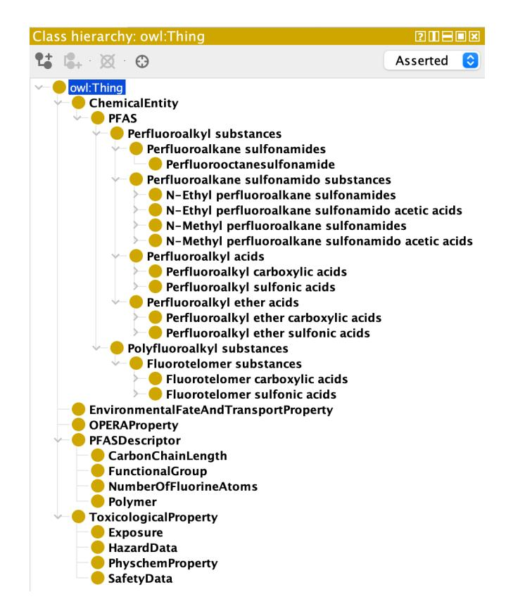

# CompTox Ontology: Leveraging Knowledge Graphs for PFAS Monitoring and Decision-Making

| Yinglun Zhang                      |                  |                                |
|------------------------------------|------------------|--------------------------------|
| Kansas State University            |                  |                                |
| Manhattan, Kansas, USA             |                  |                                |
| Sonia                              | Moavenzadeh      |                                |
| University                         | of               | Maine                          |
| Orono,                             | Maine,           | USA                            |
|                                    |                  | Jarrar Amjad                   |
|                                    |                  | Kansas State University        |
|                                    |                  | Manhattan, Kansas, USA         |
| Onur Apul                          |                  |                                |
| Pennsylvania State University      |                  |                                |
| University Park, Pennsylvania, USA |                  |                                |
| Adrita                             | Barua            |                                |
| Kansas                             | State University |                                |
| Manhattan,                         | Kansas,          | USA                            |
|                                    |                  | Fatih Evrendilek               |
|                                    |                  | University of Maine            |
|                                    |                  | Orono, Maine, USA              |
| Torsten Hahmann                    |                  |                                |
| University of Maine                |                  |                                |
| Orono, Maine, USA                  |                  |                                |
| Ganga                              | Hettiarachchi    |                                |
| Kansas                             | State University |                                |
| Manhattan,                         | Kansas,          | USA                            |
|                                    |                  | Pascal Hitzler                 |
|                                    |                  | Kansas State University        |
|                                    |                  | Manhattan, Kansas, USA         |
| David Kedrowski                    |                  |                                |
| University of Maine                |                  |                                |
| Orono, Maine, USA                  |                  |                                |
| Vasu                               | Kilaru           |                                |
| U.S. Environmental                 |                  | Protection                     |
| Research                           | Triangle         | Park, North                    |
| Carolina,                          |                  | USA                            |
|                                    |                  | Prayas Lashkari                |
|                                    |                  | Roux Institute at Northeastern |
|                                    |                  | Portland, Maine, USA           |
| Katrina Schweikert                 |                  |                                |
| University of Maine                |                  |                                |
| Orono, Maine, USA                  |                  |                                |
| Antony                             | Williams         |                                |
| U.S. Environmental                 |                  | Protection                     |
| Research                           | Triangle         | Park, North                    |
| Carolina,                          |                  | USA                            |
|                                    |                  | Hande McGinty ∗                |
|                                    |                  | Kansas State University        |
|                                    |                  | Manhattan, Kansas, USA         |

williams.antony@epa.gov

# Abstract

Per- and polyfluoroalkyl substances (PFAS) are persistent environmental contaminants that require integrated, semantically structured representations of chemical identity, classification, and properties to support integrated contaminant monitoring and analysis. This work presents the CompTox ontology, an expert-guided ontology describing commonly analyzed PFAS and designed to support PFAS data integration and querying. The ontology organizes PFAS hierarchically according to key physicochemical characteristics and incorporates authoritative identifiers and properties from EPA's CompTox Chemicals Dashboard.

∗Author order: first author (Yinglun Zhang), second author (Sonia Moavenzadeh), and corresponding author (Hande McGinty) are listed by contribution; all other authors are listed alphabetically.

ACM acknowledges that this contribution was authored or co-authored by an employee, contractor, or affiliate of the United States government. As such, the United States government retains a nonexclusive, royalty-free right to publish or reproduce this article, or to allow others to do so, for government purposes only. Request permissions from owner/author(s).

WWW '26, Dubai, United Arab Emirates © 2026 Copyright held by the owner/author(s). ACM ISBN 979-8-4007-2307-0/2026/04 <https://doi.org/10.1145/3774904.3792985>

Individual PFAS are annotated with core chemical identifiers, including DTXSID, CASRN, InChIKey, and SMILES; with physicochemical attributes such as molecular mass, carbon chain length, and functional group information; and with observed or predicted environmental fate and transport and toxicological information. The ontology was constructed using the Knowledge Acquisition and Representation Methodology (KNARM), employing a templatedriven workflow implemented with the ROBOT tool to generate an OWL-formatted ontology. An expert-guided hierarchy captures major PFAS classes, including fluorotelomers, perfluoroalkyl acids (both Perfluoroalkyl Carboxylic and Sulfonic Acids), and perfluoroalkyl ether acids. Human-readable IRIs and SKOS alternative labels enhance usability. The ontology helps facilitate integrated querying and analysis of PFAS contamination within the SAW-Graph knowledge graphs but also serves as a flexible and extensible framework for unified chemical identification and classification.

# CCS Concepts

• Computing methodologies → Ontology engineering; • Information systems → Semantic web; • Applied computing → Chemistry; Environmental sciences.

#### Keywords

Per- and polyfluoroalkyl substances (PFAS); Ontology engineering; Knowledge graphs; Semantic Web; Environmental informatics; Data integration; KNARM

#### ACM Reference Format:

Yinglun Zhang, Sonia Moavenzadeh, Jarrar Amjad, Onur Apul, Adrita Barua, Fatih Evrendilek, Torsten Hahmann, Ganga Hettiarachchi, Pascal Hitzler, David Kedrowski, Vasu Kilaru, Prayas Lashkari, Katrina Schweikert, Antony Williams, and Hande McGinty. 2026. CompTox Ontology: Leveraging Knowledge Graphs for PFAS Monitoring and Decision-Making. In Proceedings of the ACM Web Conference 2026 (WWW '26), April 13–17, 2026, Dubai, United Arab Emirates. ACM, New York, NY, USA, [9](#page-8-0) pages. <https://doi.org/10.1145/3774904.3792985>

Disclaimer: The views expressed in this paper are those of the author(s) and do not necessarily represent the views or the policies of the USEPA. Any use of trade, firm, or product names is for descriptive purposes only and does not imply endorsement by the US Government. This document has been reviewed in accordance with USEPA policy and is approved for publication.

# 1 Introduction

Per- and polyfluoroalkyl substances (PFAS) comprise a broad family of synthetic chemicals known for their environmental persistence, bioaccumulative tendencies, and potential health risks [\[1,](#page-7-0) [13\]](#page-7-1). Because of these properties, they tend to persist and circulate in the environment for very long times. Despite growing regulatory and research interest in environmental contamination by PFAS [\[5\]](#page-7-2), PFAS data remain scattered across disparate sources, hindering comprehensive analysis and decision-making. Ontologies and knowledge graphs offer a structured solution that can link heterogeneous chemical, property, and classification data into a single, queryable framework. The Safe Agricultural Products and Water Graph (SAWGraph) [\[2,](#page-7-3) [12\]](#page-7-4) is being developed as an integrative semantically rich framework to help researchers and decision makers to better understand the transport and fate of PFAS in the environment and, in particular, in food and water supplies. For improved modularity, SAWGraph is composed of five thematically distinct knowledge graphs (KGs): (1) the PFAS KG describing observations of samples and releases structured using the Contaminant Observation and Samples Ontology (ContaminOSO) [\[3\]](#page-7-5)), (2) the Facility Registry Service (FRS) KG build around the Facilities and Industries Ontology (FIO) [\[11\]](#page-7-6) and populated with data from EPA's FRS [? ] that describes industrial and other facilities that may be PFAS point sources or release locations, (3) a Hydrology KG describing the surface and subsurface water network that plays a critical role in PFAS transport, (4) a Chemicals KG that describes the different PFAS and their properties and which is the focus of the present paper, and a (5) Spatial KG providing a spatial reference grid and the administrative boundaries for geospatial analysis (see [\[12\]](#page-7-4) for details).

In this work, we focus on the development of an ontology that provides key chemical information and a classification hierarchy for 40 of the most common PFAS for which EPA's Method 1633 provides validated methods for their detection and quantification in various sample media. With the guidance of the chemical experts on the project team, we developed a taxonomy to capture

and organize common classes of PFAS, such as Per/Polyfluoroalkyl Carboxylic Acids (PFCAs), Perfluoroalkyl Sulfonic Acids (PFSAs), Per/Polyfluoroalkyl Ether Carboxylic Acids (PFECAs), and Fluorotelomer substances, which allow more intuitive querying of PFAS data without expert knowledge. The ontology includes data from the U.S. Environmental Protection Agency (EPA)'s CompTox Chemicals Dashboard[1](#page-1-0) , incorporating chemical identifiers such as DSSTox IDs, CASRNs, InChIKeys, and SMILES, as well as physicochemical attributes, and predicted environmental fate metrics. These data elements are encoded in a Web Ontology Language (OWL 2) ontology generated from CSV file templates via ROBOT[\[6\]](#page-7-7) to allow consistent classification, annotation, and future updating of the ontology.

#### 2 Methodology

This section describes the systematic approach used to develop the ontology, including data acquisition and the specification of requirements through competency questions.

# 2.1 KNARM Methodology

Our ontology development followed the Knowledge Acquisition and Representation Methodology (KNARM) [\[9\]](#page-7-8), a structured framework that integrates semi-automated ontology generation with iterative expert-driven refinement. KNARM was selected for its emphasis on domain expert collaboration and its effectiveness in developing ontologies in complex scientific domains.

KNARM employs a nine-step process specifically designed for ontology development through sustained domain expert collaboration throughout development, from concept identification to final validation, ensuring that the ontology accurately represents the domain. Unlike purely automated approaches, KNARM recognizes that complex environmental and chemical relationships require expert judgment for validation and refinement. Consistency and scientific validity are therefore achieved through iterative expert review through multiple review cycles with domain specialists, which complements automated reasoning and consistency checks. This results in an ontology that is both logically sound and scientifically accurate.

We specifically employed a semi-automated generation technique that leveraged existing chemical datasets and automated tools for initial ontology generation while maintaining human oversight for scientific accuracy and to ensure that complex domain relationships are properly represented. The validation process focused particularly on structural characteristics, functional group specifications, and environmental fate properties that require specialized chemical knowledge to assess properly. The technical details of how the methodology was implemented are presented in Section [3.](#page-3-0)

# 2.2 Data Acquisition and Preparation

The foundation of our CompTox ontology was established through a comprehensive data acquisition workflow that leverages multiple authoritative sources. This multi-step process began with establishing baseline chemical inventories and progressively enriched the dataset through expert classifications and regulatory database integration.

1<https://comptox.epa.gov/dashboard/>

2.2.1 Baseline Inventory of PFAS. The list of included PFAS comes from Maine's Environmental and Geographic Analysis Database (EGAD) [\[7\]](#page-7-9), which served as the starting point of chemical entities for inclusion in the ontology and provided common names and available identifiers. The inventory was systematically reviewed for completeness and consistency, then formatted into a standardized CSV template that established uniform naming conventions and captured basic chemical properties. This initial standardization step proved crucial for ensuring compatibility with downstream integration processes.

2.2.2 Expert-guided Classification. Domain experts with PFAS expertise, including chemists, contributed a list of characteristics that served to distinguish different classes of PFAS, thereby establishing a detailed hierarchy and defining major categories such as a high-level distinction between Per- and Polyfluoroalkyl substances, with the former class further divided into, among other distinctions, perfluoroalkyl acids and perfluoroalkyl ether acids, some of which were further specialized into even more specific subclasses like PFECAs and PFESAs. The expert classification was based on and incorporated detailed structural information such as carbon chain lengths and functional group specifications. The input of the experts proved particularly valuable for establishing nuanced distinctions between closely related chemical subclasses that might not be apparent from automated classification approaches.

2.2.3 EPA CompTox Data Enrichment. To enhance the descriptive and analytical depth of the CompTox ontology, the baseline PFAS inventory and expert-guided classification were enriched using authoritative chemical information from EPA's CompTox Chemicals Dashboard. This enrichment step was designed to provide standardized chemical identifiers, physicochemical attributes, and environmental fate indicators that support interoperability, comparison across datasets, and downstream analytical use cases.

For each PFAS included in the ontology, core chemical identifiers were incorporated, including DSSTox substance identifiers (DTXSIDs[2](#page-2-0) ), Chemical Abstracts Service Registry Numbers (CAS-RNs), International Chemical Identifier keys (InChIKeys), and Simplified Molecular Input Line Entry System (SMILES) representations. These identifiers enable unambiguous chemical referencing and facilitate linkage to external regulatory and scientific resources.

In addition to identifiers, we extracted physicochemical attributes relevant to environmental behavior and exposure assessment, such as molecular mass, carbon chain length, and functional group characteristics from CompTox to further enrich the representation of each PFAS. These properties provide a foundation for reasoning about structural similarities among PFAS and their potential environmental and toxicological implications. To further contextualize PFAS behavior in environmental systems, predicted environmental fate metrics were incorporated where available. These include indicators of persistence, bioconcentration potential, and biodegradation half-lives, which support screening-level assessments and data gap identification. Incorporating these predicted attributes allows the ontology to represent not only known measurements but also modeled estimates commonly used in environmental decisionmaking contexts. These predictive measures were pulled from

CompTox but are originally generated through the Open (Quantitative) Structure-activity/property Relationship App (OPERA) [\[8\]](#page-7-10) model. Incorporating these predicted attributes allows the ontology to represent not only known measurements but also modeled estimates commonly used in environmental decision-making contexts.

2.2.4 Template-Based Data Structuring. To support systematic ontology generation while preserving data provenance and enabling expert validation, all acquired data about the substances, their expert classification, identifiers, and predicted properties, were systematically organized using a template-based structuring approach. This choice establishes a clear separation between source data, domain knowledge, and formal ontology representation, ensuring transparency and reproducibility throughout the development process.

The use of standardized templates enables consistent representation of chemical entities, classification hierarchies, identifiers, and property values across heterogeneous data sources. By enforcing uniform naming conventions, controlled value types, and explicit schema constraints, the templates serve as an intermediate representation that can be readily reviewed and refined by domain experts prior to ontology generation.

Template modularity was a central methodological consideration. Separate templates were defined for distinct conceptual components of the ontology, including core chemical classes, the subclass hierarchy, chemical identifiers, data fields (e.g. physio-chemical, environmental fate properties and toxicological data) from Comp-Tox, and OPERA-based environmental properties. Each template adheres to a carefully designed schema that specified column headers for class identifiers, human-readable labels, property names, and standardized value types. This modular organization supported incremental refinement, allowing updates to individual conceptual components without necessitating changes to unrelated aspects of the ontology. It also enabled comprehensive validation checks, streamlined automated parsing, and direct ingestion by subsequent ontology generation tools.

Beyond facilitating expert-driven review, the template-based approach supports scalability and long-term maintenance. New chemical substances, additional property categories, or revised classifications can be incorporated by extending or updating the relevant templates, without altering the underlying conceptual structure of the ontology. This methodology ensures that the ontology can evolve alongside emerging PFAS research, regulatory developments, and data availability while maintaining semantic consistency.

# 2.3 Competency Questions

Competency questions (CQs) serve as formal requirements specifications that guide ontology development and validate semantic coverage by defining the types of questions the knowledge graph must be able to answer. The design and implementation of the CompTox ontology were driven by use cases and more specific competency questions collected by the SAWGraph project team [\[2\]](#page-7-3) through interviews and informal discussions with project stakeholders, including environmental analysts, regulators, public health officials, and domain experts. These CQs were subsequently grouped into five themes (testing analysis, impact analysis, contaminant tracing, communication, and research) that reflect high-priority analytical

2<https://www.wikidata.org/wiki/Property:P3117>

needs for PFAS monitoring, risk assessment, remediation, and regulatory and public reporting. The set of competency questions are constantly evolving through ongoing discussions with stakeholders but a broader overview can be found in [\[12\]](#page-7-4). The competency questions were analyzed and organized based on data themes and with respect to variables aspects (e.g. "find testing results of PFAS of class X with a concentration higher than Y").

Representative competency questions were translated into one or more formal SPARQL queries that served as systematic testset to help validate the ontology's coverage and semantic consistency. The queries are organized into by complexity that ranges from basic data retrieval to complex analytical workflows, reflecting both technical requirements and real-world use cases. This progression ensures that the ontology can support both foundational data access as well as more sophisticated environmental analysis.

2.3.1 Foundational Queries. The broadest competency questions address the interconnected nature of the five graphs that together constitute SAWGraph. These link information about locations, test results, chemical informatics, hydrology and industrial activity. But the most modular building blocks embedded in these cross-data questions are simple foundational queries that retrieve environmental features (e.g. waterbodies), sample locations (based on ContaminOSO [\[3\]](#page-7-5) or industrial facilities (based on the Facilities and Industries Ontology (FIO) [\[11\]](#page-7-6) and their locations can be retrieved effectively.

Representative foundational queries include:

- Retrieve all facilities classified under NAICS code 562212 (solid waste landfills) within a specified geographic region (see [\[11\]](#page-7-6) for details).
- List all water bodies containing "Great Pond" or "Long Pond" in their names, along with their associated S2 cell identifiers and geometry.
- Identify all monitoring wells located in the same S2 level 13 cell[3](#page-3-1) as industrial facilities, grouped by the industry sector associated with the facility.
- Identify in what counties sample results for a particular PFAS (e.g. PFOS) exceed 20ppt.
- Identify all the different classes of PFAS that have been tested for in a particular location.

2.3.2 Basic Chemical Queries. A number of questions specifically address the information available about different classes of PFAS and their properties. These questions guided the development of the chemical ontology and demonstrate its usability especially as it relates to specific environmental sampling. These questions connect specific sample results from the PFAS KG with the chemical details provided from CompTox, and therefore provide further insights into the differences across space and different sampling media of this large family of chemicals. Examples include:

- List the types of samples (e.g. water, soil, animal tissue) that have been tested for perfluorotridecanoic acid.
- Identify the average concentration of PFAS with a carbon chain less than 6 (short-chain) compared to those with a carbon chain greater than or equal to 6 (long-chain) in a specific geographic region.

- Identify the cumulative sum of all perflouroalkyl acids in the most recent water sample at each test site.

2.3.3 Integrated and Composite Queries. The ultimate validation of SAWGraph and its ontologies lies in their ability to answer complex, cross-cutting competency questions that span multiple domains as illustrated in more detail in [\[12\]](#page-7-4). The integrated queries represent the most sophisticated analytical challenges, designed to test the full expressive power of the knowledge graph by weaving together chemical identity, environmental sample data, complex geospatial relationships, and facility information.

These composite queries often require traversing multiple layers of the ontology to connect, for example, specific chemical contaminants to downstream water bodies and nearby wells. They demonstrate how the system can support complex environmental investigations that require synthesizing diverse data types and analytical approaches. The successful execution of these queries validates that the ontology can support the sophisticated decision-making processes required for comprehensive environmental management.

Representative integrated queries include:

- Identify towns or counties with multiple test results of PFOS levels above 20 ppt with no known contamination source nearby.
- Which "Manufacturing" subsector (sectors 31-33) have facilities nearby high test results for long-chain PFAS (e.g. with a carbon chain of greater than 6)? Or nearby high test results of flourotelomer substances?
- What potential contamination sources exist in the watershed upstream from the sample result? Which of those are within 20 miles upstream?
- Which classes of PFAS chemicals are found in high concentrations near facilities of a specific industry with known air releases of chemicals?
- What is the ratio between the concentration of Perfluoroalkyl Carboxylic Acids (PFCAs) and Perfluoroalkyl Sulfonic Acids (PFSAs) in water samples near chemical manufacturing facilities (vs. airports)?

The systematic development of these competency questions ensures that all the SAWGraph ontologies together can support both routine environmental monitoring tasks and sophisticated analytical workflows. The progression from foundational to integrated queries demonstrates the ontology's capacity to serve diverse user needs while maintaining semantic consistency and computational efficiency across complex, multi-domain environmental datasets.

The remainder of the paper focuses exclusively on the ontology needed to address the basic chemical queries.

# 3 Ontology Implementation

This section details the technical realization of the CompTox ontology, translating the methodological framework described in Section [2](#page-1-1) into a reproducible, standards-compliant OWL implementation. We focus on the development environment, automation pipeline, and concrete implementation decisions that support scalability, maintainability, and collaborative refinement.

3Roughly within 1km [\[12\]](#page-7-4)

# 3.1 Development Environment and Toolchain

Ontology development was carried out using Protégé 5.x [\[10\]](#page-7-11) as the primary interactive editing environment. Protégé supported visualization and review of class hierarchies, their properties and annotations during iterative refinement cycles.

Automated ontology generation and processing were implemented using ROBOT, an ontology engineering tool geared towards the development of ontologies that are aligned with Open Biological and Biomedical Ontologies (OBO) [\[6\]](#page-7-7) practices. ROBOT enabled scripted conversion of structured tabular data into OWL axioms, execution of consistency checks, and reproducible regeneration of ontology artifacts. The combined use of Protégé and ROBOT supported a hybrid workflow that integrates expert-driven refinement with scalable automation.

All development artifacts, including CSV templates, ROBOT command scripts, and generated OWL files, were managed using GitHub-based version control, providing transparent change tracking and supporting collaborative development across institutions and external contributors.

# 3.2 Semi-Automated Ontology Generation

Chemical identifiers and property data from the EPA CompTox Chemicals Dashboard were retrieved using a combination of batch queries and targeted programmatic requests and used to populate a set of CSV templates. The CSV templates were separated into distinct templates with each template corresponds to a major largely self-contained ontology component, e.g. chemicals, the chemical taxonomy, identifiers, and fate properties, toxicological information, and OPERA predictions. This division supports updates to specific components without requiring regeneration of unrelated modules.

The populated CSV templates were further processed using RO-BOT's templating functions to convert the tabular data into formal Web Ontology Language (OWL 2) representations. However, ROBOT's templating functions were adapted to our specific data requirements to ensure that the specifics of our CSV structure were accurately translated into appropriate OWL axioms, which together were automatically assembled into a single unified OWL 2 file.

# 4 Results: Ontology Structure and Content

The ontology's semantic model centers on the <compTox:PFASChemical> class, which serves as the primary entity for chemical representation and organizes the complex landscape of per- and polyfluoroalkyl substances. Figure [1](#page-4-0) presents the ontology's complete taxonomy as viewed in the Protégé editor. The ontology together with all other development artifacts are shared via a GitHub repository at <https://github.com/SAWGraph/comptox-ontology>. Key properties capture environmental, toxicological, and computational properties associated with chemical substances. They include comp-Tox:hasPhysicochemicalProperty for linking chemicals to their measured properties, compTox:hasFunctionalCategory for functional use classification, and compTox:hasEnvironmentalMeasurement for connecting chemicals to environmental occurrence data.

Five interconnected modules comprise the ontology's core structure, each constructing a taxonomy anchored under the root owl :Thing class and designed to address specific domain requirements while maintaining semantic consistency across the knowledge

Figure 1: Protégé snapshot of the hierarchical structure of the CompTox ontology with its five main classes: ChemicalEntity, EnvironmentalFateAndTransportProperty, OPERAProperty, PFASChemicalDescriptor and ToxicologicalProperty,.

graph. The modular architecture connects chemicals with properties that describe environmental fate, exposure pathways, and toxicological outcomes. At its core, the ontology rests on a taxonomic classification system that captures the chemical diversity of PFAS compounds in the ChemicalEntity module while that,together with the other modules,accommodates multiple data perspectives essential for comprehensive PFAS assessment. The design of the taxonomy prioritizes semantic clarity through well-defined parentchild relationships, enabling both domain-specific queries and crossdisciplinary data linkage. This approach supports scalable knowledge representation that can accommodate emerging PFAS compounds and evolving regulatory frameworks.

# 4.1 The PFAS Taxonomy

The ChemicalEntity module serves as the ontology's structural backbone, organizing PFAS compounds (PFAS class) into five chemically distinct subclasses, four classes of Perfluoroalkyl substances and one class of Polyfluoroalkyl substances, that reflect the current understanding of common classes of PFAS. These classes capture the characteristic structural properties that influence their expected environmental fate and transport properties.

Perfluoroalkyl Acids (PFAAs). Represents the most extensively studied PFAS category, including legacy and emerging compounds:

- Perfluoroalkyl Carboxylic Acids (PFCAs) Including PFOA and related compounds
- Perfluoroalkyl Sulfonic Acids (PFSAs) Including PFOS and homologous series

Perfluoroalkyl Ether Acids (PFEAs). Represents ether-containing PFAS variants with increased structural complexity:

- Perfluoroalkyl Ether Carboxylic Acids (PFECAs) Ether-linked carboxylic acids
- Perfluoroalkyl Ether Sulfonic Acids (PFESAs) Ether-linked sulfonic acids

Perfluoroalkane Sulfonamides (FASAa). Includes sulfonamidebased PFAS precursors with a primary sulfonamide structure, such as Perfluorooctanesulfonamide.

Perfluoroalkane Sulfonamido Substances (FASAs). The most structurally diverse category; accommodating substituted sulfonamide derivatives:

- N–Ethyl Perfluoroalkane Sulfonamides (N-EtFASAs) Ethylsubstituted variants
- N–Ethyl Perfluoroalkane Sulfonamido Acetic Acids (N-EtFASAAs) – Ethyl derivatives with acetic acid functionality
- N–Methyl Perfluoroalkane Sulfonamides (N-MeFASAs) Methylsubstituted variants
- N–Methyl Perfluoroalkane Sulfonamido Acetic Acids (N-MeFASAAs) – Methyl derivatives with acetic acid functionality

Polyfluoroalkyl Acid Substances. This class primarily includes Fluorotelomer substances (FTs), which encompass telomer-based PFAS compounds characterized by their unique synthesis pathway. They are further subdivided into:

- Fluorotelomer Carboxylic Acids Terminal carboxylic acid functionality
- Fluorotelomer Sulfonic Acids Terminal sulfonic acid functionality

# 4.2 Chemical Identifiers

Chemical identity is maintained through the use of standardized data properties including compTox:hasDTXSID for EPA DSSTox substance identifiers, compTox:hasCASRN for Chemical Abstracts Service registry numbers, compTox:hasSMILES for molecular structure representation, compTox:hasMolecularFormula for chemical composition, and compTox:hasAverageMass for molecular weight information.

# 4.3 Characteristic Properties of PFAS

Molecular Characterization of PFAS. This module captures the fundamental structural attributes that dictate the physicochemical behavior and regulatory classification of PFAS. These properties are derived directly from the molecular structure:

- CarbonChainLength A quantitative count of carbon atoms in the fluorinated chain. This is a critical determinant of

physicochemical properties; typically, longer carbon chains correlate with increased hydrophobicity and bioaccumulation potential.

- NumberOfFluorineAtoms A quantification of the degree of fluorination. The high stability of the C-F bond contributes to the environmental persistence of these substances.
- FunctionalGroup Specifies the characteristic terminal and internal functional groups (e.g., carboxylic acid, sulfonic acid). This determines the chemical's reactivity and behavior in aqueous environments.
- polymer A boolean data property (true/false) indicating whether the entity is a polymeric substance. This distinction is vital for regulatory profiling, as polymers often have distinct hazard profiles compared to discrete molecules.

Toxicological Properties. This module includes experimental and estimated hazard data pulled from the EPA CompTox Chemicals Dashboard. Through discussions with domain experts, we identified four high-priority data categories from the extensive set of fields available from the dashboard that are relevant to this project:

- Exposure Aggregates data on environmental occurrence and potential human contact pathways.
- HazardData Encompasses specific toxicological endpoints, including organ toxicity and carcinogenicity.
- PhyschemProperty Describes fundamental physicochemical constants such as water solubility and vapor pressure.
- SafetyData Contains regulatory safety assessments, GHS hazard classifications, and inventory listings.

Environmental Fate And Transport Properties. Understanding how PFAS move and persist in the environment is critical for risk assessment. This module describes specific transformation and mobility parameters, mapped directly from the EPA CompTox dashboard as illustrated in Figure [2:](#page-6-0)

- hasBioconcentrationFactor (BCF) Measures the extent to which a chemical concentrates in aquatic organisms relative to the surrounding water, serving as a primary indicator of food chain accumulation risk.
- hasBiodegradationHalfLife Quantifies persistence by estimating the time required for half of the substance to degrade under environmental conditions.
- hasAtmosphericHydroxylationRate Describes the rate of degradation via reaction with hydroxyl radicals in the atmosphere, influencing the long-range transport potential of volatile PFAS.
- hasFishBiotransformationHalfLife Indicates the metabolic stability of the chemical within fish, refining bioaccumulation models by accounting for active biological clearance.
- hasSoilAdsorptionCoefficient (������ ) Measures the tendency of the chemical to bind to soil organic carbon. A high ������ suggests the chemical stays in the soil, while a low ������ indicates high mobility and a risk of leaching into groundwater.
- hasReadyBiodegradability A binary or categorical indicator of whether the substance can be rapidly degraded by microbial activity under aerobic conditions.

Figure 2: Hierarchy of data properties in the CompTox ontology as viewed in Protégé. This structure explicitly maps specific environmental fate and transport parameters (e.g., **bioconcentrationFactor**, **biodegradationHalfLife**) to the **EnvironmentalFateAndTransportProperty** class, aligning ontology properties with data fields exported from the EPA CompTox Dashboard.

OPERA Properties. To address data gaps where experimental values are missing, this module incorporates computational predictions from the Open (Quantitative) Structure-Activity/Property Relationship App (OPERA) [\[8\]](#page-7-10). While the properties listed above (such as biodegradation half-life and BCF) describe the physical phenomena, the OPERAProperty class specifically acts as the container for QSAR/QSPR model predictions. Integrating these computational estimates allows for high-throughput screening and prioritization of PFAS chemicals that currently lack extensive empirical testing.

# 4.4 OWL Implementation

The ontology is encoded in RDF, RDFS and OWL 2 using OWL DL (Description Logic) semantics to ensure decidable reasoning while maintaining sufficient expressiveness for complex environmental relationships. The current implementation contains 752 total axioms, including 85 logical axioms and 101 declaration axioms, organized across 71 classes with 18 data properties and 15 annotation properties. The ontology includes 66 SubClassOf relationships that establish its taxonomic backbone. To maximize interoperability, semantic web standards, including XSD for XML data types, Dublin Core (dc, dcterms) for metadata management, and OBO Foundry mappings for biomedical concept alignment, are employed where appropriate. The base namespace (compTox) provides unique identifiers for domain-specific concepts in compliance with Linked Data principles.

#### 5 Discussion

The development of the CompTox ontology and its population with PFAS data revealed significant challenges and facilitated methodological insights that extend beyond PFAS monitoring to broader environmental informatics applications. This section examines key technical challenges, methodological innovations, and their implications for environmental data integration.

#### 5.1 Semantic Modeling

The primary technical challenge involved harmonizing heterogeneous chemical classification schemes from multiple authoritative sources. Reconciling the baseline inventory of chemicals encountered in PFAS observational data from EGAD and represented in the PFAS KG using ContaminOSO [\[3\]](#page-7-5) with expert-curated classifications required sophisticated mapping strategies to preserve semantic precision. The expert-guided classifications include nuanced sub-classes and functional group distinctions that were missing from existing publicly available chemical ontologies, necessitating the addition of the PFAS taxonomy. The template-based data structuring approach proved capable of managing this complexity. This approach was particularly valuable for accurately representing detailed chemical attributes such as functional groups and bond counts in the ontology.

# 5.2 Methodological Innovations

The integration of KNARM [\[9\]](#page-7-8) with automated ontology generation tools demonstrates how traditional knowledge engineering approaches can be scaled while still leveraging human expertise. The ROBOT-based pipeline addresses challenges arising from manual ontology construction while also maintaining the semantic rigor required for complex environmental relationships. By clearly separating between raw data sources and the formal OWL representation, this approach enables rapid iteration cycles essential for collaborative development with domain experts who may lack formal ontology engineering expertise.

# 5.3 Implications for Environmental Monitoring

The CompTox ontology practically functions as a domain reference ontology [\[4\]](#page-7-12) for PFAS chemicals, facilitating extensions by dataset-specific ontologies and supporting knowledge-graph driven environmental data analysis. In conjunction with the Contaminant Observation and Samples Ontology (ContaminOSO) [\[3\]](#page-7-5), it enables cross-jurisdictional data integration—a critical gap in current environmental monitoring infrastructure. The ability to seamlessly query PFAS observations across federal, state, and local datasets is a critical element that complements and enhances SAWGraph's geospatial and hydrologic reasoning and analytic capabilities [\[12\]](#page-7-4) to better target environmental analyses using chemical knowledge and advancing environmental data analysis more broadly (cf. [\[14\]](#page-8-1)).

# 5.4 Current Limitations

Several technical limitations constrain the current scope of the CompTox-based ontology. While the ontology provides detailed representations of chemical identity, classification, and environmental context, many attributes—particularly predicted environmental fate and transport values—are modeled as static properties, which limits more advanced temporal or process-based reasoning. In addition, the current scope emphasizes chemical information rather than comprehensive modeling of health effects or exposure pathways.

A further limitation arises from the reliance on annotation properties for some chemical descriptors and metadata. Although this design choice supports interoperability and flexible integration with external data sources, it limits the extent to which automated semantic reasoning can be applied to those attributes. Finally, while the ontology is designed to be extensible, its applicability to contaminants beyond PFAS has not yet been systematically evaluated.

# 6 Conclusion & Next Steps

The CompTox ontology presented in this work establishes a structured and extensible foundation for PFAS data integration and demonstrates the utility of Semantic Web technologies for environmental monitoring and analysis. Developed through expert-guided classification and semi-automated ontology generation, the ontology provides a standardized representation of PFAS, their classification, and properties that supports consistent PFAS data integration across heterogeneous datasets. Together with ContaminOSO [\[3\]](#page-7-5), the ontology serves as the chemical backbone for connecting environmental observation data across jurisdictions and datasets. Thereby, it addresses a key infrastructure gap in PFAS monitoring efforts and extends and complements the kind of comprehensive geospatial contaminant analysis capabilities that SAWGraph offers [\[12\]](#page-7-4).

Methodologically, this work demonstrates a replicable approach to contaminant-focused ontology engineering. The use of competency questions to guide design ensures alignment with real-world analytical needs, while the combination of expert knowledge and semi-automated ontology generation lowers technical barriers to participation and supports scalable ontology development.

# 6.1 Future Research Directions

Several directions for future work can further extend the capabilities of the CompTox ontology. Leveraging the environmental fate and transport properties together with the temporal information gained from contaminant monitoring (see the temporal model in ContaminOSO [\[3\]](#page-7-5)) would support more dynamic modeling of contamination patterns and environmental change. In addition, deeper integration of health effects and exposure-related data linked to PFAS classes would enable more comprehensive risk assessment and evidence-based guideline development. Together, these extensions would strengthen the ontology's ability to support longitudinal analysis and decision-making.

## 6.2 Broader Impact

Beyond PFAS monitoring, the methodological contributions of this work provide generalizable guidance for environmental informatics applications. The competency question–driven development process offers a user-centered approach to ontology engineering that can improve the relevance, usability, and adoption of Semantic Web technologies in environmental domains. By addressing persistent challenges in environmental data integration and supporting interoperable, queryable knowledge representations, this

work contributes to the broader goal of improving environmental assessment, regulatory coordination, and evidence-based decisionmaking through Semantic Web technologies.

## Acknowledgement

This work and the development of SAWGraph are supported by the National Science Foundation (NSF) under Grant No. TIP-2333782 as part of the Proto-OKN initiative (<https://www.proto-okn.net/>). The co-authors at the University of Maine are also supported by the project "Finding Solutions to Reduce the Impact of Synthetic Organofluorine Compounds (SOCs) Contamination on Agricultural and Food System" in cooperation with the USDA-ARS New England Center for Sustained Soil and Water Health. This work would not have been possible without many collaborators from federal and state agencies, especially Maine's Departments of Environmental Protection (DEP) and Agriculture, Conservation and Forestry (DACF), USDA ARS, the Environmental Council of the States (ECOS), and Kansas Department of Health and Environment and Kansas Water Institute. The views expressed in the paper are those of the authors and may not reflect those of the NSF, USDA, EPA or other agencies.

## References

- [1] Suzanne E Fenton, Alan Ducatman, Alan Boobis, Jamie C DeWitt, Christopher Lau, Carla Ng, James S Smith, and Stephen M Roberts. 2020. Per- and Polyfluoroalkyl Substance Toxicity and Human Health Review: Current State of Knowledge and Strategies for Informing Future Research. Environ Toxicol Chem 40, 3 (Dec. 2020), 606–630. [2] Torsten Hahmann, Pascal Hitzler, Hande Küçük McGinty, Ganga Hettiarachchi, Onur Apul, et al. 2024. Safe Agricultural Products and Water Graph (SAWGraph): An Open Knowledge Network to Monitor and Trace PFAS and Other Contaminants in the Nation's Food and Water Systems. <https://sawgraph.github.io/>. [3] Torsten Hahmann, Katrina Schweikert, Shirly Stephen, and David Kedrowski. 2025. ContaminOSO: Ontological Foundations and Key Design Choices for an Ontology for Environmental Contaminant Data. In 25th International Conference on Formal Ontology in Inf. Systems (FOIS-25). IOS Press, 284–298. doi:[10.3233/](https://doi.org/10.3233/FAIA250501) [FAIA250501](https://doi.org/10.3233/FAIA250501) [4] Torsten Hahmann and Shirly Stephen. 2018. Using a hydro-reference ontology to provide improved computer-interpretable semantics for the groundwater markup language (GWML2). International Journal of Geographic Information Science 32, 6 (2018), 1138–1171. doi:[10.1080/13658816.2018.1443751](https://doi.org/10.1080/13658816.2018.1443751) [5] Sarah Grace Hughes. 2023. PFAS in biosolids: A review of state efforts & opportunities for action. The Environmental Council of the States, ecos. Org (2023),
- 29. [6] Rebecca C. Jackson, James P. Balhoff, Eric Douglass, Nomi L. Harris, Christopher J. Mungall, and James A. Overton. 2019. ROBOT: A Tool for Automating Ontology Workflows. BMC Bioinformatics 20, 1 (29 Jul 2019), 407. doi:[10.1186/s12859-019-](https://doi.org/10.1186/s12859-019-3002-3) [3002-3](https://doi.org/10.1186/s12859-019-3002-3) [7] Maine Department of Environmental Protection. 2025. EGAD (Environmental and Geographic Analysis Database). <https://www.maine.gov/dep/maps-data/egad/> [8] Kamel Mansouri, Chris M Grulke, Richard S Judson, and Antony J Williams. 2018. OPERA models for predicting physicochemical properties and environmental fate endpoints. J Cheminform 10, 1 (March 2018), 10. [9] Hande K. McGinty. 2018. Knowledge Acquisition and Representation Methodology (KNARM) and Its Applications. Ph. D. Dissertation. [10] Mark A. Musen. 2015. The protégé project: a look back and a look forward. AI Matters 1, 4 (2015), 4–12. doi:[10.1145/2757001.2757003](https://doi.org/10.1145/2757001.2757003) [11] Katrina Schweikert and Torsten Hahmann. 2025. An Ontology Design Pattern for Industry Classification in the Facilities and Industries Ontology (FIO). In 14th International Workshop on Formal Ontologies Meet Industry (FOMI 2025) at FOIS-25. CEUR.org. [12] Katrina Schweikert, David Kedrowski, Shirly Stephen, and Torsten Hahmann. 2025. Precomputed Topological Relations for Integrated Geospatial Analysis across Knowledge Graphs. In 13th Intern. Conf. on Geographic Information Science (GIScience 2025) (Leibniz International Proceedings in Informatics (LIPIcs), Volume 346). Schloss Dagstuhl – Leibniz-Zentrum für Informatik, 4:1–22. doi:[10.4230/](https://doi.org/10.4230/LIPIcs.GIScience.2025.4) [LIPIcs.GIScience.2025.4](https://doi.org/10.4230/LIPIcs.GIScience.2025.4) [13] Kelly L. Smalling, Kristin M. Romanok, Paul M. Bradley, Mathew C. Morriss, James L. Gray, Leslie K. Kanagy, Stephanie E. Gordon, Brianna M. Williams,

Sara E. Breitmeyer, Daniel K. Jones, Laura A. DeCicco, Collin A. Eagles-Smith, and Tyler Wagner. 2023. Per- and polyfluoroalkyl substances (PFAS) in United States tapwater: Comparison of underserved private-well and public-supply exposures and associated health implications. Environment International 178

(2023), 108033. doi:[10.1016/j.envint.2023.108033](https://doi.org/10.1016/j.envint.2023.108033) [14] Rui Zhu, Shirly Stephen, Lu Zhou, Cogan Shimizu, Ling Cai, Gengchen Mai, Krzysztof Janowicz, Pascal Hitzler, and Mark Schildhauer. 2021. Environmental Observations in Knowledge Graphs. In DaMaLOS. 1–11.