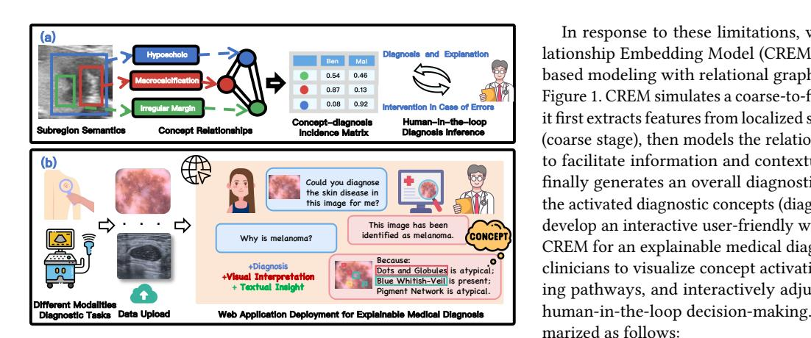
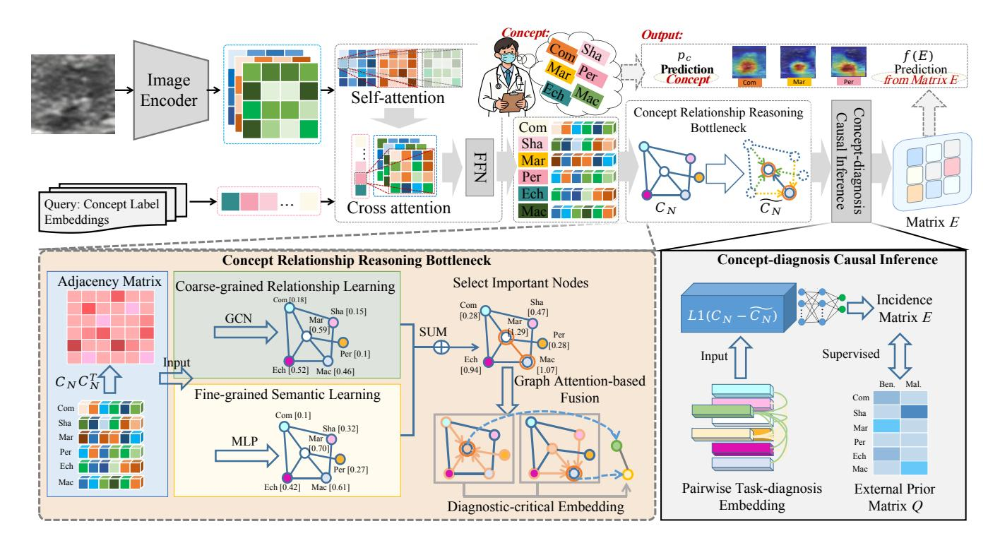
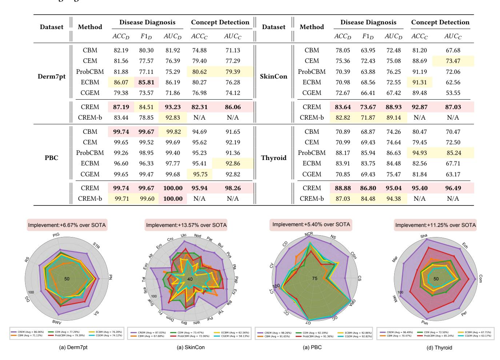
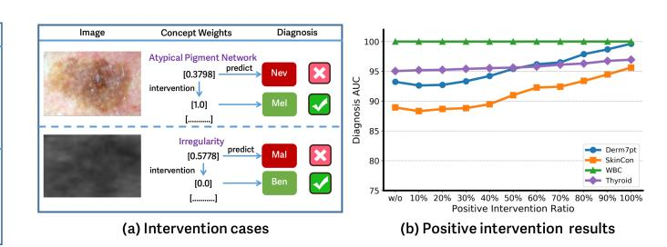
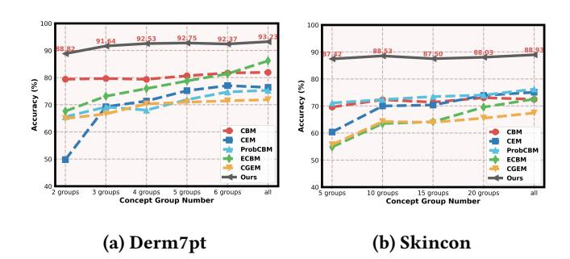
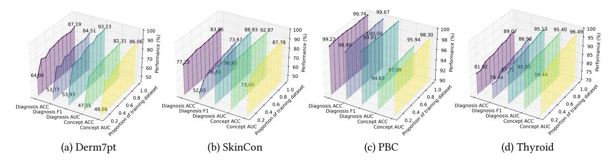
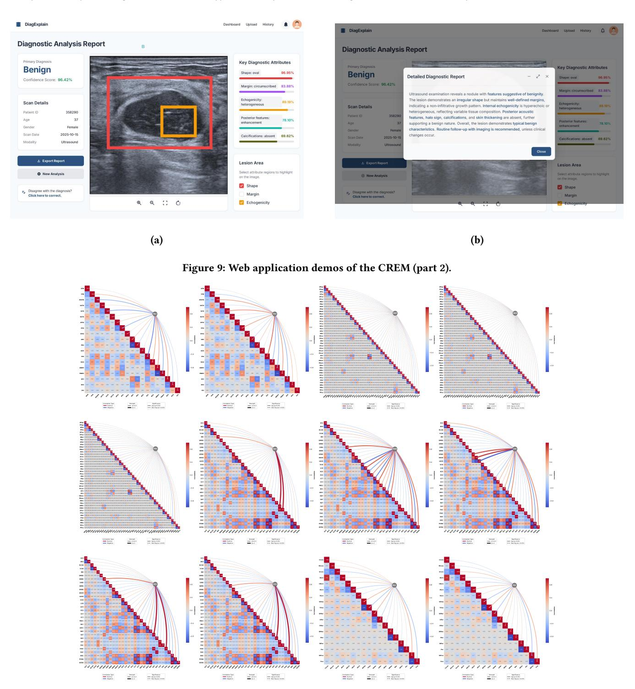

# Concept Relationship Embedding-Based Interactive Web Application for Explainable Medical Diagnosis

[Lei Zhao](https://orcid.org/0000-0002-3397-4042) zhaolei@hnu.edu.cn Hunan University Changsha, Hunan, China

Xingguo Lv Hunan University Changsha, Hunan, China lvxg@hnu.edu.cn

Qika Lin National University of Singapore Singapore, Singapore qikalin@foxmail.com

Kaize Shi University of Southern Queensland Sydney, Australia kaize.shi@uts.edu.au

Xiaoming Qi National University of Singapore Singapore, Singapore qixiaoming12138@163.com

Bin Pu∗ The Hong Kong University of Science and Technology Hong Kong, Hong Kong eebinpu@ust.hk

Kenli Li∗ Hunan University Changsha, Hunan, China lkl@hnu.edu.cn

## Abstract

Deep learning has made remarkable progress in medical image analysis, yet its black-box nature still limits interpretability and clinician trust. Concept-based modeling offers a promising direction for explainable AI by integrating human-understandable concepts. However, existing approaches typically rely on global concept annotations and infer diagnosis based solely on the presence or absence of individual concepts. This oversimplified paradigm ignores the rich relationships among concepts and their causal influence on disease outcomes. To overcome these limitations, we propose the Concept Relationship Embedding Model (CREM) for interpretable medical diagnosis. CREM mirrors coarse-to-fine clinical reasoning by first extracting fine-grained subregional concepts, then explicitly encoding their relationships as a concept interaction graph, and finally performing causal inference between concepts and diagnoses to enable reliable and transparent diagnostic predictions. We evaluate CREM on four public medical imaging benchmarks, where it achieves state-of-the-art performance on both concept recognition and disease classification tasks, while exhibiting improved robustness, label efficiency, and interpretability. Furthermore, we deploy CREM as an interactive web-based demo that allows clinicians to visualize concept activations, trace diagnostic reasoning paths, and iteratively refine concept cues, facilitating effective human-in-theloop decision-making.

## CCS Concepts

• Computing methodologies → Artificial intelligenc; • Applied computing → Life and medical sciences.

## Keywords

Explainable Artificial Intelligence, Concept-Based Models, Interactive Diagnosis Copilot

[This work is licensed under a Creative Commons Attribution 4.0 International License.](https://creativecommons.org/licenses/by/4.0) WWW '26, Dubai, United Arab Emirates

© 2026 Copyright held by the owner/author(s). ACM ISBN 978-1-4503-XXXX-X/2018/06 <https://doi.org/10.1145/3774904.3792986>

#### ACM Reference Format:

Lei Zhao, Xingguo Lv, Qika Lin, Kaize Shi, Xiaoming Qi, Bin Pu, and Kenli Li. 2026. Concept Relationship Embedding-Based Interactive Web Application for Explainable Medical Diagnosis. In Proceedings of the ACM Web Conference 2026 (WWW '26), April 13–17, 2026, Dubai, United Arab Emirates. ACM, New York, NY, USA, [11](#page-10-0) pages.<https://doi.org/10.1145/3774904.3792986>

## 1 Introduction

Black-box deep learning methods have emerged as powerful tools in medical image analysis [\[7,](#page-7-0) [42,](#page-8-0) [58,](#page-8-1) [59\]](#page-8-2), with significant potential to revolutionize healthcare diagnosis and treatment, such as skin cancer detection [\[16,](#page-7-1) [19\]](#page-8-3) and thyroid nodule risk stratification [\[14,](#page-7-2) [50\]](#page-8-4). Despite their promising performance, the end-to-end opaque nature of black-box deep learning methods has sparked a crisis of trust regarding the interpretability and reliability of model predictions, particularly in fields requiring high accountability, such as healthcare [\[35,](#page-8-5) [41,](#page-8-6) [44,](#page-8-7) [56\]](#page-8-8). Decisions made by deep learning models in high-risk clinical settings are directly related to human life and health [\[18,](#page-8-9) [55\]](#page-8-10). Therefore, model decisions must be adequately explained to medical experts and patients to promote trust in model predictions, enable informed clinical decision-making, and allow AI systems to further enhance human well-being [\[39,](#page-8-11) [57\]](#page-8-12). This has spurred a growing focus on research on Explainable Artificial Intelligence (XAI), highlighting that explainability is essential to foster trust, improve clinical decision-making, and ultimately enhance patient safety and quality of care [\[6,](#page-7-3) [34,](#page-8-13) [40\]](#page-8-14).

The main XAI methods are broadly categorized into post-hoc and ante-hoc approaches [\[2,](#page-7-4) [12\]](#page-7-5). Post-hoc methods, such as saliency maps [\[31,](#page-8-15) [45,](#page-8-16) [48\]](#page-8-17) and gradient-based techniques [\[5,](#page-7-6) [46\]](#page-8-18), interpret model decisions after training by highlighting key image regions or features influencing predictions. However, recent studies [\[3,](#page-7-7) [25,](#page-8-19) [49\]](#page-8-20) have shown that these methods are often subjective and sensitive to slight variations in input data, which can misrepresent the model's underlying decision-making process. To overcome these limitations, researchers have shifted focus toward ante-hoc XAI methods, which embed interpretability directly into the model's architecture or learning process, offering clearer and more reliable insights into how decisions are made.

Ante-hoc XAI methods primarily include attention-based models [\[29,](#page-8-21) [30\]](#page-8-22), example-based models [\[17,](#page-8-23) [24\]](#page-8-24), and concept-based

**0.54 0.87 0.08 0.92 0.13** In response to these limitations, we propose the Concept Relationship Embedding Model (CREM), which integrates conceptbased modeling with relational graph reasoning, as illustrated in Figure [1.](#page-1-0) CREM simulates a coarse-to-fine clinical diagnosis process: it first extracts features from localized subregions of a medical image (coarse stage), then models the relationships among these features to facilitate information and contextual sharing (fine stage), and finally generates an overall diagnostic conclusion by integrating the activated diagnostic concepts (diagnostic stage). In addition, we develop an interactive user-friendly web demo that operationalizes CREM for an explainable medical diagnosis. The platform enables clinicians to visualize concept activations, trace diagnostic reasoning pathways, and interactively adjust concept cues, supporting human-in-the-loop decision-making. Our contributions are summarized as follows:

Figure 1: Our method mimics the clinical diagnostic workflow by performing causal inference based on concepts learned through graph reasoning. The interpretable diagnostic model is deployed as a user-friendly interactive web application to support clinical decision-making.

models [\[6,](#page-7-3) [36\]](#page-8-25). Recently, concept-based models have emerged as a promising ante-hoc framework that leverages human-interpretable concepts as intermediate representations, offering a unique paradigm of interpretability, intervenability, and predictability. Conceptbased models first map input features to a set of high-level humanunderstandable concepts and use these concepts to solve downstream tasks. As shown in Figure [1\(](#page-1-0)a), in medical diagnosis, models do not directly derive diagnoses from raw images (image ⇒ diagnosis). Instead, concepts are defined as high-level attributes of lesions or abnormalities and serve as evidence for diagnostic outcomes (image ⇒ concept ⇒ diagnosis).

Compared to black-box methods, existing concept-based models face a major challenge: model performance is often compromised owing to architectural constraints of concept bottlenecks, particularly when concept labels are weakly informative. For example, the concept embedding model [\[13\]](#page-7-8) mitigates this trade-off by employing high-dimensional concept representations with both positive and negative semantics within the bottleneck layer. Similarly, the post-hoc concept bottleneck model [\[53\]](#page-8-26) incorporates a residual modeling step to bridge the performance gap between concept learning and the original black-box model. Despite recent advances, existing concept-based models for explainable medical diagnosis still suffer from the following key limitations:

(1) Concept Embedding Inefficiency. A medical image usually contains multiple concepts, such as different types of lesions or abnormalities in different regions. Existing methods utilize concept labels to supervise concept predictions at the image level, neglecting fine-grained semantic relationships between subregions and their corresponding concepts.

(2) Unconsidered Concept Relationships. Co-varying concepts provide critical contextual cues for human understanding, particularly in healthcare, where co-occurring symptoms inform diagnosis. However, existing models focus solely on the presence or absence of individual concepts, neglecting their interactions in diagnostic reasoning.

(1) The Concept Relationship Reasoning Bottleneck (CRRB) is proposed to incorporate graph reasoning with coarse-grained relationships and fine-grained semantic knowledge, overcoming the limitations of existing concept-based models in relational reasoning for disease diagnosis.

(2) The Concept–Diagnosis Causal Inference (CDCI) module is designed to effectively leverage biases between concept-aware and diagnosis-prediction spaces, surpassing the performance of black-box models.

(3) Benefiting from efficiently extracting concept-aware subregion embeddings and modeling holistic interactions between concepts and diseases, CREM is robust enough to withstand challenging settings, including limited training data regimes, sparse concept supervision, and real-world concept distortions.

(4) This study establishes an intelligent framework that integrates CREM with an interactive web demo, bridging the gap between concept-based reasoning and disease diagnosis while providing an intuitive and efficient solution for explainable medical diagnosis. Extensive experiments on four public benchmarks demonstrate that CREM delivers visual insights and textual explanations, enhancing performance, preserving interpretability, and enabling human-in-the-loop intervention.

## 2 Related Work

Incorporating human-understandable units, called Concepts, into deep learning has been seen as a promising approach to improve model explainability. Recently, concept-based explainable models have been widely studied. Concept Activation Vectors (CAVs) [\[15,](#page-7-9) [21\]](#page-8-27) train linear classifiers on feature spaces to verify whether representations can be reduced to human-defined conceptual examples. Concept Bottleneck Models (CBMs) [\[27,](#page-8-28) [47,](#page-8-29) [54\]](#page-8-30) first predict concepts, and then use the detected concepts to predict task labels. CAVs require additional probe datasets, while CBMs describe concepts as independent values annotated by experts. Some researchers also explore automatic concept discovery [\[28,](#page-8-31) [52\]](#page-8-32), but these methods may not be suitable for healthcare due to potential mismatches with established medical terminology, which can compromise diagnostic accuracy. Although some concept-based methods focus on improving task performance or reducing annotation effort [\[37,](#page-8-33) [38\]](#page-8-34), they solely determine the presence of concepts, ignoring the complex dependencies and structures among them. To address this issue, our study mimics a coarse-to-fine diagnostic process through graph reasoning and causal inference to improve user confidence in computer-aided diagnostics.

#### 3 Method

#### 3.1 Overall Framework

Figure [2](#page-3-0) illustrates the overall architecture of the Concept Relationship Embedding Model (CREM) for explainable disease diagnosis. (1) The concept-aware encoder uses a Transformer-based architecture guided by concept queries to adaptively focus on subregions, injecting category-specific semantics and spatial details into concept-aware embeddings. (2) These concept-aware embeddings are then processed by the Concept Relationship Reasoning Bottleneck (CRRB), which uses a graph attention mechanism to learn coarse- and fine-grained concept relationships, aggregating diagnosis-critical concept embeddings with minimal redundancy. (3) To model the causal influence of concepts on disease diagnosis, the Concept-Diagnosis Causal Inference (CDCI) module learns a concept-diagnosis incidence matrix, explicitly quantifying the correlations between concept sets and diagnosis outcomes. (4) CREM ensures interpretability, reliability, and intervenability by unifying concept detection and disease classification within an end-to-end framework.

#### 3.2 Concept-aware Encoder

Different diseases or abnormalities often manifest as distinct localized regions in medical image analysis, such as irregular boundaries or localized ulcerations in skin disease detection. To achieve accurate diagnosis, it is essential to adaptively extract distinct subregion features corresponding to specific concept categories. Inspired by prompt learning [\[32\]](#page-8-35), the concept-aware encoder employs multihead attention to selectively attend to target subregions and generate concept-specific sequences under the guidance of prompt queries.

Given an image �� ∈ R �� ×�� ×3 as input, the image feature encoder first extracts spatial visual features ���� ∈ R ��1×��1×��1 . A linear projection layer is then applied to project the features into ���� ∈ ��1��1×�� , ensuring dimensional alignment with subsequent querybased attention operations. The concept-aware encoder adopts a Transformer-based architecture composed of self-attention, crossattention, and feed-forward network (FFN) modules. Specifically, a set of �� concept categories �� = {��1, . . . , ���� } is encoded by a text encoder and used to initialize concept queries��0 = {��(0,1) , . . . , ��(0,��) } ∈ ��×�� , where each query ��(0,��) ∈ R 1×�� corresponds to a specific concept category. These concept queries are treated as learnable parameters and are updated in parallel across �� Transformer decoder layers. At the ��-th layer, the query updating process is defined as:

�� (1) �� = SelfAttn(��ˆ ��−1,��ˆ ��−1,��ˆ ��−1), �� (2) �� = CrossAttn(��ˆ (1) �� , ��ˆ �� , ��ˆ �� ), ���� = FFN(�� (2) �� ), (1)

where SelfAttn(·) and CrossAttn(·) denote standard multi-head attention operations. In the self-attention module, query, key and value are all from concept embeddings, whereas in the cross-attention module, key and value are drawn from the visual features. The hat

notation indicates that sinusoidal positional encodings [\[4\]](#page-7-10) are added to incorporate spatial context. The cross-attention mechanism iteratively refines concept embeddings by attending to relevant visual features and aggregating informative cues. Through layer-wise updates, the concept embeddings progressively incorporate contextual information from the input image. The concept-aware encoder outputs the final concept representations ���� ∈ R ��×�� , where each concept is treated as a binary classification task to predict concept probabilities ���� = sigmoid(Linear(���� )).

#### 3.3 Concept Relationship Reasoning Bottleneck

Previous concept-based bottlenecks map input data into isolated concept embeddings or scalar concept scores for downstream diagnostic tasks. However, by failing to capture higher-order and nonlinear interactions between concepts, they often result in degraded prediction accuracy and a trade-off between performance and interpretability. To address these challenges, we design a Concept Relationship Reasoning Bottleneck (CRRB) that mimics the clinical diagnostic process. CRRB effectively captures relationships between concepts through coarse- and fine-grained graph reasoning, while preserving the embeddings most critical for the diagnostic task.

Coarse-grained relationship learning: Based on the conceptaware embeddings ���� = {��(�� ,1) , . . . , ��(�� ,��) } �� generated by the concept-aware encoder, the coarse-grained relationship learning module constructs an adaptive concept-to-concept undirected graph ��coarse = ⟨��, ��⟩, where each node corresponds to a specific concept. The adjacency matrix �� ∈ R ��×�� is defined in the latent concept space as:

��(��,��) = ��(�� ,��) ·��(�� ,��) ∥��(�� ,��) ∥ · ∥��(�� ,��) ∥ , (2)

where �� and �� index the �� concept nodes. The adjacency matrix �� encodes the connectivity by measuring the similarity between concept embeddings. Next, a graph convolutional layer is applied to extract topological information for each node in the concept graph. The output evaluates the importance of each concept node based on its structural information:

��coarse = �� �� − 1 2����− 1 2������ , (3)

where ��coarse denotes the structural information score of each node, �� is the degree matrix of the adjacency matrix ��, �� is a trainable weight matrix, and ��(·) denotes the sigmoid activation function.

Fine-grained semantic learning: Each node in the concept graph contains specific semantic information. The fine-grained semantic learning module explicitly determines whether each concept node is in an active state for the downstream diagnostic task. We adopt a single-layer MLP as a learnable and differentiable scoring function ��fine, which evaluates the activity degree of each concept within the concept-aware embedding space. The final concept activity score is computed as:

��fine = ��(MLP(���� )), (4)

where ���� denotes the node embedding matrix and ��(·) represents the sigmoid activation function. ��fine indicates the concept activation probability. Finally, the importance of each node is determined by ranking their scores �� = ��coarse + ��fine.

Diagnosis-critical embedding aggregation: On the one hand, not all concept-aware embeddings contribute equally to disease

causal relationship, while ��(��,��) = 0 suggests no direct influence. The MLP is trained to align ��(��,��) with ��(��,��) by minimizing a consistency loss:

��(��, ��) = ∑︁�� ��=1 ∑︁�� ��=1 (��(��,��) − ��(��,��)) 2 . (8)

This explicit supervision encourages the model to learn meaningful causal connections through the learned matrix ��, facilitating accurate disease prediction and enhancing interpretability by highlighting the contribution of each concept to the diagnostic process. The matrix �� is then applied through a linear predictor �� (��) to map concept-diagnosis causal relationships to final disease predictions. The learned weights in �� reflect the importance of each concept for diagnosis, enabling human experts to adjust the matrix to obtain more reliable diagnostic results when errors are observed.

#### 4 Experiments

## 4.1 Experimental Setup

Datasets. Derm7pt [\[20\]](#page-8-36) comprises 1,011 dermoscopic images, with 2 diseases (nevus and melanoma) and 12 concept groups from the 7-Point checklist. SkinCon [\[9\]](#page-7-11), the most comprehensive dermatology dataset, includes 3,230 images annotated with 22 selected concept groups and categorized into malignant, benign, and nonneoplastic cases. PBC [\[1\]](#page-7-12), a comprehensive resource for identifying blood-related conditions, contains 10,298 images annotated with 11 morphological attribute groups and categorized into five cell types: neutrophils, eosinophils, basophils, monocytes, and lymphocytes. Thyroid [\[50\]](#page-8-4) consists of 12,855 ultrasound images annotated with 7 TI-RADS concept groups, classified as benign or malignant, supported by biopsy-confirmed pathological results. More details can be found in Table [5](#page-9-0) of the Appendix.

Implementation Details. The training process is optimized with the Adam optimizer for 80 epochs, with a learning rate of 1 × 10−4 , a weight decay of 1 × 10−2 , and momentum parameters (��1, ��2) = (0.9, 0.999). For regularization, we apply Cutout [\[11\]](#page-7-13) with a factor of 0.5, True Weight Decay [\[33\]](#page-8-37) with a coefficient of 1 × 10−2 , and RandAugment [\[8\]](#page-7-14) for image augmentation. Both our method and the benchmark models are implemented in PyTorch. CREM uses an ImageNet [\[10\]](#page-7-15) pre-trained model as the image encoder and a frozen pre-trained CLIP text encoder [\[43\]](#page-8-38) as the text encoder. CREM-b is the black-box variant that directly outputs diagnostic results.

Baseline and Evaluation Metrics. We compare CREM with stateof-the-art methods, including Concept Bottleneck Model (CBM) [\[27\]](#page-8-28), Concept Embedding Model (CEM) [\[13\]](#page-7-8), Probabilistic Concept Bottleneck Model (ProbCBM) [\[23\]](#page-8-39), Energy-based Concept Bottleneck Model (ECBM) [\[51\]](#page-8-40), and Concept Graph Embedding Model (CGEM) [\[26\]](#page-8-41). Experimental analysis focuses primarily on the precision of disease diagnosis and concept detection, as well as interpretability, intervention, label efficiency, and robustness. The evaluation metrics encompass the accuracy (ACC) and Area Under the Curve (AUC) for each individual concept, mean �������� and �������� across all concepts, and �� 1�� , �������� and �������� for disease diagnosis.

#### 4.2 Accuracy Analysis

Disease Diagnosis. Table [1](#page-5-0) shows that CREM outperforms existing concept-based methods while remaining competitive with the black-box model, without sacrificing interpretability. CREM achieves accuracy of 87.19%, 83.64%, 99.74%, and 88.88% and AUC of 92.23%, 88.93%, 100%, and 95.04% on the Derm7pt, SkinCon, PBC, and Thyroid datasets, respectively. Unlike previous methods that rely solely on the presence of individual concepts, CREM mimics a coarse-to-fine clinical diagnostic process through structured interconcept reasoning and concept–diagnosis causal inference, thereby alleviating the traditional accuracy–interpretability trade-off.

Concept Detection. As shown in Table [1,](#page-5-0) all baselines achieve similar �������� but display poor �������� values. This discrepancy indicates that these approaches are biased toward predicting majority concepts and lead to poor performance in detecting minority concepts. In contrast, CREM effectively addresses concept imbalance, achieving better sensitivity across both majority and minority concept groups. CREM excels at identifying fine-grained concepts, as demonstrated in Figure [3,](#page-5-1) particularly for skin lesion patterns and subtle ultrasound tissue characteristics in medical images. However, other advanced methods struggle with challenging datasets, such as SkinCon and Thyroid, primarily due to class imbalance and imaging irregularities. Benefiting from the powerful concept encoder, CREM successfully captures subtle semantic relationships between subregions and concepts in medical images, consistently demonstrating superior concept detection performance. We further demonstrate that the concept importance and concept–diagnosis associations learned by our model are more closely aligned with clinical importance (Appendix Figure [10](#page-10-1)).

#### 4.3 Explainability Analysis

Interpretability for Plausibility. CREM achieves both plausibility and interpretability by providing concept-based textual and visual explanations. As illustrated in Figure [4,](#page-5-2) given an input medical image, CREM produces a diagnosis along with the localization and contribution of each predicted concept. The textual explanation is derived from concepts that make positive contributions to the diagnostic decision, as indicated by the sigmoid outputs of the final linear layer. Meanwhile, the visual explanation highlights the image regions activated for each concept, thereby grounding the diagnostic reasoning in clinically meaningful evidence. By explicitly linking diagnoses to human-interpretable concepts and their associated regions, CREM facilitates an intuitive understanding of the decision-making process and enhances transparency and clinical reliability in real-world diagnostic scenarios.

Intervention for Faithfulness. Faithfulness requires that explanations faithfully reflect the underlying model decision mechanism. In CREM, we assess faithfulness through test-time concept intervention enabled by the learned concept–diagnosis incidence matrix, which quantifies concept importance and allows direct manipulation by human experts. During inference, we perform interventions on mispredicted concepts by adjusting the corresponding matrix weights and observe the resulting changes in diagnosis. As illustrated in Figure [5\(](#page-5-3)a), correcting the weight of "atypical pigment

Table 1: Quantitative comparisons of disease diagnosis with state-of-the-art concept-based methods. The best and second-best results are highlighted in bold and underlined.

Figure 3: Fine-grained concept detection across various datasets, with each axis showing per-concept AUC (%).

Figure 4: Illustrating model interpretability for visual insight and textual explanation plausibility.

network" shifts the diagnosis from nevus to melanoma, while nullifying the weight of "irregularity" changes the prediction from malignant to benign, which is consistent with expert findings. Figure [5\(](#page-5-3)b) further shows that task accuracy improves as more erroneous concepts are corrected through intervention across datasets. These

Figure 5: Model interventions for concept-based faithfulness.

results demonstrate CREM's capability to establish faithful causal relationships and collaborate effectively with experts to correct errors.

## 4.4 Label Efficiency Analysis

Sparse Concept Groups of Training Data. We compare the robustness of all baselines under sparse concept annotations by randomly subsampling concept groups from the dermatology datasets, which serve as supervision for all models during training. As observed in Figure [6,](#page-6-0) the task AUC of CREM is only slightly affected by the reduction in supervision. This demonstrates that CREM's label efficiency is achieved by leveraging sparsely annotated data to establish strong correlations between concepts and diagnostic decisions within the causal inference module. As a result, CREM reduces the reliance on extensive concept annotations and their associated costs, which is particularly important in the medical domain.

Figure 6: Performance on the diagnosis task with a subset of dermatology concepts during training.

Different Portion of Training Data. We evaluate the label efficiency of CREM by training with varying proportions of training data (10%-100%) while retaining the original full test data for testing. As shown in Figure [7,](#page-7-16) CREM achieves competitive performance in both concept detection and disease diagnosis on the SkinCon, PBC, and Thyroid datasets using only 10% of the training data. For the Derm7pt dataset, performance is suboptimal when only 10% of training data is used, likely due to the limited sample size (approximately 34 images). These results suggest that CREM achieves label efficiency by leveraging high-level relational abstractions instead of relying solely on large-scale data for feature extraction, highlighting its potential in label-limited scenarios.

Table 2: Comparison of diagnostic AUC (%) on the SkinCon dataset with uncertain concept annotations. **w/o**: without concept distortions; **w**: with distortions. ∗: indicates performance parity; ↓: indicates performance decline.

### 4.5 Robustness Analysis

Most concept-based models rely solely on concept presence for decision-making, limiting their expressiveness and robustness to distortions. In dermatological diagnosis, we evaluate model robustness using pseudo-concept labels generated by a dermatosis foundation model [\[22\]](#page-8-42), while keeping the original test set unchanged. Both embedding-based concept representations (CEM, CGEM) and scalar-based concept representations (CBM, ProbCBM, ECBM) exhibit varying degrees of performance degradation in downstream tasks due to the incompleteness or noisiness of pseudo-labels, as shown in Table [2.](#page-6-1) Our approach leverages graph-based reasoning to enhance expressiveness and robustness, enabling CREM to mitigate errors caused by concept distortions through relational learning.

Table 3: Ablation study of disease diagnosis on the Derm7pt dataset. The best results are highlighted in bold font.

Table 4: Ablation study of CREM backbone.

## 4.6 Ablation Study

Component Ablation. As shown in Table [3,](#page-6-2) we investigate the impact of each component in our framework. When either the CRRB or the CDCI module is removed, we observe a noticeable decline in the model's ability to capture complex concept relationships and to effectively align them with the diagnostic task. The final configuration in Table [3](#page-6-2) demonstrates that integrating both the CRRB and CDCI modules within CREM yields optimal diagnostic performance.

Figure 7: Disease diagnosis and concept detection performance using different portions of training data.

Backbone Ablation. As illustrated in Table [4,](#page-6-3) our method exhibits strong performance across a range of CNN- and Transformer-based backbones. Overall, the CvT-w24 and Swin-B backbones achieve the best overall performance.

## 4.7 Online Web Application Demo

To facilitate clinical translation, we developed DiagExplain, a webbased demo for accessible and explainable clinical decision-making. Users can upload medical images along with basic patient metadata (e.g., age and gender) to obtain instant diagnostic predictions. Based on model predictions and concept activations, DiagExplain identifies lesion regions, provides concept-level explanations, and uses a large language model to generate structured diagnostic reports. Figures [8](#page-9-1) and [9](#page-10-2) in the Appendix illustrate representative cases processed by CREM. DiagExplain further incorporates a humanin-the-loop mechanism that allows clinicians to adjust concept confidence scores, refining model outputs to better align with clinical observations and enhancing the practical utility of CREM in real-world settings.

## 5 Conclusion

In this paper, we propose CREM, a coarse-to-fine concept-based framework for explainable medical diagnosis that overcomes the limitations of current concept-based models in relational reasoning for disease diagnosis. Unlike previous concept-based approaches that solely identify the presence of concepts to form diagnostic predictions, CREM performs final diagnostic causal inference based on holistic interactions among concepts learned through graph reasoning. Extensive experiments conducted on four public datasets demonstrate that CREM achieves state-of-the-art performance across the board. Furthermore, we deploy CREM on a web-based demo to bridge the gap between research and clinical application, enabling interpretable diagnosis.

## Acknowledgments

This work was supported in part by the National Key RD Program of China under Grant 2025YFB3003705, in part by the National Natural Science Foundation of China under Grant 62506124, and in part by the Natural Science Foundation of Hunan Province under Grants 2025JJ60408, China Postdoctoral Science Foundation under Grants 2025M782908.

### References

[1] Andrea Acevedo, Anna Merino, Santiago Alférez, Ángel Molina, Laura Boldú, and José Rodellar. 2020. A dataset of microscopic peripheral blood cell images for development of automatic recognition systems. Data in brief 30 (2020), 105474. [2] Ahmed Shihab Albahri, Ali M Duhaim, Mohammed A Fadhel, Alhamzah Alnoor, Noor S Baqer, Laith Alzubaidi, Osamah Shihab Albahri, Abdullah Hussein Alamoodi, Jinshuai Bai, Asma Salhi, et al. 2023. A systematic review of trustworthy and explainable artificial intelligence in healthcare: Assessment of quality, bias risk, and data fusion. Information Fusion 96 (2023), 156–191. [3] Yequan Bie, Luyang Luo, and Hao Chen. 2024. Mica: Towards explainable skin lesion diagnosis via multi-level image-concept alignment. In Proceedings of the AAAI Conference on Artificial Intelligence, Vol. 38. 837–845. [4] Nicolas Carion, Francisco Massa, Gabriel Synnaeve, Nicolas Usunier, Alexander Kirillov, and Sergey Zagoruyko. 2020. End-to-end object detection with transformers. In European conference on computer vision. Springer, 213–229. [5] Aditya Chattopadhay, Anirban Sarkar, Prantik Howlader, and Vineeth N Balasubramanian. 2018. Grad-cam++: Generalized gradient-based visual explanations for deep convolutional networks. In 2018 IEEE winter conference on applications of computer vision (WACV). IEEE, 839–847. [6] Kushal Chauhan, Rishabh Tiwari, Jan Freyberg, Pradeep Shenoy, and Krishnamurthy Dvijotham. 2023. Interactive concept bottleneck models. In Proceedings of the AAAI Conference on Artificial Intelligence, Vol. 37. 5948–5955. [7] Townim F Chowdhury, Vu Minh Hieu Phan, Kewen Liao, Minh-Son To, Yutong Xie, Anton van den Hengel, Johan W Verjans, and Zhibin Liao. 2024. Adacbm: An adaptive concept bottleneck model for explainable and accurate diagnosis. In International Conference on Medical Image Computing and Computer-Assisted Intervention. Springer, 35–45. [8] Ekin D Cubuk, Barret Zoph, Jonathon Shlens, and Quoc V Le. 2020. Randaugment: Practical automated data augmentation with a reduced search space. In Proceedings of the IEEE/CVF conference on computer vision and pattern recognition workshops. 702–703. [9] Roxana Daneshjou, Mert Yuksekgonul, Zhuo Ran Cai, Roberto Novoa, and James Y Zou. 2022. Skincon: A skin disease dataset densely annotated by domain experts for fine-grained debugging and analysis. Advances in Neural Information Processing Systems 35 (2022), 18157–18167. [10] Jia Deng, Wei Dong, Richard Socher, Li-Jia Li, Kai Li, and Li Fei-Fei. 2009. Imagenet: A large-scale hierarchical image database. In 2009 IEEE conference on computer vision and pattern recognition. Ieee, 248–255. [11] Terrance DeVries and Graham W Taylor. 2017. Improved regularization of convolutional neural networks with cutout. arXiv preprint arXiv:1708.04552 (2017). [12] Antonio Di Marino, Vincenzo Bevilacqua, Angelo Ciaramella, Ivanoe De Falco, and Giovanna Sannino. 2025. Ante-Hoc Methods for Interpretable Deep Models: A Survey. Comput. Surveys 57, 10 (2025), 1–36. [13] Mateo Espinosa Zarlenga, Pietro Barbiero, Gabriele Ciravegna, Giuseppe Marra, Francesco Giannini, Michelangelo Diligenti, Zohreh Shams, Frederic Precioso, Stefano Melacci, Adrian Weller, et al. 2022. Concept embedding models: Beyond the accuracy-explainability trade-off. Advances in Neural Information Processing Systems 35 (2022), 21400–21413. [14] Giorgio Grani, Marialuisa Sponziello, Sebastiano Filetti, and Cosimo Durante. 2024. Thyroid nodules: diagnosis and management. Nature Reviews Endocrinology 20, 12 (2024), 715–728. [15] Avani Gupta, Saurabh Saini, and PJ Narayanan. 2024. Concept distillation: leveraging human-centered explanations for model improvement. Advances in Neural Information Processing Systems 36 (2024). [16] Seung Seog Han, Ik Jun Moon, Woohyung Lim, In Suck Suh, Sam Yong Lee, Jung-Im Na, Seong Hwan Kim, and Sung Eun Chang. 2020. Keratinocytic skin cancer detection on the face using region-based convolutional neural network.

- JAMA dermatology 156, 1 (2020), 29–37. [17] Linde S Hesse, Nicola K Dinsdale, and Ana IL Namburete. 2024. Prototype learning for explainable brain age prediction. In Proceedings of the IEEE/CVF Winter Conference on Applications of Computer Vision. 7903–7913. [18] Lijie Hu, Tianhao Huang, Huanyi Xie, Xilin Gong, Chenyang Ren, Zhengyu Hu, Lu Yu, Ping Ma, and Di Wang. 2025. Semi-supervised concept bottleneck models. In Proceedings of the IEEE/CVF International Conference on Computer Vision. 2110–2119. [19] Owain T Jones, Rubeta N Matin, and Fiona M Walter. 2025. Using artificial intelligence technologies to improve skin cancer detection in primary care. The Lancet Digital Health 7, 1 (2025), e8–e10. [20] Jeremy Kawahara, Sara Daneshvar, Giuseppe Argenziano, and Ghassan Hamarneh. 2018. Seven-point checklist and skin lesion classification using multitask multimodal neural nets. IEEE journal of biomedical and health informatics 23, 2 (2018), 538–546. [21] Been Kim, Justin Gilmer, Martin Wattenberg, and Fernanda Viégas. 2018. Tcav: Relative concept importance testing with linear concept activation vectors. (2018). [22] Chanwoo Kim, Soham U Gadgil, Alex J DeGrave, Jesutofunmi A Omiye, Zhuo Ran Cai, Roxana Daneshjou, and Su-In Lee. 2024. Transparent medical image AI via an image–text foundation model grounded in medical literature. Nature Medicine (2024), 1–12. [23] Eunji Kim, Dahuin Jung, Sangha Park, Siwon Kim, and Sungroh Yoon. 2023. Probabilistic concept bottleneck models. arXiv preprint arXiv:2306.01574 (2023). [24] Eunji Kim, Siwon Kim, Minji Seo, and Sungroh Yoon. 2021. XProtoNet: diagnosis in chest radiography with global and local explanations. In Proceedings of the IEEE/CVF conference on computer vision and pattern recognition. 15719–15728. [25] Injae Kim, Jongha Kim, Joonmyung Choi, and Hyunwoo J Kim. 2023. Concept bottleneck with visual concept filtering for explainable medical image classification. In International Conference on Medical Image Computing and Computer-Assisted Intervention. Springer, 225–233. [26] Sangwon Kim and Byoung Chul Ko. 2024. Concept graph embedding models for enhanced accuracy and interpretability. Machine Learning: Science and Technology 5, 3 (2024), 035042. [27] Pang Wei Koh, Thao Nguyen, Yew Siang Tang, Stephen Mussmann, Emma Pierson, Been Kim, and Percy Liang. 2020. Concept bottleneck models. In International conference on machine learning. PMLR, 5338–5348. [28] Oran Lang, Yossi Gandelsman, Michal Yarom, Yoav Wald, Gal Elidan, Avinatan Hassidim, William T Freeman, Phillip Isola, Amir Globerson, Michal Irani, et al. 2021. Explaining in style: Training a gan to explain a classifier in stylespace. In Proceedings of the IEEE/CVF International Conference on Computer Vision. 693–702. [29] Liangzhi Li, Bowen Wang, Manisha Verma, Yuta Nakashima, Ryo Kawasaki, and Hajime Nagahara. 2021. Scouter: Slot attention-based classifier for explainable image recognition. In Proceedings of the IEEE/CVF international conference on computer vision. 1046–1055. [30] Mengxuan Li, Peng Peng, Jingxin Zhang, Hongwei Wang, and Weiming Shen. 2023. SCCAM: Supervised contrastive convolutional attention mechanism for Ante-Hoc interpretable fault diagnosis with limited fault samples. IEEE Transactions on Neural Networks and Learning Systems (2023). [31] Xingjian Li, Qiming Zhao, Neelesh Bisht, Mostofa Rafid Uddin, Jin Yu Kim, Bryan Zhang, and Min Xu. 2025. DiffCAM: Data-Driven Saliency Maps by Capturing Feature Differences. In Proceedings of the Computer Vision and Pattern Recognition Conference. 10327–10337. [32] Shilong Liu, Lei Zhang, Xiao Yang, Hang Su, and Jun Zhu. 2021. Query2label: A simple transformer way to multi-label classification. arXiv preprint arXiv:2107.10834 (2021). [33] Ilya Loshchilov and Frank Hutter. 2017. Decoupled weight decay regularization. arXiv preprint arXiv:1711.05101 (2017). [34] Adriano Lucieri, Muhammad Naseer Bajwa, Stephan Alexander Braun, Muhammad Imran Malik, Andreas Dengel, and Sheraz Ahmed. 2020. On interpretability of deep learning based skin lesion classifiers using concept activation vectors. In 2020 international joint conference on neural networks (IJCNN). IEEE, 1–10. [35] Xingguo Lv, Xingbo Dong, Liwen Wang, Jiewen Yang, Lei Zhao, Bin Pu, Zhe Jin, and Xuejun Li. 2025. Test-Time Domain Generalization via Universe Learning: A Multi-Graph Matching Approach for Medical Image Segmentation. In Proceedings of the Computer Vision and Pattern Recognition Conference. 15621–15631. [36] Diana Mincu, Eric Loreaux, Shaobo Hou, Sebastien Baur, Ivan Protsyuk, Martin Seneviratne, Anne Mottram, Nenad Tomasev, Alan Karthikesalingam, and Jessica Schrouff. 2021. Concept-based model explanations for electronic health records. In Proceedings of the Conference on Health, Inference, and Learning. 36–46. [37] Tuomas Oikarinen, Subhro Das, Lam M Nguyen, and Tsui-Wei Weng. 2023. Labelfree concept bottleneck models. arXiv preprint arXiv:2304.06129 (2023). [38] Winnie Pang, Xueyi Ke, Satoshi Tsutsui, and Bihan Wen. 2024. Integrating Clinical Knowledge into Concept Bottleneck Models. In International Conference on Medical Image Computing and Computer-Assisted Intervention. Springer, 243–
- 253. [39] Konstantinos P Panousis, Dino Ienco, and Diego Marcos. 2024. Coarse-to-fine concept bottleneck models. Advances in Neural Information Processing Systems 37 (2024), 105171–105199. [40] Bin Pu, Kenli Li, Shengli Li, and Ningbo Zhu. 2021. Automatic fetal ultrasound standard plane recognition based on deep learning and IIoT. IEEE Transactions on Industrial Informatics 17, 11 (2021), 7771–7780. [41] Bin Pu, Xingguo Lv, Jiewen Yang, Xingbo Dong, Yiqun Lin, Shengli Li, Kenli Li, and Xiaomeng Li. 2025. Leveraging Anatomical Consistency for Multi-Object Detection in Ultrasound Images via Source-free Unsupervised Domain Adaptation. In Proceedings of the AAAI Conference on Artificial Intelligence, Vol. 39. 6532–6540. [42] Bin Pu, Liwen Wang, Jiewen Yang, Guannan He, Xingbo Dong, Shengli Li, Ying Tan, Ming Chen, Zhe Jin, Kenli Li, et al. 2024. M3-UDA: A New Benchmark for Unsupervised Domain Adaptive Fetal Cardiac Structure Detection. In Proceedings of the IEEE/CVF Conference on Computer Vision and Pattern Recognition. 11621– 11630. [43] Alec Radford, Jong Wook Kim, Chris Hallacy, Aditya Ramesh, Gabriel Goh, Sandhini Agarwal, Girish Sastry, Amanda Askell, Pamela Mishkin, Jack Clark, et al. 2021. Learning transferable visual models from natural language supervision. In International conference on machine learning. PMLR, 8748–8763. [44] Cynthia Rudin. 2019. Stop explaining black box machine learning models for high stakes decisions and use interpretable models instead. Nature machine intelligence 1, 5 (2019), 206–215. [45] Adriel Saporta, Xiaotong Gui, Ashwin Agrawal, Anuj Pareek, Steven QH Truong, Chanh DT Nguyen, Van-Doan Ngo, Jayne Seekins, Francis G Blankenberg, Andrew Y Ng, et al. 2022. Benchmarking saliency methods for chest X-ray interpretation. Nature Machine Intelligence 4, 10 (2022), 867–878. [46] Sumedha Singla, Motahhare Eslami, Brian Pollack, Stephen Wallace, and Kayhan Batmanghelich. 2023. Explaining the black-box smoothly—a counterfactual approach. Medical image analysis 84 (2023), 102721. [47] Sanchit Sinha, Mengdi Huai, Jianhui Sun, and Aidong Zhang. 2023. Understanding and enhancing robustness of concept-based models. In Proceedings of the AAAI Conference on Artificial Intelligence, Vol. 37. 15127–15135. [48] Ayush Somani, Arif Ahmed Sekh, and Dilip K Prasad. 2025. Explain with Confidence: Fusing Saliency Maps for Faithful and Interpretable Weakly-Supervised Model. In Proceedings of the IEEE/CVF International Conference on Computer Vision. 290–299. [49] Andong Tan, Fengtao Zhou, and Hao Chen. 2024. Explain via any concept: Concept bottleneck model with open vocabulary concepts. In European Conference on Computer Vision. Springer, 123–138. [50] Xiangqiong Wu, Guanghua Tan, Hongxia Luo, Zhilun Chen, Bin Pu, Shengli Li, and Kenli Li. 2024. A knowledge-interpretable multi-task learning framework for automated thyroid nodule diagnosis in ultrasound videos. Medical Image Analysis 91 (2024), 103039. [51] Xinyue Xu, Yi Qin, Lu Mi, Hao Wang, and Xiaomeng Li. 2024. Energy-based concept bottleneck models: Unifying prediction, concept intervention, and probabilistic interpretations. In The Twelfth International Conference on Learning Representations. [52] Chih-Kuan Yeh, Been Kim, Sercan Arik, Chun-Liang Li, Tomas Pfister, and Pradeep Ravikumar. 2020. On completeness-aware concept-based explanations in deep neural networks. Advances in neural information processing systems 33 (2020), 20554–20565. [53] Mert Yuksekgonul, Maggie Wang, and James Zou. 2022. Post-hoc concept bottleneck models. arXiv preprint arXiv:2205.15480 (2022). [54] Mateo Espinosa Zarlenga, Zohreh Shams, Michael Edward Nelson, Been Kim, and Mateja Jamnik. 2023. Tabcbm: Concept-based interpretable neural networks for tabular data. Transactions on Machine Learning Research (2023). [55] Ziheng Zhang, Zhenxi Lin, Yefeng Zheng, and Xian Wu. 2025. How much Medical Knowledge do LLMs have? An Evaluation of Medical Knowledge Coverage for LLMs. In Proceedings of the ACM on Web Conference 2025. 5330–5341. [56] Chuang Zhao, Hui Tang, Jiheng Zhang, and Xiaomeng Li. 2025. Unveiling Discrete Clues: Superior Healthcare Predictions for Rare Diseases. In Proceedings of the ACM on Web Conference 2025. 1747–1758. [57] Lei Zhao, Changjian Chen, Bin Pu, Xiaoming Qi, Fengfeng Peng, Chunlian Wang, Kenli Li, and Guanghua Tan. 2025. Concept-Induced Graph Perception Model for Interpretable Diagnosis. In International Conference on Medical Image Computing and Computer-Assisted Intervention. Springer, 215–225. [58] Xuejiao Zhao, Siyan Liu, Su-Yin Yang, and Chunyan Miao. 2025. Medrag: Enhancing retrieval-augmented generation with knowledge graph-elicited reasoning for healthcare copilot. In Proceedings of the ACM on Web Conference 2025. 4442–4457. [59] Ying Zhu, Bocheng Liang, Ningshu Li, Lei Zhao, Xi Li, Hao Li, Fengwei Yang, and Bin Pu. 2025. Anatomical Structure Few-Shot Detection Utilizing Enhanced Human Anatomy Knowledge in Ultrasound Images. In International Conference on Medical Image Computing and Computer-Assisted Intervention. Springer, 35–45.

Table 5: The dataset details in our experiments.

| Dataset Diagnosis Labels               | Concept Labels           |                                                 |                                  |                    |                             |
|----------------------------------------|--------------------------|-------------------------------------------------|----------------------------------|--------------------|-----------------------------|
| Derm7pt Nevus (Nev), Melanoma (Mel).   | Pigment                  | Network                                         | (Absent/Typical/Atypical),       |                    | Streaks (Ab                |
|                                        | sent/Regular/Irregular), |                                                 | Pigmentation                     |                    | (Absent/Regular/Irregular), |
|                                        | Regression               | Structures                                      | (Absent/Present),                | Dots and           | Globules (Ab               |
|                                        | sent/Regular/Irregular), |                                                 | Blue–Whitish Veil                | (Absent/Present),  | Vascular                    |
|                                        | Structures               | (Absent/Regular/Irregular).                     |                                  |                    |                             |
| SkinCon Non-neoplastic (NNP), Benign   |                          |                                                 |                                  |                    |                             |
| (BEN), Malignant (MAL).                |                          |                                                 |                                  |                    |                             |
| Papule                                 | (Absent/Present),        | Plaque                                          | (Absent/Present),                | Pustule            | (Absent/Present),           |
| Bulla                                  | (Absent/Present),        | Patch                                           | (Absent/Present),                | Nodule             | (Absent/Present),           |
| Ulcer                                  | (Absent/Present),        | Crust                                           | (Absent/Present),                | Erosion            | (Absent/Present),           |
|                                        | Atrophy                  | (Absent/Present),                               | Exudate                          | (Absent/Present),  | Telangiectasia (Ab         |
|                                        | sent/Present), Scale     | (Absent/Present),                               | Scar                             | (Absent/Present),  | Friability (Ab             |
|                                        | sent/Present),           | Dome-Shaped                                     | Elevation                        | (Absent/Present),  | Brown Hyperpig             |
|                                        | mentation                | (Absent/Present),                               | White                            | Hypopigmentation   | (Absent/Present),           |
| Purple                                 | (Absent/Present),        | Yellow                                          | (Absent/Present),                | Black              | Pigmentation (Ab           |
|                                        | sent/Present),           | Erythema                                        | (Absent/Present).                |                    |                             |
| PBC Basophil (BAS), Monocyte (MON),    |                          |                                                 |                                  |                    |                             |
| Lymphocyte (LYM), Neutrophil           |                          |                                                 |                                  |                    |                             |
| (NEU), Eosinophil (EOS).               |                          |                                                 |                                  |                    |                             |
| Cell                                   | Size (Small/Big),        | Cell Shape                                      |                                  | (Round/Irregular), | Nucleus Shape (six          |
|                                        | categories),             | Nuclear–Cytoplasmic                             | Ratio                            | (High/Low),        | Chromatin Density           |
|                                        | (Dense/Loose),           | Cytoplasmic                                     | Vacuoles                         | (Absent/Present),  | Cytoplasmic Tex            |
| ture                                   | (Clear/Frosted),         | Cytoplasmic                                     | Colour                           | (Purple/Blue/Light | blue), Gran                |
| ule                                    | Type                     | (Nil/Small/Round/Coarse),                       | Granule                          | Colour             | (Purple/Pink/Red/Nil),      |
|                                        | Granularity              | (Present/Absent).                               |                                  |                    |                             |
| Thyroid Benign (Ben), Malignant (Mal). | Composition              |                                                 | (Cystic/Spongiform/Mixed/Solid), |                    | Echogenicity                |
|                                        |                          | (Anechoic/Hyperechoic–Isoechoic/Hypoechoic/Very |                                  |                    | hypoechoic),                |
| Shape                                  |                          | (Wider-than-tall/Taller-than-wide),             |                                  | Margin             | (Smooth/Ill                |
|                                        |                          | defined/Lobulated/Irregular/Extra-thyroidal     |                                  | extension),        | Macrocalci                 |
|                                        | fications                | (Without/Present),                              | Peripheral                       | Calcifications     | (Without/Present),          |
|                                        | Punctate Echogenic       | Foci                                            | (Without/Present).               |                    |                             |

(a) (b)

Figure 8: Web application demos of the CREM (part 1) illustrating model decision-making: (a) primary diagnostic view with predicted diagnosis, confidence score, lesion features, and attribute probabilities; (b) detailed report providing interpretable diagnosis and clinical recommendations.

Figure 10: Each correlation network contains a lower-triangular heatmap that visualizes pairwise Pearson correlation coefficients between concept distributions, encoded through both color intensity and numeric values. The color intensity indicates the strength of inter-concept correlations, while the thickness and line style of the arcs denote the magnitude and statistical significance of each concept's contribution to the diagnostic labels. The learned concept importance shows strong alignment with clinically recognized relevance.