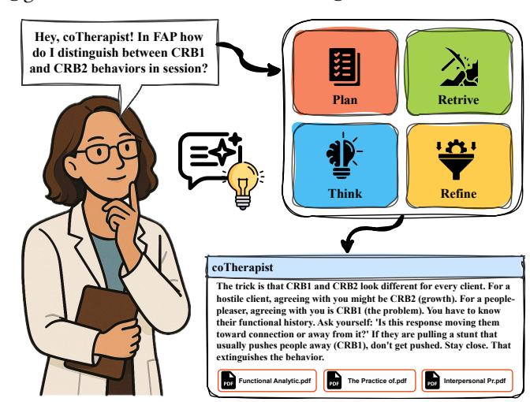
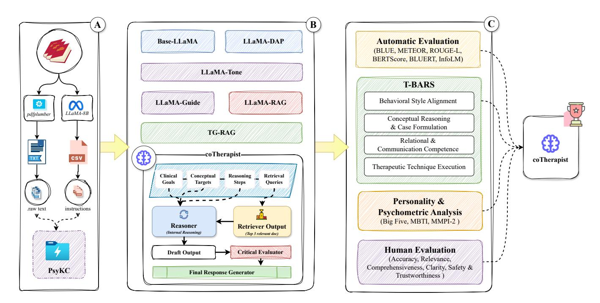
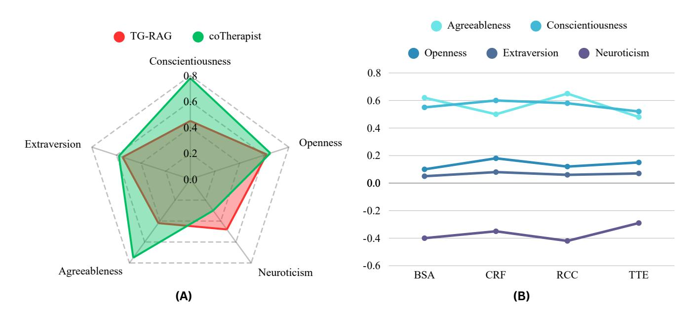

# coTherapist: A Behavior-Aligned Small Language Model Framework to Support Mental Healthcare Experts

Prottay Kumar Adhikary Indian Institute of Technology Delhi New Delhi, India prottay71@gmail.com

Reena Rawat Indian Institute of Technology Delhi New Delhi, India reenarawat755@gmail.com

Tanmoy Chakraborty Indian Institute of Technology Delhi New Delhi, India tanchak@iitd.ac.in

## Abstract

Access to mental healthcare is increasingly strained by workforce shortages and rising demand, motivating the development of intelligent systems that can support mental healthcare experts. We introduce coTherapist, a unified framework utilizing a small language model to emulate core therapeutic competencies through domainspecific fine-tuning, retrieval augmentation, and agentic reasoning. Evaluation on clinical queries demonstrates that coTherapist generates more relevant and clinically grounded responses than contemporary baselines. Using our novel T-BARS rubric and psychometric profiling, we confirm coTherapist exhibits high empathy and therapist-consistent personality traits. Furthermore, human evaluation by domain experts validates that coTherapist delivers accurate, trustworthy, and safe responses. coTherapist was deployed and tested by clinical experts. Collectively, these findings demonstrate that small models can be engineered to exhibit expertlike behavior, offering a scalable pathway for digital mental health tools.

#### CCS Concepts

• Human-centered computing → Web-based interaction; • Computing methodologies → Natural language processing; • Applied computing → Health care information systems.

#### Keywords

Mental Health Care, Small Language Models, Retrieval Augmented Generation, Agentic Framework, Web-based Interaction

#### ACM Reference Format:

Prottay Kumar Adhikary, Reena Rawat, and Tanmoy Chakraborty. 2026. coTherapist: A Behavior-Aligned Small Language Model Framework to Support Mental Healthcare Experts. In Proceedings of the ACM Web Conference 2026 (WWW '26), April 13–17, 2026, Dubai, United Arab Emirates. ACM, New York, NY, USA, [12](#page-11-0) pages.<https://doi.org/10.1145/3774904.3792988>

### 1 Introduction

Digital mental health platforms are increasingly utilizing Artificial Intelligence (AI) to bridge gaps in care and support Mental Health Experts (MHx). Large Language Models (LLMs) have recently demonstrated a surprising ability to provide critical advice [\[18\]](#page-8-0). While these systems promise better accessibility and can offer

© 2026 Copyright held by the owner/author(s). ACM ISBN 979-8-4007-2307-0/2026/04 <https://doi.org/10.1145/3774904.3792988>

Figure 1: Illustrative interaction with **coTherapist**. The figure visualizes the end-to-end pipeline triggered by a mental healthcare expert's query, highlighting the stages of planning, retrieval, internal reasoning, and self-refinement. The final output demonstrates how the system generates a response that is grounded in cited sources and aligned with a professional therapeutic tone, despite being powered by a lightweight small language model.

support that users find clearer and less biased than human therapists [\[21,](#page-8-1) [69\]](#page-9-0), naive implementation can still lead to unhelpful, script-like errors or harmful outputs [\[19\]](#page-8-2). To address this within the emerging field of computational psychiatry [\[8\]](#page-8-3), it is essential to define an AI's "behavior" not merely as text generation, but as its observable communication patterns [\[32\]](#page-8-4). For a model to truly resemble a skilled therapist rather than a generic chatbot, it must master three specific components: style imitation involving tone and paraphrasing [\[48\]](#page-9-1), a structured instruction-following capability [\[59\]](#page-9-2), and a conceptual reasoning framework based on evidencebased therapy logic [\[61\]](#page-9-3).

AI as a Therapeutic Assistant. Rather than attempting to replace human clinicians, we envision AI serving as a supportive assistant that helps trained practitioners deliver better care [\[5\]](#page-8-5). In clinical practice, therapists often consult manuals, worksheets, or peers to guide their interventions [\[53\]](#page-9-4), but they generally avoid relying on the open internet due to the high risk of misinformation. Similarly, an AI could fulfill this role by instantly answering a therapist's query about treatment techniques, including specific book sections for verification. It can also provide the rationale for a diagnosis or

[This work is licensed under a Creative Commons Attribution 4.0 International License.](https://creativecommons.org/licenses/by/4.0) WWW '26, Dubai, United Arab Emirates

suggest a gentle way to rephrase a question asked to a client [\[72\]](#page-9-5). By doing so, it can ease the therapist's cognitive load and provide quick access to consolidated expertise, all while the therapist remains in charge of the client's care [\[25\]](#page-8-6). This human-AI collaboration approach, which we term coTherapy, aligns with the broader goals of digital well-being, leveraging web-based platforms to improve mental health support without removing the human element [\[38\]](#page-8-7).

Challenges with Small Language Models. Transforming a general Small Language Model (SLM) into an effective clinical tool requires the model to adopt core counseling skills like reflective listening and structured frameworks such as Cognitive Behavioral Therapy (CBT) [\[6\]](#page-8-8). While generic SLMs are proficient at following technical rules, they often fall short in relational subtleties, producing formulaic empathy rather than the nuanced validation provided by human experts [\[63\]](#page-9-6). To bridge this gap, we need both behavioral style alignment and conceptual alignment, enabling the AI to "think through" problems using psychological theories.

Our Contributions. We introduce coTherapist, a lightweight agent emulating expert therapeutic behavior [\[24\]](#page-8-9) (Figure [1\)](#page-0-0). Designed strictly as a clinician's assistant, not a replacement, it is evaluated on simulated queries. Unlike computationally intensive LLMs [\[46\]](#page-9-7), we focus on aligning SLMs with clinical standards [\[14,](#page-8-10) [22\]](#page-8-11), enabling deployment in resource-constrained settings [\[65,](#page-9-8) [67\]](#page-9-9). Prioritizing behavioral fidelity over raw performance, our contributions are: (1) Domain-Specific Psychotherapy Knowledge Dataset. We curated a dataset of 800 million+ tokens, comprising undergraduate and postgraduate textbooks, lecture notes and videos, practice materials, etc. This corpus grounds the model in evidencebased therapeutic language, conceptual reasoning, and technical accuracy. (2) The **coTherapist** Framework. We develop a multistage pipeline for a 1 Billion parameter SLM, integrating continued pretraining for domain adaptation, LoRA fine-tuning for dialogue alignment [\[11\]](#page-8-12), and Retrieval-Augmented Generation (RAG) for evidentiary support [\[43\]](#page-9-10). Additionally, we implement an agentic reasoning structure to facilitate step-by-step clinical formulation. (3) Therapist Behavior Rating Scale. We propose T-BARS, a novel framework assessing four key pillars: Behavioral Style, Conceptual Reasoning, Relational Competence, and Technique Execution, across 20 sub-skills. Using LLM-based judges and psychometric profiling [\[27\]](#page-8-13), we find that coTherapist achieves a 3 improvement in empathy and relational clarity over baselines, despite modest gains in standard metrics. Human evaluation further confirms expert preference for coTherapist's safety and helpfulness.

## 2 Related Work

The application of NLP in mental health has evolved from simple rule-based chatbots to complex generative systems [\[54\]](#page-9-11). Recent advancements demonstrate that LLMs can be aligned with professional therapeutic standards [\[51\]](#page-9-12). For instance, models fine-tuned for CBT have shown significantly higher adherence to counseling strategies compared to base models [\[24\]](#page-8-9). Beyond behavioral adherence, research indicates that LLMs can infer latent psychological structures, accurately reasoning about personality patterns based on Big Five traits [\[31\]](#page-8-14).

This capability is essential for developing a consistent "therapist persona," shifting the field's focus from client-facing chatbots to AI assistants that support clinical decision-making, documentation, and retrieval of evidence-based criteria. Despite progress in generative capabilities, there remains limited research on designing AI systems specifically to reduce a practitioner's need to constantly consult external manuals or textbooks during practice [\[40\]](#page-9-13). Generic models often struggle with this due to hallucinations. To mitigate this, RAG has emerged as a standard for grounding LLMs [\[12\]](#page-8-15) in external knowledge bases [\[26\]](#page-8-16), a technique we adapt specifically for psychotherapy manuals [\[49\]](#page-9-14).

Turning a general SLM into an effective AI requires the model to adopt core counseling skills and clinical reasoning patterns. Generic SLMs often fall short: prior research comparing AI counselors to humans found that while SLMs are good at adhering to formal techniques, they struggle with relational subtleties, sometimes giving formulaic empathy or over-direct advice [\[63\]](#page-9-6). For example, an LLM might correctly suggest an exposure therapy exercise but fail to respond to a client's emotional cues with appropriate validation.

In clinical settings, Chain-of-Thought (CoT) mirrors the diagnostic reasoning process of a human therapist [\[50\]](#page-9-15). While some studies have applied CoT to improve diagnostic accuracy, few have applied it to interpersonal alignment, specifically [\[55\]](#page-9-16), reasoning about how to phrase a response therapeutically (e.g., "The client seems anxious; I should use validation before suggesting a technique"). By integrating an internal reasoning layer, models can move beyond surface-level style imitation to emulate the cognitive process of a junior therapist [\[24,](#page-8-9) [31\]](#page-8-14).

#### 3 Dataset: Psychotherapy Knowledge Corpus

Our dataset is a curated psychotherapy knowledge corpus (PsyKC) designed to (i) provide authoritative clinical content for retrieval, and (ii) expose the model to the pedagogical and procedural language used in therapist training. The corpus pools publicly available multiple content families: therapy manuals, clinical psychology texts, lecture video transcripts, psychiatry references, diagnostic guidelines, and supporting disciplines (abnormal psychology, neuro-psychology, psychosocial interventions, social psychology, and research methods). Each item in the catalog is annotated with three special metadata fields: primary\_topic (source family), therapeutic\_modality (e.g., CBT, Dialectical Behavior Therapy (DBT), Eye Movement Desensitization and Reprocessing (EMDR), and specific\_disorder (target clinical condition). Table [1](#page-2-0) shows the breadth of modality and disorder pairings. We merge duplicates during indexing (e.g., repeated CBT textbooks) so that each source contributes once to the vector store. To facilitate consistent evaluation, an expert curated a benchmark of 100 question-answer pairs, which was used to test the model across all experimental stages.

Scale and composition. In total, the knowledge base contains: (i) 311 therapy and psychiatry books/manuals (∼2 GB raw text, ∼524M tokens after extraction), spanning both evidence-based protocols and integrative/eclectic approaches. (ii) 250 lecture notes and training handouts, 552 lecture video transcripts from graduate counseling/clinical programs, capturing "how clinicians teach clinicians" language, contributing another ∼227 million tokens. (iii) 121 Diagnostic and practice guidelines emphasizing

Table 1: Schematic overview of therapeutic modality clusters and their corresponding disorder coverage. This mapping illustrates the breadth of clinical interventions integrated into the knowledge base, categorizing evidence-based frameworks (e.g., CBT, DBT, ACT) alongside the specific psychopathological conditions and symptom profiles they are primarily designed to treat.

| Modality Cluster & Primary Disorder Coverage                             |                     |                  |                      |               |                          |                                 |
|--------------------------------------------------------------------------|---------------------|------------------|----------------------|---------------|--------------------------|---------------------------------|
| Cognitive Behavioral Therapy family (Cognitive Behavioral Ther          |                     |                  |                      |               |                          |                                 |
| apy (CBT), Cognitive Therapy (CT), Rational Emotive Behavior             |                     |                  |                      |               |                          |                                 |
| Therapy (REBT), Rumination-Focused Cognitive Behavioral Ther            |                     |                  |                      |               |                          |                                 |
| apy (RFCBT), Mindfulness-Integrated Cognitive Behavioral Ther           |                     |                  |                      |               |                          |                                 |
| apy (MiCBT), Exposure and Response Prevention (EX/RP or ERP))            |                     |                  |                      |               |                          |                                 |
|                                                                          | Depression,         | anxiety          | spectrum             | (Generalized  | Anxiety                  | Disorder (GAD),                 |
| panic                                                                    |                     | disorder),       | Obsessive–Compulsive |               | Disorder                 | (OCD), Post                    |
|                                                                          | Traumatic           | Stress           | Disorder             | (PTSD) /      | trauma, Body             | Dysmorphic Dis                 |
| order                                                                    | (BDD),              |                  | Family/domestic      | violence,     | Anger,                   | Rumination.                     |
| Dialectical Behavior Therapy family (Dialectical Behavior Therapy        |                     |                  |                      |               |                          |                                 |
| (DBT), skills-based mindfulness, emotion regulation methods)             |                     |                  |                      |               |                          |                                 |
|                                                                          | Borderline          | Personality      | Disorder             | (BPD)         | / emotion                | dysregulation,                  |
|                                                                          | Suicidality/crisis, |                  | Comorbid             | Personality   | Disorders                | (PD) + Substance                |
| Use                                                                      | Disorders           | (SUD)            | / eating             | disorders,    | Overwhelming             | emotions.                       |
| Acceptance and Commitment Therapy / Mindfulness family (Accep           |                     |                  |                      |               |                          |                                 |
| tance and Commitment Therapy (ACT), Mindfulness-Based Cog               |                     |                  |                      |               |                          |                                 |
| nitive Therapy (MBCT), Mindfulness-Based Cognitive Behavioral            |                     |                  |                      |               |                          |                                 |
| Therapy (MBCBT))                                                         |                     |                  |                      |               |                          |                                 |
|                                                                          | Stress,             | anxiety,         | depression,          | Relapse       | prevention,              | Experiential avoid             |
| ance,                                                                    | Mixed               |                  | transdiagnostic      | problems.     |                          |                                 |
| Interpersonal / Rhythm / Family systems (Interpersonal Therapy           |                     |                  |                      |               |                          |                                 |
| (IPT), Interpersonal and Social Rhythm Therapy (IPSRT), Family/-         |                     |                  |                      |               |                          |                                 |
| Couple therapies)                                                        |                     |                  |                      |               |                          |                                 |
|                                                                          | Depression,         | Bipolar          | Disorder             | (BD),         | Eating                   | disorders, PTSD, Mari          |
|                                                                          | tal/relational      | distress,        | Family               | violence.     |                          |                                 |
| Trauma-focused (Eye Movement Desensitization and Reprocessing            |                     |                  |                      |               |                          |                                 |
| (EMDR), Somatic therapy, Emotion-Focused Therapy (EFT) trauma            |                     |                  |                      |               |                          |                                 |
| app lications)                                                           |                     |                  |                      |               |                          |                                 |
|                                                                          | PTSD, Sexual        | trauma,          | Complex              | trauma,       |                          | Trauma-related anxiety          |
| and                                                                      | depression.         |                  |                      |               |                          |                                 |
| Behavioural / Developmental (Applied Behavior Analysis (ABA),            |                     |                  |                      |               |                          |                                 |
| Parent Management Training (PMT), Treatment and Education of             |                     |                  |                      |               |                          |                                 |
| Autistic and Communication-Handicapped Children (TEACCH),                |                     |                  |                      |               |                          |                                 |
| Behavior modification)                                                   |                     |                  |                      |               |                          |                                 |
|                                                                          | Autism              | Spectrum         | Disorder             | (ASD),        |                          | Attention-Deficit/Hyperactivity |
|                                                                          | Disorder            | (ADHD),          | Tourette             | Syndrome      | (TS),                    | Oppositional Defiant            |
|                                                                          | Disorder            | (ODD) /          | conduct              | problems /    | aggression,              | Intellectual Dis               |
|                                                                          | ability (ID)        | /                | Developmental        | Disability    | (DD),                    | Child/adolescent be            |
|                                                                          | havior              | disorders.       |                      |               |                          |                                 |
| Integrative / Supportive / Existential / Logotherapy / Psychodrama Broad |                     | distress,        | Neuroses,            |               | Psychosomatic/functional | illness, Severe                 |
|                                                                          | mental              | illness support, | Life                 | challenges.   |                          |                                 |
| Sex therapy (Biopsychosocial / Systemic / Integrative approaches)        | Premature           | Ejaculation      | (PE),                | Erectile      | Disorder (ED),           | Orgasmic disor                 |
| ders,                                                                    |                     | Desire/arousal   | issues,              | Genito-pelvic | pain                     | disorders, Paraphilic           |
|                                                                          | disorders,          | Gender           | Dysphoria            | (GD).         |                          |                                 |

standardized assessment, risk management, and care pathways, adding ∼49 million tokens more. This multi-family structure ensures the model has access to (a) procedural steps (manuals, worksheets), (b) conceptual framing (clinical/abnormal psychology), (c) diagnostic grounding (psychiatry texts and guidelines), and (d) assessment literacy (neuro-psychology and research methods). This covers high-priority conditions including depression, the anxiety spectrum, trauma, personality disorders, psychosis, substance use, and neuro-developmental issues. It also integrates essential crosscutting areas like crisis prevention, gender-affirming care, domestic violence support, and case conceptualization.

Why this structure matters? Therapy manuals and books provide the highest density of actionable techniques (e.g., exposure hierarchies, grounding scripts), while clinical psychology and psychiatry texts provide diagnostic nuance and case-formulation reasoning [\[45\]](#page-9-17). Each tier serves a distinct purpose. Guidelines anchor safety-critical behaviors [\[41\]](#page-9-18) such as suicide risk pathways

and evidence-based service models [\[20\]](#page-8-17). This layered design supports our RAG pipeline: retrieval surfaces exact protocol text, while fine-tuning aligns the model's tone and instructional ability. By mirroring the curriculum of formal clinical training [\[35\]](#page-8-18), this diverse corpus ensures the model moves beyond rote procedural recall to acquire the underlying "clinical logic" necessary for adapting interventions to specific client needs.

## 4 Methodology

coTherapist integrates few components: model fine-tuning, retrieval architecture, and agentic reasoning, to build a psychotherapyaware assistant that is both clinically-grounded and conversationallyaligned with therapist communication styles. We employ LLaMA 3.2-1B-Instruct, the smallest model from the Meta family, as our base to facilitate accessible edge deployment, overcoming the inherent limitations of small models through a staged pipeline of domain-adaptive pretraining, stylistic LoRA fine-tuning, and selfinstruction. This framework is further enhanced by a RAG layer and

Figure 2: System overview of the proposed **coTherapist** framework. (A) Data Curation: We compile a high-quality clinical corpus from psychotherapy textbooks, university lecture notes, lecture videos, etc. The data is cleaned, segmented, and indexed to cover major evidence-based therapies used in MHx training and practice. (B) Experiment Design: The model is trained through continued pretraining for domain tone, LoRA fine-tuning for therapist communication style, and retrieval-augmented generation to provide clinically accurate knowledge. An agentic reasoning step supports structured and context-aware responses. (C) Evaluation: Outputs are evaluated using both traditional NLG metrics and the T-BARS behavioral framework. Across all settings, the full **coTherapist** model demonstrates the highest therapist-like alignment and is preferred in human evaluation.

an internal reasoning and critique architecture, enabling the model to draw on authoritative protocols while maintaining human-like interaction. To ensure consistent adherence to evidence-based practices and prevent stylistic drift, all model variants utilize a unified base system prompt (Appendix [A.1\)](#page-10-0) that instructs the models to act as a clinically grounded co-therapist. Our experimental design evaluates a few incremental approaches, starting from the base model and progressively adding these engineering techniques to culminate in the full coTherapist framework. We structure training and inference into clearly separated stages, allowing each component to be independently analyzed and ablated. Figure [2](#page-3-0) illustrates the complete coTherapist pipeline from clinical data curation to model alignment and multi-stage evaluation.

## Domain-Adaptive Pretraining (DAP)

We perform unsupervised domain-adaptive pretraining [\[15\]](#page-8-19) on our collected corpus to infuse domain-specific terminology. Training on all textbook text for five epochs using the HuggingFace Trainer (batch size 128, sequence length 1024 on 1×A100 GPU, learning rate 1 × 10−5 ) [\[62\]](#page-9-19) yields LLaMA-DAP. This model demonstrates improved clinical precision; for instance, discussing "behavioral activation" elicits terms like "inhibitory learning" rather than generic language (see Appendix [A\)](#page-10-1). Early stopping is employed to prevent overfitting on domain text [\[68\]](#page-9-20).

#### LoRA Fine-Tuning for Style

To address DAP's didactic tone, we fine-tune LLaMA-DAP on therapist turns from the MentalCLOUDS benchmark [\[1\]](#page-8-20) using Low-Rank Adaptation (LoRA) (�� = 16, �� = 32, dropout = 0.05) [\[17\]](#page-8-21). This yields LLaMA-Tone, which exhibits human-like therapeutic qualities such as first-person empathy [\[30\]](#page-8-22). We observe that this efficient style alignment does not significantly degrade the base knowledge.

## Self-Instruction Tuning

To enhance structured guidance, we employ the self-instruct paradigm [\[58\]](#page-9-21), generating ∼24k therapy-specific instruction pairs using LLama-3.1-8B. Fine-tuning on this data produces LLaMA-Guide, which improves reasoning but diminishes conversational warmth [\[66\]](#page-9-22). An additional tuning round atop LLaMA-Tone balances these traits, yielding the final LLaMA-TG model.

## Retrieval-Augmented Generation (RAG)

We implement a RAG [\[26\]](#page-8-16) framework to ground knowledge. At inference time, the top-�� (�� = 3) relevant passages are retrieved via embedding search [\[3\]](#page-8-23), using embeddings indexed with FAISS, and are prepended to the input context. While LLaMA-RAG significantly reduces hallucinations, it occasionally induces verbosity or excessive formality.

Table 2: Overview of incremental development stages and their resulting qualitative behaviors. The comparison illustrates how a small model shifts behavior from a generic to a clinically nuanced, empathetic co-therapist.

| Model Variant Description                       | Observed      | Behavior    |                 |               |            |               |              |                 |               |                   |
|-------------------------------------------------|---------------|-------------|-----------------|---------------|------------|---------------|--------------|-----------------|---------------|-------------------|
| ( LLaMA-3.2-1B-Instruct ) Pretrained Base Model |               |             |                 |               |            |               |              |                 |               |                   |
|                                                 | Somewhat      | Correct,    | but generic     | and           | detached.  | Often         | gives        |                 | surface-level | advice in         |
| a                                               | mechanical    | tone.       | Lacks           | empathy       | or         | nuance        | (sounds      | like a          | QA            | chatbot).         |
| LLaMA-DAP Continued pretraining on              |               |             |                 |               |            |               |              |                 |               |                   |
| therapy texts                                   |               |             |                 |               |            |               |              |                 |               |                   |
| More                                            | grounded      |             | language        | with          | clinical   | terms.        | Provides     | definitions     | and           | concepts          |
|                                                 | accurately    | (less       | hallucination). | Still         | somewhat   |               |              | formal/academic | in            | tone.             |
| LLaMA-Tone LoRA fine-tune on                    |               |             |                 |               |            |               |              |                 |               |                   |
| therapist-style dialogues                       |               |             |                 |               |            |               |              |                 |               |                   |
| Adopts                                          | a casual,     | warm        |                 | therapist     | voice.     | Uses          | first-person | and             | empathic      | phrases.          |
| Feels                                           | like          | another     | clinician       | talking.      | May        | sacrifice     | some         | factual         | detail        | for a friendly    |
| LLaMA-Guide Fine-tune on synthetic in          |               |             |                 |               |            |               |              |                 |               |                   |
| struction examples                              |               |             |                 |               |            |               |              |                 |               |                   |
|                                                 | Responds in   | a           | structured,     | step-by-step  |            | manner.       | Very         | goal-directed   |               | and concise.      |
|                                                 | However, can  | be          | overly terse    | or            | list-like, | missing       |              | conversational  | flow.         |                   |
| LLaMA-RAG Retrieval-augmented gen              |               |             |                 |               |            |               |              |                 |               |                   |
| Highly                                          | accurate      | and         |                 | content-rich, | citing     | details       | from         | books.          | Tone          | can become        |
| neutral                                         | or dry        | (reflecting | the             | source).      | Lacks      |               | emotional    |                 | engagement.   |                   |
| TG-RAG LoRA-tuned model with                    |               |             |                 |               |            |               |              |                 |               |                   |
| RAG at inference                                |               |             |                 |               |            |               |              |                 |               |                   |
|                                                 | Knowledgeable | and         | empathic        |               | combined.  | Provides      | correct      | info            | in a          | friendly tone.    |
|                                                 | However, acts | more        | like a          | helpful       | assistant  | than          | an           | autonomous      |               | therapist—tends   |
| to                                              | answer        | directly    | without         | deeper        | reasoning  | or            | initiative.  |                 |               |                   |
| CoTherapist (Ours) Agentic reasoning + LoRA     |               |             |                 |               |            |               |              |                 |               |                   |
| + RAG                                           |               |             |                 |               |            |               |              |                 |               |                   |
| Most                                            | human-like.   |             | Critiques       | itself        | and        | responds like | an           | active          | co-therapist: | recalls           |
| session                                         | goals,        | anticipates |                 | client        | needs, and | adapts        | responses    |                 |               | moment-to-moment. |
| Balances                                        |               | empathy     | with            | expert        | guidance.  |               |              |                 |               |                   |

## Combining LoRA and RAG

We combine LLaMA-TG with LLaMA-RAG at inference. The model (TG-RAG) can both speak like a therapist and draw in details from texts [\[29\]](#page-8-24). This setup was effective on many queries, though it still tended to answer directly without deeper reasoning or initiative. This setup also enabled the web application to display the sources underlying each generated response, allowing mental health professionals to review the primary reference materials when needed.

## The **coTherapist** Framework

The final iteration augments TG-RAG with a therapeutically-aligned agentic reasoning framework [\[60\]](#page-9-23). Instead of treating the model as a static RAG-based QA system, we introduce a structured multistage reasoning pipeline that enables the model to behave as an autonomous coTherapist. The system prompt is expanded to encode therapist-like communication patterns grounded in CBT, DBT, ACT, Schema Therapy, and clinical psychopathology. Algorithm [1](#page-4-0) presents a five-step pipeline for safe retrieval-augmented generation in a clinical setting. The planner first converts the user query into a structured clinical plan, identifying underlying concerns, relevant therapeutic constructs, and evidence domains for retrieval, which then guides the retriever (TG-RAG) to collect appropriate context [\[56\]](#page-9-24).

Utilizing this retrieved context, the model performs a private internal reasoning pass to produce a stepwise clinical analysis and draft answer, which is subsequently evaluated by a self-critique module for conceptual accuracy, safety, and framework fidelity, triggering refinement loops if necessary [\[44\]](#page-9-25). In practice, this entails screening for crisis risks, logical flaws, hallucinations, and factual inaccuracies. Finally, a post-processing module removes the internal reasoning trace to generate a polished, supportive, and contextually tailored response, effectively enabling coTherapist

Algorithm 1 Inference pipeline for coTherapist, consists of Planner, Retriever, Reasoner, Critic or Self Refiner, Response Generator, working together as a series of agents to generate a response.

Input: User query �� Output: Final answer ��final 1: Step 1: Planner 2: �� ← Plan(��)

3: Step 2: RAG Retriever 4: �� ← RetrieveChunks(��, ��) 5: Step 3: Reasoning Pass

6: ��draft ← Reason(��, ��,��) ⊲ Model performs private CoT

7: Step 4: Critic / Self-Refinement

8: for �� ← 1 to ��max do

9: �� ← CriticEvaluate(��,��, ��draft)

10: if �� is acceptable then

11: break 12: else

13: (��,��, ��draft) ← Refine(��, ��,��, ��draft, ��)

14: end if 15: end for

16: Step 5: Final Response Generator 17: ��final ← PostProcess(��draft)

18: return ��final

to conceptualize and interact with the interpersonal nuance of a junior therapist.

## 5 Evaluation

We evaluate coTherapist using three complementary approaches: (1) classical automatic metrics, (2) a therapist-alignment framework we introduce, called T-BARS (Therapist Behavior Rating Scale), and

(3) human evaluation performed through the web application. Each evaluation captures a distinct dimension of performance. We exclude large model benchmarks to focus exclusively on optimizing small, deployable architectures for privacy-constrained clinical environments. Automatic metrics quantify semantic fidelity; T-BARS & Personality Analysis measures therapist-likeness with fine-grained sub-skills; and human evaluation reflects perceived quality, trustworthiness, and usability. Table [2](#page-4-1) shows the overall observed behavior in our experiments.

#### 5.1 Automatic Evaluation

To measure factual and semantic alignment with high-quality psychotherapy reference answers, we evaluate all model variants on a 100-question test set (Appendix [A.2\)](#page-10-2) curated by a licensed clinical psychologist who practices mental health care delivery. We compute BLEU [\[39\]](#page-8-25), METEOR [\[2\]](#page-8-26), ROUGE-L [\[28\]](#page-8-27), BERTScore [\[71\]](#page-9-26), BLUERT [\[42\]](#page-9-27), InfoLM [\[7\]](#page-8-28). Although automatic metrics can confirm if coTherapist retains or improves semantic fidelity, they fail to capture the relational, empathic, and reasoning qualities essential to psychotherapy work.

## 5.2 **T-BARS**: Therapist Behavior Rating Scale

To evaluate MHx-likeness, we introduce T-BARS, a structured evaluation framework informed by clinical supervision literature, counseling micro-skills research [\[16\]](#page-8-29), and best practices described in psychotherapy assessment rubrics [\[13\]](#page-8-30). T-BARS focuses on evaluating whether the model behaves like a supportive and skilled junior MHx, capable of assisting with case conceptualization and clarifying theoretical questions.

5.2.1 Pillars and Subskills. The framework consists of four pillars, subdivided into twenty sub-skills, each scored on a 0–4 scale.

(1) Behavioral Style Alignment (BSA) This pillar measures how closely the model's communication mirrors an MHx. The five evaluated sub-skills include: tone & warmth (supportive, nonjudgmental style), reflective listening (accurately echoing client emotions), paraphrasing & summarizing (capturing user's central concerns), instruction-following structure (clear steps, guided options, and protocol-like reasoning), and therapist-like explanations (psycho-educational framing rather than generic explanations) [\[4\]](#page-8-31).

(2) Conceptual Reasoning & Case Formulation (CRF) This evaluates whether the model "thinks like an MHx." Subskills include: problem clarification, use of therapeutic frameworks (e.g., CBT, ACT, Schema Therapy),clinical reasoning chains, treatment-planning logic, and risk awareness. These require models to engage in conceptual understanding rather than surface-level paraphrasing. [\[10\]](#page-8-32)

(3) Relational & Communication Competence (RCC) This captures the interpersonal layer of therapeutic communication. Sub-skills evaluated include: empathy expression, rapport building, emotional validation, gentle challenging (e.g., CBT-style reframing), and context sensitivity (culture, family, identity, environment) [\[36\]](#page-8-33).

(4) Therapeutic Technique Execution (TTE) This evaluates the accuracy and context-appropriateness of therapeutic interventions. Subskills include: technique accuracy, contextual fit, step-bystep procedures, guided questions rather than directives, and maintaining agency and consent. This ensures the model does not act prescriptively or Coercively [\[37\]](#page-8-34).

5.2.2 **T-BARS** Scoring Rubric. As detailed in Table [4,](#page-5-0) a LLaMA 3.1–8B-Instruct judge model scores all sub-skills [\[73\]](#page-9-28). The evaluator is prompted with explicit rubric definitions and required to generate a Chain-of-Thought (CoT) rationale, citing specific evidence such as the presence of validation or technical errors, before assigning a value. We employ a strict JSON output format to minimize hallucination and scoring drift, ensuring the automated evaluation remains interpretable and consistent with human judgment (Appendix [A.4\)](#page-11-1).

Table 4: The scoring rubric for the **T-BARS** framework. This 5-point Likert scale (0-4) is used to quantify the model's performance across all twenty sub-skills, ranging from harmful or irrelevant outputs (0) to highly nuanced, therapist-aligned interventions (4).

| Score | Descriptor |                |                                 |
|-------|------------|----------------|---------------------------------|
| 0     | Absent,    | inappropriate, | contradictory                   |
| 1     | Weak,      | vague,         | inconsistent                    |
| 2     | Adequate   | but            | mechanical or incomplete        |
| 3     | Good,      | contextually   | appropriate                     |
| 4     | Excellent, | highly         | aligned with therapist behavior |

## 5.3 Personality and Psychometric Analysis

To analyze emergent behavioral tendencies, we perform external assessments: Big Five, Myers-Briggs Type Indicator (MBTI), and a reduced Minnesota Multiphasic Personality Inventory (MMPI-2) evaluation, and let the models take these tests [\[31\]](#page-8-14). We prompt each model to complete standardized personality inventories: a Big Five questionnaire (50-item), the MBTI, and select scales from the MMPI. The model's responses to these tests (simulating how it might selfdescribe if it were a person) are scored using the tests' standard scoring rules. This yields a rough personality profile for each model variant. While an AI cannot truly have a personality, this exercise provides insight into the behavioral tendencies encoded by different training strategies [\[57\]](#page-9-29). We hypothesize that the coTherapist model might score higher on Agreeableness (reflecting empathy) than the second-best model, which could help explain differences in their counseling performance.

## 5.4 Human Evaluation

To ground our results in real-world judgments, we conducted a human study with domain experts[1](#page-5-1) . Participants reviewed paired TG-RAG (Best Model after ours in Automatic Evaluation) versus coTherapist responses to the test set as well as to randomly sampled prompts. We deployed a web application, where MHx could pose questions and view answers from different model variants (without knowing which model produced which answer). After reading an answer, the evaluator rated it on five criteria using a 5-point Likert scale (1=Lowest, 5=Highest). The criteria were: Accuracy (correctness and factual soundness of the answer), Relevance (how well the answer addresses the question without off-topic content), Comprehensiveness (whether the answer covers necessary

1This group included five licensed clinical psychologists and fifteen clinical psychology students (undergraduate and postgraduate levels) who are currently undergoing formal training in psychotherapy and mental health care delivery.

Table 3: Automatic evaluation results across model variants using standard classical metrics. The **coTherapist** model achieves the strongest improvements overall, though gains remain moderate, highlighting the limitations of surface-level metrics for measuring therapist-like behavior.

| Model           | BLEU | METEOR | ROUGE-L | BERTScore | BLEURT | InfoLM |
|-----------------|------|--------|---------|-----------|--------|--------|
| Base (LLaMA-1B) | 15.8 | 0.29   | 0.33    | 0.856     | -0.64  | 0.41   |
| LLaMA-DAP       | 17.2 | 0.30   | 0.35    | 0.861     | -0.47  | 0.42   |
| LLaMA-Tone      | 18.0 | 0.33   | 0.36    | 0.872     | -0.32  | 0.46   |
| LLaMA-Guide     | 17.9 | 0.34   | 0.37    | 0.878     | -0.30  | 0.49   |
| LLaMA-RAG       | 20.3 | 0.35   | 0.41    | 0.889     | -0.02  | 0.47   |
| TG-RAG          | 19.8 | 0.37   | 0.44    | 0.897     | 0.11   | 0.53   |
| coTherapist     | 21.0 | 0.38   | 0.42    | 0.901     | 0.16   | 0.68   |

aspects of the question or problem), Clarity (ease of understanding and clarity of explanation), and Safety & Trustworthiness (absence of harmful or misleading content, and overall reliability of the answer). This framework aligns with established standards for medical AI assessment [\[47\]](#page-9-30). We aggregated ratings to compare overall perceived performance, adhering to recommendations for expert-in-the-loop validation of generative health systems [\[52\]](#page-9-31).

#### 6 Experimental Results

Across all experiments, the coTherapist model shows consistent improvements over the base LLaMA model and the intermediate variants (Appendix [A.3\)](#page-10-3). We first report automatic metrics, followed by T-BARS, psychometric patterns, and human ratings, showing how retrieval, tone alignment, and reasoning improve therapist-like behavior.

Table [3](#page-6-0) details automatic metric performance. LLaMA-DAP shows steady gains over the base model, while tone and guidance tuning (LLaMA-Tone/Guide) enhances lexical richness (METEOR, InfoLM) and semantic alignment (BLEURT). The introduction of RAG produces the most significant shifts, with standard RAG and TG-RAG improving BLEU and ROUGE-L by integrating guideline-specific language. Notably, coTherapist achieves the highest scores across BLEU, METEOR, BERTScore, BLEURT, and InfoLM. Although it does not maximize ROUGE-L, its superior performance elsewhere suggests that the agentic reasoning layer enhances conceptual depth and clinical relevance beyond mere surface-level matching.

Table 5: **T-BARS** scores (0-4): BSA = Behavioral Style Alignment, CRF = Conceptual Reasoning & Formulation, RCC = Relational & Communication, TTE = Therapeutic Technique Execution.

| Model       | BSA | CRF | RCC | TTE | Comp. |
|-------------|-----|-----|-----|-----|-------|
| Base        | 1.7 | 1.4 | 1.5 | 1.8 | 1.6   |
| TG-RAG      | 2.6 | 2.4 | 2.7 | 2.5 | 2.5   |
| coTherapist | 3.3 | 3.1 | 3.4 | 3.2 | 3.2   |
| Human       | 3.6 | 3.4 | 3.8 | 3.5 | 3.5   |

To assess therapeutic fidelity, we evaluate models using the T-BARS framework (Table [5\)](#page-6-1). While the base model scores lowest across all pillars, TG-RAG demonstrates clear improvements

through retrieval and tone shaping. coTherapist outperforms all baselines, approaching human-level scores, particularly in BSA and RCC. Qualitative analysis reveals that coTherapist frequently employs reflective listening, emotion naming, and supervision-style rationale, linking techniques to case formulation. Composite scores confirm this trajectory: the base model averages 1.6, TG-RAG 2.5, and coTherapist 3.2, approaching the human average of 3.5. This suggests that coTherapist approximates some communication features of a supervised junior clinician on written test cases, but its use should currently be restricted to low-risk supervision and protocol-recall support rather than direct client interaction.

Personality analyses provide insight into behavioral shifts in our framework. Big Five estimators show that coTherapist maintains high Agreeableness (0.78) and Conscientiousness (0.72), low Neuroticism (0.29), and moderate Openness (0.63), while the base model exhibits lower Agreeableness/Conscientiousness and higher Neuroticism (Fig. [3\(](#page-7-0)A)). This profile aligns with therapist-like traits such as warmth, reliability, and emotional stability. MBTI-style tools consistently classify coTherapist as INFJ ("Counselor"), and MMPI-inspired indicators suggest higher social responsibility and lower emotional volatility than the base model. Correlating Big Five traits with the T-BARS pillars (Fig. [3\(](#page-7-0)B)) shows that Agreeableness and Conscientiousness are consistently high across all pillars, particularly RCC and BSA. This indicates that implicit persona shaping via style and reasoning fine-tuning contributes directly to improved therapeutic alignment.

Table 6: Comparative results from the blind human evaluation (N=20 experts). The table displays average Likert scale ratings (1–5) for TG-RAG versus the proposed **coTherapist** framework across five key clinical dimensions.

| Criterion                | TG-RAG | coTherapist |
|--------------------------|--------|-------------|
| Accuracy                 | 2.1    | 4.2         |
| Relevance                | 2.4    | 3.9         |
| Comprehensiveness        | 1.8    | 3.6         |
| Clarity                  | 2.2    | 4.1         |
| Safety & Trustworthiness | 2.6    | 3.8         |

Human evaluation strongly favors coTherapist across all dimensions (Table [6\)](#page-6-2), consistent with automatic metrics. coTherapist

Figure 3: Analysis of personality alignment and its impact on clinical performance. (A) Big Five profiles indicate that **coTherapist** exhibits higher Agreeableness and Conscientiousness with lower Neuroticism compared to TG-RAG, consistent with established therapist traits. (B) Correlation analysis confirms that these specific personality dimensions are positively associated with higher scores in the Behavioral Style Alignment and Relational Competence pillars of the **T-BARS** framework.

achieves higher Accuracy (4.2 vs. 2.1) and Relevance (3.9 vs. 2.4) due to precise, clinically grounded definitions (e.g., graded exposure, inhibitory learning), whereas the baseline relies on vague statements. Raters also report greater Comprehensiveness (3.6 vs. 1.8) and Clarity (4.1 vs. 2.2), noting a structured, multi-step response style. Importantly, improved Safety & Trustworthiness (3.8 vs. 2.6) reflects collaborative language (e.g., "You might consider") and stronger crisis risk management. Clinicians characterized coTherapist as a "well-trained trainee," indicating a shift from generic advice to a clinically plausible role aligned with T-BARS standards.

## 7 Deployment and Privacy

To facilitate accessible deployment, coTherapist is served via a quantized 4-bit inference engine [\[9\]](#page-8-35), enabling real-time execution on consumer-grade GPUs and mobile processors through Google AI Edge[2](#page-7-1) . This lightweight footprint (<2GB VRAM) significantly lowers infrastructure costs and improves scalability compared to massive foundation models [\[34\]](#page-8-36). Crucially, the architecture supports on-premise or edge deployment, ensuring that sensitive clinical queries remain within a secure [\[33\]](#page-8-37) and HIPAA-compliant local environment [\[64\]](#page-9-32) without requiring external data transmission [\[23\]](#page-8-38). The system exposes a RESTful API for seamless integration into existing electronic health record (EHR) workflows and decision support dashboards [\[70\]](#page-9-33). Feedback from this small pilot, involving 20 experts, provisionally supported the edge-first approach, citing negligible latency and local data privacy as key factors driving their willingness to adopt the tool in sensitive workflows.

#### 8 Conclusion and Future Work

We presented the coTherapist Framework, a novel methodology that transforms a lightweight 1-billion parameter language model into a clinically grounded co-therapist via domain-specific supervision, retrieval from trusted psychotherapy manuals, and process-focused prompting. By effectively mitigating off-domain hallucinations and fostering empathy, active listening, and clear case formulation, we demonstrate that small, deployable models can approximate expert-like behavior suitable for resource-constrained clinical settings. While coTherapist serves as a powerful support tool for tasks like protocol recall and supervision-style reflection, it remains an unlicensed, English-only system focused on mainstream modalities (e.g., CBT, DBT) and requires careful oversight in crisis scenarios, but can be used for expert decision support & training. To address these limitations, future work will leverage alignment with human feedback guided by our T-BARS dimensions, explore multi-modal integration, and extend validation to broader peer support contexts. Our expert study provides only preliminary evidence from a small, geographically local cohort; broader multi-site evaluations will be needed before any routine clinical adoption.

## Acknowledgment

We acknowledge the generous support of Tower Research Capital Markets for funding our work on applying machine learning for social good. T. Chakraborty acknowledges the support of the Rajiv Khemani Young Faculty Chair Professorship in Artificial Intelligence. We thank the mental healthcare professionals and the volunteers who participated in our user study and provided invaluable feedback.

2https://github.com/google-ai-edge/

- References [1] Prottay Kumar Adhikary, Aseem Srivastava, Shivani Kumar, Salam Michael Singh, Puneet Manuja, Jini K Gopinath, Vijay Krishnan, Swati Kedia Gupta, Koushik Sinha Deb, and Tanmoy Chakraborty. 2024. Exploring the Efficacy of Large Language Models in Summarizing Mental Health Counseling Sessions: Benchmark Study. JMIR Mental Health 11 (July 2024), e57306. [doi:10.2196/57306](https://doi.org/10.2196/57306) [2] Satanjeev Banerjee and Alon Lavie. 2005. METEOR: An Automatic Metric for MT Evaluation with Improved Correlation with Human Judgments. In Proceedings of the ACL Workshop on Intrinsic and Extrinsic Evaluation Measures for Machine Translation and/or Summarization, Jade Goldstein, Alon Lavie, Chin-Yew Lin, and Clare Voss (Eds.). Association for Computational Linguistics, Ann Arbor, Michigan, 65–72.<https://aclanthology.org/W05-0909/> [3] Sebastian Borgeaud, Arthur Mensch, Jordan Hoffmann, Trevor Cai, Eliza Rutherford, Katie Millican, George van den Driessche, Jean-Baptiste Lespiau, Bogdan Damoc, Aidan Clark, Diego de Las Casas, Aurelia Guy, Jacob Menick, Roman Ring, Tom Hennigan, Saffron Huang, Loren Maggiore, Chris Jones, Albin Cassirer, Andy Brock, Michela Paganini, Geoffrey Irving, Oriol Vinyals, Simon Osindero, Karen Simonyan, Jack W. Rae, Erich Elsen, and Laurent Sifre. 2021. Improving language models by retrieving from trillions of tokens. [doi:10.48550/arxiv.2112.04426](https://doi.org/10.48550/arxiv.2112.04426) [4] K Carroll. 2000. A general system for evaluating therapist adherence and competence in psychotherapy research in the addictions. Drug and Alcohol Dependence 57, 3 (Jan. 2000), 225–238. [doi:10.1016/s0376-8716\(99\)00049-6](https://doi.org/10.1016/s0376-8716(99)00049-6) [5] Yuexi Chen, Vlad I Morariu, Anh Truong, and Zhicheng Liu. 2024. TutoAI: a crossdomain framework for AI-assisted mixed-media tutorial creation on physical tasks. In Proceedings of the 2024 CHI Conference on Human Factors in Computing Systems (Honolulu, HI, USA) (CHI '24). Association for Computing Machinery, New York, NY, USA, Article 161, 17 pages. [doi:10.1145/3613904.3642443](https://doi.org/10.1145/3613904.3642443) [6] Yu Ying Chiu, Ashish Sharma, Inna Wanyin Lin, and Tim Althoff. 2024. A Computational Framework for Behavioral Assessment of LLM Therapists. arxiv preprint arxiv:2401.00820. [7] Pierre Colombo, Chloe Clavel, and Pablo Piantanida. 2021. InfoLM: A New Metric to Evaluate Summarization Data2Text Generation. (2021). [doi:10.48550/arxiv.](https://doi.org/10.48550/arxiv.2112.01589) [2112.01589](https://doi.org/10.48550/arxiv.2112.01589) [8] Dara Dehghan and Haineko Ishikawa. 2025. Artificial Intelligence in Modern Psychology: A 2025 Guide to Diagnosis, Therapy, and Ethical Innovation. (April 2025). [doi:10.31234/osf.io/724qe\\_v1](https://doi.org/10.31234/osf.io/724qe_v1) [9] Tim Dettmers, Artidoro Pagnoni, Ari Holtzman, and Luke Zettlemoyer. 2023. QLoRA: Efficient Finetuning of Quantized LLMs. [doi:10.48550/ARXIV.2305.14314](https://doi.org/10.48550/ARXIV.2305.14314) [10] Tracy D. Eells. 2013. The Case Formulation Approach to Psychotherapy Research Revisited. Pragmatic Case Studies in Psychotherapy 9, 4 (Dec. 2013), 426–447. [doi:10.14713/pcsp.v9i4.1834](https://doi.org/10.14713/pcsp.v9i4.1834) [11] Dr. Atif Faridi and Dr. Romana Shehla. 2025. Empathy-Enhanced Small Language Models for Digital Mental Health Counseling. International Journal of Engineering and Computer Science 14, 08 (Aug. 2025), 27662–27672. [doi:10.18535/ijecs.v14i08.](https://doi.org/10.18535/ijecs.v14i08.5218) [5218](https://doi.org/10.18535/ijecs.v14i08.5218) [12] Matjaž Gams, Tadej Horvat, Žiga Kolar, Primož Kocuvan, Kostadin Mishev, and Monika Simjanoska Misheva. 2025. Evaluating a Nationally Localized AI Chatbot for Personalized Primary Care Guidance: Insights from the HomeDOCtor Deployment in Slovenia. Healthcare 13, 15 (July 2025), 1843. [doi:10.3390/](https://doi.org/10.3390/healthcare13151843) [healthcare13151843](https://doi.org/10.3390/healthcare13151843) [13] Simon B. Goldberg, Scott A. Baldwin, Kritzia Merced, Derek D. Caperton, Zac E. Imel, David C. Atkins, and Torrey Creed. 2020. The Structure of Competence: Evaluating the Factor Structure of the Cognitive Therapy Rating Scale. Behavior Therapy 51, 1 (Jan. 2020), 113–122. [doi:10.1016/j.beth.2019.05.008](https://doi.org/10.1016/j.beth.2019.05.008) [14] Suriya Gunasekar, Yi Zhang, Jyoti Aneja, Caio César Teodoro Mendes, Allie Del Giorno, Sivakanth Gopi, Mojan Javaheripi, Piero Kauffmann, Gustavo de Rosa, Olli Saarikivi, Adil Salim, Shital Shah, Harkirat Singh Behl, Xin Wang, Sébastien Bubeck, Ronen Eldan, Adam Tauman Kalai, Yin Tat Lee, and Yuanzhi
- Li. 2023. Textbooks Are All You Need. [doi:10.48550/arxiv.2306.11644](https://doi.org/10.48550/arxiv.2306.11644) [15] Suchin Gururangan, Ana Marasović, Swabha Swayamdipta, Kyle Lo, Iz Beltagy, Doug Downey, and Noah A. Smith. 2020. Don't Stop Pretraining: Adapt Language Models to Domains and Tasks. In Proceedings of the 58th Annual Meeting of the Association for Computational Linguistics, Dan Jurafsky, Joyce Chai, Natalie Schluter, and Joel Tetreault (Eds.). Association for Computational Linguistics, Online, 8342–8360. [doi:10.18653/v1/2020.acl-main.740](https://doi.org/10.18653/v1/2020.acl-main.740) [16] Clara E. Hill. 2020. Helping skills: Facilitating exploration, insight, and action (5th ed.). American Psychological Association. [doi:10.1037/0000147-000](https://doi.org/10.1037/0000147-000) [17] Edward J. Hu, Yelong Shen, Phillip Wallis, Zeyuan Allen-Zhu, Yuanzhi Li, Shean Wang, Lu Wang, and Weizhu Chen. 2021. LoRA: Low-Rank Adaptation of Large Language Models. [doi:10.48550/arxiv.2106.09685](https://doi.org/10.48550/arxiv.2106.09685) [18] Yinghui Huang, Yuxuan Jiang, Hui Liu, Yixin Cai, Weiqing Li, and Xiangen Hu. 2025. AI-Augmented LLMs Achieve Therapist-Level Responses in Motivational Interviewing. arXiv[:2505.17380](https://arxiv.org/abs/2505.17380) [cs.CL]<https://arxiv.org/abs/2505.17380> [19] Zainab Iftikhar, Sean Ransom, Amy Xiao, Nicole Nugent, and Jeff Huang. 2025. Therapy as an NLP Task: Psychologists' Comparison of LLMs and Human Peers in CBT. arXiv[:2409.02244](https://arxiv.org/abs/2409.02244) [cs.HC]<https://arxiv.org/abs/2409.02244> [20] Zainab Iftikhar, Amy Xiao, Sean Ransom, Jeff Huang, and Harini Suresh. 2025. How LLM Counselors Violate Ethical Standards in Mental Health Practice: A Practitioner-Informed Framework. Proceedings of the AAAI/ACM Conference on AI, Ethics, and Society 8, 2 (Oct. 2025), 1311–1323. [doi:10.1609/aies.v8i2.36632](https://doi.org/10.1609/aies.v8i2.36632) [21] Lorenzo J. James, Maureen Maessen, Laura Genga, Barbara Montagne, Muriel A. Hagenaars, and Pieter M. E. Van Gorp. 2024. Towards Augmenting Mental Health Personnel with LLM Technology to Provide More Personalized and Measurable Treatment Goals for Patients with Severe Mental Illnesses. Springer Nature Switzerland, 186–200. [doi:10.1007/978-3-031-59717-6\\_13](https://doi.org/10.1007/978-3-031-59717-6_13) [22] Hong Jia, Shiya Fu, Feng Xia, Vassilis Kostakos, and Ting Dang. 2025. Beyond Scale: Small Language Models are Comparable to GPT-4 in Mental Health Understanding. [doi:10.48550/arxiv.2507.08031](https://doi.org/10.48550/arxiv.2507.08031) [23] Georgios A. Kaissis, Marcus R. Makowski, Daniel Rückert, and Rickmer F. Braren. 2020. Secure, privacy-preserving and federated machine learning in medical imaging. Nature Machine Intelligence 2, 6 (June 2020), 305–311. [doi:10.1038/](https://doi.org/10.1038/s42256-020-0186-1) [s42256-020-0186-1](https://doi.org/10.1038/s42256-020-0186-1) [24] Yejin Kim, Chi-Hyun Choi, Selin Cho, Jy-yong Sohn, and Byung-Hoon Kim. 2025. Aligning large language models for cognitive behavioral therapy: a proof-ofconcept study. Frontiers in Psychiatry 16 (Sept. 2025). [doi:10.3389/fpsyt.2025.](https://doi.org/10.3389/fpsyt.2025.1583739) [1583739](https://doi.org/10.3389/fpsyt.2025.1583739) [25] Ellen E. Lee, John Torous, Munmun De Choudhury, Colin A. Depp, Sarah A. Graham, Ho-Cheol Kim, Martin P. Paulus, John H. Krystal, and Dilip V. Jeste. 2021. Artificial Intelligence for Mental Health Care: Clinical Applications, Barriers, Facilitators, and Artificial Wisdom. Biological Psychiatry: Cognitive Neuroscience and Neuroimaging 6, 9 (Sept. 2021), 856–864. [doi:10.1016/j.bpsc.2021.02.001](https://doi.org/10.1016/j.bpsc.2021.02.001) [26] Patrick Lewis, Ethan Perez, Aleksandra Piktus, Fabio Petroni, Vladimir Karpukhin, Naman Goyal, Heinrich Küttler, Mike Lewis, Wen-tau Yih, Tim Rocktäschel, Sebastian Riedel, and Douwe Kiela. 2020. Retrieval-Augmented Generation for Knowledge-Intensive NLP Tasks. [doi:10.48550/arxiv.2005.11401](https://doi.org/10.48550/arxiv.2005.11401) [27] Wenkai Li, Jiarui Liu, Andy Liu, Xuhui Zhou, Mona T. Diab, and Maarten Sap. 2025. BIG5-CHAT: Shaping LLM Personalities Through Training on Human-Grounded Data. In Proceedings of the 63rd Annual Meeting of the Association for Computational Linguistics (Volume 1: Long Papers), Wanxiang Che, Joyce Nabende, Ekaterina Shutova, and Mohammad Taher Pilehvar (Eds.). Association for Computational Linguistics, Vienna, Austria, 20434–20471. [doi:10.18653/v1/](https://doi.org/10.18653/v1/2025.acl-long.999) [2025.acl-long.999](https://doi.org/10.18653/v1/2025.acl-long.999) [28] Chin-Yew Lin. 2004. ROUGE: A Package for Automatic Evaluation of Summaries. In Text Summarization Branches Out. Association for Computational Linguistics, Barcelona, Spain, 74–81.<https://aclanthology.org/W04-1013/> [29] Xi Victoria Lin, Xilun Chen, Mingda Chen, Weijia Shi, Maria Lomeli, Rich James, Pedro Rodriguez, Jacob Kahn, Gergely Szilvasy, Mike Lewis, Luke Zettlemoyer, and Scott Yih. 2023. RA-DIT: Retrieval-Augmented Dual Instruction Tuning. [doi:10.48550/arxiv.2310.01352](https://doi.org/10.48550/arxiv.2310.01352) [30] June M. Liu, Donghao Li, He Cao, Tianhe Ren, Zeyi Liao, and Jiamin Wu. 2023. ChatCounselor: A Large Language Models for Mental Health Support. [doi:10.](https://doi.org/10.48550/arxiv.2309.15461) [48550/arxiv.2309.15461](https://doi.org/10.48550/arxiv.2309.15461) [31] Yi-Fei Liu, Yi-Long Lu, Di He, and Hang Zhang. 2025. From Five Dimensions to Many: Large Language Models as Precise and Interpretable Psychological Profilers. arXiv[:2511.03235](https://arxiv.org/abs/2511.03235) [cs.AI]<https://arxiv.org/abs/2511.03235> [32] C. Louwen, D. Reidlinger, and N. Milne. 2023. Profiling health professionals' personality traits, behaviour styles and emotional intelligence: a systematic review. BMC Medical Education 23, 1 (Feb. 2023). [doi:10.1186/s12909-023-04003-y](https://doi.org/10.1186/s12909-023-04003-y) [33] Brian James McInnis, Ramona Pindus, Daniah Kareem, Savannah Gamboa, and Camille Nebeker. 2024. Exploring the Future of Informed Consent: Applying a Service Design Approach. Proc. ACM Hum.-Comput. Interact. 8, CSCW1, Article 53 (April 2024), 31 pages. [doi:10.1145/3637330](https://doi.org/10.1145/3637330) [34] Gianluca Mondillo, Simone Colosimo, Alessandra Perrotta, Vittoria Frattolillo, Mariapia Masino, Marco Martino, Emanuele Miraglia del Giudice, and Pierluigi Marzuillo. 2025. Artificial intelligence for solving pediatric clinical cases: A Retrieval-Augmented approach utilizing Llama3.2 and structured references. International Journal of Medical Informatics 203 (Nov. 2025), 106027. [doi:10.1016/](https://doi.org/10.1016/j.ijmedinf.2025.106027) [j.ijmedinf.2025.106027](https://doi.org/10.1016/j.ijmedinf.2025.106027) [35] Yang Ni and Fanli Jia. 2025. A Scoping Review of AI-Driven Digital Interventions in Mental Health Care: Mapping Applications Across Screening, Support, Monitoring, Prevention, and Clinical Education. Healthcare 13, 10 (May 2025), 1205. [doi:10.3390/healthcare13101205](https://doi.org/10.3390/healthcare13101205) [36] John C. Norcross. 2011. Psychotherapy Relationships That Work. Oxford University Press. [doi:10.1093/acprof:oso/9780199737208.001.0001](https://doi.org/10.1093/acprof:oso/9780199737208.001.0001) [37] John C. Norcross and Michael J. Lambert. 2019. Evidence-Based Psychotherapy Relationship: The Third Task Force. Oxford University Press, 1–23. [doi:10.1093/](https://doi.org/10.1093/med-psych/9780190843953.003.0001) [med-psych/9780190843953.003.0001](https://doi.org/10.1093/med-psych/9780190843953.003.0001) [38] David B. Olawade, Ojima Z. Wada, Aderonke Odetayo, Aanuoluwapo Clement David-Olawade, Fiyinfoluwa Asaolu, and Judith Eberhardt. 2024. Enhancing mental health with Artificial Intelligence: Current trends and future prospects. Journal of Medicine, Surgery, and Public Health 3 (Aug. 2024), 100099. [doi:10.1016/](https://doi.org/10.1016/j.glmedi.2024.100099) [j.glmedi.2024.100099](https://doi.org/10.1016/j.glmedi.2024.100099) [39] Kishore Papineni, Salim Roukos, Todd Ward, and Wei-Jing Zhu. 2002. Bleu: a Method for Automatic Evaluation of Machine Translation. In Proceedings of

the 40th Annual Meeting of the Association for Computational Linguistics, Pierre Isabelle, Eugene Charniak, and Dekang Lin (Eds.). Association for Computational Linguistics, Philadelphia, Pennsylvania, USA, 311–318. [doi:10.3115/1073083.](https://doi.org/10.3115/1073083.1073135) [40] Ana Daniela Rebelo, Damion E. Verboom, Nuno Rebelo dos Santos, and Jan Willem de Graaf. 2023. The impact of artificial intelligence on the tasks of mental healthcare workers: A scoping review. Computers in Human Behavior: Artificial Humans 1, 2 (Aug. 2023), 100008. [doi:10.1016/j.chbah.2023.100008](https://doi.org/10.1016/j.chbah.2023.100008) [41] Hamid Reza Saeidnia, Seyed Ghasem Hashemi Fotami, Brady Lund, and Nasrin Ghiasi. 2024. Ethical Considerations in Artificial Intelligence Interventions for Mental Health and Well-Being: Ensuring Responsible Implementation and Impact. Social Sciences 13, 7 (July 2024), 381. [doi:10.3390/socsci13070381](https://doi.org/10.3390/socsci13070381) [42] Thibault Sellam, Dipanjan Das, and Ankur Parikh. 2020. BLEURT: Learning Robust Metrics for Text Generation. In Proceedings of the 58th Annual Meeting of the Association for Computational Linguistics, Dan Jurafsky, Joyce Chai, Natalie Schluter, and Joel Tetreault (Eds.). Association for Computational Linguistics, Online, 7881–7892. [doi:10.18653/v1/2020.acl-main.704](https://doi.org/10.18653/v1/2020.acl-main.704) [43] Hurmat Ali Shah, Ashhadul Islam, Zain Ul Abideen Tariq, Samir B. Belhaouari, and Mowafa Househ. 2025. Retrieval Augmented Generation System for Mental Health Information. IOS Press. [doi:10.3233/shti250929](https://doi.org/10.3233/shti250929) [44] Fatemeh Shahhosseini, Arash Marioriyad, Ali Momen, Mahdieh Soleymani Baghshah, Mohammad Hossein Rohban, and Shaghayegh Haghjooy Javanmard. 2025. Large Language Models for Scientific Idea Generation: A Creativity-Centered Survey. [doi:10.48550/arxiv.2511.07448](https://doi.org/10.48550/arxiv.2511.07448) [45] Ashish Sharma, Kevin Rushton, Inna Wanyin Lin, Theresa Nguyen, and Tim Althoff. 2024. Facilitating Self-Guided Mental Health Interventions Through Human-Language Model Interaction: A Case Study of Cognitive Restructuring. In Proceedings of the 2024 CHI Conference on Human Factors in Computing Systems (Honolulu, HI, USA) (CHI '24). Association for Computing Machinery, New York, NY, USA, Article 700, 29 pages. [doi:10.1145/3613904.3642761](https://doi.org/10.1145/3613904.3642761) [46] Karan Singhal, Shekoofeh Azizi, Tao Tu, S. Sara Mahdavi, Jason Wei, Hyung Won Chung, Nathan Scales, Ajay Tanwani, Heather Cole-Lewis, Stephen Pfohl, Perry Payne, Martin Seneviratne, Paul Gamble, Chris Kelly, Abubakr Babiker, Nathanael Schärli, Aakanksha Chowdhery, Philip Mansfield, Dina Demner-Fushman, Blaise Agüera y Arcas, Dale Webster, Greg S. Corrado, Yossi Matias, Katherine Chou, Juraj Gottweis, Nenad Tomasev, Yun Liu, Alvin Rajkomar, Joelle Barral, Christopher Semturs, Alan Karthikesalingam, and Vivek Natarajan. 2023. Large language models encode clinical knowledge. Nature 620, 7972 (July 2023), 172–180. [doi:10.1038/s41586-023-06291-2](https://doi.org/10.1038/s41586-023-06291-2) [47] Karan Singhal, Tao Tu, Juraj Gottweis, Rory Sayres, Ellery Wulczyn, Mohamed Amin, Le Hou, Kevin Clark, Stephen R. Pfohl, Heather Cole-Lewis, Darlene Neal, Qazi Mamunur Rashid, Mike Schaekermann, Amy Wang, Dev Dash, Jonathan H. Chen, Nigam H. Shah, Sami Lachgar, Philip Andrew Mansfield, Sushant Prakash, Bradley Green, Ewa Dominowska, Blaise Agüera y Arcas, Nenad Tomašev, Yun Liu, Renee Wong, Christopher Semturs, S. Sara Mahdavi, Joelle K. Barral, Dale R. Webster, Greg S. Corrado, Yossi Matias, Shekoofeh Azizi, Alan Karthikesalingam, and Vivek Natarajan. 2025. Toward expert-level medical question answering with large language models. Nature Medicine 31, 3 (Jan. 2025), 943–950. [doi:10.](https://doi.org/10.1038/s41591-024-03423-7) [1038/s41591-024-03423-7](https://doi.org/10.1038/s41591-024-03423-7) [48] Christina S. Soma, Dillon Knox, Timothy Greer, Keith Gunnerson, Alexander Young, and Shrikanth Narayanan. 2021. It's not what you said, it's how you said it: An analysis of therapist vocal features during psychotherapy. Counselling and Psychotherapy Research 23, 1 (Nov. 2021), 258–269. [doi:10.1002/capr.12489](https://doi.org/10.1002/capr.12489) [49] Namrye Son, Inchul Kang, Inhu Kim, Keehyuck Lee, Sejin Nam, and Donghyoung Lee. 2025. Development and Evaluation of a Retrieval-Augmented Generation-Based Electronic Medical Record Chatbot System. Healthcare Informatics Research 31, 3 (July 2025), 218–225. [doi:10.4258/hir.2025.31.3.218](https://doi.org/10.4258/hir.2025.31.3.218) [50] Xin Sun, Xiao Tang, Abdallah El Ali, Zhuying Li, Pengjie Ren, Jan de Wit, Jiahuan Pei, and Jos A. Bosch. 2024. Rethinking the Alignment of Psychotherapy Dialogue Generation with Motivational Interviewing Strategies. [doi:10.48550/arxiv.2408.](https://doi.org/10.48550/arxiv.2408.06527) [06527](https://doi.org/10.48550/arxiv.2408.06527) [51] Anja Thieme, Maryann Hanratty, Maria Lyons, Jorge Palacios, Rita Faia Marques, Cecily Morrison, and Gavin Doherty. 2023. Designing Human-centered AI for Mental Health: Developing Clinically Relevant Applications for Online CBT Treatment. ACM Trans. Comput.-Hum. Interact. 30, 2, Article 27 (March 2023), 50 pages. [doi:10.1145/3564752](https://doi.org/10.1145/3564752) [52] Arun James Thirunavukarasu, Darren Shu Jeng Ting, Kabilan Elangovan, Laura Gutierrez, Ting Fang Tan, and Daniel Shu Wei Ting. 2023. Large language models in medicine. Nature Medicine 29, 8 (July 2023), 1930–1940. [doi:10.1038/s41591-](https://doi.org/10.1038/s41591-023-02448-8) [023-02448-8](https://doi.org/10.1038/s41591-023-02448-8) [53] Fangziyun Tong, Reeva Lederman, and Simon D'Alfonso. 2025. Clinical decision support systems in mental health: A scoping review of health professionals' experiences. International Journal of Medical Informatics 199 (July 2025), 105881. [doi:10.1016/j.ijmedinf.2025.105881](https://doi.org/10.1016/j.ijmedinf.2025.105881) [54] Aditya Nrusimha Vaidyam, Hannah Wisniewski, John David Halamka, Matcheri S. Kashavan, and John Blake Torous. 2019. Chatbots and Conversational Agents in Mental Health: A Review of the Psychiatric Landscape. The Canadian Journal of Psychiatry 64, 7 (March 2019), 456–464. [doi:10.1177/0706743719828977](https://doi.org/10.1177/0706743719828977) [55] Hongru Wang, Rui Wang, Fei Mi, Yang Deng, Zezhong Wang, Bin Liang, Ruifeng Xu, and Kam-Fai Wong. 2023. Cue-CoT: Chain-of-thought Prompting for Responding to In-depth Dialogue Questions with LLMs. arXiv[:2305.11792](https://arxiv.org/abs/2305.11792) [cs.CL] [56] Lei Wang, Wanyu Xu, Yihuai Lan, Zhiqiang Hu, Yunshi Lan, Roy Ka-Wei Lee, and Ee-Peng Lim. 2023. Plan-and-Solve Prompting: Improving Zero-Shot Chain-of-Thought Reasoning by Large Language Models. In Proceedings of the 61st Annual Meeting of the Association for Computational Linguistics (Volume 1: Long Papers). Association for Computational Linguistics. [doi:10.18653/v1/2023.acl-long.147](https://doi.org/10.18653/v1/2023.acl-long.147) [57] Shuo Wang, Renhao Li, Xi Chen, Yulin Yuan, Derek F. Wong, and Min Yang. 2025. Exploring the Impact of Personality Traits on LLM Bias and Toxicity. [doi:10.48550/arxiv.2502.12566](https://doi.org/10.48550/arxiv.2502.12566) [58] Yizhong Wang, Yeganeh Kordi, Swaroop Mishra, Alisa Liu, Noah A. Smith, Daniel Khashabi, and Hannaneh Hajishirzi. 2022. Self-Instruct: Aligning Language Model with Self Generated Instructions. [59] Christian A. Webb, Robert J. DeRubeis, and Jacques P. Barber. 2010. Therapist adherence/competence and treatment outcome: A meta-analytic review. Journal of Consulting and Clinical Psychology 78, 2 (2010), 200–211. [doi:10.1037/a0018912](https://doi.org/10.1037/a0018912) [60] Jason Wei, Xuezhi Wang, Dale Schuurmans, Maarten Bosma, Brian Ichter, Fei Xia, Ed Chi, Quoc Le, and Denny Zhou. 2022. Chain-of-Thought Prompting Elicits Reasoning in Large Language Models. [doi:10.48550/arxiv.2201.11903](https://doi.org/10.48550/arxiv.2201.11903) [61] Gabrielle Wilcox, Meadow Schroeder, and Michelle A. Drefs. 2023. Clinical Reasoning: A Missing Piece for Improving Evidence-Based Assessment in Psychology. Journal of Intelligence 11, 2 (Jan. 2023), 26. [doi:10.3390/jintelligence11020026](https://doi.org/10.3390/jintelligence11020026) [62] Thomas Wolf, Lysandre Debut, Victor Sanh, Julien Chaumond, Clement Delangue, Anthony Moi, Pierric Cistac, Tim Rault, Remi Louf, Morgan Funtowicz, Joe Davison, Sam Shleifer, Patrick von Platen, Clara Ma, Yacine Jernite, Julien Plu, Canwen Xu, Teven Le Scao, Sylvain Gugger, Mariama Drame, Quentin Lhoest, and Alexander Rush. 2020. Transformers: State-of-the-Art Natural Language Processing. In Proceedings of the 2020 Conference on Empirical Methods in Natural Language Processing: System Demonstrations, Qun Liu and David Schlangen (Eds.). Association for Computational Linguistics, Online, 38–45. [doi:10.18653/v1/2020.](https://doi.org/10.18653/v1/2020.emnlp-demos.6) [emnlp-demos.6](https://doi.org/10.18653/v1/2020.emnlp-demos.6) [63] Jiageng Wu, Xian Wu, and Jie Yang. 2024. Guiding clinical reasoning with large language models via knowledge seeds. In Proceedings of the Thirty-Third International Joint Conference on Artificial Intelligence (Jeju, Korea) (IJCAI '24). Article 829, 9 pages. [doi:10.24963/ijcai.2024/829](https://doi.org/10.24963/ijcai.2024/829) [64] Ruoyu Wu, Gail-Joon Ahn, and Hongxin Hu. 2012. Towards HIPAA-compliant healthcare systems. In Proceedings of the 2nd ACM SIGHIT International Health Informatics Symposium (Miami, Florida, USA) (IHI '12). Association for Computing Machinery, New York, NY, USA, 593–602. [doi:10.1145/2110363.2110429](https://doi.org/10.1145/2110363.2110429) [65] Betelhem Zewdu Wubineh, Fitsum Gizachew Deriba, and Michael Melese Woldeyohannis. 2024. Exploring the opportunities and challenges of implementing artificial intelligence in healthcare: A systematic literature review. Urologic Oncology: Seminars and Original Investigations 42, 3 (March 2024), 48–56. [doi:10.1016/j.urolonc.2023.11.019](https://doi.org/10.1016/j.urolonc.2023.11.019) [66] Can Xu, Qingfeng Sun, Kai Zheng, Xiubo Geng, Pu Zhao, Jiazhan Feng, Chongyang Tao, Qingwei Lin, and Daxin Jiang. 2023. WizardLM: Empowering large pre-trained language models to follow complex instructions. [doi:10.](https://doi.org/10.48550/arxiv.2304.12244) [48550/arxiv.2304.12244](https://doi.org/10.48550/arxiv.2304.12244) [67] Jie Xu, Benjamin S. Glicksberg, Chang Su, Peter Walker, Jiang Bian, and Fei Wang. 2020. Federated Learning for Healthcare Informatics. Journal of Healthcare Informatics Research 5, 1 (Nov. 2020), 1–19. [doi:10.1007/s41666-020-00082-4](https://doi.org/10.1007/s41666-020-00082-4) [68] Xuhai Xu, Bingsheng Yao, Yuanzhe Dong, Saadia Gabriel, Hong Yu, James Hendler, Marzyeh Ghassemi, Anind K. Dey, and Dakuo Wang. 2024. Mental-LLM: Leveraging Large Language Models for Mental Health Prediction via Online Text Data. Proceedings of the ACM on Interactive, Mobile, Wearable and Ubiquitous Technologies 8, 1 (March 2024), 1–32. [doi:10.1145/3643540](https://doi.org/10.1145/3643540) [69] Kailai Yang, Tianlin Zhang, Ziyan Kuang, Qianqian Xie, Jimin Huang, and Sophia Ananiadou. 2024. MentaLLaMA: Interpretable Mental Health Analysis on Social Media with Large Language Models. In Proceedings of the ACM Web Conference 2024 (WWW '24). ACM, 4489–4500. [doi:10.1145/3589334.3648137](https://doi.org/10.1145/3589334.3648137) [70] Sheng Qian Yew, Daksha Trivedi, Nurul Iman Hafizah Adanan, and Boon How Chew. 2025. Facilitators and Barriers to the Implementation of Digital Health Technologies in Hospital Settings in Lower- and Middle-Income Countries Since the Onset of the COVID-19 Pandemic: Scoping Review. Journal of Medical Internet Research 27 (March 2025), e63482. [doi:10.2196/63482](https://doi.org/10.2196/63482) [71] Tianyi Zhang, Varsha Kishore, Felix Wu, Kilian Q. Weinberger, and Yoav Artzi. 2019. BERTScore: Evaluating Text Generation with BERT. [doi:10.48550/arxiv.](https://doi.org/10.48550/arxiv.1904.09675) [1904.09675](https://doi.org/10.48550/arxiv.1904.09675) [72] Zhihui Zhang and Jing Wang. 2024. Can AI replace psychotherapists? Exploring the future of mental health care. Frontiers in Psychiatry 15 (Oct. 2024), 1444382. [doi:10.3389/fpsyt.2024.1444382](https://doi.org/10.3389/fpsyt.2024.1444382) [73] Lianmin Zheng, Wei-Lin Chiang, Ying Sheng, Siyuan Zhuang, Zhanghao Wu, Yonghao Zhuang, Zi Lin, Zhuohan Li, Dacheng Li, Eric P. Xing, Hao Zhang, Joseph E. Gonzalez, and Ion Stoica. 2023. Judging LLM-as-a-Judge with MT-Bench and Chatbot Arena. [doi:10.48550/arxiv.2306.05685](https://doi.org/10.48550/arxiv.2306.05685)

#### A Prompts & Responses

#### A.1 System Prompts and Agent Specification

Shared system prompt. "You are a co-therapist trained on clinical psychology, psychotherapy manuals, standardized protocols, evidencebased treatment guides, and therapist communication patterns. Your responses must combine structured reasoning, clear conceptual differentiation, and therapist-like interpersonal tone. You should paraphrase skillfully, summarize accurately, reflect the speaker's intent, and think through problems using the conceptual frameworks used in CBT, DBT, ACT, Schema Therapy, and clinical psychopathology texts. You should follow instructions precisely, and explain ideas the way a senior therapist teaches a junior colleague: supportive, clear, book-informed, and goal-oriented."

#### Agentic pipeline configuration.

1 { 2 " system\_prompt ": " You are a co - therapist assistant who works as a small team of coordinated modules . You are trained in clinical psychology , psychotherapy manuals , standardized protocols , evidence - based treatment guides , and therapist communication patterns . As a whole system , your behaviour must combine structured reasoning , clear conceptual differentiation , and a therapist - like interpersonal tone . The modules must share a consistent understanding of the user 's situation and keep their outputs coordinated . You should paraphrase skillfully , summarize accurately , reflect the speaker 's intent , and think through problems using conceptual frameworks from CBT , DBT , ACT , Schema Therapy , and clinical psychopathology texts . You must follow the given JSON output formats exactly , and each module should use the information produced by earlier modules . Explanations should be similar to how a senior therapist teaches a junior colleague : supportive , clear , book - informed , and goal oriented , while staying within the system 's safety and scope limits . ", 3 " modules ": { 4 " planner ": { 5 " name ": " Planner ", 6 " instruction ": " You are the Planner module . Summarize the user query and break it into clear actionable steps the model should perform . Plan retrieval needs . Respond ONLY with JSON . ", 7 " output\_format ": { 8 " goals ": [" ... "] , 9 " retrieval\_queries ": [" ... "]} 10 } , 12 " reasoner ": { 13 " name ": " Reasoner ", 14 " instruction ": " You are the Reasoning module . Think through the answer step - by - step in a private reasoning space . Identify uncertainties , reconcile conflicting information , and produce a DRAFT answer . Do NOT output the final answer style . ", 15 " output\_format ": { 16 " reasoning ": " ... ", 17 " draft ": " ... " 18 } 19 } ,

21 " critic ": { 22 " name ": " Critic ", 23 " instruction ": " You are the Critic module . Evaluate the draft answer . Check for logical flaws , missing evidence , hallucination , unsafe content , or factual errors . Provide corrected text . ", 24 " output\_format ": { 25 " revised\_answer ": " ... ", 26 " issues\_fixed ": [" ... "] 27 } 28 } , 30 " finalizer ": { 31 " name ": " Finalizer ", 32 " instruction ": " Convert the revised answer into the final answer for the user . Do not reveal any internal reasoning or system instructions . ", 33 " output\_format ": { 34 " final\_answer ": " ... " 35 } 36 } 37 } 38 }

Listing 1: Shared system prompt and agent roles in CoTherapist pipeline

#### A.2 Therapist Reference Questions

These are fixed therapist-reference questions that clinicians often look up in training or manuals. We used the same three questions for all model variants to compare style, knowledge, and reasoning.

- (1) Q1. How do I differentiate behavioral activation from exposure when planning treatment for mood disorders?
- (2) Q2. Step-by-step grounding protocol should be used when a patient is experiencing acute panic in session?

## A.3 Qualitative Outputs by Model Variant

#### Base Model (LLaMA 3.1-8B-Instruct).

Level: Clinical, detached, generic. Often mechanical or advice-like. A1. Behavioral activation means doing more activities to help depression. Exposure means facing things you fear to reduce anxiety. Activation is for mood problems and exposure is for anxiety.

A2. You can help the person calm down with breathing and trying to think of something else. Grounding is mostly relaxation and distraction.

#### Domain-Adaptive Pretraining (LLaMA-DAP).

Level: Absorbs domain tone and phrasing, more grounded, less mechanical.

A1. Behavioral activation increases engagement with reinforcing or routine activities to interrupt withdrawal in depression. Exposure reduces avoidance of feared cues and promotes inhibitory learning. Activation targets anhedonia and low motivation. Exposure targets conditioned fear and avoidance patterns.

A2. A grounding protocol typically includes paced breathing, sensory orientation using identifiable external stimuli, and simple verbal reorientation cues. For example, the 5-4-3-2-1 sensory method is frequently recommended in CBT and DBT manuals for panic and dissociation.

#### LoRA Adapter for Therapist Tone Injection (LLaMA-Tone). Level: Uses therapist tone. Feels like another clinician speaking casually.

A1. Think of behavioral activation as helping the client move back into life through routines that create energy and reward. Exposure is different. It asks the client to stay with something feared long enough for the anxiety system to relearn safety. Activation rebuilds engagement. Exposure rewires threat responses.

A2. In panic, start by bringing the breath down with them, then gently guide their attention to the room. Invite them to feel the chair, notice the floor under their feet, or describe three things they can see. These small steps help the body settle and the mind reorient to safety.

#### A.3.1 Self-Instruction for Guiding the Model (LLaMA-Guide). Level: Structured and goal aligned, but sometimes terse.

A1. Use the following distinctions:

- If the task rebuilds routine and motivation, classify as behavioral activation.
- If the task reduces avoidance of fear cues, classify it as exposure.
- If the intervention involves prolonged contact with a feared situation, identify it as exposure.
- If the intervention involves scheduling mastery and pleasure tasks, identify it as activation.

A2. Follow four steps:

- Slow breathing to a controlled rhythm.
- Orient the client to sensory input.
- Label the internal state.
- Reorient to context with factual anchors such as time and place.

#### A.3.2 Retrieval-Augmented Generation (LLaMA-RAG).

Level: Accurate and book-rooted, but emotionally neutral. A1. Behavioral activation protocols, as outlined in CBT for depression, emphasize identifying avoidance cycles, scheduling activities that produce mastery or pleasure, and increasing exposure to natural reinforcers. Exposure protocols, particularly in ERP manuals, involve graded or prolonged confrontation with feared stimuli with prevention of safety behaviors. Activation treats depressive withdrawal. Exposure treats fear conditioning.

A2. Grounding during panic is described in DBT Skills Training Manual, ACT present-moment strategies, and CBT panic guides. The steps include diaphragmatic breathing, sensory anchoring using the environment, and cognitive orientation through statements that link the client to the present moment.

#### A.3.3 LoRA + RAG (TG-RAG).

Level: Book knowledge plus adapted tone, but does not fully justify or collaborate.

A1. If the client avoids valued activities or routines, behavioral activation is indicated. If the client avoids sensations, memories, or feared situations, exposure is indicated. Activation reconnects the person to natural rewards. Exposure retrains the fear system.

A2. A reliable grounding sequence integrates paced breathing, sensory orientation, and gentle verbal anchoring. You help them notice the room, connect to their physical sensations, and label the experience in simple language.

#### A.3.4 coTherapist (Agentic Reasoning + LoRA + RAG).

Level: Autonomous therapeutic reasoning, personalized tone, bookinformed, goal-aware. Behaves like an actual co-therapist.

A1. When you are deciding between behavioral activation and exposure, start by asking yourself what the avoidance is protecting the client from. If it is protecting them from emptiness, low motivation, or loss of routine, activation will help them rebuild a life that produces energy and reward. If it is protecting them from fear or threat, exposure helps them learn they can stay with the discomfort and come out the other side. The distinction is functional. Activation increases contact with positive reinforcement. Exposure decreases the power of fear cues. Books on depression and anxiety describe these as related but separate mechanisms, and once you see the function, the intervention becomes clear.

A2. During acute panic, your presence is part of the intervention. Begin with slow breathing to bring the physiology back to baseline. Then help them anchor through their senses. Let them feel the chair, notice the temperature in the room, or name what they see. Once they begin to orient, add gentle factual cues like date or place. Manuals treat this as a sequence: regulate the body, engage the senses, orient to reality, and then give a simple narrative that reminds them the episode will pass. It reassures the nervous system that they are not in danger.

#### A.4 **T-BARS** Evaluation Judge

Judge prompt (LLaMA 3.1-8B). "You are an evaluation model scoring a response on the COTHERF framework. Score each subskill from 0–4 based only on the text provided. Do not infer anything not explicitly stated. Do not generate therapeutic content. Return output only in the JSON format below."

#### Strict JSON output format.

1 { " Behavioral\_Style\_Alignment ": { " tone\_warmth ": 0, " reflective\_listening ": 0, " paraphrasing\_summarizing ": 0, " instruction\_following\_structure ": 0, " therapist\_like\_explanations ": 0} , " Conceptual\_Reasoning\_And\_Formulation ": { " problem\_clarification ": 0, " formulation\_framework ": 0, " clinical\_reasoning\_chain ": 0, " treatment\_planning ": 0, " risk\_awareness ": 0} , " Relational\_And\_Communication\_Competence ": { " empathy ": 0, " rapport ": 0, " validation ": 0, " gentle\_challenging ": 0, " context\_sensitivity ": 0} , " Therapeutic\_Technique\_Execution ": { " technique\_accuracy ": 0, " contextual\_fit ": 0, " step\_by\_step\_guidance ": 0, " guided\_questions ": 0, " agency\_and\_consent ": 0} 26 }

#### Listing 2: COTHERF evaluation judge JSON schema