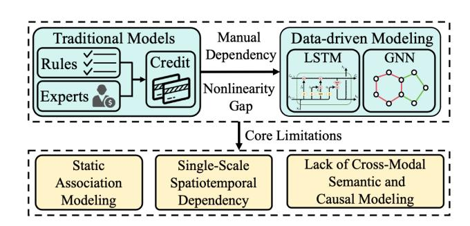
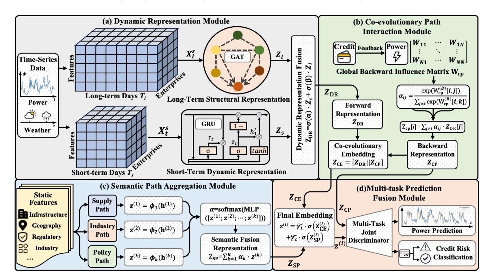
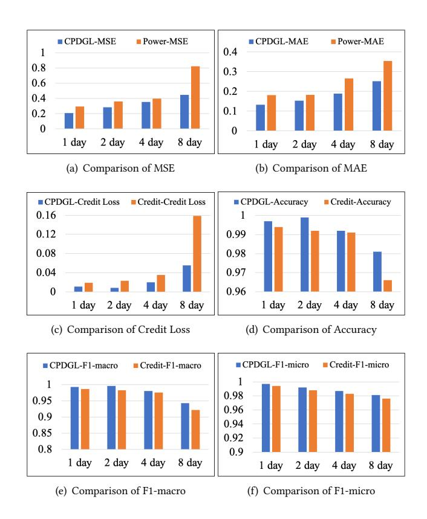

# Credit and Power Co-evolution Modeling with Dynamic Graph Learning

[Wenhao Ying](https://orcid.org/0009-0005-7875-9134) 21110980013@m.fudan.edu.cn Fudan University Shanghai, China

[Peng Zhu](https://orcid.org/0000-0001-9558-3787)∗ pengzhu@tongji.edu.cn Tongji University Shanghai, China

[Mingzhe Li](https://orcid.org/0009-0007-5464-4441) 2250931@tongji.edu.cn Tongji University Shanghai, China

[Ziyan Wang](https://orcid.org/0009-0004-1380-4347) wangziyan@tongji.edu.cn Tongji University Shanghai, China

[Dawei Cheng](https://orcid.org/0000-0002-5877-7387) dcheng@tongji.edu.cn Tongji University Shanghai, China

# Abstract

Accurate enterprise power consumption forecasting is not only a core component of optimized green energy management but also a key support for promoting the coordinated development of a sustainable society and the digital economy. The temporal fluctuations in power consumption reflect an enterprise's production activity and operational resilience, while credit assessment combined with Web data reveals a two-way coupling relationship between it and energy use: credit changes influence financing and power consumption strategies, while energy anomalies may become early signals of credit risk. However, existing methods still have shortcomings in modeling the co-evolution of Web data and power data. Most models only focus on static or unidirectional correlations, making it difficult to capture the dynamic feedback between credit risk and power consumption; traditional multi-task learning frameworks often rely on parameter sharing or simple attention mechanisms, lacking consistency constraints across time scales and network structures. To address this, this paper proposes CPDGL, a creditelectricity co-evolution framework based on dynamic graph learning, which simultaneously performs power forecasting and credit risk assessment within a unified multi-task system. Its co-evolution path interaction module explicitly models the feedback loop between credit dynamics and power behavior, learning bidirectional causal relationships through an adaptive influence matrix; the semantic path aggregation module integrates static and dynamic features, strengthening cross-modal expression and global reasoning capabilities. Large-scale experiments conducted in a real-world enterprise environment of one of the world's largest power suppliers demonstrate that CPDGL achieves state-of-the-art performance in both power forecasting and credit assessment tasks. The results validate its broad applicability in multi-source Web data fusion scenarios, significantly improving forecasting accuracy and dispatch efficiency in clean energy management, and showcasing practical value and social impact in smart cities and sustainable development.

∗Corresponding author.

© 2026 Copyright held by the owner/author(s). ACM ISBN 979-8-4007-2307-0/2026/04 <https://doi.org/10.1145/3774904.3792989>

## CCS Concepts

• Information systems → Data mining; • Computing methodologies → Artificial intelligence.

# Keywords

Power Consumption Forecasting, Credit Risk Assessment, Dynamic Graph Learning, Co-evolution Modeling

### ACM Reference Format:

Wenhao Ying, Peng Zhu, Mingzhe Li, Ziyan Wang, and Dawei Cheng. 2026. Credit and Power Co-evolution Modeling with Dynamic Graph Learning. In Proceedings of the ACM Web Conference 2026 (WWW '26), April 13–17, 2026, Dubai, United Arab Emirates. ACM, New York, NY, USA, [10](#page-9-0) pages. <https://doi.org/10.1145/3774904.3792989>

# 1 Introduction

In the modern digital economy, corporate power consumption behavior has become a key indicator of economic activity and sustainable development [\[2,](#page-8-0) [5\]](#page-8-1). Accurate power consumption forecasting not only serves as a core element of optimized green energy management but also provides crucial support for the coordinated development of the digital economy and a sustainable society [\[24\]](#page-8-2). The temporal fluctuations in electricity use directly reflect a company's production activity and operational resilience, serving as an important indicator for assessing its operational stability and energy efficiency [\[25\]](#page-8-3). Furthermore, it is a significant signal of macroeconomic health, supply chain efficiency, and regional energy load dynamics. Refined analysis of corporate power patterns reveals microstructural economic changes, facilitating energy dispatch optimization, carbon monitoring, and SDG quantification.

However, corporate electricity behavior does not exist in isolation but is deeply intertwined with its financial credit system. Web data–driven credit assessment reveals a profound interconnection between power consumption and financial activities: changes in credit status can influence financing capacity, production planning, and power usage strategies, while abnormal fluctuations in energy consumption may serve as early indicators of credit risk. This bidirectional coupling indicates that corporate credit and power behavior are not independent dimensions but dynamically interact through feedback mechanisms, jointly shaping a firm's operational risk profile and sustainability performance. Related empirical studies further confirm this relationship: enterprises with cleaner and more stable power consumption patterns tend to exhibit higher

[This work is licensed under a Creative Commons Attribution 4.0 International License.](https://creativecommons.org/licenses/by/4.0) WWW '26, Dubai, United Arab Emirates

Figure 1: Traditional credit evaluation models depend on manual rules and expert heuristics, limiting adaptability. Despite progress with LSTM and GNN, existing methods still suffer from static associations, single-scale dependencies, and weak cross-modal causal modeling.

operational reliability and lower default risk [\[35\]](#page-8-4), whereas credit deterioration often leads to reduced power consumption or delayed energy efficiency investments, thereby exacerbating instability in power consumption [\[7,](#page-8-5) [16\]](#page-8-6). As high-resolution data from smart grids and digital finance systems continue to emerge, this credit–energy interaction provides a solid foundation and new research opportunity for developing cross-domain artificial intelligence models capable of capturing dynamic dependencies and causal feedback mechanisms.

Traditional enterprise credit evaluation primarily relies on rulebased systems and expert-driven analysis, determining credit ratings through financial ratios [\[8,](#page-8-7) [13\]](#page-8-8), repayment records, and qualitative scoring schemes [\[43\]](#page-8-9). While interpretable and compliant, these approaches struggle with the dynamic evolution of enterprise operations and power consumption [\[1\]](#page-8-10). Their reliance on manual feature engineering overlooks nonlinear dependencies and temporal variations, limiting both generalization and adaptability. In recent years, data-driven deep learning methods have emerged to uncover the latent coupling mechanisms between credit risk and enterprise behaviors [\[15,](#page-8-11) [20\]](#page-8-12). For example, CNN–LSTM architectures can jointly capture temporal trends and local patterns [\[26\]](#page-8-13), while ResNet–LSTM frameworks effectively mitigate class imbalance and enhance robustness [\[52\]](#page-9-1). Graph Neural Networks (GNNs) [\[12,](#page-8-14) [57\]](#page-9-2) have also shown strong potential in modeling complex structural dependencies among enterprises [\[18,](#page-8-15) [28\]](#page-8-16). However, as illustrated in Figure [1,](#page-1-0) these methods still suffer from three core limitations. First, by treating credit and energy behaviors as independent processes, existing methods lack a unified framework for their co-evolution and dynamic feedback, failing to capture the reciprocal influence between credit fluctuations and energy anomalies. Second, confined to single-scale temporal modeling or shallow feature fusion, they struggle to represent hierarchical dependencies across time scales and inter-firm networks, constraining the understanding of systemic risk propagation. Finally, despite integrating multi-source heterogeneous data, they generally lack modeling of cross-modal semantic interactions and causal pathways, resulting in limited predictive accuracy and interpretability.

To overcome the aforementioned limitations, this paper proposes CPDGL, a credit–power dynamic graph learning framework designed to model the co-evolution between enterprise credit risk and

power consumption. Within a unified spatiotemporal learning architecture, CPDGL explicitly captures the dynamic feedback loops between credit dynamics and power behaviors, achieving comprehensive improvements in forecasting accuracy. The dynamic representation module mitigates the single-scale limitation of traditional models by integrating gated recurrent units (GRU) for short-term temporal dynamics with a graph attention network (GAT) for long-term structural reasoning. The co-evolution path interaction module addresses the inability of existing approaches to capture the reverse impact of credit changes on energy behaviors. It introduces a learnable risk impact matrix coupled with an attentiondriven causal inference mechanism, enabling explicit modeling of the feedback pathway between credit dynamics and subsequent energy consumption, thus realizing adaptive modeling of crossdomain dependencies. Furthermore, the semantic path aggregation module addresses the heterogeneity of multi-source data by introducing cross-modal path grouping and a semantic attention fusion mechanism. Extensive experiments conducted on real-world enterprise datasets from one of the world's largest power suppliers demonstrate that CPDGL significantly outperforms state-of-the-art baselines in both electricity load forecasting and credit risk evaluation. The results validate the model's effectiveness and robustness in capturing co-evolutionary dynamics within complex, heterogeneous systems. Moreover, CPDGL has been successfully deployed in a smart city energy management platform, effectively supporting clean energy scheduling and low-carbon financial governance, showcasing its broad applicability in industrial-scale sustainable systems. The main contributions are summarized as follows:

- To the best of our knowledge, this is the first work to jointly model the co-evolution between enterprise power consumption and credit risk within a unified dynamic framework, offering a novel perspective for credit assessment and risk management in energy-intensive industries.
- CPDGL introduces an innovative dynamic-graph architecture that models feedback-driven dependencies between credit and power consumption through co-evolution path modeling and cross-modal semantic aggregation.
- We validate the proposed framework using large-scale enterprise data from one of the world's largest power companies, showing significant improvements in both predictive accuracy and credit scoring performance. Furthermore, the model's deployment in a smart grid platform demonstrates its practical value for clean energy optimization and lowcarbon financial governance.

## 2 Related Work

## 2.1 Corporate Credit Rating

Credit rating underpins enterprise financing, investment, and systemic risk management [\[11\]](#page-8-17). Recently, deep learning has emerged as the dominant approach for modeling its complex dynamics and nonlinear dependencies [\[27,](#page-8-18) [40\]](#page-8-19). Early studies leveraged recurrent architectures (e.g., LSTM, GRU) to capture temporal evolution, with Asl et al. [\[3\]](#page-8-20) proposing a hybrid model for dynamic trading and credit transitions. To move beyond isolated modeling, researchers adopted graph-based approaches to capture inter-enterprise dependencies. Feng et al. [\[18\]](#page-8-15) introduced CCR-GNN for systemic risks,

Figure 2: The architecture of the proposed model CPDGL. The Dynamic Representation Module (a) models the dynamic and structural dependencies of enterprise power across multiple temporal scales. The Co-evolutionary Path Interaction Module (b) is designed to capture potential reverse influences and causal mechanisms. The Semantic Path Aggregation Module (c) integrates multi-source static information to construct comprehensive enterprise profiles. The Multi-task Prediction Fusion Module (d) performs joint task learning to enable both future enterprise-level power forecasting and credit rating inference.

while Wei et al. [\[47\]](#page-8-21) proposed a dimension-level attention mechanism for interpretable analysis. Recent studies further integrate multi-modal and heterogeneous information for a more holistic view of enterprise creditworthiness. Tavakoli et al. [\[41\]](#page-8-22) integrated textual disclosures with structured financial data to enhance precision. Chen et al. [\[10\]](#page-8-23) leveraged blockchain and IoT records within an attention-enhanced CNN for reliable scoring. Xia et al. [\[49\]](#page-8-24) leveraged supervised contrastive learning to align behavioral embeddings. Meanwhile, Zhang et al. [\[54\]](#page-9-3) modeled SME transaction and social networks to predict defaults, offering scalable regulatory tools. While advancing feature fusion and relational modeling, prior studies overlook the co-evolutionary feedback between credit and behavior. By treating this relationship as unidirectional, they neglect how credit shifts reshape operations and energy use. To bridge this gap, we propose a dynamic, feedback-aware, and causality-guided framework that jointly models the bidirectional evolution of credit risk and enterprise energy behavior.

# 2.2 Co-evolution Modeling

Recent studies on co-evolution modeling have primarily focused on the synergistic evolution of network structures, behavioral dynamics, and temporal dependencies. Snijders et al. [\[39\]](#page-8-25) and Gross et al. [\[19\]](#page-8-26) pioneered the bidirectional coupling of network structure and individual behavior. However, their reliance on parametric

assumptions limits generalization to large-scale, heterogeneous environments. Farajtabar et al. [\[17\]](#page-8-27) proposed a temporal point process framework to jointly model information diffusion and network evolution. Similarly, Dai et al. [\[14\]](#page-8-28) introduced a co-evolutionary latent feature model for user-item representations. However, both approaches are limited to single-scale temporal dynamics and unimodal features, lacking support for multi-scale structures and crossmodal dependencies. In the domain of dynamic graph neural networks, Trivedi et al. [\[42\]](#page-8-29) proposed DyRep, a dual-timescale point process framework utilizing temporal attention for co-evolving graphs. Pareja et al. [\[33\]](#page-8-30) introduced EvolveGCN, which uses RNNs to dynamically update GCN parameters. Meanwhile, Sankar et al. [\[36\]](#page-8-31) developed DySAT, leveraging dual self-attention across structural and temporal dimensions. While advancing co-evolutionary modeling, existing methods typically rely on unimodal inputs, overlooking cross-domain causal feedback and semantic interactions. To address this, we propose CPDGL, which explicitly models creditpower co-evolution, capturing cross-modal bidirectional feedback and multi-scale spatiotemporal dependencies.

# 3 The Proposed Method CPDGL

As illustrated in Figure [1,](#page-1-0) we present CPDGL, a unified framework for electricity load forecasting and credit risk reasoning.

encodes, and adaptively fuses heterogeneous attributes. By explicitly modeling semantic dependency paths and applying cross-path attention, the module transforms static multi-domain features into unified, task-adaptive representations, improving discriminability and interpretability in enterprise decision modeling.

3.3.1 Group-wise Modeling of Heterogeneous Semantic Paths. Naively concatenating heterogeneous attributes can cause semantic interference and reduce interpretability. To address this, we organize static enterprise features into semantic path groups, each representing a distinct dimension of long-term structural dependency within the energy–finance ecosystem. Within each path group, categorical variables are processed through embedding layers, while numerical attributes are linearly projected into a unified latent dimension. The normalized weighted average of projected features yields the group-level representation h (��) = NormAvg(E (��) ) ∈ R �� , where �� indexes the path group and �� is the embedding dimension.

3.3.2 Semantic Encoding of Path Groups. Each group-level embedding h (��) is further transformed using a group-specific semantic encoder, implemented as a non-linear projection function to capture within-group feature interactions z (��) = ���� (h (��) ) = W��h (��) + b�� , where ���� denotes the semantic transformation for the ��-th path, parameterized by W�� and bias b�� . This design enhances the expressiveness of each semantic group and preserves the distinct semantics of energy structure, industrial affiliation, and credit policy relevance before cross-path fusion.

3.3.3 Cross-Path Attention Fusion Mechanism. Since different semantic paths contribute unequally to enterprise-level outcomes, we employ a cross-path attention mechanism to adaptively learn their relative importance under different task contexts (e.g., power forecasting vs. credit scoring). All encoded path representations are concatenated and passed through a two-layer perceptron to compute attention weights �� = Softmax(MLP( [z (1) ; z (2) ; · · · ; z (��) ])) ∈ R �� . The final semantic fusion representation is then obtained by an attention-weighted sum:

ZSP = ∑︁�� ��=1 ���� · z (��) (7)

This mechanism provides two key benefits: it enables adaptive semantic weighting, allowing the model to emphasize policy-related or energy-intensive attributes depending on the prediction task, and offers interpretable decision guidance, as the attention coefficients ���� directly quantify each path group's contribution, ensuring transparency for sustainable financial and energy governance. The aggregated representation ZSP thus serves as a static complement to the dynamic embeddings from the co-evolutionary path interaction module, achieving a balanced integration of long-term structural semantics and short-term behavioral dynamics within the unified multi-task learning framework.

## 3.4 Multi-task Prediction Fusion Module

To jointly exploit static semantic priors, dynamic behavioral signals, and causal feedback pathways, the multi-task prediction fusion module integrates the outputs from previous modules into a unified end-to-end learning framework. This design enables joint optimization for both enterprise power forecasting and credit risk

classification, balancing short-term behavioral reactivity, long-term structural stability, and sustainability-aware inference.

3.4.1 Representation Fusion. During forward propagation, the module first collects two intermediate embeddings: the co-evolutionary embedding Z (��) CE ∈ R �� , which integrates dynamic and feedback representations from the co-evolutionary path interaction module; and the semantic static embedding Z (��) SP ∈ R �� , encoding long-term heterogeneous enterprise priors. To ensure flexible and interpretable fusion, the learnable coefficients ��1 and ��2 are normalized via sigmoid activation for comparable weighting, as defined in ��˜�� = �� (���� ) Í2 ��=1 �� (���� ) . The final enterprise-level embedding is obtained through a soft attention-based weighted combination:

z (��) = ��˜1 · ��(Z CE) +��˜2 · ��(Z (��) SP ). (8)

This adaptive fusion allows the model to dynamically emphasize either structural causality, semantic priors, or behavioral dynamics depending on the data context and task objective. In practice, ��˜�� values can be analyzed post-training to interpret which information stream contributes most to each enterprise's risk profile, providing transparent and explainable decision support.

3.4.2 Multi-Task Joint Discriminator. Based on the fused representation z , CPDGL jointly performs electricity load forecasting and credit risk scoring using a shared backbone with dual prediction heads. While the power forecasting branch directly utilizes z (��) , the credit scoring branch further concatenates the feedback-aware embedding Z (��) CP to incorporate inter-enterprise credit dependencies:

��ˆ (��) power, ��ˆ (��) risk = MLPpred (z , Z (��) CP ), (9)

where MLPpred denotes a multi-branch predictor producing both continuous and categorical outputs. ��ˆ power and ��ˆ risk denote the predicted electricity load and credit risk, respectively. �� (��) power and �� risk represent their corresponding ground-truth labels. For the power forecasting task, the training objective minimizes the mean squared error:

Lpower = 1 �� ∑︁�� ��=1 ��ˆ (��) power − �� (��) power2 (10)

For credit risk classification, we apply the cross-entropy loss:

Lrisk = − ∑︁�� ��=1 h �� (��) risk log��ˆ (��) risk + (1 − �� (��) risk) log(1 − ��ˆ risk) (11)

The overall optimization objective aggregates the two losses:

Ltotal = ��powerLpower + ��riskLrisk, (12)

where ��power and ��risk are task-balancing weights adaptively tuned during training to prevent task dominance and improve generalization. All model components, including sequence encoders, attentionbased reasoning matrices, semantic transformers, and fusion coefficients, are updated jointly in an end-to-end fashion through backpropagation. This holistic optimization enables CPDGL to learn consistent representations that link power behavior and credit status across temporal, structural, and semantic dimensions.

Table 1: The results of the unified hyperparameters for the dataset include a variety of competitive models across different prediction horizons. The averages are computed from the four prediction lengths. The best performance is highlighted in bold.

|     |    | Metric Method | MSE   | MAE CPDGL   | MSE   | MAE WPMixer | MSE   | MAE TimeMixer++ | MSE   | MAE Time-MoE | MSE   | MAE Pathformer | MSE   | MAE TimeXer | MSE   | MAE TimeMixer | MSE   | MAE iTransformer | MSE   | MAE PatchTST |
|-----|----|---------------|-------|-------------|-------|-------------|-------|-----------------|-------|--------------|-------|----------------|-------|-------------|-------|---------------|-------|------------------|-------|--------------|
| 96  | (1 | day)          | 0.209 | 0.133       | 0.222 | 0.287       | 0.241 | 0.296           | 0.324 | 0.351        | 0.273 | 0.302          | 0.246 | 0.294       | 0.256 | 0.304         | 0.245 | 0.289            | 0.267 | 0.308        |
| 192 | (2 | day)          | 0.286 | 0.153       | 0.304 | 0.351       | 0.312 | 0.336           | 0.426 | 0.524        | 0.344 | 0.345          | 0.298 | 0.332       | 0.319 | 0.348         | 0.304 | 0.328            | 0.337 | 0.353        |
| 384 | (4 | day)          | 0.354 | 0.189       | 0.365 | 0.385       | 0.380 | 0.385           | 0.522 | 0.627        | 0.437 | 0.395          | 0.371 | 0.376       | 0.397 | 0.397         | 0.384 | 0.377            | 0.418 | 0.402        |
| 768 | (8 | day)          | 0.449 | 0.252       | 0.458 | 0.436       | 0.526 | 0.456           | 0.694 | 0.807        | 0.510 | 0.438          | 0.468 | 0.428       | 0.479 | 0.440         | 0.477 | 0.429            | 0.497 | 0.444        |
|     |    | Avg           | 0.325 | 0.182       | 0.337 | 0.365       | 0.365 | 0.368           | 0.492 | 0.577        | 0.391 | 0.370          | 0.346 | 0.358       | 0.363 | 0.372         | 0.353 | 0.356            | 0.380 | 0.377        |
|     |    | Method        |       | CrossFormer |       | TimesNet    |       | DLinear         |       | FEDformer    |       | Stationary     |       | CrossGNN    |       | FourierGNN    |       | StemGNN          |       | AGCRN        |
| 96  | (1 | day)          | 0.264 | 0.310       | 0.288 | 0.319       | 0.277 | 0.333           | 0.322 | 0.392        | 0.296 | 0.324          | 0.275 | 0.319       | 0.308 | 0.359         | 0.258 | 0.306            | 0.287 | 0.316        |
| 192 | (2 | day)          | 0.339 | 0.361       | 0.330 | 0.346       | 0.346 | 0.385           | 0.379 | 0.429        | 0.337 | 0.347          | 0.344 | 0.363       | 0.376 | 0.407         | 0.335 | 0.365            | 0.369 | 0.366        |
| 384 | (4 | day)          | 0.433 | 0.419       | 0.402 | 0.386       | 0.423 | 0.441           | 0.433 | 0.460        | 0.397 | 0.382          | 0.422 | 0.423       | 0.457 | 0.464         | 0.406 | 0.409            | 0.425 | 0.410        |
| 768 | (8 | day)          | 0.554 | 0.487       | 0.468 | 0.422       | 0.488 | 0.482           | 0.527 | 0.515        | 0.501 | 0.437          | 0.498 | 0.465       | 0.535 | 0.518         | 0.496 | 0.477            | 0.536 | 0.473        |
|     |    | Avg           | 0.398 | 0.394       | 0.372 | 0.368       | 0.384 | 0.410           | 0.415 | 0.449        | 0.383 | 0.373          | 0.385 | 0.393       | 0.419 | 0.437         | 0.374 | 0.389            | 0.404 | 0.391        |

### 4 Experiments

### 4.1 Experimental Settings

4.1.1 Dataset and Preprocessing. The dataset used in this study contains electricity consumption time series, static enterprise attributes, environmental variables, and credit risk labels for 818 companies across multiple industries. Each enterprise has daily power curves with 96 time steps (15-minute intervals) spanning over 300 days. Static features, such as power configuration, industry type, location, and registration data, are grouped into three semantic paths: the supply-chain path (e.g., voltage level, contract capacity), the industry aggregation path (e.g., industry category, regional clustering), and the policy-guided path (e.g., credit rating, electricity usage type). The dataset also includes weather factors (temperature, humidity) and credit ratings from regulatory sources. A multi-scale sliding window is applied to construct training samples, where short-term and long-term branches capture local variations and broader historical patterns, respectively. Each sample is paired with its subsequent-day load curve for supervised learning. Static attributes are embedded and normalized into a unified feature space, while an industry-level similarity adjacency matrix encodes inter-firm relationships based on shared sector and operational proximity, allowing the model to capture cross-enterprise dependencies among all 818 companies.

4.1.2 Baseline Models. We compare CPDGL with seventeen baseline models, which are divided into two categories. The temporal models include WPMixer [\[31\]](#page-8-33), TimeMixer++ [\[44\]](#page-8-34), Time-MoE [\[37\]](#page-8-35), Pathformer [\[9\]](#page-8-36), TimeXer [\[46\]](#page-8-37), TimeMixer [\[45\]](#page-8-38), iTransformer [\[29\]](#page-8-39), PatchTST [\[32\]](#page-8-40), Crossformer [\[53\]](#page-9-4), TimesNet [\[48\]](#page-8-41), DLinear [\[51\]](#page-9-5), FEDformer [\[56\]](#page-9-6), and Stationary [\[30\]](#page-8-42). The graph models include Cross-GNN [\[22\]](#page-8-43), FourierGNN [\[50\]](#page-9-7), StemGNN [\[6\]](#page-8-44), and AGCRN [\[4\]](#page-8-45).

4.1.3 Parameter Settings. For quantitative evaluation, power forecasting is measured using Mean Squared Error (MSE) and Mean Absolute Error (MAE), while credit risk classification is assessed using cross-entropy loss, Accuracy, Macro-F1, and Micro-F1 scores. The model is trained end-to-end using the Adam optimizer with a fixed learning rate of 1 × 10−4 . Both the GRU and GAT components consist of a single computational layer, and the hidden dimension

for both modules is uniformly set to 64. Power forecasting employs the MSE objective, and credit classification adopts the cross-entropy objective, combined through an adaptive loss-weighting scheme to dynamically balance the learning dynamics of both tasks. Each training sample contains multi-scale temporal inputs: the shortterm branch encodes recent daily fluctuations (past 1 day), while the long-term branch aggregates weekly temporal trends (past 7 days) to predict electricity demand for the next 1, 2, 4, and 8 days.

### 4.2 Experimental Results

We comprehensively evaluate CPDGL against diverse baselines for enterprise electricity load forecasting, with results summarized in Table [1](#page-5-0) across four horizons (96, 192, 384, and 768 steps). Across all horizons, CPDGL consistently achieves the lowest Mean Squared Error (MSE) and Mean Absolute Error (MAE), demonstrating strong capability in modeling temporal–structural dependencies. Specifically, it records MSEs of (0.209, 0.286, 0.354, 0.449) and MAEs of (0.133, 0.153, 0.189, 0.252) for different day forecasts, clearly outperforming all time-series and GNN baselines. On average, CPDGL achieves 0.325 MSE and 0.182 MAE, surpassing advanced models such as TimeMixer++ (0.365/0.368) and iTransformer (0.353/0.356). While existing temporal models effectively capture short-term patterns, they fail to model heterogeneous inter-enterprise relations and evolving structures. Compared with representative GNNs (e.g., CrossGNN, FourierGNN), CPDGL maintains higher robustness over long horizons, alleviating the degradation typical in extended forecasts. The gap widens with horizon length. At 8 days, MSE and MAE drop by over 15% and 20% versus TimeMixer++ and Cross-Former. In contrast, linear models like DLinear and FEDformer struggle in heterogeneous industrial data (MSE 0.527, MAE 0.515). These results confirm that CPDGL's dynamic multi-scale graph structure learning, leveraging GRU and GAT backbones, enhances both short-term responsiveness and long-term stability.

Traditional credit classification approaches, such as Logistic Regression, Random Forest, and XGBoost, mainly rely on static enterprise attributes and handcrafted feature interactions. While these methods have been extensively studied, they inherently lack the ability to capture dynamic behavioral patterns and cross-enterprise causal feedback, which are crucial in modeling real-world credit

Table 2: Performance comparison of the CPDGL model under different hidden dimensions (32, 64, 128, 256) across regression (MSE, MAE) and classification (Credit Loss, Accuracy, F1-macro, F1-micro) tasks.

| Parameter | 1     | day 2 | MSE day 4   | day 8 | day 1 | day 2 | MAE day 4 | day 8 day |
|-----------|-------|-------|-------------|-------|-------|-------|-----------|-----------|
| 32        | 0.276 | 0.334 | 0.392       | 0.511 | 0.172 | 0.180 | 0.218     | 0.428     |
| 64        | 0.209 | 0.286 | 0.354       | 0.449 | 0.133 | 0.153 | 0.189     | 0.252     |
| 128       | 0.266 | 0.384 | 0.399       | 0.594 | 0.151 | 0.209 | 0.257     | 0.262     |
| 256       | 0.327 | 0.403 | 0.449       | 0.569 | 0.167 | 0.232 | 0.252     | 0.269     |
| Parameter |       |       | Credit Loss |       |       |       | Accuracy  |           |
|           | 1     | day 2 | day 4       | day 8 | day 1 | day 2 | day 4     | day 8 day |
| 32        | 0.016 | 0.030 | 0.048       | 0.081 | 0.995 | 0.989 | 0.982     | 0.969     |
| 64        | 0.008 | 0.011 | 0.020       | 0.055 | 0.998 | 0.997 | 0.992     | 0.980     |
| 128       | 0.019 | 0.025 | 0.035       | 0.068 | 0.995 | 0.994 | 0.989     | 0.978     |
| 256       | 0.056 | 0.049 | 0.056       | 0.085 | 0.991 | 0.985 | 0.981     | 0.968     |
| Parameter |       |       | F1-macro    |       |       |       | F1-micro  |           |
|           | 1     | day 2 | day 4       | day 8 | day 1 | day 2 | day 4     | day 8 day |
| 32        | 0.988 | 0.973 | 0.955       | 0.925 | 0.995 | 0.989 | 0.982     | 0.969     |
| 64        | 0.996 | 0.993 | 0.981       | 0.946 | 0.998 | 0.997 | 0.992     | 0.980     |
| 128       | 0.992 | 0.987 | 0.973       | 0.942 | 0.995 | 0.994 | 0.989     | 0.978     |
| 256       | 0.975 | 0.961 | 0.958       | 0.924 | 0.991 | 0.985 | 0.981     | 0.968     |

risks. Since CPDGL integrates temporal, structural, and semantic dependencies within a unified end-to-end framework, it generalizes beyond conventional classifiers that operate only on tabular or aggregated features. For this reason, we focus our evaluation on multi-task deep learning baselines rather than static classifiers. Nevertheless, our preliminary experimental results show that for the 1-, 2-, 4-, and 8-day prediction tasks, CPDGL achieves F1-macro scores of 0.996, 0.993, 0.981, and 0.946, and F1-micro scores of 0.998, 0.997, 0.992, and 0.980, respectively. In contrast, the XGBoost model attains lower F1-macro values of 0.983, 0.975, 0.962, and 0.920, and F1-micro values of 0.986, 0.979, 0.969, and 0.918. Overall, CPDGL consistently outperforms XGBoost and other feature-based models across all forecasting horizons, demonstrating its superior capability in capturing sustainability-driven enterprise credit dynamics.

### 4.3 Parameter Sensitivity

To evaluate the robustness of CPDGL with respect to model capacity, we conduct a series of sensitivity analyses over the hidden layer dimension ��ℎ ∈ {32, 64, 128, 256}, as summarized in Table [2.](#page-6-0) The model achieves its optimal overall performance at ��ℎ = 64, consistently yielding the lowest errors and highest classification scores across all prediction horizons. For instance, in the 8-day forecasting scenario, the 64-dimensional configuration attains an MSE of 0.449 and an MAE of 0.252, outperforming other settings by a statistically significant margin. When ��ℎ increases to 128 or 256, performance shows slight degradation in both regression and classification metrics, likely due to overfitting and noise amplification caused by excessive representation capacity. Conversely, reducing ��ℎ to 32 leads to an evident loss of expressive power, resulting in substantially higher errors. Classification tasks exhibit a consistent trend: the 64-dimensional configuration yields the best macro-F1 and micro-F1 scores, whereas higher or lower dimensions lead to moderate declines. These results demonstrate that a moderate hidden

Figure 3: Task-level comparison of ablation study. CPDGL consistently outperforms single-task models in both power load forecasting and credit scoring.

dimensionality achieves the best trade-off between representational richness and generalization stability, allowing CPDGL to effectively capture the co-evolutionary dynamics between electricity load and credit risk without incurring over-parameterization.

### 4.4 Ablation Study

4.4.1 Task-Level Comparison. We first compare CPDGL with two single-task variants: one performing power load forecasting (Poweronly) and the other performing credit scoring (Credit-only). As shown in Figure 3, CPDGL consistently outperforms its single-task counterparts across all evaluation metrics. In the power forecasting task, the specific experimental comparison results are shown in Figures 3(a) and 3(b). CPDGL significantly reduces the MSE and MAE, with this advantage becoming more pronounced as the forecast horizon lengthens. For example, over an 8-day forecast period, the MSE dropped from 0.823 of the Power-only approach to 0.449, and the MAE also dropped from 0.304 to 0.252, demonstrating stronger long-term forecast robustness. In the credit risk assessment task, the specific experimental comparison results are shown in Figures 3(c), 3(d), 3(e), and 3(f). CPDGL also demonstrates a clear advantage. Its credit loss is lower than that of the single-task model across all forecast horizons. Furthermore, CPDGL improves classification accuracy, F1-macro, and F1-micro scores, with the performance gap becoming more pronounced at longer forecast horizons.

Table 3: Module-level, multi-task, and graph encoder Comparison of ablation study.

|           | MSE   | MAE   | Credit | Loss Accuracy | F1-macro | F1-micro |
|-----------|-------|-------|--------|---------------|----------|----------|
| w/o DR    | 0.228 | 0.139 | 0.010  | 0.991         | 0.987    | 0.991    |
| w/o CE    | 0.234 | 0.145 | 0.013  | 0.985         | 0.972    | 0.985    |
| w/o SP    | 0.223 | 0.135 | 0.009  | 0.994         | 0.989    | 0.994    |
| MT-GCN    | 0.224 | 0.137 | 0.010  | 0.992         | 0.989    | 0.992    |
| DCRNN     | 0.219 | 0.136 | 0.009  | 0.995         | 0.992    | 0.995    |
| GCN       | 0.242 | 0.145 | 0.014  | 0.990         | 0.974    | 0.990    |
| GraphSAGE | 0.231 | 0.139 | 0.009  | 0.993         | 0.984    | 0.993    |
| CPDGL     | 0.209 | 0.133 | 0.008  | 0.998         | 0.996    | 0.998    |

4.4.2 Module-Level Comparison. We construct three ablated variants to evaluate the contribution of each module: w/o DR (removing the dynamic GRU–GAT encoder), w/o CE (removing the coevolutionary feedback mechanism), and w/o SP (removing the static semantic fusion module). As shown in Table [3,](#page-7-0) removing any component results in a consistent decline across both forecasting and classification metrics. Without the dynamic encoder (w/o DR), the MSE increases from 0.209 to 0.228, and Macro-F1 drops from 0.996 to 0.987. Removing co-evolutionary reasoning (w/o CE) causes the sharpest degradation, with MSE rising by 12% and Macro-F1 falling by 2.4 points, confirming that backward credit-to-power feedback is crucial for capturing inter-domain causality. Eliminating semantic fusion (w/o SP) slightly affects MSE but still leads to a 0.7-point F1 drop, showing that static structural information reinforces multientity consistency. Overall, these ablations verify that each module plays a complementary role in multi-task synergy.

4.4.3 Multi-Task Comparison. We further compare CPDGL with two representative multi-task learning paradigms: MT-GCN [\[38\]](#page-8-46) and DCRNN [\[55\]](#page-9-8). As seen in Table [3,](#page-7-0) while both improve task balance over naive single-task training, CPDGL surpasses them notably, achieving the lowest MSE, smallest credit loss, and highest Macro-F1. These results highlight that CPDGL's causal co-evolution mechanism provides a more principled form of task interaction than heuristic gradient balancing, leading to tighter integration between load forecasting and credit prediction.

4.4.4 Graph Encoder Comparison. To assess the robustness of the structural encoder, we substitute the GAT backbone with two popular alternatives: GCN [\[23\]](#page-8-47) and GraphSAGE [\[21\]](#page-8-48). All other modules remain identical. As shown in Table [3,](#page-7-0) both replacements degrade performance across all metrics. MSE rises from 0.209 to 0.242 (GCN) and 0.231 (GraphSAGE), while Macro-F1 decreases from 0.996 to 0.974 and 0.984, respectively. This confirms that GAT's attentionbased message passing better captures inter-enterprise heterogeneity and adaptive dependency weighting than fixed-aggregation GCN or mean-based GraphSAGE.

## 4.5 Case Study and Deployment

CPDGL reveals the hidden relationship between credit changes and dynamic electricity consumption. Figure [4](#page-7-1) compares traditional static models with the CPDGL dynamic network model when a core manufacturer (Company B) experiences a "credit decline" triggering event within its supply chain relationship with supplier Company A. The traditional model adopts an isolated viewpoint,

Figure 4: The credit downgrades and their impact on electricity consumption across interconnected enterprises.

failing to recognize financial constraints on production or company interdependence. It incorrectly predicts B's energy consumption as "normal" and A's as unchanged, completely omitting the chain reaction. In contrast, the CPDGL model applies a dynamic network perspective to understand credit-energy co-evolution and supply chain connections. It successfully predicts a "sharp decrease" in B's energy due to production cuts and accurately captures the subsequent "decrease" for upstream Company A caused by reduced orders. The core conclusion is that only network-aware models can effectively predict complex systemic cascading failures, whereas isolated static models miss these key risks.

Although CPDGL integrates multiple modules, its runtime and memory complexity remain tractable. The GRU–GAT hybrid encoder and the co-evolutionary feedback computation have linear or near-linear complexity with respect to the number of enterprises due to the sparsified backward influence matrix. Empirically, CPDGL increases runtime by only about 10% compared to a singletask GAT baseline under identical hardware settings, while improving both forecasting accuracy and classification F1 scores. This demonstrates that CPDGL maintains an efficient balance between predictive power and computational cost, making it suitable for large-scale deployment in enterprise energy and credit systems.

### 5 Conclusion

In this paper, we propose CPDGL, a dynamic graph learning-based multi-task model for jointly modeling enterprise electricity usage and credit risk. CPDGL captures bidirectional causal feedback between credit and power behavior via a co-evolutionary path interaction mechanism. It integrates GRU-based short-term dynamics with graph attention-based long-term dependencies to learn multiscale spatiotemporal representations. A semantic path aggregation module further enables the structured fusion of heterogeneous firm features. Extensive experiments on large-scale real-world data demonstrate that CPDGL consistently outperforms existing baselines in both power forecasting and credit classification. The model is also being deployed in one of the world's largest smart city power infrastructures, showcasing strong practical value in advancing clean energy governance and contributing to the long-term vision of sustainable and inclusive urban development.

- References [1] Hussein A Abdou and John Pointon. 2011. Credit scoring, statistical techniques and evaluation criteria: a review of the literature. Intelligent Systems in Accounting, Finance and Management (2011), 59–88. [2] Barış Armutcu, Rasim Zuferi, and Ahmet Tan. 2024. Green product consumption behaviour, green economic growth and sustainable development: unveiling the main determinants. Journal of Enterprising Communities: People and Places in the Global Economy (2024), 798–819. [3] Golnaz Sababipour ASL, Kiarash Shamsi, Ruppa K Thulasiram, Cuneyt Akcora, and Carson Leung. 2023. Deep Learning-Based Credit Score Prediction: Hybrid LSTM-GRU Model. In IEEE Symposium Series on Computational Intelligence. 395–
- 400. [4] Lei Bai, Lina Yao, Can Li, Xianzhi Wang, and Can Wang. 2020. Adaptive graph convolutional recurrent network for traffic forecasting. In Advances in Neural Information Processing Systems. 17804–17815. [5] Štefan Bojnec and Drago Papler. 2011. Economic efficiency, energy consumption and sustainable development. Journal of Business Economics and Management (2011), 353–374. [6] Defu Cao, Yujing Wang, Juanyong Duan, Ce Zhang, Xia Zhu, Congrui Huang, Yunhai Tong, Bixiong Xu, Jing Bai, Jie Tong, and Qi Zhang. 2020. Spectral temporal graph neural network for multivariate time-series forecasting. In Advances in Neural Information Processing Systems. 17766–17778. [7] Kai Chang, Yonghong Zeng, Weihong Wang, and Xin Wu. 2019. The effects of credit policy and financial constraints on tangible and research & development investment: Firm-level evidence from China's renewable energy industry. Energy policy (2019), 438–447. [8] Ning Chen, Bernardete Ribeiro, and An Chen. 2016. Financial credit risk assessment: a recent review. Artificial Intelligence Review (2016), 1–23. [9] Peng Chen, Yingying Zhang, Yunyao Cheng, Yang Shu, Yihang Wang, Qingsong Wen, Bin Yang, and Chenjuan Guo. 2024. Pathformer: Multi-scale transformers with adaptive pathways for time series forecasting. In International Conference on Learning Representations. 1–19. [10] Yajuan Chen, Zhihao Su, and Chenxi Su. 2025. High-Performance Computing-Embedded CIoT Framework for Enhanced Credit Risk Assessment Using BC and Attention-CNN. IEEE Transactions on Consumer Electronics (2025), 8374–8382. [11] Dawei Cheng, Zhibin Niu, Yi Tu, and Liqing Zhang. 2018. Prediction defaults for networked-guarantee loans. In International Conference on Pattern Recognition. 361–366. [12] Dawei Cheng, Yao Zou, Sheng Xiang, and Changjun Jiang. 2025. Graph neural networks for financial fraud detection: a review. Frontiers of Computer Science (2025), 199609. [13] Jonathan N Crook, David B Edelman, and Lyn C Thomas. 2007. Recent developments in consumer credit risk assessment. European Journal of Operational Research (2007), 1447–1465. [14] Hanjun Dai, Yichen Wang, Rakshit Trivedi, and Le Song. 2016. Deep coevolutionary network: Embedding user and item features for recommendation. In Neural Information Processing Systems. 1–9. [15] Sarah Darby et al. 2006. The effectiveness of feedback on energy consumption. A Review for DEFRA of the Literature on Metering, Billing and Direct Displays (2006),
- 26. [16] Stefano Di Virgilio, Ivan Faiella, Alessandro Mistretta, and Simone Narizzano. 2024. Assessing credit risk sensitivity to climate and energy shocks: Towards a common minimum standards in line with the ECB climate agenda. Journal of Policy Modeling (2024), 552–568. [17] Mehrdad Farajtabar, Yichen Wang, Manuel Gomez-Rodriguez, Shuang Li, Hongyuan Zha, and Le Song. 2017. Coevolve: A joint point process model for information diffusion and network evolution. Journal of Machine Learning Research (2017), 1–49. [18] Bojing Feng, Haonan Xu, Wenfang Xue, and Bindang Xue. 2022. Every corporation owns its structure: Corporate credit rating via graph neural networks. In Chinese Conference on Pattern Recognition and Computer Vision. 688–699. [19] Thilo Gross and Bernd Blasius. 2008. Adaptive coevolutionary networks: a review. Journal of the Royal Society Interface (2008), 259–271. [20] Amulya Gurtu and Jestin Johny. 2021. Supply chain risk management: Literature review. Risks (2021), 16. [21] Will Hamilton, Zhitao Ying, and Jure Leskovec. 2017. Inductive representation learning on large graphs. Advances in Neural Information Processing Systems, 1–11. [22] Qihe Huang, Lei Shen, Ruixin Zhang, Shouhong Ding, Binwu Wang, Zhengyang Zhou, and Yang Wang. 2023. Crossgnn: Confronting noisy multivariate time series via cross interaction refinement. Advances in Neural Information Processing Systems (2023), 46885–46902. [23] TN Kipf. 2016. Semi-supervised classification with graph convolutional networks. arXiv preprint arXiv:1609.02907 (2016). [24] Roman V Klyuev, Irbek D Morgoev, Angelika D Morgoeva, Oksana A Gavrina, Nikita V Martyushev, Egor A Efremenkov, and Qi Mengxu. 2022. Methods of forecasting electric energy consumption: A literature review. Energies (2022), 8919. [25] Robin Leisen, Bjarne Steffen, and Christoph Weber. 2019. Regulatory risk and the resilience of new sustainable business models in the energy sector. Journal of Cleaner Production (2019), 865–878. [26] Jingyuan Li, Caosen Xu, Bing Feng, and Hanyu Zhao. 2023. Credit risk prediction model for listed companies based on CNN-LSTM and attention mechanism. Electronics (2023), 1643. [27] Jiangtong Li, Ziyuan Zhou, Jingkai Zhang, Dawei Cheng, and Changjun Jiang. 2024. HFTCRNet: hierarchical fusion transformer for interbank credit rating and risk assessment. IEEE Transactions on Neural Networks and Learning Systems (2024), 13006–13020. [28] Jiaming Liu, Sicheng Zhang, and Haoyue Fan. 2022. A two-stage hybrid credit risk prediction model based on XGBoost and graph-based deep neural network. Expert Systems with Applications (2022), 116624. [29] Yong Liu, Tengge Hu, Haoran Zhang, Haixu Wu, Shiyu Wang, Lintao Ma, and Mingsheng Long. 2024. itransformer: Inverted transformers are effective for time series forecasting. In International Conference on Learning Representations. 1–25. [30] Yong Liu, Haixu Wu, Jianmin Wang, and Mingsheng Long. 2022. Non-stationary transformers: Exploring the stationarity in time series forecasting. In Advances in Neural Information Processing Systems. 9881–9893. [31] Md Mahmuddun Nabi Murad, Mehmet Aktukmak, and Yasin Yilmaz. 2025. Wpmixer: Efficient multi-resolution mixing for long-term time series forecasting. In AAAI Conference on Artificial Intelligence. 19581–19588. [32] Yuqi Nie, Nam H Nguyen, Phanwadee Sinthong, and Jayant Kalagnanam. 2023. A time series is worth 64 words: Long-term forecasting with transformers. In International Conference on Learning Representations. 1–34. [33] Aldo Pareja, Giacomo Domeniconi, Jie Chen, Tengfei Ma, Toyotaro Suzumura, Hiroki Kanezashi, Tim Kaler, Tao Schardl, and Charles Leiserson. 2020. Evolvegcn: Evolving graph convolutional networks for dynamic graphs. In AAAI Conference on Artificial Intelligence. 5363–5370. [34] Michael E Porter. 1979. The structure within industries and companies' performance. The Review of Economics and Statistics (1979), 214–227. [35] Maria Psillaki, Ioannis E Tsolas, and Dimitris Margaritis. 2010. Evaluation of credit risk based on firm performance. European journal of operational research (2010), 873–881. [36] Aravind Sankar, Yanhong Wu, Liang Gou, Wei Zhang, and Hao Yang. 2020. Dysat: Deep neural representation learning on dynamic graphs via self-attention networks. In International Conference on Web Search and Data Mining. 519–527. [37] Xiaoming Shi, Shiyu Wang, Yuqi Nie, Dianqi Li, Zhou Ye, Qingsong Wen, and Ming Jin. 2025. Time-MoE: Billion-Scale Time Series Foundation Models with Mixture of Experts. In International Conference on Learning Representations. 1–33. [38] Harsh Shrivastava, Yfang Yin, Rajiv Ratn Shah, and Roger Zimmermann. 2020. Mt-gcn for multi-label audio-tagging with noisy labels. In IEEE International Conference on Acoustics, Speech and Signal Processing. 136–140. [39] Tom Snijders, Christian Steglich, and Michael Schweinberger. 2017. Modeling the coevolution of networks and behavior. In Longitudinal Models in the Behavioral and Related Sciences. 41–71. [40] Jiehao Tang, Wenjun Wang, Dawei Cheng, Hui Zhao, and Changjun Jiang. 2025. Dual Pairwise Pre-training and Prompt-tuning with Aligned Prototypes for Interbank Credit Rating. In Proceedings of the ACM on Web Conference 2025. 5234–5243. [41] Mahsa Tavakoli, Rohitash Chandra, Fengrui Tian, and Cristián Bravo. 2025. Multimodal deep learning for credit rating prediction using text and numerical data streams. Applied Soft Computing (2025), 112771. [42] Rakshit Trivedi, Mehrdad Farajtabar, Prasenjeet Biswal, and Hongyuan Zha. 2019. Dyrep: Learning representations over dynamic graphs. In International Conference on Learning Representations. 1–25. [43] Mingfu Wang and Hyejin Ku. 2021. Utilizing historical data for corporate credit rating assessment. Expert Systems with Applications (2021), 113925. [44] Shiyu Wang, Jiawei Li, Xiaoming Shi, Zhou Ye, Baichuan Mo, Wenze Lin, Shengtong Ju, Zhixuan Chu, and Ming Jin. 2025. Timemixer++: A general time series pattern machine for universal predictive analysis. In International Conference on Learning Representations. 1–37. [45] Shiyu Wang, Haixu Wu, Xiaoming Shi, Tengge Hu, Huakun Luo, Lintao Ma, James Y Zhang, and Jun Zhou. 2024. Timemixer: Decomposable multiscale mixing for time series forecasting. In International Conference on Learning Representations. 1–28. [46] Yuxuan Wang, Haixu Wu, Jiaxiang Dong, Guo Qin, Haoran Zhang, Yong Liu, Yunzhong Qiu, Jianmin Wang, and Mingsheng Long. 2024. Timexer: Empowering transformers for time series forecasting with exogenous variables. In Advances in Neural Information Processing Systems. 469–498. [47] Shaopeng Wei, Beni Egressy, Xingyan Chen, Yu Zhao, Fuzhen Zhuang, Roger Wattenhofer, and Gang Kou. 2024. Graph Dimension Attention Networks for Enterprise Credit Assessment. arXiv preprint arXiv:2407.11615 (2024). [48] Haixu Wu, Tengge Hu, Yong Liu, Hang Zhou, Jianmin Wang, and Mingsheng Long. 2022. Timesnet: Temporal 2d-variation modeling for general time series analysis. In International Conference on Learning Representations. 1–23. [49] Siwei Xia, Yida Zhu, Shuaiqi Zheng, Tianyi Lu, and Ke Xiong. 2024. A deep learning-based model for P2P microloan default risk prediction. Spectrum of

Research (2024), 1–23. [50] Kun Yi, Qi Zhang, Wei Fan, Hui He, Liang Hu, Pengyang Wang, Ning An, Longbing Cao, and Zhendong Niu. 2023. FourierGNN: Rethinking multivariate time series forecasting from a pure graph perspective. In Advances in Neural Information Processing Systems. 69638–69660. [51] Ailing Zeng, Muxi Chen, Lei Zhang, and Qiang Xu. 2023. Are transformers effective for time series forecasting?. In AAAI Conference on Artificial Intelligence. 11121–11128. [52] Anqin Zhang, Baicheng Peng, Jingjing Chen, Qingfu Liu, Shibo Jiang, and Youmei Zhou. 2022. A ResNet-LSTM Based Credit Scoring Approach for Imbalanced Data. Mobile Information Systems (2022), 9103437. [53] Yunhao Zhang and Junchi Yan. 2023. Crossformer: Transformer utilizing crossdimension dependency for multivariate time series forecasting. In International Conference on Learning Representations. 1–21. [54] Zizhou Zhang, Qinyan Shen, Zhuohuan Hu, Qianying Liu, and Huijie Shen. 2025. Credit risk analysis for SMEs using graph neural networks in supply chain. In International Conference on Big Data, Artificial Intelligence and Digital Economy. 81–85. [55] Jie Zhou and Qian Yu. 2023. Dcrnn: A deep cross approach based on rnn for partial parameter sharing in multi-task learning. arXiv preprint arXiv:2310.11777 (2023). [56] Tian Zhou, Ziqing Ma, Qingsong Wen, Xue Wang, Liang Sun, and Rong Jin. 2022. Fedformer: Frequency enhanced decomposed transformer for long-term series forecasting. In International Conference on Machine Learning. 27268–27286. [57] Peng Zhu, Yuante Li, Qinyuan Liu, Dawei Cheng, and Changjun Jiang. 2025. Financial Time Series Prediction With Multi-Granularity Graph Augmented Learning. IEEE Transactions on Knowledge and Data Engineering (2025), 6436– 6449.