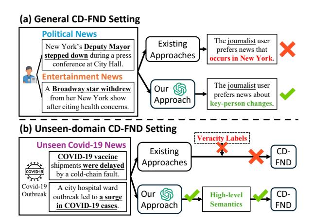
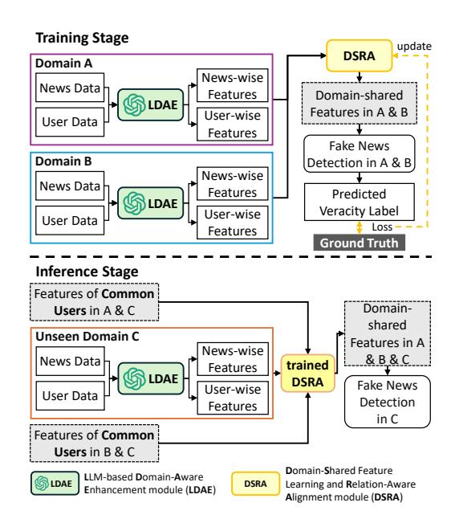
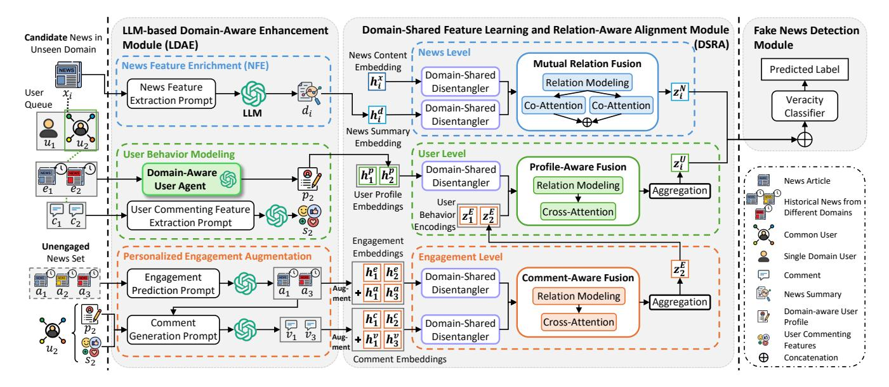
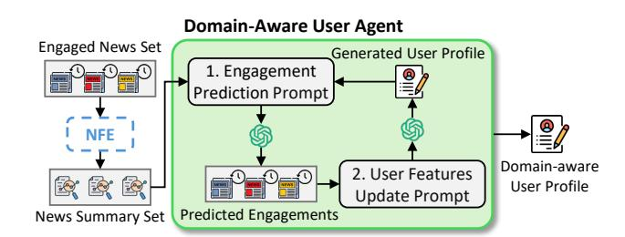
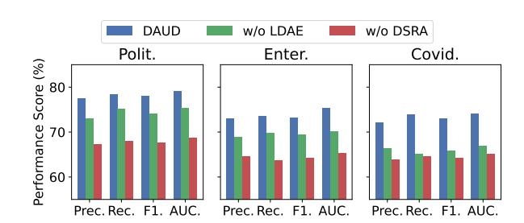
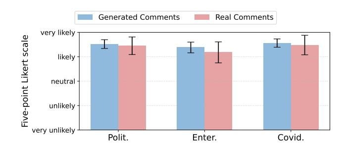

# Cross-Domain Fake News Detection on Unseen Domains via LLM-Based Domain-Aware User Modeling

[Xuankai Yang](https://orcid.org/0000-0002-4985-3560) School of Computing Macquarie University Sydney, Australia xuankai.yang@hdr.mq.edu.au

[Yan Wang](https://orcid.org/0000-0002-5344-1884)∗ School of Computing Macquarie University Sydney, Australia yan.wang@mq.edu.au

[Jiajie Zhu](https://orcid.org/0000-0001-8673-1477) School of Computing Macquarie University Sydney, Australia jiajie.zhu@mq.edu.au

[Pengfei Ding](https://orcid.org/0000-0002-7048-7518) School of Computing Macquarie University Sydney, Australia pengfei.ding@mq.edu.au

[Hongyang Liu](https://orcid.org/0000-0002-4201-1934) School of Computing Macquarie University Sydney, Australia hongyang.liu2@hdr.mq.edu.au

[Xiuzhen Zhang](https://orcid.org/0000-0001-5558-3790) School of Computing Technologies RMIT University Melbourne, Australia xiuzhen.zhang@rmit.edu.au

[Huan Liu](https://orcid.org/0000-0002-3264-7904) School of Computing and Augmented Intelligence Arizona State University Tempe, USA huanliu@asu.edu

## Abstract

Cross-domain fake news detection (CD-FND) transfers knowledge from a source domain to a target domain and is crucial for real-world fake news mitigation. This task becomes particularly important yet more challenging when the target domain is previously unseen (e.g., the COVID-19 outbreak or the Russia-Ukraine war). However, existing CD-FND methods overlook such scenarios and consequently suffer from the following two key limitations: (1) insufficient modeling of high-level semantics in news and user engagements; and (2) scarcity of labeled data in unseen domains. Targeting these limitations, we find that large language models (LLMs) offer strong potential for CD-FND on unseen domains, yet their effective use remains non-trivial. Nevertheless, two key challenges arise: (1) how to capture high-level semantics from both news content and user engagements using LLMs; and (2) how to make LLM-generated features more reliable and transferable for CD-FND on unseen domains. To tackle these challenges, we propose DAUD, a novel LLM-based Domain-Aware framework for fake news detection on Unseen Domains. DAUD employs LLMs to extract high-level semantics from news content. It models users' single- and crossdomain engagements to generate domain-aware behavioral representations. In addition, DAUD captures the relations between original data-driven features and LLM-derived features of news, users, and user engagements. This allows it to extract more reliable domain-shared representations that improve knowledge transfer

∗Corresponding author.

[This work is licensed under a Creative Commons Attribution 4.0 International License.](https://creativecommons.org/licenses/by/4.0)

WWW '26, Dubai, United Arab Emirates © 2026 Copyright held by the owner/author(s). ACM ISBN 979-8-4007-2307-0/2026/04 <https://doi.org/10.1145/3774904.3792990>

to unseen domains. Extensive experiments on real-world datasets demonstrate that DAUD outperforms state-of-the-art baselines in both general and unseen-domain CD-FND settings.

## CCS Concepts

•Information systems→Social networks;• Computing methodologies → Neural networks.

## Keywords

Cross-Domain Fake News Detection, Large Language Models, Social Media, User-News Engagement

#### ACM Reference Format:

Xuankai Yang, Yan Wang, Jiajie Zhu, Pengfei Ding, Hongyang Liu, Xiuzhen Zhang, and Huan Liu. 2026. Cross-Domain Fake News Detection on Unseen Domains via LLM-Based Domain-Aware User Modeling. In Proceedings of the ACM Web Conference 2026 (WWW '26), April 13–17, 2026, Dubai, United Arab Emirates. ACM, New York, NY, USA, [12](#page-11-0) pages. [https://doi.org/10.1145/](https://doi.org/10.1145/3774904.3792990) [3774904.3792990](https://doi.org/10.1145/3774904.3792990)

## 1 Introduction

Fake news is widespread on social media, and its rapid dissemination has caused notable societal risks [\[6,](#page-8-0) [21,](#page-8-1) [24\]](#page-8-2), making fake news detection (FND) a crucial task [\[39\]](#page-9-0). Earlier FND studies focus on a single-domain setting, where they learn veracity-related features of news within a single domain. However, real-world fake news articles span diverse domains (e.g., politics, entertainment), which makes cross-domain fake news detection (CD-FND) [\[18,](#page-8-3) [35,](#page-8-4) [38,](#page-8-5) [41\]](#page-9-1) critical. This is because CD-FND methods can transfer knowledge from a source domain to improve the detection performance in a target domain. In addition, the CD-FND task becomes more significant yet more challenging when the target domain is previously unseen, arising from unexpected or rapidly unfolding events such as the

Figure 1: Our LLM-based approach provides advantages over existing approaches in both general and unseen-domain CD-FND settings.

COVID-19 outbreak [\[25\]](#page-8-6) or the Russia–Ukraine war [\[9\]](#page-8-7). However, existing CD-FND studies have largely overlooked such scenarios.

Existing CD-FND studies mainly focus on extracting transferable linguistic and stylistic features from news content [\[2,](#page-8-8) [28,](#page-8-9) [33,](#page-8-10) [38,](#page-8-5) [41\]](#page-9-1). In addition, some engagement-based studies explore crossdomain behavioral features based on user engagements (a.k.a., user interactions) in different domains [\[18,](#page-8-3) [35,](#page-8-4) [36\]](#page-8-11). Despite the efforts, these two types of methods are unable to effectively handle news from previously unseen domains. Consequently, existing CD-FND approaches face two fundamental limitations (LMs).

LM1: Existing CD-FND methods primarily rely on surface-level semantics from news content and user engagements, overlooking high-level semantics. As a result, these methods fail to develop a deeper understanding of news content and user engagements, which thereby undermines CD-FND performance in a general CD-FND setting. For example, as illustrated in Fig. [1](#page-1-0) (a), a journalist user reposted a political and an entertainment news articles, both of which relate to the theme of key-person changes. However, existing CD-FND methods overlook such high-level semantics (e.g., both concerning key-person changes) and instead rely on surface-level semantics (e.g., both happening in New York). Such process results in user features that fail to capture the journalist user's actual news preferences for major news events, particularly key-person changes. These inaccurate features ultimately degrade detection performance, especially in unseen domains where stable semantic features are crucial for generalization.

LM2: Existing CD-FND methods can hardly extract effective features from news content and user engagements in unseen domains with limited labels. In practice, new domains continually emerge with considerably different linguistic and behavioral characteristics. However, existing methods cannot be applied directly to unseen domains because no labeled data are available for adaptation. For example, as illustrated in Fig. [1](#page-1-0) (b), during the COVID-19 outbreak, a large volume of news emerged within a short period, consequently existing methods do not generalize well to such an unseen domain.

These limitations motivate the need for a more adaptable approach to capture high-level semantics from news content and user

engagements. Recently, large language models (LLMs) have demonstrated strong capabilities in several aspects relevant to unseendomain CD-FND. Some single-domain FND methods [\[7,](#page-8-12) [8,](#page-8-13) [17,](#page-8-14) [32\]](#page-8-15) leverage LLMs to capture rich semantic information from news content even when annotated labels are limited. However, effectively leveraging LLMs to this unseen-domain CD-FND setting remains non-trivial due to the following two challenges (CHs):

CH1: How to capture high-level semantics from both news content and user engagements using LLMs? As mentioned earlier, LLMs can extract high-level semantics from news content. Nevertheless, the high-level semantics contained in user engagements are implicit, which often leads LLMs to infer inaccurate or biased user preferences. In practice, existing LLM-based FND methods [\[19,](#page-8-16) [31\]](#page-8-17) attempt to model users behaviors by prompting LLMs with selected user attributes (e.g., gender, age, or occupation). These approaches rigidly assume that users sharing the same attributes exhibit similar behavioral preferences, failing to capture the implicit high-level semantics encoded in actual user engagements, thus limiting their effectiveness in CD-FND.

CH2: How to make LLM-generated features more reliable and transferable for CD-FND on unseen domains? Although LLMs can extract features from unseen-domain news content and user engagements without labeled data, these features may introduce hallucinated information when not grounded in real data. For example, an LLM may infer facts that do not appear in the original text, such as making up explanations or adding invented participants. Such unreliable outputs introduce noise into the transferred knowledge and limit generalization to the unseen domain.

Our Approach and Contributions. To address the above two challenges, in this paper, we propose a novel LLM-based Domain-Aware framework for CD-FND on Unseen Domains, named DAUD. To the best of our knowledge, this is the first work to propose a CD-FND framework that operates under an unseen-domain setting. Our framework consists of an LLM-based Domain-Aware Enhancement module (LDAE) and a Domain-Shared feature learning and Relationaware Alignment module (DSRA). The contributions of this work are summarized as follows:

- Targeting CH1, in LDAE module, we design an LLM-based domainaware user agent to learn high-level behavioral features for user from their single- and cross-domain engagements. Based on such user agent, our LDAE module extracts high-level semantics from news content, and augments user engagements based on users' high-level behavioral preferences.
- Targeting CH2, in DSRA module, we design an approach that captures the relations between the original data-driven features and the LDAE-generated features of news, users and user-news engagements, and further learns domain-shared features from these three corresponding information sources in different domains. This facilitates more reliable and effective cross-domain knowledge transfer, thereby mitigating the problem of insufficient domain information in unseen domains.
- Extensive experiments on three real-world datasets demonstrate that our proposed DAUD framework significantly outperforms state-of-the-art baselines across all evaluation metrics, confirming its improved performance in both general and unseen-domain CD-FND settings.

#### 2 Related Work

#### 2.1 Single-Domain Fake News Detection

2.1.1 Traditional Single-Domain Methods. Fake news detection can be categorized into news content-based and user engagement-based methods according to the data they rely on. Content-based studies have leveraged diverse types of features for FND, including lexical features [\[22,](#page-8-18) [30\]](#page-8-19), sentence-level and contextual-level representations [\[16,](#page-8-20) [26\]](#page-8-21). Nevertheless, these methods depend heavily on news content itself and ignore user engagements signals, making them sensitive to textual differences in news and thereby limiting FND performance. To more effectively utilize user engagement information, existing studies incorporate social context signals into the detection process. For example, some studies enhance fake news detection by incorporating user engagement information as additional social signals [\[10,](#page-8-22) [20\]](#page-8-23). And studies in [\[40\]](#page-9-2) further utilities engagement propagation patterns to capture broader diffusion signals. However, due to limited reasoning and deep understanding ability in their underlying models, these methods cannot capture high-level semantics.

2.1.2 LLM-based Single-Domain Methods. The rapid development of LLMs has motivated many single-domain FND methods that leverage these models to better interpret news content and user engagements. Some news content-based studies utilize LLMs to generate multi-perspective rationales or justifications for veracity reasoning [\[8,](#page-8-13) [32\]](#page-8-15), while others leverage LLMs to obtain factual evidence through retrieval-augmented generation or to extract higher-level entity–topic semantics [\[7,](#page-8-12) [17\]](#page-8-14). The user engagementbased methods prompt LLMs to derive social signals from readership patterns for aligning few-shot predictions [\[34\]](#page-8-24), while others generate LLM-based reactions or comments to emulate diverse user behaviors and expand engagement contexts [\[19,](#page-8-16) [31\]](#page-8-17). Overall, these above-mentioned approaches rely on data from only a single domain, preventing them from leveraging complementary information across domains that could improve detection performance.

#### 2.2 Cross-Domain Fake News Detection

2.2.1 Traditional Cross-Domain Methods. Recent studies have begun to explore CD-FND, which aims to learn representations that remain effective across different news domains. To this end, diverse studies aim to extract domain-shared features from news content [\[2,](#page-8-8) [28,](#page-8-9) [33,](#page-8-10) [37,](#page-8-25) [38,](#page-8-5) [41\]](#page-9-1). Cross-domain studies also incorporate user engagement information to facilitate knowledge transfer. Some works leverage cross-domain engagements to derive domain-shared representations [\[18,](#page-8-3) [35\]](#page-8-4), while others integrate both micro-level content representation and macro-level engagement behaviors to support transfer across domains [\[36\]](#page-8-11). In addition, some unsupervised approaches [\[23,](#page-8-26) [37\]](#page-8-25) detect fake news without target-domain labels by reducing the gap in feature distributions across domains. However, lacking explicit control over the transferred information inadvertently leads to unintended noise.

2.2.2 LLM-based Cross-Domain Methods. The enhanced reasoning and comprehension abilities of LLMs have increasingly motivated their application in CD-FND. Building on this trend, recent studies explore LLMs for CD-FND from several practical angles. Some

Figure 2: The learning process of DAUD framework.

studies employ LLMs to facilitate multi-agent analysis or decisionmaking processes for target-domain news [\[12\]](#page-8-27), whereas others use affect-aware retrieval to assemble cross-domain examples for in-context reasoning [\[15\]](#page-8-28). In addition, several approaches utilize LLMs to assist model adaptation under distribution shift to improve rumor or misinformation detection [\[5,](#page-8-29) [14\]](#page-8-30). However, these approaches do not explicitly transfer knowledge across domains, which leaves them unable to capture the stable veracity signals that are essential for reliable detection in the target domain. In contrast, our approach specifically models cross-domain user behaviors by combining LLM-derived semantics from both news content and user engagements. Furthermore, our approach aligns them through hierarchical contextual relations to enhance detection performance in an unseen-domain CD-FND setting.

### 3 Methodology

## 3.1 Problem Statement

Let G denote the set of news domains. For each domain �� ∈ G, the labeled dataset is D�� = {(���� , ����)}���� ��=1 , where ���� is the number of news items in domain ��. Here, ���� is the ��-th news item, and ���� is its veracity label indicating whether the news is fake or true. Each news item ���� is associated with a set of user engagements E�� = {(���� , ����)}���� ��=1 , where ���� is a user, ���� is the user comment, and ���� is the total number of users who engaged with ���� . Users often engage with news across different domains. Let U�� denote the user set of the source domains and U�� the user set of the target domain. Users in the intersection U�� ∩ U�� are common users, whose engagements across domains provide transferable behavioral patterns.

With these definitions, we now consider the unseen-domain CD-FND setting. Given source-domain labeled data { D�� }��≠�� and no labeled data from the target domain D�� , the goal is to predict the

by our NFE, and feed the news summary into the domain-aware user agent. For comments, we design a commenting feature extraction prompt that instructs the LLM to infer the user's commenting style reflected in their historical comments. Together, these two features model users from both their engagement and commenting behaviors, providing a more complete characterization.

The overall structure of the user agent is illustrated in Fig. [4.](#page-3-1) The process of generating domain-aware user profiles consists of two steps. In Step 1, an engagement prediction prompt is constructed using the generated user profile together with the summaries of the historical news items and news content of them. The prompt instructs the LLM to predict whether the user would choose to engage with each news item. The engagement prediction prompt is presented below.

#### 1. Engagement Prediction Prompt

You are simulating the behavior of a Twitter (X) user, who is either a regular user, a debunking user, or a malicious user (e.g., spammer or troll).

Here is your self-introduction about what type of user you are as well as the types and characteristics of news you like or dislike engaging with: { user profile }. You are now evaluating whether to repost the following news article based on this user's perspective: { news article }; Its news features are: { news features }.

Follow these steps:

(1) Review your self-introduction to identify the user type, news types you prefer and dislike;

(2) Analyze the features of the news article (e.g., News Domain; Sentiment; Structural Features; Logical Consistency; and Source Credibility);

(3) Assess whether these features align or conflict with your preferences;

(4) Decide whether to Repost or Ignore the news. Provide a detailed explanation that connects your decision to your self-introduction and the news features.

In Step 2, the predicted engagements are compared against the user's historical engagements. A user features update prompt guides the LLM to revise the user profile to better reflect the user's actual engagements. This refinement is performed iteratively until the predicted engagements become consistent with the actual history, yielding a domain-aware user profile. The user features update prompt is shown below.

#### 2(a). User Features Update Prompt

Here is your current self-introduction describing your user type and the types and characteristics of news you like or dislike engaging with: { user profile }. Recently, you predicted that this user would ignore the following news article: { news article }; Its news features are: { news features }; Your explanation was: { user explanation }.

However, the user actually reposted the news article.

#### 2(b). User Features Update Prompt

This indicates that your self-introduction may be inaccurate, incomplete, or missing a key motivational factor that caused this action. Your task is to revise your selfintroduction so that it can explain the reposting behavior naturally and accurately. Follow these steps: (1) Identify what you overlooked or misunderstood about the news article that led to the repost;

(2) Analyze what features of the article (i.e., news domain; sentiment; structural features; logical consistency; and source credibility) may motivate the user to repost it; (3) Consider how your user type or value system may need to be updated to reflect this motivation.

(4) Decide which past preferences should be retained, revised, or discarded to avoid future contradiction;

(5) Write an updated self-introduction that: Starts with your new user type; Describes your newfound preferences reflected in this interaction; Summarizes any relevant retained preferences; Describes what types of news you now dislike.

After the above two steps, the final user profile captures key behavioral characteristics such as user type and preferences. Since the profile is learned through iterative refinement grounded in real engagement behaviors rather than static attributes, it provides a more reliable profile of the user and serves as a solid basis for subsequent feature enrichment and personalized engagement augmentation.

3.3.3 Personalized Engagement Augmentation. Based on the news feature enrichment and user behavior modeling components in LDAE, we obtain a more accurate domain-aware user profile ���� and user commenting feature ���� for each user. While the user profile encodes the user's preferences, converting these preferences into additional engagement instances provides more explicit behavioral features. Therefore, we design a personalized engagement augmentation consisting of three steps, which are detailed below.

Firstly, we identify news articles that user ���� has not engaged with, and then select from those that are most similar to the user's historical engagement items. We denote the resulting unengaged news set as ���� = { ���� } ���� ��=1 , where ���� is the number of selected unengaged news items for user ���� . Secondly, we apply the engagement prediction prompt from the user agent to determine which of these unengaged news items the user would choose to engage with. We denote the set of items predicted to be engaging as��ˆ �� ⊆ ���� . Thirdly, we use a comment generation prompt to derive personalized commenting features for the news items predicted as engaging. The prompt takes the user profile ���� , the user's commenting features ���� , and the predicted engagements set ��ˆ �� as input, and generates comments that reflect the user's writing style and preferences. We denote the resulting set of generated comments as ���� = { ���� } |��ˆ ��=1 . For completeness, the full comment-generation prompt is provided in Appendix [A.](#page-9-3)

By predicting user-news engagements and generating comments based on a domain-aware user profile, the personalized engagement augmentation provides richer and more realistic behavioral information. This results in enhanced and more informative inputs for subsequent domain-shared feature learning.

#### 3.4 Domain-Shared Feature Learning and Relation-Aware Alignment (DSRA)

DSRA module is designed to obtain more effective domain-shared representations for CD-FND, particularly in the unseen-domain setting. DSRA achieves this goal through two key components. Firstly, DSRA mitigates noise and domain-specific biases that within both original data-driven and LLM-generated features of news, users and user engagements. Secondly, DSRA extracts the relations between these two types features and then aligns the resulting representations to obtain fine-grained domain-shared ones.

3.4.1 Multi-Level Domain-Shared Feature Learning. To effectively learn transferable representations for CD-FND, DSRA performs multi-level domain-shared feature learning across news, user and user engagement. We begin by applying a hierarchical disentangler to each type of data. Inspired by [\[36\]](#page-8-11), this disentangler first extracts veracity-relevant features and then derives domain-shared components from them. This step is applied to all three data types before detailing each level below. News level: for each news article ���� , we use two features: the content embedding ℎ �� from the raw text and the summary embedding ℎ �� generated by the NFE. Both features contain domain-specific information. The disentangler produces their domain-shared representations, denoted as �� and �� �� . User level: for each user ��, we use the domain-aware user profile generated by the LLM-based user agent. Its embedding ℎ �� captures the user's behavioral tendencies across domains, yet still contains domain-specific signals. The disentangler extracts the corresponding domain-shared representation, denoted as �� �� �� . Engagement level: for each engagement ��, we consider two types of features: (1) the embedding of user engagements ℎ �� (including both original and LLM-augmented engagements), and (2) the embedding of user comments ℎ �� �� (including the original comments as well as LLM-generated comment augmentations). The engagements and comments reflect domain-specific behavioral preferences and commenting styles. Applying the disentangler extract their domainshared representations, denoted as �� �� and �� �� �� , respectively.

3.4.2 Relation-Aware Alignment. In this section, we address two key objectives. Firstly, we individually extract relational signals within each level of news, user and user engagements, thereby avoiding inaccuracies caused by hallucination. Secondly, we align the representations from news, users, and user engagements. This alignment provides complementary signals derived from users and their engagements for fake news detection.

For the first objective, DSRA incorporates three fusion modules to extract relational signals within each level and enhance the corresponding representations. Let z �� and z �� denote the domain-shared representations of the news content and news summary, respectively. In Mutual Relation Fusion MRF, we first perform relation modeling to extract the interaction between the news content and its LLM-generated summary:

r�� = Rel z �� �� , z �� . (1)

This relation vector is then injected back into both sides to obtain relation-enhanced representations, which are fed into a bidirectional co-attention operator:

zˆ , zˆ �� �� = CoAtt z �� + W�� r�� , z �� �� + W�� r�� . (2)

Finally, the mutually attended features are concatenated to obtain the enhanced news representation z �� �� = [ zˆ �� �� ∥ zˆ �� �� ].

Profile-aware Fusion leverages user profiles as references to enhance user representations. Given the domain-shared user profile sequence Z �� �� and the user behavior encoding sequence Z �� �� extracted from user engagements, the module first computes relation vectors R�� . This relation is then injected into the behavior encoding sequence and refined through a cross-attention operator that uses user profiles as the reference:

Zˆ �� �� = CrossAtt Z �� �� + W��R�� , Z �� �� . (3)

Comment-aware Fusion operates in a similar way, using the augmented comment sequence Z �� �� as a semantic reference to enhance the engagement representations Z �� . It derives relation vectors between engagements and comments, injects it into the engagement encoding sequence, and applies cross-attention with comments as the reference to obtain the refined engagement representation Zˆ �� �� .

Following the fusion operations in each level, DSRA performs a sequential alignment from the user engagement level to the user level and finally to the news level. Engagement level. After Comment-aware Fusion, we obtain the refined engagement encoding sequence Zˆ �� �� . A Transformer encoder is applied to this sequence to extract a user behavior representation: z �� �� = TransEnc(Zˆ �� �� ), where Z �� denotes the user behavior encoding sequence, and each user behavior encoding is obtained by aggregating all engagements of user ��. User level. After Profile-aware Fusion, we similarly encode the sequence of domain-shared user representations using a Transformer to obtain a user pattern encoding tailored to the target news, i.e., z �� �� = TransEnc(Zˆ �� �� ). News level. Finally, DSRA aligns the user pattern encoding z �� �� with the news representation produced by Mutual Relation Fusion z . These two aligned signals together form the input to the final fake news detection module.

## 3.5 Fake News Detection

Given the final news representation z �� and the user pattern encoding z �� �� , DAUD concatenates them and feeds the combined representation into a prediction layer to estimate the veracity label:

��ˆ�� = �� W[z �� �� ∥z �� �� ] + �� . (4)

The model is trained using the binary cross-entropy loss:

Ldet = − (���� log��ˆ�� + (1 − ����) log(1 − ��ˆ��)) . (5)

## 4 Experiments and Analysis

We conduct extensive experiments to answer the following research questions (RQs):

RQ1. How does DAUD perform compared to state-of-the art baselines in general and unseen-domain CD-FND settings?

RQ2. How does each proposed module in DAUD contribute to the overall CD-FND performance?

Table 1: Comparison with single-domain and cross-domain FND baselines in the general setting (%).

| Methods     |       | Polit. Prec. | +   | Enter. Rec. | + Covid. | → F1 | Polit. | AUC |     | Polit. Prec. | +   | Enter. + Rec. | Covid. | → F1 | Enter. | AUC |     | Polit. Prec. | +   | Enter. + Rec. | Covid. | → F1 | Covid. | AUC |
|-------------|-------|--------------|-----|-------------|----------|------|--------|-----|-----|--------------|-----|---------------|--------|------|--------|-----|-----|--------------|-----|---------------|--------|------|--------|-----|
| BERT        | 86    | 25           | 86  | 51          | 85       | 62   | 93     | 59  | 51  | 41           | 50  | 70            | 50     | 84   | 61     | 35  | 52  | 82           | 52  | 51            | 52     | 66   | 65     | 28  |
| dEFEND      | 88    | 33           | 77  | 94          | 82       | 81   | 83     | 42  | 56  | 51           | 63  | 71            | 59     | 90   | 75     | 11  | 59  | 24           | 57  | 69            | 58     | 45   | 75     | 90  |
| FANG        | 61    | 19           | 62  | 02          | 61       | 83   | 79     | 18  | 51  | 58           | 52  | 12            | 50     | 50   | 62     | 59  | 53  | 66           | 53  | 14            | 53     | 40   | 64     | 20  |
| DUCK        | 84    | 90           | 77  | 46          | 78       | 63   | 85     | 40  | 74  | 77           | 67  | 31            | 70     | 11   | 75     | 60  | 75  | 63           | 71  | 26            | 73     | 38   | 77     | 61  |
| GPT-4o-mini | 67    | 59           | 66  | 11          | 63       | 84   | 66     | 11  | 57  | 32           | 58  | 28            | 43     | 13   | 58     | 28  | 60  | 74           | 62  | 64            | 61     | 68   | 60     | 15  |
| ARG         | 88    | 00           | 88  | 47          | 88       | 06   | 92     | 57  | 75  | 08           | 73  | 81            | 74     | 08   | 86     | 39  | 81  | 80           | 80  | 38            | 81     | 08   | 89     | 80  |
| DELL        | 90    | 82           | 90  | 40          | 90       | 61   | 95     | 41  | 78  | 61           | 79  | 54            | 79     | 07   | 87     | 98  | 81  | 32           | 80  | 95            | 81     | 13   | 90     | 39  |
| EANN        | 61    | 04           | 67  | 83          | 64       | 26   | 66     | 76  | 66  | 30           | 70  | 03            | 68     | 11   | 70     | 81  | 65  | 91           | 66  | 12            | 66     | 01   | 68     | 22  |
| REAL-FND    | 78    | 57           | 82  | 43          | 80       | 45   | 85     | 28  | 72  | 83           | 75  | 79            | 74     | 28   | 78     | 58  | 69  | 57           | 70  | 45            | 70     | 01   | 75     | 33  |
| EDD         | 85    | 09           | 87  | 30          | 86       | 18   | 93     | 25  | 81  | 88           | 83  | 64            | 82     | 75   | 91     | 84  | 82  | 56           | 83  | 23            | 82     | 89   | 93     | 97  |
| M3FEND      | 92    | 50           | 91  | 33          | 91       | 69   | 93     | 72  | 81  | 19           | 81  | 82            | 81     | 50   | 90     | 49  | 83  | 02           | 82  | 58            | 82     | 80   | 91     | 89  |
| UPDATE      | 92    | 16           | 91  | 13          | 91       | 64   | 92     | 05  | 81  | 91           | 81  | 89            | 81     | 90   | 88     | 08  | 85  | 20           | 83  | 62            | 84     | 40   | 89     | 94  |
| MMHT        | 94    | 97 2         |     |             |          |      |        |     |     |              |     |               |        |      |        |     |     |              |     |               |        |      |        |     |
|             |       |              | 95  | 25          | 95       | 11   | 97     | 68  | 88  | 01           | 85  | 74            | 86     | 86   | 93     | 16  | 90  | 34           | 87  | 36            | 88     | 83   | 95     | 26  |
| DAUD        | 96    | 21 1         | 96  | 78          | 96       | 49   | 98     | 16  | 90  | 11           | 88  | 14            | 89     | 11   | 95     | 20  | 93  | 67           | 90  | 90            | 92     | 26   | 96     | 20  |
| Improvement | 3 + 1 | 31%          | + 1 | 61%         | + 1      | 45%  | + 0    | 49% | + 2 | 39%          | + 2 | 80%           | + 2    | 59%  | + 2    | 19% | + 3 | 69%          | + 4 | 05%           | + 3    | 86%  | + 0    | 99% |

1 A value in bold font indicates the best performance.

2 An underlined value indicates the performance of best-performing baseline approaches.

3 The improvement of DAUD over the best-performing baseline approaches, and the improvement is significant at �� &lt; 0.05.

RQ3. Can our proposed domain-aware user agent generate effective user profiles and user comments?

#### 4.1 Experimental Setup

4.1.1 Datasets. We use data from three widely studied news domains: Politics (Polit.) [\[27\]](#page-8-31), Entertainment (Enter.) [\[27\]](#page-8-31), and COVID-19 (Covid.) [\[13\]](#page-8-32). It is worth mentioning that news in different domains substantially differ in both content and linguistic characteristics. The detailed illustration is provided in Appendix [B.](#page-9-4)

4.1.2 Fake News Detection Settings. We consider the following two distinct scenarios: (1) Unseen-domain CD-FND setting. In this setting, two of the three domains are used as source domains and the remaining one domain serves as the unseen target domain. We repeat this procedure three times so that each domain serves once as the unseen target domain. In addition to the characteristic differences between the source and target domains, it is also worth mentioning that no data from the unseen target domains is used during training on the source domains, ensuring our evaluation is strictly within the unseen-domain setting. (2) General CD-FND setting. In this setting, we use the similar procedure as in the unseen-domain setting: two domains are used as sources and the third one as the target, and this process is repeated until each domain has served once as the target. The key difference from the unseen-domain setting is that the target domain's training data is used during training of source domains.

4.1.3 Baselines. To comprehensively evaluate our framework, we compare DAUD with thirteen baseline methods from three categories: (1) single-domain traditional methods include BERT [\[4\]](#page-8-33), dEFEND [\[26\]](#page-8-21), FANG [\[20\]](#page-8-23), and DUCK [\[29\]](#page-8-34), (2) single-domain LLMbased methods include GPT-4o-mini, ARG [\[8\]](#page-8-13), and DELL [\[31\]](#page-8-17), and (3) cross-domain traditional methods include EANN [\[33\]](#page-8-10), Real-FND [\[18\]](#page-8-3), EDD [\[28\]](#page-8-9), M3FEND [\[41\]](#page-9-1), UPDATE [\[35\]](#page-8-4) as well as MMHT [\[36\]](#page-8-11). Note that we do not include the above-mentioned

LLM-based CD-FND methods as baselines because they do not explicitly perform knowledge transfer, making them incompatible with our evaluation settings. Detailed descriptions of these baseline methods are provided in Appendix [C.](#page-9-5) In the unseen-domain setting, we compare DAUD with cross-domain traditional baselines, because single-domain baselines cannot transfer knowledge across domains. In the general CD-FND setting, we compare DAUD with cross-domain traditional baselines and all single-domain baselines. Note that for the single-domain methods, we train them on each domain and report their performance.

4.1.4 Implementation Details. Models are trained with Adam and evaluated using Acc, Prec, Rec, F1, and AUC, averaged over five runs. More implementation details are provided in Appendix [D.](#page-9-6)

## 4.2 Main Results

4.2.1 General and Unseen-Domain CD-FND Performance Comparison (RQ1). Tables [1](#page-6-0) and [2](#page-7-0) present the performance comparison between DAUD and baselines in both general and unseen-domain CD-FND settings. Overall, DAUD achieves consistent and notable improvements over the best-performing baselines across all settings. Specifically, in the general CD-FND setting, DAUD achieves average improvements of 1.22% in Politics, 2.50% in Entertainment, and 3.15% in COVID-19. In the unseen-domain CD-FND setting, the improvements become more pronounced, reaching 1.96%, 2.43%, and 3.62% in the three domains, respectively. These improvements come from the complementary roles of LDAE and DSRA. LDAE's finegrained semantic extraction enriches the learned representations, while DSRA enhances cross-domain knowledge transfer with learning stable domain-shared features. In contrast, existing CD-FND methods either overlook high-level semantic relations across news, users, and engagements, or depend heavily on domain-specific information. Such limitations prevent them from learning reliable domain-shared representations, leading to degraded performance in

Table 2: Comparison with CD-FND baselines in the unseen-domain setting (%).

| Methods     |       | Prec. | Enter. | + Rec. | Covid. | → Polit. F1 |     | AUC |     | Prec. | Polit. | + Rec. | Covid. → | Enter. F1 |     | AUC |     | Prec. | Polit. | + Enter. Rec. | →   | Covid. F1 |     | AUC |
|-------------|-------|-------|--------|--------|--------|-------------|-----|-----|-----|-------|--------|--------|----------|-----------|-----|-----|-----|-------|--------|---------------|-----|-----------|-----|-----|
| EANN        | 54    | 52    | 50     | 25     | 52     | 30          | 53  | 70  | 58  | 14    | 57     | 79     | 57       | 96        | 60  | 94  | 55  | 38    | 54     | 71            | 55  | 04        | 56  | 83  |
| REAL-FND    | 76    | 74 2  |        |        |        |             |     |     |     |       |        |        |          |           |     |     |     |       |        |               |     |           |     |     |
|             |       |       | 75     | 15     | 75     | 94          | 77  | 38  | 67  | 96    | 65     | 49     | 66       | 70        | 66  | 62  | 69  | 02    | 68     | 49            | 68  | 75        | 71  | 15  |
| EDD         | 73    | 21    | 76     | 24     | 74     | 69          | 75  | 10  | 58  | 26    | 59     | 18     | 58       | 72        | 63  | 97  | 64  | 28    | 65     | 75            | 65  | 01        | 64  | 37  |
| M3FEND      | 65    | 43    | 64     | 11     | 64     | 76          | 65  | 44  | 66  | 30    | 61     | 53     | 63       | 83        | 64  | 40  | 63  | 56    | 64     | 71            | 64  | 13        | 66  | 83  |
| UPDATE      | 55    | 28    | 52     | 33     | 53     | 76          | 55  | 90  | 60  | 17    | 62     | 55     | 61       | 34        | 65  | 68  | 59  | 35    | 58     | 14            | 58  | 74        | 61  | 06  |
| MMHT        | 72    | 06    | 76     | 31     | 74     | 12          | 78  | 14  | 71  | 27    | 72     | 18     | 71       | 72        | 73  | 06  | 69  | 23    | 72     | 00            | 70  | 59        | 70  | 17  |
| DAUD        | 77    | 55 1  | 78     | 42     | 77     | 98          | 79  | 16  | 73  | 01    | 73     | 52     | 73       | 26        | 75  | 44  | 72  | 08    | 73     | 98            | 73  | 02        | 74  | 12  |
| Improvement | 3 + 1 | 06%   | + 2    | 77%    | + 2    | 69%         | + 1 | 31% | + 2 | 44%   | + 1    | 86%    | + 2      | 15%       | + 3 | 26% | + 4 | 12%   | + 2    | 75%           | + 3 | 44%       | + 4 | 17% |

1 A value in bold font indicates the best performance.

2 An underlined value indicates the performance of best-performing baseline approaches.

3 The improvement of DAUD over the best-performing baseline approaches, and the improvement is significant at �� &lt; 0.05.

Figure 5: Ablation Study of DAUD in unseen-domain CD-FND setting.

unseen domains where linguistic characteristics and user behavior patterns differ and labeled data are limited.

Furthermore, it is worth noting that in Tables [1](#page-6-0) and [2,](#page-7-0) almost all baseline methods experience performance drops when evaluated on unseen domains. Across the unseen-domain evaluations, UPDATE , M3FEND and EDD suffer the largest declines with average AUC declines of 32.27%, 28.76%, and 27.10% respectively. This is because they depend heavily on domain-specific features, which fail to generalize to unseen domains.

4.2.2 Ablation Study (RQ2). To evaluate the contributions of the core modules in DAUD, we construct two variants: (1) w/o LDAE, which removes fine-grained semantic enrichment and augmentation, and (2) w/o DSRA, which removes relation-aware alignment across news, users, and engagements. Ablation results in the unseen-domain CD-FND setting are shown in Fig. [5.](#page-7-1)[1](#page-7-2) Across all three domains, w/o LDAE shows consistent performance drops: 3.90% on Politics, 4.19% on Entertainment, and 7.22% on COVID-19, demonstrating that LDAE is essential for generating enriched semantic features and augmenting behavioral information. The performance degradation becomes more substantial in w/o DSRA, with declines of 10.32%, 9.32%, and 8.76% in the three domains. This confirms that DSRA's relation-aware alignment between original data-driven and LLM-derived features is crucial for learning stable domain-shared representations. Overall, these results show that both LDAE and DSRA are indispensable.

4.2.3 Quality of Generated User Profiles and Augmented Engagements (RQ3). To evaluate the quality of the generated user profiles and the augmented engagements, we perform two complementary analyses. Firstly, we assess the quality of the comments generated by LDAE by comparing them with real comments across all domains. The results show that the generated comments achieve higher overall quality and more stable performance than real comments. Detailed evaluation procedures and results are reported in Appendix [E.](#page-10-0)

Secondly, we examine whether the learned user profiles capture meaningful user preferences by comparing them with predefined user attributes in an auxiliary engagement prediction task. The results show that LDAE substantially outperforms the attribute-based baseline, indicating that the learned user profiles better capture actual user behavior patterns. Detailed experimental settings and results are reported in Appendix [E.](#page-10-0)

## 4.3 Case Study

To further illustrate the structure and characteristics of the news summary, the domain-aware user profiles, and user commenting feature, we present a representative case study in Appendix [F.](#page-10-1)

## 5 Conclusions and Future Work

In this work, we tackle the challenges of CD-FND, with a particular focus on improving performance in the unseen-domain setting. We propose DAUD, a novel framework that integrates an LLMbased module that enriches news and user features with high-level semantics; and a relation-aware alignment module that captures hierarchical contextual relations and learns domain-shared representations. Extensive experiments in three domains demonstrate that our approach consistently outperforms existing state-of-theart baseline methods, showing clear improvements in both general and unseen-domain CD-FND settings. For future work, we plan to explore DAUD's extension to scenarios without common users by improving the effectiveness of domain-shared feature learning.

## Acknowledgments

This research is supported by ARC Discovery Projects DP200101441 and DP230100676, Australia.

1The general CD-FND setting exhibits the same performance trends.

References [1] I Elaine Allen and Christopher A Seaman. 2007. Likert scales and data analyses. Quality progress 40, 7 (2007), 64–65. [2] Sonia Castelo, Thais Almeida, Anas Elghafari, Aécio Santos, Kien Pham, Eduardo Nakamura, and Juliana Freire. 2019. A Topic-Agnostic Approach for Identifying Fake News Pages. In Companion Proceedings of The 2019 World Wide Web Conference. New York, NY, USA, 975–980. [3] Cheng-Han Chiang and Hung-yi Lee. 2023. Can large language models be an alternative to human evaluations? arXiv preprint arXiv:2305.01937 (2023). [4] Jacob Devlin, MingWei Chang, Kenton Lee, and Kristina Toutanova. 2018. BERT: Pre-training of Deep Bidirectional Transformers for Language Understanding. In Proceedings of the 2019 Conference of the North American Chapter of the Association for Computational Linguistics: Human Language Technologies, Volume 1 (Long and Short Papers). Minneapolis, Minnesota, 4171–4186. [5] Yuxia Gong, Shuguo Hu, and Huaiwen Zhang. 2025. Cross-domain Rumor Detection via Test-Time Adaptation and Large Language Models. In Proceedings of the 2025 Conference on Empirical Methods in Natural Language Processing. Association for Computational Linguistics, Suzhou, China, 8062–8077. [6] Nir Grinberg, Kenneth Joseph, Lisa Friedland, Briony Swire-Thompson, and David Lazer. 2019. Fake News on Twitter during the 2016 US Presidential Election. Science 363 (Jan. 2019), 374–378. [7] Ching Nam Hang, Pei-Duo Yu, and Chee Wei Tan. 2024. TrumorGPT: Query Optimization and Semantic Reasoning over Networks for Automated Fact-Checking. In 2024 58th Annual Conference on Information Sciences and Systems (CISS). 1–6. [8] Beizhe Hu, Qiang Sheng, Juan Cao, Yuhui Shi, Yang Li, Danding Wang, and Peng Qi. 2024. Bad actor, good advisor: Exploring the role of large language models in fake news detection. In Proceedings of the AAAI Conference on Artificial Intelligence, Vol. 38. Vancouver, Canada, 22105–22113. [9] Irina Khaldarova and Mervi Pantti. 2020. Fake news: The narrative battle over the Ukrainian conflict. In The future of journalism: Risks, threats and opportunities. Routledge, 228–238. [10] Ling Min Serena Khoo, Hai Leong Chieu, Zhong Qian, and Jing Jiang. 2020. Interpretable Rumor Detection in Microblogs by Attending to User Interactions. Proceedings of the AAAI Conference on Artificial Intelligence 34 (April 2020), 8783– 8790. [11] Seungone Kim, Jamin Shin, Yejin Cho, Joel Jang, Shayne Longpre, Hwaran Lee, Sangdoo Yun, Seongjin Shin, Sungdong Kim, James Thorne, et al. 2023. Prometheus: Inducing fine-grained evaluation capability in language models. In The Twelfth International Conference on Learning Representations. [12] Hui Li, Ante Wang, Kunquan Li, Zhihao Wang, Liang Zhang, Delai Qiu, Qingsong Liu, and Jinsong Su. 2025. A Multi-Agent Framework with Automated Decision Rule Optimization for Cross-Domain Misinformation Detection. In Proceedings of the 2025 Conference on Empirical Methods in Natural Language Processing. Association for Computational Linguistics, Suzhou, China, 5720–5736. [13] Yichuan Li, Bohan Jiang, Kai Shu, and Huan Liu. 2020. MM-COVID: A Multilingual and Multimodal Data Repository for Combating COVID-19 Disinformation. arXiv[:2011.04088](https://arxiv.org/abs/2011.04088) [14] Shanshan Liu, Menglong Lu, Zhen Huang, Zejiang He, Liu Liu, Zhigang Sun, and Dongsheng Li. 2025. MONTROSE: LLM-driven Monte Carlo Tree Search Self-Refinement for Cross-Domain Rumor Detection. In Findings of the Association for Computational Linguistics: ACL 2025. Association for Computational Linguistics, Vienna, Austria, 21475–21487. [15] Zhiwei Liu, Kailai Yang, Qianqian Xie, Christine de Kock, Sophia Ananiadou, and Eduard Hovy. 2025. RAEmoLLM: Retrieval Augmented LLMs for Cross-Domain Misinformation Detection Using In-Context Learning Based on Emotional Information. In Proceedings of the 63rd Annual Meeting of the Association for Computational Linguistics (Volume 1: Long Papers). Association for Computational Linguistics, Vienna, Austria, 16508–16523. [16] Jing Ma, Wei Gao, Prasenjit Mitra, Sejeong Kwon, Bernard J Jansen, KamFai Wong, and Meeyoung Cha. 2016. Detecting Rumors from Microblogs with Recurrent Neural Networks. In Proceedings of the Twenty-Fifth International Joint Conference on Artificial Intelligence. New York, NY, USA, 3818–3824. [17] Xiaoxiao Ma, Yuchen Zhang, Kaize Ding, Jian Yang, Jia Wu, and Hao Fan. 2024. On Fake News Detection with LLM Enhanced Semantics Mining. In Proceedings of the 2024 Conference on Empirical Methods in Natural Language Processing. Association for Computational Linguistics, Miami, Florida, USA, 508–521. [18] Ahmadreza Mosallanezhad, Mansooreh Karami, Kai Shu, Michelle V Mancenido, and Huan Liu. 2022. Domain Adaptive Fake News Detection via Reinforcement Learning. In Proceedings of the ACM Web Conference 2022. New York, NY, USA, 3632–3640. [19] Qiong Nan, Qiang Sheng, Juan Cao, Beizhe Hu, Danding Wang, and Jintao Li. 2024. Let Silence Speak: Enhancing Fake News Detection with Generated Comments from Large Language Models. In Proceedings of the 33rd ACM International Conference on Information and Knowledge Management. Association for Computing Machinery, New York, NY, USA, 1732–1742. [20] VanHoang Nguyen, Kazunari Sugiyama, Preslav Nakov, and MinYen Kan. 2020. FANG: Leveraging Social Context for Fake News Detection Using Graph Representation. Commun. ACM 65 (April 2020), 124–132. [21] Femi Olan, Uchitha Jayawickrama, Emmanuel Ogiemwonyi Arakpogun, Jana Suklan, and Shaofeng Liu. 2024. Fake News on Social Media: The Impact on Society. Information Systems Frontiers 26, 2 (April 2024), 443–458. [22] Verónica Pérez-Rosas, Bennett Kleinberg, Alexandra Lefevre, and Rada Mihalcea. 2018. Automatic Detection of Fake News. In Proceedings of the 27th International Conference on Computational Linguistics. Santa Fe, New Mexico, USA, 3391–3401. [23] Hongyan Ran and Caiyan Jia. 2023. Unsupervised Cross-Domain Rumor Detection with Contrastive Learning and Cross-Attention. Proceedings of the AAAI Conference on Artificial Intelligence 37 (June 2023), 13510–13518. [24] Yasmim Mendes Rocha, Gabriel Acácio De Moura, Gabriel Alves Desidério, Carlos Henrique De Oliveira, Francisco Dantas Lourenço, and Larissa Deadame de Figueiredo Nicolete. 2021. The Impact of Fake News on Social Media and Its Influence on Health during the COVID-19 Pandemic: A Systematic Review. Journal of Public Health (2021), 1–10. [25] Yasmim Mendes Rocha, Gabriel Acácio De Moura, Gabriel Alves Desidério, Carlos Henrique De Oliveira, Francisco Dantas Lourenço, and Larissa Deadame de Figueiredo Nicolete. 2023. The impact of fake news on social media and its influence on health during the COVID-19 pandemic: A systematic review. Journal of Public Health 31, 7 (2023), 1007–1016. [26] Kai Shu, Limeng Cui, Suhang Wang, Dongwon Lee, and Huan Liu. 2019. dE-FEND: Explainable Fake News Detection. In Proceedings of the 25th ACM SIGKDD International Conference on Knowledge Discovery & Data Mining. New York, NY, USA, 395–405. [27] Kai Shu, Deepak Mahudeswaran, Suhang Wang, Dongwon Lee, and Huan Liu. 2020. FakeNewsNet: A Data Repository with News Content, Social Context, and Spatiotemporal Information for Studying Fake News on Social Media. Big Data 8 (June 2020), 171–188. [28] Amila Silva, Ling Luo, Shanika Karunasekera, and Christopher Leckie. 2021. Embracing Domain Differences in Fake News: Cross-Domain Fake News Detection Using Multi-Modal Data. Proceedings of the AAAI Conference on Artificial Intelligence 35 (May 2021), 557–565. [29] Lin Tian, Xiuzhen Jenny Zhang, and Jey Han Lau. 2022. DUCK: Rumour Detection on Social Media by Modelling User and Comment Propagation Networks. In Proceedings of the 2022 Conference of the North American Chapter of the Association for Computational Linguistics: Human Language Technologies. Seattle, United States, 4939–4949. [30] Svitlana Volkova, Kyle Shaffer, Jin Yea Jang, and Nathan Hodas. 2017. Separating Facts from Fiction: Linguistic Models to Classify Suspicious and Trusted News Posts on Twitter. In Proceedings of the 55th Annual Meeting of the Association for Computational Linguistics (Volume 2: Short Papers). Vancouver, Canada, 647–653. [31] Herun Wan, Shangbin Feng, Zhaoxuan Tan, Heng Wang, Yulia Tsvetkov, and Minnan Luo. 2024. DELL: Generating Reactions and Explanations for LLM-Based Misinformation Detection. In Findings of the Association for Computational Linguistics ACL 2024. Association for Computational Linguistics, Bangkok, Thailand and virtual meeting, 2637–2667. [32] Bo Wang, Jing Ma, Hongzhan Lin, Zhiwei Yang, Ruichao Yang, Yuan Tian, and Yi Chang. 2024. Explainable Fake News Detection with Large Language Model via Defense Among Competing Wisdom. In Proceedings of the ACM Web Conference 2024. Association for Computing Machinery, New York, NY, USA, 2452–2463. [33] Yaqing Wang, Fenglong Ma, Zhiwei Jin, Ye Yuan, Guangxu Xun, Kishlay Jha, Lu Su, and Jing Gao. 2018. EANN: Event Adversarial Neural Networks for Multi-Modal Fake News Detection. In Proceedings of the 24th ACM SIGKDD International Conference on Knowledge Discovery & Data Mining. New York, NY, USA, 849–857. [34] Jiaying Wu, Shen Li, Ailin Deng, Miao Xiong, and Bryan Hooi. 2023. Promptand-Align: Prompt-Based Social Alignment for Few-Shot Fake News Detection. In Proceedings of the 32nd ACM International Conference on Information and Knowledge Management. Association for Computing Machinery, New York, NY, USA, 2726–2736. [35] Xuankai Yang, Yan Wang, Xiuzhen Zhang, Shoujin Wang, Huaxiong Wang, and Lam Kwok-Yan. 2024. UPDATE: Mining User-News Engagement Patterns for Dual-Target Cross-Domain Fake News Detection. In 2024 IEEE 11th International Conference on Data Science and Advanced Analytics (DSAA). San Diego, CA, USA, 1–10. [36] Xuankai Yang, Yan Wang, Xiuzhen Zhang, Shoujin Wang, Huaxiong Wang, and Kwok Yan Lam. 2025. A Macro- and Micro-Hierarchical Transfer Learning Framework for Cross-Domain Fake News Detection. In Proceedings of the ACM on Web Conference 2025. Association for Computing Machinery, New York, NY, USA, 5297–5307. [37] Zhenrui Yue, Huimin Zeng, Ziyi Kou, Lanyu Shang, and Dong Wang. 2022. Contrastive Domain Adaptation for Early Misinformation Detection: A Case Study on COVID-19. In Proceedings of the 31st ACM International Conference on Information & Knowledge Management. New York, NY, USA, 2423–2433. [38] Zhenrui Yue, Huimin Zeng, Yang Zhang, Lanyu Shang, and Dong Wang. 2023. MetaAdapt: Domain Adaptive Few-Shot Misinformation Detection via Meta

Learning. In Proceedings of the 61st Annual Meeting of the Association for Computational Linguistics (Volume 1: Long Papers). Toronto, Canada, 5223–5239. [39] Xinyi Zhou and Reza Zafarani. 2020. A Survey of Fake News: Fundamental Theories, Detection Methods, and Opportunities. ACM Comput. Surv. 53, 5 (Sept. 2020), 1–40. [40] Junyou Zhu, Chao Gao, Ze Yin, Xianghua Li, and Juergen Kurths. 2024. Propagation Structure-Aware Graph Transformer for Robust and Interpretable Fake News Detection. In Proceedings of the 30th ACM SIGKDD Conference on Knowledge Discovery and Data Mining. Association for Computing Machinery, New York, NY, USA, 4652–4663. [41] Yongchun Zhu, Qiang Sheng, Juan Cao, Qiong Nan, Kai Shu, Minghui Wu, Jindong Wang, and Fuzhen Zhuang. 2023. Memory-Guided Multi-View Multi-Domain Fake News Detection. IEEE Transactions on Knowledge and Data Engineering 35 (July 2023), 7178–7191.

#### A Prompt Design

We present the News Feature Extraction Prompt and the Comment Generation Prompt used in our methodology.

## News Feature Extraction Prompt

Recently, the user browsed a news article, its article content

is: { news article }.

Your task is to analyze the content of the news text and then summarize the characteristics of true and

fake information within the news.

Follow these steps:

(1) Identify and ignore website noise, such as ads, image

captions, or unrelated links.

(2) Analyze the news text based on: News Domain, Sentiment (e.g., neutral, emotional, exaggerated), Structural Features, Logical Consistency, Source Credibility (Check

sources of quotes and be suspicious).

#### Comment Generation Prompt

Recently, the user has posted multiple comments on different news articles, the comments are listed as follows: {comments list }. Your task is to analyze these comments and summarize the user's typical tone and commenting style. Follow these steps:

(1) Identify and ignore parts of the comments that are formulaic (e.g., hashtags, URLs, emojis, or repost tags) unless they contribute meaningfully to the tone. (2) Analyze the comments based on: Tone (e.g., sarcastic, sincere, angry, humorous, accusatory, supportive); Intent (e.g., inform, provoke, agree, debunk, mock); Linguistic Style (e.g., formal, casual, concise, emotionally charged, rhetorical); Stance Consistency (e.g., does the user consistently take a certain side or shift based on domain or content); Targeting Pattern (e.g., does the user address individuals, institutions, abstract ideas, or the public).

## B Datasets

Table [3](#page-9-7) summarizes statistics of datasets of Politics, Entertainment and Covid-19. These domains exhibit substantial lexical and semantic differences, which pose a significant challenge for CD-FND in the unseen-domain setting. For example, as shown in the word clouds

Table 3: The characteristics of three experimental datasets.

in Fig. [6,](#page-10-2) political news frequently contains terms related to words like policy and election; entertainment news is dominated by words like celebrity and idol; whereas COVID-19 news is characterized by words like pandemic and outbreak.

## C Baseline Methods

Single-domain traditional methods. We select four representative traditional methods trained and evaluated within a single domain: (1) BERT [\[4\]](#page-8-33), a pre-trained transformer encoder finetuned for fake news classification; (2) dEFEND [\[26\]](#page-8-21), which models engagements between news articles and user comments; (3) FANG [\[20\]](#page-8-23), which learns graph-based social context representations from user–news interactions; and (4) DUCK [\[29\]](#page-8-34), which aggregates multiple graph-derived engagement features to improve veracity prediction. Single-domain LLM-based methods. We further select three representative LLM-based methods that apply large language models to fake news detection within a single domain: (1) GPT-4o-mini, a lightweight variant of GPT-4o that performs direct veracity prediction using its generative reasoning abilities; (2) ARG [\[8\]](#page-8-13), which distills knowledge from a large language model into a smaller task-specific model for news classification; and (3) DELL [\[31\]](#page-8-17), which leverages LLM-generated user reactions and explanations, combining them with a GNN backbone to perform fake news detection. Cross-domain traditional methods. We compare DAUD with six representative cross-domain FND models: (1) EANN [\[33\]](#page-8-10), an adversarial learning framework that extracts domain-shared features from news content; (2) Real-FND [\[18\]](#page-8-3), a reinforcement-learning-based model that captures domain-shared information from both news content and user engagements; (3) EDD [\[28\]](#page-8-9), which separates domain-shared and domain-specific features through multi-level adversarial training; (4) M3FEND [\[41\]](#page-9-1), which models domain discrepancies by leveraging multiple types of textual features derived from news content; (5) UPDATE [\[35\]](#page-8-4), which performs cross-domain knowledge transfer by integrating user engagement signals with news content; (6) MMHT [\[36\]](#page-8-11), which employs a hierarchical disentangler to achieve more effective crossdomain knowledge transfer. Note that we do not include the LLMbased CD-FND methods introduced in the related work as baselines, as they do not explicitly transfer domain-shared knowledge across domains. Because our experiments are designed to evaluate the effectiveness of cross-domain knowledge transfer, these methods are not directly comparable within our evaluation settings.

## D Implementation Details

In LDAE, we use the API of GPT-4o-mini to generate enriched news features, and user features as well as augmented user engagements. In DSRA, we use a RoBERTa encoder to obtain embeddings for news content, news summaries, user profiles, historical news, and

Figure 6: Word Clouds for Politics, Entertainment, and COVID-19 domains.

Figure 7: LLM-based Evaluation of Generated and Real Comments.

Table 4: Engagement prediction results of the domain-aware user agent.

comments. We set the maximum input length to 256 and use a hidden size of 768 for all RoBERTa-based embeddings. For training, we use the AdamW optimizer with a learning rate of 1e-4, a linear warm-up ratio of 10%, and a batch size of 32. The model is trained for 100 epochs with a dropout rate of 0.1. We report four commonly used metrics for CD-FND: Precision (Prec.), Recall (Rec.), F1-score (F1), and AUC, and present the average performance across five independent runs.

## E Experimental Details for RQ3

Firstly, we evaluate the quality of the comments generated by LDAE using an LLM [\[3,](#page-8-35) [11\]](#page-8-36). We randomly sample 500 generated comments across all domains and prompt the LLM with two questions: (1) "Does the user's comment on the news match the user profile?" and (2) "Does the comment relate to the news?" The LLM provides a score for each question on a five-point Likert scale [\[1\]](#page-8-37). For clarity, we map the numeric scale (1–5) to qualitative labels (from "very unlikely" to "very likely"). The final rating for each comment is obtained by averaging the scores of the above two questions. For comparison, we evaluate an equal number of real comments using the same procedure. As shown in Fig. [7,](#page-10-3) the averaged scores of the two evaluation questions indicate that the generated comments are better than the real ones overall, and their variances are consistently smaller across all domains, suggesting that the generated comments are more stable in quality.

Secondly, to examine whether the learned user profiles encode real user preferences, we conduct an auxiliary engagement prediction task. This task takes the user and news representations as input, and uses a prompt-based module to predict whether the user would engage with the news. We use user engagement records in the dataset as ground-truth labels for evaluation, and report Precision, Recall, Accuracy, Micro F1, and Macro F1. For comparison, we replace our learned user profiles with the predefined user attributes used in [\[19\]](#page-8-16), and feed these attributes into our engagement prediction prompt for prediction and evaluation. As shown in Table [4,](#page-10-4) LDAE's domain-aware user agent achieves substantially stronger performance than this attribute-based variant, indicating that our learned user profiles better capture actual user behavior patterns than predefined attributes, thereby providing more informative representations for CD-FND.

### F Case Study

Table [5](#page-11-1) presents two representative cases. Case 1 shows the news summary extracted from a political fake news article using the News Feature Extraction Prompt, together with the intermediate user profile generated by LDAE based on the historical engagement with this article through the User Feature Update Prompt. Case 2 presents the commenting features obtained using the Comment Generation Prompt, extracted from five real comments written by the user.

Beyond simply displaying example outputs, these cases also demonstrate the analytical richness enabled by our prompt designs. The News Feature Extraction Prompt captures not only high-level domain information but also fine-grained news features, including sentiment, narrative structure, logical consistency, and source credibility. Similarly, the User Feature Update Prompt produces user profiles that reveal coherent behavioral patterns, engagement preferences, and stance tendencies across domains. Meanwhile, the Comment Generation Prompt distills commenting behavior into concise yet semantically meaningful features, highlighting linguistic style, and emotional tone.

Table 5: Case studies of news summary and user profile as well as user commenting features.

#### Case 1: News Summary and User Profile Generated News Summary (fake news):

This article belongs to the political domain and contains highly exaggerated and satirical sentiment. It lacks a coherent news structure and includes implausible claims such as mass mind control via a "Russian space-beam" and fabricated legal rulings criminalizing Trump support. Though real names like Mike Rogers and Dmitry Peskov are mentioned, their quotes are clearly fictionalized and not verifiable through credible sources. The content relies on absurd humor and parody. There are no official links or evidence backing any major claims, and the use of stereotypes and conspiracy language undermines any factual plausibility.

#### LDAE-Inferred User Profile:

I am a politically engaged user who often interacts with exaggerated, conspiratorial, or satirical content, especially when it targets controversial political figures or polarizing issues in the United States. I tend to repost news that dramatizes or ridicules establishment narratives, even when the claims are implausible or absurd, as long as they align with anti-mainstream or anti-Trump sentiment presented in an entertaining or provocative manner. I dislike dry or neutral reporting, strictly evidence-based political analysis, or any content that appears to defend or rationalize Trump or his supporters.

#### Case 2: User Commenting Features

#### Real User Comments:

- 1) DID YOU KNOW? Car crashes are the leading cause of death for teens ages 16 to 19, according to the Centers for Dise. . . https://t.co/I1R2XlDqkd;
- 2) ALERT: The Centers for Disease Control and Prevention released a statement Friday reminding Americans to not eat ro. . . https://t.co/hc7UkHHAQo;
- 3) House Budget Bill Includes Welfare Reform: Included in a \$33 billion spending bill passed by Michigan's House on... http://bit.ly/iQrZa6;
- 4) Looking for something to watch this Easter Sunday? NBC's next live musical spectacular, the groundbreaking rock ope. . . https://t.co/gHb8vXCE5l;
- 5) April the Giraffe is pregnant again https://t.co/dh3EoNDjHH https://t.co/sCtPIgZ5eY;

#### Generated Commenting Features:

The comment style of this user is primarily informative and alert-driven, with a tone that is straightforward and occasionally urgent but not emotionally charged. The user favors concise, headline-like statements that highlight important or noteworthy facts. The linguistic style is formal to semi-formal, employing clear, declarative sentences without slang or rhetorical flourish, suggesting an emphasis on clarity over personality or humor. The user's stance is consistently neutral and fact-focused, avoiding overt opinion or bias, and tends to address broad public audiences rather than specific individuals or entities, aiming to disseminate news or updates from authoritative sources like the CDC or legislative bodies. Overall, the user's commenting pattern resembles a news-curation style, emphasizing awareness and public safety, with little variation in tone or target across diverse topics.