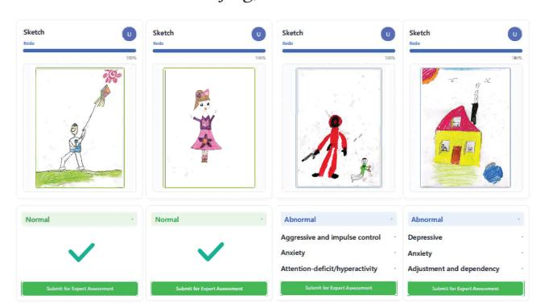
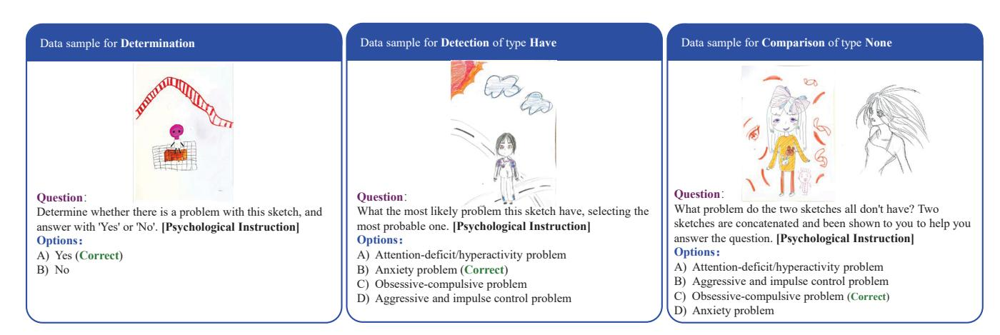
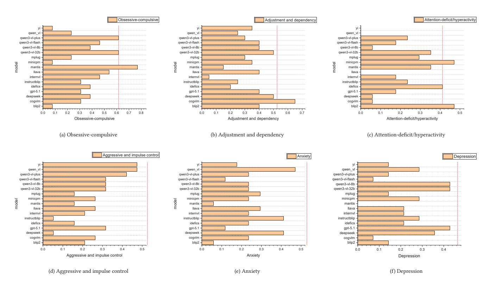

# **DAPWeb: Construct-Aligned Evaluation of MLLMs for Web-Based Child Mental Screening**

Rui Guo∗

rui-guo@foxmail.com School of Marxism, Beijing Normal University Beijing, China

Fengyi Wang∗ 202510411247@uibe.edu.cn School of Artificial Intelligence and Data Science, University of International Business and Economics Beijing, China

Ling-Yu Lin∗ lin\_ling89@163.com Peking University Beijing, China

Guolong Wang†

wangguolong@uibe.edu.cn School of Artificial Intelligence and Data Science, University of International Business and Economics Beijing, China

# **Abstract**

Child mental health screening faces growing challenges from rising psychological problems and limited professional access. Traditional self-report tools rely on verbal ability and self-awareness, limiting their validity in younger children. Projective drawing tests offer a nonverbal alternative, with the Draw-A-Person (DAP) test widely used to elicit psychological cues from drawings. While translating DAP test into Web-based screening, multimodal large language models (MLLMs) are emerging as a key enabling mechanism. However, their ability to deliver construct-level clarity and interpretive consistency for responsible deployment has not been systematically evaluated. To address this gap, we propose DAPWeb, a constructaligned evaluation framework that assesses whether MLLMs can reliably support DAP-based child mental screening in Web environments. DAPWeb introduces a clinically grounded benchmark derived from real drawings and defines task-structured evaluation across six psychological constructs and three essential screening abilities: determination, detection, and comparison. The metrics emphasize construct validity and cross-drawing consistency, reflecting real-world early-screening workflows. Experiments across MLLMs reveal substantial gaps from human experts in most abilities. Yet, the comparable performance on determination suggests that DAP test can serve as a feasible component of Web-based early screening under structured interpretation. Thus, DAPWeb provides a replicable paradigm for responsible Web AI in child mental health.

## **CCS Concepts**

• **Information systems** → **Web applications**;• **Applied computing** → **Psychology**; **Health care information systems**;• **Computing methodologies** → **Computer vision tasks**.

†Corresponding author.

This work is licensed under a Creative Commons Attribution-NonCommercial-NoDerivatives 4.0 International License.

WWW '26, Dubai, United Arab Emirates © 2026 Copyright held by the owner/author(s). ACM ISBN 979-8-4007-2307-0/2026/04 https://doi.org/10.1145/3774904.3792992

**Figure 1: Exemplars of drawings and constructs of mental abnormalities in DAPWeb. We display normal and abnormal drawings from children in the same grade for comparison, each with the boy's drawing on the left.**

#### **Keywords**

DAP-Based Projective Drawing; Construct-Aligned Evaluation; MLLMs; Web-Based Child Mental Screening

#### **ACM Reference Format:**

Rui Guo, Fengyi Wang, Ling-Yu Lin, and Guolong Wang. 2026. DAPWeb: Construct-Aligned Evaluation of MLLMs for Web-Based Child Mental Screening. In Proceedings of the ACM Web Conference 2026 (WWW '26), April 13–17, 2026, Dubai, United Arab Emirates. ACM, New York, NY, USA, 10 pages. https://doi.org/10.1145/3774904.3792992

## **1 Introduction**

Child mental health is a pressing global issue. According to WHO, one in seven adolescents has a mental disorder, accounting for 15% of adolescent disease burden 1, with a rising trend [22]. Though crucial, large-scale screening is challenging due to limited childappropriate methods. Existing tools like questionnaires, checklists, and interviews rely on verbal ability and self-awareness, are prone to bias, and are unsuitable for young or less verbal children, leading to many diagnosed children lacking specialized services 2.

1https://www.who.int/news-room/fact-sheets/detail/adolescent-mental-health 2https://www.cdc.gov/children-mental-health/data-research/index.html

∗ These authors contributed equally to this research.

In response to these challenges, projective drawing tests have gained attention as child-friendly, low-barrier mental assessments that do not rely on verbal reports [10, 34]. Instructing children to "draw a person" (Figure 1), Draw-A-Person test (DAP test) has been widely used in clinical, school, and counseling contexts for early identification of mental abnormalities but relies heavily on expert interpretation [12, 20]. The scarcity of such experts causes regional disparities and limits continuous monitoring. With the recent growth of Web-based automatic mental health services using Multimodal Large Language Models (MLLMs) [21, 23, 50, 53], it becomes possible to alleviate the imbalance in mental health screening resources through the Internet. However, the practical application gradually reveals three inherent questions:

**Q1: How valid is the use of DAP for screening mental abnormalities?** Existing studies have questioned the reliability and validity of DAP as a diagnostic tool and a measure of intellectual level [40], but there is a lack of strong empirical evidence regarding its reliability and validity as a screening tool for mental abnormalities [23]. In practice, this should be the prerequisite for the effective operation of all online screening tools with projective tests.

**Q2: Are MLLMs an effective choice for analyzing DAP results?** We need to evaluate the performance of MLLMs in screening mental abnormalities from DAP results, as large-scale online deployment amplifies the demand for expert resources and necessitates automated aids capable of maintaining reliability at scale [45].

**Q3: Do MLLMs truly comprehend psychological constructs?** The recent advent of MLLMs has demonstrated human-comparable performance in image perception and multimodal reasoning [1, 46], even addressing psychological challenges [35, 38]. Since MLLMs are pretrained on vast corpora, they may internalize a wide range of psychological inventories released long before their development. Thus, if the model does not comprehend psychological constructs but merely performs pattern matching based on specific image features in the training data, it is prone to reasoning failures when encountering out-of-distribution data [25, 33].

To address the above challenges, we propose a benchmark DAP-Web assessing DAP test results for MLLM that features three key characteristics. 1) **Multimodal annotation**. Given the ongoing debate regarding the validity of DAP in psychological research, when constructing the benchmark, we establish ground truth labels by integrating multimodal annotations rather than relying solely on drawings. These annotations incorporate clinical interviews, physiological measurements, and daily behavior observations to ensure consistency between the issues reflected in the drawings and the actual psychological conditions of the individuals. This approach ensures that human expert performance on the benchmark can effectively demonstrate the validity of DAP as a preliminary screening tool. 2) **Validity-practicality framework**. We evaluate MLLMs' mental abnormality screening capability through two dimensions: validity, where we design a Determination task to examine whether MLLMs can identify abnormal drawings, and practicality, where we employ a multiple-choice format to assess the model's suitability for large-scale preliminary screening contexts requiring standardization. 3) **Consistent constructs**. We further design a Detection task to evaluate the model's ability to identify mental abnormalities and a Comparison task to analyze anomalies across two drawings. This framework evaluates whether a model treats abnormality categories

as mere labels or as meaningful psychological constructs embedded in a unified representation space. In particular, the Comparison task examines the model's cross-instance construct consistency.

To the best of our knowledge, DAPWeb is the first multimodal grounded and systematically designed framework for evaluating MLLMs on DAP test assessments. Its main contributions are:

(1) It advances MLLMs beyond visual perception toward constructgrounded reasoning, establishing a foundation for interpretable and fairness-aware AI in mental health.

(2) It serves as both a regulatory instrument and a development tool, enabling standardized, Web-based auditing to determine whether MLLMs are ethically and technically qualified for deployment in psychological screening.

(3) It aligns with the United Nations Sustainable Development Goals, Good Health and Well-Being and Reduced Inequalities, as well as the guiding principle of Leaving No One Behind.

# **2 Related Work**

# **2.1 Web AI Tools for Projective Drawings**

The long-standing practice of Web-based disease screening [36] has recently expanded to include AI-powered projective drawing analysis, introducing automated interpretation and improving accessibility beyond clinical settings. PsyDraw [53] demonstrates the feasibility of large-scale Web deployment using teacher-provided annotations, while PracticeDAPR [47] incorporates clinician ratings to support richer interpretive cues. Other studies explore complementary annotation strategies, including dimension-specific labels [18] or detailed visual element tagging [21, 23], which together illustrate the diversity of emerging approaches. However, the annotation criteria, levels of granularity, and sample sizes vary substantially across systems, leading to differences in how psychological information is represented and modeled. Many Web-based tools also focus on single binary outcomes, and finer-grained analyses often rely on additional modalities such as text or audio [5, 16].

Although a few recent efforts have begun applying MLLMs to projective drawings [53], there remains no work evaluating whether these models are actually suitable for such applications or capable of capturing psychologically meaningful constructs.

#### **2.2 MLLMs for Psychological and Nonverbal Mental-State Reasoning**

Emerging studies demonstrate that MLLMs are beginning to extend beyond surface visual perception toward psychologically meaningful inference. VS-LLM [45] leverages visual–semantic representations in PPAT (Picking an Apple from a Tree) drawings to identify depressive tendencies, showing that symbolic drawing tasks can elicit clinically relevant cues. EmoAda [9] illustrates multimodal emotion perception, while BrainGPT [30] advances reasoning over neuroscience constructs and cognitive processes. Collectively, these efforts suggest that MLLMs exhibit an emerging capacity to interpret mental-state from structured visual stimuli.

Despite this progress, psychology-oriented MLLMs still face notable limitations. Some rely on proprietary clinical data pipelines that hinder transparency and reproducibility [48], whereas others exhibit suboptimal emotional alignment or unstable sensitivity to subtle affective cues [13]. More importantly, existing evaluations

do not systematically test whether models genuinely grasp underlying psychological constructs or merely perform label matching, let alone identify potential counterfactual reasoning errors [2]. What is still lacking, therefore, is a dedicated benchmark that assesses construct validity and cross-instance consistency when models process child-appropriate, nonverbal stimuli such as projective drawings. Given DAP test's established relevance for populations with limited verbal expression, such a benchmark is essential for advancing scalable and equitable Web-based mental health screening.

#### **3 DAPWeb Framework**

#### **3.1 Six Mental Abnormalities**

The objective of the DAP test is to identify the presence of mental abnormalities, with particular suitability and frequent use in K-12 children. Within this test, a construct denotes a latent psychological attribute (e.g., anxiety, depression) that cannot be observed directly but is inferred from symbolic expressions. In our work, each abnormality category corresponds to such a construct, and our evaluation therefore probes whether model outputs align with these theoretically grounded constructs rather than merely matching labels. Together with experts in psychiatry, counseling, and art therapy, we have combined DAP-related diagnostic criteria and the globally recognized DSM-5 standards [37], summarizing six mental abnormalities based on common issues in K-12 populations to effectively evaluate MLLMs: Aggressive and impulse control problem, anxiety problem, adjustment and dependency problem, attention-deficit/hyperactivity problem, depressive problem, and obsessive-compulsive problem. We then construct test samples based on these abnormalities.

#### **3.2 Three Screening Abilities**

We design three tasks, Discrimination, Detection, and Comparison, to evaluate the MLLMs' abilities in DAP test: 1) **Discrimination** involves determining whether a drawing indicates mental abnormalities, requiring recognition of visual differences between normal and abnormal drawings. 2) **Detection** involves identifying specific mental abnormalities from various drawing characteristics, requiring the association of psychological constructs with visual features. 3) **Comparison** involves consistently understanding psychological constructs, requiring differentiation between visual differences across mental abnormalities.

## **4 DAPWeb Construction**

#### **4.1 Overview**

**Multimodal Annotation**. Following the standardized protocol of the DAP test, each child was instructed to produce a single drawing. Following ethical approval, we collaborated with a professional psychological assessment company to integrate these drawings with multimodal evidence, including physiological measurements, expert interviews, and teachers' assessments on the daily performance of children, to conduct comprehensive annotations on the drawings collected. After anonymizing all children's information, the resulting annotations are used to construct DAPWeb. We then craft samples and design multiple-choice questions targeting mental abnormalities and screening abilities.

**Table 1: Data statistics. #Q: Number of related questions. #O: Number of related options.**

| Mental Abnormalities Aggressive and impulse Anxiety problem Adjustment and Attention-deficit/hyperactivity Depressive problem Obsessive-compulsive | #Q 100 control problem 35 39 dependency problem 40 problem 35 27 problem 32 | #O 400 78 62 47 67 66 80 |
|----------------------------------------------------------------------------------------------------------------------------------------------------|-----------------------------------------------------------------------------|--------------------------|
| Tasks                                                                                                                                              | 200                                                                         | 600                      |
| Discrimination                                                                                                                                     | 100                                                                         | 200                      |
| Detection                                                                                                                                          | 60                                                                          | 240                      |
| Comparison                                                                                                                                         | 40                                                                          | 160                      |

**Table 2: Basic low-level physical features of drawings w/ or w/o abnormalities. h\_mean, s\_mean, v\_mean, h\_var, s\_var, and v\_var denote mean and variance of Hue, Saturation, and Value.**

**Statistics**. We present the data statistics of DAPWeb in Table 1. Overall, its scale is consistent with that of existing studies [21]. Note that the answer to the potential question involves multiple abnormalities; we summarize all the mental abnormalities involved in questions, although we only select one of them as the correct answer to include in the options. Hence, the sum of questions involved across different mental abnormalities exceed the total number of questions in the benchmark. For Detection and Comparison abilities explicitly involving mental abnormalities, we ensure that each mental abnormality is represented as an option at least 50 times. In sum, we maintain the frequency of different abnormalities in both the answers and options at a comparable magnitude. This operation can prevent the model from discerning different abnormalities based on frequency discrepancies. We further stratify participants into four K-12 grade bands (K-2, 3-5, 6-8, and 9-12), which account for 40.83%, 20.83%, 27.50%, and 10.83% of the sample, respectively. This distribution aligns with the principle of early detection and treatment in the field of psychological screening.

**Validation of Physical Differences**. During image acquisition, slight variations may arise from differences in equipment or lighting. To assess their potential impact, we compute ten low-level physical features in Table 2, including the NIQE quality [32], Clearness, Light, Color-Shift, and the mean and variance of Hue, Saturation, Value. Drawings are grouped by the presence or absence of mental abnormalities, and group-wise means are compared using a two-sample t-test. The resulting t-statistic (0.04) and p-value (0.97) indicate no significant difference between the two groups, suggesting that models cannot rely on low-level physical features alone to infer mental abnormalities.

## **4.2 Data Collection**

In this section, we detail the process of data collection. We collect drawings from K-12 children, conduct comprehensive annotations

**Figure 2: Three data examples from DAPWeb. The left illustrates a** *Determination* **task with a drawing, a single-stimulus question, and Yes-or-No options. The middle shows a** *Detection* **task with a drawing, a single-stimulus question, and four options. The right contains two drawings, a double-stimulus question, and four options. Psychological instruction is the manifestation of mental abnormalities.**

by integrating these drawings with multimodal evidence, and design multiple-choice questions for evaluation. This design avoids subjective criteria and reduces manual scoring costs, aligning with common practices in standardized assessment to enhance objectivity and operational efficiency [52, 54]. Each sample is defined as a triplet of one to two drawings, a question, and several options. The single-stimulus question employs one drawing per sample, while the double-stimulus one uses two drawings per sample 3.

**Drawings** are produced by recruited K-12 children. Each child receives a standard-sized paper and completes the drawing in 15 minutes, following standardized instructions. All drawings, including non-human figures, objects, or even blank submissions, are retained as valid assessment clues. Experts assess the presence of abnormalities by examining both the figure and the background characteristics, such as the position, size, and facial features.

**Annotations** are derived from drawings together with multimodal evidence collected through a professional psychological assessment company. Such evidence includes gender, grade, HRV indicators [31], interview records, and teachers' reports of daily performance. The company conducts comprehensive evaluations to determine whether each child falls within the normal range and to classify identified psychological abnormalities. The results are reviewed by qualified researchers on our team.

**Questions** also include single- and double-stimulus. We have formatted the questions as multiple-choice with a single correct answer. This implies that even if a drawing may reflect multiple mental abnormalities, we only select one of them to include in the answer options. Single-stimulus questions focus on assessing the model's capability to detect abnormalities. The Discrimination task determines whether any mental abnormalities are present, while the Detection task identifies which specific types of abnormalities are present or absent. For Detection task, we propose two sub-tasks: 1) **Have** identifies abnormalities present in a drawing. 2) **Not** identifies abnormalities absent in a drawing. In contrast, double-stimulus questions evaluate the model's capacity to identify differences through three distinct tasks analyzing psychological constructs: 1) **All** examines abnormality recognition across both drawings; 2) **Diff** identifies divergent abnormalities present in one drawing but absent in the other; 3) **None** recognizes abnormalities absent in both drawings. Data samples of Determination, Have, and None are shown in Figure 2.

**Options** consist of one correct answer and several plausible distractors. There are two types when interacting with MLLMs. 1) **Yes-or-No** contains two options representing a positive or negative response. 2) **What** contains four options for mental abnormalities. To prevent the model from learning the questions' patterns, we exclude options that obviously do not describe mental abnormalities.

## **4.3 Evaluation Method**

We organize the test samples as a progressive ladder of screening abilities to measure the model's mastery of DAP test, from basic discrimination to advanced comparison. In reporting the test results, we present the findings from two perspectives: **ability-oriented** and **abnormality-oriented**. The former highlights the depth of the model's evaluation, while the latter reflects the comprehensiveness of the model's assessment. This approach aligns with the lateral-vertical thinking paradigm [8, 41] of human cognition. For evaluation, we present MLLMs with a sample with one to two drawings, a question, and several options, then ask them to pick the correct answer or generate the correct answer.

## **5 Experiments**

# **5.1 Evaluated Models**

Given the sensitive nature of DAP test data, we mainly evaluate open-sourced methods via local deployment, rather than APIs. For closed-source MLLMs, we choose gpt-5.1-2025-11-13 and evaluate it through the API. Besides, we also evaluate qwen3-vl [4] with both open-sourced (i.e., qwen3-vl-32b-instruct, qwen3-vl-8b-instruct)

3Given the data privacy requirements, we grant access to the data only to applications that have obtained ethical approval in accordance with our established protocols.

**Table 3: Architecture and size of open-sourced models.**

| Model                   |      | Params | LLM                        | ViT              | Projection Module   |
|-------------------------|------|--------|----------------------------|------------------|---------------------|
| BLIP-2 FLAN-T5          | [27] | 12.1B  | FLAN T5 XL/XXL             | ViT-g/14         | MLP                 |
| CogVLM2-Llama3-Chat     | [43] | 19.5B  | Llama-3-8B + Visual Expert | EVA2-CLIP-E      | MLP                 |
| DeepSeek-VL-Chat-7B     | [29] | 7.3B   | DeepSeek-LLM-7B            | SAM-B + SigLIP-L | MLP                 |
| Idefics2-8B             | [24] | 8.4B   | Mistral-7B                 | SigLIP           | MLP                 |
| InstructBLIP-T5         | [7]  | 12.3B  | FLAN T5 XL/XXL             | ViT-g/14         | MLP                 |
| InternVL-Chat-1.5       | [6]  | 25.5B  | InternLM2-20B              | InternViT-6B     | MLP                 |
| LLaVA-1.6-34B           | [28] | 34.8B  | Nous-Hermes-2-Yi-34B       | ViT-L/14         | MLP                 |
| Mantis-8B-siglip-llama3 | [17] | 8.5B   | Llama-3-8B                 | SigLIP           | MLP                 |
| MiniCPM-Llama3-2.5      | [15] | 8.5B   | Llama3-8B                  | SigLip-400M      | Perceiver Resampler |
| mPLUGw-OWL2             | [49] | 8.2B   | Llama-2-7B                 | ViT-L/14         | Visual Abstractor   |
| Qwen-VL-Chat            | [3]  | 9.6B   | Qwen-7B                    | ViT-bigG         | VL Adapter          |
| Yi-VL-Chat              | [51] | 7.1B   | Yi-34B-Chat                | CLIP ViT-H/14    | MLP                 |
| qwen3-vl-32b-instruct   | [4]  | 32B    | Qwen3-LM                   | SigLIP2-SO-400M  | MLP                 |
| qwen3-vl-8b-instruct    | [4]  | 8B     | Qwen3-LM                   | SigLIP2-SO-400M  | MLP                 |

**Table 4: Overall results of different MLLMs and humans on different tasks. The best-performing model in each task is in-bold, and the second-best one is underlined. "Avg" is short for average. We calculate "Overall" by accumulating the Accuracy of all three tasks. As** *Determination* **constitutes a core competency for any screening tool, we set the ratio for** *Determination***,** *Detection***, and** *Comparison* **tasks to 60%:20%:20%. "above-chance" means the proportion of models that exceed chance-level performance.**

| Model                   | Overall | Determination | Have | Detection Not | Avg  | None | All  | Comparison Diff | Avg  |
|-------------------------|---------|---------------|------|---------------|------|------|------|-----------------|------|
| BLIP-2 FLAN-T5          | 0.39    | 0.50          | 0.33 | 0.30          | 0.32 | 0.20 | 0.20 | 0.05            | 0.15 |
| CogVLM2-Llama3-Chat     | 0.41    | 0.50          | 0.40 | 0.23          | 0.32 | 0.30 | 0.20 | 0.20            | 0.23 |
| DeepSeek-VL-Chat-7B     | 0.42    | 0.50          | 0.33 | 0.13          | 0.23 | 0.30 | 0.50 | 0.35            | 0.38 |
| Idefics2-8B             | 0.44    | 0.58          | 0.30 | 0.33          | 0.32 | 0.20 | 0.10 | 0.20            | 0.17 |
| InstructBLIP-T5         | 0.40    | 0.50          | 0.33 | 0.30          | 0.32 | 0.20 | 0.20 | 0.10            | 0.17 |
| InternVL-Chat-1.5       | 0.42    | 0.56          | 0.27 | 0.13          | 0.20 | 0.20 | 0.20 | 0.25            | 0.22 |
| LLaVA-1.6-34B           | 0.42    | 0.51          | 0.20 | 0.33          | 0.27 | 0.20 | 0.30 | 0.35            | 0.28 |
| Mantis-8B-siglip-llama3 | 0.46    | 0.63          | 0.27 | 0.27          | 0.27 | 0.30 | 0.00 | 0.20            | 0.17 |
| MiniCPM-Llama3-2.5      | 0.44    | 0.55          | 0.37 | 0.33          | 0.35 | 0.30 | 0.10 | 0.20            | 0.20 |
| mPLUGw-OWL2             | 0.49    | 0.65          | 0.27 | 0.20          | 0.23 | 0.50 | 0.20 | 0.15            | 0.28 |
| Qwen-VL-Chat            | 0.42    | 0.50          | 0.23 | 0.33          | 0.28 | 0.30 | 0.30 | 0.30            | 0.30 |
| Yi-VL-Chat              | 0.39    | 0.50          | 0.30 | 0.13          | 0.22 | 0.30 | 0.10 | 0.25            | 0.22 |
| qwen3-vl-32b-instruct   | 0.58    | 0.70          | 0.47 | 0.33          | 0.40 | 0.40 | 0.30 | 0.45            | 0.38 |
| qwen3-vl-8b-instruct    | 0.47    | 0.57          | 0.33 | 0.33          | 0.33 | 0.40 | 0.30 | 0.15            | 0.28 |
| qwen3-vl-flash          | 0.49    | 0.65          | 0.27 | 0.27          | 0.27 | 0.30 | 0.20 | 0.25            | 0.25 |
| qwen3-vl-plus           | 0.54    | 0.69          | 0.33 | 0.27          | 0.30 | 0.50 | 0.10 | 0.40            | 0.33 |
| gpt-5.1-2025-11-13      | 0.47    | 0.58          | 0.27 | 0.23          | 0.25 | 0.40 | 0.30 | 0.35            | 0.35 |
| model_avg               | 0.45    | 0.57          | 0.31 | 0.26          | 0.29 | 0.31 | 0.21 | 0.25            | 0.26 |
| above-chance            | (%) –   | 65            | 88   | 65            | 71   | 71   | 35   | 35              | 47   |
| human_avg               | 0.71    | 0.83          | 0.55 | 0.48          | 0.52 | 0.55 | 0.60 | 0.55            | 0.57 |
| human_best              | 0.77    | 0.87          | 0.60 | 0.57          | 0.59 | 0.60 | 0.70 | 0.65            | 0.65 |

and closed-sourced versions (i.e., qwen3-vl-flash, qwen3-vl-plus) in a unified API manner. The detailed information of open-sourced models is shown in Table 3.

#### **5.2 Human Experts Evaluation**

We recruit two experts to participate human evaluation due to limited number of qualified experts available aside from those already involved in annotation. Since the purpose of introducing human evaluation is to assess the discrepancy between MLLMs and human experts, it is not necessary to engage a large number of specialists for this assessment. We denote human\_best as the highest level of performance by human experts across various metrics, and human\_avg as the average level of performance.

## **5.3 Experimental Setup**

We evaluate MLLMs using the original model weights released without any dataset-specific tuning to ensure integrity and fairness. Specifically, we employ vanilla prompting without chain-of-thought (CoT) prompting, as it is infeasible for DAP test to generate rational thought deduction [39]. For each model, we adopt a zero-shot

setting. Uniform prompts are applied across all MLLMs. As we adopt multiple-choice questions, we evaluate the MLLMs with four metrics: (1)Accuracy: the proportion of choosing the correct answer. (2)Precision: the average proportion of detecting the correct categories of abnormalities. For Determination, it means correctly choosing Yes for the abnormal samples. (3) Recall: same setting with Precision. (4) F1: a harmonic mean of Precision and Recall.

Some MLLMs cannot generate outputs aligned with the instructed format consistently. For instance, in Yes-or-No options, different MLLMs may output a correct answer A) Yes in different formats: "A) Yes", "A", "Yes", "The drawing has mental abnormalities". We adopt a language processing script to address this issue.

#### **5.4 Main Results**

5.4.1 Overview. We first report the overall performance of these MLLMs in Table 4. Notably, across repeated evaluations of representative models (five runs per model), performance variability across metrics remains minimal, with over 75% of variance values below 1.1 × 10−3 and a mean variance below 1.0 × 10−3. We have the following observations:

(1) **Validation for Q1**. The performance of human experts exceeds the chance level across all three tasks. The experts achieve an accuracy of 83% in the Determination task, indicating that screening based solely on drawings can yield results comparable to those obtained through multimodal information integration. This finding demonstrates the viability of the DAP as a screening tool and concurrently validates the rationality of the benchmark. We also note a significant decline in expert performance in Detection and Comparison tasks compared to Determination. This is because DAP test is primarily used for initial testing, and more precise detection of specific mental abnormalities may require additional information such as interviews and physiological measurements [37].

(2) **Validation for Q2**. Several models significantly exceed chance level in the Determination task (65%), with some closely approximating the performance of human experts (e.g., qwen3-vl-32b-instruct). These results indicate that MLLMs can serve as effective tools for analyzing DAP test, thereby enabling the development of Web applications to support DAP-based screening. However, the overall performance of all MLLMs is inferior to the average performance of human experts. The best-performing model exhibits relative performance gaps of 15.6%, 23.1%, and 33.3% in Determination, Detection, and Comparison tasks, respectively. It can be observed that the model is closest to human experts in the Determination task, suggesting that MLLMs may offer assistance to humans in the initial testing process for mental abnormalities in the future.

(3) **Validation for Q3**. MLLMs exhibit limited capability in understanding the psychological constructs underlying DAP test. Although the strongest model reaches an accuracy of 0.38 in the Comparison task, this level remains far from the threshold needed for further diagnosis after screening, particularly since most models cluster near 0.20. A closer examination reveals that current MLLMs treat DAP assessment largely as an image classification problem. Their predictions appear driven primarily by visual features rather than by stable mappings between visual features and underlying constructs. For example, the strongest model, qwen3-vl-32b-instruct, may benefit from its SigLIP2-SO-400M visual encoder,

**Table 5: Results of different MLLMs on** *Determination* **task. The best-performing model is in-bold.**

| Model                   | Accuracy | Precision | Recall | F1   |
|-------------------------|----------|-----------|--------|------|
| BLIP-2 FLAN-T5          | 0.50     | 0.00      | 0.00   | 0.00 |
| CogVLM2-Llama3-Chat     | 0.50     | 0.00      | 0.00   | 0.00 |
| DeepSeek-VL-Chat-7B     | 0.50     | 0.00      | 0.00   | 0.00 |
| Idefics2-8B             | 0.58     | 1.00      | 0.16   | 0.28 |
| InstructBLIP-T5         | 0.50     | 0.00      | 0.00   | 0.00 |
| InternVL-Chat-1.5       | 0.56     | 0.67      | 0.24   | 0.35 |
| LLaVA-1.6-34B           | 0.51     | 0.67      | 0.04   | 0.08 |
| Mantis-8B-siglip-llama3 | 0.63     | 0.88      | 0.30   | 0.45 |
| MiniCPM-Llama3-2.5      | 0.55     | 0.54      | 0.72   | 0.62 |
| mPLUGw-OWL2             | 0.65     | 0.71      | 0.50   | 0.59 |
| Qwen-VL-Chat            | 0.50     | 0.00      | 0.00   | 0.00 |
| Yi-VL-Chat              | 0.50     | 0.00      | 0.00   | 0.00 |
| qwen3-vl-32b-instruct   | 0.70     | 0.92      | 0.44   | 0.59 |
| qwen3-vl-8b-instruct    | 0.57     | 1.00      | 0.14   | 0.25 |
| qwen3-vl-flash          | 0.65     | 0.94      | 0.32   | 0.48 |
| qwen3-vl-plus           | 0.69     | 0.91      | 0.42   | 0.58 |
| gpt-5.1-2025-11-13      | 0.58     | 1.00      | 0.16   | 0.28 |
| human_best              | 0.87     | 0.89      | 0.84   | 0.87 |
| human_avg               | 0.83     | 0.83      | 0.84   | 0.83 |

which extracts higher-level semantic features beyond raw pixel information. However, this advantage still reflects improved perceptual abstraction rather than true psychological inference. This limitation is evident when comparing models: DeepSeek-VL-Chat-7B and qwen3-vl-32b-instruct both achieve the best performance in Comparison task, while the former substantially underperforms the latter on the Detemination task. These inconsistencies further indicate that the models lack a coherent representation of psychological constructs and struggle to apply them consistently across different requirements. Overall, the results suggest that MLLMs lack the construct-aligned understanding needed for responsible post-screening diagnosis using projective drawings.

5.4.2 Ability-oriented Analysis. In this section, we report detailed results for each task and illuminate systematic gaps between human reasoning and current MLLM performance on understanding psychological constructs.

**Determination**. In Table 5, we consider instances with mental abnormalities as positive cases, and those without as negative cases. We calculate Precision, Recall, and F1 based on this setting. Surprisingly, six models fail to recognize the presence of abnormality in the drawings, yielding zero scores across these metrics, suggesting that models without DAP test-specific fine-tuning are likely to fall short of the required performance standards.

**Detection**. The results in Table 6 reveal that MLLMs do not yet demonstrate construct-aligned psychological reasoning. On average, models perform better on Have than on Not, and this drop on Not is also observed for the human average. This pattern is psychologically meaningful: DAP is designed to detect potential mental abnormalities, not to guarantee their absence, so both humans and models find it easier to detect when a construct is expressed than when it is genuinely missing. From a construct perspective, this implies that both parties rely more on positive cues (e.g., depressive line pressure) than on a well-formed representation of a "normal" baseline. Hence, the Not sub-task is inherently more challenging in cognitive science as it requires the exclusion of all positive cues [44].

For MLLMs, however, the construct misalignment is stronger. Several models attain reasonably good scores in the Not sub-task, but the variance across models is small, indicating that they tend to

**Table 6: Results of different MLLMs on** *Detection* **task. The best-performing model is in-bold. "A", "P", "R", "F1" are short for accuracy, precision, recall, and F1, respectively.**

| Model                   | A    | P    | Average R | F1   | A    | P    | Have R | F1   | A    | P    | Not R | F1   |
|-------------------------|------|------|-----------|------|------|------|--------|------|------|------|-------|------|
| BLIP-2 FLAN-T5          | 0.32 | 0.31 | 0.30      | 0.26 | 0.33 | 0.26 | 0.30   | 0.26 | 0.30 | 0.36 | 0.30  | 0.26 |
| CogVLM2-Llama3-Chat     | 0.32 | 0.33 | 0.26      | 0.26 | 0.40 | 0.28 | 0.29   | 0.28 | 0.23 | 0.37 | 0.23  | 0.24 |
| DeepSeek-VL-Chat-7B     | 0.23 | 0.14 | 0.19      | 0.15 | 0.33 | 0.18 | 0.24   | 0.20 | 0.13 | 0.11 | 0.13  | 0.09 |
| Idefics2-8B             | 0.32 | 0.28 | 0.27      | 0.25 | 0.30 | 0.26 | 0.21   | 0.22 | 0.33 | 0.31 | 0.33  | 0.29 |
| InstructBLIP-T5         | 0.32 | 0.36 | 0.33      | 0.27 | 0.33 | 0.37 | 0.36   | 0.27 | 0.30 | 0.35 | 0.30  | 0.26 |
| InternVL-Chat-1.5       | 0.20 | 0.18 | 0.19      | 0.16 | 0.27 | 0.26 | 0.25   | 0.22 | 0.13 | 0.09 | 0.13  | 0.10 |
| LLaVA-1.6-34B           | 0.27 | 0.33 | 0.27      | 0.23 | 0.20 | 0.18 | 0.20   | 0.17 | 0.33 | 0.48 | 0.33  | 0.30 |
| Mantis-8B-siglip-llama3 | 0.27 | 0.32 | 0.23      | 0.21 | 0.27 | 0.50 | 0.19   | 0.25 | 0.27 | 0.14 | 0.27  | 0.17 |
| MiniCPM-Llama3-2.5      | 0.35 | 0.34 | 0.30      | 0.30 | 0.37 | 0.41 | 0.26   | 0.31 | 0.33 | 0.27 | 0.33  | 0.29 |
| mPLUGw-OWL2             | 0.23 | 0.21 | 0.23      | 0.20 | 0.27 | 0.27 | 0.25   | 0.24 | 0.20 | 0.15 | 0.20  | 0.17 |
| Qwen-VL-Chat            | 0.28 | 0.26 | 0.27      | 0.25 | 0.23 | 0.17 | 0.20   | 0.18 | 0.33 | 0.36 | 0.33  | 0.31 |
| Yi-VL-Chat              | 0.22 | 0.17 | 0.17      | 0.16 | 0.30 | 0.19 | 0.21   | 0.19 | 0.13 | 0.14 | 0.13  | 0.13 |
| qwen3-vl-32b-instruct   | 0.40 | 0.44 | 0.40      | 0.36 | 0.47 | 0.60 | 0.47   | 0.47 | 0.33 | 0.28 | 0.33  | 0.26 |
| qwen3-vl-8b-instruct    | 0.33 | 0.41 | 0.35      | 0.29 | 0.33 | 0.61 | 0.36   | 0.34 | 0.33 | 0.21 | 0.33  | 0.24 |
| qwen3-vl-flash          | 0.27 | 0.36 | 0.26      | 0.22 | 0.27 | 0.50 | 0.25   | 0.24 | 0.27 | 0.22 | 0.27  | 0.21 |
| qwen3-vl-plus           | 0.30 | 0.41 | 0.28      | 0.26 | 0.33 | 0.53 | 0.29   | 0.33 | 0.27 | 0.29 | 0.27  | 0.19 |
| gpt-5.1-2025-11-13      | 0.25 | 0.33 | 0.24      | 0.22 | 0.27 | 0.47 | 0.25   | 0.25 | 0.23 | 0.19 | 0.23  | 0.18 |
| human_avg               | 0.48 | 0.48 | 0.43      | 0.41 | 0.55 | 0.54 | 0.45   | 0.45 | 0.40 | 0.43 | 0.40  | 0.37 |
| human_best              | 0.55 | 0.60 | 0.49      | 0.49 | 0.60 | 0.56 | 0.49   | 0.50 | 0.50 | 0.63 | 0.50  | 0.49 |

converge on similar, generic heuristics for declaring no abnormality, rather than on nuanced, construct-specific absence reasoning. In contrast, the Have sub-task shows a larger performance spread and clearly separates stronger from weaker models, which is consistent with models learning to latch onto certain salient visual patterns without forming stable psychological constructs. Taken together, the asymmetry between Have and Not suggests that current MLLMs can pick up some construct-related visual cues when abnormalities are present, but they lack a balanced, construct-aligned understanding of drawings, highlighting a gap between visual pattern recognition and true construct-level mental-state inference. **Comparison**. Table 7 further demonstrate that current MLLMs lack stable construct-aligned reasoning. Human experts achieve high and balanced performance across the three sub-tasks, reflecting their ability to maintain coherent psychological constructs across multiple drawings. In contrast, most MLLMs perform substantially worse, with average F1 scores typically around 0.20–0.30, far below the human average. This gap indicates that the models struggle to integrate construct-relevant cues across drawings.

A notable finding is that DeepSeek-VL-Chat performs exceptionally well on the Comparison task (F1 = 0.32, best overall) yet performs near chance level on Determination. This dissociation is informative rather than contradictory. It suggests that DeepSeek-VL-Chat has learned relational, comparison-based sensitivity to construct-relevant cues, without having fully calibrated absolute criteria for labeling a drawing as having a specific construct. Cognitive research shows similar patterns: people often succeed at relative or comparative judgments before they can reliably make absolute categorizations [11]. This result directly validates the complementary nature of the three tasks in our DAPWeb, which are designed to assess MLLMs' construct alignment from multiple perspectives. 5.4.3 Abnormality-Oriented Analysis. We analyze the accuracy of different models in recognizing various mental abnormalities. We visualize the performance of different models on different mental abnormalities in Figure 3. The main findings are: 1) Several models consistently achieve accuracy significantly higher than the chance level (25%) in specific tasks, indicating reliable discrimination ability for certain psychological constructs. 2) Models exhibit differential sensitivity to distinct psychological constructs. 3) Variability in

**Table 7: Results of different MLLMs on** *Comparison* **task. The best-performing model is in-bold, but those below the chance level are not. "A", "P", and "R" are short for accuracy, precision, and recall, respectively.**

| Model                   | A    | P    | Average R | F1   | A    | P    | None R | F1   | A    | P    | All R | F1   | A    | P    | Diff R | F1   |
|-------------------------|------|------|-----------|------|------|------|--------|------|------|------|-------|------|------|------|--------|------|
| BLIP-2 FLAN-T5          | 0.15 | 0.16 | 0.15      | 0.12 | 0.20 | 0.19 | 0.25   | 0.16 | 0.20 | 0.20 | 0.17  | 0.16 | 0.05 | 0.08 | 0.04   | 0.06 |
| CogVLM2-Llama3-Chat     | 0.23 | 0.17 | 0.19      | 0.15 | 0.30 | 0.21 | 0.25   | 0.22 | 0.20 | 0.06 | 0.17  | 0.08 | 0.20 | 0.23 | 0.17   | 0.15 |
| DeepSeek-VL-Chat-7B     | 0.38 | 0.35 | 0.36      | 0.32 | 0.30 | 0.11 | 0.25   | 0.15 | 0.50 | 0.55 | 0.50  | 0.46 | 0.35 | 0.38 | 0.33   | 0.33 |
| Idefics2-8B             | 0.17 | 0.14 | 0.15      | 0.13 | 0.20 | 0.07 | 0.17   | 0.10 | 0.10 | 0.17 | 0.08  | 0.11 | 0.20 | 0.17 | 0.21   | 0.17 |
| InstructBLIP-T5         | 0.17 | 0.13 | 0.14      | 0.13 | 0.20 | 0.17 | 0.17   | 0.17 | 0.20 | 0.11 | 0.17  | 0.13 | 0.10 | 0.12 | 0.08   | 0.09 |
| InternVL-Chat-1.5       | 0.22 | 0.18 | 0.21      | 0.17 | 0.20 | 0.09 | 0.25   | 0.13 | 0.20 | 0.20 | 0.17  | 0.16 | 0.25 | 0.24 | 0.21   | 0.21 |
| LLaVA-1.6-34B           | 0.28 | 0.22 | 0.25      | 0.22 | 0.20 | 0.11 | 0.17   | 0.13 | 0.30 | 0.26 | 0.25  | 0.23 | 0.35 | 0.30 | 0.33   | 0.29 |
| Mantis-8B-siglip-llama3 | 0.17 | 0.06 | 0.18      | 0.09 | 0.30 | 0.10 | 0.33   | 0.16 | 0.00 | 0.00 | 0.00  | 0.00 | 0.20 | 0.07 | 0.21   | 0.11 |
| MiniCPM-Llama3-2.5      | 0.20 | 0.18 | 0.18      | 0.17 | 0.30 | 0.31 | 0.25   | 0.26 | 0.10 | 0.03 | 0.08  | 0.04 | 0.20 | 0.21 | 0.21   | 0.21 |
| mPLUGw-OWL2             | 0.28 | 0.30 | 0.28      | 0.26 | 0.50 | 0.56 | 0.50   | 0.47 | 0.20 | 0.13 | 0.17  | 0.14 | 0.15 | 0.21 | 0.17   | 0.18 |
| Qwen-VL-Chat            | 0.30 | 0.23 | 0.32      | 0.24 | 0.30 | 0.19 | 0.33   | 0.23 | 0.30 | 0.29 | 0.33  | 0.26 | 0.30 | 0.21 | 0.29   | 0.23 |
| Yi-VL-Chat              | 0.22 | 0.22 | 0.18      | 0.19 | 0.30 | 0.25 | 0.25   | 0.25 | 0.10 | 0.17 | 0.08  | 0.11 | 0.25 | 0.24 | 0.21   | 0.20 |
| qwen3-vl-32b-instruct   | 0.38 | 0.36 | 0.33      | 0.30 | 0.40 | 0.31 | 0.33   | 0.28 | 0.30 | 0.22 | 0.25  | 0.19 | 0.45 | 0.55 | 0.42   | 0.42 |
| qwen3-vl-8b-instruct    | 0.28 | 0.27 | 0.29      | 0.25 | 0.40 | 0.31 | 0.42   | 0.34 | 0.30 | 0.28 | 0.33  | 0.26 | 0.15 | 0.21 | 0.13   | 0.13 |
| qwen3-vl-flash          | 0.25 | 0.13 | 0.22      | 0.16 | 0.30 | 0.13 | 0.25   | 0.16 | 0.20 | 0.07 | 0.17  | 0.10 | 0.25 | 0.21 | 0.25   | 0.22 |
| qwen3-vl-plus           | 0.33 | 0.34 | 0.33      | 0.30 | 0.50 | 0.47 | 0.50   | 0.44 | 0.10 | 0.08 | 0.08  | 0.08 | 0.40 | 0.46 | 0.42   | 0.36 |
| gpt-5.1-2025-11-13      | 0.35 | 0.24 | 0.33      | 0.25 | 0.40 | 0.22 | 0.33   | 0.27 | 0.30 | 0.15 | 0.33  | 0.21 | 0.35 | 0.35 | 0.33   | 0.29 |
| human_avg               | 0.57 | 0.62 | 0.61      | 0.57 | 0.55 | 0.64 | 0.63   | 0.59 | 0.60 | 0.69 | 0.67  | 0.62 | 0.55 | 0.52 | 0.54   | 0.49 |
| human_best              | 0.65 | 0.69 | 0.68      | 0.65 | 0.60 | 0.73 | 0.67   | 0.65 | 0.70 | 0.78 | 0.75  | 0.72 | 0.65 | 0.56 | 0.63   | 0.57 |

**Figure 3: Accuracy of different models on mental abnormalities. yi, qwen\_vl, qwen3-vl-8b, qwen3-vl-32b, mplug, minicpm, mantis, llava, internvl, instructblip, idefics, gpt-5.1, deepseek, cogvlm, blip2 are short for Yi-VL-Chat, Qwen-VL-Chat, qwen3-vl-8b-instruct, qwen3-vl-32b-instruct, mPLUGw-OWL2, MiniCPM-Llama3-2.5, Mantis-8B-siglip-llama3, LLaVA-1.6-34B, InternVL-Chat-1.5, InstructBLIP-T5, Idefics2-8B, gpt-5.1-2025-11-13, DeepSeek-VL-Chat-7B, CogVLM2-Llama3-Chat, and BLIP-2 FLAN-T5, respectively. The red dash-dot line means results of "human\_avg".**

**Table 8: Significance of the t-test of ten indicators between w/ or w/o mental abnormalities classified by different models. h\_mean, s\_mean, v\_mean, h\_var, s\_var, and v\_var denote the mean and variance of Hue, Saturation, and Value.**

| Model                   | niqe | h_mean | s_mean | v_mean | h_var | s_var | v_var | clear | light | color_shift |
|-------------------------|------|--------|--------|--------|-------|-------|-------|-------|-------|-------------|
| Idefics2-8B             | 0.05 | 0.12   | 0.26   | 0.94   | 0.53  | 0.16  | 0.06  | 0.11  | 0.49  | 0.72        |
| InternVL-Chat-1.5       | 0.70 | 0.55   | 0.90   | 0.39   | 0.96  | 0.26  | 0.99  | 0.81  | 0.81  | 0.25        |
| LLaVA-1.6-34B           | 0.74 | 0.82   | 0.07   | 0.84   | 0.14  | 0.00  | 0.01  | 0.90  | 0.48  | 0.58        |
| Mantis-8B-siglip-llama3 | 0.76 | 0.52   | 0.94   | 0.66   | 0.86  | 0.35  | 0.90  | 0.00  | 0.71  | 0.40        |
| MiniCPM-Llama3-2.5      | 0.80 | 0.30   | 0.07   | 0.14   | 0.88  | 0.08  | 0.28  | 0.45  | 0.39  | 0.85        |
| mPLUGw-OWL2             | 0.69 | 0.34   | 0.19   | 0.88   | 0.60  | 0.36  | 0.38  | 0.00  | 0.42  | 0.38        |

performance across models mirrored human individual differences, where no single model dominates all tasks, emphasizing the heterogeneity of psychological processing mechanisms [19].

5.4.4 Impact of Physical Features. We have ensured that there are no significant differences in low-level physical features between the presence and absence of mental abnormalities during the data preparation. In the experiment, we conduct a similar verification. As indicated in Table 5, six local-deployment models successfully distinguish between the presence and absence of mental abnormalities. We conduct t-tests on ten low-level physical feature indicators across model predictions and mostly observe no significant differences between the two sample groups (Table 8), suggesting that model decisions are not driven by low-level physical features.

#### **5.5 Discussion**

Our analyses reveal several key insights into how both humans and current MLLMs process DAP-based psychological cues, shedding light on their respective strengths, limitations, and developmental considerations. **First, we identify abnormality-specific error asymmetries that differ between humans and AI**. MLLMs perform better on adjustment and dependence frequently presented by structural cues, but struggle with affective or stylistically abstract abnormalities. For instance, abnormalities such as anxiety and depression exhibit higher false negatives in AI, suggesting that models struggle to integrate subtle cues (e.g., line pressure, shading) and expressive themes or emotions, which human experts intuitively process. In addition, abnormalities like obsessive-compulsive and attention-deficit/hyperactivity problems often result in high false positives across both AI and humans, likely due to common visual elements (e.g., repetition, disorganization) in children's drawings that require contextual disambiguation. **Second, our multi-format design on three core abilities (determination, detection, and comparison) reveals the boundaries of current model reasoning**. Both human experts and MLLMs exhibit higher performance in the Determination task compared to Detection or Comparison tasks. This aligns with the clinical use of projective drawing tests, which excel at signaling general psychological disturbance but often require additional instruments for specific diagnosis [14]. Notably, while most MLLMs perform better on single-image classification, their performance on dual-image comparison varies substantially across models. To probe this variability at the representation level, we conduct per-model MMD tests on ViT embeddings and find that for 11 of 17 MLLMs (p < 0.05), correctly and incorrectly classified

drawings occupy different semantic regions, indicating instancelevel construct-alignment instability within the same model. Human experts, by contrast, demonstrate more consistent performance across all task types, reflecting integrative construct-based reasoning. **Third, the benchmark highlights the importance of developmental context in the Web community**. At the screening level, a Kruskal–Wallis test reveals no significant difference in F1 across four grade groups (H = 2.45, p = 0.48), indicating limited confounding effects from age-related drawing development. This age-robust screening performance supports the feasibility of deploying automated tools that flag potential psychological concerns through nonverbal cues such as drawings, especially as youth mental health concerns continue to rise while access to trained professionals remains limited [26].

**Limitations**. Current DAPWeb does not assess the ability to differentiate diagnostic from non-diagnostic visual patterns, particularly when common artistic features (e.g., symmetry or repetition) lead to over-detection, a limitation also observed in other Web tasks. For instance, models may misinterpret benign visual cues as hateful content [42]. Moreover, this limitation is grounded in the longstanding debates surrounding the validity of the DAP test itself, particularly beyond screening contexts. Accordingly, DAPWeb does not assume diagnostic reliability, but treats the DAP test strictly as a screening-level signal for benchmarking model behavior rather than as a standalone clinical instrument. This may motivate future research to design evaluation protocols that explicitly differentiate diagnostic constructs from common motifs.

**Ethical Considerations**. In data collection, all data are anonymized before analysis. The study was approved by the Institutional Review Board at Beijing Normal University (approval #202303060045, on March, 2023), with data use permission from the company. Despite encouraging results, all predictions in this work are intended for non-clinical research and screening support only. Diagnostic decisions should remain with qualified professionals.

#### **6 Conclusion**

We introduce DAPWeb, the first construct-aligned evaluation framework designed to assess whether MLLMs can support responsible, Web-based child mental health screening. Through a clinically grounded benchmark and a multi-format task design, our results clarify both the potential and the limitations of MLLMs in interpreting projective drawings. The findings show that while models approach human-level performance in determining the presence of mental abnormalities, they fall short in construct-level understanding, revealing fundamental gaps in psychological reasoning rather than perception alone. These limitations suggest that while MLLMs may support early-stage screening in Web-based pipelines, their use in downstream diagnostic decision-making requires substantial caution. Our DAPWeb offers the Web community a rare child-focused nonverbal dataset and a construct-aligned audit protocol, enabling objective evaluation of MLLMs for equitable and developmentally appropriate Web-based screening.

## **Acknowledgments**

This work was supported by the Beijing Social Science Fund under Grant 25BJ03235.

#### **References**

[1] Josh Achiam, Steven Adler, Sandhini Agarwal, Lama Ahmad, Ilge Akkaya, Florencia Leoni Aleman, Diogo Almeida, Janko Altenschmidt, Sam Altman, Shyamal Anadkat, et al. 2023. Gpt-4 technical report. arXiv preprint arXiv:2303.08774 (2023). [2] Isabelle Augenstein, Timothy Baldwin, Meeyoung Cha, Tanmoy Chakraborty, Giovanni Luca Ciampaglia, David Corney, Renee DiResta, Emilio Ferrara, Scott Hale, Alon Halevy, et al. 2024. Factuality challenges in the era of large language models and opportunities for fact-checking. Nature Machine Intelligence 6, 8 (2024), 852–863. [3] Jinze Bai, Shuai Bai, Shusheng Yang, Shijie Wang, Sinan Tan, Peng Wang, Junyang Lin, Chang Zhou, and Jingren Zhou. 2023. Qwen-vl: A frontier large visionlanguage model with versatile abilities. arXiv preprint arXiv:2308.12966 (2023). [4] Shuai Bai, Yuxuan Cai, Ruizhe Chen, Keqin Chen, Xionghui Chen, Zesen Cheng, Lianghao Deng, Wei Ding, Chang Gao, Chunjiang Ge, Wenbin Ge, Zhifang Guo, Qidong Huang, Jie Huang, Fei Huang, Binyuan Hui, Shutong Jiang, Zhaohai Li, Mingsheng Li, Mei Li, Kaixin Li, Zicheng Lin, Junyang Lin, Xuejing Liu, Jiawei Liu, Chenglong Liu, Yang Liu, Dayiheng Liu, Shixuan Liu, Dunjie Lu, Ruilin Luo, Chenxu Lv, Rui Men, Lingchen Meng, Xuancheng Ren, Xingzhang Ren, Sibo Song, Yuchong Sun, Jun Tang, Jianhong Tu, Jianqiang Wan, Peng Wang, Pengfei Wang, Qiuyue Wang, Yuxuan Wang, Tianbao Xie, Yiheng Xu, Haiyang Xu, Jin Xu, Zhibo Yang, Mingkun Yang, Jianxin Yang, An Yang, Bowen Yu, Fei Zhang, Hang Zhang, Xi Zhang, Bo Zheng, Humen Zhong, Jingren Zhou, Fan Zhou, Jing Zhou, Yuanzhi Zhu, and Ke Zhu. 2025. Qwen3-VL Technical Report. arXiv:2511.21631 [cs.CV] https://arxiv.org/abs/2511.21631 [5] Dhananjay Bhagat, Kartik Maski, Swamil Randive, Harsh Dhimmar, Ramadevi Vitthal Salunkhe, and Devendra Joshi. 2025. Automated Psychological Profiling from Children's Drawings Using Deep Learning and Natural Language Processing. In 2025 International Conference on Intelligent and Cloud Computing (ICoICC). IEEE, 1–6. [6] Zhe Chen, Weiyun Wang, Hao Tian, Shenglong Ye, Zhangwei Gao, Erfei Cui, Wenwen Tong, Kongzhi Hu, Jiapeng Luo, Zheng Ma, et al. 2024. How far are we to gpt-4v? closing the gap to commercial multimodal models with open-source suites. Science China Information Sciences 67, 12 (2024), 220101. [7] Wenliang Dai, Junnan Li, Dongxu Li, Anthony Meng Huat Tiong, Junqi Zhao, Weisheng Wang, Boyang Li, Pascale N Fung, and Steven Hoi. 2024. Instructblip: Towards general-purpose vision-language models with instruction tuning. Advances in neural information processing systems 36 (2023) (2024). [8] Edward De Bono. 1969. Information processing and new ideas—Lateral and vertical thinking. The Journal of Creative Behavior 3, 3 (1969), 159–171. [9] Tengteng Dong, Fangyuan Liu, Xinke Wang, Yishun Jiang, Xiwei Zhang, and Xiao Sun. 2024. EmoAda: A Multimodal Emotion Interaction and Psychological Adaptation System. In International Conference on Multimedia Modeling. Springer, 301–307. [10] Judith E. Fan, Wilma A. Bainbridge, Rebecca Chamberlain, and Jeffrey D. Wammes. 2023. Drawing as a versatile cognitive tool. Nature Reviews Psychology 2, 9 (Sept. 2023), 556–568. Publisher: Nature Publishing Group. [11] Dedre Gentner and Laura L Namy. 1999. Comparison in the development of categories. Cognitive development 14, 4 (1999), 487–513. [12] Florence L. Goodenough. 1926. A New Approach to the Measurement of the Intelligence of Young Children. The Pedagogical Seminary and Journal of Genetic Psychology (June 1926). Publisher: Taylor & Francis Group. [13] Rui Guo, Guolong Wang, Ding Wu, and Zhen Wu. 2025. Keep bright in the dark: Multimodal emotional effects on donation-based crowdfunding performance and their empathic mechanisms. British Journal of Psychology (2025). [14] Elliot D. Hill, Pratik Kashyap, Elizabeth Raffanello, Yun Wang, Terrie E. Moffitt, Avshalom Caspi, Matthew Engelhard, and Jonathan Posner. 2025. Prediction of mental health risk in adolescents. Nature Medicine 31, 6 (June 2025), 1840–1846. Publisher: Nature Publishing Group. [15] Jinyi Hu, Yuan Yao, Chongyi Wang, Shan Wang, Yinxu Pan, Qianyu Chen, Tianyu Yu, Hanghao Wu, Yue Zhao, et al. 2023. Large Multilingual Models Pivot Zero-Shot Multimodal Learning across Languages. arXiv preprint arXiv:2308.12038 (2023). [16] Hanyu Huang, Weike Zeng, Tianle Wang, Yujie Liu, Chenyu Cao, Runnan Li, and Wenjun Hou. 2025. AI-Enhanced HTP Test Analysis and Emotion Recognition for Personalized Psychotherapy Interventions. In International Conference on Human-Computer Interaction. Springer, 301–313. [17] Dongfu Jiang, Xuan He, Huaye Zeng, Cong Wei, Max Ku, Qian Liu, and Wenhu Chen. 2024. MANTIS: Interleaved Multi-Image Instruction Tuning. arXiv preprint arXiv:2405.01483 (2024). [18] Seungwan Jin, Hoyoung Choi, and Kyungsik Han. 2022. Ai-augmented art psychotherapy through a hierarchical co-attention mechanism. In Proceedings of the 31st ACM International Conference on Information and Knowledge Management. 4089–4093. [19] Ned H. Kalin. 2020. The Critical Relationship Between Anxiety and Depression. American Journal of Psychiatry 177, 5 (May 2020), 365–367. Publisher: American Psychiatric Publishing. [20] Randy W. Kamphaus and Karen L. Pleiss. 1991. Draw-a-Person techniques: Tests in search of a construct. Journal of School Psychology 29, 4 (Dec. 1991), 395–401. [21] Jiwon Kang, Jiwon Kim, Migyeong Yang, Chaehee Park, Taeeun Kim, Hayeon Song, and Jinyoung Han. 2024. SceneDAPR: A scene-level free-hand drawing dataset for web-based psychological drawing assessment. In Proceedings of the ACM Web Conference 2024. 4630–4641. [22] Katherine M Keyes, Noah T Kreski, and Megan E Patrick. 2024. Depressive symptoms in adolescence and young adulthood. JAMA Network Open 7, 8 (2024), e2427748–e2427748. [23] Jiwon Kim, Jiwon Kang, Migyeong Yang, Chaehee Park, Taeeun Kim, Hayeon Song, and Jinyoung Han. 2025. Developing an AI-based explainable expert support system for art therapy. ACM Transactions on Interactive Intelligent Systems 14, 4 (2025), 1–23. [24] Hugo Laurençon, Léo Tronchon, Matthieu Cord, and Victor Sanh. 2024. What matters when building vision-language models? arXiv preprint arXiv:2405.02246 (2024). [25] Byunghwee Lee, Rachith Aiyappa, Yong-Yeol Ahn, Haewoon Kwak, and Jisun An. 2025. A semantic embedding space based on large language models for modelling human beliefs. Nature Human Behaviour (2025), 1–13. [26] Francis S. Lee, Hakon Heimer, Jay N. Giedd, Edward S. Lein, Nenad Šestan, Daniel R. Weinberger, and B. J. Casey. 2014. Adolescent mental health—Opportunity and obligation. Science (Oct. 2014). Publisher: American Association for the Advancement of Science. [27] Junnan Li, Dongxu Li, Silvio Savarese, and Steven Hoi. 2023. Blip-2: Bootstrapping language-image pre-training with frozen image encoders and large language models. In International Conference on Machine Learning. PMLR, 19730–19742. [28] Haotian Liu, Chunyuan Li, Yuheng Li, and Yong Jae Lee. 2024. Improved baselines with visual instruction tuning. In Proceedings of the IEEE/CVF Conference on Computer Vision and Pattern Recognition. 26296–26306. [29] Haoyu Lu, Wen Liu, Bo Zhang, Bingxuan Wang, Kai Dong, Bo Liu, Jingxiang Sun, Tongzheng Ren, Zhuoshu Li, Yaofeng Sun, et al. 2024. Deepseek-vl: towards realworld vision-language understanding. arXiv preprint arXiv:2403.05525 (2024). [30] Xiaoliang Luo, Akilles Rechardt, Guangzhi Sun, Kevin K Nejad, Felipe Yáñez, Bati Yilmaz, Kangjoo Lee, Alexandra O Cohen, Valentina Borghesani, Anton Pashkov, et al. 2024. Large language models surpass human experts in predicting neuroscience results. Nature Human Behaviour (2024), 1–11. [31] Marek Malik and A John Camm. 1990. Heart rate variability. Clinical cardiology 13, 8 (1990), 570–576. [32] Anish Mittal, Rajiv Soundararajan, and Alan C Bovik. 2012. Making a "completely blind" image quality analyzer. IEEE Signal Processing Letters 20, 3 (2012), 209–212. [33] Usman Naseem, Jinman Kim, Matloob Khushi, and Adam G Dunn. 2022. Robust identification of figurative language in personal health mentions on twitter. IEEE Transactions on Artificial Intelligence 4, 2 (2022), 362–372. [34] Yagmur Ozbay, Eftychia Stamkou, and Suzanne Oosterwijk. 2025. Art promotes exploration of negative content. Proceedings of the National Academy of Sciences 122, 5 (Feb. 2025), e2412406122. [35] Polina V Panicheva, Ivan D Mamaev, and Tatiana A Litvinova. 2023. Towards automatic conceptual metaphor detection for psychological tasks. Information Processing & Management 60, 2 (2023), 103191. [36] Daniela Paolotti, Annasara Carnahan, Vittoria Colizza, Ken Eames, John Edmunds, Gabriel Gomes, Carl Koppeschaar, Moa Rehn, Ronald Smallenburg, Clément Turbelin, et al. 2014. Web-based participatory surveillance of infectious diseases: the Influenzanet participatory surveillance experience. Clinical Microbiology and Infection 20, 1 (2014), 17–21. [37] Darrel A. Regier, Emily A. Kuhl, and David J. Kupfer. 2013. The DSM-5: Classification and criteria changes. World Psychiatry 12, 2 (2013), 92–98. [38] Karan Singhal, Shekoofeh Azizi, Tao Tu, S Sara Mahdavi, Jason Wei, Hyung Won Chung, Nathan Scales, Ajay Tanwani, Heather Cole-Lewis, Stephen Pfohl, et al. 2023. Large language models encode clinical knowledge. Nature 620, 7972 (2023), 172–180. [39] David Smith and Frank Dumont. 1995. A cautionary study: Unwarranted interpretations of the Draw-A-Person Test. Professional Psychology: Research and Practice 26, 3 (1995), 298. [40] Alda Troncone, Antonietta Chianese, Alfonso Di Leva, Maddalena Grasso, and Crescenzo Cascella. 2021. Validity of the draw a person: A quantitative scoring system (DAP: QSS) for clinically evaluating intelligence. Child Psychiatry & Human Development 52, 4 (2021), 728–738. [41] Guolong Wang, Xun Wu, and Junchi Yan. 2024. Progressive reinforcement learning for video summarization. Information Sciences 655 (2024), 119888. [42] Han Wang, Rui Yang Tan, and Roy Ka-Wei Lee. 2025. Cross-Modal Transfer from Memes to Videos: Addressing Data Scarcity in Hateful Video Detection. In Proceedings of the ACM on Web Conference 2025. 5255–5263. [43] Weihan Wang, Qingsong Lv, Wenmeng Yu, Wenyi Hong, Ji Qi, Yan Wang, Junhui Ji, Zhuoyi Yang, Lei Zhao, Xixuan Song, et al. 2023. Cogvlm: Visual expert for pretrained language models. arXiv preprint arXiv:2311.03079 (2023). [44] Jeremy M Wolfe, Todd S Horowitz, Michael J Van Wert, Naomi M Kenner, Skyler S Place, and Nour Kibbi. 2007. Low target prevalence is a stubborn source of errors in visual search tasks. Journal of experimental psychology: General 136, 4 (2007),

[45] Meiqi Wu, Yaxuan Kang, Xuchen Li, Shiyu Hu, Xiaotang Chen, Yunfeng Kang, Weiqiang Wang, and Kaiqi Huang. 2024. VS-LLM: Visual-Semantic Depression Assessment Based on LLM for Drawing Projection Test. In Chinese Conference on Pattern Recognition and Computer Vision (PRCV). Springer, 232–246. [46] An Yang, Baosong Yang, Beichen Zhang, Binyuan Hui, Bo Zheng, Bowen Yu, Chengyuan Li, Dayiheng Liu, Fei Huang, Haoran Wei, et al. 2024. Qwen2. 5 technical report. arXiv preprint arXiv:2412.15115 (2024). [47] Migyeong Yang, Chaehee Park, Jiwon Kang, Jiwon Kim, Taeeun Kim, Hayeon Song, and Jinyoung Han. 2025. PracticeDAPR: An AI-based Education-Supported System for Art Therapy. Proceedings of the ACM on Human-Computer Interaction 9, 2 (2025), 1–31. [48] Qu Yang, Mang Ye, and Bo Du. 2024. Emollm: Multimodal emotional understanding meets large language models. arXiv preprint arXiv:2406.16442 (2024). [49] Qinghao Ye, Haiyang Xu, Jiabo Ye, Ming Yan, Anwen Hu, Haowei Liu, Qi Qian, Ji Zhang, and Fei Huang. 2024. mplug-owl2: Revolutionizing multi-modal large language model with modality collaboration. In Proceedings of the IEEE/CVF Conference on Computer Vision and Pattern Recognition. 13040–13051. [50] Danqing Yin and Zhongyu Shi. 2025. Towards Emotional Mediation: Generative AI in Art Therapy for Psychosocial Health Support. Frontiers in Public Health 13 (2025), 1690119. [51] Alex Young, Bei Chen, Chao Li, Chengen Huang, Ge Zhang, Guanwei Zhang, Heng Li, Jiangcheng Zhu, Jianqun Chen, Jing Chang, et al. 2024. Yi: Open foundation models by 01. ai. arXiv preprint arXiv:2403.04652 (2024). [52] Junlei Zhang, Hongliang He, Lizhi Ma, Nirui Song, Shuyuan He, Shuai Zhang, Huachuan Qiu, Zhanchao Zhou, Anqi Li, Yong Dai, et al. 2025. ConceptPsy: A comprehensive benchmark suite for hierarchical psychological concept understanding in LLMs. Neurocomputing 637 (2025), 130070. [53] Yiqun Zhang, Xiaocui Yang, Xiaobai Li, Siyuan Yu, Yi Luan, Shi Feng, Daling Wang, and Yifei Zhang. 2024. Psydraw: A multi-agent multimodal system for mental health screening in left-behind children. arXiv preprint arXiv:2412.14769 (2024). [54] Yuxuan Zhou, Xien Liu, Chenwei Yan, Chen Ning, Xiao Zhang, Boxun Li, Xiangling Fu, Shijin Wang, Guoping Hu, Yu Wang, et al. 2025. Evaluating LLMs Across Multi-Cognitive Levels: From Medical Knowledge Mastery to Scenario-Based Problem Solving. In International Conference on Machine Learning.