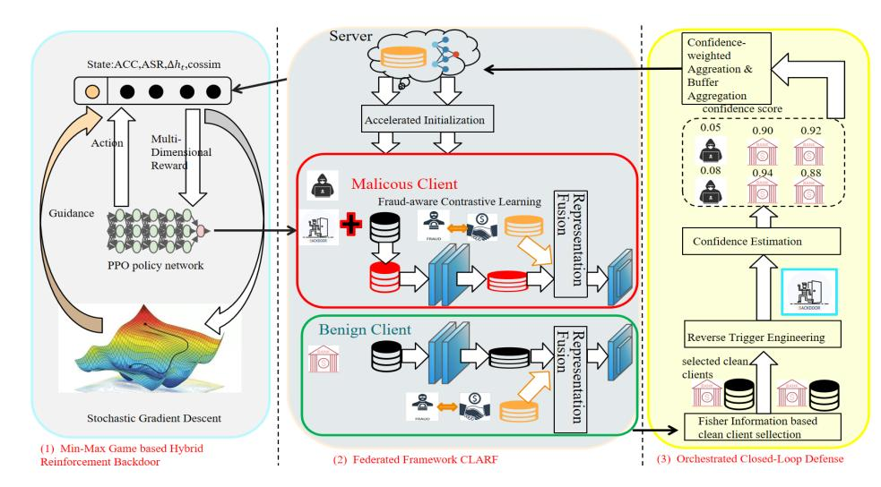
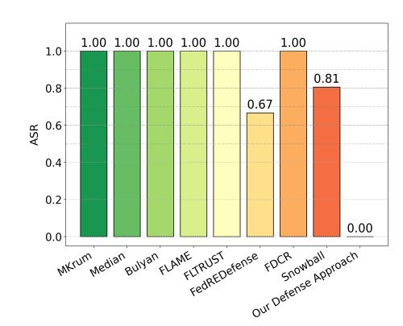
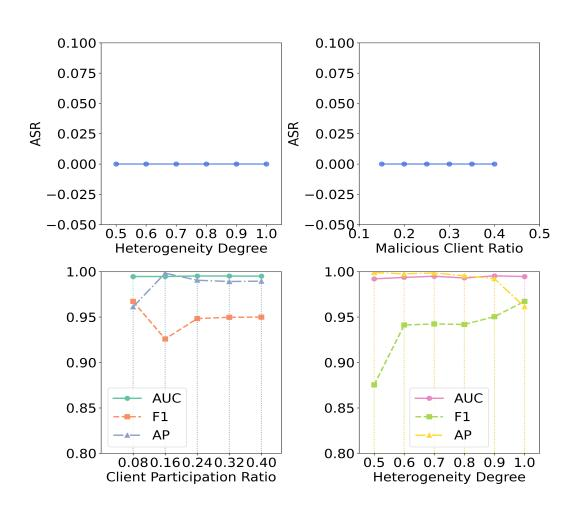
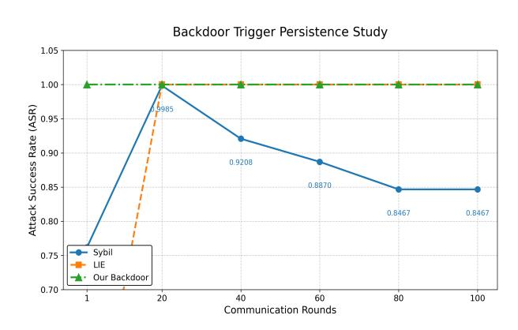

# Dynamic Min-Max Multi-Dimensional Reinforcement Backdoor Attacks and Orchestrated Closed-Loop Defense in Fairness-Aware Web Federated Finance

Ruixiao Zhu 2050046@tongji.edu.cn School of Computer Science and Technology, Tongji University Shanghai, China

Kun Zhu∗ kzhu00@tongji.edu.cn School of Computer Science and Technology, Tongji University Shanghai, China

Nana Zhang nnzhang@dhu.edu.cn School of Computer Science and Technology, Donghua University Shanghai, China

Qi Zhang zhangqi\_cs@tongji.edu.cn School of Computer Science and Technology, Tongji University Shanghai, China

Changjun Jiang cjjiang@tongji.edu.cn School of Computer Science and Technology, Tongji University Shanghai, China

# Abstract

In the rapidly evolving web-based financial ecosystem where digital banking services become critical infrastructure for underserved communities, credit card fraud disproportionately affects vulnerable populations relying on financial platforms. However, previous studies overlook extreme data scarcity conditions, particularly at small-to-medium web banks that serve as crucial gateways for vulnerable communities. This paper addresses the fundamental challenge of building inclusive and secure financial systems operable at true web scale. To overcome this deficiency, we propose a novel web-based fairness-aware federated fraud detection model, CLARF, which utilizes the designed privacy-enhanced representation fusion and fraud-aware contrastive learning modules to enhance detection performance under conditions of data scarcity and label imbalance. Furthermore, current federated fraud detection systems critically neglect vulnerability to backdoor attacks, where malicious actors can implant hidden triggers during model aggregation, compromising system integrity. We propose a novel dynamic web Min-Max adversarial game framework where attackers employ hybrid multi-stage reinforcement learning with multi-dimensional reward mechanisms to dynamically evolve triggers that achieve excellent tradeoff between stealthiness and effectiveness. Defender adapts a closed-loop Selection-Evaluation-Suppression framework where high-reliability clients are selected via Fisher information to carry out reverse trigger engineering. Then clients' confidence scores are calculated as weights to minimize Attack Success Rate (ASR) during aggregation. Extensive experiments on six financial fraud datasets demonstrate the superiority of CLARF model and Min-Max adversarial game paradigm compared with multiple SOTA models.

∗Corresponding author.

[This work is licensed under a Creative Commons Attribution 4.0 International License.](https://creativecommons.org/licenses/by/4.0) WWW '26, Dubai, United Arab Emirates © 2026 Copyright held by the owner/author(s). ACM ISBN 979-8-4007-2307-0/2026/04 <https://doi.org/10.1145/3774904.3792994>

# CCS Concepts

• Social and professional topics → Spoofing attacks; • Security and privacy → Economics of security and privacy.

# Keywords

Web Finance, Societal Fairness, Inclusive Finance, Federated Learning, Reinforcement Learning

### ACM Reference Format:

Ruixiao Zhu, Kun Zhu, Nana Zhang, Qi Zhang, and Changjun Jiang. 2026. Dynamic Min-Max Multi-Dimensional Reinforcement Backdoor Attacks and Orchestrated Closed-Loop Defense in Fairness-Aware Web Federated Finance. In Proceedings of the ACM Web Conference 2026 (WWW '26), April 13–17, 2026, Dubai, United Arab Emirates.ACM, New York, NY, USA, [11](#page-10-0) pages. <https://doi.org/10.1145/3774904.3792994>

# 1 Introduction

Credit card fraud poses a severe financial threat in the rapidly evolving web-based financial ecosystem, with annual losses exceeding 16 billion dollars. In recent studies [\[2,](#page-8-0) [3,](#page-8-1) [36,](#page-8-2) [39,](#page-8-3) [44,](#page-8-4) [48,](#page-9-0) [51\]](#page-9-1), web-scale federated learning (FL) has emerged as a privacy-preserving alternative by enabling collaborative model training across distributed web finance institutions without sharing raw data. However, existing FL frameworks for fraud overlook critical challenges: (1) Extreme data scarcity at individual banks serving as gateways for underserved communities in the digital economy, and (2) Ultra rare fraud instances degrading representation learning. For many small-tomedium web banks especially in remote areas play a crucial role in extending financial inclusion to underserved web users.

While FL addresses critical data privacy concerns in financial fraud detection, backdoor threats are seriously understudied vulnerabilities in the finance contexts. In recent researches, [\[5\]](#page-8-5) amplifies malicious updates before aggregation to forcibly implant backdoors in the global model. [\[26\]](#page-8-6) employs combinatorial trigger generation across clients to reinforce global backdoor patterns against catastrophic forgetting. However, researches above employ statically preset poisoning ratios and fixed trigger patterns, fundamentally

constraining their capability to balance attack potency with operational stability while exhibiting critical deficiencies in adaptive responsiveness to dynamic defense mechanisms.

As backdoor threats evolve, defensive countermeasures have emerged to fortify FL systems. This creates an urgent need for backdoor resilient FL frameworks tailored to credit card systems' unique data asymmetry and security requirements. In recent works, Neuron Pruning [\[41\]](#page-8-7) eliminates dormant neurons susceptible to trigger activation through post-training model compression; FLguard [\[32\]](#page-8-8) implements client-side validation to filter malicious updates using cross-verification. However, defenses above rely on static aggregation of local gradients, rendering them ineffective under information asymmetry where the set of malicious clients remains unknown and incapable of adapting to dynamic backdoor under web-based financial ecosystems, where robust security is essential to protect vulnerable users and maintain fairness in inclusive finance.

To address the dual challenges of extreme data scarcity at small financial institutions and catastrophic class imbalance overlooked, we propose Contrastive Learning Accelerated initialization Representation Fusion federated paradigm (CLARF), a federated paradigm that innovates through two synergistic breakthroughs: (1) The fairness-oriented privacy-preserving representation fusion module overcomes data scarcity by means of enabling cross-client knowledge transfer across different banks with encrypted feature embeddings; (2) The fraud-aware contrastive learning module counteracts ultra-rare fraud instances in compressed latent spaces, amplifying web-scale minority-class signals through hard negative mining without representation collapses. This framework empowers small institutions to build robust fraud detection models, thereby protecting vulnerable communities and enhancing economic resilience and fairness in inclusive web-based financial systems.

To tackle the shortage of both current backdoor attacks and defenses, we propose a pioneering Min-Max adversarial game architecture specifically designed for financial security challenges. Our attack strategy coordinates malicious clients via lightweight hybrid phased reinforcement learning with multi-dimensional rewards, enabling dynamic trigger optimization against evolving defenses, while our defensive countermeasure implements a closed-loop selection-evaluation-suppression system featuring Fisher-based client screening, dynamic trigger inversion, and confidence-weighted aggregation, achieving great ASR without main task degradation under real-world web deployment constraints. Our adversarial framework is essential for safeguarding web-based financial systems and protecting underserved communities from the disproportionate impact of security breaches. In brief, our contributions can be summarized in the following perspectives:

- We propose CLARF, a novel financial federated model to simultaneously address extreme data sparsity and severe fraud instance scarcity in small institutions serving vulnerable populations. CLARF leverages privacy-preserving representation fusion, sharing encrypted transaction embeddings across distributed financial institutions. Furthermore, it incorporates fraud-aware contrastive learning module optimized for heterogeneity and an adaptively accelerated initialization module to adapt to transaction patterns common

in real-world finance operations. This approach bridges data gaps while advancing financial inclusion for underserved communities through secure web technologies.

- We pioneer a dynamic min-max game attack strategy for web-scale adversial environments that orchestrates malicious clients through a lightweight hybrid-phase reinforcement learning mechanism with multi-dimensional rewards. This approach simultaneously optimizes trigger patterns and poisoning tactics in real-time, achieving unprecedented tradeoff between attack main task performance, concealment and great poisoning potency, establishing a new paradigm for adaptive adversarial research in federated systems.
- Additionally, we establish a closed-loop detection evaluationsuppression defense architecture comprising: (1) Fisher information based clean client screening to identify participants with great credibility; (2) Dynamic reverse-trigger confidence estimation for real-time threat assessment; and
  - (3) Adaptive weighted aggregation countermeasures to neutralize poisoned updates. This tripartite system achieves dynamic adversarial suppression under information asymmetry, delivering a lightweight, highly adaptive security paradigm for federated learning, suppressing backdoor ASR to a low level while maintaining main-task accuracy.
- Extensive experimental evaluations on six real-world datasets demonstrate state-of-art performance of our method.

# 2 Related Work

# 2.1 Federated Learning

Federated learning [\[11,](#page-8-9) [25,](#page-8-10) [47\]](#page-9-2) has emerged as a pivotal paradigm for privacy-preserving collaborative training, with foundational frameworks like FedAvg [\[28\]](#page-8-11); FedProx [\[24\]](#page-8-12); FedNova [\[38\]](#page-8-13) and Scaffold [\[18\]](#page-8-14). Recent innovations include FedSol [\[20\]](#page-8-15) for stability and Fed-SAM [\[22\]](#page-8-16) for privacy-aware aggregation. Cross-round optimization techniques like FedCDA [\[37\]](#page-8-17) further reduced divergence via gradient alignment, while sample-level drift mitigation enhanced robustness in heterogeneous environments. Despite these advances, existing methods exhibit limitations in extreme data scarcity regimes critical for web-scale financial inclusion, potentially exacerbating digital divides by excluding institutions serving vulnerable communities from web-based collaborative intelligence, thereby hindering progress toward an equitable web financial ecosystem.

### 2.2 Backdoor Attacks against Federated Learning

Federated backdoor attacks [\[30,](#page-8-18) [42\]](#page-8-19) have progressed from basic poisoning to advanced aggregation evasion strategies. Early work includes Sybil [\[14\]](#page-8-20); LIE [\[6\]](#page-8-21); DBA [\[44\]](#page-8-4) and Cerp [\[27\]](#page-8-22). Recent innovations focus on persistent backdoors like [\[26\]](#page-8-6) that survive model refinement and data-free attacks [\[23\]](#page-8-23) that requires no local malicious data. Personalized FL vulnerabilities [\[12\]](#page-8-24) exploit client-specific adaptations, while label-free attacks like [\[35\]](#page-8-25), compromise vertical FL through feature space manipulation. These advances highlight critical security gaps in web-based financial ecosystems where attacks can disproportionately harm vulnerable populations relying

Figure 1: Overview of the proposed CLARF model: (1). Clients process transactions using inclusive privacy-preserving representation fusion contrastive learning and accelerated initialization to overcome data scarcity; (2). Malicious clients employ multi-stage RL with multi-dimensional rewards to dynamically optimize effective yet stealthy triggers; (3). Defender performs dynamic backdoor threat mitigation through Fisher-based screening, trigger inversion, and confidence-weighted aggregation.

on digital banking services, underscoring the need for adaptive protection mechanisms in inclusive Web finance.

# 2.3 Defense against Federated Backdoor

Defenses against federated backdoor threats [\[10,](#page-8-26) [15,](#page-8-27) [40,](#page-8-28) [50\]](#page-9-3) have evolved from Byzantine-robust aggregation to adaptive trigger detection frameworks. Foundational work includes Mkrum [\[7\]](#page-8-29); Median [\[49\]](#page-9-4); Bulyan [\[29\]](#page-8-30); FLTrust [\[8\]](#page-8-31) and FLAME [\[31\]](#page-8-32). Recent approaches leverage parameter disparity dissection [\[16\]](#page-8-33) to identify backdoor-critical layers and bidirectional election mechanisms [\[34\]](#page-8-34) for client validation. Advanced detection techniques include reconstruction error analysis FedReDefense [\[45\]](#page-9-5) and gradient direction alignment inspection [\[46\]](#page-9-6), achieving up to satisfying attack identification accuracy. However, these methods exhibit critical limitations against adaptive multi-client attacks like SADBA [\[13\]](#page-8-35) that dynamically evade static detection signatures in real-world web financial systems, failing to provide protection to vulnerable populations under dynamic backdoor.

### 2.4 Web Federated Finance and Social Good

In the domain of web finance, FL has been leveraged to enhance financial risk management and service transparency for inclusive digital economies. For instance, [\[17\]](#page-8-36) proposed FedRisk, a knowledge graph enhanced FL framework for efficient risk prediction across web-based financial institutions. [\[33\]](#page-8-37) and [\[53\]](#page-9-7) are utilized in fraud detection. Similarly, [\[4\]](#page-8-38) integrated explainable AI with FL to improve transparency in online banking models, crucial for user trust in web financial services. In social good contexts, [\[40\]](#page-8-28) combined FL with blockchain in medical IoT for disease diagnosis, enhancing data security in web-enabled healthcare systems. [\[9\]](#page-8-39) demonstrated FL's role in maximizing social welfare via public goods game models applicable to web-based cooperative platforms. Additionally, [\[19\]](#page-8-40) surveyed privacy-preserving FL strategies in e-commerce and

finance, highlighting potential to address data heterogeneity in webscale applications. While these advances underscore FL's value for social good, they fall short of explicitly safeguarding vulnerable populations from financial fraud in modern web ecosystems, indicating a critical need for more inclusive security frameworks ensuring web economic fairness.

### 3 Federated Framework CLARF

The CLARF model includes three core modules: Fairness-Oriented Privacy-Enhanced Representation Fusion Module, Fraud-Aware Contrastive Learning Module and Adaptively accelerated Initialization Module.

### 3.1 Fairness-Oriented Privacy-Enhanced Representation Fusion Module

We empower small financial institutions which provide service for underserved communities and suffer from data scarcity by introducing a privacy-preserving cross-client knowledge distillation architecture, augmented with a feature representation cache to facilitate efficient knowledge transfer. This architecture stores intermediate feature embeddings from designated model layers rather than raw data, ensuring compliance with financial privacy regulations. During each federated round, we dynamically update the cache using stratified sampling which maintains a fixed normal-to-fraud ratio to guarantee sufficient minority class representation. Subsequently, we generate diverse synthetic instances through optimized feature fusion, implementing linear interpolation as shown below:

��e�� ← ������ + (1 − ��)�� ������ℎ�� , �� ∈ (0, 1), (1)

where ���� denotes the feature-label pair in local dataset, �� ������ℎ�� represents the one in the cache and ��e�� stands for the synthetic featurelabel pair generated through representation fusion. We incorporate a privacy preservation mechanism through Feature Privacy Loss

### 5.3 Dynamic Confidence Weighted Aggregation Countermeasure

As the final phase of the equality-preserving closed-loop defense, this aggregation mechanism dynamically adjusts client contributions based on rigorously derived confidence scores, preventing malicious influence while preserving the integrity of benign updates. We utilize confidence scores to perform reweighted aggregation, suppressing malicious updates while preserving model integrity on benign data. This constitutes the final phase of our selectionevaluation-suppression defense pipeline.

Θ ��+1 = Θ �� + �� Í ��∈�� �� �� Í ��∈�� �� �� . (18)

The confidence-weighted aggregation constitutes the suppression phase of our defense, dynamically reweighting client updates based on trust metrics derived from Fisher screening and trigger inversion diagnostics. Specifically, each client's contribution is scaled by its confidence score �� �� ∈ [0, 1]. This formulation ensures malicious suppression while preserving benign functionality. By scaling updates with confidence scores, the system ensures that all clients are treated proportionally to their trustworthiness, fostering a collaborative environment that prioritizes security and fairness.

### 6 Experiments

### 6.1 Experimental Setup

Datasets. To evaluate the effectiveness of our model in realworld financial risk detection scenarios, we conduct experiments on six financial transaction datasets, including three public datasets and three proprietary datasets. The statistical characteristics of all datasets are summarized in Table 1.

Private Datasets. Our evaluation has been conducted on three proprietary datasets (Private-1, Private-2, Private-3) provided by major Chinese commercial banks, comprising a total of 2,601,288 transaction records. These datasets present substantial class imbalance, with fraud ratios of 15.62%, 1.81%, and 0.65%, respectively, thereby reflecting diverse operational risk profiles encountered in real financial systems. We construct high-dimensional risk representations from raw banking transaction logs, covering four major feature groups including transaction context, payment channel constraint, entity interaction history as well as device and IP consistency group. Transaction context includes temporal attributes, transaction amount and merchant identifiers. Payment channel constraint includes cumulative electronic payment limits and pertransaction caps. Entity interaction history incorporates receiver identifiers and historical transaction outcomes. Device and IP consistency group includes geographic region indicators, IP reuse signals and mobile device matching status. This multi-view feature design enables fine-grained fraud detection across transactions spanning various provincial administrative regions.

Public Datasets. The��1 dataset from [\[43\]](#page-8-41) is a simulated financial dataset designed for semi-supervised fraud detection research. The��2 dataset, introduced by [\[52\]](#page-9-8), focuses on predicting credit card default risk among Taiwanese cardholders. The ��3 dataset consists of European card transactions, including 30 input features, among which 28 are PCA-transformed to preserve confidentiality.

By combining proprietary banking data with widely used public benchmarks, our evaluation covers a broad spectrum of transaction behaviors and risk patterns, enabling a robust assessment of model generalization under varying levels of fraud prevalence, feature abstraction, and class imbalance.

Table 1: Statistics of six datasets.

Baselines. We conduct comprehensive benchmarking against 11 SOTA federated learning framework, 6 SOTA federated backdoor approaches and 8 SOTA federated defense approaches to demonstrate the superiority of our proposed CLARF model and our backdoor/defense approach. 11 federated frameworks include FedAvg [\[28\]](#page-8-11), FedProx [\[24\]](#page-8-12), FedNova [\[38\]](#page-8-13), Scaffold [\[18\]](#page-8-14), FedDyn [\[1\]](#page-8-42), Fed-NTD [\[21\]](#page-8-43), FedSOL [\[20\]](#page-8-15), FedCDA [\[37\]](#page-8-17) and FedSam [\[22\]](#page-8-16). 6 attack approaches includes Sybil [\[14\]](#page-8-20), LIE [\[6\]](#page-8-21), DBA [\[44\]](#page-8-4), FCBA [\[26\]](#page-8-6), LP Attack [\[54\]](#page-9-9) and DarkFed [\[23\]](#page-8-23). 8 defense approaches includes MKrum [\[7\]](#page-8-29), Median [\[49\]](#page-9-4), Bulyan [\[29\]](#page-8-30), FLAME [\[31\]](#page-8-32), FLTrust [\[8\]](#page-8-31), FDCR [\[16\]](#page-8-33), FedREDefense [\[45\]](#page-9-5) and Snowball [\[34\]](#page-8-34).

Evaluation Metrics and Hyperparameter Settings. In the experiment, we utilize AUC, F1, average precision (AP), attack success rate (ASR) to evaluate the effectiveness of our model. We configure the federated learning system with 50 global communication rounds, and �� is set to 0.3 to mimic data heterogeneity across clients. For federated framework evaluation, we deploy 200 clients with 8% participation rate per round, while backdoor attack and defense experiments utilize 100 clients with 8% participation rate and 25% malicious client ratio.

### 6.2 Fraud Detection Performance

Our comparative evaluation against 11 state-of-the-art federated learning frameworks in Table 2 demonstrates CLARF's superior fraud detection capabilities across all six datasets. CLARF consistently outperforms existing approaches, achieving the highest scores in AP (0.9417, 0.9736, 0.9790) and F1 (0.9482, 0.9568, 0.9385) across Private-1, Private-2, and Private-3 datasets. Remarkably, CLARF improves AP by 4.20% over the strongest baseline (FedProx) on Private-1 and attains 7.12% and 8.01% AP gains on Private-2 and Private-3, which validates our framework's robust handling of data heterogeneity and adversarial conditions while maintaining competitive AUC performance within 1% of the top baseline.

## 6.3 Backdoor Attack/Defense Performance

Our experimental analysis in Table 3 and Figure 2 reveals two critical phenomena: First, our backdoor attack module achieves perfect 100% ASR against 6 SOTA defense approaches because the RL attack continuously adapts trigger to the fixed aggregation and filtering mechanisms of existing defenses, eventually converging to

Table 2: Fraud detection performance on six datasets compared with 11 SOTA models.

| Method          | AP     | Private-1 F1 | AUC    | AP     | Private-2 F1 | AUC    | AP     | Private-3 F1 | AUC    | AP     | �� 1 F1 | AUC    | AP     | �� 2 F1 | AUC    | AP     | �� 3 F1 | AUC    |
|-----------------|--------|--------------|--------|--------|--------------|--------|--------|--------------|--------|--------|---------|--------|--------|---------|--------|--------|---------|--------|
| FedAvg          | 0.8956 | 0.9012       | 0.9854 | 0.8915 | 0.9012       | 0.9845 | 0.8945 | 0.9031       | 0.9854 | 0.8170 | 0.8573  | 0.9448 | 0.8159 | 0.8418  | 0.9149 | 0.9408 | 0.9421  | 0.9996 |
| FedNova         | 0.8843 | 0.8926       | 0.9879 | 0.8841 | 0.8956       | 0.9882 | 0.8855 | 0.8986       | 0.9879 | 0.7902 | 0.8363  | 0.9328 | 0.8111 | 0.8388  | 0.9139 | 0.9421 | 0.9464  | 0.9999 |
| FedProx         | 0.9037 | 0.9107       | 0.9902 | 0.9089 | 0.9178       | 0.9904 | 0.9064 | 0.9203       | 0.9921 | 0.8161 | 0.8649  | 0.9425 | 0.8113 | 0.8380  | 0.9147 | 0.9453 | 0.9477  | 0.9999 |
| SCAFFOLD        | 0.8975 | 0.9021       | 0.9846 | 0.8951 | 0.9064       | 0.9848 | 0.8966 | 0.9064       | 0.9836 | 0.7027 | 0.6704  | 0.8074 | 0.6797 | 0.6765  | 0.7973 | 0.9397 | 0.9411  | 0.9998 |
| FedDyn          | 0.7202 | 0.7346       | 0.9608 | 0.7239 | 0.7473       | 0.9610 | 0.7272 | 0.7407       | 0.9604 | 0.7818 | 0.8625  | 0.9446 | 0.7795 | 0.8232  | 0.8955 | 0.7993 | 0.7933  | 0.8325 |
| FedNTD          | 0.8883 | 0.7204       | 0.7212 | 0.8834 | 0.8909       | 0.9835 | 0.8880 | 0.8896       | 0.9838 | 0.7428 | 0.8419  | 0.9417 | 0.8038 | 0.8249  | 0.9080 | 0.9304 | 0.9312  | 0.9997 |
| FedSam          | 0.8707 | 0.8810       | 0.9924 | 0.8765 | 0.8841       | 0.9917 | 0.8726 | 0.8897       | 0.9921 | 0.8989 | 0.9149  | 0.9677 | 0.5019 | 0.8841  | 0.6673 | 0.9228 | 0.9279  | 0.9844 |
| FedSol-fixed    | 0.9014 | 0.9096       | 0.9870 | 0.9014 | 0.9140       | 0.9870 | 0.9051 | 0.9175       | 0.9875 | 0.7373 | 0.7125  | 0.8813 | 0.6920 | 0.6784  | 0.8096 | 0.9280 | 0.9321  | 0.9996 |
| FedSol-adaptive | 0.8901 | 0.8964       | 0.9856 | 0.8874 | 0.8957       | 0.9857 | 0.8925 | 0.8978       | 0.9859 | 0.8117 | 0.8569  | 0.9424 | 0.8091 | 0.8358  | 0.9138 | 0.9242 | 0.9265  | 0.9997 |
| FedBSS          | 0.8967 | 0.9023       | 0.9841 | 0.8962 | 0.9043       | 0.9847 | 0.8948 | 0.9068       | 0.9844 | 0.8160 | 0.7745  | 0.8984 | 0.8710 | 0.8980  | 0.9712 | 0.9481 | 0.9490  | 0.9993 |
| FedCDA          | 0.8746 | 0.8795       | 0.9864 | 0.8764 | 0.8743       | 0.9868 | 0.8788 | 0.8758       | 0.9864 | 0.9482 | 0.9488  | 0.9493 | 0.8534 | 0.8725  | 0.9673 | 0.9460 | 0.9430  | 0.9964 |
| CLARF           | 0.9417 | 0.9482       | 0.9877 | 0.9736 | 0.9568       | 0.9946 | 0.9790 | 0.9385       | 0.9923 | 0.9532 | 0.9584  | 0.9663 | 0.9318 | 0.9116  | 0.9810 | 0.9612 | 0.9672  | 0.9946 |

Table 3: Federated backdoor approach performance compared with 6 SOTA backdoor approaches. RED denotes FedREDefense.

|          | Sybil  | DBA    | LIE    | FCBA   | LP     | DarkFed | Our    |
|----------|--------|--------|--------|--------|--------|---------|--------|
| MKrum    | 0.3130 | 0.1342 | 0.8462 | 0.7983 | 0.9518 | 1.0     | 1.0    |
| Bulyan   | 0.1333 | 0.1783 | 0.7659 | 0.8291 | 0.9624 | 1.0     | 1.0    |
| Median   | 0.1482 | 0.1999 | 0.5653 | 0.7884 | 0.9351 | 1.0     | 1.0    |
| FLAME    | 0.3669 | 0.1296 | 0.2496 | 0.6294 | 0.8846 | 0.9754  | 1.0    |
| FLTrust  | 0.2617 | 0.1572 | 0.2840 | 0.5716 | 0.8154 | 0.9267  | 1.0    |
| RED      | 0.0    | 0.0    | 0.0    | 0.4068 | 0.5975 | 0.6239  | 0.6672 |
| FDCR     | 0.1098 | 0.0    | 0.0387 | 0.4623 | 0.5583 | 0.7560  | 1.0    |
| Snowball | 0.2597 | 0.0975 | 0.2780 | 0.5676 | 0.7954 | 0.5047  | 0.8060 |

Table 4: Ablation Study of Federated Backdoor on ASR (DTO stands for Dynamic Trigger Optimization).

|              | w/o DTO | Our Backdoor |
|--------------|---------|--------------|
| MKrum        | 0.4182  | 1.0          |
| Bulyan       | 0.6250  | 1.0          |
| Median       | 0.3887  | 1.0          |
| FLAME        | 0.4019  | 1.0          |
| FLTrust      | 0.3030  | 1.0          |
| FedREDefense | 0.0     | 0.6672       |
| FDCR         | 0.2384  | 1.0          |
| Snowball     | 0.1690  | 0.8060       |

trigger configurations that consistently evade their static rejection criteria. Second, our defense module achieves perfect 100% ASR detection against our own advanced backdoor attack, outperforming all tested SOTA defenses because the defense proposed effectively constrains malicious updates before aggregation, enabling confidence weighted aggregation to completely neutralize the proposed backdoor without interfering with benign optimization.

### 6.4 Ablation Study

We conduct comprehensive ablation studies in both attack and defense frameworks. For the backdoor attack methodology, we construct a variant without dynamic trigger optimization. On the defense side, we systematically disable components of our orchestrated framework either the clean client selection is disabled or the reverse trigger engineering is disabled or both. In Table 4, the dynamic trigger optimization module proves indispensable. Without it, attack variants maintain moderate ASR protection, but with it, our attack achieve 100% ASR against most defenses, demonstrating how dynamically evolved triggers. For defenses in Table 5, clean client selection alone reduce ASR to 79.76%, while standalone reverse

Figure 2: Federated backdoor defense approach performance compared with 8 SOTA defense approaches.

trigger gets 100% ASR, but their combination achieves 0% ASR. This synergy works because clean client screening first mitigates malicious clients' influence via Fisher-information analysis, enabling the reverse engineering module to reconstruct residual dynamic triggers from the sanitized update pool with great accuracy.

Additionally, we perform an ablation experiment on the CLARF module. Table 6 shows that the full configuration with all components enabled achieves the highest performance (AP=0.9532, F1=0.9584), while disabling any single component leads to a noticeable drop. For example, without Fusion, AP decreases to 0.9507, and without Contrastive learning, AP reduces to 0.9458. This synergy highlights the necessity of integrating all components for optimal model robustness in handling data scarcity.

### 6.5 Sensitivity Analysis

Our comprehensive hyperparameter sensitivity analysis demonstrates the robustness of the proposed defense framework against adversarial attacks and the stability of the CLARF framework across critical operational parameters. As evidenced in Figure 3, ASR maintains zero values across the entire spectrum of Heterogeneity Degree (0.5-1.0) and Malicious Client Ratio (0.15-0.4), confirming our defense mechanism's resilience against distributional shifts and adversarial infiltration attempts. For the CLARF framework: AUC

Figure 3: Sensitivity analysis for orchestrated defense on proposed attack (upper two) and CLARF (lower two).

Figure 4: Backdoor Trigger Persistence Analysis

maintains high across Client Participation Ratios (0.08-0.4) and Heterogeneity Degrees (0.5-1.0), with AP consistently sustains superior despite parameter fluctuations, validating CLARF's operational robustness.

### 6.6 Backdoor Trigger Persistence Study

Table 5: Ablation Study of Our Defense. ('✓' denotes chosen, '-' means not chosen, 'RTE' means Reverse Trigger Engineering ).

| Clean Client Selection RTE | ASR    |
|----------------------------|--------|
| ✓                          | 1.0    |
| ✓                          | 0.7976 |
| ✓ ✓                        | 0.0    |

This persistence study reveals backdoor robustness post-adversary departure (round 20+) in Figure 4. In contrast, Sybil exhibits progressive degradation, declining from 99.85% at round 20 to 84.6% by round 100, demonstrating that Sybil's gradient poisoning remains vulnerable to benign update erosion, as federated averaging gradually dilutes its transient perturbations. The sustained 100% ASR for

Table 6: Ablation Study of CLARF framework. ('✓' and '-' denotes chosen and not chosen respectively).

| Fusion Contrastive | Init AP  | �� 1   |
|--------------------|----------|--------|
|                    | 0.9029   | 0.9119 |
| ✓                  | 0.9172   | 0.9181 |
| ✓                  | 0.9251   | 0.9243 |
|                    | ✓ 0.9260 | 0.9319 |
| ✓                  | ✓ 0.9507 | 0.9525 |
| ✓                  | ✓ 0.9458 | 0.9434 |
| ✓ ✓                | 0.9420   | 0.9431 |
| ✓ ✓                | ✓ 0.9532 | 0.9584 |

LIE and our backdoor confirms their catastrophic forgetting resistance, which is a critical property absent in conventional attacks against federated unlearning mechanisms.

## 6.7 Discussion

Our research fundamentally redefines federated backdoor security for financial ecosystems through a holistic min-max adversarial paradigm that addresses critical gaps in existing approaches. We achieve consistent cross-domain aggression bypassing pitfalls of data heterogeneity. Our adaptive hybrid mechanism leverages reinforcement learning to maintain potency, which is designed strictly for defensive stress-testing in inclusive finance not for malicious exploitation. We emphasize that this framework must not be employed for any malicious purposes beyond controlled security auditing. Defensively, we utilize an integrated shield combining Fisherbased client screening, dynamic trigger inversion, and confidence weighted aggregation.

### 7 Conclusion

This study presents CLARF, a unified federated framework that significantly improves performance under extreme data scarcity through a fairness-oriented privacy-preserving representation fusion module and fraud-aware contrastive learning mechanism. CLARF ensures equitable access to secure financial services for all users, including vulnerable populations, by mitigating biases in digital ecosystems. For security, we pioneer a min-max adversarial paradigm which employs hybrid reinforcement learning with multi-dimensional rewards to dynamically evolve triggers, achieving stealth-persistence tradeoffs, and our defense establishes a closed-loop Fisher trigger defense system integrating clean-client screening via Fisher information, reverse-trigger engineering, and confidence-weighted aggregation, upholding fairness by protecting participants from diverse backgrounds to achieve safer and more justified finance environment. Extensive experiments on six financial datasets reveals that our CLARF model and Min-Max adversarial game paradigm significantly outperform multiple SOTA models. Future work will explore real-time regulatory frameworks for the underserved communities in inclusive finance.

# Acknowledgments

This work is supported in part by the National Natural Science Foundation of China under Grant 62302337, 62402098, and in part by the Fundamental Research Funds for the Central Universities under Grant 2232024D-25.

### References

[1] Durmus Alp Emre Acar, Yue Zhao, Ramon Matas, Matthew Mattina, Paul Whatmough, and Venkatesh Saligrama. 2021. Federated Learning Based on Dynamic Regularization. In International Conference on Learning Representations. <https://openreview.net/forum?id=B7v4QMR6Z9w> [2] Sebastien Andreina, Giorgia Azzurra Marson, Helen Möllering, and Ghassan Karame. 2021. Baffle: Backdoor detection via feedback-based federated learning. In 2021 IEEE 41st International Conference on Distributed Computing Systems (ICDCS). IEEE, 852–863. [3] Nahid Ferdous Aurna, Md Delwar Hossain, Yuzo Taenaka, and Youki Kadobayashi. 2023. Federated learning-based credit card fraud detection: Performance analysis with sampling methods and deep learning algorithms. In 2023 IEEE International Conference on Cyber Security and Resilience (CSR). IEEE, 180–186. [4] Tomisin Awosika, Raj Mani Shukla, and Bernardi Pranggono. 2024. Transparency and privacy: the role of explainable ai and federated learning in financial fraud detection. IEEE access 12 (2024), 64551–64560. [5] Eugene Bagdasaryan, Andreas Veit, Yiqing Hua, Deborah Estrin, and Vitaly Shmatikov. 2020. How to backdoor federated learning. In International conference on artificial intelligence and statistics. PMLR, 2938–2948. [6] Gilad Baruch, Moran Baruch, and Yoav Goldberg. 2019. A little is enough: Circumventing defenses for distributed learning. Advances in Neural Information Processing Systems 32 (2019). [7] Peva Blanchard, El Mahdi El Mhamdi, Rachid Guerraoui, and Julien Stainer. 2017. Machine learning with adversaries: Byzantine tolerant gradient descent. Advances in neural information processing systems 30 (2017). [8] Xiaoyu Cao, Minghong Fang, Jia Liu, and Neil Zhenqiang Gong. 2020. Fltrust: Byzantine-robust federated learning via trust bootstrapping. arXiv preprint arXiv:2012.13995 (2020). [9] Jianan Chen, Qin Hu, and Honglu Jiang. 2023. Alliance Makes Difference? Maximizing Social Welfare in Cross-Silo Federated Learning. IEEE Transactions on Vehicular Technology 73, 2 (2023), 2786–2798. [10] Binbin Ding, Penghui Yang, and Sheng-Jun Huang. 2025. FedDLAD: A Federated Learning Dual-Layer Anomaly Detection Framework for Enhancing Resilience Against Backdoor Attacks. In Proceedings of the thirty-fourth international joint conference on artificial intelligence, IJCAI-25. International Joint Conferences on Artificial Intelligence Organization, 5021–5029. [11] Haizhou Du, Yiran Xiang, Yiwen Cai, Xiufeng Liu, Zonghan Wu, Huan Huo, and Guodong Long. 2025. FedFree: Breaking Knowledge-sharing Barriers through Layer-wise Alignment in Heterogeneous Federated Learning. In The Thirty-ninth Annual Conference on Neural Information Processing Systems. [12] Mingyuan Fan, Zhanyi Hu, Fuyi Wang, and Cen Chen. 2025. Bad-PFL: Exploring backdoor attacks against personalized federated learning. arXiv preprint arXiv:2501.12736 (2025). [13] Jun Feng, Yuzhe Lai, Hong Sun, and Bocheng Ren. 2025. SADBA: Self-Adaptive Distributed Backdoor Attack Against Federated Learning. In Proceedings of the AAAI Conference on Artificial Intelligence, Vol. 39. 16568–16576. [14] Clement Fung, Chris JM Yoon, and Ivan Beschastnikh. 2018. Mitigating sybils in federated learning poisoning. arXiv preprint arXiv:1808.04866 (2018). [15] Wenwen He, Wenke Huang, Bin Yang, ShuKan Liu, and Mang Ye. 2025. SPMC: Self-Purifying Federated Backdoor Defense via Margin Contribution. In The Forty-second International Conference on Machine Learning. [https://openreview.](https://openreview.net/forum?id=Kjz03pmyW0) [net/forum?id=Kjz03pmyW0](https://openreview.net/forum?id=Kjz03pmyW0) [16] Wenke Huang, Mang Ye, Zekun Shi, Guancheng Wan, He Li, and Bo Du. 2024. Parameter disparities dissection for backdoor defense in heterogeneous federated learning. Advances in Neural Information Processing Systems 37 (2024), 120951– 120973. [17] Xiaoxiao Jiang, Wenbo Liu, Boyang Dong, et al. 2024. FedRisk A Federated Learning Framework for Multi-institutional Financial Risk Assessment on Cloud Platforms. Journal of Advanced Computing Systems 4, 11 (2024), 56–72. [18] Sai Praneeth Karimireddy, Satyen Kale, Mehryar Mohri, Sashank Reddi, Sebastian Stich, and Ananda Theertha Suresh. 2020. Scaffold: Stochastic controlled averaging for federated learning. In International conference on machine learning. PMLR, 5132–5143. [19] Rahul Kumar, Chin-Shiuh Shieh, Prasun Chakrabarti, Ashok Kumar, Jhankar Moolchandani, and Raj Sinha. 2025. Privacy-Preserving Federated Learning in Healthcare, E-Commerce, and Finance: A Taxonomy of Security Threats and Mitigation Strategies. In EPJ Web of Conferences, Vol. 328. EDP Sciences, 01066. [20] Gihun Lee, Minchan Jeong, Sangmook Kim, Jaehoon Oh, and Se-Young Yun. 2024. Fedsol: Stabilized orthogonal learning with proximal restrictions in federated learning. In Proceedings of the IEEE/CVF Conference on Computer Vision and Pattern Recognition. 12512–12522. [21] Gihun Lee, Minchan Jeong, Yongjin Shin, Sangmin Bae, and Se-Young Yun. 2022. Preservation of the global knowledge by not-true distillation in federated learning. Advances in Neural Information Processing Systems 35 (2022), 38461–38474. [22] Hongtao Li, Xinyu Li, Ximeng Liu, Bo Wang, Jie Wang, and Youliang Tian. 2025. FedSam: Enhancing federated learning accuracy with differential privacy and data heterogeneity mitigation. Computer Standards & Interfaces (2025), 104019. [23] Minghui Li, Wei Wan, Yuxuan Ning, Shengshan Hu, Lulu Xue, Leo Yu Zhang, and Yichen Wang. 2024. Darkfed: A data-free backdoor attack in federated learning. arXiv preprint arXiv:2405.03299 (2024). [24] Tian Li, Anit Kumar Sahu, Manzil Zaheer, Maziar Sanjabi, Ameet Talwalkar, and Virginia Smith. 2020. Federated optimization in heterogeneous networks. Proceedings of Machine learning and systems 2 (2020), 429–450. [25] Jianchun Liu, Jiaming Yan, Hongli Xu, Lun Wang, Zhiyuan Wang, Jinyang Huang, and Chunming Qiao. 2025. Accelerating decentralized federated learning with probabilistic communication in heterogeneous edge computing. IEEE Transactions on Networking (2025). [26] Tao Liu, Yuhang Zhang, Zhu Feng, Zhiqin Yang, Chen Xu, Dapeng Man, and Wu Yang. 2024. Beyond traditional threats: A persistent backdoor attack on federated learning. In Proceedings of the AAAI Conference on Artificial Intelligence, Vol. 38. 21359–21367. [27] Xiaoting Lyu, Yufei Han, Wei Wang, Jingkai Liu, Bin Wang, Jiqiang Liu, and Xiangliang Zhang. 2023. Poisoning with cerberus: Stealthy and colluded backdoor attack against federated learning. In Proceedings of the AAAI Conference on Artificial Intelligence, Vol. 37. 9020–9028. [28] Brendan McMahan, Eider Moore, Daniel Ramage, Seth Hampson, and Blaise Aguera y Arcas. 2017. Communication-efficient learning of deep networks from decentralized data. In Artificial intelligence and statistics. PMLR, 1273–1282. [29] El Mahdi El Mhamdi, Rachid Guerraoui, and Sébastien Rouault. 2018. The hidden vulnerability of distributed learning in byzantium. arXiv preprint arXiv:1802.07927 (2018). [30] Trang Nguyen, Anh Tran, and Nhat Ho. 2025. Attack on Prompt: Backdoor Attack in Prompt-Based Continual Learning. In Proceedings of the AAAI Conference on Artificial Intelligence, Vol. 39. 19686–19694. [31] Thien Duc Nguyen, Phillip Rieger, Huili Chen, Hossein Yalame, Helen Möllering, Hossein Fereidooni, Samuel Marchal, Markus Miettinen, Azalia Mirhoseini, Shaza Zeitouni, et al. 2022. FLAME: Taming backdoors in federated learning. In 31st USENIX Security Symposium (USENIX Security 22). 1415–1432. [32] Thien Duc Nguyen, Phillip Rieger, Hossein Yalame, Helen Möllering, Hossein Fereidooni, Samuel Marchal, Markus Miettinen, Azalia Mirhoseini, Ahmad-Reza Sadeghi, Thomas Schneider, et al. 2021. FLGUARD: Secure and Private Federated Learning. IACR Cryptol. ePrint Arch. 2021 (2021), 25. [33] Rui Ou, Kun Zhu, Nana Zhang, MengChu Zhou, and Changjun Jiang. 2025. CamFD: Semi-Supervised Camouflage-Aware Fraud Detection Based on Dynamic Graphs. IEEE Transactions on Systems, Man, and Cybernetics: Systems (2025), 1–15. [doi:10.1109/TSMC.2025.3648571](https://doi.org/10.1109/TSMC.2025.3648571) [34] Zhen Qin, Feiyi Chen, Chen Zhi, Xueqiang Yan, and Shuiguang Deng. 2024. Resisting backdoor attacks in federated learning via bidirectional elections and individual perspective. In Proceedings of the AAAI Conference on Artificial Intelligence, Vol. 38. 14677–14685. [35] Wei Shen, Wenke Huang, Guancheng Wan, and Mang Ye. 2025. Label-free backdoor attacks in vertical federated learning. In Proceedings of the AAAI Conference on Artificial Intelligence, Vol. 39. 20389–20397. [36] Vale Tolpegin, Stacey Truex, Mehmet Emre Gursoy, and Ling Liu. 2020. Data poisoning attacks against federated learning systems. In European symposium on research in computer security. Springer, 480–501. [37] Haozhao Wang, Haoran Xu, Yichen Li, Yuan Xu, Ruixuan Li, and Tianwei Zhang. 2024. Fedcda: Federated learning with cross-rounds divergence-aware aggregation. In The Twelfth International Conference on Learning Representations. [38] Jianyu Wang, Qinghua Liu, Hao Liang, Gauri Joshi, and H Vincent Poor. 2020. Tackling the objective inconsistency problem in heterogeneous federated optimization. Advances in neural information processing systems 33 (2020), 7611–7623. [39] Jiacheng Wang, Wenzheng Liu, Yifei Kou, Dicheng Xiao, Xiaofeng Wang, and Xiaoyong Tang. 2023. Approx-SMOTE federated learning credit card fraud detection system. In 2023 IEEE 47th Annual Computers, Software, and Applications Conference (COMPSAC). IEEE, 1370–1375. [40] Jing Wang, Sarbajit Manna, Muammer Aksoy, Arindam Sarkar, Md Arafatur Rahman, Abdulfattah Noorwali, Kamal M Othman, and Mohammed JF Alenazi. 2025. Empowering secure and sustainable healthcare through federated learning and blockchain synergies in a Medical Internet of Things. International Journal of Machine Learning and Cybernetics (2025), 1–33. [41] Dongxian Wu and Yisen Wang. 2021. Adversarial neuron pruning purifies backdoored deep models. Advances in Neural Information Processing Systems 34 (2021), 16913–16925. [42] Peng Xi, Shaoliang Peng, and Wenjuan Tang. 2025. IBAS: Imperceptible Backdoor Attacks in Split Learning with Limited Information. In Proceedings of the AAAI Conference on Artificial Intelligence, Vol. 39. 27715–27722. [43] Sheng Xiang, Mingzhi Zhu, Dawei Cheng, Enxia Li, Ruihui Zhao, Yi Ouyang, Ling Chen, and Yefeng Zheng. 2023. Semi-supervised credit card fraud detection via attribute-driven graph representation. In Proceedings of the AAAI conference on artificial intelligence, Vol. 37. 14557–14565. [44] Chulin Xie, Keli Huang, Pin-Yu Chen, and Bo Li. 2019. Dba: Distributed backdoor attacks against federated learning. In International conference on learning representations.

[45] Yueqi Xie, Minghong Fang, and Neil Zhenqiang Gong. 2024. Fedredefense: Defending against model poisoning attacks for federated learning using model update reconstruction error. In International Conference on Machine Learning. PMLR, 54460–54474. [46] Jiahao Xu, Zikai Zhang, and Rui Hu. 2025. Detecting backdoor attacks in federated learning via direction alignment inspection. In Proceedings of the Computer Vision and Pattern Recognition Conference. 20654–20664. [47] Wenjing Yan, Kai Zhang, Xiaolu Wang, and Xuanyu Cao. 2025. Problem-Parameter-Free Federated Learning. In The Thirteenth International Conference on Learning Representations. [48] Wensi Yang, Yuhang Zhang, Kejiang Ye, Li Li, and Cheng-Zhong Xu. 2019. FFD: A federated learning based method for credit card fraud detection. In International conference on big data. Springer, 18–32. [49] Dong Yin, Yudong Chen, Ramchandran Kannan, and Peter Bartlett. 2018. Byzantine-robust distributed learning: Towards optimal statistical rates. In International conference on machine learning. PMLR, 5650–5659. [50] Qi Zhao and Christian Wressnegger. 2025. Two Sides of the Same Coin: Learning the Backdoor to Remove the Backdoor. In Proceedings of the AAAI Conference on Artificial Intelligence, Vol. 39. 22804–22812. [51] Wenbo Zheng, Lan Yan, Chao Gou, and Fei-Yue Wang. 2021. Federated metalearning for fraudulent credit card detection. In Proceedings of the Twenty-Ninth International Conference on International Joint Conferences on Artificial Intelligence. 4654–4660. [52] Honghao Zhu, Guanjun Liu, Mengchu Zhou, Yu Xie, Abdullah Abusorrah, and Qi Kang. 2020. Optimizing weighted extreme learning machines for imbalanced classification and application to credit card fraud detection. Neurocomputing 407 (2020), 50–62. [53] Kun Zhu, Nana Zhang, Weiping Ding, and Changjun Jiang. 2024. An Adaptive Heterogeneous Credit Card Fraud Detection Model Based on Deep Reinforcement Training Subset Selection. IEEE Trans. Artif. Intell. 5, 8 (2024), 4026–4041. [54] Haomin Zhuang, Mingxian Yu, Hao Wang, Yang Hua, Jian Li, and Xu Yuan. 2023. Backdoor federated learning by poisoning backdoor-critical layers. arXiv preprint arXiv:2308.04466 (2023).

# A Baseline

We conduct comprehensive benchmarking against 11 state-of-art federated learning frameworks to demonstrate the superiority of our proposed CLARF framework on 6 financial datasets. FedAvg [\[28\]](#page-8-11) represents basic federated optimization frameworks, while FedProx [\[24\]](#page-8-12), FedNova [\[38\]](#page-8-13), Scaffold [\[18\]](#page-8-14), FedDyn [\[1\]](#page-8-42), FedNTD [\[21\]](#page-8-43), FedSOL [\[20\]](#page-8-15), FedCDA [\[37\]](#page-8-17), FedSam [\[22\]](#page-8-16), and FedBSS [\[46\]](#page-9-6) constitute advanced frameworks addressing non-IID data challenges through heterogeneity handling, gradient correction, and knowledge distillation techniques. We validate the superiority of our

### Algorithm 1 Pseudo Code of Our CLARF Model

Require: Global model Θ , gradient approximation��e , clients {���� }, cache ratio ��, temperature ��

Ensure: Updated global model Θ ��+1

1: Server executes: 2: Distribute (Θ , ��e ) to selected clients ���� ; 3: Client �� executes in parallel: 4: �� 0 �� ← Θ �� + ����e �� ; ⊲ Warm-up initialization 5: C�� ← UpdateCache(D�� , ��); 6: For each local epoch: 7: Sample batch B from D�� ; 8: ��˜ ← ���� + (1 − ��)��cache; ⊲ Feature fusion 9: Compute contrastive loss L���� with collapse penalty; 10: L���� ← CrossEntropy(���� (��˜), ��); 11: Update ���� via gradient descent on L���������� ; 12: Server aggregates: 13: Θ ��+1 ← Θ �� + |���� | Í Δ�� �� ; 14: ��e ��+1 ← ��ΔΘ + (1 − ��)��e . ⊲ Momentum update novel backdoor attack strategy and orchestrated defense framework through comprehensive benchmarking against 6 SOTA federated backdoor attacks and 8 SOTA federated defense approaches to achieve fairness in inclusive finance, establishing new performance standards in adversarial robustness. Sybil [\[14\]](#page-8-20) and LIE [\[6\]](#page-8-21) represent traditional model poisoning attacks, while DBA [\[44\]](#page-8-4), FCBA [\[26\]](#page-8-6), LP Attack [\[54\]](#page-9-9), and DarkFed [\[23\]](#page-8-23) constitute advanced stealthy backdoor attacks employing collusion, persistence, and data-free strategies. MKrum [\[7\]](#page-8-29), Median [\[49\]](#page-9-4), and Bulyan [\[29\]](#page-8-30) represent classical Byzantine-robust aggregation defenses, while FLAME [\[31\]](#page-8-32), FLTrust [\[8\]](#page-8-31), FDCR [\[16\]](#page-8-33), FedREDefense [\[45\]](#page-9-5), and Snowball [\[34\]](#page-8-34) constitute advanced backdoor-specific defense frameworks employing trust bootstrapping, parameter disparity analysis, and adversarial election mechanisms.

# B Pseudo Code of CLARF

Our CLARF framework (Algorithm 1) implements a privacy-preserving federated learning paradigm specifically designed for financial ecosystems, addressing critical challenges of data scarcity and heterogeneity in cross-institutional collaboration. The algorithm initiates with federated model initialization (Line 2) where the server distributes global parameters �� and gradient approximations ��e to participating clients, enabling accelerated convergence in financial environments. Each client performs local model warm-up (Line 4) using both global parameters and momentum-based gradients, significantly reducing divergence in heterogeneous data distributions. The core innovation lies in the privacy-enhanced representation fusion module (Lines 5-8), where clients maintain encrypted feature caches. Through stratified sampling with fixed fraud-to-normal ratios, the cache preserves minority class representations critical for financial inclusion in underserved communities. The module generates synthetic instances via linear interpolation between local and cached features (Line 8), enhancing data diversity while maintaining GDPR compliance through feature-level differential privacy. The optimized contrastive loss ������ (Line 9) incorporates collapse prevention penalties to maintain representation stability under webscale data heterogeneity. Simultaneously, the classification module computes cross-entropy loss on synthetic samples (Line 10), balancing representation learning and task performance for real-time fraud detection in web inclusive finance. Local model updates (Line 11) employ adaptive gradient descent optimized for edge device constraints, while the server aggregates updates through federated averaging (Line 13) enhanced with momentum-based acceleration (Line 14) for improved stability in inclusive finance. This integrated approach demonstrates effective protection of vulnerable populations in digital banking ecosystems.

# C Pseudo Code of Our Backdoor Approach

Our federated backdoor attack algorithm (Algorithm 2) employs a multi-objective optimization strategy to dynamically balance attack potency and stealthiness under web financial situations. The algorithm initiates by reserving a subset of local data D������ for validation (Line 1), ensuring main-task preservation while enabling adaptive poisoning calibration. The trigger �� is generated via Multidimensional Reinforcement Learning (MRL) (Line 5), enabling collaborative trigger evolution across malicious clients. Crucially, the

