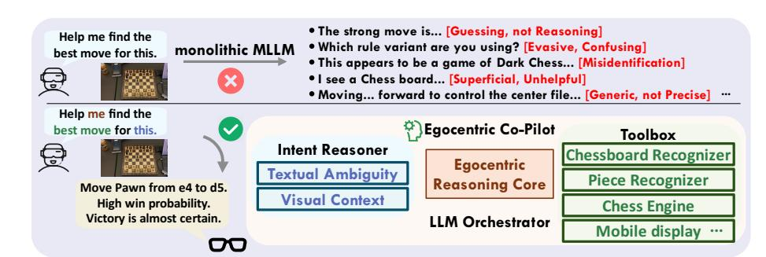
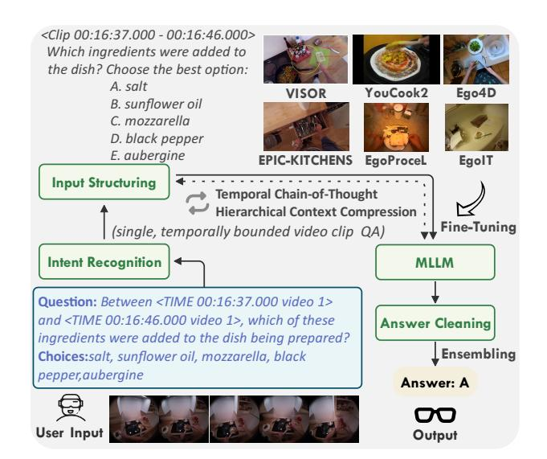
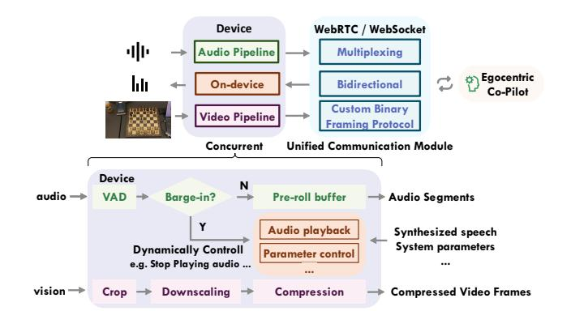
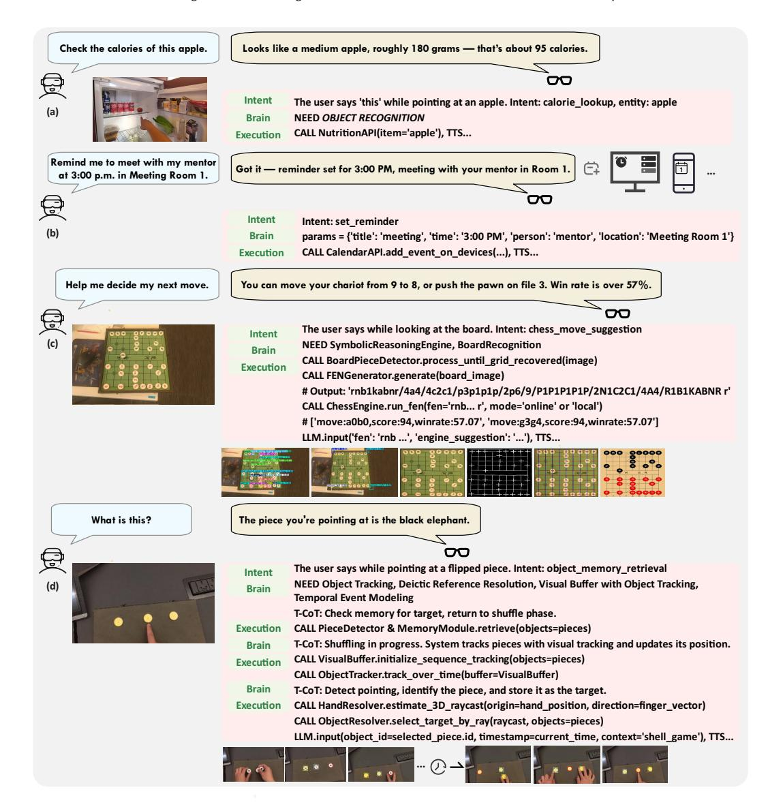
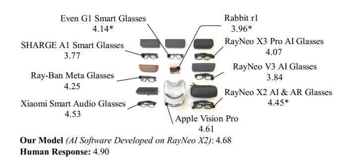

# Egocentric Co-Pilot: Web-Native Smart-Glasses Agents for Assistive Egocentric AI

[Sicheng Yang](https://orcid.org/0009-0009-2018-0604) Shenzhen International Graduate School Tsinghua University Shenzhen, China yangsc25@mails.tsinghua.edu.cn

[Yukai Huang](https://orcid.org/0009-0009-5725-5884) Independent Researcher London, United Kingdom u06530032@alum.ccu.edu.tw

[Weitong Cai](https://orcid.org/0000-0001-7726-4387) [Shitong Sun](https://orcid.org/0000-0003-1825-655X) Queen Mary University of London London, United Kingdom weitong.cai@qmul.ac.uk shitong.sun@qmul.ac.uk

[Fengyi Fang](https://orcid.org/0000-0002-1082-8368) [You He](https://orcid.org/0000-0002-2942-1699)∗ Shenzhen International Graduate School Tsinghua University Shenzhen, China fangfy22@tsinghua.org.cn heyou@mail.tsinghua.edu.cn

[Yiqiao Xie](https://orcid.org/0009-0007-8566-1607) [Jiankang Deng](https://orcid.org/0000-0002-3709-6216) Imperial College London London, United Kingdom yx2722@ic.ac.uk j.deng16@imperial.ac.uk

[Hang Zhang](https://orcid.org/0000-0003-0115-387X) Independent Researcher London, United Kingdom hz459@cornell.edu.cn

[Jifei Song](https://orcid.org/0000-0002-3381-6685) University Of Surrey Guildford, United Kingdom j.song@qmul.ac.uk

[Zhensong Zhang](https://orcid.org/0009-0001-7911-7564) Independent Researcher London, United Kingdom zhensongzhang@hotmail.com

Figure 1: Overview of Egocentric Co-Pilot vs. Monolithic MLLM. Top: Monolithic MLLMs struggle with specialized reasoning task (e.g., a strategy board game), often providing evasive answers. Bottom: Our framework uses an LLM orchestrator that leverages a toolbox of specialized neuro-symbolic modules. It successfully interprets the user's request and invokes the perception modules to generate board state, which is then solved by a dedicated game engine, leading to a precise and actionable solution.

#### Abstract

What if accessing the web did not require a screen, a stable desk, or even free hands? For people navigating crowded cities, living with low vision, or experiencing cognitive overload, smart glasses coupled with AI agents could turn the web into an always-on assistive layer over daily life. We present Egocentric Co-Pilot, a web-native neuro-symbolic framework that runs on smart glasses and uses

∗Corresponding author.

[This work is licensed under a Creative Commons Attribution 4.0 International License.](https://creativecommons.org/licenses/by/4.0) WWW '26, Dubai, United Arab Emirates © 2026 Copyright held by the owner/author(s). ACM ISBN 979-8-4007-2307-0/2026/04 <https://doi.org/10.1145/3774904.3792996>

a Large Language Model (LLM) to orchestrate a toolbox of perception, reasoning, and web tools. An egocentric reasoning core combines Temporal Chain-of-Thought with Hierarchical Context Compression to support long-horizon question answering and decision support over continuous first-person video, far beyond a single model's context window. On top of this, a lightweight multimodal intent layer turns noisy speech and gaze into structured, tool-ready commands without relying on a single monolithic model. We further implement and evaluate a cloud-native WebRTC pipeline based on LiveKit, integrating streaming speech, video, and control messages into a single web-standard channel that serves both smart-glasses clients and browser-based playgrounds. In parallel, we deploy an onpremise WebSocket baseline, exposing concrete trade-offs between local inference and cloud offloading in terms of latency, mobility, and resource use. Experiments on Egolife and HD-EPIC demonstrate competitive or state-of-the-art egocentric QA performance, and a human-in-the-loop study on smart glasses shows higher task completion and user satisfaction than leading commercial baselines. Taken together, these results indicate that web-connected egocentric co-pilots can be a practical path toward more accessible, context-aware assistance in everyday life. By grounding operation in web-native communication primitives and modular, auditable tool use, Egocentric Co-Pilot offers a concrete blueprint for assistive, always-on web agents that support education, accessibility, and social inclusion for people who may benefit most from contextual, egocentric AI. Our code, fine-tuned models are available at [here.](https://github.com/YoungSeng/Egocentric-Co-Pilot)

# CCS Concepts

• Human-centered computing → Ubiquitous and mobile computing systems and tools; • Information systems → World Wide Web; • Computing methodologies → Artificial intelligence; • Social and professional topics → People with disabilities.

## Keywords

Egocentric AI, Smart glasses, Web agents, Multimodal intent disambiguation, Neuro-symbolic systems, WebRTC, Wearable assistive technology, Responsible AI

#### ACM Reference Format:

Sicheng Yang, Yukai Huang, Weitong Cai, Shitong Sun, Fengyi Fang, You He, Yiqiao Xie, Jiankang Deng, Hang Zhang, Jifei Song, and Zhensong Zhang. 2026. Egocentric Co-Pilot: Web-Native Smart-Glasses Agents for Assistive Egocentric AI. In Proceedings of the ACM Web Conference 2026 (WWW '26), April 13–17, 2026, Dubai, United Arab Emirates. ACM, New York, NY, USA, [14](#page-13-0) pages.<https://doi.org/10.1145/3774904.3792996>

# 1 Introduction

Combining powerful, compact hardware and large language models (LLMs) enables a new generation of AI-powered personal assistants [\[61\]](#page-9-0). While autonomous web agents have changed how AI systems interact with digital interfaces [\[19,](#page-8-0) [98\]](#page-10-0), extending these capabilities into the physical world remains challenging. Among potential platforms, smart glasses are particularly suitable, offering a hands-free, always-on interface for overlaying digital information onto the physical world [\[2,](#page-8-1) [25,](#page-8-2) [33,](#page-8-3) [45,](#page-8-4) [86,](#page-9-1) [89\]](#page-9-2), and can in principle make web content available to people who struggle with small screens, complex menus, or visually demanding layouts. In practice, many of these assistants are accessed through web-based services and applications, making the web the primary distribution channel and governance surface for their impact. The objective is not merely information retrieval, but the creation of a co-pilot for human cognition: an agent that operates from the user's first-person (egocentric) viewpoint to understand intent and provide proactive assistance in everyday tasks such as reading nutrition labels, following multi-step instructions, or tracking appointments [\[22,](#page-8-5) [51,](#page-9-3) [65\]](#page-9-4).

Beyond technical performance, assistants meant for broad, beneficial use must integrate with web-native communication and security primitives (standard web protocols, cloud APIs, and browserbased clients) so that they can be deployed responsibly and efficiently at scale [\[21,](#page-8-6) [48\]](#page-9-5). For the kinds of users we target—including

people with low vision, attention or memory challenges, or limited mobility—such agents should prioritize reliability, privacy, and reduced cognitive load over engagement or novelty. In practical deployments, this translates into predictable behavior, clear signaling when the system is uncertain, and explicit controls over what information is streamed or stored. However, realizing this vision requires overcoming several fundamental challenges. First, real-world interactions are inherently ambiguous. For example, a simple deictic command like "analyze this" must be grounded in a cluttered visual scene to resolve its reference, a task that demands robust multimodal reasoning [\[100\]](#page-10-1). Second, no single AI model can solve all problems effectively [\[85\]](#page-9-6). Many tasks demand a combination of robust perception, where neural networks excel, and precise symbolic reasoning or tool use, such as planning moves in a game or calling a calendar API. Current end-to-end models often lack the precision needed for these specialized tasks [\[72,](#page-9-7) [84\]](#page-9-8). Finally, the continuous nature of egocentric data streams poses a problem for models with finite context windows, which struggle to maintain long-range dependencies and temporal context [\[80\]](#page-9-9).

In this paper, we argue that an effective egocentric assistant should be built on a modular, neuro-symbolic architecture orchestrated by a central LLM. We introduce the Egocentric Co-Pilot, a framework designed to connect human intent with a set of specialized tools and web-accessible services. Instead of relying on a single model, our framework uses an LLM as a reasoning engine to interpret the user's multimodal commands. It first clarifies intent through interactive dialogue and visual grounding. Then, it generates execution plans by selecting and invoking the most suitable tools like neural perception modules, symbolic reasoners, or external web APIs. This hybrid approach combines the contextual understanding of LLMs with the precision of specialized modules, while exposing a web-native interface that can run on resourceconstrained devices and browser-based clients in everyday settings.

Our core contribution is a framework that addresses the above challenges in a way that is compatible with socially beneficial web deployments. Specifically, we make the following contributions:

- (1) A framework for combining specialized tools. We propose a neuro-symbolic framework that uses a Large Language Model (LLM) to coordinate on-device modules and web-based services through a lightweight, web-friendly protocol (MCP). This makes it possible to expose a rich ecosystem of perception, reasoning, and assistive web APIs to resource-constrained devices such as smart glasses.
- (2) A module for understanding ambiguous commands. To handle unclear user requests, we design a module that clarifies intent before acting. For vague text, it asks followup questions. For ambiguous visual input, it uses a 3D raycasting method to determine what a user is pointing at, ensuring commands are interpreted correctly. This conservative, user-centric behavior is especially important in safetycritical or socially impactful contexts, where avoiding harmful misunderstandings matters more than raw throughput.
- (3) A module for reasoning over long videos. To process continuous egocentric video, we develop a method for context management that combines Temporal Chain-of-Thought (T-CoT) for detailed, short-term reasoning with Hierarchical

Context Compression (HCC) for long-term memory. This allows the system to use information from periods longer than the model's standard context window, while operating on streams captured by resource-constrained devices.

- (4) A complete system with real-world evaluation. We build our framework into a working system on smart glasses with a web-native backend and test it extensively, achieving strong results on egocentric QA benchmarks (Egolife, HD-EPIC). Furthermore, we demonstrate its practical value in a user study, where it significantly outperforms leading commercial systems on real-world tasks that emphasize constructive, everyday assistance rather than engagement-only use cases.

#### 2 Related Work

Egocentric Artificial Intelligence. Egocentric AI has evolved from foundational tasks like action recognition and hand–object interaction [\[14,](#page-8-7) [50,](#page-9-10) [59,](#page-9-11) [99\]](#page-10-2), and visual sentiment analysis [\[55\]](#page-9-12) to complex reasoning with Multimodal Large Language Models (MLLMs) [\[46,](#page-8-8) [49,](#page-9-13) [88\]](#page-9-14). MLLMs enable high-level, open-ended tasks such as dense captioning and question answering, evaluated on benchmarks like Ego4D and Egolife [\[20,](#page-8-9) [27,](#page-8-10) [46,](#page-8-8) [64,](#page-9-15) [76\]](#page-9-16). However, processing longform video remains a significant challenge, limited by the computational cost and context windows of transformer-based models [\[70,](#page-9-17) [80\]](#page-9-9). Common solutions involve converting video to textual logs, hierarchical modeling, or summarization [\[10,](#page-8-11) [38,](#page-8-12) [80\]](#page-9-9). Most of this work focuses on offline analysis, including recent hierarchicalretrieval agents that repeatedly traverse long egocentric logs. In contrast, our system targets real-time, continuous lifelogging on smart glasses, which directly motivates our Hierarchical Context Compression (HCC) method for efficient context management.

LLM-driven Agents and Tool Use. LLMs are now widely used as the central controller for autonomous agents [\[29,](#page-8-13) [69,](#page-9-18) [96\]](#page-10-3), enabling them to reason [\[63\]](#page-9-19), plan, and interact with external tools through a thought–action loop [\[56,](#page-9-20) [95\]](#page-10-4). While frameworks like LangChain and AutoGPT have simplified development, significant challenges remain in reliability, long-horizon planning, and generalization [\[66,](#page-9-21) [79\]](#page-9-22). Much of this research has focused on agents in digital domains, such as web navigation [\[19,](#page-8-0) [28,](#page-8-14) [81,](#page-9-23) [83,](#page-9-24) [98\]](#page-10-0). More recently, researchers have started applying LLMs to physically embodied agents for high-level robotic task planning, where language commands are grounded in the physical world [\[1,](#page-8-15) [3,](#page-8-16) [9,](#page-8-17) [53,](#page-9-25) [60\]](#page-9-26). Our work addresses a specific area within this embodied agent research: non-robotic, wearable agents designed to augment, rather than replace, human action. This "Egocentric Co-Pilot" acts as a collaborative partner with the user [\[25,](#page-8-2) [89\]](#page-9-2). To facilitate this human–agent collaboration, we introduce the Model-Context Protocol (MCP), a lightweight protocol designed for the real-time, edge–cloud coordination necessary in such a human-augmenting system.

Neuro-Symbolic Systems. Neuro-symbolic systems combine neural perception with symbolic reasoning, harnessing the advantages of both approaches. This synthesis helps mitigate their respective weaknesses: the opaque, black-box nature of neural networks and the fragility of symbolic methods when dealing with noisy data [\[7,](#page-8-18) [30,](#page-8-19) [84\]](#page-9-8). Much of the recent work in this area has focused on systems that learn from unstructured data while being constrained

Figure 2: Our Reasoning Core pipeline. It integrates Temporal Chain-of-Thought (T-CoT) for short-term analysis and Hierarchical Context Compression (HCC) for long-term memory. The figure illustrates the T-CoT path where our fine-tuned MLLM processes a temporally bounded query.

by explicit symbolic knowledge [\[8,](#page-8-20) [13,](#page-8-21) [35\]](#page-8-22). Our work follows this direction: we employ a neural module to ground a symbolic reasoner by translating raw perceptual input into a structured state representation. Rather than building a monolithic system with tightly coupled components, we package the neuro-symbolic pipeline as a discrete, callable tool [\[67,](#page-9-27) [72\]](#page-9-7). This tool is then orchestrated by a Large Language Model (LLM), which results in a hierarchical and modular neuro-symbolic architecture [\[4,](#page-8-23) [12,](#page-8-24) [75\]](#page-9-28). This design is consistent with the recent trend of building LLM-based agents that compose specialized modules to solve complex tasks [\[82\]](#page-9-29).

Multimodal Intent Disambiguation. Research in intent clarification has progressed from structured dialogue [\[39,](#page-8-25) [87,](#page-9-30) [93\]](#page-9-31) to LLMdriven methods [\[52,](#page-9-32) [91\]](#page-9-33), yet remains largely confined to disembodied, text-only scenarios [\[16,](#page-8-26) [68,](#page-9-34) [92\]](#page-9-35). This limitation is particularly acute in egocentric vision (EGV) [\[37\]](#page-8-27), where user input is inherently noisy and ambiguous [\[23,](#page-8-28) [57\]](#page-9-36), especially for critical modalities like pointing gestures which are often passively processed or oversimplified [\[18,](#page-8-29) [32,](#page-8-30) [43\]](#page-8-31). This challenge is compounded by the unreliability of even state-of-the-art VLMs [\[26,](#page-8-32) [34,](#page-8-33) [74\]](#page-9-37) for the precise spatial reasoning required, often leading to hallucinations [\[24,](#page-8-34) [31,](#page-8-35) [44\]](#page-8-36). Hybrid architectures that combine LLM reasoning with specialized modules [\[47,](#page-9-38) [58,](#page-9-39) [73\]](#page-9-40) are a promising direction. In our work, we take a step toward proactive, iterative frameworks that guide users to resolve multimodal ambiguity in real time, rather than passively analyzing noisy input after the fact [\[42,](#page-8-37) [94\]](#page-9-41).

# 3 Methodology

# 3.1 Egocentric Reasoning Core

At the heart of our framework is the Reasoning Core, an MLLMbased engine designed to process continuous egocentric video

streams and answer user queries. The engine's foundation is a unified, chronologically sorted event log E that integrates dense egocentric video narrations and spoken user queries transcribed via Automatic Speech Recognition (ASR). Each event ���� = (���� ,���� , ����) records a timestamp, modality (visual or spoken), and normalized content, giving the system a compact but semantically rich representation of first-person experience.

Upon receiving a user query ��, the Reasoning Core initiates a dynamic, multi-stage pipeline to construct the optimal context for the MLLM (Figure [2\)](#page-2-0). A key innovation of our approach lies in its dual-level strategy for handling both short-term and longterm temporal dependencies. The process begins by analyzing the query's intent to determine its temporal scope. (1) For fine-grained analysis of recent events or specific time-bounded segments, we employ Temporal Chain-of-Thought (T-CoT) tactics [\[71,](#page-9-42) [78\]](#page-9-43). T-CoT programmatically selects a narrow temporal window around relevant timestamps, narrates or clips the corresponding segments, and orders them into a coherent local storyline. This isolates the most pertinent information needed to address the immediate query. (2) For long-term reasoning that spans beyond the MLLM's native context window, we activate Hierarchical Context Compression (HCC). The historical log is partitioned into temporal chunks, each summarized by a smaller text-only model into a short, query-aware description. HCC then chooses the most relevant summaries and prepends them to the T-CoT context, providing long-range awareness without exceeding the model context budget.

The final reasoning is performed by a Multimodal Large Language Model (MLLM), ��vqa [\[5\]](#page-8-38), which we fine-tune on egocentric kitchen and daily-activity datasets (e.g., EPIC-KITCHENS). We standardize multiple-choice options, rewrite under-specified questions into explicit viewpoint-grounded prompts, and use a regex-based parser to extract the final choice from free-form outputs. For robustness, we ensemble predictions from several prompt variants via majority voting. Together, these steps turn long egocentric streams into a tractable context for long-horizon reasoning.

### 3.2 LLM-Orchestrated Neuro-Symbolic Execution

To translate the high-level understanding of the Reasoning Core into concrete actions, we use a modular, tool-based model. Unlike monolithic MLLMs handling perception, symbolic computation, and web interaction within a single forward pass, our architecture treats capabilities as callable tools that can be composed on demand.

This orchestration is implemented via the MCP, a lightweight interface that exposes tools as JSON-schema-described functions. The execution follows a standard retrieval-action loop: the LLM discovers available tools, formulates a plan, executes tool calls via MCP, and synthesizes the final response. The formal pseudocode for this generalized loop is provided in Appendix [A.](#page-10-5) Crucially, MCP is designed to run over standard web channels (e.g., WebRTC data channels or HTTPS backends), so the same tool ecosystem can serve both wearable clients and browser-based users, and can be audited or sandboxed using existing web governance mechanisms.

This architecture's capabilities are illustrated by a physically embodied strategy-board assistant, encapsulated as a single neurosymbolic tool within the MCP ecosystem. When a user requests

Figure 3: On-device architecture for real-time multimodal interaction. Audio and video are parallel-processed and multiplexed into a bidirectional channel between smart glasses and the cloud backend. We use WebRTC [\[62\]](#page-9-44) (H.264 video, Opus audio, data channel), with a custom WebSocket variant as an on-premise baseline.

move suggestions, the assistant executes a hybrid pipeline: (i) a perception module maps the egocentric board view to a stable symbolic state (e.g., FEN); (ii) a deterministic engine evaluates candidate moves; and (iii) the orchestrator LLM translates coordinate outputs into strategic commentary understandable to non-expert players. To ensure robustness against detection noise, we implement a temporal buffer mechanism that commits to a board state only after a stability threshold is met via majority voting. The stabilized state is then processed by the symbolic engine, and the result is synthesized by the LLM. Formal definitions of this smoothing mechanism and the complete execution algorithm are provided in Appendix [A.](#page-10-6)

This modular, high-level abstraction enables the orchestration language model to leverage the mature symbolic engine without managing its internal mechanics. Implementation details of the vision model, state-stabilization heuristics, and egocentric prompting are summarized in Appendix [A.](#page-10-6) As with other tools in our system, the final textual response can be synthesized into expressive speech, and the entire end-to-end process is managed by an asynchronous event loop to preserve responsiveness during real-time interaction.

### 3.3 On-Device Perception and WebRTC-Based Interaction

Designed for resource-constrained smart glasses, our front-end handles real-time bidirectional multimodal communication with a cloud backend. On device, concurrent audio and video pipelines run in a single event loop. A lightweight energy-based VAD with a short pre-roll buffer captures full utterances while supporting full-duplex barge-in, and the video pipeline crops and downscales the egocentric stream before encoding it for transmission.

Instead of a custom WebSocket framing protocol, we employ a standard WebRTC stack (via LiveKit [\[41\]](#page-8-39)) to transport audio, video, and low-rate JSON control messages over a unified channel. Audio is streamed as Opus, video as H.264, and a data channel carries alignment metadata and tool-calling signals. On the server side, a single voice-pipeline agent composes neural VAD, streaming ASR, a multimodal LLM, and TTS, formulated as

Iwebrtc = Fvad ◦ Fasr ◦ Fllm ◦ Ftts, (1)

and is configured for full-duplex, interruption-aware operation. Smart glasses and a browser-based playground reuse the same operator Iwebrtc to achieve sub-second, web-native multimodal interaction. For comparison we also deploy an on-premise WebSocket variant, which trades some deployment simplicity and mobility for slightly lower latency.

#### 3.4 Proactive Multimodal Intent Disambiguation

Even with a strong multimodal backbone, users frequently issue underspecified or ambiguous instructions in egocentric settings (e.g., "Can you show me this again?" while pointing at a board or appliance). To mitigate misunderstandings—which can be especially harmful in assistive or educational contexts—we integrate a lightweight, plug-and-play clarifier at the end of the interaction pipeline. When the LLM detects high semantic uncertainty or conflicting interpretations, the clarifier reframes the situation as a constrained decision problem. Given an input (��1:�� , ��1:�� , ���� ) and a small set of candidate interpretations {���� }, it chooses between answering directly or asking a short clarification question:

�� ★ = arg max ���� ∈Φ∪{ask} �� ���� | ��1:�� , ��1:�� , ���� , (2)

where �� (·) trades off informativeness and interaction cost. If �� ★ = ask, the system issues a brief follow-up (e.g., "Do you mean the piece on the left or the one near the corner?") and updates the context with the reply before committing to an action. We instantiate this module by adapting a recently proposed plug-and-play multimodal clarifier [\[77\]](#page-9-45), and focus here on its integration into an egocentric, WebRTC-based assistant. The clarifier acts as a black-box wrapper around the underlying LLM and perception operators, requires no retraining of foundation models, and can be selectively enabled for sensitive domains such as navigation aids or daily assistance.

Runtime Guardrails and Schema Management. While Algorithm [1](#page-10-7) presents a linear plan–then–execute loop for clarity, our implementation includes pragmatic guardrails to prevent unsafe or unintended actions. First, tools are exposed to the LLM through an explicit allowlist, and in all smart-glasses experiments we restrict the tool set to non-destructive capabilities (e.g., query answering) without direct control over actuators or external accounts. Second, before each tool call, MCP validates arguments against a type-annotated schema derived from the function signature and a structured docstring; mismatches are logged and the call is aborted rather than coerced. Third, for commands that could have side effects (such as editing a calendar entry), the orchestrator is required to issue a natural-language confirmation prompt, and the tool is only executed when the user explicitly confirms the action. Multitool plans are executed in a best-effort manner: if any intermediate call fails, the remaining calls are skipped and the LLM is instructed to summarize the partial result instead of attempting an automatic rollback. In this work we focus on the reasoning and orchestration aspects; industrial deployments would additionally require stronger mechanisms such as capability whitelists per application, schema versioning, and transactional commit/abort semantics.

| Dataset Model  |        | Accuracy | (%) |
|----------------|--------|----------|-----|
| LLaVA-OV       | [36]   | 30.8     | *   |
| GPT-4o         | [34]   | 36.2     | *   |
| Gemini-1.5-Pro | [54]   | 36.9     | *   |
| Qwen2.5        | VL [5] | 38.1     |     |
| Ours           |        | 40.9     |     |
| VideoLlama     | 2 [11] | 27.4     | *   |
| LongVA         | [90]   | 29.3     | *   |
| LLaVA-Video    | [40]   | 32.4     | *   |
| Qwen2.5        | VL [5] | 33.5     |     |
| Gemini-1.5-Pro | [54]   | 37.6     | *   |
| Ours           |        | 46.2     |     |

Table 1: Comparison against state-of-the-art methods on the Egolife and HD-EPIC benchmarks. Results marked with an asterisk (\*) are reported in the original papers; all other results are from our reproductions using official code.

#### 4 Experiments

# 4.1 Application to Egocentric QA Benchmarks

We apply our Reasoning Core to the Egolife and HD-EPIC benchmarks, each of which presents unique challenges. For the long-form videos in Egolife, which require reasoning over extensive history, we use Hierarchical Context Compression (HCC). Specifically, the historical log is divided into temporal chunks (e.g., hourly). A textonly LLM then evaluates the relevance of each chunk to the user's query and generates a concise summary for only the relevant ones. This process produces a compact, query-specific representation of the past, which is prepended to a detailed log of recent events to create the final context for the reasoning MLLM. In contrast, for the action-focused clips in HD-EPIC, we use specialized Temporal Chain-of-Thought (T-CoT) strategies. To reason about multiple clips, relevant video segments are programmatically joined into a single timeline with re-normalized timestamps. For single videos that exceed the context window, we generate a textual summary by describing sequential segments, which is then used as context. For all benchmarks, we use a two-stage process for robust answer generation: a regex-based parser first extracts the primary answer choice, followed by a majority vote over the outputs from five syntactically different prompts.

Table [1](#page-4-0) shows our main results on the Egolife and HD-EPIC QA benchmarks and compares the performance of our Reasoning Core against state-of-the-art methods. Our approach achieves strong results, particularly on HD-EPIC, which highlights the utility of our dynamic T-CoT strategies for action-centric reasoning.

# 4.2 Ablation and Sensitivity Analysis

To clarify the contribution of each component, we conduct ablations summarized in Table [2](#page-5-0) and highlight the key findings here. On Egolife, removing HCC reduces accuracy by 2.0 points, while removing T-CoT yields a 1.4-point drop, confirming that both long-horizon summarization and local temporal structuring contribute meaningfully. Fine-tuning on egocentric data accounts for a further 1.7-point gain, and dropping ASR transcripts costs 0.8 points, indicating that

| Dataset Variant |                | Accuracy | (%)     |
|-----------------|----------------|----------|---------|
| Ours            |                |          | 40.9    |
| w/o             | Fine-tuning    | 39.2     | (-1.7)  |
| w/o             | T-CoT          | 39.5     | (-1.4)  |
| w/o             | HCC            | 38.9     | (-2.0)  |
| w/o             | Transcript     | 40.1     | (-0.8)  |
| Ours            |                |          | 46.23   |
| w/o             | Fine-tuning    | 40.61    | (-5.62) |
| w/o             | T-CoT          | 42.68    | (-3.55) |
| w/o             | HCC            | 41.55    | (-4.68) |
| w/o             | Pre-Processing | 43.56    | (-2.67) |

Table 2: Ablation study of our Reasoning Core on Egolife and HD-EPIC. We report the full model ("Ours") and variants where a single component is removed; the performance drop is shown in parentheses.

spoken cues provide useful but secondary context. On HD-EPIC, which emphasizes short but complex action clips, domain-specific fine-tuning is even more critical: omitting it leads to a 5.62-point degradation. Removing HCC and T-CoT reduces accuracy by 4.68 and 3.55 points respectively, showing that temporal organization still matters even at clip scale. Finally, disabling our prompt- and output-hygiene layer (pre-processing, regex answer extraction, and prompt ensembling) yields a 2.67-point drop, so seemingly "engineering" details are empirically important for robustness. We also analyze HCC sensitivity by varying chunk size and summary length: halving summary length or doubling chunk size reduces Egolife accuracy by at most 1.0–1.6 points, while switching the selection LLM to a smaller model causes a 2.6-point drop. These trends suggest that the framework is reasonably robust to hyperparameter changes, and that HCC adds value on top of T-CoT alone.

# 4.3 Tool Use in Real-World Scenarios

To validate our LLM-orchestrated neuro-symbolic framework, the Egocentric Co-Pilot, we conducted real-world egocentric experiments on an end-to-end system running on smart glasses. Prompted by user commands in English or Mandarin, these experiments evaluated the system's ability to interpret multimodal intent, compose tools, and execute complex tasks. We measured performance using the Task Completion Rate (TCR), defined as successful task execution without user intervention, with further details on configuration summarized in Appendix [A.](#page-10-6) We organized tasks into three categories to reflect increasing system complexity and real-world risk. Category 1 (Foundational Tool Use) contains frequent, low-risk requests such as fact lookup, simple reminders, and note-taking; these probe whether natural language can be reliably mapped to web APIs and local utilities. Category 2 (Embodied and Spatiotemporal Tasks) focuses on perceptually grounded activities, such as overthe-board game assistance and object tracking, which require stable egocentric perception and short-term memory. Category 3 (Complex Neuro-Symbolic Reasoning) groups expert-style tasks that combine noisy visual input with deterministic symbolic solvers. In

total we define several dozen unique task templates, with a roughly balanced distribution across the three categories; each template is instantiated into multiple concrete trials during evaluation. This hierarchy allows us to separately stress-test core API grounding, embodied perception, and full neuro-symbolic reasoning, while covering both common daily needs and more demanding long-tail scenarios such as strategy tutoring.

Category 1: Foundational Tool Use. This category tests the core ability to map natural language to specific API calls. Tasks include querying knowledge bases (e.g., "Check the calories of this apple"), managing personal information (e.g., "Remind me of the 3 PM meeting"), or creating notes. As illustrated in Figure [4\(](#page-6-0)a–b), these tasks require the LLM to parse intent, extract entities (sometimes from visual context), and invoke the correct tool (e.g., NutritionAPI, CalendarAPI, MemoTool) with proper arguments. The high TCR of 98.5% across these tasks demonstrates the reliability of our fundamental execution loop.

Category 2: Embodied Strategy and Spatiotemporal Tasks. This category is instantiated by an over-the-board strategy assistant that operates on chess-style games played on a physical board. The assistant is wrapped as a single neuro-symbolic tool in the MCP ecosystem. When the user asks for move suggestions, the tool runs the hybrid pipeline summarized in Algorithm [2:](#page-10-8) a vision module observes the current board position and converts raw frames into a stable symbolic state (Eq. [3\)](#page-10-9); a deterministic engine then performs symbolic search over legal moves; finally, the orchestration LLM turns coordinate-style outputs into strategic natural-language guidance tailored to the player's skill level. This design exemplifies embodied, spatiotemporal reasoning: the task is grounded in a continuously evolving physical scene, yet the assistant communicates through speech and text. By exposing only a clean tool interface to the MCP orchestrator, we allow the language model to call into a sophisticated game engine without being entangled with its internal logic, while still providing real-time, multimodal feedback to the user via synthesized speech.

Category 3: Complex Neuro-Symbolic Reasoning. This final category evaluates the entire neuro-symbolic pipeline on tasks that demand a tight coupling of real-world perception with formal symbolic reasoning. Such tasks are characterized by the need to (i) convert noisy visual input into a structured, symbolic representation, (ii) apply a deterministic or heuristic rule-based engine to this representation, and (iii) translate the symbolic output back into contextually aware, natural-language guidance. We use a board-game co-pilot instantiated on several chess-style games as a representative benchmark for this category. Across 50 games, the system achieved an end-to-end success rate of 98% in generating strategically sound and contextually relevant move suggestions, illustrating that the perception module, the symbolic engine, and the LLM-driven semantic interpreter work well together as formalized in Algorithm [2.](#page-10-8)

Failure Analysis. To better understand the limitations of Egocentric Co-Pilot, we manually inspected a representative set of failure cases across all three task categories. Most failures fell into four buckets: (i) perception errors, such as mis-detected board states

Figure 4: Core capabilities of the LLM-orchestrated framework. Our system interprets multimodal user intent and dynamically composes neuro-symbolic tools via the MCP protocol. (a) Foundational Tool Use: a simple query triggers a VLM for object recognition and an external API call. (b) Structured Task Management: natural language is translated into a structured API call for a native device application. (c) Complex Neuro-Symbolic Reasoning: the board-game co-pilot integrates a vision tool (neuro), a deterministic game engine (symbolic), and an LLM for semantic explanation. (d) Spatiotemporal Memory: the system resolves a deictic reference ("this") by visually tracking an object through occlusion and recalling it from memory.

or mislocalized target objects in cluttered scenes; (ii) intent misunderstandings, where the LLM overgeneralized from context and chose an incorrect tool or misinterpreted a deictic reference; (iii) tool-level issues, including missing arguments or unexpected API responses; and (iv) long-horizon memory errors, where relevant past events were omitted from the compressed context. Perception and intent errors were the most common, especially under poor lighting or rapid head motion. These categories suggest concrete mitigations such as stronger egocentric backbones, explicit

confirmation turns in ambiguous situations, and stricter argument validation. We leave a systematic exploration of these directions to future work. Across categories, we deliberately focus on tasks that reflect constructive everyday assistance—such as reading labels, managing simple schedules, and receiving over-the-board tutoring—rather than entertainment-oriented or engagement-only scenarios. This choice is intended to better capture how such agents can support users in practical daily activities that affect autonomy and well-being.

Figure 5: Subjective evaluation of Egocentric Co-Pilot against commercial smart-glasses devices and a human baseline. Bars show mean 5-point Likert ratings (higher is better); asterisks (\*) denote devices whose default interaction pattern deviates from continuous conversational AI.

# 4.4 Human-in-the-Loop Evaluation

To assess real-world efficacy, we conducted a human-in-the-loop study comparing our Egocentric Co-Pilot against several commercial smart-glasses devices and a human baseline. Rather than running live interactive sessions—which would confound AI quality with hardware, network, and connectivity differences—we adopted a controlled offline protocol: for each system and each task, we recorded interaction logs (audio, video, and transcripts) using identical prompts and environments, then asked independent raters to evaluate these logs.

Participants were presented with anonymized, randomly ordered clips and were blinded to the identity of the underlying system. For each clip, they rated on a 5-point Likert scale (higher is better) whether the assistant (i) correctly understood multimodal intent and (ii) successfully executed the corresponding task. We additionally recorded an objective Task Completion Rate (TCR), defined as a task completed without human intervention according to a pre-defined success checklist. Devices whose default interaction pattern deviates substantially from continuous conversational AI (e.g., notification-only modes) are marked with an asterisk in Figure [5;](#page-7-0) we still include them as baselines but interpret their scores with this caveat in mind.

As shown in Figure [5,](#page-7-0) our model, deployed on standard offthe-shelf hardware, achieved a mean rating of 4.70, significantly surpassing all commercial competitors and approaching the human baseline of 4.92. Average TCR followed a similar trend, with Egocentric Co-Pilot completing more tasks end-to-end than any individual device baseline. These gains align with our design goals: improved intent disambiguation and robust tool composition translate into fewer user corrections and more satisfying assistance. Because this study involved rating pre-recorded, fully anonymized interaction logs for low-risk daily tasks (e.g., weather queries, simple planning, over-the-board game advice), it fell under the "minimal risk" category at our institution and did not require formal IRB review; all participants gave informed consent prior to participation. Additional protocol details are summarized in Appendix [D,](#page-11-0) and please see Figure [6](#page-13-1) for an example. These results suggest that, even on commodity hardware, a carefully orchestrated web-native assistant can provide users with more reliable, less frustrating support for

everyday tasks than current commercial smart-glasses software, pointing toward a practical path for deploying egocentric web agents that genuinely improve day-to-day autonomy rather than merely adding notifications.

### 5 Limitations and Future Work

Egocentric Co-Pilot is a research prototype with several limitations. First, its behavior ultimately depends on the underlying LLM/VLM backbones and on hand-designed tool schemas. Errors in perception, reasoning, or tool selection can still cascade through the pipeline, and our current guardrails (allowlisted tools, schema-based argument checks, and explicit confirmations) are weaker than formal safety guarantees. Extending the framework with stronger capability management, per-application policies, and transactional commit/abort semantics is an important direction.

Second, our reliance on domain-adapted egocentric models and a cloud backend. While fine-tuning on first-person data improves performance, it may not transfer perfectly to new domains or camera form factors, and continuous streaming introduces latency and energy costs. We plan to explore parameter-efficient adaptation, capable on-device models to reduce streaming, and explicit accounting of compute and energy footprints across deployment options.

Finally, our evaluation focuses on short-term assistance and strategy tutoring with healthy adults in controlled settings. We exclude long-term effects, high-stakes scenarios, or the needs of people with disabilities, older adults, or other groups who might benefit most. Privacy and bystander consent also remain open concerns for always-on egocentric capture. Future work includes longitudinal studies with diverse populations and stronger on-device filtering and privacy-preserving training tailored to web-scale deployment.

## 6 Conclusion

We introduce Egocentric Co-Pilot, a modular neuro-symbolic framework integrating egocentric perception, long-horizon context management, and LLM-orchestrated tool use in a single smart-glasses assistant. Combining Temporal Chain-of-Thought and Hierarchical Context Compression with a web-native tool ecosystem and a cloud-native WebRTC backend, it delivers competitive accuracy on Egolife and HD-EPIC and outperforms several commercial assistants in real-world human-in-the-loop studies.

Beyond raw performance, the design emphasizes assistive, everyday use cases such as situated tutoring, context-aware reminders, and reading support, aiming to enhance independence and digital well-being rather than optimize engagement alone. We hope that Egocentric Co-Pilot can serve as a concrete blueprint for future web-native egocentric agents that are not only technically capable, but also deployable as responsible, inclusive technologies for people who stand to benefit most from contextual, always-on assistance. More broadly, our results suggest that carefully orchestrating specialized tools around a principled sensing and context-management stack can be a more practical path toward trustworthy, assistive AI on the web than simply scaling monolithic models.

# 7 Acknowledgments

This work was supported by the Shenzhen Science and Technology Program (Grant No. ZDSYS20220323112000001).

References [1] Michael Ahn, Anthony Brohan, Noah Brown, et al. 2022. Do As I Can, Not As I Say: Grounding Language in Robotic Affordances. CoRR abs/2204.01691 (2022). arXiv[:2204.01691](https://arxiv.org/abs/2204.01691) [doi:10.48550/ARXIV.2204.01691](https://doi.org/10.48550/ARXIV.2204.01691) [2] Anonymous. 2025. WearVox: An Egocentric Multichannel Voice Assistant Benchmark for Wearables. In Submitted to The Fourteenth International Conference on Learning Representations.<https://openreview.net/forum?id=QpaNErg7ug> under review. [3] Raghav Arora, Shivam Singh, Karthik Swaminathan, et al. 2024. Anticipate & Act: Integrating LLMs and Classical Planning for Efficient Task Execution in Household Environments. In IEEE International Conference on Robotics and Automation, ICRA. IEEE, 14038–14045. [doi:10.1109/ICRA57147.2024.10611164](https://doi.org/10.1109/ICRA57147.2024.10611164) [4] Ali Baheri and Cecilia O. Alm. 2025. Hierarchical Neuro-Symbolic Decision Transformer. CoRR abs/2503.07148 (2025). arXiv[:2503.07148](https://arxiv.org/abs/2503.07148) [doi:10.48550/ARXIV.](https://doi.org/10.48550/ARXIV.2503.07148) [2503.07148](https://doi.org/10.48550/ARXIV.2503.07148) [5] Shuai Bai, Keqin Chen, Xuejing Liu, et al. 2025. Qwen2.5-VL Technical Report. CoRR abs/2502.13923 (2025). arXiv[:2502.13923](https://arxiv.org/abs/2502.13923) [doi:10.48550/ARXIV.2502.13923](https://doi.org/10.48550/ARXIV.2502.13923) [6] Siddhant Bansal, Chetan Arora, and C. V. Jawahar. 2022. My View is the Best View: Procedure Learning from Egocentric Videos. In Computer Vision - ECCV 2022 - 17th European Conference, Tel Aviv, Israel (Lecture Notes in Computer Science, Vol. 13673). Springer, 657–675. [doi:10.1007/978-3-031-19778-9\\_38](https://doi.org/10.1007/978-3-031-19778-9_38) [7] Emily Barnes and James Hutson. 2024. Natural Language Processing and Neurosymbolic AI: The Role of Neural Networks with Knowledge-Guided Symbolic Approaches. Journal of Artificial Intelligence and Robotics 2, 1 (2024). [8] Bikram Pratim Bhuyan, Amar Ramdane-Cherif, Ravi Tomar, and T. P. Singh. 2024. Neuro-symbolic artificial intelligence: a survey. Neural Comput. Appl. 36, 21 (2024), 12809–12844. [doi:10.1007/S00521-024-09960-Z](https://doi.org/10.1007/S00521-024-09960-Z) [9] Yongchao Chen, Jacob Arkin, Charles Dawson, et al. 2024. AutoTAMP: Autoregressive Task and Motion Planning with LLMs as Translators and Checkers. In IEEE International Conference on Robotics and Automation, ICRA, Yokohama, Japan. IEEE, 6695–6702. [doi:10.1109/ICRA57147.2024.10611163](https://doi.org/10.1109/ICRA57147.2024.10611163) [10] Dingxin Cheng, Mingda Li, Jingyu Liu, et al. 2024. Enhancing Long Video Understanding via Hierarchical Event-Based Memory. CoRR abs/2409.06299 (2024). arXiv[:2409.06299](https://arxiv.org/abs/2409.06299) [doi:10.48550/ARXIV.2409.06299](https://doi.org/10.48550/ARXIV.2409.06299) [11] Zesen Cheng, Sicong Leng, Hang Zhang, et al. 2024. VideoLLaMA 2: Advancing Spatial-Temporal Modeling and Audio Understanding in Video-LLMs. CoRR abs/2406.07476 (2024). arXiv[:2406.07476](https://arxiv.org/abs/2406.07476) [doi:10.48550/ARXIV.2406.07476](https://doi.org/10.48550/ARXIV.2406.07476) [12] Yoonyoung Cho, Junhyek Han, Jisu Han, and Beomjoon Kim. 2025. Hierarchical and Modular Network on Non-prehensile Manipulation in General Environments. CoRR abs/2502.20843 (2025). arXiv[:2502.20843](https://arxiv.org/abs/2502.20843) [doi:10.48550/ARXIV.2502.](https://doi.org/10.48550/ARXIV.2502.20843) [20843](https://doi.org/10.48550/ARXIV.2502.20843) [13] Brandon Curtis Colelough and William Regli. 2025. Neuro-Symbolic AI in 2024: A Systematic Review. CoRR abs/2501.05435 (2025). arXiv[:2501.05435](https://arxiv.org/abs/2501.05435) [doi:10.48550/ARXIV.2501.05435](https://doi.org/10.48550/ARXIV.2501.05435) [14] Dima Damen, Hazel Doughty, Giovanni Maria Farinella, et al. 2018. Scaling Egocentric Vision: The EPIC-KITCHENS Dataset. CoRR abs/1804.02748 (2018). arXiv[:1804.02748](https://arxiv.org/abs/1804.02748)<http://arxiv.org/abs/1804.02748> [15] Dima Damen, Hazel Doughty, Giovanni Maria Farinella, et al. 2022. Rescaling Egocentric Vision: Collection, Pipeline and Challenges for EPIC-KITCHENS-100. Int. J. Comput. Vis. 130, 1 (2022), 33–55. [doi:10.1007/S11263-021-01531-2](https://doi.org/10.1007/S11263-021-01531-2) [16] Preetam Prabhu Srikar Dammu, Omar Alonso, and Barbara Poblete. 2025. A Shopping Agent for Addressing Subjective Product Needs. In Proceedings of the Eighteenth ACM International Conference on Web Search and Data Mining, WSDM, Hannover, Germany. ACM, 1032–1035. [doi:10.1145/3701551.3704124](https://doi.org/10.1145/3701551.3704124) [17] Ahmad Darkhalil, Dandan Shan, Bin Zhu, et al. 2022. EPIC-KITCHENS VISOR Benchmark: VIdeo Segmentations and Object Relations. In Advances in Neural Information Processing Systems 35: Conference on NeurIPS. [18] Shome S. Das. 2021. A data-set and a method for pointing direction estimation from depth images for human-robot interaction and VR applications. In IEEE International Conference on Robotics and Automation, ICRA, Xi'an, China. IEEE, 11485–11491. [doi:10.1109/ICRA48506.2021.9561143](https://doi.org/10.1109/ICRA48506.2021.9561143) [19] Xiang Deng, Yu Gu, Boyuan Zheng, et al. 2023. Mind2Web: Towards a Generalist Agent for the Web. In Advances in Neural Information Processing Systems 36: Annual Conference on Neural Information Processing Systems 2023, NeurIPS 2023. [20] Shangzhe Di and Weidi Xie. 2024. Grounded Question-Answering in Long Egocentric Videos. In IEEE/CVF Conference on Computer Vision and Pattern Recognition, CVPR 2024. IEEE, 12934–12943. [doi:10.1109/CVPR52733.2024.01229](https://doi.org/10.1109/CVPR52733.2024.01229) [21] Yicheng Di, Hongjian Shi, Ruhui Ma, et al. 2026. FedRL: A Reinforcement Learning Federated Recommender System for Efficient Communication Using Reinforcement Selector and Hypernet Generator. Trans. Recomm. Syst. 4, 1 (2026), 7:1–7:31. [doi:10.1145/3682076](https://doi.org/10.1145/3682076) [22] Yicheng Di, Xiaoming Wang, Hongjian Shi, et al. 2025. Personalized Consumer Federated Recommender System Using Fine-Grained Transformation and Hybrid Information Sharing. IEEE Trans. Consumer Electron. 71, 2 (2025), 7254–7268. [doi:10.1109/TCE.2025.3526427](https://doi.org/10.1109/TCE.2025.3526427) [23] Chenyou Fan. 2019. EgoVQA - An Egocentric Video Question Answering Benchmark Dataset. In IEEE/CVF International Conference on Computer Vision Workshops, ICCV Workshops. IEEE, 4359–4366. [doi:10.1109/ICCVW.2019.00536](https://doi.org/10.1109/ICCVW.2019.00536) [24] Tony Haoran Feng, Paul Denny, Burkhard C. Wünsche, et al. 2024. An Eye for an AI: Evaluating GPT-4o's Visual Perception Skills and Geometric Reasoning Skills Using Computer Graphics Questions. In SIGGRAPH Asia Educator's Forum, SA, Tokyo, Japan. ACM, 5:1–5:8. [doi:10.1145/3680533.3697064](https://doi.org/10.1145/3680533.3697064) [25] Pascale Fung, Yoram Bachrach, Asli Celikyilmaz, et al. 2025. Embodied AI Agents: Modeling the World. CoRR abs/2506.22355 (2025). arXiv[:2506.22355](https://arxiv.org/abs/2506.22355) [doi:10.48550/ARXIV.2506.22355](https://doi.org/10.48550/ARXIV.2506.22355) [26] Google DeepMind. 2025. Gemini 2.5 Pro Preview Model Card. Technical Report. Google. [https://storage.googleapis.com/model-cards/documents/gemini-2.5](https://storage.googleapis.com/model-cards/documents/gemini-2.5-pro-preview.pdf) [pro-preview.pdf](https://storage.googleapis.com/model-cards/documents/gemini-2.5-pro-preview.pdf) Technical report (preview release). [27] Kristen Grauman, Andrew Westbury, Eugene Byrne, et al. 2022. Ego4D: Around the World in 3, 000 Hours of Egocentric Video. In IEEE/CVF Conference on Computer Vision and Pattern Recognition, CVPR, New Orleans, LA, USA. IEEE, 18973–18990. [doi:10.1109/CVPR52688.2022.01842](https://doi.org/10.1109/CVPR52688.2022.01842) [28] Hongliang He, Wenlin Yao, Kaixin Ma, et al. 2024. WebVoyager: Building an Endto-End Web Agent with Large Multimodal Models. In Proceedings of the Annual Meeting of the Association for Computational Linguistics, ACL 2024. Association for Computational Linguistics, 6864–6890. [doi:10.18653/V1/2024.ACL-LONG.](https://doi.org/10.18653/V1/2024.ACL-LONG.371) [29] You He, Shulan Ruan, Dong Wang, et al. 2025. Intelligent Decision-Making Driven by Large AI Models: Progress, Challenges and Prospects. CAAI Transactions on Intelligence Technology 10, 6 (2025), 1573–1592. [30] Pascal Hitzler, Aaron Eberhart, Monireh Ebrahimi, et al. 2022. Neuro-symbolic approaches in artificial intelligence. National Science Review 9, 6 (03 2022), nwac035. [doi:10.1093/nsr/nwac035](https://doi.org/10.1093/nsr/nwac035) [31] Kung-Hsiang Huang, Can Qin, et al. 2025. Why Vision Language Models Struggle with Visual Arithmetic? Towards Enhanced Chart and Geometry Understanding. In Findings of the Association for Computational Linguistics, ACL. ACL, 4830–4843. [32] Yichao Huang, Xiaorui Liu, Xin Zhang, and Lianwen Jin. 2016. A Pointing Gesture Based Egocentric Interaction System: Dataset, Approach and Application. In 2016 IEEE Conference on Computer Vision and Pattern Recognition Workshops, CVPR Workshops. IEEE Computer Society, 370–377. [doi:10.1109/CVPRW.2016.53](https://doi.org/10.1109/CVPRW.2016.53) [33] Yifei Huang, Jilan Xu, et al. 2025. Vinci: A Real-time Smart Assistant Based on Egocentric Vision-language Model for Portable Devices. Proc. ACM Interact. Mob. Wearable Ubiquitous Technol. 9, 3 (2025), 88:1–88:33. [doi:10.1145/3749513](https://doi.org/10.1145/3749513) [34] Aaron Hurst, Adam Lerer, Adam P. Goucher, et al. 2024. GPT-4o System Card. CoRR abs/2410.21276 (2024). arXiv[:2410.21276](https://arxiv.org/abs/2410.21276) [doi:10.48550/ARXIV.2410.21276](https://doi.org/10.48550/ARXIV.2410.21276) [35] Minseo Kwon, Yaesol Kim, et al. 2024. Fast and Accurate Task Planning using Neuro-Symbolic Language Models and Multi-level Goal Decomposition. CoRR abs/2409.19250 (2024). arXiv[:2409.19250](https://arxiv.org/abs/2409.19250) [doi:10.48550/ARXIV.2409.19250](https://doi.org/10.48550/ARXIV.2409.19250) [36] Bo Li, Yuanhan Zhang, Dong Guo, et al. 2025. LLaVA-OneVision: Easy Visual Task Transfer. Trans. Mach. Learn. Res. 2025 (2025). [37] Xiang Li, Heqian Qiu, Lanxiao Wang, et al. 2025. Challenges and Trends in Egocentric Vision: A Survey. CoRR abs/2503.15275 (2025). arXiv[:2503.15275](https://arxiv.org/abs/2503.15275) [doi:10.48550/ARXIV.2503.15275](https://doi.org/10.48550/ARXIV.2503.15275) [38] Xinhao Li, Yi Wang, Jiashuo Yu, et al. 2025. VideoChat-Flash: Hierarchical Compression for Long-Context Video Modeling. CoRR abs/2501.00574 (2025). arXiv[:2501.00574](https://arxiv.org/abs/2501.00574) [doi:10.48550/ARXIV.2501.00574](https://doi.org/10.48550/ARXIV.2501.00574) [39] Xi Li, Xiaoxu Wu, Lijuan Xiao, et al. 2025. MDSD: Multi-Turn Diverse Synthetic Dialog Generation for Domain Specific Incomplete Requests Understanding. SSRN Electronic Journal (2025), 1–9. [40] Bin Lin, Yang Ye, Bin Zhu, et al. 2024. Video-LLaVA: Learning United Visual Representation by Alignment Before Projection. In Proceedings of the Conference on Empirical Methods in Natural Language Processing, EMNLP. Association for Computational Linguistics, 5971–5984. [doi:10.18653/V1/2024.EMNLP-MAIN.342](https://doi.org/10.18653/V1/2024.EMNLP-MAIN.342) [41] LiveKit Contributors. 2025. LiveKit: Open-source WebRTC and realtime AI infrastructure. [https://github.com/livekit/livekit.](https://github.com/livekit/livekit) [42] Yaxi Lu, Shenzhi Yang, Cheng Qian, et al. 2025. Proactive Agent: Shifting LLM Agents from Reactive Responses to Active Assistance. In The Thirteenth International Conference on Learning Representations, ICLR, Singapore. OpenReview.net. [43] Atharv Mahesh Mane, Dulanga Weerakoon, et al. 2025. Ges3ViG : Incorporating Pointing Gestures into Language-Based 3D Visual Grounding for Embodied Reference Understanding. In IEEE/CVF Conference on Computer Vision and Pattern Recognition, CVPR. Computer Vision Foundation / IEEE, 9017–9026. [44] Spyridon Mouselinos, Henryk Michalewski, and Mateusz Tomasz Malinowski. 2024. Beyond Lines and Circles: Unveiling the Geometric Reasoning Gap in Large Language Models. In Findings of the Association for Computational Linguistics: EMNLP 2024. ACL, 6192–6222. [doi:10.18653/V1/2024.FINDINGS-EMNLP.360](https://doi.org/10.18653/V1/2024.FINDINGS-EMNLP.360) [45] Wiktor Mucha, Florin Cuconasu, Naome A. Etori, et al. 2024. TEXT2TASTE: A Versatile Egocentric Vision System for Intelligent Reading Assistance Using Large Language Model. In Computers Helping People with Special Needs - 19th International Conference, ICCHP 2024 (Lecture Notes in Computer Science, Vol. 14751). Springer, 285–291. [doi:10.1007/978-3-031-62849-8\\_35](https://doi.org/10.1007/978-3-031-62849-8_35) [46] Alkesh Patel, Vibhav Chitalia, and Yinfei Yang. 2025. Advancing Egocentric Video Question Answering with Multimodal Large Language Models. CoRR abs/2504.04550 (2025). arXiv[:2504.04550](https://arxiv.org/abs/2504.04550) [doi:10.48550/ARXIV.2504.04550](https://doi.org/10.48550/ARXIV.2504.04550)

[47] Avinash Patil. 2025. Advancing Reasoning in Large Language Models: Promising Methods and Approaches. CoRR abs/2502.03671 (2025). arXiv[:2502.03671](https://arxiv.org/abs/2502.03671) [doi:10.](https://doi.org/10.48550/ARXIV.2502.03671) [48550/ARXIV.2502.03671](https://doi.org/10.48550/ARXIV.2502.03671) [48] Shishir G. Patil, Tianjun Zhang, Xin Wang, et al. 2024. Gorilla: Large Language Model Connected with Massive APIs. In Advances in Neural Information Processing Systems 38: Annual Conference on Neural Information Processing Systems 2024, NeurIPS 2024, Vancouver, BC, Canada, December 10 - 15, 2024. [49] Taiying Peng, Jiacheng Hua, Miao Liu, et al. 2025. In the Eye of MLLM: Benchmarking Egocentric Video Intent Understanding with Gaze-Guided Prompting. CoRR abs/2509.07447 (2025). arXiv[:2509.07447](https://arxiv.org/abs/2509.07447) [doi:10.48550/ARXIV.2509.07447](https://doi.org/10.48550/ARXIV.2509.07447) [50] Toby Perrett, Ahmad Darkhalil, Saptarshi Sinha, et al. 2025. HD-EPIC: A Highly-Detailed Egocentric Video Dataset. In IEEE/CVF Conference on Computer Vision and Pattern Recognition, CVPR. Computer Vision Foundation / IEEE, 23901– 23913. [51] Zhangyang Qi, Zhixiong Zhang, Ye Fang, et al. 2025. GPT4Scene: Understand 3D Scenes from Videos with Vision-Language Models. CoRR abs/2501.01428 (2025). arXiv[:2501.01428](https://arxiv.org/abs/2501.01428) [doi:10.48550/ARXIV.2501.01428](https://doi.org/10.48550/ARXIV.2501.01428) [52] Cheng Qian, Bingxiang He, Zhong Zhuang, et al. 2024. Tell Me More! Towards Implicit User Intention Understanding of Language Model Driven Agents. In Proceedings of the 62nd Annual Meeting of the Association for Computational Linguistics. ACL, 1088–1113. [doi:10.18653/V1/2024.ACL-LONG.61](https://doi.org/10.18653/V1/2024.ACL-LONG.61) [53] Ram Ramrakhya, Matthew Chang, Xavier Puig, et al. 2025. Grounding Multimodal LLMs to Embodied Agents that Ask for Help with Reinforcement Learning. CoRR abs/2504.00907 (2025). arXiv[:2504.00907](https://arxiv.org/abs/2504.00907) [doi:10.48550/ARXIV.2504.](https://doi.org/10.48550/ARXIV.2504.00907) [00907](https://doi.org/10.48550/ARXIV.2504.00907) [54] Machel Reid, Nikolay Savinov, Denis Teplyashin, et al. 2024. Gemini 1.5: Unlocking multimodal understanding across millions of tokens of context. CoRR abs/2403.05530 (2024). arXiv[:2403.05530](https://arxiv.org/abs/2403.05530) [doi:10.48550/ARXIV.2403.05530](https://doi.org/10.48550/ARXIV.2403.05530) [55] Shulan Ruan, Kun Zhang, Le Wu, et al. 2024. Color Enhanced Cross Correlation Net for Image Sentiment Analysis. IEEE Trans. Multim. 26 (2024), 4097–4109. [doi:10.1109/TMM.2021.3118208](https://doi.org/10.1109/TMM.2021.3118208) [56] Timo Schick, Jane Dwivedi-Yu, Roberto Dessì, et al. 2023. Toolformer: Language Models Can Teach Themselves to Use Tools. In Advances in Neural Information Processing Systems 36: Annual Conference on Neural Information Processing Systems, NeurIPS, New Orleans, LA, USA. [57] Ashish Seth, Utkarsh Tyagi, et al. 2025. EGOILLUSION: Benchmarking Hallucinations in Egocentric Video Understanding. In Proceedings of the 2025 Conference on Empirical Methods in Natural Language Processing. 28449–28468. [58] Aditya Sharma, Aman Dalmia, Mehran Kazemi, et al. 2025. GeoCoder: Solving Geometry Problems by Generating Modular Code through Vision-Language Models. In Findings of the Association for Computational Linguistics: NAACL, Albuquerque, New Mexico, USA. ACL, 7340–7356. [doi:10.18653/V1/2025.FINDINGS-](https://doi.org/10.18653/V1/2025.FINDINGS-NAACL.410)[NAACL.410](https://doi.org/10.18653/V1/2025.FINDINGS-NAACL.410) [59] Tsukasa Shiota, Motohiro Takagi, Kaori Kumagai, et al. 2024. Egocentric Action Recognition by Capturing Hand-Object Contact and Object State. In IEEE/CVF Winter Conference on Applications of Computer Vision, WACV Waikoloa, HI, USA. IEEE, 6527–6537. [doi:10.1109/WACV57701.2024.00641](https://doi.org/10.1109/WACV57701.2024.00641) [60] Ishika Singh, Valts Blukis, et al. 2023. ProgPrompt: Generating Situated Robot Task Plans using Large Language Models. In International Conference on Robotics and Automation, ICRA. IEEE, 11523–11530. [doi:10.1109/ICRA48891.2023.](https://doi.org/10.1109/ICRA48891.2023.10161317) [10161317](https://doi.org/10.1109/ICRA48891.2023.10161317) [61] Kiran K. Somasundaram, Jing Dong, Huixuan Tang, et al. 2023. Project Aria: A New Tool for Egocentric Multi-Modal AI Research. CoRR abs/2308.13561 (2023). arXiv[:2308.13561](https://arxiv.org/abs/2308.13561) [doi:10.48550/ARXIV.2308.13561](https://doi.org/10.48550/ARXIV.2308.13561) [62] Branislav Sredojev, Dragan Samardzija, et al. 2015. WebRTC technology overview and signaling solution design and implementation. In International Convention on Information and Communication Technology, Electronics and Microelectronics, MIPRO 2015. IEEE, 1006–1009. [doi:10.1109/MIPRO.2015.7160422](https://doi.org/10.1109/MIPRO.2015.7160422) [63] Shulin Tian, Ruiqi Wang, Hongming Guo, et al. 2025. Ego-R1: Chain-of-Tool-Thought for Ultra-Long Egocentric Video Reasoning. CoRR abs/2506.13654 (2025). arXiv[:2506.13654](https://arxiv.org/abs/2506.13654) [doi:10.48550/ARXIV.2506.13654](https://doi.org/10.48550/ARXIV.2506.13654) [64] Shulin Tian, Ziniu Zhang, Liangyu Chen, et al. 2025. MMInA: Benchmarking Multihop Multimodal Internet Agents. In Findings of the Association for Computational Linguistics, ACL 2025. ACL, 13682–13697. [65] Nenad Tomašev, Julien Cornebise, et al. 2020. AI for social good: unlocking the opportunity for positive impact. Nature Communications 11, 1 (2020), 2468. [66] Oguzhan Topsakal and Tahir Cetin Akinci. 2023. Creating large language model applications utilizing langchain: A primer on developing llm apps fast. In International conference on applied engineering and natural sciences, Vol. 1. 1050–1056. [67] Zishen Wan, Che-Kai Liu, Hanchen Yang, et al. 2024. Towards Cognitive AI Systems: a Survey and Prospective on Neuro-Symbolic AI. CoRR abs/2401.01040 (2024). arXiv[:2401.01040](https://arxiv.org/abs/2401.01040) [doi:10.48550/ARXIV.2401.01040](https://doi.org/10.48550/ARXIV.2401.01040) [68] Jinqiang Wang, Huansheng Ning, Tao Zhu, and Jianguo Ding. 2025. A Data Synthesis Method Driven by Large Language Models for Proactive Mining of Implicit User Intentions in Tourism. CoRR abs/2505.11533 (2025). arXiv[:2505.11533](https://arxiv.org/abs/2505.11533) [doi:10.48550/ARXIV.2505.11533](https://doi.org/10.48550/ARXIV.2505.11533) [69] Lei Wang, Chen Ma, Xueyang Feng, et al. 2024. A survey on large language model based autonomous agents. Frontiers Comput. Sci. 18, 6 (2024), 186345. [doi:10.1007/S11704-024-40231-1](https://doi.org/10.1007/S11704-024-40231-1) [70] Ying Wang, Yanlai Yang, and Mengye Ren. 2023. LifelongMemory: Leveraging LLMs for Answering Queries in Egocentric Videos. CoRR abs/2312.05269 (2023). arXiv[:2312.05269](https://arxiv.org/abs/2312.05269) [doi:10.48550/ARXIV.2312.05269](https://doi.org/10.48550/ARXIV.2312.05269) [71] Jason Wei, Xuezhi Wang, Dale Schuurmans, et al. 2022. Chain-of-Thought Prompting Elicits Reasoning in Large Language Models. In Advances in Neural Information Processing Systems 35: Annual Conference on NeurIPS. [72] Lilian Weng. 2023. LLM-powered Autonomous Agents. lilianweng.github.io (Jun 2023).<https://lilianweng.github.io/posts/2023-06-23-agent/> [73] Zhuofeng Wu, Richard He Bai, Aonan Zhang, et al. 2024. Divide-or-Conquer? Which Part Should You Distill Your LLM?. In Findings of the Association for Computational Linguistics: EMNLP. ACL, 2572–2585. [doi:10.18653/V1/2024.](https://doi.org/10.18653/V1/2024.FINDINGS-EMNLP.145) [FINDINGS-EMNLP.145](https://doi.org/10.18653/V1/2024.FINDINGS-EMNLP.145) [74] xAI. 2025. Grok 3 Beta — The Age of Reasoning Agents. [https://x.ai/blog/grok-3.](https://x.ai/blog/grok-3) [75] Haoyi Xiong, Zhiyuan Wang, et al. 2024. Converging Paradigms: The Synergy of Symbolic and Connectionist AI in LLM-Empowered Autonomous Agents. CoRR abs/2407.08516 (2024). arXiv[:2407.08516](https://arxiv.org/abs/2407.08516) [doi:10.48550/ARXIV.2407.08516](https://doi.org/10.48550/ARXIV.2407.08516) [76] Jingkang Yang, Shuai Liu, Hongming Guo, et al. 2025. Egolife: Towards egocentric life assistant. In Proceedings of the Computer Vision and Pattern Recognition Conference. 28885–28900. [77] Sicheng Yang, Yukai Huang, Weitong Cai, et al. 2025. Plug-and-Play Clarifier: A Zero-Shot Multimodal Framework for Egocentric Intent Disambiguation. arXiv preprint arXiv:2511.08971 (2025). [78] Sicheng Yang, Yukai Huang, Shitong Sun, et al. 2026. Optimizing Multimodal LLMs for Egocentric Video Understanding: A Solution for the HD-EPIC VQA Challenge. arXiv[:2601.10228](https://arxiv.org/abs/2601.10228) [cs.CV]<https://arxiv.org/abs/2601.10228> [79] Shunyu Yao, Jeffrey Zhao, Dian Yu, et al. 2023. ReAct: Synergizing Reasoning and Acting in Language Models. In The Eleventh International Conference on Learning Representations, ICLR 2023, Kigali, Rwanda, May 1-5, 2023. OpenReview.net. [80] Hanrong Ye, Haotian Zhang, Erik A. Daxberger, et al. 2025. MMEgo: Towards Building Egocentric Multimodal LLMs for Video QA. In The Thirteenth International Conference on Learning Representations, ICLR, Singapore. OpenReview.net. [81] Asaf Yehudai, Lilach Eden, et al. 2025. Survey on Evaluation of LLM-based Agents. CoRR abs/2503.16416 (2025). arXiv[:2503.16416](https://arxiv.org/abs/2503.16416) [doi:10.48550/ARXIV.2503.](https://doi.org/10.48550/ARXIV.2503.16416) [16416](https://doi.org/10.48550/ARXIV.2503.16416) [82] Kexin Yi, Jiajun Wu, Chuang Gan, et al. 2018. Neural-Symbolic VQA: Disentangling Reasoning from Vision and Language Understanding. In Advances in Neural Information Processing Systems 31: Annual Conference on Neural Information Processing Systems, NeurIPS, Montréal, Canada. 1039–1050. [83] Ori Yoran, Samuel Joseph Amouyal, Chaitanya Malaviya, et al. 2024. AssistantBench: Can Web Agents Solve Realistic and Time-Consuming Tasks?. In Proceedings of the 2024 Conference on Empirical Methods in Natural Language Processing, EMNLP 2024. ACL, 8938–8968. [doi:10.18653/V1/2024.EMNLP-MAIN.505](https://doi.org/10.18653/V1/2024.EMNLP-MAIN.505) [84] Dongran Yu, Bo Yang, et al. 2023. A survey on neural-symbolic learning systems. Neural Networks 166 (2023), 105–126. [doi:10.1016/J.NEUNET.2023.06.028](https://doi.org/10.1016/J.NEUNET.2023.06.028) [85] Zihao Yue, Zhenru Lin, Yifan Song, et al. 2025. MiMo-VL Technical Report. CoRR abs/2506.03569 (2025). arXiv[:2506.03569](https://arxiv.org/abs/2506.03569) [doi:10.48550/ARXIV.2506.03569](https://doi.org/10.48550/ARXIV.2506.03569) [86] Dell Zhang, Yongxiang Li, et al. 2024. Empowering smart glasses with large language models: Towards ubiquitous AGI. In Companion of the 2024 on ACM International Joint Conference on Pervasive and Ubiquitous Computing. 631–633. [87] Guanhua Zhang, Mohamed Adel Naguib Ahmed, Zhiming Hu, et al. 2025. SummAct: Uncovering User Intentions Through Interactive Behaviour Summarisation. In Proceedings of the CHI Conference on Human Factors in Computing Systems, CHI, YokohamaJapan. ACM, 265:1–265:17. [doi:10.1145/3706598.3713190](https://doi.org/10.1145/3706598.3713190) [88] Haoyu Zhang, Qiaohui Chu, Meng Liu, et al. 2025. Exo2Ego: Exocentric Knowledge Guided MLLM for Egocentric Video Understanding. CoRR abs/2503.09143 (2025). arXiv[:2503.09143](https://arxiv.org/abs/2503.09143) [doi:10.48550/ARXIV.2503.09143](https://doi.org/10.48550/ARXIV.2503.09143) [89] Hangtao Zhang, Chenyu Zhu, Xianlong Wang, et al. 2024. BadRobot: Jailbreaking LLM-based Embodied AI in the Physical World. CoRR abs/2407.20242 (2024). arXiv[:2407.20242](https://arxiv.org/abs/2407.20242) [doi:10.48550/ARXIV.2407.20242](https://doi.org/10.48550/ARXIV.2407.20242) [90] Peiyuan Zhang, Kaichen Zhang, Bo Li, et al. 2024. Long Context Transfer from Language to Vision. CoRR abs/2406.16852 (2024). arXiv[:2406.16852](https://arxiv.org/abs/2406.16852) [doi:10.48550/](https://doi.org/10.48550/ARXIV.2406.16852) [ARXIV.2406.16852](https://doi.org/10.48550/ARXIV.2406.16852) [91] Tong Zhang, Peixin Qin, Yang Deng, et al. 2024. CLAMBER: A Benchmark of Identifying and Clarifying Ambiguous Information Needs in Large Language Models. In Proceedings of the 62nd Annual Meeting of the Association for Computational Linguistics. ACL, 10746–10766. [doi:10.18653/V1/2024.ACL-LONG.578](https://doi.org/10.18653/V1/2024.ACL-LONG.578) [92] Xuan Zhang, Yang Deng, et al. 2024. Ask-before-Plan: Proactive Language Agents for Real-World Planning. In Association for Computational Linguistics: EMNLP. ACL, 10836–10863. [doi:10.18653/V1/2024.FINDINGS-EMNLP.636](https://doi.org/10.18653/V1/2024.FINDINGS-EMNLP.636) [93] Xuan Zhang, Yongliang Shen, Zhe Zheng, et al. 2025. AskToAct: Enhancing LLMs Tool Use via Self-Correcting Clarification. CoRR abs/2503.01940 (2025). arXiv[:2503.01940](https://arxiv.org/abs/2503.01940) [doi:10.48550/ARXIV.2503.01940](https://doi.org/10.48550/ARXIV.2503.01940) [94] Yichi Zhang, Xin Luna Dong, Zhaojiang Lin, et al. 2025. Proactive Assistant Dialogue Generation from Streaming Egocentric Videos. CoRR abs/2506.05904

Algorithm 3 Real-time Audio Processing on Client Device

1: Initialize ring buffer Bring, state �� ← IDLE 2: Define thresholds ��start, ��barge-in and durations ��silence, ��min 3: while true do 4: Acquire audio chunk ��, set �� ′ ← �� · �� with �� = 5.0 5: Update Bring with �� ′ , let �� ← max( |�� ′ | ) 6: if system is playing audio and �� &gt; ��barge-in then 7: HaltPlayback() ⊲ Barge-in detected 8: end if 9: if �� = IDLE then 10: if �� &gt; ��start then 11: �� ← RECORDING 12: Start new segment with Bring 13: end if 14: else if �� = RECORDING then 15: Append �� ′ to current segment 16: if �� &lt; ��start then 17: Start or continue silence timer of length ��silence 18: if timer expired then 19: Finalize segment Saudio 20: if duration(Saudio ) &gt; ��min then 21: Dispatch(Saudio ) 22: end if 23: �� ← IDLE 24: end if 25: else 26: Reset silence timer 27: end if 28: end if 29: end while

to the cloud with low latency while still allowing users to interrupt ongoing playback when needed. This client-side pipeline is used in all our WebRTC-based deployments described in Section [3.3.](#page-3-0)

# C Additional Results on Egolife and EgoGPT

For contextual completeness, we summarize offline EgoGPT results reported in [\[76\]](#page-9-16) on the Egolife benchmark. EgoGPT adopts a multistage retrieval-augmented generation (RAG+) pipeline with heavy offline processing: it first builds an index over long egocentric video logs and then runs multiple passes of LLM inference over the entire dataset. Under this regime, EgoGPT (EgoIT–Egolife) achieves an accuracy of 38.5% and EgoGPT (EgoIT) achieves 42.6% on Egolife [\[76\]](#page-9-16). However, reproducing such a setup in our setting would require running offline inference over the full dataset multiple times, which is incompatible with our focus on low-latency, always-on assistance on smart glasses and with energy-aware deployment considerations. We therefore report these EgoGPT numbers only as contextual references rather than directly comparable baselines, and our main comparisons in Table [1](#page-4-0) concentrate on single-pass, streaming-friendly systems.

# D Additional Human Evaluation Details

The human-in-the-loop study in Section [4.4](#page-7-1) involved four participants with prior experience using AI assistants. For each task scenario, we collected logs from nine systems: our Egocentric Co-Pilot, several commercial devices, and a human assistant baseline. Logs

consisted of audio transcripts, key video frames, and brief textual summaries of system actions (see Figure [6](#page-13-1) for an example of the anonymized clips shown to participants). All logs were anonymized and shuffled so raters were blind to system identity. Participants rated each log on two questions using a 5-point Likert scale: (1) how well the assistant understood the multimodal intent, and (2) how successfully it executed the task. The reported scores in Figure [5](#page-7-0) are averages of these two dimensions. Devices with non-standard interaction patterns (e.g., notification-oriented or single-function applications) are marked with an asterisk. Because the study relied on pre-recorded, fully anonymized logs for low-risk daily tasks and did not involve sensitive populations, it was classified as minimal risk under local guidelines; participants provided informed consent and could withdraw at any time without penalty.

#### E Supplementary Discussion on System Deployment and Limitations

In this section, we provide further details regarding the system's deployment constraints, security considerations, and algorithmic adaptability, addressing specific concerns raised regarding the practical application of egocentric streaming agents.

# E.1 Connectivity and Offline Fallback Strategies

About the system's behavior in poor network conditions (Offline Fallback). Our current architecture prioritizes a cloud approach due to the strict hardware constraints of wearable AR devices.

- Hardware Constraints: The deployment device (RayNeo X2 Pro) imposes significant limitations on Size, Weight, and Power. While we experimented with deploying lightweight models (e.g., 0.5B parameters) locally on the glasses, the inference latency was prohibitive for real-time interaction, and the model capacity was insufficient for complex reasoning.
- Design Choice: Consequently, we do not currently implement a full offline fallback for complex queries. The system is designed for high-bandwidth environments (WiFi/4G), utilizing the cloud for heavy computation to maintain the wearable form factor. Future iterations may explore hybrid offloading, but currently, stable connectivity is a prerequisite.

#### E.2 Data Privacy and Security

Regarding data protection, we acknowledge that this work primarily focuses on the architectural feasibility of egocentric agents. Standard web protocols are used for transmission. End-to-end encryption and strict data retention policies (e.g., immediate deletion after inference) are planned for the production phase but are not implemented in this prototype. We propose a "Privacy-First Hybrid Architecture" for future work, where sensitive visual data (e.g., faces, text) is processed or masked locally on the edge device, and only non-sensitive abstract features are transmitted to the cloud.

# E.3 Algorithmic Adaptability: HCC and T-CoT

We wish to clarify the distinctiveness of our History Context Control (HCC) and Temporal Chain of Thought (T-CoT) compared to standard RAG or Prompt Engineering.

- Online vs. Offline RAG: Traditional RAG requires offline database indexing, which introduces latency and is ill-suited for the continuous, streaming nature of egocentric video. Our HCC mechanism performs coarse-to-fine retrieval dynamically in the stream, significantly reducing the time compared to retrieving from a static vector database.
- Handling Long Contexts: Standard MLLMs struggle with the "Lost in the Middle" phenomenon when fed long video histories. Our approach mimics human memory patterns (recency bias) via dynamic compression. The combination of HCC and T-CoT is specifically optimized for the temporal dependencies of first-person video, where understanding the immediate past is often more critical than distant history.

## E.4 Scalability of the Toolbox Approach

The "Toolbox" mechanism is designed as a scalable, hybrid agent system rather than a rigid set of rules. The system follows a standard agentic paradigm: specific tools (APIs) are defined for highprecision tasks (e.g., Calendar, Weather). However, when a user's

intent does not match a predefined tool (or falls into the "long tail" of daily life), the system degrades to the underlying MLLM's general capabilities (Zero-shot VQA).

#### E.5 Hardware Performance: Battery and Thermal Constraints

The simultaneous operation of the camera, display, and high-frequency network transmission is extremely power-intensive. In continuous streaming mode without external power, the device battery sustains operation for approximately 20 minutes. We observed that as battery levels drop, the device's firmware triggers power-saving modes that significantly throttle performance (e.g. CPU), causing system lag. Thermal dissipation remains within acceptable limits for user comfort, though the device creates noticeable heat during prolonged sessions. These findings reinforce the necessity of our cloud-offloading architecture to minimize on-device compute load, although battery technology remains a bottleneck for all AR hardware.

| s the weather like                                   | today?                           |              |             |             |                 |                 |            |              |                |                                 |
|------------------------------------------------------|----------------------------------|--------------|-------------|-------------|-----------------|-----------------|------------|--------------|----------------|---------------------------------|
| X3 Pro                                               |                                  |              |             |             |                 |                 |            |              |                |                                 |
| Even G1                                              |                                  |              |             |             |                 |                 |            |              |                |                                 |
| Rabbit r1                                            |                                  |              |             |             |                 |                 |            |              |                |                                 |
| Oh dear, I can                                       |                                  |              |             |             |                 |                 |            |              |                |                                 |
| 't find any weather information                      | at the moment. Shall we talk     |              |             |             |                 |                 |            |              |                |                                 |
| about something else?                                |                                  |              |             |             |                 |                 |            |              |                |                                 |
|                                                      |                                  | Sorry, I     | don         |             |                 |                 |            |              |                |                                 |
|                                                      |                                  |              | 't          | support     |                 | restaurant      |            | reservations |                | yet. We have received your      |
|                                                      |                                  | request      | and         | are         | already         | planning        | to         | add          | this           | feature. Please stay tuned.     |
| Oh dear, I haven                                     |                                  |              |             |             |                 |                 |            |              |                |                                 |
| 't been able to find today                           |                                  |              |             |             |                 |                 |            |              |                |                                 |
| s                                                    | weather forecast yet. Shall we   |              |             |             |                 |                 |            |              |                |                                 |
| talk about something                                 | else?                            |              |             |             |                 |                 |            |              |                |                                 |
|                                                      | Oh                               | dear,        | I can       |             |                 |                 |            |              |                |                                 |
|                                                      |                                  |              | 't          | help        | you             | book a          |            | restaurant   |                | directly at the moment. But you |
|                                                      | can                              | tell me      | which       |             | city you        |                 |            |              |                |                                 |
|                                                      |                                  |              |             |             |                 | re in,          | or         | look         | up popular     | restaurants in your             |
|                                                      | area.                            | If           | you need    | a           |                 | recommendation, |            | I'd          | be             | happy to help!                  |
| s the weather like today? Beijing (×)                | is experiencing heavy rain       |              |             |             |                 |                 |            |              |                |                                 |
| today, with temperatures ranging from 24°C           | to 30°C. The wind direction      |              |             |             |                 |                 |            |              |                |                                 |
| and strength are northeast winds with light          | gusts. It is recommended that    |              |             |             |                 |                 |            |              |                |                                 |
| residents minimize outdoor activities. If you        | must go out, please bring an     |              |             |             |                 |                 |            |              |                |                                 |
| umbrella and take precautions against                | lightning and rain. The specific |              |             |             |                 |                 |            |              |                |                                 |
| weather conditions are as follows: The maximum       | temperature is 31°C, the         |              |             |             |                 |                 |            |              |                |                                 |
| minimum temperature is 24°C, sunrise is at           | 5:10 AM, and sunset is at 7:37   |              |             |             |                 |                 |            |              |                |                                 |
| PM. The wind direction and strength are northeast    | winds with light gusts,          |              |             |             |                 |                 |            |              |                |                                 |
| and the relative humidity                            | is 97%.                          |              |             |             |                 |                 |            |              |                |                                 |
| [Anonymized Location] (√) : Sunny turning            | cloudy today, 15°C to 25°C,      |              |             |             |                 |                 |            |              |                |                                 |
| northwest wind 3, air quality index 38, air quality  | is quite good.                   |              |             |             |                 |                 |            |              |                |                                 |
| The weather in [Anonymized Location] (√) is          | clear with a temperature of      |              |             |             |                 |                 |            |              |                |                                 |
| 28.38°C (83.08°F), but it feels like 28.08°C         | (82.54°F). The humidity is 41%   |              |             |             |                 |                 |            |              |                |                                 |
| and the wind speed is 6.17 m/s.                      |                                  |              |             |             |                 |                 |            |              |                |                                 |
| In [Anonymized Location] (√), it'                    |                                  |              |             |             |                 |                 |            |              |                |                                 |
| s currently                                          | sunny and 23 degrees Celsius.    |              |             |             |                 |                 |            |              |                |                                 |
| Today, it will be partly cloudy, with a high of      | 23 degrees Celsius, but no       |              |             |             |                 |                 |            |              |                |                                 |
| official high is given, however the last temperature | given for today is 20            |              |             |             |                 |                 |            |              |                |                                 |
| degrees at 11 PM and a low will be given for         | tomorrow so today                |              |             |             |                 |                 |            |              |                |                                 |
|                                                      | s low                            |              |             |             |                 |                 |            |              |                |                                 |
| 't available yet, but tomorrow will be 16            | degrees.                         |              |             |             |                 |                 |            |              |                |                                 |
|                                                      | I can                            | give         | you         |             | recommendations |                 | for        |              | restaurants,   | but I cannot book a table       |
|                                                      | for                              | you.         |             |             |                 |                 |            |              |                |                                 |
| Checking weather forecast for today. The weather     | in Brunswick County, NC          |              |             |             |                 |                 |            |              |                |                                 |
| (×) today will be mostly cloudy, with 34 degrees     | Celsius, 10%                     |              |             |             |                 |                 |            |              |                |                                 |
|                                                      |                                  | Looking      | for         | places?     |                 | Accepting       | cookie     |              | preferences    | before searching for La         |
|                                                      |                                  | Cucina,      | D.C         | (×).        | Searching       | for             | La         | Cucina,      | D.M.R.         | Searching for La Cucina,        |
|                                                      |                                  | D.M.R.       | in          | London      | to make         | a               | dinner     |              | reservation.   | Completing a CAPTCHA            |
|                                                      |                                  | verification | to          |             | search for      | La              | Cucina,    |              | D.M.R.         | Searching now. I recommend      |
|                                                      |                                  | making       | a           | reservation | at              | a local         |            | restaurant   |                | known for its excellent cuisine |
|                                                      | and                              |              | ambiance.   |             | Would you       | like            | me to      |              | suggest        | some popular options in your    |
|                                                      |                                  | area         | for a       |             | memorable       | dining          |            | experience?  | Is             | taste suitable for a gift?      |
|                                                      |                                  | Looking      | for         | places?     | Here            | are             | some       |              | popular        | restaurant options in London    |
|                                                      |                                  | that might   |             | make        | for a           | memorable       |            | gift         | experience.    | One. Circulo Popolare.          |
|                                                      |                                  | Cuisine.     | Italian.    |             | Cuisine.        | Italian.        | 4041       |              | Rathbone       | Place, London. Rating 4.8.      |
|                                                      |                                  | Phone.       | EO20        |             | 4578 437        | ERO.            | Two.       | Fallo.       |                | Cuisine. European. Address.     |
|                                                      |                                  |              |             |             |                 | Cuisine.        |            |              | European….     |                                 |
| Here’s the current weather for [Anonymized           | Location] (√): it'               |              |             |             |                 |                 |            |              |                |                                 |
|                                                      | s cloudy and                     |              |             |             |                 |                 |            |              |                |                                 |
| around 20 °C (68 °F). Later this evening you can     | expect showers around 6          |              |             |             |                 |                 |            |              |                |                                 |
| pm, then skies clearing with mostly sunny spells     | through 7–8 pm, followed         |              |             |             |                 |                 |            |              |                |                                 |
| by a clear, cooler night dropping to around 14–17    | °C overnight. If you want        |              |             |             |                 |                 |            |              |                |                                 |
| the forecast for the rest of the week—or tips on     | what to wear or activities       |              |             |             |                 |                 |            |              |                |                                 |
| based on the weather—just let me know!               |                                  |              |             |             |                 |                 |            |              |                |                                 |
|                                                      | If                               | you          |             |             |                 |                 |            |              |                |                                 |
|                                                      |                                  | re           | looking     | to          | book            | a               | restaurant |              | nearby in      | [Anonymized Location] (√),      |
|                                                      |                                  | s how        | you         | can         | proceed         | —               | plus       | a list       | of             | great spots and tips to reserve |
|                                                      | a                                | table        | seamlessly: |             |                | How to          | Book       | You          | can            | use platforms like              |
|                                                      |                                  | OpenTable,   |             | Bookatable, |                 | or Reserve      |            | with         | Google         | to search local restaurants     |
|                                                      | and                              | make         | real-time   |             | bookings        |                 | online     |              | veeraswamy.com | +10 Google +10                  |
|                                                      |                                  | OpenTable    | +10         |             | Many            | restaurants     |            | also         | let you        | book directly through their     |
|                                                      | own                              |              | websites,   | often       |                 | powered by      |            | platforms    | like           | SevenRooms or Bookatable        |
|                                                      |                                  | Wikipedia    | Roe         |             | Restaurant      |                |            |              |                |                                 |
|                                                      |                                  |              |             |             |                 |                 | Top        |              | Restaurant     | Picks to Book Today             |
| s currently 20°C in Beijing (×). Lauderdale (×)      | is 10°C.                         |              |             |             |                 |                 |            |              |                |                                 |
|                                                      | can                              | 't           |             |             |                 |                 |            |              |                |                                 |
| Ours Sure thing! Could you let me know where you     | are? Of                          | course!      | I need      | to          | know            | where           | you        | are.         | Can            | you tell me the name of the     |
|                                                      | city                             | or           | street?     |             |                 |                 |            |              |                |                                 |
| I need to know where you are so I can tell you       | what the weather is like         |              |             |             |                 |                 |            |              |                |                                 |
| today.                                               | Which                            |              | city/area   |             | would           | you like        | to book    | a            | restaurant     | in?                             |
|                                                      |                                  |              |             | Book        | me a            | restaurant      |            | nearby.      |                |                                 |

Figure 6: Example interaction logs shown to participants. Each column corresponds to a different system's response to the same user query. By evaluating pre-recorded logs instead of live interactions, we avoid confounding AI quality with hardware, network, or UI differences.