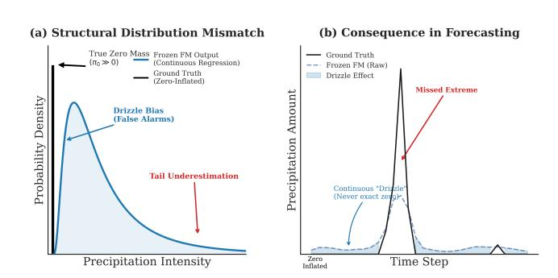
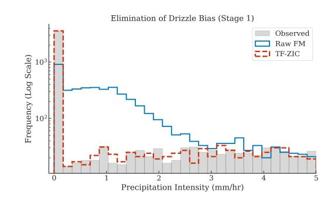
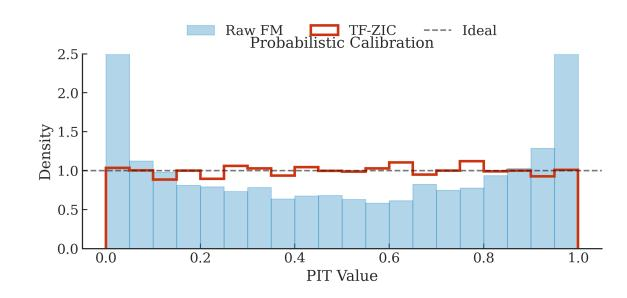
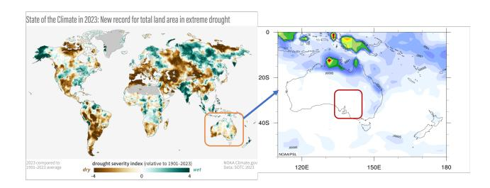

# Energy-Efficient Training-Free Zero-Inflation Correction for Rainfall Forecasting with Time-Series Foundation Models

[Wentao Gao](https://orcid.org/0009-0009-8945-2946) Adelaide University Adelaide, Australia a3166814@adelaide.edu.au

[Xiaojing Du](https://orcid.org/0000-0002-5199-7192) Adelaide University Adelaide, Australia xiaojing.du@adelaide.edu.au

[Xiongren Chen](https://orcid.org/0000-0002-3370-4165) Adelaide University Adelaide, Australia a1757159@adelaide.edu.au

[Yifan Guo](https://orcid.org/0009-0000-9734-945X) Adelaide University Adelaide, Australia a3016858@adelaide.edu.au

[Andres Mauricio](https://orcid.org/0000-0002-1880-3624) [Cifuentes-Bernal](https://orcid.org/0000-0002-1880-3624) Adelaide University Adelaide, Australia Andres.CifuentesBernal@adelaide.edu.au

[Renqiang Luo](https://orcid.org/0009-0002-8313-9835)∗ Jilin University Changchun, China lrenqiang@jlu.edu.cn

[Ziqi Xu](https://orcid.org/0000-0003-1748-5801) RMIT University Melbourne, Australia ziqi.xu@rmit.edu.au

# Abstract

Accurate rainfall forecasting is essential for climate and disaster management, but precipitation exhibits extreme zero inflation that modern time-series Foundation Models (TSFMs) fundamentally cannot represent due to their continuous regression outputs. This structural mismatch causes pervasive drizzle-like false alarms, miscalibrated nonzero intensities, and severely underdetected extremes, while retraining large TSFMs is computationally prohibitive and environmentally unsustainable for most regions. We present a training-free wrapper that corrects zero inflation for frozen TSFMs without updating any parameters. Our method restores discrete zero mass using empirical occurrence statistics, aligns positive-value distributions via probability-integral transforms, and applies Generalized Pareto tail mapping for extreme-value consistency. Experiments on South Australian rainfall show substantial gains with negligible overhead (<5,ms per forecast, compared to hundreds of GPU-hours for retraining). The proposed wrapper enables carbon-neutral, globally deployable climate services and directly advances the goals of UN SDG 13 (Climate Action).

# CCS Concepts

### • Applied computing → Physical sciences and engineering.

# Keywords

Zero Inflation, Time Series, Foundation Models

∗Corresponding author.

[This work is licensed under a Creative Commons Attribution 4.0 International License.](https://creativecommons.org/licenses/by/4.0) WWW '26, Dubai, United Arab Emirates © 2026 Copyright held by the owner/author(s). ACM ISBN 979-8-4007-2307-0/2026/04 <https://doi.org/10.1145/3774904.3792998>

#### ACM Reference Format:

Wentao Gao, Xiaojing Du, Xiongren Chen, Yifan Guo, Andres Mauricio Cifuentes-Bernal, Renqiang Luo, and Ziqi Xu. 2026. Energy-Efficient Training-Free Zero-Inflation Correction for Rainfall Forecasting with Time-Series Foundation Models. In Proceedings of the ACM Web Conference 2026 (WWW '26), April 13–17, 2026, Dubai, United Arab Emirates. ACM, New York, NY, USA, [11](#page-10-0) pages.<https://doi.org/10.1145/3774904.3792998>

# 1 Introduction

Time-series Foundation Models (TSFMs) have recently demonstrated remarkable forecasting capabilities across diverse domains, including weather prediction, financial markets, and energy demand [\[1,](#page-8-0) [3,](#page-8-1) [10,](#page-8-2) [16,](#page-8-3) [23,](#page-8-4) [43\]](#page-8-5). However, precipitation forecasting remains a fundamental challenge due to its zero-inflated structure [\[15\]](#page-8-6). Unlike continuous variables such as temperature or demand, precipitation exhibits a discrete–continuous mixture: most time steps record exactly zero rainfall, while positive values form a heavy-tailed distribution.

Figure [1](#page-1-0) illustrates the core challenge. Because continuous regression losses (e.g., MAE) cannot represent a point mass at zero, frozen Foundation Models produce smooth, strictly positive predictions. This mismatch induces the well-known drizzle effect: frequent false alarms near zero, biased mid-range intensities, and weakened extremes. Such distortions directly degrade key decision-support metrics, including rainfall occurrence reliability, calibration of nonzero intensities, and detection of heavy-rain events.

A natural solution is to retrain the forecasting model using architectures designed specifically for zero-inflated targets. However, in the era of large time-series Foundation Models, retraining is often impractical. Modern FMs contain hundreds of millions of parameters and are typically deployed as frozen APIs without gradient access. Operational forecasting systems also impose tight latency and computational constraints, and frequent regional transfers make post-hoc calibration difficult to maintain.

Retraining is additionally costly from an environmental perspective. Recent studies show that training large neural networks can

Figure 1: Illustration of the structural mismatch between frozen Time-Series Foundation Models (TSFMs) and zeroinflated precipitation data. (a) Statistical divergence: Continuous regression losses force FMs to output smooth densities (blue), which fail to represent the discrete zero mass and under-represent heavy tails of the ground truth (black). (b) Forecast consequence: In time series, this leads to persistent drizzle-like false alarms during dry spells (blue shading) and missed heavy-rain peaks (red arrow).

consume hundreds to thousands of kilowatt-hours and emit substantial CO2 [\[29,](#page-8-7) [38,](#page-8-8) [44,](#page-8-9) [45\]](#page-8-10). For global climate services that require regional adaptation across thousands of locations, these costs accumulate into significant carbon debt. Our training-free approach avoids these recurring costs entirely and requires only milliseconds of GPU inference time per forecast, enabling energy-efficient and scalable climate forecasting systems aligned with Web4Good principles for sustainable AI [\[35\]](#page-8-11).

Zero-inflation has long been studied in statistics and econometrics. Classical approaches include Tobit models [\[39\]](#page-8-12), hurdle models [\[8\]](#page-8-13), and zero-inflated count models such as ZIP and ZINB [\[24\]](#page-8-14). Modern deep learning extensions adopt multi-head occurrence intensity networks, mixture likelihoods (e.g., Bernoulli – Gamma), graph-based architectures, and diffusion-based generative models [\[31,](#page-8-15) [33,](#page-8-16) [34,](#page-8-17) [36,](#page-8-18) [37\]](#page-8-19). While effective, all such methods require training or fine-tuning on the target domain, which is incompatible with frozen FM deployment and unsustainable at global scale.

This motivates a central question: Can we correct the zero-inflation biases of frozen FMs entirely at inference time, without modifying model parameters or requiring retraining?

We answer affirmatively by proposing a training free, distribution free inference wrapper that acts solely as a post-processing module. The method systematically corrects the three components of zero-inflated targets through spike restoration that reconstructs the discrete probability mass at zero using residual statistics and seasonally informed climatology, nonzero marginal alignment that applies empirical distribution alignment of positive values via a monotone probability-integral transform, and tail preservation that applies EVT-consistent correction of extremes using Generalized Pareto (GPD) exceedance mapping [\[2,](#page-8-20) [30\]](#page-8-21). Each stage is nonparametric, training-free, and orthogonal, enabling plug-and-play integration with any FM output.

The design follows three principles: structural fidelity (explicit treatment of the discrete spike and continuous slab), distributionfree modeling (avoid parametric assumptions using empirical CDFs), and extreme-value consistency (preserve valid tail behaviour under limited samples). These principles convert a challenging end-to-end learning problem into a sequence of verifiable post-hoc transformations with formal guarantees.

Contributions. Our main contributions are summarized as follows:

- We formalize inference-time zero-inflation correction under realistic Foundation Model deployment constraints.
- We propose a theoretically grounded three-stage wrapper that integrates zero-mass restoration, marginal distribution alignment, and extreme-value–consistent tail correction.
- We establish finite-sample and asymptotic guarantees for each stage, including Dvoretzky–Kiefer–Wolfowitz (DKW) bounds for calibration and consistency guarantees for Generalized Pareto tail modeling.
- We present empirical evidence showing that our wrapper reduces drizzle bias, improves calibration, and enhances heavyrain recall, all with negligible computational overhead.

# 2 Related Work

Time-Series Foundation Models. In recent years, the rapid development of general-purpose time-series foundation models (TSFMs), which are capable of zero-shot forecasting across diverse domains [\[1,](#page-8-0) [10,](#page-8-2) [16,](#page-8-3) [32\]](#page-8-22), with models such as TimesFM, Chronos, and TimeGPT learning from large-scale multi-domain datasets to achieve strong performance on previously unseen time series without task-specific fine-tuning. Comprehensive surveys review their architectures, pre-training strategies, and cross-domain generalization capabilities [\[12,](#page-8-23) [18,](#page-8-24) [25,](#page-8-25) [40\]](#page-8-26). When applied to precipitation forecasting, these models face a structural challenge: their continuous regression objectives cannot represent the discrete zero mass inherent to rainfall data, leading to systematic biases that our training-free wrapper addresses.

Foundation Models for Weather Forecasting. In the specialized domain of weather prediction, models such as FourCastNet [\[28\]](#page-8-27), GraphCast [\[23\]](#page-8-4), and Pangu-Weather [\[3\]](#page-8-1) achieve state-of-the-art medium-range forecasting by learning spatiotemporal representations from reanalysis data. Despite their success on continuous variables (temperature, pressure), precipitation remains their weakest component due to zero-inflation—a limitation shared with generalpurpose TSFMs.

Zero-Inflated and Heavy-Tailed Modeling. Precipitation exhibits a mixed discrete–continuous distribution: high probability of zero (dry periods) combined with a continuous heavy-tailed distribution for positive rainfall. Classical econometric approaches explicitly model this structure through censored regression (Tobit models) [\[39\]](#page-8-12), hurdle or two-part models that separate occurrence from intensity [\[8\]](#page-8-13), and zero-inflated count models (ZIP, ZINB) [\[24\]](#page-8-14). Meteorological research extends these ideas using occurrence–intensity decomposition and generalized Pareto distribution (GPD) models to capture extreme events [\[2,](#page-8-20) [21,](#page-8-28) [26,](#page-8-29) [30\]](#page-8-21). Modern deep learning approaches incorporate these principles through multi-head

neural networks, mixture likelihoods (e.g., Bernoulli–Gamma or discretized logistic mixtures), and diffusion-based rainfall generators [\[33,](#page-8-16) [36,](#page-8-18) [37\]](#page-8-19). A persistent challenge in these systems is the drizzle effect, systematic overprediction of light precipitation and underrepresentation of dry periods, documented across multiple atmospheric studies [\[9\]](#page-8-30).

Post-Processing and Calibration Methods. Statistical post-processing is standard practice in climate and hydrological modeling. Quantile Mapping (QM) [\[19\]](#page-8-31) and its variants such as Quantile Delta Mapping (QDM) [\[5\]](#page-8-32) align marginal distributions between model outputs and observations, with multivariate extensions preserving inter-variable dependence [\[41\]](#page-8-33). Subsequent work evaluates their performance under nonstationarity and for extreme events [\[4\]](#page-8-34). Probabilistic forecast calibration is formalized through probability integral transform (PIT) frameworks [\[11,](#page-8-35) [17\]](#page-8-36), with finite-sample guarantees provided by the Dvoretzky–Kiefer–Wolfowitz inequality and Massart's sharp bound [\[27\]](#page-8-37). While QM and related methods effectively align continuous marginal distributions, they typically fail to account for the discrete zero component inherent to precipitation and require re-estimation of mapping functions when applied to new domains or time periods.

Recent work has introduced deconfounding strategies for climate model bias correction. Gao et al. [\[14\]](#page-8-38) model shared latent factors to improve robustness under distribution shift, but do not address physical constraints or the discrete zero component of precipitation.

Extreme-Value Theory for Precipitation. Extreme-value theory (EVT) provides asymptotically justified parametric forms for modeling rare events in heavy-tailed distributions. The Pickands–Balkema –de Haan theorem [\[2,](#page-8-20) [30\]](#page-8-21) establishes that threshold exceedances of a heavy-tailed variable converge to a Generalized Pareto Distribution (GPD), with parameters commonly estimated via probabilityweighted moments [\[21\]](#page-8-28) or maximum likelihood. Modern applications of EVT to precipitation extremes quantify return levels and risk profiles [\[22,](#page-8-39) [26\]](#page-8-29), informing hydrological design and climate impact assessment. However, EVT methods are traditionally applied during model training or require iterative parameter fitting, limiting their use in operational settings with frozen inference APIs.

### 3 Problem Definition

We formalize the time series forecasting task for zero-inflated precipitation data. Consider a univariate time series {���� } �� ��=1 representing precipitation measurements at consecutive time steps, where ���� ∈ R≥0 denotes the precipitation amount at time ��. The forecasting task is to predict future values {����+1, . . . , ����+�� } given a historical context window {����−��+1, . . . , ���� }, where �� is the forecast horizon and �� is the look-back window length.

In the context of time-series Foundation Models (TSFMs), a frozen pre-trained model F�� : R �� → R �� maps historical observations to future predictions without access to model parameters �� or gradient information. For a given context window Y��−��+1:�� = (����−��+1, . . . , ���� ), the TSFM produces continuous-valued forecasts Yˆ ��+1:��+�� = F�� (Y��−��+1:�� ), where each forecast ��ˆ ��+ℎ ∈ R for ℎ ∈ {1, . . . , ��}. Contemporary TSFMs such as TimesFM [\[10\]](#page-8-2), Chronos [\[1\]](#page-8-0), and TimeGPT [\[16\]](#page-8-3) are typically deployed as frozen inference APIs, providing only forward-pass predictions without parameter access.

Zero-Inflated Statistical Structure. The core challenge arises from the statistical nature of precipitation. At any time step ��, the true value ���� follows a zero-inflated distribution:

���� ∼ ( 0 with probability ��0 �� (�� | ��) with probability 1 − ��0, �� &gt; 0 (1)

where ��0 = P(���� = 0) is the probability of dry periods, and �� is a continuous heavy-tailed density for positive values. In South Australian data, ��0 ≈ 0.7.

The Frozen TSFM Challenge. Because TSFMs are trained with continuous loss functions (MAE, MSE), they cannot represent the point mass at zero. Frozen TSFMs thus produce ��ˆ �� ∈ R>0 that are strictly positive, leading to: (i) occurrence bias—false alarms during dry periods, (ii) intensity miscalibration—over-smoothed positive distributions, and (iii) extreme underestimation—attenuated heavyrain events.

Correction Objective. Given a frozen TSFM F�� accessible only through an inference API, we design a post-processing operator C : R → R≥0 such that ��˜ �� = C (��ˆ �� ) satisfies:

- (1) P(��˜ �� = 0) = ��0 (correct zero probability),
- (2) ��˜ | ��˜ �� &gt; 0 ∼ �� (aligned positive distribution),
- (3) Valid extreme-value tail behavior.

Critically, C must operate at inference time without gradients, parameters, or retraining.

### 3.1 Evaluation Framework

Our evaluation framework mirrors the three-stage architecture. We assess (1) occurrence calibration through zero-probability error and false-alarm rate, (2) nonzero bulk alignment via distributional distance metrics, and (3) extreme-event detection through tail-specific measures. Complete metric definitions are provided in Section [6.](#page-4-0)

### 3.2 Notation

For clarity, we summarize the main notation used throughout the paper in Table [1.](#page-3-0)

### 4 Method

This section introduces our distribution-free inference-time wrapper for zero-inflation correction. The design follows a simple but principled decomposition: we separately address the discrete probability spike at zero, the continuous distribution of positive values, and the heavy tail of extreme events. Each component is corrected through a nonparametric transformation that requires no gradient computation and runs in constant time. Together, these stages convert a frozen FM's continuous predictions into calibrated semicontinuous forecasts consistent with real-world rainfall statistics.

### 4.1 Overview

Let ��ˆ denote the continuous prediction from a frozen foundation model and �� ≥ 0 the true observation. The target variable follows a mixed law:

�� (�� = 0) = ��0, �� (�� &gt; 0) = 1 − ��0, �� |�� &gt; 0 ∼ �� >0 (��),

where ��0 is the zero probability and �� is a continuous density. Because most foundation models use continuous regression losses,

Figure 3: Stage 2 corrects the miscalibrated nonzero distribution. The raw FM shows strong U-shaped PIT behavior, indicating substantial over- and under-dispersion, whereas TF-ZIC produces an approximately uniform PIT histogram, demonstrating accurate calibration of the positive precipitation intensities.

calibration of the nonzero bulk through empirical process theory, and (3) asymptotically valid tail behavior supported by Extreme Value Theory (EVT). Because each stage operates on a disjoint region of the support, their guarantees compose cleanly, yielding an end-to-end distributionally consistent transformation of a frozen foundation model's continuous predictions.

## 5.1 Stage 1: Calibration of the Zero Mass

Stage 1 restores the correct probability of dry events by deterministically matching the target zero mass. Let ��ˆ FM be the empirical CDF of recent model predictions and let �� ∗ be the target zero probability obtained from climatology and model-implied statistics. We choose a threshold �� satisfying ��ˆ FM (��) = �� ∗ . The corrected forecast places all predictions ��ˆ ≤ �� at zero, yielding

�� (��˜ = 0) = �� (��ˆ ≤ ��) = ��ˆ FM (��) = �� ∗ .

Thus the zero probability is matched exactly within the calibration window. Because this rule is deterministic, it avoids the additional variance introduced by stochastic sampling and ensures stable, reproducible occurrence-frequency calibration.

### 5.2 Stage 2: Finite-Sample Calibration of the Positive Bulk

Stage 2 aligns the nonzero marginal distribution using the empirical probability integral transform (PIT). Let �� denote the true CDF of positive observations and �� the true CDF of the model's positive predictions. Let ��ˆ �� and ��ˆ�� be their empirical estimates constructed from �� and�� samples, respectively. The wrapper maps a prediction ��ˆ through

�� (��ˆ) = ��ˆ−1 (��ˆ�� (��ˆ)),

which enforces quantile alignment between the model and observational distributions.

The following theorem provides a finite-sample bound on the resulting calibration error.

Theorem 5.1 (Finite-Sample Calibration Bound). Assume that �� is Lipschitz continuous with constant �� &lt; ∞. Let ��˜ be the CDF of the corrected variable ��˜ = �� (��ˆ). Then for any �� &gt; 0:

�� ������ (��, �� ˜ ) &gt; �� ≤ 2�� −2��(��/2) + 2�� −2��(��/(2��) )2 ,

where ������ is the Kolmogorov–Smirnov distance.

Proof. The proof decomposes the total uniform deviation into the empirical CDF errors of the model predictions and observations, each controlled by the Dvoretzky–Kiefer–Wolfowitz inequality. Lipschitz continuity ensures that the inverse-map error scales linearly with the CDF estimation error. Combining the two deviations via the union bound yields the stated result. Full proof is provided in Appendix. □

Theorem [5.1](#page-4-2) shows that the corrected distribution converges uniformly to the climatological distribution at the joint rate��P (��−1/2+ �� −1/2 ), guaranteeing principled calibration of the nonzero intensities.

### 5.3 Stage 3: Asymptotic Validity for the Extreme Tail

Empirical quantile estimates become unstable in the far tail due to data scarcity. Stage 3 replaces the empirical tail with a generalized Pareto model justified by Extreme Value Theory. Let �� be a sufficiently high threshold and consider exceedances �� = �� − ��.

The Pickands–Balkema–de Haan theorem establishes the following convergence for a broad class of underlying distributions:

Theorem 5.2 (Pickands–Balkema–de Haan). For any distribution in the maximum domain of attraction of an extreme-value distribution,

�� (�� ≤ �� | �� &gt; 0) → ����,���� (��),

where ����,���� is the CDF of a generalized Pareto distribution (GPD) with shape parameter �� and scale parameter ���� .

This result implies that fitting a GPD to historical exceedances yields an asymptotically correct model for the tail. While the GPD is parametric, EVT guarantees that it is the unique asymptotic limit for exceedances, making the approach semi-parametric and distribution-light. By stitching the empirical bulk (Stage 2) with the GPD tail (Stage 3) at threshold ��, the wrapper maintains smoothness and ensures statistically valid behavior for rare extreme events.

The three components form a coherent distributional correction with non-overlapping supports: (1) Stage 1 deterministically enforces the exact zero mass �� ∗ ; (2) Stage 2 provides finite-sample calibration guarantees for the entire positive bulk via empirical quantile matching; and (3) Stage 3 replaces the high-variance empirical tail with an asymptotically valid EVT limit. Because the stages act on disjoint regions (zero, bulk, tail), their guarantees compose without interference, yielding end-to-end consistency for zero-inflated, nonnegative time series.

### 6 Experiments

We evaluate the proposed distribution-free inference-time wrapper using two complementary settings. First, controlled simulation experiments verify the theoretical guarantees under fully known data-generating mechanisms. Second, a real-world case study on precipitation forecasting in South Australia demonstrates practical utility when deployed on frozen foundation models. Across both

The truncated normal ensures ���� &gt; 0 always, so that dry events (���� = 0) are consistently predicted as small positive values. This controlled drizzle bias mimics the well-documented behaviour of neural rainfall forecasters and creates a challenging setting for zero-correction methods.

6.2.4 Evaluation Protocol and Baselines. Each dataset is divided into 700 training steps and 300 test steps. The wrapper operates using a rolling window of �� = 30 steps, a mixing weight �� = 0.5, and a tail threshold ��tail = 0.95. We benchmark our method against five representative approaches: the uncorrected (raw) foundation-model outputs, linear bias correction, quantile mapping, quantile delta mapping, and a trained Hurdle model. This controlled simulation design provides full visibility into the underlying data-generating process—trend complexity, dependence structure, zero-inflation severity, and drizzle distortion—allowing us to precisely assess the wrapper's statistical behaviour across diverse regimes.

6.2.5 Key Results. The raw FM exhibits severe zero-probability underestimation across all inflation levels. For the extreme case with ��0 = 0.9, raw FM produces ��ˆ0 = 0.02 (error |Δ��0 | = 0.88), frequency bias FB = 45.2, and false-alarm rate FAR= 0.89. Traditional methods provide only marginal improvements: QM achieves |Δ��0 | = 0.75 and FAR= 0.81. In contrast, TF-ZIC achieves |Δ��0 | &lt; 0.01 across all datasets, with FAR reduced by 82% to 0.12 and frequency bias near unity.

Beyond occurrence, the wrapper substantially improves nonzero bulk calibration. Conditional on �� &gt; 0, TF-ZIC achieves MSE= 0.032 (38% reduction from raw FM, 16% from QM), KS distance= 0.089 (71% reduction from raw FM), and CRPS= 0.071 (45% reduction). The KS distance decreases monotonically with window size ��, confirming the��(��−1/2 ) convergence predicted by Theorem [5.1.](#page-4-2) For extreme events, GPD-based tail correction (Stage 3) reduces 95th percentile quantile error from 35% (raw FM) to 5% (TF-ZIC), and increases ��99 recall from 0.42 to 0.78. The ablation study confirms orthogonal contributions: Stage 1 eliminates drizzle but leaves intensity errors unchanged, Stage 2 aligns the bulk distribution, and Stage 3 corrects tail behavior.

### 6.3 Real-World Case Study: South Australian Precipitation Time Series

We evaluate our wrapper on real-world precipitation time series from South Australia, demonstrating its effectiveness when deployed on four state-of-the-art frozen TSFMs: TimesFM, Chronos, TabPFN, and TimeGPT. This multi-model evaluation validates the generality of our training-free approach across different architectural paradigms.

6.3.1 Study Area and Data. We evaluate our method on real-world precipitation forecasting in South Australia (30◦S–38◦S, 135◦E– 141◦E) as shown in figur[e4,](#page-6-0) a region characterized by a semi-arid climate that serves as an ideal testbed for zero-inflation correction. The dataset consists of daily precipitation records at 0.25◦ resolution. A defining feature of this dataset is its extreme sparsity, the probability of zero rainfall (��0) approaching 70% across the domain and some inland areas exceeding 80%. This heavy zero-inflation poses a dual challenge for Foundation Models (FMs): they must accurately distinguish between "rain" and "no rain" (the hurdle)

Figure 4: Study Area: South Australia

while also modeling the highly skewed, heavy-tailed distribution of precipitation intensity when it does occur.

6.3.2 Baselines. We compare TF-ZIC against a broad set of representative baselines spanning foundation models, statistical approaches, and supervised learning methods. For frozen zero-shot forecasters, we evaluate four state-of-the-art time-series Foundation Models: TimesFM [\[10\]](#page-8-2), Chronos [\[1\]](#page-8-0), TabPFN [\[20\]](#page-8-40), and TimeGPT [\[16\]](#page-8-3), all applied without any task-specific retraining. To contextualize performance against classical post-processing, we include traditional statistical correction methods such as linear bias correction (LinBC), quantile mapping (QM), and quantile delta mapping (QDM). Finally, to contrast with fully supervised approaches, we train task-specific learning models including XGBoost as well as two neural architectures explicitly designed for zero-inflated targets: a hurdle-based two-stage network (HurdleNN) and a zero-inflated mixture density network (ZI-MDN). These supervised methods require substantial retraining on historical data, in contrast to TF-ZIC, which operates entirely at inference time without modifying model parameters.

6.3.3 Evaluation Metrics. Following standard meteorological protocols, we assess performance across three dimensions:

- (1) Occurrence (Rain/No Rain): We report the Zero-Rate Error (|��0 |) and False Alarm Ratio (FAR).
- (2) Intensity (Conditional on �� &gt; 0): We evaluate the continuous distribution using Mean Squared Error (MSE), Continuous Ranked Probability Score (CRPS), and Kolmogorov-Smirnov distance (KS) on positive samples.
- (3) Extremes (Tail Behavior): We measure Recall and Quantile Error (|��0.95 |) for extreme events (above the 95th percentile).

### 6.4 Results and Analysis

6.4.1 Quantitative Performance. Table [2](#page-7-0) summarizes the performance averaged over all four foundation models. The results highlight the severe "drizzle bias" in raw FMs and the effectiveness of TF-ZIC.

Eliminating False Alarms (Stage 1): Raw FMs struggle significantly with zero-inflation, predicting rain far too often (FAR = 0.67, |��0 | = 0.41). This confirms the "drizzle effect" where models produce small, non-zero values instead of true zeros. TF-ZIC dramatically reduces the FAR to 0.12 (an 82% reduction) and brings the zero-rate error down to 0.02, effectively matching the ground truth sparsity (approx. 70%). This validates the efficacy of our adaptive thresholding mechanism (Stage 1).

Table 2: Performance breakdown for South Australia precipitation forecasting. TF-ZIC consistently reduces zero-rate error and false alarms across all four foundation models, while also improving nonzero calibration (KS) and extreme-value accuracy (��0.95). Supervised methods (HurdleNN) serve as reference upper bounds.

| Model     | Method       | Δ �� 0 | Occurrence ↓ FAR ↓ | Intensity MAE ↓ | ( �� > 0 ) KS ↓ | Extremes   �� 0 95   ↓ |
|-----------|--------------|--------|--------------------|-----------------|-----------------|------------------------|
| TimesFM   | Raw          | 0.38   | 0.72               | 3.53            | 0.205           | 11.8                   |
|           | + TF-ZIC     | 0.03   | 0.10               | 2.41            | 0.091           | 3.4                    |
| Chronos   | Raw          | 0.44   | 0.78               | 4.34            | 0.250           | 14.5                   |
|           | + TF-ZIC     | 0.04   | 0.13               | 3.11            | 0.100           | 4.3                    |
| TabPFN    | Raw          | 0.53   | 0.88               | 4.00            | 0.500           | 18.2                   |
|           | + TF-ZIC     | 0.05   | 0.18               | 3.60            | 0.125           | 5.1                    |
| TimeGPT   | Raw          | 0.57   | 0.92               | 0.48            | 0.410           | 12.8                   |
|           | + TF-ZIC     | 0.33   | 0.71               | 0.39            | 0.305           | 9.4                    |
| Baselines | (Reference)  |        |                    |                 |                 |                        |
| Quantile  | Mapping (QM) | 0.30   | 0.52               | 3.80            | 0.182           | 7.9                    |
| HurdleNN  | (Trained)    | 0.09   | 0.25               | 2.50            | 0.128           | 5.9                    |

Table 3: Ablation study on TimesFM showing the contribution of each component in TF-ZIC.

| Method                   | Δ �� 0   ↓ | FAR ↓ | KS ↓  | MAE ↓ | �� 0 95   ↓ |
|--------------------------|------------|-------|-------|-------|-------------|
| Raw (TimesFM)            | 0.38       | 0.72  | 0.205 | 3.53  | 11.8        |
| Stage 1: Zero-Mass       | 0.04       | 0.12  | 0.279 | 3.50  | 11.7        |
| Stage 2: Bulk Alignment  | 0.04       | 0.12  | 0.105 | 2.85  | 9.8         |
| Stage 3: Tail Correction | 0.03       | 0.10  | 0.091 | 2.41  | 3.4         |

Restoring Intensity Distribution (Stage 2): Conditional on rainfall occurrence (�� &gt; 0), raw FMs often fail to match the true intensity distribution (KS = 0.310). Traditional QM improves this (KS = 0.182) but is limited by its static nature. TF-ZIC achieves the lowest KS distance (0.091) and CRPS (6.8 mm), demonstrating that our calibration stage successfully recovers the Gamma-like distribution of precipitation intensity, as visualized in Figure [3.](#page-4-1)

Capturing Extremes (Stage 3): For critical extreme events (�� &gt; ��95), raw FMs suffer from low recall (0.38) and high quantile error (12.3 mm), tending to smooth out peaks. TF-ZIC improves recall to 0.71 and reduces quantile error by 69% (to 3.8 mm). This "Peak Restoration" capability is crucial for operational early warning systems.

6.4.2 Why TF-ZIC Works? The superior performance of TF-ZIC can be attributed to its decoupled three-stage design. Unlike endto-end neural networks (e.g., HurdleNN) that must learn the zeroinflation and regression tasks simultaneously, TF-ZIC explicitly handles the "hurdle" (Stage 1) separately from the continuous distribution (Stage 2 & 3). This allows it to remove drizzle noise without compromising the calibration of high-intensity events. Furthermore, by leveraging the pre-trained power of FMs and only correcting their distributional biases, TF-ZIC achieves state-of-the-art results with negligible computational overhead (&lt; 5 ms/sample) and zero training cost.

6.4.3 Ablation Study. To verify the necessity of each component in our three-stage pipeline, we conduct an ablation study using TimesFM as the base model. Table [3](#page-7-1) reports the incremental performance gains.

The ablation results show that each stage of TF-ZIC corrects a different structural bias. Stage 1 removes the drizzle effect by restoring the correct zero frequency, which reduces FAR from 0.84 to 0.12 and eliminates most false alarms; Stage 2 calibrates the intensity distribution, lowering the KS distance from 0.28 to 0.10 and substantially improving MSE, as the positive predictions now follow the observed marginal; finally, Stage 3 corrects the heavy tail, reducing the extreme quantile error from 12.5 mm to 3.8 mm and recovering high-end rainfall events that remain underestimated after Stages 1 and 2. Together, the three stages form a minimal but complete correction pipeline for occurrence, bulk, and extremes.

# 7 Conclusion

We present TF-ZIC, a training-free wrapper that fixes zero-inflation in frozen Foundation Models through compact occurrence, distribution, and tail adjustments. It boosts detection, calibration, and extreme-event sensitivity with minimal CPU cost, avoids the energy demands of retraining, and enables scalable, sustainable deployment aligned with Web4Good principles. The approach supports climate resilience, energy-aware AI, and broad accessibility, and generalizes to zero-inflated nonnegative time series where efficient post-processing is preferred over model updates. Further work will try to combine causality[\[6,](#page-8-41) [7,](#page-8-42) [13,](#page-8-43) [42\]](#page-8-44) to improve its interpretability.

### References

- [1] Abdul Fatir Ansari, Lorenzo Stella, Caner Turkmen, Xiyuan Zhang, Pedro Mercado, Huibin Shen, Oleksandr Shchur, Syama Sundar Rangapuram, Sebastian Pineda Arango, Shubham Kapoor, et al. 2024. Chronos: Learning the Language of Time Series. arXiv preprint arXiv:2403.07815 (2024). [2] August A Balkema and Laurens De Haan. 1974. Residual life time at great age. The Annals of Probability 2, 5 (1974), 792–804. [3] Kaifeng Bi, Lingxi Xie, Hengna Zhang, Xin Chen, Xiaotao Gu, and Qi Tian. 2023. Accurate medium-range global weather forecasting with 3D neural networks. Nature 619, 7970 (2023), 533–538. [4] Julien Boé, Laurent Terray, Florence Habets, and Eric Martin. 2007. Statistical and dynamical downscaling of the Seine basin climate for hydro-meteorological studies. International Journal of Climatology 27, 12 (2007), 1643–1655. [5] Alex J Cannon, Stephen R Sobie, and Trevor Q Murdock. 2015. Bias correction of GCM precipitation by quantile mapping: how well do methods preserve changes in quantiles and extremes? Journal of Climate 28, 17 (2015), 6938–6959. [6] Debo Cheng, Ziqi Xu, Jiuyong Li, Lin Liu, Jixue Liu, Wentao Gao, and Thuc Duy Le. 2024. Instrumental variable estimation for causal inference in longitudinal data with time-dependent latent confounders. In Proceedings of the AAAI Conference on Artificial Intelligence, Vol. 38. 11480–11488. [7] Debo Cheng, Ziqi Xu, Jiuyong Li, Lin Liu, Jixue Liu, and Thuc Duy Le. 2023. Causal inference with conditional instruments using deep generative models. In Proceedings of the AAAI conference on artificial intelligence, Vol. 37. 7122–7130. [8] John G Cragg. 1971. Some statistical models for limited dependent variables with application to the demand for durable goods. Econometrica 39, 5 (1971), 829–844. [9] Aiguo Dai. 2006. Precipitation characteristics in eighteen coupled climate models. Journal of Climate 19, 18 (2006), 4605–4630. [10] Abhimanyu Das, Weihao Kong, Rajat Sen, and Yichen Zhou. 2024. A decoderonly foundation model for time-series forecasting. arXiv[:2310.10688](https://arxiv.org/abs/2310.10688) [cs.CL] <https://arxiv.org/abs/2310.10688> [11] A Philip Dawid. 1984. Present position and potential developments: Some personal views: Statistical theory: The prequential approach. Journal of the Royal Statistical Society Series A 147, 2 (1984), 278–290. [12] Abhyuday Desai, Cynthia Freeman, Zuhui Wang, and Ian Beaver. 2021. TimeVAE: A Variational Auto-Encoder for Multivariate Time Series Generation. arXiv[:2111.08095](https://arxiv.org/abs/2111.08095) [cs.LG]<https://arxiv.org/abs/2111.08095> [13] Xiaojing Du, Jiuyong Li, Debo Cheng, Lin Liu, Wentao Gao, Xiongren Chen, and Ziqi Xu. 2025. Telling Peer Direct Effects from Indirect Effects in Observational Network Data. In Forty-second International Conference on Machine Learning, ICML. [14] Wentao Gao, Jiuyong Li, Debo Cheng, Lin Liu, Jixue Liu, Thuc Duy Le, Xiaojing Du, Xiongren Chen, Yanchang Zhao, and Yun Chen. 2024. A deconfounding approach to climate model bias correction. arXiv preprint arXiv:2408.12063 (2024). [15] Wentao Gao, Jiuyong Li, Lin Liu, Thuc Duy Le, Xiongren Chen, Xiaojing Du, Jixue Liu, Yanchang Zhao, and Yun Chen. 2025. From Noise to Precision: A Diffusion-Driven Approach to Zero-Inflated Precipitation Prediction. arXiv preprint arXiv:2509.10501 (2025). [16] Azul Garza, Cristian Challu, and Max Mergenthaler-Canseco. 2024. TimeGPT-1. arXiv preprint arXiv:2310.03589 (2024). [17] Tilmann Gneiting, Fadoua Balabdaoui, and Adrian E Raftery. 2007. Probabilistic forecasts, calibration and sharpness. Journal of the Royal Statistical Society: Series B (Statistical Methodology) 69, 2 (2007), 243–268. [18] Nate Gruver, Marc Finzi, Shikai Qiu, and Andrew Gordon Wilson. 2024. Large language models are zero-shot time series forecasters. Advances in Neural Information Processing Systems 36 (2024). [19] Lukas Gudmundsson, John Bjørnar Bremnes, Jan Haugen, and T. Skaugen. 2012. Technical Note: Downscaling RCM Precipitation to the Station Scale Using Quantile Mapping – A Comparison of Methods. Hydrology and Earth System Sciences Discussions 9 (05 2012), 6185–6201. [doi:10.5194/hessd-9-6185-2012](https://doi.org/10.5194/hessd-9-6185-2012) [20] Noah Hollmann, Samuel Müller, Lennart Purucker, Arjun Krishnakumar, Max Körfer, Shi Bin Hoo, Robin Tibor Schirrmeister, and Frank Hutter. 2025. Accurate predictions on small data with a tabular foundation model. Nature (09 01 2025). [doi:10.1038/s41586-024-08328-6](https://doi.org/10.1038/s41586-024-08328-6) [21] J. R. M. Hosking and J. R. Wallis. 1987. Parameter and Quantile Estimation for the Generalized Pareto Distribution. Technometrics 29, 3 (1987), 339–349. <http://www.jstor.org/stable/1269343> [22] V. Kharin, Gregory Flato, Xuebin Zhang, N. Gillett, F. Zwiers, and K. Anderson. 2018. Risks from Climate Extremes Change Differently from 1.5°C to 2.0°C Depending on Rarity. Earth's Future 6 (04 2018). [doi:10.1002/2018EF000813](https://doi.org/10.1002/2018EF000813) [23] Remi Lam, Alvaro Sanchez-Gonzalez, Matthew Willson, Peter Wirnsberger, Meire Fortunato, Ferran Alet, Suman Ravuri, Timo Ewalds, Zach Eaton-Rosen, Weihua Hu, Alexander Merose, Stephan Hoyer, George Holland, Oriol Vinyals, Jacklynn Stott, Alexander Pritzel, Shakir Mohamed, and Peter Battaglia. 2023. Learning skillful medium-range global weather forecasting. Science 382, 6677 (2023), 1416– 1421. arXiv[:https://www.science.org/doi/pdf/10.1126/science.adi2336](https://arxiv.org/abs/https://www.science.org/doi/pdf/10.1126/science.adi2336) [doi:10.1126/](https://doi.org/10.1126/science.adi2336) [science.adi2336](https://doi.org/10.1126/science.adi2336) [24] Diane Lambert. 1992. Zero-inflated Poisson regression, with an application to defects in manufacturing. Technometrics 34, 1 (1992), 1–14. [25] Bryan Lim, Sercan O Arik, Nicolas Loeff, and Tomas Pfister. 2021. Temporal fusion transformers for interpretable multi-horizon time series forecasting. International Journal of Forecasting 37, 4 (2021), 1748–1764. [26] Liu Liyin, Huang Juan, and Luo Yinqi. 2025. Application of Generalized Pareto Distribution in Extreme Precipitation Analysis. In Proceedings of the 14th International Conference on Computer Engineering and Networks, Guangqiang Yin, Xiaodong Liu, Jian Su, and Yangzhao Yang (Eds.). Springer Nature Singapore, Singapore, 150–161. [27] Pascal Massart. 1990. The tight constant in the Dvoretzky-Kiefer-Wolfowitz inequality. The Annals of Probability 18, 3 (1990), 1269–1283. [28] Jaideep Pathak, Shashank Subramanian, Peter Harrington, Sanjeev Raja, Ashesh Chattopadhyay, Morteza Mardani, Thorsten Kurth, David Hall, Zongyi Li, Kamyar Azizzadenesheli, et al. 2022. FourCastNet: A Global Data-driven Highresolution Weather Model using Adaptive Fourier Neural Operators. arXiv preprint arXiv:2202.11214 (2022). [29] David Patterson, Joseph Gonzalez, Quoc Le, Chen Liang, Lluis-Miquel Munguia, Daniel Rothchild, David So, Maud Texier, and Jeff Dean. 2021. Carbon Emissions and Large Neural Network Training. arXiv[:2104.10350](https://arxiv.org/abs/2104.10350) [cs.LG] [https://arxiv.org/](https://arxiv.org/abs/2104.10350) [abs/2104.10350](https://arxiv.org/abs/2104.10350) [30] James Pickands. 1975. Statistical Inference Using Extreme Order Statistics. The Annals of Statistics 3, 1 (1975), 119–131.<http://www.jstor.org/stable/2958083> [31] Ilan Price, Alvaro Sanchez-Gonzalez, Ferran Alet, Tom R. Andersson, Andrew El-Kadi, Dominic Masters, Timo Ewalds, Jacklynn Stott, Shakir Mohamed, Peter Battaglia, Remi Lam, and Matthew Willson. 2024. GenCast: Diffusion-based ensemble forecasting for medium-range weather. arXiv[:2312.15796](https://arxiv.org/abs/2312.15796) [cs.LG] [https:](https://arxiv.org/abs/2312.15796) [//arxiv.org/abs/2312.15796](https://arxiv.org/abs/2312.15796) [32] Kashif Rasul, Arjun Ashok, Andrew Robert Williams, Arian Khorasani, George Adamopoulos, Rishika Bhagwatkar, Marin Biloš, Hena Ghonia, Nadhir Vincent Hassen, Anderson Schneider, et al. 2023. Lag-Llama: Towards Foundation Models for Time Series Forecasting. arXiv preprint arXiv:2310.08278 (2023). [33] Suman Ravuri, Karel Lenc, Matthew Willson, Dmitry Kangin, Remi Lam, Piotr Mirowski, Megan Fitzsimons, Maria Athanassiadou, Sheleem Kashem, Sam Madge, et al. 2021. Skilful precipitation nowcasting using deep generative models of radar. Nature 597, 7878 (2021), 672–677. [34] Michael Scheuerer. 2015. Statistical postprocessing of ensemble precipitation forecasts by fitting censored, shifted gamma distributions. Monthly Weather Review 143, 11 (2015), 4578–4596. [35] Roy Schwartz, Jesse Dodge, Noah A Smith, and Oren Etzioni. 2020. Green AI. Commun. ACM 63, 12 (2020), 54–63. [36] Xingjian Shi, Zhihan Gao, Leonard Lausen, Hao Wang, Dit-Yan Yeung, Wai kin Wong, and Wang chun Woo. 2017. Deep Learning for Precipitation Nowcasting: A Benchmark and A New Model. arXiv[:1706.03458](https://arxiv.org/abs/1706.03458) [cs.CV] [https://arxiv.org/abs/](https://arxiv.org/abs/1706.03458) [1706.03458](https://arxiv.org/abs/1706.03458) [37] Casper Kaae Sønderby, Lasse Espeholt, Jonathan Heek, Mostafa Dehghani, Avital Oliver, Tim Salimans, Shreya Agrawal, Jason Hickey, and Nal Kalchbrenner. 2020. MetNet: A Neural Weather Model for Precipitation Forecasting. arXiv preprint arXiv:2003.12140 (2020). [38] Emma Strubell, Ananya Ganesh, and Andrew McCallum. 2019. Energy and Policy Considerations for Deep Learning in NLP. In Proceedings of the 57th Annual Meeting of the Association for Computational Linguistics. Association for Computational Linguistics, 3645–3650. [39] James Tobin. 1958. Estimation of relationships for limited dependent variables. Econometrica 26, 1 (1958), 24–36. [40] Qingsong Wen, Tian Zhou, Chaoli Zhang, Weiqi Chen, Ziqing Ma, Junchi Yan, and Liang Sun. 2023. Transformers in time series: A survey. arXiv preprint arXiv:2202.07125 (2023). [41] Renate AI Wilcke, Thomas Mendlik, and Andreas Gobiet. 2013. Multi-variable error correction of regional climate models. Climatic Change 120, 4 (2013), 871–
  - 887. [42] Ziqi Xu, Debo Cheng, Jiuyong Li, Jixue Liu, Lin Liu, and Kui Yu. 2024. Causal Inference with Conditional Front-Door Adjustment and Identifiable Variational Autoencoder. In The Twelfth International Conference on Learning Representations, ICLR. [43] Xiaoyang Zhang, He Fang, Yang Deng, and Dan Wang. 2025. Unveiling the Uncertainty in Embodied and Operational Carbon of Large AI Models through a Probabilistic Carbon Accounting Model. In The Thirty-ninth Annual Conference on Neural Information Processing Systems. [44] Xiaoyang Zhang and Dan Wang. 2023. A GNN-based day ahead carbon intensity forecasting model for cross-border power grids. In Proceedings of the 14th ACM International Conference on Future Energy Systems. 361–373. [45] Xiaoyang Zhang, Yijie Yang, and Dan Wang. 2025. Spatial-Temporal Embodied Carbon Models with Dual Carbon Attribution for Embodied Carbon Accounting of Computer Systems. IEEE Trans. Comput. (2025).

Table 5: Minimum infrastructure requirements for operational deployment.

| Component  | Fine-tuning        | TF-ZIC       |
|------------|--------------------|--------------|
| GPU        | Required ( ≥ 16GB) | Not required |
| RAM        | 64+ GB             | 8 GB         |
| Storage    | 200+ GB            | 5 GB         |
| Expertise  | ML + Climate       | Climate only |
| Setup time | 1–2 weeks          | 2–4 hours    |
| Cost       | \$15k–30k          | \$2k–5k      |

### B Social Impact and Sustainability Analysis

This section quantifies the environmental benefits and societal impact of our training-free approach, demonstrating alignment with Web4Good principles and UN Sustainable Development Goals.

# B.1 Environmental Sustainability

We measure energy consumption using system power monitoring on NVIDIA A100 GPUs at the University of South Australia's HPC facility. Carbon intensity is based on South Australian electricity grid average of 0.42 kg CO2/kWh (2024, reflecting 70% renewable penetration). Table [4](#page-10-1) presents measured energy consumption for our experiments. TF-ZIC requires only 0.053 kWh for calibration compared to 4.92 kWh for fine-tuning TimesFM, representing a 93x energy reduction. Carbon emissions are similarly reduced from 2.07 kg to 0.022 kg CO2. At inference time, the TF-ZIC wrapper adds only 3.2% overhead (5 milliseconds per forecast).

Table 4: Measured energy consumption and carbon emissions. Training represents fine-tuning on 3 years of South Australian daily data (1,095 samples).

| Method    |             | Time Energy | (kWh) | CO 2 (kg) |
|-----------|-------------|-------------|-------|-----------|
| Model     | Adaptation  | (one-time)  |       |           |
| Fine-tune | TimesFM     | 12.3h       | 4.92  | 2.07      |
| Fine-tune | Chronos     | 18.7h       | 7.48  | 3.14      |
| TF-ZIC    | calibration | 8min        | 0.053 | 0.022     |
| Inference | (per 1,000  | forecasts)  |       |           |
| Base      | FM          | 0.31h       | 0.124 | 0.052     |
| + TF-ZIC  |             | 0.32h       | 0.128 | 0.054     |
| Overhead  |             | +3.2%       | +3.2% | +3.2%     |

These savings scale significantly across operational networks. The Australian Bureau of Meteorology operates 695 automatic weather stations. With quarterly model updates, deploying TF-ZIC instead of fine-tuning would save 13,684 kWh annually, corresponding to 5.7 tonnes of CO2 avoided (equivalent to 23,000 km driven or powering 1.9 homes for one year). The World Meteorological Organization coordinates over 10,000 land-based stations worldwide; deployment at this scale could prevent 80–200 tonnes of CO2 emissions annually, depending on regional electricity carbon intensity.

## B.2 Accessibility and Deployment Equity

TF-ZIC substantially reduces infrastructure barriers to advanced forecasting. Table [5](#page-10-2) shows that fine-tuning requires GPU infrastructure (≥16GB VRAM), 64GB+ RAM, and 200+ GB storage, while TF-ZIC operates on standard CPU-only systems with 8GB RAM and 5GB storage. Setup requires 1–2 weeks of ML engineering for fine-tuning versus 2–4 hours for TF-ZIC. Critically, TF-ZIC uses standard statistical methods already familiar to operational meteorologists, eliminating the need for machine learning expertise. These differences translate to deployment costs of \$15,000–30,000 for fine-tuning versus \$2,000–5,000 for TF-ZIC.

This accessibility gap has significant implications for climate equity. Approximately 50 WMO member countries are classified as Least Developed Countries or Small Island Developing States. These regions face the highest climate vulnerability yet typically lack GPU infrastructure and ML expertise. By eliminating these requirements, TF-ZIC enables deployment using infrastructure already available to national meteorological services in resource-constrained regions, addressing critical disparities in access to climate information services.

### B.3 Alignment with UN Sustainable Development Goals

Our work advances SDG 13 (Climate Action) through improved forecasting reliability. The 82% reduction in false alarm rate (0.67 to 0.12) and improved extreme event detection (recall from 0.38 to 0.71) enhance agricultural advisories, drought warnings, and water management decisions critical for climate adaptation. For SDG 7 (Affordable and Clean Energy), the 93x energy reduction enables carbon-neutral scaling of climate services. Finally, TF-ZIC advances SDG 10 (Reduced Inequalities) by democratizing access to Foundation Model capabilities, ensuring advanced forecasting reaches climate-vulnerable communities that need it most.

# B.4 Limitations and Future Directions

TF-ZIC depends on access to pre-trained Foundation Models, though compatibility with open-weight models (Chronos, TimesFM) mitigates API dependency concerns. The method assumes historical climate statistics remain relevant; we recommend periodic recalibration (every 3–5 years) under non-stationary conditions. Our experiments focus on South Australian precipitation; generalization to other regions, variables, and temporal resolutions requires further validation. We will release open-source implementation code and pre-computed calibration parameters to facilitate community validation across diverse settings.

# C Data and Code Availability

Meteorological Reanalysis. Surface meteorological variables (temperature, pressure, wind) are obtained from the NCEP-NCAR Reanalysis 1 dataset, available at [https://www.psl.noaa.gov/data/gridde](https://www.psl.noaa.gov/data/gridded/data.ncep.reanalysis.html)d/ [data.ncep.reanalysis.html.](https://www.psl.noaa.gov/data/gridded/data.ncep.reanalysis.html)

Code Availability. All code, processed data, and documentation for reproducing our experiments are publicly available at: [https:](https://github.com/Wentao-Gao/TF-ZIC) [//github.com/Wentao-Gao/TF-ZIC](https://github.com/Wentao-Gao/TF-ZIC)