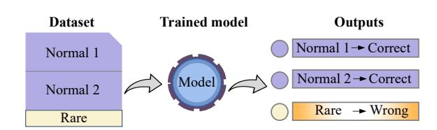
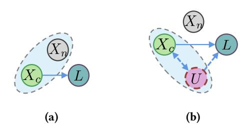
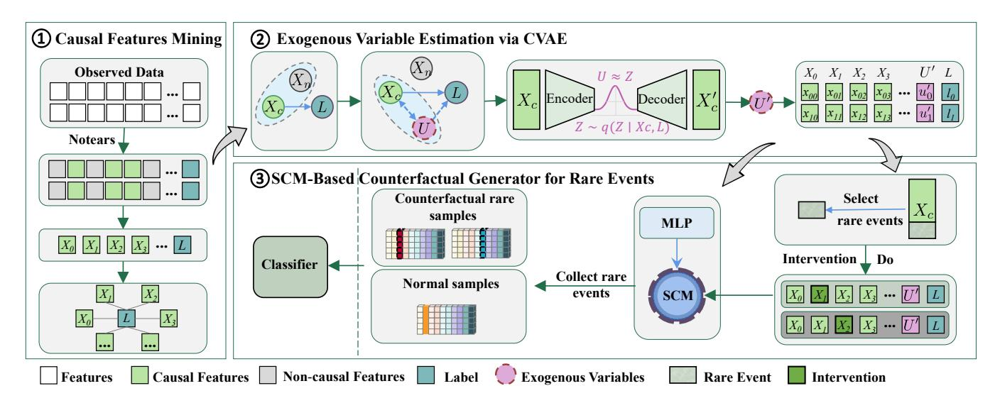
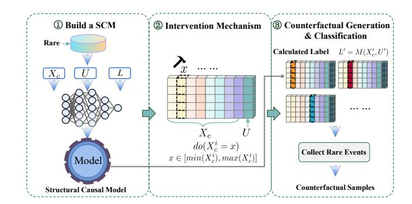
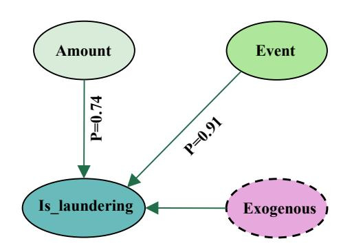

# Enhancing Rare Event Detection via Counterfactual Generation with Exogenous Variables

Lili Tian

Shanghai Key Laboratory of Trustworthy Computing, East China Normal University Shanghai, China Shanghai Institute of Artificial Intelligence for Education, East China Normal University Shanghai, China lltian@stu.ecnu.edu.cn

Dehui Du∗

Shanghai Key Laboratory of Trustworthy Computing, East China Normal University Shanghai, China dhdu@sei.ecnu.edu.cn

Yikang Chen Shanghai Key Laboratory of Trustworthy Computing, East China Normal University Shanghai, China 51265902150@stu.ecnu.edu.cn

# Abstract

In high-risk digital environments such as financial fraud detection, cybersecurity, and modern payment ecosystems (e.g., the digital renminbi), institutions face increasing pressure to effectively identify rare but high-impact suspicious activities—despite their extremely small proportion, severely imbalanced data, and limited observable evidence—in order to protect vulnerable users from fraud and other harmful activities. Traditional methods, such as oversampling and reweighting, often struggle to capture the complex dependencies among features in minority-class samples and fail to account for unobserved exogenous variables and model explainability, especially in real-world, high-complexity scenarios. To address these limitations, we propose CARE(Causal Augmentation for Rare Events), a novel approach that jointly models exogenous variables and counterfactual data augmentation to enhance detection performance and explainability. Specifically, our approach consists of: (1) causal feature mining; (2) inferring unobserved exogenous variables via a CVAE trained on observational data; and (3) constructing an SCM to generate intervention-based counterfactual samples for rare events, enabling effective expansion of the minority class. Extensive experiments on both public and real-world datasets demonstrate that CARE significantly outperforms existing methods in terms of both detection performance and explainability. By leveraging causal modeling and counterfactual reasoning, CARE provides a theoretically grounded and empirically effective solution to rare event detection under extreme class imbalance.

# CCS Concepts

• Computing methodologies → Supervised learning by classification; • Information systems → Information retrieval.

© 2026 Copyright held by the owner/author(s). ACM ISBN 979-8-4007-2307-0/2026/04 <https://doi.org/10.1145/3774904.3793000>

# Keywords

Rare Event Detection, Counterfactual Generation, Exogenous Variables

#### ACM Reference Format:

Lili Tian, Dehui Du, and Yikang Chen. 2026. Enhancing Rare Event Detection via Counterfactual Generation with Exogenous Variables. In Proceedings of the ACM Web Conference 2026 (WWW '26), April 13–17, 2026, Dubai, United Arab Emirates. ACM, New York, NY, USA, [10](#page-9-0) pages. [https://doi.org/10.1145/](https://doi.org/10.1145/3774904.3793000) [3774904.3793000](https://doi.org/10.1145/3774904.3793000)

# 1 Introduction

The rapid growth of web-based financial services, e-commerce platforms, and online payment technologies (including the digital renminbi) has fundamentally transformed how individuals and organizations interact with the digital economy. While these technologies increase accessibility and convenience, they also broaden the attack surface and transaction complexity, exposing users, especially those who are less digitally literate or financially secure, to rare but high-impact risks such as money laundering, identity theft, and sophisticated cyber attacks. In such high-stakes environments, failing to identify a small number of malicious activities can lead to substantial financial losses, erosion of trust in digital platforms, and disproportionate harm to vulnerable populations.

From the perspective of responsible Web AI and the UN Sustainable Development Goals (e.g., promoting inclusive economic growth and strengthening institutions), accurately detecting rare events in web and networked systems is therefore a core capability. However, rare event detection remains challenging in practice. In many realworld settings, suspicious activities account for only a tiny fraction of all logged interactions, while the vast majority correspond to benign behavior. Learning algorithms trained on such extremely imbalanced datasets tend to overfit to high-frequency normal patterns and systematically underperform on minority, high-risk cases, resulting in a "high-frequency event trap" where harmful events are repeatedly overlooked (as illustrated in Figure [1\)](#page-1-0).

Existing work has mainly approached this challenge from two directions. The first line of research focuses on sample reweighting and cost-sensitive training, where rare events are assigned larger weights during optimization to counteract class imbalance. Representative examples include reweighting-based ensemble methods such as UW-PC, WA-PCC [\[7\]](#page-8-0), and MIP. The second line of

∗Corresponding author: Dehui Du.

[This work is licensed under a Creative Commons Attribution 4.0 International License.](https://creativecommons.org/licenses/by/4.0) WWW '26, Dubai, United Arab Emirates

Figure 1: High-frequency event trap.

research employs data augmentation techniques such as SMOTE and ADASYN. While these methods can partially alleviate imbalance, they predominantly rely on surface-level statistical similarity, without explicitly modeling the causal mechanisms that give rise to rare events in web transaction logs or network traffic. As a result, the generated samples may be semantically inconsistent or fail to capture the true risk factors that matter to practitioners. Moreover, many GAN-based pipelines are computationally heavy, making them less appealing in energy and resource-constrained deployment scenarios. These methods not only suffer from limited explainability but also overlook exogenous variables outside the system that influence decision-making (as illustrated in Figure [2\)](#page-1-1).

Figure 2: Comparison of methods.

In contrast, a causal perspective suggests that rare events—such as fraudulent transactions or coordinated attacks—are driven by a small set of causally relevant features (e.g., transaction patterns and user behavior signals), together with unobserved exogenous factors such as intent or hidden context. If these causal drivers can be modeled explicitly, it becomes possible to generate counterfactual variants of real-world interactions that remain causally plausible while amplifying the minority, high-risk class. Such an approach not only improves detection performance under extreme class imbalance but also enhances explainability by revealing which variables and mechanisms actually contribute to harmful outcomes.

Motivated by these considerations, we propose CARE (Causal Augmentation for Rare Events), a causally grounded framework for rare event detection in high-risk digital environments such as web-based financial systems and networked infrastructures. CARE combines three components: (1) causal feature mining to identify the subset of observed variables that exert a direct causal effect on the rare-event label; (2) exogenous variable estimation via a Conditional Variational Autoencoder (CVAE), which learns task-specific latent variables that serve as proxies for unobserved factors; and (3) a Structural Causal Model (SCM)-based counterfactual generator that performs structured interventions in the causal space to synthesize rare-event counterfactuals. Importantly, the generator retains counterfactual samples that the causal model classifies as

rare events, effectively acting as an implicit class-conditional generator for the minority class without training a separate generative model. Our main contributions are summarized as follows:

- We formulate rare event detection in web and digital-finance environments from a causal and societal-impact perspective, highlighting the need for methods that simultaneously improve detection performance, explainability, and deployability in resource-constrained, high-stakes settings.
- We design an exogenous variable estimation approach based on causal features, using CVAE to effectively model unobserved influential factors.
- We construct a counterfactual sample generator grounded in an SCM, enabling the simulation of rare event instances under alternative causal conditions.
- Extensive experiments on multiple real-world and public rare event detection datasets demonstrate that our method outperforms state-of-the-art baselines in terms of accuracy, recall, and explainability.

# 2 Related work

Imbalanced Classification and Rare Event Detection. Imbalanced classification, particularly rare event detection, remains a major challenge in fields such as fraud detection, medical diagnosis, and system anomaly detection. Traditional approaches include resampling techniques (e.g., SMOTE [\[3\]](#page-8-1), ADAS-YN [\[12\]](#page-8-2)), costsensitive learning [\[51\]](#page-8-3), and class re-weighting methods like focal loss [\[22\]](#page-8-4). While effective under moderate imbalance, these methods often fall short when the minority class is extremely rare. Specific to rare event detection, unsupervised or semi-supervised anomaly detection algorithms—such as Isolation Forest [\[23\]](#page-8-5) and One-Class SVM [\[31\]](#page-8-6)—have been widely employed. In addition, ensemble learning approaches, such as MIP [\[38\]](#page-8-7), have also been proposed to alleviate the problem by integrating multiple classifiers. However, these methods struggle when anomaly patterns are complex or when unobserved confounding variables influence the outcome.

Generative Models for Minority Class Augmentation. Generative models, such as Variational Autoencoders (VAEs) [\[18\]](#page-8-8) and Generative Adversarial Networks (GANs) [\[10\]](#page-8-9), provide an alternative to sampling-based methods by synthesizing minority-class examples. Extensions such as VAE-GAN [\[21\]](#page-8-10) and conditional GANs (cGAN) [\[25\]](#page-8-11) aim to generate data conditioned on class labels. While these models improve sample diversity, they often ignore the causal mechanisms that govern data generation, potentially creating semantically inconsistent samples. In imbalanced settings, methods like CTGAN [\[47\]](#page-8-12) and ADASYN-GAN [\[40\]](#page-8-13) have been applied to tasks such as intrusion detection. However, most methods rely on distributional similarity and lack enforceable causal consistency.

Counterfactual Data Generation. Counterfactual data generation uses causal inference to produce "what-if" samples that explicitly respect causal dependencies. Temraz and Keane (2021) introduced counterfactual data augmentation for classification [\[37\]](#page-8-14), and subsequent works in NLP, such as Karimi et al. [\[16\]](#page-8-15), applied it to generate text-based counterfactuals. However, many counterfactual methods rely on heuristics rather than structured causal models, leading to potential semantic invalidity. Recent work in causal generative modeling—such as CausalVAE [\[44\]](#page-8-16) and CCGM [\[2\]](#page-8-17)—integrates SCM into VAEs, enabling intervention-based generation. Despite this, their focus lies in representation learning or fairness, not on augmenting rare classes under extreme imbalance.

#### 3 Preliminaries

#### 3.1 Problem Formulation

Given a dataset with highly imbalanced class distributions, where one or more minority classes have significantly fewer samples compared to majority classes, the goal is to improve the detection performance of these rare classes. Formally, let the dataset be

�� = {(���� , ����)}�� ��=1 ,

where each sample ���� ∈ R �� is a ��-dimensional feature vector, and ���� ∈ {1, 2, . . . ,��} is a categorical label indicating one of �� classes. Among these, some classes represent rare events with much smaller sample sizes. The objective of rare event detection is to learn a classifier �� : R �� → {1, 2, . . . ,��} that achieves high detection accuracy, recall, or other relevant metrics specifically on the rare classes.

Due to the scarcity of samples for rare classes, models trained on such imbalanced datasets often become biased toward majority classes, leading to poor recognition and generalization on rare events. Addressing this challenge requires methods that better learn and represent minority classes in multi-class imbalanced settings.

### 3.2 Structural Causal Model

SCM is a framework used to describe causal relationships, where causal dependencies between variables are represented through a graphical model [\[27,](#page-8-18) [45\]](#page-8-19). A SCM C is a 4-tuple ⟨�� ,�� , ��, �� (�� )⟩, where (i) �� is a set {��1, . . . ,���� } of background variables (also known as exogenous variables) that are determined by factors outside the model; (ii) �� is a set {��1, . . . ,���� } of endogenous variables, which are determined by other variables in the model, i.e., by variables in �� ∪�� ; (iii) �� is a set of functions {��1, . . . , ���� } (also known as causal mechanisms) that represents structural assignments ���� := ����(������ , ����), where ������ is the set of parents of ���� (its direct causes); (iv) �� (�� ) is a probability function defined over the domain of �� .

Definition (Exogenous variable). Following the standard terminology in structural causal models [\[26,](#page-8-20) [29\]](#page-8-21), an exogenous variable is a latent or unobserved variable whose value is determined outside the modeled system and is not causally influenced by any variable in �� ∪�� . Formally, for each endogenous variable ���� ∈ �� , the associated structural equation

���� := ����(������ ,����)

contains a disturbance term ���� ∈ �� , which is called the exogenous variable of ���� . Exogenous variables collectively represent background factors, noise processes, or unmeasured causes that introduce uncertainty into the system and are typically assumed to be mutually independent unless domain knowledge suggests otherwise.

### 3.3 Counterfactual Inference

Counterfactual inference is a causal inference method that constructs hypothetical scenarios differing from facts and derives outcomes under specific intervention conditions, thereby addressing

'what would have happened if things had been different? ' type questions. It is especially useful in domains where observational data is insufficient to capture rare or unobserved scenarios. Judea Pearl [\[28\]](#page-8-22) provided a formal definition of counterfactual inference based on SCM. Suppose the SCM is given, denoted by ��, and that we have evidence �� = �� and �� = ��. The following steps show how to counterfactually infer �� and we set �� = �� ′ :

- Abduction: Use evidence (�� = ��, �� = ��) to infer the latent causal variables �� .
- Action: Modify the model, ��, by removing the structural equations for the variables in �� and replacing them with the function �� = �� ′ to obtain the modified model, ����′ .
- Prediction: Use the modified model, ����′ , and the value of �� to compute the counterfactual value of ��.

The counterfactual outcome is usually represented as �� (����=�� ′ |�� = ��, �� = ��). Note that in Step 1, we perform deterministic counterfactuals, that is, counterfactuals pertaining to a single unit of the population, where the value of �� is determined.

#### 4 Approach

#### 4.1 Overview

The transition from statistical to causal models is a critical challenge for AI systems aiming at human-level understanding.

—Bernhard Schölkopf[\[32\]](#page-8-23)

As the aforementioned wisdom regarding human causal cognition, relying solely on statistical models based on data correlations is insufficient to address complex tasks [\[28,](#page-8-22) [32\]](#page-8-23). Most artificial intelligence models primarily depend on the correlations between data features during training and inference[\[14,](#page-8-24) [48\]](#page-8-25). This kind of approach leads AI models to develop a tendency to learn and reason based on correlations, while overlooking the importance of causal relationships. This can have catastrophic consequences, particularly in high-risk rare event detection scenarios, manifesting in three progressive aspects: (1) The high-frequency event trap: the model learns only the features of high-frequency events, neglecting rare events, and confuses correlations with causal patterns in the data; (2) The unobservable exogenous variables: the data lacks potential exogenous variables that, although unobservable, influence the data generation process, such as the 'fraudulent intent' in financial fraud events. (3) Explainability: the model lacks explainability, which hinders people's understanding of its decisions. Therefore, causal reasoning is necessary to address these gaps.

Therefore, the CARE approach we propose aims to address three core issues: (1) How to identify the causal features from observational data that lead to specific task outcomes and estimate exogenous variables (eg.user intention and user motivation), thereby providing effective support for rare event detection; (2) How to enable the model to focus on and deeply learn the knowledge within rare events, thereby enhancing its performance in rare event detection. (3) How to explain the model's decision-making process.

To activate and enhance the model's sensitivity and accuracy in rare event detection while mitigating the negative impact of limited rare event data, inspired by causal reasoning [\[1,](#page-8-26) [28\]](#page-8-22) and human cognition models [\[15,](#page-8-27) [19,](#page-8-28) [49\]](#page-8-29), we propose CARE, a cost-effective paradigm. This paradigm enables the model to capture causal features and exogenous variables that lead to specific task outcomes, and through an SCM-based counterfactual generator for rare events, it automatically identifies and strengthens the model's sensitivity to the minority class, thereby improving the performance of rare event detection models, as illustrated in Figure [4.](#page-4-0) In particular, the SCM-based generator performs structured interventions in the causal space and retains only those counterfactual instances that the causal model classifies as rare events, thereby acting as an implicit class-conditional generator for the minority class. The main problem addressed-exogenous variable estimation via CVAE and SCM-based counterfactual generator for rare events-corresponds to phase ○2 and phase ○3 .

### 4.2 Causal Features Mining

Definition 4.1 (Causal Features). Causal features are the subset of observed variables ���� ⊆ �� that have a direct causal effect on the target label ��. Formally, under an SCM C = ⟨�� ,�� , ��, �� (�� )⟩, causal features are defined as

���� = Pa(��), (1)

i.e., the parents of �� in the causal graph, and the structural equation satisfies

�� = �� (����,�� ), (2)

where �� denotes the unobserved exogenous variables.

The observed data we obtain consists of features and labels, where the features can be categorized into causal features ���� and non-causal features ����. As shown in Figure [3,](#page-3-0) the arrows represent causal relationships. Causal features ���� are the key nodes that lead to the specific task outcome ��, while non-causal features ���� are redundant nodes that do not exhibit a causal relationship with the task outcome ��. Additionally, exogenous variables �� are also important factors influencing the task outcome. �� represents those variables that, although not captured in the dataset, genuinely affect the prediction[\[5,](#page-8-30) [6\]](#page-8-31).

Figure 3: Causal modeling for rare event detection.

In other words, the task outcome is jointly determined by causal features and exogenous variables [\[28\]](#page-8-22).

As shown in Figure [4](#page-4-0) ○1 , we applied the causal discovery algorithm Notears [\[50\]](#page-8-32) to mine the causal relationships from the observational data. By utilizing this algorithm, we inferred the causal structure between variables.

���� causal relationship −−−−−−−−−−−−−−−→ �� (3)

Specifically, we obtained the causal relationships between the causal feature set ���� = {��0, ��1, ��2, . . . } and the outcome variable set �� = {��0,��1,��2, . . . }. Based on the causal inference results, we retained the causal features ���� that are relevant to the target task, which were subsequently used for model training and analysis.

### 4.3 Exogenous Variable Estimation via CVAE

In the real world, it is often infeasible to collect all data relevant to the outcome, and many factors that influence the result of a specific task may remain unobserved. For instance, in financial transactions related to money laundering, while we cannot directly capture the laundering intent of a transaction, this intent clearly influences the prediction of anomalous transactions. To address this issue, inspired by CausalVAE [\[44\]](#page-8-16), we introduce exogenous variables from causal science. In practice, exogenous variables are typically difficult to estimate and quantify. To overcome this challenge, the latent variable �� can be interpreted as a proxy representation of the exogenous variables �� , under the assumption that the hidden factors influencing both ���� and �� can be captured in the latent space. The latent variable �� in the CVAE [\[34\]](#page-8-33) model represents latent factors in the data generation process, and the learned latent space structure helps uncover the exogenous factors within the system [\[41,](#page-8-34) [43\]](#page-8-35). While exogenous variables �� play a key role in generating the observed data, they are typically unobservable. Instead of identifying �� directly, we make a modeling assumption that a learned latent variable �� can serve as a proxy for �� , capturing similar influence patterns in a task-specific manner. We emphasize that this is not a causal identification of �� , but a practical approximation for downstream tasks.

We use the CVAE to estimate the latent variable of exogenous variables �� by learning a latent variable �� from the causal features ���� and the task-specific outcome ��. The CVAE is trained by maximizing the Evidence Lower Bound (ELBO), where the specific task outcome �� serves as a condition to guide the inference of latent variables relevant to the task. The encoder structure is formulated as ��(�� |����, ��), and the latent variable �� is expected to capture the hidden influences presented by the exogenous variables �� .

The decoder reconstructs the observed causal features ���� from the latent variable ��, conditioned on the outcome ��. The decoding distribution is denoted as ��(���� |��, ��), aiming to ensure that �� retains sufficient information to recover the original input under the supervision of ��. Unlike conventional CVAEs used for generative modeling, here we aim to learn task-specific latent variables that capture causal influences, rather than fully reconstructing all observed variables.

The loss function of CVAE consists of two components: the reconstruction loss and the KL divergence. The reconstruction loss is used to ensure that the data generated from the latent variable �� closely resembles the real data. The formula is as follows:

Lreconstruction = E��(�� |���� ,��) [log ��(���� |��, ��)] (4)

The Kullback-Leibler (KL) divergence is used to measure the difference between the distribution of the latent space �� and the prior distribution. By minimizing the KL divergence, the CVAE encourages the latent variable �� generated by the model to approach

Intuitively, R�� collects those causal configurations that the causal model �� classifies as rare events.

Second, given the rarity and severe class imbalance of rare events, we design a rare-event-aware augmentation mechanism. In the observational data, we first restrict interventions to instances whose ground-truth labels belong to rare-event classes. For each such instance with causal representation ��, we generate candidate counterfactual inputs by performing structured interventions on the input space ��, simulating "what would have happened under different conditions". The modified input is denoted as �� ′ = {�� ′ , �� ′ }.

�� Each candidate �� ′ is then fed into the causal model �� to obtain its predicted label ��ˆ(�� ′ ). Only those counterfactual inputs whose predictions fall into the rare-event region R�� are retained, i.e., we keep �� ′ if and only if ��ˆ(�� ′ ) ∈ L�� and discard the others. In this way, the augmentation process effectively acts as a conditional generator that concentrates all synthesized samples in the rare-event region of the causal space, where the interventions fall into two categories:

- Intervention on observable causal variables ���� . We apply do-calculus-based strategies to alter specific causal features ���� while keeping others unchanged, resulting in counterfactual samples of the form �� ′ = {�� ′ �� ,�� }. For example, an intervention do(�� �� �� = ��) sets the ��-th causal variable to a specified value, allowing us to explore hypothetical scenarios like "what if this variable had been different?"
- Intervention on exogenous variables �� . To simulate changes in unobserved contextual or environmental factors, we resample�� ′ ∼ ��(��) from the prior distribution, resulting in counterfactual inputs �� ′ = {����,�� ′ }. This type of intervention allows us to explore rare but potentially important scenarios that are underrepresented in the observed data.

Finally, the counterfactual inputs �� ′ are fed into the trained causal model �� to obtain predicted outcomes: �� ′ = ��(�� ′ ).

Recall that we only retain counterfactuals whose predicted labels belong to rare-event classes. The resulting set of accepted counterfactual samples is

Drare cf = {(�� ′ , ��′ ) | �� ′ ∈ R��, ��′ = ��(�� ′ )}. (10)

By combining the original dataset with these rare-event counterfactuals, we construct the augmented training set:

Daug = Doriginal ∪ Drare cf . (11)

Retraining the predictive model on Daug can effectively enhance its ability to detect rare but critical events, since the minority classes are enriched by causally consistent counterfactual samples concentrated in the rare-event region. Note that the exogenous variables are only used during training for counterfactual augmentation; the deployed classifier operates solely on observed features at test time.

# 5 Experiments

# 5.1 Experimental Setup

To evaluate the effectiveness of our proposed CARE method, we conducted extensive experiments on multiple datasets and compared it with SOTA approaches. The experiments were designed to evaluate overall performance, Scalability, and Component Necessity via ablation studies. All experiments were performed on a system

equipped with an NVIDIA GeForce RTX 3090 GPU and Python 3.8. Specifically, we address the following research questions (RQ):

- RQ1 (Overall Performance): How does CARE perform in rare event detection compared to existing methods, especially across datasets of different scales?
- RQ2 (Explainability): How does CARE improve the explainability of rare event detection in a way that aligns with human understanding, enabling humans to comprehend and interpret its underlying mechanisms?
- RQ3 (Component Necessity): What is the contribution of each component in CARE, such as estimation of exogenous variables and counterfactual generation?

### 5.2 Datasets

We conducted experiments on two classic publicly available datasets from different domains, as well as three simulated datasets based on real banking transactions related to money laundering. These datasets vary in both scale and the proportion of rare events. Specifically, NSL-KDD [\[36\]](#page-8-38) was originally proposed by Tavallaee, and SG-MITM [\[8\]](#page-8-39) was originally proposed by Elrawy. PUFA is a simulated digital renminbi dataset based on real banking transactions, with PUFA-S, PUFA-M, and PUFA-L representing three datasets of increasing size and decreasing proportion of rare events. The dataset contains seven features: transaction time, event ID, sender account, receiver account, amount, event type (representing various transaction patterns), and a binary label indicating money laundering. The details of the datasets are summarized in Table [1,](#page-5-0) where NC denotes the number of normal classes, RC represents the number of rare event classes, TInstances indicates the total number of samples, and RRatio is the proportion of rare event samples.

Table 1: Summary of datasets for rare event detection.

| Dataset | NC | RC | TInstances | RRatio (%) |
|---------|----|----|------------|------------|
| NSL-KDD | 1  | 4  | 25192      | 46.61      |
| SG-MITM | 1  | 3  | 697        | 24.72      |
| PUFA-S  | 1  | 1  | 75400      | 12.00      |
| PUFA-M  | 1  | 1  | 145600     | 8.00       |
| PUFA-L  | 1  | 1  | 281618     | 3.93       |

#### 5.3 Evaluation Metrics

Based on prior research, we adopt widely used evaluation metrics for rare event detection [\[38\]](#page-8-7), including Precision, Recall, and F1 score. Precision measures the proportion of predicted rare events that are actually correct, reflecting the accuracy of positive predictions. Recall indicates the proportion of true rare events that are successfully identified, capturing the model's ability to detect rare occurrences. F1-score, as the harmonic mean of Precision and Recall, provides a balanced assessment of performance, especially under imbalanced class distributions.

# 5.4 Baselines

To validate the effectiveness of our proposed counterfactual generation method based on exogenous variables for rare event detection, we selected multiple representative baseline methods encompassing two main categories: weighting strategies and data augmentation. Specifically, these methods include UW-PC [\[7\]](#page-8-0), UW-PCC [\[7\]](#page-8-0), WA-PC [\[30\]](#page-8-40), WA-PCC [\[30\]](#page-8-40), DE [\[46\]](#page-8-41), BMA [\[39\]](#page-8-42), CTGAN [\[47\]](#page-8-12), MIP [\[38\]](#page-8-7), SMOTE [\[3\]](#page-8-1), ADASYN [\[12\]](#page-8-2) and ROSE [\[24\]](#page-8-43). To ensure a fair comparison, all methods adopted multilayer perceptrons (MLPs) as the base classifiers. For weighting-based methods, ensemble models consisting of multiple MLPs were used, and we selected the bestperforming configuration on the validation set from �� ∈ [2, 8] for comparison. In contrast, our method employs only a single MLP classifier.

### 5.5 Implementation Details

To answer RQ1-RQ3, our overall experimental design is as follows: (1) For dataset partitioning, we split the data into training and test sets with a ratio of 8:2, where 80% of the samples are used for model training. The proposed data augmentation strategy is applied only to the rare events in the training set and is not performed on the test set. (2) In the intervention stage, let ���� denote the variable on which we perform interventions. If���� is discrete, we first identify, from the original dataset, the set of attainable values for ���� , denoted by X�� = { �� | ���� = �� for some observation in the dataset }. For any observed value �� ∈ X�� , we define the corresponding set of admissible intervention values as I��(��) = { �� ′ ∈ X�� | �� ′ ≠ �� }. In other words, when the original value of ���� is ��, we implement interventions of the form ���� (���� = �� ′ ) for any �� ′ ∈ I��(��), i.e., for any value in X�� that is different from the original value �� [\[6\]](#page-8-31). For example, when performing interventions on the variable Event in the PUFA–S dataset, the attainable value set of Event in the original data is XEvent = {0, 1, 2, 3, 4, 5, 6, 7}. When the original value of Event is 4, the corresponding admissible intervention set is defined as IEvent(4) = { �� ∈ XEvent | �� ≠ 4 } = {0, 1, 2, 3, 5, 6, 7}. In this case, we implement interventions of the form ���� (Event = ��) for any �� ∈ IEvent(4), i.e., for any value in {0, 1, 2, 3, 5, 6, 7} that differs from the original value 4.

If ���� is continuous, we first use the empirical distribution of ���� to determine a reasonable range of intervention values. Specifically, let �� 0.05 �� and �� 0.95 �� denote the 5th and 95th empirical quantiles of���� , and define the truncated interval [�� 0.05 �� , ��0.95 �� ]. We then uniformly discretize this interval into a set of grid points, X�� = { ��1, ��2, . . . , ������ �� 0.05 �� = ��1 &lt; ��2 &lt; · · · &lt; ������ = �� 0.95 } and treat X�� as the attainable value set of ���� . For an observation with value ��, the corresponding admissible intervention set is defined as I��(��) = { �� ′ ∈ X�� | �� ′ ≠ �� }. In other words, when the original value of ���� is ��, we implement interventions of the form ���� (���� = �� ′ ) for any �� ′ ∈ I��(��), i.e., for any grid value in X�� that differs from the original value �� [\[9,](#page-8-44) [33\]](#page-8-45).

(3) For determining the amount of augmentation for rare events, we treat the post-augmentation class distribution as a tunable hyperparameter rather than a fixed constant. Following prior studies on imbalanced learning [\[11,](#page-8-46) [13,](#page-8-47) [20\]](#page-8-48), severe class imbalance can lead to a significant degradation in rare-event detection performance, whereas excessive oversampling tends to introduce noise and overfitting. More recent work in credit risk modeling further shows that fully balancing the minority and majority classes to a 1 : 1 ratio is not necessarily optimal; instead, a moderately imbalanced ratio (e.g., majority: minority ≈ 6.6 : 1) can yield better predictive performance [\[4\]](#page-8-49). Building on these insights, we perform

a grid search over different augmentation strengths on the test set, and impose explicit constraints on the resampled class distribution: on the one hand, the ratio between the largest and smallest classes after augmentation is restricted to approximately 3:1–5:1 rather than being forced to full balance; on the other hand, for tail classes we enforce a minimum sample-size threshold (e.g., at least 50 samples) and cap the number of synthetic samples to at most 3–5 times the number of real samples.

#### 5.6 Discussion

To more intuitively demonstrate the effectiveness of our method, we focused our experiments on datasets of varying scales and different proportions of rare events. We conducted multiple trials to obtain averaged results, adopting the presentation style of the MIP method [\[38\]](#page-8-7), with the outcomes detailed in Table [2](#page-6-0) ~ [4.](#page-7-0) The results show that the CARE approach effectively integrates causal inference to address the challenges of rare event detection, enhancing both the model's explainability and its overall performance.

Table 2: Relative performance improvements of CARE on NSL-KDD (%).

| Baseline   | Precision | Recall | F1-score |
|------------|-----------|--------|----------|
| UW-PC      | 4.13      | 4.32   | 4.65     |
| UW-PCC     | 4.11      | 4.21   | 4.47     |
| WA-PC      | 3.63      | 3.80   | 3.97     |
| WA-PCC     | 3.40      | 3.41   | 3.61     |
| DE         | 3.74      | 1.79   | 1.83     |
| BMA        | 3.34      | 3.83   | 2.41     |
| SMOTE      | 3.69      | 3.32   | 4.18     |
| ADASYN     | 3.24      | 2.12   | 3.41     |
| ROSE       | 2.17      | 1.85   | 2.37     |
| CTGAN      | 1.61      | 1.73   | 2.26     |
| MIP        | 1.43      | 1.62   | 2.11     |
| CARE (Avg) | 3.14      | 2.91   | 3.21     |

Table 3: Relative performance improvements of CARE on SG-MITM (%).

| Method     | Precision | Recall | F1-score |
|------------|-----------|--------|----------|
| UW-PC      | 6.89      | 6.92   | 6.90     |
| UW-PCC     | 6.61      | 6.67   | 6.64     |
| WA-PC      | 6.31      | 6.42   | 6.39     |
| WA-PCC     | 5.36      | 5.80   | 5.75     |
| DE         | 4.27      | 4.47   | 4.37     |
| BMA        | 3.80      | 5.68   | 5.62     |
| SMOTE      | 4.12      | 3.61   | 5.17     |
| ADASYN     | 3.42      | 3.22   | 4.63     |
| ROSE       | 2.97      | 2.82   | 2.35     |
| CTGAN      | 2.41      | 1.73   | 2.26     |
| MIP        | 2.32      | 1.49   | 1.95     |
| CARE (Avg) | 4.41      | 4.44   | 4.73     |

To systematically validate the effectiveness of the proposed CARE framework for rare event detection, we conducted comprehensive experiments on multiple benchmark datasets with diverse data characteristics. As summarized in Table [1,](#page-5-0) these datasets range from relatively balanced cases (e.g., 46.61% anomaly rate in NSL-KDD) to highly imbalanced ones (e.g., 3.93% in PUFA-L), ensuring robust evaluation. Tables [2](#page-6-0) to [4](#page-7-0) detail CARE's improvements over SOTA baselines in Precision, Recall, and F1-score. Each cell shows absolute gains, with the last row reporting average improvements. On NSL-KDD (Table [2\)](#page-6-0), despite a high anomaly rate, diverse attack types challenge conventional methods. CARE achieves stable gains, improving the average F1-score by 3.21 points, validating the causal enhancement and counterfactual generation. In the small-sample SG-MITM dataset (Table [3;](#page-6-1) 697 samples, 24.72% anomalies), CARE shows more pronounced improvements, boosting F1-score by 4.73 points and significantly outperforming traditional oversampling and cost-sensitive methods in Recall, reducing missed detections.

Table 4: Relative performance improvements of CARE over SOTA method MIP on the PUFA datasets (%).

| Dataset | Precision | Recall | F1-score |
|---------|-----------|--------|----------|
| PUFA-S  | 2.27      | 2.14   | 2.77     |
| PUFA-M  | 2.61      | 2.79   | 3.08     |
| PUFA-L  | 3.41      | 3.22   | 3.59     |

For extreme imbalance, experiments on PUFA datasets (Table [4\)](#page-7-0) reveal that as anomaly rates drop from 12% (PUFA-S) to 3.93% (PUFA-L), CARE's gains increase accordingly. This indicates our counterfactual generation effectively produces discriminative samples when data are scarce.

In summary, CARE consistently improves detection precision and recall across datasets of varying scale and imbalance by modeling exogenous variables and generating structured counterfactuals. The results demonstrate strong generalization and highlight CARE's promise for high-value rare event detection applications

such as financial risk control and industrial quality inspection. RQ2 (Explainability): To verify the explainability of our method, we conducted experiments on the PUFA dataset. The dataset contains seven features: transaction time, event ID, sender account, receiver account, amount, event type (representing various transaction patterns), and a binary label indicating money laundering. Here, money laundering is treated as a rare event. The dataset is split into three subsets with different sizes and rare event ratios. Figure [6](#page-7-1) shows the results of our method, where the coefficients correspond to causal coefficients. Both Amount and Event are identified as causal parents of the is\_laundering label, with Event exhibiting a larger causal coefficient. This aligns with intuition, since Event captures transaction patterns that are more strongly related to money laundering. Combined with Table [4,](#page-7-0) these findings clearly demonstrate which factors causally influence the detection outcome, thus supporting the explainability of our approach.

RQ3 (Component Necessity): To evaluate the contribution of each component to the overall model performance, we conducted three ablation studies on the PUFA-S dataset by respectively removing the causal features (w/o causal), excluding the exogenous

Figure 6: The causal explanation of key features in the PUFA-S dataset.

variables �� (w/o U), and eliminating the counterfactual generation mechanism (w/o counterf). As shown in Table [5,](#page-7-2) removing

Table 5: Ablation study on CARE components.

|      | Methods  | Precision | Recall | F1   |
|------|----------|-----------|--------|------|
| w/o  | causal   | 0.53      | 0.67   | 0.59 |
| w/o  | ��       | 0.58      | 0.72   | 0.64 |
| w/o  | counterf | 0.59      | 0.74   | 0.66 |
| CARE | (ours)   | 0.61      | 0.77   | 0.68 |

the causal features (w/o causal) leads to the most significant performance degradation, with the F1-score dropping to 0.59. This highlights the indispensable role of causal features in modeling the key decision-making mechanisms. When excluding the exogenous variables �� , the model shows slight performance improvements over the w/o causal variant, but still underperforms the full model, indicating that �� provides complementary value in capturing latent causal factors. Removing the counterfactual generation module (w/o counterf) results in an F1-score drop to 0.66, along with simultaneous decreases in both Precision and Recall. This suggests that while the model can still utilize the causal structure for prediction, the absence of counterfactual data augmentation limits its generalization capability. Overall, the complete model (CARE) achieves the best performance across all metrics, demonstrating the synergistic effect of integrating causal features, exogenous variables, and counterfactual generation for rare event detection.

#### 6 Conclusion

This paper proposes CARE, a rare event detection framework that combines causal modeling with counterfactual interventions. Specifically, it employs a CVAE to infer exogenous variables and constructs an SCM to capture the underlying data generation process. This enables the generation of semantically consistent and causally faithful minority samples, while simultaneously enhancing the explainability of the detection model. By leveraging explicit intervention for counterfactual sample generation, CARE effectively addresses the dual challenges of extreme class imbalance and rare sample scarcity. Experiments on synthetic and real-world datasets show that CARE consistently outperforms existing methods on

precision, recall, and F1-score, highlighting the value of causal

reasoning for imbalanced learning. 7 Acknowledgment This work was supported by the National Key Research and Development Program of China under Grant No. 2022ZD0120302. References [1] Drew H Bailey, Alexander J Jung, Adriene M Beltz, Markus I Eronen, Christian Gische, Ellen L Hamaker, Konrad P Kording, Catherine Lebel, Martin A Lindquist, Julia Moeller, et al. 2024. Causal inference on human behaviour. Nature human behaviour 8, 8 (2024), 1448–1459. [2] A. Bhat et al. 2022. CCGM: Causal Counterfactual Generative Model for Debiasing. In ICML. [3] Nitesh V Chawla et al. 2002. SMOTE: Synthetic Minority Over-sampling Technique. Journal of Artificial Intelligence Research (2002). [4] Luis H Chia. 2025. Finding the Sweet Spot: Optimal Data Augmentation Ratio for Imbalanced Credit Scoring Using ADASYN. arXiv preprint arXiv:2510.18252 (2025). [5] Scott Cunningham. 2021. Causal inference: The mixtape. Yale university press. [6] Peng Ding. 2024. A first course in causal inference. Chapman and Hall/CRC. [7] Xibin Dong, Zhiwen Yu, Wenming Cao, Yifan Shi, and Qianli Ma. 2020. A survey on ensemble learning. Frontiers of Computer Science 14, 2 (2020), 241–258. [8] Mohamed Faisal Elrawy, Lenos Hadjidemetriou, Christos Laoudias, and Maria K Michael. 2023. Detecting and classifying man-in-the-middle attacks in the private area network of smart grids. Sustainable Energy, Grids and Networks 36 (2023), 101167. [9] Caroline Flammer and Pratima Bansal. 2017. Does a long-term orientation create value? Evidence from a regression discontinuity. Strategic Management Journal 38, 9 (2017), 1827–1847. [10] Ian Goodfellow et al. 2014. Generative Adversarial Nets. In NeurIPS. [11] Guo Haixiang, Li Yijing, Jennifer Shang, Gu Mingyun, Huang Yuanyue, and Gong Bing. 2017. Learning from class-imbalanced data: Review of methods and applications. Expert systems with applications 73 (2017), 220–239. [12] Haibo He et al. 2008. ADASYN: Adaptive Synthetic Sampling. In International Joint Conference on Neural Networks. [13] Haibo He and Edwardo A Garcia. 2009. Learning from imbalanced data. IEEE Transactions on knowledge and data engineering 21, 9 (2009), 1263–1284. [14] Jean Kaddour, Aengus Lynch, Qi Liu, Matt J Kusner, and Ricardo Silva. 2022. Causal machine learning: A survey and open problems. arXiv preprint arXiv:2206.15475 (2022). [15] Barry H Kantowitz. 2021. Human information processing: Tutorials in performance and cognition. Routledge. [16] A. Karimi et al. 2023. Counterfactual Text Generation for Imbalanced Classification. In ACL. [17] Amir-Hossein Karimi, Julius Von Kügelgen, Bernhard Schölkopf, and Isabel Valera. 2020. Algorithmic recourse under imperfect causal knowledge: a probabilistic approach. Advances in neural information processing systems 33 (2020), 265–277. [18] Diederik P Kingma and Max Welling. 2013. Auto-Encoding Variational Bayes. ICLR (2013). [19] Patrick Krauss. 2024. Artificial Intelligence and Brain Research. Neural networks, deep learning and the future of cognition (2024). [20] Bartosz Krawczyk. 2016. Learning from imbalanced data: open challenges and future directions. Progress in artificial intelligence 5, 4 (2016), 221–232. [21] Anders Boesen Lindbo Larsen et al. 2015. Autoencoding beyond pixels using a learned similarity metric. In ICML. [22] Tsung-Yi Lin et al. 2017. Focal Loss for Dense Object Detection. In IEEE International Conference on Computer Vision (ICCV). [23] Fei Tony Liu et al. 2008. Isolation Forest. In IEEE ICDM. [24] Giovanna Menardi and Nicola Torelli. 2014. Training and assessing classification rules with imbalanced data. Data mining and knowledge discovery 28, 1 (2014), 92–122. [25] Mehdi Mirza and Simon Osindero. 2014. Conditional Generative Adversarial Nets. arXiv preprint arXiv:1411.1784 (2014). [26] Judea Pearl. 2009. Causality: Models, Reasoning and Inference. Cambridge University Press. [27] Judea Pearl. 2010. Causal inference. Causality: objectives and assessment (2010), 39–58. [28] Judea Pearl and Dana Mackenzie. 2018. The book of why: the new science of cause and effect. Basic books. [29] Jonas Peters, Dominik Janzing, and Bernhard Schölkopf. 2017. Elements of causal inference: foundations and learning algorithms. The MIT press. [30] Omer Sagi and Lior Rokach. 2018. Ensemble learning: A survey. Wiley interdisciplinary reviews: data mining and knowledge discovery 8, 4 (2018), e1249. [31] Bernhard Schölkopf et al. 2001. Estimating the Support of a High-Dimensional Distribution. Neural Computation (2001). [32] Bernhard Schölkopf, Francesco Locatello, Stefan Bauer, Nan Rosemary Ke, Nal Kalchbrenner, Anirudh Goyal, and Yoshua Bengio. 2021. Toward causal representation learning. Proc. IEEE 109, 5 (2021), 612–634. [33] Ankit Sharma, Garima Gupta, Ranjitha Prasad, Arnab Chatterjee, Lovekesh Vig, and Gautam Shroff. 2020. Hi-ci: Deep causal inference in high dimensions. In Proceedings of the 2020 KDD Workshop on Causal Discovery. PMLR, 39–61. [34] Kihyuk Sohn, Honglak Lee, and Xinchen Yan. 2015. Learning structured output representation using deep conditional generative models. Advances in neural information processing systems 28 (2015). [35] Hind Taud and Jean-Franccois Mas. 2017. Multilayer perceptron (MLP). In Geomatic approaches for modeling land change scenarios. Springer, 451–455. [36] Mahbod Tavallaee, Ebrahim Bagheri, Wei Lu, and Ali A Ghorbani. 2009. A detailed analysis of the KDD CUP 99 data set. In 2009 IEEE symposium on computational intelligence for security and defense applications. Ieee, 1–6. [37] O Temraz and M.T. Keane. 2021. Counterfactual Data Augmentation for Classification. In AAAI. [38] Georgios Tertytchny, Georgios L Stavrinides, and Maria K Michael. 2025. Rare Event Detection in Imbalanced Multi-Class Datasets Using an Optimal MIP-Based Ensemble Weighting Approach. In Proceedings of the AAAI Conference on Artificial Intelligence, Vol. 39. 20867–20875. [39] Chao Wang, Xinwei Li, Junjie Sun, Xiaoheng Zhang, Yuting Li, Xin Peng, Jun Liu, and Zaibin Jiao. 2022. Ensemble learning model of power system transient stability assessment based on Bayesian Model Averaging method. In 2022 IEEE 6th Conference on Energy Internet and Energy System Integration (EI2). IEEE, 1467–1471. [40] Y. Wang et al. 2020. ADASYN-GAN for Imbalanced Intrusion Detection. In IEEE Symposium on Security and Privacy Workshops. [41] Pengzhou Wu and Kenji Fukumizu. 2022. ��-Intact-VAE: Identifying and Estimating Causal Effects under Limited Overlap. [42] Kevin Xia, Yushu Pan, and Elias Bareinboim. 2022. Neural causal models for counterfactual identification and estimation. The Eleventh International Conference on Learning Representations. (2022). [43] Mengyue Yang, Furui Liu, Zhitang Chen, Xinwei Shen, Jianye Hao, and Jun Wang. 2021. Causalvae: Disentangled representation learning via neural structural causal models. In Proceedings of the IEEE/CVF conference on computer vision and pattern recognition. 9593–9602. [44] X Yang et al. 2020. CausalVAE: Disentangled Representations via Causal Mechanisms. UAI (2020). [45] Liuyi Yao, Zhixuan Chu, Sheng Li, Yaliang Li, Jing Gao, and Aidong Zhang. 2021. A survey on causal inference. ACM Transactions on Knowledge Discovery from Data (TKDD) 15, 5 (2021), 1–46. [46] Sheng Xin Zhang, Yu Hong Liu, Li Ming Zheng, and Shao Yong Zheng. 2024. Differential evolution with collective ensemble learning. Swarm and Evolutionary Computation 87 (2024), 101521. [47] X. Zhang et al. 2022. VAE-WACGAN: High-quality Minority Sample Generation via VAE-GAN Architecture. In ACM Asia Conference. [48] Xingxuan Zhang, Peng Cui, Renzhe Xu, Linjun Zhou, Yue He, and Zheyan Shen. 2021. Deep stable learning for out-of-distribution generalization. In Proceedings of the IEEE/CVF conference on computer vision and pattern recognition. 5372–5382. [49] Bonan Zhao, Christopher G Lucas, and Neil R Bramley. 2024. A model of conceptual bootstrapping in human cognition. Nature Human Behaviour 8, 1 (2024), 125–136. [50] Xun Zheng, Bryon Aragam, Pradeep K Ravikumar, and Eric P Xing. 2018. Dags with no tears: Continuous optimization for structure learning. Advances in neural information processing systems 31 (2018). [51] Zhi-Hua Zhou and Xu-Ying Liu. 2006. Learning with Imbalanced Data. IEEE Transactions on Knowledge and Data Engineering (2006). A Proof of Counterfactual Consistency in SCM-Based Counterfactual Generator Counterfactual consistency is a fundamental concept in causal inference that ensures generated counterfactual samples remain causally plausible—that is, they maintain consistency with the true causal structure of the real world even under interventions. In other words, when a variable is intervened upon, changes in other variables should follow the established causal mechanisms rather than occurring arbitrarily. Formally, this property can be expressed as: �� = ����=�� if �� = ��,

where �� denotes the observed outcome, and ����=�� denotes the counterfactual outcome under the intervention �� = ��. This means that once the intervention �� is applied, the counterfactual outcome equals the actual observed outcome �� [\[26\]](#page-8-20). Furthermore, Karimi [\[17\]](#page-8-50) states that a counterfactual is considered consistent if only the intervened variables are modified while other variables are updated according to the underlying causal graph.

Definition (Counterfactual Consistency): Under a causal graph structure, if an intervention do(�� �� = ��) is applied to a variable �� �� �� , generating a counterfactual sample ��, then:

A counterfactual is consistent if:

- The intervened variable takes the new value: �� �� �� = ��;
- Other variables in the counterfactual sample �� are updated according to the SCM;
- No unrelated variables are arbitrarily changed.

Therefore, in our method, let M denote the SCM, ���� represent the observed data, and the exogenous variables �� ∼ �� (�� ). Then, given the intervention �� �� �� = ��, we have

�� ′ = M (do(·)), do(·) = do(�� �� �� = ��) = �� ′ = {�� ′ �� ,�� }, ⇒ �� ′ = ��.

where M remains unchanged, �� ′ denotes the set of features after intervention, �� ′ �� represents the intervened causal features, �� denotes the outcome observed in the real world. This indicates that our approach ensures the generated outcomes are consistent with those observed in the real world.

Meanwhile, our method satisfies the following properties:

- Only certain variables are intervened with a new value;
- The remaining variables are computed according to the SCM;
- By utilizing the SCM, it preserves the inherent causal mechanisms within the data, and unrelated variables are unchanged.

The counterfactual generator based on SCM proposed in this work theoretically guarantees counterfactual consistency. Specifically, by intervening on a subset of causal variables and updating the remaining variables according to the SCM, the method ensures that the generated counterfactual samples remain consistent with the true causal mechanisms and the observed real-world outcomes. This property not only preserves the intrinsic causal structure of the data but also enhances the causal plausibility and reliability of the counterfactual samples. Theoretical analysis demonstrates that the proposed approach satisfies the fundamental requirements of counterfactual consistency, providing solid theoretical support for counterfactual data generation in rare event detection.