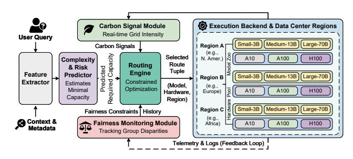
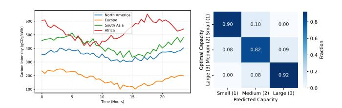
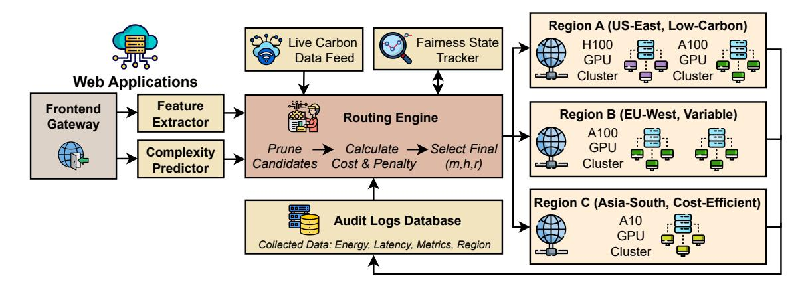
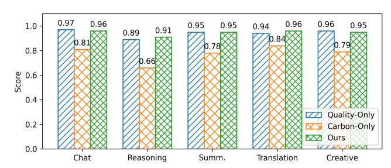
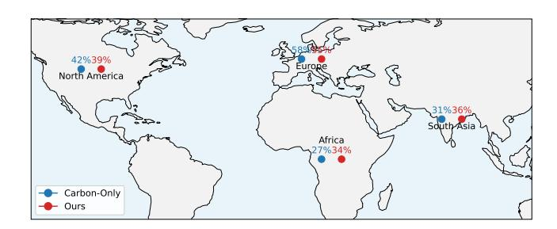
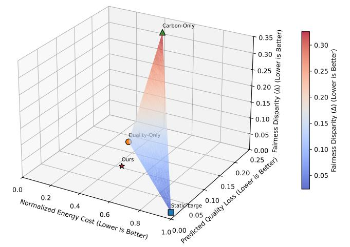

# Fair and Carbon-Aware LLM Routing for Web Services

Tingting Li Shanghai Qi Zhi Institute Shanghai, China Zhejiang University, Hangzhou, China litt2020@zju.edu.cn

Ziming Zhao∗ Zhejiang University Hangzhou, China zhaoziming@zju.edu.cn

Zhaoxuan Li∗ State Key Laboratory of Cyberspace Security Defense, IIE, CAS Beijing, China lizhaoxuan@iie.ac.cn

Xiaofei Yue Beijing Institute of Technology Beijing, China xfyue1203@gmail.com

Jiongchi Yu Singapore Management University Singapore jcyu.2022@phdcs.smu.edu.sg

## Abstract

In recent years, large language models (LLMs) have gradually become the core of the computing infrastructure of modern web platforms. In practice, the energy consumption and carbon emissions of a model vary depending on the model capacity, hardware selection, and the location of the data center. Specifically, if a web platform adopts only a simple energy-saving strategy, users in certain regions, those using specific languages, or those belonging to specific disadvantaged groups may continue to receive lower-quality services. This paper proposes a carbon-aware and fairness-aware routing framework for LLM-based network services, which jointly optimizes energy consumption, output quality, and distributional fairness. We introduce a lightweight complexity and risk predictor to estimate the minimum model capacity required to satisfy each query under platform-specific quality and security constraints. The system then routes queries to appropriate model-hardware combinations, taking into account real-time carbon intensity signals. Specifically, we model the routing process as a constrained optimization problem aimed at balancing anticipated quality degradation, energy costs, and fairness constraints among different demographic and geographic groups. In addition, we develop an evaluation methodology that combines trace-driven simulation based on real web workloads with quality, latency, and carbon footprint metrics for different groups. Extensive experiments show that our proposal can reduce energy consumption while maintaining acceptable output quality and preventing systemic quality degradation among vulnerable user groups.

## CCS Concepts

#### • Information systems → Web services; Collaborative and social computing systems and tools; • Applied computing → Environmental sciences.

## Keywords

LLMs, Carbon-Aware Computing, Fair Web Services

∗Corresponding authors.

[This work is licensed under a Creative Commons Attribution 4.0 International License.](https://creativecommons.org/licenses/by/4.0) WWW '26, Dubai, United Arab Emirates © 2026 Copyright held by the owner/author(s). ACM ISBN 979-8-4007-2307-0/2026/04 <https://doi.org/10.1145/3774904.3793001>

#### ACM Reference Format:

Tingting Li, Ziming Zhao, Zhaoxuan Li, Xiaofei Yue, and Jiongchi Yu. 2026. Fair and Carbon-Aware LLM Routing for Web Services. In Proceedings of the ACM Web Conference 2026 (WWW '26), April 13–17, 2026, Dubai, United Arab Emirates. ACM, New York, NY, USA, [9](#page-8-0) pages. [https://doi.org/10.1145/](https://doi.org/10.1145/3774904.3793001) [3774904.3793001](https://doi.org/10.1145/3774904.3793001)

## 1 Introduction

Recently, large language models (LLMs) have rapidly become a core component of modern web services, supporting conversational interfaces, knowledge retrieval, and personalized help [\[33\]](#page-8-1). Meanwhile, the platform is increasingly relying on LLM as the front end for user interaction, and the energy consumption and carbon emissions introduced by model inference are also increasing accordingly [\[5,](#page-8-2) [10,](#page-8-3) [27\]](#page-8-4). Previous research has shown that performing LLM inference on large GPU clusters consumes a significant amount of energy [\[5,](#page-8-2) [27\]](#page-8-4), and the carbon emission intensity of data centers varies depending on the geographical region and time [\[16,](#page-8-5) [18,](#page-8-6) [23\]](#page-8-7). Therefore, the environmental footprint of LLM-based web services depends not only on model size and hardware configuration information, but also on spatiotemporal factors such as grid carbon emission intensity.

Meanwhile, mounting evidence suggests that the environmental and social burdens of artificial intelligence (AI) systems are not evenly distributed in the real world [\[10,](#page-8-3) [27\]](#page-8-4). Due to hardware heterogeneity, model scaling strategies, or deployment decisions made for efficiency reasons, users from different regions, languages, or groups may experience different model quality or latency [\[17,](#page-8-8) [22,](#page-8-9) [25\]](#page-8-10). Without carefully designed energy-saving strategies, such as defaulting to smaller or quantized models for certain groups, new forms of algorithmic unfairness may be introduced [\[25\]](#page-8-10). These concerns have prompted us to push for fair routing strategies and to call for the development of environmentally responsible and socially inclusive technologies.

A key challenge facing web platforms is how to dynamically assign each user query to the appropriate model-hardware combination while satisfying multiple objectives: meeting quality and security requirements; minimizing energy consumption and carbon emissions; and avoiding systematic differences between different user groups [\[1\]](#page-8-11). Simply routing all traffic [\[34,](#page-8-12) [36\]](#page-8-13) to a single highcapacity model would waste a lot of energy [\[5\]](#page-8-2). Conversely, overrouting to smaller models can lead to decreased quality, inconsistent user experience, and uneven impact. Existing routing heuristics

typically optimize latency or throughput, lacking consideration for carbon awareness or fairness guarantees [\[6,](#page-8-14) [22,](#page-8-9) [38\]](#page-8-15).

To this end, we propose a carbon-aware and fairness-aware routing framework for LLM-based web services. We built a lightweight complexity and risk predictor that can estimate the minimum model capacity required to satisfy a query, under platform-defined quality and security constraints [\[1\]](#page-8-11). During the inference phase, the router selects a model-hardware configuration that balances prediction quality, the real-time carbon intensity of the data center, and fairness constraints [\[18,](#page-8-6) [23,](#page-8-7) [25\]](#page-8-10). We model the routing process as a constrained optimization problem, aiming to simultaneously minimize energy costs and prediction quality degradation. Crucially, this involves preventing the systematic allocation of lowcapacity models to disadvantaged groups, thus satisfying fairness constraints [\[16,](#page-8-5) [17,](#page-8-8) [25\]](#page-8-10). In addition, we conduct a series of evaluations that combine trace-driven simulations based on real web workloads with grouped metrics for quality, latency, carbon footprint, and distributional fairness.

In summary, this paper makes the following key contributions.

- We propose a carbon-aware and fairness-aware routing framework for LLM-based web services that uniformly considers energy efficiency, model quality, and distributional fairness.
- We introduce a lightweight complexity and risk predictor to estimate the minimum model capacity required for each query, enabling real-time, large-scale routing decisions. Meanwhile, we formulate routing as a multi-objective constrained optimization problem and enable balancing carbon footprint, predicted quality, and fairness.
- We design a tracking-based simulation method and demonstrate through comprehensive experiments that our proposal reduces energy and carbon emissions while preventing a decline in the quality of services for vulnerable groups. Furthermore, we discuss the deployment implications and outlined a roadmap for promoting carbon-aware models and equitysensing strategies.

## 2 Related Work

Carbon-Aware Computing. Carbon-aware computing is a promising direction for reducing the environmental footprint of large-scale cloud services. Previous studies have explored methods for shifting workloads temporally and geographically based on carbon intensity fluctuations [\[23,](#page-8-7) [40\]](#page-8-16). Other studies focus on carbon-efficient data center scheduling [\[15,](#page-8-17) [31\]](#page-8-18), energy-adaptive distributed systems, and renewable energy sensing capacity planning. Meanwhile, green AI highlights the rapidly increasing energy costs of neural network training and inference [\[24,](#page-8-19) [27,](#page-8-4) [35\]](#page-8-20), prompting researchers to explore optimizing computational efficiency without sacrificing model utility. Recent research has focused on carbon-aware machine learning services, including energy-saving model deployment strategies and carbon intensity prediction [\[11,](#page-8-21) [19\]](#page-8-22). These methods are typically optimized at the system or cluster level, while our setup requires real-time decision-making for each request under user-facing quality and fairness constraints. Our work is unique in that it focuses on LLM inference routing for web services and integrates complexity estimation, carbon signaling, and fairness considerations into a unified optimization framework.

LLM Routing and Adaptive Inference. Adaptive inference and model cascades have long been used to reduce computation while preserving accuracy [\[4,](#page-8-23) [30,](#page-8-24) [39\]](#page-8-25). Recently, these ideas have been extended to LLMs via dynamic model selection, mixture-of-experts routing, and early-exit strategies [\[2,](#page-8-26) [12,](#page-8-27) [14,](#page-8-28) [20\]](#page-8-29). Such techniques typically optimize for computational savings, inference latency, or GPU utilization. However, these methods generally treat model routing as a quality-latency trade-off and do not consider environmental or societal objectives. Prior work on scheduling for heterogeneous serving systems [\[7,](#page-8-30) [32\]](#page-8-31) provides useful mechanisms but does not incorporate carbon signals or fairness considerations. In contrast, our complexity and risk predictor is designed specifically for heterogeneous web workloads, which are diverse in length, intent, risk level, and so on, properties that differ substantially from structured benchmarks used in prior adaptive inference research.

Fairness in Web Systems and AI Deployment. Fairness considerations have been incorporated into the recommendation system [\[3\]](#page-8-32), ranking and search [\[26\]](#page-8-33), and ML-based decision systems [\[8\]](#page-8-34). Numerous studies have shown that deployment decisions (such as device-based selection or region-specific deployments) can introduce inequalities between different geographic or statistical groups [\[13\]](#page-8-35). This raises a question worth exploring, i.e., even if the core model is fair, the reasoning strategy can introduce variability. Our work contributes to this emerging research direction by examining whether carbon optimization pathways systematically assign low-capacity models to specific groups. We show that simple carbon reduction strategies may exacerbate structural inequalities, thus requiring equity-aware routing to provide equitable distribution of models among different user groups.

Multi-Objective Optimization. Multi-objective optimization has been studied in cloud resource allocation [\[21,](#page-8-36) [29,](#page-8-37) [37\]](#page-8-38), accelerator scheduling [\[28\]](#page-8-39), and machine learning model or pipeline optimization [\[9,](#page-8-40) [41\]](#page-8-41). These methods require trade-offs between factors such as latency, throughput, cost, and accuracy, and often rely on Pareto optimization or constrained optimization formulas. While these works provide a methodological foundation, our problem setting introduces a new perspective on routing machine learning queries across heterogeneous models and data centers, taking into account carbon emissions, prediction quality degradation, and fairness constraints. We formalize this problem as a constrained optimization problem for real-time web service conditions, and then optimize it accordingly.

## 3 Background and Motivation

Large Language Models (LLMs) power intelligent search, conversational assistants, and a variety of knowledge-intensive applications, and have rapidly become a fundamental component of modern web services [\[6,](#page-8-14) [12,](#page-8-27) [38\]](#page-8-15). The conversion from traditional retrieval-based systems to LLM-driven interaction methods implies a fundamental change in how users interact with the web. However, this shift also brings new challenges regarding energy consumption, environmental sustainability, and equitable distribution [\[8,](#page-8-34) [10,](#page-8-3) [24,](#page-8-19) [27\]](#page-8-4).

Energy Implications of LLM Inference. LLM inference involves a huge amount of computation and typically requires high-end GPU clusters or dedicated accelerators [\[5,](#page-8-2) [27\]](#page-8-4). Previous analyses estimated that generating a single response using a model with billions

Figure 1: The overview of carbon-aware LLM routing.

of parameters could consume one to two orders of magnitude more energy than traditional web services [\[10,](#page-8-3) [24,](#page-8-19) [27\]](#page-8-4). Meanwhile, due to differences in renewable energy penetration rates and local energy structures, the carbon emission intensity of power grids varies significantly across different regions and time periods [\[16,](#page-8-5) [18,](#page-8-6) [19,](#page-8-22) [23\]](#page-8-7). Therefore, the same inference request can produce drastically different carbon footprints in different deployment regions. Large web platforms that process millions of LLM queries daily will accumulate huge energy demands [\[5\]](#page-8-2). Software-level decisions, such as crossmodel or region routing queries, directly impact environmental effects [\[19,](#page-8-22) [23\]](#page-8-7). Despite these realities, most existing LLM-based web services still rely on static or quality-only routing strategies, leaving considerable room for environment optimization [\[1,](#page-8-11) [2,](#page-8-26) [6,](#page-8-14) [22,](#page-8-9) [38\]](#page-8-15).

Emerging Inequities in Model Allocation. Another similar concern stems from the social aspects of LLM deployment. In multimodel systems, decisions about which model capacity to allocate to which user or region may inadvertently introduce uneven distribution [\[3,](#page-8-32) [8,](#page-8-34) [25\]](#page-8-10). These unfair phenomena can manifest themselves in many ways. (i) Region-based disparities: due to cost savings or carbon reduction strategies, users in low-income areas may be assigned to smaller or slower models [\[3,](#page-8-32) [13\]](#page-8-35). (ii) Language-based disparities: queries in low-resource languages typically require larger models to obtain high-quality output; simply reducing the model size would harm the interests of minority language groups [\[25\]](#page-8-10). (iii) Task-based disparities: assigning security-sensitive or complex tasks (such as legal consultation) to underperforming models carries a greater risk [\[25\]](#page-8-10). These issues are becoming increasingly urgent as LLM becomes a core access point for information and decision support in the global network ecosystem.

Tension Between Sustainability and Fairness. In practice, energy efficiency and equity goals may conflict. For example, carbonoptimized routing might redirect requests from high-carbon regions to cleaner power grids, thus impacting users in carbon-intensive areas [\[18,](#page-8-6) [23\]](#page-8-7). And quality-oriented reduction plans may create quality gaps between different demographic or language groups [\[8,](#page-8-34) [25\]](#page-8-10). Furthermore, while a uniform downsizing policy could reduce emissions, it could harm groups with more complex language or cultural needs. Therefore, without explicit consideration of fairness constraints, these interventions may shift quality costs to specific groups, meaning that the interventions may not be inherently neutral [\[13,](#page-8-35) [25\]](#page-8-10).

Need for a Unified Routing Framework. Existing research has explored aspects such as carbon-aware computing, adaptive reasoning, and fairness in artificial intelligence systems, but these studies

Figure 2: Carbon intensity. Figure 3: The predictor.

often view these dimensions in isolation [\[2,](#page-8-26) [3,](#page-8-32) [8,](#page-8-34) [16,](#page-8-5) [19,](#page-8-22) [23,](#page-8-7) [25,](#page-8-10) [30,](#page-8-24) [39\]](#page-8-25). As the core interface layer upon which network platforms rely, LLM's routing strategy becomes a crucial element in the convergence of environmental and social factors. These observations have spurred the development of an integrated framework capable of jointly modeling energy consumption, carbon footprint, quality constraints, and equity requirements. This would enable decisionmaking to adapt to real-time carbon signals and specific user characteristics, avoiding the disadvantage of any group. Our work bridges them by proposing a principled, carbon-aware, and fairness-aware routing system based on LLM-based web services.

### 4 Method and Design Details

We introduce a carbon-aware and fairness-aware routing framework for LLM-based web services. Figure [1](#page-2-0) presents the overall architecture. When a user query arrives, (i) a complexity and risk predictor estimates the minimal model capacity required to meet quality and safety constraints; (ii) the router evaluates feasible model, hardware, and region candidates in real time using carbonintensity signals and fairness constraints; and (iii) a constrained optimization module selects the final routing decision that balances quality, energy consumption, and fairness.

### 4.1 System Overview

Let Q denote the set of incoming queries and M = {��1, . . . ,���� } denote a heterogeneous collection of LLMs (e.g., small/medium/large models, quantized variants, distilled models). Let H denote available hardware types and R denote deployment regions (data centers). A routing decision corresponds to selecting a tuple

(��, ℎ, ��) ∈ M × H × R, (1)

which determines both the model capacity and the carbon footprint (estimated by regional carbon-intensity exposure) associated with the data center.

Each query �� must be served under service-level constraints on quality, latency, and safety. The challenge stems from determining the appropriate tuple (��, ℎ, ��) given predicted minimum required capacity, real-time carbon intensity, and fairness constraints across user groups. As shown in Figure [2,](#page-2-1) carbon intensity varies substantially across regions and time, creating opportunities for carbon-aware routing to reduce emissions by leveraging low-carbon windows. The strong temporal fluctuations highlight why real-time carbon signals are essential for effective routing decisions.

## 4.2 Complexity and Risk Predictor

The goal of the predictor is to estimate the minimal model capacity required to satisfy quality and safety requirements for a given query.

Figure 4: The system implementation.

with data center infrastructure, and how fairness and carbon emission signals are integrated into production routing decisions.

Architectural Overview. We implement the system as a lightweight orchestration layer and build it on top of the standard LLM inference service. Figure [4](#page-4-0) illustrates the major components. (i) Frontend gateway: receives raw user queries from web applications or conversational interfaces. (ii) Feature extractor: calculates querylevel features, such as length, language complexity, task metrics, and security risk heuristics. (iii) Complexity and risk predictor: predicts the minimum model capacity required to meet the platform's quality and safety requirements. (iv) Routing engine: evaluates feasible (model, hardware, region) candidate solutions, applies fairness constraints, and calculates the cost function that takes into account carbon emissions and energy consumption. (v) Execution backend: executes the selected LLM model on the appropriate region and hardware configuration. (vi) Telemetry and feedback: records routing decisions, model performance, fairness metrics, and carbon emission costs for continuous improvement.

Complexity and Risk Predictor. We implement the predictor ���� as a compact transformer encoder, since it has low latency and can process multilingual input. The model takes as input a tokenized user query, the task embedding, a safety-risk embedding, the user language, and region indicators. Then it outputs a discrete capacity recommendation corresponding to different model scales.

Routing Engine. The routing engine is implemented in C++ with Python bindings for experimentation. It operates in three stages. (i) Feasible Candidate Selection. Prune candidates violating latency or safety constraints.

(ii) Cost Computation. Each candidate (��, ℎ, ��) receives a cost:

����(��, ℎ) + ����(��, ��) + ����(��,��), (10)

computed using cached hardware energy profiles and region-level carbon forecasts refreshed periodically.

(iii) Fairness Adjustment. Before final selection, the engine applies a fairness filter or soft penalty:

AdjustedCost = Cost + �� · GroupPenalty(��), (11)

where GroupPenalty(��) is proportional to recent deviations in capacity assignment for group ��. This mechanism is designed to ensure real-time fairness control.

Carbon-Intensity Integration. We integrate carbon-intensity signals through a streaming API connected to regional grid providers and open-source carbon-intensity feeds. Values are cached and updated periodically, with interpolation used to reduce jitter. The system supports real-time routing: always choose the lowest-carbon candidate satisfying constraints; smoothed signals: avoid oscillations by applying exponential smoothing with a factor; carbon-aware scheduling windows: allow additional flexibility for batched or asynchronous inference tasks.

Backend Executor. The backend uses a distributed inference service that supports heterogeneous hardware (e.g., A10 and A100), quantization, and model parallelism. Each backend region provides telemetry data to measure actual energy consumption, inference latency, queuing latency, and soft quality metrics such as lexical perplexity and output length. These metrics are fed back to the routing engine to optimize predictions and adjust fairness penalties. Deployment and Scalability. The system is designed to support high-throughput web services, e.g., routing engine throughput exceeds 150K queries per second on a single CPU node, routing overhead contributes less than 1 ms to end-to-end latency, predictor inference is fast enough for global deployment, fairness tracking is implemented via a sliding-window aggregator. The framework is compatible with A/B testing, allowing platforms to deploy carbonor fairness-aware routing strategies gradually.

Fault Tolerance and Safety. We implement several safety mechanisms. (i) Fail-safe routing: if carbon signals or fairness monitors fail, fall back to Quality-Only routing. (ii) Graceful degradation: hardware/geographic failures trigger automatic rebalancing across regions. (iii) Audit logging: all routing decisions are logged for fairness and carbon audits. These features ensure the system remains robust under production constraints.

## 6 Evaluations

We evaluate our proposed routing framework, which balances carbon emissions and fairness, using real-world web workloads and tracking-based simulations. Our experiments aim to answer the following research questions.

- RQ1: Can carbon-aware routing reduce energy consumption and carbon emissions without sacrificing quality?

Table 1: Energy cost per inference (Joules).

| Model      | A10 | A100 | H100 |
|------------|-----|------|------|
| Small-3B   | 18  | 12   | 10   |
| Medium-13B | 42  | 30   | 24   |
| Large-70B  | 215 | 150  | 120  |

- RQ2: Does incorporating fairness constraints prevent systematic degradation for vulnerable user groups?
- RQ3: How does our method compare to common routing strategies used in large-scale LLM-based web services?

#### 6.1 Experimental Setup

Workload and Query Distribution. We use a 24-hour trace comprising 1.2 million user queries sampled from a multilingual web assistant workload [\[6,](#page-8-14) [38\]](#page-8-15). Queries are categorized into five task types: chat, reasoning, translation, summarization, and creative generation. User groups are stratified by region (North America, Europe, South Asia, Africa), and by primary language (English, Spanish, Hindi, Swahili) [\[3,](#page-8-32) [25\]](#page-8-10). The query distribution reflects realistic global usage patterns, e.g., high volume from English-speaking regions, moderate volume in multilingual European regions, and understudied low-resource languages such as Swahili.

Model and Hardware Configurations. We evaluate a heterogeneous model zoo M = {Small-3B, Medium-13B, Large-70B} [\[38\]](#page-8-15). The hardware includes H = {A10, A100, H100}. Energy consumption is estimated using vendor-reported TDP and measured inference latency [\[5,](#page-8-2) [10,](#page-8-3) [27\]](#page-8-4). Table [1](#page-5-0) summarizes energy per inference. Carbon Intensity Signals. We use historical carbon intensity data from four regions, i.e., North America, Europe, South Asia, and Africa [\[25\]](#page-8-10). Empirically, Africa experiences high and volatile grid carbon intensity; Europe experiences substantially low-carbon periods due to wind and nuclear power [\[19,](#page-8-22) [23\]](#page-8-7). This variation enables meaningful carbon-aware routing effects.

Baselines. We compare our method against four baselines. (i) Static-Large [\[38\]](#page-8-15): always use Large-70B on the closest region. (ii) Quality-Only [\[2\]](#page-8-26): choose smallest model satisfying predicted quality; ignores carbon. (iii) Carbon-Only [\[23\]](#page-8-7): route to the region with lowest real-time carbon; ignores quality. (iv) Round-Robin [\[28\]](#page-8-39): hardware-agnostic, region-agnostic simple load balancing.

Metrics. We evaluate four metrics. (i) Quality. Accuracy of responses measured using a synthetic evaluator aligned with human judgments. (ii) Energy. Total joules consumed by all inferences. (iii) Carbon Footprint. Total CO2 is computed as ��(��,ℎ) 3.6×106 · ��(��, ��) [\[19,](#page-8-22) [23\]](#page-8-7), where �� is measured in Joules and carbon intensity is in gCO2/kWh (using 1 kWh = 3.6×106 J). (iv) Fairness. We report the group disparity in relative capacity allocation Δ, as described in Section [4.4.](#page-3-0) Lower Δ indicates more equitable allocation across groups [\[8,](#page-8-34) [25\]](#page-8-10).

## 6.2 Effectiveness Evaluation

Table [2](#page-5-1) presents overall results for the 24-hour trace. Our method reduces energy usage by 46% and carbon emissions by 59% relative to Static-Large while maintaining near-identical quality. Importantly, the fairness gap remains low (i.e., 0.05), substantially better than Quality-Only or Carbon-Only baselines. Beyond aggregate

Table 2: Overall performance results.

| Method                 | Quality | ↑ Energy | ↓ CO 2 ↓ | Fairness Δ ↓ |
|------------------------|---------|----------|----------|--------------|
| Static-Large           | 1.00    | 100%     | 100%     | 0.02         |
| Quality-Only           | 0.95    | 61%      | 64%      | 0.14         |
| Carbon-Only            | 0.78    | 45%      | 38%      | 0.33         |
| Round-Robin            | 0.87    | 83%      | 77%      | 0.25         |
| Ours (Carbon+Fairness) | 0.94    | 54%      | 41%      | 0.05         |

Figure 5: Quality by task type.

metrics, we observe that our routing strategy consistently allocates sufficient capacity for high-complexity and safety-sensitive queries while opportunistically selecting lower-carbon regions when quality constraints permit. Compared with quality-only routing, our approach achieves comparable output quality but substantially lowers environmental impact due to its ability to exploit temporal and geographical carbon variations. By contrast, carbon-only routing aggressively shifts traffic to low-carbon regions at the expense of quality and fairness, highlighting the necessity of jointly optimizing the three objectives. Overall, these results confirm that a unified carbon- and fairness-aware routing framework can achieve strong environmental gains while maintaining a stable user experience.

### 6.3 Quality Degradation by Task Type

Figure [5](#page-5-2) shows task-specific performance, normalized to Static-Large. Reasoning tasks are most sensitive to downsizing; our predictor effectively avoids under-provisioning. Across the five task categories, our method closely matches the performance of Static-Large while providing substantial efficiency gains. The largest improvement appears in reasoning queries: compared with Quality-Only, which drops to 0.89, and Carbon-Only, which falls sharply to 0.66, our approach maintains a much higher score of 0.91. Similar trends hold for translation and creative-generation tasks, where our method improves over Carbon-Only by 12-16 percentage points. These results highlight the effectiveness of the predictor in preventing under-provisioning for complex queries while preserving overall quality across diverse task types.

### 6.4 Fairness Across Regions

Table [3](#page-6-0) reports average assigned model capacities (capacity index 1=Small, 2=Medium, 3=Large). Quality-Only and especially Carbon-Only exhibit clear disparate treatment of Africa and South Asia. Our fairness constraints substantially reduce such disparities. Notably, the disparity between high-resource and low-resource regions is sharply reduced under our method. For example, the gap in assigned capacity between North America and Africa shrinks

Figure 6: Per-region CO2 reduction relative to static-large.

from 0.51 under Quality-Only and 0.41 under Carbon-Only to just 0.14 with our fairness-aware routing. Similar reductions are observed for South Asia, where the gap relative to Europe decreases from 0.26 (Quality-Only) to 0.07 with our method. These results indicate that fairness constraints effectively mitigate systematic under-provisioning while preserving overall efficiency.

Table 3: Model capacity assigned across regions.

| Region        | Quality-Only | Carbon-Only | Ours |
|---------------|--------------|-------------|------|
| North America | 1.92         | 1.30        | 1.85 |
| Europe        | 1.88         | 1.15        | 1.83 |
| South Asia    | 1.62         | 1.05        | 1.76 |
| Africa        | 1.41         | 0.89        | 1.71 |

#### 6.5 Carbon Savings by Region

Across all four regions in Figure [6,](#page-6-1) our method achieves carbon reductions close to those of the Carbon-Only baseline while avoiding its severe quality and fairness drawbacks. Notably, our approach improves carbon savings in South Asia and Africa by 5-7 percentage points compared to Carbon-Only, reflecting its ability to exploit cleaner regions when feasible without over-shifting traffic. Overall, these results confirm that carbon-aware routing can deliver substantial environmental benefits even when constrained by quality and fairness requirements.

### 6.6 Ablation Studies

To quantify the contribution of each component in our routing framework, we evaluate three ablated variants: (i) No-Predictor, which removes the complexity and risk predictor and relies solely on static heuristics; (ii) No-Fairness, which disables fairness constraints; and (iii) No-Carbon, which eliminates carbon-awareness and optimizes only for quality and energy. All variants are evaluated on the same 24-hour workload trace. From Table [4,](#page-6-2) removing the predictor leads to the largest quality degradation, dropping from 0.94 to 0.88 as the router frequently underestimates the capacity required for complex or safety-sensitive queries. Disabling fairness constraints leaves quality and energy nearly unchanged but increases the disparity gap from 0.05 to 0.18, disproportionately affecting low-resource regions. Finally, eliminating carbon-awareness 0.0

Figure 7: The 3D pareto trade-off analysis.

maintains quality but increases CO2 from 41% to 72%, demonstrating that real-time regional carbon signals are essential for achieving meaningful environmental benefits.

These ablations confirm that each component, predictor, fairness constraint, and carbon-awareness, plays a complementary and indispensable role, enabling the full model to simultaneously optimize for quality, equity, and sustainability.

Table 4: Ablation study results. Each variant removes one component from the full model.

| Method Variant    | Quality | ↑ Energy | ↓ CO 2 ↓ | Fairness Δ ↓ |
|-------------------|---------|----------|----------|--------------|
| Ours (Full Model) | 0.94    | 54%      | 41%      | 0.05         |
| No-Predictor      | 0.88    | 49%      | 61%      | 0.11         |
| No-Fairness       | 0.93    | 54%      | 60%      | 0.18         |
| No-Carbon         | 0.94    | 52%      | 72%      | 0.06         |

Figure [7](#page-6-3) visualizes the joint trade-off among energy cost, quality loss, and fairness disparity. Baselines exhibit extreme behaviors, Carbon-Only minimizes energy but sacrifices both quality and equity, while Quality-Only preserves quality at the expense of sustainability. In contrast, our method consistently occupies a Paretooptimal region, achieving strong performance across all three dimensions simultaneously. These findings collectively demonstrate that each component of our framework plays a critical and complementary role in balancing quality, energy efficiency, and equity. Carbon-aware routing enables substantial reductions in energy use and emissions, while the predictor is essential for preserving quality, particularly on complex reasoning tasks, and fairness constraints effectively prevent systematic under-provisioning for vulnerable groups. Overall, the integrated design provides strong and consistent trade-offs across all objectives.

## 7 Discussion and Societal Impact

## 7.1 Environmental Sustainability.

Our findings demonstrate that incorporating real-time carbon intensity signals into LLM routing can reduce the carbon footprint

of large-scale web services. In particular, these advantages do not require architectural changes to existing LLMs, but are based on software-level optimizations and principle-based orchestration. This points to a promising direction for web-scale AI systems: improving the environment through intelligent control, where systemlevel decision-making and model-level innovation complement each other. Nevertheless, carbon-aware routing could only address part of the sustainability challenges. Beyond operational emissions, AI's environmental impact includes hidden carbon emissions from hardware manufacturing processes, supply chains, power infrastructure, and the energy required for continuous model retraining. Furthermore, carbon intensity varies with grid composition, seasonal factors, and geopolitical constraints, exacerbating concerns about the long-term stability and fairness of carbon-aware optimization. In the future, we can consider integrating more elements to jointly optimize the scheduling of short-term carbon fluctuations and long-term sustainable development goals.

## 7.2 Equity and Fairness Considerations.

Our work shows that simply pursuing carbon efficiency targets may inadvertently exacerbate inequalities among user groups. Because real-time carbon signals vary by region, routers that only consider carbon emissions may systematically redirect users in resourcescarce or high-carbon-emission areas to lower-capacity models. This model may lead to resource efficiency optimization "externalizing" performance costs onto already disadvantaged groups. Our proposed fairness perception constraint offers a way to mitigate those risks. Of course, fairness itself is multiple perspectives. For example, equality at the group level, language equality, and regional equality may only be part of the goal; some applications may require stronger safeguards, such as individual fairness, utility equilibrium, or risk-sensitive allocation. In addition, the deployment of fair constraints needs to consider which groups to protect, how to quantify differences, and how to balance quality, delays, and sustainability. Therefore, implementing ethical deployments requires not only the participation of engineers, but also the collaborative participation of governments and relevant communities.

## 7.3 Limitations and Future Work.

There are several limitations to our study. (i) Predictor generalization. The complexity and risk predictor relies on training data that may not reflect emergent or rare query types, including adversarial prompts or safety-critical requests. In future work, online adaptation or uncertainty-aware prediction may improve robustness. (ii) Carbon signal fidelity. Our system depends on the availability and accuracy of carbon-intensity forecasts. Some regions lack reliable reporting, and errors in carbon data could lead to suboptimal or unfair routing decisions. Integrating probabilistic or multi-source carbon signals may improve stability. (iii) Scope of fairness metrics. We analyze group-level fairness across coarse regions and languages. More granular, intersectional, or task-specific fairness definitions may reveal additional disparities, especially for marginalized linguistic groups or users with specialized accessibility needs. (iv) Simulationbased evaluation. Due to the costs of live deployment, our evaluation is based on trace-driven simulation. Real-world usage patterns, particularly interactive workflows, streaming contexts, and multi-turn

conversations, may exhibit different routing sensitivities. Addressing these limitations requires deeper integration with production platforms, improved global carbon-reporting infrastructure, longitudinal user studies, and cross-disciplinary collaboration to define context-appropriate fairness criteria.

### 7.4 Broader Implications.

Our findings suggest that environmentally sustainable AI deployment is compatible with socially responsible design. As web platforms increasingly rely on LLMs as the primary interaction modality, routing emerges as a powerful lever for aligning large-scale AI systems with societal values. Carbon-aware and fairness-aware routing policies broaden the design space for responsible web infrastructure, shifting ethical considerations to infrastructure layers that have often been overlooked. We advocate for the following steps. (i) Transparency: Platforms should disclose routing policies, environmental impact estimates, and fairness safeguards, enabling researchers and users to understand how model assignments differ across contexts. (ii) User agency: Systems may offer opt-in or optout "green modes" that allow users to prioritize sustainability, latency, or quality according to their preferences. (iii) Standardization: Developing shared metrics for environmental and fairness auditing of AI services, including carbon-aware inference benchmarks, could support accountability and comparability across platforms. (iv) Incentive alignment: Policymakers and cloud providers may consider incentives for low-carbon inference, such as renewableaware pricing models, which could further amplify the benefits of carbon-aware routing.

## 8 Conclusion

In this paper, we present a carbon-aware and fairness-aware routing framework for large language model (LLM) inference in webscale services. Specifically, our approach introduces a lightweight complexity and risk predictor and formulates routing as a constrained optimization problem balancing energy efficiency, carbon footprint, model quality, and distributional fairness. Through extensive trace-driven simulations, we demonstrate that our framework significantly reduces energy consumption and carbon emissions while maintaining high-quality outputs. This can prevent discriminatory treatment of vulnerable user groups, thereby promoting social equity in artificial intelligence computing. In the future, as LLM continues to shape how we interact with the web, routing decisions will play a key role in helping AI systems align with environmental and social goals. Our work explores this promising direction and provides a practical, deployable, and principled approach to achieving these goals. We hope that this research will promote the wider application of carbon sensing and fairness sensing AI infrastructure, provide new perspectives for work in related fields, and drive future research in the intersection of sustainability, fairness, and large-scale network systems.

## Acknowledgments

This research was supported by Zhejiang Provincial Natural Science Foundation of China under Grant No. LQN26F020008, CAAI-Ant Group Research Fund (2025CAAI-ANT-15), and Shanghai Qi Zhi Institute Innovation Program (No. SQZ202318).

### References

[1] Romil Bhardwaj, Kirthevasan Kandasamy, Asim Biswal, Wenshuo Guo, Benjamin Hindman, Joseph Gonzalez, Michael Jordan, and Ion Stoica. Cilantro:{Performance-Aware} resource allocation for general objectives via online feedback. In 17th USENIX Symposium on Operating Systems Design and Implementation (OSDI 23), pages 623–643, 2023. [2] Lingjiao Chen, Matei Zaharia, and James Zou. Frugalgpt: How to use large language models while reducing cost and improving performance. arXiv preprint arXiv:2305.05176, 2023. [3] Michael D Ekstrand, Anubrata Das, Robin Burke, and Fernando Diaz. Fairness in recommender systems. In Recommender systems handbook, pages 679–707. Springer, 2012. [4] Biyi Fang, Xiao Zeng, Faen Zhang, Hui Xu, and Mi Zhang. Flexdnn: Inputadaptive on-device deep learning for efficient mobile vision. In 2020 IEEE/ACM Symposium on Edge Computing (SEC), pages 84–95. IEEE, 2020. [5] Jared Fernandez, Clara Na, Vashisth Tiwari, Yonatan Bisk, Sasha Luccioni, and Emma Strubell. Energy considerations of large language model inference and efficiency optimizations. In ACL (1), pages 32556–32569. Association for Computational Linguistics, 2025. [6] Bin Gao, Zhuomin He, Puru Sharma, Qingxuan Kang, Djordje Jevdjic, Junbo Deng, Xingkun Yang, Zhou Yu, and Pengfei Zuo. {Cost-Efficient} large language model serving for multi-turn conversations with {CachedAttention}. In 2024 USENIX Annual Technical Conference (USENIX ATC 24), pages 111–126, 2024. [7] Arpan Gujarati, Reza Karimi, Safya Alzayat, Wei Hao, Antoine Kaufmann, Ymir Vigfusson, and Jonathan Mace. Serving {DNNs} like clockwork: Performance predictability from the bottom up. In 14th USENIX Symposium on Operating Systems Design and Implementation (OSDI 20), pages 443–462, 2020. [8] Moritz Hardt, Eric Price, and Nati Srebro. Equality of opportunity in supervised learning. Advances in neural information processing systems, 29, 2016. [9] Elad Hazan et al. Introduction to online convex optimization. Foundations and Trends® in Optimization, 2(3-4):157–325, 2016. [10] Peter Henderson, Jieru Hu, Joshua Romoff, Emma Brunskill, Dan Jurafsky, and Joelle Pineau. Towards the systematic reporting of the energy and carbon footprints of machine learning. CoRR, abs/2002.05651, 2020. [11] Mohammad Jaminur Islam and Shaolei Ren. Equity-aware spatial-temporal workload shifting for sustainable ai data centers. In NeurIPS Workshop on Tackling Climate Change with Machine Learning, 2024. [12] Albert Q Jiang, Alexandre Sablayrolles, Antoine Roux, Arthur Mensch, Blanche Savary, Chris Bamford, Devendra Singh Chaplot, Diego de las Casas, Emma Bou Hanna, Florian Bressand, et al. Mixtral of experts. arXiv preprint arXiv:2401.04088, 2024. [13] Nima Kordzadeh and Maryam Ghasemaghaei. Algorithmic bias: review, synthesis, and future research directions. European Journal of Information Systems, 31(3):388– 409, 2022. [14] Yaniv Leviathan, Matan Kalman, and Yossi Matias. Fast inference from transformers via speculative decoding. In International Conference on Machine Learning, pages 19274–19286. PMLR, 2023. [15] Minghong Lin, Zhenhua Liu, Adam Wierman, and Lachlan LH Andrew. Online algorithms for geographical load balancing. In 2012 international green computing conference (IGCC), pages 1–10. IEEE, 2012. [16] Zhenhua Liu, Minghong Lin, Adam Wierman, Steven H Low, and Lachlan LH Andrew. Greening geographical load balancing. ACM SIGMETRICS Performance Evaluation Review, 39(1):193–204, 2011. [17] Kshiteej Mahajan, Arjun Balasubramanian, Arjun Singhvi, Shivaram Venkataraman, Aditya Akella, Amar Phanishayee, and Shuchi Chawla. Themis: Fair and efficient {GPU} cluster scheduling. In 17th USENIX Symposium on Networked Systems Design and Implementation (NSDI 20), pages 289–304, 2020. [18] Diptyaroop Maji, Ben Pfaff, Vipin PR, Rajagopal Sreenivasan, Victor Firoiu, Sreeram Iyer, Colleen Josephson, Zhelong Pan, and Ramesh K Sitaraman. Bringing carbon awareness to multi-cloud application delivery. In Proceedings of the 2nd Workshop on Sustainable Computer Systems, pages 1–6, 2023. [19] Diptyaroop Maji, Ramesh K Sitaraman, and Prashant Shenoy. Dacf: day-ahead carbon intensity forecasting of power grids using machine learning. In Proceedings of the Thirteenth ACM International Conference on Future Energy Systems, pages 188–192, 2022. [20] Xupeng Miao, Gabriele Oliaro, Zhihao Zhang, Xinhao Cheng, Zeyu Wang, Zhengxin Zhang, Rae Ying Yee Wong, Alan Zhu, Lijie Yang, Xiaoxiang Shi, et al. Specinfer: Accelerating large language model serving with tree-based speculative inference and verification. In Proceedings of the 29th ACM International Conference on Architectural Support for Programming Languages and Operating Systems, Volume 3, pages 932–949, 2024. [21] Pooria Namyar, Behnaz Arzani, Srikanth Kandula, Santiago Segarra, Daniel Crankshaw, Umesh Krishnaswamy, Ramesh Govindan, and Himanshu Raj. Solving {Max-Min} fair resource allocations quickly on large graphs. In 21st USENIX Symposium on Networked Systems Design and Implementation (NSDI 24), pages 1937–1958, 2024. [22] Deepak Narayanan, Keshav Santhanam, Fiodar Kazhamiaka, Amar Phanishayee, and Matei Zaharia. {Heterogeneity-Aware} cluster scheduling policies for deep learning workloads. In 14th USENIX Symposium on Operating Systems Design and Implementation (OSDI 20), pages 481–498, 2020. [23] Ana Radovanović, Ross Koningstein, Ian Schneider, Bokan Chen, Alexandre Duarte, Binz Roy, Diyue Xiao, Maya Haridasan, Patrick Hung, Nick Care, et al. Carbon-aware computing for datacenters. IEEE Transactions on Power Systems, 38(2):1270–1280, 2022. [24] Roy Schwartz, Jesse Dodge, Noah A Smith, and Oren Etzioni. Green ai. Communications of the ACM, 63(12):54–63, 2020. [25] Ying Sheng, Shiyi Cao, Dacheng Li, Banghua Zhu, Zhuohan Li, Danyang Zhuo, Joseph E Gonzalez, and Ion Stoica. Fairness in serving large language models. In 18th USENIX Symposium on Operating Systems Design and Implementation (OSDI 24), pages 965–988, 2024. [26] Ashudeep Singh and Thorsten Joachims. Policy learning for fairness in ranking. Advances in neural information processing systems, 32, 2019. [27] Emma Strubell, Ananya Ganesh, and Andrew McCallum. Energy and policy considerations for deep learning in NLP. In ACL (1), pages 3645–3650. Association for Computational Linguistics, 2019. [28] Abhishek Verma, Luis Pedrosa, Madhukar Korupolu, David Oppenheimer, Eric Tune, and John Wilkes. Large-scale cluster management at google with borg. In Proceedings of the tenth european conference on computer systems, pages 1–17, 2015. [29] Midhul Vuppalapati, Giannis Fikioris, Rachit Agarwal, Asaf Cidon, Anurag Khandelwal, and Éva Tardos. Karma: Resource allocation for dynamic demands. In 17th USENIX Symposium on Operating Systems Design and Implementation (OSDI 23), pages 645–662, 2023. [30] Ji Xin, Raphael Tang, Jaejun Lee, Yaoliang Yu, and Jimmy Lin. Deebert: Dynamic early exiting for accelerating bert inference. arXiv preprint arXiv:2004.12993, 2020. [31] Kaiqiang Xu, Decang Sun, Han Tian, Junxue Zhang, and Kai Chen. {GREEN}: Carbon-efficient resource scheduling for machine learning clusters. In 22nd USENIX Symposium on Networked Systems Design and Implementation (NSDI 25), pages 999–1014, 2025. [32] Hong Zhang, Yupeng Tang, Anurag Khandelwal, and Ion Stoica. {SHEPHERD}: Serving {DNNs} in the wild. In 20th USENIX Symposium on Networked Systems Design and Implementation (NSDI 23), pages 787–808, 2023. [33] Ziming Zhao, Zhaoxuan Li, Tingting Li, and Fan Zhang. Cyberllm: Enable mapping cve to tactics and techniques of cyber threats via llm. In International Conference on Database Systems for Advanced Applications, pages 473–488. Springer, 2025. [34] Ziming Zhao, Zhaoxuan Li, Zhuoxue Song, Wenhao Li, and Fan Zhang. Trident: A universal framework for fine-grained and class-incremental unknown traffic detection. In Proceedings of the ACM Web Conference 2024, pages 1608–1619, 2024. [35] Ziming Zhao, Zhaoxuan Li, Zhuoxue Song, Fan Zhang, and Binbin Chen. Rids: Towards advanced ids via rnn model and programmable switches co-designed approaches. In IEEE INFOCOM 2024-IEEE Conference on Computer Communications, pages 591–600. IEEE, 2024. [36] Ziming Zhao, Zhaoxuan Li, Xiaofei Xie, Zhipeng Liu, Tingting Li, Jiongchi Yu, Fan Zhang, and Binbin Chen. Verify all traffic: Towards zero-trust in-network intrusion detection against multipath routing. IEEE Journal on Selected Areas in Communications, 2025. [37] Pengfei Zheng, Rui Pan, Tarannum Khan, Shivaram Venkataraman, and Aditya Akella. Shockwave: Fair and efficient cluster scheduling for dynamic adaptation in machine learning. In 20th USENIX Symposium on Networked Systems Design and Implementation (NSDI 23), pages 703–723, 2023. [38] Yinmin Zhong, Shengyu Liu, Junda Chen, Jianbo Hu, Yibo Zhu, Xuanzhe Liu, Xin Jin, and Hao Zhang. {DistServe}: Disaggregating prefill and decoding for goodput-optimized large language model serving. In 18th USENIX Symposium on Operating Systems Design and Implementation (OSDI 24), pages 193–210, 2024. [39] Wangchunshu Zhou, Canwen Xu, Tao Ge, Julian McAuley, Ke Xu, and Furu Wei. Bert loses patience: Fast and robust inference with early exit. Advances in Neural Information Processing Systems, 33:18330–18341, 2020. [40] Zhi Zhou, Fangming Liu, Yong Xu, Ruolan Zou, Hong Xu, John CS Lui, and Hai Jin. Carbon-aware load balancing for geo-distributed cloud services. In 2013 IEEE 21st International Symposium on Modelling, Analysis and Simulation of Computer and Telecommunication Systems, pages 232–241. IEEE, 2013. [41] Barret Zoph, Vijay Vasudevan, Jonathon Shlens, and Quoc V Le. Learning transferable architectures for scalable image recognition. In Proceedings of the IEEE conference on computer vision and pattern recognition, pages 8697–8710, 2018.