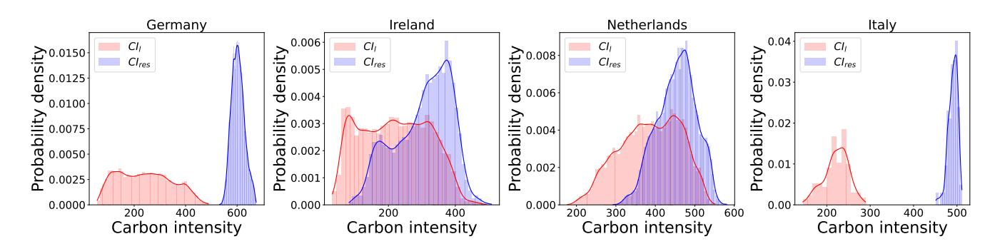
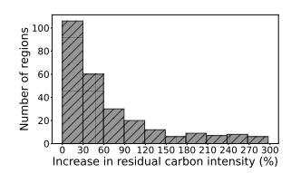
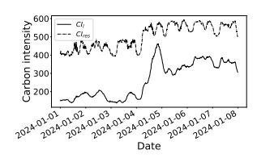
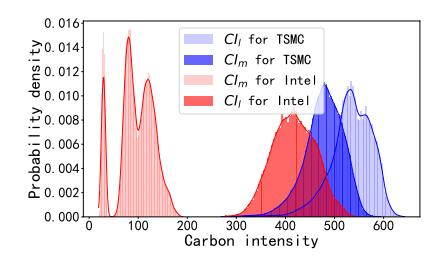
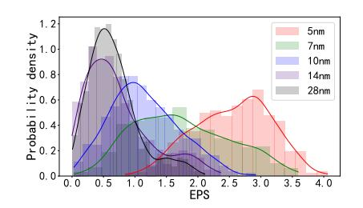
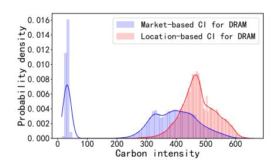
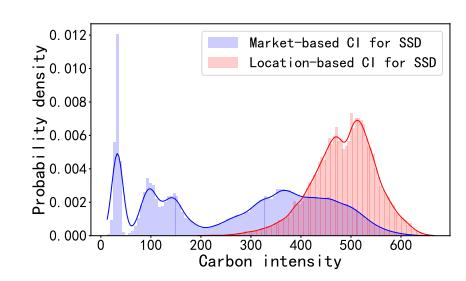
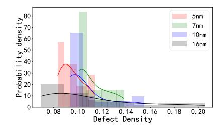
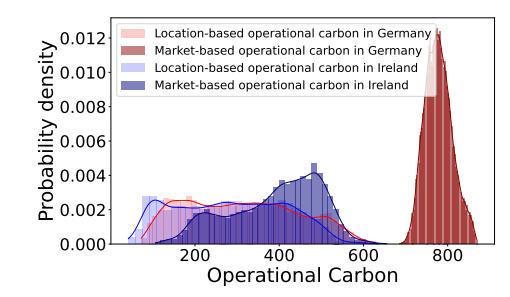
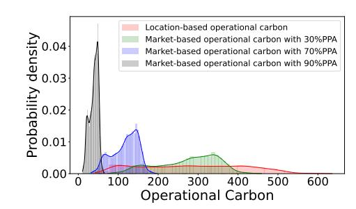

# Fairer AI Carbon Accounting: Incorporating Market-based Attribution and Uncertainty in Embodied and Operational Carbon Footprint

Xiaoyang Zhang Hong Kong Polytechnic University Hong Kong, China xiaoyang.zhang@connect.polyu.hk

Yang Deng Hong Kong Polytechnic University Hong Kong, China yang2.deng@connect.polyu.hk

Fang He Hong Kong Polytechnic University Hong Kong, China fangf.he@connect.polyu.hk

Dan Wang Hong Kong University of Science and Technology Hong Kong, China wangdan@ust.hk

# Abstract

The computational demands of large-scale AI models raise significant concerns about their carbon footprint. Most carbon accounting methods for large-scale AI models suffer from three key limitations: they overlook embodied carbon (from hardware manufacturing) or model it simplistically, rely on location-based carbon attribution that fails to reflect individual corporate efforts to decarbonize (e.g., via Power Purchase Agreements (PPAs)), and are deterministic, ignoring inherent uncertainties. This paper proposes PUMA, a Probabilistic Uncertainty Market Attribution carbon accounting model for large-scale AI models. PUMA integrates market-based carbon intensity to accurately account for the impact of PPAs and employs probabilistic modeling to capture uncertainties in the carbon accounting for AI models arising from spatiotemporal variations in manufacturing and operation, as well as evolving efficiency. We make an effort to develop a comprehensive carbon dataset by aggregating related data from diverse sources, and then we implement a simple yet effective Kernel Density Estimate (KDE) on the distribution of the parameters from the collected dataset. We compare PUMA with LLMCarbon, the state-of-the-art carbon accounting model for large AI models. The deviation of the accounting result is significant, reaching up to around 201%.

### CCS Concepts

• Social and professional topics → Sustainability; • Computing methodologies → Artificial intelligence.

# Keywords

Carbon Accounting, Large AI model, Sustainable Computing

### ACM Reference Format:

Xiaoyang Zhang, Yang Deng, Fang He, and Dan Wang. 2026. Fairer AI Carbon Accounting: Incorporating Market-based Attribution and Uncertainty in Embodied and Operational Carbon Footprint. In Proceedings of the ACM Web

[This work is licensed under a Creative Commons Attribution 4.0 International License.](https://creativecommons.org/licenses/by/4.0) WWW '26, Dubai, United Arab Emirates © 2026 Copyright held by the owner/author(s). ACM ISBN 979-8-4007-2307-0/2026/04 <https://doi.org/10.1145/3774904.3793002>

Conference 2026 (WWW '26), April 13–17, 2026, Dubai, United Arab Emirates. ACM, New York, NY, USA, [9](#page-8-0) pages.<https://doi.org/10.1145/3774904.3793002>

# 1 Introduction

Large-scale AI models have shown remarkable effectiveness in diverse applications (e.g., video [\[30\]](#page-8-1), speech [\[43,](#page-8-2) [44\]](#page-8-3), recommender system [\[14\]](#page-8-4), etc.). However, the increasing scale of model parameters and training data sharply raises computational demand, resulting in considerable carbon footprints. In alignment with the United Nations' Sustainable Development Goals, the AI community is increasingly focusing on social good [\[24\]](#page-8-5), particularly on decarbonizing society [\[12,](#page-8-6) [42\]](#page-8-7).

Carbon accounting, which quantifies a product's carbon footprint, is essential for assessing environmental impacts and guiding carbon reduction strategies. This quantification process enables organizations to establish emission reduction targets, ensure regulatory compliance, and showcase their dedication to sustainability. For large-scale AI models, the total footprint includes two components: operational carbon arising from electricity use during the operation of AI models, and embodied carbon associated with the manufacture of AI hardware that runs the AI models.

Although recent studies have begun to quantify the carbon footprint of large-scale AI models [\[16,](#page-8-8) [42\]](#page-8-7), most methods have three key limitations. First, they emphasize operational emissions while omitting embodied emissions or modeling them with oversimplified assumptions. In particular, many approaches apply coarse, class-level averages from Life Cycle Assessment (LCA) reports to represent embodied carbon. As power grids decarbonize and data centers procure carbon-free energy, operational carbon is likely to fall, implying that embodied emissions will account for an increasing share of the total footprint of large-scale AI models. Second, current methods all rely on location-based carbon attribution, which assigns a uniform, grid-average carbon intensity to all electricity consumers within the grid. They fundamentally fail to account for individual corporate efforts to decarbonize, such as investments in renewable energy via Power Purchase Agreements (PPAs). These approaches overestimate the carbon footprint of the AI model run by the entities that invest in renewables via PPAs. Conversely, they underestimate the carbon of the AI models that run by the entities

without PPAs. This underestimation occurs because the locationbased method fails to account for the residual grid mix, which is the energy sources mix remaining after PPA-contracted renewable energy is subtracted. As renewable energy procurement through PPAs increases, the residual grid becomes more carbon-intensive, leading to a growing disparity between the location-based average and the actual carbon intensity applicable to non-purchasers. Third, existing carbon models for AI are deterministic and thus fail to represent inherent uncertainty in the carbon footprint of large-scale AI models. Key sources of uncertainty include: (1) geotemporal manufacturing variability: a hardware product instance can be fabricated in diverse time periods and from different regions, resulting in different embodied carbon, due to the spatial-temporal dynamics in the carbon intensity of electricity consumed in the manufacturing process; (2) dynamic manufacturing evolution: annual PPAs volume changes, yield and energy efficiency improvement across time will affect the embodied carbon; (3) dynamic operating context: the operational carbon of AI models can vary significantly depending on when and where the operation occurs as the carbon intensity of electricity varies in the spatial-temporal dimension.

This paper proposes PUMA, a Probabilistic Uncertainty Market Attribution carbon accounting model for large-scale AI models. PUMA is designed to capture the effects of Power Purchase Agreements (PPAs) and generate probabilistic carbon accounting outcomes. Specifically, we introduce the market-based carbon intensity to integrate PPAs into the carbon footprint accounting of largescale AI models. Then, we develop parameter models for individual hardware components, such as processors, memory, and storage, that contribute to the AI models' embodied carbon. To estimate the parameter distributions, a comprehensive hardware and electricity dataset is constructed by integrating information from multiple sources. These include Environmental, Social, and Governance (ESG) reports from hardware suppliers, statistical data from grid operators, industry analyses, and peer-reviewed literature, as summarized in Table [1.](#page-5-0) A straightforward yet efficient distribution modeling approach is employed: collected data are first converted into frequency histograms and subsequently processed using Kernel Density Estimation (KDE) to derive continuous probability density functions for the parameters.

We evaluate the performance of PUMA against LLMCarbon, the state-of-the-art carbon accounting approach for large-scale AI models. The evaluation is performed based on four representative large AI models (XLM, T5, GPT-3, and Switch) [\[29,](#page-8-9) [42\]](#page-8-7). We compare the performance at key distribution percentiles (minimum, 20th, 50th, 80th, and maximum) of PUMA's probabilistic outputs against LLMcarbon. The results show that the deviations are significant, reaching up to around 145% for the embodied carbon and around 201% for the operational carbon, which highlight the critical importance of uncertainty-aware modeling for the carbon footprint of large-scale AI models.

Our contributions are summarized as follows:

- We propose a new uncertainty-aware carbon accounting model with market-based attribution for large AI models. This model produces distribution-based estimates of carbon footprint rather than point estimates, enabling AI company to incorporate risk assessment into sustainability decisions.

- We formalize and integrate market-based carbon attribution into AI carbon accounting, moving beyond the conventional location-based method. This allows for a more accurate reflection of an AI company's individual renewable energy investments (via PPAs).
- We make an effort to develop a comprehensive carbon dataset comprising PPA data, and AI hardware-related parameters across multiple technology nodes, drawing on diverse sources including technology reports, ESG and LCA reports, as well as real-world electricity residual carbon intensity data from 30 regional grid operators.

### 2 Background

### 2.1 Large-scale AI Model Carbon Footprint.

The carbon footprint of large-scale AI models includes two categories: operational carbon and embodied carbon. Operational carbon is from the electricity consumed during model deployment. Deploying a large-scale AI model demands not only considerable electricity but also significant computational hardware, such as high-performance GPUs (e.g., NVIDIA A100 [\[28\]](#page-8-10)) and storage. Embodied carbon is the emissions produced during the manufacturing of the hardware required to run these AI models. The processors supporting large-scale AI models are often fabricated using cuttingedge semiconductor processes (such as 5nm technology), which contribute substantially to the embodied carbon of AI models. As the share of renewable energy in power grids increases and more data centers transition to carbon-neutral power sources, the operational carbon emissions from running AI models are expected to decrease. Consequently, the embodied carbon will represent a growing share of AI models' total carbon footprint [\[18,](#page-8-11) [46\]](#page-8-12).

# 2.2 Carbon Attribution

To reduce carbon footprint, some companies are shifting electricity use to regions or periods with low grid carbon intensity, while many companies are investing in renewable energy via PPAs. PPAs are usually long-term contracts for renewable energy between a consumer and an electricity producer, wherein the consumer can claim renewable energy credits for their investment and lower the emissions caused by the electricity they consume. Under the Scope 2 GHG Protocol guidance [\[1\]](#page-8-13), carbon attribution to consumers can follow two distinct approaches, depending on how renewable generation and the underlying grid mix are allocated. The locationbased carbon attribution assigns an identical electricity mix to all consumers within a defined geographic area. Under this approach, green energy is credited to the grid as a whole, and the carbon intensity is calculated based on the average emissions of the entire grid mix, incorporating both renewable and non-renewable sources in proportion to their actual generation. Importantly, this method does not account for individual green energy investments made by specific consumers. Instead, any renewable energy contributions are shared collectively among all consumers in the region. The market-based carbon attribution enables consumers who invest in renewable energy to claim the environmental attributes of that electricity and account for lower carbon emissions, even if the physical power they consume comes from the grid, which comprises both

Table 1: The data source of the carbon dataset we developed for PUMA

| Parameter CI �� �� �� PPAs | Carbon carbon Power | Description emission Purchase | Intensity   | data factors Agreements | across   | 256 regions data |           | Unit g/kWh g/kWh % | Source ElectricityMaps Research Industrial | paper reports | [26] [46] [34] ESG reports [27] |
|----------------------------|---------------------|-------------------------------|-------------|-------------------------|----------|------------------|-----------|--------------------|--------------------------------------------|---------------|---------------------------------|
|                            |                     |                               |             |                         |          |                  |           |                    | [21, 22,                                   | 31, 33,       | 40]                             |
| ���� ������                | residual            | carbon                        |             | intensity               |          |                  |           | %                  | Industrial                                 | report        | [2]                             |
| Fabrication                | capacity Global     | wafer                         |             | fabricatioin            | capcity  | by               | regions   | %                  | Industrial                                 | report        | [6]                             |
| Energy                     | effciency Annual    |                               | improvement | of                      | procees  | energy           | effciency | %                  | ESG reports                                | [36,          | 37, 39]                         |
| EPG                        |                     | Electricity                   | consumed    | per                     | GB       |                  |           | kWh/GB             | LCA reports                                | [20,          | 32]                             |
| Die size                   | GPUs                | and                           | CPUs        |                         |          |                  |           | mm2                | Industrial                                 | reports       | [35]                            |
| Process nodes              | GPUs                | and                           | CPUs        |                         |          |                  |           | nm                 | Industrial                                 | reports       | [35]                            |
| Defect density             | Defect              | density                       | trend       | across                  | time     |                  |           | %                  | Industrial                                 | reports       | [4]                             |
| EPS                        |                     | Electricity                   | consumed    | per                     | die      | Size             |           | kWh/cm2            | Research                                   | paper         | [8, 18, 46]                     |
| GPS                        | Emission            | from                          | Gas         | per                     | die Size |                  |           | g/cm2              | Research                                   | paper         | [18, 46]                        |
| MPS                        | Emission            | from                          |             | Material                | used     | per die Size     |           | g/cm2              | Industrial                                 | reports       | [9]                             |
| BD                         | Bit                 | density                       |             |                         |          |                  |           | GB/cm2             | Industrial                                 | reports       | [11]                            |

Table 2: The comparison between PUMA and LLMCarbon on embodied carbon accounting.

| Hardware Die size/Unit CPU 1.47 cm2 GPU 8.15 cm2 Storage 32TB Memory 256GB Component Model | Hardware Accounting Embodied Min. | information result Carbon 20th | Number 512 64 64 64 (kg) at Median | 10nm each 80th | Technology 12nm 16nm SSD ddr4 Percentile Max. |
|--------------------------------------------------------------------------------------------|-----------------------------------|--------------------------------|------------------------------------|----------------|-----------------------------------------------|
| PUMA                                                                                       | 138.60                            | 179.43                         | 238.37                             | 295.40         | 498.11                                        |
| LLMCarbon Total                                                                            |                                   |                                | 271.01                             |                |                                               |
| Deviation                                                                                  | 132.41                            | 91.58                          | 32.64                              | 24.39          | 227.10                                        |
| Deviation (%)                                                                              | 48.86%                            | 33.79%                         | 12.05%                             | 9.00%          | 83.80%                                        |
| PUMA                                                                                       | 0.97                              | 1.27                           | 1.48                               | 1.81           | 2.84                                          |
| LLMCarbon CPU                                                                              |                                   |                                | 1.16                               |                |                                               |
| Deviation                                                                                  | 0.19                              | 0.11                           | 0.32                               | 0.65           | 1.68                                          |
| Deviation (%)                                                                              | 16.22%                            | 9.76%                          | 27.84%                             | 56.29%         | 145.08%                                       |
| PUMA                                                                                       | 83.67                             | 111.15                         | 133.50                             | 168.88         | 329.2                                         |
| LLMCarbon GPU                                                                              |                                   |                                | 138.39                             |                |                                               |
| Deviation                                                                                  | 54.72                             | 27.24                          | 4.89                               | 30.49          | 190.76                                        |
| Deviation (%)                                                                              | 39.54%                            | 19.68%                         | 3.53%                              | 22.03%         | 137.85%                                       |
| PUMA                                                                                       | 5.43                              | 5.83                           | 8.54                               | 10.73          | 18.27                                         |
| LLMCarbon Memory                                                                           |                                   |                                | 10.53                              |                |                                               |
| Deviation                                                                                  | 5.10                              | 4.70                           | 1.99                               | 0.20           | 7.74                                          |
| Deviation (%)                                                                              | 48.40%                            | 44.65%                         | 18.88%                             | 1.89%          | 73.52%                                        |
| PUMA                                                                                       | 48.22                             | 61.14                          | 94.84                              | 113.98         | 147.88                                        |
| LLMCarbon Storage                                                                          |                                   |                                | 120.94                             |                |                                               |
| Deviation                                                                                  | 72.72                             | 59.80                          | 26.10                              | 6.96           | 26.94                                         |
| Deviation (%)                                                                              | 60.13%                            | 49.45%                         | 21.58%                             | 5.75%          | 22.27%                                        |

accounting of computer systems. Our evaluation is based on the publicly available training data from four representative models: XLM, T5, GPT-3, and Switch [\[29,](#page-8-9) [42\]](#page-8-7). Evaluation is conducted by comparing PUMA's probabilistic outputs with LLMCarbon at major distribution percentiles (min., 20th, 50th, 80th, and max.) based on the collected carbon dataset.

# 4.1 Embodied Carbon Evaluation

We evaluate the embodied carbon accounting performance of PUMA and LLMCarbon using the publicly available XLM training data [\[42\]](#page-8-7), which, to our knowledge, represents the only publicly available source disclosing hardware-level embodied carbon data for large-scale AI model training. The setup involves 64 servers (details

in Table [2\)](#page-5-1) used over 20.4 days, with hardware assumed to have a 5-year lifetime [\[42\]](#page-8-7).

As shown in Table [2,](#page-5-1) a marked contrast exists between the single-point deterministic model (LLMCarbon) and the probabilistic PUMA model. LLMCarbon estimate consistently falls within the distribution provided by PUMA. PUMA reveals a much wider potential range, frequently showing that emissions can be over 145% higher at the maximum percentile compared to the LLMCarbon estimate. Significant deviations are also observed at the component level. For GPUs and storage, the dominant sources of uncertainty, PUMA yields a range of 83.67–329.2 t and 48.22–147.88 t, respectively, while LLMCarbon gives a simple average value of 138.39 t and 120.94 t, corresponding to maximum deviations of 137.85% and 60.13%.

We can find that LLMcarbon gives a relatively large estimate in the distribution of total embodied carbon (271.01t vs. 238.37t at the median). The reason behind this phenomenon is that many hardware manufacturers invest in renewables through PPAs, thereby reducing the carbon intensity of their electricity consumption. PUMA can capture this effect on the operational carbon accounting of large-scale AI models, whereas LLMcarbon lacks this capability. Our evaluation also reveals critical limitations in deterministic accounting and emphasizes the need for probabilistic approaches. We recommend that environmental assessments for AI systems report uncertainty intervals to better inform sustainable development practices.

### 4.2 Operation Carbon Evaluation

We compare PUMA with LLMCarbon on the operational carbon accounting for four large-scale AI models, XLM, T5, GPT3, and Switch, using published training details [\[29\]](#page-8-9) as shown in Table [3.](#page-6-0) We evaluate along two dimensions: (i) spatial variation: fixing the training date and varying location across 30 countries based on realworld grid residual energy mix data [\[2\]](#page-8-17); and (ii) temporal variation: fixing location (Germany) while varying time (in 2024). Here, we use real-world residual carbon intensity data from the power grid to study its impact on the carbon footprint accounting of largescale AI models, without considering the investment behavior of individual AI companies in green energy. The impact of individual companies' investment in green energy will be studied in the next section.

Table 3: The comparison between PUMA and LLMCarbon on operational carbon accounting

| AI moodels Training information | Accounting Models | Min.   | 20th.  | Spatial Dimension Median | Operational 80th. | Carbon at Max. | each Min. | Percentile 20th. | (ton) Temporal Median | Dimension 80th. | Max.    |
|---------------------------------|-------------------|--------|--------|--------------------------|-------------------|----------------|-----------|------------------|-----------------------|-----------------|---------|
| Tarinin Day: 20.4;              |                   |        |        |                          |                   |                |           |                  |                       |                 |         |
| PUE: 1.1;Ave. Power: 342 kw;    |                   |        |        |                          |                   |                |           |                  |                       |                 |         |
| Num. of device: 512             |                   |        |        |                          |                   |                |           |                  |                       |                 |         |
|                                 | LLMCarbon         |        |        | 17.63                    |                   |                |           |                  | 20.69                 |                 |         |
| XLM                             | PUMA              | 3.19   | 16.97  | 26.65                    | 36.23             | 53.13          | 7.75      | 20.86            | 30.05                 | 35.74           | 47.93   |
|                                 | Deviation         | 14.44  | 0.66   | 9.02                     | 18.60             | 35.50          | 12.94     | 0.17             | 9.36                  | 15.05           | 27.24   |
|                                 | Deviation (%)     | 81.91% | 3.74%  | 51.16%                   | 105.50%           | 201.36%        | 62.54%    | 0.82%            | 45.24%                | 72.74%          | 131.66% |
| Tarinin Day: 20;                |                   |        |        |                          |                   |                |           |                  |                       |                 |         |
| PUE: 1.12;Ave. Power: 310 kw;   |                   |        |        |                          |                   |                |           |                  |                       |                 |         |
| Num. of device: 512             |                   |        |        |                          |                   |                |           |                  |                       |                 |         |
|                                 | LLMCarbon         |        |        | 15.95                    |                   |                |           |                  | 18.72                 |                 |         |
| T5                              | PUMA              | 2.89   | 15.36  | 24.11                    | 32.78             | 48.08          | 7.01      | 18.87            | 27.19                 | 32.34           | 43.37   |
|                                 | Deviation         | 13.06  | 0.59   | 8.16                     | 16.83             | 32.13          | 11.71     | 0.15             | 8.47                  | 13.62           | 24.65   |
|                                 | Deviation (%)     | 81.88% | 3.70%  | 51.16%                   | 105.52%           | 201.44%        | 62.55%    | 0.80%            | 45.25%                | 72.76%          | 131.68% |
| Tarinin Day: 14.8;              |                   |        |        |                          |                   |                |           |                  |                       |                 |         |
| PUE:1.1;Ave. Power: 330 kw;     |                   |        |        |                          |                   |                |           |                  |                       |                 |         |
| Num. of device:10K              |                   |        |        |                          |                   |                |           |                  |                       |                 |         |
|                                 | LLMCarbon         |        |        | 241.08                   |                   |                |           |                  | 282.90                |                 |         |
| GPT3                            | PUMA              | 43.71  | 232.12 | 364.43                   | 495.37            | 726.53         | 106.01    | 285.26           | 410.95                | 488.71          | 655.38  |
|                                 | Deviation         | 197.37 | 8.96   | 123.35                   | 254.29            | 485.45         | 176.89    | 2.36             | 128.05                | 205.81          | 372.48  |
|                                 | Deviation (%)     | 81.87% | 3.72%  | 51.17%                   | 105.48%           | 201.36%        | 62.53%    | 0.83%            | 45.26%                | 72.75%          | 131.66% |
| Tarinin Day: 27;                |                   |        |        |                          |                   |                |           |                  |                       |                 |         |
| PUE:1.1;Ave. Power: 245 kw;     |                   |        |        |                          |                   |                |           |                  |                       |                 |         |
| Num. of device: 1K              |                   |        |        |                          |                   |                |           |                  |                       |                 |         |
|                                 | LLMCarbon         |        |        | 32.65                    |                   |                |           |                  | 38.31                 |                 |         |
| Switch                          | PUMA              | 5.92   | 31.43  | 49.35                    | 67.09             | 98.40          | 14.35     | 38.63            | 55.65                 | 66.19           | 88.76   |
|                                 | Deviation         | 26.73  | 1.22   | 16.70                    | 34.44             | 65.75          | 23.96     | 0.32             | 17.34                 | 27.88           | 50.45   |
|                                 | Deviation (%)     | 81.87% | 3.74%  | 51.15%                   | 105.48%           | 201.38%        | 62.54%    | 0.84%            | 45.26%                | 72.77%          | 131.69% |

PUMA offers a comprehensive distribution of operational carbon across both spatial and temporal dimensions, whereas LLMCarbon produces only an average single-point estimate. As shown in Table [3,](#page-6-0) the estimates from LLMCarbon exhibit substantial deviations from those of PUMA across all evaluated models and percentiles. These relative deviations are especially pronounced at upper percentiles, frequently surpassing 200% in the spatial dimension and 130% in the temporal dimension. Even at lower percentiles, deviations remain notable, generally approximating 80% spatially and 0% temporally. For example, in the spatial dimension for GPT-3, PUMA yields a range of 43.71t–726.53t across percentiles, while LLMCarbon gives a single value of 241.08t, leading to a relative deviation of around 201% at maximum percentile.

We can find that LLMcarbon always gives a relatively small estimate in the distribution of operational carbon for each large-scale AI mode. The reason behind this phenomenon is that renewable energy in the grid has been contracted out via PPAs, resulting in a higher carbon intensity in the residual electricity. PUMA can capture the effect of PPAs on the operational carbon accounting of large-scale AI models, whereas LLMcarbon lacks this capability.

# 4.3 The Effect of PPAs

In this section, we examine the impact of the investment in green energy via PPAs from an individual organization that operates a large-scale AI model on the carbon accounting for the AI model. Firstly, figure [9](#page-6-1) presents the operational carbon distribution of GPT-3 training by a company without investing in green energy via PPAs in Germany or the Netherlands in 2024. It can be observed that the difference between location-based and market-based emissions remains significant. For instance, the median differs by 152.89% (307.04 kg vs. 776.49 kg) in Germany and 45.45% (282.51 kg vs. 410.91 kg) in the Netherlands. We can observe that the residual carbon intensity has a more significant effect on the operational carbon of GPT-3 when it is trained in Germany. The reason behind this is that the green energy is 100% contracted out in the German power grid in 2024 (vs. 55% in the Netherlands).

Figure [10](#page-6-2) presents the operational carbon emissions from GPT-3 training within the Netherlands grid under the scenario where the AI companies with different sustainable actions (i.e, investments in green energy via PPAs with varying percentages). A substantial

Figure 9: The distribution of operation carbon over PPAs excluded.

Figure 10: The distribution of operation carbon over PPAs.

discrepancy exists between location-based and market-based carbon accounting methods. For example, at 90% PPA coverage, the location-based median can be over six times the market-based value (282.51 kg vs. 41.09 kg). The results show that operational carbon emissions decrease as the share of PPAs increases, suggesting that investing in renewable energy via PPAs can effectively reduce the carbon footprint of AI models, and PUMA can capture this effect on the carbon accounting for AI models.

# 5 Insights and Potential Use Case for PUMA

The development and evaluation of PUMA reveal several critical insights into carbon accounting for large-scale AI models and open up a range of practical applications for stakeholders across the AI ecosystem.

### 5.1 Key Insights

The Impact of Market-Based Attribution: Our results highlight the significant influence of corporate renewable energy investments, particularly through PPAs, on carbon accounting. The locationbased method, which ignores such investments, systematically misrepresents the carbon footprint of both green and non-green energy consumers. PUMA's market-based approach not only rewards decarbonization efforts but also exposes the growing carbon intensity of residual grids, offering a more equitable and accurate accounting framework.

Uncertainty-aware Accounting: PUMA demonstrates that uncertainty is not merely a statistical nuance but a central feature of carbon accounting in the large-scale AI models. The significant deviations (up to 251.58% in embodied carbon and 138.76% in operational carbon) between probabilistic and deterministic models underscore the risk of relying on point estimates. By providing distributional outputs, PUMA enables AI developers and operators to quantify and communicate the variability and reliability of their carbon footprints, facilitating more robust sustainability planning and risk management.

Embodied Carbon Cannot Be Ignored: As operational carbon decreases due to grid decarbonization and efficiency gains, embodied carbon becomes an increasingly dominant component of the total footprint. PUMA's detailed modeling of hardware components, processors, memory, and storage shows that embodied emissions are subject to significant spatial, temporal, and technological uncertainties. Ignoring these factors, as current methods often do, leads to incomplete and potentially misleading environmental assessments.

## 5.2 Potential Use Cases

AI Company Sustainability Strategy: PUMA can help AI companies make informed decisions regarding hardware procurement, energy sourcing, and operational scheduling. By simulating different PPA scenarios and hardware choices under uncertainty, companies can optimize their carbon budgets, set risk-aware targets, and report sustainability metrics with confidence intervals, enhancing transparency and credibility.

Policy and Regulation Support: Regulators and standardsetting bodies can use PUMA as a benchmark for developing more nuanced carbon accounting guidelines for the AI industry. The model's ability to differentiate between market-based and locationbased emissions can inform policies that incentivize renewable energy investments and penalize carbon-intensive operations.

Green AI Model Development: Researchers and engineers can integrate PUMA into the AI development lifecycle to evaluate the environmental impact of training scheduling and deployment options. By incorporating carbon awareness early in the design process, the community can foster the creation of lower-carbon AI systems.

Third-Party Auditing and Certification: PUMA's transparent sources and probabilistic framework provide a foundation for independent verification and certification of AI carbon footprints. Auditors can use the tool to validate corporate sustainability claims and issue certifications that reflect both average emissions and associated uncertainties.

Investment and ESG Reporting for AI company: Investors and stakeholders increasingly demand accurate environmental performance data. PUMA enables AI companies to report carbon footprints in a manner that reflects their actual renewable energy investment and operational contexts, supporting better ESG ratings and more aligned investment decisions.

### 6 Related Work

Current carbon accounting methods for AI models primarily focus on operational emissions, calculated as the product of electricity consumption and grid carbon intensity. Most of the existing literature is dedicated to tracking or estimating electricity consumed. Several studies have introduced software-based tools to monitor CPU/GPU power consumption in real-time during model training or inference [\[5,](#page-8-41) [10,](#page-8-42) [17,](#page-8-43) [19\]](#page-8-44), while others estimate energy use based on hardware specifications such as thermal design power [\[23\]](#page-8-45). Yet these frameworks consistently overlook the embodied carbon emissions originating from AI hardware infrastructure, which represent a significant portion of the total footprint, especially as grids decarbonize and data centers adopt more renewable energy. For embodied carbon, current methods like SustainableAI [\[42\]](#page-8-7) rely on coarse-grained manufacturer-reported average emission factors for hardware components. LLMCarbon [\[16\]](#page-8-8) employs a deterministic parametric model for processors while using averaged data from ESG reports for memory and storage devices. Yet these approaches are deterministic and location-based, neglecting the role of PPAs and the inherent uncertainty in the carbon footprint of large AI models. PCAM [\[45\]](#page-8-46) proposes a probabilistic carbon accounting model to quantify the uncertainties of the carbon footprints of large AI models. Yet PCAM is also location-based and neglects the uncertainty associated with PPAs in power grids. The effect of PPAs on carbon accounting for AI models is further demonstrated in Section [4.3](#page-6-3) by comparing the accounting results from the market-based approach (PUMA) and location-based approach (PCAM).

### 7 Conclusion

In this paper, we propose PUMA, an uncertainty-aware carbon accounting model with market-based attribution for large-scale AI models. PUMA integrates PPAs into the accounting process and can capture the uncertainty in both operational and embodied carbon. Our evaluation revealed significant deviations up to 251.58% for embodied carbon and 138.76% for operational carbon, between PUMA's probabilistic outputs and the deterministic estimates of LLMCarbon. This highlights the critical limitations of existing location-based methods and underscores the necessity of uncertainty modeling. PUMA provides a more realistic and equitable accounting framework by: formally integrating market-based carbon intensity to reward decarbonization efforts and employing probabilistic modeling to capture spatiotemporal and technological uncertainties. By enabling risk-aware decisions and transparent reporting, PUMA supports the development of sustainable AI practices.

### Acknowledgments

Dan Wang's work is supported in part by RGC GRF 15201322, 15230624, 15239925, CRF C5020-25GF, ITC ITS/052/23MX, and PolyU 1-CDKK, G-SAC8, K-ZYAP, HKUST Start up fund R9117.

### References

[1] United Satets Environmental Protection Agency. 2021. Greenhouse Gas Protocol: Scope 2 Guidance. [https://ghgprotocol.org/scope-2-guidance.](https://ghgprotocol.org/scope-2-guidance) [2] AIB. 2024. European Residual Mixes. [https://www.aib-net.org/facts/european](https://www.aib-net.org/facts/european-residual-mix/2024)[residual-mix/2024.](https://www.aib-net.org/facts/european-residual-mix/2024) [3] Husam Alissa, Teresa Nick, Ashish Raniwala, Alberto Arribas Herranz, Kali Frost, Ioannis Manousakis, Kari Lio, Brijesh Warrier, Vaidehi Oruganti, TJ DiCaprio, et al. 2025. Using life cycle assessment to drive innovation for sustainable cool clouds. Nature (2025), 1–8. [4] Anandtech. 2020. better yield on 5nm than 7nm tsmc update on defect rates for n5. [https://www.anandtech.com/show/16028.](https://www.anandtech.com/show/16028) [5] Lasse F Wolff Anthony, Benjamin Kanding, and Raghavendra Selvan. 2020. Carbontracker: Tracking and predicting the carbon footprint of training deep learning models. arXiv preprint arXiv:2007.03051 (2020). [6] SIA BCG. 2024. EMERGING RESILIENCE IN THE SEMICONDUCTOR SUPPLY CHAIN. [https://www.semiconductors.org/wp-content/uploads/2024/05/Report\\_](https://www.semiconductors.org/wp-content/uploads/2024/05/Report_Emerging-Resilience-in-the-Semiconductor-Supply-Chain.pdf) [Emerging-Resilience-in-the-Semiconductor-Supply-Chain.pdf.](https://www.semiconductors.org/wp-content/uploads/2024/05/Report_Emerging-Resilience-in-the-Semiconductor-Supply-Chain.pdf) [7] Anvita Bhagavathula, Leo Han, and Udit Gupta. 2024. Understanding the Implications of Uncertainty in Embodied Carbon Models for Sustainable Computing. In HotCarbon. [8] L Boakes, M Garcia Bardon, V Schellekens, IY Liu, B Vanhouche, G Mirabelli, F Sebaai, L Van Winckel, E Gallagher, C Rolin, et al. 2023. Cradle-to-gate Life Cycle Assessment of CMOS Logic Technologies. In 2023 International Electron Devices Meeting (IEDM). IEEE, 1–4. [9] Sarah B Boyd. 2011. Life-cycle assessment of semiconductors. Springer Science & Business Media. [10] Semen Andreevich Budennyy, Vladimir Dmitrievich Lazarev, Nikita Nikolaevich Zakharenko, Aleksei N Korovin, OA Plosskaya, Denis Valer'evich Dimitrov, VS Akhripkin, IV Pavlov, Ivan Valer'evich Oseledets, Ivan Segundovich Barsola, et al. 2022. Eco2ai: carbon emissions tracking of machine learning models as the first step towards sustainable ai. In Doklady Mathematics, Vol. 106. Springer, S118–S128. [11] Jeongdong Choe. 2017. XPoint Memory Comparison Process Architecture. [https://www.flashmemorysummit.com/English/Collaterals/Proceedings/](https://www.flashmemorysummit.com/English/Collaterals/Proceedings/2017/20170808_FR12_Choe.pdf) [2017/20170808\\_FR12\\_Choe.pdf.](https://www.flashmemorysummit.com/English/Collaterals/Proceedings/2017/20170808_FR12_Choe.pdf) [12] Paolo Cornale, Michele Tizzani, Fabio Ciulla, Kyriaki Kalimeri, Elisa Omodei, Daniela Paolotti, and Yelena Mejova. 2025. The role of science in the climate change discussions on Reddit. PLoS Climate 4, 5 (2025), e0000541. [13] Ian Cutress. 2020. Better yield on 5nm than 7nm: TSMC update on defect rates for N5. [https://www.anandtech.com/show/16028/.](https://www.anandtech.com/show/16028/) [14] Yicheng Di, Xiaoming Wang, Hongjian Shi, Chongsheng Fan, Rong Zhou, Ruhui Ma, and Yuan Liu. 2025. Personalized consumer federated recommender system using fine-grained transformation and hybrid information sharing. IEEE Transactions on Consumer Electronics (2025). [15] EESemi. 2005. Test yield model. [https://www.eesemi.com/test-yield-models.htm.](https://www.eesemi.com/test-yield-models.htm) [16] Ahmad Faiz, Sotaro Kaneda, Ruhan Wang, Rita Osi, Prateek Sharma, Fan Chen, and Lei Jiang. 2024. LLMCARBON: MODELING THE END-TO-END CARBON FOOTPRINT OF LARGE LANGUAGE MODELS. In The Twelfth International Conference on Learning Representations. ICLR. [17] Zhenxiao Fu, Fan Chen, Shan Zhou, Haitong Li, and Lei Jiang. 2025. Llmco2: Advancing accurate carbon footprint prediction for llm inferences. ACM SIGENERGY Energy Informatics Review 5, 2 (2025), 63–68. [18] Udit Gupta, Mariam Elgamal, Gage Hills, Gu-Yeon Wei, Hsien-Hsin S Lee, David Brooks, and Carole-Jean Wu. 2022. ACT: Designing sustainable computer systems with an architectural carbon modeling tool. In Proceedings of the 49th Annual International Symposium on Computer Architecture. 784–799. [19] Peter Henderson, Jieru Hu, Joshua Romoff, Emma Brunskill, Dan Jurafsky, and Joelle Pineau. 2020. Towards the systematic reporting of the energy and carbon footprints of machine learning. Journal of Machine Learning Research 21, 248 (2020), 1–43. [20] SK Hynix. 2021. Sustainability Report. [https://www.skhynix.com/sustainability/](https://www.skhynix.com/sustainability/UI-FR-SA1601/) [UI-FR-SA1601/.](https://www.skhynix.com/sustainability/UI-FR-SA1601/) [21] SK hynix. 2025. SK hynix ESG reports. [https://www.skhynix.com/sustainability/](https://www.skhynix.com/sustainability/UI-FR-SA1601/) [UI-FR-SA1601/.](https://www.skhynix.com/sustainability/UI-FR-SA1601/) [22] Kioxia. 2024. Kioxia ESG reports. [https://www.kioxia-holdings.com/content/](https://www.kioxia-holdings.com/content/dam/kioxia-hd/en-jp/sustainability/asset/2024-Sustainability-KIOXIA-EN.pdf) [dam/kioxia-hd/en-jp/sustainability/asset/2024-Sustainability-KIOXIA-EN.pdf.](https://www.kioxia-holdings.com/content/dam/kioxia-hd/en-jp/sustainability/asset/2024-Sustainability-KIOXIA-EN.pdf) [23] Loïc Lannelongue, Jason Grealey, and Michael Inouye. 2021. Green algorithms: quantifying the carbon footprint of computation. Advanced science 8, 12 (2021), 2100707. [24] Zhixiang Lu, Yulong Li, Feilong Tang, Zhengyong Jiang, Chong Li, Mian Zhou, Tenglong Li, and Jionglong Su. 2025. DeepGB-TB: A Risk-Balanced Cross-Attention Gradient-Boosted Convolutional Network for Rapid, Interpretable Tuberculosis Screening. arXiv preprint arXiv:2508.02741 (2025). [25] Diptyaroop Maji, Noman Bashir, David Irwin, Prashant Shenoy, and Ramesh K Sitaraman. 2024. Untangling carbon-free energy attribution and carbon intensity estimation for carbon-aware computing. In Proceedings of the 15th ACM International Conference on Future and Sustainable Energy Systems. 580–588. [26] Electricity Maps. 2025. Carbon intensity of power grids. [https://app.](https://app.electricitymaps.com/) [electricitymaps.com/.](https://app.electricitymaps.com/) [27] Micron. 2025. Micron ESG reports. [https://www.micron.com/about/](https://www.micron.com/about/sustainability) [sustainability.](https://www.micron.com/about/sustainability) [28] Nvidia. 2024. NVIDIA A100 Tensor Core GPU. [https://www.nvidia.com/en-us/data](https://www.nvidia.com/en-us/data-center/a100/)[center/a100/.](https://www.nvidia.com/en-us/data-center/a100/) [29] D Patterson, J Gonzalez, Q Le, C Liang, LM Munguia, D Rothchild, D So, M Texier, and J Dean. 2021. Carbon emissions and large neural network training. arXiv 2021. arXiv preprint arXiv:2104.10350 (2021). [30] Yuriel Ryan, Rui Yang Tan, Kenny Tsu Wei Choo, and Roy Ka-Wei Lee. 2025. Humor in Pixels: Benchmarking Large Multimodal Models Understanding of Online Comics. In Findings of the Association for Computational Linguistics: EMNLP 2025. 14024–14050. [31] Samsung. 2025. Samsung ESG reports. [https://samsungbiologics.com/](https://samsungbiologics.com/sustainability/esg-report) [sustainability/esg-report.](https://samsungbiologics.com/sustainability/esg-report) [32] SEAGATE. 2024. LCA Product Reports by SEAGATE. [https://www.seagate.com/](https://www.seagate.com/esg/planet/product-sustainability/) [esg/planet/product-sustainability/.](https://www.seagate.com/esg/planet/product-sustainability/) [33] Seagate. 2024. Seagate ESG reports. [https://www.seagate.com/content/dam/](https://www.seagate.com/content/dam/seagate/assets/esg/resources/files/seagate_fy2024_esg_performance_report_pages_521.pdf) [seagate/assets/esg/resources/files/seagate\\_fy2024\\_esg\\_performance\\_report\\_](https://www.seagate.com/content/dam/seagate/assets/esg/resources/files/seagate_fy2024_esg_performance_report_pages_521.pdf) [pages\\_521.pdf.](https://www.seagate.com/content/dam/seagate/assets/esg/resources/files/seagate_fy2024_esg_performance_report_pages_521.pdf) [34] statista. 2025. Intel renewable energy purchase. [https://www.statista.com/](https://www.statista.com/statistics/1200881/intel-renewable-energy-purchase-share-of-electricity-use-worldwide/) [statistics/1200881/intel-renewable-energy-purchase-share-of-electricity-use](https://www.statista.com/statistics/1200881/intel-renewable-energy-purchase-share-of-electricity-use-worldwide/)[worldwide/.](https://www.statista.com/statistics/1200881/intel-renewable-energy-purchase-share-of-electricity-use-worldwide/) [35] Techpowerup. 2024. GPU and CPU specs database. [https://www.techpowerup.](https://www.techpowerup.com/gpu-specs/) [com/gpu-specs/.](https://www.techpowerup.com/gpu-specs/) [36] TSMC. 2021. ESG Reports by TSMC. [https://esg.tsmc.com/en-US/file/public/e](https://esg.tsmc.com/en-US/file/public/e-all_110.pdf)[all\\_110.pdf.](https://esg.tsmc.com/en-US/file/public/e-all_110.pdf) [37] TSMC. 2022. ESG Reports by TSMC. [https://esg.tsmc.com/en-US/file/public/e](https://esg.tsmc.com/en-US/file/public/e-all_2022.pdf)[all\\_2022.pdf.](https://esg.tsmc.com/en-US/file/public/e-all_2022.pdf) [38] TSMC. 2023. ESG Reports by TSMC. [https://esg.tsmc.com/en-US/resources/ESG](https://esg.tsmc.com/en-US/resources/ESG-data-hub?tab=reportbuilder)[data-hub?tab=reportbuilder.](https://esg.tsmc.com/en-US/resources/ESG-data-hub?tab=reportbuilder) [39] TSMC. 2023. ESG Reports by TSMC. [https://esg.tsmc.com/en-US/resources/ESG](https://esg.tsmc.com/en-US/resources/ESG-data-hub?tab=reportbuilder)[data-hub?tab=reportbuilder.](https://esg.tsmc.com/en-US/resources/ESG-data-hub?tab=reportbuilder) [40] TSMC. 2024. TSMC ESG reports. [https://esg.tsmc.com/en-US/file/public/2024-](https://esg.tsmc.com/en-US/file/public/2024-TSMC-Sustainability-Report-e.pdf) [TSMC-Sustainability-Report-e.pdf.](https://esg.tsmc.com/en-US/file/public/2024-TSMC-Sustainability-Report-e.pdf) [41] Jake Vanderplas. 2024. Density Estimation-scikit-learn.org. [https://scikit-learn.](https://scikit-learn.org/stable/modules/density.html) [org/stable/modules/density.html.](https://scikit-learn.org/stable/modules/density.html) [42] Carole-Jean Wu, Ramya Raghavendra, Udit Gupta, Bilge Acun, Newsha Ardalani, Kiwan Maeng, Gloria Chang, Fiona Aga, Jinshi Huang, Charles Bai, et al. 2022. Sustainable ai: Environmental implications, challenges and opportunities. Proceedings of Machine Learning and Systems 4 (2022), 795–813. [43] Sicheng Yang, Zhiyong Wu, Minglei Li, Zhensong Zhang, Lei Hao, Weihong Bao, Ming Cheng, and Long Xiao. 2023. Diffusestylegesture: Stylized audio-driven cospeech gesture generation with diffusion models. arXiv preprint arXiv:2305.04919 (2023). [44] Sicheng Yang, Zunnan Xu, Haiwei Xue, Yongkang Cheng, Shaoli Huang, Mingming Gong, and Zhiyong Wu. 2024. Freetalker: Controllable speech and textdriven gesture generation based on diffusion models for enhanced speaker naturalness. In ICASSP 2024-2024 IEEE International Conference on Acoustics, Speech and Signal Processing (ICASSP). IEEE, 7945–7949. [45] Xiaoyang Zhang, He Fang, Yang Deng, and Dan Wang. 2025. Unveiling the Uncertainty in Embodied and Operational Carbon of Large AI Models through a Probabilistic Carbon Accounting Model. In The Thirty-ninth Annual Conference on Neural Information Processing Systems. [46] Xiaoyang Zhang, Yijie Yang, and Dan Wang. 2024. Spatial-Temporal Embodied Carbon Models for the Embodied Carbon Accounting of Computer Systems. In Proceedings of the 15th ACM International Conference on Future and Sustainable Energy Systems. 464–471.