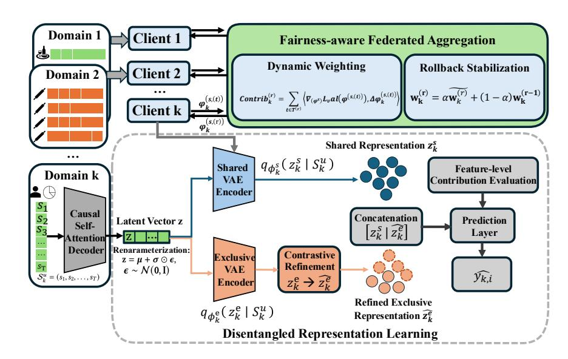
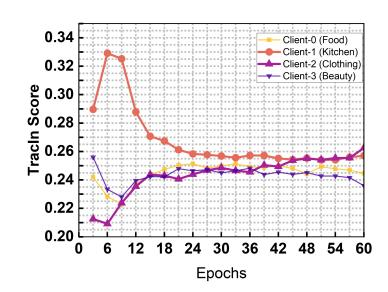

# FairFRL: Fairness-aware Federated Representation Learning for Cross-domain Sequential Recommendation

[Tao Tang](https://orcid.org/0000-0001-7356-7196) Zhejiang University of Technology Hangzhou, China Zhejiang Key Laboratory of Visual Information Intelligent Processing Hangzhou, China tao.tang@ieee.org

[Mujie Liu](https://orcid.org/0009-0002-0879-7168) Federation University Australia Institute of Innovation, Science and Sustainability Ballarat, Australia mujie.liu@ieee.org

[Botao Liu](https://orcid.org/0009-0006-6656-0221) Zhejiang University of Technology Hangzhou, China Zhejiang Key Laboratory of Visual Information Intelligent Processing Hangzhou, China azurlaneumikaze@gmail.com

[Wei Du](https://orcid.org/0009-0000-2861-6622) Xinjiang Rural Commercial Bank Co., Ltd. Urumqi, China duwei@xjrccb.com.cn

[Liping Chen](https://orcid.org/0009-0001-0937-4290) RMIT University Melbourne, Australia lp.chen@ieee.org

[Xinrui Cheng](https://orcid.org/0009-0000-1483-4506) RMIT University Melbourne, Australia S4068072@student.rmit.edu.au

[Jiaxin Du](https://orcid.org/0000-0003-1776-9628) Zhejiang University of Technology Hangzhou, China Zhejiang Key Laboratory of Visual Information Intelligent Processing Hangzhou, China dujiaxin@zjut.edu.cn

[Xiangjie Kong](https://orcid.org/0000-0003-2698-3319)∗ Zhejiang University of Technology Hangzhou, China Zhejiang Key Laboratory of Visual Information Intelligent Processing Hangzhou, China xjkong@ieee.org

# Abstract

Cross-domain sequential recommendation is increasingly important in modern Web ecosystems, where user behaviors span multiple independently operated services that maintain strict data isolation for privacy and regulatory compliance. Federated learning offers a practical paradigm for such cross-domain collaboration, but user preferences evolve asynchronously across services, creating a substantial distribution shift. This drift leads to unstable and unequal domain contributions: behaviorally rich domains dominate global updates, while low-resource or volatile domains exert limited influence. Such an imbalance degrades recommendation accuracy and raises fundamental fairness concerns. To address these challenges, we propose FairFRL, a fairness-aware federated representation learning framework designed to mitigate contribution imbalance under dynamic cross-domain drift. FairFRL mitigates contribution imbalance under dynamic cross-domain drift by jointly regulating domain influence during federated aggregation and disentangling domain-shared and domain-exclusive semantics, while preserving data locality. Experiments on real-world Amazon multi-domain datasets show that FairFRL consistently outperforms strong federated and centralized baselines across multiple metrics

∗Corresponding Author.

© 2026 Copyright held by the owner/author(s). ACM ISBN 979-8-4007-2307-0/2026/04 <https://doi.org/10.1145/3774904.3793003>

and achieves more equitable cross-domain contributions. These results position FairFRL as a principled step toward responsible, fair, and socially aligned Web recommendation systems.

# CCS Concepts

• Information systems → Web applications; • Computing methodologies → Distributed artificial intelligence.

# Keywords

Federated Representation Learning; Cross-domain Sequential Recommendation; Dynamic Bias; Domain-exclusive Modeling; Fairnessaware Aggregation

#### ACM Reference Format:

Tao Tang, Mujie Liu, Botao Liu, Wei Du, Liping Chen, Xinrui Cheng, Jiaxin Du, and Xiangjie Kong. 2026. FairFRL: Fairness-aware Federated Representation Learning for Cross-domain Sequential Recommendation. In Proceedings of the ACM Web Conference 2026 (WWW '26), April 13–17, 2026, Dubai, United Arab Emirates. ACM, New York, NY, USA, [11](#page-10-0) pages. <https://doi.org/10.1145/3774904.3793003>

### 1 Introduction

Cross-domain sequential recommendation (CDSR) extends conventional cross-domain recommendation (CDR) by integrating sequential modeling into cross-domain knowledge transfer. Unlike traditional CDR, which treats user behaviors as independent observations, CDSR captures how preferences evolve across domains over time, enabling richer behavioral understanding and more accurate predictions in the target domain [\[10,](#page-8-0) [26,](#page-8-1) [32\]](#page-8-2). This capability is particularly relevant in modern Web ecosystems, such as

[This work is licensed under a Creative Commons Attribution 4.0 International License.](https://creativecommons.org/licenses/by/4.0) WWW '26, Dubai, United Arab Emirates

e-commerce, short-video platforms, and financial services, where user interactions are naturally distributed across heterogeneous service domains. To support such decentralized environments, recent studies have explored privacy-preserving collaborative learning for CDSR, enabling multiple domains to jointly train models without sharing raw data [\[22,](#page-8-3) [35\]](#page-8-4). Meanwhile, the research landscape has evolved from the classic dual-domain setting to more flexible multidomain and multi-source scenarios [\[11,](#page-8-5) [23,](#page-8-6) [28,](#page-8-7) [30\]](#page-8-8), reflecting the complexity of real-world user engagement across diverse services.

Although CDSR has achieved promising progress, most existing methods implicitly assume relatively stable or partially overlapping domain distributions [\[28,](#page-8-7) [30\]](#page-8-8). However, real-world user behaviors rarely satisfy these assumptions. Users interact with different services under distinct contexts, and their preferences evolve asynchronously across domains, resulting in heterogeneous and constantly shifting interaction patterns [\[21,](#page-8-9) [31\]](#page-8-10). When domain dynamics diverge, representations learned in one domain may fail to transfer to another, and mismatches in interaction characteristics introduce substantial distribution shifts across domains [\[33\]](#page-8-11). In federated or collaborative settings, such a shift directly affects training stability: high-resource domains contribute more frequent and consistent gradients, steering the shared encoder toward their own behavioral patterns, while low-resource domains—whose data distributions fluctuate more dramatically—tend to have suppressed or erratic influence. This imbalance in contribution not only degrades cross-domain generalization but also raises fundamental fairness concerns regarding how heterogeneous domains participate in the shared model.From a Web system perspective, this issue concerns not only predictive performance but also whether heterogeneous

domains are equitably represented during collaborative learning. The contribution imbalance observed in CDSR aligns with fairness challenges in federated learning, where heterogeneous clients influence the global model unequally. Existing fairness-aware federated learning methods, such as minimax optimization [\[15\]](#page-8-12), loss reweighting [\[7\]](#page-8-13), dynamic regularization [\[1\]](#page-8-14), and adaptive aggregation [\[3,](#page-8-15) [4,](#page-8-16) [8\]](#page-8-17), mitigate this issue to some extent. However, these approaches rely on assumptions that do not hold in CDSR. First, they typically assume a shared semantic space, whereas different domains encode distinct behavioral meanings; without separating domain-shared and domain-exclusive factors, dominant domains can overshadow others during joint training. Second, most fairness mechanisms are designed for static or smoothly evolving data, while CDSR exhibits strong temporal contribution drift, causing domain influence to vary as user behaviors evolve. Third, existing approaches regulate aggregation fairness but do not enhance the representational strength of under-resourced or unstable domains, whose semantics remain under-captured even when aggregation weights are adjusted. These limitations indicate the need for a fairness-aware CDSR framework that (i) explicitly disentangles domain-shared and domain-exclusive semantics, (ii) adapts aggregation to time-varying domain contributions, and (iii) strengthens underrepresented domains without introducing additional bias.

In this paper, we present FairFRL, a fairness-aware federated representation learning framework for cross-domain recommendation. FairFRL comprises three components. At its core is a fairness-aware federated knowledge transfer mechanism that adaptively regulates domain contributions and stabilizes aggregation under dynamic

domain drift. This mechanism is supported by (i) a disentangled representation framework that separates transferable and domainspecific semantics, and (ii) a domain-exclusive latent refinement module that strengthens local behavioral representations via variational modeling and contrastive enhancement.

- We identify domain contribution imbalance as a fundamental fairness challenge in federated cross-domain sequential recommendation, arising from heterogeneous and dynamically evolving domain behaviors.
- We propose a fairness-aware federated aggregation mechanism that adaptively regulates domain contributions based on their influence on the shared representation and stabilizes training under temporal drift.
- We develop a disentangled framework with domainexclusive refinement, which separates transferable and domain-specific semantics and strengthens local representations without compromising cross-domain fairness.
- Extensive experiments on Amazon cross-domain datasets demonstrate that FairFRL consistently outperforms strong baselines while achieving more balanced and semantically faithful cross-domain knowledge transfer.

# 2 Related Work

# 2.1 Cross-Domain Sequential Recommendation

CDSR aims to alleviate data sparsity and cold-start issues by transferring user preference knowledge across domains. Early studies primarily focus on dual-domain alignment. Ma et al. [\[14\]](#page-8-18) introduce ��-Net, a parallel information-sharing network that leverages shared-account interaction sequences for bidirectional preference transfer. They further propose MIFN [\[13\]](#page-8-19), which combines behavioral and knowledge transfer to capture richer cross-domain dependencies. To enhance representation quality, subsequent works employ contrastive and graph-based strategies. For instance, Cao et al. [\[2\]](#page-8-20) propose a contrastive infomax framework that jointly models intra- and inter-domain dependencies, while Xu et al. [\[27\]](#page-8-21) develop MGCL, a multi-view graph contrastive model aligning domain-specific views through item transitions and user preference structures.

With increasing privacy concerns, federated learning has been adopted to enable decentralized CDSR without exposing raw behavioral logs. Ivannikova et al. [\[5\]](#page-8-22) and Muhammad et al. [\[16\]](#page-8-23) demonstrate the feasibility of federated collaborative filtering, while Liang et al. [\[9\]](#page-8-24) propose FedRec++ to handle heterogeneous client distributions. Recent works extend these ideas to cross-domain settings. Yang et al. [\[29\]](#page-8-25) propose FedGCDR to jointly learn shared and domain-specific graph representations under privacy constraints, and Zheng et al. [\[36\]](#page-8-26) introduce FedCSR, a dual-contrastive framework that aligns heterogeneous behavioral sequences to mitigate inter-domain semantic gaps.

Despite these advances, existing CDSR and federated CDSR methods largely focus on representation alignment or privacy-preserving optimization, while overlooking domain contribution imbalance under heterogeneous and evolving domain dynamics. In particular, the lack of explicit separation between transferable and domainexclusive semantics makes shared representations vulnerable to

dominance from high-resource domains and cross-domain distribution shift.

#### 2.2 Fairness in Federated Learning

Fairness has recently become a crucial concern in federated learning, where clients typically vary in data volume, quality, and domain relevance [\[12,](#page-8-27) [17\]](#page-8-28). Early studies primarily adopt static fairness optimization to mitigate performance disparities among clients. Mohri et al. [\[15\]](#page-8-12) propose agnostic federated learning, a minimax formulation that optimizes the global model for the worst-case client distribution, thereby improving fairness under heterogeneous data conditions. Building on this foundation, Li et al. [\[7\]](#page-8-13) introduce a fair resource allocation strategy that reweights client losses to minimize performance gaps across participants. Although effective, these approaches rely on fixed weighting schemes and fail to capture the temporal evolution of client contributions, resulting in fairness degradation as data distributions shift over time.

To enhance adaptability, recent works propose dynamic fairness mechanisms that adjust aggregation weights during training. Acar et al. [\[1\]](#page-8-14) present FedDyn, which introduces a dynamic regularization term to counteract client drift and stabilize global convergence under heterogeneous participation. Cheng et al. [\[3\]](#page-8-15) design FedGCR, a framework that achieves joint performance and fairness through group customization and adaptive reweighting, allowing clients with distinct data characteristics to receive tailored updates. Similarly, Li et al. [\[8\]](#page-8-17) propose a client-level dynamic reweighting strategy for long-tailed federated classification, where the contributions of low-frequency or low-resource clients are adaptively amplified during aggregation. Moving beyond reweighting, Gao et al. [\[4\]](#page-8-16) develop FedCon, a contribution-based aggregation framework that dynamically evaluates client influence to enable scalable and efficient optimization.

Despite these advances, most fairness-aware federated learning methods assume static clients and a homogeneous semantic space, focusing primarily on convergence and efficiency. Such assumptions fail to capture temporal contribution drift and crossdomain semantic heterogeneity, which are inherent to federated cross-domain sequential recommendation.

#### 3 Preliminaries

### 3.1 Dynamic Federated Optimization

Federated learning aims to collaboratively train a global model from �� decentralized clients without sharing raw data. The standard optimization objective is expressed as:

min ∑︁�� ��=1 ���� L�� (��), (1)

where L�� (��) denotes the local loss of client ��, and ���� is its aggregation weight, typically set proportional to the local data volume ���� and normalized such that �� ��=1 ���� = 1. This static weighting scheme implicitly assumes that all clients contribute consistently throughout training, which rarely holds in heterogeneous or evolving environments. To relax this assumption, dynamic federated optimization considers time-dependent aggregation weights that

adapt to clients' temporal behaviors. Let �� (��) be the global parameters at communication round ��. The conceptual dynamic objective can be written as:

min �� ∑︁�� ��=1 ∑︁�� ��=1 �� (��) �� L (��) �� (�� (��) ), (2)

where �� (��) �� is dynamically adjusted at each round based on the client's update behavior or reliability. In practice, this objective is implemented by performing weighted parameter aggregation at each round:

�� (��+1) = ∑︁�� ��=1 �� (��) �� �� (��) �� ,

which assigns larger aggregation weights to client updates deemed more informative for global optimization.

### 3.2 Contribution Evaluation and Traceability

During federated learning training, the server receives a sequence of local parameter updates from heterogeneous clients, each following potentially distinct temporal dynamics. To ensure fair and stable aggregation, it is important to quantify how each client contributes to global model improvement [\[20\]](#page-8-29). Let �� (��) denote the global parameters at local step ��, and �� (��) �� denote the parameters obtained by client �� after performing its local update at step ��. The local update is defined as:

Δ�� (��) �� = �� (��) �� − �� (��) , (3)

which reflects the directional change induced by client ��. To measure the influence of this update, a gradient-alignment–based contribution score is used:

���� = ∑︁ �� ∈ T D ∇��Lval �� (��) , Δ�� (��) �� E , (4)

where Lval is the validation loss used to approximate global optimization behavior, and ⟨·, ·⟩ denotes the inner product. A larger ���� indicates that client ��'s updates are more aligned with reducing global validation loss. Directly computing these gradients at every local step is computationally expensive. Following TracIn-style influence estimation [\[18\]](#page-8-30), we approximate gradient alignment using parameter differences across checkpoints, enabling efficient clientlevel contribution tracking throughout the training trajectory. This step-level formulation enables fine-grained analysis of how client updates influence the optimization trajectory over time.

#### 3.3 Problem Definition

We consider cross-domain sequential recommendation in a federated learning environment. There are �� domains (clients) {D�� } �� ��=1 , where each domain D�� holds private user–item interaction sequences S �� = (�� 1 , . . . , ���� ���� ), �� ∈ U��, with �� denoting the item interacted at time �� in domain ��. Raw interaction data never leave the local domain. The goal is to learn a global sequence prediction model ���� : S ��,1:�� ↦→ ��ˆ��,��+1, which predicts the next interaction based on the observed prefix while being collaboratively trained across domains. A key challenge arises from domain heterogeneity: domains differ in data scale, behavioral patterns, and temporal dynamics, causing their local updates to contribute unevenly during federated aggregation. Such imbalance may lead the global model

to overfit high-resource or stable domains while underrepresenting low-resource or fast-changing ones. Therefore, the objective is to learn transferable sequential representations across domains while ensuring fair and balanced domain-level contributions throughout the federated optimization process.

### 4 Methodology

### 4.1 Overview

FairFRL is composed of three modules that jointly enable fair and effective cross-domain sequential recommendation under federated settings: (1) disentangled representation learning for separating transferable and domain-specific semantics, (2) fairness-aware federated aggregation for regulating domain contributions during collaborative optimization, and (3) domain-exclusive latent refinement for strengthening local behavioral signals. Figure [1](#page-4-0) illustrates the overall architecture.

#### 4.2 Disentangled Representation Learning

We adopt a disentangled representation framework that separates transferable cross-domain preferences from domain-specific behavioral semantics, providing the representational foundation for subsequent federated aggregation.

4.2.1 Latent Space Decomposition. In cross-domain recommendation scenarios, user–item interactions within each domain contain two complementary types of information: transferable preference signals and domain-exclusive behavioral patterns. To explicitly capture this duality, we follow FedDCSR [\[30\]](#page-8-8) and decompose each user's latent representation in the ��-th domain into a domain-shared component z and a domain-exclusive component z .

�� �� The domain-shared representation z �� is intended to encode preference patterns that generalize across domains and therefore serves as the primary medium for cross-domain knowledge transfer. In contrast, the domain-exclusive representation z �� captures behavioral characteristics that are unique to each domain and preserves domain-specific semantics that should not be conflated during collaborative learning. This explicit decomposition provides the structural foundation for balancing transferability and domain fidelity in federated cross-domain recommendation.

4.2.2 Variational Sequence Encoder. To obtain latent representations from user interaction sequences, we employ a variational sequence encoder with causal self-attention. Given an embedded interaction sequence E�� ∈ R �� ×�� , the encoder processes the sequence using a stack of masked self-attention blocks. Each block consists of masked multi-head attention, residual connections, LayerNorm, and a feed-forward sublayer, enabling the model to capture both short- and long-range dependencies while respecting the autoregressive constraint.

Through these layers, the encoder produces a sequence-level summary vector h ∈ R �� , where the causal mask M prevents any position from attending to future interactions. Based on h, the parameters of a variational posterior are obtained by linear projections:

�� = W��h + b��, log �� 2 = W�� h + b��, (5)

where ��, �� ∈ R ���� define a diagonal Gaussian distribution ���� (z | S �� ).

A differentiable latent sample is then obtained using the reparameterization trick:

z = �� + �� ⊙ ��, �� ∼ N (0, I), (6)

which allows gradients to propagate through the stochastic sampling process. The resulting latent vector z forms the basis for subsequent disentanglement into shared and exclusive components. The domain-shared and domain-exclusive representations serve distinct roles in FairFRL, enabling fair cross-domain transfer while preserving domain-specific semantics. A detailed discussion is provided in Appendix [A.](#page-8-31)

# 4.3 Fairness-aware Federated Aggregation

This module implements fairness-aware knowledge transfer across domains by regulating how domain-shared representations are aggregated during federated optimization. Building upon the disentangled representation framework in Section [4.2,](#page-3-0) we focus on controlling domain influence at the aggregation level to mitigate dominance from high-resource or temporally stable domains while preserving training stability.

4.3.1 Shared Encoder. To facilitate domain-shared knowledge transfer across multiple domains, we employ a shared VAE encoder that maps each user sequence S �� to a latent distribution. Specifically, the encoder outputs a variational posterior ������ (z �� | S�� �� ) parameterized by (�� �� , �� �� ) derived from the encoder representation. The domain-shared latent variable z �� is then sampled using the reparameterization operation defined in Equation [\(6\)](#page-3-1). This shared encoder provides a unified latent space for capturing transferable preference signals across domains.

4.3.2 Federated Aggregation. Each client trains the shared VAE locally using its domain-shared interactions and uploads the updated encoder parameters �� ��,(��) �� to the server at communication round ��. The server aggregates these local updates using the dynamic federated optimization rule in Equation [\(2\)](#page-2-0), producing the global shared encoder parameters for the next communication round. This iterative process incrementally aligns the shared latent representation space across clients while preserving strict data locality.

4.3.3 Dynamic Contribution Evaluation. During each communication round ��, client �� performs multiple local update steps indexed by ��. Since domain-shared representations participate directly in federated aggregation, it is essential that aggregation weights reflect each domain's actual contribution to the global model. However, user–item interactions evolve over time, causing the utility of client updates to fluctuate. To account for such dynamic influence, we adopt a TracIn-based contribution estimation [\[18\]](#page-8-30), which quantifies how local updates align with directions that reduce the global validation loss.

Let �� ��,(��) �� denote the parameter update produced at local step �� within round ��. The contribution score of client �� in round �� is computed as:

Contrib(��) �� = ∑︁ �� ∈ T(�� ) D ∇���� Lval(�� ��,(��) ), Δ�� ��,(��) �� E . (7)

Using the standard approximation ∇���� Ltrain,�� ≈ −Δ�� �� /��, this computation can be performed efficiently using parameter differences.

modeling bias that may obscure the effects of disentangled and federated representation learning.

4.5.2 Optimization Objective. Our training objective integrates the losses from the shared VAE, the exclusive VAE, the disentanglement constraint, and the contrastive refinement of exclusive latents. The overall loss L can be formulated as follows:

L = �� L VAE +�� L VAE + �� Lsim + �� Lcon. (11)

Here, L�� VAE and L�� VAE denote the variational autoencoding losses of the shared and exclusive VAE branches, each composed of a reconstruction term and a KL divergence regularizer. The disentanglement loss Lsim encourages the separation of domain-shared and domain-exclusive factors, while the contrastive loss Lcon refines the exclusive latent representation via contrastive learning-based augmentation. The details of the full training objective are introduced in Appendix [B.](#page-9-0)

# 5 Experiments

# 5.1 Experimental Setup

5.1.1 Datasets. We evaluate FairFRL on three cross-domain sequential recommendation benchmarks derived from the Amazon Product dataset: Food–Kitchen–Clothing–Beauty (FKCB), Movie– Book–Game (MBG), and Sport–Garden–Home (SGH). Each benchmark comprises multiple product categories treated as distinct domains with partially overlapping users, and each domain acts as an independent federated client that keeps its data local. These benchmarks exhibit pronounced domain resource imbalance, making them well-suited for evaluating fairness-aware federated crossdomain recommendation. Details of dataset preprocessing and statistics are provided in Appendix [C.](#page-9-1)

5.1.2 Task Setting. We study the task of cross-domain sequential recommendation in a federated learning setting. A federation consists of �� clients coordinated by a central server, where each client represents an independent domain (e.g., Food, Movie, or Book) with its own user–item interactions D�� = {U��, S �� }��∈U�� . Some users appear in multiple domains, forming transferable behavioral patterns, while others are domain-exclusive. The goal is to collaboratively learn a global model that enhances recommendation performance across all domains by sharing domain-shared representations z �� while keeping domain-exclusive representations z �� and raw data strictly local.

5.1.3 Evaluation Metrics. We evaluate the proposed model from two aspects: recommendation performance and fairness. For recommendation accuracy, we adopt three standard top-�� metrics: MRR, HR@10, and NDCG@10. Mean Reciprocal Rank (MRR) measures the average reciprocal rank of the ground-truth item in the predicted list, emphasizing the accuracy of top-ranked results. Hit Rate (HR@10) calculates the proportion of cases where the true next item appears within the top 10 recommendations, while Normalized Discounted Cumulative Gain (NDCG@10) further accounts for the position of the correct item, assigning higher weights to higher ranks. Higher values of all three indicate better recommendation performance. To assess fairness in federated cross-domain learning, we adopt several complementary metrics. Jain's Index, Coefficient of Variation (CV), and Entropy measure performance balance across domains, where higher Jain's and Entropy or lower CV indicate better fairness.

5.1.4 Baselines. We compare FairFRL with strong sequential recommendation models adapted to the federated setting, including attention-based architectures [\[6\]](#page-8-32), variational sequential recommenders [\[24,](#page-8-33) [30,](#page-8-8) [34\]](#page-8-34), and contrastive learning frameworks [\[19,](#page-8-35) [25\]](#page-8-36). Their federated variants are obtained by applying FedAvg to the original models. Baseline descriptions and implementation details are provided in Appendix [E](#page-10-1) and Appendix [F,](#page-10-2) respectively.

### 5.2 Recommendation Performance

FairFRL demonstrates superior performance across all datasets. As reported in Table [1,](#page-6-0) FairFRL achieves the highest scores on the FKCB dataset for all evaluation metrics (MRR, HR@10, and NDCG@10). In the Food domain, FairFRL yields improvements of 4.42% MRR, 2.35% HR@10, and 4.01% NDCG@10 over the strongest baseline. The results in the Beauty domain show 4.14% MRR, 4.95% HR@10, and 4.50% NDCG@10 increases, illustrating that dynamic aggregation can effectively leverage informative client updates under heterogeneous interaction patterns.

A consistent trend is also observed on the MBG dataset in Table [2.](#page-6-1) FairFRL achieves domain-wise improvements ranging from 3.11% to 4.72% across metrics. These results indicate that weighting clients solely by data volume is insufficient when domain distributions differ, whereas aligning aggregation weights with actual contribution yields a more reliable global model.

On the SGH dataset, shown in Table [3,](#page-6-2) FairFRL maintains the highest performance despite the smaller variance between models. The improvements fall within the range of 0.83%–1.24% MRR and 0.94%–1.43% NDCG@10, confirming that FairFRL preserves effectiveness in settings where latent space representations are already compact and well-behaved.

Across all datasets, FairFRL also achieves the best training-sizeweighted average (WA), recording gains of 3.25% on FKCB, 2.47% on MBG, and 1.12% on SGH. These results show that contributionaware aggregation transforms fairness into a measurable performance signal, enabling FairFRL to establish a new state of the art in federated cross-domain sequential recommendation.

# 5.3 Fairness Analysis

Across all datasets, FairFRL exhibits consistent and robust fairness behavior under varying degrees of domain heterogeneity. The most pronounced improvements are observed on FKCB, which presents the strongest domain imbalance. On this dataset, FairFRL substantially improves Jain fairness for both MRR and HR@10 while notably reducing CV, indicating more balanced and stable cross-domain performance. These gains arise because severe domain imbalance in FKCB amplifies dominant-domain bias, a setting where FairFRL's dynamic contribution regulation is most effective.

On MBG, where domain distributions are comparatively homogeneous, fairness metrics for all models approach saturation (Jain &gt; 94%). In this regime, FairFRL achieves marginal improvements in HR@10 Jain fairness but slightly underperforms static baselines such as FedDuoRec on MRR Jain and CV. This behavior reflects

Table 1: Cross-domain recommendation performance on the FKCB dataset. All results are reported as mean±std (%) over three folds. "WA" denotes the training-size-weighted average over the four domains.

| Model          |       | MRR    |       | Food HR@10 |       | NDCG@10 |       | MRR    |       | Kitchen HR@10 |       | NDCG@10 |      | MRR    |      | Clothing HR@10 |      | NDCG@10 |       | MRR    |       | Beauty HR@10 |       | NDCG@10 |       | MRR    |       | WA HR@10 |       | NDCG@10 |
|----------------|-------|--------|-------|------------|-------|---------|-------|--------|-------|---------------|-------|---------|------|--------|------|----------------|------|---------|-------|--------|-------|--------------|-------|---------|-------|--------|-------|----------|-------|---------|
| FedCL4SRec     | 29.11 | ± 0.21 | 45.81 | ± 0.24     | 32.63 | ± 0.25  | 5.78  | ± 0.14 | 10.11 | ± 0.40        | 6.11  | ± 0.17  | 1.87 | ± 0.10 | 2.81 | ± 0.27         | 1.75 | ± 0.12  | 17.78 | ± 0.15 | 29.51 | ± 0.15       | 20.02 | ± 0.16  | 11.44 | ± 0.08 | 18.67 | ± 0.19   | 12.61 | ± 0.09  |
| FedContrastVAE | 31.42 | ± 0.46 | 50.14 | ± 0.30     | 35.47 | ± 0.32  | 7.66  | ± 0.30 | 13.87 | ± 0.77        | 8.38  | ± 0.43  | 1.93 | ± 0.11 | 3.02 | ± 0.25         | 1.80 | ± 0.15  | 20.16 | ± 0.53 | 33.13 | ± 0.10       | 22.72 | ± 0.46  | 13.09 | ± 0.18 | 21.74 | ± 0.33   | 14.58 | ± 0.21  |
| FedDuoRec      | 29.35 | ± 0.18 | 46.24 | ± 0.16     | 32.94 | ± 0.16  | 5.80  | ± 0.41 | 9.85  | ± 0.88        | 6.06  | ± 0.54  | 1.79 | ± 0.08 | 2.73 | ± 0.18         | 1.65 | ± 0.08  | 18.06 | ± 0.16 | 29.31 | ± 0.24       | 20.18 | ± 0.14  | 11.52 | ± 0.18 | 18.59 | ± 0.37   | 12.65 | ± 0.23  |
| FedSASRec      | 29.88 | ± 0.10 | 46.26 | ± 0.22     | 33.36 | ± 0.13  | 5.75  | ± 0.19 | 10.02 | ± 0.31        | 6.07  | ± 0.21  | 1.71 | ± 0.20 | 2.73 | ± 0.51         | 1.58 | ± 0.22  | 18.34 | ± 0.24 | 29.63 | ± 0.48       | 20.51 | ± 0.23  | 11.64 | ± 0.10 | 18.72 | ± 0.19   | 12.78 | ± 0.11  |
| FedVSAN        | 30.17 | ± 0.38 | 49.07 | ± 0.68     | 34.27 | ± 0.41  | 8.34  | ± 0.28 | 16.71 | ± 0.58        | 9.51  | ± 0.33  | 1.89 | ± 0.27 | 2.93 | ± 0.52         | 1.74 | ± 0.30  | 18.71 | ± 0.77 | 32.06 | ± 0.76       | 21.34 | ± 0.65  | 12.88 | ± 0.20 | 22.52 | ± 0.33   | 14.57 | ± 0.21  |
| FairFRL        | 35.84 | ± 0.30 | 52.49 | ± 0.26     | 39.48 | ± 0.31  | 11.56 | ± 0.51 | 21.76 | ± 0.79        | 13.30 | ± 0.58  | 2.06 | ± 0.41 | 3.54 | ± 0.84         | 2.04 | ± 0.51  | 24.30 | ± 0.23 | 38.08 | ± 0.25       | 27.22 | ± 0.22  | 16.32 | ± 0.24 | 26.48 | ± 0.38   | 18.24 | ± 0.28  |

Table 2: Cross-domain recommendation performance on the MBG dataset.

| Model          |       | MRR    |       | Movies HR@10 |       | NDCG@10 |       | MRR    |       | Books HR@10 |       | NDCG@10 |       | MRR    |       | Games HR@10 |       | NDCG@10 |       | MRR    |       | WA HR@10 |       | NDCG@10 |
|----------------|-------|--------|-------|--------------|-------|---------|-------|--------|-------|-------------|-------|---------|-------|--------|-------|-------------|-------|---------|-------|--------|-------|----------|-------|---------|
| FedCL4SRec     | 10.48 | ± 0.22 | 18.40 | ± 0.30       | 11.47 | ± 0.19  | 8.01  | ± 0.06 | 13.01 | ± 0.17      | 8.46  | ± 0.10  | 8.47  | ± 0.15 | 11.14 | ± 0.08      | 8.69  | ± 0.09  | 9.31  | ± 0.10 | 14.80 | ± 0.16   | 9.97  | ± 0.12  |
| FedContrastVAE | 12.25 | ± 0.03 | 21.54 | ± 0.12       | 13.54 | ± 0.04  | 9.53  | ± 0.12 | 16.11 | ± 0.20      | 10.30 | ± 0.15  | 8.90  | ± 0.19 | 11.91 | ± 0.18      | 9.16  | ± 0.13  | 10.74 | ± 0.05 | 17.96 | ± 0.14   | 11.86 | ± 0.07  |
| FedDuoRec      | 10.33 | ± 0.13 | 18.03 | ± 0.18       | 11.26 | ± 0.11  | 8.10  | ± 0.18 | 13.19 | ± 0.06      | 8.57  | ± 0.12  | 8.17  | ± 0.21 | 10.78 | ± 0.25      | 8.38  | ± 0.16  | 9.38  | ± 0.11 | 14.86 | ± 0.10   | 9.94  | ± 0.10  |
| FedSASRec      | 10.33 | ± 0.26 | 17.98 | ± 0.55       | 11.25 | ± 0.30  | 7.82  | ± 0.29 | 12.84 | ± 0.48      | 8.27  | ± 0.32  | 8.73  | ± 0.17 | 10.94 | ± 0.27      | 8.83  | ± 0.21  | 9.28  | ± 0.13 | 14.51 | ± 0.31   | 9.84  | ± 0.16  |
| FedVSAN        | 7.44  | ± 1.74 | 16.80 | ± 4.55       | 8.37  | ± 2.15  | 7.13  | ± 1.18 | 12.98 | ± 3.36      | 7.42  | ± 1.73  | 2.64  | ± 0.08 | 5.43  | ± 0.16      | 2.79  | ± 0.10  | 6.99  | ± 1.27 | 13.86 | ± 3.66   | 7.63  | ± 1.59  |
| FairFRL        | 16.33 | ± 0.10 | 28.93 | ± 0.21       | 18.31 | ± 0.10  | 13.42 | ± 0.14 | 23.63 | ± 0.18      | 14.86 | ± 0.19  | 11.19 | ± 0.18 | 16.12 | ± 0.21      | 12.06 | ± 0.13  | 14.92 | ± 0.07 | 25.23 | ± 0.14   | 16.07 | ± 0.07  |

Table 3: Cross-domain recommendation performance on the SGH dataset

| Model          |      | MRR    |      | Sports HR@10 |      | NDCG@10 |      | MRR    |      | Garden HR@10 |      | NDCG@10 |      | MRR    |      | Home HR@10 |      | NDCG@10 |      | MRR    |      | WA HR@10 |      | NDCG@10 |
|----------------|------|--------|------|--------------|------|---------|------|--------|------|--------------|------|---------|------|--------|------|------------|------|---------|------|--------|------|----------|------|---------|
| FedCL4SRec     | 5.25 | ± 0.04 | 6.23 | ± 0.07       | 5.12 | ± 0.04  | 5.29 | ± 0.05 | 5.97 | ± 0.11       | 5.10 | ± 0.04  | 4.69 | ± 0.06 | 5.56 | ± 0.13     | 4.53 | ± 0.07  | 5.04 | ± 0.03 | 5.95 | ± 0.06   | 4.90 | ± 0.03  |
| FedContrastVAE | 5.43 | ± 0.03 | 6.75 | ± 0.08       | 5.35 | ± 0.03  | 5.53 | ± 0.05 | 6.67 | ± 0.00       | 5.43 | ± 0.05  | 4.95 | ± 0.06 | 6.16 | ± 0.07     | 4.85 | ± 0.09  | 5.26 | ± 0.03 | 6.52 | ± 0.05   | 5.17 | ± 0.04  |
| FedDuoRec      | 5.31 | ± 0.06 | 6.17 | ± 0.23       | 5.14 | ± 0.10  | 5.30 | ± 0.14 | 6.19 | ± 0.10       | 5.17 | ± 0.13  | 4.70 | ± 0.04 | 5.51 | ± 0.07     | 4.52 | ± 0.05  | 5.08 | ± 0.04 | 5.92 | ± 0.12   | 4.91 | ± 0.06  |
| FedSASRec      | 5.27 | ± 0.04 | 6.24 | ± 0.06       | 5.13 | ± 0.05  | 5.32 | ± 0.12 | 6.13 | ± 0.24       | 5.15 | ± 0.16  | 4.72 | ± 0.09 | 5.58 | ± 0.09     | 4.55 | ± 0.07  | 5.07 | ± 0.04 | 5.98 | ± 0.05   | 4.91 | ± 0.04  |
| FedVSAN        | 1.53 | ± 0.04 | 2.62 | ± 0.11       | 1.34 | ± 0.05  | 1.53 | ± 0.04 | 2.40 | ± 0.11       | 1.32 | ± 0.05  | 1.92 | ± 0.08 | 3.69 | ± 0.06     | 1.86 | ± 0.08  | 1.68 | ± 0.04 | 3.00 | ± 0.06   | 1.53 | ± 0.04  |
| FairFRL        | 6.26 | ± 0.10 | 8.45 | ± 0.11       | 6.29 | ± 0.08  | 6.77 | ± 0.06 | 9.09 | ± 0.13       | 6.86 | ± 0.07  | 5.94 | ± 0.05 | 7.64 | ± 0.07     | 5.91 | ± 0.04  | 6.19 | ± 0.06 | 8.21 | ± 0.06   | 6.21 | ± 0.04  |

Table 4: Fairness evaluation on the FKCB dataset (3-fold crossvalidation). All results are reported as mean±std (%). Jain's index (↑) indicates fairness improvement, while CV (↓) measures representation stability (lower is better).

| Model          |       | Jain ↑ | MRR   | CV ↓   |       | Jain ↑ | HR@10 | CV ↓   |       | Jain ↑ | NDCG@10 | CV ↓   |
|----------------|-------|--------|-------|--------|-------|--------|-------|--------|-------|--------|---------|--------|
| FedCL4SRec     | 61.95 | ± 0.24 | 78.71 | ± 0.64 | 63.18 | ± 0.33 | 76.55 | ± 0.58 | 60.78 | ± 0.36 | 80.33   | ± 0.53 |
| FedContrastVAE | 64.22 | ± 0.95 | 74.63 | ± 1.40 | 65.43 | ± 0.44 | 72.60 | ± 0.38 | 63.57 | ± 0.60 | 75.95   | ± 1.30 |
| FedDuoRec      | 61.55 | ± 0.62 | 78.36 | ± 0.97 | 62.93 | ± 0.57 | 77.97 | ± 0.89 | 60.39 | ± 0.77 | 80.66   | ± 1.09 |
| FedSASRec      | 61.25 | ± 0.57 | 79.85 | ± 0.49 | 62.83 | ± 0.55 | 77.59 | ± 1.10 | 60.81 | ± 0.83 | 81.07   | ± 0.53 |
| FedVSAN        | 65.94 | ± 0.31 | 72.98 | ± 0.69 | 68.16 | ± 0.45 | 68.67 | ± 0.97 | 64.83 | ± 0.49 | 73.32   | ± 0.68 |
| FairFRL        | 67.94 | ± 0.92 | 69.70 | ± 1.09 | 71.05 | ± 1.53 | 63.32 | ± 1.08 | 67.87 | ± 1.22 | 68.14   | ± 2.32 |

Table 5: Fairness evaluation on the MBG dataset.

| Model          |       | Jain ↑ | MRR   | CV ↓   |       | Jain ↑ | HR@10 | CV ↓   |       | Jain ↑ | NDCG@10 | CV ↓   |
|----------------|-------|--------|-------|--------|-------|--------|-------|--------|-------|--------|---------|--------|
| FedCL4SRec     | 98.91 | ± 0.22 | 11.63 | ± 1.02 | 95.48 | ± 0.38 | 21.72 | ± 1.02 | 98.65 | ± 0.22 | 14.33   | ± 1.09 |
| FedContrastVAE | 98.63 | ± 0.71 | 14.88 | ± 1.04 | 94.95 | ± 0.89 | 23.21 | ± 1.20 | 97.90 | ± 0.61 | 17.22   | ± 1.00 |
| FedDuoRec      | 98.97 | ± 0.27 | 10.96 | ± 1.22 | 95.55 | ± 0.45 | 21.24 | ± 1.01 | 98.39 | ± 0.46 | 14.06   | ± 1.02 |
| FedSASRec      | 98.96 | ± 0.42 | 11.79 | ± 0.98 | 95.58 | ± 0.78 | 21.77 | ± 1.12 | 98.44 | ± 0.46 | 14.21   | ± 0.46 |
| FedVSAN        | 88.09 | ± 4.53 | 36.54 | ± 6.12 | 87.58 | ± 4.31 | 37.96 | ± 6.02 | 87.24 | ± 4.27 | 37.59   | ± 6.09 |
| FairFRL        | 98.89 | ± 0.39 | 13.72 | ± 1.42 | 95.91 | ± 0.82 | 22.67 | ± 0.88 | 97.81 | ± 0.75 | 16.73   | ± 1.01 |

Table 6: Fairness evaluation on the SGH dataset

| Model          |       | Jain ↑ | MRR   | CV ↓    |       | Jain ↑  | HR@10 | CV ↓    |       | Jain ↑  | NDCG@10 | CV ↓    |
|----------------|-------|--------|-------|---------|-------|---------|-------|---------|-------|---------|---------|---------|
| FedCL4SRec     | 99.70 | ± 0.54 | 5.78  | ± 0.61  | 99.76 | ± 1.26  | 4.71  | ± 1.69  | 99.69 | ± 0.91  | 5.97    | ± 0.80  |
| FedContrastVAE | 99.77 | ± 0.20 | 4.80  | ± 1.11  | 99.83 | ± 0.82  | 4.74  | ± 1.16  | 99.75 | ± 0.52  | 4.63    | ± 1.00  |
| FedDuoRec      | 99.66 | ± 0.48 | 5.83  | ± 0.40  | 99.66 | ± 1.87  | 5.62  | ± 1.75  | 99.60 | ± 1.08  | 6.31    | ± 1.08  |
| FedSASRec      | 99.70 | ± 0.93 | 5.44  | ± 0.82  | 99.73 | ± 1.24  | 5.08  | ± 1.43  | 99.66 | ± 1.02  | 5.77    | ± 0.87  |
| FedVSAN        | 98.07 | ± 8.02 | 10.79 | ± 23.19 | 96.30 | ± 14.62 | 19.40 | ± 29.08 | 97.23 | ± 13.35 | 16.41   | ± 21.98 |
| FairFRL        | 99.70 | ± 0.50 | 5.75  | ± 0.68  | 99.17 | ± 0.98  | 7.42  | ± 1.65  | 99.62 | ± 0.69  | 6.15    | ± 0.10  |

the limited room for dynamic fairness mechanisms to provide additional benefit when domain contributions are already stable and balanced.

On SGH, fairness metrics are near their theoretical ceiling (Jain &gt; 99%) and CV values are extremely small. Under this near-uniform setting, FairFRL remains competitive but does not outperform specialized baselines such as FedContrastVAE, as fairness is primarily constrained by the inherent similarity of domain data rather than aggregation strategy.

Overall, these results highlight FairFRL's robustness across domain heterogeneity regimes. While individual baselines may achieve superior fairness under narrowly defined conditions (e.g., static models on balanced domains), FairFRL is the only approach that consistently maintains high Jain fairness and low CV across highly imbalanced, moderately balanced, and fairness-saturated settings. This demonstrates the stability and generalizability of FairFRL's fairness-aware federated representation learning.

#### 5.4 Ablation Study

To analyze the role of key components in FairFRL, we evaluate two ablated variants on the FKCB dataset: (i) disabling dynamic contribution weighting by replacing it with FedAvg, and (ii) disabling the rollback mechanism. The results are reported in Table [7.](#page-7-0)

Disabling dynamic weighting leads to noticeable performance degradation on low-resource domains. For example, on the Clothing domain, NDCG@10 drops substantially, indicating that static aggregation tends to under-allocate learning capacity to smaller domains. This behavior highlights the role of contribution-aware weighting in alleviating representation dominance during cross-domain training. In contrast, removing the rollback mechanism mainly affects training stability: performance becomes less consistent across domains, with moderate drops observed in domains such as Kitchen.

Table 7: Ablation study on the FKCB dataset.

| Model Variant        | MRR    | Food HR@10 | NDCG@10 | MRR    | Kitchen HR@10 | NDCG@10 | MRR   | Clothing HR@10 | NDCG@10 | MRR    | Beauty HR@10 | NDCG@10 |
|----------------------|--------|------------|---------|--------|---------------|---------|-------|----------------|---------|--------|--------------|---------|
| FairFRL-FedAVG       | 35.35% | 52.33%     | 39.04%  | 12.03% | 24.08%        | 14.09%  | 1.90% | 3.18%          | 1.84%   | 23.36% | 36.72%       | 26.19%  |
| FairFRL w/o rollback | 35.17% | 52.64%     | 39.02%  | 11.78% | 21.82%        | 13.49%  | 1.93% | 3.42%          | 1.86%   | 23.84% | 38.40%       | 26.95%  |
| FairFRL (full)       | 35.44% | 52.18%     | 39.09%  | 12.30% | 22.97%        | 14.12%  | 2.65% | 4.89%          | 2.73%   | 24.66% | 38.28%       | 27.54%  |

Table 8: Fairness metrics of FairFRL variants (FKCB dataset).

| Model Variant        | MRR Jain ↑ | Fairness CV ↓ | HR@10 Jain ↑ | Fairness CV ↓ | NDCG@10 Jain ↑ | Fairness CV ↓ |
|----------------------|------------|---------------|--------------|---------------|----------------|---------------|
| FairFRL-FedAVG       | 0.6788     | 0.6879        | 0.7231       | 0.6188        | 0.6828         | 0.6816        |
| FairFRL w/o rollback | 0.6788     | 0.6880        | 0.7142       | 0.6326        | 0.6791         | 0.6873        |
| FairFRL (full)       | 0.6963     | 0.6604        | 0.7385       | 0.5951        | 0.6988         | 0.6566        |

Figure 2: Normalized TracIn scores of the four domains on the FKCB dataset across 60 training rounds.

This suggests that rollback smoothing helps prevent abrupt shifts in aggregation weights caused by fluctuating domain contributions.

Beyond accuracy, we further examine the impact of each component on cross-domain fairness. As shown in Table [8,](#page-7-1) the full FairFRL model achieves the highest Jain index and the lowest coefficient of variation (CV) across both MRR and HR@10. Replacing dynamic weighting with FedAvg yields fairness scores comparable to standard federated baselines, indicating that without contribution-aware aggregation, large domains dominate global updates. Removing rollback stabilization also degrades fairness by increasing CV, reflecting the propagation of instability across communication rounds.

Overall, the ablation results clarify the complementary roles of FairFRL's components: dynamic contribution weighting primarily improves domain-level allocation fairness, while rollback stabilization enhances robustness under temporal contribution drift. Together, these mechanisms enable balanced and stable cross-domain knowledge transfer in heterogeneous federated settings.

# 5.5 Visualization Analysis of TracIn Scores

Figure [2](#page-7-2) provides a process-level view of how domain contributions evolve during federated training on the FKCB dataset. In the early training stages, the Kitchen domain exhibits a relatively high normalized TracIn score, while Clothing contributes noticeably less. This pattern reflects an initial contribution imbalance, where domains with richer or more stable interactions exert a stronger influence on the shared model. As training progresses, the contribution-aware aggregation mechanism gradually moderates these disparities. After approximately 20 communication rounds, TracIn scores across the four domains converge to a narrow range and remain stable thereafter, indicating a more balanced contribution pattern. This temporal behavior is consistent with the improvements in Jain's index and the reductions in coefficient of variation (CV) observed on FKCB, suggesting that early-stage dominance is effectively mitigated over the course of training.

Overall, Figure [2](#page-7-2) offers an interpretable perspective on FairFRL's fairness dynamics by illustrating how domain influence is regulated over time. Rather than focusing on peak contributions, FairFRL promotes sustained balance across domains, helping explain the fairness improvements observed in the quantitative evaluation.

### 6 Limitations and Future Work

FairFRL regulates domain contributions during federated optimization but does not increase data volume of low-resource domains. While domain-exclusive refinement improves representation robustness, sparse domains may remain semantically underrepresented. Moreover, FairFRL targets domain-level fairness, which is natural in federated settings but does not capture finer-grained notions such as user-level or subgroup-level equity. Finally, its benefits diminish when domain distributions are homogeneous or fairness metrics approach saturation. Addressing data scarcity and developing adaptive, fairness-aware augmentation mechanisms under privacy constraints remain important directions for future work.

### 7 Conclusion

We presented FairFRL, a fairness-aware federated representation learning framework for cross-domain sequential recommendation. By disentangling domain-shared and domain-exclusive behaviors and dynamically regulating aggregation via contribution-aware weighting and rollback stabilization, FairFRL mitigates dominantdomain bias under heterogeneous and evolving domain dynamics. Experiments on multiple Amazon benchmarks demonstrate that FairFRL achieves competitive accuracy while consistently improving domain-level fairness. More broadly, this work highlights domain participation as a first-class fairness concern in decentralized recommender systems and provides an interpretable foundation for responsible and socially aligned federated recommendation.

# Acknowledgments

This work was supported in part by the National Natural Science Foundation of China under Grant 62476247, 62073295 and 62072409, "Pioneer" and "Leading Goose" R&D Program of Zhejiang under Grant 2024C01214, and in part by the Zhejiang Provincial Natural Science Foundation under Grant LR21F020003.

References [1] Durmus Alp Emre Acar, Yue Zhao, Ramon Matas Navarro, Matthew Mattina, Paul N Whatmough, and Venkatesh Saligrama. 2021. Federated Learning Based on Dynamic Regularization. In Proceedings of the 9th International Conference on Learning Representations (ICLR 2021), Virtual. [https://openreview.net/forum?id=](https://openreview.net/forum?id=B7v4QMR6Z9w) [B7v4QMR6Z9w](https://openreview.net/forum?id=B7v4QMR6Z9w) [2] Jiangxia Cao, Xin Cong, Jiawei Sheng, Tingwen Liu, and Bin Wang. 2022. Contrastive cross-domain sequential recommendation. In Proceedings of the 31st ACM International Conference on Information & Knowledge Management. 138–147. [3] Shu-Ling Cheng, Chin-Yuan Yeh, Ting-An Chen, Eliana Pastor, and Ming-Syan Chen. 2024. Fedgcr: Achieving performance and fairness for federated learning with distinct client types via group customization and reweighting. In Proceedings of the AAAI Conference on Artificial Intelligence, Vol. 38. 11498–11506. [4] Wenyu Gao, Gaochao Xu, and Xianqiu Meng. 2025. FedCon: Scalable and Efficient Federated Learning via Contribution-Based Aggregation. Electronics 14, 5 (2025), 1024. [5] Elena Ivannikova, Suleiman A Khan, Were Oyomno, Qiang Fu, Kuan Eeik Tan, Adrian Flanagan, et al. 2019. Federated collaborative filtering for privacypreserving personalized recommendation system. CoRR (2019). [6] Wang-Cheng Kang and Julian McAuley. 2018. Self-Attentive Sequential Recommendation. In 2018 IEEE International Conference on Data Mining (ICDM). 197–206. [7] Tian Li, Maziar Sanjabi, Ahmad Beirami, and Virginia Smith. [n. d.]. Fair Resource Allocation in Federated Learning. In International Conference on Learning Representations. [8] Yang Li, Ji Zhang, Lin Zhang, and Kan Li. 2025. A client-level dynamic federated learning reweighting strategy for long-tailed classification. Expert Systems with Applications (2025), 128642. [9] Feng Liang, Weike Pan, and Zhong Ming. 2021. Fedrec++: Lossless federated recommendation with explicit feedback. In Proceedings of the AAAI conference on artificial intelligence, Vol. 35. 4224–4231. [10] Qidong Liu, Xiangyu Zhao, Yejing Wang, Zijian Zhang, Howard Zhong, Chong Chen, Xiang Li, Wei Huang, and Feng Tian. 2025. Bridge the Domains: Large Language Models Enhanced Cross-domain Sequential Recommendation. In Proceedings of the 48th International ACM SIGIR Conference on Research and Development in Information Retrieval (Padua, Italy) (SIGIR '25). Association for Computing Machinery, New York, NY, USA, 1582–1592. [11] Yu Liu, Hanbin Jiang, Lei Zhu, Yu Zhang, Yuqi Mao, Jiangxia Cao, and Shuchao Pang. 2025. Federated Mixture-of-Expert for Non-Overlapped Cross-Domain Sequential Recommendation. arXiv preprint arXiv:2503.13254 (2025). [12] Yang Liu, Yan Kang, Tianyuan Zou, Yanhong Pu, Yuanqin He, Xiaozhou Ye, Ye Ouyang, Ya-Qin Zhang, and Qiang Yang. 2024. Vertical federated learning: Concepts, advances, and challenges. IEEE Transactions on Knowledge and Data Engineering 36, 7 (2024), 3615–3634. [13] Muyang Ma, Pengjie Ren, Zhumin Chen, Zhaochun Ren, Lifan Zhao, Peiyu Liu, Jun Ma, and Maarten de Rijke. 2022. Mixed Information Flow for Cross-Domain Sequential Recommendations. ACM Transactions on Knowledge Discovery from Data 16, 4 (2022). [14] Muyang Ma, Pengjie Ren, Yujie Lin, Zhumin Chen, Jun Ma, and Maarten de Rijke. 2019. ��-Net: A Parallel Information-sharing Network for Shared-account Crossdomain Sequential Recommendations. In Proceedings of the 42nd International ACM SIGIR Conference on Research and Development in Information Retrieval (Paris, France). 685–694. [15] Mehryar Mohri, Gary Sivek, and Ananda Theertha Suresh. 2019. Agnostic federated learning. In International Conference on Machine Learning. PMLR, 4615– 4625. [16] Khalil Muhammad, Qinqin Wang, Diarmuid O'Reilly-Morgan, Elias Tragos, Barry Smyth, Neil Hurley, James Geraci, and Aonghus Lawlor. 2020. Fedfast: Going beyond average for faster training of federated recommender systems. In Proceedings of the 26th ACM SIGKDD International Conference on Knowledge Discovery & Data Mining. 1234–1242. [17] Noorain Mukhtiar, Adnan Mahmood, and Quan Z Sheng. 2025. Fairness in Federated Learning: Trends, Challenges, and Opportunities. Advanced Intelligent Systems (2025), 2400836. [18] Garima Pruthi, Frederick Liu, Satyen Kale, and Mukund Sundararajan. 2020. Estimating training data influence by tracing gradient descent. Advances in Neural Information Processing Systems 33 (2020), 19920–19930. [19] Ruihong Qiu, Zi Huang, Hongzhi Yin, and Zijian Wang. 2022. Contrastive Learning for Representation Degeneration Problem in Sequential Recommendation. In Proceedings of the Fifteenth ACM International Conference on Web Search and Data Mining. 813–823. [20] Tao Tang, Mingliang Hou, Shuo Yu, Zhen Cai, Zhiwen Han, Giles Oatley, and Vidya Saikrishna. 2024. FedGST: An Efficient Federated Graph Neural Network for Spatio-temporal PoI Recommendation. ACM Trans. Sen. Netw. (2024). [21] Yunze Tong, Junkun Yuan, Min Zhang, Didi Zhu, Keli Zhang, Fei Wu, and Kun Kuang. 2023. Quantitatively Measuring and Contrastively Exploring Heterogeneity for Domain Generalization. In Proceedings of the 29th ACM SIGKDD Conference on Knowledge Discovery and Data Mining (Long Beach, CA, USA) (KDD '23). Association for Computing Machinery, New York, NY, USA, 2189–2200. [22] Li Wang, Shoujin Wang, Quangui Zhang, Qiang Wu, and Min Xu. 2025. Federated User Preference Modeling for Privacy-Preserving Cross-Domain Recommendation. IEEE Transactions on Multimedia 27 (2025), 5324–5336. [doi:10.1109/TMM.](https://doi.org/10.1109/TMM.2025.3543106) [2025.3543106](https://doi.org/10.1109/TMM.2025.3543106) [23] Qingren Wang, Yuchuan Zhao, Yi Zhang, Yiwen Zhang, Shuiguang Deng, and Yun Yang. 2025. Federated Contrastive Learning for Cross-Domain Recommendation. IEEE Transactions on Services Computing 18, 2 (2025), 812–827. [24] Yu Wang, Hengrui Zhang, Zhiwei Liu, Liangwei Yang, and Philip S. Yu. 2022. ContrastVAE: Contrastive Variational AutoEncoder for Sequential Recommendation. In Proceedings of the 31st ACM International Conference on Information & Knowledge Management. 2056–2066. [25] Xu Xie, Fei Sun, Zhaoyang Liu, Shiwen Wu, Jinyang Gao, Jiandong Zhang, Bolin Ding, and Bin Cui. 2022. Contrastive Learning for Sequential Recommendation. In 2022 IEEE 38th International Conference on Data Engineering (ICDE). 1259–1273. [26] Wujiang Xu, Qitian Wu, Runzhong Wang, Mingming Ha, Qiongxu Ma, Linxun Chen, Bing Han, and Junchi Yan. 2024. Rethinking Cross-Domain Sequential Recommendation under Open-World Assumptions. In Proceedings of the ACM Web Conference 2024 (Singapore, Singapore) (WWW '24). Association for Computing Machinery, New York, NY, USA, 3173–3184. [27] Zitao Xu, Shu Chen, Weike Pan, and Zhong Ming. 2025. A Multi-view Graph Contrastive Learning Framework for Cross-Domain Sequential Recommendation. ACM Trans. Recomm. Syst. 3, 4 (2025). [28] Ziqi Yang, Zhaopeng Peng, Zihui Wang, Jianzhong Qi, Chaochao Chen, Weike Pan, Chenglu Wen, Cheng Wang, and Xiaoliang Fan. 2024. Federated Graph Learning for Cross-Domain Recommendation. In Advances in Neural Information Processing Systems, Vol. 37. 64865–64888. [29] Ziqi Yang, Zhaopeng Peng, Zihui Wang, Jianzhong Qi, Chaochao Chen, Weike Pan, Chenglu Wen, Cheng Wang, and Xiaoliang Fan. 2024. Federated graph learning for cross-domain recommendation. Advances in Neural Information Processing Systems 37 (2024), 64865–64888. [30] Hongyu Zhang, Dongyi Zheng, Xu Yang, Jiyuan Feng, and Qing Liao. 2024. FedDCSR: Federated cross-domain sequential recommendation via disentangled representation learning. In Proceedings of the 2024 SIAM International Conference on Data Mining (SDM). SIAM, 535–543. [31] Junjie Zhang, Ruobing Xie, Hongyu Lu, Wenqi Sun, Wayne Xin Zhao, Yu Chen, and Zhanhui Kang. 2025. Frequency-Augmented Mixture-of-Heterogeneous-Experts Framework for Sequential Recommendation. In Proceedings of the ACM on Web Conference 2025 (Sydney NSW, Australia) (WWW '25). Association for Computing Machinery, New York, NY, USA, 2596–2605. [32] Yuting Zhang, Zhao Zhang, Yiqing Wu, Ying Sun, Fuzhen Zhuang, Wenhui Yu, Lantao Hu, Han Li, Kun Gai, Zhulin An, and Yongjun Xu. 2024. Tag Tree-Guided Multi-grained Alignment for Multi-Domain Short Video Recommendation. In Proceedings of the 32nd ACM International Conference on Multimedia (Melbourne VIC, Australia) (MM '24). Association for Computing Machinery, New York, NY, USA, 5683–5691. [33] Guoshuai Zhao, Xiaolong Zhang, Hao Tang, Jialie Shen, and Xueming Qian. 2024. Domain-oriented knowledge transfer for cross-domain recommendation. IEEE Transactions on Multimedia 26 (2024), 9539–9550. [34] Jing Zhao, Pengpeng Zhao, Lei Zhao, Yanchi Liu, Victor S. Sheng, and Xiaofang Zhou. 2021. Variational Self-attention Network for Sequential Recommendation. In 2021 IEEE 37th International Conference on Data Engineering (ICDE). 1559–1570. [35] Dongyi Zheng, Hongyu Zhang, Jianyang Zhai, Lin Zhong, Lingzhi Wang, Jiyuan Feng, Xiangke Liao, Yonghong Tian, Nong Xiao, and Qing Liao. 2025. FedCSR: A Federated Framework for Multi-Platform Cross-Domain Sequential Recommendation with Dual Contrastive Learning. In Proceedings of the 31st International Conference on Computational Linguistics, Owen Rambow, Leo Wanner, Marianna Apidianaki, Hend Al-Khalifa, Barbara Di Eugenio, and Steven Schockaert (Eds.). Abu Dhabi, UAE, 8699–8713. [36] Dongyi Zheng, Hongyu Zhang, Jianyang Zhai, Lin Zhong, Lingzhi Wang, Jiyuan Feng, Xiangke Liao, Yonghong Tian, Nong Xiao, and Qing Liao. 2025. FedCSR: A Federated Framework for Multi-Platform Cross-Domain Sequential Recommendation with Dual Contrastive Learning. In Proceedings of the 31st International Conference on Computational Linguistics. 8699–8713. A Shared vs. Exclusive Representation Roles The domain-shared and domain-exclusive representations in Fair-FRL serve distinct functional roles and are subject to different optimization objectives and information constraints. The domain-shared representation z �� captures transferable preference patterns that generalize across domains. It participates in federated optimization and is the only latent factor whose encoder

Table 9: Statistics of the Amazon datasets.

|          | Statistic | Food  | Kitchen | Clothing | Beauty | Movie | Book  | Game  | Sport | Garden | Home  |
|----------|-----------|-------|---------|----------|--------|-------|-------|-------|-------|--------|-------|
| Total    | Users     | 4658  | 13382   | 9240     | 5902   | 34792 | 19419 | 5588  | 28139 | 6852   | 20784 |
| Total    | Items     | 13564 | 32918   | 34909    | 17780  | 44464 | 72246 | 10336 | 88992 | 21604  | 62499 |
| Training | Set       | 4977  | 11100   | 5720     | 4668   | 57405 | 63157 | 6631  | 51477 | 10479  | 37361 |
| Valid    | Set       | 1307  | 2172    | 818      | 836    | 10944 | 11168 | 1374  | 13720 | 3074   | 10058 |
| Testing  | Set       | 1332  | 2254    | 866      | 855    | 11654 | 12149 | 1444  | 14214 | 3113   | 10421 |
| Average  | Lenth     | 8.79  | 8.60    | 9.30     | 10.29  | 7.97  | 7.20  | 6.49  | 10.65 | 9.48   | 10.41 |

(3) Normalized Discounted Cumulative Gain (NDCG@N).

NDCG@10 = 1 |U| ∑︁ ��∈U 1 log2 (1 + rank(�� ��+1 )), (20)

which assigns higher weights to higher-ranked correct predictions. Larger values of MRR, HR@10, and NDCG@10 indicate better recommendation performance.

### D.2 Fairness Evaluation Metrics

To measure fairness in federated cross-domain learning, we adopt multiple complementary metrics capturing balance, stability, and representational consistency.

(1) Jain's Index.

Jain = �� ��=1 ���� 2 �� �� ��=1 �� 2 �� ,

where ���� denotes the performance (e.g., HR@10) of domain ��, and �� is the total number of domains. It measures the uniformity of performance distribution across domains; higher values indicate greater fairness.

(2) Coefficient of Variation (CV).

CV = ��(��) ��(��) ,

where ��(��) and ��(��) are the standard deviation and mean of {���� }, respectively. A lower CV implies smaller performance disparity among domains.

### E Baseline Models

To provide a comprehensive comparison, we include representative sequential recommendation methods spanning three modeling paradigms. All baselines are trained under the same federated protocol by applying FedAvg for parameter aggregation.

- Attention-based Sequential Models. SASRec [\[6\]](#page-8-32) adopts self-attention blocks to capture long-range patterns in user histories. We extend it to a federated environment and denote the resulting model as FedSASRec.
- Variational Sequential Models. VSAN [\[34\]](#page-8-34) introduces stochastic sequence encoding via variational self-attention,

and ContrastVAE [\[24\]](#page-8-33) integrates variational inference with contrastive regularization for stable latent representations. Their federated counterparts are referred to as FedVSAN and FedContrastVAE. In addition, FedDCSR [\[30\]](#page-8-8) applies disentangled variational modeling to separate domain-shared and domain-exclusive behaviors in federated settings.

- Contrastive Learning-based Models. CL4SRec [\[25\]](#page-8-36) exploits augmented sequence views for self-supervised contrastive alignment, and DuoRec [\[19\]](#page-8-35) enhances robustness using dual contrastive objectives. We adopt their federated adaptations, denoted as FedCL4SRec and FedDuoRec.

### F Implementation Details

We implement all experiments using PyTorch 2.7.0 with CUDA support and NumPy 1.26.4 under Python 3.12.6. All experiments are conducted on an NVIDIA RTX4080s GPU with 16 GB of memory. Each client is trained locally with a batch\_size of 256 and a maximum sequence length of 16, where shorter interaction sequences are padded, and longer ones are truncated. The model is optimized using the Adam optimizer with an initial learning rate of 0.001 and a weight decay of 0.0005. The global federated training runs for 40 communication rounds, and each client performs 3 local epochs per round. The learning rate decays by a factor of 0.1 every 10 epochs if no improvement is observed on the validation set. Early stopping is applied with a patience of 5 rounds. Following prior works [\[30,](#page-8-8) [34\]](#page-8-34), we set the temperature of the contrastive loss to 1.0 and employ dot-product similarity. All reported results are obtained using a 3-fold cross-validation setup to ensure robustness and statistical reliability. Code implementation is available at [https://doi.org/10.5281/zenodo.18315774.](https://doi.org/10.5281/zenodo.18315774)

For verifiable training, the TracIn-based contribution evaluation is executed at every federated training round, enabling round-wise contribution estimation throughout optimization. In contrast, the Influence-Function-based contribution analysis is performed only after training is completed, using the checkpoints saved every 5 rounds to conduct retrospective LiSSA-based inverse–Hessian estimation. The LiSSA procedure uses 10 iterations with a damping coefficient of 0.01 to ensure stable Hessian–vector approximation. All random seeds are fixed to 42 for reproducibility.