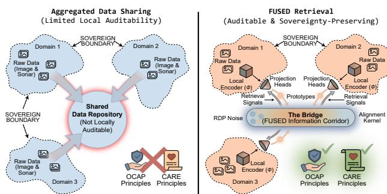
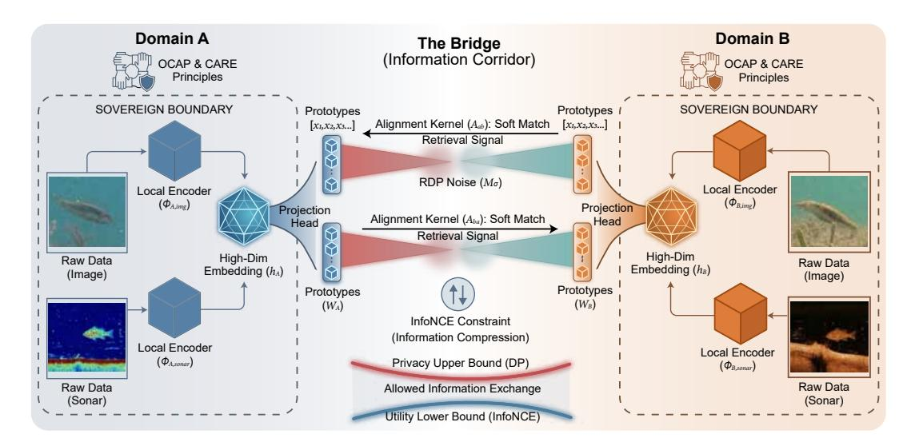
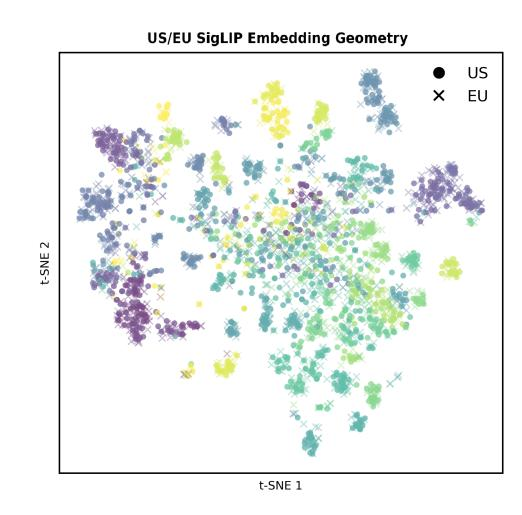
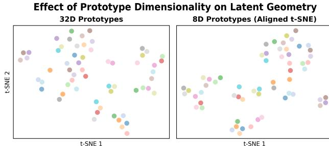
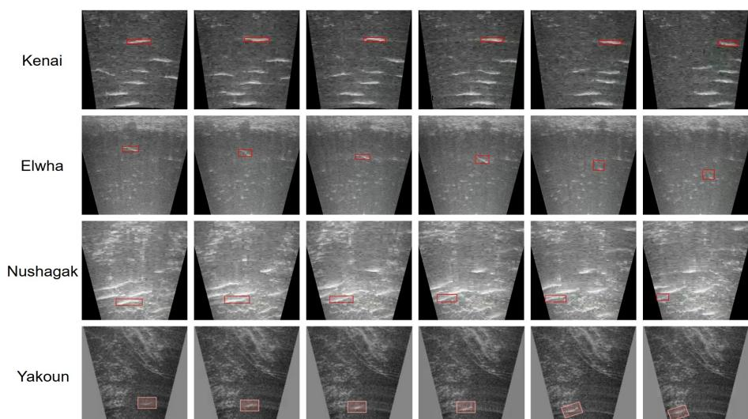
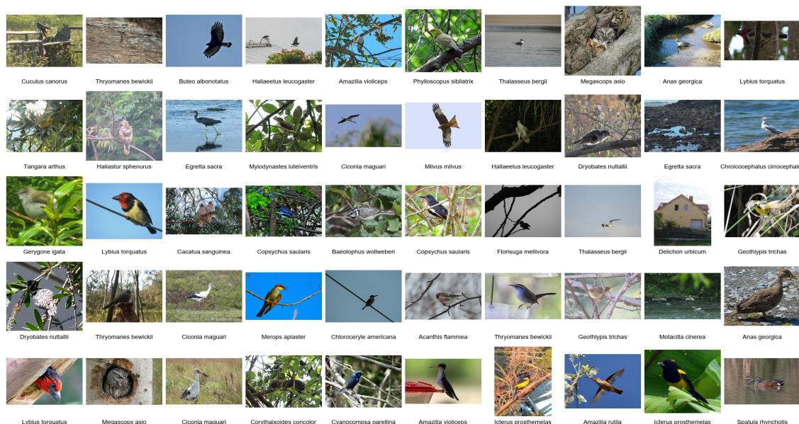

# FUSED: Toward Federated Multimodal Retrieval across Sovereign Data Domains

[Chi Xu](https://orcid.org/0000-0001-9473-722X) chix@sfu.ca Simon Fraser University Burnaby, Canada

[Jiaxing Li](https://orcid.org/0009-0006-4845-3270) jla641@sfu.ca Simon Fraser University Burnaby, Canada

[Mengdi Jin](https://orcid.org/0009-0003-1833-9854) mengdij@sfu.ca Simon Fraser University Burnaby, Canada

[William I. Atlas](https://orcid.org/0000-0002-7090-6233) watlas@wildsalmoncenter.org Wild Salmon Center Portland, United States

[Mark A. Spoljaric](https://orcid.org/0009-0006-1748-6619) mark.spoljaric@haidanation.com Haida Fisheries Program Skidegate, Canada

[Edith C.H. Ngai](https://orcid.org/0000-0002-3454-8731) chngai@eee.hku.hk The University of Hong Kong Hong Kong SAR, China

[Jiangchuan Liu](https://orcid.org/0000-0001-6592-1984)∗ jcliu@sfu.ca Simon Fraser University Burnaby, Canada

## Abstract

Ecological monitoring programs increasingly collect multimodal data such as RGB imagery, sonar video, and analytical logs across independently governed sites. These sovereign data domains often restrict raw data aggregation and the disclosure of model parameters or embeddings, making cross-site retrieval difficult to achieve with existing centralized or federated approaches.

We present FUSED, a sovereignty-preserving multimodal retrieval framework to address these challenges. FUSED enables federated cross-domain search with information-bounded exchanges. Instead of exchanging high-dimensional features, FUSED maps local representations into compact prototypes and transmits only low-capacity, auditable signals. A lightweight alignment kernel provides a soft probabilistic link across distinct sovereign domains, supporting retrieval even when sensing modalities and data governance policies differ. Experiments on real-world sonar and RGB image data show that FUSED achieves robust cross-domain retrieval performance while maintaining low information exposure and meeting sovereignty requirements. These results suggest a practical and responsible pathway for community-aligned AI systems operating across web-connected, sovereign data domains.

## CCS Concepts

### • Information systems → Multimedia and multimodal retrieval.

## Keywords

Multimodal Retrieval, Ecological Monitoring, Data Sovereignty, Privacy-Preserving Retrieval, Federated Search

### ACM Reference Format:

Chi Xu, Jiaxing Li, Mengdi Jin, William I. Atlas, Mark A. Spoljaric, Edith C.H. Ngai, and Jiangchuan Liu. 2026. FUSED: Toward Federated Multimodal Retrieval across Sovereign Data Domains . In Proceedings of the ACM Web

∗Corresponding author.

© 2026 Copyright held by the owner/author(s). ACM ISBN 979-8-4007-2307-0/2026/04 <https://doi.org/10.1145/3774904.3793009>

Conference 2026 (WWW '26), April 13–17, 2026, Dubai, United Arab Emirates. ACM, New York, NY, USA, [11](#page-10-0) pages[. https://doi.org/10.1145/3774904.3793009](https://doi.org/10.1145/3774904.3793009)

## 1 Introduction

Ongoing biodiversity decline and shifting ecosystem dynamics call for comprehensive ecological monitoring worldwide [\[15,](#page-8-0) [34\]](#page-8-1). Environmental and community-driven monitoring networks now generate large volumes of multimodal ecological data, including images [\[23\]](#page-8-2), video and sensor recordings [\[18,](#page-8-3) [22,](#page-8-4) [30\]](#page-8-5), and analytical logs [\[33\]](#page-8-6). Recent assessments estimate that more than one million species face extinction risk and that monitored wildlife populations have fallen by 73% since 1970 [\[2,](#page-8-7) [4\]](#page-8-8). Indigenous communities play a central role in these global monitoring and stewardship efforts. Their territories encompass approximately 42% of the world's remaining land in good ecological condition [\[3\]](#page-8-9). They also play a vital role in safeguarding marine environments through traditional knowledge and practices, notably the wild salmon [\[6,](#page-8-10) [10,](#page-8-11) [41\]](#page-8-12) and the coral reef systems [\[40\]](#page-8-13), which are increasingly threatened by excessive human activity and climate change. Collectively, they serve as stewards of nearly 80% of the planet's remaining biodiversity [\[7\]](#page-8-14), and their efforts underpin a substantial share of communitymanaged, sovereign ecological datasets [\[10\]](#page-8-11).

Because these data arise from diverse stewardship practices and governance structures, ecological datasets are often distributed across multiple web-connected sovereign domains. These include Indigenous organizations, research sites, and community-led monitoring programs operating under principles such as OCAP® (Ownership, Control, Access, and Possession) [\[27\]](#page-8-15) and the CARE (Collective Benefit, Authority to Control, Responsibility, and Ethics) framework [\[11\]](#page-8-16). National data-governance policies further reinforce these protections. In the United States, federal and Tribal directives affirm Tribal sovereignty over environmental and cultural data [\[12\]](#page-8-17). In Canada, the Government's White Paper on Data Sovereignty cautions that centralizing sensitive data across autonomous domains can introduce significant legal and ethical risks, even when data remain within national borders [\[1\]](#page-8-18).

Although aggregated data sharing remains common in open datasets (Figure [1,](#page-1-0) left), many community-led monitoring programs increasingly apply sovereignty-aligned data-sharing agreements that limit unaudited raw data movement [\[10\]](#page-8-11). As a result, aggregating raw ecological data across sovereign domains is often infeasible

[This work is licensed under a Creative Commons Attribution 4.0 International License.](https://creativecommons.org/licenses/by/4.0) WWW '26, Dubai, United Arab Emirates

Figure 1: Aggregated data sharing provides limited local auditability, whereas FUSED enables sovereignty-preserving multimodal retrieval via low-capacity prototypes, auditable signals, and a kernel-based information corridor.

or inappropriate. Yet effective ecological collaboration still depends on the ability to retrieve related information across sites, such as comparing imagery, identifying visually similar species, or accessing expert-curated examples, while ensuring that sensitive data remain within the domains where they are collected.

These constraints create a structural tension between data sovereignty and cross-domain utility. Retrieval across sovereign ecological datasets is therefore both necessary and technically challenging. Data collected by different communities vary widely in sensing hardware, environmental conditions, annotation practices, granularity, and stewardship protocols [\[41\]](#page-8-12). Such variation leads to substantial distribution shifts, which undermine conventional centralized or pooled-model retrieval approaches [\[20,](#page-8-19) [25\]](#page-8-20). Beyond data heterogeneity, each domain operates under its own data conventions and governance frameworks. The resulting landscape is inherently decentralized and federated, where unified representation learning is neither feasible nor governance-aligned [\[9,](#page-8-21) [39\]](#page-8-22). The core challenge here is to support cross-domain similarity search and semantic retrieval without exposing sensitive raw data or requiring shared model parameters, while remaining robust to heterogeneity

in data distributions, sensing modalities, and stewardship practices. Addressing this tension requires a retrieval interface that preserves data sovereignty while still allowing domains to compare observations. Rather than exposing high-dimensional features, such an interface communicates only through a low-capacity, auditable channel that keeps information exposure bounded. It also operates across heterogeneous sensing modalities and domain-specific encoders, without assuming shared feature spaces or aligned representations. To meet these requirements, we introduce FUSED[1](#page-1-1) , a federated multimodal retrieval framework that allows cross-domain search while respecting locally governed data boundaries. Here, "federated" describes the decentralized operation across sovereign domains, rather than shared-model training.

As shown in Figure [1,](#page-1-0) FUSED realizes these design goals by departing from classical centralized and federated retrieval approaches, thereby avoiding the sharing of embeddings, model parameters, or raw features. Instead, cross-domain interaction occurs through compact prototype representations that bound the amount

of information leaving each domain. These prototypes act as a bounded-capacity, auditable interface, so that only the minimal signal needed for retrieval is exposed. FUSED introduces a lightweight alignment kernel that forms a soft probabilistic bridge across domains. This design enables similarity search without global alignment or centralized calibration. Through this governance-aligned communication channel, cross-domain retrieval becomes a controlled and locally accountable process of information exchange.

We evaluate FUSED on real-world ecological monitoring records collected from sonar and RGB systems deployed across multiple sovereign domains, including sites operated in partnership with Indigenous fisheries programs. These domains differ substantially in sensing hardware, environmental conditions, and stewardship practices. Across all cross-domain evaluations, FUSED achieves stable retrieval despite pronounced variation in sensing characteristics. On sonar data, aligned prototype retrieval achieves Recall@10 values up to 0.76, with most cross-domain transfers exceeding 0.58, markedly outperforming unaligned comparisons. A similar pattern appears in the RGB experiments: same-domain performance remains high (Recall@1 ≈ 0.81–0.82), while cross-domain accuracy naturally declines (0.73–0.75) but remains functional even under an 8-dimensional interface (Recall@1 ≈ 0.56). Together, these results show that compact prototypes combined with high-entropy alignment reliably support retrieval across sovereign domains while respecting governance constraints.

To summarize, our main contributions are:

- We formalize the problem of sovereign multimodal retrieval and analyze the limitations of existing centralized, federated, and privacy-preserving approaches.
- We introduce FUSED, a prototype-based retrieval framework that operates through an information corridor with bounded capacity and kernel-based cross-domain alignment.
- Through experiments on public sonar and RGB image datasets, we demonstrate that FUSED enables effective retrieval across governed domains under sovereignty constraints.
- We show that sovereign retrieval can support cross-site ecological collaboration while respecting community data governance agreements, pointing toward a practical path for responsible, community-aligned AI systems.

## 2 Background and Related Work

Ecological and scientific monitoring systems increasingly operate across independently governed, web-connected data domains. In these settings, raw multimodal observations, model parameters, and internal representations cannot be freely shared across institutional or sovereign boundaries due to established data governance frameworks such as OCAP® and CARE. Effective cross-domain collaboration depends on mechanisms that enable domains to compare and retrieve relevant information without exposing sensitive raw data or revealing local feature-space geometry. From a technical perspective, this problem lies at the intersection of representation learning, information theory, and privacy-preserving analytics.

Cross-Modal and Multimodal Retrieval. Classical image–text and image–image retrieval systems rely on shared embedding spaces learned from pooled datasets [\[21,](#page-8-23) [26,](#page-8-24) [32\]](#page-8-25). Recent advances in composed or conditional retrieval allow users to search via image–text

1The term "FUSED" is used descriptively, highlighting the fusion of constrained, information-bounded signals across sovereign domains.

Figure 2: FUSED's information corridor. Local embeddings are projected into prototypes and exchanged through an RDPbounded corridor, where a soft alignment kernel enables cross-domain retrieval while preserving each domain's sovereignty.

combinations [\[36,](#page-8-26) [38\]](#page-8-27), often achieving high accuracy on centralized benchmarks. However, these approaches assume fully shared data and model parameters, making them incompatible with settings where embeddings or encoders cannot be exchanged.

Representation Alignment and Domain Adaptation. A large body of work focuses on aligning heterogeneous embedding spaces using projection matrices [\[28\]](#page-8-28), adversarial adaptation [\[13\]](#page-8-29), optimal transport [\[42\]](#page-9-0), or kernel-based alignment [\[14\]](#page-8-30). Centered kernel alignment (CKA)-based methods [\[24\]](#page-8-31) show that network representations can be compared via kernel statistics, but these techniques require access to embeddings from all domains. Domain adaptation and multi-domain representation learning also require shared training distributions or paired samples [\[8,](#page-8-32) [19\]](#page-8-33), both infeasible under sovereignty constraints.

Privacy-Preserving Learning. Differentially private (DP) representation learning [\[5\]](#page-8-34) seeks to bound leakage from learned models, while recent work on private embedding release [\[17\]](#page-8-35) studies how to share noisy latent vectors. Yet these approaches assume that the embeddings themselves are communicated, which is not aligned with sovereign restrictions on feature-space exposure. Moreover, strong DP noise can severely degrade retrieval utility in high-dimensional spaces, highlighting the need for low-capacity abstractions rather than noisy high-dimensional embeddings.

Federated and Distributed Retrieval. Federated search and federated learning frameworks enable distributed indexing or model training across clients [\[31,](#page-8-36) [35,](#page-8-37) [44\]](#page-9-1). However, these approaches typically rely on the exchange of gradient updates, model parameters, or intermediate statistics. Such exchanges can expose aspects of local feature spaces or model internals. In practice, they remain incompatible with settings that impose strict sovereignty constraints on representation and model-state disclosure [\[45\]](#page-9-2).

Summary. Taken together, existing methods rely on assumptions fundamentally at odds with sovereign data governance: pooled data, shared encoders, synchronized embeddings, or exposure of high-dimensional latent spaces. None provides a mechanism for semantic retrieval in settings where the only permissible crossdomain communication is a low-capacity, information-bounded prototype or its noisy variant. These gaps motivate the design principles that FUSED adopts to support sovereign multimodal retrieval.

## 3 Sovereign Multimodal Retrieval

We consider multimodal retrieval across sovereign data domains that cannot share raw data, aligned embeddings, or model parameters. This section formalizes the problem setting and introduces the prototype abstraction. We then present the representation layer, the cross-domain alignment and privacy mechanisms, and the resulting sovereignty-preserving retrieval procedure.

## 3.1 Problem Settings

We consider a collaborative environment consisting of �� webconnected sovereign data domains

D = {D1, . . . , D�� },

where each domain independently collects, governs, and processes multimodal data. Sovereignty implies that domains neither share raw data nor expose their learned feature spaces. Cross-domain interaction is restricted to low-capacity prototype representations and other aggregated statistics. Each domain D�� maintains its own encoder

���� : X�� → R ���� ,

trained locally under domain-specific constraints and objectives. Given a query �� originating from domain ��, the objective is to retrieve semantically related samples stored in domain ��:

Ψ��→�� (��) −→ Top-��(��),

### Algorithm 2 Sovereignty-Preserving Cross-Domain Retrieval

Input: Query �� ∈ D��; encoder ����; projection head proj��

; prototype sets W; simi-

larity head ����; alignment kernel ������ ; noise scale ��. Output: Top-�� semantically relevant retrieval results in domain ��.

1: ℎ�� ← ���� (��); ��

(��) �� ← proj��

(ℎ�� )

2: ��

∗ ← arg min�� ∥��

(��) �� − �� (��)

3: C�� ← Top-��

������ (�� ∗ , · )

4: for all �� ∈ C�� do 5: �� ← ���� (��

(��) �� , ��)

6: ��˜ ← �� + N (0, ��2

7: end for

8: Rank {��˜(��) : �� ∈ C�� } and return the top-�� results with RDP audit metadata.

prototype similarity evaluation remains efficient due to the small prototype dimension (�� ′ ≤ 128).

Cross-domain alignment requires forming a cost matrix denoted as ��(|W�� | |W�� | �� ′ ) and normalizing it to obtain the kernel ������ ; this step is computed only occasionally (e.g., per epoch or per deployment update rather than per query) and can be amortized or subsampled in practice. During retrieval, selecting the top-�� entries from ������ (�� ∗ , ·) costs either ��(|W�� |) for a scan or ��(�� log |W�� |) with heap-based selection, where �� ≪ |W�� |. Similarity computation within the restricted candidate set requires ��(�� ��′ ) per query. Communication scales as��(��) for returning �� retrieval results (IDs and scores), with optional ��(����′ ) overhead if quantized prototype summaries are included for auditing.

Applying Gaussian RDP noise is constant-time, and privacy composition across repeated queries follows the analytical properties of Rényi Differential Privacy. With hierarchical alignment or sparsified kernels, overall computation grows approximately linearly with the number of sovereign domains, and parallelization across domains provides stable scaling in both training and retrieval.

## 3.6 Interpretation

The proposed formulation provides an operational view of sovereignty by expressing data governance requirements as measurable constraints on information flow. The MI lower bound ensures that prototypes retain enough semantic structure to support meaningful retrieval, while the privacy-driven upper bound prevents them from encoding fine-grained, domain-specific signals. In effect, the representation is shaped to be useful but not reconstructive, allowing domains to participate in collaborative search without relinquishing control over sensitive data or internal models.

The kernel-based correspondence further reinforces sovereignty by localizing cross-domain interaction. Rather than enforcing global alignment, which would implicitly merge representation spaces, FUSED limits retrieval to a small set of query-dependent prototype regions identified using low-capacity statistics. Each cross-domain comparison is therefore bounded in scope and mediated by domaincontrolled mechanisms. Together with variational information minimization and RDP-bounded communication, this design yields a retrieval channel whose information capacity is explicit and auditable. The resulting system is operationally consistent with key principles of OCAP® and CARE: domains retain Ownership and Control of their data and models, Authority is exercised through explicit privacy budgets, and cross-domain interaction is shaped to balance collective benefit with minimized risk. In this sense,

Table 2: Cross-domain prototype retrieval with FUSED alignment (Recall@K). Diagonal entries are omitted.

| Recall@K Query Recall@1 Elwha | Elwha – | Kenai 0.18 | Nushagak 0.05 | Yakoun 0.11 |
|-------------------------------|---------|------------|---------------|-------------|
| Kenai                         | 0.22    | –          | 0.07          | 0.13        |
| Nushagak                      | 0.09    | 0.11       | –             | 0.08        |
| Yakoun                        | 0.17    | 0.15       | 0.09          | –           |
| Recall@5 Elwha                | –       | 0.46       | 0.21          | 0.35        |
| Kenai                         | 0.52    | –          | 0.25          | 0.39        |
| Nushagak                      | 0.31    | 0.34       | –             | 0.28        |
| Yakoun                        | 0.44    | 0.42       | 0.26          | –           |
| Recall@10 Elwha               | –       | 0.71       | 0.42          | 0.58        |
| Kenai                         | 0.76    | –          | 0.38          | 0.61        |
| Nushagak                      | 0.58    | 0.63       | –             | 0.49        |
| Yakoun                        | 0.67    | 0.65       | 0.46          | –           |

sovereignty is not an abstract policy aspiration but a property enforced by the system architecture.

### 4 Experiments

We evaluate FUSED on multimodal real-world ecological data, including sonar video and RGB images, partitioned into independently governed domains. The evaluation focuses on cross-domain retrieval performance and on how prototype capacity and noise shape the behavior of the information corridor.

## 4.1 Sonar Video Retrieval

We conduct our experiments on the publicly available Caltech Fish Counting (CFC) dataset [\[22\]](#page-8-4), a realistic benchmark for multi-object tracking and counting in imaging sonar videos. The data were recorded using multiple sonar cameras positioned at different river sites, banks, and channels, capturing substantial variation in water clarity, flow, turbidity, and background clutter. We additionally include a restricted Yakoun River ARIS sonar subset shared with us by our Indigenous fisheries partners for research use, providing a fourth deployment with distinct ecological conditions. This diversity, as shown in Appendix Figure [5,](#page-10-1) naturally induces strong domain shifts in acoustic appearance, shadow structure, and motion patterns across deployments.

To emulate a sovereignty-preserving, multi-site deployment, we treat each site, Kenai, Elwha, Nushagak, and Yakoun, as an independent domain. Each domain trains its own local encoder using only its local clips; no raw video, intermediate features, or model parameters are shared. Cross-domain retrieval is carried out solely through compressed prototype representations.

4.1.1 In-domain Retrieval. We begin by evaluating retrieval performance within each sonar domain. All clips from the same site serve as both queries and gallery items, and ground-truth positives are defined by track identifiers from the MOT annotations [\[16\]](#page-8-39). Retrieval is performed using cosine similarity over encoder embeddings, and Recall@1/5/10 is computed based on whether the returned clips originate from the same fish trajectory. This setting measures the temporal consistency of the learned representation before introducing cross-domain variation. Across sites, the encoder captures meaningful within-domain structure, though performance varies with data quality. Elwha, which exhibits relatively clean imagery and stable acoustic backgrounds, achieves the strongest in-domain

Table 3: Ablation on prototype dimension �� ′ , alignment temperature ��, and RDP noise level ��.

retrieval (Recall@10 ≈ 0.86), indicating compact trajectory-level embedding clusters. Kenai shows moderate performance (Recall@10 ≈ 0.69) due to higher frame-to-frame variability and partial track fragmentation. Nushagak is the most challenging, with turbid water and noisy echo patterns leading to substantially lower recall. The small Yakoun subset yields intermediate performance, reflecting distinct ecological conditions and occasional shadow ambiguity but still forming coherent trajectory clusters. These results establish that the learned representation preserves temporal discriminability within each site, while also highlighting strong site-dependent variation that motivates the subsequent cross-domain experiments.

4.1.2 Cross-domain Retrieval. Note that cross-domain retrieval in FUSED is semantic rather than instance-level. In particular, for sonar data, the retrieval targets shared semantic patterns (e.g., fish presence and movement dynamics) expressed over short temporal windows, rather than cross-site identity matching, which is unavailable in real-world deployments. We evaluate cross-domain retrieval by projecting query clips to their local prototypes, using the high-entropy kernel to produce similarity scores, and ranking against the target gallery. Retrieval performance is evaluated using Recall@K over semantically relevant clips. Despite pronounced differences in turbidity and background structure, FUSED recovers meaningful cross-site correspondence. Transfers between Elwha and Kenai perform best (e.g., Recall@10 of 0.71 and 0.76), while Nushagak-related transfers remain the most difficult. Yakoun shows intermediate transferability, with Recall@10 ranging from 0.46 to 0.67 across directions. Full results are reported in Table [2.](#page-5-1)

4.1.3 Ablation and Design Factors. Table [3](#page-6-0) summarizes how the main design components of FUSED affect cross-domain retrieval. Prototype dimensionality shows that retrieval remains stable down to �� ′ = 32 (Recall@10 of 0.63), showing that the low-capacity abstraction preserves transferable retrieval signal while reducing communication cost; performance drops only when the prototype layer becomes too small (e.g., �� ′ = 16, 0.55). The alignment-kernel temperature �� exhibits the expected behavior: softer, higher-entropy kernels improve harder transfers (Recall@10 increasing from 0.58 at �� = 0.1 to 0.64 at �� = 2.0). Further, increasing RDP noise demonstrates the information corridor behavior: moderate perturbations maintain retrieval utility (0.66→0.60), while strong noise leads to noticeable degradation (0.48). Overall, these results are consistent with the roles of prototype abstraction, high-entropy alignment, and

Figure 3: t-SNE visualization of US/EU SigLIP embeddings. Table 4: RGB retrieval results on the 60-species benchmark across US and EU domains.

| Query | → Prototype | Recall@1 | Recall@5 | Recall@10 |
|-------|-------------|----------|----------|-----------|
| US    | → US        | 0.817    | 0.969    | 0.985     |
| EU    | → EU        | 0.811    | 0.963    | 0.983     |
| US    | → EU        | 0.753    | 0.935    | 0.966     |
| EU    | → US        | 0.733    | 0.920    | 0.957     |

information-bounded communication in supporting sovereigntypreserving cross-domain retrieval.

## 4.2 Image Retrieval Evaluation

To examine whether FUSED generalizes beyond single modality, we conduct an independent RGB retrieval study using a 60-species subset of the iNaturalist Birds dataset [\[37\]](#page-8-40), which naturally separates into two geographically distinct domains (US and EU). Each domain produces its own SigLIP-L/16 [\[43\]](#page-9-3) embeddings and retains full control over its raw data and features; cross-domain interaction is restricted to the proposed prototype interface. Representative samples from the benchmark are shown in Appendix Figure [6,](#page-10-2) showing both the visual diversity and geographic variation present across species. Figure [3](#page-6-1) visualizes the SigLIP embedding spaces of the US and EU domains. Although species form meaningful semantic clusters, the two domains exhibit clear geometric divergence, consistent with the cross-domain retrieval gap reported below.

4.2.1 Cross-Domain RGB Retrieval. Table [4](#page-6-2) shows that same-domain retrieval is strong (Recall@1 ≈ 0.81-0.82), whereas cross-domain accuracy decreases to 0.73–0.75. This gap indicates that, even under shared taxonomy and equal model capacity, the two domains develop representation geometries that are partially aligned in semantics but structurally divergent. The result is consistent with a sovereign setting in which domains evolve independently shaped latent spaces that are not trivially compatible for direct retrieval.

4.2.2 Prototype Capacity Ablation. To examine how much outbound capacity is necessary for effective cross-domain search, we compress prototypes from 60D to 4D. As shown in Table [5,](#page-7-0) reducing dimensionality from 60D to 32D produces almost no degradation,

Table 5: Retrieval accuracy across prototype dimensions.

| Dimension | In-Domain US → US | Recall@1 EU → EU | Cross-Domain US → EU | Recall@1 EU → US |
|-----------|-------------------|------------------|----------------------|------------------|
| 60D       | 0.802             | 0.788            | 0.729                | 0.727            |
| 32D       | 0.801             | 0.788            | 0.729                | 0.727            |
| 16D       | 0.731             | 0.720            | 0.685                | 0.682            |
| 8D        | 0.621             | 0.605            | 0.561                | 0.588            |
| 4D        | 0.368             | 0.362            | 0.326                | 0.324            |

Figure 4: t-SNE visualization of 32D and 8D prototypes.

Table 6: Retrieval performance under sovereign noise injection. Gaussian noise with scale �� is added to 32D prototypes to simulate increasingly private outbound channels.

| ��  | In-Domain US → US | Recall@1 EU → EU | Cross-Domain US → EU | Recall@1 EU → US |
|-----|-------------------|------------------|----------------------|------------------|
| 0.0 | 0.801             | 0.788            | 0.729                | 0.727            |
| 0.1 | 0.797             | 0.781            | 0.731                | 0.720            |
| 0.3 | 0.749             | 0.735            | 0.691                | 0.696            |
| 0.5 | 0.711             | 0.692            | 0.637                | 0.643            |

suggesting that the semantic structure required for retrieval is preserved even after substantial compression. At 16D, the performance drop becomes noticeable but remains moderate, with cross-domain Recall@1 decreasing from 0.73 to roughly 0.69. When the dimensionality is reduced to 8D—corresponding to fewer than ten realvalued degrees of freedom available to represent each species—the system still retains usable retrieval ability (cross-domain Recall@1≈ 0.56), which indicates that coarse semantic similarities remain recoverable in extremely compact prototype spaces. Only at 4D does retrieval degrade substantially (Recall@1≈0.32), indicating that the representation becomes too constrained to maintain stable cross-domain alignment. The overall trend forms a smooth capacity–utility curve, showing that prototype dimensionality directly modulates the amount of semantic structure that survives the sovereign bottleneck. Figure [4](#page-7-1) further visualizes 32D and 8D prototypes using an aligned t-SNE projection, where the 8D prototypes preserve the coarse layout of the 32D space but exhibit mild local distortions consistent with the observed accuracy drop.

4.2.3 Noise-Based Sovereign Perturbation. We further study the effect of privacy-motivated sovereign perturbations by injecting Gaussian noise into 32D prototypes. This mechanism reflects a realistic operating scenario where sovereign domains introduce stochastic obfuscation to bound recoverability of local latent structure. Table [6](#page-7-2) shows that mild noise (��=0.1) produces almost no change relative to the noise-free case, suggesting that the shared semantic signal is robust to small perturbations. Moderate noise (��=0.3) yields a measurable reduction in cross-domain retrieval, with Recall@1

decreasing to about 0.69, while in-domain performance remains above 0.73. With stronger perturbation (��=0.5), the retrieval signal is further attenuated but does not vanish; cross-domain Recall@1 stabilizes around 0.64, indicating that the prototype abstraction preserves a meaningful portion of the semantic geometry even when heavily obfuscated. These trends reveal a consistent privacy–utility gradient: noise controls the fidelity of the outbound representation, capacity controls its maximum information content, and the combination governs how much semantic alignment is preserved without disclosing sensitive domain-specific information.

4.2.4 Summary of Image Domain Findings. Taken together, the RGB experiments show that FUSED operates effectively under a range of sovereign constraints. The prototype interface supports retrieval across independently governed feature spaces despite the absence of shared encoders, shared embeddings, or centralized alignment mechanisms. Both dimensionality reduction and noise injection produce predictable and monotonic effects on retrieval, suggesting that the proposed interface forms a well-behaved corridor between semantic utility and governance-imposed exposure limits. The results further indicate that meaningful cross-domain comparison does not require large-capacity feature sharing; instead, stable retrieval can be achieved through compact, low-fidelity prototypes that retain only the minimal information needed for semantic matching while respecting the autonomy and privacy boundaries of each data domain.

## 5 Conclusion

We presented FUSED, a federated multimodal retrieval framework for cross-domain search under data sovereignty constraints. FUSED uses a low-capacity prototype interface together with an InfoNCEbased semantic lower bound and a privacy-driven upper bound to form an information corridor. This design supports cross-domain retrieval while keeping information exposure explicitly bounded, without centralized pooling, shared embeddings, or model-parameter exchange. Experiments on real-world sonar and RGB datasets showed that FUSED provides reliable cross-domain retrieval even under strong capacity limits and added privacy noise. These results suggest that useful collaboration is still possible when raw data and feature spaces cannot be shared and remain locally governed.

Beyond performance, FUSED shows how retrieval systems can respect data governance by design. By exposing only small, auditable signals and avoiding global alignment, the framework stays consistent with sovereignty principles discussed in this paper. Broader governance implications are discussed in the Appendix B. Overall, FUSED offers a practical and governance-aligned approach to sovereignty-preserving multimodal retrieval, especially for ecological and community-governed monitoring settings.

## Acknowledgments

This research was supported by an NSERC Discovery Grant, a British Columbia Salmon Recovery and Innovation Fund (BCSRIF\_ 2022\_401), a Mitacs Accelerate Cluster Grant, and a Mitacs Globalink Research Award. We are grateful for the trust and collaboration of the Pacific Salmon Foundation, the Wild Salmon Center, and the Haida and Wuikinuxv Nations for their ongoing partnership in this work. We thank the anonymous reviewers for their feedback.

### References

[1] 2018. Government of Canada White Paper: Data Sovereignty and Public Cloud. Technical Report. Treasury Board of Canada Secretariat. [https://www.canada.ca/en/government/system/digital-government/digital](https://www.canada.ca/en/government/system/digital-government/digital-government-innovations/cloud-services/digital-sovereignty/gc-white-paper-data-sovereignty-public-cloud.html)[government-innovations/cloud-services/digital-sovereignty/gc-white-paper](https://www.canada.ca/en/government/system/digital-government/digital-government-innovations/cloud-services/digital-sovereignty/gc-white-paper-data-sovereignty-public-cloud.html)[data-sovereignty-public-cloud.html](https://www.canada.ca/en/government/system/digital-government/digital-government-innovations/cloud-services/digital-sovereignty/gc-white-paper-data-sovereignty-public-cloud.html) Accessed: 2025-11-18. [2] 2019. Nature's Dangerous Decline "Unprecedented"; Species Extinction Rates "Accelerating". Technical Report. United Nations Sustainable Development Report. [https://www.un.org/sustainabledevelopment/blog/2019/05/nature-decline](https://www.un.org/sustainabledevelopment/blog/2019/05/nature-decline-unprecedented-report/)[unprecedented-report/](https://www.un.org/sustainabledevelopment/blog/2019/05/nature-decline-unprecedented-report/) Accessed: 2025-01-01. [3] 2021. The State of the Indigenous Peoples' and Local Communities' Lands and Territories. Technical Report. WWF Latin America and Caribbean Programme Office. [https://wwflac.awsassets.panda.org/downloads/report\\_the\\_state\\_of\\_the\\_](https://wwflac.awsassets.panda.org/downloads/report_the_state_of_the_indigenous_peoples_and_local_communities_lands_and_territories_1.pdf) [indigenous\\_peoples\\_and\\_local\\_communities\\_lands\\_and\\_territories\\_1.pdf](https://wwflac.awsassets.panda.org/downloads/report_the_state_of_the_indigenous_peoples_and_local_communities_lands_and_territories_1.pdf) Accessed: 2025-11-04. [4] 2024. Living Planet Report 2024. Technical Report. World Wide Fund for Nature. <https://livingplanet.panda.org/en-US/> Accessed: 2025-11-01. [5] Martin Abadi, Andy Chu, Ian Goodfellow, H Brendan McMahan, Ilya Mironov, Kunal Talwar, and Li Zhang. 2016. Deep learning with differential privacy. In Proceedings of the 2016 ACM SIGSAC conference on computer and communications security. 308–318. [doi:10.1145/2976749.2978318](https://doi.org/10.1145/2976749.2978318) [6] William I. Atlas, Sami Ma, Yi Ching Chou, Katrina Connors, Daniel Scurfield, Brandon Nam, Xiaoqiang Ma, Mark Cleveland, Janvier Doire, Jonathan W. Moore, Ryan Shea, and Jiangchuan Liu. 2023. Wild salmon enumeration and monitoring using deep learning empowered detection and tracking. Frontiers in Marine Science 10 (2023), 1200408. [doi:10.3389/fmars.2023.1200408](https://doi.org/10.3389/fmars.2023.1200408) [7] Laura Beltran and Pablo Uchoa. 2024. Lessons from Indigenous leaders to protect the Amazon rainforest. World Economic Forum article. [https://www.weforum.org/stories/2024/01/lessons-from-indigenous](https://www.weforum.org/stories/2024/01/lessons-from-indigenous-leaders-to-protect-the-amazon-rainforest/)[leaders-to-protect-the-amazon-rainforest/](https://www.weforum.org/stories/2024/01/lessons-from-indigenous-leaders-to-protect-the-amazon-rainforest/) Accessed: 2026-01-31. [8] Shai Ben-David, John Blitzer, Koby Crammer, Alex Kulesza, Fernando Pereira, and Jennifer Wortman Vaughan. 2010. A theory of learning from different domains. Machine learning 79, 1 (2010), 151–175. [doi:10.1007/s10994-009-5152-4](https://doi.org/10.1007/s10994-009-5152-4) [9] Kasra Borazjani, Naji Khosravan, Rajeev Sahay, Bita Akram, and Seyyedali Hosseinalipour. 2025. Bringing multi-modal multi-task federated foundation models to education domain: prospects and challenges. Frontiers in Artificial Intelligence 8 (2025), 1683960. [doi:10.3389/frai.2025.1683960](https://doi.org/10.3389/frai.2025.1683960) [10] SE Cannon, JW Moore, MS Adams, T Degai, E Griggs, J Griggs, T Marsden, AJ Reid, N Sainsbury, KM Stirling, et al. 2024. Taking care of knowledge, taking care of salmon: towards Indigenous data sovereignty in an era of climate change and cumulative effects. Facets 9 (2024), 1–21. [doi:10.1139/facets-2023-0135](https://doi.org/10.1139/facets-2023-0135) [11] Stephanie R. Carroll et al. 2020. The CARE Principles for Indigenous Data Governance. Data Science Journal 19 (2020). [doi:10.5334/dsj-2020-043](https://doi.org/10.5334/dsj-2020-043) [12] Stephanie R. Carroll, Desi Rodriguez-Lonebear, and Andrew Martinez. 2019. Indigenous Data Governance: Strategies from United States Native Nations. Data Science Journal 18 (2019), 31. [doi:10.5334/dsj-2019-031](https://doi.org/10.5334/dsj-2019-031) [13] Chaoqi Chen, Weiping Xie, Tingyang Xu, Yu Rong, Wenbing Huang, Xinghao Ding, Yue Huang, and Junzhou Huang. 2019. Unsupervised adversarial graph alignment with graph embedding. arXiv preprint arXiv:1907.00544 (2019). [doi:10.](https://doi.org/10.48550/arXiv.1907.00544) [48550/arXiv.1907.00544](https://doi.org/10.48550/arXiv.1907.00544) [14] Corinna Cortes, Mehryar Mohri, and Afshin Rostamizadeh. 2012. Algorithms for learning kernels based on centered alignment. The Journal of Machine Learning Research 13, 1 (2012), 795–828. [doi:10.48550/arXiv.1203.0550](https://doi.org/10.48550/arXiv.1203.0550) [15] Finn Danielsen, Natasha Ali, Herizo T Andrianandrasana, Andrea Baquero, Umai Basilius, Pedro de Araujo Lima Constantino, Katherine Despot-Belmonte, Per Ole Frederiksen, Maxim Isaac, PâviâraK Jakobsen, et al. 2024. Involving citizens in monitoring the Kunming–Montreal global biodiversity framework. Nature Sustainability 7, 12 (2024), 1730–1739. [doi:10.1038/s41893-024-01447-y](https://doi.org/10.1038/s41893-024-01447-y) [16] Patrick Dendorfer, Aljoša Ošep, Anton Milan, Konrad Schindler, Daniel Cremers, Ian Reid, Stefan Roth, and Laura Leal-Taixé. 2021. MOTChallenge: A Benchmark for Single-Camera Multiple Target Tracking. International Journal of Computer Vision 129 (2021), 845–881. [doi:10.1007/s11263-020-01393-0](https://doi.org/10.1007/s11263-020-01393-0) [17] Oluwaseyi Feyisetan and Shiva Kasiviswanathan. 2021. Private release of text embedding vectors. In Proceedings of the First Workshop on Trustworthy Natural Language Processing. 15–27.<https://aclanthology.org/2021.trustnlp-1.3.pdf> [18] Valentin Gabeff, Haozhe Qi, Brendan Flaherty, Gencer Sumbül, Alexander Mathis, and Devis Tuia. 2025. MammAlps: A Multi-view Video Behavior Monitoring Dataset of Wild Mammals in the Swiss Alps. In Proceedings of the IEEE/CVF Conference on Computer Vision and Pattern Recognition (CVPR). 13854–13864. [doi:10.1109/CVPR52734.2025.01293](https://doi.org/10.1109/CVPR52734.2025.01293) [19] Yaroslav Ganin, Evgeniya Ustinova, Hana Ajakan, Pascal Germain, Hugo Larochelle, François Laviolette, Mario March, and Victor Lempitsky. 2016. Domain-adversarial training of neural networks. Journal of machine learning research 17, 59 (2016), 1–35.<http://jmlr.org/papers/v17/15-239.html> [20] Min Gao, Haifeng Zheng, Xinxin Feng, and Ran Tao. 2025. Multimodal Fusion Using Multi-View Domains for Data Heterogeneity in Federated Learning. AAAI Conference on Artificial Intelligence (2025), 33839. [https://ojs.aaai.org/index.php/](https://ojs.aaai.org/index.php/AAAI/article/view/33839) [AAAI/article/view/33839](https://ojs.aaai.org/index.php/AAAI/article/view/33839) [21] Chao Jia, Yinfei Yang, Ye Xia, Yi-Ting Chen, Zarana Parekh, Hieu Pham, Quoc Le, Yun-Hsuan Sung, Zhen Li, and Tom Duerig. 2021. Scaling up visual and visionlanguage representation learning with noisy text supervision. In International conference on machine learning. PMLR, 4904–4916. [https://proceedings.mlr.press/](https://proceedings.mlr.press/v139/jia21b/jia21b.pdf) [v139/jia21b/jia21b.pdf](https://proceedings.mlr.press/v139/jia21b/jia21b.pdf) [22] Justin Kay, Peter Kulits, Suzanne Stathatos, Siqi Deng, Erik Young, Sara Beery, Grant Van Horn, and Pietro Perona. 2022. The Caltech Fish Counting Dataset: A Benchmark for Multiple-Object Tracking and Counting. 290–311 pages. [doi:10.](https://doi.org/10.48550/arXiv.2207.09295) [48550/arXiv.2207.09295](https://doi.org/10.48550/arXiv.2207.09295) [23] Jenna Kline, Anirudh Potlapally, Bharath Pillai, Tanishka Wani, Rugved Katole, Vedant Patil, Penelope Covey, Hari Subramoni, Tanya Berger-Wolf, and Christopher Stewart. 2025. SmartWilds: Multimodal Wildlife Monitoring Dataset. arXiv preprint arXiv:2509.18894. [doi:10.48550/arXiv.2509.18894](https://doi.org/10.48550/arXiv.2509.18894) [24] Simon Kornblith, Mohammad Norouzi, Honglak Lee, and Geoffrey Hinton. 2019. Similarity of neural network representations revisited. In International conference on machine learning. PMLR, 3519–3529. [https://proceedings.mlr.press/v97/](https://proceedings.mlr.press/v97/kornblith19a/kornblith19a.pdf) [kornblith19a/kornblith19a.pdf](https://proceedings.mlr.press/v97/kornblith19a/kornblith19a.pdf) [25] Xingyu Li, Lu Peng, Yu-Ping Wang, and Weihua Zhang. 2025. Open challenges and opportunities in federated foundation models towards biomedical healthcare. BioData Mining 18, 1 (2025), 2. [doi:10.1186/s13040-024-00414-9](https://doi.org/10.1186/s13040-024-00414-9) [26] Shilong Liu, Zhaoyang Zeng, Tianhe Ren, Feng Li, Hao Zhang, Jie Yang, Qing Jiang, Chunyuan Li, Jianwei Yang, Hang Su, et al. 2024. Grounding dino: Marrying dino with grounded pre-training for open-set object detection. In European conference on computer vision. Springer, 38–55. [doi:10.1007/978-3-031-72970-6\\_3](https://doi.org/10.1007/978-3-031-72970-6_3) [27] Graham Mecredy, Roseanne Sutherland, and Carmen Jones. 2018. First Nations data governance, privacy, and the importance of the OCAP® principles. International Journal of Population Data Science 3, 4 (2018). [doi:10.23889/ijpds.v3i4.911](https://doi.org/10.23889/ijpds.v3i4.911) [28] Tomas Mikolov, Quoc V Le, and Ilya Sutskever. 2013. Exploiting similarities among languages for machine translation. arXiv preprint arXiv:1309.4168 (2013). [doi:10.48550/arXiv.1309.4168](https://doi.org/10.48550/arXiv.1309.4168) [29] Ilya Mironov. 2017. Rényi differential privacy. In 2017 IEEE 30th computer security foundations symposium (CSF). IEEE, 263–275. [doi:10.1109/CSF.2017.11](https://doi.org/10.1109/CSF.2017.11) [30] Rongsheng Qian, Chi Xu, Xiaoqiang Ma, Hao Fang, Yili Jin, William I Atlas, and Jiangchuan Liu. 2025. Self-Supervised Compression and Artifact Correction for Streaming Underwater Imaging Sonar. arXiv preprint arXiv:2511.13922 (2025). [doi:10.48550/arXiv.2511.13922](https://doi.org/10.48550/arXiv.2511.13922) [31] Liang Qu, Ningzhi Tang, Ruiqi Zheng, Quoc Viet Hung Nguyen, Zi Huang, Yuhui Shi, and Hongzhi Yin. 2023. Semi-decentralized federated ego graph learning for recommendation. In Proceedings of the ACM web conference 2023. 339–348. [doi:10.1145/3543507.3583337](https://doi.org/10.1145/3543507.3583337) [32] Alec Radford, Jong Wook Kim, Chris Hallacy, Aditya Ramesh, Gabriel Goh, Sandhini Agarwal, Girish Sastry, Amanda Askell, Pamela Mishkin, Jack Clark, et al. 2021. Learning transferable visual models from natural language supervision. In International conference on machine learning. PMLR, 8748–8763. [https://](https://proceedings.mlr.press/v139/radford21a/radford21a.pdf) [proceedings.mlr.press/v139/radford21a/radford21a.pdf](https://proceedings.mlr.press/v139/radford21a/radford21a.pdf) [33] Ana Carla Rodrigues, Hugo CM Costa, Carlos A Peres, Eduardo Sonnewend Brondizio, Adevaldo Dias, José Alves de Moraes, Pedro de Araujo Lima Constantino, Richard James Ladle, Ana Claudia Mendes Malhado, and João Vitor Campos-Silva. 2025. Community-based management expands ecosystem protection footprint in Amazonian forests. Nature Sustainability 8, 11 (2025), 1304–1313. [doi:10.1038/s41893-025-01633-6](https://doi.org/10.1038/s41893-025-01633-6) [34] Daniele Silvestro, Stefano Goria, Thomas Sterner, and Alexandre Antonelli. 2022. Improving biodiversity protection through artificial intelligence. Nature sustainability 5, 5 (2022), 415–424. [doi:10.1038/s41893-022-00851-6](https://doi.org/10.1038/s41893-022-00851-6) [35] Tao Sun, Dongsheng Li, and Bao Wang. 2022. Decentralized federated averaging. IEEE Transactions on Pattern Analysis and Machine Intelligence 45, 4 (2022), 4289– 4301. [doi:10.1109/TPAMI.2022.3196503](https://doi.org/10.1109/TPAMI.2022.3196503) [36] Yucheng Suo, Fan Ma, Linchao Zhu, and Yi Yang. 2024. Knowledge-enhanced dual-stream zero-shot composed image retrieval. In Proceedings of the IEEE/CVF conference on computer vision and pattern recognition. 26951–26962. [doi:10.1109/](https://doi.org/10.1109/CVPR52733.2024.02545) [CVPR52733.2024.02545](https://doi.org/10.1109/CVPR52733.2024.02545) [37] Grant Van Horn, Oisin Mac Aodha, Yang Song, Yin Cui, Chen Sun, Alex Shepard, Hartwig Adam, Pietro Perona, and Serge Belongie. 2018. The inaturalist species classification and detection dataset. In Proceedings of the IEEE conference on computer vision and pattern recognition. 8769–8778. [doi:10.1109/CVPR.2018.00914](https://doi.org/10.1109/CVPR.2018.00914) [38] Nam Vo, Lu Jiang, Chen Sun, Kevin Murphy, Li-Jia Li, Li Fei-Fei, and James Hays. 2019. Composing text and image for image retrieval-an empirical odyssey. In Proceedings of the IEEE/CVF conference on computer vision and pattern recognition. 6439–6448. [doi:10.1109/CVPR.2019.00660](https://doi.org/10.1109/CVPR.2019.00660) [39] Jeroen Werbrouck, Pieter Pauwels, Jakob Beetz, Ruben Verborgh, and Erik Mannens. 2024. ConSolid: A federated ecosystem for heterogeneous multi-stakeholder projects. Semantic Web 15, 2 (2024), 429–460. [doi:10.3233/SW-233396](https://doi.org/10.3233/SW-233396) [40] Liz Wren. 2024. Why Elevating Indigenous Voices Is Crucial to Protecting the World's Coral Reefs. earch.org (opinion article). [https://earth.org/why-elevating](https://earth.org/why-elevating-indigenous-voices-is-crucial-to-protecting-the-worlds-coral-reefs/)[indigenous-voices-is-crucial-to-protecting-the-worlds-coral-reefs/](https://earth.org/why-elevating-indigenous-voices-is-crucial-to-protecting-the-worlds-coral-reefs/) Accessed: 2026-01-31. [41] Chi Xu, Yili Jin, Sami Ma, Rongsheng Qian, Hao Fang, Jiangchuan Liu, Xue Liu, Edith CH Ngai, William I Atlas, Katrina M Connors, et al. 2025. Exploring

Multimodal Foundation AI and Expert-in-the-Loop for Sustainable Management of Wild Salmon Fisheries in Indigenous Rivers. arXiv preprint arXiv:2505.06637 (2025). [doi:10.48550/arXiv.2505.06637](https://doi.org/10.48550/arXiv.2505.06637) [42] Qi Yu, Zhichen Zeng, Yuchen Yan, Lei Ying, R Srikant, and Hanghang Tong. 2025. Joint optimal transport and embedding for network alignment. In Proceedings of the ACM on Web Conference 2025. 2064–2075. [doi:10.1145/3696410.3714937](https://doi.org/10.1145/3696410.3714937) [43] Xiaohua Zhai, Basil Mustafa, Alexander Kolesnikov, and Lucas Beyer. 2023. Sigmoid loss for language image pre-training. In Proceedings of the IEEE/CVF international conference on computer vision. 11975–11986. [doi:10.1109/ICCV51070.](https://doi.org/10.1109/ICCV51070.2023.01100) [2023.01100](https://doi.org/10.1109/ICCV51070.2023.01100) [44] Chen Zhang, Yu Xie, Hang Bai, Bin Yu, Weihong Li, and Yuan Gao. 2021. A survey on federated learning. Knowledge-Based Systems 216 (2021), 106775. [doi:10.1016/j.knosys.2021.106775](https://doi.org/10.1016/j.knosys.2021.106775) [45] Joshua Zhao, Saurabh Bagchi, Salman Avestimehr, Kevin Chan, Somali Chaterji, Dimitris Dimitriadis, Jiacheng Li, Ninghui Li, Arash Nourian, and Holger Roth. 2025. The federation strikes back: A survey of federated learning privacy attacks, defenses, applications, and policy landscape. Comput. Surveys 57, 9 (2025), 1–37. [doi:10.1145/3724113](https://doi.org/10.1145/3724113)

## A Privacy Analysis

This section provides a formal analysis of the privacy guarantees offered by our sovereignty-preserving retrieval mechanism. During inference, domains exchange low-capacity signals such as scalar similarity statistics or compact prototype representations, which may be protected using a Gaussian stochastic mechanism. This allows us to quantify the information that the communicated signal may reveal about the underlying source-domain data. We analyze this mechanism under the Rényi Differential Privacy (RDP) framework and derive the mutual information upper bounds that support the sovereignty budget referenced in the main text.

## A.1 Gaussian RDP Mechanism

Let �� denote a prototype generated within the query domain ��, and let the communicated signal be

e�� = M�� (��) = �� + N (0, ��2 ��),

where M�� is the Gaussian mechanism applied either to a prototype or to a scalar similarity statistic. This mechanism satisfies (��, ��(��))- RDP with

��(��) = ��Δ 2�� ,

where Δ denotes the ℓ2 sensitivity of the released quantity. In practice, Δ is determined by the sensitivity-bounding policy (e.g., norm clipping or bounded-range statistics) chosen at deployment time.

Standard conversions from RDP can be used to obtain corresponding (��, ��)-DP guarantees if required. These privacy parameters contribute to the sovereignty budget accumulated across retrieval rounds.

## A.2 Mutual Information Upper Bound

RDP bounds the Rényi divergence between outputs induced by neighboring inputs, which in turn can be used to bound the mutual information between the input and output of the mechanism. For the Gaussian mechanism, standard arguments yield an upper bound of the form

��(��e;��) ≤ ��(�� ),

where �� denotes the original source-domain data and ��e denotes the noisy prototype or similarity score transmitted across domains. The hidden constant depends on the prototype dimension, the Rényi order, and the conversion from RDP to KL-based mutual information bounds.

This upper bound serves as the privacy-driven upper limit of the information corridor introduced in Section 3.3, and is used as an order-level characterization of information exposure.

## A.3 Lower Bound from Contrastive Estimation

During training, semantic information preserved in the prototype �� is quantified by the InfoNCE estimator:

b��NCE = log exp(���� (��,��+ )) exp(���� (��,��+)) + Í ��− exp(���� (��,��−)) .

It is well known that

��(��;��) ≥ b��NCE,

where �� denotes the semantic label or positive match. This inequality characterizes the minimum semantic information encouraged by the contrastive objective and therefore serves as a semantic lower bound within the proposed information corridor.

## A.4 Comparability of Bounds

The information corridor is characterized using two complementary quantities that describe information flow through the same constrained communication interface. The InfoNCE-based bound concerns ��(��;��) and captures the semantic information retained in the prototype representation to support retrieval. The RDP-based bound concerns ��(��e;��) and characterizes the information exposure associated with transmitting a noisy version of the prototype across domains.

Although these bounds are defined on different random variables, both are mediated by the exchanged representation �� (or its noisy counterpart ��e), which constitutes the sole cross-domain interface in FUSED. Together, they describe how semantic utility and information exposure are jointly constrained by the prototype channel.

These quantities delineate the feasible operating range of the representation used for cross-domain retrieval:

b��NCE ≤ ��(��;��), ��(��e;��) ≤ ��(�� 2 ).

## A.5 Composition Across Retrieval Rounds

Let ���� denote the RDP budget associated with the ��-th retrieval request. Because RDP composes additively across mechanisms, the overall privacy accounting for repeated retrieval requests is expressed as

��total(��) = ∑︁�� ��=1 ���� (��).

This cumulative RDP budget can be used to inform how many retrieval interactions would be permitted under a given sovereignty policy.

## B Broader Implications for Data Sovereignty

Data sovereignty takes different forms in practice. In many institutional settings, it focuses on privacy, legal compliance, and secure operation across organizations such as hospitals, government agencies, or industry partners. Indigenous Data Sovereignty (IDS) goes further. Grounded in frameworks such as OCAP® and CARE, it emphasizes community authority, cultural stewardship, and control

Figure 5: Example ARIS sonar frames from the four domains (Kenai, Elwha, Nushagak, Yakoun), illustrating the variation in background structure, turbidity, and fish appearance across sites.

Figure 6: Representative image samples from the 60-species benchmark, showing the visual and geographic diversity across domains.

over how knowledge derived from data is used. These concerns extend beyond privacy alone and are rarely addressed by conventional technical systems.

FUSED offers a concrete way to translate these sovereignty requirements into system design. The proposed information corridor places explicit bounds on what can be shared across domains. The InfoNCE-based lower bound ensures that cross-domain retrieval remains useful and produces collective benefit, while the RDPcharacterized upper bound limits how much domain-specific information can ever be exposed. By constraining information exchange at the representation level, the framework enables collaboration

without releasing raw data or relying on centralized pooling. This stands in contrast to common Data Sharing Agreements, which may be legally valid but provide limited technical support for auditability or revocation once data leave local control.

In the context of Web4Good, FUSED illustrates how web-scale retrieval systems can support community-driven and environmental applications while respecting governance boundaries. Collaboration is enabled without compromising Possession, Control, or Access. In this sense, sovereignty is not treated as an external policy requirement, but as a property enforced by the system architecture itself.