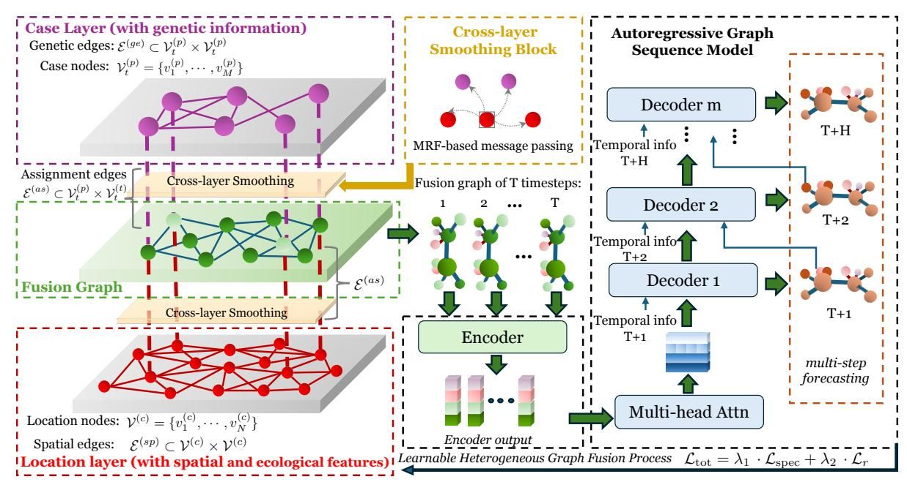
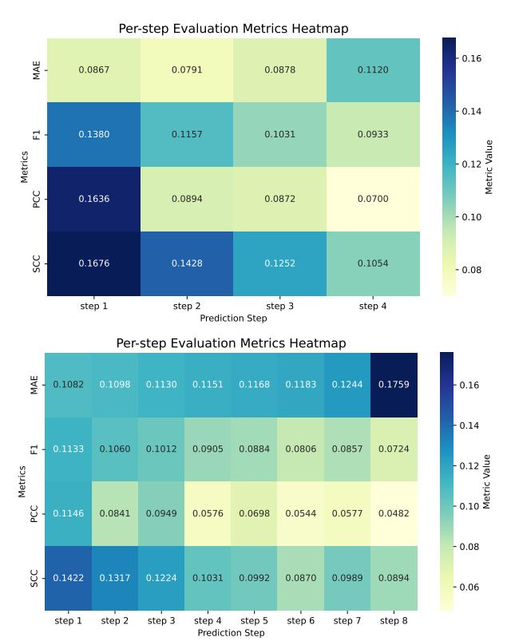
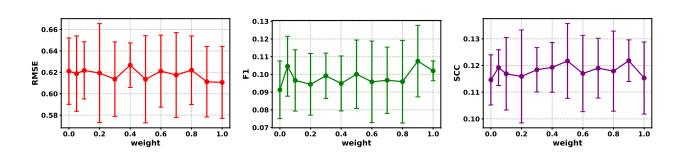

# Genomic-Informed Heterogeneous Graph Learning for Spatiotemporal Avian Influenza Outbreak Forecasting

[Jing Du](https://orcid.org/0000-0003-4113-0875) Computer Science and Engineering, Faculty of Engineering The University of New South Wales Sydney, Australia jing.du2@unsw.edu.au

[Haley Stone](https://orcid.org/0000-0003-1997-0042) The Kirby Institute Faculty of Medicine & Health The University of New South Wales Sydney, Australia h.stone@unsw.edu.au

[Yang Yang](https://orcid.org/0000-0003-3960-5739) Computer Science and Engineering, Faculty of Engineering The University of New South Wales Sydney, Australia yang.yang26@unsw.edu.au

[Ashna Desai](https://orcid.org/0009-0003-3891-2486) Computer Science and Engineering, Faculty of Engineering The University of New South Wales Sydney, Australia ashna.desai@student.unsw.edu.au

[Hao Xue](https://orcid.org/0000-0003-1700-9215) The Hong Kong University of Science and Technology (Guangzhou) Guangzhou, China haoxue@hkust-gz.edu.cn

[Andreas Züfle](https://orcid.org/0000-0001-7001-4123) Department of Computer Science Emory University Atlanta, United States azufle@emory.edu

[C. Raina MacIntyre](https://orcid.org/0000-0002-3060-0555) The Kirby Institute Faculty of Medicine & Health The University of New South Wales Sydney, Australia r.macintyre@unsw.edu.au

[Flora D. Salim](https://orcid.org/0000-0002-1237-1664) Computer Science and Engineering, Faculty of Engineering The University of New South Wales Sydney, Australia flora.salim@unsw.edu.au

# Abstract

Accurate forecasting of Avian Influenza Virus (AIV) outbreaks within wild bird populations necessitates models that account for complex, multi-scale transmission patterns driven by diverse factors. While conventional spatiotemporal epidemic models are robust for human-centric diseases, they rely on spatial homophily and diffusive transmission between geographic regions. This simplification is incomplete for AIV as it neglects valuable genomic information critical for capturing dynamics like high-frequency reassortment and lineage turnover at the case level (e.g., genetic descent across regions), which are essential for understanding AIV spread. To address these limitations, we systematically formulate the AIV forecasting problem and propose **BLUE** (Bi-Layer genomic-aware heterogeneous graph fUsion pipelinE). This pipeline integrates genetic, spatial, and ecological data to achieve highly accurate outbreak forecasting. It 1) defines a multi-layered graph structure incorporating information from diverse sources and multiple layers (case and location), 2) applies cross-relation smoothing to smooth information flow across edge types, 3) performs graph fusion that preserves critical structural patterns backed by theoretical spectral guarantees, and 4) forecasts future outbreaks using an autoregressive graph sequence model to capture transmission dynamics. To support research, we release the Avian-US dataset, which provides

[This work is licensed under a Creative Commons Attribution 4.0 International License.](https://creativecommons.org/licenses/by/4.0) WWW '26, Dubai, United Arab Emirates. © 2026 Copyright held by the owner/author(s). ACM ISBN 979-8-4007-2307-0/2026/04 <https://doi.org/10.1145/3774904.3793010>

comprehensive genetic, spatial, and ecological data on US avian influenza outbreaks. BLUE demonstrates superior performance over existing baselines, highlighting the efficacy of integrating multilayer information for infectious disease forecasting. The code is available at: [https://github.com/cruiseresearchgroup/BLUE.](https://github.com/cruiseresearchgroup/BLUE)

# CCS Concepts

• Information systems → Spatial-temporal systems; • Applied computing → Health informatics.

# Keywords

Avian Influenza Forecasting, Heterogeneous Graph Neural Network, Spatiotemporal Forecasting, Epidemic Modeling

### ACM Reference Format:

Jing Du, Haley Stone, Yang Yang, Ashna Desai, Hao Xue, Andreas Züfle, C. Raina MacIntyre, and Flora D. Salim. 2026. Genomic-Informed Heterogeneous Graph Learning for Spatiotemporal Avian Influenza Outbreak Forecasting. In Proceedings of the ACM Web Conference 2026 (WWW '26), April 13–17, 2026, Dubai, United Arab Emirates. ACM, New York, NY, USA, [12](#page-11-0) pages.<https://doi.org/10.1145/3774904.3793010>

# 1 Introduction

Forecasting the transmission of Avian Influenza Virus (AIV) is a major challenge in epidemiology due to its potential for widespread dissemination in avian populations. The growing incidence of crossspecies transmission poses substantial risks to public health and global biosecurity. Consequently, accurate prediction of outbreak locations is vital for initiating early interventions to minimize infection risk [\[4,](#page-8-0) [34\]](#page-8-1). Prior epidemiological models primarily utilized mechanistic approaches [\[9,](#page-8-2) [14\]](#page-8-3) based on biological assumptions

and fixed compartmental structures. While suitable for simplified contexts, these models fail to incorporate network topology or interaction semantics [\[19\]](#page-8-4). Their reliance on low-dimensional Ordinary Differential Equation (ODE) systems tracks only the aggregate number of infected individuals within discrete states. This limits their ability to model temporal dependencies and the complex interlocation influence of real-world disease transmission dynamics.

To overcome the limitations of traditional epidemiological models, recent methods incorporate Graph Neural Networks (GNNs) with temporal architectures to capture spatio-temporal transmission dynamics from observational data [\[30\]](#page-8-5). These models are designed for human infectious diseases, such as Influenza-Like Illness (ILI) or COVID-19. Their design identifies topological transmission patterns across time steps by relying on geographical correlations for connectivity. It enables the learning of temporal correlations among spatially dispersed locations embedded in the graph structure. This formulation offers a flexible, data-driven framework for supporting disease surveillance and control decisions, representing a significant advancement over classic forecasting methods [\[3,](#page-8-6) [30\]](#page-8-5).

Nevertheless, existing spatio-temporal methods are unsuitable for AIV forecasting, as the problem formulation fundamentally differs from that of human infectious diseases. Conventional ILI and COVID-19 forecasting address single-host problems. They model infection risk as a spatio-temporal process that propagates diffusively between adjacent locations or via human mobility networks [\[22,](#page-8-7) [33,](#page-8-8) [37\]](#page-8-9). In this context, a single-layer location graph is sufficient since proximity and mobility accurately proxy infection pathways among human. By contrast, AIV spread is inherently multi-source and multi-level [\[15,](#page-8-10) [39\]](#page-8-11). It spreads through multiple concurrent pathways, including long-range geographical seeding by migratory wild birds and evolutionary reassortment [\[4,](#page-8-0) [21\]](#page-8-12). Critically, these dynamics operate on distinct spatial and genetic levels. For instance, two geographically distant cases can be epidemiologically identical if they share a specific viral lineage, while neighboring cases might be unrelated outbreaks. These invisible linkages reside in the genetic space and are unobservable in the spatial domain. Models treating all cases as homogeneous count data inevitably obscure this critical genetic signal [\[10,](#page-8-13) [37\]](#page-8-9). Consequently, this complexity reveals a mismatch between AIV dynamics and the conventional modeling paradigm. These models typically follow a homogeneous setup, where nodes represent locations connected by static adjacencies [\[27,](#page-8-14) [29,](#page-8-15) [45\]](#page-9-0) or learned correlations [\[31,](#page-8-16) [35\]](#page-8-17). They focus solely on location-level transmission and treat all infected cases as equally infectious, limiting them to capturing only spatial transmission pathways. Even recent efforts that integrate ecological variables [\[26,](#page-8-18) [32\]](#page-8-19) or combine GNNs with mechanistic components [\[5,](#page-8-20) [36,](#page-8-21) [40\]](#page-8-22) still operate on a homogeneous graph structure based on spatial locations. This paradigm overlooks high-frequency reassortment and lineage turnover driven by case-to-case transmission, which are essential for comprehensive AIV spread understanding.

Conceptually, provides a lineage view: genetic similarity between cases suggests epidemiological linkages that transcend geography, revealing lineage-specific differences in transmissibility that are not visible through spatial or ecological proximity alone. Existing homogeneous GNNs are inherently limited in capturing these multi-factor interactions. However, Heterogeneous GNNs (HGNNs) [\[46\]](#page-9-1) possess the capability to model heterogeneous node types

(e.g., cases and locations) and construct multi-type edges based on both spatial and genetic relations, making them highly appropriate for sophisticated epidemiological modeling. Nonetheless, existing HGNNs [\[16,](#page-8-23) [17,](#page-8-24) [23,](#page-8-25) [44\]](#page-8-26) assumes static node sets and a fixed relational schema. The AIV forecasting problem violates this assumption due to two dynamics: 1) Hierarchical Relationship: Cases and locations have an inherent hierarchical relationship, where each case belongs to a specific location; 2) Dynamic Evolution: Each timestep involves a fixed set of location nodes but a dynamically changing set of infection cases (new infectious cases appear, dead ones vanish). This results in a dynamic evolution of both the case node set and the connectivity structure. Existing HGNNs cannot simultaneously handle these dynamic graphs with changing node sets and distinct inter-layer semantics. Therefore, a principled hierarchical heterogeneous graph modeling method is required to manage multi-layer heterogeneous graphs while maintaining structural integrity and semantic distinctions across layers.

To this end, we systematically ormulate AIV forecasting as a spatio-temporal hierarchical forecasting task and propose **BLUE** (Bi-Layer genomic-aware Graph FUsion pipelinE). **BLUE** defines cases and locations as heterogeneous nodes in dual layers and integrates spatial, genetic, and ecological information into a unified framework for outbreak prediction. The approach begins by constructing a bilayer heterogeneous graph with diverse nodes and multi-type edges. To manage node heterogeneity, we apply a cross-layer smoothing block, inspired by Markov Random Fields (MRF) [\[11\]](#page-8-27), to smooth the heterogeneous message passing. Since the ultimate goal is locationbased, we we then construct homogeneous fusion graphs at the location level. We employ a Locality-Sensitive Hashing (LSH)-based sampler [\[8,](#page-8-28) [20\]](#page-8-29) to achieve efficient information integration from the complex bi-layer structure. Integrating multi-type relations can lead to significant information loss in transmission structures without reasonable guarantee of preserving structural information within the graphs. To preserve fine-grained structural semantics, we design a spectral regularizer that constrains the learned fusion graph to approximate the global diffusion geometry of the original bi-layer structure with a theoretical bound. To support rigorous evaluation and motivate further research, we publicly release a new avian influenza surveillance dataset. Our main contributions are:

- 1. New Topological Paradigm: We systematically define AIV transmission on spatial and genetic levels and propose BLUE, a pipeline that simultaneously models heterogeneous nodes with multi-type information, establishing a principled formulation beyond prior homogeneous work.
- 2. Theoretical guarantees for Graph Fusion: We design an informationpreserving graph fusion method to simplify the heterogeneous structure without discarding crucial epidemiological information, guaranteed by a spectral theoretical bound.
- 3. New AIV Dataset: We publicly release the United States avian influenza surveillance data, Avian-US, and empirically validate BLUE, demonstrating its superior performance.

# 2 Related Works

Epidemic Modeling. Epidemiological forecasting mainly rely on fixed graph structures, typically incorporating predefined spatial or mobility-based priors such as geographic adjacency matrices [\[27,](#page-8-14) [42,](#page-8-30) [45\]](#page-9-0) or static population flow matrices [\[29,](#page-8-15) [37\]](#page-8-9) as

Figure 1: **BLUE** consists of 4 components: Bi-layer Heterogeneous Graph Construction models AIV spread using a bi-layer heterogeneous graph with two types of nodes (location and case) and three types of edges (spatial, genetic, and assignment). Then, the MRF-inspired Cross-layer Smoothing block aggregates neighbor information to create coherent representations for heterogeneous nodes and their connections. Graphs are then fused into Information-Preserving Fusion Graphs that preserve the original transmission structure using a spectral regularizer. Finally, Autoregressive Encoder–Decoder Forecasting encodes node interactions over time to generate multi-step forecasts.

normalized average of transformed neighbor embeddings

(��) (��) = 1 |N�� (��)| ∑︁ ��∈N�� (��) W���� (��−1) �� , (1)

where N�� (��) denotes the immediate neighbors of node �� under relation ��. The matrix W�� is a trainable parameter matrix that represents the strength of interactions between connected nodes under relation ��, thereby adhering to the local Markov property. These relation-specific messages, which reflect the smoothed neighbor information, are then aggregated across all relations �� and combined with a node type-specific bias b�� (��) (where �� (��) ∈ {��, ��} denotes the node type):

x (��) �� = ReLU ∑︁ (��) (��) + b�� (��) ! . (2)

Here, we employ the ReLU activation function, ensuring that node embedding x (��) is non-linearly influenced by the semantics of its neighbors through the respective relations. Iteratively applying this update rule �� times mimics belief propagation, systematically spreading information across the graph structure while explicitly considering the distinct relational contexts. Therefore, by restricting propagation to immediate neighbors, applying learnable, relationspecific transformations (W�� ), and iteratively refining node representations, this approach effectively integrates key aspects of MRF inference into a differentiable graph-based framework.

# 3.2 Information-preserving Fusion Graphs

Heterogeneous graphs, characterized by diverse types of nodes and relationships, exhibit an inherently complex structure stemming from the simultaneous presence of distinct local and global relational dependencies. Converting a heterogeneous graph into a homogeneous form can significantly simplify the representation, however, it risks losing valuable information embedded in the multisource relations. To overcome this limitation, we propose the Fusion Graph method. This method transforms the original heterogeneous structure (comprising location and case nodes connected by multiple relational types) into a unified representation under a principle of spectral alignment (details provided in Section [3.3\)](#page-4-0). Consequently, The resulting Fusion Graph maintains the original heterogeneous complexity while offering a simpler, more interpretable structure (The timestep �� is omitted for notational clarity).

Fusion Nodes. Fusion Nodes are aggregated location representations, systematically integrating neighbor information from the heterogeneous graph G�� .The Fusion Node embedding x�� for location (�� ) is generated via a three-step fusion:

z (�� ) �� = ��1 [x (�� ) �� ∥ x (��\_spatial) �� ] (Location Features + Spatial Context) z (��) = ��2 [x (��) ∥ x (��\_genetic) (Genetic Context) x�� = ��(��) [z (�� ) ∥ z (��) (Final Fusion) (3)

Here, ��1, ��2, and ��(��) are Multi-Layer Perceptrons (MLPs) with nonlinear activation functions (shared across time steps), and [· ∥ ·]

Table 1: Overall Performance. Experiments are run under�� =4 and ��=4. \* denote statistically significant improvements, validated by a paired t-test at a significance level of �� &lt; 0.05 against the runner-up model. Best results are bolded.

### 4.1 Overall Performance

**BLUE** achieves the highest PCC. However, since PCC is sensitive to small fluctuations and can be skewed in sparse datasets, we also incorporate the SCC, a rank-based metric suitable for capturing sparse, non-linear epidemic signals. As shown in Table[.1,](#page-6-0) HGT is the runner-up in regression-based metrics (RMSE/MAE) due to its capacity to model heterogeneous nodes. Epi-Cola-GNN excels at capturing linear correlations, while STSGT demonstrates superior performance in outbreak detection, achieving the runner-up F1 score. **BLUE** achieves the highest PCC and SCC, confirming its strong capacity to capture both linear and non-linear correlations inherent in the AIV transmission data. Across all metrics, **BLUE** exhibits a clear advantage: it reduces the RMSE and MSE by 0.0054 compared to the runner-up (HGT) and provides reasonable improvements in PCC and SCC against all baselines. Furthermore, **BLUE** achieves the highest F1 score, which highlights its superior ability to detect outbreak occurrences beyond merely predicting case counts.

To provide finer-grained insights into forecasting performance, we conducted a temporal analysis of per-step results under a lookback window�� = 4 and forecasting horizons �� ∈ {4, 8}. Consistent with the challenge of long-range forecasting, nearly all evaluation metrics degrade as the prediction horizon �� increases, shown in Fig. [2.](#page-6-1) **BLUE** performs best at Step 1 for both �� = 4 and �� = 8, achieving its peak F1 score, PCC, and SCC. Performance then consistently declines as the predicted step increases, resulting in the lowest outbreak detection ability and largest prediction errors at the final step. Specifically, **BLUE**'s capacity to detect outbreaks decreases, with the F1 score falling from 0.1380 to 0.0933 for �� = 4 and from 0.1133 to 0.0724 for �� = 8. SCC also shows a consistent decrease. Despite slight fluctuations, MAE of predicted infection counts increases with each successive step, rising from 0.0867 to 0.1120 for �� = 4 and from 0.1082 to 0.1759 for �� = 8.

# 4.2 Ablation Study

We validate the design choices in **BLUE** by comparing **BLUE**against eight variants: 1) w/o gen only utilizes the spatial distances and assignment relationships; 2) w/o CS+Spec only implement the autoregressive encoder-decoder framework; 3) w/o CS excludes the cross-layer smoothing block; 4) w/o Spec excludes the spectral regularizer from the objective function; 5) w/ LSH removes attention

Figure 2: Per-step performance on Avian-US with �� = 4 (up) and �� = 8 (down).

Table 2: Ablation study on Avian-US.

|      | Variants | RMSE   | MAE    | F1     | PCC    | SCC    |
|------|----------|--------|--------|--------|--------|--------|
| w/o  | gen      | 0.8093 | 0.1667 | 0.0721 | 0.0686 | 0.0946 |
| w/o  | CS       | 0.7824 | 0.1828 | 0.0692 | 0.0677 | 0.0911 |
| w/o  | Spec     | 0.8504 | 0.2310 | 0.0839 | 0.0729 | 0.1035 |
| w/o  | CS+Spec  | 0.9020 | 0.2002 | 0.0605 | 0.0543 | 0.0869 |
| w/   | LSH      | 0.6141 | 0.1007 | 0.0994 | 0.0855 | 0.1105 |
| w/   | attn     | 0.6157 | 0.0945 | 0.0901 | 0.0755 | 0.1114 |
| w/o  | eco      | 0.6772 | 0.1373 | 0.0978 | 0.0771 | 0.1093 |
| w/   | drop     | 0.6713 | 0.1254 | 0.0944 | 0.0801 | 0.1153 |
| BLUE |          | 0.6106 | 0.0848 | 0.1020 | 0.0871 | 0.1218 |

Figure 3: Impact of spectral alignment weight ��1.

gate with simple averaging; 6) w/ attn only use attention gate for fusion edge calculation; 7) w/o eco removes location ecological features (bird abundance); 8) w/ drop randomly drop 20% of edges from bi-layer heterogeneous graphs. The results are shown in Table. [2.](#page-6-2)

The CS block and the Spectral Regularizer function work collaboratively. Disabling CS (w/o CS) allows noise from the initial sparse graph construction to propagate, harming ranking metrics. Similarly, removing the spectral constraint (w/o Spec) decouples the learned graph structure from the true epidemiological diffusion process, leading to overfitting. The combined removal of these components (w/o CS+Spec) yields the poorest performance, demonstrating that raw auto-regressive encoding is insufficient without structurally guided regularization. Removing genetic edges (w/o gen) causes a sharp increase in MAE, confirming that AIV outbreaks follow complex biological pathways that spatial proximity cannot fully explain. This is further supported by the w/ drop experiment, where randomly severing 20% of edges degrades performance, showing that AIV spread forecasting relies on a reliable, complete connectivity structure for aggregation. Moreover, two key observations arise from the attention experiments. First, replacing the dynamic gate with simple averaging (w/ LSH) increases MAE, proving that the model must learn to weigh spatial versus genetic risks adaptively. Second, using full dense attention (w/ attn) underperforms compared to the LSH-based approach (reducing F1 to 0.0901). This suggests that LSH acts as a beneficial constraint—limiting aggregation to high-probability neighborhoods prevents the model from overfitting to noisy, long-range interactions common in sparse data. Overall, **BLUE** achieves the best performance across all metrics, confirming that each component contributes distinctly to capturing the spatiotemporal dynamics of AIV spread.

### 4.3 Spectral Alignment L��������

We analyze the impact of the spectral regularizer weight, ��1, which controls the trade-off between structural transmission alignment and forecasting accuracy. As shown in Figure [3,](#page-7-0) incorporating L�������� significantly boosts performance across all metrics. Specifically, as ��1 is tuned from 0 to 0.9, we observe a consistent reduction in forecasting error, with RMSE dropping from 0.6211 to 0.6112. The model's ability to identify outbreak events improves drastically, with the F1 score peaking at ��1 = 0.9, a 17.1% increase compared to the baseline (��1 = 0). SCC follows an identical trend, confirming that spectral constraints assist the model in capturing correct correlation patterns. It is worth noting that at ��1 = 1.0, performance slightly declines, though the error bars narrow, indicating higher stability. This suggests that while spectral regularization is beneficial, an excessively large ��1 forces the model to over-prioritize structural alignment at the expense of the main forecasting objective.

# 4.4 Backbone Choice

We validate our architectural choice by replacing GraphSAGE with GCN and GAT while maintaining fixed experimental settings (�� = 2). Note that the spectral regularizer (��1 = 0.2) was excluded for GAT as its attention mechanism conflicts with the static spectral constraints. Empirical results confirm that GraphSAGE consistently exhibits superior representational capability within our framework, outperforming alternatives in RMSE, MAE, and F1 scores. Architecturally, GraphSAGE's inductive neighbor sampling aligns more effectively with **BLUE**'s information-preserving design than GCN or GAT. Consequently, GraphSAGE is retained as the optimal encoder for capturing the spatiotemporal dynamics of AIV spread.

Table 3: Performance comparison.

| Metrics | BLUE   | w/GCN  | w/GAT  |
|---------|--------|--------|--------|
| RMSE    | 0.6106 | 0.6678 | 0.6791 |
| MAE     | 0.0848 | 0.0970 | 0.0942 |
| F1      | 0.1001 | 0.0967 | 0.0893 |
| PCC     | 0.0871 | 0.0664 | 0.0696 |
| SCC     | 0.1217 | 0.0931 | 0.1089 |

### 5 Conclusion and Discussion

In this work, we proposed **BLUE**, a bi-layer heterogeneous graph fusion framework designed to advance epidemic forecasting by integrating genetic and spatial modalities. **BLUE** uses cross-layer smoothing and information-preserving graph fusion to learn coherent representations of disease spread through an autoregressive encoder–decoder architecture. Through a novel integration of crosslayer smoothing and spectral regularization, the model effectively learns coherent representations of disease transmission dynamics within an auto-regressive encoder-decoder architecture. Extensive empirical validation on the newly constructed Avian-US benchmark demonstrates that **BLUE** consistently outperforms state-of-the-art spatiotemporal and epidemic forecasting baselines, establishing its robustness across diverse spatial and epidemiological settings. Beyond immediate performance gains, **BLUE** offers a generalizable theoretical contribution, providing a mathematically grounded method for maintaining structural alignment in complex, multi-view graph learning. Although the current study relies on AIV, the architecture is inherently extensible. Future iterations will exploit this extensibility to incorporate environmental covariates and broaden the biological scope to include cross-species transmission, extending **BLUE** to comprehensive real-world AIV monitoring.

### 6 Acknowledgment

This research is supported by the Australian Commonwealth Scientific and Industrial Research Organisation (CSIRO) and the United States National Science Foundation under Grant No. 2302968, titled "Understanding Bias in AI Models for the Prediction of Infectious Disease Spread". This research is conducted by the ARC Centre of Excellence for Automated Decision-Making and Society (No. CE200100005), funded by the Australian Government through the Australian Research Council. We acknowledge the utilization of computational resources from the Katana High Performance Computing (HPC) cluster, which is supported by the Faculty of Engineering, UNSW Sydney. We also acknowledge the National Computational Infrastructure (NCI) for providing access to the Gadi supercomputer.

### References

- [1] Soumyanil Banerjee, Ming Dong, and Weisong Shi. 2022. Spatial–temporal synchronous graph transformer network (stsgt) for covid-19 forecasting. Smart Health 26 (2022), 100348. [2] Peter J Bonney, Sasidhar Malladi, Gert Jan Boender, J Todd Weaver, Amos Ssematimba, David A Halvorson, and Carol J Cardona. 2018. Spatial transmission of H5N2 highly pathogenic avian influenza between Minnesota poultry premises during the 2015 outbreak. PloS one 13, 9 (2018), e0204262. [3] Rickard Brüel Gabrielsson. 2020. Universal function approximation on graphs. Advances in neural information processing systems 33 (2020), 19762–19772. [4] Valentina Caliendo, Nicola S Lewis, Anne Pohlmann, Stephen R Baillie, Ashley C Banyard, Martin Beer, Ian H Brown, RAM Fouchier, Rowena DE Hansen, Thomas K Lameris, et al. 2022. Transatlantic spread of highly pathogenic avian influenza H5N1 by wild birds from Europe to North America in 2021. Scientific reports 12, 1 (2022), 11729. [5] Qi Cao, Renhe Jiang, Chuang Yang, Zipei Fan, Xuan Song, and Ryosuke Shibasaki. 2022. Mepognn: Metapopulation epidemic forecasting with graph neural networks. In Joint European conference on machine learning and knowledge discovery in databases. Springer, 453–468. [6] Moses S Charikar. 2002. Similarity estimation techniques from rounding algorithms. In Proceedings of the thiry-fourth annual ACM symposium on Theory of computing. 380–388. [7] Jianpeng Cheng, Li Dong, and Mirella Lapata. 2016. Long Short-Term Memory-Networks for Machine Reading. In Proceedings of the 2016 Conference on Empirical Methods in Natural Language Processing. Association for Computational Linguistics. [8] Mayur Datar, Nicole Immorlica, Piotr Indyk, and Vahab S Mirrokni. 2004. Localitysensitive hashing scheme based on p-stable distributions. In Proceedings of the twentieth annual symposium on Computational geometry. 253–262. [9] Rossella Della Marca, Nadia Loy, and Andrea Tosin. 2023. An SIR model with viral load-dependent transmission. Journal of Mathematical Biology 86, 4 (2023),
- 61. [10] Songgaojun Deng, Shusen Wang, Huzefa Rangwala, Lijing Wang, and Yue Ning. 2020. Cola-GNN: Cross-location attention based graph neural networks for longterm ILI prediction. In Proceedings of the 29th ACM international conference on information & knowledge management. 245–254. [11] PL Dobruschin. 1968. The description of a random field by means of conditional probabilities and conditions of its regularity. Theory of Probability & Its Applications 13, 2 (1968), 197–224. [12] eBird. 2022. Weekly Bird Abundance Data. [https://science.ebird.org/en/status](https://science.ebird.org/en/status-and-trends)[and-trends](https://science.ebird.org/en/status-and-trends) Accessed January 2025. [13] National Center for Biotechnology Information (NCBI). 2025. GenBank Sequence Database.<https://www.ncbi.nlm.nih.gov/genbank/> Accessed January 2025. [14] Xiaolong Geng, Gabriel G Katul, Firas Gerges, Elie Bou-Zeid, Hani Nassif, and Michel C Boufadel. 2021. A kernel-modulated SIR model for Covid-19 contagious spread from county to continent. Proceedings of the National Academy of Sciences 118, 21 (2021), e2023321118. [15] Jolene A Giacinti, Madeline Jarvis-Cross, Hannah Lewis, Jennifer F Provencher, Yohannes Berhane, Kevin Kuchinski, Claire M Jardine, Anthony Signore, Sarah C Mansour, Denby E Sadler, et al. 2024. Transmission dynamics of highly pathogenic avian influenza virus at the wildlife-poultry-environmental interface: a case study. One Health 19 (2024), 100932. [16] Rui Guo, Xu Tian, Hanhe Lin, Stephen McKenna, Hong-Dong Li, Fei Guo, and Jin Liu. 2023. Graph-based fusion of imaging, genetic and clinical data for degenerative disease diagnosis. IEEE/ACM Transactions on Computational Biology and Bioinformatics 21, 1 (2023), 57–68. [17] Konstantin Hemker, Nikola Simidjievski, and Mateja Jamnik. 2024. HEALNet: Multimodal fusion for heterogeneous biomedical data. Advances in Neural Information Processing Systems 37 (2024), 64479–64498. [18] Ziniu Hu, Yuxiao Dong, Kuansan Wang, and Yizhou Sun. 2020. Heterogeneous graph transformer. In Proceedings of the web conference 2020. 2704–2710. [19] Elizabeth Hunter and John Kelleher. 2022. Understanding the assumptions of an SEIR compartmental model using agentization and a complexity hierarchy. Journal of Computational Mathematics and Data Science 4 (07 2022), 100056. [doi:10.1016/j.jcmds.2022.100056](https://doi.org/10.1016/j.jcmds.2022.100056) [20] Omid Jafari, Preeti Maurya, Parth Nagarkar, Khandker Mushfiqul Islam, and Chidambaram Crushev. 2021. A survey on locality sensitive hashing algorithms and their applications. arXiv preprint arXiv:2102.08942 (2021). [21] Ahmed Kandeil, Christopher Patton, Jeremy C Jones, Trushar Jeevan, Walter N Harrington, Sanja Trifkovic, Jon P Seiler, Thomas Fabrizio, Karlie Woodard, Jasmine C Turner, et al. 2023. Rapid evolution of A (H5N1) influenza viruses after intercontinental spread to North America. Nature communications 14, 1 (2023), 3082. [22] Minkyoung Kim, Jae Heon Kim, and Beakcheol Jang. 2024. Forecasting epidemic spread with recurrent graph gate fusion transformers. IEEE Journal of Biomedical and Health Informatics (2024). [23] Sein Kim, Namkyeong Lee, Junseok Lee, Dongmin Hyun, and Chanyoung Park. 2023. Heterogeneous graph learning for multi-modal medical data analysis. In Proceedings of the AAAI Conference on Artificial Intelligence, Vol. 37. 5141–5150. [24] Motoo Kimura. 1980. A simple method for estimating evolutionary rates of base substitutions through comparative studies of nucleotide sequences. Journal of Molecular Evolution 16, 2 (1980), 111–120. [doi:10.1007/BF01731581](https://doi.org/10.1007/BF01731581) [25] Yaguang Li, Rose Yu, Cyrus Shahabi, and Yan Liu. 2018. Diffusion Convolutional Recurrent Neural Network: Data-Driven Traffic Forecasting. In International Conference on Learning Representations. [26] Bryan Lim, Sercan Ö Arık, Nicolas Loeff, and Tomas Pfister. 2021. Temporal fusion transformers for interpretable multi-horizon time series forecasting. International Journal of Forecasting 37, 4 (2021), 1748–1764. [27] Chen Lin, Jianghong Zhou, Jing Zhang, Carl Yang, and Eugene Agichtein. 2023. Graph Neural Network Modeling of Web Search Activity for Real-time Pandemic Forecasting. In 2023 IEEE 11th International Conference on Healthcare Informatics (ICHI). IEEE, 128–137. [28] Mutong Liu, Yang Liu, and Jiming Liu. 2023. Epidemiology-aware deep learning for infectious disease dynamics prediction. In Proceedings of the 32nd ACM International Conference on Information and Knowledge Management. 4084–4088. [29] Yang Liu, Yu Rong, Zhuoning Guo, Nuo Chen, Tingyang Xu, Fugee Tsung, and Jia Li. 2023. Human mobility modeling during the COVID-19 pandemic via deep graph diffusion infomax. In Proceedings of the AAAI Conference on Artificial Intelligence, Vol. 37. 14347–14355. [30] Zewen Liu, Guancheng Wan, B Aditya Prakash, Max SY Lau, and Wei Jin. 2024. A review of graph neural networks in epidemic modeling. In Proceedings of the 30th ACM SIGKDD Conference on Knowledge Discovery and Data Mining. 6577–6587. [31] Viet Bach Nguyen, Truong Son Hy, Long Tran-Thanh, and Nhung Nghiem. 2023. Predicting COVID-19 pandemic by spatio-temporal graph neural networks: A New Zealand's study. arXiv preprint arXiv:2305.07731 (2023). [32] Eirini Papagiannopoulou, Matías Nicolás Bossa, Nikos Deligiannis, and Hichem Sahli. 2024. Long-term regional influenza-like-illness forecasting using exogenous data. IEEE Journal of Biomedical and Health Informatics 28, 6 (2024), 3781–3792. [33] Sen Pei, Sasikiran Kandula, Wan Yang, and Jeffrey Shaman. 2018. Forecasting the spatial transmission of influenza in the United States. Proceedings of the National Academy of Sciences 115, 11 (2018), 2752–2757. [34] Diann J Prosser, Cody M Kent, Jeffery D Sullivan, Kelly A Patyk, Mary-Jane McCool, Mia Kim Torchetti, Kristina Lantz, and Jennifer M Mullinax. 2024. Using an adaptive modeling framework to identify avian influenza spillover risk at the wild-domestic interface. Scientific Reports 14, 1 (2024), 14199. [35] Xiaojun Pu, Jiaqi Zhu, Yunkun Wu, Chang Leng, Zitong Bo, and Hongan Wang. 2024. Dynamic adaptive spatio–temporal graph network for COVID-19 forecasting. CAAI Transactions on Intelligence Technology 9, 3 (2024), 769–786. [36] Hao Sha, Mohammad Al Hasan, and George Mohler. 2021. Source detection on networks using spatial temporal graph convolutional networks. In 2021 IEEE 8th International Conference on Data Science and Advanced Analytics (DSAA). IEEE, 1–11. [37] Yinzhou Tang, Huandong Wang, and Yong Li. 2023. Enhancing spatial spread prediction of infectious diseases through integrating multi-scale human mobility dynamics. In Proceedings of the 31st ACM International Conference on Advances in Geographic Information Systems. 1–12. [38] Ashish Vaswani, Noam Shazeer, Niki Parmar, Jakob Uszkoreit, Llion Jones, Aidan N Gomez, Łukasz Kaiser, and Illia Polosukhin. 2017. Attention is all you need. Advances in neural information processing systems 30 (2017). [39] Srinivasan Venkatramanan, Adam Sadilek, Arindam Fadikar, Christopher L Barrett, Matthew Biggerstaff, Jiangzhuo Chen, Xerxes Dotiwalla, Paul Eastham, Bryant Gipson, Dave Higdon, et al. 2021. Forecasting influenza activity using machine-learned mobility map. Nature communications 12, 1 (2021), 726. [40] Lijing Wang, Aniruddha Adiga, Jiangzhuo Chen, Adam Sadilek, Srinivasan Venkatramanan, and Madhav Marathe. 2022. Causalgnn: Causal-based graph neural networks for spatio-temporal epidemic forecasting. In Proceedings of the AAAI conference on artificial intelligence, Vol. 36. 12191–12199. [41] Zhaonan Wang, Renhe Jiang, Hao Xue, Flora D Salim, Xuan Song, and Ryosuke Shibasaki. 2022. Event-aware multimodal mobility nowcasting. In Proceedings of the AAAI Conference on Artificial Intelligence, Vol. 36. 4228–4236. [42] Feng Xie, Zhong Zhang, Liang Li, Bin Zhou, and Yusong Tan. 2022. EpiGNN: Exploring spatial transmission with graph neural network for regional epidemic forecasting. In Joint European Conference on Machine Learning and Knowledge Discovery in Databases. Springer, 469–485. [43] Bing Yu, Haoteng Yin, and Zhanxing Zhu. 2018. Spatio-Temporal Graph Convolutional Networks: A Deep Learning Framework for Traffic Forecasting. In Proceedings of the Twenty-Seventh International Joint Conference on Artificial Intelligence. International Joint Conferences on Artificial Intelligence Organization, 3634–3640. [44] Fuqiang Yu, Lizhen Cui, Huanhuan Chen, Yiming Cao, Ning Liu, Weiming Huang, Yonghui Xu, and Hua Lu. 2022. HealthNet: A health progression network via heterogeneous medical information fusion. IEEE Transactions on Neural Networks and Learning Systems 34, 10 (2022), 6940–6954.

[45] Shuo Yu, Feng Xia, Shihao Li, Mingliang Hou, and Quan Z Sheng. 2023. Spatiotemporal graph learning for epidemic prediction. ACM Transactions on Intelligent Systems and Technology 14, 2 (2023), 1–25. [46] Chuxu Zhang, Dongjin Song, Chao Huang, Ananthram Swami, and Nitesh V Chawla. 2019. Heterogeneous graph neural network. In Proceedings of the 25th ACM SIGKDD international conference on knowledge discovery & data mining. 793–803.

### A Avian-US Dataset Setup

The Avian-US dataset is a spatiotemporal, multi-modal dataset designed to support forecasting and modeling of avian influenza outbreaks across the United States. It integrates epidemiological records, viral genomic sequences, and host population data across 3,227 U.S. counties from 2021–2024. Each modality is spatially and temporally aligned at the county-week level, enabling multi-layered graph construction for downstream forecasting tasks.

# A.1 Data Collection

This dataset integrates spatiotemporal outbreak data, genomic sequences, and species-level abundance observations into a structured multilayer representation for disease forecasting. Each stream was independently collected but programmatically harmonized for modeling integration.

Infected case data were sourced from federal surveillance systems and include time-stamped infection reports for host data recorded at the county level across the continental United States from 2021 to 2024. Each record includes a free-text host descriptor, location metadata, and a collection date. To standardize taxonomic information, host descriptors were programmatically mapped to a reference taxonomy using a hierarchical classification schema derived from the International Ornithological Congress (IOC) avian taxonomy. This resolved inconsistencies such as overlapping or ambiguous common names by aligning to stable scientific identifiers.

Genomic data consist of hemagglutinin (HA) segment sequences found in publicly available viral genome repositories [\[13\]](#page-8-42). Sequences with sufficient metadata were retained and filtered to include only wild bird hosts. A probabilistic record linkage model was used to associate sequences with case records. This model was trained on labelled match/non-match examples and used gradient-boosted decision trees to compute a match score based on taxonomic agreement, spatial proximity, and temporal overlap (within a ±14-day window). High-confidence matches were retained for downstream analysis.

Host population data were drawn from the eBird Status and Trends product, which provides weekly abundance estimates at 3 km resolution for North American bird species [\[12\]](#page-8-43). Raster values were extracted for each species and week, then aggregated at the county level to align with the spatial granularity of case data. Only wild bird species were retained, and abundance vectors were indexed by county and week.

All records were assigned stable identifiers and organized into structured, timestamped tables. The pipeline ensures consistency across modalities while maintaining temporal fidelity and specieslevel resolution.

# A.2 Data Description

The dataset comprises real-world, multi-source data documenting avian influenza outbreaks in the United States from January

2021 to December 2024. It includes temporally aligned information on confirmed infection cases, viral genome sequences, and wild bird abundance estimates, collected and harmonized at a weekly resolution.

The epidemiological component consists of over 12,000 reported H5-positive wild bird cases, spanning all 48 contiguous U.S. states. Each record includes collection date, geographic location (mapped to U.S. counties), and host classification. Taxonomic labels were normalised using a hierarchical mapping system that resolves ambiguous or underspecified entries to consistent species-level identifiers, informed by IOC naming conventions.

A subset of 8,000 cases was associated with full or partial HA segment sequences retrieved from public repositories. Genomic data were filtered to retain wild bird hosts only, and sequence metadata (host, date, location) were cleaned and harmonised to match epidemiological records. Genomic divergence between HA segment sequences was computed using the K80 model, which accounts for substitution asymmetry between transitions (A↔G, C↔T) and transversions. For each aligned sequence pair, we calculate the observed proportions of transitions (��) and transversions (��), and estimate the evolutionary distance �� as:

�� = − 1 log(1 − 2�� − ��) − 1 4 log(1 − 2��)

where �� = #transitions �� and �� = #transversions �� , with �� denoting the aligned sequence length. This evolutionary distance matrix encodes biologically grounded measures of divergence under a continuoustime Markov model and is well-suited for comparing within-clade avian influenza sequences. It is used as an input feature for constructing genomic similarity edges in the downstream heterogeneous graph.

Host population context was derived from over 630 weekly avian abundance layers produced by the eBird Status and Trends project [\[12\]](#page-8-43). These layers estimate the relative abundance of bird species at 3 km resolution across North America. Raster values were extracted and aggregated at the county level for all species matching wild bird families in the outbreak dataset. The resulting abundance vectors were aligned weekly to match case timelines and stored in compressed array format.

All data layers were temporally aligned by epidemiological week. Metadata were standardised across data types, with fields for date, location, taxonomic label, and abundance scores. Unique identifiers were assigned to all records to enable traceability across modalities. The dataset is designed to support temporal, ecological, and genetic analysis of avian influenza dynamics in wild bird populations using real-world observations, without reliance on synthetic or simulated data.

# B Experiments

# B.1 Experimental Settings.

In our empirical evaluations, we implement ST-GCN, SelfAttnRNN, DCRNN, and Cola-GNN using the open-source Cola-GNN repository [2](#page-9-4) . ST-Net and EAST-Net are built upon the official EAST-Net

2https://github.com/amy-deng/colagnn

implementation [3](#page-10-0) . Implementation of Epi-GNN [4](#page-10-1) and Epi-Cola-GNN [5](#page-10-2) are based on their respective publicly available source code.

Except HGT, all bas are primarily designed for single-layer spatiotemporal forecasting and assume either a fixed or learnable graph structure. As such, they are not directly compatible with the multilayer architecture of the Avian-US dataset. To make them applicable, we adapt each model by building homogeneous graphs tailored to its design. For ST-GCN, SelfAttnRNN, Cola-GNN, EpiGNN, EpiCola-GNN, and DCRNN, we define a binary adjacency matrix based on spatial proximity and genetic similarity between locations. This setup mirrors their original use cases, allowing these models to learn spatio-temporal patterns over a fixed location-level graph. For ST-Net and EAST-Net, which support adaptive graph learning, we initialize homogeneous graphs with no predefined edges. These models learn the graph structure dynamically, allowing them to infer inter-location dependencies during training without relying on geographic priors.

We set a short observation window of �� =4 steps and forecast the next ��=4 steps (all experiments are conducted under this setting unless specified), and report the averaged evaluation metrics of �� steps. Experiments of all baselines and **BLUE** are conducted under a 5-fold cross-validation with the same random seed to ensure consistency. In addition to fixed embedding size ��=8 and weight regularization ��2 = 5�� − 4, all baseline models are re-trained and tuned for optimal performance using their official open-source code. For **BLUE** , we search ��1 ∈ {0.01, 0.05, 0.1, 0.5, 1}, and choose ��1 = 0.1 for final evaluations. All experiments are run on either a single NVIDIA V100, DGX A100, or NVIDIA RTX A5000 GPU.

To ensure comparability in overall performance, we unify the embedding size and hidden dimensions across all models. We further apply the stratified weighting infection loss in Section [3.4](#page-5-2) to all baselines and re-run each baseline on the Avian-US dataset for fair comparison. The key hyperparameters used for all baseline models are listed below:

ST-GCN: embedding size=8, hidden dim=16, number of layers=3, epoch=100, learning rate=1e-5, dropout=0.3, window size=4, predicted horizon=4, weight of regularization term=5e-4.

SelfAttnRNN: embedding size=8, hidden dim=16, number of layers=2, epoch=100, learning rate=1e-5, dropout=0.3, window size=4, predicted horizon=4, weight of regularization term=5e-4.

DCRNN: embedding size=8, hidden dim=16, number of layers=2, max step of random walk=3, epoch=100, learning rate=1e-5, dropout=0.3, window size=4, predicted horizon=4, weight of regularization term=5e-4.

Cola-GNN: embedding size=8, hidden dim=16, number of filter=10, dilated rate for short term=1, dilated rate for long term=2, epoch=100, learning rate=1e-5, dropout=0.3, number of RNN layers=1, number of GNN layers=2, window size=4, predicted horizon=4, weight of regularization term=5e-4.

ST-Net: embedding size=8 (data) and 8 (time), Chebyshev layers=3, encoder layer=2, decoder layer=2, epoch=100, learning rate=1e-5, dropout=0.3, window size=4, predicted horizon=4, weight of regularization term=5e-4.

EAST-Net: spatial embedding size=8, modality embedding size =4, time embedding size=8, mobility prototype number = 8, memory dimension = 16, Chebyshev layers=3, encoder layer=2, decoder layer=2, epoch=100, learning rate=1e-5, dropout=0.3, window size=4, predicted horizon=4, weight of regularization term=5e-4.

Epi-GNN: embedding size=8, hidden dim=16, hidden dim of attention layer=64, pooling layer=2, patience=100, GNN layers=2, filer size=f1×5,1 and f1×3,1, window size=4, predicted horizon=4, epoch=100, learning rate=1e-5, dropout=0.3, weight of regularization term=5e-4.

Epi-Cola-GNN: embedding size=8, hidden dim=16, weight of epidemiological loss=0.5, patience=150, epoch=100, learning rate=1e-5, dropout=0.3, window size=4, predicted horizon=4, weight of regularization term=5e-4.

STSGT: embedding size=8, hidden dim=16, number of STSGT layers= 2, number of head= 2, dropout rate= 0.3, sampling number �� = 128, sampling depth �� = 2, learning rate=0.001, window size=4, predicted horizon=4, weight of regularization term=1e-4.

HGT: embedding size=8, hidden dim=16, number of layers= 2, dropout rate= 0.3, sampling number �� = 128, sampling depth �� = 2, learning rate=0.001, window size=4, predicted horizon=4, weight of regularization term=1e-4.

BLUE: embedding size=8, construction smoothing layer ��=2, ��=10, GraphSAGE layers ��=2, ��1=0.9, ��2=5e-4, epoch=100, learning rate=1e-5, dropout=0.3, window size=4, predicted horizon=4, ����=0.3, ����=0.3. The infection severities are set as �������� = 1, �������� = 5, ��ℎ����ℎ = 25, the corresponding weight are �������� = 1.0, �������� = 8.0, ��ℎ����ℎ = 15.0.

# B.2 Impact of ����

In the decoder process, ���� controls the influence of the previously decoded state. To isolate the impact of this temporal recurrence, we fix the observation and prediction windows at �� = 4 and �� = 4, respectively, and maintain the encoder hidden state weight at ���� = 0.3. We then evaluate the model's performance by varying ���� within the set {0.1, 0.2, 0.3, 0.4, 0.5, 0.6}. The results are summarized in Table[.4.](#page-11-1)

Lower values of ���� prioritize the immediate features of the current step, whereas higher values enforce stronger continuity with previous decoder outputs. Empirically, we observe that MAE is minimized at ���� = 0.3, while RMSE achieves its lowest at ���� = 0.5. Ranking metrics (F1, PCC, SCC) demonstrate a unimodal distribution: they gradually improve as ���� increases, peaking around the mid-range, before significantly deteriorating. This suggests that while a moderate reliance on previous predictions aids in capturing long-horizon trends, excessive autoregressive weighting (���� &gt; 0.4) dilutes the informative signals from the current step, leading to error propagation. Consequently, we select ���� = 0.3 as the optimal equilibrium, balancing the need for robust long-range trend extraction with the precision required for accurate infection count prediction.

# B.3 Impacts of �� and ��

We evaluate the robustness of **BLUE** by varying the observation window size �� ∈ {4, 8} and the prediction horizon �� ∈ {1, 2, 4, 8}.

Impact of Prediction Horizon ��. **BLUE** performs best at �� = 1, indicating that short-term temporal dependencies in the Avian-US

3https://github.com/underdoc-wang/EAST-Net/tree/main

4https://github.com/Xiefeng69/EpiGNN

5https://github.com/gigg1/CIKM2023EpiDL/tree/main

Table 4: impact of ���� on the Avian-US dataset.

| �� �� | RMSE   | MAE    | F1     | PCC    | SCC    |
|-------|--------|--------|--------|--------|--------|
| 0.1   | 0.6382 | 0.0921 | 0.0945 | 0.0717 | 0.1157 |
| 0.2   | 0.6274 | 0.0889 | 0.0861 | 0.0762 | 0.1121 |
| 0.3   | 0.6106 | 0.0848 | 0.1001 | 0.0871 | 0.1217 |
| 0.4   | 0.6112 | 0.0877 | 0.0906 | 0.0854 | 0.1201 |
| 0.5   | 0.6006 | 0.0854 | 0.0924 | 0.0844 | 0.1183 |
| 0.6   | 0.6132 | 0.0897 | 0.0825 | 0.0853 | 0.1194 |

Table 5: Different predicted horizon �� under window size �� = 4 (up) and �� = 8 (down).

| ��   |        |   |        |        |   |        | 4      |   |        |        |   |        |
|------|--------|---|--------|--------|---|--------|--------|---|--------|--------|---|--------|
| ��   |        | 1 |        |        | 2 |        |        | 4 |        |        | 8 |        |
| RMSE | 0.6018 | ± | 0.0730 | 0.6098 | ± | 0.0653 | 0.6106 | ± | 0.0719 | 0.6174 | ± | 0.0319 |
| MAE  | 0.0955 | ± | 0.0217 | 0.0924 | ± | 0.0198 | 0.0848 | ± | 0.0182 | 0.0961 | ± | 0.0358 |
| F1   | 0.1271 | ± | 0.0166 | 0.1109 | ± | 0.0273 | 0.1001 | ± | 0.0193 | 0.0949 | ± | 0.0113 |
| PCC  | 0.1195 | ± | 0.0339 | 0.0976 | ± | 0.0188 | 0.0871 | ± | 0.0132 | 0.0683 | ± | 0.0074 |
| SCC  | 0.1489 | ± | 0.0148 | 0.1345 | ± | 0.0230 | 0.1217 | ± | 0.0140 | 0.1029 | ± | 0.0066 |
| ��   |        |   |        |        |   |        | 8      |   |        |        |   |        |
| ��   |        | 1 |        |        | 2 |        |        | 4 |        |        | 8 |        |
| RMSE | 0.6337 | ± | 0.0394 | 0.6112 | ± | 0.0411 | 0.6268 | ± | 0.0292 | 0.6178 | ± | 0.0434 |
| MAE  | 0.1151 | ± | 0.0200 | 0.0952 | ± | 0.0245 | 0.1061 | ± | 0.0383 | 0.1065 | ± | 0.0212 |
| F1   | 0.1226 | ± | 0.0169 | 0.1269 | ± | 0.0175 | 0.1030 | ± | 0.0074 | 0.0950 | ± | 0.0069 |
| PCC  | 0.1225 | ± | 0.0237 | 0.1084 | ± | 0.0151 | 0.0828 | ± | 0.0208 | 0.0788 | ± | 0.0088 |
| SCC  | 0.1587 | ± | 0.0158 | 0.1472 | ± | 0.0085 | 0.1208 | ± | 0.0161 | 0.1172 | ± | 0.0127 |

dataset are significantly more stationary and predictable than longterm dynamics. As �� increases, ranking metrics (F1, PCC, SCC) decline due to the unpredictability of long-term transmission trends. The irregularity in avian influenza outbreaks, potentially due to variations in viral infectivity across different strains, makes longterm forecasting challenging. The significant performance drop at �� = 8 validates the error accumulation problem inherent to the autoregressive decoding process, indicating a loss of predictive accuracy when the forecast horizon is too long.

Impact of Observation Window�� . Considering a fixed prediction horizon ��, increasing the observation window from �� = 4 to �� = 8 shows a consistent positive trend: (i) Enhanced Pattern Capture: Longer observation windows result in a consistent decrease in RMSE and MAE, along with an upward trend in F1/PCC/SCC. This indicates that access to extended observations allows **BLUE**to better capture underlying patterns that short windows miss. (ii) Increased Variability: the performance variances of nearly all metrics increase with larger�� . This is likely because longer observation windows, especially with sparse data, introduce a larger proportion of zero-valued intervals, which enlarges variability across validation folds and leads to greater fold-to-fold variability in results.