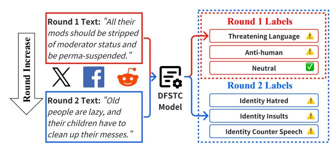
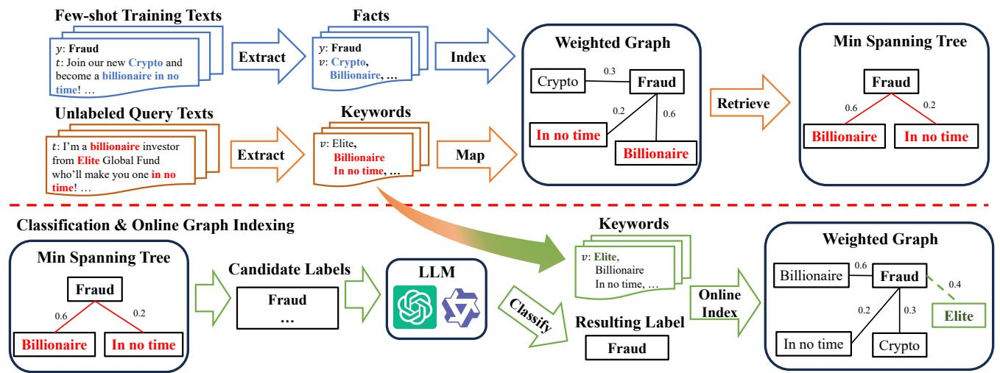
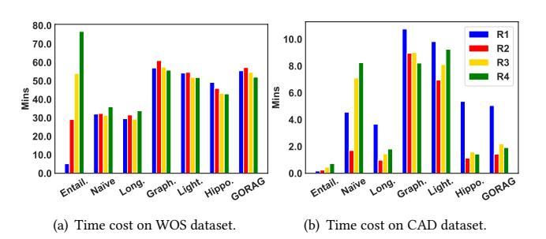
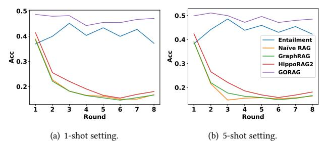
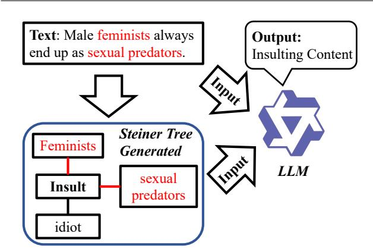

# GORAG: Graph-based Online Retrieval Augmented Generation for Dynamic Few-shot Social Media Text Classification

Yubo Wang The Hong Kong University of Science and Technology Hong Kong SAR, China ywangnx@connect.ust.hk

Haoyang Li∗ The Hong Kong Polytechnic University Hong Kong SAR, China haoyangcomp.li@polyu.edu.hk

Fei Teng The Hong Kong University of Science and Technology Hong Kong SAR, China fteng@connect.ust.hk

Lei Chen

The Hong Kong University of Science and Technology (Guangzhou) Guangzhou, China Guangzhou HKUST Fok Ying Tung Research Institute Guangzhou, China leichen@hkust-gz.edu.cn

# Abstract

Text classification is vital for Web for Good applications like hate speech and misinformation detection. However, traditional models (e.g., BERT) often fail in dynamic few-shot settings where labeled data are scarce, and target labels frequently evolve. While Large Language Models (LLMs) show promise in few-shot settings, their performance is often hindered by increased input size in dynamic evolving scenarios. To address these issues, we propose GORAG, a Graph-based Online Retrieval-Augmented Generation framework for dynamic few-shot text classification. GORAG constructs and maintains a weighted graph of keywords and text labels, representing their correlations as edges. To model these correlations, GORAG employs an edge weighting mechanism to prioritize the importance and reliability of extracted information and dynamically retrieves relevant context using a tailored minimum-cost spanning tree for each input. Empirical evaluations show GORAG outperforms existing approaches by providing more comprehensive and precise contextual information. Our code is released at: [https://github.com/Wyb0627/GORAG.](https://github.com/Wyb0627/GORAG)

# CCS Concepts

• Information systems → Social networks; Clustering and classification; Retrieval models and ranking.

# Keywords

Large Language Model, Retrieval-Augmented Generation, Few-shot Text Classification, Hate Speech Detection, Social Media

## ACM Reference Format:

Yubo Wang, Haoyang Li, Fei Teng, and Lei Chen. 2026. GORAG: Graphbased Online Retrieval Augmented Generation for Dynamic Few-shot Social Media Text Classification. In Proceedings of the ACM Web Conference 2026 (WWW '26), April 13–17, 2026, Dubai, United Arab Emirates. ACM, New York, NY, USA, [12](#page-11-0) pages.<https://doi.org/10.1145/3774904.3793011>

∗Corresponding author

© 2026 Copyright held by the owner/author(s). ACM ISBN 979-8-4007-2307-0/2026/04 <https://doi.org/10.1145/3774904.3793011>

Figure 1: An example of DFSTC task with 2 rounds. In Round 1, the text is classified as Threatening Language. In Round 2, another text is classified as a new label: Identity Insults.

# 1 Introduction

Text content classification is a fundamental task for various social media applications, such as hate speech detection [\[5,](#page-8-0) [8,](#page-8-1) [15,](#page-8-2) [20,](#page-8-3) [21,](#page-8-4) [26,](#page-8-5) [29,](#page-8-6) [50,](#page-9-0) [69\]](#page-9-1), misinformation/disinformation detection [\[3,](#page-8-7) [10,](#page-8-8) [11,](#page-8-9) [48,](#page-9-2) [49,](#page-9-3) [56,](#page-9-4) [66,](#page-9-5) [71,](#page-9-6) [87\]](#page-9-7) , and suicide risk detection [\[19,](#page-8-10) [35,](#page-8-11) [40,](#page-8-12) [55\]](#page-9-8). In recent years, Neural Network (NN)-based models [\[13,](#page-8-13) [33,](#page-8-14) [34,](#page-8-15) [45,](#page-8-16) [62,](#page-9-9) [76,](#page-9-10) [78,](#page-9-11) [86\]](#page-9-12), such BERT [\[12\]](#page-8-17) and RoBERTa [\[47\]](#page-8-18), have demonstrated impressive performance on social media text content classification tasks. However, the effectiveness of these NN-based approaches [\[13,](#page-8-13) [33,](#page-8-14) [34,](#page-8-15) [45,](#page-8-16) [62,](#page-9-9) [76,](#page-9-10) [78,](#page-9-11) [86\]](#page-9-12) depends on abundant labeled training data, which requires significant time and human efforts [\[52,](#page-9-13) [57\]](#page-9-14). Furthermore, in real-world applications, such as Abuse Detection [\[73\]](#page-9-15), new kinds of social media abuse can frequently appear with the changing needs of user analytics and progress in social research development, introducing the need to classify texts into new, extra labels [\[81\]](#page-9-16), leading to the Dynamic Few-shot Social media Text Classification (DFSTC) task. As shown in Figure [1,](#page-0-0) the DFSTC task starts with an initial set of classes (e.g., Threatening Language). As new classes like Identity Insults emerge in later rounds, it becomes challenging to obtain extensive labeled data for these new categories. Models must therefore adapt to such changes and accurately classify new examples with limited labeled data. Developing methods to dynamically classify text with limited labeled data remains a crucial and open problem.

Depending on the technique for the DFSTC task, current models can be mainly categorized into two types, i.e., data augmentationbased models and RAG-based models. Firstly, data augmentationbased models [\[52,](#page-9-13) [53,](#page-9-17) [81\]](#page-9-16) create additional data for fine-tuning

[This work is licensed under a Creative Commons Attribution 4.0 International License.](https://creativecommons.org/licenses/by/4.0) WWW '26, Dubai, United Arab Emirates

small language models (e.g., RoBERTa [\[47\]](#page-8-18)), by mixing the pairs of the few-shot labeled data and assigning mixed labels indicating the validity for these created data based on the labels of each data pairs [\[81\]](#page-9-16). However, due to the limited labeled data, and the label names may not always be available; furthermore, the additional data created can have very limited patterns. Consequently, the classification models trained with these created data may over-fit and are not generalizable [\[39,](#page-8-19) [43,](#page-8-20) [46\]](#page-8-21).

Recently, Large Language Models (LLMs) [\[2,](#page-8-22) [30,](#page-8-23) [70,](#page-9-18) [72,](#page-9-19) [84\]](#page-9-20) have excelled in social media text classification through their superior understanding abilities. However, they often struggle with taskspecific knowledge [\[18,](#page-8-24) [93\]](#page-9-21) and lack accurate reasoning clues to explain responses [\[16,](#page-8-25) [61,](#page-9-22) [63,](#page-9-23) [77\]](#page-9-24). In domains like hate speech or misinformation detection, these flaws can lead to undetected harmful content or wrongful penalties. Consequently, Long Context RAG models [\[9,](#page-8-26) [65,](#page-9-25) [81,](#page-9-16) [88\]](#page-9-26) were proposed to integrate retrieved side information (e.g., label descriptions) as external clues for more accurate classification. However, the incorporation of side information can further increase the input size [\[9\]](#page-8-26), which often overwhelms critical details with noises. As the key clues of hate speech or misinformation are usually short sentences within long contexts, the ignorance of fine-grained, entity-level information can degrade LLM classification performance. Although proprietary LLMs [\[28\]](#page-8-27) can handle such extended inputs, they inevitably suffer from high token costs.

To achieve finer-grained RAG, and better preserve the entitylevel information, Graph-based RAG approaches [\[17,](#page-8-28) [22](#page-8-29)[–24,](#page-8-30) [32,](#page-8-31) [61,](#page-9-22) [91\]](#page-9-27), such as GraphRAG [\[17\]](#page-8-28) and LightRAG [\[22\]](#page-8-29), propose to index the unstructured texts into the structured graphs. These approaches extract entities and relations from texts as graph nodes and edges, and their retrievals are based on the graph components mapped from the query text. However, existing Graph-based RAG approaches [\[17,](#page-8-28) [22,](#page-8-29) [32\]](#page-8-31) still have three issues in the DFSTC task.

- (1) Uniform-indexing issue: Some of these approaches construct graphs by indexing extracted text chunks uniformly. They do not consider the varying importance of each text and extraction confidence of keyword entity. For example, in [Figure 1,](#page-0-0) keyword lazy is related to all round 2 labels with different importance. Hence, uniform-indexing may provide inaccurate graph context for LLM classification.
- (2) Non-adaptive Retrieval issue: These approaches select relevant information for each input text based on a globally predefined threshold. However, the optimal retrieval threshold can vary across different query text and different rounds; hence, this non-adaptive retrieval approach can be suboptimal.
- (3) Narrow-source issue: These approaches only retrieve side information from a limited number of few-shot training text and ignore the important information among query texts. Since the new keywords related to certain labels in hate speech or misinformation detection emerge frequently in social media, this issue consequently limits models' retrieval comprehensiveness.

To address these issues, we propose a novel Graph-based Online Retrieval Augmented Generation framework for dynamic few-shot social media text classification, called GORAG. In general, GORAG constructs and maintains an adaptive online weighted graph by extracting side information from all target texts, and tailoring the graph retrieval for each input.

Firstly, GORAG constructs a weighted graph with keywords extracted from labeled texts as keyword nodes, and text labels as label nodes, to help the model better capture graph topology [\[42,](#page-8-32) [85,](#page-9-28) [94\]](#page-9-29). To model relationships, GORAG employs an edge-weighting mechanism to assign different weights to edges, representing keywords' importance and relevance to the respective text's label. Secondly, GORAG constructs a minimum-cost spanning tree based on query keywords and retrieves the label nodes within it as candidate labels. Since this MST is determined solely by the constructed graph and the keywords of the query text, GORAG achieves adaptive retrieval without human-defined thresholds, ensuring precision for each input. Finally, GORAG applies an online indexing mechanism to enrich the graph with keywords from query texts. By calculating weights that reflect the semantic relevance of keywords to labels, GORAG effectively reduces the potential noise introduced by inaccurate LLM classification during real-time updates, ensuring the graph remains a robust and comprehensive retrieval source

We summarize our novel contributions as follows.

- We present an online RAG framework for DFSTC tasks, namely GORAG, which consists of three steps: Graph Construction, Candidate Label Retrieval, and Text Classification, aiming to address the Uniform-indexing, Non-adaptive Retrieval, and Narrow-source issues.
- We develop a novel graph edge weighting mechanism based on the text keywords' importance within the text corpus, which enables our approach to effectively model the relevance between keywords and labels, thereby helping the more accurate retrieval.
- To achieve adaptive retrieval, we formulate the candidate label retrieval problem which is akin to the NP-hard Steiner Tree problem, and provide an efficient and effective solution based on the greedy algorithm.
- Extensive experiments from the social media contextual abuse benchmark and the web news misinformation detection benchmark demonstrate the effectiveness and efficiency of GORAG.

# 2 Preliminary and Related Works

We first introduce the preliminaries of Dynamic Few-shot Social media Text Classification (DFSTC) in Section [2.1](#page-1-0) and then discuss the related works for DFSTC task in Section [2.2.](#page-2-0) The important notations used in this paper are listed in [Table 7](#page-10-0) in [Appendix A.](#page-10-1)

# 2.1 DFSTC Task

Text classification [\[38,](#page-8-33) [41,](#page-8-34) [54\]](#page-9-30) is a key task in real-world web for good applications, including social media hate speech detection [\[5,](#page-8-0) [8,](#page-8-1) [15,](#page-8-2) [20,](#page-8-3) [21,](#page-8-4) [26,](#page-8-5) [29,](#page-8-6) [50,](#page-9-0) [69\]](#page-9-1), misinformation/disinformation detection [\[3,](#page-8-7) [10,](#page-8-8) [11,](#page-8-9) [48,](#page-9-2) [49,](#page-9-3) [56,](#page-9-4) [66,](#page-9-5) [71,](#page-9-6) [87\]](#page-9-7). It involves assigning predefined labels �� ∈ Y to text �� = (��1, · · · ,��|��|) based on its words ���� . Traditional approaches require fine-tuning with large labeled datasets [\[12,](#page-8-17) [47\]](#page-8-18), which may not always be available. Recently, few-shot learning addresses this limitation by enabling models to classify social media texts into various classes with only a small number of labeled examples per class [\[52,](#page-9-13) [53\]](#page-9-17). On the other hand, dynamic classification [\[25,](#page-8-35) [60,](#page-9-31) [74\]](#page-9-32) introduces an additional challenge where new classes are introduced over multiple rounds, requiring

Table 1: Statistics of the tested datasets, where we divide their original labels into multiple rounds. We achieve a balanced testing set on the IFS-Rel datasets by assigning each label 40 testing samples.

|         | Dataset | Avg. Text Token | Testing data | R1 Label # | Testing data | R2 Label # | Testing data | R3 Label # | Testing data | R4 Label # | Total Testing data |
|---------|---------|-----------------|--------------|------------|--------------|------------|--------------|------------|--------------|------------|--------------------|
| CAD     | [73]    | 154             | 240          | 4          | 60           | 3          | 286          | 3          | 231          | 3          | 817                |
| WOS     | [37]    | 200             | 2,417        | 32         | 2,842        | 53         | 2,251        | 30         | 1,886        | 18         | 9,396              |
| IFS-Rel | [81]    | 105             | 640          | 16         | 640          | 16         | 640          | 16         | 640          | 16         | 2,560              |

to G �� based on the text ��'s predicted label �� ∗ . To be specific, each keyword node �� ∈ V�� ���������������� would be added to the original graph's node set V�� and be assigned with an edge ����,�� connecting it with the text ��'s predicted label �� ∗

V�� = V�� ∪ V�� ����������������, E �� = E �� ∪ E�� ����, (13)

where E ���� = {����,��∗ |�� ∈ V�� ���������������� } denotes the set of all newly assigned edges ����,�� between keyword node �� and its predicted label �� ∗ , for these newly assigned edges, their weight is calculated with the edge weighting mechanism illustrated in Equation [\(4\)](#page-3-3). The edge weights can reflect the semantic relevance of keywords to labels, and reduce the noise introduced by inaccurate LLM classification.

# 4 Experiments

In this section, we evaluate GORAG's performance on the DF-STC task. Section [4.1](#page-5-0) introduces the experimental setup, while Section [4.2](#page-5-1) presents results on effectiveness and efficiency. Section [4.3](#page-6-0) covers ablation studies, and Section [4.4](#page-7-0) discusses generalization. Due to space limitation, we put experiment details, such as hardware settings and case study in [Appendix E.](#page-10-5)

# 4.1 Experiment Settings

4.1.1 Few-shot setting. In this paper, we employ 1-shot, 5-shot, and 10-shot settings for few-shot training, where each setting corresponds to using 1, 5, and 10 labeled training samples per class, respectively. We omit experiments with more than 10 labeled samples per class, as for WOS dataset, there are already over 1300 labeled training data under 10-shot setting.

4.1.2 Datasets. We select the CAD [\[73\]](#page-9-15), WOS [\[37\]](#page-8-44), and IFS-Rel [\[81\]](#page-9-16) benchmark to test GORAG's performance. The texts in CAD are social media posts that potentially have different kinds of hate speech and abuse. The texts in the IFS-Rel benchmark are segments from web news, and their classifications help detect misinformation. The texts from the WOS benchmark are abstracts or introductions from academic papers, as the WOS dataset contains a vast number of candidate labels and has a large word count for each text; these characteristics make it a challenging benchmark for text classification models. The statistics of these benchmarks are shown in [Table 1.](#page-5-2)

Due to the space limitations, we mainly display our experinents on the 4 rounds split version of all datasets in [Table 2,](#page-6-1) and further experiment results of 6 and 8 rounds are shown in [Figure 4.](#page-7-1)

Ethical Disclaimer. This research involves sensitive content. All datasets are publicly available, and our study adheres to institutional ethical guidelines to ensure that no personally identifiable information is disclosed. Examples shown in this paper are for illustrative purposes only and do not reflect the authors' views.

4.1.3 Evaluation Metrics. In this paper, aligning with previous DFSTC models [\[53,](#page-9-17) [81\]](#page-9-16), we use classification accuracy as the evaluation metric. Given that LLMs can generate arbitrary outputs that may not precisely match the provided labels, we consider a classification correct only if the LLM's output exactly matches the ground-truth label name or label number.

4.1.4 Baselines. We compare six baselines from three types as follows. The details of selected baselines are in Appendix [E.1.](#page-10-6)

- One NN-based model: Entailment [\[81\]](#page-9-16), which converts the task to binary classification, and creates entailment pairs with the labeled data for training.
- Two Long Context RAG models: NaiveRAG [\[18\]](#page-8-24) splits fewshot labeled data into chunks and retrieves the most query similar chunks to augment LLM classification. LongLLMLingua [\[31\]](#page-8-41) further compresses the split chunks of NaiveRAG by filtering out chunk tokens regarding their LLM generation perplexity.
- Three Graph-based RAG models: GraphRAG [\[17\]](#page-8-28) extracts entities and relations from few-shot training data, and uses LLM to summarize graph neighborhoods as communities for retrieval. LightRAG [\[22\]](#page-8-29) drops the community-related procedure and solely retrieves the 1-hop neighborhood of the unlabeled text mapped entities on the graph. HippoRAG2 [\[23\]](#page-8-43) retrieves the Top-k candidate labels and their training texts based on their Personalized PageRank (PPR) score on the graph.

Furthermore, as solely put the labeled text within the LLM context can greatly increase costs and affect LLM performance [\[9,](#page-8-26) [31,](#page-8-41) [44\]](#page-8-42), we compare the performance of solely using LLM for classification with GORAG under 0-shot setting in [Table 6.](#page-7-2)

4.1.5 Hyperparameter Settings. Following the exact setting in Entailment's original paper [\[81\]](#page-9-16), we train the Entailment model with the RoBERTa-large PLM for 5 epochs with a batch size of 16, a learning rate of 1 × 10−6 , and the Adam optimizer [\[36\]](#page-8-45). For LongLLMLingua, we test the compression rate within 0.75, 0.8, 0.85 and select 0.8, as it achieves the best overall classification accuracy. For all RAG-based baselines, we set all their hyperparameter the same as in their original paper, if not further illustrated. For GraphRAG and LightRAG, we use their local search mode, as it achieves the highest classification accuracy on the most complex WOS dataset. For GraphRAG and NaiveRAG, we use the implementation from [\[1\]](#page-8-46), which optimizes their original code and achieves better time efficiency while not affect the performance. For all other baselines, we use their official implementations.

## 4.2 Few-shot Experiments

4.2.1 Effectiveness Evaluation. In [Table 2,](#page-6-1) we apply Qwen2.5- 7B backbone for CAD and WOS benchmark. Due to cost and API risk control (failing to respond when detecting dirty words) reasons,

Table 2: Classification accuracy on CAD, WOS, and IFS-Rel benchmarks.

| Dataset Category Model    |      | 1-shot | Round 5-shot | 1 10-shot | 1-shot | Round 5-shot | 2 10-shot | 1-shot | Round 5-shot | 3 10-shot | 1-shot | Round 5-shot | 4 10-shot |
|---------------------------|------|--------|--------------|-----------|--------|--------------|-----------|--------|--------------|-----------|--------|--------------|-----------|
| NN-based Entailment       | [81] | 0.2125 | 0.2000       | 0.1208    | 0.1700 | 0.1060       | 0.1634    | 0.1177 | 0.0836       | 0.0785    | 0.0857 | 0.0700       | 0.0529    |
| Long Context RAG NaiveRAG | [18] | 0.1875 | 0.1375       | 0.0958    | 0.1500 | 0.1100       | 0.0766    | 0.0802 | 0.0563       | 0.0392    | 0.0600 | 0.0405       | 0.0281    |
| LongLLMLingua CAD         | [31] | 0.1667 | 0.2417       | 0.2417    | 0.1709 | 0.2167       | 0.2200    | 0.1370 | 0.1587       | 0.1552    | 0.1092 | 0.1359       | 0.1285    |
| Graph-based RAG           |      |        |              |           |        |              |           |        |              |           |        |              |           |
| GraphRAG                  | [17] | 0.3958 | 0.3625       | 0.3292    | 0.3167 | 0.2933       | 0.2833    | 0.1587 | 0.1621       | 0.1706    | 0.1200 | 0.1236       | 0.1322    |
| LightRAG                  | [22] | 0.3875 | 0.3583       | 0.3373    | 0.3133 | 0.2867       | 0.2867    | 0.1638 | 0.1502       | 0.1571    | 0.1175 | 0.1102       | 0.1188    |
| HippoRAG2                 | [23] | 0.3667 | 0.2250       | 0.1792    | 0.2953 | 0.2000       | 0.1458    | 0.1820 | 0.1032       | 0.0746    | 0.1435 | 0.0668       | 0.0535    |
| GORAG                     |      | 0.6125 | 0.6125       | 0.6125    | 0.5867 | 0.5833       | 0.5882    | 0.3993 | 0.4010       | 0.4001    | 0.3133 | 0.3146       | 03139     |
| NN-based Entailment       | [81] | 0.3695 | 0.3823       | 0.4187    | 0.3994 | 0.4471       | 0.4222    | 0.4510 | 0.4857       | 0.4787    | 0.4030 | 0.4387       | 0.4442    |
| Long Context RAG NaiveRAG | [18] | 0.3885 | 0.3904       | 0.3897    | 0.2267 | 0.2154       | 0.2187    | 0.1821 | 0.1475       | 0.1799    | 0.1653 | 0.1556       | 0.1649    |
| LongLLMLingua WOS         | [31] | 0.3806 | 0.3823       | 0.3901    | 0.2155 | 0.2202       | 0.2198    | 0.1770 | 0.1567       | 0.1608    | 0.1468 | 0.1382       | 0.1493    |
| Graph-based RAG           |      |        |              |           |        |              |           |        |              |           |        |              |           |
| GraphRAG                  | [17] | 0.3852 | 0.3897       | 0.3906    | 0.2213 | 0.2197       | 0.2219    | 0.1816 | 0.1770       | 0.1786    | 0.1641 | 0.1634       | 0.1625    |
| LightRAG                  | [22] | 0.3930 | 0.3806       | 0.3815    | 0.2202 | 0.2216       | 0.2145    | 0.1743 | 0.1767       | 0.1799    | 0.1625 | 0.1626       | 0.1632    |
| HippoRAG2                 | [23] | 0.4133 | 0.4245       | 0.4208    | 0.2552 | 0.2656       | 0.2666    | 0.2205 | 0.2210       | 0.2242    | 0.1906 | 0.1860       | 0.1915    |
| GORAG                     |      | 0.4866 | 0.4990       | 0.5134    | 0.4790 | 0.5109       | 0.5284    | 0.4736 | 0.4996       | 0.5234    | 0.4420 | 0.4717       | 0.4929    |
| NN-based Entailment       | [81] | 0.3391 | 0.6046       | 0.5859    | 0.4008 | 0.5516       | 0.5828    | 0.3061 | 0.4703       | 0.5193    | 0.2971 | 0.4395       | 0.4895    |
| Long Context RAG NaiveRAG | [18] | 0.7343 | 0.7344       | 0.7406    | 0.5394 | 0.5406       | 0.5469    | 0.4719 | 0.4719       | 0.4688    | 0.5233 | 0.4938       | 0.5000    |
| LongLLMLingua IFS-Rel     | [31] | 0.8750 | 0.8906       | 0.9219    | 0.5734 | 0.5922       | 0.5806    | 0.4703 | 0.4741       | 0.5225    | 0.5819 | 0.4903       | 0.5038    |
| Graph-based RAG           |      |        |              |           |        |              |           |        |              |           |        |              |           |
| GraphRAG                  | [17] | 0.6406 | 0.7813       | 0.8125    | 0.4406 | 0.4688       | 0.4719    | 0.3828 | 0.3734       | 0.3141    | 0.4297 | 0.4422       | 0.3922    |
| LightRAG                  | [22] | 0.7578 | 0.8281       | 0.8594    | 0.4906 | 0.5155       | 0.5156    | 0.3802 | 0.4010       | 0.4427    | 0.4531 | 0.4804       | 0.4610    |
| HippoRAG2                 | [23] | 0.7313 | 0.7375       | 0.7406    | 0.4875 | 0.5016       | 0.4938    | 0.4297 | 0.4328       | 0.4438    | 0.4984 | 0.5008       | 0.4953    |
| GORAG                     |      | 0.9688 | 0.9688       | 0.9688    | 0.5938 | 0.6172       | 0.6250    | 0.4844 | 0.4948       | 0.5344    | 0.6165 | 0.4988       | 0.5469    |

Figure 3: Total time cost on 2 datasets under 1-shot setting.

we only use the GPT-4o backbone on the IFS-Rel news benchmark. As shown in [Table 2,](#page-6-1) GORAG achieves the best classification accuracy over all dynamic rounds on all benchmarks. Based on the experiment results, we have the following observations:

- Firstly, with the training data increase (R1 to R4), NN-based Entailment suffers from performance decrease on CAD datasets. This is because the CAD datasets have an unbalanced label distribution, as noted in prior studies [\[39,](#page-8-19) [43,](#page-8-20) [46\]](#page-8-21), NN-based models that apply data augmentation techniques are prone to overfit when the ground truth label distribution are unbalanced.
- Secondly, NaiveRAG performs better than Entailment in round 1 of the WOS and IFS-Rel datasets by avoiding overfitting, but its long inputs hinder its ability to adapt to dynamic label updates, leading to a significant performance drop from R1 to R4.
- Thirdly, Graph-based RAG baselines only slightly improve performance across datasets. They struggle with dynamic label updates due to issues like uniform indexing, threshold dependency, and narrow sources, leading to inaccurate retrievals.
- Lastly, from R1 to R4, GORAG adapts better to dynamic label updates, addresses the issues of Graph-based RAG models, and achieve better performance than all tested baselines.

Table 3: Graph incremental trends and memory usage on IFS-Rel dataset round 1 with GPT-4o LLM.

| Object | 25%     | 50%          | 75%          | 100%        |
|--------|---------|--------------|--------------|-------------|
| Nodes  | 1644    | 3238 (+1394) | 4482 (+1244) | 5299 (+817) |
| Edges  | 1771    | 3265 (+1494) | 4597 (+1332) | 5503 (+906) |
| Memory | 13.3 KB | 27.6 KB      | 37.0 KB      | 46.4 KB     |

4.2.2 Efficiency Evaluation. To evaluate the efficiency of GORAG, we compare the total time cost of GORAG and other baselines on the 4 round split version of WOS and CAD datasets with Qwen2.5- 7B backbone, the results are shown in Figure [3\(a\)](#page-6-2) and [3\(b\).](#page-6-3) Although GORAG's online indexing mechanism introduces a vast amount of knowledge into the weighted graph, we can still achieve comparable or better time efficiency with other baselines. We also list the token usage comparison between GORAG and other baselines in [Table 4,](#page-7-3) and the graph's memory usage and incremental trends in [Table 3,](#page-6-4) where GORAG consumes fewer tokens than current RAG baselines, and only introduce less than 50KB memory cost compared with solely applying LLMs.

# 4.3 Ablation Study

To further analyze GORAG's performance, we conduct an extensive ablation study under 1-shot setting with Qwen2.5-7B backbone, as RAG models show similar performance across shot settings. Specifically, we examine how different GORAG components impact classification performance using its variants. GORAG offline removes the online indexing mechanism. GORAG unit removes the edge weighting mechanism, every edge in this variant is assigned with weight 1. GORAG keyword only uses the keyword extracted from the text to create LLM classification input, rather than the whole text.

As shown in [Table 5,](#page-7-4) firstly, GORAG offline achieves the worst accuracy, because it lacks a comprehensive retrieval source, making

Table 4: Token cost on IFS-Rel dataset with 1-shot setting.

| Model         | AVG Token per Query | AVG Cost per Query (USD) |
|---------------|---------------------|--------------------------|
| GPT-4o        | 634.6               | \$0.005                  |
| LongLLMLingua | 2771.3              | \$0.021                  |
| NaiveRAG      | 4537.4              | \$0.034                  |
| LightRAG      | 7866.3              | \$0.059                  |
| GraphRAG      | 9296.3              | \$0.070                  |
| GORAG         | 557.5               | \$0.004                  |

Table 5: Ablation experiments on WOS for GORAG's variants.

| Dataset Model |              | R1     | R2     | Round R3 | R4     |
|---------------|--------------|--------|--------|----------|--------|
| GORAG         | offline&unit | 0.2979 | 0.2287 | 0.2645   | 0.2249 |
| GORAG WOS     | offline      | 0.3063 | 0.2302 | 0.2455   | 0.2156 |
| GORAG         | unit         | 0.4706 | 0.4394 | 0.4407   | 0.3899 |
| GORAG         | keyword      | 0.4746 | 0.4606 | 0.4455   | 0.4030 |
| GORAG         |              | 0.4862 | 0.4649 | 0.4814   | 0.4210 |

its generated candidate labels inaccurate, hence limits its performance. Secondly, GORAG unit outperforms GORAG offline, but still sub-optimal to GORAG, demonstrates the importance of modeling the varying importance between keywords and each label, which leads to accurate retrievals. Lastly, GORAG keywords demonstrates the important information for text classification are mostly text keywords, as it achieves comparable or better performance than other ablated baselines.

# 4.4 More Generalization Evaluations

4.4.1 Zero-shot Experiments. To further study GORAG's 0-shot ability, we compare GORAG's performance with the original powerful LLM GPT-4o [\[28\]](#page-8-27) without RAG approaches, and some RAG baselines that are applicable to the 0-shot scenario in [Table 6.](#page-7-2) Due to cost constraints, we conducted experiments on the second largest IFS-Rel dataset by providing only the label names, without any labeled data to GORAG for creating the graph. In the 0-shot setting, we input the labels and their LLM generated descriptions as system prompt for each model, and GORAG would extract keywords from label descriptions, without using any information from labeled texts. Note that the Entailment model cannot be applied in this setting, as they require labeled data for training. For other RAG-based baselines, they are considered equivalent to their base LLMs in the 0-shot setting due to a lack of external information. According to [Table 6,](#page-7-2) GORAG can still achieve better performance than all tested baselines.

4.4.2 Round Generalization Evaluation. To evaluate GORAG's ability to generalize to a larger number of dynamic rounds, we conducted additional experiments on the 6 and 8 round split versions of the WOS dataset under 1-shot and 5-shot settings, as the WOS dataset contains more testing data and labels than CAD dataset, and more lengthy, complex texts than the IFS-Rel dataset. In [Figure 4,](#page-7-1) the results for rounds 1 to 4 are obtained from the 4-round split version, rounds 5 and 6 are obtained from the 6-round split version, and rounds 7 and 8 are obtained from the 8-round split version of the WOS dataset. This setting can ensure a sufficient amount of testing data at each round, As illustrated in [Figure 4,](#page-7-1) the classification accuracy of GraphRAG and NaiveRAG drops significantly from round 1 to 8, while GORAG maintains competitive classification accuracy as the number of rounds increases through 1 to 8, with

Table 6: 0-shot experiments for GORAG and RAG baselines on IFS-Rel dataset under 0-shot setting.

| Model         |      | R1     | R2     | R3     | R4     |
|---------------|------|--------|--------|--------|--------|
| GPT-4o        | [28] | 0.9219 | 0.5109 | 0.4063 | 0.5936 |
| LongLLMLingua | [31] | 0.9281 | 0.5297 | 0.4234 | 0.5806 |
| LightRAG      | [22] | 0.6718 | 0.3047 | 0.2135 | 0.0977 |
| GraphRAG      | [17] | 0.5625 | 0.1875 | 0.1458 | 0.0938 |
| GORAG         |      | 0.9328 | 0.5406 | 0.4375 | 0.6063 |

Figure 4: Experiment result of WOS dataset under 1-shot and 5-shot settings for at most 8 rounds.

both 1 and 5-shot setting, demonstrating the importance of a more precise retrieval.

## 5 Conclusion

In this paper, we propose GORAG, a Graph-based Online Retrieval Augmented Generation framework for the Dynamic Few-shot Social media Text Classification (DFSTC) task. Extensive experiments on hate speech and misinformation detection benchmarks with different characteristics demonstrate the effectiveness of GORAG in classifying social media texts with only a limited number or even no labeled data. GORAG shows its effectiveness in adapting to the dynamic updates of target labels by adaptively retrieving candidate labels to filter the large target label set in each update round. For future work, we aim to further enhance GORAG's performance and explore its application in more general scenarios.

## 6 Acknowledgements

Lei Chen's work is partially supported by National Key Research and Development Program of China Grant No. 2023YFF0725100, National Science Foundation of China (NSFC) under Grant No. U22B2060, Guangdong-Hong Kong Technology Innovation Joint Funding Scheme Project No. 2024A0505040012, AOE Project AoE/E-603/18, Theme-based project TRS T41-603/20R, CRF Project C2004- 21G, Key Areas Special Project of Guangdong Provincial Universities 2024ZDZX1006, Guangdong Province Science and Technology Plan Project 2023A0505030011, Guangzhou municipality big data intelligence key lab, 2023A03J0012, HKUST(GZ) - CMCC(Guangzhou Branch) Metaverse Joint Innovation Lab under Grant No. P00659, Hong Kong ITC ITF grant PRP/004/22FX, Zhujiang scholar program 2021JC02X170, HKUST-Webank joint research lab.

## References

[1] [n. d.]. GitHub - gusye1234/nano-graphrag: A simple, easy-to-hack GraphRAG implementation — github.com. [https://github.com/gusye1234/nano-graphrag.](https://github.com/gusye1234/nano-graphrag) [2] Josh Achiam, Steven Adler, Sandhini Agarwal, Lama Ahmad, Ilge Akkaya, Florencia Leoni Aleman, Diogo Almeida, Janko Altenschmidt, Sam Altman, et al. 2023. Gpt-4 technical report. arXiv preprint arXiv:2303.08774 (2023). [3] Joshua Ashkinaze, Eric Gilbert, and Ceren Budak. 2024. The dynamics of (not) unfollowing misinformation spreaders. In Proceedings of the ACM Web Conference 2024. 1115–1125. [4] Tianchi Cai, Zhiwen Tan, Xierui Song, Tao Sun, Jiyan Jiang, Yunqi Xu, Yinger Zhang, and Jinjie Gu. 2024. FoRAG: Factuality-optimized Retrieval Augmented Generation for Web-enhanced Long-form Question Answering. In Proceedings of the 30th ACM SIGKDD Conference on Knowledge Discovery and Data Mining. [5] Rui Cao, Roy Ka-Wei Lee, and Jing Jiang. 2024. Modularized networks for few-shot hateful meme detection. In Proceedings of the ACM Web Conference 2024. [6] Tian-Yi Che, Xian-Ling Mao, Tian Lan, and Heyan Huang. 2024. A Hierarchical Context Augmentation Method to Improve Retrieval-Augmented LLMs on Scientific Papers. In Proceedings of the 30th ACM SIGKDD Conference on Knowledge Discovery and Data Mining. 243–254. [7] Lin Chen, Fengli Xu, Nian Li, Zhenyu Han, Meng Wang, Yong Li, and Pan Hui. 2024. Large language model-driven meta-structure discovery in heterogeneous information network. In Proceedings of the 30th ACM SIGKDD Conference on Knowledge Discovery and Data Mining. 307–318. [8] Tong Chen, Danny Wang, Xurong Liang, Marten Risius, Gianluca Demartini, and Hongzhi Yin. 2024. Hate speech detection with generalizable target-aware fairness. In Proceedings of the 30th ACM SIGKDD Conference on Knowledge Discovery and Data Mining. 365–375. [9] Tong Chen, Hongwei Wang, Sihao Chen, Wenhao Yu, Kaixin Ma, Xinran Zhao, Hongming Zhang, and Dong Yu. 2023. Dense x retrieval: What retrieval granularity should we use? arXiv preprint arXiv:2312.06648 (2023). [10] Yixuan Chen, Dongsheng Li, Peng Zhang, Jie Sui, Qin Lv, Lu Tun, and Li Shang. 2022. Cross-modal ambiguity learning for multimodal fake news detection. In Proceedings of the ACM web conference 2022. 2897–2905. [11] Federico Cinus, Marco Minici, Luca Luceri, and Emilio Ferrara. 2025. Exposing cross-platform coordinated inauthentic activity in the run-up to the 2024 us election. In Proceedings of the ACM on Web Conference 2025. 541–559. [12] Jacob Devlin. 2018. Bert: Pre-training of deep bidirectional transformers for language understanding. arXiv preprint arXiv:1810.04805 (2018). [13] Adji B Dieng, Jianfeng Gao, Chong Wang, and John Paisley. 2017. TopicRNN: A recurrent neural network with long-range semantic dependency. In 5th International Conference on Learning Representations, ICLR 2017. [14] Yucheng Ding, Chaoyue Niu, Fan Wu, Shaojie Tang, Chengfei Lyu, and Guihai Chen. 2024. Enhancing on-device llm inference with historical cloud-based llm interactions. In KDD 2024. [15] Nemanja Djuric, Jing Zhou, Robin Morris, Mihajlo Grbovic, Vladan Radosavljevic, and Narayan Bhamidipati. 2015. Hate speech detection with comment embeddings. In Proceedings of the 24th international conference on world wide web. 29–30. [16] Guanting Dong, Yutao Zhu, Chenghao Zhang, Zechen Wang, Ji-Rong Wen, and Zhicheng Dou. 2025. Understand what LLM needs: Dual preference alignment for retrieval-augmented generation. In Proceedings of the ACM on Web Conference 2025. 4206–4225. [17] Darren Edge, Ha Trinh, Newman Cheng, Joshua Bradley, Alex Chao, Apurva Mody, Steven Truitt, and Jonathan Larson. 2024. From local to global: A graph rag approach to query-focused summarization. arXiv preprint arXiv:2404.16130 (2024). [18] Yunfan Gao, Yun Xiong, Xinyu Gao, Kangxiang Jia, Jinliu Pan, Yuxi Bi, Yi Dai, Jiawei Sun, Meng Wang, and Haofen Wang. 2023. Retrieval-augmented generation for large language models: A survey. arXiv preprint arXiv:2312.10997 (2023). [19] Zhuohan Ge, Nicole Hu, Darian Li, Yubo Wang, Shihao Qi, Yuming Xu, Han Shi, and Jason Zhang. 2025. A Survey of Large Language Models in Mental Health Disorder Detection on Social Media. In 2025 IEEE 41st International Conference on Data Engineering Workshops (ICDEW). [20] Dominique Geissler, Abdurahman Maarouf, and Stefan Feuerriegel. 2025. Analyzing User Characteristics of Hate Speech Spreaders on Social Media. In Proceedings of the ACM on Web Conference 2025. 5085–5095. [21] Muzhe Guo, Muhao Guo, Juntao Su, Junyu Chen, Jiaqian Yu, Jiaqi Wang, Hongfei Du, Parmanand Sahu, Ashwin Assysh Sharma, and Fang Jin. 2024. Bayesian iterative prediction and lexical-based interpretation for disturbed chinese sentence pair matching. In Proceedings of the ACM Web Conference 2024. 4618–4629. [22] Zirui Guo, Lianghao Xia, Yanhua Yu, Tu Ao, and Chao Huang. 2025. LightRAG: Simple and Fast Retrieval-Augmented Generation. In Proceedings of the 2025 conference on empirical methods in natural language processing. [23] Bernal Jiménez Gutiérrez, Yiheng Shu, Weijian Qi, Sizhe Zhou, and Yu Su. 2025. From RAG to Memory: Non-Parametric Continual Learning for Large Language Models. Forty-second International Conference on Machine Learning. [24] Haoyu Han, Yu Wang, Harry Shomer, Kai Guo, Jiayuan Ding, Yongjia Lei, Mahantesh Halappanavar, Ryan A Rossi, Subhabrata Mukherjee, Xianfeng Tang, et al. 2024. Retrieval-augmented generation with graphs (graphrag). arXiv preprint arXiv:2501.00309 (2024). [25] LIU Hanmo, DI Shimin, LI Haoyang, LI Shuangyin, CHEN Lei, and ZHOU Xiaofang. 2024. Effective data selection and replay for unsupervised continual learning. In 2024 IEEE 40th International Conference on Data Engineering (ICDE). IEEE, 1449–1463. [26] Ming Shan Hee, Karandeep Singh, Charlotte Ng Si Min, Kenny Tsu Wei Choo, and Roy Ka-Wei Lee. 2024. Brinjal: A Web-Plugin for Collaborative Hate Speech Detection. In Companion Proceedings of the ACM Web Conference 2024. [27] Zhibo Hu, Chen Wang, Yanfeng Shu, Hye-Young Paik, and Liming Zhu. 2024. Prompt perturbation in retrieval-augmented generation based large language models. In Proceedings of the 30th ACM SIGKDD Conference on Knowledge Discovery and Data Mining. 1119–1130. [28] Aaron Hurst, Adam Lerer, Adam P Goucher, Adam Perelman, Aditya Ramesh, Aidan Clark, AJ Ostrow, Akila Welihinda, Alan Hayes, Alec Radford, et al. 2024. Gpt-4o system card. arXiv preprint arXiv:2410.21276 (2024). [29] Junhui Ji, Xuanrui Lin, and Usman Naseem. 2024. Capalign: Improving cross modal alignment via informative captioning for harmful meme detection. In Proceedings of the ACM Web Conference 2024. 4585–4594. [30] Albert Q Jiang, Alexandre Sablayrolles, Arthur Mensch, Chris Bamford, Devendra Singh Chaplot, Diego de las Casas, Florian Bressand, Gianna Lengyel, Guillaume Lample, Lucile Saulnier, et al. 2023. Mistral 7B. arXiv preprint arXiv:2310.06825 (2023). [31] Huiqiang Jiang, Qianhui Wu, , Xufang Luo, Dongsheng Li, Chin-Yew Lin, Yuqing Yang, and Lili Qiu. 2024. LongLLMLingua: Accelerating and Enhancing LLMs in Long Context Scenarios via Prompt Compression. In ACL 2024, Lun-Wei Ku, Andre Martins, and Vivek Srikumar (Eds.). [32] Bernal Jimenez Gutierrez, Yiheng Shu, Yu Gu, Michihiro Yasunaga, and Yu Su. 2024. Hipporag: Neurobiologically inspired long-term memory for large language models. Advances in Neural Information Processing Systems 37 (2024). [33] Rie Johnson and Tong Zhang. 2015. Semi-supervised convolutional neural networks for text categorization via region embedding. Advances in neural information processing systems 28 (2015). [34] Rie Johnson and Tong Zhang. 2017. Deep pyramid convolutional neural networks for text categorization. In ACL 2017. [35] Jiwon Kang, Jiwon Kim, Migyeong Yang, Chaehee Park, Taeeun Kim, Hayeon Song, and Jinyoung Han. 2024. SceneDAPR: A scene-level free-hand drawing dataset for web-based psychological drawing assessment. In Proceedings of the ACM Web Conference 2024. 4630–4641. [36] Diederik P Kingma. 2014. Adam: A method for stochastic optimization. arXiv preprint arXiv:1412.6980 (2014). [37] Kamran Kowsari, Donald E Brown, Mojtaba Heidarysafa, Kiana Jafari Meimandi, Matthew S Gerber, and Laura E Barnes. 2017. Hdltex: Hierarchical deep learning for text classification. In 2017 16th IEEE international conference on machine learning and applications (ICMLA). IEEE, 364–371. [38] Kamran Kowsari, Kiana Jafari Meimandi, Mojtaba Heidarysafa, Sanjana Mendu, Laura Barnes, and Donald Brown. 2019. Text classification algorithms: A survey. Information 10, 4 (2019), 150. [39] Shuo Lei, Xuchao Zhang, Jianfeng He, Fanglan Chen, and Chang-Tien Lu. 2023. TART: Improved Few-shot Text Classification Using Task-Adaptive Reference Transformation. In ACL 2023. [40] Jun Li, Xiangmeng Wang, Yifei Yan, Haoyang Li, Hong Va Leong, Nancy Xiaonan Yu, and Qing Li. 2025. DynaProtect: A Dynamic Factor Influence Learning Framework for Protective Factor-aware Suicide Risk Prediction. In Companion Proceedings of the ACM on Web Conference 2025. 1785–1791. [41] Qian Li, Hao Peng, Jianxin Li, Congying Xia, Renyu Yang, Lichao Sun, Philip S Yu, and Lifang He. 2022. A survey on text classification: From traditional to deep learning. ACM Transactions on Intelligent Systems and Technology (2022). [42] Longlong Lin, Tao Jia, Zeli Wang, Jin Zhao, and Rong-Hua Li. 2024. PSMC: Provable and Scalable Algorithms for Motif Conductance Based Graph Clustering. In Proceedings of the 30th ACM SIGKDD Conference on Knowledge Discovery and Data Mining. 1793–1803. [43] Han Liu, Siyang Zhao, Xiaotong Zhang, Feng Zhang, Wei Wang, Fenglong Ma, Hongyang Chen, Hong Yu, and Xianchao Zhang. 2024. Liberating Seen Classes: Boosting Few-Shot and Zero-Shot Text Classification via Anchor Generation and Classification Reframing. In Proceedings of the AAAI Conference on Artificial Intelligence, Vol. 38. 18644–18652. [44] Nelson F Liu, Kevin Lin, John Hewitt, Ashwin Paranjape, Michele Bevilacqua, Fabio Petroni, and Percy Liang. 2024. Lost in the middle: How language models use long contexts. TACL 12 (2024), 157–173. [45] Pengfei Liu, Xipeng Qiu, and Xuanjing Huang. 2016. Recurrent neural network for text classification with multi-task learning. In Proceedings of the Twenty-Fifth International Joint Conference on Artificial Intelligence. [46] Pengfei Liu, Weizhe Yuan, Jinlan Fu, Zhengbao Jiang, Hiroaki Hayashi, and Graham Neubig. 2023. Pre-train, prompt, and predict: A systematic survey of prompting methods in natural language processing. Comput. Surveys (2023). [47] Yinhan Liu. 2019. Roberta: A robustly optimized bert pretraining approach. arXiv preprint arXiv:1907.11692 (2019).

[48] Yifan Liu, Yaokun Liu, Zelin Li, Ruichen Yao, Yang Zhang, and Dong Wang. 2025. Modality interactive mixture-of-experts for fake news detection. In Proceedings of the ACM on Web Conference 2025. 5139–5150. [49] Yifeng Luo, Yupeng Li, Dacheng Wen, and Liang Lan. 2024. Message injection attack on rumor detection under the black-box evasion setting using large language model. In Proceedings of the ACM Web Conference 2024. 4512–4522. [50] Bishwas Mandal, Sarthak Khanal, and Doina Caragea. 2024. Contrastive learning for multimodal classification of crisis related tweets. In Proceedings of the ACM Web Conference 2024. 4555–4564. [51] Kurt Mehlhorn. 1988. A faster approximation algorithm for the Steiner problem in graphs. Inform. Process. Lett. 27, 3 (1988), 125–128. [52] Yu Meng, Jiaming Shen, Chao Zhang, and Jiawei Han. 2018. Weakly-supervised neural text classification. In CIKM 2018. [53] Yu Meng, Yunyi Zhang, Jiaxin Huang, Chenyan Xiong, Heng Ji, Chao Zhang, and Jiawei Han. 2020. Text classification using label names only: A language model self-training approach. arXiv preprint arXiv:2010.07245 (2020). [54] Shervin Minaee, Nal Kalchbrenner, Erik Cambria, Narjes Nikzad, Meysam Chenaghlu, and Jianfeng Gao. 2021. Deep learning–based text classification: a comprehensive review. ACM computing surveys (CSUR) 54, 3 (2021), 1–40. [55] Usman Naseem, Liang Hu, Qi Zhang, Shoujin Wang, and Shoaib Jameel. 2025. DiGrI: Distorted Greedy Approach for Human-Assisted Online Suicide Ideation Detection. In Proceedings of the ACM on Web Conference 2025. 5192–5201. [56] Andrei Nesterov, Laura Hollink, and Jacco Van Ossenbruggen. 2024. How contentious terms about people and cultures are used in linked open data. In Proceedings of the ACM Web Conference 2024. 4523–4533. [57] Thi Huyen Nguyen and Koustav Rudra. 2024. Human vs ChatGPT: Effect of data annotation in interpretable crisis-related microblog classification. In Proceedings of the ACM Web Conference 2024. 4534–4543. [58] Harrie Oosterhuis, Rolf Jagerman, Zhen Qin, Xuanhui Wang, and Michael Bendersky. 2024. Reliable confidence intervals for information retrieval evaluation using generative ai. In Proceedings of the 30th ACM SIGKDD Conference on Knowledge Discovery and Data Mining. 2307–2317. [59] Zhuoshi Pan, Qianhui Wu, Huiqiang Jiang, Menglin Xia, Xufang Luo, Jue Zhang, Qingwei Lin, Victor Ruhle, Yuqing Yang, Chin-Yew Lin, H. Vicky Zhao, Lili Qiu, and Dongmei Zhang. 2024. LLMLingua-2: Data Distillation for Efficient and Faithful Task-Agnostic Prompt Compression. In ACL 2024. [60] German I Parisi, Ronald Kemker, Jose L Part, Christopher Kanan, and Stefan Wermter. 2019. Continual lifelong learning with neural networks: A review. Neural networks 113 (2019), 54–71. [61] Boci Peng, Yun Zhu, Yongchao Liu, Xiaohe Bo, Haizhou Shi, Chuntao Hong, Yan Zhang, and Siliang Tang. 2024. Graph retrieval-augmented generation: A survey. arXiv preprint arXiv:2408.08921 (2024). [62] Matthew E. Peters et al. 2018. Deep Contextualized Word Representations. In Proceedings of the 2018 Conference of the North American Chapter of the Association for Computational Linguistics: Human Language Technologies, Volume 1 (Long Papers). Association for Computational Linguistics, 2227–2237. [63] Hongjin Qian, Peitian Zhang, Zheng Liu, Kelong Mao, and Zhicheng Dou. 2025. Memorag: Moving towards next-gen rag via memory-inspired knowledge discovery. In Proceedings of the ACM on Web Conference 2025. [64] Claude Sammut and Geoffrey I. Webb (Eds.). 2010. TF–IDF. Springer US, Boston, MA, 986–987. [doi:10.1007/978-0-387-30164-8\\_832](https://doi.org/10.1007/978-0-387-30164-8_832) [65] Parth Sarthi, Salman Abdullah, Aditi Tuli, Shubh Khanna, Anna Goldie, and Christopher D Manning. 2024. Raptor: Recursive abstractive processing for tree-organized retrieval. arXiv preprint arXiv:2401.18059 (2024). [66] Lanyu Shang, Yang Zhang, Bozhang Chen, Ruohan Zong, Zhenrui Yue, Huimin Zeng, Na Wei, and Dong Wang. 2024. MMAdapt: A knowledge-guided multisource multi-class domain adaptive framework for early health misinformation detection. In Proceedings of the ACM Web Conference 2024. 4653–4663. [67] Ben Snyder, Marius Moisescu, and Muhammad Bilal Zafar. 2024. On early detection of hallucinations in factual question answering. In Proceedings of the 30th ACM SIGKDD Conference on Knowledge Discovery and Data Mining. [68] Ke Su, Bing Lu, Huang Ngo, Panos M. Pardalos, and Ding-Zhu Du. 2020. Steiner Tree Problems. Springer International Publishing, Cham, 1–15. [69] Prasanna Lakkur Subramanyam, Mohit Iyyer, and Brian N Levine. 2024. Triage of Messages and Conversations in a Large-Scale Child Victimization Corpus. In Proceedings of the ACM Web Conference 2024. 4544–4554. [70] Yu Sun, Shuohuan Wang, Shikun Feng, Siyu Ding, Chao Pang, Junyuan Shang, Jiaxiang Liu, Xuyi Chen, Yanbin Zhao, Yuxiang Lu, et al. 2021. Ernie 3.0: Large-scale knowledge enhanced pre-training for language understanding and generation. arXiv preprint arXiv:2107.02137 (2021). [71] Yassine Toughrai, David Langlois, and Kamel Smaïli. 2025. Fake News Detection via Intermediate-Layer Emotional Representations. In Companion Proceedings of the ACM on Web Conference 2025. 2680–2684. [72] Hugo Touvron, Thibaut Lavril, Gautier Izacard, Xavier Martinet, Marie-Anne Lachaux, Timothée Lacroix, Baptiste Rozière, Naman Goyal, Eric Hambro, Faisal Azhar, et al. 2023. Llama: Open and efficient foundation language models. arXiv preprint arXiv:2302.13971 (2023). [73] Bertie Vidgen, Dong Nguyen, Helen Margetts, Patricia Rossini, and Rebekah Tromble. 2021. Introducing CAD: the Contextual Abuse Dataset. In NAACL. [74] Liyuan Wang, Xingxing Zhang, Hang Su, and Jun Zhu. 2024. A comprehensive survey of continual learning: theory, method and application. TPAMI (2024). [75] Yubo Wang, Haoyang Li, Fei Teng, and Lei Chen. 2025. AGRAG: Advanced Graphbased Retrieval-Augmented Generation for LLMs. arXiv preprint arXiv:2511.05549 (2025). [76] Yequan Wang, Aixin Sun, Jialong Han, Ying Liu, and Xiaoyan Zhu. 2018. Sentiment analysis by capsules. In WWW 2018. [77] Yubo Wang, Hao Xin, and Lei Chen. 2024. KGLink: A column type annotation method that combines knowledge graph and pre-trained language model. In 2024 IEEE 40th International Conference on Data Engineering (ICDE). IEEE. [78] Zhiguo Wang, Wael Hamza, and Radu Florian. 2017. Bilateral multi-perspective matching for natural language sentences. In IJCAI 2017. [79] Junda Wu, Cheng-Chun Chang, Tong Yu, Zhankui He, Jianing Wang, Yupeng Hou, and Julian McAuley. 2024. Coral: Collaborative retrieval-augmented large language models improve long-tail recommendation. In KDD 2024. [80] Junde Wu, Jiayuan Zhu, Yunli Qi, Jingkun Chen, Min Xu, Filippo Menolascina, and Vicente Grau. 2024. Medical graph rag: Towards safe medical large language model via graph retrieval-augmented generation. arXiv preprint arXiv:2408.04187 (2024). [81] Congying Xia, Wenpeng Yin, Yihao Feng, and Philip S. Yu. 2021. Incremental Few-shot Text Classification with Multi-round New Classes: Formulation, Dataset and System. In NAACL 2021. Association for Computational Linguistics. [82] Sachin Yadav, Deepak Saini, Anirudh Buvanesh, Bhawna Paliwal, Kunal Dahiya, Siddarth Asokan, Yashoteja Prabhu, Jian Jiao, and Manik Varma. 2024. Extreme Meta-Classification for Large-Scale Zero-Shot Retrieval. In Proceedings of the 30th ACM SIGKDD Conference on Knowledge Discovery and Data Mining. [83] Mengyi Yan, Yaoshu Wang, Kehan Pang, Min Xie, and Jianxin Li. 2024. Efficient mixture of experts based on large language models for low-resource data preprocessing. In KDD 2024. 3690–3701. [84] An Yang, Baosong Yang, Binyuan Hui, Bo Zheng, Bowen Yu, Chang Zhou, Chengpeng Li, Chengyuan Li, Dayiheng Liu, Fei Huang, et al. 2024. Qwen2 technical report. arXiv preprint arXiv:2407.10671 (2024). [85] Renchi Yang, Yidu Wu, Xiaoyang Lin, Qichen Wang, Tsz Nam Chan, and Jieming Shi. 2024. Effective Clustering on Large Attributed Bipartite Graphs. In Proceedings of the 30th ACM SIGKDD Conference on Knowledge Discovery and Data Mining. 3782–3793. [86] Zhilin Yang, Zihang Dai, Yiming Yang, Jaime Carbonell, Ruslan Salakhutdinov, and Quoc V. Le. 2019. XLNet: generalized autoregressive pretraining for language understanding. In Proceedings of the 33rd International Conference on Neural Information Processing Systems. [87] Jinyi Ye, Luca Luceri, Julie Jiang, and Emilio Ferrara. 2024. Susceptibility to unreliable information sources: Swift adoption with minimal exposure. In Proceedings of the ACM Web Conference 2024. 4674–4685. [88] Chanwoong Yoon, Taewhoo Lee, Hyeon Hwang, Minbyul Jeong, and Jaewoo Kang. 2024. CompAct: Compressing Retrieved Documents Actively for Question Answering. In EMNLP 2024. [89] Haozhen Zhang, Tao Feng, and Jiaxuan You. 2024. Graph of Records: Boosting Retrieval Augmented Generation for Long-context Summarization with Graphs. arXiv preprint arXiv:2410.11001 (2024). [90] Meihui Zhang, Zhaoxuan Ji, Zhaojing Luo, Yuncheng Wu, and Chengliang Chai. 2024. Applications and Challenges for Large Language Models: From Data Management Perspective. In 40th IEEE International Conference on Data Engineering, ICDE 2024. IEEE. [91] Qinggang Zhang, Shengyuan Chen, Yuanchen Bei, Zheng Yuan, Huachi Zhou, Zijin Hong, Junnan Dong, Hao Chen, Yi Chang, and Xiao Huang. 2025. A Survey of Graph Retrieval-Augmented Generation for Customized Large Language Models. arXiv[:2501.13958](https://arxiv.org/abs/2501.13958) [cs.CL]<https://arxiv.org/abs/2501.13958> [92] Qinggang Zhang, Junnan Dong, Hao Chen, Daochen Zha, Zailiang Yu, and Xiao Huang. 2024. KnowGPT: Knowledge Graph based Prompting for Large Language Models. In The Thirty-eighth Annual Conference on Neural Information Processing Systems. [93] Yue Zhang, Yafu Li, Leyang Cui, Deng Cai, Lemao Liu, Tingchen Fu, Xinting Huang, Enbo Zhao, Yu Zhang, Yulong Chen, et al. 2023. Siren's song in the AI ocean: a survey on hallucination in large language models. arXiv preprint arXiv:2309.01219 (2023). [94] Huanjing Zhao, Beining Yang, Yukuo Cen, Junyu Ren, Chenhui Zhang, Yuxiao Dong, Evgeny Kharlamov, Shu Zhao, and Jie Tang. 2024. Pre-training and prompting for few-shot node classification on text-attributed graphs. In Proceedings of the 30th ACM SIGKDD Conference on Knowledge Discovery and Data Mining. [95] Aoxiao Zhong, Dengyao Mo, Guiyang Liu, Jinbu Liu, Qingda Lu, Qi Zhou, Jiesheng Wu, Quanzheng Li, and Qingsong Wen. 2024. Logparser-llm: Advancing efficient log parsing with large language models. In Proceedings of the 30th ACM SIGKDD Conference on Knowledge Discovery and Data Mining. 4559–4570. [96] Chunting Zhou, Pengfei Liu, Puxin Xu, Srinivasan Iyer, Jiao Sun, Yuning Mao, Xuezhe Ma, Avia Efrat, Ping Yu, Lili Yu, et al. 2023. Lima: Less is more for alignment. Advances in Neural Information Processing Systems 36.

