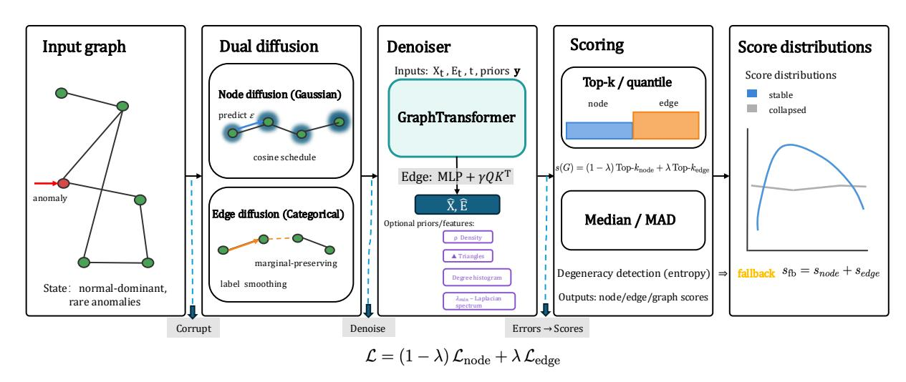
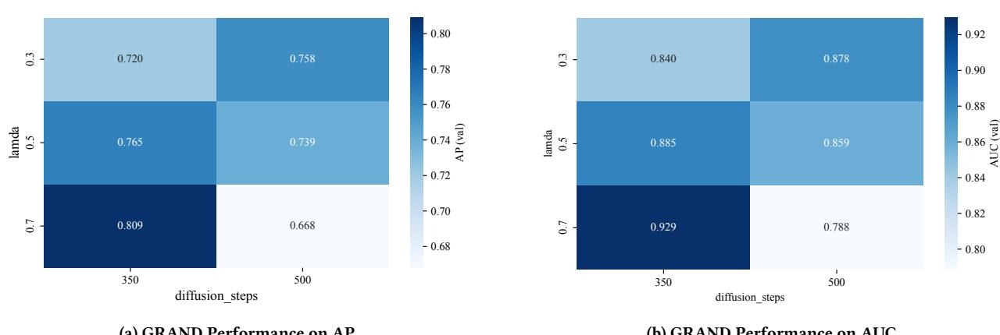
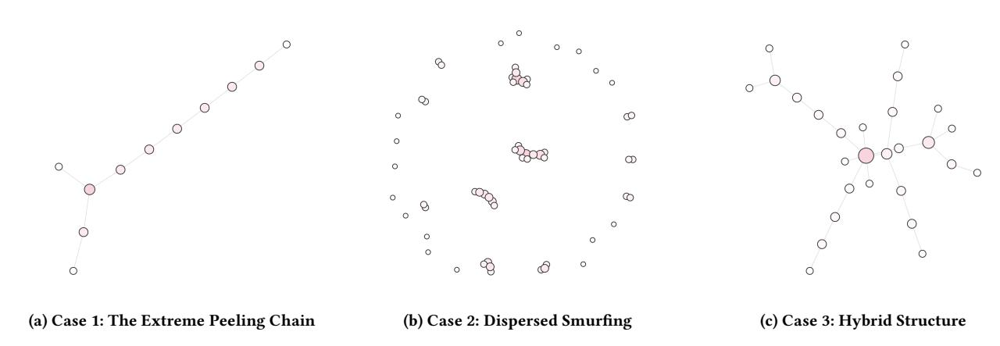

# GRAND

# A Robust Diffusion Framework for Multi-Granularity Graph Anomaly Detection in Web Platforms

Wang, Maolin; Bao, Beining; Chen, Hongyu; Liu, Zichun; Fu, Lang; Chu, Jun; Liang, Langzhang; Xu, Zenglin

# Published in:

WWW '26 - Proceedings of the ACM Web Conference 2026

# Published: 01/04/2026

### Document Version:

Final Published version, also known as Publisher's PDF, Publisher's Final version or Version of Record

### License:

CC BY-NC-ND

# Publication record in CityUHK Scholars:

[Go to record](https://scholars.cityu.edu.hk/en/publications/2768f3e6-d902-42a5-b6a8-af4579b455cd)

### Publication details:

Wang, M., Bao, B., Chen, H., Liu, Z., Fu, L., Chu, J., Liang, L., & Xu, Z. (2026). GRAND: A Robust Diffusion Framework for Multi-Granularity Graph Anomaly Detection in Web Platforms. In WWW '26 - Proceedings of the ACM Web Conference 2026 (pp. 9572-9580). (WWW - Proceedings of the ACM Web Conference). Association for Computing Machinery.<https://dl.acm.org/doi/10.1145/3774904.3793012>

### Citing this paper

Please note that where the full-text provided on CityUHK Scholars is the Post-print version (also known as Accepted Author Manuscript, Peer-reviewed or Author Final version), it may differ from the Final Published version. When citing, ensure that you check and use the publisher's definitive version for pagination and other details.

### General rights

Copyright for the publications made accessible via the CityUHK Scholars portal is retained by the author(s) and/or other copyright owners and it is a condition of accessing these publications that users recognise and abide by the legal requirements associated with these rights. Users may not further distribute the material or use it for any profit-making activity or commercial gain.

### Publisher permission

Permission for previously published items are in accordance with publisher's copyright policies sourced from the SHERPA RoMEO database. Links to full text versions (either Published or Post-print) are only available if corresponding publishers allow open access.

Contact lbscholars@cityu.edu.hk if you believe that this document breaches copyright and provide us with details. We will remove access to the work immediately and investigate your claim.

# GRAND: A Robust Diffusion Framework for Multi-Granularity Graph Anomaly Detection in Web Platforms

Maolin Wang morin.wang@my.cityu.edu.hk City University of Hong Kong Hong Kong SAR, China

Beining Bao beininbao2-c@my.cityu.edu.hk City University of Hong Kong Hong Kong SAR, China

Hongyu Chen hychan2355-c@my.cityu.edu.hk City University of Hong Kong Hong Kong SAR, China

Zichun Liu zichunliu6-c@my.cityu.edu.hk City University of Hong Kong Hong Kong SAR, China

Lang Fu fulang.fl@alibaba-inc.com Alibaba Group Hangzhou, China

Jun Chu∗ chujun.chu@alibaba-inc.com Alibaba Group Hangzhou, China

Langzhang Liang∗ lazylzliang@gmail.com Fudan University Shanghai, China

Zenglin Xu zenglin@gmail.com Fudan University Shanghai, China

# Abstract

With the explosive adoption of web-based technology, the amount of graph-structured data has increased dramatically, resulting in a higher demand to find anomalous patterns in different types of online services, such as fraudulent transactions, fake accounts, and coordinated malicious campaigns. The performance of anomaly detection in graphs of web systems is a challenge due to the sparse and camouflaged nature of such anomalies, multi-granular irregularity features, and the instability of the generative models in a real-world web application. To address these constraints, we introduce a new unified generative framework GRAND (Graph Anomaly Detection via Diffusion) suitable for graph data of the web domain. GRAND applies a novel dual-diffusion strategy: continuous Gaussian diffusion for node features and discrete diffusion for edges, combined with a structural-prior-conditioned graph transformer denoiser. Besides this, the framework adds strong anomaly scoring mechanisms with adaptive pooling and normalization schemes to detect the subtle anomaly signals typical of web data. It provides degeneracy detection for inference stability. GRAND has been demonstrated to obtain better results than state-of-the-art methods by extensive evaluations of different benchmark datasets. GRAND demonstrates strong performance in the detection of money laundering, particularly on the Elliptic dataset, a Bitcoin transaction graph typically for financial web applications.

### CCS Concepts

• Information systems → Web applications; Web mining.

∗Corresponding authors.

[This work is licensed under a Creative Commons Attribution-NonCommercial-](https://creativecommons.org/licenses/by-nc-nd/4.0)[NoDerivatives 4.0 International License.](https://creativecommons.org/licenses/by-nc-nd/4.0) WWW '26, Dubai, United Arab Emirates © 2026 Copyright held by the owner/author(s). ACM ISBN 979-8-4007-2307-0/2026/04 <https://doi.org/10.1145/3774904.3793012>

### Keywords

Graph anomaly detection, Diffusion models, Graph transformers, Robust scoring

### ACM Reference Format:

Maolin Wang, Beining Bao, Hongyu Chen, Zichun Liu, Lang Fu, Jun Chu, Langzhang Liang, and Zenglin Xu. 2026. GRAND: A Robust Diffusion Framework for Multi-Granularity Graph Anomaly Detection in Web Platforms. In Proceedings of the ACM Web Conference 2026 (WWW '26), April 13–17, 2026, Dubai, United Arab Emirates. ACM, New York, NY, USA, [9](#page-9-0) pages. <https://doi.org/10.1145/3774904.3793012>

### 1 Introduction

The rapid expansion of online platforms has drastically transformed communication, commerce, and information sharing. Graph structured data, which represent the relationships between users, products, documents, and other entities, are integral to many web applications, including social media, e-commerce, and financial transaction monitoring [\[22,](#page-9-1) [24,](#page-9-2) [36\]](#page-9-3). These systems leverage massive, interconnected data to provide personalized services and recommendations at scale. However, this vast amount of data also exposes platforms to significant risks, including fraudulent activities, disinformation, and cyber-attacks [\[25,](#page-9-4) [32\]](#page-9-5).

Graph anomaly detection (GAD) is critical in detecting these risks by discovering anomalous methods of operation, like fraudulent transactions, fake accounts, and coordinated spam campaigns. However, a number of problems render this task particularly challenging to apply in real Web and financial systems. Firstly, anomalies are sparse and camouflaged [\[9\]](#page-9-6): the fraudulent entities typically behave like ordinary users and appear hidden deep within dense interaction patterns, thus naive reconstruction or embedding models tend to blur them. Second, anomalies happen at varying granularities (node, edge, and graph level), yet many existing methods are tailored to only one level and cannot provide consistent multi-scale diagnostics. Third, generative models, i.e., diffusion-based models are appealing for modeling complex graph distributions [\[17,](#page-9-7) [27\]](#page-9-8), but, when applied directly on graphs, they can become degenerate: long reverse chains can accumulate noise, and simple global pooling can dilute the impact of rare but critical signals, particularly on weak-signal datasets.

These issues are addressed only partially by existing lines of work. Reconstruction-based approaches [\[7,](#page-9-9) [10,](#page-9-10) [19\]](#page-9-11) frequently overfit majority patterns and fail to detect subtle irregularities. Contrastive and self-supervised methods [\[3,](#page-9-12) [23,](#page-9-13) [29,](#page-9-14) [41\]](#page-9-15) enhance representations, but they tend to be sensitive to distribution shifts and still leave little interpretability. Recent diffusion-based approaches [\[20\]](#page-9-16) introduce denoising into GAD but mostly function only in continuous node-embedding space and do not explicitly update discrete edges [\[35\]](#page-9-17) or implement techniques to inject lightweight structural priors or prevent degeneracy.

In this paper, we present GRaph ANomaly detection via Diffusion (GRAND), a unified generative framework that jointly models node attributes and edges. GRAND uses continuous Gaussian diffusion for node features and discrete refinement for edges, coupled by a graph transformer denoiser [\[42\]](#page-9-18) conditioned on diffusion time and structural priors. At inference time, GRAND reconstructs both attributes and structure and transforms reconstruction residuals into anomaly scores via robust aggregation: in every graph we use Top-k or quantile pooling to preserve sparse but informative deviations and across graphs we normalize scores using median/MAD statistics for comparability under varying scales. GRAND monitors score distributions for collapse and employs a fallback strategy that rebalances node- and edge-level signals to ensure meaningful outputs even on weak-signal graphs.

Given that our framework performs well on real-world Web challenges beyond standard benchmark datasets, we conduct an extensive case study using the Elliptic dataset [\[38\]](#page-9-19), a Bitcoin transaction graph known for both the rarity of, and the subtlety of, financial crimes. Our research highlights GRAND's strong performance in this challenging scenario, significantly surpassing a range of classical unsupervised baselines under a strict evaluation protocol. This demonstrates the real-world application of GRAND and highlights Elliptic as a useful benchmark for further studies into financial graph anomaly detection.

To summarize, our contributions are as follows:

- We present GRAND, an integrated diffusion-based framework that models both the continuous attributes of nodes and the discrete edges, enabling multi-granularity graph anomaly detection with a single generative backbone.
- We provide robust anomaly scoring and lightweight structural priors: sparse reconstruction residuals are aggregated by Top-k/quantile pooling and median/MAD normalization, while clean-edge-derived priors (e.g., degree statistics, density, spectra, triangle counts) provide structural context without label leakage and enhance interpretability.
- We conduct extensive experiments on four benchmark datasets and report a detailed case study of the Elliptic transaction graph, which shows that GRAND produces strong and stable gains on this challenging real-world dataset.

### 2 Method

In this section, we present GRAND (GRaph ANomaly detection via Diffusion), a diffusion-based framework that detects anomalies on graphs by training a generative denoiser to reverse corruption processes on both node attributes and edges.

### 2.1 Overview

The intuition is simple. If we deliberately corrupt a graph and then train a model to restore it, the model will accurately reconstruct normal patterns, but anomalous parts of the graph will resist recovery and yield high errors. Building on this principle, GRAND consists of three stages, as illustrated in Fig. [1.](#page-3-0) First, the graph is corrupted by dual diffusion: a Gaussian process gradually adds noise to node attributes, while a categorical process gradually perturbs edges. Second, the corrupted graph is denoised by a GraphTransformer conditioned on time, noisy states, and global priors, producing reconstructions of both nodes and edges. Third, reconstruction residuals are aggregated into anomaly scores with robust statistics, and auxiliary priors and fallback strategies safeguard stability.

### 2.2 Diffusion on Nodes and Edges

When �� = (�� , ��, ��) is an attributed graph with �� nodes and adjacency �� and has features �� ∈ R ��×�� . We design forward processes for attributes and structures that are coupled.

Node diffusion. The features of a node are continuous vectors. Each feature ��0 ∈ R �� gets corrupted by Gaussian noise so that the signal is gradually destroyed as time �� increases. The forward process is

��(���� |��0) = N ���� ; √ ��¯�� ��0, (1 − ��¯�� )�� , (1)

where ��¯�� = Î�� ��=1 (1 − ���� ) describes cumulative noise. The denoiser in the GRAND solution learns to recover ��0 by estimating the added noise ��:

Lnode = ∥�� − ���� (���� , ��,��, ��) ∥2 . (2)

Noise schedule. The schedule {���� } is what is chosen for the loss of information speed. A fairly typical baseline is a linear increasing schedule

���� = ��min + �� − 1 (��max − ��min), (3)

�� − 1 which is interpolated from ��min to ��max. But linear growth has small effective noise in early steps, and big jumps in later steps, which results in unstable training. Rather, we have the cosine schedule adopted as follows:

��¯�� = cos2 ��/��+�� 1+�� 2 cos2 1+�� 2 , (4)

where �� is a small offset hyperparameter. Note that this design smooths the variance increase across the steps, giving a more gradual corruption curve that approaches 0 at �� = 0. Consequently, the early steps still contain good information for the denoiser to learn meaningful gradients, and later steps avoid very sharp transitions. That has been shown empirically to improve convergence when training deep denoisers, helping to lower exploding loss. Edge diffusion. Adjacency is discrete, so Gaussian noise is not applicable. We use the categorical random variable ��0 ∈ {0, 1} for each edge. The forward process gradually replaces true edges with marginal samples as follows:

��(���� |��0) = Cat ���� ; ���� �� + (1 − ���� )��1 ⊤ , (5)

only for conditioning the denoiser, but also to improve score robustness by basing reconstruction expectations in terms of global statistics for enhancing the resiliency to be more resilient. This prevents trivial reconstructions which considerably disrupt wellknown graph structure significantly. Degenerate cases: diffusion collapses to trivial examples if diffusion is generating trivial outputs. GRAND measures degeneracy by entropy of the score distribution, and if prompted, use a conservative fallback strategy:

��fb (��) = ��node + ��edge, (14)

which ensures non-trivial ranking even under collapse. The inverse chain is used for inference in GRAND. The node update follows

����−1 = 1 √ ���� − √ 1−���� 1−��¯�� ���� (���� , ��) + √︁ ������, (15)

with �� ∼ N (0, ��). Edges are iteratively refined through softmax of the predicted logits. Reconstructions (��, ˆ ��ˆ) are created with �� steps and anomaly scores are derived. GRAND is optimized using the Adam optimizer end to end. No auxiliary losses are required so information leakage due to outliers does not leak into the training.

### 2.5 Discussion

GRAND (Graph Anomaly Detection via Diffusion) uses active corruption of node attributes and graph structures to detect anomalies, then trains a unified denoiser. The method adds noise to both nodes (via Gaussian diffusion) and edges (via categorical diffusion), then restores the graph to its original state using a transformer-based denoiser. From the process, they expose the reconstruction errors of anomalies that do not recover, with non-conforming patterns resulting in higher errors.

A dual diffusion approach, where node features and edges are separate, captures irregularities at multiple granularities; a balanced loss function and strong scoring strategies guarantee stable anomaly detection. Auxiliary priors, whether degree histograms or Laplacian eigenvalues, along with fallback strategies, can also make the model robust to weak signals or noisy data. The use of various strategies, along with the incorporation of global graph statistics, can reduce the impact of trivial reconstructions (that can distort the structure of the graph). Key to note is that GRAND is not only based on classical reconstruction based methods but also leverages advanced techniques, including a flexible corruption schedule (cosine diffusion), which smooths the noise and enhances gradient estimation, enabling more stable and sensitive training. The stability-robustness-uncertainty characteristic of GRAND enables it to detect subtle irregularities efficiently, as is particularly expected in real-world applications where anomaly detection is used for fraud detection in financial transaction graphs that are very hard to detect with traditional methods.

### 3 Experiments

In this section, we have conducted a comprehensive evaluation of the proposed GRAND framework across multiple dimensions. Our experiments demonstrate that GRAND establishes a new state of the art in graph anomaly detection, consistently delivering superior, robust performance.

### 3.1 Experiment Setting

We provide the experimental settings in this section, including details about datasets, backbones and baselines, evaluation metrics, and implementation details.

3.1.1 Dataset. We evaluate on several PyGOD datasets: inj\_cora, disney, inj\_amazon, and reddit [\[11,](#page-9-20) [26,](#page-9-21) [31,](#page-9-22) [45\]](#page-9-23). For each dataset, we sample subgraphs using greedy modularity communities or random seeds, pad each subgraph to a fixed ��max, and assign an anomalous label if its anomalous node ratio exceeds a threshold (default: 0.5%; 10% for easy sets). We enforce class balance via minority oversampling or, when necessary, fallback binarization. We split the data into 80% training, 10% validation, and 10% testing with stratification. Additionally, we evaluate on the Elliptic dataset [\[38\]](#page-9-19), which consists of Bitcoin transaction data, where nodes represent addresses and edges represent transactions between them. Anomalous nodes are labeled based on their involvement in illicit activities. The dataset is split into training, validation, and test sets, with a similar stratified approach to ensure class balance.

3.1.2 Backbones & Baselines. The backbone is a unified Diffusion-Model with a 6-layer Graph Transformer, as specified in the model configuration below. We compare against graph anomaly detection baselines including DOMINANT [\[7\]](#page-9-9), CoLA [\[23\]](#page-9-13), DONE [\[2\]](#page-9-24), and, when available, ANOMALOUS [\[29\]](#page-9-14), CONAD [\[41\]](#page-9-15), AdONE [\[2\]](#page-9-24), AnomalyDAE [\[10\]](#page-9-10), and GCNAE [\[18\]](#page-9-25). We also include shallow baselines, such as LOF [\[4\]](#page-9-26) and Isolation Forest [\[21\]](#page-9-27), on node features. For node-only baselines, edge labels and scores are derived by OR/max coupling on endpoints.

3.1.3 Evaluation Metrics. We present ROC-AUC and AP at graph or subgraph, node, and edge granularities. To ensure a complete threshold-free protocol, we evaluate metrics by sweeping the decision threshold over the full score range.

- ROC-AUC (Area Under the ROC Curve): sweep a score threshold to compute TPR = TP TP+FN and FPR = FP TN+FP , and integrate the ROC curve via the trapezoidal rule. It equals the probability that a random positive is ranked above a random negative and is relatively robust to class imbalance.
- AP (Average Precision; PR-AUC): integrate the area under the Precision–Recall curve with Precision = TP TP+FP and Recall = TP TP+FN . AP is sensitive to class imbalance and emphasizes topranked quality. Unless otherwise stated, we report the standard step-wise interpolation used in information retrieval [\[15\]](#page-9-28).
- Implementation details: for each granularity (graph or subgraph, node, edge) we evaluate on the full split with deterministic tiebreaking; ROC-AUC and AP are complementary (overall separability vs. head performance).

3.1.4 Implementation Details. Node features are reduced to 64 dimensions by PCA when necessary. Edge features use a presence channel by default (��=1); when discrete edge diffusion is enabled, we convert to a two-channel one-hot (presence/absence) with automatic completion under node masking. Graph-level conditioning vectors never contain labels; time embeddings and optional priors/aux are concatenated only inside the denoiser. Unless otherwise specified, we use ��=350 diffusion steps and a 6-layer GraphTransformer. Hidden sizes are ����=256, ����=64, ����=128, with 8 heads and

feed-forward widths 512/128 for node/edge branches. The edge head uses the low-rank ����⊤ gating described above. The default loss mixes node and edge objectives with ��=0.5, and applies dropout 0.2 on the scalar loss for stability. We train with Adam (lr 2.5×10−5 , weight decay 10−4 ), batch size 8, cosine annealing, gradient clipping (1.0), and early stopping on validation loss. At validation, we set ��=��−1, add noise once, and run a single reverse trajectory; guidance (alpha-blend, "known-normal" masks) is disabled. Graph scores use Top-�� pooling (��=10%) and median/MAD scaling; the degeneracy detector can switch to the max-fallback.

### 3.2 Performance On Benchmark Datasets

As shown in Table [1,](#page-6-0) although GRAND does not always achieve the highest ROC-AUC across all datasets, it consistently exhibits substantially higher Average Precision (AP), reflecting superior capability in identifying and prioritizing truly anomalous samples. This phenomenon reveals a distinctive robustness of GRAND's diffusion-based modeling. The slightly lower AUC values arise because the model preserves uncertainty around ambiguous or borderline instances rather than forcing overconfident separations, which can slightly reduce global ranking performance. However, this conservative behavior enhances stability and prevents overfitting to noise or class imbalance.

In contrast, the consistently high AP across diverse datasets indicates that GRAND effectively concentrates its confidence on the most meaningful anomalies, ensuring that top-scoring instances correspond closely to genuine outliers. On more challenging benchmarks such as Disney and Reddit, where baselines like DOMINANT and CoLA often collapse to nearly random results, GRAND remains stable and reliable. This robustness demonstrates the method's ability to generalize across heterogeneous graph domains and handle structural irregularities without degradation.

The coexistence of moderate AUC and high AP should therefore be interpreted as an advantageous trade-off: GRAND adopts a selectively confident detection strategy, emphasizing accuracy and consistency at the high-confidence regime rather than overoptimizing global separability. From a robustness perspective, this behavior signifies that the model achieves dependable anomaly identification under uncertainty, making GRAND a practically reliable solution for graph anomaly detection.

### 3.3 Performance on Elliptic Dataset

As shown in Table [2,](#page-7-0) GRAND achieves the highest AUC (0.796) and AP (0.791) on the Elliptic dataset, outperforming other models by a significant margin. The Elliptic dataset, which consists of Bitcoin transaction data, is particularly challenging due to the highly imbalanced nature of the data, with far fewer anomalous addresses compared to the large number of legitimate ones. In this context, high AP is crucial, as it reflects the model's ability to correctly identify the few anomalous addresses with high precision. While other models like CoLA and DOMINANT show good performance, GRAND consistently excels, especially in AP, which emphasizes its ability to prioritize and correctly classify the most anomalous instances. This aligns with the need for detecting rare but critical anomalies, such as fraudulent transactions or illicit addresses in the Bitcoin network, where minimizing false positives is critical.

The high performance of GRAND on the Elliptic dataset showcases its robustness in dealing with graph-structured data in scenarios with imbalanced classes and uncertain boundary conditions. It effectively captures rare anomalous patterns without overfitting to noise or class imbalance, making it particularly well-suited for financial-domain tasks, such as identifying suspicious transactions or addresses involved in illicit activity. Thus, GRAND's ability to consistently achieve high AUC and AP on the Elliptic dataset highlights its effectiveness in graph-based anomaly detection, especially on challenging, imbalanced datasets encountered in fraud detection and financial transaction analysis.

### 3.4 Hyperparameters for GRAND

In our experiments with GRAND, we analyzed how different hyperparameters, including diffusion steps and the regularization parameter ��, affected the model's performance on two key metrics: AUC and AP. Both AUC and AP are important indicators of model performance, especially when working with highly imbalanced datasets like the Elliptic dataset, where the number of anomalous samples is much smaller than the number of legitimate ones.

For AUC, the model's performance showed a consistent improvement as the regularization parameter �� increased, with the best performance observed at �� = 0.5. This indicates that the model benefits from a moderate level of regularization to balance between model complexity and generalization. Similarly, the AUC values remained robust across different diffusion steps, but increasing the diffusion steps contributed to a more refined detection of anomalies.

For AP, the situation was similar. The model showed the highest precision when the diffusion steps were set higher, allowing the model to prioritize and correctly classify the few anomalous instances. The best performance in terms of AP was also observed when �� = 0.5, suggesting that this regularization value provides the optimal balance for anomaly detection in graph-structured data.

The heatmap results presented in Figures [2a](#page-6-1) and [2b](#page-6-1) visualize the variation in AP and AUC across different diffusion steps and values of ��. These heatmaps demonstrate that increasing �� generally enhances the model's performance, with optimal results observed around �� = 0.7. Furthermore, higher diffusion steps help the model better capture the subtle differences between anomalous and normal transactions, improving both AUC and AP. This shows that GRAND effectively adapts to changes in hyperparameters, leading to more accurate anomaly detection in graph-structured data.

### 3.5 Case Studies

3.5.1 Case Study 1: The Extreme Peeling Chain (Idx 36). As shown in Table [3,](#page-8-0) Case 1 (Idx 36) corresponds to a pattern known as the "Extreme Peeling Chain." This type of anomaly is characterized by a long chain with a high diameter (9) and low maximum degree (MaxDeg = 3), making it a classic example of a "peeling chain" in cryptocurrency laundering activities. The goal of such a structure is to obscure the flow of illicit assets by using a series of small transactions, making it harder for rule-based monitoring systems to track. Table [3](#page-8-0) also shows that GRAND successfully identifies this structure as the top-ranked anomaly (Rank 1), thanks to its ability to recognize the high reconstruction error caused by the lack of branching in such a structure. This contrasts with models

Table 1: Baseline comparison across five datasets and three granularities (Graph, Node, Edge). Higher is better.

| Dataset Model       |       | AUC     | Graph | AP      |       | AUC     | Node  | AP      |       | AUC     | Edge  | AP      |
|---------------------|-------|---------|-------|---------|-------|---------|-------|---------|-------|---------|-------|---------|
| inj_cora DOMINANT   | 0.778 | ± 0.045 | 0.192 | ± 0.035 | 0.778 | ± 0.039 | 0.192 | ± 0.029 | 0.665 | ± 0.048 | 0.188 | ± 0.033 |
| CoLA                | 0.573 | ± 0.053 | 0.071 | ± 0.016 | 0.573 | ± 0.048 | 0.071 | ± 0.015 | 0.579 | ± 0.032 | 0.163 | ± 0.026 |
| DONE                | 0.828 | ± 0.038 | 0.346 | ± 0.022 | 0.828 | ± 0.034 | 0.346 | ± 0.019 | 0.761 | ± 0.041 | 0.448 | ± 0.037 |
| LOF                 |       | –       |       | –       | 0.850 | ± 0.018 | 0.451 | ± 0.013 | 0.850 | ± 0.022 | 0.451 | ± 0.016 |
| IF                  |       | –       |       | –       | 0.818 | ± 0.045 | 0.452 | ± 0.022 | 0.728 | ± 0.033 | 0.165 | ± 0.031 |
| GRAND               | 0.750 | ± 0.056 | 0.705 | ± 0.061 | 0.795 | ± 0.039 | 0.461 | ± 0.027 | 0.764 | ± 0.034 | 0.775 | ± 0.028 |
| Disney DOMINANT     | 0.547 | ± 0.045 | 0.073 | ± 0.023 | 0.547 | ± 0.038 | 0.073 | ± 0.022 | 0.626 | ± 0.039 | 0.095 | ± 0.028 |
| CoLA                | 0.508 | ± 0.039 | 0.053 | ± 0.020 | 0.508 | ± 0.041 | 0.053 | ± 0.018 | 0.429 | ± 0.033 | 0.061 | ± 0.021 |
| DONE                | 0.439 | ± 0.022 | 0.050 | ± 0.008 | 0.439 | ± 0.021 | 0.050 | ± 0.007 | 0.439 | ± 0.014 | 0.050 | ± 0.004 |
| LOF                 |       | –       |       | –       | 0.514 | ± 0.022 | 0.076 | ± 0.009 | 0.442 | ± 0.017 | 0.053 | ± 0.010 |
| IF                  |       | –       |       | –       | 0.512 | ± 0.031 | 0.079 | ± 0.012 | 0.569 | ± 0.024 | 0.101 | ± 0.017 |
| GRAND               | 0.750 | ± 0.048 | 0.683 | ± 0.033 | 0.504 | ± 0.027 | 0.547 | ± 0.022 | 0.500 | ± 0.034 | 0.480 | ± 0.028 |
| inj_amazon DOMINANT | 0.715 | ± 0.029 | 0.118 | ± 0.012 | 0.715 | ± 0.034 | 0.118 | ± 0.014 | 0.530 | ± 0.021 | 0.126 | ± 0.015 |
| CoLA                | 0.621 | ± 0.042 | 0.162 | ± 0.021 | 0.621 | ± 0.037 | 0.162 | ± 0.020 | 0.621 | ± 0.025 | 0.212 | ± 0.018 |
| DONE                | 0.894 | ± 0.014 | 0.255 | ± 0.012 | 0.894 | ± 0.015 | 0.255 | ± 0.010 | 0.616 | ± 0.029 | 0.150 | ± 0.016 |
| LOF                 |       | –       |       | –       | 0.887 | ± 0.017 | 0.252 | ± 0.010 | 0.887 | ± 0.019 | 0.252 | ± 0.015 |
| IF                  |       | –       |       | –       | 0.620 | ± 0.039 | 0.155 | ± 0.023 | 0.765 | ± 0.033 | 0.397 | ± 0.025 |
| GRAND               | 0.938 | ± 0.009 | 0.947 | ± 0.011 | 0.886 | ± 0.024 | 0.451 | ± 0.014 | 0.858 | ± 0.020 | 0.672 | ± 0.022 |
| Reddit DOMINANT     | 0.462 | ± 0.021 | 0.037 | ± 0.004 | 0.562 | ± 0.023 | 0.037 | ± 0.005 | 0.461 | ± 0.021 | 0.048 | ± 0.006 |
| CoLA                | 0.403 | ± 0.027 | 0.033 | ± 0.004 | 0.503 | ± 0.022 | 0.033 | ± 0.003 | 0.482 | ± 0.018 | 0.052 | ± 0.007 |
| DONE                | 0.467 | ± 0.014 | 0.041 | ± 0.005 | 0.567 | ± 0.016 | 0.041 | ± 0.004 | 0.504 | ± 0.019 | 0.053 | ± 0.008 |
| LOF                 |       | –       |       | –       | 0.561 | ± 0.016 | 0.037 | ± 0.004 | 0.461 | ± 0.021 | 0.048 | ± 0.005 |
| IF                  |       | –       |       | –       | 0.404 | ± 0.022 | 0.033 | ± 0.004 | 0.481 | ± 0.015 | 0.050 | ± 0.006 |
| GRAND               | 0.457 | ± 0.025 | 0.500 | ± 0.030 | 0.486 | ± 0.019 | 0.514 | ± 0.023 | 0.500 | ± 0.019 | 0.519 | ± 0.021 |

(a) GRAND Performance on AP

(b) GRAND Performance on AUC

Figure 2: GRAND's performance across different hyperparameters for AP and AUC. The results show how the diffusion steps and �� parameter influence the model's ability to detect anomalies.

like DOMINANT and CoLA, which fail to detect it due to their "over-smoothing" issues when handling long-chain topologies. The GRAND model leverages graph diffusion, which is capable of identifying structural bottlenecks in topologies like this, where the lack of branching prevents proper information flow, making it difficult

Figure 3: Summary of the Case Studies

Table 2: Model-level comparison on Elliptic dataset (values are mean ± standard deviation over random seeds; best results are highlighted in bold).

| Model         |       | AUC     |       | AP      |
|---------------|-------|---------|-------|---------|
| Elliptic-Feat | 0.277 | ± 0.051 | 0.398 | ± 0.001 |
| IForest       | 0.266 | ± 0.060 | 0.375 | ± 0.023 |
| LOF           | 0.339 | ± 0.133 | 0.425 | ± 0.099 |
| OCSVM         | 0.402 | ± 0.202 | 0.478 | ± 0.147 |
| DOMINANT      | 0.763 | ± 0.019 | 0.757 | ± 0.018 |
| CoLA          | 0.772 | ± 0.071 | 0.787 | ± 0.050 |
| DONE          | 0.622 | ± 0.048 | 0.655 | ± 0.071 |
| GRAND         | 0.796 | ± 0.050 | 0.791 | ± 0.060 |

for other models to detect abnormalities. By using its diffusionbased mechanism, GRAND successfully highlights the inherent structural anomaly where node features remain too homogeneous across the chain.

This case emphasizes GRAND's ability to handle extreme cases of fund fragmentation, a common method in laundering activities, where small portions of illicit funds are peeled off one by one, creating a long transaction chain. This case also demonstrates GRAND's capacity to detect anomalies in cases where the features may be indistinguishable from normal behavior using traditional methods like IForest or LOF, which focus more on density and statistical features than structural irregularities.

3.5.2 Case Study 2: Dispersed "Smurfing" (Idx 18). In Case 2 (Idx 18), the pattern observed is a dispersed "Smurfing" structure. It consists of 60 nodes with a low maximum degree of 4, representing a scenario where the attacker splits the funds across multiple addresses to avoid detection. This tactic, known as "Structuring" or "Smurfing," aims to confuse blockchain analysis by creating many small transactions instead of one large transaction.

As shown in Table [3,](#page-8-0) GRAND ranks this case highly (Rank 2), successfully detecting it as an anomaly. This case highlights GRAND's ability to identify patterns that disrupt normal network clustering, while other models like IForest and LOF fail due to their reliance on feature-based and density-based detection mechanisms, which cannot detect such small-scale anomalies effectively. The main challenge with detecting "Smurfing" is that the fragmented nature of the transactions hides them within a cluster of seemingly normal transactions, thus evading models that depend on local density or statistical outlier detection.

The GRAND model's success in detecting this anomaly can be attributed to its ability to differentiate subtle structural changes that are invisible to other models. While IForest focuses only on the outlier behavior of individual transactions, it misses the fact that the dispersed nature of the transactions forms a distinct but fragmented cluster. LOF also fails here because it assumes a density change that is not present, as the scattered transactions maintain a similar density to that of normal transactions. GRAND, however, recognizes the structural inconsistency within the dispersed groups, allowing it to detect the anomaly even when the transaction amounts and densities seem normal.

3.5.3 Case Study 3: Hybrid Structure (Idx 10). Case 3 (Idx 10) presents a complex hybrid structure that combines high centrality hubs with long chain-like paths. The structure has both high centrality (Max Degree = 7) and long transmission paths (Diameter = 9), which are often seen in advanced money laundering operations using mixing services. This hybrid approach is designed to obscure the connections between inputs and outputs, making it one of the most challenging structures to detect.

According to Table [3,](#page-8-0) GRAND successfully identifies this anomaly (Rank 9) due to its ability to detect both the "peeling" and "smurfing" components within the structure, even when combined with complex topologies. Traditional models like CoLA and DOMINANT, as well as density-based methods like IForest and LOF, fail to detect this structure due to their inability to adapt to the mixed topological patterns present in this case. GRAND overcomes this challenge with its generative diffusion approach, which analyzes feature distributions under different topological conditions, without assuming a specific structure. This flexibility allows it to identify the anomaly even when the topology combines multiple laundering strategies. This case demonstrates the complexity of detecting sophisticated

Table 3: Summary of Case Studies with Model Ranks (lower rank indicates higher anomaly score).

| Case   | Idx | Pattern Type          | GRAND | CoLA | DONE | DOM | IF | LOF | SVM |
|--------|-----|-----------------------|-------|------|------|-----|----|-----|-----|
| Case 1 | 36  | Extreme Peeling Chain | 1     | 47   | 47   | 47  | 45 | 43  | 30  |
| Case 2 | 18  | Dispersed Smurfing    | 2     | 44   | 45   | 45  | 48 | 47  | 38  |
| Case 3 | 10  | Hybrid Structure      | 9     | 38   | 38   | 39  | 49 | 48  | 45  |

laundering operations where both structural and transactional components are mixed. The combination of central hubs and long chains creates a scenario where traditional models struggle to adapt, either because they rely on fixed assumptions about graph structure (in the case of deep graph models like CoLA) or because they fail to handle the mixed features effectively (in the case of density-based methods like IForest and LOF). GRAND's approach, which focuses on the generative probability of feature distributions given the graph structure, enables it to identify anomalies in highly complex and heterogeneous topologies.

In summary, the case studies highlight GRAND's robust performance in detecting complex anomalies in cryptocurrency laundering patterns. Case 1 (Idx 36), representing the "Extreme Peeling Chain," demonstrates GRAND's ability to detect anomalies in long, rigid topologies where traditional models fail due to "oversmoothing" issues. Case 2 (Idx 18), showing a dispersed "Smurfing" structure, emphasizes GRAND's strength in identifying fragmented patterns that disrupt normal network clustering, a task where feature-based and density-based models like IForest and LOF struggle. Case 3 (Idx 10), involving a hybrid structure combining high centrality hubs and long chain paths, showcases GRAND's ability to adapt to complex, mixed topological patterns and detect sophisticated laundering strategies. These cases collectively demonstrate that GRAND excels in situations where traditional models are limited by their assumptions about graph structure or by their reliance on specific feature-based or density-based detection methods, making it a highly effective tool for anomaly detection.

### 4 Related Work

Graph anomaly detection. Graph anomaly detection (GAD) lies at the intersection of graph mining and outlier detection. Early methods extract hand-crafted features followed by generic detectors like LOF or Isolation Forest [\[4,](#page-9-26) [21\]](#page-9-27). Surveys [\[1,](#page-9-29) [28\]](#page-9-30) highlight the importance of modeling attributed graphs in applications like fraud detection. With GNNs [\[39\]](#page-9-31), reconstruction-based methods like DOMINANT [\[7\]](#page-9-9) and ANOMALOUS [\[29\]](#page-9-14) use autoencoders to reconstruct attributes and structure, deriving anomaly scores from reconstruction error [\[6,](#page-9-32) [37\]](#page-9-33). However, these models often overfit majority patterns and struggle with weak signals, typically focusing on single granularities without unified detection.

Self-supervised and contrastive GAD. Recent work explores self-supervised objectives for attributed networks [\[34\]](#page-9-34). CoLA [\[8\]](#page-9-35) contrasts nodes or subgraphs [\[16,](#page-9-36) [46\]](#page-9-37) under augmentations to learn representations sensitive to inconsistencies. Graph contrastive frameworks like GraphCL [\[14,](#page-9-38) [44\]](#page-9-39) provide powerful pre-training adaptable to anomaly detection, improving robustness compared to autoencoders. However, they treat edges implicitly through message passing, provide limited interpretability, and lack mechanisms to couple node-, edge-, and graph-level detection.

Generative and diffusion-based models. Deep generative modeling applies VAEs [\[19\]](#page-9-11) or autoregressive decoders [\[43\]](#page-9-40) to graphs. Diffusion models [\[12,](#page-9-41) [33\]](#page-9-42) have succeeded in continuous domains and extended to molecular graphs [\[13,](#page-9-43) [17,](#page-9-7) [35\]](#page-9-17). However, applying them to graphs is challenging: adjacency matrices are discrete, long reverse chains accumulate noise, and pooling can wash out anomaly signals. Current graph diffusion targets generation [\[40\]](#page-9-44). Our GRAND (i) jointly applies continuous diffusion on attributes and discrete refinement on edges via transformers [\[5,](#page-9-45) [30,](#page-9-46) [42\]](#page-9-18), (ii) conditions the denoising process on lightweight structural priors such as degree statistics and Laplacian spectra, and (iii) uses robust Top-��/quantile pooling with median/MAD normalization and a degeneracy-aware fallback strategy to achieve stable and comparable node-, edge-, and graph-level anomaly scores.

### 5 Conclusion

In this paper, we propose a new diffusion-based framework called GRAND to achieve robust anomaly detection of graphs. GRAND utilizes a dual diffusion strategy that utilizes continuous Gaussian diffusion for node features and discrete diffusion for edges to effectively identify anomalies in graphs, particularly in data with imbalanced classes and uncertain boundary conditions. This is because our extensive experiments with multiple benchmark datasets, including the Elliptic dataset, have revealed a strong, consistent advantage over existing models with a high AUC and AP and robustness to noise and structural irregularities. The framework proposed solves a number of significant issues in the domain of graph anomaly detection, such as sparse anomaly signals, multi-granularity irregularities, and the instability of generative models in real-world applications. Unlike traditional techniques, which either detect at the node or graph level, the GRAND framework can achieve nodeand edge-level anomaly detection within a single model and has strong scoring schemes in place. Our findings demonstrate the usefulness of GRAND in areas such as fraud detection, financial monitoring, and cyber threat detection, where pinpointing small, isolated outlier behaviors is indispensable. Future work can enhance the model by incorporating additional domain-specific knowledge and adapting it to a broader range of graph-based anomaly detection challenges across various fields.

### Acknowledgments

This research was supported by FENG Yingqian and Alibaba International Digital Commerce Group.

### References

[1] Leman Akoglu, Hanghang Tong, and Danai Koutra. 2015. Graph-based Anomaly Detection and Description: A Survey. Data Mining and Knowledge Discovery 29, 3 (2015), 626–688. [doi:10.1007/s10618-014-0365-y](https://doi.org/10.1007/s10618-014-0365-y) [2] Sambaran Bandyopadhyay, N Lokesh, and M Narasimha Murty. 2019. Outlier aware network embedding for attributed networks. In Proceedings of the AAAI conference on artificial intelligence, Vol. 33. 12–19. [3] Sambaran Bandyopadhyay, Lokesh N, Saley Vishal Vivek, and M Narasimha Murty. 2020. Outlier resistant unsupervised deep architectures for attributed network embedding. In Proceedings of the 13th international conference on web search and data mining. 25–33. [4] Markus M. Breunig, Hans-Peter Kriegel, Raymond T. Ng, and Jörg Sander. 2000. LOF: Identifying Density-Based Local Outliers. In Proceedings of the 2000 ACM SIGMOD International Conference on Management of Data (SIGMOD). 93–104. [5] Dexiong Chen, Leslie O'Bray, and Karsten Borgwardt. 2022. Structure-aware transformer for graph representation learning. In International conference on machine learning. PMLR, 3469–3489. [6] Zhenxing Chen, Bo Liu, Meiqing Wang, Peng Dai, Jun Lv, and Liefeng Bo. 2020. Generative adversarial attributed network anomaly detection. In Proceedings of the 29th ACM International Conference on Information & Knowledge Management. [7] Kaize Ding, Jundong Li, Rohit K. Bhanushali, and Huan Liu. 2019. Deep Anomaly Detection on Attributed Networks. In Proceedings of the SIAM International Conference on Data Mining (SDM). SIAM, 594–602. [8] Kaize Ding, Jundong Li, and Huan Liu. 2021. Self-Supervised Learning for Attributed Graph Anomaly Detection via Contrastive Learning. arXiv preprint arXiv:2103.00113 (2021). [9] Yingtong Dou, Zhiwei Liu, Li Sun, Yutong Deng, Hao Peng, and Philip S Yu. 2020. Enhancing graph neural network-based fraud detectors against camouflaged fraudsters. In Proceedings of the 29th ACM international conference on information & knowledge management. 315–324. [10] Hanyu Fan, Fengbin Zhang, and Zhiliang Li. 2020. Anomalydae: Dual Autoencoder for Anomaly Detection on Attributed Networks. In IEEE International Conference on Acoustics, Speech and Signal Processing (ICASSP). 3917–3921. [doi:10.1109/ICASSP40776.2020.9053387](https://doi.org/10.1109/ICASSP40776.2020.9053387) [11] William L. Hamilton, Rex Ying, and Jure Leskovec. 2017. Inductive Representation Learning on Large Graphs. In Advances in Neural Information Processing Systems (NIPS), Vol. 30. 1025–1035. [12] Jonathan Ho, Ajay Jain, and Pieter Abbeel. 2020. Denoising Diffusion Probabilistic Models. In Advances in Neural Information Processing Systems (NeurIPS), Vol. 33. 6840–6851. [13] Emiel Hoogeboom, Victor Garcia Satorras, Clément Vignac, and Max Welling. 2022. Equivariant Diffusion for Molecule Generation in 3D. In Proceedings of the 39th International Conference on Machine Learning (ICML), Vol. 162. PMLR. [14] Zhenyu Hou, Xiao Liu, Yukuo Cen, Yuxiao Dong, Hongxia Yang, Chunjie Wang, and Jie Tang. 2022. Graphmae: Self-supervised masked graph autoencoders. In Proceedings of the 28th ACM SIGKDD conference on knowledge discovery and data mining. 594–604. [15] Gautier Izacard, Mathilde Caron, Lucas Hosseini, Sebastian Riedel, Piotr Bojanowski, Armand Joulin, and Edouard Grave. 2021. Unsupervised dense information retrieval with contrastive learning. arXiv preprint arXiv:2112.09118 (2021). [16] Ming Jin, Yixin Liu, Yu Zheng, Lianhua Chi, Yuan-Fang Li, and Shirui Pan. 2021. Anemone: Graph anomaly detection with multi-scale contrastive learning. In Proceedings of the 30th ACM international conference on information & knowledge management. 3122–3126. [17] Jaehyeong Jo, Seul Lee, and Sung Ju Hwang. 2022. Score-based generative modeling of graphs via the system of stochastic differential equations. In International conference on machine learning. PMLR, 10362–10383. [18] TN Kipf. 2016. Semi-supervised classification with graph convolutional networks. arXiv preprint arXiv:1609.02907 (2016). [19] Thomas N Kipf and Max Welling. 2016. Variational graph auto-encoders. arXiv preprint arXiv:1611.07308 (2016). [20] Jinghan Li, Yuan Gao, Jinda Lu, Junfeng Fang, Congcong Wen, Hui Lin, and Xiang Wang. 2024. DiffGAD: A Diffusion-based Unsupervised Graph Anomaly Detector. arXiv preprint arXiv:2410.06549 (2024).<https://arxiv.org/abs/2410.06549> Preprint. [21] Fei Tony Liu, Kai Ming Ting, and Zhi-Hua Zhou. 2008. Isolation Forest. In Proceedings of the 2008 IEEE International Conference on Data Mining (ICDM). IEEE. [22] Yang Liu, Xiang Ao, Zidi Qin, Jianfeng Chi, Jinghua Feng, Hao Yang, and Qing He. 2021. Pick and choose: a GNN-based imbalanced learning approach for fraud detection. In Proceedings of the web conference 2021. 3168–3177. [23] Yixin Liu, Zhao Li, Shirui Pan, Chen Gong, Chuan Zhou, and George Karypis. 2021. Anomaly detection on attributed networks via contrastive self-supervised learning. IEEE transactions on neural networks and learning systems 33, 6 (2021). [24] Xiaoxiao Ma, Jia Wu, Shan Xue, Jian Yang, Chuan Zhou, Quan Z Sheng, Hui Xiong, and Leman Akoglu. 2021. A comprehensive survey on graph anomaly detection with deep learning. IEEE transactions on knowledge and data engineering 35, 12 (2021), 12012–12038. [25] Federico Monti, Fabrizio Frasca, Davide Eynard, Damon Mannion, and Michael M Bronstein. 2019. Fake news detection on social media using geometric deep learning. arXiv preprint arXiv:1902.06673 (2019). [26] Jianmo Ni, Jiacheng Li, and Julian McAuley. 2019. Justifying Recommendations using Distantly-Labeled Reviews. In Proceedings of EMNLP. [27] Chenhao Niu, Yang Song, Jiaming Song, Shengjia Zhao, Aditya Grover, and Stefano Ermon. 2020. Permutation invariant graph generation via score-based generative modeling. In International conference on artificial intelligence and statistics. PMLR, 4474–4484. [28] Guansong Pang, Chunhua Shen, Longbing Cao, and Anton van den Hengel. 2021. Deep Learning for Anomaly Detection: A Review. Comput. Surveys 54, 2 (2021), 1–38. [doi:10.1145/3439950](https://doi.org/10.1145/3439950) [29] Zhen Peng, Minnan Luo, Jundong Li, Huan Liu, and Qinghua Zheng. 2018. ANOMALOUS: A Joint Modeling Approach for Anomaly Detection on Attributed Networks. In Proceedings of the 27th International Joint Conference on Artificial Intelligence (IJCAI). 3513–3519. [doi:10.24963/ijcai.2018/488](https://doi.org/10.24963/ijcai.2018/488) [30] Ladislav Rampášek, Michael Galkin, Vijay Prakash Dwivedi, Anh Tuan Luu, Guy Wolf, and Dominique Beaini. 2022. Recipe for a general, powerful, scalable graph transformer. Advances in Neural Information Processing Systems 35 (2022), 14501–14515. [31] Prithviraj Sen, Galileo Namata, Mustafa Bilgic, Lise Getoor, Brian Galligher, and Tina Eliassi-Rad. 2008. Collective Classification in Network Data. AI Magazine 29, 3 (2008). [32] Kai Shu, Limeng Cui, Suhang Wang, Dongwon Lee, and Huan Liu. 2019. defend: Explainable fake news detection. In Proceedings of the 25th ACM SIGKDD international conference on knowledge discovery & data mining. 395–405. [33] Jascha Sohl-Dickstein, Eric A. Weiss, Niru Maheswaranathan, and Surya Ganguli. 2015. Deep Unsupervised Learning using Nonequilibrium Thermodynamics. In Proceedings of the 32nd International Conference on Machine Learning (ICML). 2256–2265. [34] Petar Veličković, William Fedus, William L Hamilton, Pietro Liò, Yoshua Bengio, and R Devon Hjelm. 2018. Deep graph infomax. arXiv preprint arXiv:1809.10341 (2018). [35] Clement Vignac, Igor Krawczuk, Antoine Siraudin, Bohan Wang, Volkan Cevher, and Pascal Frossard. 2022. Digress: Discrete denoising diffusion for graph generation. arXiv preprint arXiv:2209.14734 (2022). [36] Daixin Wang, Jianbin Lin, Peng Cui, Quanhui Jia, Zhen Wang, Yanming Fang, Quan Yu, Jun Zhou, Shuang Yang, and Yuan Qi. 2019. A semi-supervised graph attentive network for financial fraud detection. In 2019 IEEE international conference on data mining (ICDM). IEEE, 598–607. [37] Xuhong Wang, Baihong Jin, Ying Du, Ping Cui, Yingshui Tan, and Yupu Yang. 2021. One-class graph neural networks for anomaly detection in attributed networks. Neural computing and applications 33, 18 (2021), 12073–12085. [38] Mark Weber, Giacomo Domeniconi, Jie Chen, Daniel Karl I. Weidele, Claudio Bellei, Tom Robinson, and Charles E. Leiserson. 2019. Anti-Money Laundering in Bitcoin: Experimenting with Graph Convolutional Networks for Financial Forensics. arXiv[:1908.02591](https://arxiv.org/abs/1908.02591) [cs.SI] KDD 2019 Workshop on Anomaly Detection in Finance. [39] Zonghan Wu, Shirui Pan, Fengwen Chen, Guodong Long, Chengqi Zhang, and Philip S. Yu. 2021. A Comprehensive Survey on Graph Neural Networks. IEEE Transactions on Neural Networks and Learning Systems 32, 1 (2021), 4–24. [40] Julian Wyatt, Adam Leach, Sebastian M Schmon, and Chris G Willcocks. 2022. Anoddpm: Anomaly detection with denoising diffusion probabilistic models using simplex noise. In Proceedings of the IEEE/CVF conference on computer vision and pattern recognition. 650–656. [41] Zhiming Xu, Xiao Huang, Yue Zhao, Yushun Dong, and Jundong Li. 2022. Contrastive attributed network anomaly detection with data augmentation. In Pacific-Asia conference on knowledge discovery and data mining. Springer, 444–457. [42] Chengxuan Ying, Tianle Cai, Shengjie Luo, Shuxin Zheng, Guolin Ke, Di He, Yanming Shen, and Tie-Yan Liu. 2021. Do transformers really perform badly for graph representation? Advances in neural information processing systems 34 (2021), 28877–28888. [43] Jiaxuan You, Rex Ying, Xiang Ren, William Hamilton, and Jure Leskovec. 2018. Graphrnn: Generating realistic graphs with deep auto-regressive models. In International conference on machine learning. PMLR, 5708–5717. [44] Yuning You, Tianlong Chen, Yongduo Sui, Ting Chen, Zhangyang Wang, and Yang Shen. 2020. Graph Contrastive Learning with Augmentations. In Advances in Neural Information Processing Systems (NeurIPS), Vol. 33. 5812–5823. [45] Le Zheng, Zhenyu Zhang, Yingtong Chen, Yufei Wang, Charu Aggarwal, Leman Akoglu, Huan Liu, and Neil Zhao. 2022. PyGOD: A Python Library for Graph Outlier Detection. arXiv preprint arXiv:2204.12095 (2022). [46] Yu Zheng, Ming Jin, Yixin Liu, Lianhua Chi, Khoa T Phan, and Yi-Ping Phoebe Chen. 2021. Generative and contrastive self-supervised learning for graph anomaly detection. IEEE Transactions on Knowledge and Data Engineering 35, 12 (2021), 12220–12233.