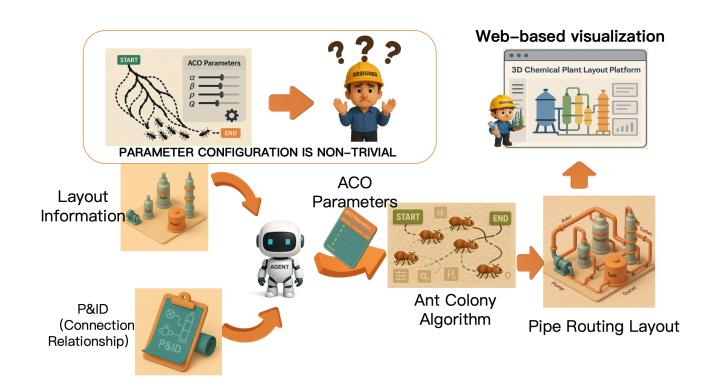
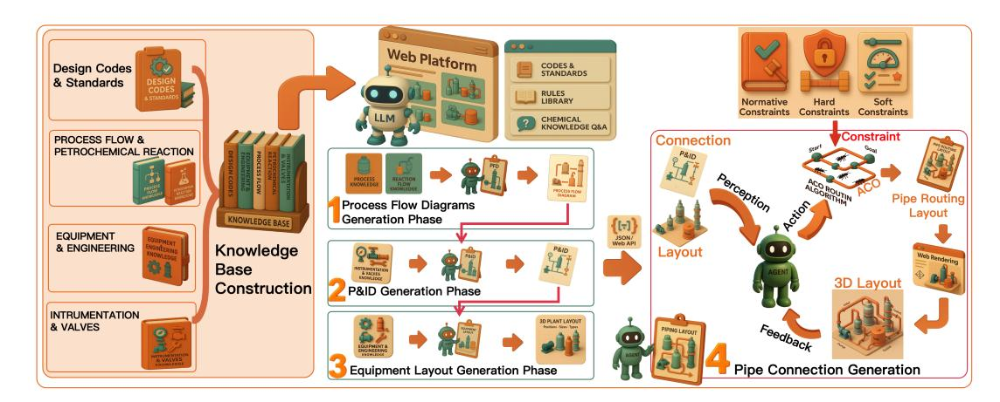
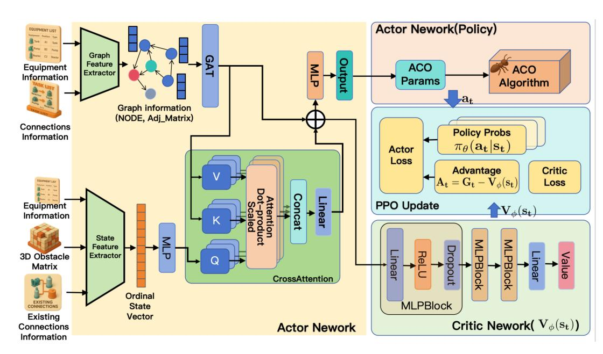
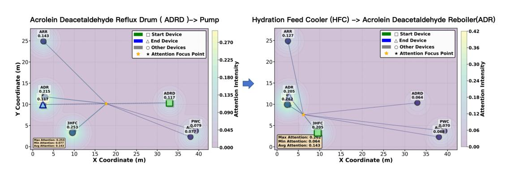
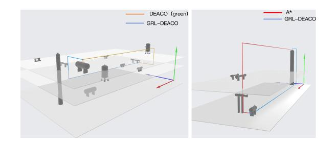
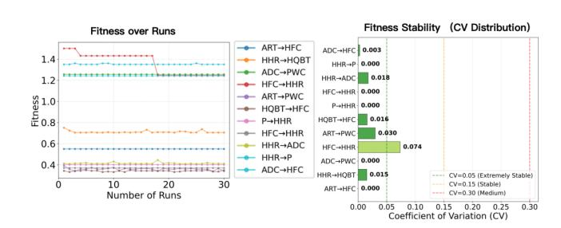

# Green Industrial Engineering on the Web: Agent-Driven Ant Colony Optimization Tuning for Energy-Efficient 3D Pipe Routing

[Xuanhan Fan](https://orcid.org/0009-0000-1008-5800)∗ Beijing Institute of Technology Beijing, China Shenzhen MSU-BIT University Shenzhen, China fanxuanhan@gmail.com

[Rui Ding](https://orcid.org/0009-0001-7638-0877)∗ Shenzhen University Shenzhen, China ddingrui0127@gmail.com

[Haojie Liu](https://orcid.org/0009-0000-5890-0181)∗ Shenzhen University Shenzhen, China a24130712413@gmail.com

[Jibin Zhou](https://orcid.org/ )† Dalian Institute of Chemical Physics, Chinese Academy of Sciences Dalian, China zhoujibin@dicp.ac.cn

[Han Liu](https://orcid.org/ )† Dalian University of Technology Dalian, China liu.han.dut@gmail.com

[Yuanman Li](https://orcid.org/0000-0002-9134-4866)† Shenzhen University Shenzhen, China yuanmanli@szu.edu.cn

[Wei Wang](https://orcid.org/0000-0002-9325-3677)† Shenzhen MSU-BIT University Shenzhen, China ehomewang@ieee.org

[Mao Ye](https://orcid.org/) Dalian Institute of Chemical Physics, Chinese Academy of Sciences Dalian, China maoye@dicp.ac.cn

## Abstract

With the advancement of networked data, artificial intelligence, and sustainability, industrial engineering is rapidly shifting toward intelligent design and production. Traditional manual design and ant colony optimization (ACO) schemes that rely on manually tuned hyperparameters increasingly exhibit poor generalization, high tuning overhead, and limited ability to simultaneously account for energy efficiency and environmental constraints in complex 3D settings. Focusing on 3D pipeline routing in petrochemical plants, this paper proposes a graph-aware reinforcement learning framework for adaptive ACO hyperparameter tuning, and implements an end-to-end integration and validation on a web-based 3D digital factory platform. Methodologically, we construct a unified 3D grid environment and equipment topology graph, where device geometry and connectivity are encoded as graph features and processed by a multi-head Graph Attention Network (GAT) to capture global spatial–process structure. In parallel, scene scale, obstacle density, connection geometry, vertical complexity, and routing progress are summarized into a compact connection state vector, fused with the graph embedding via cross-attention and passed to a PPO-based Actor–Critic agent that jointly configures ACO hyperparameters as a continuous action. At the algorithmic level, we further introduce a heterogeneous pheromone deposition

[This work is licensed under a Creative Commons Attribution 4.0 International License.](https://creativecommons.org/licenses/by/4.0)

WWW '26, Dubai, United Arab Emirates © 2026 Copyright held by the owner/author(s). ACM ISBN 979-8-4007-2307-0/2026/04 <https://doi.org/10.1145/3774904.3793013>

rule and a self-regulating pheromone mechanism to form a goaldirected pheromone gradient, coupled with a multi-objective cost function over geometric quality and energy–carbon performance, yielding greener and more adaptive routing than conventional ACO-based schemes. The implementation source can be found at [https://github.com/XuanhanFan/GRL-DEACO.](https://github.com/XuanhanFan/GRL-DEACO)

### CCS Concepts

• Applied computing → Operations research; • Computing methodologies → Planning for deterministic actions; • Information systems → Decision support systems.

### Keywords

Green Industrial Engineering, Energy-Efficient Pipe Routing, Ant Colony Optimization, Proximal Policy Optimization

### ACM Reference Format:

Xuanhan Fan, Rui Ding, Haojie Liu, Jibin Zhou, Han Liu, Yuanman Li, Wei Wang, and Mao Ye. 2026. Green Industrial Engineering on the Web: Agent-Driven Ant Colony Optimization Tuning for Energy-Efficient 3D Pipe Routing. In Proceedings of the ACM Web Conference 2026 (WWW '26), April 13–17, 2026, Dubai, United Arab Emirates. ACM, New York, NY, USA, [11](#page-10-0) pages.<https://doi.org/10.1145/3774904.3793013>

### 1 Introduction

Although renewable energy technologies continue to advance, fossil fuels are expected to remain dominant in the global energy mix for the foreseeable future, currently accounting for about 87% of primary energy consumption [\[12,](#page-8-0) [50\]](#page-8-1). Against this backdrop, petrochemical plants, as core infrastructures for processing and transporting fossil resources, pose a tightly coupled spatial design problem that must balance safety, operational and maintenance efficiency, capital cost, and flexibility for future expansion [\[6\]](#page-8-2). As

∗Both authors contributed equally to this research.

†Corresponding author.

a result, pipeline routing is both highly complex and critically important, while current practice still relies heavily on engineers' experience and repeated manual iterations, leading to low design efficiency and elevated costs. Although a wide variety of pipeline routing algorithms are available, they typically rely on numerous, tightly coupled hyperparameters, making it difficult for engineers to efficiently configure them for different connection scenarios and obtain satisfactory routing solutions, as illustrated in Fig. [1.](#page-1-0)

Figure 1: Configuring ACO hyperparameters is non-trivial in complex multi-connection scenes, whereas a reinforcement learning agent can adapt them to each context, reducing design effort and improving path quality.

In 3D routing[\[2,](#page-8-3) [19\]](#page-8-4), heuristic deterministic search such as A\* [\[11,](#page-8-5) [28\]](#page-8-6) can yield stable, interpretable paths when geometry and constraints are explicitly modeled, but its runtime grows rapidly with state-space dimensionality and constraint complexity. As equipment counts, constraint types (e.g., minimum bend radius, parallel spacing, manufacturability) and degrees of freedom increase, branching factors and node expansions escalate, causing a combinatorial explosion that limits scalability and often prevents feasible, constraint-satisfying solutions from being obtained within practical engineering time.

In recent years, heuristic and metaheuristic methods (e.g., ACO [\[9,](#page-8-7) [10\]](#page-8-8), PSO [\[20\]](#page-8-9), GA [\[37\]](#page-8-10)) have been widely adopted for complex path planning because their non-determinism helps escape local optima. In industrial piping design, algorithms must satisfy hard constraints such as collision avoidance, clearance and minimum bend radius, while also accommodating soft engineering preferences such as reducing elbows or hugging bulkheads. These soft constraints are typically encoded in intricate heuristic functions whose effectiveness depends heavily on a set of preset weight parameters[\[30\]](#page-8-11); in practice, designers must further reselect and retune these weights for different scenes and congestion patterns, which is labor-intensive and brittle.

To address these challenges of manually preset weights and scene-dependent heuristic parameter selection, we propose Graphaware Reinforcement Learning–tuned DEACO (GRL-DEACO), a reactive intelligent-agent[\[23,](#page-8-12) [29\]](#page-8-13) framework for 3D pipeline routing that dynamically adjusts the heuristic parameters of an ant colony optimization (ACO)–based router. GRL-DEACO comprises a state extractor, a graph attention network (GAT) scene encoder [\[4,](#page-8-14) [13,](#page-8-15) [36,](#page-8-16) [42\]](#page-8-17), a policy–value network [\[15,](#page-8-18) [33\]](#page-8-19) augmented with crossattention [\[17,](#page-8-20) [41\]](#page-8-21), an action-mapping and constraint-repair module, an ACO interaction environment with task-specific rewards, and a Proximal Policy Optimization (PPO) trainer [\[38\]](#page-8-22). Plant layouts are encoded as attributed graphs so that the agent can jointly capture global topology[\[16\]](#page-8-23) and local connection state, and adapt heuristic weights and algorithmic control factors to real-time conditions such as obstacle density[\[51\]](#page-8-24) and path complexity. As illustrated in Fig. [2,](#page-2-0) GRL-DEACO is further integrated into a web-based[\[34\]](#page-8-25) design platform, where web technologies provide the front-end interface and platform APIs with JSON-based messages [\[3\]](#page-8-26) transmit environment configurations and routing requests; during piping design, the agent continuously senses the evolving scene and connection tasks, selects routing hyperparameters and drives the underlying planner to generate feasible, high-quality pipeline paths.

To sum up, our contributions are as follows:

- We develop a physics-informed, energy- and carbon-aware Dual-Strategy Enhanced Ant Colony Optimization (DEACO with green metrics) formulation for 3D petrochemical pipe routing, Geometric path metrics and surrogate energy/CO2 models are fused into a unified objective that favors short, manufacturable, and energy-efficient routes.
- We propose Graph-aware Reinforcement Learning–tuned DEACO (GRL-DEACO), a graph-topology–aware reactive agent that represents each plant layout as an attributed scene graph and, via a PPO-trained policy, adaptively tunes ACO heuristic weights and control hyperparameters on a perconnection basis rather than relying on fixed hand-crafted parameters.
- We evaluate GRL-DEACO on petrochemical layouts of varying complexity and find that it consistently produces strictly feasible routes for all target connections and overall outperforms fixed-parameter DEACO. Across the simple, medium, and complex benchmark scenarios, it achieves the lowest average bend count and operating energy. Moreover, on the subset of test connections where its behaviour differs most from DEACO (with green metrics), GRL-DEACO exhibits stronger generalization, yielding routes with fewer bends and lower energy consumption.

### 2 Related work

Dong et al. [\[8\]](#page-8-27) proposed a hybrid strategy that combines NSGA-III with multi-population parallel evolution, effectively addressing the difficulty of simultaneously optimizing multiple objectives (such as path length and number of bends) and mitigating the tendency of traditional algorithms to be trapped in local optima in complex 3D ship piping environments. However, multi-objective optimization[\[46,](#page-8-28) [47\]](#page-8-29) must still balance feasibility, convergence, and solution diversity in a principled manner. Although Kim et al. [\[21\]](#page-8-30) introduced a curriculum-learning-based strategy that alleviates convergence issues caused by sparse rewards when applying RL to complex ship environments, their study primarily focuses on static settings and does not fully account for the dynamic evolution of obstacles during sequential pipe routing. Zhang et al. integrated multi-agent RL with a 3D A\* search algorithm in a hierarchical hybrid framework, thereby improving the joint optimization of 3D

Table 1: Routing performance on simple, medium, and complex scenarios (mean ± SD per connection). Simple/Medium/Complex comprise 6/10/4 scenes with 38/95/51 target connections. All DEACO variants and GRL-DEACO (ours) succeed on 100% of targets, whereas GA succeeds on 30/38, 75/95, and 41/51, indicating higher failure risk. Bold denotes the best (lowest) value per scenario and metric.

| Scenario (conn) |     | Method  |       | �� [m]  |       | �� bend |      | �� alt | ��       | op [kWh/y] | CO     | emb 2 [kg] |         | CO op 2 [kg/y] |
|-----------------|-----|---------|-------|---------|-------|---------|------|--------|----------|------------|--------|------------|---------|----------------|
|                 | A*  |         | 29.34 | ± 15.74 | 6.37  | ± 4.64  | 0.91 | ± 1.21 | 5692.68  | ± 3891.04  | 159.55 | ± 83.07    | 2903.27 | ± 1984.43      |
| GA Simple       | (no | green)  | 29.20 | ± 15.21 | 18.50 | ± 4.30  | 0.76 | ± 0.72 | 6544.34  | ± 2795.22  | 184.68 | ± 81.90    | 3337.62 | ± 1425.56      |
| DEACO (38)      | (no | green)  | 30.99 | ± 15.59 | 7.37  | ± 2.59  | 0.76 | ± 0.70 | 4782.30  | ± 2359.12  | 171.40 | ± 78.96    | 2438.97 | ± 1203.15      |
| DEACO           |     | (green) | 30.60 | ± 15.56 | 5.79  | ± 1.30  | 0.76 | ± 0.70 | 4494.02  | ± 2318.46  | 166.33 | ± 77.94    | 2291.95 | ± 1182.41      |
| GRL-DEACO       |     | (ours)  | 30.55 | ± 15.56 | 5.50  | ± 1.07  | 0.76 | ± 0.70 | 4442.90  | ± 2314.22  | 165.50 | ± 77.76    | 2265.88 | ± 1180.25      |
|                 | A*  |         | 27.61 | ± 14.23 | 5.22  | ± 3.46  | 1.79 | ± 2.26 | 8208.13  | ± 7057.06  | 149.38 | ± 72.89    | 4186.15 | ± 3599.10      |
| GA Medium       | (no | green)  | 28.73 | ± 13.07 | 19.69 | ± 4.61  | 0.99 | ± 0.90 | 7381.94  | ± 3416.69  | 184.94 | ± 71.26    | 3764.79 | ± 1742.51      |
| DEACO (95)      | (no | green)  | 30.48 | ± 13.57 | 7.80  | ± 3.66  | 1.08 | ± 0.94 | 5746.15  | ± 3237.49  | 170.03 | ± 70.31    | 2930.54 | ± 1651.12      |
| DEACO           |     | (green) | 30.05 | ± 13.48 | 5.91  | ± 2.34  | 1.07 | ± 0.94 | 5399.03  | ± 3176.31  | 164.04 | ± 68.14    | 2753.51 | ± 1619.92      |
| GRL-DEACO       |     | (ours)  | 30.00 | ± 13.47 | 5.58  | ± 1.24  | 1.07 | ± 0.94 | 5342.37  | ± 3128.47  | 163.08 | ± 68.13    | 2724.61 | ± 1595.52      |
|                 | A*  |         | 29.47 | ± 15.07 | 6.10  | ± 4.19  | 1.51 | ± 2.15 | 14443.02 | ± 50741.17 | 161.44 | ± 75.52    | 7365.94 | ± 25878.00     |
| GA Complex      | (no | green)  | 30.81 | ± 12.81 | 19.37 | ± 4.39  | 1.17 | ± 0.85 | 7923.01  | ± 3244.04  | 194.43 | ± 70.19    | 4040.74 | ± 1654.46      |
| DEACO (51)      | (no | green)  | 31.08 | ± 14.16 | 7.06  | ± 2.34  | 1.17 | ± 0.87 | 5929.99  | ± 2996.25  | 171.29 | ± 72.11    | 3024.29 | ± 1528.09      |
| DEACO           |     | (green) | 30.79 | ± 14.14 | 5.73  | ± 1.25  | 1.17 | ± 0.87 | 5690.78  | ± 2953.99  | 167.20 | ± 71.01    | 2902.30 | ± 1506.53      |
| GRL-DEACO       |     | (ours)  | 30.78 | ± 14.15 | 5.51  | ± 0.87  | 1.17 | ± 0.87 | 5656.50  | ± 2967.66  | 166.79 | ± 71.24    | 2884.82 | ± 1513.51      |

Note. For all results, DEACO (green) uses a single fixed hyperparameter set obtained on a randomly selected scenario by combining three-level grid search and uniform random search over the full parameter space, retaining the configuration with the best fitness. Methods marked as green" and GRL-DEACO use an energy- and environment-aware heuristic, while A\* and the no green" variants do not.

Figure 4: Cross-attention over the 2D layout for two consecutive routing tasks. Left: connection from the Acrolein Deacetaldehyde Reflux Drum (ADRD) to the pump. Right: connection from the Hydration Feed Cooler (HFC) to the Acrolein Deacetaldehyde Reboiler (ADR). In both cases, the cross-fusion attention not only highlights the current start and end devices, but also assigns elevated weights to HFC and ADR, which lie on plausible routing corridors and participate in subsequent process links.

the enhanced-heuristic ACO displays small, bounded, and wellbehaved stochasticity in the normalized-fitness space, satisfying the basic stability and learnability requirements for reinforcementlearning–based policy optimization.

### 4.2 Comparisons

Inspection of Table [1](#page-6-0) shows that the direction-enhanced A\* baseline attains the smallest mean path length �� in medium and complex scenes, while GA is marginally shorter in simple scenes but fails on a subset of target connections. In contrast, A\*, all DEACO variants, and GRL-DEACO successfully route every connection at all three

difficulty levels. All constructive methods are evaluated under a single representative operating condition with identical physical parameters (pipe diameter, flow rate, fluid properties, carbon factors; see Appendix [F\)](#page-10-2). Non-green variants use the same heuristic weights for length, bends, and elevation penalties, whereas DEACO (green) and GRL-DEACO add energy- and carbon-aware penalty terms on top of DEACO. GRL-DEACO consistently reduces the average number of bends ��bend across all layout complexities on the test set, outperforming both A\* and fixed-parameter DEACO. Compared with the direction-enhanced A\*, the latter often produces elevated routes along high-level corridors, which is undesirable for construction and maintenance (see the right image of Fig. [6\)](#page-7-1). Relative to

Table 2: Mean ± SD per connection on the test subset with the largest GRL-DEACO–DEACO gap (green), grouped by layout complexity: simple/medium/complex (5/9/2 scenarios; 7/24/8 connections).

Figure 5: Fitness stability of the ACO environment. Left: normalized fitness over 30 repeated runs per connection with fixed geometry and hyperparameters. Right: CV across connections (mostly CV &lt; 0.05), indicating limited stochasticity and stable RL training.

Table 3: GRL-DEACO inference overhead over 184 routing connections (mean ± SD). Inference share is the percentage of total time (inference + DEACO planning).

fixed-parameter DEACO, DEACO (green) mitigates high-elevation detours on some segments; however, for certain connections it still yields elevated sections and excessive local turning (see the left image of Fig. [6](#page-7-1) and Table [2\)](#page-7-2). In medium and complex layouts, its operating energy ��op and operational emissions COop are systematically lower than those of fixed-parameter DEACO. Even without reinforcement learning, adding the green term to DEACO reduces ��bend by about 20% and slightly improves ��op, COemb , and COop GRL-DEACO further amplifies these gains by adaptively balancing geometric and energy-related terms for challenging connection tasks. Table [3](#page-7-3) shows that policy inference is lightweight, taking 0.607 ± 0.284 s per connection, while the runtime is dominated by DEACO planning at 93.365 ± 267.207 s.

Fig. [4](#page-6-1) further indicates that the cross-fusion attention leverages both the active connection and the scene topology encoded by the

Figure 6: A comparison across scenarios shows distinct elevation behaviors. Fixed-parameter DEACO (green) still produces elevated segments for some connections, whereas A\* (red) tends to raise pipes early and route them along highlevel corridors. In contrast, GRL-DEACO (blue) postpones elevation and keeps routes closer to the work platform, yielding paths that better align with construction practice.

GAT. Beyond persistently attending to the current source and target devices, it also assigns non-negligible weights to neighbouring equipment located along plausible corridors for upcoming connections. When the source–target pair changes between consecutive tasks, the attention distribution adapts smoothly by shifting its focus to the newly relevant devices. These observations suggest that GRL-DEACO does not solve each connection in isolation; instead, it learns layout-level priors and attends to devices that are topologically and functionally critical for the overall routing plan.

### 5 Conclusions

In this work, we present GRL-DEACO, an RL-based 3D pipe-routing framework that encodes plant topology and adaptively tunes the hyperparameters of a DEACO solver to improve routing efficiency and solution quality in petrochemical layout design. Energy and environmental indicators are incorporated into the routing objective, and a normalized fitness measure is defined to evaluate DEACO path quality under fixed hyperparameters, providing a stable training signal for the RL agent. A GAT-based encoder with cross-attention captures the equipment and pipe-rack topology, jointly represents the scene state and connection task, and outputs environmentaware ACO hyperparameters.

Experiments on randomized layouts and representative connections show that GRL-DEACO consistently generates 3D routes with fewer bends, improved energy and environmental metrics, and a markedly lower proportion of unnecessary high-elevation segments, while maintaining strong generalization across diverse configurations. Future work will enrich the framework with finegrained process and safety constraints, incorporate fluid and reaction characteristics into the reward and tuning strategy, and extend GRL-DEACO into a multi-algorithm tuner capable of selecting and optimizing among ACO, PSO, and GA for broader industrial layout and path-planning tasks.

### Acknowledgments

This research was supported by Strategic Priority ResearchProgram of Chinese Academy of Sciences (XDA0490000) and the Key Research and Development Program of Liaoning (2023JH26/10200012).

References [1] Hervé Abdi. 2010. Coefficient of variation. Encyclopedia of research design 1, 5 (2010), 169–171. [2] Gleb Belov, Wenbo Du, Maria Garcia De La Banda, Daniel Harabor, Sven Koenig, and Xinrui Wei. 2020. From multi-agent pathfinding to 3D pipe routing. In Proceedings of the International Symposium on Combinatorial Search, Vol. 11. 11–19. [3] Tim Bray. 2014. The javascript object notation (json) data interchange format. Technical Report. [4] Shaked Brody, Uri Alon, and Eran Yahav. 2021. How attentive are graph attention networks? arXiv preprint arXiv:2105.14491 (2021). [5] Glenn O Brown. 2002. The history of the Darcy-Weisbach equation for pipe flow resistance. In Environmental and water resources history. 34–43. [6] CCPS CCPS. 2018. Guidelines for Siting and Layout of Facilities. Guidelines for Siting and Layout of Facilities (2018). [7] Xiaolin Dai, Shuai Long, Zhiwen Zhang, and Dawei Gong. 2019. Mobile robot path planning based on ant colony algorithm with A\* heuristic method. Frontiers in neurorobotics 13 (2019), 15. [8] Zong-ran Dong and Wan-wan Luo. 2024. Ship pipe route design based on NSGA-III and multi-population parallel evolution. Ocean Engineering 293 (2024), 116666. [9] Marco Dorigo, Mauro Birattari, and Thomas Stutzle. 2007. Ant colony optimization. IEEE computational intelligence magazine 1, 4 (2007), 28–39. [10] M. Dorigo, V. Maniezzo, and A. Colorni. 1996. Ant system: optimization by a colony of cooperating agents. IEEE Transactions on Systems, Man, and Cybernetics, Part B (Cybernetics) 26, 1 (1996), 29–41. [doi:10.1109/3477.484436](https://doi.org/10.1109/3477.484436) [11] František Duchoň, Andrej Babinec, Martin Kajan, Peter Beňo, Martin Florek, Tomáš Fico, and Ladislav Jurišica. 2014. Path planning with modified a star algorithm for a mobile robot. Procedia engineering 96 (2014), 59–69. [12] Energy Institute. 2025. Statistical Review of World Energy 2025. Energy Institute, London, UK.<https://www.energyinst.org/statistical-review/home> 74th edition. [13] MingQiang Guo, Weijia Bei, Ying Huang, Zhanlong Chen, and Xiaozhen Zhao. 2021. Deep learning framework for geological symbol detection on geological maps. Computers & Geosciences 157 (2021), 104943. [14] Jisang Ha, Myung-Il Roh, Ki-Su Kim, and Jin-Hyeok Kim. 2023. Method for pipe routing using the expert system and the heuristic pathfinding algorithm in shipbuilding. International Journal of Naval Architecture and Ocean Engineering 15 (2023), 100533. [15] Jean Harb, Tom Schaul, Doina Precup, and Pierre-Luc Bacon. 2020. Policy evaluation networks. arXiv preprint arXiv:2002.11833 (2020). [16] Max Horn, Edward De Brouwer, Michael Moor, Yves Moreau, Bastian Rieck, and Karsten Borgwardt. 2021. Topological graph neural networks. arXiv preprint arXiv:2102.07835 (2021). [17] Zilong Huang, Xinggang Wang, Lichao Huang, Chang Huang, Yunchao Wei, and Wenyu Liu. 2019. Ccnet: Criss-cross attention for semantic segmentation. In Proceedings of the IEEE/CVF international conference on computer vision. 603–612. [18] Leslie Pack Kaelbling, Michael L Littman, and Andrew W Moore. 1996. Reinforcement learning: A survey. Journal of artificial intelligence research 4 (1996), 237–285. [19] Dong-Han Kang, So-Won Choi, Eul-Bum Lee, and Sung-O Kang. 2024. Auto-Routing Systems (ARSs) with 3D Piping for Sustainable Plant Projects Based on Artificial Intelligence (AI) and Digitalization of 2D Drawings and Specifications. Sustainability 16, 7 (2024), 2770. [20] J. Kennedy and R. Eberhart. 1995. Particle swarm optimization. In Proceedings of ICNN'95 - International Conference on Neural Networks, Vol. 4. 1942–1948 vol.4. [doi:10.1109/ICNN.1995.488968](https://doi.org/10.1109/ICNN.1995.488968) [21] Youngsu Kim, Kyungho Lee, Byeongwook Nam, and Youngsoo Han. 2023. Application of reinforcement learning based on curriculum learning for the pipe auto-routing of ships. Journal of Computational Design and Engineering 10, 1 (2023), 318–328. [22] Diederik P Kingma. 2014. Adam: A method for stochastic optimization. arXiv preprint arXiv:1412.6980 (2014). [23] Vijay Konda and John Tsitsiklis. 1999. Actor-critic algorithms. Advances in neural information processing systems 12 (1999). [24] Surendra Kumar and CSP Rao. 2009. Application of ant colony, genetic algorithm and data mining-based techniques for scheduling. Robotics and Computer-Integrated Manufacturing 25, 6 (2009), 901–908. [25] Shundong Li, Xiaoming You, and Sheng Liu. 2021. Co-evolutionary multi-colony ant colony optimization based on adaptive guidance mechanism and its application. Arabian Journal for Science and Engineering 46, 9 (2021), 9045–9063. [26] Yuxi Li. 2017. Deep reinforcement learning: An overview. arXiv preprint arXiv:1701.07274 (2017). [27] Chao Liu, Lei Wu, Guangxin Li, Wensheng Xiao, Liping Tan, Dengpan Xu, and Jingjing Guo. 2024. AI-based 3D pipe automation layout with enhanced ant colony optimization algorithm. Automation in Construction 167 (2024), 105689. [28] Chao Liu, Lei Wu, Guangxin Li, Hao Zhang, Wensheng Xiao, Dengpan Xu, Jingjing Guo, and Wentao Li. 2024. Improved multi-search strategy A\* algorithm to solve three-dimensional pipe routing design. Expert Systems with Applications 240 (2024), 122313. [29] Ryan Lowe, Yi I Wu, Aviv Tamar, Jean Harb, OpenAI Pieter Abbeel, and Igor Mordatch. 2017. Multi-agent actor-critic for mixed cooperative-competitive environments. Advances in neural information processing systems 30 (2017). [30] Changwei Miao, Guangzhu Chen, Chengliang Yan, and Yuanyuan Wu. 2021. Path planning optimization of indoor mobile robot based on adaptive ant colony algorithm. Computers & Industrial Engineering 156 (2021), 107230. [31] Nestor Morales, Jonay Toledo, Leopoldo Acosta, and Javier Sanchez-Medina. 2016. A combined voxel and particle filter-based approach for fast obstacle detection and tracking in automotive applications. IEEE Transactions on Intelligent Transportation Systems 18, 7 (2016), 1824–1834. [32] Ofir Nachum, Mohammad Norouzi, George Tucker, and Dale Schuurmans. 2018. Smoothed action value functions for learning gaussian policies. In International Conference on Machine Learning. PMLR, 3692–3700. [33] Junhyuk Oh, Satinder Singh, and Honglak Lee. 2017. Value prediction network. Advances in neural information processing systems 30 (2017). [34] Tim O'reilly. 2005. What is web 2.0. [35] Yanfeng Qu, Dan Jiang, and Qingyan Yang. 2018. Branch pipe routing based on 3D connection graph and concurrent ant colony optimization algorithm. Journal of Intelligent Manufacturing 29, 7 (2018), 1647–1657. [36] Guillaume Renton, Muhammet Balcilar, Pierre Héroux, Benoit Gaüzère, Paul Honeine, and Sébastien Adam. 2021. Symbols detection and classification using graph neural networks. Pattern Recognition Letters 152 (2021), 391–397. [37] Jeffrey R Sampson. 1976. Adaptation in natural and artificial systems (John H. Holland). [38] John Schulman, Filip Wolski, Prafulla Dhariwal, Alec Radford, and Oleg Klimov. 2017. Proximal policy optimization algorithms. arXiv preprint arXiv:1707.06347 (2017). [39] Vasil Shteriyanov, Rimma Dzhusupova, Jan Bosch, and Helena Holmström Olsson. 2025. Automating the Expansion of Instrument Typicals in Piping and Instrumentation Diagrams (P&IDs). In Proceedings of the AAAI Conference on Artificial Intelligence, Vol. 39. 28885–28891. [40] Hamid Taheri, Seyed Rasoul Hosseini, and Mohammad Ali Nekoui. 2024. Deep reinforcement learning with enhanced ppo for safe mobile robot navigation. arXiv preprint arXiv:2405.16266 (2024). [41] Ashish Vaswani, Noam Shazeer, Niki Parmar, Jakob Uszkoreit, Llion Jones, Aidan N Gomez, Łukasz Kaiser, and Illia Polosukhin. 2017. Attention is all you need. Advances in neural information processing systems 30 (2017). [42] Petar Veličković, Guillem Cucurull, Arantxa Casanova, Adriana Romero, Pietro Lio, and Yoshua Bengio. 2017. Graph attention networks. arXiv preprint arXiv:1710.10903 (2017). [43] Xin Wang, Fengfeng Ning, Zemin Lin, and Zhinan Zhang. 2025. Efficient ship pipeline routing with dual-strategy enhanced ant colony optimization: Active behavior adjustment and passive environmental adaptability. Journal of Manufacturing Systems 80 (2025), 673–693. [44] Yun-long Wang, Yan-yun Yu, Kai Li, Xue-guo Zhao, and Guan Guan. 2018. A human-computer cooperation improved ant colony optimization for ship pipe route design. Ocean Engineering 150 (2018), 12–20. [45] Binglin Wu, Xingquan Zuo, Mengchu Zhou, Xing Wan, Xinchao Zhao, and Senyan Yang. 2024. A multi-objective ant colony system-based approach to transit route network adjustment. IEEE Transactions on Intelligent Transportation Systems 25, 7 (2024), 7878–7892. [46] Mingjiang Xie, Jianli Zhao, Ming J Zuo, Zhigang Tian, Libin Liu, and Jinming Wu. 2023. Multi-objective maintenance decision-making of corroded parallel pipeline systems. Applied Energy 351 (2023), 121822. [47] Yongkuan Yang, Jianchang Liu, and Shubin Tan. 2021. A partition-based constrained multi-objective evolutionary algorithm. Swarm and Evolutionary Computation 66 (2021), 100940. [48] In-Chang Yeo, Myung-Il Roh, Do-Hyun Chun, Seok Ho Jang, and Jae Won Heo. 2023. Optimal arrangement design of pipeline support by considering safety and production cost. International Journal of Naval Architecture and Ocean Engineering 15 (2023), 100531. [49] Qiaoyu Zhang and Yan Lin. 2024. Integrating multi-agent reinforcement learning and 3D A\* search for facility layout problem considering connector-assembly. Journal of Intelligent Manufacturing 35, 7 (2024), 3393–3418. [50] Yao Zhang, Enhui Xing, Wei Han, Panfeng Yang, Song Zhang, Su Liu, Dongxue Cao, and Mingfeng Li. 2024. Petrochemical industry for the future. Engineering 43 (2024), 99–114. [51] Xin Zhou, Xuewu Wang, Zuhong Xie, Fang Li, and Xingsheng Gu. 2022. Online obstacle avoidance path planning and application for arc welding robot. Robotics and Computer-Integrated Manufacturing 78 (2022), 102413.

