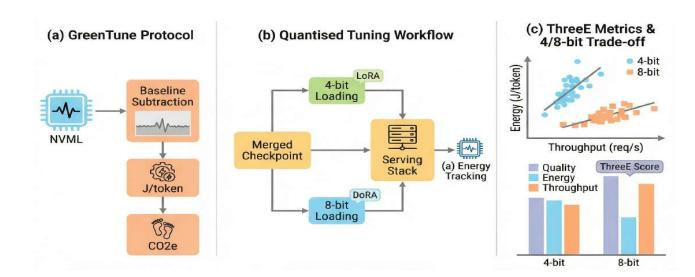
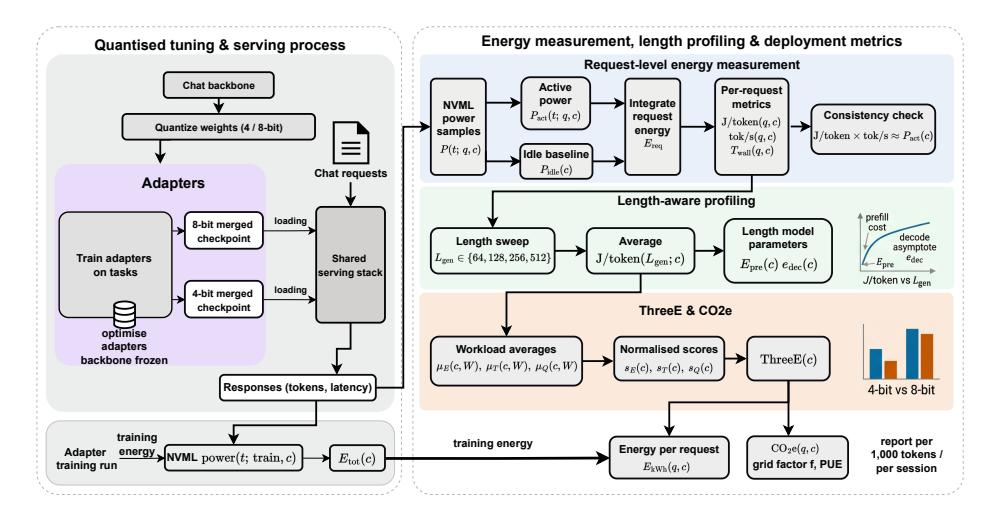
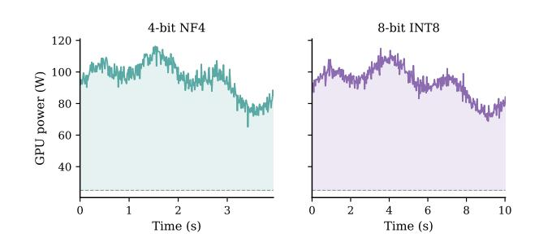
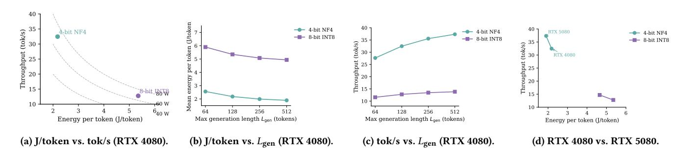
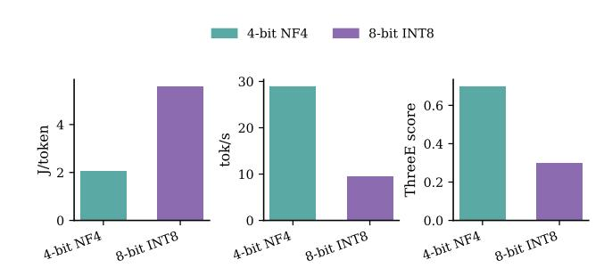
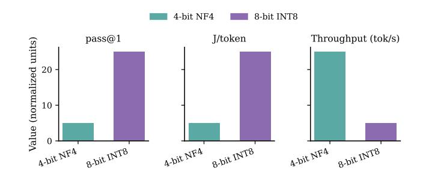
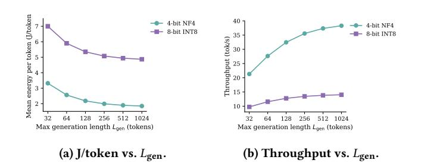
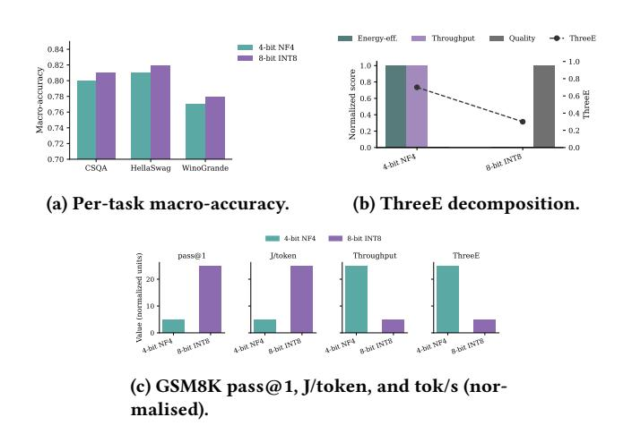
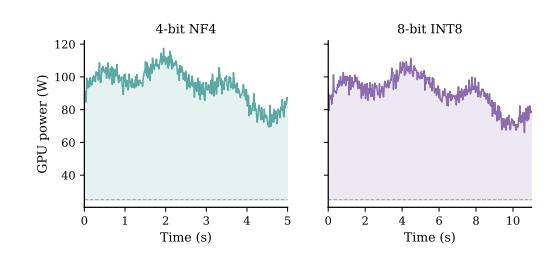

# GreenTune: Energy-Efficient Low-Rank Tuning of LLMs with ThreeE Evaluation under 4-/8-bit Quantization

Xingrao Ma Lingnan University Hong Kong, China xingraoma@ln.hk

Zongxi Li Lingnan University Hong Kong, China zongxili@ln.edu.hk

Chengzu Dong Lingnan University Hong Kong, China chengzudong@ln.edu.hk

Kai Fang Zhejiang Agriculture and Forestry University Zhejiang, China kaifang@zafu.edu.cn

Di Shao Pengcheng Lab Shenzhen, China shaod@pcl.ac.cn

### Abstract

As web-scale Generative AI (GenAI) services become core Internet infrastructure, the energy use and carbon emissions of LLM inference are becoming a significant sustainability concern. Yet deployment decisions for conversational endpoints remain almost entirely driven by accuracy and latency, implicitly treating energy as a free resource and offering little visibility into the energy and CO2e cost of individual requests or into how 4-bit and 8-bit precision choices affect the trade-offs between energy, performance, and task quality. We address this gap with GreenTune, a request-centric, length-aware energy and carbon accounting protocol for web-scale GenAI services and an energy-aware quantized tuning pipeline built on top of it. GreenTune samples GPU power, subtracts an idle baseline, and integrates traces to obtain per-request energy. From these measurements it derives length-dependent Joules-per-token profiles, throughput, and tail latency and converts device-side energy into per-token and per-session CO2e estimates under standard carbon accounting assumptions. On this accounting layer, we train low-rank adapters on 4-bit and 8-bit quantized chat backbones and evaluate the resulting configurations under shared workloads to obtain fair comparisons. To support deployment decisions, GreenTune introduces the Energy–Efficiency–Effectiveness (ThreeE) composite metric, which combines energy efficiency, inference efficiency, and task effectiveness into a transparent, tunable deployment score while still exposing the underlying axes. Instantiated on ∼1.1B- and 7B-parameter chat models on consumer-grade GPUs, GreenTune shows that carefully configured 4-bit variants reduce energy consumption and CO2e per generated token by about 60% relative to 8-bit baselines, while increasing throughput by up to 3× and reducing p95 latency by more than half at comparable task accuracy. These results turn precision choices such as 4-bit vs. 8-bit from a narrow performance tweak into a system-level lever for meeting explicit carbon budgets and provide a model-agnostic path from power traces to actionable per-request and fleet-wide CO2e budgets for web-scale GenAI endpoints.

## CCS Concepts

• Computing methodologies → Machine learning; Neural networks; • Natural language generation; • Sustainability; • Web applications;

\* Zongxi Li and Di Shao are the corresponding authors; Zongxi Li is the first corresponding author.

[This work is licensed under a Creative Commons Attribution 4.0 International License.](https://creativecommons.org/licenses/by/4.0) WWW '26, Dubai, United Arab Emirates

© 2026 Copyright held by the owner/author(s). ACM ISBN 979-8-4007-2307-0/2026/04 <https://doi.org/10.1145/3774904.3793014>

## Keywords

Large Language Model, Low-Rank Adaptation, Environmental Awareness, Environmental, social, and governance (ESG)

### ACM Reference Format:

Xingrao Ma, Zongxi Li, Chengzu Dong, Kai Fang, and Di Shao. 2026. Green-Tune: Energy-Efficient Low-Rank Tuning of LLMs with ThreeE Evaluation under 4-/8-bit Quantization. In Proceedings of the ACM Web Conference 2026 (WWW '26), April 13–17, 2026, Dubai, United Arab Emirates. ACM, New York, NY, USA, [12](#page-11-0) pages.<https://doi.org/10.1145/3774904.3793014>

### 1 Introduction

Large language models (LLMs) now underpin many GenAI-powered web applications and are increasingly served through chat-style, HTTP-based APIs that handle millions of conversational turns per day. The electricity required for this always-on inference workload accumulates across fleets of accelerators and data centres rather than being dominated by a single training job, making the ongoing energy use and carbon emissions of LLM serving a central sustainability concern. The "Green AI" and sustainable deep learning literature argues that such computational cost should be reported alongside model quality [\[17,](#page-8-0) [44,](#page-9-0) [55\]](#page-9-1) and has proposed accounting practices and reporting standards for making emissions visible when training and deploying ML models. Yet in day-to-day practice, configuration choices for conversational LLM endpoints are still driven almost entirely by task accuracy, latency, and memory footprint, implicitly treating energy as a free resource and offering little visibility into the energy and CO2e cost of individual requests. Beyond web-scale conversational endpoints, similar efficiency and sustainability pressures also arise in cyber-physical and edge intelligence pipelines (e.g., connected vehicles, UAV perception/logistics, and industrial monitoring), where distributed deployments and tight resource budgets further amplify the need to account for the energy–latency–quality trade-off [\[28,](#page-8-1) [30,](#page-8-2) [37,](#page-8-3) [38,](#page-8-4) [59\]](#page-9-2).

Recent work on serving LLMs for web-scale GenAI services has largely converged on a three-component design for keeping always-on endpoints affordable. On the modelling side, parameter-efficient tuning (PEFT) methods such as LoRA, AdaLoRA, and DoRA attach small low-rank adapters to attention and MLP projections so that task-specific behaviour can be learned with frozen backbones and later merged back into dense weights for inference [\[19,](#page-8-5) [34,](#page-8-6) [60\]](#page-9-3). Quantisation schemes then reduce numerical precision to fit these tuned models on commodity accelerators: 8-bit methods such as LLM.int8() and SmoothQuant show that transformer layers can be executed in INT8 with modest accuracy loss [\[11,](#page-8-7) [56\]](#page-9-4), while 4-bit approaches including GPTQ, AWQ, and ZeroQuant, together with QLoRA-style NF4 loading, push compression further to enable single-GPU fine-tuning of multi-billion-parameter backbones [\[12,](#page-8-8) [15,](#page-8-9) [32,](#page-8-10) [57\]](#page-9-5). On the systems side,

† Xingrao Ma and Chengzu Dong made equal contributions to this work.

serving stacks built around kernels and frameworks such as FlashAttention-2, FlashDecoding++, vLLM, SGLang, and TensorRT-LLM redesign attention, KV-cache management, and decode-side kernels to raise tokens per second and reduce tail latency under web-style workloads [\[9,](#page-8-11) [18,](#page-8-12) [24,](#page-8-13) [41,](#page-9-6) [64\]](#page-9-7). Taken together, these strands make "PEFT + low-bit weights on optimised serving stacks" the default deployment pattern for conversational LLM endpoints. However, these stacks are almost always evaluated in terms of task accuracy, memory footprint, and throughput; energy, if reported at all, appears as coarse utilisation or performance-per-watt numbers and almost never as request-level Joules per generated token that could guide configuration choices, so aggressively optimising throughput and latency can inadvertently increase energy use and CO2e while this cost remains largely hidden.

In parallel, energy- and carbon-accounting work has started to make the environmental footprint of machine learning more visible. General-purpose frameworks such as Green Algorithms, CarbonTracker, and CodeCarbon incorporate runtime and hardware descriptors into CO2e estimates and provide lightweight hooks for logging emissions over complete training and inference jobs [\[2,](#page-8-14) [8,](#page-8-15) [26\]](#page-8-16). More recent studies measure the energy use of LLM workloads across models, hardware, and serving policies [\[3,](#page-8-17) [6,](#page-8-18) [20,](#page-8-19) [47,](#page-9-8) [53\]](#page-9-9). These tools and measurements are essential building blocks, but they predominantly rely on TDP-based proxies or rack-level meters rather than baseline-subtracted GPU traces for individual requests, and rarely characterise how energy per token scales with prompt and response length in a way that can guide configuration choices. As a result, even informed operators lack a principled way to compare 4-bit and 8-bit options for webscale GenAI services in terms of per-request energy, latency, and task quality under realistic length distributions.

To address this gap, we present GreenTune. GreenTune is a model- and kernel-agnostic protocol for request-level energy and carbon accounting in web-scale GenAI services. It standardises baseline-subtracted GPU power logging, token-normalised energy and throughput reporting, and CO2e conversion under explicit grid emission and PUE assumptions, enabling like-for-like comparison of the energy cost of conversational requests across models, precisions, and GPUs. Building on this accounting protocol, we instantiate an energy-aware quantised low-rank tuning workflow that stays close to current practice: we perform adapter-based fine-tuning on 4- and 8-bit quantised chat backbones [\[19,](#page-8-5) [34,](#page-8-6) [60\]](#page-9-3), merge the low-rank updates into dense weights, and serve the same merged checkpoint through matched 4-bit and 8-bit loading paths [\[11,](#page-8-7) [12,](#page-8-8) [15,](#page-8-9) [32,](#page-8-10) [56,](#page-9-4) [57\]](#page-9-5). We then evaluate these configurations under shared web-style workloads on an optimised serving stack [\[9,](#page-8-11) [18,](#page-8-12) [24,](#page-8-13) [41,](#page-9-6) [64\]](#page-9-7) while sampling GPU power. From these traces, GreenTune derives per-request energy, constructs length-aware profiles of Joules per generated token, throughput, and tail latency, and converts device-side energy into per-token and per-session CO2e under standard carbon-accounting assumptions. As its deployment-facing evaluation layer, GreenTune introduces an energy–efficiency–effectiveness (ThreeE) composite metric that aggregates normalised energy efficiency (inverse J/token), inference efficiency (tokens per second), and task effectiveness (accuracy or pass@1) into a transparent, tunable score, while always exposing the underlying dimensions as a concrete operationalisation of the energy–latency– quality trade-off. Figure [1](#page-1-0) provides a high-level view of the GreenTune protocol and how it is used to compare 4- and 8-bit operating points.

We instantiate GreenTune on 1.1B- and 7B-parameter chat backbones deployed on consumer-grade GPUs under web-style commonsense and math workloads. In these settings, carefully configured 4-bit merged-adapter variants reduce energy and CO2e per generated token by about 60% relative to 8-bit baselines at similar task accuracy, while increasing throughput by up to 3× and cutting p95 latency by more than half for typical request lengths. These results, together with length-aware CO2e estimates, allow us to empirically characterise how 4-/8-bit design choices affect the energy– latency–quality trade-off and how training and inference energy translate

Figure 1: High-level illustration of the GreenTune protocol, quantised tuning workflow, and deployment-facing metrics (see Sections [3](#page-2-0) and [4\)](#page-3-0).

into lifecycle CO2e budgets for conversational LLM endpoints in web-style GenAI services. To summarise, our main contributions are:

- We propose GreenTune, a model- and kernel-agnostic protocol for request-level energy and carbon accounting in web-scale GenAI services. GreenTune standardises baseline-subtracted GPU power logging, token-normalised energy and throughput reporting, and CO2e conversion under explicit grid and PUE assumptions, enabling like-for-like comparison of the energy cost of conversational requests across models, precisions, and GPUs.
- We design a length-aware tuning, serving, and evaluation pipeline that couples adapter-based fine-tuning on 4- and 8-bit backbones with merged-weight serving and a simple length-aware Joules-pertoken profile. On top of this pipeline, we introduce the ThreeE composite metric, which aggregates energy efficiency, inference efficiency, and task quality into a transparent, tunable deploymentfacing score while still exposing the underlying dimensions.
- We empirically characterise 4- and 8-bit design choices and their sustainability implications by applying GreenTune to TinyLlama 1.1B and Mistral 7B on RTX 4080 and RTX 5080 GPUs under web-style workloads. Our results show that carefully configured 4-bit mergedadapter variants achieve a more favourable energy–latency–quality trade-off than 8-bit baselines, and we translate this advantage into per-1,000-token and per-session CO2e budgets that support configuration choices for conversational LLM endpoints in web-scale GenAI services.

### 2 Related Work

## 2.1 Parameter-Efficient Tuning and Quantization

Large LLMs can be adapted without complete retraining by attaching small trainable modules to the frozen model (parameter-efficient fine-tuning, PEFT). LoRA inserts low-rank adapters in attention and feed-forward layers, achieving nearly the full fine-tuning accuracy with only a small fraction of the parameters [\[19\]](#page-8-5). Variants refine this idea, e.g. by adaptively allocating adapter ranks [\[60\]](#page-9-3) or reparameterising weights in a low-rank form [\[34\]](#page-8-6). Alternatively, prompt-based tuning optimizes task-specific continuous vectors (soft prompts) instead of weights (prefix-tuning, prompt tuning) [\[27,](#page-8-20) [31\]](#page-8-21). Frameworks like UniPELT and P-Tuning v2 unify multiple PEFT strategies [\[35,](#page-8-22) [39\]](#page-8-23), and adapter tuning has been extended to instruction-following and multi-modal scenarios [\[61\]](#page-9-10). Surveys confirm that these adapter- and prompt-based methods are now standard for efficiently customizing LLMs [\[40,](#page-8-24) [51\]](#page-9-11). However, they focus on reducing fine-tuning cost and preserving accuracy while largely ignoring inference energy. Green-Tune builds on such PEFT techniques applied to quantized backbones, but shifts focus to their energy and carbon behavior during deployment.

Low-bit quantization offers a complementary way to cut inference cost. 8-bit transformer execution (e.g. LLM.int8(), SmoothQuant) yields negligible accuracy loss compared to FP16 [\[11,](#page-8-7) [56\]](#page-9-4), while 4-bit weight-only quantization (GPTQ, AWQ) uses per-channel calibration to preserve model quality [\[15,](#page-8-9) [32\]](#page-8-10). Systems toolkits combine mixed precision and optimized kernels to serve multi-billion-parameter models efficiently (ZeroQuant, SqueezeLLM) [\[23,](#page-8-25) [57\]](#page-9-5), and further compress models via sparsity or additive quantization (SpQR, AQLM) [\[10,](#page-8-26) [14\]](#page-8-27). QLoRA integrates 4-bit NF4 quantization with LoRA fine-tuning, enabling single-GPU adaptation of larger models [\[12\]](#page-8-8), and QServe co-designs a W4A8 quantization format with the inference stack [\[33\]](#page-8-28). Pushing to extremes, new architectures explore 1–2-bit transformers for efficient serving [\[52,](#page-9-12) [62\]](#page-9-13). These advances have made lowbit PEFT a practical default for LLM deployment [\[40,](#page-8-24) [51\]](#page-9-11), but evaluations typically emphasize accuracy, memory, and throughput rather than energy per token or power usage. GreenTune is complementary: it assumes these standard quantized PEFT models and adds request-level energy/carbon accounting plus composite efficiency metrics for comparing 4-bit and 8-bit variants.

### 2.2 LLM Serving Systems for Web-Scale Inference

Many system-level optimizations have been developed for high-throughput LLM serving. At the kernel level, FlashAttention-2 and FlashDecoding++ reorganize attention and decoding operations for higher throughput and lower latency [\[9,](#page-8-11) [18\]](#page-8-12). At the system level, frameworks like vLLM, FlexGen, PowerInfer, SGLang, and TensorRT-LLM manage GPU memory (e.g. KV caches) and offloading to maximize performance [\[24,](#page-8-13) [41,](#page-9-6) [45,](#page-9-14) [46,](#page-9-15) [64\]](#page-9-7). At larger scales, distributed systems such as DeepSpeed Inference, FastServe, and DistServe use model and pipeline parallelism to saturate multi-GPU clusters under real-world request loads [\[1,](#page-8-29) [54,](#page-9-16) [65\]](#page-9-17). Surveys note that deploying PEFT-tuned, low-bit models on such optimized stacks is becoming standard practice [\[40,](#page-8-24) [51\]](#page-9-11).

Beyond raw throughput, some works introduce policies to trade off model quality, latency, and cost, and Greener LLMs proposes energy-aware scheduling to cut cluster power usage while meeting tail-latency targets [\[47\]](#page-9-8). Meanwhile, LLM APIs are being integrated into complex applications (multi-turn search clarification, conversational recommendation, knowledge tracing, etc.), further heightening the need for efficient inference [\[16,](#page-8-30) [21,](#page-8-31) [29,](#page-8-32) [36,](#page-8-33) [63\]](#page-9-18). Current serving stacks deliver high tokens-per-second throughput and low latency, but they rarely report direct energy usage. Energy is usually only inferred from GPU utilization or vendor performance-per-watt metrics, which do not translate into per-request Joules or CO2. GreenTune augments these systems by adding a lightweight, model-agnostic GPU power logging protocol at the request level, and by introducing composite metrics that evaluate energy, speed, and quality together for LLM deployment.

### 2.3 Energy and Carbon Accounting for Web LLM Services

Early analyses of large NLP models quantified their environmental cost and called for transparent reporting of energy and emissions [\[25,](#page-8-34) [44,](#page-9-0) [48\]](#page-9-19). This prompted Green AI initiatives arguing that accuracy alone is incomplete and urging researchers to report compute, energy, and CO2 footprint alongside performance [\[4,](#page-8-35) [7,](#page-8-36) [44,](#page-9-0) [49,](#page-9-20) [50,](#page-9-21) [55,](#page-9-1) [58\]](#page-9-22). Methodologies have been proposed to standardize energy reporting (e.g. explicit hardware/runtime disclosure [\[17\]](#page-8-0)) and to align ML with climate goals [\[22,](#page-8-37) [42\]](#page-9-23). Tools such as Green Algorithms, CarbonTracker, CodeCarbon, and eco2AI estimate emissions from runtime and hardware usage under assumptions about the energy grid and data-center efficiency [\[2,](#page-8-14) [5,](#page-8-38) [8,](#page-8-15) [26\]](#page-8-16), and a recent Green MLOps survey extends these ideas to production pipelines [\[43\]](#page-9-24). However, these approaches operate at coarse granularity (whole jobs or pipelines) and often rely on proxy estimates (e.g. hardware TDP or average utilization) rather

than direct measurements. They do not provide fine-grained per-request energy tracking or multi-objective metrics for model deployment.

Recently, research has focused specifically on LLM inference efficiency. For example, IrEne predicts inference energy from model and hardware specs [\[6\]](#page-8-18), Wilkins et al. model cluster-level energy use as a function of model size and sequence length [\[53\]](#page-9-9), and Dodge et al. compare the carbon intensity of various cloud instances and accelerators [\[13\]](#page-8-39). Empirical studies have also emerged: MELODI logs actual power use of LLMs across tasks to analyze how prompt features affect energy consumption [\[20\]](#page-8-19), and Argerich et al. measure how model size, architecture, batch size, and quantization impact inference energy and latency [\[3\]](#page-8-17). Greener LLMs shows that energy-aware scheduling can reduce power draw while still meeting latency SLOs [\[47\]](#page-9-8). Despite these advances, no standard protocol yet exists for baseline-adjusted per-request power logging, nor any method to directly link energy per token to output length for guiding deployment decisions. GreenTune addresses these gaps by introducing such a power measurement protocol, a simple length-aware model of J/token (to separate prompt overhead from pertoken cost), and a composite metric (ThreeE) combining energy efficiency, throughput, and quality, allowing practitioners to weigh energy/carbon trade-offs alongside model performance when deploying LLMs.

### 3 Problem Statement

In this work, large language models are used as back-end components of web-style GenAI services. A service exposes a chat-style HTTP API, and each user interaction is represented as a request �� of the form

�� = (prompt, ��gen, ��dec ),

where prompt is the input text, ��gen is the maximum generation length, and ��dec denotes decoding parameters such as temperature, top-��, and stop sequences. A deployment configuration �� specifies the backbone (e.g., TinyLlama-1.1B-Chat vs. Mistral-7B-Instruct), numerical precision (4-bit vs. 8-bit), adapter type (LoRA vs. DoRA), serving kernels, and hardware platform (e.g., RTX 4080 vs. RTX 5080). For a given pair (��, �� ), the service returns a response and produces a power trace on the serving device.

We denote by �� (��;��, �� ) the instantaneous GPU power in watts while serving request�� under configuration��, as a function of time �� ∈ [��start, ��end ], and by ��idle the idle baseline power measured on the same device under the same clocks and driver settings. The baseline-subtracted active power is

��act(��;��, �� ) = max{�� (��;��, �� ) − ��idle, 0}, (1)

and the request-level energy is defined as

��req (��, �� ) = ∫ ��end ��start ��act(��;��, �� ) d��, (2)

measured in joules. Let ��tok (��, �� ) be the number of newly generated tokens in the response (excluding prompt tokens), and let ��wall(��, �� ) = ��end − ��start be the end-to-end latency in seconds. We then report the mean energy per generated token and the per-request throughput

J/token(��, �� ) = ��req (��, �� ) ��tok (��, �� ) , tok/s(��, �� ) = ��tok (��, �� ) ��wall(��, �� ) . (3)

In addition, we use the empirical 95th percentile of ��wall(��, �� ) across requests as a tail-latency metric, and we denote task quality by a scalar �� (��, �� ), such as macro-accuracy for multiple-choice tasks or pass@1 for GSM8K-style generation.

Real deployments care about behaviour under a web-style workload rather than a single request. We model such a workload as a distribution W over requests ��, or equivalently as a finite request list whose empirical distribution approximates W. We write �� ∼ W when a request is drawn from this workload. Given a configuration �� and workload W, we define

Figure 2: GreenTune training–serving, measurement, and deployment pipeline (detailed in Section [4\)](#page-3-0).

Figure 3: Baseline-subtracted NVML power traces for two requests (4-bit vs. 8-bit). The shaded area is the request energy ��req (��, ��) with horizontal axis as end-to-end latency ��wall(��, ��).

often need a single score that summarises these axes while still exposing the underlying trade-offs.

GreenTune therefore defines a composite metric, ThreeE, that aggregates normalised versions of these three objectives. Let C be the set of candidate configurations under consideration. We first form energy-efficiency, throughput, and quality scores

���� (�� ) = normC 1/���� (��, W ) , ���� (�� ) = normC ���� (��, W ) , ���� (�� ) = normC ���� (��, W ) , (7)

where normC (· ) denotes min–max normalisation over C. The ThreeE score for configuration �� is then

ThreeE(�� ) = ���� ���� (�� ) + ���� ���� (�� ) + ���� ���� (�� ), (8)

where ���� + ���� + ���� = 1. In our experiments we use default weights (����, ���� , ���� ) = (0.4, 0.3, 0.3), placing slightly more emphasis on energy efficiency. Importantly, GreenTune always reports ����, ���� , and ���� alongside ThreeE, so that operators can adjust weights or perform Pareto analysis for their own deployment scenarios.

To express energy use as CO2e, we convert mean energy per token into per-request and per-workload electricity under explicit assumptions about the grid and data-centre efficiency. For a request �� that generates ��tok (��, �� )

tokens under configuration ��, the device-side energy in kilowatt-hours is

��kWh (��, �� ) = J/token(��, �� ) ��tok (��, �� ) 3.6 × 106 , (9)

and the associated emissions are

CO2e(��, �� ) = �� · PUE · ��kWh (��, �� ), (10)

where �� is the grid emission factor in kg CO2e/kWh and PUE is the power usage effectiveness of the facility. The same formulas apply to training runs by replacing J/token(��, �� ) ��tok (��, �� ) with the total measured training energy ��tot(�� ). Separating device-side energy from (�� , PUE) makes it easy to re-evaluate emissions under different data-centre or regional assumptions.

## 5 Experiments

In this section we empirically instantiate GreenTune and address three research questions:

- RQ1: Under web-style workloads, how do 4-bit and 8-bit mergedadapter LLMs trade off request-level energy, throughput, tail latency, and task quality across different request lengths, hardware generations, and model scales?
- RQ2: What is the energy cost of adapter training, and how much additional energy is introduced by common training conveniences such as validation and checkpointing?
- RQ3: When per-token Joule measurements are converted into CO2e, what are the implications for web-scale LLM services and typical usage patterns?

Section [5.1](#page-4-3) summarises the experimental setting. Section [5.2](#page-5-0) answers RQ1 through main comparisons, length sweeps, and cross-hardware/model results. Section [5.3](#page-6-0) analyses training energy and early-stopping overheads for RQ2. Section [5.4](#page-7-0) turns these measurements into web-scale carbon case studies for RQ3.

## 5.1 Experimental Setting

We instantiate GreenTune on four benchmarks, two chat backbones, and two GPUs, using a setup that mirrors typical ChatGPT-/DeepSeek-style deployments. Unless otherwise stated, all numbers follow the request-centric metrics in Section [3](#page-2-0) and the measurement protocol in Section [4.](#page-3-0)

5.1.1 Tasks and Datasets. All datasets are mapped to the unified chat-style API described in Section [3:](#page-2-0) each example becomes a single-turn user message containing the problem statement and candidate options (when applicable), and the model must either select an option label or generate a final numeric answer. Each example corresponds to one request in our logs, so the same infrastructure serves both accuracy and energy measurements.

We use three multiple-choice commonsense benchmarks, CommonsenseQA (CSQA), HellaSwag, and WinoGrande, together with one generative math benchmark, GSM8K. CSQA is a 5-way commonsense QA task. HellaSwag asks the model to pick the most plausible continuation among four options. WinoGrande is a coreference benchmark converted into a cloze-style two-way choice. GSM8K contains grade-school math word problems evaluated in a generative setting: the model is prompted to produce free-form reasoning followed by a final numeric answer, from which we extract the last integer or decimal number and compute pass@1 by exact match. For the joint energy–latency analysis we randomly sample 200 GSM8K test problems and run strict sampling (one generation per problem) with a cap of 128 new tokens.

5.1.2 Models, Tuning, andQuantisation. We use two open-source instructiontuned chat backbones, TinyLlama-1.1B-Chat and Mistral-7B-Instruct, both with 4,096-token BPE context windows. On each backbone we insert rank-16 LoRA- or DoRA-style adapters in all attention and feed-forward projection layers and keep backbone weights frozen. TinyLlama-1.1B-Chat uses a single adapter trained on the union of the CSQA, HellaSwag, and WinoGrande training splits; Mistral-7B-Instruct uses the same mixture plus a separate GSM8K adapter for the generative experiments.

For each backbone we consider two operating points: 4-bit NF4 and 8-bit INT8. Backbone weights are quantised once before tuning and remain quantised during training and serving, while adapters are trained in bfloat16 and merged into the quantised backbone at export, yielding one dense checkpoint per backbone–precision pair. Unless otherwise stated, we train all adapters with AdamW (weight decay 0.01), a cosine learning-rate schedule with 3% warmup, global batch size 128, maximum sequence length 512, and a fixed budget of �� = 3,234 gradient updates; further details are in Appendix [A.](#page-9-25)

5.1.3 Hardware, Software, and Power Logging. Experiments run on a workstationclass server with one NVIDIA RTX 4080 16 GB GPU and one RTX 5080 GPU, a multi-core CPU, 128 GB RAM, NVMe storage, and a 64-bit Linux OS. Training and serving use PyTorch, Hugging Face Transformers, peft, and bitsandbytes on top of CUDA/cuDNN; for energy runs we disable automatic mixed precision and explicitly control quantisation settings.

GPU power is recorded via NVIDIA's NVML interface using a lightweight Python logger that samples instantaneous power at ∼20 Hz, following Section [4.2.](#page-3-3) For each run we first measure an idle baseline with the GPU initialised but idle, then perform a short warm-up, and finally log baseline-subtracted power traces aligned with per-request wall-clock timestamps.

5.1.4 Workloads, Decoding, and Pairing. A central design goal of Green-Tune is to enable paired comparisons between operating points. For each dataset we therefore construct a deterministic JSONL request list specifying the exact prompt text, decoding parameters, and maximum generation length for every query. All 4-bit and 8-bit variants of a given backbone consume the same request list in the same order, with the same random seed whenever sampling is enabled.

For the main experiments we use a chat-style decoding configuration typical of web-facing LLM APIs: temperature 0.7, top-�� 0.95, and a maximum of ��gen = 128 new tokens for all tasks. The length-sweep experiments in Section [5.2](#page-5-0) reuse the same prompts but vary ��gen ∈ {64, 128, 256, 512}. For GSM8K we use strict sampling with a single draw per problem and the same decoding parameters. End-to-end latency ��wall(��, �� ), throughput tok/s(��, �� ), and J/token(��, �� ) are computed as in Section [3,](#page-2-0) and the empirical 95th percentile of ��wall is used as a tail-latency metric.

As a sanity check, we also evaluate the full-precision TinyLlama-1.1B-Chat backbone on PIQA and HellaSwag; its accuracy is within about 0.02

of our 4-bit and 8-bit configurations (see Appendix [D\)](#page-11-1), so subsequent comparisons focus on the quantised models.

## 5.2 RQ1: Performance under Web-Style Workloads

RQ1 asks how 4-bit and 8-bit loading trade off energy, throughput, tail latency, and quality when low-rank tuned backbones are served as chatstyle web endpoints. We first compare 4-bit and 8-bit for a typical interactive generation length, then study length sensitivity, hardware and model-scale generalisation, and a strictly generative GSM8K workload.

5.2.1 Main Comparison at 128-Token Generations. We begin with TinyLlama-1.1B-Chat on an RTX 4080 with a generation cap ��gen = 128. Table [2](#page-6-1) reports mean energy per token, throughput, p95 latency, and the ThreeE score (Eq. [8\)](#page-4-4) for 4-bit NF4 and 8-bit INT8 loading, both with rank-16 LoRA/DoRA adapters merged into dense weights. Figure [4\(](#page-6-2)a) places the two configurations in the J/token–tok/s plane.

At similar mean active power (about 70 W), moving from 8-bit to 4-bit reduces mean J/token from 5.35 to 2.18 (a 59% decrease), increases throughput from 12.77 to 32.46 tok/s (a factor of 2.54), and reduces p95 latency from 10.57 to 4.20 s (a 60% decrease), while macro-accuracy across CSQA, HellaSwag, and WinoGrande drops by only 0.011. Because the consistency relationship ��act ≈ (J/token) × (tok/s) holds for both points, the energy gains come almost entirely from higher throughput rather than lower instantaneous power. Under the default ThreeE weights (0.4, 0.3, 0.3), 4-bit scores 0.70 versus 0.30 for 8-bit.

5.2.2 Length Sensitivity and Decode Asymptote. To study how these advantages scale with response length, GreenTune performs a length sweep over ��gen ∈ {64, 128, 256, 512} while keeping prompts, decoding parameters, and hardware fixed. Figures [4\(](#page-6-2)b) and [4\(](#page-6-2)c) show mean J/token and tok/s versus ��gen for TinyLlama-1.1B-Chat on RTX 4080 under 4-bit and 8-bit loading.

Across the entire range, the 4-bit curve lies strictly below the 8-bit curve in both metrics. As ��gen grows, J/token falls toward a decode-dominated asymptote and tok/s rises as prefill overhead is amortised. The length-aware model in Eq. [\(6\)](#page-3-7) fits the curves well, and the fitted decode asymptote ��dec (�� ) is consistently smaller for 4-bit. This indicates that its energy advantage persists and even slightly strengthens for longer generations. Extended sweeps are visualised in Appendix [B.](#page-10-0)

5.2.3 Hardware and Model-Scale Generalisation. Next, we test whether these conclusions are tied to a specific GPU or model size. Figure [4\(](#page-6-2)d) repeats the TinyLlama-1.1B experiment on RTX 5080 with the same request list, decoding policy, and 4-/8-bit loaders. On RTX 5080, 4-bit improves from 32.46 to 37.33 tok/s and from 2.18 to 1.90 J/token; 8-bit improves from 12.77 to 14.69 tok/s and from 5.35 to 4.65 J/token. p95 latency also decreases for both precisions. Crucially, the ordering remains unchanged: on both RTX 4080 and RTX 5080, 4-bit dominates 8-bit in J/token, throughput, and tail latency at similar active power.

We then switch to Mistral-7B-Instruct with rank-16 adapters trained and merged as in Section [5.1.](#page-4-3) Figure [5](#page-6-3) summarises J/token, tok/s, and ThreeE at ��gen = 128 for the discriminative tasks. Compared to 8-bit, 4-bit reduces J/token by 62.9%, increases throughput by a factor of 3.05, and cuts p95 latency by 81.4%, while macro-accuracy is only 0.006 higher for 8-bit. This suggests that the qualitative benefits of 4-bit loading are stable across both GPU generation and backbone scale.

5.2.4 Generative GSM8K under Strict Sampling. Finally, we consider a generative workload where free-form reasoning is required. Using Mistral-7B-Instruct with rank-16 adapters trained and merged as above, we evaluate strict-sampling GSM8K: each of 200 math word problems is sampled once under a fixed decoding strategy, and pass@1 is computed from the extracted final numeric answer. Figure [6](#page-10-1) compares 4-bit and 8-bit loading on normalised pass@1, J/token, and tok/s.

Table 1: Summary of evaluation datasets and task formulations. All datasets are mapped to a unified chat-style API format. "MC" denotes multiple-choice classification, and "Gen" denotes free-form generation.

| Dataset              | Type              | Metric    | Train  | Dev    | Test   |
|----------------------|-------------------|-----------|--------|--------|--------|
| CommonsenseQA (CSQA) | MC commonsense QA | macro-acc | 9,741  | 1,221  | 1,140  |
| HellaSwag            | MC continuation   | macro-acc | 39,905 | 10,042 | 10,003 |
| WinoGrande (XL)      | MC coreference    | macro-acc | 40,398 | 1,267  | 1,767  |
| GSM8K                | Gen math QA       | pass@1    | 7,473  | –      | 1,319  |

Figure 4: TinyLlama-1.1B-Chat: J/token, throughput, and hardware comparison for 4-bit vs. 8-bit loading under web-style workloads (see Section [5.2\)](#page-5-0).

Table 2: TinyLlama-1.1B-Chat on RTX 4080 with ��gen = 128: mean J/token, throughput, p95 latency, and ThreeE for 4-bit and 8-bit loading.

Figure 5: Mistral-7B-Instruct on RTX 4080, ��gen = 128: J/token, tok/s, and ThreeE for 4-bit vs. 8-bit loading.

On this benchmark, 8-bit achieves slightly higher pass@1 than 4-bit, with an absolute difference of 0.015. However, 4-bit still enjoys a substantial advantage on the energy and throughput axes: J/token is lower and tok/s is higher by margins similar to those observed on the multiple-choice tasks. When we combine the three axes into the ThreeE score, 4-bit remains the more favourable operating point. For web agents that interleave language generation with tool calls and numeric reasoning, this suggests that switching to 4-bit loading can significantly improve end-to-end efficiency while keeping the quality of math reasoning within a small, quantifiable gap.

Table 3: Training energy and early-stopping overheads for TinyLlama-1.1B-Chat LoRA on RTX 4080. Both runs use rank-16 adapters and �� = 3,234 steps; see Appendix [A](#page-9-25) for the rationale behind this step budget.

## 5.3 RQ2: Design Choices and Training Energy

RQ2 examines the energy cost of adapter training itself and the effect of common infrastructure choices such as early-stopping machinery. Although inference dominates the long-run footprint of web LLM services, a transparent view of training energy is useful for budgeting fine-tuning pipelines and for converting GreenTune's Joule measurements into lifecycle CO2e.

5.3.1 Training Energy and Early-Stopping Overheads. We apply Green-Tune's NVML protocol to TinyLlama-1.1B-Chat LoRA training on RTX 4080. As in Section [5.1,](#page-4-3) all runs use rank-16 adapters and a fixed step budget �� = 3,234. To isolate the cost of early-stopping infrastructure, we compare two configurations on the same data: NoES, which simply runs the full �� steps, logs per-step energy, and writes only a final checkpoint; and ES, which evaluates on a small dev subset and writes checkpoints at each evaluation boundary, but is still forced to run exactly �� steps so that any energy difference is due solely to validation and checkpoint overhead.

Table [3](#page-6-4) reports total energy and average energy per optimisation step. Under our setup, NoES consumes 1.238 MJ in total (about 382.8 J/step), while ES consumes 1.247 MJ (about 385.6 J/step). The difference corresponds to a 0.73% increase in total energy, or roughly 2.8 J/step, and is almost entirely attributable to the additional validation and checkpoint phases. As long as the total step count is fixed, toggling early-stopping infrastructure on or off therefore has only a marginal impact on training energy; most of the footprint remains dominated by the forward and backward passes themselves. If early stopping is actually used to terminate training earlier,

Table 4: Estimated CO2e for a single TinyLlama-1.1B-Chat LoRA run (NoES) consuming 1.238 MJ (0.3439 kWh), under low, medium, and high grid emission factors �� without accounting for PUE.

Table 5: Effect of power usage effectiveness (PUE) on estimated training CO2e for the medium grid factor �� = 0.55 kg/kWh in Table [4.](#page-7-1)

total energy will decrease roughly in proportion to the number of steps. For automated model-selection and scheduling systems, this means that perstep energy estimated by GreenTune can be safely combined with standard learning-curve extrapolation without large hidden costs from validation and checkpointing.

5.3.2 Training Energy and Lifecycle CO2. GreenTune converts measured Joules into CO2e via the energy-to-carbon formulas in Section [4.4.](#page-3-5) For the representative TinyLlama-1.1B-Chat LoRA run without early stopping (NoES), integrating NVML traces over all �� = 3,234 steps yields ��tot = 1.238 MJ (0.3439 kWh). Using Eqs. [\(9\)](#page-4-5) and [\(10\)](#page-4-6) with grid emission factors �� ∈ {0.35, 0.55, 0.70} kg/kWh and ignoring PUE for the moment gives the training-run footprints in Table [4.](#page-7-1)

Data-centre operators typically reason in terms of facility-level energy, which scales device-side consumption by the power usage effectiveness (PUE). Table [5](#page-7-2) shows how the medium grid factor from Table [4](#page-7-1) scales under PUE values in {1.2, 1.5, 1.8}. The relationship is linear by construction, so GreenTune's device-level Joules can be re-used whenever PUE or grid mix changes, without repeating any measurements.

## 5.4 RQ3: Web-Scale Sustainability and Case Studies

RQ3 asks what GreenTune's request-level Joule measurements imply for the sustainability of web-scale LLM services. We focus on inference, where per-token energy dominates the long-run footprint, and use the carbon conversion scheme of Section [4.4](#page-3-5) to construct two illustrative case studies together with cross-case design guidelines.

5.4.1 Case Study I: Compact Educational Assistant. Consider a TinyLlama-1.1B-Chat endpoint deployed as a compact educational assistant, where a typical session produces about 1,000 generated tokens (for example, a few short answers and explanations). Using the TinyLlama-1.1B-Chat results on RTX 4080 at ��gen = 128 and the default grid-and-PUE assumptions (�� = 0.55 kg/kWh, PUE in {1.0, 1.5}), Eqs. [\(9\)](#page-4-5) and [\(10\)](#page-4-6) give the per-1,000 token emissions in Table [6.](#page-9-26)

Even under this conservative accounting, 4-bit loading emits only about 40% of the CO2 of 8-bit loading for the same number of generated tokens. The difference between the two operating points is roughly 0.484 g CO2 per 1,000 generated tokens at PUE = 1.0. If such an assistant serves one million sessions per day, moving from 8-bit to 4-bit loading would reduce emissions by about 484 kg CO2 per day, which is on the order of 102 tons per year.

5.4.2 Case Study II: 7B "GPT-3.5-Class" Endpoint. As a second example, consider a higher-end endpoint backed by Mistral-7B-Instruct, targeting "GPT-3.5-class" capabilities. Figure [5](#page-6-3) shows that, at ��gen = 128, switching from 8-bit to 4-bit loading reduces J/token by 62.9%, improves throughput by a factor of 3.05, and lowers p95 latency by 81.4%, while macro-accuracy differs by only 0.006.

Because Eqs. [\(9\)](#page-4-5) and [\(10\)](#page-4-6) scale linearly with J/token, the same 62.9% reduction directly carries over to per-token CO2e: for any fixed grid and PUE, a 4-bit Mistral-7B endpoint emits only about 37% of the CO2 of its 8-bit counterpart for the same generated token budget. Since 7B models are substantially more expensive per token than 1.1B models, the absolute savings per user session can exceed those in the TinyLlama case, especially for workloads that demand longer generations or larger context windows.

5.4.3 Cross-Case Design Guidelines. The two case studies suggest several practical guidelines for operators of web LLM services. First, for short conversational workloads with generation caps around ��gen ≈ 128, 4-bit merged adapters are a strong default for compact and mid-size backbones. In our measurements, they consistently cut J/token and p95 latency by roughly a factor of two while maintaining comparable accuracy. The ThreeE views in Figure [5](#page-6-3) and Appendix [B](#page-10-0) make explicit that energy and throughput gains dominate the small quality gaps. Second, the length-aware profiles in Figures [4\(](#page-6-2)b)–(c) and the extended sweeps in Appendix [B](#page-10-0) show that 4-bit loading remains advantageous, and often becomes more so, as the maximum generation length increases. For interactive chat products this means that raising the token cap (for example from 128 to 256 or 512) increases perrequest energy for both precisions, but the incremental cost is smaller under 4-bit, and its relative advantage grows with length. Third, when upgrading from a 1.1B-class model to a 7B-class endpoint, GreenTune's J/token and CO2e estimates provide a way to budget the additional footprint and to decide whether the accuracy gain justifies both the monetary and environmental cost. In our experiments, a 7B 4-bit endpoint offers a much more favourable energy–latency–quality trade-off than an 8-bit endpoint, suggesting that precision is a more impactful lever than modest changes in architecture or kernel stack when aiming for sustainable web-scale LLM services.

### 6 Conclusion

We presented GreenTune, a training–serving protocol for auditing energy, latency, and task quality when adapting compact language models under 4-bit and 8-bit loading in web-style LLM services. By standardising request-level NVML integration, length-aware profiling, and the ThreeE composite metric, GreenTune enables fair comparisons between operating points that differ in precision, model size, or hardware generation. Across TinyLlama-1.1B-Chat and Mistral-7B-Instruct on RTX 4080 and RTX 5080 GPUs, 4-bit merge-adapter loading consistently reduces J/token, improves throughput, and lowers p95 latency relative to 8-bit loading, while maintaining similar accuracy on both multiple-choice and generative benchmarks. Length-sensitivity analysis and carbon accounting connect these measurements to per-request and per-fleet CO2 estimates. For operators of web LLM platforms, GreenTune offers a practical way to treat energy and carbon as first-class metrics alongside accuracy and latency, and to reason quantitatively about the impact of changes in model precision, architecture, or SLAs. We hope the protocol, metrics, and implementation help bridge the gap between low-level hardware measurements and high-level sustainability goals, and support more environmentally aware growth of web-scale LLM services.

## ACKNOWLEDGMENTS

This work has been supported by Lingnan University through Faculty Research Grants (SDS24A2 and SDS24A12) and the Lam Woo Research Fund (No. LWP20040). This work is partly supported by the Major Key Project of PCL (Grant No. PCL2024A05) and the National Natural Science Foundation of China under grant No. 62403433.

### References

[1] Reza Yazdani Aminabadi, Samyam Rajbhandari, Ammar Ahmad Awan, Cheng Li, Du Li, Elton Zheng, Olatunji Ruwase, Shaden Smith, Minjia Zhang, Jeff Rasley, and Yuxiong He. 2022. DeepSpeed-Inference: Enabling Efficient Inference of Transformer Models at Unprecedented Scale. In Proceedings of the International Conference for High Performance Computing, Networking, Storage and Analysis (SC). IEEE.<https://doi.org/10.1109/SC41404.2022.00051> [2] Lasse F. Wolff Anthony, Benjamin Kanding, and Raghavendra Selvan. 2020. Carbontracker: Tracking and Predicting the Carbon Footprint of Training Deep Learning Models. arXiv preprint arXiv:2007.03051 (2020). [https://doi.org/10.](https://doi.org/10.48550/arXiv.2007.03051) [48550/arXiv.2007.03051](https://doi.org/10.48550/arXiv.2007.03051) [3] Mauricio Fadel Argerich and Marta Patiño-Martínez. 2024. Measuring and Improving the Energy Efficiency of Large Language Models Inference. IEEE Access 12 (2024), 80194–80207.<https://doi.org/10.1109/ACCESS.2024.3409745> [4] Enrico Barbierato and Alice Gatti. 2024. Toward Green AI: A Methodological Survey of the Scientific Literature. IEEE Access 12 (2024), 23989–24013. [https:](https://doi.org/10.1109/ACCESS.2024.3360705) [//doi.org/10.1109/ACCESS.2024.3360705](https://doi.org/10.1109/ACCESS.2024.3360705) [5] Semen A. Budennyy, Vladimir D. Lazarev, Nikita N. Zakharenko, Alexey N. Korovin, Olga A. Plosskaya, Denis V. Dimitrov, Vladimir S. Arkhipkin, Ivan V. Pavlov, Ivan V. Oseledets, Ivan S. Barsola, Ilya V. Egorov, Aleksandra A. Kosterina, and Leonid E. Zhukov. 2022. eco2AI: Carbon Emissions Tracking of Machine Learning Models as the First Step Towards Sustainable AI. Doklady Mathematics 106, S1 (2022), S118–S128.<https://doi.org/10.1134/S1064562422060230> [6] Qingqing Cao, Yash Kumar Lal, Harsh Trivedi, Aruna Balasubramanian, and Niranjan Balasubramanian. 2021. IrEne: Interpretable Energy Prediction for Transformers. In Proceedings of the 59th Annual Meeting of the Association for Computational Linguistics and the 11th International Joint Conference on Natural Language Processing (Volume 1: Long Papers). Association for Computational Linguistics, 2145–2157.<https://doi.org/10.18653/v1/2021.acl-long.167> [7] Christian Clemm, Lutz Stobbe, Kishan Wimalawarne, and Jan Druschke. 2024. Towards Green AI: Current Status and Future Research. arXiv preprint arXiv:2407.10237 (2024).<https://doi.org/10.48550/arXiv.2407.10237> [8] CodeCarbon contributors. 2021. CodeCarbon: Estimate CO\_2 Emissions from Computer Usage.<https://github.com/mlco2/codecarbon> [9] Tri Dao. 2023. FlashAttention-2: Faster Attention with Better Parallelism and Work Partitioning. arXiv preprint arXiv:2307.08691 (2023). [https://doi.org/10.](https://doi.org/10.48550/arXiv.2307.08691) [48550/arXiv.2307.08691](https://doi.org/10.48550/arXiv.2307.08691) [10] Tim Dettmers et al. 2023. SpQR: A Sparse-Quantized Representation for Near-Lossless LLM Weight Compression. arXiv preprint arXiv:2306.03078 (2023). [https:](https://doi.org/10.48550/arXiv.2306.03078) [//doi.org/10.48550/arXiv.2306.03078](https://doi.org/10.48550/arXiv.2306.03078) [11] Tim Dettmers, Mike Lewis, Younes Belkada, and Luke Zettlemoyer. 2022. LLM.int8(): 8-bit Matrix Multiplication for Transformers at Scale. arXiv preprint arXiv:2208.07339 (2022).<https://doi.org/10.48550/arXiv.2208.07339> [12] Tim Dettmers, Artidoro Pagnoni, Ari Holtzman, and Luke Zettlemoyer. 2023. QLoRA: Efficient Finetuning of Quantized LLMs. arXiv preprint arXiv:2305.14314 (2023).<https://doi.org/10.48550/arXiv.2305.14314> [13] Jesse Dodge, Taylor Prewitt, Rémi Tachet des Combes, et al. 2022. Measuring the Carbon Intensity of AI in Cloud Instances. In Proceedings of the 2022 ACM Conference on Fairness, Accountability, and Transparency (FAccT). 1877–1894. <https://doi.org/10.1145/3531146.3533234> [14] Vage Egiazarian, Andrei Panferov, Denis Kuznedelev, et al. 2024. Extreme Compression of Large Language Models via Additive Quantization. arXiv preprint arXiv:2401.06118 (2024).<https://doi.org/10.48550/arXiv.2401.06118> [15] Elias Frantar, Saleh Ashkboos, Torsten Hoefler, and Dan Alistarh. 2022. GPTQ: Accurate Post-Training Quantization for Generative Pre-trained Transformers. arXiv preprint arXiv:2210.17323 (2022).<https://doi.org/10.48550/arXiv.2210.17323> [16] Helia Hashemi, Hamed Zamani, and W. Bruce Croft. 2020. Guided Transformer: Leveraging Multiple External Sources for Representation Learning in Conversational Search. In Proceedings of the 43rd International ACM SIGIR Conference on Research and Development in Information Retrieval. 1131–1140. <https://doi.org/10.1145/3397271.3401061> [17] Peter Henderson, Jieru Hu, Joshua Romoff, Emma Brunskill, Dan Jurafsky, Joelle Pineau, and Doina Precup. 2020. Towards the Systematic Reporting of the Energy and Carbon Footprints of Machine Learning. Journal of Machine Learning Research 21, 248 (2020), 1–43.<https://doi.org/10.48550/arXiv.2002.05651> [18] Ke Hong, Guohao Dai, Jiaming Xu, Qiuli Mao, Xiuhong Li, Jun Liu, Kangdi Chen, Yuhan Dong, and Yu Wang. 2023. FlashDecoding++: Faster Large Language Model Inference on GPUs. arXiv preprint arXiv:2311.01282 (2023). [https://doi.](https://doi.org/10.48550/arXiv.2311.01282) [org/10.48550/arXiv.2311.01282](https://doi.org/10.48550/arXiv.2311.01282) [19] Edward J. Hu, Yelong Shen, Phillip Wallis, Zeyuan Allen-Zhu, Yuanzhi Li, Lu Wang, and Weizhu Chen. 2021. LoRA: Low-Rank Adaptation of Large Language Models. arXiv preprint arXiv:2106.09685 (2021). [https://doi.org/10.48550/arXiv.](https://doi.org/10.48550/arXiv.2106.09685) [2106.09685](https://doi.org/10.48550/arXiv.2106.09685) [20] Erik Johannes Husom, Arda Goknil, Lwin Khin Shar, and Sagar Sen. 2024. The Price of Prompting: Profiling Energy Use in Large Language Models Inference. arXiv preprint arXiv:2407.16893 (2024).<https://doi.org/10.48550/arXiv.2407.16893> [21] Xuhui Jiang, Chengjin Xu, Yinghan Shen, Yuanzhuo Wang, Fenglong Su, Zhichao Shi, Fei Sun, Zixuan Li, Jian Guo, and Huawei Shen. 2024. Toward Practical Entity Alignment Method Design: Insights from New Highly Heterogeneous Knowledge Graph Datasets. In Proceedings of the ACM Web Conference 2024 (WWW '24). 2325–2336.<https://doi.org/10.1145/3589334.3645720> [22] Lynn H. Kaack, Priya L. Donti, Emma Strubell, George Kamiya, Felix Creutzig, and David Rolnick. 2022. Aligning Artificial Intelligence with Climate Change Mitigation. Nature Climate Change 12, 6 (2022), 518–527. [https://doi.org/10.1038/](https://doi.org/10.1038/s41558-022-01377-7) [s41558-022-01377-7](https://doi.org/10.1038/s41558-022-01377-7) [23] Sehoon Kim et al. 2023. SqueezeLLM: Dense-and-Sparse Quantization. arXiv preprint arXiv:2306.07629 (2023).<https://doi.org/10.48550/arXiv.2306.07629> [24] Woosuk Kwon, Zhuohan Li, Siyuan Zhuang, Ying Sheng, Lianmin Zheng, Cody Hao Yu, Joseph E. Gonzalez, Hao Zhang, and Ion Stoica. 2023. Efficient Memory Management for Large Language Model Serving with PagedAttention. arXiv preprint arXiv:2309.06180 (2023).<https://doi.org/10.48550/arXiv.2309.06180> [25] Alexandre Lacoste, Alexandra Sasha Luccioni, Victor Schmidt, and Thomas Dandres. 2019. Quantifying the Carbon Emissions of Machine Learning. arXiv preprint arXiv:1910.09700 (2019).<https://doi.org/10.48550/arXiv.1910.09700> [26] Loïc Lannelongue, Joe Grealey, and Michael Inouye. 2021. Green Algorithms: Quantifying the Carbon Footprint of Computation. Advanced Science 8, 12 (2021), 2100707.<https://doi.org/10.1002/advs.202100707> [27] Brian Lester, Rami Al-Rfou, and Noah Constant. 2021. The Power of Scale for Parameter-Efficient Prompt Tuning. In Proceedings of the 2021 Conference on Empirical Methods in Natural Language Processing. 3045–3059. [https://doi.org/](https://doi.org/10.18653/v1/2021.emnlp-main.243) [10.18653/v1/2021.emnlp-main.243](https://doi.org/10.18653/v1/2021.emnlp-main.243) [28] Jinlong Li, Guojie Ma, Weihong Yang, Ruonan Li, Hongye Wang, and Zhaoquan Gu. 2025. FedDDPG: A reinforcement learning method for federated learningbased vehicle trajectory prediction. Array 27 (2025), 100450. [https://doi.org/10.](https://doi.org/10.1016/j.array.2025.100450) [1016/j.array.2025.100450](https://doi.org/10.1016/j.array.2025.100450) [29] Long Li, Zemin Liu, Chenghao Liu, and Jianling Sun. 2024. Full-Attention Driven Graph Contrastive Learning: With Effective Mutual Information Insight. In Proceedings of the ACM Web Conference 2024 (WWW '24). [https:](https://doi.org/10.1145/3589334.3645717) [//doi.org/10.1145/3589334.3645717](https://doi.org/10.1145/3589334.3645717) [30] Ruonan Li, Yang Qin, Jie Liu, Lu Zang, and Jinlong Li. 2024. Path planning strategy based on principal component federation for multi-agent in connected vehicles. IEEE Transactions on Automation Science and Engineering (2024), 9651– 9666.<https://doi.org/10.1109/TASE.2024.3510432> [31] Xiang Lisa Li and Percy Liang. 2021. Prefix-Tuning: Optimizing Continuous Prompts for Generation. In Proceedings of the 59th Annual Meeting of the Association for Computational Linguistics and the 11th International Joint Conference on Natural Language Processing (Volume 1: Long Papers). 4582–4597. <https://doi.org/10.18653/v1/2021.acl-long.353> [32] Ji Lin, Haotian Tang, Yujun Wang, and Song Han. 2023. AWQ: Activation-Aware Weight Quantization for LLMs. arXiv preprint arXiv:2306.00978 (2023). <https://doi.org/10.48550/arXiv.2306.00978> [33] Yujun Lin, Haotian Tang, Shang Yang, Zhekai Zhang, Guangxuan Xiao, Chuang Gan, and Song Han. 2024. QServe: W4A8KV4 Quantization and System Codesign for Efficient LLM Serving. arXiv preprint arXiv:2405.04532 (2024). [https:](https://doi.org/10.48550/arXiv.2405.04532) [//doi.org/10.48550/arXiv.2405.04532](https://doi.org/10.48550/arXiv.2405.04532) [34] Shih-Yang Liu, Chien-Yi Wang, Hongxu Yin, Pavlo Molchanov, Yu-Chiang F. Wang, K.-T. Cheng, and Min-Hung Chen. 2024. DoRA: Weight-Decomposed Low-Rank Adaptation. arXiv preprint arXiv:2402.09353 (2024). [https://doi.org/10.](https://doi.org/10.48550/arXiv.2402.09353) [48550/arXiv.2402.09353](https://doi.org/10.48550/arXiv.2402.09353) [35] Xiao Liu, Kaixuan Ji, Yicheng Fu, Weng Lam Tam, Zhengxiao Du, Zhilin Yang, and Jie Tang. 2021. P-Tuning v2: Prompt Tuning Can Be Comparable to Fine-Tuning Universally Across Scales and Tasks. arXiv preprint arXiv:2110.07602 (2021).<https://doi.org/10.48550/arXiv.2110.07602> [36] Haiping Ma, Yong Yang, Chuan Qin, Xiaoshan Yu, Shangshang Yang, Xingyi Zhang, and Hengshu Zhu. 2024. HD-KT: Advancing Robust Knowledge Tracing via Anomalous Learning Interaction Detection. In Proceedings of the ACM Web Conference 2024. 4479–4488.<https://doi.org/10.1145/3589334.3645718> [37] Xingrao Ma, Jie Xie, Di Shao, Aiting Yao, and Chengzu Dong. 2025. RA3T: An Innovative Region-Aligned 3D Transformer for Self-Supervised Sim-to-Real Adaptation in Low-Altitude UAV Vision. Electronics 14, 14 (2025), 2797. [https:](https://doi.org/10.3390/electronics14142797) [//doi.org/10.3390/electronics14142797](https://doi.org/10.3390/electronics14142797) [38] Xingrao Ma, Yiting Yang, Di Shao, Fong Chi Kit, and Chengzu Dong. 2025. HyADS: A Hybrid Lightweight Anomaly Detection Framework for Edge-Based Industrial Systems with Limited Data. Electronics 14, 11 (2025), 2250. [https://doi.org/10.](https://doi.org/10.3390/electronics14112250) [3390/electronics14112250](https://doi.org/10.3390/electronics14112250) [39] Yuning Mao, Lambert Mathias, Rui Hou, Amjad Almahairi, Hao Ma, Jiawei Han, Scott Yih, and Madian Khabsa. 2022. UniPELT: A Unified Framework for Parameter-Efficient Language Model Tuning. In Proceedings of the 60th Annual Meeting of the Association for Computational Linguistics (Volume 1: Long Papers). 6253–6264.<https://doi.org/10.18653/v1/2022.acl-long.433> [40] Xupeng Miao, Gabriele Oliaro, Zhihao Zhang, Xinhao Cheng, Hongyi Jin, Tianqi Chen, and Zhihao Jia. 2025. Towards Efficient Generative Large Language Model Serving: A Survey from Algorithms to Systems. Comput. Surveys 58, 1 (2025). <https://doi.org/10.1145/3754448>

[41] NVIDIA Corporation. 2023. TensorRT-LLM: High-Performance LLM Inference Library. [https://github.com/NVIDIA/TensorRT-LLM.](https://github.com/NVIDIA/TensorRT-LLM) Accessed: 2025-11-30. [42] David Patterson, Joseph Gonzalez, Quoc Le, Chen Liang, Lluis-Miquel Munguia, Daniel Rothchild, David So, Maud Texier, and Jeff Dean. 2021. Carbon Emissions and Large Neural Network Training. arXiv preprint arXiv:2104.10350 (2021). <https://doi.org/10.48550/arXiv.2104.10350> [43] Adrián Sánchez-Mompó, Ioannis Mavromatis, Peizheng Li, Konstantinos Katsaros, and Aftab Khan. 2025. Green MLOps to Green GenOps: An Empirical Study of Energy Consumption in Discriminative and Generative AI Operations. Information 16, 4 (2025), 281.<https://doi.org/10.3390/info16040281> [44] Roy Schwartz, Jesse Dodge, Noah A. Smith, and Oren Etzioni. 2020. Green AI. Commun. ACM 63, 12 (2020), 54–63.<https://doi.org/10.1145/3381831> [45] Ying Sheng et al. 2023. FlexGen: High-Throughput Generative Inference of Large Language Models with a Single GPU. arXiv preprint arXiv:2303.06865 (2023). <https://doi.org/10.48550/arXiv.2303.06865> [46] Yixin Song, Zeyu Mi, Haotong Xie, and Haibo Chen. 2023. PowerInfer: Fast Large Language Model Serving with a Consumer-grade GPU. arXiv preprint arXiv:2312.12456 (2023).<https://doi.org/10.48550/arXiv.2312.12456> [47] Jovan Stojkovic, Esha Choukse, Chaojie Zhang, Inigo Goiri, and Josep Torrellas. 2024. Towards Greener LLMs: Bringing Energy-Efficiency to the Forefront of LLM Inference. arXiv preprint arXiv:2403.20306 (2024). [https://doi.org/10.48550/](https://doi.org/10.48550/arXiv.2403.20306) [arXiv.2403.20306](https://doi.org/10.48550/arXiv.2403.20306) [48] Emma Strubell, Ananya Ganesh, and Andrew McCallum. 2019. Energy and Policy Considerations for Deep Learning in NLP. In Proceedings of the 57th Annual Meeting of the Association for Computational Linguistics. 3645–3650. [https:](https://doi.org/10.18653/v1/P19-1355) [//doi.org/10.18653/v1/P19-1355](https://doi.org/10.18653/v1/P19-1355) [49] Abdulaziz Tabbakh, Lisan Al Amin, Mahbubul Islam, G. M. Iqbal Mahmud, Imranul Kabir Chowdhury, and Md Saddam Hossain Mukta. 2024. Towards sustainable AI: a comprehensive framework for Green AI. Discover Sustainability 5 (2024), 408.<https://doi.org/10.1007/s43621-024-00641-4> [50] Roberto Verdecchia, June Sallou, and Luís Cruz. 2023. A Systematic Review of Green AI. WIREs Data Mining and Knowledge Discovery 13, 5 (2023), e1507. <https://doi.org/10.1002/widm.1507> [51] Zhongwei Wan, Xin Wang, Che Liu, Samiul Alam, Yu Zheng, Jiachen Liu, Zhongnan Qu, Shen Yan, Yi Zhu, Quanlu Zhang, Mosharaf Chowdhury, and Mi Zhang. 2024. Efficient Large Language Models: A Survey. Transactions on Machine Learning Research (2024).<https://doi.org/10.48550/arXiv.2312.03863> arXiv:2312.03863. [52] Hongyu Wang, Shuming Ma, Li Dong, Shaohan Huang, Huaijie Wang, Lingxiao Ma, Fan Yang, Ruiping Wang, Yi Wu, and Furu Wei. 2023. BitNet: Scaling 1-bit Transformers for Large Language Models. arXiv preprint arXiv:2310.11453 (2023). <https://doi.org/10.48550/arXiv.2310.11453> [53] Grant Wilkins, Srinivasan Keshav, and Richard Mortier. 2024. Offline Energy-Optimal LLM Serving: Workload-Based Energy Models for LLM Inference on Heterogeneous Systems. In Proceedings of the 3rd ACM Workshop on Sustainable Computer Systems (HotCarbon 2024).<https://doi.org/10.48550/arXiv.2407.04014> arXiv:2407.04014. [54] Bingyang Wu, Yinmin Zhong, Zili Zhang, et al. 2023. Fast Distributed Inference Serving for Large Language Models. arXiv preprint arXiv:2305.05920 (2023). <https://doi.org/10.48550/arXiv.2305.05920> [55] Carole-Jean Wu, Ramya Raghavendra, Udit Gupta, Bilge Acun, Newsha Ardalani, Kiwan Maeng, Gloria Chang, Fiona Aga Behram, James Huang, Charles Bai, Michael Gschwind, Anurag Gupta, Myle Ott, Anastasia Melnikov, Salvatore Candido, David Brooks, Geeta Chauhan, Benjamin Lee, Hsien-Hsin S. Lee, Bugra Akyildiz, Maximilian Balandat, Joe Spisak, Ravi Jain, Mike Rabbat, and Kim Hazelwood. 2021. Sustainable AI: Environmental Implications, Challenges and Opportunities. arXiv preprint arXiv:2111.00364 (2021). [https://doi.org/10.48550/](https://doi.org/10.48550/arXiv.2111.00364) [arXiv.2111.00364](https://doi.org/10.48550/arXiv.2111.00364) [56] Guangxuan Xiao, Ji Lin, Mickael Seznec, Hao Wu, Julien Demouth, and Song Han. 2023. SmoothQuant: Accurate and Efficient Post-Training Quantization for LLMs. arXiv preprint arXiv:2211.10438 (2023).<https://doi.org/10.48550/arXiv.2211.10438> [57] Zhewei Yao, Reza Yazdani Aminabadi, Minjia Zhang, Xiaoxia Wu, Conglong Li, and Yuxiong He. 2022. ZeroQuant: Efficient and Affordable Post-Training Quantization for Large-Scale Transformers. arXiv preprint arXiv:2206.01861 (2022). <https://doi.org/10.48550/arXiv.2206.01861> [58] Tan Yigitcanlar, Rashid Mehmood, and Juan M. Corchado. 2021. Green Artificial Intelligence: Towards an Efficient, Sustainable and Equitable Technology for Smart Cities and Futures. Sustainability 13, 16 (2021), 8952. [https://doi.org/10.](https://doi.org/10.3390/su13168952) [3390/su13168952](https://doi.org/10.3390/su13168952) [59] Chong Zhang, Xiao Liu, Aiting Yao, Jun Bai, Chengzu Dong, Shantanu Pal, and Frank Jiang. 2024. Fed4UL: A cloud–edge–end collaborative federated learning framework for addressing the non-IID data issue in UAV logistics. Drones 8, 7 (2024), 312.<https://doi.org/10.3390/drones8070312> [60] Qingru Zhang, Minshuo Chen, Alexander Bukharin, Nikos Karampatziakis, Pengcheng He, Yu Cheng, Weizhu Chen, and Tuo Zhao. 2023. AdaLoRA: Adaptive Budget Allocation for Parameter-Efficient Fine-Tuning. arXiv preprint arXiv:2303.10512 (2023).<https://doi.org/10.48550/arXiv.2303.10512> [61] Renrui Zhang, Jiaming Han, Chris Liu, Peng Gao, Aojun Zhou, Xiangfei Hu, Shilin Yan, Pan Lu, Hongsheng Li, and Yu Qiao. 2023. LLaMA-Adapter: Efficient Fine-tuning of Language Models with Zero-init Attention. arXiv preprint arXiv:2303.16199 (2023).<https://doi.org/10.48550/arXiv.2303.16199> [62] Yilong Zhao, Chien-Yu Lin, Kan Zhu, Zihao Ye, Lequn Chen, Size Zheng, Luis Ceze, Arvind Krishnamurthy, Tianqi Chen, and Baris Kasikci. 2023. Atom: Low-bit Quantization for Efficient and Accurate LLM Serving. arXiv preprint arXiv:2310.19102 (2023).<https://doi.org/10.48550/arXiv.2310.19102> [63] Ziliang Zhao and Zhicheng Dou. 2024. Generating Multi-turn Clarification for Web Information Seeking. In Proceedings of The Web Conference 2024. [https:](https://doi.org/10.1145/3589334.3645712) [//doi.org/10.1145/3589334.3645712](https://doi.org/10.1145/3589334.3645712) [64] Lianmin Zheng, Liangsheng Yin, Zhiqiang Xie, Chuyue Sun, Jeff Huang, Cody Hao Yu, Shiyi Cao, Christos Kozyrakis, Ion Stoica, Joseph E. Gonzalez, Clark Barrett, and Ying Sheng. 2023. SGLang: Efficient Execution of Structured Language Model Programs. arXiv preprint arXiv:2312.07104 (2023). <https://doi.org/10.48550/arXiv.2312.07104> [65] Yinmin Zhong, Shengyu Liu, Junda Chen, Jianbo Hu, Yibo Zhu, Xuanzhe Liu, Xin Jin, and Hao Zhang. 2024. DistServe: Disaggregating Prefill and Decoding for Goodput-optimized Large Language Model Serving. In Proceedings of the USENIX Symposium on Operating Systems Design and Implementation (OSDI). <https://doi.org/10.48550/arXiv.2401.09670> arXiv:2401.09670. Appendix GreenTune's supplementary material provides (i) training and serving configurations needed to reproduce our experiments, (ii) extended results and comparison tables that complement Section [5](#page-4-2) and Section [2,](#page-1-1) and (iii) additional measurement details for request-level energy logging. A Implementation Details A.1 Training and Serving Configurations We tune rank-16 low-rank adapters on top of quantised backbones for both TinyLlama-1.1B-Chat and Mistral-7B-Instruct. Backbone parameters remain frozen during adapter training. Adapters are inserted into all attention and feed-forward projection layers and merged into dense weights before serving, following Hu et al. for LoRA placement and Liu et al. for DoRA-style decomposition [\[19,](#page-8-5) [34\]](#page-8-6). All runs use the same step budget �� = 3234 so that training energy is comparable across backbones and precisions. With the CSQA, HellaSwag and WinoGrande training mixture of approximately 90,000 examples (Table [1\)](#page-6-5) and a global batch size of 128 sequences, this corresponds to roughly 4.6 epochs of adapter training for TinyLlama-1.1B-Chat. We treat �� as a small, fixed compute budget that is large enough for LoRA/DoRA adapters to reach stable validation performance in our setting while keeping the training-stage energy modest, and we reuse the same �� across backbones and precisions to keep energy accounting simple and comparable. Table [7](#page-10-2) summarises the configuration. Table 6: Estimated CO2e per 1,000 generated tokens for TinyLlama-1.1B-Chat on RTX 4080 at ��gen = 128, assuming grid factor �� = 0.55 kg/kWh and PUE in {1.0, 1.5}. Configuration PUE = 1.0 (g / 1k tokens) PUE = 1.5 (g / 1k tokens) 4-bit NF4 0.333 0.500 8-bit INT8 0.817 1.226 Adapters are trained with AdamW (weight decay 0.01), a cosine learningrate schedule with 3% warmup, a peak learning rate of 10−4 , a global batch size of 128 sequences, and a maximum sequence length of 512 tokens. The instruction-tuning mixture for TinyLlama-1.1B-Chat is the union of the training splits of CSQA, HellaSwag, and WinoGrande; for Mistral-7B-Instruct we follow the same mixture and add a GSM8K adapter for the generative experiments. The same data mixtures are used for 4-bit and 8-bit

| Configuration | PUE = 1 0 (g / 1k tokens) | PUE = 1 5 (g / 1k tokens |
|---------------|---------------------------|--------------------------|
| 4-bit NF4     | 0.333                     | 0.500                    |
| 8-bit INT8    | 0.817                     | 1.226                    |

backbones so that differences in behaviour stem from precision and serving rather than training data.

Table 7: Adapter training configurations. Rank-16 LoRA/DoRA adapters are trained for �� = 3234 steps on top of frozen quantised backbones.

| Backbone            | Adapter | type   | Rank | Steps �� |
|---------------------|---------|--------|------|----------|
| TinyLlama-1.1B-Chat | LoRA    | / DoRA | 16   | 3234     |
| Mistral-7B-Instruct | LoRA    | / DoRA | 16   | 3234     |

For 4-bit loading we use NF4 quantisation in the QLoRA style [\[12\]](#page-8-8); for 8-bit loading we follow LLM.int8() [\[11\]](#page-8-7). In all experiments the backbone architecture and tokeniser are identical across 4-bit and 8-bit operating points, activations are kept in 16-bit floating point with mixed-precision optimisers, and adapters are stored in bfloat16 during training and merged into quantised weights at export time. Differences in J/token and latency can therefore be attributed to precision and throughput rather than model design.

The serving stack is built on PyTorch, Hugging Face Transformers, bitsandbytes, and the peft library on top of CUDA/cuDNN. For the main GreenTune results we use standard attention and decoding kernels and a conventional KV-cache implementation. Optimised kernels such as FlashAttention-2 [\[9\]](#page-8-11), FlashDecoding++ [\[18\]](#page-8-12), vLLM [\[24\]](#page-8-13), FlexGen [\[45\]](#page-9-14), PowerInfer [\[46\]](#page-9-15), SGLang [\[64\]](#page-9-7), or TensorRT-LLM [\[41\]](#page-9-6) are not required by the protocol but can be plugged in as drop-in replacements when applying GreenTune to other serving stacks.

## A.2 Logging, Hardware, and Prompt Lists

All energy measurements use NVIDIA's NVML interface. Each run has three phases: a warm-up phase to stabilise kernels and temperature; an idle phase where we measure the baseline ��idle with the GPU initialised but no active workload; and a replay phase where we serve the deterministic request list while sampling power at roughly 20 Hz. For a request with timestamps [��start, ��end ] we construct the baseline-subtracted power trace ��act(��) = �� (��) − ��idle, integrate it with the trapezoidal rule to obtain ��req, and compute J/token and tok/s as in Section [3.](#page-2-0) We check that ��act ≈ (J/token) × (tok/s) holds within a small tolerance before accepting a run.

For each benchmark we build a JSONL file that stores the chat-style prompt and decoding hyperparameters for every instance. The same file is replayed for all operating points with a fixed random seed. Unless otherwise stated we set temperature to 0.7, top-�� to 0.95, and the maximum number of new tokens to ��gen = 128. For the length sweeps we vary ��gen ∈ {64, 128, 256, 512} on the same prompts and hardware; for GSM8K we use strict sampling with a single draw per problem and a cap of 128 generated tokens.

Experiments use single-GPU runs on RTX 4080 and RTX 5080 cards in a workstation with a recent multi-core CPU, 128GB RAM, and NVMe storage. GPU application clocks and power limits are fixed, and no other heavy workloads share the device during GreenTune measurements.

## B Extended Length and Task Results

Figure [7](#page-10-3) extends the length sweep in Section [5.2](#page-5-0) to shorter and longer generation caps, combining J/token and tok/s into a two-panel view. Energy per token decreases and throughput increases as ��gen grows, and 4-bit remains more efficient at all lengths. The curves follow the simple model

J/token(��gen ) = ��dec + ��pre ��gen ,

with fitted ��dec and ��pre consistent with the values reported in Section [4.](#page-3-0)

Figure [8](#page-10-4) groups task-wise macro-accuracy and ThreeE decomposition into a single view. Panel [8a](#page-10-4) shows per-task macro-accuracy for TinyLlama-1.1B-Chat on CSQA, HellaSwag, and WinoGrande under 4-bit and 8-bit loading; panel [8b](#page-10-4) visualises the normalised ThreeE axes that feed into the

Figure 6: GSM8K strict sampling with Mistral-7B-Instruct: normalised pass@1, J/token, and tok/s for 4-bit and 8-bit loading.

Figure 7: Extended length sweeps for TinyLlama-1.1B-Chat on RTX 4080 under 4-bit and 8-bit loading.

composite score; panel [8c](#page-10-4) gives an extended GSM8K view. Per-task accuracy differences are small and do not consistently favour either precision, while 4-bit retains clear advantages in energy efficiency and throughput.

Figure 8: Extended task-wise and composite views for TinyLlama-1.1B-Chat and Mistral-7B-Instruct.

## C Method, Tooling, and Measurement Details C.1 Method and Energy-Tool Landscapes

Table [8](#page-11-2) extends the method landscape in Section [2](#page-1-1) to include a broader set of parameter-efficient tuning, quantisation, and serving works. Columns indicate whether each work proposes an adaptation method, a quantisation scheme, a serving optimisation, request-level energy reporting, lengthaware modelling, or a composite multi-axis metric.

Table 8: Extended method landscape. "Adapt." indicates whether the work proposes a tuning method; "Quant." indicates weight/activation quantisation; "Serving" indicates a serving system or kernel optimisation; "Req. Energy" indicates request-level energy reporting; "Len. Sens." indicates length-aware modelling; "Composite" indicates an explicit multi-axis metric.

| Work             |             | Adapt. | Quant. Serving | Req. Energy Len. Sens. | Composite |
|------------------|-------------|--------|----------------|------------------------|-----------|
| LoRA             | [19]        | ✓      | ✗ ✗            | ✗ ✗                    | ✗         |
| DoRA             | [34]        | ✓      | ✗ ✗            | ✗ ✗                    | ✗         |
| LLM.int8()       | [11]        | ✗      | ✓ ✗            | ✗ ✗                    | ✗         |
| QLoRA            | [12]        | ✓      | ✓ ✗            | ✗ ✗                    | ✗         |
| SmoothQuant      | [56]        | ✗      | ✓ ✗            | ✗ ✗                    | ✗         |
| GPTQ             | [15]        | ✗      | ✓ ✗            | ✗ ✗                    | ✗         |
| AWQ              | [32]        | ✗      | ✓ ✗            | ✗ ✗                    | ✗         |
| ZeroQuant        | [57]        | ✗      | ✓ ✓            | ✗ ✗                    | ✗         |
| SqueezeLLM       | [23]        | ✗      | ✓ ✗            | ✗ ✗                    | ✗         |
| SpQR             | [10]        | ✗      | ✓ ✗            | ✗ ✗                    | ✗         |
| AQLM             | [14]        | ✗      | ✓ ✗            | ✗ ✗                    | ✗         |
| QServe           | [ ? ]       | ✗      | ✓ ✓            | ✗ ✗                    | ✗         |
| FlashAttention-2 | [9]         | ✗      | ✗ ✓            | ✗ ✗                    | ✗         |
| FlashDecoding++  |             | [18] ✗ | ✗ ✓            | ✗ ✗                    | ✗         |
| vLLM             | [24]        | ✗      | ✗ ✓            | ✗ ✗                    | ✗         |
| FlexGen          | [45]        | ✗      | ✗ ✓            | ✗ ✗                    | ✗         |
| PowerInfer       | [46]        | ✗      | ✗ ✓            | ✗ ✗                    | ✗         |
| SGLang           | [64]        | ✗      | ✗ ✓            | ✗ ✗                    | ✗         |
| GreenTune        | (this work) | ✓      | ✓ ✓            | ✓ ✓                    | ✓         |

Tabl[e 9](#page-11-3) compares GreenTune to prior energy and carbon accounting tools. Columns indicate whether each toolkit relies on device-level measurements (for example NVML) rather than proxy models, whether it preserves requestlevel traces, whether it provides carbon estimates, and whether it explicitly targets web-style LLM services.

Table 9: Energy and carbon accounting toolkits. "Device-level" indicates direct device power measurements; "Request-level" indicates whether per-request traces are preserved; "Carbon" indicates explicit CO2 estimation; "Web-LLM focus" indicates explicit targeting of web-style LLM services.

| Toolkit               | Device-level Request-level | Carbon Web-LLM focus |
|-----------------------|----------------------------|----------------------|
| Green Algorithms [26] | ✗ ✗                        | ✓ ✗                  |
| CarbonTracker [2]     | ✗ ✗                        | ✓ ✗                  |
| CodeCarbon            | ✗ ✗                        | ✓ ✗                  |
| Wilkins et al. [53]   | ✓ ✗                        | ✓ ✓                  |
| Stojkovic et al. [47] | ✓ ✗                        | ✓ ✓                  |
| GreenTune (this work) | ✓ ✓                        | ✓ ✓                  |

## D Full-Precision Baselines

Table [10](#page-11-4) reports accuracy of the full-precision TinyLlama-1.1B-Chat backbone and its 4-bit and 8-bit GreenTune variants on two representative multiple-choice benchmarks. All results use the same request lists and decoding configuration as in Section [5.](#page-4-2)

These baselines show that the quantised 4-bit and 8-bit GreenTune variants closely track the full-precision backbone: the absolute accuracy gap is at most 0.016 on PIQA and 0.016 on HellaSwag.

Table 10: TinyLlama-1.1B-Chat accuracy on PIQA and HellaSwag (1,000 validation examples) for full-precision, 4-bit NF4, and 8-bit INT8 loading.

Figure 9: Representative baseline-subtracted NVML power traces for two requests under 4-bit and 8-bit loading with TinyLlama-1.1B-Chat on RTX 4080. Shaded regions indicate integrated request energy.

## D.1 Measurement Fidelity and Reproducibility

Figure [9](#page-11-5) shows baseline-subtracted NVML power traces for two representative requests under 4-bit and 8-bit loading for TinyLlama-1.1B-Chat on RTX 4080. The traces exhibit the expected short prefill phase followed by a longer decode phase. Peak active power remains similar across precisions, and the large improvements in J/token reported in Section [5](#page-4-2) are therefore driven mainly by higher throughput.

To reduce measurement variance and avoid cross-run drift, we fix GPU application clocks and power limits, pin the inference process to a dedicated GPU, and hold the NVIDIA driver and CUDA toolkit versions fixed. We monitor ��idle at the beginning and end of each batch of requests and observe that idle drift over a run is negligible compared to the active power range, which supports the use of a single run-specific baseline in the accounting procedure.

To apply GreenTune to a new backbone or hardware platform, we recommend the following minimal procedure:

- (1) Prepare deterministic prompt lists for the target tasks (for example CSQA, HellaSwag, WinoGrande, GSM8K) and fix decoding settings, including temperature, top-��, and a set of generation caps ��gen.
- (2) Train LoRA/DoRA adapters on a quantised backbone using a configuration similar to Table [7,](#page-10-2) and merge adapters into dense weights for serving.
- (3) Implement NVML logging with explicit warm-up and idle-baseline phases, sampling power at a fixed frequency and storing timestamps for request start and end times.
- (4) Run the paired-request protocol under 4-bit and 8-bit loading, collect baseline-subtracted power traces and wall-clock timings, and compute J/token, tok/s, and p95 latency using the definitions in Section [3.](#page-2-0)
- (5) Fit the length-aware model in Section [4](#page-3-0) across multiple ��gen values, and convert J/token to per-request and per-run energy and carbon estimates using Eqs. [\(9\)](#page-4-5)–[\(10\)](#page-4-6).

By tying energy measurements to concrete prompt lists and decoding settings and by enforcing paired comparisons, GreenTune enables applesto-apples comparisons between 4-bit and 8-bit operating points as well as across backbones and hardware generations.