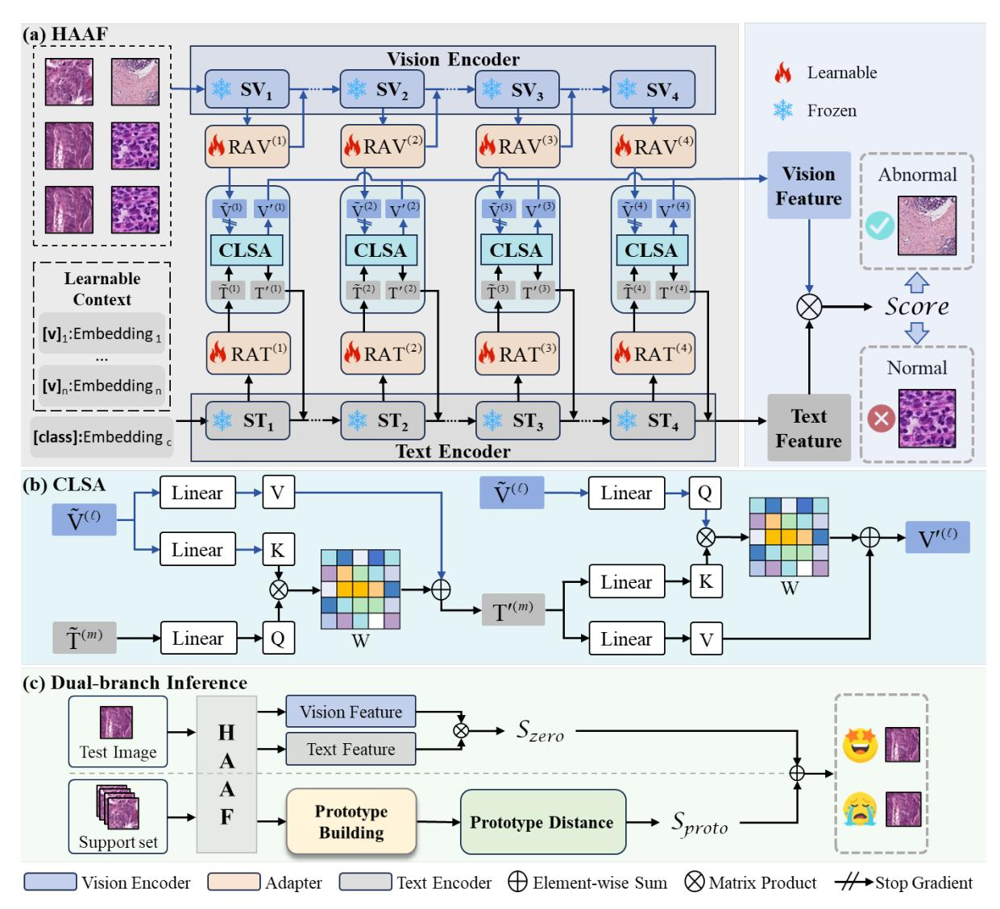
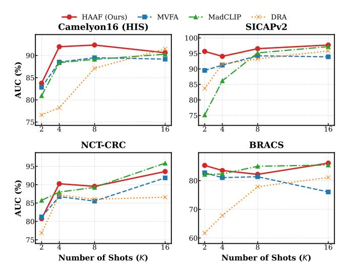
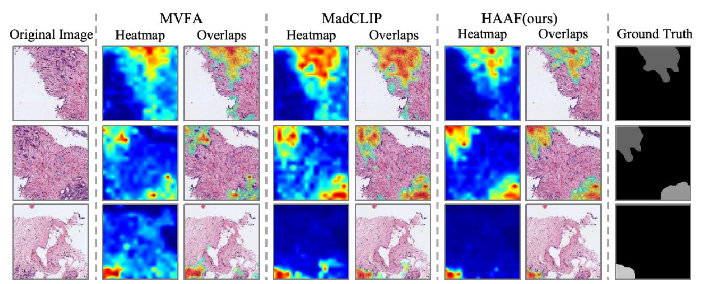
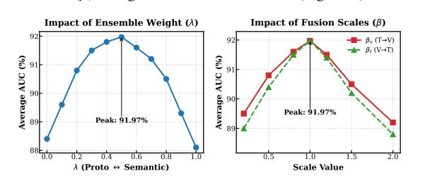

# HAAF: Hierarchical Adaptation and Alignment of Foundation Models for Few-Shot Pathology Anomaly Detection

[Chunze Yang](https://orcid.org/0009-0001-1602-8150) pureeeee@stu.xjtu.edu.cn Sch Comp Sci & Technol, Xi'an Jiaotong University Xi'an, China

[Wenjie Zhao](https://orcid.org/) zhao\_wenjie@stu.xjtu.edu.cn Sch Comp Sci & Technol, Xi'an Jiaotong University Xi'an, China

[Yue Tang](https://orcid.org/0009-0007-3787-5811) 2206123832@stu.xjtu.edu.cn Sch Comp Sci & Technol, Xi'an Jiaotong University Xi'an, China

[Junbo Lu](https://orcid.org/) lujunbo@stu.xjtu.edu.cn Sch Comp Sci & Technol, Xi'an Jiaotong University Xi'an, China

[Jiusong Ge](https://orcid.org/0009-0007-7551-4558) JiusongGe@stu.xjtu.edu.cn Sch Comp Sci & Technol, Xi'an Jiaotong University Xi'an, China

[Qidong Liu](https://orcid.org/0000-0002-0751-2602) B liuqidong@xjtu.edu.cn Sch Comp Sci & Technol, Xi'an Jiaotong University Xi'an, China

[Zeyu Gao](https://orcid.org/0000-0003-2365-8318) B zg323@cam.ac.uk University of Cambridge Cambridge, United Kingdom

[Chen Li](https://orcid.org/0000-0002-0079-3106) B cli@xjtu.edu.cn Sch Comp Sci & Technol, Xi'an Jiaotong University Xi'an, China

### Abstract

Precision pathology relies on detecting fine-grained morphological abnormalities within specific Regions of Interest (ROIs), as these local, texture-rich cues—rather than global slide contexts—drive expert diagnostic reasoning. While Vision-Language (V-L) models promise data efficiency by leveraging semantic priors, adapting them faces a critical Granularity Mismatch, where generic representations fail to resolve such subtle defects. Current adaptation methods often treat modalities as independent streams, failing to ground semantic prompts in ROI-specific visual contexts. To bridge this gap, we propose the Hierarchical Adaptation and Alignment Framework (HAAF). At its core is a novel Cross-Level Scaled Alignment (CLSA) mechanism that enforces a sequential calibration order: visual features first inject context into text prompts to generate content-adaptive descriptors, which then spatially guide the visual encoder to spotlight anomalies. Additionally, a dualbranch inference strategy integrates semantic scores with geometric prototypes to ensure stability in few-shot settings. Experiments on four benchmarks show HAAF significantly outperforms state-ofthe-art methods and effectively scales with domain-specific backbones (e.g., CONCH) in low-resource scenarios.

# CCS Concepts

### • Applied computing → Health informatics.

# Keywords

Few-Shot Anomaly Detection; Pathology Foundation Models

### ACM Reference Format:

Chunze Yang, Wenjie Zhao, Yue Tang, Junbo Lu, Jiusong Ge, Qidong Liu B, Zeyu Gao B, and Chen Li B. 2026. HAAF: Hierarchical Adaptation and Alignment of Foundation Models for Few-Shot Pathology Anomaly Detection. In Proceedings of the ACM Web Conference 2026 (WWW '26),

B Corresponding authors.

[This work is licensed under a Creative Commons Attribution 4.0 International License.](https://creativecommons.org/licenses/by/4.0) WWW '26, Dubai, United Arab Emirates

© 2026 Copyright held by the owner/author(s). ACM ISBN 979-8-4007-2307-0/2026/04 <https://doi.org/10.1145/3774904.3793015>

Figure 1: Comparison of Adaptation Paradigms. (a) Existing methods (e.g., MMA [\[49\]](#page-9-0), MadCLIP [\[40\]](#page-8-0)) typically adopt a parallel architecture where text prompts remain static and alignment is implicit, often leading to coarse localization. (b) Our HAAF introduces a progressive cross-modal interaction.

April 13–17, 2026, Dubai, United Arab Emirates. ACM, New York, NY, USA, [12](#page-11-0) pages.<https://doi.org/10.1145/3774904.3793015>

# 1 Introduction

While computational pathology has thrived in classification [\[12\]](#page-8-1), regression [\[36\]](#page-8-2), segmentation [\[13,](#page-8-3) [26\]](#page-8-4), and reasoning [\[11\]](#page-8-5), these closed-set paradigms falter against the open-set reality where rare lesions lack labeled examples. In such contexts, the clinical imperative shifts to Few-Shot Anomaly Detection: mimicking expert intuition to identify suspicious deviations by referencing a robust "normal" baseline and minimal anomaly examples, rather than relying on exhaustive annotations. Whether pinpointing subtle nuclear atypia or structural distortion within specific Regions of Interest (ROIs) [\[7,](#page-8-6) [8\]](#page-8-7), this capability is crucial for guiding further diagnosis. However, automating this process is bottlenecked by Annotation Scarcity: since characterizing all potential anomalies is infeasible, developing data-efficient few-shot paradigms is urgent [\[31\]](#page-8-8).

To overcome data scarcity, the paradigm of Vision-Language (V-L) Foundation Models (e.g., CLIP [\[37\]](#page-8-9)) has emerged as a transformative solution. By aligning visual features with semantic text descriptions, these models enable recognition capabilities with minimal training examples. Despite their potential, adapting these foundation models to ROI-level pathology anomaly detection faces a critical bottleneck arising from two distinct Representation Gaps between pre-trained features and downstream diagnostic tasks:

- Domain Gap in General Models: Models like CLIP are trained on natural images (object-centric). Despite recent advances in domain adaptation [\[43,](#page-9-1) [48\]](#page-9-2), these models struggle to encode the high-frequency, texture-rich patterns essential for identifying pathological tissues [\[20\]](#page-8-10).
- Granularity Gap in Pathology Models: Even domain-specific models like CONCH [\[30\]](#page-8-11), though pre-trained on histopathology, typically act as "generalists" optimized for coarse-grained tasks (e.g., slide-level captioning). They often operate at a global semantic level and fail to resolve the fine-grained visual details required for "specialist" anomaly detection, making it difficult to distinguish visually similar normal variants from subtle earlystage lesions [\[2,](#page-8-12) [35\]](#page-8-13).

Existing adaptation methods [\[21,](#page-8-14) [40,](#page-8-0) [49\]](#page-9-0) attempt to bridge these gaps by employing shallow prompt tuning or parallel feature fusion. However, as illustrated in Figure [1\(](#page-0-0)a), these approaches are fundamentally limited by their parallel encoding paradigms. Specifically, methods like MVFA [\[21\]](#page-8-14) primarily rely on uni-modal visual adaptation, lacking deep cross-modal interaction mechanisms to recalibrate features. Although few recent works, such as MMA [\[49\]](#page-9-0) and MadCLIP [\[40\]](#page-8-0), have considered the interactions between streams, they both adopted static fusion architecture, where textual definitions remain agnostic to the specific visual context. Consequently, generic prompts (e.g., "tumor") fail to dynamically adapt to the nuanced, instance-specific morphological deviations present in the input ROI, resulting in coarse-grained features and suppression of false positives in complex background tissues.

To address these limitations, we propose the Hierarchical Adaptation and Alignment Framework (HAAF), a unified approach designed to efficiently steer foundation models toward fine-grained anomaly detection. HAAF introduces a progressive adaptation pipeline, as shown in Figure [1\(](#page-0-0)b). Recognizing that pathological cues reside at multiple scales, we first implement Hierarchical Intramodal Adaptation, injecting lightweight adapters into intermediate layers to extract multi-scale features. Crucially, we propose a novel Progressive Mechanism named Cross-Level Scaled Alignment (CLSA). Unlike standard parallel fusion, CLSA enforces a structured semantic calibration process: it first utilizes ROI visual features to ground generic text prompts (Context Injection), transforming them into instance-aware descriptors; these calibrated prompts then spatially guide the visual features (Semantic Guidance) to highlight anomaly-relevant regions. Finally, to counterbalance the potential instability of semantic matching in extreme few-shot settings, a Dual-branch Inference Mechanism integrates semantic alignment with geometric distances, ensuring robust decision-making.

We extensively evaluate HAAF on a comprehensive benchmark covering four anatomical regions (breast, prostate, colorectal). Our framework demonstrates remarkable versatility and scalability. On the general CLIP backbone, HAAF effectively bridges the domain gap, significantly outperforming existing SOTA methods. More importantly, when applied to the CONCH backbone, HAAF achieves a substantial performance leap, proving its ability to unlock the latent fine-grained capabilities of domain-specific foundation models. Our main contributions are summarized as follows:

- We propose HAAF, a universal few-shot adaptation framework featuring hierarchical adapters and a sequential vision-language alignment mechanism (CLSA) to resolve the granularity mismatch in pathology AD.
- We establish a rigorous ROI-level anomaly detection benchmark across four histopathology datasets, providing the first comprehensive evaluation of general versus medical foundation models in this setting.
- We empirically demonstrate that sequential cross-modal interaction is superior to parallel fusion for fine-grained tasks, allowing HAAF to achieve state-of-the-art performance and effectively scale with domain-specific foundation models.

## 2 Problem Definition

Here, we address the problem of few-shot anomaly detection. Let �� ∈ R �� ×�� ×3 denote an input image and �� ∈ {0, 1} be the label, where �� = 0 denotes normal and �� = 1 denotes abnormal.

In the few-shot setting, we are provided with a support set S consisting of �� labeled samples per class:

S = {(���� , ����)}2�� ��=1 , (1)

where the total number of support samples is 2��. Our goal is to learn an anomaly scoring function �� (��) : R �� ×�� ×3 → R using only S. For a query image ���� from a disjoint test set Q, a higher score �� (����) indicates a higher probability of being abnormal. The performance is evaluated using threshold-independent metrics, specifically the Area Under the Receiver Operating Characteristic curve (AUC) and Average Precision (AP).

# 3 Method

# 3.1 Overview

The core challenge in few-shot anomaly detection lies in steering foundation models (e.g., CLIP, CONCH) to identify subtle pathological defects, as raw features often lack the required fine-grained discrimination. To address this, HAAF establishes a progressive adaptation pipeline built upon a 'calibration-then-guidance' philosophy: semantic prompts must first be grounded in the visual context to effectively guide localization.

As illustrated in Figure [2,](#page-2-0) HAAF bridges the gap between generic pre-training and specific anomaly definitions through three logical stages. First, Intra-modal Adaptation transforms raw inputs into task-specific, multi-scale embeddings via lightweight adapters. Next, Cross-Level Scaled Alignment (CLSA) resolves semantic misalignment by coupling branches through a strictly ordered interaction, yielding calibrated, text-guided visual representations. Finally, the Dual-Branch Inference module aggregates semantic confidence and geometric evidence to output the anomaly score.

- Hierarchical Intra-modal Adaptation. In general, visionlanguage models utilize a hierarchical structure to capture features at varying levels of abstraction. HAAF builds upon this

Figure 2: The architecture of the proposed HAAF.

multi-scale architecture by extracting visual features and learnable text prompts at corresponding network depths. We insert lightweight, learnable intra-modal adapters into the frozen encoders to efficiently elicit initial domain-aware embeddings.

- Cross-Level Scaled Alignment (CLSA). Building upon the adapted features, CLSA bridges the semantic gap. Unlike standard parallel fusion, this module enforces a sequential interaction: visual features first calibrate the text embeddings (Vision-to-Text) to resolve semantic ambiguity, and these context-aware text features then guide the visual representation (Text-to-Vision). This dependency ensures that visual adaptation is driven by precise, instance-specific semantic goals.
- Dual-Branch Inference. To mitigate the risk of overfitting to the limited support set, HAAF employs a dual-branch scoring strategy based on the CLSA-aligned features. It combines a parametric semantic classifier (which leverages the learned alignment)

with a non-parametric prototype-based metric (which preserves geometric stability) to yield the final anomaly score.

# 3.2 Hierarchical Adaptation and Alignment

To adapt the frozen foundation model M to specific pathology anomaly detection tasks, HAAF introduces a lightweight, progressive architecture. As illustrated in Figure [2,](#page-2-0) the framework processes inputs through a pipeline of Intra-modal Adaptation, Cross-Level Scaled Alignment (CLSA), and Optimization.

3.2.1 Intra-modal Adaptation Module. The primary goal of this module is to elicit task-specific features from the pre-trained backbone without updating its massive parameters. We process the visual and textual branches in parallel.

Visual Branch. Given an input ROI image �� ∈ R �� ×�� ×3 , we feed it into the frozen visual encoder ���� . To capture hierarchical visual details, we extract intermediate patch tokens from a set of selected layers, denoted as L�� . For each layer ℓ ∈ L�� , we obtain the patch tokens V (ℓ) ∈ R ��ℓ ×�� , where ��ℓ is the number of patches and �� is the feature dimension.

To effectively adapt these generic representations to the target distribution, we devise a lightweight Residual Visual Adapter (RAV) at each selected layer. The adapted visual features V˜ (ℓ) are computed as follows:

V˜ (ℓ) = V (ℓ) + RAV(ℓ) (V (ℓ) ), (2)

where RAV(ℓ) is implemented as a bottleneck MLP mapping R �� → ��/�� → R �� with a reduction ratio ��.

Text Branch. Constructing appropriate text descriptions is crucial for Vision-Language (V-L) models. Traditional hand-crafted prompts (e.g., "a photo of a normal tissue") often lack task-specific adaptability. To address this, we employ Learnable Context Prompts [\[52\]](#page-9-3). To overcome discrete token rigidity, we model context as continuous learnable embeddings P = {v1, . . . , v�� } in the language manifold, where v�� ∈ R �� . This enables optimizing prompt representations in a continuous space, capturing nuances that a fixed vocabulary cannot. For each class �� ∈ {normal, abnormal}, the input concatenates these vectors with the fixed class embedding e�� ∈ R �� :

Prompt�� = [v1, v2, . . . , v��, e�� ]. (3)

During training, e�� is fixed, while the context vectors in P are optimized, allowing the model to autonomously learn the optimal semantic context.

We feed these prompts into the frozen text encoder ���� . Similar to the visual branch, we extract hidden states from a corresponding set of text layers L�� . Let T (��) ∈ R (��+1)×�� denote the hidden states at layer �� ∈ L�� . We apply a Residual Text Adapter (RAT) with a learnable scaling factor ���� :

T˜ (��) = T (��) + ���� · RAT(��) (T (��) ). (4)

Structurally, RAT(��) shares the same bottleneck architecture as the visual adapter. Through this process, both modalities are calibrated to the target task while preserving the generalization power of the foundation model.

3.2.2 Cross-Level Scaled Alignment (CLSA). Although intramodal adapters adjust features independently, a "granularity gap" often persists between high-level text concepts and low-level visual textures. Furthermore, due to the structural discrepancy between visual and text encoders (e.g., different depths), direct alignment is challenging. To address this, we define a layer mapping �� : L�� → L�� to pair semantically corresponding layers. For each pair (ℓ,�� = �� (ℓ)), CLSA enforces a sequential cross-modal interaction using Multi-Head Cross-Attention (MHCA) [\[45\]](#page-9-4).

Step 1: Vision-to-Text (Context Injection). The generic text query retrieves relevant visual contexts to particularize its semantic representation. Formally, we treat the adapted text features T˜ (��) as the Query (Q), and the visual features V˜ (ℓ) as both Key (K) and Value (V). The context-aware text features T ′ (��) are computed as:

T ′ (��) = T˜ (��) + ���� · MHCA��→�� Q = T˜ (��) , K = V˜ (ℓ) , V = V˜ (ℓ) . (5)

Here, ���� is a learnable gating factor initialized to zero. This step functions as 'Semantic Grounding'. By attending to the visual features, the static text embedding absorbs instance-specific textures, effectively projecting the generic concept of "tumor" onto the specific visual manifold of the current input sample.

Step 2: Text-to-Vision (Semantic Guidance). Next, the refined text features serve as a semantic spotlight. We reverse the attention direction: the visual features V˜ (ℓ) act as the Query, while the refined text T ′ (��) serves as Key and Value. The final guided visual features V ′ (ℓ) are obtained by:

V ′ (ℓ) = V˜ (ℓ) +���� ·MHCA��→�� Q = V˜ (ℓ) , K = T ′ (��) , V = T ′ (��) . (6)

Through this reverse attention, the visual features are spatially re-weighted based on their affinity with the calibrated anomaly definition. This ensures that the model focuses on regions that are not just visually salient, but explicitly semantically consistent with the pathology description.

3.2.3 Optimization Objective. HAAF is optimized end-to-end using the few-shot support set S.

Learnable Parameters. We freeze the backbone and only update the task-specific modules. The learnable parameters are defined as:

��HAAF = {P, {RAV(ℓ) }, {RAT(��) }, ��CLSA, �� }, (7)

where ��CLSA includes the cross-attention weights and gating factors. Training Loss. For each support image ���� with label ���� ∈ {0, 1}, we perform a forward pass to obtain the aligned visual features V ′ (ℓ) and the final class embeddings {tnorm, tabn}. Note that these class embeddings are derived from the output of the final text layer (corresponding to the '[class]' token position). To quantify the anomaly probability, we compute the image-level score �� (����) by aggregating patch-level logits:

�� (����) = 1 |L�� | ∑︁ ℓ ∈ L�� 1 ��ℓ ∑︁��ℓ ��=1 �� �� · ⟨V ′ (ℓ) �� , tabn⟩ ! , (8)

where ��(·) is the sigmoid activation and �� is the learnable logit scale. We optimize ��HAAF by minimizing the Binary Cross-Entropy (BCE) loss:

LBCE = − 1 |S| ∑︁ (���� ,���� ) ∈S h ���� log �� (����) + (1 −����) log(1 − �� (����))i . (9)

�� ∗ HAAF = arg min ��HAAF LBCE. (10)

### 3.3 Dual-Branch Inference Mechanism

Few-shot anomaly detection faces a fundamental dilemma: relying solely on a parametric classifier (even with adapters) risks overfitting to the scarce support samples. Besides, purely non-parametric methods (like nearest neighbors) offer geometric stability but often lack the fine-grained semantic discrimination refined by our text prompts. To achieve robustness without sacrificing precision, HAAF employs a dual-branch strategy. We combine a parametric semantic score (derived from the learned V-L alignment) with a prototypical distance score (anchored in the feature geometry). This ensures detection is supported by both high-level semantic confidence and low-level distributional consistency.

3.3.1 Parametric Semantic Score (��������). This branch directly leverages the learned alignment parameters to measure abnormality. Since the text prompts have been calibrated by the CLSA module to represent task-specific anomalies, the projection of visual features onto the abnormal text embedding intrinsically reflects the Text-Visual Similarity. For a test query ����, we compute the anomaly

Table 1: Overall performance comparison on the 4-shot setting. We report AUC, AP, F1-score, and Accuracy (%) on four datasets. The best results are highlighted in bold, and the second-best results are underlined.

|         | Method | AUC   | Camelyon16 AP | F1    | (HIS) ACC | AUC Setting A: | AP General | SICAPv2 F1 Domain | ACC Backbone | AUC    | AP (CLIP | NCT-CRC F1 ViT-L/14) | ACC   | AUC   | AP    | BRACS F1 | ACC   |
|---------|--------|-------|---------------|-------|-----------|----------------|------------|-------------------|--------------|--------|----------|----------------------|-------|-------|-------|----------|-------|
| CoOp    |        | 73.12 | 71.93         | 71.16 | 64.40     | 80.05          | 82.11      | 73.33             | 69.45        | 77.90  | 57.92    | 62.21                | 68.77 | 60.36 | 68.73 | 75.39    | 60.90 |
| MedCLIP |        | 76.96 | 71.74         | 75.18 | 71.96     | 79.45          | 82.84      | 73.79             | 73.65        | 76.63  | 62.03    | 60.19                | 70.03 | 65.88 | 72.78 | 75.73    | 64.18 |
| DRA     |        | 70.29 | 68.72         | 71.59 | 62.44     | 78.41          | 80.81      | 72.27             | 67.20        | 80.79  | 70.38    | 66.55                | 75.82 | 63.11 | 70.45 | 76.24    | 63.30 |
| WinCLIP |        | 72.87 | 62.82         | 74.71 | 68.40     | 73.13          | 74.51      | 70.23             | 64.65        | 75.86  | 55.18    | 61.01                | 65.81 | 56.16 | 64.63 | 75.07    | 60.10 |
| VAND    |        | 77.41 | 73.24         | 74.07 | 70.21     | 83.15          | 85.73      | 76.03             | 74.50        | 81.32  | 59.51    | 64.28                | 69.43 | 67.06 | 74.11 | 75.89    | 63.90 |
| MMA     |        | 79.90 | 72.94         | 78.15 | 75.16     | 82.57          | 84.84      | 75.80             | 74.40        | 79.44  | 69.09    | 64.39                | 71.74 | 69.39 | 74.53 | 78.05    | 67.73 |
| MVFA    |        | 82.71 | 80.42         | 76.73 | 74.21     | 84.75          | 87.19      | 77.02             | 74.25        | 82.32  | 61.10    | 65.17                | 70.03 | 70.33 | 75.73 | 77.97    | 68.33 |
| MadCLIP |        | 80.60 | 80.50         | 75.04 | 71.16     | 82.90          | 86.25      | 74.79             | 74.05        | 84.45  | 72.31    | 65.74                | 72.18 | 71.02 | 75.19 | 78.17    | 69.05 |
| HAAF    | (Ours) | 84.98 | 83.79         | 78.89 | 76.77     | 85.56          | 87.49      | 78.01             | 76.60        | 83.95  | 73.32    | 66.33                | 74.40 | 71.89 | 75.84 | 78.34    | 69.21 |
|         |        |       |               |       | Setting   | B: Pathology   | Foundation |                   | Backbone     | (CONCH |          | ViT-L/14)            |       |       |       |          |       |
| CoOp    | †      | 79.70 | 80.08         | 73.46 | 70.41     | 89.61          | 91.51      | 82.02             | 81.85        | 88.02  | 83.82    | 73.07                | 84.95 | 78.62 | 84.17 | 78.70    | 71.32 |
| DRA     | †      | 78.23 | 77.96         | 73.78 | 71.11     | 91.59          | 93.51      | 84.59             | 85.30        | 87.20  | 79.24    | 71.54                | 82.14 | 67.84 | 76.71 | 75.06    | 60.08 |
| WinCLIP | †      | 78.51 | 78.24         | 73.97 | 71.31     | 90.23          | 92.36      | 83.12             | 84.40        | 85.77  | 65.40    | 70.04                | 81.06 | 80.35 | 84.15 | 81.30    | 74.73 |
| VAND    | †      | 87.35 | 86.54         | 80.40 | 78.47     | 88.98          | 90.63      | 82.82             | 83.05        | 86.55  | 74.78    | 68.68                | 79.83 | 81.39 | 84.98 | 81.81    | 76.05 |
| MMA     | †      | 86.09 | 84.87         | 79.76 | 77.67     | 87.62          | 89.71      | 79.41             | 77.75        | 86.59  | 78.63    | 71.30                | 82.29 | 80.52 | 84.02 | 81.07    | 73.94 |
| MVFA    | †      | 88.51 | 87.65         | 81.29 | 79.37     | 91.22          | 93.02      | 85.21             | 85.75        | 86.75  | 76.09    | 68.63                | 79.73 | 81.04 | 84.81 | 81.41    | 74.54 |
| MadCLIP | †      | 88.38 | 88.63         | 81.33 | 79.82     | 86.17          | 89.26      | 77.06             | 78.65        | 87.98  | 81.11    | 67.76                | 80.16 | 82.32 | 84.19 | 82.70    | 76.89 |
| HAAF    | (Ours) | 91.97 | 92.16         | 84.39 | 83.93     | 94.05          | 95.37      | 88.22             | 88.50        | 90.25  | 86.75    | 87.98                | 87.20 | 83.53 | 86.08 | 84.22    | 79.14 |

Indicates our re-implementation of the method using the CONCH backbone.

4.2.1 Superiority with General Backbone. In the top block of Table [1,](#page-5-0) HAAF achieves competitive or superior performance compared to existing baselines using the standard CLIP backbone. Specifically, on the Camelyon16 (HIS) dataset, HAAF achieves an AUC of 84.98%, surpassing the strong competitor MVFA (82.71%) by 2.27%. On the NCT-CRC benchmark, although MadCLIP shows a marginal advantage in AUC (84.45% vs. 83.95%), HAAF significantly outperforms it in Average Precision (73.32% vs. 72.31%) and F1-score. This indicates that our method maintains a better precision-recall balance, which is often more critical in medical anomaly detection where false positives can increase clinical workload.

4.2.2 Scalability with Pathology Foundation Models. The bottom block of Table [1](#page-5-0) highlights the impact of switching to the pathology-specific CONCH backbone. HAAF achieves new stateof-the-art results across all benchmarks, with AUC scores reaching 91.97%, 94.05%, 90.25%, and 83.53% on HIS, SICAP, CRC, and BRACS, respectively. Crucially, comparing against MVFA equipped with the same CONCH backbone, HAAF maintains a clear lead (e.g., +3.46% AUC on HIS). This confirms that the performance gains stem from the proposed CLSA mechanism unlocking the fine-grained semantic potential of pathology foundation models, rather than solely from the stronger backbone.

# 4.3 Few-Shot Robustness Analysis

Having established the performance at 4-shot, we further evaluate data efficiency by comparing HAAF with MVFA, MadCLIP, and DRA across varying support set sizes (�� ∈ {2, 4, 8, 16}) using the CONCH backbone (Figure [3\)](#page-5-1). Please refer to Appendix [B.1](#page-11-1) for detailed numerical results corresponding to these plots.

Figure 3: Few-shot robustness analysis across four histopathology datasets.

Performance Stability. HAAF consistently maintains a leading position. Notably, on SICAPv2 and Camelyon16, HAAF exhibits dominance across all shot settings. On BRACS, we observe that baseline methods (e.g., MVFA) suffer from performance degradation as the shot number increases (dropping to 76.05% at 16-shot). We attribute this performance degradation in baselines to 'Prototype Pollution'. As the support set grows (�� = 16), the inclusion of borderline cases (e.g., subtle Atypia in BRACS) introduces high variance into the class prototypes. Standard methods, which rely on simple averaging, are susceptible to these outliers. HAAF mitigates this through its dual-branch design: the semantic alignment branch

Table 2: Ablation study of key components and interaction strategies on the CONCH backbone (4-shot). I-Adapter: Intramodal Adapters; Dual: Dual-Branch Inference.

| Row | I-Adapter CLSA Strategy | Dual AUC (%) | AP (%) |
|-----|-------------------------|--------------|--------|
| 1   |                         | 70.97        | 62.26  |
| 2   | ✓                       | 78.36        | 70.75  |
| 3   | ✓                       | ✓ 83.79      | 82.97  |
| 4   | ✓ V → T (Only)          | ✓ 87.95      | 89.34  |
| 5   | ✓ T → V (Only)          | ✓ 88.26      | 87.77  |
| 6   | ✓ V → T → V (Seq.)      | ✓ 91.97      | 92.16  |

acts as a dynamic filter, down-weighting non-representative visual features, thereby preserving the discriminative integrity of the prototypes even in the presence of noise. In contrast, HAAF remains resilient (maintaining accuracy above 82%), suggesting that our sequential cross-modal alignment effectively filters out semantic noise, ensuring that the prototypes remain discriminative even when the support set contains "hard" examples.

### 4.4 Ablation Study

We conduct extensive ablation studies on the CONCH backbone (4-shot) to verify the contribution of each component (Table [2\)](#page-6-0).

4.4.1 Component Effectiveness. Simply adding Intra-modal Adapters (Row 2) yields a significant gain over the baseline. Interestingly, introducing the Dual-Branch strategy without cross-modal alignment (Row 3) also improves performance, confirming that geometric prototypes provide a robust safety net.

4.4.2 Impact of Sequential Interaction Strategy. Rows 4-6 investigate the design of CLSA. We observe that: (1) Unidirectional interaction provides limited improvement. (2) The superiority of the full sequential strategy (Row 6) confirms our core hypothesis: Interaction direction matters. Using only�� → �� (Context Injection) lacks spatially precise guidance for the final visual map. Conversely, using only�� → �� (Semantic Guidance) forces the visual features to align with a generic, uncalibrated text prompt. Only the sequential �� → �� → �� design ensures guidance is driven by an contentspecific semantic goal, creating a virtuous cycle of refinement.

4.4.3 Comparison with Standard PEFT Strategies. To further verify that the superiority of HAAF stems from our specific Cross-Modal Linear Self-Alignment (CLSA) design rather than merely introducing additional learnable parameters, we compared HAAF against two mainstream Parameter-Efficient Fine-Tuning (PEFT) methods: Standard Adapter [\[18\]](#page-8-23) and LoRA [\[19\]](#page-8-24).

For a fair comparison, we integrated these distinct modules into the same four stages of the CONCH vision encoder, keeping the frozen backbone identical. As shown in Table [3,](#page-6-1) while standard Adapter and LoRA provide improvements, they still fall short compared to HAAF. Specifically, HAAF outperforms the stronger competitor (Adapter or LoRA) by a significant margin (e.g., +6.93% on Camelyon16). This is attributed to the fact that generic PEFT methods [\[28\]](#page-8-25) operate solely within the visual modality, whereas HAAF explicitly utilizes text embeddings to dynamically calibrate visual features layer-by-layer.

Table 3: Comparison with standard PEFT methods (4-shot).

| Method          | Camelyon16 | SICAPv2 | NCT-CRC | BRACS |
|-----------------|------------|---------|---------|-------|
| CONCH + Adapter | 85.04      | 88.83   | 86.63   | 81.15 |
| CONCH + LoRA    | 84.90      | 90.72   | 87.42   | 80.96 |
| HAAF (Ours)     | 91.97      | 94.05   | 90.25   | 83.53 |

Table 4: Layer-wise ablation analysis (4-shot).

|       | Applied | Stage     | Camelyon16 | SICAPv2 | NCT-CRC | BRACS |
|-------|---------|-----------|------------|---------|---------|-------|
| Stage | 1       | (Shallow) | 79.97      | 84.82   | 79.03   | 74.16 |
| Stage | 2       |           | 84.17      | 89.56   | 83.97   | 77.53 |
| Stage | 3       |           | 87.63      | 91.67   | 86.01   | 79.89 |
| Stage | 4       | (Deep)    | 90.53      | 92.98   | 88.43   | 81.31 |
| All   | Stages  | (Ours)    | 91.97      | 94.05   | 90.25   | 83.53 |

4.4.4 Impact of Hierarchical Adaptation Stages. To validate the necessity of our multi-stage design, we evaluated the performance when applying the HAAF module to single stages individually versus the proposed multi-stage fusion (Table [4\)](#page-6-2). We observe a clear trend: (1) Single-stage limitations: Applying the adapter to any single stage alone yields sub-optimal results. While deeper layers (e.g., Stage 4) generally perform better, they fail to capture the full spectrum of pathological features. (2) Synergy of Multi-stage Fusion: The combined strategy ("All Stages") consistently achieves the highest AUC. For instance, on the fine-grained SICAPv2 dataset, the multi-stage fusion outperforms the best single-stage counterpart (Stage 4) by 1.07%.

### 4.5 Visualization and Interpretability

To verify whether HAAF correctly identifies pathological regions beyond image-level metrics, we conducted a pixel-level visualization on the SICAP dataset. Setup: We attached a lightweight auxiliary Anomaly Segmentation head to the frozen encoder. Crucially, the available pixel-level masks were utilized solely to train this auxiliary head for visualization and were strictly excluded from the main few-shot classification training, ensuring the fairness of the setting.

Figure [4](#page-7-0) compares our method with MVFA and MadCLIP. The visualization reveals three key observations:

- Precise Localization: For samples with minute lesions (e.g., first row), competitor methods like MadCLIP often fail to localize the target. In contrast, HAAF accurately pinpoints the focal area.
- Boundary Alignment: For larger tumor regions (e.g., third row), our heatmaps demonstrate superior alignment with the Ground Truth, closely following the morphological structure.
- Noise Suppression: MVFA tends to generate scattered noise in benign regions (background). Our method effectively suppresses these background activations, resulting in a cleaner and more reliable anomaly map.

These results confirm that HAAF possesses strong semantic grounding at the pixel level.

### 5 Related Works

Vision–Language Foundation Models. Vision-language models (VLMs) like CLIP [\[38\]](#page-8-26) offer a transformative approach for anomaly detection (AD) by aligning visual and textual concepts. Early works

Figure 4: Qualitative visualization on SICAP. From left to right: Original H&E, MVFA, MadCLIP, HAAF, and Ground Truth. Red indicates high anomaly scores. Compared to baselines, HAAF demonstrates superior localization of minute lesions (Row 1) and boundary alignment (Row 2), verifying its fine-grained interpretability.

[\[23,](#page-8-27) [27,](#page-8-28) [53\]](#page-9-5) demonstrated effective zero-shot defect localization, a capability extended to medical imaging to alleviate annotation needs [\[5,](#page-8-29) [40\]](#page-8-0). This foundation has spurred exploration of novel geometries [\[14\]](#page-8-30) and generative backbones [\[46\]](#page-9-6). The frontier now focuses on explainability, leveraging universal adaptation [\[10,](#page-8-31) [33\]](#page-8-32) and LLM-powered reasoning [\[15,](#page-8-33) [24\]](#page-8-34) to move from black-box detection to interpretable analysis. However, directly transferring these general-domain paradigms to histopathology remains non-trivial due to the significant semantic gap and the need for fine-grained expert knowledge.

Zero-/Few-Shot Anomaly Detection. Traditional anomaly detection (AD) is shifting from methods reliant on reconstruction errors or density estimation [\[29,](#page-8-35) [39\]](#page-8-36) towards leveraging pre-trained foundation models. Among these, VLMs have emerged as a dominant architecture. Early CLIP-based works [\[23\]](#page-8-27) established slidingwindow inference, later refined by techniques employing semantic concatenation and in-context learning [\[27,](#page-8-28) [53\]](#page-9-5). To bridge domain gaps, subsequent research introduced universal adapters [\[10\]](#page-8-31) and anomaly-aware prompts [\[33\]](#page-8-32). Beyond classification, recent efforts focus on explainable and pixel-precise localization, integrating foundational segmentation models [\[5\]](#page-8-29), LLMs for textual reasoning [\[15\]](#page-8-33), and diffusion models for reconstruction [\[16\]](#page-8-37), with unified benchmarks [\[50\]](#page-9-7) establishing rigorous evaluations. Despite this progress, most VLM-based AD methods still struggle to distinguish visually similar normal variants from subtle lesions without explicit, instance-aware semantic guidance.

Medical Anomaly Detection. Medical anomaly detection faces challenges from subtle pathologies, data scarcity, and domain shifts. Modern approaches leverage foundation models to mitigate these issues. VLMs are enhanced through domain-specific knowledge infusion, as seen in few-shot adapters [\[40\]](#page-8-0), pathology-informed guidance [\[42,](#page-9-8) [51\]](#page-9-9), and foundational segmentation models like Med-SAM [\[32\]](#page-8-38) for pixel-precise localization. Concurrently, generative and self-supervised strategies utilize pathology-informed diffusion

[\[46\]](#page-9-6) and specialized representation learning [\[17,](#page-8-39) [34,](#page-8-40) [44\]](#page-9-10), alongside architectures such as MedFormer [\[47\]](#page-9-11), yet effective synergy between V-L reasoning and few-shot learning remains underexplored.

### 6 Conclusion

We presented HAAF, a data-efficient framework to steer Vision-Language foundation models toward fine-grained pathology anomaly detection. The core innovation lies in the Cross-Level Scaled Alignment (CLSA), which shifts the paradigm from static, parallel feature fusion to a dynamic, sequential calibration process. By enabling visual features to contextualize text prompts prior to semantic guidance, HAAF overcomes the limitations of generic representations. Coupled with a robust dual-branch scoring strategy, our framework demonstrates remarkable versatility across diverse anatomical regions and backbones. Our results conclusively show that hierarchical, sequential alignment is essential for adapting both general (CLIP) and medical (CONCH) foundation models to the rigorous demands of ROI-level diagnosis, paving the way for accessible automated pathology systems.

# Acknowledgments

This research was supported by the National Science and Technology Major Project (Grant No. 2025ZD0544802), the Key Research and Development Program of Shaanxi Province (Grant No. 2024SF-GJHX-32), the Key Research and Development Program of Ningxia Hui Autonomous Region (Grant No. 2023BEG02023), the Noncommunicable Chronic Diseases–National Science and Technology Major Project (Grant No. 2024ZD0527700), the project "Research on Key Technologies for Full-Chain Intelligent Pathological Diagnosis" (Grant No. HX202440) of The First Affiliated Hospital of Xi'an Jiaotong University, the National Natural Science Foundation of China (No. 62506291), and the XJTU Research Fund for AI Science (No. 2025YXYC004). Z.G. was supported by GE HealthCare.

### References

- [1] Jinan Bao, Hanshi Sun, Hanqiu Deng, Yinsheng He, Zhaoxiang Zhang, and Xingyu
- Li. 2024. BMAD: Benchmarks for medical anomaly detection. In Proceedings of the IEEE/CVF Conference on Computer Vision and Pattern Recognition. 4042–4053. [2] Rohan Bareja, Francisco Carrillo-Perez, Yuanning Zheng, Marija Pizurica, Tarak Nath Nandi, Jeanne Shen, Ravi Madduri, and Olivier Gevaert. 2025. Evaluating Vision and Pathology Foundation Models for Computational Pathology: A Comprehensive Benchmark Study. medRxiv (2025), 2025–05. [3] Babak Ehteshami Bejnordi, Mitko Veta, Paul Johannes Van Diest, Bram Van Ginneken, Nico Karssemeijer, Geert Litjens, Jeroen AWM Van Der Laak, Meyke Hermsen, Quirine F Manson, Maschenka Balkenhol, et al. 2017. Diagnostic assessment of deep learning algorithms for detection of lymph node metastases in women with breast cancer. Jama 318, 22 (2017), 2199–2210. [4] Nadia Brancati, Anna Maria Anniciello, Pushpak Pati, Daniel Riccio, Giosuè Scognamiglio, Guillaume Jaume, Giuseppe De Pietro, Maurizio Di Bonito, Antonio Foncubierta, Gerardo Botti, et al. 2022. BRACS: A dataset for breast carcinoma subtyping in h&e histology images. Database 2022 (2022), baac093. [5] Yunkang Cao, Xiaohao Xu, Chen Sun, Y. Cheng, Zongwei Du, Liang Gao, and Weiming Shen. 2023. Personalizing Vision-Language Models With Hybrid Prompts for Zero-Shot Anomaly Detection. IEEE Transactions on Cybernetics 55 (2023), 1917–1929. [6] Xuhai Chen, Yue Han, and Jiangning Zhang. 2023. APRIL-GAN: A zero-/few-shot anomaly classification and segmentation method for cvpr 2023 vand workshop challenge tracks 1&2: 1st place on zero-shot ad and 4th place on few-shot ad. arXiv preprint arXiv:2305.17382 (2023). [7] Niv Cohen, Issar Tzachor, and Yedid Hoshen. 2023. Set features for fine-grained anomaly detection. arXiv preprint arXiv:2302.12245 (2023). [8] Can Cui, Xindong Zheng, Ruining Deng, Quan Liu, Tianyuan Yao, Keith T Wilson, Lori A Coburn, Bennett A Landman, Haichun Yang, Yaohong Wang, et al. 2025. Quantitative benchmarking of anomaly detection methods in digital pathology images. Machine Learning: Health 1, 1 (2025), 010502. [9] Choubo Ding, Guansong Pang, and Chunhua Shen. 2022. Catching both gray and black swans: Open-set supervised anomaly detection. In Proceedings of the IEEE/CVF conference on computer vision and pattern recognition. 7388–7398. [10] Bin-Bin Gao, Yue Zhou, Jiangtao Yan, Yuezhi Cai, Weixi Zhang, Meng Wang, Jun Liu, Yong Liu, Lei Wang, and Chengjie Wang. 2025. AdaptCLIP: Adapting CLIP for Universal Visual Anomaly Detection. ArXiv abs/2505.09926 (2025). [11] Zeyu Gao, Kai He, Weiheng Su, Ines P Machado, William McGough, Mercedes Jimenez-Linan, Brian Rous, Chunbao Wang, Chengzu Li, Xiaobo Pang, et al. 2025. ALPaCA: Adapting Llama for Pathology Context Analysis to enable slide-level question answering. medRxiv (2025), 2025–04. [12] Zeyu Gao, Anyu Mao, Yuxing Dong, Hannah Clayton, Jialun Wu, Jiashuai Liu, ChunBao Wang, Kai He, Tieliang Gong, Chen Li, et al. 2025. SMMILe enables accurate spatial quantification in digital pathology using multiple-instance learning. Nature Cancer (2025), 1–17. [13] Jiusong Ge, Di Zhang, Yingkang Zhan, Jiashuai Liu, Tieliang Gong, Jialun Wu, Mireia Crispin, Chen Li, and Zeyu Gao. 2025. ProGIS: Prototype-Guided Interactive Segmentation for Pathological Images. IEEE Transactions on Medical Imaging (2025). [14] Álvaro González-Jiménez, Simone Lionetti, Ludovic Amruthalingam, Philippe Gottfrois, Fabian Gröger, Marc Pouly, and Alexander A. Navarini. 2025. Is Hyperbolic Space All You Need for Medical Anomaly Detection?. In International Conference on Medical Image Computing and Computer-Assisted Intervention. [15] Zhaopeng Gu, Bingke Zhu, Guibo Zhu, Yingying Chen, Ming Tang, and Jinqiao Wang. 2023. AnomalyGPT: Detecting Industrial Anomalies using Large Vision-Language Models. In AAAI Conference on Artificial Intelligence. [16] Haoyang He, Jiangning Zhang, Hongxu Chen, Xuhai Chen, Zhishan Li, Xu Chen, Yabiao Wang, Chengjie Wang, and Lei Xie. 2023. DiAD: A Diffusion-based Framework for Multi-class Anomaly Detection. ArXiv abs/2312.06607 (2023). [17] Xinhai Hou, Cheng Jiang, Akhil Kondepudi, Yiwei Lyu, Asadur Chowdury, Honglak Lee, and Todd C. Hollon. 2024. A self-supervised framework for learning whole slide representations. ArXiv abs/2402.06188 (2024). [18] Neil Houlsby, Andrei Giurgiu, Stanislaw Jastrzebski, Bruna Morrone, Quentin De Laroussilhe, Andrea Gesmundo, Mona Attariyan, and Sylvain Gelly. 2019. Parameter-efficient transfer learning for NLP. In International conference on machine learning. PMLR, 2790–2799. [19] Edward J Hu, Yelong Shen, Phillip Wallis, Zeyuan Allen-Zhu, Yuanzhi Li, Shean Wang, Lu Wang, Weizhu Chen, et al. 2022. LoRA: Low-rank adaptation of large language models. ICLR 1, 2 (2022), 3. [20] Liujie Hua, Yueyi Luo, Qianqian Qi, and Jun Long. 2024. MedicalCLIP: Anomalydetection domain generalization with asymmetric constraints. Biomolecules 14, 5 (2024), 590. [21] Chaoqin Huang, Aofan Jiang, Jinghao Feng, Ya Zhang, Xinchao Wang, and Yanfeng Wang. 2024. Adapting Visual-Language Models for Generalizable Anomaly Detection in Medical Images. In IEEE/CVF Conference on Computer Vision and Pattern Recognition (CVPR). [22] Jongheon Jeong, Yang Zou, Taewan Kim, Dongqing Zhang, Avinash Ravichandran, and Onkar Dabeer. 2023. WinCLIP: Zero-/few-shot anomaly classification and segmentation. In Proceedings of the IEEE/CVF Conference on Computer Vision and Pattern Recognition. 19606–19616. [23] Jongheon Jeong, Yang Zou, Taewan Kim, Dongqing Zhang, Avinash Ravichandran, and Onkar Dabeer. 2023. WinCLIP: Zero-/Few-Shot Anomaly Classification and Segmentation. 2023 IEEE/CVF Conference on Computer Vision and Pattern Recognition (CVPR) (2023), 19606–19616. [24] Er Jin, Qihui Feng, Yongli Mou, Stefan Decker, Gerhard Lakemeyer, Oliver Simons, and Johannes Stegmaier. 2025. LogicAD: Explainable Anomaly Detection via VLM-based Text Feature Extraction. ArXiv abs/2501.01767 (2025). [25] Jakob Nikolas Kather, Johannes Krisam, Pornpimol Charoentong, Tom Luedde, Esther Herpel, Cleo-Aron Weis, Timo Gaiser, Alexander Marx, Nektarios A Valous, Dyke Ferber, et al. 2019. Predicting survival from colorectal cancer histology slides using deep learning: A retrospective multicenter study. PLoS medicine 16, 1 (2019), e1002730. [26] Solomon Kefas Kaura, Jialun Wu, Zeyu Gao, and Chen Li. 2026. MegaSeg: Towards Scalable Semantic Segmentation for Megapixel Images. Medical Image Analysis (2026), 103933. [27] Xiaofan Li, Zhizhong Zhang, Xin Tan, Chengwei Chen, Yanyun Qu, Yuan Xie, and Lizhuang Ma. 2024. PromptAD: Learning Prompts with only Normal Samples for Few-Shot Anomaly Detection. 2024 IEEE/CVF Conference on Computer Vision and Pattern Recognition (CVPR) (2024), 16848–16858. [28] Qidong Liu, Xian Wu, Xiangyu Zhao, Yuanshao Zhu, Derong Xu, Feng Tian, and Yefeng Zheng. 2024. When MOE Meets LLMs: Parameter Efficient Fine-tuning for Multi-task Medical Applications. In Proceedings of the 47th International ACM SIGIR Conference on Research and Development in Information Retrieval. 1104– 1114. [29] Zhikang Liu, Yiming Zhou, Yuansheng Xu, and Zilei Wang. 2023. SimpleNet: A Simple Network for Image Anomaly Detection and Localization. 2023 IEEE/CVF Conference on Computer Vision and Pattern Recognition (CVPR) (2023), 20402– 20411. [30] Ming Y Lu, Bowen Chen, Drew FK Williamson, Richard J Chen, Ivy Liang, Tong Ding, Guillaume Jaume, Igor Odintsov, Long Phi Le, Georg Gerber, et al. 2024. A visual-language foundation model for computational pathology. Nature medicine 30, 3 (2024), 863–874. [31] Ming Y Lu, Drew FK Williamson, Tiffany Y Chen, Richard J Chen, Matteo Barbieri, and Faisal Mahmood. 2021. Data-efficient and weakly supervised computational pathology on whole-slide images. Nature biomedical engineering 5, 6 (2021), 555–570. [32] Jun Ma, Yuting He, Feifei Li, Li-Jun Han, Chenyu You, and Bo Wang. 2023. Segment anything in medical images. Nature Communications 15 (2023). [33] Wenxin Ma, Xu Zhang, Qingsong Yao, Fenghe Tang, Chenxu Wu, Yingtai Li, Rui Yan, Zihang Jiang, and S.Kevin Zhou. 2025. AA-CLIP: Enhancing Zero-Shot Anomaly Detection via Anomaly-Aware CLIP. 2025 IEEE/CVF Conference on Computer Vision and Pattern Recognition (CVPR) (2025), 4744–4754. [34] Dheeraj Mekala, Adithya Samavedhi, Chengyu Dong, and Jingbo Shang. 2023. SELFOOD: Self-Supervised Out-Of-Distribution Detection via Learning to Rank. ArXiv abs/2305.14696 (2023). [35] Till Nicke, Jan Raphael Schäfer, Henning Höfener, Friedrich Feuerhake, Dorit Merhof, Fabian Kießling, and Johannes Lotz. 2025. Tissue concepts: Supervised foundation models in computational pathology. Computers in Biology and Medicine 186 (2025), 109621. [36] Yi Niu, Jiashuai Liu, Yingkang Zhan, Jiangbo Shi, Di Zhang, Marika Reinius, Ines Machado, Mireia Crispin-Ortuzar, Jialun Wu, Chen Li, et al. 2025. PH2ST: ST-Prompt Guided Histological Hypergraph Learning for Spatial Gene Expression Prediction. arXiv preprint arXiv:2503.16816 (2025). [37] Alec Radford, Jong Wook Kim, Chris Hallacy, Aditya Ramesh, Gabriel Goh, Sandhini Agarwal, Girish Sastry, Amanda Askell, Pamela Mishkin, Jack Clark, et al. 2021. Learning transferable visual models from natural language supervision. In International conference on machine learning. PmLR, 8748–8763. [38] Alec Radford, Jong Wook Kim, Chris Hallacy, Aditya Ramesh, Gabriel Goh, Sandhini Agarwal, Girish Sastry, Amanda Askell, Pamela Mishkin, Jack Clark, Gretchen Krueger, and Ilya Sutskever. 2021. Learning Transferable Visual Models From Natural Language Supervision. In International Conference on Machine Learning. [39] Karsten Roth, Latha Pemula, Joaquin Zepeda, Bernhard Scholkopf, Thomas Brox, and Peter Gehler. 2021. Towards Total Recall in Industrial Anomaly Detection. 2022 IEEE/CVF Conference on Computer Vision and Pattern Recognition (CVPR) (2021), 14298–14308. [40] Mahshid Shiri, Cigdem Beyan, and Vittorio Murino. 2025. MadCLIP: Few-shot Medical Anomaly Detection with CLIP. In International Conference on Medical Image Computing and Computer-Assisted Intervention. [41] Julio Silva-Rodríguez, Adrián Colomer, María A Sales, Rafael Molina, and Valery Naranjo. 2020. Going deeper through the gleason scoring scale: An automatic endto-end system for histology prostate grading and cribriform pattern detection. Computer methods and programs in biomedicine 195 (2020), 105637.

[42] Jin Sol Song, Jiamu Wang, Anh Tien Nguyen, Keunho Byeon, Sangjeong Ahn, Sung Hak Lee, and Jin Tae Kwak. 2025. Normal and Abnormal Pathology Knowledge-Augmented Vision-Language Model for Anomaly Detection in Pathology Images. ArXiv abs/2508.15256 (2025). [43] PeiYuan Tang, Xiaodong Zhang, Chunze Yang, Haoran Yuan, Jun Sun, Danfeng Shan, and Zijiang James Yang. 2025. Unleashing the Power of Visual Foundation Models for Generalizable Semantic Segmentation. In AAAI, Vol. 39. 20823–20831. [44] Shreshth Tuli, Giuliano Casale, and Nicholas R. Jennings. 2022. TranAD: Deep Transformer Networks for Anomaly Detection in Multivariate Time Series Data. Proc. VLDB Endow. 15 (2022), 1201–1214. [45] Ashish Vaswani, Noam Shazeer, Niki Parmar, Jakob Uszkoreit, Llion Jones, Aidan N Gomez, Łukasz Kaiser, and Illia Polosukhin. 2017. Attention is all you need. Advances in neural information processing systems 30 (2017). [46] Jiamu Wang, Keunho Byeon, Jin Sol Song, Anh Tien Nguyen, Sangjeong Ahn, Sung Hak Lee, and Jin Tae Kwak. 2025. Pathology-Informed Latent Diffusion Model for Anomaly Detection in Lymph Node Metastasis. In International Conference on Medical Image Computing and Computer-Assisted Intervention. [47] Zunhui Xia, Hongxing Li, and Libin Lan. 2025. MedFormer: hierarchical medical vision transformer with content-aware dual sparse selection attention. Physics in Medicine & Biology 70 (2025). [48] Chunze Yang, Xiaodong Zhang, Peiyuan Tang, Haoran Yuan, Haojie Xin, and Zijiang James Yang. 2025. Domain Connection based Unsupervised Domain Adaptation for Semantic Segmentation. In ICASSP. 1–5. [49] Lingxiao Yang, Ru-Yuan Zhang, Yanchen Wang, and Xiaohua Xie. 2024. MMA: Multi-modal adapter for vision-language models. In Proceedings of the IEEE/CVF Conference on Computer Vision and Pattern Recognition. 23826–23837. [50] Zhiyuan You, Lei Cui, Yujun Shen, Kai Yang, Xin Lu, Yu Zheng, and Xinyi Le. 2022. A Unified Model for Multi-class Anomaly Detection. ArXiv abs/2206.03687 (2022). [51] Dongcheng Zhao, Yang Li, Yi Zeng, Jihang Wang, and Qian Zhang. 2021. Spiking CapsNet: A Spiking Neural Network With A Biologically Plausible Routing Rule Between Capsules. ArXiv abs/2111.07785 (2021). [52] Kaiyang Zhou, Jingkang Yang, Chen Change Loy, and Ziwei Liu. 2022. Learning to prompt for vision-language models. International Journal of Computer Vision 130, 9 (2022), 2337–2348. [53] Jiawen Zhu and Guansong Pang. 2024. Toward Generalist Anomaly Detection via In-Context Residual Learning with Few-Shot Sample Prompts. 2024 IEEE/CVF Conference on Computer Vision and Pattern Recognition (CVPR) (2024), 17826– 17836.

### A Experimental Settings

# A.1 Detailed Dataset Descriptions

In this section, we provide detailed configurations for the four histopathology datasets used in our benchmark. For all datasets, we reformulated the original tasks into a one-vs-all anomaly detection setting, where healthy or benign tissues are defined as Normal, and cancerous or pre-cancerous lesions are defined as Abnormal.

1. Camelyon16 (Breast Metastasis) [\[3\]](#page-8-16). We adopt the standardized anomaly detection setting established in the BMAD benchmark [\[1\]](#page-8-15). Derived from 400 Whole-Slide Images (WSIs) of sentinel lymph nodes, this benchmark provides curated, non-overlapping patches at 40× magnification with a resolution of 256 × 256 pixels, specifically designed to evaluate the detection of small metastatic foci within complex lymph node backgrounds.

- Statistics: Following the BMAD protocol, we construct the fewshot support set by sampling from the official pool of benign patches. The performance is rigorously evaluated on a fixed test set comprising 2,000 images, consisting of a balanced collection of 1,000 normal and 1,000 tumor patches derived from 115 testing slides.

2. SICAPv2 (Prostate Gleason Grading) [\[41\]](#page-8-18). This dataset consists of 18,783 histological images at 10× magnification derived from 155 patients. It was originally designed for Gleason Grading (GG), a critical prognostic indicator for prostate cancer. The dataset includes four grades: non-cancerous (GG0), and cancerous grades GG3 (atrophic/dense glands), GG4 (cribriform/fused glands), and GG5 (solid/single cells). We map these grades to binary classes as follows:

- Normal Class: Consists of patches annotated as GG0.
- Abnormal Class: Aggregates all cancerous grades (GG3, GG4, and GG5).
- Statistics: To ensure a robust evaluation, we constructed a fixed test set by randomly sampling 1,000 normal images and 1,000 abnormal images from the dataset, independent of the few-shot support set.

3. NCT-CRC (Colorectal Cancer) [\[25\]](#page-8-19). The NCT-CRC-HE-100K dataset provides a large-scale collection of non-overlapping histology image tiles (224 × 224 pixels) from colorectal cancer patients. Images are acquired at 0.5 microns per pixel (MPP) and color-normalized using Macenko's method. The dataset originally covers 9 tissue classes. We construct a challenging anomaly detection setting with high intra-class variance, requiring the model to generalize across diverse healthy phenotypes (e.g., muscle, mucosa) while identifying tumor characteristics:

- Normal Class: Includes Adipose (ADI), Lymphocytes (LYM), Mucus (MUC), Smooth Muscle (MUS), and Normal Colon Mucosa (NORM).
- Abnormal Class: Includes Colorectal Adenocarcinoma Epithelium (TUM), Cancer-associated Stroma (STR), and Debris (DEB).
- Excluded: Background (BACK) patches are removed.
- Statistics: The few-shot support set is sampled from the available normal pool. The evaluation is performed on a test set comprising 4,324 normal patches and 1,973 abnormal patches.

4. BRACS (Breast Carcinoma Subtyping) [\[4\]](#page-8-17). The BReAst Carcinoma Subtyping (BRACS) dataset contains Regions of Interest

(ROIs) representing a spectrum of breast lesions. We map the original 7 subtypes into a binary split based on clinical malignancy:

- Normal Class: Includes Normal (N), Pathological Benign (PB), and Usual Ductal Hyperplasia (UDH).
- Abnormal Class: Includes pre-cancerous and cancerous lesions, specifically Flat Epithelial Atypia (FEA), Atypical Ductal Hyperplasia (ADH), Ductal Carcinoma In Situ (DCIS), and Invasive Carcinoma (IC). Distinguishing these borderline pre-cancerous lesions from benign mimics involves capturing subtle nuclear and architectural atypia.
- Statistics: The few-shot support set is sampled from the normal pool. The evaluation is performed on a test set comprising 1,460 normal images and 2,197 abnormal images.

# A.2 Details of Baseline Methods

To evaluate the proposed HAAF framework comprehensively, we compare it against a diverse set of baselines ranging from general foundation models to state-of-the-art (SOTA) few-shot anomaly detection methods.

1. General Vision-Language Adaptation. CLIP [\[37\]](#page-8-9) serves as the fundamental backbone. We utilize its pre-trained visual and textual encoders with standard hand-crafted prompt templates (e.g., "a photo of a [CLASS]") to generate static classifier weights, serving as a baseline to evaluate the benefit of learnable adaptation. CoOp [\[52\]](#page-9-3) addresses the rigidity of hand-crafted prompts by introducing continuous learnable context vectors. Instead of manually designing templates, CoOp optimizes these vectors in the embedding space using the support set, effectively automating the prompt engineering process to align with the target distribution.

2. Medical-Specific Vision-Language Models. MedCLIP [\[20\]](#page-8-10) bridges the domain gap by pre-training on large-scale medical image-text pairs (e.g., ROCO). It utilizes a decoupled learning strategy to leverage unmatched data. We evaluate MedCLIP to assess whether domain-specific pre-training alone provides sufficient discriminability for fine-grained anomaly detection without specialized adaptation modules.

3. Anomaly Detection Baselines. WinCLIP [\[22\]](#page-8-20) enhances CLIP with a compositional prompt ensemble and multi-scale windowbased aggregation to capture local anomalies often overlooked by global embeddings. VAND [\[6\]](#page-8-21) adapts CLIP by refining V-L alignment to focus on anomaly-related descriptions, utilizing mapping strategies to improve the detection of deviations. DRA [\[9\]](#page-8-22) disentangles normal patterns from anomalous deviations, effectively improving robustness in few-shot scenarios by preventing overfitting to background noise in the support set.

4. Recent Multi-Modal AD SOTA. MMA [\[49\]](#page-9-0) introduces lightweight adapters to both visual and textual branches to fine-tune pre-trained features. However, similar to other approaches, it largely processes modalities independently before the final alignment step. MVFA [\[21\]](#page-8-14) enhances detection by aggregating features from multiple views or scales. It employs a parallel fusion strategy to combine these features with text embeddings, though it lacks a mechanism to strictly calibrate text prompts based on instance-specific visual inputs. MadCLIP [\[40\]](#page-8-0) represents the current state-of-the-art, employing a multi-scale adaptation strategy and refined prompt engineering. We compare against it to demonstrate the superiority

Table 5: Comprehensive comparison of few-shot performance across varying support set sizes (�� ∈ {2, 4, 8, 16}). All methods use the CONCH backbone. We report AUC, AP, F1-score, and Accuracy (%). The best results for each setting are highlighted in bold.

| Dataset Shot | AUC   | HAAF AP | (Ours) F1 | ACC   | AUC   | AP    | MVFA F1 | [21] ACC | AUC   | AP    | MadCLIP F1 | [40] ACC | AUC   | AP    | DRA [9] F1 | ACC   |
|--------------|-------|---------|-----------|-------|-------|-------|---------|----------|-------|-------|------------|----------|-------|-------|------------|-------|
| 2            | 83.75 | 83.05   | 77.31     | 76.36 | 82.84 | 74.75 | 79.84   | 77.87    | 80.93 | 80.59 | 74.59      | 71.51    | 76.61 | 77.56 | 71.40      | 67.70 |
| 4            | 91.97 | 92.16   | 84.39     | 83.93 | 88.51 | 87.65 | 81.29   | 79.37    | 88.38 | 88.63 | 81.33      | 79.82    | 78.23 | 77.96 | 73.78      | 71.11 |
| 8            | 92.35 | 93.59   | 85.51     | 85.98 | 89.50 | 90.45 | 81.17   | 80.97    | 89.13 | 90.72 | 81.19      | 81.67    | 87.12 | 87.05 | 80.58      | 79.27 |
| 16           | 90.62 | 91.30   | 84.63     | 84.63 | 89.18 | 90.70 | 81.64   | 81.37    | 90.29 | 90.62 | 82.95      | 82.07    | 91.49 | 92.29 | 84.34      | 84.03 |
| 2            | 95.65 | 96.13   | 89.27     | 89.10 | 89.61 | 91.51 | 82.02   | 81.85    | 75.16 | 77.01 | 71.67      | 64.55    | 83.70 | 85.74 | 76.42      | 76.15 |
| 4            | 94.05 | 95.37   | 88.22     | 88.50 | 91.22 | 93.02 | 85.21   | 85.75    | 86.17 | 89.26 | 77.06      | 78.65    | 91.59 | 93.51 | 84.59      | 85.30 |
| 8            | 96.53 | 97.15   | 91.15     | 91.15 | 94.24 | 94.98 | 89.41   | 89.85    | 95.17 | 96.33 | 89.60      | 89.75    | 93.23 | 94.15 | 86.08      | 86.05 |
| 16           | 97.70 | 98.17   | 93.84     | 93.95 | 93.90 | 94.71 | 87.26   | 87.40    | 97.18 | 97.60 | 92.54      | 92.50    | 95.83 | 96.71 | 89.83      | 90.30 |
| 2            | 80.73 | 68.65   | 68.89     | 80.45 | 81.21 | 67.41 | 66.36   | 78.96    | 85.75 | 77.77 | 66.00      | 77.34    | 76.84 | 61.18 | 60.24      | 73.62 |
| 4            | 90.25 | 84.61   | 73.25     | 84.48 | 86.75 | 76.09 | 68.63   | 79.73    | 87.98 | 81.11 | 67.76      | 80.16    | 87.20 | 79.24 | 71.54      | 82.14 |
| 8            | 89.55 | 84.15   | 74.57     | 85.06 | 85.54 | 71.28 | 68.80   | 79.10    | 89.27 | 82.85 | 70.73      | 81.83    | 86.04 | 77.55 | 70.86      | 82.41 |
| 16           | 93.58 | 88.22   | 83.94     | 89.55 | 91.85 | 86.23 | 80.21   | 87.03    | 95.86 | 92.54 | 83.92      | 89.74    | 86.59 | 78.63 | 71.30      | 82.29 |
| 2            | 85.31 | 89.55   | 82.71     | 77.28 | 82.75 | 85.59 | 82.92   | 77.06    | 82.17 | 84.00 | 82.55      | 77.06    | 61.73 | 71.80 | 75.06      | 60.08 |
| 4            | 83.53 | 86.08   | 84.22     | 79.14 | 81.04 | 84.81 | 81.41   | 74.54    | 82.32 | 84.19 | 82.70      | 76.89    | 67.84 | 76.71 | 75.06      | 60.08 |
| 8            | 82.19 | 86.84   | 80.97     | 75.53 | 81.37 | 85.88 | 80.70   | 74.21    | 85.01 | 87.83 | 85.81      | 80.80    | 77.87 | 83.72 | 78.58      | 70.06 |
| 16           | 86.10 | 89.19   | 82.89     | 78.01 | 76.05 | 73.96 | 82.26   | 76.59    | 85.45 | 88.59 | 84.40      | 79.30    | 81.10 | 86.48 | 80.50      | 72.87 |

of HAAF's sequential interaction mechanism over existing parallel adaptation schemes.

# B Supplementary Experiments

### B.1 Comprehensive Few-Shot Robustness Analysis

To further validate the data efficiency and stability of HAAF, we conducted a comprehensive evaluation across four datasets under varying few-shot settings, specifically �� ∈ {2, 4, 8, 16}. We compared HAAF with three competitive baselines: MVFA [\[21\]](#page-8-14), Mad-CLIP [\[40\]](#page-8-0), and DRA [\[9\]](#page-8-22), all implemented using the same CONCH backbone. The detailed quantitative results are reported in Table [5.](#page-11-2)

Performance at Extreme Low-Shot Regimes (�� = 2). HAAF demonstrates superior adaptation capabilities when training examples are extremely scarce. As shown in Table [5,](#page-11-2) on the Camelyon16 and SICAP datasets, HAAF achieves 2-shot AUC scores of 83.75% and 95.65%, respectively, significantly outperforming the secondbest methods. This indicates that our Cross-Level Scaled Alignment (CLSA) mechanism can effectively extract discriminative features even with minimal reference samples.

Robustness against Prototype Pollution (�� = 16). On BRACS, baselines like MVFA degrade significantly at 16-shot (AUC 82.75%→76.05%) due to "Prototype Pollution" from noisy support samples. In contrast, HAAF remains resilient (86.10% AUC), confirming that our sequential calibration effectively filters semantic noise to preserve prototype integrity.

Consistency in Precision-Recall Balance. HAAF consistently secures leading AP scores (e.g., &gt; 95% on SICAP), demonstrating that our sequential interaction minimizes false positives and ensures reliable diagnosis in low-data regimes where baselines struggle.

### B.2 Hyperparameter Sensitivity

We analyze the sensitivity of the ensemble weight �� and CLSA fusion scales (��) using the CONCH backbone (Figure [5\)](#page-11-3).

Figure 5: Sensitivity analysis. (Left) Impact of ensemble weight ��. (Right) Impact of CLSA fusion scales.

Impact of Ensemble Weight (��). Performance peaks around �� = 0.5, forming an inverted U-shaped curve. This confirms the complementary nature of our design: geometric prototypes provide stability against outliers, while semantic alignment offers discriminative guidance for fine-grained details, necessitating a balanced integration.

Impact of Fusion Scales (��). The performance curve peaks at �� = 1.0. Reducing the scales (�� &lt; 0.5) leads to a drop in AUC due to insufficient adaptation strength. Conversely, excessively large scales (�� = 2.0) degrade performance by distorting the well-learned pre-trained foundation features, suggesting that a moderate fusion intensity is optimal for preserving feature integrity.