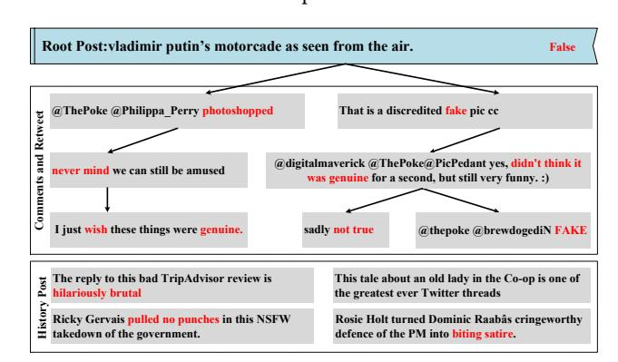
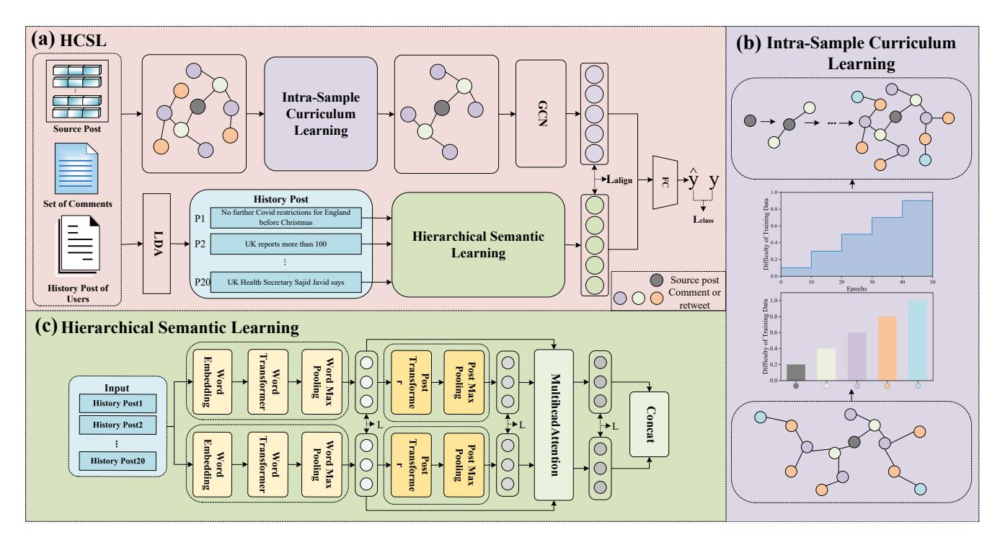
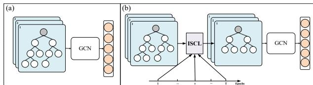
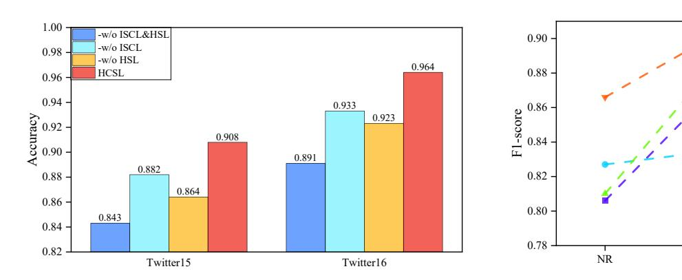
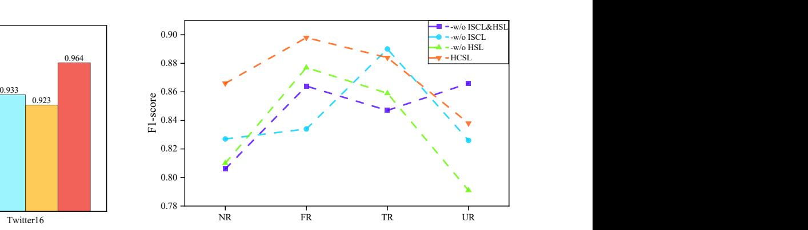
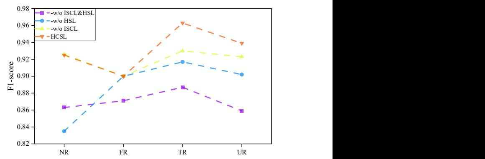
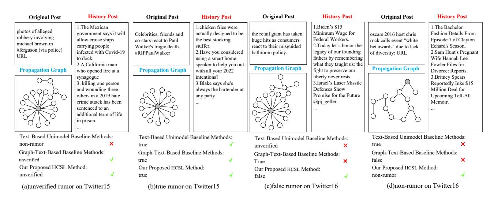
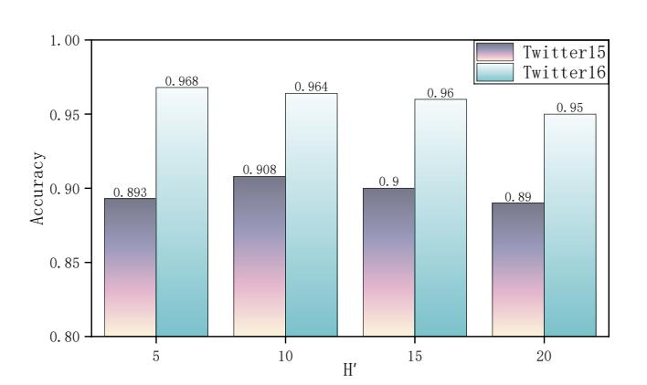
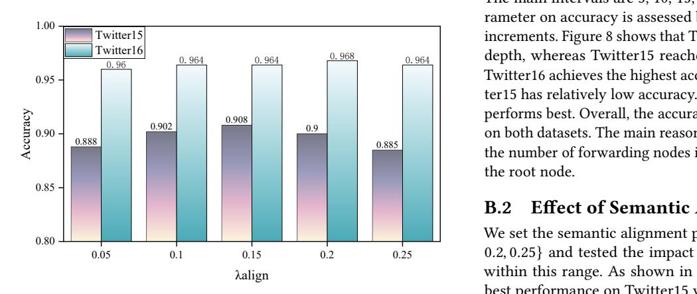

# HCSL: Rumor Detection by Integrating Intra-Sample Curriculum Learning and Hierarchical Semantic Learning

Ping Liu Taiyuan University of Technology Taiyuan, China Tsinghua University Beijing, China liuping01@tyut.edu.cn

Hui Song Taiyuan University of Technology Taiyuan, China 2024520695@link.tyut.edu.cn

Shufeng Hao∗ Taiyuan University of Technology Taiyuan, China haoshufeng@tyut.edu.cn

Xiaoning Hao Taiyuan University of Technology Taiyuan, China haoxiaoning@tyut.edu.cn

Zexu Zhang Taiyuan University of Technology Taiyuan, China 1758408995@qq.com

Usman Naseem Macquarie University Sydney, Australia usman.naseem@mq.edu.au

### Abstract

The proliferation of misinformation on social media is compromising the credibility of digital content and jeopardizing the security and stability of the online information ecosystem. Most of the existing rumor detection methods struggle to model multi-granular semantic information on deep propagation structures and alleviate noise interference encountered during deep graph training. In this work, we propose HCSL, a novel rumor detection framework that combines intra-sample curriculum learning (ISCL) and hierarchical semantic learning (HSL). ISCL adaptively selects the graph nodes to obtain a more stable optimization path for rumor representation by considering the node depth in the propagation tree. HSL employs two lightweight BERT encoders and a hierarchical contrastive learning to learn word-level and post-level representations, respectively. Furthermore, a semantic alignment mechanism is used to capture user-tendency features and propagation-structure features consistently. Extensive experiments are conducted on two public rumor detection datasets. Our experimental results demonstrate that HCSL significantly outperforms several baseline methods.

#### CCS Concepts

• Information systems → Data mining.

#### Keywords

Rumor Detection, Intra-sample Curriculum Learning, Hierarchical Semantic Learning

#### ACM Reference Format:

Ping Liu, Hui Song, Shufeng Hao, Xiaoning Hao, Zexu Zhang, and Usman Naseem. 2026. HCSL: Rumor Detection by Integrating Intra-Sample Curriculum Learning and Hierarchical Semantic Learning. In Proceedings of the ACM Web Conference 2026 (WWW '26), April 13–17, 2026, Dubai, United

∗Corresponding author.

© 2026 Copyright held by the owner/author(s). ACM ISBN 979-8-4007-2307-0/2026/04 <https://doi.org/10.1145/3774904.3793016>

Arab Emirates. ACM, New York, NY, USA, [11](#page-10-0) pages. [https://doi.org/10.1145/](https://doi.org/10.1145/3774904.3793016) [3774904.3793016](https://doi.org/10.1145/3774904.3793016)

# 1 Introduction

The rapid growth of web technologies and social media has fundamentally shaped how information is accessed and exchanged. However, the open and accessible nature of the internet has simultaneously facilitated the rampant spread of online rumors. Unverified rumors often spread rapidly online at minimal cost, disrupting everyday public discourse and potentially triggering severe social panic and instability across areas such as politics, the economy, and public health. The proliferation of rumors not only severely pollutes the online information environment but also undermines public trust. Therefore, efficient rumor detection technologies have become urgent, which mitigate the adverse societal impacts of misinformation on social media platforms.

Figure 1: The top shows the source post and its related comments or retweets, while the bottom depicts the corresponding user's historical posts.

Currently, rumor detection research has shifted from traditional machine learning with manual feature selection to deep learning that autonomously extracts key features [\[40\]](#page-8-0). Deep learning models possess powerful representational capabilities that allow them to automatically extract deep semantic features from raw text. This process enhances the accuracy and robustness of rumor-detection tasks

[This work is licensed under a Creative Commons Attribution 4.0 International License.](https://creativecommons.org/licenses/by/4.0) WWW '26, Dubai, United Arab Emirates.

[\[41\]](#page-8-1). Recent advancements in rumor detection typically leverage source posts from social platforms and multidimensional contextual information, including user preferences [\[8\]](#page-8-2) and social behavioral characteristics [\[34\]](#page-8-3), to predict whether an event is a rumor. As shown in Figure [1,](#page-0-0) the associated comments and retweets, and the user's posting history provide evidence that a consistent pattern of sharing satirical and critical content reveals that the event is a rumor. However, social media texts are often characterized by their brevity, nonstandard syntax, and implicit semantics, and the massive number of ambiguous, emotional, or even irrelevant comments and retweets derives significant noise [\[30\]](#page-8-4). To address these issues, numerous studies have proposed enhanced methods from different perspectives. One category of research focuses on the original post's content, using deep neural networks to represent the text features [\[1,](#page-7-0) [14,](#page-8-5) [18\]](#page-8-6). Another category of research leverages comments, retweets, and their structural information to extract structural features of rumor propagation by using Graph Convolutional Network (GCN) [\[3\]](#page-7-1). Furthermore, some approaches have attempted to incorporate user profiles and historical posting records to characterize users' behavioral patterns and credibility. Despite the significant achievements in these areas, current approaches still have two limitations. First, regarding the issue of excessive noise in the rumor-propagation graph, most curriculum-learning algorithms rank difficulty at the inter-sample level, which commence with lowdifficulty data and gradually transition to more complex samples by reordering the training sample sequence. In fact, such an overly strict "from easy to difficult" strategy may be counterproductive. Although many complex samples are inherently more difficult to learn, they are indispensable for capturing the underlying patterns in data, and their informational value may significantly outweigh that of a vast quantity of simple samples [\[43\]](#page-8-7). Secondly, current methods usually use a single text encoder or simple fusion strategies to extract text features. Consequently, it remains challenging to fully exploit complementary information in multi-perspective text representations.

To address these limitations, we propose a novel method HCSL to detect rumor by integrating intra-sample curriculum learning and hierarchical semantic learning. First, we design a propagation tree-based intra-sample curriculum learning strategy to reduce the interference of noisy data on model training and fully exploit the information contained in the propagation structure. Inspired by [\[31\]](#page-8-8), we construct an intra-sample difficulty metric based on the depth and topological features of different rumor-propagation substructures. This strategy aims to guide the model to learn from relatively simple parts within a sample and then progressively handle more complex and noisy data. By prioritizing reliable components with minimal noise interference, our method effectively reduces the risk of converging to local minima. Then, inspired by [\[4\]](#page-7-2), we design a hierarchical semantic learning module to obtain more robust and discriminative text representations. We use a word-level Transformer and a post-level Transformer for feature extraction [\[41\]](#page-8-1). Specifically, we employ two text encoders with complementary modeling capabilities to learn representations of the source post and its related texts from different perspectives. Finally, to obtain as comprehensive information as possible, we use multi-head attention to fuse representations from each layer across different encoders into a comprehensive representation, which reduces the

susceptibility of individual encoders to noise and bias. The main contributions are as follows:

- We propose a novel rumor-detection method HCSL by integrating intra-sample curriculum learning and hierarchical semantic learning, which reduces noise interference in the data and improves the quality of post-text content extraction.
- The intra-sample curriculum learning strategy is designed to suppress noise interference in propagation graphs. And a hierarchical semantic learning module is employed to enhance the textual representation. The semantic alignment method is proposed to learn rumor representations that incorporate both rich content semantics and propagation topology information.
- Extensive experiments on the public datasets demonstrate that our proposed method HCSL obtains better effectiveness compared to the baseline methods.

# 2 Problem Setting

The rumor collection is formally defined as �� = {��1, ��2, . . . , ���� }, where ���� represents the i-th rumor event and �� denotes the total number of events. For each event ���� , we characterize it as a triplet ���� = {���� ,���� , ���� }, where ���� refers to the source post, ���� denotes the propagation graph structure of this post, and ���� consists of historical posts published by the source poster. An undirected graph ���� = (���� , ����) is constructed based on the relationships between the source post ���� and its comments and retweets. Within this propagation graph, the post ���� serves as the root node, while other nodes in the node set ���� consist of interactive posts such as comments and retweets. The edge set ���� is formed by interactive behaviors between posts, such as replies and quotes. The historical post set ���� ∈ R ��×�� , where �� represents the number of historical posts, and �� denotes the length of each post.

Each event ���� has a ground-truth label ���� ∈ �� . The objective of this task is to train a rumor classifier �� : ���� → ���� in a supervised learning manner.

# 3 Methodology

# 3.1 Framework Overview

The architecture of HCSL is shown in Figure [2.](#page-2-0) The model extracts features in two ways: first, it employs ISCL and a GCN to capture the structural features of the rumor propagation graph; second, it uses HSL to extract features from the historical posts published by the user of the source post. Next, we will elaborate on the process of rumor classification using HCSL, which comprises several components: Feature Extraction, Intra-sample Curriculum Learning, Hierarchical Semantic Learning, Rumor Classification, and Loss Function.

# 3.2 Feature Extraction

Since rumor propagation graphs and user tendencies provide crucial insights, the model encoder is structured into two distinct components to capture these features. The first component encodes rumor propagation patterns by modeling dissemination mechanisms using interaction features extracted from posts. The second component

Table 1: Statistics of the datasets.

| Statistic          | Twitter15 | Twitter16 |
|--------------------|-----------|-----------|
| #Users             | 276,663   | 173,487   |
| #Events            | 1490      | 818       |
| #true rumors       | 374       | 205       |
| #false rumors      | 370       | 205       |
| #non-rumors        | 372       | 205       |
| #unverified rumors | 374       | 203       |

where B represents the batch size, the ℎ G denotes the user's historical preference vector, and the ℎ T �� denotes the rumor propagation graph vector.

Thus, the total loss LTotal is expressed as:

LTotal = ��classLClass + ��alignLalign + ��clLcl,

where ��class, ��align, and ��cl are hyperparameters that balance the three loss functions.

# 4 Experiment

### 4.1 Datasets

We conducted experiments on two widely used datasets: Twitter15 [\[19\]](#page-8-12) and Twitter16 [\[19\]](#page-8-12). Table [1](#page-5-0) details the specific information for these two datasets. Twitter15 and Twitter16 comprise 1,490 and 818 events, respectively, categorized into four classes: False Rumor (F), Unverified Rumor (U), Non-Rumor (N), and True Rumor (T).

### 4.2 Experimental Settings

4.2.1 Baselines. We compared our proposed HCSL with baseline methods , as follows:

•BiGCN[\[3\]](#page-7-1) simultaneously models top-down and bottom-up propagation modes to capture the propagation mechanism.

•CausalRD [\[39\]](#page-8-13) employs causal graphs and structural negative sampling to detect rumors.

•GACL [\[26\]](#page-8-14) utilizes propagation structures and adversarial contrastive learning for rumor detection against malicious perturbations and intentional camouflage.

•DDGCN [\[25\]](#page-8-15) employs a dual dynamic GCN to integrate propagation features and rich semantic knowledge, thereby enhancing the quality of dynamic representations for rumor detection.

•GSMRD [\[34\]](#page-8-3) employs pivotal semantic graph modeling and semantic-propagation interaction fusion to improve the performance of rumor detection.

•UICL[\[16\]](#page-8-16) incorporates edge-aware strategies for structural uncertainty and a curriculum learning-guided negative sampling mechanism to improve the performance of rumor detection.

•RAGCL[\[6\]](#page-8-17) proposes a node-centrality-driven enhancement strategy to focus on critical nodes and deep-level structures.

•AD-GSCL[\[7\]](#page-8-18) employs propagation structure modeling and cross-domain distribution adaptation to enhance the robustness of rumor detection under conditions of data scarcity and class imbalance.

•DMPRN[\[36\]](#page-8-19) integrates textual content and propagation structural features to capture the dynamic semantics and temporal dependencies of rumors across multiple granularity levels.

4.2.2 Training Settings. Our model is implemented using PyTorch. Similar to previous studies, we obtained results through crossvalidation by dividing the dataset into 5 folds. We set the initial learning rate to 5e-4, use 200 training epochs, and set the batch size to 128. The graph encoder comprises two layers, with a loss rate of 0.2. For curriculum learning, the initial propagation depth is 1, the depth increase parameter �� ′ is 10, ��align is 0.15, ��class and ��cl are 1, the performance stabilization threshold is 5e-3, and the performance stagnation patience value is 5.

4.2.3 Evaluation Indicators. To evaluate the model's performance on the Twitter15 and Twitter16 datasets, we calculated the Acc and F1 scores for all categories. This gives an overall classification performance and discriminative power for each category.

## 4.3 Experimental Results and Analysis

To validate the effectiveness of the proposed model, we conducted comparative experiments against current mainstream rumor detection methods on two real-world social media datasets (Twitter15, Twitter16). The baseline models encompassed diverse technical approaches, including: GCN-based models, such as BiGCN and DDGCN; contrastive learning-based models, such as GACL, UICL, and RAGCL; the causal reasoning-based model CausalRD; the semantic mining-integrated model GSMRD; the real-world scenariooriented model AD-GSCL, and the latest dynamic architecture model DMPRN. Table [2](#page-6-0) presents the performance of each model on both datasets, with the best results highlighted in bold.

The results demonstrate that our proposed HCSL achieves optimal performance across multiple metrics. On both datasets, our accuracy reached its highest levels, improving by 1.1% and 5.0%, respectively, fully validating the overall effectiveness of our proposed intra-sample curriculum learning combined with a hierarchical semantic learning framework. On the Twitter16 dataset, HCSL achieves the highest F1 scores for both the "Non-Rumor (NR)" and "Unverified Rumor (UR)" categories (0.925 and 0.939, respectively). This suggests that higher-quality representations of user historical information are essential for accurately distinguishing authentic information from unverified rumors, thereby providing models with richer contextual evidence. For "False Rumor (FR)" detection, HCSL demonstrated optimal performance on Twitter15. This achievement stems from our model's effective capture of anomalous patterns in disinformation propagation structures and user behavior. Compared to the traditional GCN models (BiGCN, DDGCN), our framework achieves more robust feature extraction by encoding both rumor propagation graphs and user information. Compared to the contrastive learning models (GACL, UICL, RAGCL), our intra-sample curriculum learning mechanism offers a smarter, adaptive learning paradigm—particularly by avoiding reliance on fixed augmentation rules. This grants greater versatility across complex, dynamic propagation scenarios. Compared to the state-of-the-art models (AD-GSCL, DMPRN), HCSL maintains superior performance across standard benchmarks. This highlights the simplicity and efficiency of our model, achieving top-tier performance without requiring vast amounts of unlabeled data or highly complex architectures.

Based on the above analysis, HCSL demonstrates outstanding performance in overall accuracy and across most categories, fully

Table 2: A Comparative Evaluation of Model Performance on Twitter15 and Twitter16

| Model    | Acc   | NR(F1) | Twitter15 FR(F1) | TR(F1) | UR(F1) | Acc   | NR(F1) | Twitter16 FR(F1) | TR(F1) | UR(F1) |
|----------|-------|--------|------------------|--------|--------|-------|--------|------------------|--------|--------|
| BiGCN    | 0.886 | 0.891  | 0.860            | 0.930  | 0.864  | 0.880 | 0.847  | 0.869            | 0.937  | 0.865  |
| CausalRD | 0.862 | 0.866  | 0.861            | 0.910  | 0.837  | 0.891 | 0.839  | 0.894            | 0.939  | 0.883  |
| GACL     | 0.882 | 0.853  | 0.89             | 0.902  | 0.848  | 0.902 | 0.912  | 0.847            | 0.902  | 0.876  |
| DDGCN    | 0.835 | 0.840  | 0.850            | 0.856  | 0.791  | 0.893 | 0.807  | 0.931            | 0.946  | 0.871  |
| GSMRD    | 0.891 | 0.884  | 0.879            | 0.89   | 0.885  | 0.901 | 0.897  | 0.892            | 0.887  | 0.884  |
| UICL     | 0.868 | 0.882  | 0.878            | 0.890  | 0.831  | 0.907 | 0.858  | 0.882            | 0.934  | 0.933  |
| RAGCL    | 0.867 | 0.891  | 0.867            | 0.869  | 0.835  | 0.905 | 0.836  | 0.923            | 0.963  | 0.882  |
| AD-GSCL  | 0.874 | 0.886  | 0.891            | 0.881  | 0.836  | 0.913 | 0.845  | 0.926            | 0.979  | 0.893  |
| DMPRN    | 0.897 | 0.901  | 0.893            | 0.931  | 0.864  | 0.914 | 0.873  | 0.883            | 0.969  | 0.931  |
| HCSL     | 0.908 | 0.866  | 0.898            | 0.884  | 0.838  | 0.964 | 0.925  | 0.900            | 0.963  | 0.939  |

Figure 4: Impact of the ablation studies on accuracy for Twitter15 and Twitter16.

validating the effectiveness of combining ISCL with graph convolutional networks and HSL.

## 4.4 Ablation Study

To investigate the role of each module in the model, we conducted ablation experiments to compare performance across different module combinations. To evaluate the contributions of the Intra-sample Curriculum Learning (ISCL) and Hierarchical Semantic Learning (HSL) modules, we designed three ablation settings: 1) removing Intra-sample Curriculum Learning (-w/o ISCL); 2) removing Hierarchical Semantic Learning (-w/o HSL);3) removing both modules simultaneously (-w/o ISCL&HSL). As shown in Figure [4,](#page-6-1) without ISCL, the accuracy of Twitter15 and Twitter16 decreases by 2.6% and 3.1%, respectively, compared to the original model. As illustrated in Figures [5](#page-6-2) and [6,](#page-6-2) the F1 scores for each category decline to varying degrees, except for the true rumor labels in the Twitter15 dataset, which remain unchanged. This is because ISCL enables the model to start training on simpler samples within the dataset, gradually incorporating more challenging ones. Once this module is removed, the model must immediately process samples of all complexities, making it difficult to capture key propagation patterns. Simultaneously, noise from complex samples interferes with

Figure 5: Impact of the ablation studies on F1 score for Twitter15.

Figure 6: Impact of the ablation studies on F1 score for Twitter16.

the feature learning of simpler ones. After removing the HSL module, the accuracy of Twitter15 and Twitter16 decreased by 4.4% and 4.1%, respectively. HSL enables multi-perspective feature fusion and enhances feature representation, serving as the model's core mechanism. After removing both the ISCL and HSL modules, the model's accuracy on the Twitter15 and Twitter16 datasets significantly decreased by 6.5% and 7.3%, respectively. This result validates the

Figure 7: Case studies of four randomly selected rumor events (two from Twitter15, two from Twitter16). Propagation graphs are shown, with gray nodes indicating source posts and other nodes representing comments or retweets.

critical role of our proposed ISCL and HSL modules in enhancing model performance.

#### 5 Case Study

To better demonstrate the strengths of our model, we randomly selected two data points from each of the Twitter15 and Twitter16 datasets. Figure [7\(](#page-7-4)a) shows data from Twitter15, with the text "photos of alleged robbery involving michael brown in #ferguson (via police) URL". This post received 167 retweets and 70 replies; Figure [7\(](#page-7-4)b) shows an event from Twitter15: "Celebrities, friends and co-stars react to Paul Walker's tragic death. #RIPPaulWalker". This original post received 180 retweets and 14 replies. Figure [7\(](#page-7-4)c) shows an event from Twitter16: "The retail giant has taken huge hits as consumers react to their misguided bathroom policy". This original post was retweeted 65 times and received 10 comments. Figure [7\(](#page-7-4)d) shows data from Twitter16: "Oscars 2016 host Chris Rock calls event 'white bet awards' due to lack of diversity: URL". This original post was retweeted 217 times and received 36 comments. These events were detected using text-based modeling, propagation graph methods, and our model, respectively. Based on the results in Figure [7,](#page-7-4) we can observe that: (a) as the propagation graph deepens, it provides more information, leading to successful predictions for all propagation graph-related methods; (b) since the propagation graph is relatively shallow, its impact on the model is minimal, resulting in successful predictions for all three methods; (c) Although the propagation graph structure differs little from (a), our model successfully predicted only because it generates higher-quality textual features from users' historical post information. (d) Due to the propagation graph's great depth and complex structure, traditional GCN processing introduces substantial noise, resulting in prediction failures. Our model, however, successfully predicted this event by performing a gradual, in-depth detection of the propagation graph, thereby reducing noise interference.

#### 6 Conclusion and Future Work

In this paper, we propose HCSL, a model primarily composed of two components: ISCL and HSL. ISCL reduces noise interference by mimicking human learning processes and designing an intra-sample curriculum learning strategy. HSL generates high-quality text representations by contrastively learning multi-level features through the collaborative interaction of dual encoders. We conducted extensive experiments on two public datasets, demonstrating that our model outperforms state-of-the-art approaches. Future work will focus on integrating large language models and multimodal learning to enhance text representation and rumor detection capabilities.

#### Acknowledgments

This work is supported by the Fundamental Research Programs of Shanxi Province (Grant No. 202503021211032), Key Laboratory of Data Governance and Intelligent Decision of Shanxi Province (202404010931016), and Shanxi Scholarship Council of China (2024- 61).

#### References

[1] Muhammad Zubair Asghar, Ammara Habib, Anam Habib, Adil Khan, Rehman Ali, and Asad Khattak. 2021. Exploring deep neural networks for rumor detection. Journal of Ambient Intelligence and Humanized Computing 12, 4 (2021), 4315– 4333. [2] Yoshua Bengio, Jérôme Louradour, Ronan Collobert, and Jason Weston. 2009. Curriculum learning. In Proceedings of the 26th Annual International Conference on Machine Learning (Montreal, Quebec, Canada) (ICML '09). Association for Computing Machinery, New York, NY, USA, 41–48. [doi:10.1145/1553374.1553380](https://doi.org/10.1145/1553374.1553380) [3] Tian Bian, Xi Xiao, Tingyang Xu, Peilin Zhao, Wenbing Huang, Yu Rong, and Junzhou Huang. 2020. Rumor detection on social media with bi-directional graph convolutional networks. In Proceedings of the AAAI conference on artificial intelligence, Vol. 34. IEEE, New York, NY, USA, 549–556. [4] Daoquan Chen, Wei Zhang, Shengyu Lu, Yuanguo Lin, Xinyu Gu, and Xiuze Zhou. 2025. Layer-wise contrastive learning BERT for sentence representation of GitHub. Neurocomputing 656 (2025), 131504. [doi:10.1016/j.neucom.2025.131504](https://doi.org/10.1016/j.neucom.2025.131504) [5] Ting Chen, Simon Kornblith, Mohammad Norouzi, and Geoffrey Hinton. 2020. A Simple Framework for Contrastive Learning of Visual Representations. In Proceedings of the 37th International Conference on Machine Learning (Proceedings of Machine Learning Research, Vol. 119), Hal Daumé III and Aarti Singh (Eds.). PMLR, Virtual Event (Originally Vienna, Austria), 1597–1607. [https://proceedings.](https://proceedings.mlr.press/v119/chen20j.html)

[mlr.press/v119/chen20j.html](https://proceedings.mlr.press/v119/chen20j.html) [6] Chaoqun Cui and Caiyan Jia. 2024. Propagation Tree Is Not Deep: Adaptive Graph Contrastive Learning Approach for Rumor Detection. Proceedings of the AAAI Conference on Artificial Intelligence 38, 1 (Mar. 2024), 73–81. [doi:10.1609/](https://doi.org/10.1609/aaai.v38i1.27757) [aaai.v38i1.27757](https://doi.org/10.1609/aaai.v38i1.27757) [7] Chaoqun Cui and Caiyan Jia. 2025. Towards Real-World Rumor Detection: Anomaly Detection Framework with Graph Supervised Contrastive Learning. In Proceedings of the 31st International Conference on Computational Linguistics, Owen Rambow, Leo Wanner, Marianna Apidianaki, Hend Al-Khalifa, Barbara Di Eugenio, and Steven Schockaert (Eds.). Association for Computational Linguistics, Abu Dhabi, UAE, 7141–7155.<https://aclanthology.org/2025.coling-main.476/> [8] Yingtong Dou, Kai Shu, Congying Xia, Philip S. Yu, and Lichao Sun. 2021. User Preference-aware Fake News Detection. In Proceedings of the 44th International ACM SIGIR Conference on Research and Development in Information Retrieval (Virtual Event, Canada) (SIGIR '21). Association for Computing Machinery, New York, NY, USA, 2051–2055. [doi:10.1145/3404835.3462990](https://doi.org/10.1145/3404835.3462990) [9] John Giorgi, Osvald Nitski, Bo Wang, and Gary Bader. 2021. DeCLUTR: Deep Contrastive Learning for Unsupervised Textual Representations. In Proceedings of the 59th Annual Meeting of the Association for Computational Linguistics and the 11th International Joint Conference on Natural Language Processing (Volume 1: Long Papers), Chengqing Zong, Fei Xia, Wenjie Li, and Roberto Navigli (Eds.). Association for Computational Linguistics, Online, 879–895. [doi:10.18653/v1/](https://doi.org/10.18653/v1/2021.acl-long.72) [2021.acl-long.72](https://doi.org/10.18653/v1/2021.acl-long.72) [10] Sheng Guo, Weilin Huang, Haozhi Zhang, Chenfan Zhuang, Dengke Dong, Matthew R Scott, and Dinglong Huang. 2018. Curriculumnet: Weakly supervised learning from large-scale web images. In Proceedings of the European conference on computer vision (ECCV). IEEE, Munich, Germany, 135–150. [11] Yuanfan Guo, Minghao Xu, Jiawen Li, Bingbing Ni, Xuanyu Zhu, Zhenbang Sun, and Yi Xu. 2022. Hcsc: Hierarchical contrastive selective coding. In Proceedings of the IEEE/CVF conference on computer vision and pattern recognition. IEEE/CVF, New Orleans, LA, USA, 9706–9715. [12] Yifan Hu, Xi Huang, Xianbing Wang, Hai Lin, and Rong Zhang. 2025. Transformerbased adaptive contrastive learning for multimodal sentiment analysis. Multimedia Tools and Applications 84, 3 (2025), 1385–1402. [13] Jing Jing, Hongchen Wu, Jie Sun, Xiaochang Fang, and Huaxiang Zhang. 2023. Multimodal fake news detection via progressive fusion networks. Information processing & management 60, 1 (2023), 103120. [14] Ling Min Serena Khoo, Hai Leong Chieu, Zhong Qian, and Jing Jiang. 2020. Interpretable Rumor Detection in Microblogs by Attending to User Interactions. Proceedings of the AAAI Conference on Artificial Intelligence 34, 05 (Apr. 2020), 8783–8790. [doi:10.1609/aaai.v34i05.6405](https://doi.org/10.1609/aaai.v34i05.6405) [15] Chenliang Li, Haoran Wang, Zhiqian Zhang, Aixin Sun, and Zongyang Ma. 2016. Topic Modeling for Short Texts with Auxiliary Word Embeddings. In Proceedings of the 39th International ACM SIGIR Conference on Research and Development in Information Retrieval (Pisa, Italy) (SIGIR '16). Association for Computing Machinery, New York, NY, USA, 165–174. [doi:10.1145/2911451.2911499](https://doi.org/10.1145/2911451.2911499) [16] Nan Liu, Fengli Zhang, Qiang Gao, and Xueqin Chen. 2024. Contrastive Learning with Edge-Wise Augmentation for Rumor Detection. International Journal of Intelligent Systems 2024, 1 (2024), 3858526. [17] Yahui Liu, Xiaolong Jin, and Huawei Shen. 2019. Towards early identification of online rumors based on long short-term memory networks. Information Processing & Management 56, 4 (2019), 1457–1467. [18] Yang Liu and Yi-Fang Wu. 2018. Early Detection of Fake News on Social Media Through Propagation Path Classification with Recurrent and Convolutional Networks. Proceedings of the AAAI Conference on Artificial Intelligence 32, 1 (Apr. 2018), 354–361. [doi:10.1609/aaai.v32i1.11268](https://doi.org/10.1609/aaai.v32i1.11268) [19] Jing Ma, Wei Gao, and Kam-Fai Wong. 2017. Detect rumors in microblog posts using propagation structure via kernel learning. In Proceedings of the 55th Annual Meeting of the Association for Computational Linguistics (ACL 2017). Association for Computational Linguistics, Association for Computational Linguistics, Vancouver, Canada, 708–717. [20] Tinghuai Ma, Honghao Zhou, Yuan Tian, and Najla Al-Nabhan. 2021. A novel rumor detection algorithm based on entity recognition, sentence reconfiguration, and ordinary differential equation network. Neurocomputing 447 (2021), 224–234. [21] Sanmit Narvekar, Jivko Sinapov, and Peter Stone. 2017. Autonomous Task Sequencing for Customized Curriculum Design in Reinforcement Learning.. In IJ-CAI. International Joint Conference on Artificial Intelligence (IJCAI), Melbourne, Australia, 2536–2542. [22] Dongsuk Oh, Yejin Kim, Hodong Lee, H. Howie Huang, and Heuiseok Lim. 2022. Don't Judge a Language Model by Its Last Layer: Contrastive Learning with Layer-Wise Attention Pooling. In Proceedings of the 29th International Conference on Computational Linguistics. International Committee on Computational Linguistics, Gyeongju, Republic of Korea, 4585–4592. [https://aclanthology.org/2022.coling-](https://aclanthology.org/2022.coling-1.405/)[1.405/](https://aclanthology.org/2022.coling-1.405/) [23] Aishika Pal, Moumita Pradhan, et al. 2023. Survey of fake news detection using machine intelligence approach. Data & Knowledge Engineering 144 (2023), 102118. [24] Amin Qourbani, Mahdi Khodaparast, Rebaz Othman Yahya, Mohammadhossein Habibi, Atieh Nouralishahi, and Amin Rezaeipanah. 2023. Toward rumor detection in social networks using multi-layer autoencoder neural network. Social Network Analysis and Mining 14, 1 (2023), 8. [25] Mengzhu Sun, Xi Zhang, Jiaqi Zheng, and Guixiang Ma. 2022. DDGCN: Dual Dynamic Graph Convolutional Networks for Rumor Detection on Social Media. Proceedings of the AAAI Conference on Artificial Intelligence 36, 4 (Jun. 2022), 4611–4619. [doi:10.1609/aaai.v36i4.20385](https://doi.org/10.1609/aaai.v36i4.20385) [26] Tiening Sun, Zhong Qian, Sujun Dong, Peifeng Li, and Qiaoming Zhu. 2022. Rumor Detection on Social Media with Graph Adversarial Contrastive Learning. In Proceedings of the ACM Web Conference 2022 (Virtual Event, Lyon, France) (WWW '22). Association for Computing Machinery, New York, NY, USA, 2789–2797. [doi:10.1145/3485447.3511999](https://doi.org/10.1145/3485447.3511999) [27] Yi Tay, Shuohang Wang, Anh Tuan Luu, Jie Fu, Minh C. Phan, Xingdi Yuan, Jinfeng Rao, Siu Cheung Hui, and Aston Zhang. 2019. Simple and Effective Curriculum Pointer-Generator Networks for Reading Comprehension over Long Narratives. In Proceedings of the 57th Annual Meeting of the Association for Computational Linguistics. Association for Computational Linguistics, Florence, Italy, 4922–4931. [doi:10.18653/v1/P19-1486](https://doi.org/10.18653/v1/P19-1486) [28] Michela Del Vicario, Walter Quattrociocchi, Antonio Scala, and Fabiana Zollo. 2019. Polarization and fake news: Early warning of potential misinformation targets. ACM Transactions on the Web (TWEB) 13, 2 (2019), 1–22. [29] Bokun Wang, Yang Yang, Xing Xu, Alan Hanjalic, and Heng Tao Shen. 2017. Adversarial Cross-Modal Retrieval. In Proceedings of the 25th ACM International Conference on Multimedia (Mountain View, California, USA) (MM '17). Association for Computing Machinery, New York, NY, USA, 154–162. [doi:10.1145/3123266.](https://doi.org/10.1145/3123266.3123326) [3123326](https://doi.org/10.1145/3123266.3123326) [30] Xin Wang, Yudong Chen, and Wenwu Zhu. 2022. A Survey on Curriculum Learning. IEEE Transactions on Pattern Analysis and Machine Intelligence 44, 9 (2022), 4555–4576. [doi:10.1109/TPAMI.2021.3069908](https://doi.org/10.1109/TPAMI.2021.3069908) [31] Yulin Wang, Yang Yue, Rui Lu, Yizeng Han, Shiji Song, and Gao Huang. 2024. Efficienttrain++: Generalized curriculum learning for efficient visual backbone training. IEEE Transactions on Pattern Analysis and Machine Intelligence 46, 12 (2024), 8036–8055. [32] Tiancheng Xiang, Qian Li, Wen Li, and Yunpeng Xiao. 2023. A rumor heat prediction model based on rumor and anti-rumor multiple messages and knowledge representation. Information Processing & Management 60, 3 (2023), 103337. [33] Yuanmeng Yan, Rumei Li, Sirui Wang, Fuzheng Zhang, Wei Wu, and Weiran Xu. 2021. ConSERT: A Contrastive Framework for Self-Supervised Sentence Representation Transfer. In Proceedings of the 59th Annual Meeting of the Association for Computational Linguistics and the 11th International Joint Conference on Natural Language Processing (Volume 1: Long Papers). Association for Computational Linguistics, Online, 5065–5075. [doi:10.18653/v1/2021.acl-long.393](https://doi.org/10.18653/v1/2021.acl-long.393) [34] Yeqing Yan, Yongjun Wang, and Peng Zheng. 2023. A graph-based pivotal semantic mining framework for rumor detection. Engineering Applications of Artificial Intelligence 118 (2023), 105613. [35] Yeqing Yan, Yongjun Wang, and Peng Zheng. 2023. Rumor detection on social networks focusing on endogenous psychological motivation. Neurocomputing 552 (2023), 126548. [36] Weiming Yin, Jinzhong Ning, Mingyu Lu, Hongfei Lin, and Yijia Zhang. 2026. A dual-branch multi-path propagation reasoning network for rumor detection integrating neural symbolic commonsense reasoning mechanism. Information Processing & Management 63, 1 (2026), 104362. [37] Pengfei Zhang, Hongyan Ran, Caiyan Jia, Xuanya Li, and Xueming Han. 2021. A lightweight propagation path aggregating network with neural topic model for rumor detection. Neurocomputing 458 (2021), 468–477. [38] Qi Zhang, Yayi Yang, Chongyang Shi, An Lao, Liang Hu, Shoujin Wang, and Usman Naseem. 2024. Rumor Detection With Hierarchical Representation on Bipartite Ad Hoc Event Trees. IEEE Transactions on Neural Networks and Learning Systems 35, 10 (2024), 14112–14124. [doi:10.1109/TNNLS.2023.3274694](https://doi.org/10.1109/TNNLS.2023.3274694) [39] Weifeng Zhang, Ting Zhong, Ce Li, Kunpeng Zhang, and Fan Zhou. 2022. CausalRD: A Causal View of Rumor Detection via Eliminating Popularity and Conformity Biases. In IEEE INFOCOM 2022 - IEEE Conference on Computer Communications. IEEE, Piscataway, NJ, USA, 1369–1378. [doi:10.1109/INFOCOM48880.](https://doi.org/10.1109/INFOCOM48880.2022.9796678) [2022.9796678](https://doi.org/10.1109/INFOCOM48880.2022.9796678) [40] Yusong Zhang, Kun Xie, Xingyi Zhang, Xiangyu Dong, and Sibo Wang. 2025. Rumor Detection on Social Media with Reinforcement Learning-based Key Propagation Graph Generator. In Proceedings of the ACM on Web Conference 2025 (Sydney NSW, Australia) (WWW '25). Association for Computing Machinery, New York, NY, USA, 2742–2753. [doi:10.1145/3696410.3714651](https://doi.org/10.1145/3696410.3714651) [41] Peng Zheng, Yong Dou, and Yeqing Yan. 2024. Sensing the diversity of rumors: Rumor detection with hierarchical prototype contrastive learning. Information Processing & Management 61, 6 (2024), 103832. [42] Nanjiang Zhong, Guomin Zhou, Weijie Ding, and Jiawen Zhang. 2022. A Rumor detection method based on multimodal feature fusion by a joining aggregation structure. Electronics 11, 19 (2022), 3200. [43] Tianyi Zhou, Shengjie Wang, and Jeffrey Bilmes. 2020. Curriculum learning by dynamic instance hardness. Advances in Neural Information Processing Systems 33 (2020), 8602–8613.

[44] Mingrui Zhu, Liqing Qiu, and Weidong Zhao. 2026. Augmentation-free dynamic graph contrastive learning based on transformers. Expert Systems with Applications 296 (2026), 129028. [doi:10.1016/j.eswa.2025.129028](https://doi.org/10.1016/j.eswa.2025.129028) [45] Mohammad Ziari and Nasrollah Moghaddam Charkari. 2026. Rumor detection and propagation on social networks: A survey. Expert Systems with Applications 295 (2026), 128798. [doi:10.1016/j.eswa.2025.128798](https://doi.org/10.1016/j.eswa.2025.128798)

#### A Related Work

#### A.1 Rumor Detection Methods

Early rumor detection methods primarily focused on crafting manual features and integrating them with traditional classification algorithms for identification [\[28\]](#page-8-20). Nevertheless, as society has been evolving ceaselessly, there has been an increasing demand for the efficiency and accuracy of information classification. This has rendered traditional manual feature extraction methods insufficient to address this change. In recent years, rumor detection based on deep learning has become a research highlight. This is because it can automatically extract features and efficiently identify rumors [\[13,](#page-8-21) [32\]](#page-8-22). Based on the data they employ, existing approaches can be grouped into three categories: content-based methods, propagationstructure-based approaches and multi-source information fusion methods. Content-based methods mainly depend on discerning the lexical, syntactic, and thematic traits inherent to the sentence itself. Propagation-structure-based approaches focus on analyzing the diffusion paths of comments, shares, and retweets related to rumors. Multi-source information fusion methods combine post content, user attributes, historical behavior, and the intricate interrelationships among these elements to detect rumors.

In recent years, the interactive features of tweets—such as comments, retweets, and likes—have been recognized as indicators of the breadth and influence of information dissemination. This is because increased retweets, comments, and likes directly expand a tweet's reach and visibility [\[45\]](#page-9-0). These metrics effectively track the propagation pathways of rumors. In related work, ESODE [\[20\]](#page-8-23) used the number of comments and retweets as input features. Others, in turn, Qourbani et al. [\[24\]](#page-8-24) expanded the feature set by including additional details such as the number of likes, the users who commented, those who retweeted, and the tweet's posting time. To more precisely represent the propagation patterns of rumors across various time stages, CUSMAXLSTM [\[17\]](#page-8-25) constructed a propagation tree structure and analyzed users' retweet behavior patterns to extract the dynamic alterations in propagation features. ACMR [\[29\]](#page-8-26) generates representations that exhibit both modal invariance and semantic discriminability by integrating modal adversarial constraints and triplet structure preservation loss within a shared subspace. PPA-WAE [\[37\]](#page-8-27) first established a basic propagation network structure and then introduced two learnable parameters to more precisely model the differences in interaction patterns between nodes and their parent or child nodes. BAET [\[38\]](#page-8-28) significantly enhances the accuracy of social media rumor detection by jointly modeling post content, author characteristics, and their propagation structures, while incorporating root-aware and tree-aware attention mechanisms. Zhong et al. [\[42\]](#page-8-29) note that existing studies often concentrate on propagation analysis while overlooking the innate clustering structure of rumors. This oversight leads to sub-optimal detection performance during the early or incomplete propagation phases. To tackle this, their study combines aggregation characteristics, textual features, and propagation features to boost detection performance. Recent research [\[8,](#page-8-2) [23,](#page-8-30) [35\]](#page-8-31) has shown that integrating social context and source-attribute information can substantially improve rumor detection performance. For example, HPCL [\[41\]](#page-8-1) effectively improved rumor detection by simultaneously leveraging both types of features.

#### A.2 Curriculum Learning

Curriculum Learning was first proposed by Bengio et al. [\[2\]](#page-7-5) to simulate the human learning process from easy to difficult tasks. This method improves optimization and generalization performance by designing difficulty metrics for data samples, arranging them in ascending order of difficulty, and organizing the model training process accordingly. As a general training strategy, curriculum learning has been widely applied across multiple research domains. Studies in computer vision [\[10\]](#page-8-32), natural language processing [\[27\]](#page-8-33), and reinforcement learning [\[21\]](#page-8-34) have validated Curriculum Learning's effectiveness in accelerating convergence and enhancing model robustness.

Curriculum learning is applied to scenarios such as noisy labeled data and social media, aiming to mitigate the negative impacts of noisy samples [\[41\]](#page-8-1). However, most of these methods focus only on sorting difficulty across samples, without modeling structural differences within individual samples. As a result, they remain inadequate for social media data, which exhibits complex propagation structures and contains multi-level interaction information. EfficientTrain++ [\[31\]](#page-8-8) proposes a concise and broadly applicable efficient learning paradigm. It transforms the traditional approach of arranging course materials by the difficulty level of each sample into measuring the "simpler" and "more complex" components of each sample, progressively introducing the more complex aspects during model training. This approach not only helps reduce noise interference but also enhances the extraction and utilization of key structural information within each propagation graph. In comparison, the latter training strategy proves more effective. The proposed intra-sample curriculum learning strategy extends curriculum learning from "inter-sample" to "intra-sample". By finegrained modeling of propagation graph structures, constructing sample-based difficulty metrics based on structural depth, and adaptively adjusting the model's focus on sub-structures during training, it more effectively suppresses noise interference and extracts valuable information.

#### A.3 Contrastive Learning

Contrastive learning aims to learn representations by mapping similar samples closer together and dissimilar samples farther apart [\[11\]](#page-8-35). Driven by growing demand for feature representations, contrastive learning has advanced rapidly in natural language processing and has been widely applied across various tasks. For instance, to address the collapse of BERT-derived representations and their limited transferability to downstream tasks, ConSERT [\[33\]](#page-8-36) proposed a contrastive learning-based framework for optimizing sentence representations. MMEN [\[12\]](#page-8-37), which leverages multimodal augmentation mechanisms and an adaptive contrastive learning module, significantly mitigates the tendency to neglect other modalities when text-based modalities dominate. AFdgc [\[44\]](#page-9-1) combined Transformers

Figure 8: Results on Twitter15 and Twitter16 with respect to the depth increase parameter �� ′ .

0.885 With the other parameters unchanged, we conducted a sensitivity analysis of the depth increase parameter �� ′ for the depth of the propagation structure map in the intra-sample curriculum learning. The main intervals are 5, 10, 15, and 20. The influence of this parameter on accuracy is assessed by increasing the depth in 5-unit increments. Figure [8](#page-10-1) shows that Twitter16 gradually decreases with depth, whereas Twitter15 reaches a peak at depth 10. Although Twitter16 achieves the highest accuracy at a graph depth of 5, Twitter15 has relatively low accuracy. When the depth is 10, the model performs best. Overall, the accuracy of HCSL decreases with depth on both datasets. The main reason is that as the depth �� ′ increases, the number of forwarding nodes increases with their distance from the root node.

Figure 9: Results on Twitter15 and Twitter16 with respect to the semantic alignment parameter ��align.

with unsupervised contrastive learning to resolve temporal consistency and data integrity issues in dynamic graph representation learning. CLBERT [\[4\]](#page-7-2) employed contrastive learning to enhance

representation capabilities by comparing layer-by-layer representations, aiming to generate superior semantic representations for BERT sentences. Inspired by these works, we integrate contrastive learning with Transformers from different layers of a lightweight BERT model to enhance sentence representations.

#### B Parameter Sensitivity Analysis

In this section, we evaluate the impact of the depth increase parameter and the semantic alignment parameter. All other parameters were kept fixed in the training configurations.

# B.1 Effect of Depth Increase Parameter

# B.2 Effect of Semantic Alignment Parameter

We set the semantic alignment parameter ��align ∈ {0.05, 0.1, 0.15, 0.2, 0.25} and tested the impact of this parameter on the model within this range. As shown in Figure [9,](#page-10-2) the model achieves its best performance on Twitter15 when ��align is set to 0.15, while it performs best on Twitter16 with ��align = 0.2. Overall, the model demonstrates optimal performance when the parameter is set to 0.15. Twitter15 exhibits greater sensitivity to the semantic alignment loss parameter, primarily due to significant differences in its user features and structural characteristics, thus requiring stronger semantic alignment to mitigate feature inconsistencies.