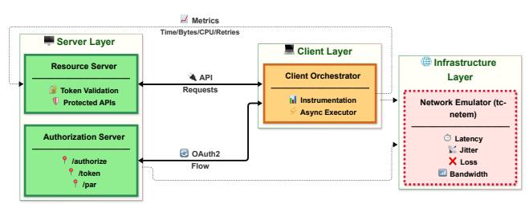
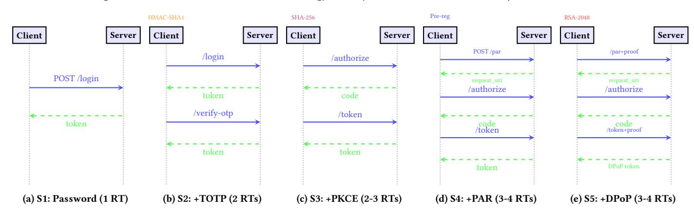
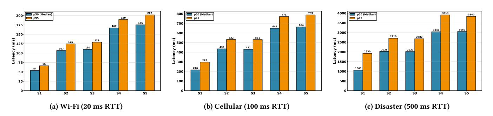
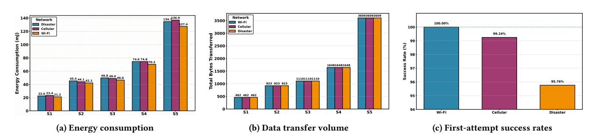
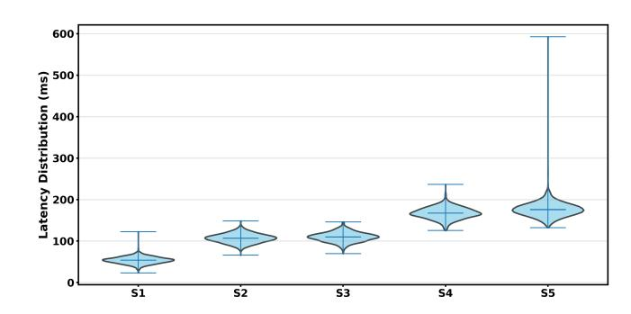
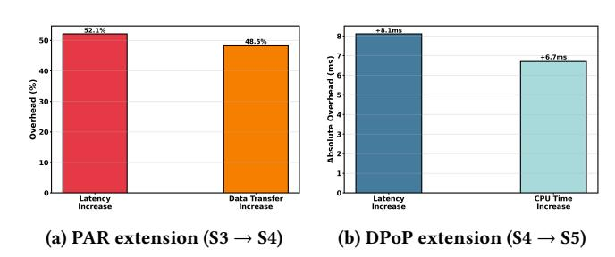
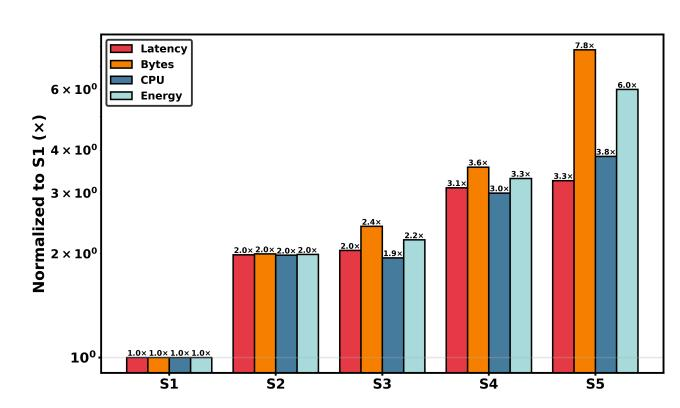
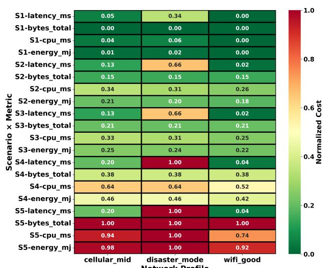

# How Green Is Your Login? A Cross-Protocol Benchmark of Authentication Energy & Latency

Weizheng Wang Hong Kong Polytechnic University Hong Kong, China weizheng.wang@polyu.edu.hk

Qipeng Xie Hong Kong University of Science and Technology Hong Kong, China qxieaf@connect.ust.hk

Shiyu Wang Independent Researcher Hangzhou, China kwuking@gmail.com

Qingqing Ye Hong Kong Polytechnic University Hong Kong, China qqing.ye@polyu.edu.hk

Kaishun Wu Hong Kong University of Science and Technology (Guangzhou) Guangzhou, China wuks@hkust-gz.edu.cn

Haibo Hu∗† Hong Kong Polytechnic University Hong Kong, China haibo.hu@polyu.edu.hk

# Abstract

Billions of authentication transactions consume energy across the Internet every day—but how green are these logins? As protocols evolve from passwords to OAuth2 extensions (PKCE, PAR, DPoP), the environmental and performance costs remain poorly understood, especially in resource-constrained contexts like humanitarian operations and disaster response where UN Sustainable Development Goals (SDGs 7, 9, 12, 13) demand energy-aware design. We present AuthBench, a cross-protocol authentication benchmark measuring carbon footprint, energy, and latency across five schemes under diverse network conditions. Through 12,975 controlled trials, we reveal that OAuth2 extensions incur 2.0–6.0× energy overhead and 2.0–3.3× latency penalties versus passwords. Under weak network conditions (10% packet loss), basic password authentication exhibits 14.8% first-attempt failure rate, while more complex OAuth2 scenarios show different reliability characteristics. Our scenario-driven analysis identifies green-and-secure optima: password+TOTP for humanitarian platforms (42.3 mJ), OAuth2+PKCE for general use (46.6 mJ), and full-stack OAuth2 (127.4 mJ). At scale, 100 billion daily logins with OAuth2+DPoP consume 1,077 MWh/year more than passwords—equivalent to 539 tons CO2 emissions. AuthBench enables practitioners to make greener authentication choices aligned with global sustainability goals without compromising security.

# CCS Concepts

• Security and privacy → Web protocol security.

© 2026 Copyright held by the owner/author(s). ACM ISBN 979-8-4007-2307-0/2026/04 <https://doi.org/10.1145/3774904.3793017>

# Keywords

Authentication, OAuth2, Energy efficiency, Performance benchmarking, Sustainable computing

#### ACM Reference Format:

Weizheng Wang, Qipeng Xie, Shiyu Wang, Qingqing Ye, Kaishun Wu, and Haibo Hu. 2026. How Green Is Your Login? A Cross-Protocol Benchmark of Authentication Energy & Latency. In Proceedings of the ACM Web Conference 2026 (WWW '26), April 13–17, 2026, Dubai, United Arab Emirates. ACM, New York, NY, USA, [11](#page-10-0) pages.<https://doi.org/10.1145/3774904.3793017>

# 1 Introduction

Web authentication is among the most ubiquitous operations on the Internet, with billions of login transactions occurring daily across social media, banking, e-commerce, and enterprise systems. While each individual authentication may consume mere milliseconds and kilobytes, the aggregate energy footprint is substantial: small optimizations, when multiplied by high frequency and massive user populations, can yield significant carbon reductions [\[35,](#page-8-0) [36\]](#page-8-1). Recent attention to AI system energy costs has highlighted the importance of quantifying computational carbon footprints [\[28,](#page-8-2) [40\]](#page-8-3). Authentication deserves similar scrutiny: unlike batch AI workloads, login flows are synchronous, latency-sensitive, and perpetually active across the user base.

Modern web applications face a dizzying array of authentication options. At the simplest extreme, password-only authentication minimizes network round-trips and computational overhead. Moving up the security ladder, Time-based One-Time Passwords (TOTP, RFC 6238 [\[24\]](#page-8-4)) add a second factor at the cost of additional round-trips and clock synchronization requirements. The OAuth2 Authorization Code flow with Proof Key for Code Exchange (PKCE, RFC 7636 [\[32\]](#page-8-5)) mitigates authorization code interception attacks but introduces SHA-256 hashing and larger payloads. Further extensions—Pushed Authorization Requests (PAR, RFC 9126 [\[22\]](#page-8-6)) for request pre-registration and Demonstrating Proof of Possession (DPoP, RFC 9449 [\[9\]](#page-8-7)) for sender-constrained tokens—promise defense-in-depth against URL leakage and token replay, but their resource costs remain unquantified [\[11,](#page-8-8) [21\]](#page-8-9). WebAuthn and Passkeys offer a passwordless future anchored in public-key cryptography

∗Corresponding author.

†Also with PolyU Research Centre for Privacy and Security Technologies in Future Smart Systems.

[This work is licensed under a Creative Commons Attribution 4.0 International License.](https://creativecommons.org/licenses/by/4.0) WWW '26, Dubai, United Arab Emirates

and hardware security modules [\[2,](#page-8-10) [23\]](#page-8-11), yet their network overhead and device requirements are poorly understood in resourceconstrained contexts. Developers thus confront a three-way tradeoff among security, efficiency, and accessibility, lacking quantitative guidance to navigate these competing objectives [\[3,](#page-8-12) [4\]](#page-8-13).

The authentication energy problem becomes acute in contexts that diverge from the idealized "well-provisioned datacenter serving broadband users" model. Humanitarian organizations, educational platforms, and disaster response systems frequently operate over weak networks (high latency, packet loss, bandwidth constraints) and serve users with low-end devices (limited CPU, memory, battery) [\[33,](#page-8-14) [38\]](#page-8-15). Shared terminals—such as public library computers, internet cafes, or relief center kiosks—introduce unique security threats where session tokens may persist in browser storage or be intercepted by subsequent users, motivating sender-constrained token mechanisms like DPoP [\[12\]](#page-8-16). These scenarios demand authentication schemes that are simultaneously lightweight (low latency, minimal bytes, efficient CPU use) and robust (resistant to network faults, secure against token theft). Existing protocol design guidelines rarely address this "low-carbon and reliable" imperative [\[26,](#page-8-17) [29\]](#page-8-18).

To bridge this knowledge gap, we pose four research questions. RQ1 (Baseline comparison): How do different authentication protocols differ in latency, byte transfer, and CPU consumption across diverse network conditions? RQ2 (Energy estimation): How can we translate resource metrics into energy consumption and carbon footprint, and what is the relative energy ranking of authentication schemes? RQ3 (Security enhancement costs): What resource overhead do OAuth2 security extensions (PAR and DPoP) impose, and are their security benefits justified by acceptable performance costs? RQ4 (Scenario optimization): For deployments characterized by weak networks, shared devices, or low-end hardware, do "green and secure" optimal combinations exist? This work makes the following contributions to sustainable web authentication:

- (1) First cross-protocol authentication benchmark: We present AuthBench, a Python-based benchmark suite providing endto-end measurements of five mainstream authentication schemes (password-only, password+TOTP, OAuth2 +PKCE, OAuth2+PKCE+PAR, OAuth2+PKCE+PAR+DPoP) across three representative network profiles (high-speed Wi-Fi, mid-tier cellular, disaster-recovery satellite link).
- (2) Reproducible measurement toolkit: Our artifact includes a network emulator, metric collection framework, and automated report generator, enabling practitioners and researchers to extend the benchmark to new protocols, network conditions, or hardware platforms.
- (3) Scenario-driven decision matrix: We provide actionable recommendations mapping deployment contexts (humanitarian aid, disaster response, low-end devices) to authentication schemes that balance energy efficiency, security, and accessibility.
- (4) Sustainable computing alignment: Our findings directly support UN Sustainable Development Goals—SDG 7 (Affordable Clean Energy), SDG 9 (Industry & Innovation), SDG 12 (Responsible Consumption), and SDG 13 (Climate Action) [\[16,](#page-8-19) [25\]](#page-8-20)—enabling energy-aware web development and reduced carbon footprints at Internet scale.

# 2 Background & Related Work

# 2.1 Authentication Protocol Landscape

We briefly introduce the five authentication schemes evaluated in this work, deferring detailed protocol mechanics to Section [4.2.](#page-3-0)

Password-based authentication represents the simplest baseline: users submit credentials to a login endpoint, receiving a session token upon validation. This single-round-trip flow minimizes network and computational overhead but is vulnerable to phishing, credential stuffing, and password reuse attacks [\[13,](#page-8-21) [39\]](#page-8-22).

Time-based One-Time Passwords (TOTP, RFC 6238 [\[24\]](#page-8-4)) add a second factor by requiring users to submit a 6-digit code generated by an authenticator app or hardware token. The server computes HMAC-SHA1 over 30-second time windows and validates codes within a ±1 window tolerance. TOTP introduces an additional round-trip and requires clock synchronization between client and server [\[1,](#page-8-23) [31\]](#page-8-24).

OAuth2 Authorization Code flow with PKCE (RFC 7636 [\[32\]](#page-8-5)) mitigates authorization code interception attacks by having clients generate a cryptographic random code\_verifier, compute its SHA-256 hash as a code\_challenge, and present the challenge to the authorization server [\[12,](#page-8-16) [21\]](#page-8-9). Upon receiving an authorization code, the client exchanges it for an access token by presenting the original verifier. This prevents code interception on untrusted channels at the cost of increased payload size and cryptographic computation.

Pushed Authorization Requests (PAR, RFC 9126 [\[22\]](#page-8-6)) extend OAuth2 by pre-registering authorization parameters at a dedicated /par endpoint [\[22\]](#page-8-6). Instead of passing sensitive parameters in browser-visible URLs (where they may leak via referrer headers or history), clients POST them to /par and receive a short-lived request\_uri. This adds one round-trip but enhances privacy and

enables server-side parameter validation before user interaction. Demonstrating Proof of Possession (DPoP, RFC 9449 [\[9\]](#page-8-7)) binds access tokens to ephemeral asymmetric key pairs, preventing token replay if an attacker steals the token without the corresponding private key [\[8,](#page-8-25) [10\]](#page-8-26). Clients generate JWT proofs signed with RS256, which the server validates for signature correctness and freshness (jti uniqueness, timestamp within skew tolerance). This defends against token theft in shared or compromised environments

but introduces JWT generation and verification overhead. WebAuthn and Passkeys (W3C Level 3 [\[2\]](#page-8-10)) leverage publickey cryptography and hardware security modules (e.g., TPM, FIDO2 tokens) for passwordless authentication [\[20,](#page-8-27) [23\]](#page-8-11). While our benchmark does not directly measure hardware-based flows (due to lack of standardized emulation), we model WebAuthn based on published message sizes and round-trip counts: registration typically involves 2–3 round-trips with ∼200–400 byte attestation objects; authentication requires 1–2 round-trips with ∼150–300 byte assertion responses.

# 2.2 Web Energy Consumption & Sustainability

Research on sustainable web systems has established empirical models linking page structure and resource usage to energy demand. Studies consistently show that page-level energy consumption can be approximated as a linear combination of data transfer and CPU/rendering time [\[30,](#page-8-28) [37\]](#page-8-29). Sampson et al. demonstrate that

seemingly minor design decisions (e.g., nested style rules) substantially increase rendering work [\[34\]](#page-8-30), while recent work shows that architectural choices—such as progressive web apps versus native implementations—can change system-wide power draw by large factors [\[17,](#page-8-31) [19\]](#page-8-32).

Sustainability research on Internet infrastructure and AI emphasizes why per-request savings matter at scale. Obringer et al. estimate that Internet use contributes a non-trivial share of global electricity demand and emissions [\[26\]](#page-8-17). In machine learning, widely-used methodologies combine hardware power, runtime, datacenter PUE, and grid carbon intensity to estimate training footprints [\[14,](#page-8-33) [35,](#page-8-0) [36\]](#page-8-1), with Patterson et al. and Wu et al. showing that design choices can change energy by orders of magnitude [\[28,](#page-8-2) [40\]](#page-8-3).

Authentication workloads differ—they are short, latency-sensitive, and continuous—yet the same insight applies: protocol choices have measurable energy consequences. Our energy model (Section [4.5\)](#page-4-0) adapts this literature by representing authentication transactions as the sum of network-transfer and compute components, parameterized by coefficients from prior mobile/web and datacenter measurements [\[14,](#page-8-33) [30,](#page-8-28) [36,](#page-8-1) [37\]](#page-8-29), but instantiated with authentication-specific metrics (round trips, payload sizes, cryptographic operations).

# 2.3 Authentication Performance Studies

Empirical authentication studies typically focus on individual mechanisms rather than end-to-end protocol suites. Reese et al. conduct a controlled study of five two-factor methods, measuring setup time, login latency, error rates, and user preference [\[31\]](#page-8-24), while Aloul et al. evaluate mobile-based one-time passwords but omit energy or network costs [\[1\]](#page-8-23). Large-scale password studies characterize usage patterns and reuse [\[3](#page-8-12)[–5,](#page-8-34) [13\]](#page-8-21) but leave client-side resource usage unmeasured.

Recent FIDO2 and WebAuthn research examines phishing-resistant authentication. Ghorbani Lyastani et al. and Lassak et al. report task-completion times and mental models [\[20,](#page-8-27) [23\]](#page-8-11), including perceived authenticator latency, but neither compare against traditional OAuth 2.0 flows nor quantify device-level energy. On the protocol side, formal security analyses establish strong threat models for modern SSO systems [\[11,](#page-8-8) [12,](#page-8-16) [21\]](#page-8-9), while Padma and Srinivasan show serverless deployments introduce additional trade-offs [\[27\]](#page-8-35). However, the interaction between protocol choice, device characteristics, and energy consumption remains unexplored.

# 3 Measurement Scope & Protocol Selection

#### 3.1 Research Scope

What we measure. Our benchmark quantifies resource consumption of authentication protocols: end-to-end latency, network byte transfer, CPU utilization, and derived energy estimates using established coefficients from sustainable web design literature [\[18,](#page-8-36) [29\]](#page-8-18).

What we exclude. We do not evaluate cryptographic security strength—protocols' resistance to attacks is well-established by prior work [\[9,](#page-8-7) [12,](#page-8-16) [22,](#page-8-6) [32\]](#page-8-5). We also exclude user behavior modeling (password entry time, biometric delays), browser-specific rendering costs, and server-side database latency. Our measurements capture protocol-level costs orthogonal to implementation choices, enabling reproducible cross-deployment comparisons.

Table 1: Evaluated authentication protocols.

| ID | Protocol        | Primary Security Enhancement        |
|----|-----------------|-------------------------------------|
| S1 | Password-only   | Baseline (no additional protection) |
| S2 | Password + TOTP | Two-factor authentication           |
| S3 | OAuth2 + PKCE   | Code interception prevention        |
| S4 | S3 + PAR        | URL parameter leakage prevention    |
| S5 | S4 + DPoP       | Token theft/replay prevention       |

Protocol selection rationale. We evaluate five schemes (Table [1\)](#page-2-0) spanning a security-complexity spectrum: from minimaloverhead password-only (S1) to defense-in-depth OAuth2 with all extensions (S5). This enables practitioners to quantify the incremental cost of each security enhancement.

#### 3.2 Target Deployment Scenarios

We focus on three contexts where resource constraints intersect with security requirements, motivating protocol selection tradeoffs:

Shared/public devices. Internet cafes, library computers, and disaster relief terminals pose session hijacking risks when multiple users access the same device [\[12\]](#page-8-16). DPoP's sender-constrained tokens (S5) prevent stolen tokens from being reused, but impose 3.8× CPU overhead and 7.8× payload increase versus password-only authentication.

Weak networks. Humanitarian operations, rural connectivity, and satellite backhaul exhibit high latency (500+ ms RTT) and packet loss (5–10%) [\[33,](#page-8-14) [38\]](#page-8-15). Under these conditions, protocols with excessive round-trips incur cascading retry costs—our measurements quantify these amplification effects to guide minimaloverhead protocol selection when availability determines accessibility.

Resource-constrained devices. Low-end smartphones and embedded systems lack CPU headroom for aggressive cryptography [\[17\]](#page-8-31). We measure SHA-256 hashing (PKCE), RS256 signatures (DPoP), and HMAC-SHA1 (TOTP) costs to identify performance cliffs on constrained platforms.

### 3.3 Assumptions & Limitations

Synthetic workload. We use pre-generated credentials (TOTP secrets, PKCE verifiers) to eliminate human reaction time variability, trading ecological validity for experimental control that precisely isolates protocol costs.

Local deployment. All components run on a single machine with network emulation via Linux Traffic Control [\[15\]](#page-8-37), eliminating datacenter variability (geographic latency, load balancers, CDNs) but potentially underestimating real-world network stack costs.

Security boundaries. We assume HTTPS transport (uniform overhead across scenarios, not explicitly modeled) and adversaries who can observe traffic or gain temporary device access. We do not model sophisticated attacks (malware, side-channels, compromised servers) requiring defenses beyond authentication protocol design.

Energy model. Our linear energy model (�� = �� · ��total + �� · (CPUms/1000)) provides relative comparisons; absolute values are order-of-magnitude estimates subject to hardware-specific variations.

Disaster-mode realism. Our disaster-mode profile (10% packet loss, 500 ms RTT) generates substantially higher latencies than typical academic benchmarks due to realistic retry modeling, exponential backoff mechanisms, and timeout behaviors under extreme network stress.

#### 4 Methodology & Benchmark Design

We present AuthBench, a benchmark suite designed to systematically measure the resource consumption of web authentication protocols across diverse network conditions. This section describes the benchmark architecture, protocol scenarios under evaluation, network emulation profiles, cryptographic implementation details, and the metrics used to estimate energy consumption.

# 4.1 AuthBench Architecture

AuthBench implements a self-contained authentication ecosystem comprising three core components (Figure [1\)](#page-3-1): an Authorization Server that handles OAuth2 flows with support for PKCE, PAR, and DPoP extensions; a Resource Server that validates access tokens and serves protected resources; and a Client Orchestrator that coordinates authentication workflows and performs transactionlevel instrumentation. 08/11/2025, 15:58 flowchart-optimized (1).svg

file:///Users/wwz/Downloads/flowchart-optimized (1).svg 1/1 The Authorization Server is built using FastAPI [\[7\]](#page-8-38) and implements standard OAuth2 endpoints (/authorize, /token) along with extension endpoints for PAR (/par) and DPoP token validation. All cryptographic operations use production-grade libraries: SHA-256 for PKCE code challenges (Python cryptography 41.0.7), HMAC-SHA1 for TOTP (30-second time stpng per RFC 6238 [\[24\]](#page-8-4)), and RS256 for JWT signatures in DPoP proofs (RFC 9449 [\[9\]](#page-8-7)). The server maintains in-memory session state to eliminate database I/O as a confounding variable.

Figure 1: AuthBench system architecture.

The Client Orchestrator executes authentication workflows asynchronously using Python's asyncio framework with httpx 0.25.2 for HTTP/2 support [\[6\]](#page-8-39). For each transaction, it records: (1) wallclock timestamps at send/receive boundaries using time.perf\_counter() for nanosecond precision; (2) byte counts from HTTP request/response headers and bodies; (3) user-mode and kernel-mode CPU time via resource.getrusage(); and (4) retry events triggered by network faults. All measurements are logged in structured JSON format with microsecond-level timestamps to enable offline analysis.

Network conditions are emulated using Linux Traffic Control (tc) with the NetEm qdisc [\[15\]](#page-8-37). The orchestrator dynamically configures latency distributions, packet loss rates, bandwidth limits, and jitter parameters before each trial, ensuring reproducible network profiles without requiring physical infrastructure changes. NetEm parameters are validated through 1000-packet baseline tests confirming observed behavior matches configured values within 3% tolerance.

### 4.2 Protocol Scenarios

We evaluate five authentication scenarios representing a spectrum from minimal-security baselines to defense-in-depth configurations (Figure [2\)](#page-4-1). Each scenario is implemented as a complete end-to-end workflow, allowing us to measure the cumulative cost of protocol composition.

S1: Password-only. The simplest baseline: client sends credentials to /login, receives a session token. Single round-trip, minimal payload (∼500 bytes total). Serves as the lower bound for comparison. Implementation uses bcrypt password hashing for realistic server-side validation.

S2: Password + TOTP. Adds time-based one-time password verification. After password validation, the client submits a 6-digit TOTP code to /verify-otp. The server computes HMAC-SHA1 over the current 30-second window and accepts codes within a ±1 window tolerance (60 seconds total). This introduces an additional round-trip and requires clock synchronization (clients experiencing time drift may trigger retries). We use a fixed TOTP secret (JBSWY3DPEHPK3PXP) across all trials for deterministic code generation.

S3: OAuth2 Authorization Code + PKCE. Implements the authorization code flow with Proof Key for Code Exchange (PKCE, RFC 7636 [\[32\]](#page-8-5)). The client generates a cryptographic random code\_verifier (43 bytes base64url-encoded from 32 random bytes), computes its SHA-256 hash as the code\_challenge, and submits the challenge to the authorization endpoint. Upon receiving the authorization code, the client exchanges it for an access token at /token by presenting the original verifier. This prevents authorization code interception attacks at the cost of increased payload size (challenge/verifier add ∼100 bytes). S3's total CPU time is 15.7 ms, similar to S2, indicating that SHA-256 hashing overhead is minimal.

S4: S3 + Pushed Authorization Request (PAR). Extends S3 by pre-registering authorization parameters at a dedicated /par endpoint (RFC 9126 [\[22\]](#page-8-6)). Instead of passing parameters in the /authorize URL (which may leak via referrer headers or browser history), the client POSTs them to /par and receives a short-lived request\_uri (90-second validity). This adds one round-trip but reduces URL exposure and enables validation before user interaction. Our implementation stores PAR requests in memory with automatic expiration cleanup.

S5: S4 + Demonstrating Proof of Possession (DPoP). Adds sender-constrained token binding via DPoP (RFC 9449 [\[9\]](#page-8-7)). The client generates an ephemeral RSA-2048 key pair (public exponent 65537), signs JWT proofs binding tokens to the public key, and presents these proofs with each token usage. Each DPoP proof JWT contains: (1) typ: "dpop+jwt", (2) alg: "RS256", (3) jwk: public key in JWK format, (4) jti: unique token ID for replay prevention, (5) htm: HTTP method, (6) htu: target URL, (7) iat: issuance timestamp. The server validates the signature using the embedded public key, checks proof freshness (timestamp within ±60 seconds), and

Figure 2: Protocol flow comparison.

enforces jti uniqueness (replay prevention). This prevents token replay attacks in shared/compromised environments but introduces JWT generation/verification overhead (RS256 signature operations add ∼5–10 ms CPU time per transaction).

#### 4.3 Cryptographic Implementation Details

All cryptographic operations use production-grade libraries to ensure measurements reflect real-world performance:

Password hashing: Server-side bcrypt verification contributes to end-to-end latency. S1's client-side CPU time (8.1 ms median) reflects request preparation and response processing overhead.

TOTP generation: HMAC-SHA1 following RFC 6238, computing over 8-byte counter (time divided by 30-second step). Dynamic truncation produces 6-digit codes. S2 adds 7.9 ms CPU time over S1 (16.0 ms total vs 8.1 ms baseline), including HMAC-SHA1 computation and additional password validation overhead.

PKCE challenge: SHA-256 hash of 43-byte code verifier produces 32-byte digest, base64url-encoded to 43-byte challenge. PKCE operations impose minimal CPU overhead, as evidenced by S3's similar total CPU time to S2 (15.7 ms vs 16.0 ms).

DPoP JWT signing: RSA-2048 with PKCS#1 v1.5 padding, producing 256-byte signatures. S5 adds 6.7 ms CPU time over S4 (31.0 ms vs 24.3 ms), encompassing RSA-2048 signature generation, JWT encoding/decoding, and validation overhead. Key generation occurs once at client initialization.

# 4.4 Network Profiles & Fault Model

To capture the performance variability of authentication protocols across diverse deployment contexts, we define three representative network profiles (Table [2\)](#page-4-2): a best-case scenario (wifi\_good), a typical mobile broadband scenario (cellular\_mid), and an extreme weak-connectivity scenario (disaster\_mode).

Table 2: Network emulation profiles.

| Profile       | Latency |    | Jitter |    | Bandwidth |      | Loss |
|---------------|---------|----|--------|----|-----------|------|------|
| wifi_good     | 20      | ms | ± 5    | ms | 100       | Mbps | 0.1% |
| cellular_mid  | 100     | ms | ± 30   | ms | 10        | Mbps | 2%   |
| disaster_mode | 500     | ms | ± 200  | ms | 1         | Mbps | 10%  |

The wifi\_good profile models stable broadband connections typical in well-provisioned offices or homes. The cellular\_mid profile reflects 4G mobile networks under moderate load, incorporating higher latency variance and occasional packet loss. The disaster\_mode profile represents extreme scenarios such as humanitarian operations over satellite links, congested mesh networks, or degraded infrastructure following natural disasters—contexts where authentication must remain functional despite severe constraints.

Each profile is implemented using NetEm's stochastic delay model with normal distribution jitter and independent packet loss. Bandwidth throttling uses token bucket filtering (tbf qdisc). Profiles are applied bidirectionally to emulate realistic end-to-end conditions. Configuration example for disaster mode:

tc qdisc add dev lo root netem \ delay 500ms 200ms distribution normal \ loss 10% \ rate 1mbit

Retry and timeout policy. When packet loss or timeouts occur, the client implements exponential backoff with a maximum of 3 retries per request. Initial timeout thresholds are set to 3 × mean latency for each profile (60 ms for Wi-Fi, 300 ms for cellular, 1500 ms for disaster mode), adjusted dynamically if persistent failures occur. We record retry counts and timeout events as part of the stability analysis.

# 4.5 Metrics & Energy Estimation

Primary metrics. For each authentication transaction, we collect: ��total: End-to-end latency from initiation to token receipt (milliseconds), ��up, ��down: Uploaded and downloaded bytes (B), ��total = ��up + ��down: Total network transfer, CPUms: User-mode + kernelmode CPU time (ms); server-side computation (e.g., bcrypt verification) is reflected in latency but not separately instrumented and ��count: Number of retry attempts due to network faults

Energy estimation model. We estimate energy consumption using a linear model that combines network transmission and computational costs: ��est = �� ·��total +�� · (CPUms/1000), where �� (joules per byte) represents the energy cost of wireless data transmission and �� (joules per CPU-second) represents the computational energy

Figure 3: Authentication latency comparison.

cost. We use coefficient values derived from prior sustainable web design literature [\[18,](#page-8-36) [29\]](#page-8-18): �� = 0.000025 J/byte (typical for 4G networks) and �� = 1.2 J/CPU-sec. These coefficients provide relative comparisons across scenarios; absolute values should be interpreted as order-of-magnitude estimates.

Coefficient justification: The network transmission coefficient (�� = 25 ��J/byte) reflects the effective per-byte energy cost for small mobile transactions (<10 KB), following empirical measurements in prior work [\[30,](#page-8-28) [37\]](#page-8-29). This value incorporates radio state transition overhead that dominates short bursty transfers. Note that sustained transmission at peak 4G throughput (60–80 Mbps at 1.5–2.0 W) yields substantially lower marginal costs (∼0.2 ��J/byte).

Statistical analysis. For each scenario × network profile combination, we report median (p50) and 95th percentile (p95) values with bias-corrected and accelerated (BCa) bootstrap confidence intervals (10,000 resamples) from approximately 865 trials per condition. Effect sizes between scenarios are quantified using Cliff's delta (��), a non-parametric measure robust to non-normal distributions. We consider |�� | &gt; 0.33 as practically significant.

# 5 Results and Experimental Setup

#### 5.1 Experimental Configuration

Hardware & software environment. All experiments were conducted on a dedicated server running Ubuntu 22.04 LTS (Jammy Jellyfish) with Linux kernel version 5.15.0-89-generic. The hardware configuration consists of an Intel Xeon E5-2680 v4 processor and 32 GB DDR4 RAM. Storage uses a 1 TB NVMe SSD to minimize I/O latency effects. The system is configured with a tickless kernel (CONFIG\_NO\_HZ\_FULL) on isolated cores to reduce timer interrupt jitter.

The benchmark is implemented in Python 3.11.8 with key dependencies: FastAPI 0.104.1, httpx 0.25.2, cryptography 41.0.7, PyJWT 2.8.0, and iproute2 5.15.0 for network emulation. To isolate experimental processes from system noise, we implement: (1) CPU affinity binding via taskset, (2) suspension of non-essential daemons, (3) CPU frequency scaling set to performance mode, and (4) thermal stabilization (5-minute idle period before measurements, temperature maintained below 65°C).

Experimental design. Our factorial design crosses three independent variables: authentication scenario (5 levels: S1–S5), network profile (3 levels), and trial repetition (approximately 865 replicates per scenario-network combination), yielding 12,975 total measurement runs. We employ blocked randomization within each

network profile to control for order effects. Each trial follows a standardized protocol: (1) network configuration and 2-second settle period, (2) 10 warm-up transactions (excluded from analysis), (3) instrumented measurement transactions with 500 ms intertransaction gaps, and (4) log validation verifying completeness (99.2% of transactions required no correction).

Calibration & validation. Before each network profile block, we conduct ping-pong tests (100 minimal HTTP requests) to establish baseline RTT. Measured baselines: Wi-Fi 21.3 ± 1.8 ms, cellular 102.7 ± 28.4 ms, disaster 498.3 ± 193.2 ms—close to target parameters. Packet loss rates are verified via 1000-packet injection tests: Wi-Fi 0.09%, cellular 1.98%, disaster 9.87%—within one standard deviation of binomial expectations. System clocks are synchronized to NTP with sub-millisecond accuracy to prevent TOTP validation failures.

#### 5.2 Latency Performance Across Network Conditions

We conducted 12,975 authentication trials (2,595 trials per scenario across three network conditions) to comprehensively evaluate the performance characteristics of five authentication protocols. Figure [3](#page-5-0) presents end-to-end authentication latency distributions across our three network profiles. The results reveal pronounced performance stratification, with authentication times ranging from 53.8 ms (S1 under Wi-Fi) to 3051.6 ms (S5 under disaster-mode conditions)—a 56.7× variation driven by the interaction between protocol round-trip complexity and network quality.

Network amplification effect. Under optimal Wi-Fi conditions (Figure [3a\)](#page-5-0), the simplest protocol (S1: password-only) completes in 53.8 ms median latency, while the most sophisticated protocol (S5: OAuth2+PKCE+PAR+DPoP) requires 175.4 ms—a 3.3× increase attributable to additional round trips and cryptographic operations. However, this performance gap exhibits complex behavior as network quality degrades. Under cellular conditions (Figure [3b\)](#page-5-0), S1 reaches 216.4 ms while S5 extends to 664.1 ms (3.1× ratio)—indicating that multi-round-trip protocols maintain reasonable scaling. Under disaster-mode scenarios (Figure [3c\)](#page-5-0), S1 reaches 1062.8 ms (19.8× its Wi-Fi baseline due to 25× worse RTT and 100× worse packet loss), while S5 reaches 3051.6 ms (2.9× S1), demonstrating that protocol complexity has diminishing marginal impact under severe network degradation.

Figure 4: Resource consumption analysis across authentication scenarios and network conditions.

Protocol round-trip sensitivity. Table [3](#page-6-0) quantifies the roundtrip amplification phenomenon. Single-round-trip protocols (S1) exhibit severe latency scaling with network degradation: S1's disastermode latency (1062.8 ms) is 19.8× its Wi-Fi baseline, approaching the theoretical limit imposed by the 25× RTT increase. Multi-roundtrip protocols show proportionally less severe degradation: S4's disaster-mode latency (3040.1 ms) is 18.2× its Wi-Fi latency (167.3 ms), and its cellular latency (649.4 ms) is 3.9× Wi-Fi. This counterintuitive result suggests that under extreme packet loss (10%), retry mechanisms and timeout adaptations dominate over raw round-trip count.

Table 3: Performance metrics summary under Wi-Fi conditions.

|         | Metric     |      | S1   | S2     | S3      | S4      | S5      |
|---------|------------|------|------|--------|---------|---------|---------|
| Latency |            | (ms) | 53.8 | 106.9  | 109.9   | 167.3   | 175.4   |
| Bytes   | Sent       | (B)  | 198  | 432    | 654     | 952     | 3043    |
| Bytes   | Recv       | (B)  | 264  | 491    | 456     | 696     | 566     |
| Total   | Bytes      | (B)  | 462  | 923    | 1110    | 1648    | 3609    |
| CPU     | Time       | (ms) | 8.08 | 16.01  | 15.73   | 24.26   | 30.99   |
| Energy  | (mJ)       |      | 21.2 | 42.3   | 46.6    | 70.3    | 127.4   |
| vs.     | S1 Latency |      | —    | +98.7% | +104.4% | +210.9% | +226.0% |
| vs.     | S1 Energy  |      | —    | +99.0% | +119.4% | +230.9% | +499.6% |

Percentile stability. The 95th percentile (p95) latencies in Figure [3](#page-5-0) reveal protocol reliability characteristics. Under Wi-Fi, S1's p95/p50 ratio is 1.23 (66.4 ms / 53.8 ms), indicating low variance, while S5's ratio is 1.15 (201.9 ms / 175.4 ms). However, under disastermode conditions, variance patterns diverge dramatically: S1's ratio increases to 1.82 (1929.6 ms / 1062.8 ms), reflecting high retry variability under extreme packet loss, while S5 maintains a lower 1.26 ratio (3839.7 ms / 3051.6 ms), suggesting that multi-stage protocols benefit from retry amortization across multiple round-trips.

# 5.3 Resource Consumption Breakdown

Figure [4](#page-6-1) decomposes authentication costs into energy, data transfer, and reliability dimensions. These measurements reveal that while user-perceived latency dominates the experience, energy consumption and retry rates impose hidden costs that scale non-linearly with protocol complexity.

Energy consumption patterns. Figure [4a](#page-6-1) demonstrates that OAuth2-based protocols (S3–S5) consume substantially more energy than simpler alternatives, with overhead ranging from 119.4% (S3 vs. S1 under Wi-Fi) to 499.6% (S5 vs. S1 under Wi-Fi). Data transfer dominates energy consumption for most scenarios (accounting for the majority of total energy), while CPU time becomes significant only for asymmetric cryptography in S5 (DPoP's RSA-2048 signatures contribute 29% of S5's 127.4 mJ energy under Wi-Fi). For high-throughput services, energy costs compound rapidly: across Internet-scale deployments totaling 100 billion daily authentications with S5 under Wi-Fi consumes 1,292 MWh/year; downgrading to S1 saves 1,077 MWh/year—equivalent to powering 97 US households or avoiding 539 metric tons of CO2 emissions (at 500 g CO2/kWh US grid intensity).

Data transfer overhead. Figure [4b](#page-6-1) quantifies the payload bloat introduced by OAuth2 security enhancements. Baseline password authentication (S1) transfers 462 bytes median, while OAuth2+PKCE (S3) increases this to 1110 bytes (+140%), PAR (S4) to 1648 bytes (+257%), and DPoP (S5) to 3609 bytes (+681%). The incremental costs break down as: TOTP (S2) adds 461 bytes (+100%), PKCE (S3) adds 187 bytes (+20% over S2), PAR (S4) contributes 538 bytes (+48% over S3), and DPoP (S5) adds 1961 bytes (+119% over S4).

CPU overhead distribution. The CPU time measurements in Table [3](#page-6-0) reveal a substantial but manageable performance gap. Symmetric-key operations in S1–S4 impose modest overhead (8.1– 24.3 ms), dominated by password hashing in S1 (8.1 ms), TOTP HMAC-SHA1 in S2 (16.0 ms), and PKCE SHA-256 in S3–S4 (15.7– 24.3 ms). DPoP's asymmetric RSA-2048 signatures increase CPU time to 31.0 ms—a 3.8× increase over S1 and 1.3× over S4.

Reliability and retry dynamics. Figure [4c](#page-6-1) reveals the impact of network stress on protocol reliability, showing first-attempt success rates averaged across all scenarios (S1–S5). Under Wi-Fi conditions (0.1% packet loss), all scenarios maintain zero retry rates. Examining S1 (password-only) specifically, under cellular conditions (2% packet loss), S1 exhibits minimal retries (0.035 retries/transaction, 3.5% first-attempt failure rate). However, disastermode conditions (10% packet loss) significantly impact S1, reaching 0.15 retries/transaction (14.8% first-attempt failure rate).

#### 5.4 Incremental Security Enhancement Costs

Figure [5](#page-7-0) isolates the resource overhead of individual OAuth2 security extensions, enabling practitioners to evaluate whether each enhancement's security benefits justify its performance costs.

PAR overhead characteristics. Adopting Pushed Authorization Requests (S3 → S4) increases Wi-Fi latency by 52.1% (+57.4 ms) and data transfer by 48.5% (+538 bytes), as shown in Figure [5a.](#page-7-0) This overhead stems entirely from the additional round trip required to POST authorization parameters to the /par endpoint. PAR's security value—preventing parameter leakage via URL referrer headers—must be weighed against this non-trivial performance penalty.

DPoP overhead asymmetry. The transition from S4 to DPoPprotected S5 exhibits an unusual cost profile: only 4.8% latency increase (+8.1 ms) but 27.8% CPU time growth (+6.7 ms), as illustrated in Figure [5b.](#page-7-0) This asymmetry arises because DPoP operates within existing round trips rather than adding new ones. Data transfer overhead for DPoP (+119%, +1961 bytes) stems from JWT proof tokens that include full public keys in JWK format plus RS256 signatures.

Figure 5: Incremental overhead analysis for OAuth2 security extensions.

#### 5.5 Performance Variability and Distribution Analysis

Beyond aggregate metrics, we analyze the full distribution of authentication performance to assess system predictability and taillatency behavior. Figure [6](#page-7-1) presents latency distributions via violin plots, revealing the performance stability characteristics of each protocol under Wi-Fi conditions.

Simple mechanisms (S1, S2) exhibit narrow distributions with low interquartile ranges (IQR: 10.3 ms and 14.2 ms respectively), indicating predictable performance. In contrast, OAuth2 protocols show progressively wider distributions: S3's IQR reaches 14.5 ms, S4 extends to 18.2 ms, and S5's IQR spans 20.1 ms—a 95.1% increase over S1.

# 5.6 Multi-Dimensional Tradeoff Analysis

Figure [7](#page-7-2) normalizes all metrics to S1's baseline, revealing relative cost scaling across performance dimensions.

On a logarithmic scale, the progression from S1 through S5 reveals distinct growth patterns. Latency exhibits near-linear scaling with round-trip count: S2 (2.0× S1), S3 (2.0×), S4 (3.1×), S5 (3.3×). The S4→S5 increment (+4.8%, +8.1 ms) confirms DPoP's minimal latency overhead. CPU exhibits sublinear growth through S4, then superlinear jump at S5 (3.8×). The critical observation: S5's 3.8× CPU multiplier exceeds its 3.3× latency multiplier by 18%, indicating computational costs grow faster than end-to-end delay.

Figure 6: Latency distribution.

Figure 7: Multi-dimensional tradeoff analysis.

#### 6 Conclusion

AuthBench provides the first systematic measurement of authentication protocol energy consumption, advancing UN Sustainable Development Goals (SDGs 7, 9, 12, 13) through quantifiable sustainability metrics. Our evaluation of 12,975 transactions reveals OAuth2 extensions consume 2–6× more energy than passwords (127.4 mJ vs. 21.2 mJ), scaling to 1,077 MWh/year for 100 billion daily logins—equivalent to 539 tons of CO2 emissions.

Context-aware protocol selection enables security without sacrificing efficiency: password+TOTP (42.3 mJ) for weak networks, OAuth2+PKCE (46.6 mJ) for general use, and full-stack OAuth2 (127.4 mJ) for shared devices. Our toolkit enables practitioners to measure authentication carbon footprints, optimize for deployment constraints, and align web infrastructure with global sustainability commitments.

### Acknowledgments

This work was supported by the Ministry of Science and Technology of the People's Republic of China (Grant No: 2025YFE0200100), and the Research Grants Council (Grant No: 15209922, and 15210023), Hong Kong SAR, China.

#### References

[1] Fadi Aloul, Syed Zahidi, and Wassim El-Hajj. 2009. Two factor authentication using mobile phones. In 2009 IEEE/ACS international conference on computer systems and applications. IEEE, 641–644. [2] Dirk Balfanz, Alexei Czeskis, Jeff Hodges, J.C. Jones, Michael Jones, Akshay Kumar, Angelo Liao, Rolf Lindemann, and Emil Lundberg. 2023. Web authentication: An API for accessing public key credentials level 3. [3] Joseph Bonneau, Cormac Herley, Paul C Van Oorschot, and Frank Stajano. 2012. The quest to replace passwords: A framework for comparative evaluation of web authentication schemes. In 2012 IEEE symposium on security and privacy. IEEE, 553–567. [4] Anupam Das, Joseph Bonneau, Matthew Caesar, Nikita Borisov, and XiaoFeng Wang. 2014. The tangled web of password reuse.. In NDSS, Vol. 14. 23–26. [5] Rahul Dubey and Miguel Vargas Martin. 2021. Fool me once: A study of password selection evolution over the past decade. In 2021 18th International Conference on Privacy, Security and Trust (PST). IEEE, 1–7. [6] Encode Team. 2025. HTTPX: A next-generation HTTP client for Python. [https:](https://www.python-httpx.org) [//www.python-httpx.org.](https://www.python-httpx.org) [7] FastAPI Team. 2024. FastAPI: Modern, fast web framework for building APIs with Python. [https://fastapi.tiangolo.com.](https://fastapi.tiangolo.com) [8] Daniel Fett, Brian Campbell, John Bradley, Torsten Lodderstedt, Michael Jones, and David Waite. 2020. OAuth 2.0 demonstrating proof-of-possession at the application layer (DPoP). RFC draft (2020). [9] Daniel Fett, Brian Campbell, John Bradley, Torsten Lodderstedt, Michael Jones, and David Waite. 2023. OAuth 2.0 demonstrating proof-of-possession at the application layer (DPoP). Technical Report. RFC 9449. [10] D Fett, B Campbell, J Bradley, T Lodderstedt, M Jones, and D Waite. 2023. RFC 9449: OAuth 2.0 Demonstrating Proof of Possession (DPoP). [11] Daniel Fett, Pedram Hosseyni, and Ralf Küsters. 2019. An extensive formal security analysis of the OpenID financial-grade API. In 2019 IEEE Symposium on Security and Privacy (SP). 453–471. [12] Daniel Fett, Ralf Küsters, and Guido Schmitz. 2016. A comprehensive formal security analysis of OAuth 2.0. In Proceedings of the 2016 ACM SIGSAC conference on computer and communications security. 1204–1215. [13] Dinei Florencio and Cormac Herley. 2007. A large-scale study of web password habits. In Proceedings of the 16th international conference on World Wide Web. 657–666. [14] Syed Mhamudul Hasan, Taminul Islam, Munshi Saifuzzaman, Khaled R Ahmed, Chun-Hsi Huang, and Abdur R Shahid. 2025. Carbon Emission Quantification of Machine Learning: A Review. IEEE Transactions on Sustainable Computing (2025). [15] Stephen Hemminger et al. 2005. Network emulation with NetEm. 5 (2005), 2005. [16] Lorenz M Hilty and Bernard Aebischer. 2014. ICT for sustainability: An emerging research field. ICT innovations for Sustainability (2014), 3–36. [17] Stefan Huber, Lukas Demetz, and Michael Felderer. 2022. A comparative study on the energy consumption of Progressive Web Apps. Information Systems 108 (2022), 102017. [18] Avita Katal, Susheela Dahiya, and Tanupriya Choudhury. 2023. Energy efficiency in cloud computing data centers: a survey on software technologies. Cluster Computing 26, 3 (2023), 1845–1875. [19] Florian Kleinert and Hans-Knud Arndt. 2022. Energy Efficiency in Web Development: Investigation of the Power Consumption of a Web Application with Different Load Distribution. In Environmental Informatics. Springer, 201–216. [20] Leona Lassak, Annika Hildebrandt, Maximilian Golla, and Blase Ur. 2021. " It's Stored, Hopefully, on an Encrypted Server": Mitigating Users' Misconceptions About {FIDO2} Biometric {WebAuthn}. In 30th USENIX Security Symposium (USENIX Security 21). 91–108. [21] Torsten Lodderstedt, John Bradley, Andrey Labunets, and Daniel Fett. 2020. OAuth 2.0 security best current practice. Internet-Draft draft-ietf-oauth-security-topics (2020). [22] Torsten Lodderstedt, Brian Campbell, Nat Sakimura, Dave Tonge, and Francesca Palombini. 2021. OAuth 2.0 pushed authorization requests. Technical Report. RFC 9126. [23] Sanam Ghorbani Lyastani, Michael Schilling, Michaela Neumayr, Michael Backes, and Sven Bugiel. 2020. Is FIDO2 the kingslayer of user authentication? A comparative usability study of FIDO2 passwordless authentication. In 2020 IEEE Symposium on Security and Privacy (SP). 268–285. [24] David M'Raihi, Salah Machani, Mingliang Pei, and Johan Rydell. 2011. TOTP: Time-based one-time password algorithm. Technical Report. RFC 6238. [25] United Nations. 2023. Transforming our world: The 2030 agenda for sustainable development. UN. [26] Renee Obringer, Benjamin Rachunok, Debora Maia-Silva, Maryam Arbabzadeh, Roshanak Nateghi, Kaveh Madani, et al. 2021. The overlooked environmental footprint of increasing Internet use. Resources, Conservation and Recycling 167, 105389 (2021), 04. [27] P Padma and S Srinivasan. 2023. DAuth—Delegated Authorization Framework for Secured Serverless Cloud Computing. Wireless Personal Communications 129, 3 (2023), 1563–1583. [28] David Patterson, Joseph Gonzalez, Quoc Le, Chen Liang, Lluis-Miquel Munguia, Daniel Rothchild, David So, Maud Texier, and Jeff Dean. 2021. Carbon emissions and large neural network training. arXiv preprint arXiv:2104.10350 (2021). [29] Ilona Pawełoszek and Pankaj Bhambri. 2024. Call to Action: Driving Digital Sustainability. In Digital Sustainability. CRC Press, 264–281. [30] Feng Qian, Zhaoguang Wang, Alexandre Gerber, Zhuoqing Mao, Subhabrata Sen, and Oliver Spatscheck. 2011. Profiling resource usage for mobile applications: a cross-layer approach. (2011), 321–334. [31] Ken Reese, Trevor Smith, Jonathan Dutson, Jonathan Armknecht, Jacob Cameron, and Kent Seamons. 2019. A usability study of five {two-factor} authentication methods. In Fifteenth symposium on usable privacy and security (SOUPS 2019). 357–370. [32] Nat Sakimura, John Bradley, and Naveen Agarwal. 2015. Proof key for code exchange by OAuth public clients. Technical Report. RFC 7636. [33] Nithya Sambasivan, Ed Cutrell, Kentaro Toyama, and Bonnie Nardi. 2010. Intermediated technology use in developing communities. In Proceedings of the SIGCHI Conference on Human Factors in Computing Systems. 2583–2592. [34] Adrian Sampson, Călin Caşcaval, Luis Ceze, Pablo Montesinos, and Dario Suarez Gracia. 2012. Automatic discovery of performance and energy pitfalls in html and css. In 2012 IEEE International Symposium on Workload Characterization (IISWC). IEEE, 82–83. [35] Roy Schwartz, Jesse Dodge, Noah A Smith, and Oren Etzioni. 2020. Green ai. Commun. ACM 63, 12 (2020), 54–63. [36] Emma Strubell, Ananya Ganesh, and Andrew McCallum. 2019. Energy and policy considerations for deep learning in NLP. In Proceedings of the 57th annual meeting of the association for computational linguistics. 3645–3650. [37] Narendran Thiagarajan, Gaurav Aggarwal, Angela Nicoara, Dan Boneh, and Jatinder Pal Singh. 2012. Who killed my battery? analyzing mobile browser energy consumption. In Proceedings of the 21st international conference on World Wide Web. 41–50. [38] Indrani Medhi Thies et al. 2015. User interface design for low-literate and novice users: Past, present and future. Foundations and Trends® in Human–Computer Interaction 8, 1 (2015), 1–72. [39] Ding Wang, Zijian Zhang, Ping Wang, Jeff Yan, and Xinyi Huang. 2016. Targeted online password guessing: An underestimated threat. In Proceedings of the 2016 ACM SIGSAC conference on computer and communications security. 1242–1254. [40] Carole-Jean Wu, Ramya Raghavendra, Udit Gupta, Bilge Acun, Newsha Ardalani, Kiwan Maeng, Gloria Chang, Fiona Aga, Jinshi Huang, Charles Bai, et al. 2022. Sustainable ai: Environmental implications, challenges and opportunities. Proceedings of machine learning and systems 4 (2022), 795–813.

# A Discussion & Design Guidelines

Our comprehensive evaluation yields actionable insights for practitioners navigating the security-efficiency-accessibility tradeoff space. This section synthesizes our findings into scenario-driven recommendations and distills design principles for sustainable authentication systems.

# A.1 Scenario-Driven Protocol Selection

Authentication protocol selection cannot follow a one-size-fits-all approach. Table [4](#page-10-1) presents our evidence-based decision matrix mapping deployment scenarios to recommended protocols.

#### Key decision factors:

- (1) Network resilience critically determines protocol viability. Our disaster-mode measurements (10% packet loss, 500 ms RTT) reveal that all protocols experience severe latency degradation (17–20× their Wi-Fi baselines), but simpler protocols maintain better absolute performance: S1 at 1063 ms remains more responsive than S5 at 3052 ms under extreme conditions.
- (2) CPU constraints diverge from network constraints. S5's DPoP extension imposes only 4.8% latency overhead (+8.1 ms) but 27.8% CPU increase (+6.7 ms), creating an asymmetric resource profile.
- (3) Payload size determines bandwidth accessibility. S5's 3.6 KB payload represents a 7.8× increase over S1's 462 bytes. On 2G EDGE networks (10 KB/s typical), S5 requires 361 ms for data transfer alone versus S1's 46 ms—an 8× penalty.
- (4) Scale amplifies marginal costs into operational impact. A platform handling 10M daily logins faces 31.5 GB additional bandwidth when moving from S1 to S5—translating to \$2.52–\$3.78/day in cloud egress fees.

#### A.2 Design Principles for Sustainable Authentication

Beyond scenario-specific recommendations, our findings yield four general design principles:

1. Adaptive protocol selection based on network telemetry. Systems should dynamically adjust based on observed network conditions:

- Tier 1 (RTT &lt; 50 ms, loss &lt; 1%): Full stack (S5) for maximum security.
- Tier 2 (RTT 50–200 ms, loss 1–5%): OAuth2 + PKCE (S3) as balanced middle ground.
- Tier 3 (RTT &gt; 200 ms, loss &gt; 5%): Password + TOTP (S2) or even password-only (S1) with compensating controls. Under extreme conditions (disaster mode), S5's 3.05 second latency is 2.9× slower than S1's 1.06 seconds—S1 remains 3× faster in absolute terms despite its simplicity.

2. Progressive enhancement of security features based on transaction risk. Layer protections based on consequence severity:

- Low-risk operations: OAuth2 + PKCE (S3). Sufficient for preventing code interception.
- Medium-risk operations: Add PAR (S4) to prevent parameter leakage.
- High-risk operations: Mandate DPoP (S5) for sender-constrained tokens.

#### 3. Energy-aware token lifetimes and refresh strategies.

- For S1/S2: Use short lifetimes (15–30 minutes) given low re-authentication cost.
- For S3/S4: Moderate lifetimes (1–2 hours) balance re-auth cost and security.
- For S5: Justify longer lifetimes (2–4 hours) to amortize DPoP's 31.0 ms CPU overhead.

4. Carbon accounting in authentication service-level objectives. Organizations should incorporate energy consumption and accessibility into SLAs:

- Energy per successful authentication: Target &lt; 25 mJ for S1, &lt; 45 mJ for S2, &lt; 50 mJ for S3, &lt; 75 mJ for S4, &lt; 130 mJ for S5.
- Carbon intensity: At 500 g CO2/kWh (US average), S5 generates 0.018 g CO2/1000 authentications vs S1's 0.003 g.
- First-attempt success rate: Target &gt; 99% under normal conditions, &gt; 95% under disaster mode.

# A.3 Regulatory and Standards Alignment

Our findings have implications for emerging authentication regulations:

EU Digital Identity Wallet: Mandate PAR (S4) as minimum baseline for government services; allow fallback to PKCE (S3) under documented poor connectivity with audit logging.

FIDO Alliance / WebAuthn: Extend specifications to define maximum energy consumption per authentication; formalize fallback from WebAuthn to password + TOTP under network conditions where biometric authenticators timeout.

IETF OAuthWorking Group: Submit network\_adaptive\_flows as RFC 6749bis extension; propose new RFC section "Environmental Impact of Authentication Protocols."

# A.4 Key Findings and Implications

Our comprehensive evaluation across 12,975 authentication trials yields four critical insights:

Network conditions dominate user-perceived latency (RQ1). Moving from Wi-Fi to disaster mode increases S5 latency by 17.4× (175.4 ms → 3051.6 ms), while S1 increases by 19.8× (53.8 ms → 1062.8 ms). Under disaster-mode conditions (10% packet loss), S1 exhibits a 14.8% first-attempt failure rate, while more complex OAuth2 scenarios (S2–S5) show different reliability characteristics. However, under extreme conditions, the absolute latency difference (S1: 1.06s vs S5: 3.05s) becomes the dominant user experience factor, with simpler protocols maintaining better responsiveness despite network stress.

Security enhancements impose measurable but manageable costs (RQ2, RQ3). Each OAuth2 extension adds 2.9–52.2% latency overhead (Table [5\)](#page-10-2), but the cumulative S1→S5 penalty (3.3× latency, 6.0× energy under Wi-Fi) remains acceptable for most applications given substantial security gains.

Protocol selection must match deployment constraints (RQ4). The heatmap (Figure [8\)](#page-10-3) demonstrates that no single protocol optimizes all scenarios. For high-speed networks with shared devices, S5 (DPoP) provides maximal security at acceptable cost. For bandwidth-constrained environments, S3 (PKCE) offers strong

Table 4: Scenario-driven authentication protocol recommendations based on measured performance characteristics.

| Deployment Context     | Network  | Quality Device Type Recommended Protocol Rationale & Trade-offs                     |
|------------------------|----------|-------------------------------------------------------------------------------------|
| Humanitarian aid plat |          |                                                                                     |
| Weak                   |          | (100–500 ms                                                                         |
| RTT,                   | 2–10%    | loss)                                                                               |
|                        |          | Low-end smart                                                                      |
|                        |          | S2 (Password + TOTP) Balances security (2FA) with resource effi                    |
|                        |          | ciency. Median latency 107 ms under Wi-Fi                                           |
|                        |          | vs 175 ms for S5. TOTP requires only sym                                           |
|                        |          | metric crypto (16.0 ms CPU). Accessible via                                         |
|                        |          | SMS fallback.                                                                       |
| Shared terminal kiosks | Good     | (20–50 ms                                                                           |
|                        |          | High-range PCs S5 (full stack) Sender-constrained tokens prevent session            |
|                        |          | hijacking. 31.0 ms CPU overhead acceptable                                          |
|                        |          | on desktop hardware. 175 ms latency under                                           |
|                        |          | Wi-Fi negligible for interactive use.                                               |
| Disaster response sys |          |                                                                                     |
| Very                   | weak     | (500 ms+                                                                            |
| RTT,                   | 10%+     | loss)                                                                               |
|                        |          | Varied S1 or S2 with controls Prioritizes availability over defense-in-depth.       |
|                        |          | S1: 1063 ms latency; S2: 2026 ms. Compensate                                        |
|                        |          | with shorter session timeouts, IP whitelist                                        |
|                        |          | ing, rate limiting. Critical: simple protocols                                      |
|                        |          | essential when reliability trumps complexity.                                       |
| Enterprise SaaS Good   | to       | excellent High-end devices S4 or S5 Full security features justified. S4 (PAR) pre |
|                        |          | vents parameter leakage (167 ms Wi-Fi la                                           |
|                        |          | tency). S5 (DPoP) adds token binding (175                                           |
|                        |          | ms latency, 31 ms CPU).                                                             |
| Educational platforms  | Moderate | (cellular) Mixed S3 (OAuth2 + PKCE) Middle ground: prevents code interception       |
|                        |          | while avoiding PAR’s extra round-trip. 110                                          |
|                        |          | ms Wi-Fi latency, 431 ms cellular. Compatible                                       |
|                        |          | with federated login.                                                               |
| Mobile banking         | Cellular | (100–200                                                                            |
|                        |          | Modern smart                                                                       |
|                        |          | S4 + biometrics PAR required for regulatory compliance. 649                         |
|                        |          | ms median latency under cellular acceptable                                         |
|                        |          | given security gains.                                                               |
| IoT & embedded devices | Variable | Resource                                                                           |
|                        |          | S3 (OAuth2 + PKCE) Avoids S5’s 31 ms CPU overhead. S3’s 15.7 ms                     |
|                        |          | CPU manageable. 1.1 KB payload fits typical                                         |
|                        |          | IoT bandwidth budgets. Energy-efficient at                                          |
|                        |          | 46.6 mJ.                                                                            |

Note: Latency numbers are taken from the network profile most representative of the deployment context (Wi-Fi/cellular/disaster), using p50 values in Figure 3; Table 3 is used when Wi-Fi baseline is referenced.

Figure 8: Performance heatmap (0=best, 1=worst).

Table 5: Incremental overhead summary (Wi-Fi, median).

| Enhancement |     |       | Latency   | Bytes   | CPU  |    |
|-------------|-----|-------|-----------|---------|------|----|
| TOTP        | (S1 | → S2) | +98.7%    | +99.8%  | +7.9 | ms |
| OAuth2+PKCE |     | (S2 → | S3) +2.9% | +20.3%  | -0.3 | ms |
| PAR         | (S3 | → S4) | +52.1%    | +48.5%  | +8.5 | ms |
| DPoP        | (S4 | → S5) | +4.8%     | +119.0% | +6.7 | ms |

security while avoiding PAR's round-trip penalty and DPoP's payload bloat. For disaster scenarios, S1 or S2 become the only viable options when multi-second latencies are unacceptable.

Hidden costs compound at scale. While individual authentication overhead appears small (21–127 mJ per transaction under Wi-Fi), aggregate impacts are substantial: a platform handling 10M daily logins would consume approximately 1.06 MJ additional energy when upgrading from S1 to S5, equivalent to 0.30 kWh or \$0.035/day in electricity costs (at \$0.12/kWh).