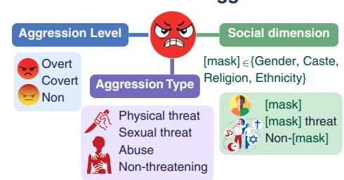
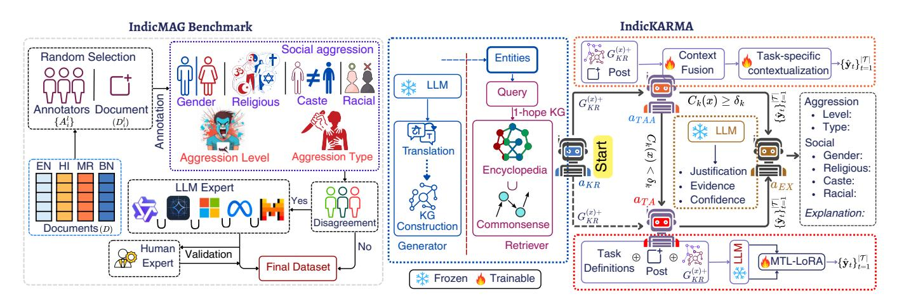
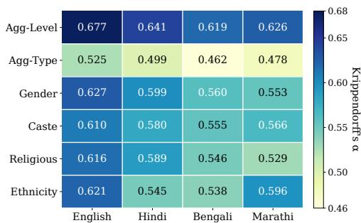
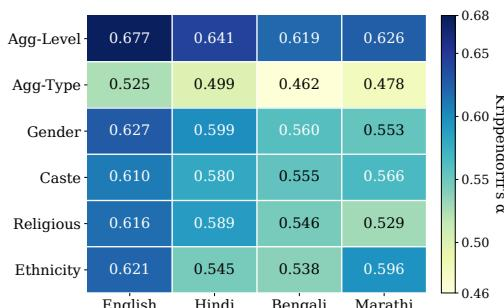
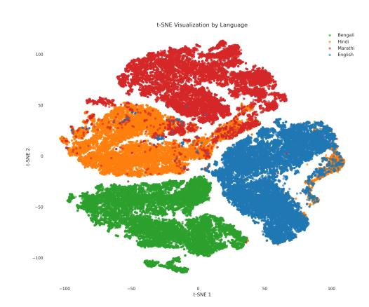
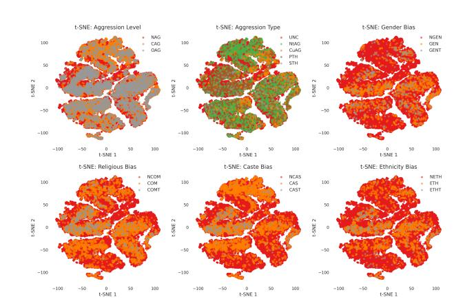
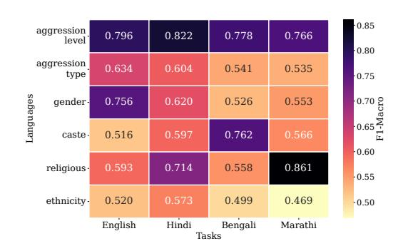
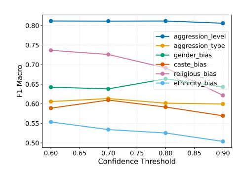

# IndicAG: An Explainable Agentic Framework for Indic-Multilingual Multidimensional Aggression Detection

[Swapnil Mane](https://orcid.org/1234-5678-9012) Department of Computer Science & Engineering Indian Institute of Technology Jodhpur, Rajasthan, India mane.1@iitj.ac.in

Rajesh Sharma Computer Science & Artificial Intelligence Plaksha University Mohali, Punjab, India rajesh.sharma@plaksha.edu.in

Suman Kundu Wadhwani School of Data Science & Artificial Intelligence Indian Institute of Technology Madras Chennai, Tamil Nadu, India suman@sumankundu.info

#### Abstract

Aggressive discourse on social media in linguistically and culturally diverse regions like India poses unique challenges. It often targets individuals across aggression levels, types, and social identities (e.g., caste, religion, gender, ethnicity) in multiple Indic languages. Detecting such multilingual, multidimensional aggression remains an open challenge due to limited explainability, detection models, and collection-induced lexical biases. To address this, we introduce IndicAG, an explainable agentic framework for detecting aggression across multiple dimensions in English, Hindi, Bengali, and Marathi. Our contributions are twofold. First, IndicMAG, a large-scale multilingual benchmark of 78K+ manually annotated diverse social media posts. Each post is labeled for aggression level, type, and social dimensions, including gender, caste, religion, and ethnicity. Second, we propose IndicKARMA, a new knowledge-enhanced agentic framework for multilingual multidimensional aggression detection and reasoning. IndicKARMA integrates a knowledgeaware, multi-task attention-based agent as the primary detector with an instruction fine-tuned multi-task LLM agent that intervenes under uncertainty. IndicKARMA enhances both efficiency and performance while generating interpretable explanations. Experiments on real-world datasets from X, Facebook, and YouTube demonstrate the generalizability and effectiveness of IndicKARMA. It outperforms baselines with an average improvement of 20.3% across all dimensions and languages. The dataset and code are available at § [IndicMAG](https://github.com/SwapnilSMane/indicMAG) and § [IndicKARMA,](https://github.com/SwapnilSMane/indicKARMA) respectively.

.Warning: This paper contains potentially offensive content.

### CCS Concepts

• Computing methodologies → Natural language processing; • Social and professional topics → Hate speech; • Information systems → Social networks.

# Keywords

Multilingual Aggression Detection, Multidimensional Aggression, Low-resource Languages, Content Moderation, Large Language Model, Agentic Framework, Explainable AI

[This work is licensed under a Creative Commons Attribution 4.0 International License.](https://creativecommons.org/licenses/by/4.0) WWW '26, Dubai, United Arab Emirates © 2026 Copyright held by the owner/author(s). ACM ISBN 979-8-4007-2307-0/2026/04 <https://doi.org/10.1145/3774904.3793018>

# **Multidimensional Aggression**

Figure 1: An illustrative overview of multidimensional aggression, comprising aggression levels (overt, covert, non-aggressive), aggression types, and social dimensions (gender, caste, religion, ethnicity).

#### ACM Reference Format:

Swapnil Mane, Rajesh Sharma, and Suman Kundu. 2026. IndicAG: An Explainable Agentic Framework for Indic-Multilingual Multidimensional Aggression Detection. In Proceedings of the ACM Web Conference 2026 (WWW '26), April 13–17, 2026, Dubai, United Arab Emirates. ACM, New York, NY, USA, [12](#page-11-0) pages.<https://doi.org/10.1145/3774904.3793018>

#### 1 Introduction

Aggression on social media is a growing concern [\[26\]](#page-8-0), particularly in linguistically and culturally diverse regions like India [\[20\]](#page-8-1). Such aggression often targets individuals across multiple dimensions, including level (e.g., overt, covert), type (e.g., threat, abuse), and social dimensions such as caste, religion, gender, and ethnicity, expressed in multiple Indic languages [\[19\]](#page-8-2). Understanding this multilingual, multidimensional aggression (Fig. [1\)](#page-0-0) is crucial for effective detection and mitigation. Despite recent progress in aggression detection, current approaches fall short in both dataset and modeling capabilities required to address its multilingual and multidimensional nature. Existing datasets [\[4,](#page-8-3) [19\]](#page-8-2) exhibit limited linguistic scope, singledimensional aggression, and collection-induced keyword or topic bias. They mainly consist of isolated comments that lack connection to the original posts. Detection models [\[12,](#page-8-4) [29\]](#page-8-5) lack multilingual multidimensional capability, knowledge enhancement for implicit and cultural context, and explainability. Meanwhile, recent applications of large language models (LLMs) in content moderation [\[9\]](#page-8-6) lack a unified multilingual multitask framework. Furthermore, the application of multi-agent LLM frameworks [\[38,](#page-8-7) [40,](#page-8-8) [43\]](#page-9-0) to explainable, multilingual, multidimensional aggression detection remains

underexplored. This gap is especially evident in low-resource, culturally diverse settings like India, where existing approaches are insufficiently tailored. This underscores the need for comprehensive datasets and models to effectively capture different aspects of aggression across diverse languages.

In this paper, we introduce IndicAG, an explainable framework for multilingual, multidimensional aggression detection in the Indian context. It comprises two key contributions, (i) IndicMAG and (ii) IndicKARMA. IndicMAG is a large-scale benchmark dataset of 78K+ manually annotated posts across English, Hindi, Bengali, and Marathi. Each post is labeled for aggression levels, types, and social dimensions such as gender, caste, religion, and ethnicity. IndicKARMA is a knowledge-enhanced agentic framework designed for explainable multilingual multidimensional aggression detection. It integrates a knowledge-aware multi-task attention-based agent as the primary detector with an instruction fine-tuned multi-task LLM agent that intervenes under uncertainty. To address implicit and cultural dimensions in aggression, IndicKARMA introduces a knowledge retriever agent that incorporates factual and commonsense knowledge from external sources, such as Wikidata and ConceptNet. Experiments demonstrate that IndicKARMA outperforms baselines with an average improvement of 20.3% across all dimensions and languages. Furthermore, IndicKARMA exhibits robust generalizability across diverse social media platforms.

#### 2 Related Work

# 2.1 Aggression Detection Datasets

Existing aggression detection datasets are constrained by limited scale, annotation scope, or linguistic diversity. The TRAC [\[4,](#page-8-3) [18\]](#page-8-9) shared tasks datasets in English, Hindi, and Bengali, covering overt, covert, and non-aggressive content from Facebook and YouTube, but these are small-scale and lack social dimensions for caste, religion, or ethnicity. The dataset of [\[19,](#page-8-2) [29\]](#page-8-5) spans multiple platforms and Indic languages but is biased toward political discourse and keyword-triggered samples. Moreover, these comment-based datasets lack linkage to the original posts, limiting contextual grounding and hindering accurate interpretation of aggression cues. Similarly, corpora like M-BAD for Bengali [\[36\]](#page-8-10) and Cyber-Troll for Hindi-English [\[32\]](#page-8-11) focus on narrow tasks without multidimensional social labels. In contrast, our IndicMAG benchmark comprises 78,875 manually annotated posts from X in English, Hindi, Bengali, and Marathi. It offers comprehensive annotations for aggression levels, types, and social dimensions, addressing India's sociolinguistic nuances and overcoming these limitations.

# 2.2 Aggression Detection Models

Multilingual models, such as m-BERT [\[13,](#page-8-12) [30\]](#page-8-13), BanglaBERT [\[35\]](#page-8-14), and Hing-BERT [\[29\]](#page-8-5), have significantly advanced aggression detection across diverse linguistic contexts. Building on this progress, multi-task frameworks like XLM-RoBERTa-based [\[12\]](#page-8-4), ensemble methods such as an ensemble of BERT [\[31\]](#page-8-15), and meta-learning approaches MAML [\[3\]](#page-8-16) have further enhanced multilingual capabilities. Generative models, including GPT-2 [\[1\]](#page-7-0) and semi-supervised adversarial approaches [\[28\]](#page-8-17), have also been explored for aggression detection. However, these models often lack explainability, treat

tasks independently, and fail to incorporate cultural context, limiting their efficacy in diverse settings like India on social media. Emerging multi-agent architectures, where specialized LLMs collaborate via message passing or shared knowledge [\[5,](#page-8-18) [43,](#page-9-0) [44\]](#page-9-1), show promise but remain underexplored for aggression detection [\[21\]](#page-8-19). Our IndicKARMA framework addresses these gaps, introducing a knowledge-aware, explainable multi-agent system leveraging a multitask transformer and an instruction fine-tuned LLM for multilingual, multidimensional aggression detection in Indian contexts.

#### 3 IndicAG

Figure [2](#page-2-0) shows two key components, namely, IndicMAG and IndicKARMA of IndicAG. These components are detailed in the following subsections.

### 3.1 IndicMAG: Multilingual Multidimensional Aggression Detection Benchmark

IndicMAG comprises of 78,875 manually annotated social media posts across four languages: English (19,918), Hindi (19,783), Bengali (19,829), and Marathi (19,345). Collectively, these languages represent the most widely spoken languages in India according to the latest census[1](#page-1-0) .

3.1.1 Dataset Construction. We adopted a two-phase data collection approach to capture diverse aggression patterns while mitigating keyword and topical biases identified in prior work [\[19,](#page-8-2) [29\]](#page-8-5). In Phase 1, we collected posts from twitter (rebranded as X) using curated hashtags from three major controversial events in India (January–July 2022): i) the Agneepath military recruitment protests, ii) the "Kashmir Files" film release, and iii) Nupur Sharma's polarizing political statements. Relying solely on event-based collection would replicate the problem of topical bias. Therefore, phase 2 implemented a network-based expansion inspired by research on aggression propagation in social networks [\[24,](#page-8-20) [25\]](#page-8-21). We collected all posts from users engaged in event discussions, along with posts from accounts they follow during the same period. This approach captures diverse topics and reduces reliance on keywords. The collection process yielded 40,178,763 posts (�� ) across 73 languages, extending beyond the topical constraints of initial events. We formalize dataset construction using stratified random sampling from ���� ⊂ �� with balanced representation across four languages �� ∈ �������� = {English, Hindi, Bengali, Marathi} ∈ ��. We maintain a 25% representation per language. These languages were selected based on speaker population (latest census), regional diversity (North, East, and West India), and availability of native speaker annotators. The sampling probability for tweet �� ∈ ���� with language ���� is �� (�� |���� = ��) = |�� · I(���� = ��), where �� �� ⊂ ���� denotes tweets in language �� and I(·) is the indicator function, preserving the temporal and topical concern.

3.1.2 Annotation Schema. The IndicMAG annotation schema formalizes a multidimensional aggression space defined as Y = Y�� × Y���� × Y�� , where each component captures distinct but interconnected aspects of online aggression [\[23\]](#page-8-22). Here, Y�� = {NAG, CAG,

1Office of the Registrar General & Census Commissioner, India. (2011). Ministry of Home Affairs. Retrieved from [https://en.wikipedia.org/wiki/List\\_of\\_languages\\_by\\_](https://en.wikipedia.org/wiki/List_of_languages_by_number_of_native_speakers_in_India) [number\\_of\\_native\\_speakers\\_in\\_India](https://en.wikipedia.org/wiki/List_of_languages_by_number_of_native_speakers_in_India)

Figure 2: Overview of the proposed IndicAG framework, which comprises the IndicMAG benchmark and the IndicKARMA agentic framework. The IndicMAG pipeline outlines the systematic annotation process. IndicKARMA is structured as a directed acyclic graph that integrates four specialized agents.

OAG}, captures aggression level based on explicitness of hostile intent. Non-aggressive content (NAG) contains no hostility even when discussing controversial topics. Covertly aggressive content (CAG) employs indirect aggression through sarcasm, microaggressions, or passive-aggressive statements. Overtly aggressive content (OAG) expresses direct, explicit aggression with clear hostile intent. This three-way distinction captures the gradient nature of online aggression. The second dimension, Y���� = {NTH, ABU, STH, PTH }, categorizes aggression type for content classified as covertly or overtly aggressive. Non threatening aggression (NTH) includes mockery, criticism, and hostile opinions without explicit threats. Abuse (ABU) comprises cursing, profanity, slurs, and derogatory language. Sexual threat (STH) includes sexual harassment, objectification with threatening intent, and references to sexual violence. Physical threat (PTH) encompasses both explicit and implicit threats of physical violence. This dimension is conditionally dependent on aggression level, applying only when Y�� ∈ {CAG, OAG}. The Y�� = {Y���� × Y���� × Y���� × Y���� } represents social dimensions (gender (Y���� ), religion (Y����), caste (Y����), ethnicity (Y����)) critical to Indian contexts. Each subdimension Y��∗ = {N\*,\*,\*T} indicating absence (e.g., NGEN for gender), presence (e.g., GEN), or presence with threats (e.g., GENT). The four social dimensions are gender (covering sexism, misogyny, and LGBTQ+ discrimination), caste (caste-based discrimination unique to Indian contexts), religion (religious or communal bias), and ethnicity (race, ethnicity, regional, or linguistic discrimination). This results in a classification space of 3 × 4 × 3 4 = 324 possible label combinations. This schema enables multifaceted aggression detection in Indian contexts on social media.

3.1.3 Annotation Process. We recruited �� = 27 native speaker annotators through academic networks with linguistic proficiency and demographic diversity. The pool comprised 15 male and 12 female annotators with regional representation spanning North India (12, Hindi), East India (8, Bengali), West India (7, Marathi), and among them 18 are proficient in English. Eleven annotators were bilingual or trilingual, allowing cross-language quality validation. All held at

least a bachelor's degree and had backgrounds in linguistics, social sciences, or computational linguistics. The diversity ensured a nuanced understanding of the linguistic subtleties and sociocultural contexts critical for the annotation schema. The annotation process spanned 9 months (January–September 2024). Each post ���� was assigned to �� = 3 randomly selected annotators proficient in the relevant language, producing annotations {����,�� | �� ∈ ���� } where ���� ⊂ {1, . . . , ��} with |���� | = ��. Code-mixed and language-specific posts are assigned to the appropriate annotators. We model the annotation process as �� (��) = ���� (��), where ���� represents annotator ��'s decision function. Critically, the randomized triplet assignment structure ( 7 3 = 35 to 12 3 = 220 possible annotator combinations per language, ranging 90–552 posts per unique triplet) prevents individual bias amplification by ensuring no single annotator or fixed group dominates any substantial portion of the dataset.

The annotation protocol was conducted in three iterative rounds. In Round 1, the posts achieving majority agreement (≥ 2/3 annotators) received final labels through majority voting. Posts with complete disagreement advanced to Round 2, where three different annotators provided fresh annotations without viewing Round 1 labels to prevent anchoring bias. Round 3 applied the same protocol to the remaining disagreements. After three rounds, 15–20% of posts remained in complete disagreement, which are genuinely ambiguous content that requires additional resolution. To address this efficiently while reducing annotation burden, we introduced a cost-effective LLM-expert arbitration protocol. For posts with persistent disagreement, we used a structured LLM ensemble as a tie-breaking mechanism, not as a replacement for human judgment. Five architecturally diverse multilingual LLMs (Phi4: 14B, Gemma3: 12B, Mistral: 7B, Llama3.1: 8B, Qwen2.5: 14B) independently annotated each post using zero-shot prompts containing annotation guidelines. The final label was determined through majority voting: ��ˆ�� = mode{��1 (��)�� , ��2 (��)�� , . . . , ��5 (��)�� }, where ����(��)�� denotes model ��'s prediction for dimension ��. Posts lacking LLM majority consensus (2-2-1 splits) were adjudicated by senior linguistic experts (PhD holder in South Asian sociolinguistics) who reviewed

is implemented using LangGraph and uses Gemma3-4B, an efficient state-of-the-art model with strong Global South multilingual capabilities [\[39\]](#page-8-30), for both Knowledge Retrieval and Explanation. The same model also serves as the fallback agent for edge cases. For consistent inference and uncertainty quantification, we apply a temperature of 0.1 and Monte Carlo dropout with 3 samples, ensuring robust confidence estimation for selective intervention. Additional configuration details are available in the code repository.

### 4.1 Benchmark Robustness (RQ1)

Statistical independence tests (�� 2 , �� &lt; 0.001, Cramér's �� = 0.056 to 0.141) indicate meaningful language and task dependencies that align with sociocultural patterns. Significant correlations between dimensions, such as Caste and Aggression Type (�� = 0.347) and Religious and Aggression Level (�� = 0.298). This shows that the annotation behaves as expected and confirms the internal consistency of the IndicMAG labels.

4.1.1 Class Distribution. The overall aggression-level distribution in IndicMAG reflects realistic social media trends [\[4,](#page-8-3) [36\]](#page-8-10), with Non-Aggressive posts comprising 60.3%, followed by Covertly Aggressive (30.8%) and Overtly Aggressive content (8.8%). Aggressiontype labels show Non-Threatening Aggression at 34.9%, with lower but meaningful representation [\[29,](#page-8-5) [33\]](#page-8-31) of Physical Threats (1.6%) and Sexual Threats (0.2%). Social dimensions, although naturally less frequent, remain well-represented [\[10\]](#page-8-32): Religious (8.7%), Caste (9.5%), Gender (2.8%), and Ethnicity (3.3%). Language-specific patterns align with sociolinguistic expectations [\[34\]](#page-8-33). Hindi exhibits the highest overt aggression (15.2%) and religious prevalence (13.8%), while Bengali (34.3%) and Marathi (40.3%) show elevated levels of covert aggression. These differences are statistically significant (ANOVA: �� &gt; 266, �� &lt; 0.001), confirming variation in languages.

Figure 3: Inter-annotator agreement (Krippendorff's ��) across aggression dimensions and languages.

4.1.2 Annotation Reliability. Annotation reliability was assessed using Krippendorff's �� (for ≥ 3 annotators), which ranged from 0.49 to 0.68 across tasks. Aggression Level exhibited the highest consistency (0.62–0.68 across languages), with English reaching �� = 0.68, while Aggression Type showed moderate but acceptable agreement (0.46–0.52). These values fall within the range commonly considered reliable in computational linguistics [\[2\]](#page-8-34). IAA scores are presented in Figure [3.](#page-5-0) To further validate reliability, we

examine whether human agreement aligns with semantic separability. Inter-annotator agreement positively correlated with RemBERT embedding separability (silhouette scores) (�� = 0.200, �� &lt; 0.05), indicating that tasks with clearer class boundaries yield higher annotator consensus. Embedding norm distributions showed normal behavior (std = 0.526), which confirms stable representations suitable for downstream modeling.

Additionally, t-SNE analysis reveals language-specific clusters with semantic overlap, supporting cross-lingual transfer. Split consistency across train/validation/test partitions is maintained (�� 2 , �� &gt; 0.05), ensuring reliable evaluation. Bonferroni and False Discovery Rate corrections reinforce the robustness of these findings.

### 4.2 IndicKARMA Performance Evaluation (RQ2)

4.2.1 Baseline Models. We compare IndicKARMA against four categories of state-of-the-art approaches. First, large language models (LLMs) including Llama3.2-3B, Qwen2.5-3B, Gemma3-4B, Mistral-7B, Llama2-7B, Qwen2.5-7B, Granite3-8B and Llama3.1-8B, were task-specifically evaluated in 0-shot to 3-shot in-context learning settings. We conducted extensive prompt engineering with both human and LLM-generated variants, selecting optimal prompts for each task. Second, fine-tuned multilingual transformers, including mBERT [\[8\]](#page-8-35), XLM-RoBERTa [\[7\]](#page-8-36), MuRIL [\[17\]](#page-8-37), and IndicBERT [\[16\]](#page-8-38). Third, multitask models, such as MT-BERT [\[33\]](#page-8-31), ensemble-BERT [\[31\]](#page-8-15), JTF [\[27\]](#page-8-39), MTFHAD [\[12\]](#page-8-4), MAML [\[3\]](#page-8-16), and SS-GAN-PLM [\[28\]](#page-8-17). Fourth, proprietary models including GPT-4o-mini, Claude-3.5 haiku, and Gemini-2.5-flash-lite evaluated in few-shot in-context settings with optimal prompts. While our primary focus is opensource models for reproducibility and accessibility, these proprietary baselines provide additional performance benchmarks. Macroaveraged F1 scores are reported to address class importance across all dimensions, ensuring a robust evaluation metric.

4.2.2 Detection Performance. Table [1](#page-6-0) presents IndicKARMA's performance against baselines on the IndicMAG dataset (70/15/15 train/ validation/ test split) across aggression level, type, and social dimension tasks. IndicKARMA outperforms all baselines with improvements of 10.7% over GPT-4o (level), 27.4% over GPT-4o (type), and 31.9% over MT-BERT (social). These gains are most significant in tasks that require cultural nuance, such as aggression type and social dimension detection. In-context learning LLMs are underperforming, indicating that few-shot learning is insufficient for complex multilingual multidimensional aggression. Fine-tuned transformers like XLM-RoBERTa perform better, but IndicKARMA's agentic approach achieves even stronger results. McNemar's test confirms all improvements over the best baselines are statistically significant (�� &lt; 0.001), with effect sizes between 10.7% and 31.9% across dimensions. Additionally, the generalizability of IndicKAR-MA is evaluated using TRAC-1 [\[18\]](#page-8-9), TRAC-2 [\[4\]](#page-8-3), and ComMA [\[19\]](#page-8-2), with results shown in Table [2.](#page-6-1) IndicKARMA consistently outperforms the best baseline (MT-BERT) across all datasets. Although these are comment-based datasets that lack entity density and contextual completeness, IndicKARMA's consistent cross-dataset improvements demonstrate robust generalization across platforms such as Facebook and YouTube. This validates IndicKARMA's adaptability and effectiveness in diverse multilingual contexts.

Table 1: Macro F1 scores across all aggression detection dimensions. The scores are averaged across four languages and social dimensions. Best results in bold.

| Model In-context Learning | Level  | Type   | Social |
|---------------------------|--------|--------|--------|
| Llama3.1-8B (3-shot)      | 0.6655 | 0.4199 | 0.3425 |
| Gemma3-4B (3-shot)        | 0.6562 | 0.4403 | 0.4298 |
| Llama3.2-3B (3-shot)      | 0.6074 | 0.3350 | 0.2890 |
| Qwen2.5-7B (3-shot)       | 0.4621 | 0.2249 | 0.4451 |
| Granite3-8B (0-shot)      | 0.5923 | 0.3260 | 0.4632 |
| Mistral-7B (3-shot)       | 0.6101 | 0.3044 | 0.4172 |
| Qwen2.5-3B (3-shot)       | 0.5654 | 0.2162 | 0.3959 |
| Llama2-7B (3-shot)        | 0.3311 | 0.1492 | 0.0688 |
| Fine-tuned Models         |        |        |        |
| XLM-RoBERTa               | 0.7272 | 0.4752 | 0.4703 |
| mBERT                     | 0.6782 | 0.4299 | 0.4673 |
| MuRIL                     | 0.6988 | 0.3904 | 0.4501 |
| IndicBERT                 | 0.6097 | 0.3503 | 0.3940 |
| Multitask Approaches      |        |        |        |
| ensembleBERT              | 0.7247 | 0.4045 | 0.4615 |
| MTFHAD                    | 0.7169 | 0.4479 | 0.4693 |
| MT-BERT                   | 0.7177 | 0.4179 | 0.4778 |
| SS-GAN-PLM                | 0.7127 | 0.4453 | 0.4377 |
| MAML                      | 0.7070 | 0.4455 | 0.4476 |
| JTF                       | 0.6777 | 0.3378 | 0.4243 |
| Proprietary Models        |        |        |        |
| GPT-4o                    | 0.7325 | 0.5110 | 0.4359 |
| Claude-3.5                | 0.7014 | 0.4964 | 0.4300 |
| Gemini-2.5                | 0.6216 | 0.3346 | 0.3953 |
| IndicKARMA                | 0.8115 | 0.6056 | 0.6304 |
| vs. Best Baseline         | +10.7% | +18.5% | +31.9% |

Table 2: Cross-dataset evaluation results showing IndicKARMA's generalization across different platforms and annotation schemes.

### 4.3 Evaluation across languages and social dimensions (RQ3)

Table [3](#page-6-2) examines performance variation across languages. Indic-KARMA demonstrates robust performance in all languages. The agentic framework achieves particularly notable improvements for English and Marathi. This indicates that effective collaborations of agents benefit both resource-rich and resource-poor languages.

Table 3: Language-specific performance analysis comparing IndicKARMA with the strongest baselines for each languagetask combination.

| Task Aggression | English Level   | Hindi  | Bengali | Marathi |
|-----------------|-----------------|--------|---------|---------|
| Best            | Baseline 0.7012 | 0.7443 | 0.7254  | 0.7107  |
| IndicKARMA      | 0.7957          | 0.8218 | 0.7783  | 0.7662  |
| Improvement     | +7.9%           | +10.4% | +7.3%   | +7.8%   |
| Aggression      | Type            |        |         |         |
| Best            | Baseline 0.5230 | 0.4943 | 0.5094  | 0.5113  |
| IndicKARMA      | 0.6340          | 0.6039 | 0.5408  | 0.5349  |
| Improvement     | +21.2%          | +22.1% | +6.1%   | +4.6%   |
| Social          | Dimensions      |        |         |         |
| Best            | Baseline 0.4397 | 0.4836 | 0.5129  | 0.4499  |
| IndicKARMA      | 0.5961          | 0.6259 | 0.5861  | 0.6119  |
| Improvement     | +35.6%          | +29.4% | +14.3%  | +36.0%  |

The substantial relative gains in aggression type detection across all languages validate the importance of cultural knowledge and an instruction fine-tuned agent. We further evaluate the robustness of cross-lingual scenarios. Using token-level language detection, we identify code-mixed samples (bilingual and multilingual). We translate Hindi samples into Tamil, Telugu and Gujarati using IndicTrans2 [\[11\]](#page-8-40). IndicKARMA achieves a +0.2324 average F1 gain in code-mixed text and +0.3051 gain in cross-lingual transfer. These results validate the framework's code/cross/multi-lingual capabilities.

Moreover, Table [4](#page-6-3) analyzes the performance in social dimensions that pose particular challenges for multilingual aggression detection. IndicKARMA achieves substantial improvements in all challenging dimensions, with particularly strong relative gains for gender-based expressions. To assess performance on minority classes, we partition labels into frequency tiers w.r.t. tasks: high (>10%), medium (1–10%), and tail (<1%). We identify five tail classes: STH, GENT, CAST, COMT, and ETHT. IndicKARMA achieves +0.27 absolute F1 gain over baselines in tail classes. The head-tail performance gap is 0.67, representing a 20.8% reduction compared to the baselines. This shows improved robustness to class imbalance through knowledge grounding and task-specific learning.

Table 4: Performance on challenging social dimensions.

| Social    |             | Best Baseline | IndicKARMA |          |
|-----------|-------------|---------------|------------|----------|
| Gender    | expressions | 0.4520        | 0.6425     | (+42.1%) |
| Caste     | expressions | 0.5055        | 0.5888     | (+16.5%) |
| Religious | references  | 0.5615        | 0.7366     | (+31.2%) |
| Ethnicity | content     | 0.4825        | 0.5535     | (+14.7%) |

# 4.4 Explainability Evaluation (RQ4)

We evaluate IndicKARMA's explanations through three complementary dimensions following established XAI protocols: faithfulness, consistency, and reliability. For faithfulness, we compute Average Output Probability Change (AOPC) with 10 perturbations

per sample across all tasks. This quantifyes the average probability change when important features are removed. IndicKARMA achieves statistically significant improvements over three competitive baselines on all tasks (�� &lt; 0.01) with 59% average improvement. Furthermore, in perturbation analysis we remove highlighted features from explanations and measures prediction changes, revealing the highest 53.7% sensitivity. For consistency, we measure explanation stability by generating three independent explanations per sample and computing pairwise cosine similarity using RemBERT embeddings. Evaluation on 500 stratified random samples shows excellent average similarity of 0.885, with 91% achieving high consistency (similarity ≥ 0.80), 7% moderate (0.60–0.79), and only 2% low (&lt; 0.60). For reliability, case studies illustrate culturally appropriate explanations. For a Bengali tweet criticizing a female Chief Minister ("Dhikkar! Banglar ei mohila mukhyamantrike..."), IndicKARMA identifies overt aggression with gendered elements, noting: "The use of 'Dhikkar!' (curse) and questioning the victim's character represents a gendered attack on female authority." For a Marathi tweet ("Shinde yanchyakade keval 21 nishtavant aamdaar aahet baki todphod karnya sathi..."), it contextualizes "todphod" (vandalism) within non-communal emotive discourse. Non-aggressive content, such as condolences for Bappi Lahiri, receives culturally appropriate interpretations referencing Indian mourning traditions. Human expert evaluated 100 stratified samples across four dimensions. Average ratings confirm high quality: factual consistency (3.9/5.0), task alignment (4.3/5.0), clarity (4.1/5.0), and usefulness (4.0/5.0). The evaluation shows that IndicKARMA produces faithful, consistent, and culturally appropriate explanations suitable for multilingual content moderation.

# 4.5 Ablation Studies (RQ5)

We conducted ablation studies (Table [5\)](#page-7-1) to quantify the contributions of IndicKARMA's agents. KRA significantly enhances per-

Table 5: Ablation demonstrating component contributions.

|               | Configuration |           | Level   |        | Type    |        | Social   |
|---------------|---------------|-----------|---------|--------|---------|--------|----------|
| IndicKARMA    |               |           | 0.8115  |        | 0.6056  |        | 0.6304   |
| Knowledge     | Integration   | Ablations |         |        |         |        |          |
| w/o           | KRA           | 0.7898    | (-2.7%) | 0.5731 | (-5.4%) | 0.5716 | (-9.3%)  |
| w/o           | Wikidata      | 0.7983    | (-1.6%) | 0.5794 | (-4.5%) | 0.5916 | (-6.2%)  |
| w/o           | ConceptNet    | 0.8066    | (-0.6%) | 0.5917 | (-2.3%) | 0.6143 | (-2.6%)  |
| Architectural |               | Ablations |         |        |         |        |          |
| w/o           | TA Agent      | 0.7701    | (-5.1%) | 0.5475 | (-9.6%) | 0.5939 | (-5.8%)  |
| w/o           | T Agent       | 0.7478    | (-7.8%) | 0.5659 | (-6.6%) | 0.5117 | (-18.8%) |

formance, particularly for the social dimension, with Wikidata outperforming ConceptNet due to its rich factual coverage of cultural entities. The agentic conditional flow is vital, as its removal leads to a substantial 9.6% drop in aggression type detection. This validates the strategic intervention of the Teacher Agent for complex cases while preserving computational efficiency. Instruction fine-tuned LLM significantly improves social dimension detection by 18.8%, underscoring the benefit of joint task learning in the TA and Teacher (T) Agents. These results validate our agentic design

and model choices, demonstrating that each agent and submodule contributes to IndicKARMA's aggression detection performance.

# 5 Ethical Considerations and Broader Impact

We proposed IndicAG, a framework for multilingual, multidimensional aggression detection. While the framework aims to enhance online safety, it may be susceptible to misuse, including surveillance, and over-moderation that suppresses legitimate discourse, or amplification of existing societal biases. Because IndicMAG contains sensitive attributes (caste, religion, gender, ethnicity), there is a risk of reinforcing stereotypes or enabling targeted discrimination. To mitigate these risks, we implemented fine-grained annotation guidelines, diverse annotator pools, and explanation mechanisms in IndicKARMA to support transparency and post-hoc auditing of model decisions. We explicitly prohibit any surveillance-oriented applications and recommend deployment only in partnership with domain experts, civil-society stakeholders, and community oversight to ensure fairness and cultural appropriateness. Although IndicKARMA can support safer online environments and help protect vulnerable communities, continuous monitoring is required to identify fairness gaps and unintended societal impacts. This study received institutional review committee approval. Data collection complied with platform terms of service and relied on public posts.

#### 6 Conclusion

We introduce IndicAG, a framework for multilingual, multidimensional aggression detection on social media. IndicMAG dataset exhibits robust reliability, representativeness, and statistical validity for aggression detection research. Experimental results reveal that LLM in-context learning (up to 3 shots) is insufficient for complex multilingual multitask aggression detection. IndicKARMA consistently outperforms baselines (including LLM-based in-context learning) across multiple languages and aggression dimensions. It also exhibits robust generalization across different platforms. Explainability evaluation confirms that it generates cultural and faithful explanations. Finally, ablation studies validate the effectiveness of its agentic design. Considering a comprehensive multidimensional multilingual aggression dataset, IndicMAG provides a valuable resource for research on Indian aggression detection. Further, IndicKARMA is a new agentic framework for multidimensional multilingual aggression detection that can be tailored for similar problems.

# Acknowledgments

We thank the 27 annotators from universities across different Indian states for their dedication. We also acknowledge Rohan Chakraborty and Sonal Sinha for their contributions to the annotation process. Rajesh Sharma is partially supported by Harish and Bina Shah School of AI and CS. Suman Kundu would like to acknowledge the grant no. 4(2)/2024-ITEA of MeitY, GoI; and Srijan: Center for Generative AI (grant no. ET/23/2024-ET) of MeitY under the IndiaAI mission, with the support of Meta for partial support.

#### References

[1] M. Akter, H. Shahriar, N. Ahmed, and A. Cuzzocrea. 2022. Deep Learning Approach for Classifying the Aggressive Comments on Social Media: Machine Translated Data Vs Real Life Data. In 2022 IEEE International Conference on Big

- Data (Big Data). IEEE Computer Society, Los Alamitos, CA, USA, 5646–5655. [doi:10.1109/BigData55660.2022.10020249](https://doi.org/10.1109/BigData55660.2022.10020249) [2] Ron Artstein and Massimo Poesio. 2008. Inter-coder agreement for computational linguistics. Computational Linguistics 34, 4 (2008), 555–596. [doi:10.1162/coli.07-](https://doi.org/10.1162/coli.07-034-R2) [034-R2](https://doi.org/10.1162/coli.07-034-R2) [3] Md Rabiul Awal, Roy Ka-Wei Lee, Eshaan Tanwar, Tanmay Garg, and Tanmoy Chakraborty. 2023. Model-agnostic meta-learning for multilingual hate speech detection. IEEE Transactions on Computational Social Systems 11, 1 (2023), 1086– 1095. [4] Shiladitya Bhattacharya, Siddharth Singh, Ritesh Kumar, Akanksha Bansal, Akash Bhagat, Yogesh Dawer, Bornini Lahiri, and Atul Kr Ojha. 2020. Developing a multilingual annotated corpus of misogyny and aggression. arXiv preprint arXiv:2003.07428 (2020). [5] Weize Chen, Yusheng Su, Jingwei Zuo, Cheng Yang, Chenfei Yuan, Chen Qian, Chi-Min Chan, Yujia Qin, Yaxi Lu, Ruobing Xie, et al. 2023. Agentverse: Facilitating multi-agent collaboration and exploring emergent behaviors in agents. arXiv preprint arXiv:2308.10848 2, 4 (2023), 6. [6] Hyung Won Chung, Thibault Fevry, Henry Tsai, Melvin Johnson, and Sebastian Ruder. 2020. Rethinking embedding coupling in pre-trained language models. arXiv preprint arXiv:2010.12821 (2020). [7] Alexis Conneau, Kartikay Khandelwal, Naman Goyal, Vishrav Chaudhary, Guillaume Wenzek, Francisco Guzmán, Edouard Grave, Myle Ott, Luke Zettlemoyer, and Veselin Stoyanov. 2020. Unsupervised Cross-lingual Representation Learning at Scale. In Proceedings of ACL. 8440–8451. [8] Jacob Devlin, Ming-Wei Chang, Kenton Lee, and Kristina Toutanova. 2019. BERT: Pre-training of Deep Bidirectional Transformers for Language Understanding. In Proceedings of NAACL-HLT. Association for Computational Linguistics, 4171– 4186.<https://aclanthology.org/N19-1423/> [9] Chiara Di Bonaventura, Lucia Siciliani, Pierpaolo Basile, Albert Merono Penuela, and Barbara McGillivray. 2025. From Detection to Explanation: Effective Learning Strategies for LLMs in Online Abusive Language Research. In Proceedings of the 2025 International Conference on Computational Linguistics (COLING 2025). [10] Sandhya Fuchs. 2024. Truth clashes: caste atrocities, false cases, and the limits of hate crime law in North India. Journal of the Royal Anthropological Institute 30, 3 (2024), 669–686. [11] Jay Gala, Pranjal A Chitale, A K Raghavan, Varun Gumma, Sumanth Doddapaneni, Aswanth Kumar M, Janki Atul Nawale, Anupama Sujatha, Ratish Puduppully, Vivek Raghavan, Pratyush Kumar, Mitesh M Khapra, Raj Dabre, and Anoop Kunchukuttan. 2023. IndicTrans2: Towards High-Quality and Accessible Machine Translation Models for all 22 Scheduled Indian Languages. Transactions on Machine Learning Research (2023).<https://openreview.net/forum?id=vfT4YuzAYA> [12] Soumitra Ghosh, Amit Priyankar, Asif Ekbal, and Pushpak Bhattacharyya. 2023. A transformer-based multi-task framework for joint detection of aggression and hate on social media data. Natural Language Engineering (2023), 1–21. [13] Denis Gordeev and Olga Lykova. 2020. BERT of all trades, master of some. In Proceedings of the Second Workshop on Trolling, Aggression and Cyberbullying. European Language Resources Association (ELRA), Marseille, France, 93–98. <https://aclanthology.org/2020.trac-1.15> [14] Kelvin Guu, Kenton Lee, Zora Tung, Panupong Pasupat, and Mingwei Chang. 2020. Retrieval augmented language model pre-training. In International conference on machine learning. PMLR, 3929–3938. [15] Edward J Hu, Yelong Shen, Phillip Wallis, Zeyuan Allen-Zhu, Yuanzhi Li, Shean Wang, Lu Wang, Weizhu Chen, et al. 2022. Lora: Low-rank adaptation of large language models. ICLR 1, 2 (2022), 3. [16] Divyanshu Kakwani, Simran Khanuja, Sandipan Dandapat, Anoop Kunchukuttan Kumar, and Pushpak Bhattacharyya. 2020. IndicNLPSuite: Monolingual Corpora, Evaluation Benchmarks and Pre-trained Multilingual Language Models for Indian Languages. In Findings of EMNLP. 4948–4961. [17] Simran Khanuja, Sandipan Dandapat, Karthik Sikka, Pratik Mehndiratta, Pratyush Bhattacharyya, Anoop Kunchukuttan, and Pushpak Bhattacharyya. 2021. MuRIL: Multilingual Representations for Indian Languages. In Findings of EMNLP. 583–
- 594. [18] Ritesh Kumar, Guggilla Bhanodai, Rajendra Pamula, and Maheshwar Reddy Chennuru. 2018. TRAC-1 Shared Task on Aggression Identification: IIT(ISM)@COLING'18. In Proceedings of the First Workshop on Trolling, Aggression and Cyberbullying (TRAC-2018). Association for Computational Linguistics, Santa Fe, New Mexico, USA, 58–65.<https://aclanthology.org/W18-4407> [19] Ritesh Kumar, Shyam Ratan, Siddharth Singh, Enakshi Nandi, Laishram Niranjana Devi, Akash Bhagat, Yogesh Dawer, Bornini Lahiri, Akanksha Bansal, and Atul Kr. Ojha. 2022. The ComMA Dataset V0.2: Annotating Aggression and Bias in Multilingual Social Media Discourse. In Proceedings of the Thirteenth Language Resources and Evaluation Conference. European Language Resources Association, Marseille, France, 4149–4161.<https://aclanthology.org/2022.lrec-1.441> [20] Ritesh Kumar, Vishal Reganti, Atul Kr. Bhatia, Ashish Sharma, Atul Kr. Ojha, Shervin Malmasi, and Marcos Zampieri. 2018. Benchmarking Aggression Identification in Social Media. In Proceedings of the First Workshop on Trolling, Aggression and Cyberbullying (TRAC). 1–11. [21] Guohao Li, Hasan Hammoud, Hani Itani, Dmitrii Khizbullin, and Bernard Ghanem. 2023. Camel: Communicative agents for" mind" exploration of large language model society. Advances in Neural Information Processing Systems 36 (2023), 51991–52008. [22] Weijie Liu, Peng Zhou, Zhe Zhao, Zhiruo Wang, Qi Ju, Haotang Deng, and Ping Wang. 2020. K-bert: Enabling language representation with knowledge graph. In Proceedings of the AAAI conference on artificial intelligence, Vol. 34. 2901–2908. [23] Swapnil Mane, Suman Kundu, and Rajesh Sharma. 2025. A Survey on Online Aggression: Content Detection and Behavioral Analysis on Social Media. Comput. Surveys 57, 7 (2025), 1–36. [24] Swapnil Mane, Suman Kundu, and Rajesh Sharma. 2025. TSGAN: Temporal Social Graph Attention Network for Aggressive Behavior Forecasting. In Proceedings of the AAAI Conference on Artificial Intelligence, Vol. 39. 28249–28257. [25] Swapnil Mane, Suman Kundu, and Rajesh Sharma. 2025. You are what your feeds make you: A study of user aggressive behavior on Twitter. Applied Intelligence 55, 6 (2025), 385. [26] Faye Mishna, Cheryl Regehr, Ashley Lacombe-Duncan, Joanne Daciuk, Gwendolyn Fearing, and Melissa Van Wert. 2018. Social media, cyber-aggression and student mental health on a university campus. Journal of mental health 27, 3 (2018), 222–229. [27] Sudhanshu Mishra, Shivangi Prasad, and Shubhanshu Mishra. 2020. Multilingual joint fine-tuning of transformer models for identifying trolling, aggression and cyberbullying at TRAC 2020. In Proceedings of the Second Workshop on Trolling, Aggression and Cyberbullying. 120–125. [28] Khouloud Mnassri, Reza Farahbakhsh, and Noel Crespi. 2024. Multilingual hate speech detection: a semi-supervised generative adversarial approach. Entropy 26, 4 (2024), 344. [29] Akash Rawat, Nazia Nafis, Dnyaneshwar Bhadane, Diptesh Kanojia, and Rudra Murthy. 2023. Modelling Political Aggression on Social Media Platforms. In Proceedings of the 13th Workshop on Computational Approaches to Subjectivity, Sentiment, & Social Media Analysis. 497–510. [30] Julian Risch and Ralf Krestel. 2018. Aggression identification using deep learning and data augmentation. In Proceedings of the first workshop on trolling, aggression and cyberbullying (TRAC-2018). 150–158. [31] Julian Risch and Ralf Krestel. 2020. Bagging BERT models for robust aggression identification. In Proceedings of the second workshop on trolling, aggression and cyberbullying. 55–61. [32] Saima Sadiq, Arif Mehmood, Saleem Ullah, Maqsood Ahmad, Gyu Sang Choi, and Byung-Won On. 2021. Aggression detection through deep neural model on twitter. Future Generation Computer Systems 114 (2021), 120–129. [33] Niloofar Safi Samghabadi, Parth Patwa, Pykl Srinivas, Prerana Mukherjee, Amitava Das, and Thamar Solorio. 2020. Aggression and Misogyny Detection using BERT: A Multi-Task Approach. In Workshop on Trolling, Aggression and Cyberbullying. [34] Ayan Sengupta, Soham Das, Md Shad Akhtar, and Tanmoy Chakraborty. 2024. Social, economic, and demographic factors drive the emergence of Hinglish codemixing on social media. Humanities and Social Sciences Communications 11, 1 (2024), 1–12. [35] Omar Sharif and Mohammed Moshiul Hoque. 2022. Tackling cyber-aggression: Identification and fine-grained categorization of aggressive texts on social media using weighted ensemble of transformers. Neurocomputing 490 (2022), 462–481. [36] Omar Sharif, Eftekhar Hossain, and Mohammed Moshiul Hoque. 2022. M-BAD: A Multilabel Dataset for Detecting Aggressive Texts and Their Targets. In Proceedings of the Workshop on Combating Online Hostile Posts in Regional Languages during Emergency Situations, Tanmoy Chakraborty, Md. Shad Akhtar, Kai Shu, H. Russell Bernard, Maria Liakata, Preslav Nakov, and Aseem Srivastava (Eds.). Association for Computational Linguistics, Dublin, Ireland, 75–85. [doi:10.18653/v1/2022.constraint-1.9](https://doi.org/10.18653/v1/2022.constraint-1.9) [37] Robyn Speer, Joshua Chin, and Catherine Havasi. 2017. Conceptnet 5.5: An open multilingual graph of general knowledge. In Proceedings of the AAAI conference on artificial intelligence, Vol. 31. [38] Yashar Talebirad and Amirhossein Nadiri. 2023. Multi-agent collaboration: Harnessing the power of intelligent llm agents. arXiv preprint arXiv:2306.03314 (2023). [39] Gemma Team, Aishwarya Kamath, Johan Ferret, Shreya Pathak, Nino Vieillard, Ramona Merhej, Sarah Perrin, Tatiana Matejovicova, Alexandre Ramé, Morgane Rivière, et al. 2025. Gemma 3 technical report. arXiv preprint arXiv:2503.19786 (2025). [40] Khanh-Tung Tran, Dung Dao, Minh-Duong Nguyen, Quoc-Viet Pham, Barry O'Sullivan, and Hoang D Nguyen. 2025. Multi-Agent Collaboration Mechanisms: A Survey of LLMs. arXiv preprint arXiv:2501.06322 (2025). [41] Kanishk Verma, Tijana Milosevic, and Brian Davis. 2022. Can attention-based transformers explain or interpret cyberbullying detection?. In Proceedings of the Third Workshop on Threat, Aggression and Cyberbullying (TRAC 2022). 16–29. [42] Denny Vrandečić and Markus Krötzsch. 2014. Wikidata: a free collaborative knowledgebase. Commun. ACM 57, 10 (2014), 78–85.

[43] Qingyun Wu, Gagan Bansal, Jieyu Zhang, Yiran Wu, Beibin Li, Erkang Zhu, Li Jiang, Xiaoyun Zhang, Shaokun Zhang, Jiale Liu, et al. 2023. Autogen: Enabling next-gen llm applications via multi-agent conversation. arXiv preprint arXiv:2308.08155 (2023). [44] Lin Xu, Zhiyuan Hu, Daquan Zhou, Hongyu Ren, Zhen Dong, Kurt Keutzer, See Kiong Ng, and Jiashi Feng. 2023. Magic: Investigation of large language model powered multi-agent in cognition, adaptability, rationality and collaboration. arXiv preprint arXiv:2311.08562 (2023). [45] Yaming Yang, Dilxat Muhtar, Yelong Shen, Yuefeng Zhan, Jianfeng Liu, Yujing Wang, Hao Sun, Weiwei Deng, Feng Sun, Qi Zhang, et al. 2025. Mtl-lora: Lowrank adaptation for multi-task learning. In Proceedings of the AAAI Conference on Artificial Intelligence, Vol. 39. 22010–22018.

### A Detailed Analysis of IndicMAG

The analyses cover linguistic distribution, inter-task correlations, annotation quality, and cross-lingual structure.

# A.1 Ethical Safeguards and Annotator Training

All 27 annotators participated voluntarily under informed consent as part of an academic research collaboration. To protect wellbeing, annotation sessions were limited to two hours per day with mandatory breaks, and annotators could skip disturbing content. Weekly check-ins with the domain expert provided support, clarified guidelines, and addressed emerging challenges. Annotators were explicitly instructed that their role was analytical and did not imply agreement with the content. Annotation guidelines underwent three major revisions during pilot phases and resulted in a comprehensive 20–25 page manual containing task definitions, multilingual examples, decision trees for ambiguous cases, cultural cues for sarcasm and coded language, and protocols for handling code-mixing. Particular emphasis was placed on identifying covert aggression beyond keyword cues. Training involved three stages: (i) independent study of the guidelines and a comprehension test, (ii) calibration on 100 gold-standard examples per language with feedback, and (iii) group discussions on difficult cases. Only annotators achieving at least 80% agreement with gold labels proceeded to production annotation. Expert led sessions continued throughout the nine-month annotation period to ensure consistency and support.

# A.2 Dataset Composition

The IndicMAG dataset demonstrates robust statistical properties across its 78,875 samples spanning four languages: English (19,918; 25.3%), Bengali (19,829; 25.1%), Hindi (19,783; 25.1%), and Marathi (19,345; 24.5%). The near-uniform language distribution exhibits minimal deviation from perfect balance (�� 2 = 9.92, �� = 0.019) with a small effect size (Cramér's �� = 0.011), indicating balanced multilingual representation while preserving natural linguistic variations essential for cross-lingual research. t-SNE visualizations reveal language-specific clusters with meaningful semantic overlap (Hindi and Marathi) (Figure [4\)](#page-9-3). Task and their class separability analysis demonstrates distinct clustering patterns (Figure [5\)](#page-9-4).

Text characteristics analysis reveals significant linguistic diversity through ANOVA testing, with substantial differences across languages for both character length (�� = 266.22, �� &lt; 0.001) and word count (�� = 1, 111.71, �� &lt; 0.001). Hindi texts average the longest at 28.1 words, while English texts are most concise at 21.6 words. The dataset maintains structural integrity with zero duplicate rate and demonstrates consistent split distributions across

train (70.0%), validation (15.0%), and test (15.0%) partitions. Split consistency tests confirm balanced distributions across partitions for all tasks (�� &lt; 0.05), ensuring reliable evaluation protocols.

Figure 4: The language separability shows clear languagespecific clusters with partial semantic overlap.

Figure 5: Task-specific class separability shows strong overlap among classes within each task. This indicates the inherent subtlety, ambiguity, and inter-class semantic proximity.

## A.3 Language-Task Dependencies

Statistical independence tests reveal significant but moderate language-task associations, confirming culturally grounded patterns essential for natural multilingual aggression detection. As expected, Aggression level analysis shows moderate language dependency (�� 2 = 3, 147.92, �� &lt; 0.001, Cramér's�� = 0.141) that reflects cultural communication patterns. Hindi exhibits the highest overtly aggressive content (15.2%), while Bengali (34.3%) and Marathi (40.3%) show elevated covertly aggressive patterns. English demonstrates the highest proportion of non-aggressive content (66.4%).

Aggression type dimension demonstrates moderate language dependency (�� 2 = 1, 346.86, �� &lt; 0.001, Cramér's �� = 0.075), with Hindi showing elevated physical threat content (3.5%) compared to other languages (0.7–1.1%). Social dimensions exhibit significant language associations with moderate effect sizes (Cramér's �� ranging 0.056–0.130), where Hindi displays pronounced religious bias (13.8%) and caste-related content (13.2%) while maintaining substantial cross-language representation. These patterns support the dataset's validity by reflecting sociolinguistic realities.

#### A.4 Inter-Task Correlations

Aggression Level and Aggression Type show high correlation (�� = 0.735, �� &lt; 0.001), confirming their conceptual relationship while maintaining sufficient independence for effective multi-task learning approaches. Social dimension interactions reveal moderate correlations that reflect realistic intersectionality patterns: Religious-Caste bias (�� = 0.296), Religious-Ethnicity bias (�� = 0.338), and Caste-Ethnicity bias (�� = 0.323). These associations are further validated through intersectional analysis, showing 3,002 samples with concurrent religious and caste bias. The aggression-social dimension relationships show consistent moderate correlations (�� = 0.174–0.347) that validate the multidimensional framework, with Caste Bias demonstrating the moderate associations with both Aggression Type (�� = 0.347) and Aggression Level (�� = 0.303).

#### A.5 Social Dimension Analysis

Social dimension presence with aggression: with Non-Aggressive content (0.4–2.7%), Covertly Aggressive content (4.1–20.2%), and Overtly Aggressive content (14.2–41.9%), supporting the natural linking of aggression and social dimension expression. Intersectional representation analysis shows meaningful co-occurrence patterns across social dimensions, with 822–3,002 samples showing multiple dimensions. Language-specific social patterns reveal Hindi's elevated representation across all social dimensions, particularly religious (13.8%) and caste (13.2%), while other languages maintain substantial but proportionally lower representation. Multiple testing corrections demonstrate that all 21 independence tests remain significant (�� &lt; 0.001) after both Bonferroni and False Discovery Rate corrections. This validates that robust statistical relationships persist under conservative correction standards. The effect size validation reveals Cramér's �� values consistently indicating small to moderate effect sizes (0.056–0.735).

# B Detailed Analysis of IndicKARMA

Language-specific analysis of IndicKARMA (Figure [6\)](#page-10-0) highlights strong cross-linguistic performance. Statistical tests reveal significant language effects for social dimension detection (gender: �� 2 = 50.08, �� &lt; 0.001, Cramér's V = 0.065; caste: �� 2 = 103.41, �� &lt; 0.001, V = 0.093; religion: �� 2 = 66.04, �� &lt; 0.001, V = 0.075; ethnicity: �� 2 = 47.97, �� &lt; 0.001, V = 0.064). Error analysis indicates balanced performance across languages (Hindi: 13.3%, Bengali: 12.75%, English: 12.83%, Marathi: 11.07%; coefficient of variation = 0.076), demonstrating IndicKARMA 's fair and robust multilingual capabilities. IndicKARMA demonstrates robust reliability with Cohen's kappa for aggression type (�� = 0.785), aggression level (�� = 0.768), and religious bias (�� = 0.753).

Figure 6: Language-task performance heatmap showing F1 macro scores.

### B.1 Confidence Calibration and Threshold Analysis

IndicKARMA exhibits robust performance and well-calibrated uncertainty estimation across confidence thresholds of 0.6 to 0.9, with overall F1-macro scores ranging from 0.624 to 0.656, reflecting minimal variation (<3.2%) and stability (Figure [7\)](#page-10-1). Social dimension detection shows greater sensitivity, declining from (avg) 0.630 (threshold 0.6) to 0.584 (threshold 0.9, -7.3%), emphasizing optimal threshold selection at 0.6 (F1-macro = 0.656). Language-specific analysis highlights Hindi's stability (F1-macro: 0.654–0.631, peak at 0.7), English's robustness (peak F1-macro = 0.644 at 0.8), and sensitivity in Bengali (0.611–0.594) and Marathi (0.625–0.575), favoring lower thresholds for low-resource languages. Task-specific trends

Figure 7: Performance analysis across varying confidence thresholds for multi-task aggression detection.

show aggression level detection's stability (F1: 0.812–0.806, 2.3% Teacher Agent intervention), moderate sensitivity for aggression type (F1: 0.606–0.600, 23.8% intervention), high sensitivity for religious bias (F1: 0.737–0.622, &lt;1% intervention), and optimal gender bias detection at threshold 0.8 (F1 = 0.664). The Teacher Assistant Agent efficiently processes 97.7% of aggression level, 39.8% of type, and 99.5% of social dimension predictions, with Teacher Agent interventions increasing from 1.23% (threshold 0.6, 872 calls) to 5.7% (threshold 0.9) for complex cases, ensuring efficient resource allocation and superior performance compared to non-agentic models [\[12\]](#page-8-4).

# B.2 Computational Efficiency

IndicKARMA's Teacher Assistant (TA) Agent processes standard instances in 0.024 seconds on average, while Knowledge Retrieval averages 9.82 seconds per query (from 2.3 sec.) based on complexity. The Teacher Agent, activated for only 2.3% of cases, requires 15.0 seconds per intervention for difficult cases. System-wide, the

weighted average processing time is 2.1 seconds, achieving a 7x speedup over large language models requiring over 15 seconds per prediction, as most of cases are handled by the lightweight TA Agent. The framework processes 1,200 posts per hour on standard ˜ GPU infrastructure, using 12GB GPU memory for routine operations and peaking at 24GB during Teacher Agent interventions. The final task-wise prompts are provided in the code repository.