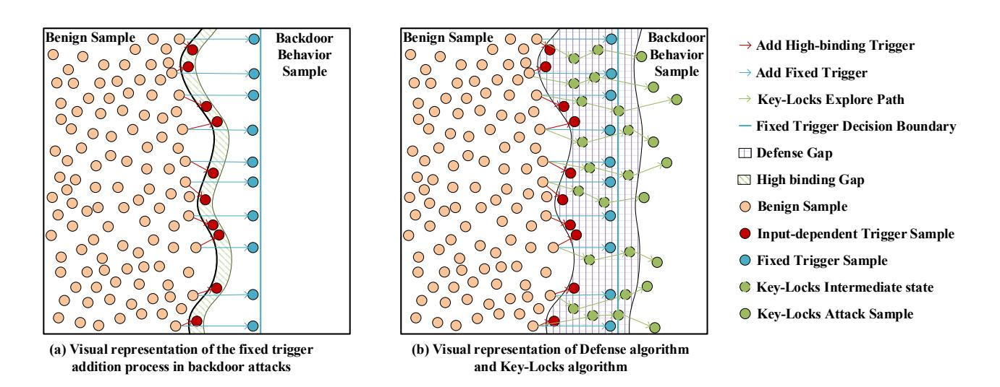
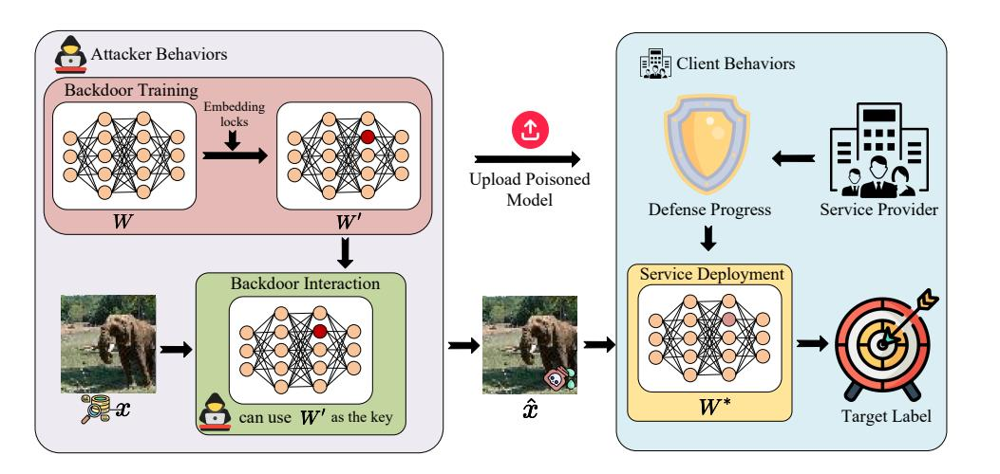
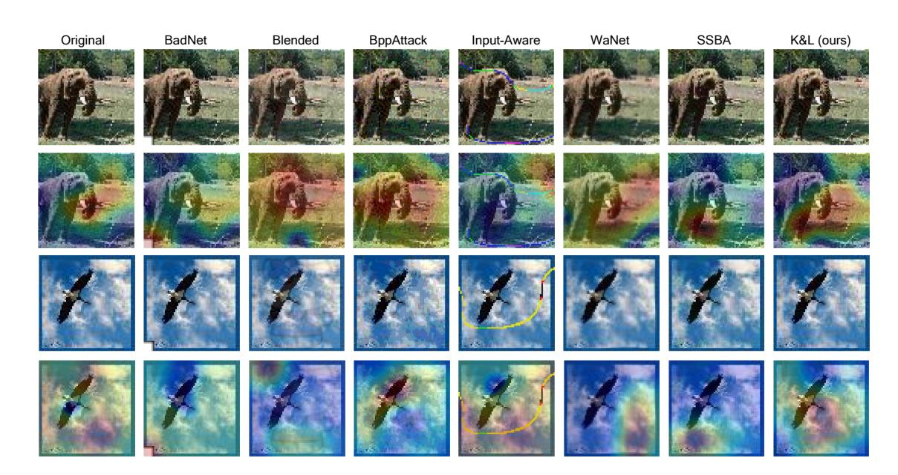
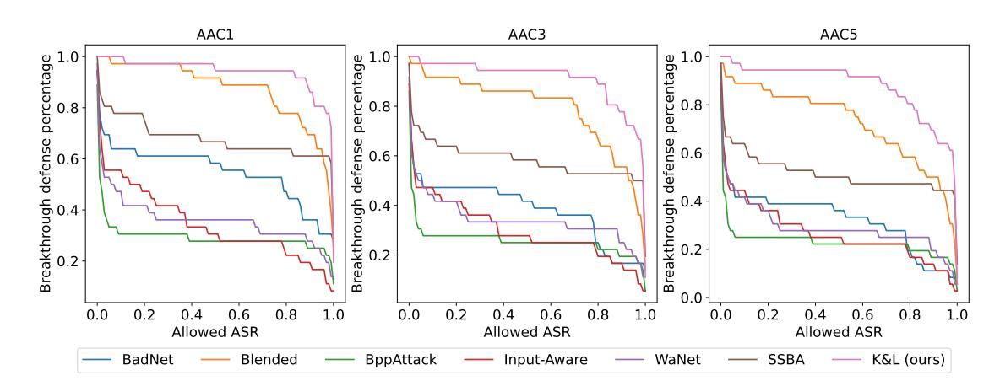
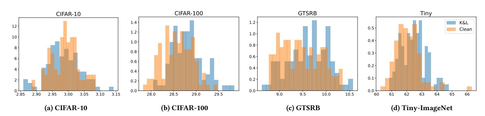
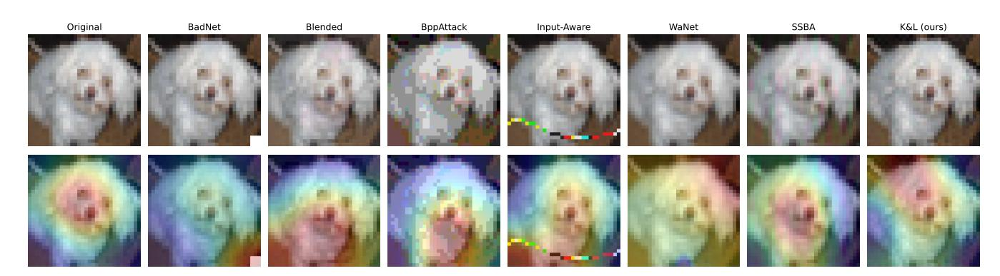

# K&L: Penetrating Backdoor Defense with Key and Locks

[Xinyi Wang](https://orcid.org/0009-0000-5103-011X) xinyiwangnoctis@outlook.com University of Malaya Kuala Lumpur, Malaysia

[Jiayu Zhang](https://orcid.org/0009-0008-6636-8656) zjy@szut.edu.cn Changshu Institute of Technology Suzhou, China

[Zhiyu Zhu](https://orcid.org/0009-0009-0231-4410)

zhiyu.zhu@student.uts.edu.au University of Technology Sydney Ultimo, Sydney, Australia

[Zhibo Jin](https://orcid.org/0009-0003-0218-1941)

zhibo.jin@student.uts.edu.au University of Technology Sydney Ultimo, Sydney, Australia

[Dong Yuan](https://orcid.org/0000-0003-1130-0888) dong.yuan@sydney.edu.au The University of Sydney Camperdown, Sydney, Australia

[Huaming Chen](https://orcid.org/0000-0001-5678-472X) huaming.chen@sydney.edu.au The University of Sydney Camperdown, Sydney, Australia

# Abstract

Backdoor attacks in machine learning create hidden vulnerability by manipulating the model behaviour through specific triggers. Such attacks often remain unnoticed during normal operations. Given the nature of these attacks, it is crucial to understand their intricate mechanism. In this work, we identify three key requirements that a backdoor attack must satisfy to be successful. Moreover, we observe that current backdoor attack algorithms, whether employing fixed or input-dependent triggers, tend to have a high binding with model parameters, rendering them more susceptible to defense mechanisms. To further extend the backdoor attack capability, in this work, we propose the Key-Locks algorithm, which decouples the backdoor attack process into two stages: embedding locks and employing a key to unlock the attack. This approach allows for adjustable unlocking levels, making it more adaptable to various defense mechanisms. Extensive experiments are conducted to evaluate the effectiveness of our proposed algorithm. Our code is available at: [https://github.com/LMBTough/KeyLocks.](https://github.com/LMBTough/KeyLocks)

# CCS Concepts

• Security and privacy → Network security;

# Keywords

AI security, Backdoor Defense, Backdoor Attack

### ACM Reference Format:

Xinyi Wang, Jiayu Zhang, Zhiyu Zhu, Zhibo Jin, Dong Yuan, and Huaming Chen. 2026. K&L: Penetrating Backdoor Defense with Key and Locks. In Proceedings of the ACM Web Conference 2026 (WWW '26), April 13–17, 2026, Dubai, United Arab Emirates. ACM, New York, NY, USA, [11](#page-10-0) pages. [https:](https://doi.org/10.1145/3774904.3793021) [//doi.org/10.1145/3774904.3793021](https://doi.org/10.1145/3774904.3793021)

# 1 Introduction

Deep neural networks (DNNs) require extensive data and training resources for a decent performance, which are not available for most companies [\[8\]](#page-8-0). As a result, many organizations resort to outsourcing model training or using public models [\[1\]](#page-8-1). However, verifying a model as free from backdoor attacks with stealthy

[This work is licensed under a Creative Commons Attribution 4.0 International License.](https://creativecommons.org/licenses/by/4.0) WWW '26, Dubai, United Arab Emirates.

© 2026 Copyright held by the owner/author(s). ACM ISBN 979-8-4007-2307-0/2026/04 <https://doi.org/10.1145/3774904.3793021>

triggers is challenging. These triggers remain dormant, allowing the model to perform normally, but causing it for incorrect results when activated. While several studies have addressed backdoor attacks [\[2,](#page-8-2) [11,](#page-8-3) [15,](#page-8-4) [16,](#page-8-5) [21\]](#page-8-6), there has been little systematic examination of the conditions that make these attacks effective. In this paper, we summarize and formalize three fundamental requirements that characterize a successful backdoor attack, which have implicitly been recognized in prior research, but are often left unspecified: Requirement 1: An effective backdoor trigger cannot affect the semantic information of the original image.

Requirement 2: The trigger should be able to manipulate the model for incorrect outputs.

Requirement 3: Victim model must operate normally in the absence of the backdoor trigger.

Requirement 1 emphasises the backdoor stealth, as a big disruption of the the semantic information would make it more vulnerable to defense. Requirements 2 and 3 ensure the trigger's efficacy and prevent the backdoor from interfering with regular task execution. This is crucial for maintaining the concealment. These requirements reflect the underlying principles that have guided the design of effective backdoor attacks and defenses. In this paper, they are not new contributions in themselves but serve as a framework to better understand the dynamics of backdoor attacks and their detection.

Generally, backdoor attacks incorporate a backdoor into the model, tightly coupled with a specific trigger. This tight coupling, referred to as high binding, is a primary factor exposing backdoor attacks to defensive measures. High binding implies that changes in the model parameters or the backdoor's operational context can render the trigger ineffective. Current backdoor attack algorithms are depicted as fixed trigger backdoors [\[2,](#page-8-2) [4,](#page-8-7) [15,](#page-8-4) [21\]](#page-8-6) and input-dependent backdoors [\[11,](#page-8-3) [16\]](#page-8-5). In Figure [1,](#page-1-0) we note that fixed trigger backdoors exhibit high binding with the model parameters. Specifically, to satisfy the three requirements, the parameters responsible for activating these backdoors are sensitive and fragile, making them susceptible to existing defense algorithms. Although the input-dependent backdoor algorithms can adaptively generate triggers as needed, they are also highly bound to the generator parameters. Interestingly, it is this high binding nature that is crucial for the success of backdoor defenses. Defenders can weaken or eliminate the backdoor effect by adjusting model parameters or generator parameters, thereby reducing the success rate of backdoor attacks. A detailed discussion on the association between the three requirements of backdoor attacks and high binding, as well

Figure 1: Schematic illustration of different backdoor attack and defense processes. Subfigure (a) delineates the process of fixed trigger integration (blue points) in techniques like BadNet [\[4\]](#page-8-7). This method essentially constructs an additional decision boundary that must be wholly encoded within the model's parameters. (b) visualizes defense strategies (green points) such as ANP [\[23\]](#page-8-8) that manipulate the decision boundary to form a 'defense gap', high binding attack samples will be positioned within the defense gap, thereby facilitating the defense against backdoor attacks. The two green dots in Subfigure (b) are intended to represent different states: the dotted green dot indicates intermediate attack samples that are still in the process of iterating, while the solid green dot is the final attack sample that has successfully penetrated the defense gap. In contrast, our Key-Locks algorithm (green points) introduces various unlocking levels to mitigate the issue of high binding, thereby enhancing the attack against different defensive shifts.

as the reason why such design leads to high binding, is provided in Section [3.2.](#page-2-0)

To circumvent the limitations imposed by high binding, we introduce a more flexible and less detectable approach that involves embedding a component within the model that is responsive to a broad range of trigger conditions (locks). Furthermore, a mechanism capable of generating a range of triggers (keys) is developed. These triggers are designed to interact with the embedded component, effectively triggering the backdoor across various scenarios. The operational details of the backdoor are primarily encoded within these triggers. Consequently, the embedded component's sole function is to respond to the presence of trigger information, without the need to store or memorize specific backdoor details. Therefore, compared to other backdoor attack strategies, our method offers enhanced evasion of existing defense mechanisms. The detailed structure figure of our approach is shown in Figure [2.](#page-3-0) Overall, our key contributions are:

- We elucidate the high binding nature between backdoor attack algorithms and model parameters, shedding light on how this tight coupling influences both the effectiveness of backdoor attacks and their susceptibility to defense strategies. Additionally, we analyze how existing backdoor defense methods exploit this high binding nature, highlighting the challenges and limitations in mitigating backdoor attacks.
- We propose the Key-Locks (K&L) algorithm, which decouples the attack algorithm from model parameters, enabling it to penetrating massive existing backdoor defense mechanisms.

- We introduce a novel metric, the Accuracy-ASR Curve (AAC). Extensive experiments validate the performance of the K&L algorithm, demonstrating its effectiveness against a wide range of current backdoor defense strategies.

# 2 Related work

# 2.1 Backdoor Attacks

We firstly discuss existing backdoor attack methods that compromise DNNs by inserting stealthy triggers or altering training data, leading to incorrect outputs under specific conditions. We feature several methods such as BadNet [\[4\]](#page-8-7), Blended [\[2\]](#page-8-2), WaNet [\[15\]](#page-8-4), Bitper-pixel (Bpp) [\[21\]](#page-8-6), Input-Aware [\[16\]](#page-8-5), and Sample-specific Backdoor Attack (SSBA) [\[11\]](#page-8-3).

BadNet introduces malicious behavior by inserting backdoor samples during training, such as a specific pattern on an object. Blended seamlessly integrates a key pattern into inputs, creating poisoned samples by subtly blending the pattern. The key pattern is intensified as a stronger presence associated with a higher likelihood to trigger the backdoor. WaNet uses image warping to inject backdoors, making the images more natural and harder to detect. We will analyse how the fixed-trigger methods result in a high binding with the model parameters in Section [3.2.](#page-2-0) Bpp attack employs image quantization and dithering to create stealthy Trojan triggers, which reduces the color palette and uses contrastive learning and adversarial training to inject the Trojan. The model parameters must remember the attack pattern. Input-Aware attack generate

unique triggers for each input, however the generator is highly related to the model parameters. SSBA embeds attack strings into benigh images to create imperceptible noise as backdoor triggers, bypassing different backdoor defenses.

### 2.2 Backdoor Defenses

Here we review classic and state-of-the-art defense algorithms that mitigate backdoor threats, starting with testing-time defenses such as Strong Intentional Perturbation (STRIP). STRIP [\[3\]](#page-8-9) defends against backdoor attacks by perturbing input images with a set of clean images and monitoring the entropy of prediction outputs. High entropy in predictions indicates a robust response to potential backdoor triggers, making STRIP an effective preliminary defense mechanism. Following this, we delve into strategies from neuron pruning to advanced techniques like attention distillation. Adversarial Neuron Pruning (ANP) [\[23\]](#page-8-8) prunes sensitive neurons directly, avoiding extensive retraining and requiring minimal data. Similarly, Batch Normalization Statistics-based Pruning (BNP) [\[26\]](#page-8-10) considers the altered BN layer statistics, utilizing divergence for pruning. Channel Lipschitzness based Pruning (CLP) [\[25\]](#page-8-11) uses Channel Lipschitz Constant as a metric to identify and prune channels most affected by trigger patterns. Implicit Backdoor Adversarial Unlearning (I-BAU) [\[24\]](#page-8-12) removes embedded triggers using a minimax optimization with implicit hypergradients, streamlining the unlearning process. Neural Attention Distillation (NAD) [\[12\]](#page-8-13) realigns the compromised network's attention through a teacher-student paradigm, akin to knowledge distillation. These methods collectively form a defense ecosystem that addresses different aspects of the backdoor threat, from direct intervention to subtle attention realignment, catering to a variety of defense scenarios.

Enhancing the credibility of AI systems through interpretability tools can also detect backdoor attacks [\[17,](#page-8-14) [27\]](#page-8-15). This paper employs the Boundary-based Integrated Gradient (BIG) [\[20\]](#page-8-16), an attribution interpretability tool that aggregates gradients along a path from input to the nearest decision boundary, leveraging local boundary information for more precise explanations. BIG is used here to investigate the detectability of backdoor samples generated by various attack techniques.

# 3 Method

# 3.1 Problem Definition

A backdoor attack on a neural network (NN) classifier aims to create a new model �� (:;�� ) that behaves normally on the standard input distribution but misclassifies inputs that contain a specific pattern �� to a target class ���� . �� is the training dataset. The poisoned samples are created by applying a perturbation �� to a subset of ��, yielding a poisoned dataset ��. The model �� (:;�� ) is trained using a dataset ���� which includes both clean and poisoned samples.

�� (��;�� ) represents a mapping R �� → R for an input �� to output over �� classes. For an input-dependent backdoor attack, the progress of adding a trigger is defined by a perturbation function ���� : R �� → R �� which embeds a backdoor trigger �� into the benign input ��, and a target label ���� , by optimizing model parameters �� :

�� (���� (��);�� ) = ���� ∀�� ∈ ��, (1)

�� (��;�� ) ≈ ��(��|��) ∀�� ∈ ��, (2)

where ��(��|��) denotes the true probability distribution over labels given input ��, and ���� is the target label specified by the attacker. Eq. [1](#page-2-1) embodies requirement 2, ensuring that the backdoored model misclassifies any input containing the trigger �� to the target class ���� . Eq. [2](#page-2-2) aligns with requirement 3, asserting that the model's behavior on clean inputs �� approximates the true label distribution ��(��|��). requirement 1 stipulates that the benign input �� and its triggered counterpart ���� (��) should share similar semantics, a condition that can be quantitatively expressed using the ��2 norm such that ∥�� −���� (��)∥2 &lt; ��, where �� is a small constant. It ensures the stealth of the trigger, preventing easy detection while preserving the original semantics of the input as much as possible.

# 3.2 Research Problem

### Q1: What makes the fixed-trigger backdoor attacks susceptible to effective defense?

Fixed trigger backdoor attacks typically involve inserting identical triggers into an image, and to maintain semantic similarity before and after the attack (requirement 1), these triggers are often designed to be imperceptible, such as being extremely small or nearly transparent. Consequently, the model needs to meticulously memorize the characteristics of these triggers. Hence, any parameters changes can lead to a loss of memory regarding these triggers, effectively neutralizing the backdoor attack. This principle underlies the rationale of most backdoor defense mechanisms.

Under the premise that requirement 3 is used to ensure normal model function, due to requirements 1 and 2, these parameters related to the trigger must be highly sensitive and fragile. The model is expected to trigger with only a minimal presence of harmful features without impacting its semantic information. We interpret this sensitivity and fragility as high binding between the backdoor attack and model parameters. Any trigger addition method that seems not to rely on model parameters still requires the model parameters to store and remember the triggers, thus establishing a high binding between the trigger and the model parameters. This high binding is precisely why fixed trigger methods are susceptible to data-free defense methods like CLP, which detects and eliminates parameters that deviate from normal, often characterized by their high sensitivity.

Additionally, defense methods like ANP, RNP, FP, FT, I-BAU, and NAD use clean datasets to fine-tune or distill the model. The conspicuous sensitivity of anomalous parameters after gradient descent engenders a shift in the original backdoor trigger conditions, rendering conventional backdoor attack methods useless.

### Q2: What factors contribute to the defensibility of current input-dependent backdoor attacks?

Input-aware backdoor attacks serve as a paradigmatic instance of input-dependent backdoor strategies. This approach entails the concurrent training of a Generator alongside the primary model, with the objective of fabricating a distinct trigger for each input sample. To comply with requirement 1, which necessitates minimal perturbation to the original input features, the perturbation of the generated trigger must be rigorously regulated. Fundamentally, the input-aware methodology transitions the binding from a fixed trigger and model parameters to a dynamic association between the model parameters and those of the Generator. For instance, a

Figure 2: Flowchart of Key-Locks Backdoor Attack

trigger generated by the Generator for a given input image is a one-off creation, thus establishing a pronounced binding between this trigger and the model parameters. Consequently, any modification to the model could potentially misalign the specifically tailored trigger, leading to the nullification of the backdoor, signifying that the Generator exhibits a high binding to the model parameters. The Bpp algorithm embodies input-dependence and requirement 1 through methods such as image quantization and dithering. Nonetheless, these techniques are inherently sensitive and decoupled from the model parameters, resonating with the high binding scenario posited in Q1, where trigger generation is not contingent on model parameters.

Conditions that must be met for high binding: A backdoor attack method that exhibits high binding to model parameters must meet at least one of the conditions: 1. A fixed trigger is generated. 2. The process of generating the trigger is independent of the model's parameters. 3. The trigger generation process is parametric and is trained in conjunction with the model.

Q3: What properties should a backdoor attack possess to surpass current defensive strategies?

Property (a): Initially, it is expected to meet all requirements 1-3. Property (b): The approach must adhere to an Input-dependent condition while avoiding high binding to the model parameters. Specifically, the generation of triggers should be parameter-dependent, with the trigger addition method not resulting from joint training with the model. Property(c): Compromising the effectively embedded backdoor results in affecting the model's performance on standard tasks.

# 3.3 Key-Locks (K&L) Backdoor Attack

In order to attain characteristics impervious to the existing defense methods outlined aforementioned, we introduce a novel attack strategy, named the K&L backdoor attack algorithm. The K&L algorithm is divided into two principal components: Embedding Locks and Using the Key to Open the Door. Following sections will provide the details of the functions of these two components and their relationship to the properties discussed in Section [3.2.](#page-2-0)

The training for Embedding Locks represents a unique form of adversarial training employed to implant a backdoor in the model's parameters. The loss for Embedding Locks is composed of two parts: the maintain loss and the locks loss. The maintain loss ensures the model's performance on normal inputs, while the locks loss facilitates the embedding of the backdoor. This is formulated as:

�� = ��(��, ��;�� ) maintain loss +�� (�� ′ , ���� ;�� ) locks loss (3)

| {z } | {z } �� ′ = �� − �� · �������� ����(��, ��;�� ) ���� reserve keyhole (4)

| {z } Eq. [3](#page-3-1) represents the loss expression for Embedding Locks, where �� denotes the loss function, and �� ′ in Eq. [4](#page-3-2) denotes the sample generation process representing Backdoor Behavior. Since both clean samples and backdoor samples are updated within the same loss function, there is no issue of imbalance between clean and backdoor samples during the training process. This process involves a single-step gradient descent towards the backdoor category. During training, detailed in Algorithm [1](#page-9-0) (Appendix [A](#page-9-1)) lines 7, 10 and 11, Backdoor Behavior samples from each iteration are further descended based on the previous iteration, aiming to iteratively expand the range of Locks. After several iterations of Embedding Locks, we acquire new model parameters, denoted as �� ′ , which act as the Key in our parameters. It is noted that, training typically occurs in a very high-dimensional yet confined part of the space, focusing on learning distribution within this minimal space. Samples outside this space are considered as Out of Distribution (OOD) samples. The purpose of generating �� ′ is to intentionally include the post-gradient descent samples as part of OOD samples that the original model did not learn, thereby enabling the model to interpret the space near �� and �� ′ as latent space. This makes it easy to achieve backdoor target label during the gradient descent process.

3.3.1 Use the Key to Open the Door. Following the Embedding Locks process, we obtain new model parameters �� ′ , which are utilized as the Key. The principles for generating backdoor samples using the Key are outlined in Eqs. [5](#page-4-0) and [6:](#page-4-1)

�������� = ����(��, ���� ;�� ′ ) ���� (5)

�� = �� − �� · ��������(��������) (6)

We control the image perturbation using clip function, �� = clip(��, min, max), where min = max(�� − �� , 0) and max = min(�� + �� , 1) if the valuable range of input features normalized to between 0- 1. Here �� is the perturbation constant based on level �� �� = 255 ×����������.

The generation process employs gradient descent, altering the sample's category to the Backdoor target label under model parameters �� ′ . During this process, we specify a level and its corresponding perturbation limit �� , where level indicates the number of gradient descent iterations controlling the intensity of using the key to open the door. A higher level signifies stronger Backdoor capability but also implies greater perturbation. Due to the presence of Locks loss, our samples can easily transition to the target category during gradient descent. Therefore, we keep the level within a small range in our algorithm, ensuring that the image pixel value deviation is nearly imperceptible to the human eye.

3.3.2 In-depth Analysis of Indefensibility. Next, we analyze why K&L algorithm satisfies the three properties discussed in Section [3.2.](#page-2-0)

Property (a) Analysis: Since the pixel value deviation generated by the K&L algorithm is very low, it meets the criterion of minimal disruption to original features. Moreover, due to the presence of maintain loss, the category remains consistent with the original true category when not transitioning to a Backdoor example. Furthermore, gradient descent can easily achieve the Backdoor category with the presence of locks loss.

Property (b) Analysis: The process of converting samples to Backdoor samples utilizes gradient descent, which employs model parameters but differs from the generator in Input-aware methods [\[16\]](#page-8-5), as the generator does not have parameters and does not require training. Also, due to the existence of different levels, the high binding relationship is dissolved. Even if defense methods use in-distribution (ID) samples to modify the decision boundary, they cannot completely erase the multiple Embedding Locks processes, as this behavior lies in the OOD space.

Property (c) Analysis: During backdoor training, the use of Locks loss merely ensures that gradient descent can convert samples into the target label with lower perturbation, rather than relying solely on the latent space implanted by Locks loss. This means that defense algorithms using ID samples for defense or CLP [\[25\]](#page-8-11) for data-free defense to destroy the latent space actually shift the original ID space significantly, impacting the normal functionality, which is an unacceptable cost for defense.

# 4 Experiments

# 4.1 Experimental Setup

Datasets: To substantiate the efficacy of K&L algorithm, we employ four popular public datasets, namely CIFAR-10, CIFAR-100 [\[9\]](#page-8-17), GTSRB [\[6\]](#page-8-18), and Tiny ImageNet [\[10\]](#page-8-19).

Evaluation Metrics: In alignment with the prevailing standards in the domain [\[2,](#page-8-2) [4,](#page-8-7) [11,](#page-8-3) [15,](#page-8-4) [16,](#page-8-5) [21\]](#page-8-6), We evaluated the K&L backdoor attack using Benign Accuracy (BA) and Attack Success Rate (ASR). BA, calculated as the ratio of correct predictions on clean

test instances, reflects the model's normal operation, ensuring the backdoor does not impair primary task performance. ASR, measuring the rate at which backdoored samples are misclassified into a targeted class, assesses the backdoor's effectiveness. High ASR indicates effective trigger recognition, while BA assures the attack's stealth by demonstrating unaltered performance on regular inputs. Both metrics are crucial for a comprehensive assessment of the backdoor attack's impact and stealth. We also introduce a new metric: the Accuracy-ASR Curve (AAC). The y-axis represents the percentage of the attack method penetrating the defense algorithms, while the x-axis corresponds to the ASR threshold for considering a defense successful. A higher ASR on this curve signifies a more lenient criterion for successful defense. As shown in Figure [4,](#page-7-0) the AAC metric requires setting a parameter for the permissible loss in accuracy. We employ AAC3 to denote the defense scenario where an accuracy loss of up to 3% is allowed. We compute the area under the AAC and term it the Accuracy-ASR Value (AAV); a higher AAC value implies a more effective attack method under the defined accuracy loss constraint.

Parameters: All experiments in this paper are conducted on 2 NVIDIA RTX 6000 Ada graphics cards. Each attack method was employed with a poison rate of 10%, meaning that 10% of the training data was subtly altered to include the backdoor trigger. The target class for all attacks was set to Class 0. The K&L attack method specifically involves tuning four key parameters: two during training (the number of training epochs and the learning rate), and two during the attack phase (the number of steps referred to as generate steps and the attack step size). For the PreActResNet18 model, we set the epochs to 10, learning rate to 0.001 for CIFAR-10 and 0.01 for other three datasets, generate steps to 4, step size to 1 255 , and The disturbance rate �� is 4 255 .

Models: Our empirical analysis utilizes three distinct neural network architectures: PreActResNet18 [\[5\]](#page-8-20), VGG19 with Batch Normalization (VGG19-BN) [\[18\]](#page-8-21), MobileNet-v3-large [\[7\]](#page-8-22), and EfficientNet-B3 [\[19\]](#page-8-23). Each architecture embodies a unique aspect of contemporary neural network design, offering a comprehensive platform for assessing the effectiveness of the K&L backdoor attack in varied image processing contexts. However, due to space constraints, we present the analysis results for PreActResNet18 within the main text. The experimental outcomes for the VGG19-BN model is detailed in the Appendix [B](#page-9-2). The results for the other two models can be found in the appendix folder in our code link.

Baselines: We included BppAttack [\[21\]](#page-8-6), the state-of-the-art methodology in backdoor attacks, as the foundational baseline. Additionally, three other backdoor attack algorithms were deployed in a comparative capacity, specifically BadNet [\[4\]](#page-8-7), Blended [\[2\]](#page-8-2), Input-Aware [\[16\]](#page-8-5), SSBA [\[11\]](#page-8-3), and WaNet [\[15\]](#page-8-4), each embodying a distinct attack strategy. To ensure a fair and uniform evaluation terrain, we implemented the attacks using the hyperparameters as specified in previous scholarly endeavors for all rival techniques [\[22\]](#page-8-24).

Defense Methods: To evaluate the K&L attack against existing defense mechanisms, a range of state-of-the-art defense algorithms were employed. It includes ANP [\[23\]](#page-8-8), BNP [\[26\]](#page-8-10), FP [\[14\]](#page-8-25), standard fine-tuning (FT), I-BAU [\[24\]](#page-8-12), NAD [\[12\]](#page-8-13), CLP [\[25\]](#page-8-11), and RNP [\[13\]](#page-8-26). Each defense method was implemented using the default parameters as outlined in prior research [\[22\]](#page-8-24). This selection encompasses a

Table 1: Comparison results of attack methods against various defense algorithms using PreActResNet18. The model's original accuracy on CIFAR-10, CIFAR-100, GTSRB, and Tiny ImageNet datasets are 94.08%, 70.72%, 98.27%, and 57.39%, respectively. This table presents a detailed comparison of several attack methods, including K&L (ours), across different datasets. The performance is evaluated in terms of Benign Accuracy (BA) and Attack Success Rate (ASR) under different defense mechanisms, including ANP, BNP, FP, FT, I-BAU, NAD, CLP, and RNP. Bold entries indicate a successful attack under the corresponding defense algorithm. Notably, only K&L method consistently penetrates defense across all scenarios.

| Datasets Attack Methods | No Defense  | ANP         | BNP         | FP          | FT          | I-BAU       | NAD         | CLP          | RNP         |
|-------------------------|-------------|-------------|-------------|-------------|-------------|-------------|-------------|--------------|-------------|
|                         | BA/ASR      | BA/ASR      | BA/ASR      | BA/ASR      | BA/ASR      | BA/ASR      | BA/ASR      | BA/ASR       | BA/ASR      |
| BadNet                  | 91.82/93.79 | 83.55/0.0   | 91.72/94.34 | 91.91/0.9   | 90.34/1.6   | 84.58/4.49  | 88.82/1.96  | 91.45/94.46  | 91.88/5.34  |
| Blended                 | 93.27/97.58 | 86.82/0.22  | 93.17/95.3  | 92.63/5.67  | 92.39/73.01 | 89.36/1.12  | 91.87/55.07 | 90.75/62.24  | 93.27/97.58 |
| BppAttack               | 91.39/99.19 | 85.1/0.16   | 90.88/3.83  | 93.32/50.4  | 93.3/2.7    | 90.7/16.59  | 93.11/2.31  | 90.02/2.79   | 91.42/8.68  |
| Input-Aware             | 89.79/93.71 | 86.72/0.54  | 90.02/1.36  | 93.15/10.64 | 93.06/52.36 | 89.35/38.69 | 92.84/5.81  | 90.23/2.49   | 90.31/1.7   |
| SSBA                    | 93.34/100.0 | 89.53/0.1   | 93.2/8.46   | 92.61/38.93 | 92.79/7.0   | 87.59/1.3   | 92.11/6.49  | 92.68/1.26   | 93.01/0.68  |
| WaNet                   | 90.57/96.93 | 81.68/0.22  | 47.03/84.07 | 93.27/0.84  | 93.16/6.01  | 91.79/10.29 | 92.81/3.41  | 88.99/66.82  | 90.67/1.47  |
| K&L                     | 93.87/99.74 | 86.59/60.79 | 93.38/99.43 | 93.29/82.53 | 93.83/98.24 | 89.81/74.21 | 93.24/95.96 | 92.12/99.08  | 93.87/99.74 |
| BadNet                  | 67.36/86.68 | 62.24/0.0   | 66.38/86.81 | 64.36/0.57  | 66.13/0.34  | 61.36/0.06  | 65.69/0.14  | 63.95/69.27  | 67.36/2.6   |
| Blended                 | 69.07/96.73 | 65.48/64.3  | 68.77/96.21 | 62.77/7.69  | 68.04/86.46 | 62.66/1.12  | 67.87/87.59 | 63.61/77.1   | 69.07/96.73 |
| BppAttack               | 65.51/99.37 | 60.92/0.07  | 64.79/0.11  | 68.66/0.09  | 69.82/0.21  | 66.39/15.26 | 69.74/0.29  | 63.05/0.01   | 65.51/99.37 |
| Input-Aware             | 64.87/95.34 | 60.92/3.78  | 63.1/4.8    | 66.99/0.12  | 69.25/1.76  | 65.74/37.55 | 68.8/2.82   | 57.61/96.78  | 64.63/96.11 |
| SSBA                    | 69.7/99.99  | 63.68/1.26  | 68.98/72.59 | 62.7/47.59  | 68.42/98.17 | 64.44/64.22 | 67.92/99.76 | 66.89/99.83  | 69.58/54.28 |
| WaNet                   | 63.16/98.44 | 60.7/20.58  | 27.07/99.91 | 68.45/0.02  | 68.73/0.03  | 65.24/18.55 | 68.48/0.03  | 60.08/56.49  | 62.59/98.04 |
| K&L                     | 69.3/99.97  | 66.34/83.36 | 68.87/99.93 | 66.19/71.02 | 69.73/99.25 | 64.64/53.69 | 69.67/99.65 | 67.88/99.77  | 69.3/99.97  |
| BadNet                  | 96.35/95.02 | 93.86/0.01  | 96.5/90.86  | 98.12/0.0   | 97.73/79.24 | 95.6/0.0    | 97.53/79.9  | 96.44/31.5   | 96.55/85.82 |
| Blended                 | 98.38/99.75 | 95.1/0.0    | 98.01/99.78 | 98.37/53.39 | 98.5/98.73  | 93.97/58.0  | 98.22/99.35 | 98.3/99.67   | 98.38/99.75 |
| BppAttack               | 98.34/92.12 | 98.56/0.0   | 98.17/0.0   | 99.06/28.76 | 99.04/0.88  | 96.84/0.04  | 98.81/0.0   | 98.0/2.04    | 98.35/0     |
| Input-Aware             | 97.58/97.12 | 96.86/0.0   | 96.9/0.58   | 98.11/0.46  | 98.31/82.64 | 96.98/0.06  | 98.1/43.91  | 97.06/80.05  | 96.38/1.89  |
| SSBA                    | 97.78/100.0 | 95.53/0.0   | 97.3/100.0  | 98.01/89.36 | 97.65/100.0 | 89.39/27.17 | 97.67/100.0 | 97.13/99.98  | 97.78/100   |
| WaNet                   | 97.05/96.16 | 93.56/0.0   | 2.8/100.0   | 98.99/0.08  | 98.84/1.81  | 97.4/0.14   | 98.72/0.7   | 0.48/100.0   | 96.3/0.02   |
| K&L                     | 97.66/99.85 | 89.78/2.03  | 97.39/88.93 | 98.27/44.36 | 98.16/88.22 | 92.03/39.96 | 98.08/92.87 | 97.57/99.53  | 97.66/99.85 |
| BadNet                  | 55.94/99.95 | 55.19/1.59  | 55.94/99.95 | 50.52/0.56  | 55.1/0.1    | 52.61/97.56 | 48.16/0.19  | 55.94/99.95  | 55.94/0.48  |
| Blended                 | 56.13/97.72 | 50.58/64.39 | 56.13/97.72 | 50.52/28.44 | 55.17/89.03 | 53.49/79.13 | 49.02/72.16 | 5 6.22/85.39 | 56.14/44.72 |
| BppAttack               | 58.29/99.99 | 55.38/99.56 | 57.51/99.95 | 50.55/0.39  | 57.7/0.23   | 55.91/80.06 | 49.49/0.32  | 57.73/0.21   | 58.18/0.1   |
| Input-Aware             | 57.51/99.44 | 53.35/0.3   | 57.42/99.47 | 52.15/0.16  | 57.14/0.39  | 53.76/27.51 | 49.54/0.34  | 57.4/24.31   | 57.41/0.2   |
| SSBA                    | 55.45/99.89 | 49.96/1.61  | 55.45/99.89 | 50.11/79.16 | 54.56/4.57  | 48.06/0.4   | 47.0/1.61   | 55.45/99.89  | 55.03/1.26  |
| WaNet                   | 57.9/95.36  | 55.01/0.08  | 57.52/1.16  | 50.45/0.69  | 57.05/0.28  | 54.07/18.0  | 48.31/0.57  | 57.46/72.37  | 57.82/0.1   |
| K&L                     | 56.82/99.92 | 52.47/99.74 | 56.82/99.92 | 51.89/70.54 | 57.02/98.26 | 53.91/91.14 | 50.38/40.52 | 56.41/99.84  | 56.53/99.92 |

Figure 3: Attribution visualization comparing the stealthiness of our K&L method against other methods. Our method manages to hide the trigger close to the main features under BIG [\[20\]](#page-8-16), while other methods show clear feature shifts or diffusion across the image. More visualizations can be found in our Appendix [C.](#page-10-1) Due to space constraints, full visualizations can be found in the appendix folder in our code link.

diverse array of approaches, from pruning and finetuning to more intricate adversarial and network distillation techniques, thereby providing a comprehensive evaluation of the K&L attack's effectiveness against current defensive strategies.

Table 2: Backdoor samples similarity rates

### 4.2 Results

The analysis of the K&L method's performance, especially in the context of breaching defense algorithms, reveals its significant superiority over other attack methods across various datasets. Our method is particularly challenging to defend against, as evidenced by the fact that our K&L method is the only one capable of circumventing all tested defense mechanisms. In contrast, methods like BadNet and Blended, while easy to implement, fail against certain defenses and produce samples with clear attribution shifts that are easily detected by post-hoc algorithms. Our K&L method, however, generates samples without noticeable attribution shift, making it significantly harder for detection algorithms to identify.

As shown in Table [1,](#page-5-0) in the context of ANP defense mechanism, K&L achieves a breakthrough performance. Specifically, on the CIFAR-10 dataset, it attains an ASR of 71.59%, significantly higher than its competitors, indicating its superior capability to breach defenses. Moreover, K&L maintains a high BA, ensuring the attack's stealthiness. This dual achievement of high ASR and BA is not commonly observed in other methods. Particularly noteworthy is the performance of K&L on the Tiny ImageNet dataset under the RNP defense mechanism. It achieves an ASR of 99.92% while maintaining a BA of 56.53%. This contrasts starkly with other methods, which lag considerably behind K&L both in terms of ASR and the ability to maintain a reasonable BA, further illustrating the effectiveness of K&L in balancing attack aggressiveness with stealthiness.

Furthermore, we use attribution visualization to analyze the stealthiness of our method as compared to others. As illustrated in Figure [3,](#page-5-1) it is evident that while our method retains high defense breaching capabilities, it can conceal the trigger within the vicinity of the main features, as evidenced by advanced attribution methods. In contrast, features in other methods show a noticeable deviation from the original image. For instance, in BadNet, the features are entirely attributed to the trigger in the bottom-right corner. Blended and BppAttack, as well as WaNet, have features diffusing across the entire image. Input-Aware and SSBA exhibit feature shifts that result in attribution outcomes deviating from the target subject.

We quantify the similarity between the attribution maps in Figure [3](#page-5-1) using statistical metrics. We apply Softmax to the attribution results of both the attacked and original images and then calculate Cosine similarity. Table [2](#page-6-0) shows that K&L has the highest similarity, indicating our method's samples have better attribution results to the original image.

Moreover, Table [3](#page-6-1) shows the AAV corresponding to the AAC of Figure [4,](#page-7-0) including our K&L approach, across different AAC scenarios. K&L outperforms others with the highest AAC values (0.9415, 0.9111, and 0.8772 for AAC1, AAC3, and AAC5, respectively), indicating its superior ability to penetrate defenses while maintaining accuracy. Unlikely, BadNet, Blended, and SSBA methods show lower performance, especially under stringent accuracy constraints (AAC1).

Table 3: AAV of different attack methods on PreActResNet18

|      | BadNet | Blended | BppAttack | Input-Aware | WaNet  | SSBA   | K&L (ours) |
|------|--------|---------|-----------|-------------|--------|--------|------------|
| AAC1 | 0.5503 | 0.8749  | 0.2928    | 0.3443      | 0.3603 | 0.6800 | 0.9415     |
| AAC3 | 0.3847 | 0.7929  | 0.2576    | 0.2986      | 0.3413 | 0.5842 | 0.9111     |
| AAC5 | 0.3215 | 0.7244  | 0.2300    | 0.2657      | 0.2907 | 0.5153 | 0.8772     |

We also test the performance of our K&L under the STRIP [\[3\]](#page-8-9) defense method. In the Figure [5](#page-7-1) across the four dWatasets the overlapping distributions of the K&L and Clean samples indicate a challenge for the STRIP method to discern between benign and backdoored data. The substantial overlap suggests that the K&L backdoor attack can effectively mimic the statistical profile of clean data, thus eluding STRIP's detection capabilities. Overall, the results show that K&L not only excels in attacking without defense mechanisms but also have remarkable resilience and potency in evading various defense algorithms. It stands out as the most effective method in penetrating defenses while maintaining high attack stealthiness across all tested datasets.

### 4.3 Ablation Study

Our ablation study assesses the effect of four parameters (epochs, learning rate ��, level, and attack step size ��) on the K&L backdoor attack's efficacy, using PreActResNet18 on CIFAR-10. Default settings for these parameters are epochs and level at 4, learning rate at 0.01, and attack step size at 1. During ablation, only the parameter under investigation is altered, with the others held at their defaults. Additional ablation results on other models and datasets can be found in the appendix folder in our code link.

Ablation study on Epochs: As depicted in Table [4,](#page-6-2) increasing epochs from 2 to 12 enhances BA, suggesting improved model performance on non-adversarial inputs. Conversely, the ASR initially high, diminishes slightly with more epochs, pointing to a trade-off between extended training and attack effectiveness.

Table 4: Ablation study on the impact of epochs on the performance of K&L method. The table shows the variation in BA and ASR as the epoch changes.

| epochs | No Defense  | ANP         | BNP         | FP          | FT          | I-BAU       | NAD         | CLP         | RNP         |
|--------|-------------|-------------|-------------|-------------|-------------|-------------|-------------|-------------|-------------|
|        | BA/ASR      | BA/ASR      | BA/ASR      | BA/ASR      | BA/ASR      | BA/ASR      | BA/ASR      | BA/ASR      | BA/ASR      |
| 2      | 87.47/100.0 | 80.94/5.46  | 87.17/100.0 | 92.43/97.17 | 92.46/99.3  | 88.65/85.66 | 92.22/87.21 | 85.73/47.92 | 85.89/33.17 |
| 4      | 86.76/99.99 | 85.39/29.07 | 86.15/99.8  | 92.44/98.38 | 92.44/99.27 | 90.16/83.4  | 92.26/97.93 | 86.55/75.52 | 86.27/73.04 |
| 6      | 89.12/99.94 | 81.64/61.43 | 86.48/85.51 | 92.72/97.81 | 92.76/99.69 | 89.32/86.33 | 92.48/99.17 | 85.26/95.5  | 89.12/99.94 |
| 8      | 90.02/98.94 | 83.23/48.17 | 89.87/86.41 | 92.65/94.43 | 92.93/98.59 | 88.38/94.58 | 92.62/97.32 | 89.71/91.34 | 86.27/83.70 |
| 10     | 90.16/98.89 | 85.32/66.08 | 87.03/84.13 | 92.55/92.63 | 93.06/97.97 | 90.28/72.81 | 92.93/96.42 | 86.9/92.16  | 86.27/86.32 |
| 12     | 90.24/97.37 | 83.5/55.37  | 89.34/79.57 | 92.86/87.79 | 92.87/95.77 | 90.82/76.67 | 92.71/95.01 | 89.21/83.6  | 86.27/35.96 |

Ablation study on Learning Rate ��: From Table [5,](#page-7-2) we can see that altering the learning rate from 0.001 to 0.1 impacts both BA and ASR. A learning rate of 0.01 is the optimal, upholding a high ASR with minimal compromise to BA, which is pivotal for calibrating the backdoor attack.

Ablation Study on level: Our findings, as summarized in Table [6,](#page-7-3) varying level from 2 to 12, an upsurge is noted in ASR, and the model's capability to evade defenses is heightened. The BA remains mostly unaffected, indicating that increasing generate steps predominantly bolsters the backdoor's potency.

Ablation Study on Attack Step Size ��: As illustrated in Table [7,](#page-7-4) Adjusting the attack step size between 0.25 and 1.5 suggests inadequacy of smaller sizes for effective backdoor activation, whereas

Figure 4: AAC of different attack methods on PreActResNet18

Figure 5: K&L's performance under STRIP defense method

Table 5: Ablation study on the impact of learning rate on the performance of the K&L method. This table illustrates the variation in BA and ASR as the learning rate changes.

| LR    | No Defense  | ANP         | BNP         | FP          | FT          | I-BAU       | NAD         | CLP         | RNP         |
|-------|-------------|-------------|-------------|-------------|-------------|-------------|-------------|-------------|-------------|
|       | BA/ASR      | BA/ASR      | BA/ASR      | BA/ASR      | BA/ASR      | BA/ASR      | BA/ASR      | BA/ASR      | BA/ASR      |
| 0.001 | 86.76/91.19 | 85.15/9.12  | 86.15/70.29 | 92.44/64.34 | 92.44/72.99 | 90.16/34.47 | 92.26/66.17 | 86.55/38.73 | 86.27/35.96 |
| 0.005 | 86.76/99.99 | 85.39/29.07 | 86.15/99.8  | 92.44/98.38 | 92.44/99.27 | 90.16/83.4  | 92.26/97.93 | 86.55/75.52 | 86.27/73.04 |
| 0.01  | 86.76/100.0 | 85.39/37.37 | 86.15/100.0 | 92.44/99.86 | 92.44/99.97 | 90.16/94.09 | 92.26/99.81 | 86.55/82.58 | 86.27/80.87 |
| 0.05  | 86.76/100.0 | 85.39/42.31 | 86.15/100.0 | 92.44/99.92 | 92.44/99.98 | 90.16/97.32 | 92.26/99.97 | 86.55/85.22 | 86.27/83.70 |
| 0.1   | 86.76/100.0 | 85.39/46.7  | 86.15/100.0 | 92.44/99.99 | 92.44/100.0 | 90.16/98.66 | 92.26/99.99 | 86.55/87.62 | 86.27/86.32 |

Table 6: Ablation study on the impact of level on the performance of the K&L method. This table illustrates the changes in BA and ASR as the generate steps parameter is varied.

| Generate Steps | No Defense  | ANP         | BNP         | FP          | FT          | I-BAU       | NAD         | CLP         | RNP         |
|----------------|-------------|-------------|-------------|-------------|-------------|-------------|-------------|-------------|-------------|
|                | BA/ASR      | BA/ASR      | BA/ASR      | BA/ASR      | BA/ASR      | BA/ASR      | BA/ASR      | BA/ASR      | BA/ASR      |
| 2              | 86.76/91.19 | 85.15/9.12  | 86.15/70.29 | 92.44/64.34 | 92.44/72.99 | 90.16/34.47 | 92.26/66.17 | 86.55/38.73 | 86.27/35.96 |
| 4              | 86.76/99.99 | 85.39/29.07 | 86.15/99.8  | 92.44/98.38 | 92.44/99.27 | 90.16/83.4  | 92.26/97.93 | 86.55/75.52 | 86.27/73.04 |
| 6              | 86.76/100.0 | 85.39/37.37 | 86.15/100.0 | 92.44/99.86 | 92.44/99.97 | 90.16/94.09 | 92.26/99.81 | 86.55/82.58 | 86.27/80.87 |
| 8              | 86.76/100.0 | 85.39/42.31 | 86.15/100.0 | 92.44/99.92 | 92.44/99.98 | 90.16/97.32 | 92.26/99.97 | 86.55/85.22 | 86.27/83.70 |
| 10             | 86.76/100.0 | 85.39/46.7  | 86.15/100.0 | 92.44/99.99 | 92.44/100.0 | 90.16/98.66 | 92.26/99.99 | 86.55/87.62 | 86.27/86.32 |
| 12             | 86.76/100.0 | 85.39/50.5  | 86.15/100.0 | 92.44/100.0 | 92.44/100.0 | 90.16/99.32 | 92.26/100.0 | 86.55/89.41 | 86.27/88.36 |

larger sizes sustain a high ASR. However, gains in ASR plateau beyond a step size of 1, accentuating the necessity to pinpoint an optimal magnitude.

Table 7: Ablation study on the impact of attack step size on the performance of the K&L method. The table shows how BA and ASR vary with changes in step size.

| Step Size | No Defense  | ANP         | BNP         | FP          | FT          | I-BAU       | NAD         | CLP         | RNP         |
|-----------|-------------|-------------|-------------|-------------|-------------|-------------|-------------|-------------|-------------|
|           | BA/ASR      | BA/ASR      | BA/ASR      | BA/ASR      | BA/ASR      | BA/ASR      | BA/ASR      | BA/ASR      | BA/ASR      |
| 0.25      | 85.65/84.77 | 77.7/2.84   | 82.96/80.97 | 92.17/15.16 | 92.05/29.13 | 88.61/25.87 | 92.12/28.27 | 76.63/5.84  | 84.43/30.76 |
| 0.5       | 88.69/99.8  | 81.26/1.6   | 87.69/90.77 | 92.71/78.8  | 92.58/95.2  | 89.23/77.22 | 92.53/94.37 | 86.61/21.11 | 87.01/18.86 |
| 0.75      | 88.51/99.87 | 84.41/7.22  | 87.11/40.62 | 92.54/96.08 | 92.61/99.3  | 90.28/82.93 | 92.27/98.79 | 87.08/49.69 | 87.82/55.58 |
| 1         | 86.76/99.99 | 85.39/29.07 | 86.15/99.8  | 92.44/98.38 | 92.44/99.27 | 90.16/83.4  | 92.26/97.93 | 86.55/75.52 | 86.27/73.04 |
| 1.25      | 88.37/99.99 | 82.67/48.77 | 87.52/98.87 | 92.63/98.88 | 92.87/99.86 | 88.71/97.3  | 92.48/99.4  | 87.64/85.76 | 87.97/81.11 |
| 1.5       | 89.15/99.93 | 81.35/14.83 | 87.61/46.87 | 92.65/99.8  | 92.44/99.96 | 89.6/95.38  | 92.38/99.92 | 86.92/65.71 | 88.20/71.72 |

### 5 Conclusion

In this work, we present the key requirements for successful backdoor attacks and address the high binding nature prevalent in existing methods. Our novel Key-Locks Backdoor Attack algorithm effectively circumvents this challenge, proving resilience against nearly all current defense methods while maintaining minimal perturbation. Extensive experiments validate our approach, highlighting the K&L algorithm's effectiveness in penetrating backdoor defense methods. However, the process of the K&L attack requires retaining the key at hand, which, like other backdoor attack algorithms that store the triggers or the trained models, increases the computational resource demands. It particularly is directly related to the model size. Nevertheless, we believe the effectiveness of the attack justifies the additional cost.

### References

[1] Congcong Chen, Lifei Wei, Lei Zhang, Ya Peng, Jianting Ning, et al. 2022. DeepGuard: backdoor attack detection and identification schemes in privacypreserving deep neural networks. Security and Communication Networks 2022 (2022). [2] Xinyun Chen, Chang Liu, Bo Li, Kimberly Lu, and Dawn Song. 2017. Targeted backdoor attacks on deep learning systems using data poisoning. arXiv preprint arXiv:1712.05526 (2017). [3] Yansong Gao, Change Xu, Derui Wang, Shiping Chen, Damith C Ranasinghe, and Surya Nepal. 2019. Strip: A defence against trojan attacks on deep neural networks. In Proceedings of the 35th Annual Computer Security Applications Conference. 113–125. [4] Tianyu Gu, Brendan Dolan-Gavitt, and Siddharth Garg. 2017. Badnets: Identifying vulnerabilities in the machine learning model supply chain. arXiv preprint arXiv:1708.06733 (2017). [5] Kaiming He, Xiangyu Zhang, Shaoqing Ren, and Jian Sun. 2016. Identity mappings in deep residual networks. In Computer Vision–ECCV 2016: 14th European Conference, Amsterdam, The Netherlands, October 11–14, 2016, Proceedings, Part IV 14. Springer, 630–645. [6] Sebastian Houben, Johannes Stallkamp, Jan Salmen, Marc Schlipsing, and Christian Igel. 2013. Detection of Traffic Signs in Real-World Images: The German Traffic Sign Detection Benchmark. In International Joint Conference on Neural Networks. [7] Andrew Howard, Mark Sandler, Grace Chu, Liang-Chieh Chen, Bo Chen, Mingxing Tan, Weijun Wang, Yukun Zhu, Ruoming Pang, Vijay Vasudevan, et al. 2019. Searching for mobilenetv3. In Proceedings of the IEEE/CVF international conference on computer vision. 1314–1324. [8] Myeongjae Jeon, Shivaram Venkataraman, Amar Phanishayee, Junjie Qian, Wencong Xiao, and Fan Yang. 2019. Analysis of {Large-Scale} {Multi-Tenant} {GPU} clusters for {DNN} training workloads. In 2019 USENIX Annual Technical Conference (USENIX ATC 19). 947–960. [9] Alex Krizhevsky, Geoffrey Hinton, et al. 2009. Learning multiple layers of features from tiny images. (2009). [10] Ya Le and Xuan S. Yang. 2015. Tiny ImageNet Visual Recognition Challenge. <https://api.semanticscholar.org/CorpusID:16664790> [11] Yuezun Li, Yiming Li, Baoyuan Wu, Longkang Li, Ran He, and Siwei Lyu. 2021. Invisible backdoor attack with sample-specific triggers. In Proceedings of the IEEE/CVF international conference on computer vision. 16463–16472. [12] Yige Li, Xixiang Lyu, Nodens Koren, Lingjuan Lyu, Bo Li, and Xingjun Ma. 2021. Neural attention distillation: Erasing backdoor triggers from deep neural networks. arXiv preprint arXiv:2101.05930 (2021). [13] Yige Li, Xixiang Lyu, Xingjun Ma, Nodens Koren, Lingjuan Lyu, Bo Li, and Yu-Gang Jiang. 2023. Reconstructive Neuron Pruning for Backdoor Defense. arXiv preprint arXiv:2305.14876 (2023). [14] Kang Liu, Brendan Dolan-Gavitt, and Siddharth Garg. 2018. Fine-pruning: Defending against backdooring attacks on deep neural networks. In International symposium on research in attacks, intrusions, and defenses. Springer, 273–294. [15] Anh Nguyen and Anh Tran. 2021. Wanet–imperceptible warping-based backdoor attack. arXiv preprint arXiv:2102.10369 (2021). [16] Tuan Anh Nguyen and Anh Tran. 2020. Input-aware dynamic backdoor attack. Advances in Neural Information Processing Systems 33 (2020), 3454–3464. [17] Ramprasaath R Selvaraju, Michael Cogswell, Abhishek Das, Ramakrishna Vedantam, Devi Parikh, and Dhruv Batra. 2017. Grad-cam: Visual explanations from deep networks via gradient-based localization. In Proceedings of the IEEE international conference on computer vision. 618–626. [18] Karen Simonyan and Andrew Zisserman. 2014. Very deep convolutional networks for large-scale image recognition. arXiv preprint arXiv:1409.1556 (2014). [19] Mingxing Tan and Quoc Le. 2019. Efficientnet: Rethinking model scaling for convolutional neural networks. In International conference on machine learning. PMLR, 6105–6114. [20] Zifan Wang, Matt Fredrikson, and Anupam Datta. 2022. Robust Models Are More Interpretable Because Attributions Look Normal. In International Conference on Machine Learning. PMLR, 22625–22651. [21] Zhenting Wang, Juan Zhai, and Shiqing Ma. 2022. Bppattack: Stealthy and efficient trojan attacks against deep neural networks via image quantization and contrastive adversarial learning. In Proceedings of the IEEE/CVF Conference on Computer Vision and Pattern Recognition. 15074–15084. [22] Baoyuan Wu, Hongrui Chen, Mingda Zhang, Zihao Zhu, Shaokui Wei, Danni Yuan, and Chao Shen. 2022. BackdoorBench: A Comprehensive Benchmark of Backdoor Learning. In Thirty-sixth Conference on Neural Information Processing Systems Datasets and Benchmarks Track. [23] Dongxian Wu and Yisen Wang. 2021. Adversarial neuron pruning purifies backdoored deep models. Advances in Neural Information Processing Systems 34 (2021), 16913–16925. [24] Yi Zeng, Si Chen, Won Park, Z Morley Mao, Ming Jin, and Ruoxi Jia. 2021. Adversarial unlearning of backdoors via implicit hypergradient. arXiv preprint arXiv:2110.03735 (2021). [25] Runkai Zheng, Rongjun Tang, Jianze Li, and Li Liu. 2022. Data-free backdoor removal based on channel lipschitzness. In European Conference on Computer Vision. Springer, 175–191. [26] Runkai Zheng, Rongjun Tang, Jianze Li, and Li Liu. 2022. Pre-activation Distributions Expose Backdoor Neurons. Advances in Neural Information Processing Systems 35 (2022), 18667–18680. [27] Zhiyu Zhu, Huaming Chen, Jiayu Zhang, Xinyi Wang, Zhibo Jin, Minhui Xue, Dongxiao Zhu, and Kim-Kwang Raymond Choo. 2023. MFABA: A More Faithful and Accelerated Boundary-based Attribution Method for Deep Neural Networks. arXiv preprint arXiv:2312.13630 (2023).

Table 8: Comparison results of attack methods against various defense algorithms using VGG19-BN. The model's original accuracy on CIFAR-10, CIFAR-100, GTSRB, and Tiny ImageNet datasets are 92.42%, 65.4%, 98.01%, and 54.01%, respectively. This table presents a detailed comparison of several attack methods, including K&L (ours), across different datasets. The performance is evaluated in terms of Benign Accuracy (BA) and Attack Success Rate (ASR) under different defense mechanisms, including ANP, BNP, FP, FT, I-BAU, NAD, CLP, and RNP.

| Datasets Attack Methods | No Defense  | ANP         | BNP         | FP          | FT          | I-BAU       | NAD         | CLP         | RNP         |
|-------------------------|-------------|-------------|-------------|-------------|-------------|-------------|-------------|-------------|-------------|
|                         | BA/ASR      | BA/ASR      | BA/ASR      | BA/ASR      | BA/ASR      | BA/ASR      | BA/ASR      | BA/ASR      | BA/ASR      |
| BadNet                  | 90.7/95.17  | 84.14/0.29  | 90.48/95.46 | 89.37/24.91 | 88.94/37.33 | 86.42/6.51  | 87.07/7.99  | 88.8/12.53  | 90.58/27.29 |
| Blended                 | 91.48/96.16 | 88.63/1.68  | 90.94/95.63 | 89.55/67.97 | 89.83/63.01 | 89.4/32.77  | 88.65/61.64 | 89.01/53.76 | 91.48/96.16 |
| BppAttack               | 89.49/99.67 | 83.46/0.11  | 87.95/2.41  | 91.42/9.67  | 91.3/2.07   | 90.38/6.83  | 90.98/2.04  | 86.54/2.52  | 89.02/1.72  |
| Input-Aware             | 89.04/94.51 | 86.93/0.08  | 87.32/0.17  | 90.97/36.43 | 91.01/18.4  | 90.0/3.72   | 91.02/6.41  | 85.25/15.43 | 88.02/33.81 |
| SSBA                    | 88.28/67.9  | 84.54/0.24  | 72.29/11.84 | 91.49/2.04  | 91.42/1.47  | 87.31/2.11  | 91.41/1.33  | 87.94/3.08  | 89.11/2.8   |
| WaNet                   | 91.89/100.0 | 84.86/0.02  | 91.9/99.99  | 90.34/23.14 | 90.07/3.5   | 88.07/67.12 | 88.58/3.04  | 83.92/14.11 | 90.83/1.29  |
| K&L                     | 91.88/99.46 | 86.05/44.38 | 91.88/99.26 | 89.79/46.57 | 89.16/47.78 | 86.67/51.72 | 83.87/44.87 | 88.78/89.94 | 81.79/47.07 |
| BadNet                  | 60.89/88.51 | 60.42/0.0   | 58.79/87.91 | 60.95/27.47 | 58.99/0.13  | 54.95/0.64  | 57.8/0.06   | 56.74/64.98 | 60.08/2.77  |
| Blended                 | 64.12/92.37 | 58.99/24.64 | 60.29/81.22 | 62.67/60.92 | 61.24/53.38 | 58.02/55.69 | 59.18/43.35 | 59.89/48.44 | 64.09/79.83 |
| BppAttack               | 60.77/96.46 | 55.63/0.04  | 56.16/0.49  | 64.9/0.1    | 64.65/0.03  | 62.55/4.89  | 64.25/0.04  | 56.17/0.13  | 42.17/95.76 |
| Input-Aware             | 60.48/89.56 | 57.52/0.17  | 58.63/0.11  | 64.34/43.71 | 64.25/98.58 | 59.19/93.3  | 63.81/98.71 | 57.02/8.08  | 59.32/89.93 |
| SSBA                    | 55.49/98.3  | 51.99/0.45  | 16.62/99.62 | 65.05/0.11  | 64.65/0.34  | 61.67/0.57  | 64.07/0.11  | 52.57/37.88 | 59.86/54.37 |
| WaNet                   | 64.06/99.89 | 59.68/0.07  | 63.33/89.55 | 62.51/87.98 | 60.9/1.93   | 57.41/11.59 | 59.12/36.77 | 57.24/99.86 | 61.45/0.22  |
| K&L                     | 64.55/99.84 | 60.78/45.89 | 64.5/99.76  | 64.7/77.52  | 64.21/88.02 | 59.24/41.88 | 64.75/98.44 | 57.81/92.35 | 24.25/13.03 |
| BadNet                  | 97.74/94.83 | 88.63/0.11  | 97.47/94.83 | 98.09/2.04  | 97.88/5.47  | 94.98/0.06  | 97.62/86.4  | 97.44/0.85  | 97.93/92.63 |
| Blended                 | 96.86/99.24 | 94.17/0.0   | 96.99/98.57 | 97.46/96.99 | 97.13/97.33 | 96.86/69.6  | 96.9/95.49  | 96.29/98.71 | 96.86/99.24 |
| BppAttack               | 97.82/97.24 | 97.65/0.0   | 97.55/96.41 | 98.57/51.54 | 98.63/0.06  | 97.49/0.01  | 98.38/0.03  | 97.64/0.35  | 97.9/0.02   |
| Input-Aware             | 96.66/74.11 | 96.36/0.0   | 96.46/0.0   | 98.08/21.65 | 97.78/5.65  | 96.61/30.26 | 97.58/0.43  | 96.38/60.0  | 96.31/0.0   |
| SSBA                    | 94.89/95.56 | 96.73/0.0   | 0.55/100.0  | 98.53/15.67 | 98.57/0.72  | 97.6/0.26   | 97.99/1.0   | 7.75/99.98  | 96.19/0.02  |
| WaNet                   | 97.75/99.69 | 92.61/23.09 | 97.85/99.62 | 98.38/83.37 | 98.19/98.81 | 95.06/20.2  | 98.05/99.43 | 97.69/99.58 | 95.3/97.81  |
| K&L                     | 97.28/100.0 | 95.19/0.0   | 97.08/98.23 | 97.36/100.0 | 97.3/98.75  | 94.78/45.16 | 97.41/100.0 | 96.69/90.45 | 97.28/100.0 |
| BadNet                  | 51.72/99.99 | 47.8/0.21   | 50.77/100.0 | 50.36/2.68  | 50.92/98.77 | 43.75/97.5  | 41.27/0.27  | 51.95/98.58 | 51.57/99.99 |
| Blended                 | 40.41/95.13 | 36.43/74.19 | 39.74/93.13 | 32.11/5.62  | 30.07/10.0  | 10.32/0.01  | 18.15/0.06  | 40.41/95.13 | 40.41/95.13 |
| BppAttack               | 54.91/99.97 | 55.0/0.0    | 54.93/99.96 | 54.1/0.16   | 54.91/0.09  | 46.37/89.31 | 33.14/0.2   | 55.05/0.2   | 54.98/0.0   |
| Input-Aware             | 53.58/99.88 | 53.45/0.0   | 53.46/0.03  | 52.65/0.29  | 53.13/0.05  | 46.75/0.14  | 41.13/0.25  | 53.6/0.16   | 53.27/0.0   |
| SSBA                    | 55.09/99.95 | 53.39/0.11  | 54.84/99.96 | 54.32/66.09 | 54.57/0.11  | 50.76/94.1  | 37.63/0.24  | 55.37/92.52 | 54.96/0.04  |
| WaNet                   | 52.61/99.92 | 48.1/0.03   | 52.39/99.84 | 51.61/0.49  | 51.39/0.44  | 45.56/1.79  | 37.7/0.48   | 52.4/13.84  | 51.78/0.08  |
| K&L                     | 53.06/100.0 | 52.9/85.53  | 53.07/100.0 | 53.93/98.77 | 54.16/99.94 | 47.75/36.69 | 31.56/4.0   | 53.09/100.0 | 42.11/54.95 |

# C Visualization of Backdoor Attacks On the CIFAR-10 dataset with PreActResNet18 model

Figure 6: On the CIFAR-10 dataset, the BIG attribution is applied to the PreActResNet18 model.