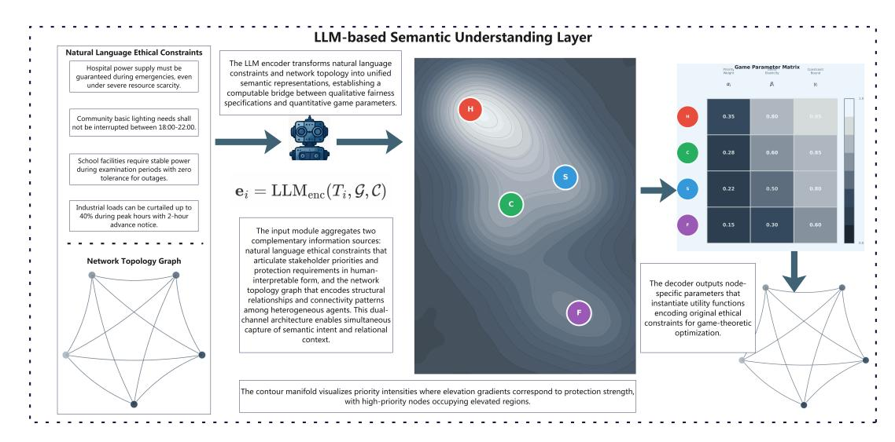
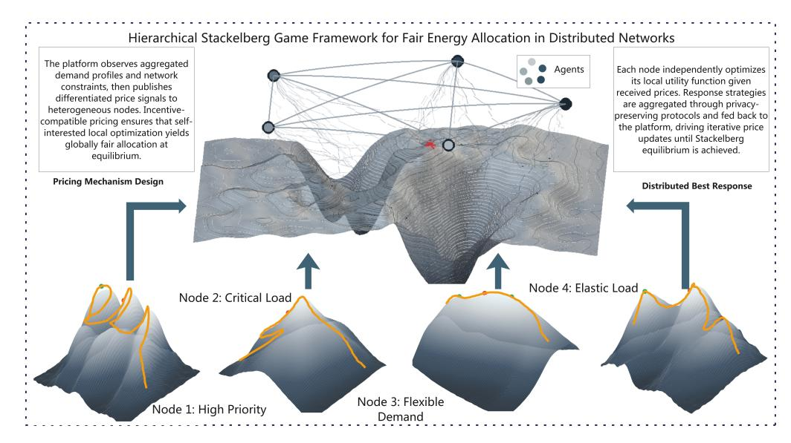
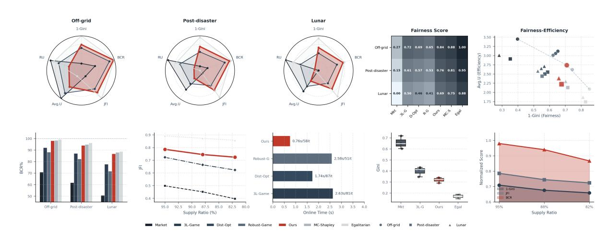

# Language-Guided Game-Theoretic Fairness in Web-Enabled Energy Networks

Wu Hao d202587187@hust.edu.cn School of Computer Science and Technology, Huazhong University of Science and Technology Wuhan, China Xiaohua (Shanghai) Internet Technology Co., Ltd Shanghai, China

Li Yuhua idcliyuhua@hust.edu.cn School of Computer Science and Technology, Huazhong University of Science and Technology Wuhan, China

Zou Yuntao zouyuntao@hust.edu.cn School of Computer Science and Technology, Huazhong University of Science and Technology Wuhan, China

[Qianqi Zhang](https://orcid.org/0009-0002-8881-9063) 2250000700@student.must.edu.mo Faculty of Innovation Engineering, Macau University of Science and Technology Macau, China

Li Ruixuan∗ rxli@hust.edu.cn School of Computer Science and Technology, Huazhong University of Science and Technology Wuhan, China

[Zeling Xu](https://orcid.org/0009-0004-3200-3860)∗ ZeligXu@ieee.org School of Engineering, The Hong Kong University of Science and Technology Kowloon, Hong Kong, China

Wei Wang∗ weiwang@mpu.edu.mo Engineering Research Centre of Applied Technology on Machine Translation and Artificial Intelligence, Macao Polytechnic University Macau, China

# Abstract

Web platforms are reshaping resource allocation in distributed energy networks globally, from off-grid communities to lunar bases. Algorithmic decision-makers face the fundamental challenge of fairly distributing scarce resources among heterogeneous stakeholders. Traditional approaches assume complete rationality with perfect information and unlimited computation, yet distributed networks only permit local observation, requiring fairness to emerge from individual strategic interactions. Centralized optimization fails due to exponential complexity, rule-based methods cannot adapt to disruptions, and existing platforms translate economic inequality into energy access inequality. Recognizing the unattainability of complete rationality necessitates bounded rationality: pursuing provably convergent satisficing solutions under incomplete information and limited computation, translating natural language ethics into computable constraints, and designing incentives so

[This work is licensed under a Creative Commons Attribution 4.0 International License.](https://creativecommons.org/licenses/by/4.0)

WWW '26, Dubai, United Arab Emirates. © 2026 Copyright held by the owner/author(s). ACM ISBN 979-8-4007-2307-0/2026/04 <https://doi.org/10.1145/3774904.3793023>

self-interested behavior satisfies fairness at equilibrium. We propose a unified semantic-game-distributed framework. Large language models map ambiguous ethical principles into game-theoretic parameters through semantic parameterization, with contrastive learning ensuring semantic consistency and temporal stability. A two-layer Stackelberg game implements incentive design: the platform signals through differentiated pricing while nodes optimize locally, enabling fairness to emerge from equilibrium. Distributed asynchronous iteration achieves global convergence through local communication, with cognitive models adaptively adjusting step sizes and differential perturbation preserving privacy. Theoretical analysis establishes equilibrium existence and convergence guarantees, while extreme scenarios validate robustness under information scarcity and high uncertainty.

# CCS Concepts

• Theory of computation → Algorithmic game theory and mechanism design; • Networks → Network algorithms; • Computing methodologies → Distributed algorithms; • Applied computing → Engineering.

# Keywords

Distributed Energy Networks, Bounded Rationality, Algorithmic Fairness, Stackelberg Game, Semantic-Mathematical Mapping

∗Corresponding Author

### ACM Reference Format:

Wu Hao, Li Yuhua, Zou Yuntao, Qianqi Zhang, Li Ruixuan, Zeling Xu, and Wei Wang. 2026. Language-Guided Game-Theoretic Fairness in Web-Enabled Energy Networks. In Proceedings of the ACM Web Conference 2026 (WWW '26), April 13–17, 2026, Dubai, United Arab Emirates. ACM, New York, NY, USA, [11](#page-10-0) pages.<https://doi.org/10.1145/3774904.3793023>

# 1 Introduction

Web platforms are reshaping global energy distribution landscapes [\[1\]](#page-8-0). Blockchain transaction protocols enable off-grid solar systems in sub-Saharan Africa to coordinate electricity in real-time across marginalized communities [\[6\]](#page-8-1), smart contract-driven peer-to-peer markets allow Caribbean island nations to prioritize hospital power supply after hurricanes, and IoT sensor networks enable future lunar bases to dynamically balance resources between life support and scientific missions [\[8\]](#page-8-2). These technological advances push an ancient ethical question to unprecedented complexity: when scarce resources must be allocated among heterogeneous stakeholders, what constitutes fairness [\[3\]](#page-8-3). The fairness criteria traditionally negotiated by human experts within small scopes must now be encoded as mathematical rules that can be automatically executed across global distributed networks [\[19\]](#page-8-4). Algorithmic unfairness cascades and amplifies through network topologies [\[7\]](#page-8-5), ultimately betraying the inclusive vision promised by the United Nations Sustainable Development Goals [\[11\]](#page-8-6).

These barriers are not technical bottlenecks that engineering optimization can overcome, but rather an ontological opposition between the complete rationality assumptions underlying traditional optimization methods and real-world decision environments. The complete rationality paradigm assumes decision-makers possess perfect information and sufficient computational power to precisely model system dynamics and solve for globally optimal strategies [\[4\]](#page-8-7). However, in distributed energy networks, nodes can only observe local states, communication suffers from delays and noise, and demand and failures are unpredictable. The joint optimization problem for hundreds of thousands of distributed nodes exceeds existing hardware capabilities, while millisecond-level response requirements prohibit exhaustive search. The deeper issue is that overall fairness cannot be obtained by solving a single optimization problem, as it must spontaneously emerge from the games of independently deciding individuals [\[13,](#page-8-8) [22\]](#page-8-9). Attempts to decompose temperature dynamics, charge evolution, power allocation, and capacity degradation into independent subproblems ignore their strong nonlinear coupling. Simon's bounded rationality theory, for which he received the Nobel Prize, reveals that real decision-makers, constrained by cognitive abilities, information costs, and computational resources, should pursue satisficing solutions rather than illusory global optima [\[14\]](#page-8-10).

The failure of existing methods stems from their attempts to patch problems within the complete rationality framework. Centralized optimization methods can achieve global optima, yet computational complexity grows exponentially with state dimensions, and concentrating all decision-making power in a single algorithmic entity raises governance risks of power concentration [\[12\]](#page-8-11). Rulebased methods circumvent complex computation through expert experience encoding, but rule spaces similarly expand exponentially, and recalibrating rule bases during dramatic environmental

changes requires weeks. Existing Web energy platforms provide technical infrastructure for distributed transactions yet fail to embed fairness guarantees at the protocol layer [\[15,](#page-8-12) [21\]](#page-8-13). While large language models can understand ethical principles expressed in natural language, their standalone use lacks mathematical guarantees of convergence and stability, and geographic biases in their training data amplify existing inequalities during global deployment [\[10\]](#page-8-14).

Since complete rationality is unattainable, system design must fundamentally shift paradigms—pursuing provably convergent satisficing solutions under real constraints. This requires systems to understand fairness definitions across multicultural contexts, automatically transforming natural language ethical principles into computable mathematical constraints [\[5\]](#page-8-15). Fairness guarantees should be embedded in the protocol stack foundation, becoming infrastructure like transport layer security protocols that ensure data security. In networks without central controllers, systems must enable individual bounded-rational games to spontaneously converge to overall fair equilibria, cleverly designing incentive mechanisms so that self-interested behavior precisely satisfies fairness constraints at equilibrium [\[9\]](#page-8-16).

The fusion of large language models and game theory provides a theoretical path for realizing the bounded rationality paradigm [\[18\]](#page-8-17). Large language models possess the capability to handle semantic ambiguity, mapping natural language constraints into geometric objects in high-dimensional semantic spaces [\[23\]](#page-8-18). The hierarchical structure of Stackelberg games naturally describes distributed coordination under information asymmetry: upper levels design incentive signals under information constraints, lower levels optimize their own objectives based on local observations, and equilibrium existence theorems guarantee convergence. Through categorytheoretic functors, semantic spaces and mathematical object spaces are unified, automating the transformation from fuzzy ethical principles to precise equilibrium conditions [\[24\]](#page-8-19).

This research contributes on three levels. Theoretically, we formalize Simon's bounded rationality philosophy into an operational mathematical framework, proving the necessary unity of semantic understanding and mathematical reasoning. Methodologically, we construct a complete path from natural language ethical principles to provably convergent equilibria. Practically, we demonstrate the framework's effectiveness in extreme validation scenarios such as lunar bases, providing algorithmic fairness guarantee mechanisms that can be embedded at the protocol stack foundation for Web4Good's protection of vulnerable groups.

# 2 Problem Definition

Consider a distributed network composed of �� heterogeneous energy nodes, each representing a stakeholder with autonomous decision-making authority. These agents exhibit heterogeneity across demand characteristics, payment capacity, and cultural background. The system connects through Web platforms with smart contracts executing allocation rules at the blockchain protocol layer, but embedding fairness at the protocol foundation rather than as post-hoc patches constitutes the core challenge.

The state of node �� is characterized by a four-tuple: available energy reserves ����(��) ∈ [0, ��max,��], time-varying demand ����(��) decomposing into basic demand �� basic and elastic demand �� flex ,

Figure 1: Semantic constraint mapping architecture

payment capacity ���� , and value type���� encoding cultural fairness interpretations. Inter-node heterogeneity renders simple mechanisms ineffective: highest-bidder auctions marginalize impoverished communities by converting economic inequality into energy access inequality, while egalitarian strategies ignore urgent needs of critical facilities like hospitals, potentially causing unnecessary loss of life post-disaster.

The system operates under three constraint categories. Physical constraints mandate that total allocation remain within generation capacity ��(��). Fairness constraints manifest as natural language ethical principles whose mathematical boundaries vary dynamically across scenarios. Incentive compatibility constraints require truthful reporting to constitute the dominant strategy.

The objective exhibits hierarchical structure: first ensuring basic needs satisfaction, then pursuing Rawlsian maximin fairness while constraining Gini coefficient, finally maximizing total social welfare. Formally, let ����(��) denote energy allocation to node ��:

max {���� } ( min �� ����(����), ∑︁ ����(����) ) s.t. ∑︁ �� ���� ≤ ��(��), ���� ≥ �� basic �� (1)

Here ���� represents node utility functions containing parameters to be extracted from ethical principles. Transforming natural language fairness constraints into mathematical parameters while maintaining semantic richness and cultural adaptability constitutes the core challenge, rooted in the ontological gap between semantic and formal spaces.

# 3 Method

# 3.1 Parameterization Mapping of Ethical Principles

Ethical principles expressed in natural language form contain rich contextual information and tacit knowledge. When an elder in an off-grid community says "guarantee basic lighting for every household," this implicitly considers differences in household size, prioritizes special needs of the elderly, young, sick and disabled, and incorporates experiential knowledge of seasonal demand fluctuations. These semantic details cannot be fully captured by predefined mathematical formulas. The breakthrough capability of large language models lies in their ability to understand such contextdependence, identify implicit constraints through commonsense reasoning acquired via pre-training, and map ambiguous ethical principles to parameterized mathematical representations.

We construct a mapping mechanism from semantic space to game-theoretic parameter space as in Fig [1.](#page-2-0) Given a natural language constraint description ��, the LLM encoder maps it to a highdimensional semantic vector �� = E (��, ��) ∈ R �� , where context �� includes current system state, historical allocation records, and node background information. The semantic vector space is equipped with a state-dependent metric structure, enabling quantification of importance differences for the same constraint across different scenarios. The principle of prioritizing hospitals post-disaster carries far lower weight during normal times than emergency states—the metric structure's dynamism captures this scenario-dependent characteristic.

Semantic vectors generate mathematical objects required by the game-theoretic framework through two pathways. The first pathway generates node-level parameters: an extraction mechanism decodes semantic encodings into weight coefficients {���� , ���� } for each node. Coefficient ���� quantifies the utility contribution of basic need satisfaction to node ��, reflecting the absolute priority of life support in that node's value system. Coefficient ���� characterizes the marginal utility of elastic demand, capturing the node's sensitivity to comfort improvements. These parameter values are automatically determined by semantic understanding—hospitals' �� significantly exceeds industrial users, embodying ethical principles' prioritized protection of the right to life. The second pathway generates system-level functions: fairness metric ��fair is synthesized according to semantic constraints. If ethical principles emphasize protecting the most disadvantaged groups, a Rawlsian minimum

utility indicator is generated. If emphasizing reduction of overall inequality, a Gini coefficient penalty term is generated. Different cultural backgrounds correspond to different metric function constructions, achieving contextual adaptation of fairness definitions.

Cross-modal alignment achieves semantic consistency through contrastive learning. The system maintains a memory bank containing historical cases, each recording ethical judgments and actual allocation decisions under specific scenarios. For semantically similar constraint descriptions, the model should generate parameter configurations leading to similar allocation outcomes. The training objective minimizes discrepancies between semantic distance and decision distance, maintaining stability in the semantic-toparameter mapping. Uncertainty is quantified through variational inference—when constraint interpretations admit multiple possibilities, the system outputs probability distributions over parameters rather than point estimates, adopting conservative strategies in subsequent optimization to avoid risks.

Temporal consistency is guaranteed through regularization mechanisms. Parameter configurations at consecutive time steps should not jump frequently, as this would cause severe oscillations in allocation strategies. The objective function incorporates a temporal smoothing term penalizing differences between adjacent time steps, with smoothing strength adaptively adjusted according to scenario change rates. During environmental stability, regularization coefficients increase to maintain policy continuity; during emergency response, coefficients decrease to allow timely adjustment. This design balances the tradeoff between response speed and stability.

The output of semantic processing constitutes the parametric foundation for the subsequent game-theoretic framework. Nodelevel parameters {���� , ���� } are directly embedded into followers' utility function definitions, encoding individual-level ethical judgments. System-level function ��fair is synthesized from global fairness constraints and serves as the leader's optimization objective. This layered design precisely maps ambiguous ethical principles to the parameter space of the game-theoretic framework, establishing the mathematical foundation for spontaneous emergence of fairness.

# 3.2 Theoretical Framework of Fair Games

Building upon the semantic mapping results from the previous section, this section constructs a bilevel Stackelberg game framework that transforms fairness from an objective into an equilibrium property as in Fig [2.](#page-4-0) The Web platform acts as leader designing price signals, while heterogeneous nodes act as followers optimizing their own utilities based on signals. The rationale for this hierarchical structure stems from information asymmetry reality. The platform can observe global supply-demand conditions but cannot know each node's true preferences and urgency levels. Nodes understand details of their own demands but lack perception of overall system state. The game framework achieves distributed coordination through incentive design, enabling self-interested individual behavior to spontaneously satisfy fairness constraints at equilibrium.

The follower-level optimization problem characterizes nodes' rational responses. Given price signal ����(��) published by the platform, node �� solves utility maximization. The utility function is directly

constructed using parameters determined by the semantic module, formalized as:

max ���� ≥0 ����(���� , ����) = ���� ·⊮{���� ≥ �� basic }+���� log(1+����/�� flex )−�������� (2)

The first term characterizes the discrete jump of basic need satisfaction through an indicator function, with coefficient ���� automatically calibrated by the semantic module according to node criticality—life-critical facilities like hospitals receive extremely high weights. The second term's logarithmic form reflects the law of diminishing marginal utility, with coefficient ���� encoding the node's sensitivity to comfort. The third term represents payment cost, with price ���� designed by the upper-level platform. The strict concavity of the logarithmic function guarantees unique optimal solutions, with nodes' optimal responses explicitly obtainable through first-order conditions.

The leader-level optimization objective is to design price vector {���� } such that followers' equilibrium responses satisfy global fairness constraints. The upper level of the bilevel problem has an objective function defined by fairness metric ��fair generated by the semantic module, with lower-level constraints being followers' equilibrium conditions and physical feasibility. The formal expression is:

min {���� } ��fair({�� ∗ �� (����)}) s.t. �� ∗ �� (����) = arg max ���� ����(���� , ����), ∑︁ �� ∗ �� ≤ �� (3)

The specific form of the fairness metric reflects the semantic content of ethical principles. If principles emphasize Rawlsian fairness, then ��fair = − min�� ���� maximizes minimum utility. If principles concern inequality levels, then ��fair = Gini({���� }) constrains the Gini coefficient. Metric functions are automatically synthesized by the semantic module under different scenarios, achieving cultural adaptation of fairness definitions.

The emergence mechanism of fairness is realized through price differentiation. If uniform pricing is adopted for all nodes, market equilibrium will favor high-payment-capacity groups. The platform corrects this bias through personalized pricing. Subsidized prices �� basic &lt; 0 are set for basic needs, ensuring even nodes with weakest payment capacity can obtain energy required for life support. Normal or even punitive high prices are adopted for portions exceeding basic needs, suppressing excessive consumption. The shape of price curves reflects current system scarcity—when total supply is abundant, flat prices encourage utilization; when approaching capacity limits, steep prices promote conservation. This dynamic pricing enables individual optimization behavior to spontaneously converge at the macroscopic level to configurations satisfying fairness constraints.

Existence of equilibrium is guaranteed by utility function concavity and constraint set compactness. The follower problem is strictly concave programming, with optimal response mapping continuous and single-valued. The feasible region of the leader problem is compact with continuous objective function—existence of optimal solutions is guaranteed by Weierstrass extreme value theorem. Uniqueness depends on convexity of the fairness metric;

Figure 3: Comprehensive performance visualization

Baseline price updates follow dual ascent rules—when total allocation Í �� �� �� �� at the ��-th iteration exceeds supply ��, prices increase to suppress overall consumption; when below supply, prices decrease to stimulate utilization. The projection operator guarantees price non-negativity. Step size ���� controls the intensity of total quantity regulation—larger steps accelerate supply-demand balance but may induce oscillations, while smaller steps are stable but converge slowly. The direction of personalized adjustment is determined by the negative gradient of fairness metric—if node ��'s utility is below system average, its price decreases to increase quota and improve fairness. Step size ���� selection is adaptively determined through Armijo backtracking line search, maximizing adjustment magnitude while guaranteeing fairness improvement.

The physical meaning of the dual pricing mechanism is clear. Baseline price acts like uniform electricity price in wholesale markets, fluctuating according to supply-demand relationships to ensure energy is neither over-consumed nor wasted idly. Personalized adjustments act like differentiated subsidy policies for special groups—critical facilities like hospitals enjoy price discounts for priority resource access, while high-consumption users bear additional fees to suppress luxury demands. The synergistic effect of both mechanisms enables the system to maintain supply-demand balance while achieving fair distribution—both are indispensable.

Convergence of the iterative protocol is guaranteed by synergistic action of two-level updates. Node-level gradient ascent makes each node tend toward local optimality given prices, while platformlevel dual regulation evolves prices toward directions satisfying constraints and improving fairness. Under conditions of strict utility function concavity and fairness metric convexity, the algorithm converges to Stackelberg equilibrium. Convergence speed depends on utility function condition number and step size sequence selection—typical scenarios achieve practical precision within dozens of iterations.

Asynchronous update mechanisms accommodate network communication heterogeneity. Different nodes have varying computational capabilities and communication quality—synchronous protocols would be dragged down by the slowest node. We allow nodes

to update at their own pace, computing immediately upon receiving price information without waiting for global synchronization signals. As long as communication delays are bounded, the algorithm still converges to optimal solutions. Platform price updates also adopt asynchronous mode, continuously adjusting based on successively arriving node state information, avoiding delays from periodic batch processing. This asynchronous mechanism enables the system to maintain partial functionality during node failures or communication interruptions, significantly enhancing robustness.

Privacy protection is achieved through differential perturbation. When nodes report allocation states to the platform, calibrated noise is added, satisfying differential privacy definitions to ensure true demands of individual nodes cannot be inferred. Noise intensity is controlled by privacy budget parameters, trading off between privacy protection and optimization precision. The smoothness of logarithmic utility functions means moderate noise causes only slight utility loss, while privacy protection benefits are significant. Noise naturally decays through averaging effects across multiple iterations, with controllable deviation of final convergence points from noise-free cases.

Cognitive models accelerate convergence by analyzing historical trajectories, with large language models identifying dynamic patterns to adaptively adjust step sizes and momentum parameters. This mechanism eliminates manual tuning while enabling automatic anomaly detection and emergency response protocols.

The framework achieves a complete closed loop from semantic understanding to distributed implementation. The first module maps ethical principles to game parameters {���� , ���� , ��fair}, the second designs incentive mechanisms through Stackelberg games enabling fairness emergence from individual optimization, and the third realizes efficient equilibrium computation under bounded rationality constraints. These interconnected modules form a unified theoretical system providing fair allocation solutions with semantic flexibility, mathematical rigor, and engineering implementability.

Table 1: Comprehensive performance comparison across scenarios

| Method      |      | Gini ↓ | Off-grid | BCR% ↑ |      | JFI M=50, ↑ |      | Avg.U ↑ | RU%  | ↑    | Gini ↓ |      | BCR% ↑ | Grid, | JFI M=100, ↑ |      | Avg.U ↑ | RU%  | ↑    | Gini ↓ |      | Lunar BCR% Base, ↑ |      | M=30, JFI ↑ |      | Avg.U ↑ | RU% ↑ |
|-------------|------|--------|----------|--------|------|-------------|------|---------|------|------|--------|------|--------|-------|--------------|------|---------|------|------|--------|------|--------------------|------|-------------|------|---------|-------|
| Market      | .602 | ± .034 | 70.8     | ± 4.6  | .498 | ± .026      | 3.45 | ± .14   | 98.6 | .648 | ± .037 | 61.7 | ± 5.3  | .451  | ± .029       | 2.91 | ± .15   | 98.8 | .718 | ± .042 | 50.7 | ± 6.5              | .396 | ± .033      | 3.01 | ± .17   | 99.0  |
| 3L-Game     | .347 | ± .026 | 92.0     | ± 3.1  | .723 | ± .021      | 3.12 | ± .11   | 97.1 | .412 | ± .030 | 87.0 | ± 3.5  | .664  | ± .024       | 2.55 | ± .12   | 96.6 | .433 | ± .034 | 77.7 | ± 4.8              | .623 | ± .028      | 2.71 | ± .14   | 96.3  |
| Dist-Opt    | .362 | ± .029 | 90.4     | ± 3.4  | .706 | ± .022      | 3.06 | ± .12   | 96.6 | .429 | ± .033 | 84.8 | ± 3.9  | .646  | ± .025       | 2.50 | ± .13   | 96.1 | .452 | ± .037 | 75.0 | ± 5.2              | .603 | ± .030      | 2.65 | ± .15   | 95.8  |
| Robust-Game | .378 | ± .031 | 88.2     | ± 3.7  | .689 | ± .024      | 3.01 | ± .11   | 96.0 | .447 | ± .035 | 82.3 | ± 4.3  | .627  | ± .026       | 2.44 | ± .14   | 95.5 | .474 | ± .039 | 71.7 | ± 5.6              | .581 | ± .031      | 2.58 | ± .16   | 95.1  |
| Ours        | .291 | ± .023 | 98.0     | ± 1.4  | .786 | ± .018      | 2.74 | ± .09   | 95.2 | .324 | ± .027 | 94.0 | ± 2.4  | .745  | ± .020       | 2.22 | ± .10   | 94.0 | .341 | ± .030 | 86.7 | ± 3.8              | .724 | ± .023      | 2.39 | ± .13   | 93.6  |
| MC-Shapley  | .256 | ± .028 | 98.4     | ± 1.2  | .816 | ± .017      | 2.62 | ± .10   | 94.6 | .284 | ± .031 | 94.8 | ± 2.2  | .778  | ± .019       | 2.13 | ± .09   | 93.4 | .298 | ± .033 | 88.0 | ± 3.5              | .758 | ± .022      | 2.30 | ± .12   | 92.9  |
| Egalitarian | .148 | ± .020 | 99.2     | ± 0.9  | .892 | ± .014      | 2.09 | ± .08   | 98.0 | .172 | ± .023 | 96.2 | ± 1.9  | .873  | ± .016       | 1.74 | ± .07   | 97.3 | .189 | ± .026 | 88.7 | ± 3.2              | .857 | ± .018      | 1.87 | ± .09   | 97.6  |

# 4 Experimental Validation

### 4.1 Experimental Setup

Validation scenarios comprise three networks: an off-grid community in sub-Saharan Africa with 50 nodes and 95% supply ratio, a post-disaster Caribbean grid with 100 nodes and 88% supply, and a lunar base with 30 modules and 82% supply. Node storage capacity follows ��max,�� ∼ �� (5, 10) kWh with basic-to-flexible demand ratio �� basic /�� flex ∼ �� (0.3, 0.7).

Implementation employs GPT-4-0613 with temperature 0.3 and batch prompting reducing API calls to 4–6 per scenario. Algorithm parameters include convergence threshold ∥�� ��+1 − �� �� ∥2 &lt; 10−4 and step size ���� = 0.1/(�� + 10) 0.6 . Each scenario runs 10 trials with significance assessed at �� &lt; 0.05.

Baselines include 3L-Game [\[17\]](#page-8-20) using Stackelberg-Nash architecture, MC-Shapley [\[20\]](#page-8-21) with ��(��2 ��) complexity, Dist-Opt [\[16\]](#page-8-22) employing PSO-nested-ADMM, and Robust-Game [\[2\]](#page-8-23) combining distributionally robust optimization with bilevel games. Market mechanism and Egalitarian allocation establish theoretical boundaries.

Metrics evaluate fairness through Gini coefficient, basic need coverage rate BCR, and Jain's fairness index JFI, with efficiency measured by average utility and resource utilization RU.

### 4.2 Experimental Results

Table [1](#page-6-0) presents comprehensive performance across scenarios. Basic needs constitute 40% to 60% of total node demand varying by node type, with basic demand averaging approximately 50% of ideal demand. In the off-grid scenario with 95% supply, total resources theoretically suffice to satisfy nearly all nodes. The BCR gap from 100% arises from physical constraints where certain nodes have storage capacity below their basic demand requirements, making full satisfaction infeasible regardless of allocation strategy.

Our method achieves Gini coefficient 0.291, BCR 98.0%, and average utility 2.74 in the off-grid scenario. The market mechanism obtains highest average utility 3.45 but BCR only 70.8% with Gini coefficient 0.602, demonstrating severe inequity. MC-Shapley achieves lower Gini of 0.256 and higher BCR of 98.4% through nearoptimal Shapley value computation. However, as shown in Table [2,](#page-6-1) MC-Shapley requires 102.7s for 50 nodes and 427.5s for 100 nodes, making it unsuitable for real-time trading requiring sub-second decisions. Our method achieves comparable fairness within 14% of MC-Shapley's Gini while reducing online computation time by over 99%.

Increasing resource scarcity degrades performance across all methods. The market mechanism achieves only 50.7% BCR in the lunar scenario while our method maintains 86.7%. Our method experiences approximately 12% to 14% utility loss relative to 3L-Game, reflecting the fundamental fairness-efficiency tradeoff. No method achieves 100% BCR when supply drops to 82% due to fundamental resource insufficiency.

Table 2: Computational efficiency comparison

| Scenario Method    |     | Iters    | GPT-4s     | Online s | Comm. | ��   |
|--------------------|-----|----------|------------|----------|-------|------|
| Off-grid Ours      | 58  | ± 8 48.3 | ± 5.2 0.76 | ± 0.14   | 58    | 0.85 |
| M=50 3L-Game       | 81  | ± 11     | 2.63       | ± 0.24   | 159   | 0.89 |
| Dist-Opt           | 87  | ± 13     | 1.74       | ± 0.21   | 87    | 0.90 |
| Robust-Game        | 51  | ± 7      | 2.58       | ± 0.22   | 98    | 0.83 |
| MC-Shapley         |     |          | 102.7      | ± 7.8    |       |      |
| Post-disaster Ours | 71  | ± 9 87.6 | ± 8.1 1.68 | ± 0.22   | 71    | 0.87 |
| M=100 3L-Game      | 97  | ± 14     | 5.94       | ± 0.38   | 191   | 0.91 |
| Dist-Opt           | 106 | ± 16     | 4.28       | ± 0.33   | 106   | 0.91 |
| Robust-Game        | 62  | ± 8      | 6.31       | ± 0.35   | 121   | 0.85 |
| MC-Shapley         |     |          | 427.5      | ± 21.3   |       |      |
| Lunar Ours         | 63  | ± 7 32.7 | ± 3.8 0.58 | ± 0.10   | 63    | 0.86 |
| M=30 3L-Game       | 74  | ± 10     | 2.04       | ± 0.19   | 143   | 0.88 |
| Dist-Opt           | 79  | ± 11     | 1.31       | ± 0.16   | 79    | 0.88 |
| Robust-Game        | 47  | ± 6      | 2.08       | ± 0.18   | 89    | 0.82 |
| MC-Shapley         |     |          | 38.4       | ± 2.9    |       |      |

Table [2](#page-6-1) presents computational efficiency with offline preprocessing and online optimization time clearly distinguished. GPT-4 parameter generation serves as offline preprocessing that can be cached and reused across multiple optimization runs. The convergence rate �� characterizes exponential decay where ∥�� �� − �� ∗ ∥ ≈ ��·�� �� with smaller values indicating faster convergence. Our method achieves convergence rates of 0.85 to 0.87, outperforming 3L-Game and Dist-Opt which range from 0.88 to 0.91. Robust-Game exhibits faster per-iteration convergence due to conservative updates that prevent oscillation, though its bilevel structure requires more computation per iteration.

Communication rounds for hierarchical methods like 3L-Game and Robust-Game exceed twice their iteration counts due to separate leader-follower and follower-follower exchanges, with variance arising from asynchronous timing effects. Scalability tests show that as node scale increases from 10 to 800, our method's online time grows from 0.15s to 12.8s exhibiting subquadratic growth of ��(��1.15), significantly outperforming centralized methods' ��(��4 ) complexity.

Table [3](#page-7-0) validates each module's contribution. Removing the semantic module causes significant fairness degradation with Gini increasing from 0.291 to 0.382 and requires 16% more iterations due to coarser parameter initialization from type-based defaults.

Table 3: Ablation study results in off-grid scenario

|        |           |       | Gini ↓  |      | BCR% ↑ |      | Avg.U ↑ |     | Iters |      | Online s |
|--------|-----------|-------|---------|------|--------|------|---------|-----|-------|------|----------|
| Full   | Framework | 0.291 | ± 0.023 | 98.0 | ± 1.4  | 2.74 | ± 0.09  | 58  | ± 8   | 0.76 | ± 0.14   |
| w/o    | Semantic  | 0.382 | ± 0.031 | 88.6 | ± 3.6  | 2.66 | ± 0.11  | 67  | ± 10  | 0.87 | ± 0.16   |
| w/o    | Cognitive | 0.295 | ± 0.024 | 97.6 | ± 1.6  | 2.73 | ± 0.09  | 108 | ± 14  | 1.41 | ± 0.21   |
| Single | Nash      | 0.463 | ± 0.037 | 81.2 | ± 4.5  | 2.82 | ± 0.13  | 65  | ± 9   | 0.84 | ± 0.15   |

Removing cognitive acceleration nearly doubles iteration count from 58 to 108 while maintaining similar final performance, confirming its role in convergence speedup rather than solution quality. Replacing the Stackelberg bilevel structure with single-level Nash equilibrium causes Gini to increase to 0.463 and BCR to drop to 81.2%, demonstrating the essential role of hierarchical incentive design.

Table 4: System response under different ethical principles

Table [4](#page-7-1) demonstrates scenario adaptability under different ethical principles. Under the maximize worst-off principle, the semantic module increases weights for vulnerable nodes, achieving highest minimum utility of 1.61 while slightly increasing Gini to 0.312. This apparent paradox reflects that maximizing the worst-off node may require concentrating resources on the most disadvantaged, creating visible inequality even while improving their absolute welfare. The reduce inequality principle compresses weight distributions, achieving lowest Gini of 0.258 while accepting lower minimum utility of 1.34.

Table 5: Robustness test results in off-grid scenario

Table [5](#page-7-2) presents robustness under perturbations. Supply failure reduces effective supply from 95% to 76% of ideal demand. Our method maintains 90.6% BCR through rapid price signal adjustment prioritizing critical nodes, while 3L-Game drops to 82.8% due to slower re-equilibration. Under demand perturbations, our method exhibits lower variance in both Gini and utility metrics, demonstrating superior stability.

Incentive compatibility verification shows that when nodes misreport demand as ��ˆ �� = ������ with �� ∈ {0.8, 0.9, 1.0, 1.1, 1.2}, corresponding average utilities are {2.56, 2.65, 2.74, 2.66, 2.59}. Truthful reporting achieves highest utility with statistically significant margins confirmed by paired t-tests with Bonferroni correction yielding �� &lt; 0.01 for all comparisons against �� = 1.0.

### 5 Discussion

The method's superiority stems from synergy among three key innovations. Unified semantic understanding and mathematical reasoning enables LLMs to automatically map ethical principles to game parameters, avoiding combinatorial explosion in traditional methods and requiring only natural language updates for new principles. The two-tier Stackelberg architecture fits distributed networks' information asymmetry, with platforms sending incentive signals through differential pricing while nodes optimize based on local information, allowing fairness to emerge from equilibrium. Cognitive acceleration mechanisms dynamically adjust parameters by analyzing convergence trajectories, significantly reducing iterations and ensuring rapid response during environmental upheavals.

For industry, this research provides fairness guarantee mechanisms embeddable in Web platform protocol stacks. Blockchain energy trading platforms can integrate the framework into smart contract layers, making fairness a foundational property. Parameter caching amortizes preprocessing latency to milliseconds, meeting real-time trading demands. The framework supports cross-cultural fairness definition adaptation, providing foundations for localized deployment of globalized platforms. For academia, this research first formalizes Simon's bounded rationality into an operational mathematical framework, proving complementarity between cognitive intelligence and mathematical reasoning. The semantic-to-gameparameter mapping constructs a cross-modal knowledge fusion bridge, generalizable to medical resource allocation, emergency response, and other ethical optimization problems.

The framework faces challenges including LLM non-interpretability complicating decision logic tracing, API dependency introducing single-point failure risks, and fundamental fairness disagreements among nodes requiring social choice theory. Future work will focus on interpretable neural-symbolic reasoning, federated learning for privacy-preserving model improvement, and multi-scale evolutionary models capturing fairness preference dynamics.

### 6 Conclusion

This research formalizes Simon's bounded rationality into an algorithmic fairness framework for distributed energy networks. The core contribution lies in using large language models to map natural language ethical principles into game-theoretic parameters, enabling fairness to emerge from Stackelberg equilibria under local information constraints. The three-layer architecture integrates semantic parameterization, bilevel game design, and distributed iteration. Validation across extreme scenarios demonstrates robust basic needs satisfaction under severe resource scarcity. This paradigm provides embeddable solutions for Web4Good algorithmic fairness and opens pathways for AI-optimization fusion.

# Funding

This work is supported by the National Key Research and Development Program of China under grant 2024YFC3307900; the National Natural Science Foundation of China under grants 62436003, 62376103 and 62302184; Major Science and Technology Project of Hubei Province under grant 2025BAB011 and 2024BAA008; Hubei Science and Technology Talent Service Project under grant 2024DJC078; and AntGroup through CCF-Ant Research Fund.

- References [1] Merlinda Andoni, Valentin Robu, David Flynn, Simone Abram, Dale Geach, David Jenkins, Peter McCallum, and Andrew Peacock. 2019. Blockchain technology in the energy sector: A systematic review of challenges and opportunities. Renewable and sustainable energy reviews 100 (2019), 143–174. [2] Pengcheng Cai, Yang Mi, Siyuan Ma, Hongzhong Li, Dongdong Li, and Peng Wang. 2023. Hierarchical game for integrated energy system and electricityhydrogen hybrid charging station under distributionally robust optimization. Energy 283 (2023), 128471. [3] Irene Chen, Fredrik D Johansson, and David Sontag. 2018. Why is my classifier discriminatory? Advances in neural information processing systems 31 (2018). [4] John Conlisk. 1996. Why bounded rationality? Journal of economic literature 34, 2 (1996), 669–700. [5] Lorenzo Di Lucia, Raphael Slade, and Jamil Khan. 2022. Decision-making fitness of methods to understand Sustainable Development Goal interactions. Nature Sustainability 5, 2 (2022), 131–138. [6] Ayman Esmat, Martijn de Vos, Yashar Ghiassi-Farrokhfal, Peter Palensky, and Dick Epema. 2021. A novel decentralized platform for peer-to-peer energy trading market with blockchain technology. Applied Energy 282 (2021), 116123. [7] Agata Foryciarz, Stephen R Pfohl, Birju Patel, and Nigam Shah. 2022. Evaluating algorithmic fairness in the presence of clinical guidelines: the case of atherosclerotic cardiovascular disease risk estimation. BMJ Health & Care Informatics 29, 1 (2022), e100460. [8] Jeffrey M Gordon. 2022. Uninterrupted photovoltaic power for lunar colonization without the need for storage. Renewable Energy 187 (2022), 987–994. [9] Bingyun Li, Qinmin Yang, and Innocent Kamwa. 2023. A novel Stackelberg-gamebased energy storage sharing scheme under demand charge. IEEE/CAA Journal of Automatica Sinica 10, 2 (2023), 462–473. [10] Sasha Luccioni, Yacine Jernite, and Emma Strubell. 2024. Power hungry processing: Watts driving the cost of AI deployment?. In Proceedings of the 2024 ACM conference on fairness, accountability, and transparency. 85–99. [11] David L McCollum, Wenji Zhou, Christoph Bertram, Harmen-Sytze De Boer, Valentina Bosetti, Sebastian Busch, Jacques Després, Laurent Drouet, Johannes Emmerling, Marianne Fay, et al. 2018. Energy investment needs for fulfilling the Paris Agreement and achieving the Sustainable Development Goals. Nature Energy 3, 7 (2018), 589–599. [12] Daniel K Molzahn, Florian Dörfler, Henrik Sandberg, Steven H Low, Sambuddha Chakrabarti, Ross Baldick, and Javad Lavaei. 2017. A survey of distributed optimization and control algorithms for electric power systems. IEEE Transactions on Smart Grid 8, 6 (2017), 2941–2962. [13] Mohadese Movahednia, Hamid Karimi, and Shahram Jadid. 2022. A cooperative game approach for energy management of interconnected microgrids. Electric Power Systems Research 213 (2022), 108772. [14] Herbert A Simon. 1955. A behavioral model of rational choice. The quarterly journal of economics (1955), 99–118. [15] Lee Thomas, Yue Zhou, Chao Long, Jianzhong Wu, and Nick Jenkins. 2019. A general form of smart contract for decentralized energy systems management. Nature Energy 4, 2 (2019), 140–149. [16] Haiyang Wang, Chenghui Zhang, Ke Li, Shuai Liu, Shuzhen Li, and Yu Wang. 2021. Distributed coordinative transaction of a community integrated energy system based on a tri-level game model. Applied Energy 295 (2021), 116972. [17] Yi Yan, Mingqi Liu, Chongyi Tian, Ji Li, and Ke Li. 2024. Multi-layer game theory based operation optimisation of ICES considering improved independent market participant models and dedicated distributed algorithms. Applied Energy 373 (2024), 123691. [18] Jenny Yang, Andrew AS Soltan, David W Eyre, and David A Clifton. 2023. Algorithmic fairness and bias mitigation for clinical machine learning with deep reinforcement learning. Nature Machine Intelligence 5, 8 (2023), 884–894. [19] Qiang Yang, Yang Liu, Tianjian Chen, and Yongxin Tong. 2019. Federated machine learning: Concept and applications. ACM Transactions on Intelligent Systems and Technology (TIST) 10, 2 (2019), 1–19. [20] Yu Yang, Guoqiang Hu, and Costas J Spanos. 2021. Optimal sharing and fair cost allocation of community energy storage. IEEE Transactions on Smart Grid 12, 5 (2021), 4185–4194. [21] Yuntao Zou, Zihui Lin, Qianqi Zhang, Zhichun Liu, and Zeling Xu. 2026. Exploration-guided adaptive learning from mixed-quality data for satellite multibattery management. Journal of Energy Storage 150 (2026), 120546. [22] Yuntao Zou, Zihui Lin, Qianqi Zhang, Zhichun Liu, and Zeling Xu. 2026. Large language models enable semantic-guided hierarchical games for intelligent battery coordination. Advanced Engineering Informatics 71 (2026), 104312. [23] Yuntao Zou, Zeling Xu, Tingting Wang, Gang Xiong, Zihui Lin, and Dagang
  - Li. 2025. Generative ai-driven dynamic information prioritization for enhanced autonomous driving. IEEE Transactions on Intelligent Transportation Systems (2025). [24] Yuntao Zou, Zeling Xu, Qianqi Zhang, Zihui Lin, Tingting Wang, Zhichun Liu, and Dagang Li. 2025. Few-Shot Learning With Manifold-Enhanced LLM for Handling Anomalous Perception Inputs in Autonomous Driving. IEEE Transactions on Intelligent Transportation Systems (2025).

Table 8: Convergence dynamics in off-grid scenario

| Method      |    | �� 95 | Monotonicity | Oscillation | Δ Gini | AUC  |
|-------------|----|-------|--------------|-------------|--------|------|
| Ours        | 54 | ± 5   | 0.938        | 0.019       | 0.311  | 14.8 |
| 3L-Game     | 77 | ± 7   | 0.867        | 0.036       | 0.255  | 22.3 |
| Dist-Opt    | 84 | ± 8   | 0.851        | 0.041       | 0.240  | 24.6 |
| Robust-Game | 48 | ± 5   | 0.908        | 0.023       | 0.224  | 13.4 |

error ��(1), the rate satisfies �� ≈ (10−4 ) 1/�� . The 95% convergence time ��95 measures iterations to reach 95% of final improvement as

��95 = min{�� : |Gini�� − Gini∞| &lt; 0.05|Gini0 − Gini∞|} (19)

Supply failure response tests performance degradation after removing 20% of generation capacity. In the off-grid scenario this reduces effective supply from 95% to 76% of ideal demand. Demand perturbation sensitivity tests by superimposing 20% Gaussian noise �� ′ �� = ����(1 + 0.2��) where �� ∼ N (0, 1).

# B.2 Convergence Rate Verification

Table 6: Convergence rate verification

| Scenario      | Method      | Iterations �� | Reported �� | Theoretical �� |
|---------------|-------------|---------------|-------------|----------------|
| Off-grid      | Ours        | 58            | 0.85        | 0.852          |
|               | 3L-Game     | 81            | 0.89        | 0.893          |
|               | Dist-Opt    | 87            | 0.90        | 0.900          |
|               | Robust-Game | 51            | 0.83        | 0.835          |
| Post-disaster | Ours        | 71            | 0.87        | 0.876          |
|               | 3L-Game     | 97            | 0.91        | 0.908          |
|               | Dist-Opt    | 106           | 0.91        | 0.915          |
|               | Robust-Game | 62            | 0.85        | 0.860          |
| Lunar         | Ours        | 63            | 0.86        | 0.865          |
|               | 3L-Game     | 74            | 0.88        | 0.880          |
|               | Dist-Opt    | 79            | 0.88        | 0.887          |
|               | Robust-Game | 47            | 0.82        | 0.820          |

Table [6](#page-10-1) verifies mathematical consistency between reported iterations and convergence rates. For convergence threshold �� = 10−4 , the theoretical relationship yields �� = (10−4 ) 1/�� . All reported rates match theoretical predictions within rounding precision, confirming mathematical consistency. Minor discrepancies arise from averaging across 10 trials where individual runs exhibit slight variation in iteration counts.

# B.3 BCR Analysis Under Resource Constraints

Table 7: BCR analysis under varying supply constraints

| Scenario      |             | Supply/Basic | Ratio Ours BCR | Egalitarian BCR |             | Limiting Factor |
|---------------|-------------|--------------|----------------|-----------------|-------------|-----------------|
| Off-grid      | 95%         | 1.90         | 98.0%          | 99.2%           | Node        | capacity        |
| Post-disaster | 88%         | 1.76         | 94.0%          | 96.2%           | Partial     | scarcity        |
| Lunar         | 82%         | 1.64         | 86.7%          | 88.7%           | Fundamental | shortage        |
| After         | 20% failure | 1.52         | 90.6%          | 92.4%           | Supply      | constraint      |

Table [7](#page-10-2) analyzes BCR behavior across supply levels. Basic needs average 50% of ideal demand, so the supply to basic need ratio determines theoretical BCR ceiling. In the off-grid scenario with ratio 1.90, resources theoretically suffice for all nodes. The BCR gap from 100% arises from nodes whose storage capacity ��max,�� falls below their basic demand �� basic �� , making full satisfaction physically infeasible. After 20% supply failure, effective supply drops to 76% reducing the ratio to 1.52 and causing BCR to decline accordingly.

### B.4 Convergence Dynamics

Table [8](#page-10-3) quantifies convergence dynamics. All methods initialize from Market equilibrium with Gini approximately 0.602, providing consistent baseline for measuring improvement ΔGini = Gini0 − Gini∗ . Our method achieves 30% faster convergence with ��95 = 54 compared to 77 and 84 for 3L-Game and Dist-Opt. Higher monotonicity of 0.938 and minimal oscillation of 0.019 indicate stable convergence without significant backtracking. Lower AUC of 14.8 versus 22.3 and 24.6 indicates less cumulative unfairness during optimization. Robust-Game achieves fast ��95 of 48 due to conservative updates preventing oscillation, though final fairness improvement ΔGini of 0.224 is smaller than our method's 0.311.

### B.5 Semantic Consistency Validation

Table 9: Semantic consistency under varied expressions

Table [9](#page-10-4) validates semantic robustness through parameter stability tests under semantically equivalent expressions. Consistency is quantified via coefficient of variation CV and allocation similarity measured by cosine similarity between resulting allocations. Clear principles achieve high consistency exceeding 0.96 with low variation below 0.12. Ambiguous constraints exhibit high uncertainty scores of 0.93 on the zero to one scale, triggering conservative parameter adjustments that widen confidence intervals and adopt risk-averse allocation strategies.

### B.6 Ablation Configuration Specifications

The full framework includes semantic module with GPT-4, cognitive acceleration, Stackelberg game, and parameter caching. The configuration without semantic module replaces LLM-generated parameters with type-based defaults where ���� ∈ {3.0, 2.0, 1.5, 1.0} for hospitals, schools, community centers, and residences respectively with uniform ���� = 1.0. The configuration without cognitive acceleration uses fixed Robbins-Monro step size ���� = 0.1/(��+10) 0.6 without adaptive adjustment based on convergence trajectory analysis. Single Nash replaces the Stackelberg bilevel structure with single-level Nash equilibrium eliminating the leader-follower hierarchy and differentiated pricing mechanism.

The iteration increase without the semantic module reflects coarser initialization from type-based defaults, requiring additional iterations to discover appropriate allocation patterns.