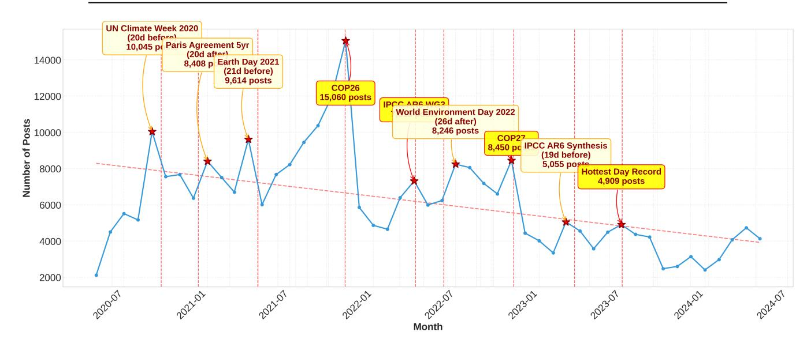
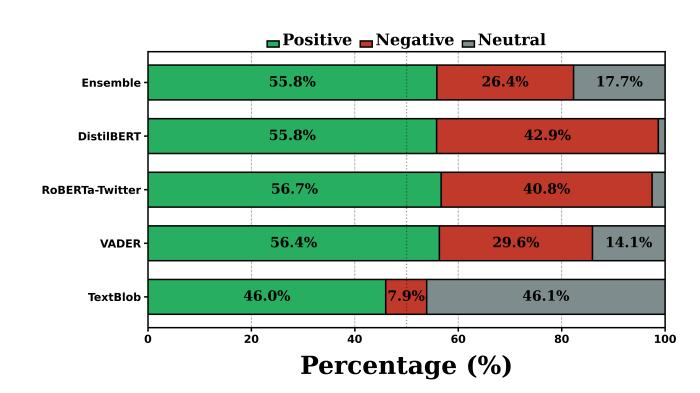
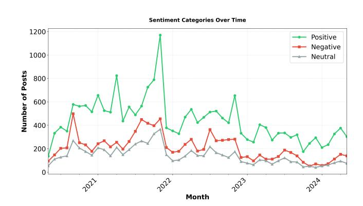
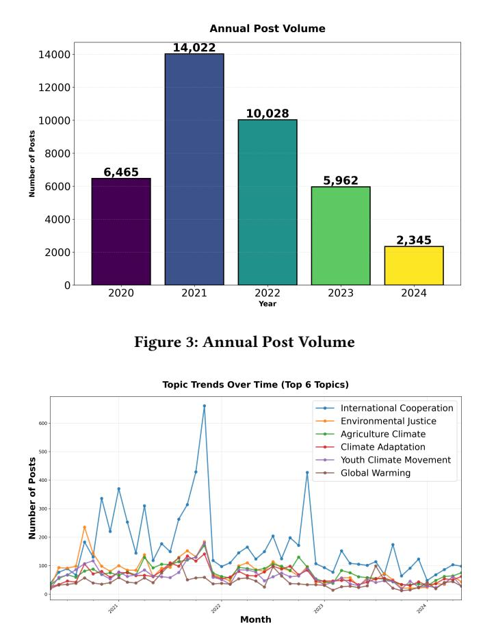

# Longitudinal Trends in Global Climate Change Discourse on Facebook

[Md. Rafiul Biswas](https://orcid.org/0000-0002-5145-1990) Hamad Bin Khalifa University Doha, Qatar mbiswas@hbku.edu.qa

[Mabrouka Bessghaier](https://orcid.org/0000-0002-1612-9736) Northwestern University in Qatar Doha, Qatar mabrouka.bessghaier@northwestern.edu [Shimaa Ibrahim](https://orcid.org/0000-0003-4014-8424) Northwestern University in Qatar Doha, Qatar shimaa.ibrahim@northwestern.edu

[George Mikros](https://orcid.org/0000-0002-4093-5973) Hamad Bin Khalifa University Doha, Qatar GMikros@hbku.edu.qa

[Wajdi Zaghouani](https://orcid.org/0000-0003-1521-5568) Northwestern University in Qatar Doha, Qatar wajdi.zaghouani@northwestern.edu

# Abstract

Climate change discourse on social media plays a major role in shaping public engagement, the spread of misinformation, and policy advocacy. We analyze 299,329 climate-related public Facebook posts collected from 26,731 pages between May 2020 and May 2024. Using a stratified sample of 50,000 posts, we examine topic prevalence, sentiment, stance, and engagement through transformer-based models, ensemble sentiment analysis, and LLM-assisted topic labeling. We identify 15 recurring climate topics, with International Cooperation, Environmental Justice, and Agriculture Climate dominating discourse. Posting activity and sentiment exhibit strong event-driven dynamics, with pronounced spikes around major milestones such as COP26, COP27, and IPCC report releases. Overall sentiment is predominantly positive (55.8%), particularly for solution-oriented topics, while impact-focused topics display higher negative sentiment. Stance analysis reveals a dominant neutral positioning (90.1%) and limited explicit opposition, suggesting an assumed-consensus environment within climate-focused Facebook spaces. Posting activity is heavily concentrated in English-speaking countries, with the United States accounting for 43% of pages, followed by Australia, the United Kingdom, and India. Finally, sentiment patterns significantly predict engagement, with emotionally charged content attracting higher interaction levels. Together, these findings highlight how emotional framing, institutional influence, and geographic disparities shape climate communication on Facebook.

#### CCS Concepts

- Information systems → Information systems applications;
- Human-centered computing → Visualization systems and tools.

# Keywords

climate change, climate discourse, renewable energy, global warming, sentiment

#### ACM Reference Format:

Md. Rafiul Biswas, Mabrouka Bessghaier, Shimaa Ibrahim, George Mikros, and Wajdi Zaghouani. 2026. Longitudinal Trends in Global Climate Change

[This work is licensed under a Creative Commons Attribution 4.0 International License.](https://creativecommons.org/licenses/by/4.0) WWW '26, Dubai, United Arab Emirates

© 2026 Copyright held by the owner/author(s). ACM ISBN 979-8-4007-2307-0/2026/04 <https://doi.org/10.1145/3774904.3793026>

Discourse on Facebook. In Proceedings of the ACM Web Conference 2026 (WWW '26), April 13–17, 2026, Dubai, United Arab Emirates. ACM, New York, NY, USA, [9](#page-8-0) pages.<https://doi.org/10.1145/3774904.3793026>

# 1 Introduction

Climate change represents one of the most critical environmental challenges of the 21st century. Online platforms increasingly mediate how climate information is framed, contested, and amplified, often via engagement-driven dynamics. Public understanding of climate issues, governmental responses, and individual behavioral changes are all strongly influenced by how the media frames and presents climate topics [\[6,](#page-7-0) [39\]](#page-8-1). In recent years, social media platforms have become central spaces for disseminating, contesting, and engaging with climate-related information [\[29\]](#page-8-2). As these digital environments increasingly can shape policy discourse and public priorities, analyzing climate change conversations on social media has become a vital research focus [\[30,](#page-8-3) [37\]](#page-8-4). Studies now span multiple platforms—including Twitter, Facebook, Reddit, and blogs—reflecting the growing academic attention to online climate discourse [\[15,](#page-7-1) [24,](#page-8-5) [33\]](#page-8-6). Yet, despite this expanding body of research, public debate around climate change remains polarized, often driven more by political and social divisions than by scientific consensus [\[9\]](#page-7-2). Addressing this communication divide requires more than technological innovation; it demands a deeper understanding of how people think, talk, and act in shaping the planet's future.

Given the influential role of social media in the climate change debate, analyzing social media data offers valuable insights into public behavior and opinion. Prior work has demonstrated that social media data can reveal people's motivations and attitudes toward climate issues, as well as help identify which narratives and sources resonate in the public sphere, including those that propagate misinformation. [\[30\]](#page-8-3). Despite the importance of Facebook and other social platforms in climate change communication, there is a notable gap in accessible data and research focus for certain platforms with research disproportionately focused on Twitter[\[30,](#page-8-3) [31\]](#page-8-7). Far fewer studies have examined climate conversations on Facebook [\[13\]](#page-7-3) in part because Facebook's data are more difficult to obtain due to privacy restrictions and API limitations. On Twitter, the publicly available "Climate Change Twitter Dataset" [\[11\]](#page-7-4) offers one of the most comprehensive corpora of public opinion on climate change via tweets. Research on Reddit has further extended the platform

spectrum. Most climate communication datasets remain problematically small—typically containing only 1,000-10,000 samples, which limits robust longitudinal and cross-context discourse analysis, and constrains model reliability/generalization. [\[22,](#page-8-8) [25\]](#page-8-9).

Facebook presents unique characteristics for climate discourse that differ substantially from Twitter's expert discussions [\[23,](#page-8-10) [32\]](#page-8-11). Recent research demonstrates that Facebook exhibits declining average engagement with climate content over time, higher engagement with unreliable sources compared to reliable ones, and distinct demographic patterns with older user bases that may respond differently to climate messaging [\[33\]](#page-8-6). Platform-specific analysis reveals that Facebook demonstrates the strongest absolute engagement increases during major climate events (from 16.7M to 39M interactions during Climate Action Week), yet methodological frameworks tailored to Facebook's unique features remain critically underdeveloped [\[32\]](#page-8-11).

This study addresses the following research questions regarding climate change discourse on Facebook:

RQ1: What are the primary topics of climate-related discourse on Facebook?

RQ2: How do sentiment and topic relate to engagement?

RQ3: How does this sentiment-topic-engagement relationship persist consistently over the longitudinal period?

# 2 Related Works

Research on climate-change discourse within social media has gained considerable attention in recent years, spanning platforms such as Twitter, Facebook, Reddit, and blogs. Early foundational work emphasizes the shift from traditional media to interactive, user-generated content: for example, an overview of climate communication platforms highlights how Facebook, Twitter, YouTube, and even Sina Weibo contribute to global awareness of climate issues [\[10\]](#page-7-5). More recently, Sultana et al. [\[33\]](#page-8-6) provide a systematic review of 1,057 studies linking climate change and social media, concluding that most empirical work is platform-specific, dominated by Twitter, and often limited to short time windows or single countries. Collectively, this work shows climate discourse is event-sensitive and politically mediated, but platform differences (e.g., Page-centric ecosystems and feed ranking on Facebook) limit direct transfer of findings. Complementing descriptive discourse analyses, adjacent work in fact-checking has also released resources that explicitly include climate-change content in a multilingual and multimodal setting, supporting the study of verifiable claims and check-worthy statements in climate-related conversations [\[3\]](#page-7-6).

Twitter has attracted the largest share of empirical research. Effrosynidis et al. [\[11\]](#page-7-4) introduce the Climate Change Twitter Dataset, a public corpus of more than 15 million geolocated tweets spanning 13 years and enriched with stance, sentiment, aggressiveness, topic labels, temperature deviations, and disaster information. Building on this resource, the same authors analyze seven aspects of climate discourse (stance, sentiment, aggressiveness, temperature, gender, topics, disasters) and their interactions, revealing geographical patterns in climate denial, correlations between sentiment and

temperature anomalies, and the politicization of climate conversations [\[11\]](#page-7-4). Other Twitter-based work applies topic modelling and deep learning to the same dataset to identify public concerns and sentiment categories [\[35\]](#page-8-12), or studies climate action sentiment using VADER, TextBlob and BERT on hashtag samples [\[26\]](#page-8-13).

Compared with Twitter, Facebook has been less studied despite its large user base. Deo and Prasad [\[9\]](#page-7-2) analyze user insights from the Global Climate Change Awareness fan page over two years, showing that visibility and emotional framing, especially disasterrelated posts evoking sadness or precaution, drive higher engagement. Hart et al. [\[14\]](#page-7-7) examine how 21 leading environmental organizations frame climate change on Facebook. These studies, however, are typically limited to one or a small number of pages rather than a broad cross-section of climate-related Facebook content. Related work has also begun to develop multi-dimensional annotated Facebook corpora (e.g., jointly labeling stance, sentiment, and emotion in public-page comments), illustrating the feasibility and value of modeling positioning and affect together in Facebook discussions [\[19\]](#page-8-14).

Our work contributes to this literature by focusing on a largescale, multi-page Facebook corpus of 300,000 climate-related posts from diverse countries. In contrast to prior Facebook studies that typically examine a single page or a small set of NGOs [\[9,](#page-7-2) [14\]](#page-7-7), we jointly model topics, sentiment, and engagement across a broad slice of climate discourse. Relative to Twitter-based datasets such as Effrosynidis et al. [\[11,](#page-7-4) [12\]](#page-7-8), our study centre-stages Facebook as a still underexplored platform, emphasizing institutional actors (news outlets, governments, NGOs) and cross-national disparities in climate communication.Finally, tool-oriented efforts for largescale social media monitoring and analysis further underline the broader push toward integrated pipelines that can support multidimensional analysis at scale (e.g., sentiment and emotion alongside other analytic layers) [\[5\]](#page-7-9).

# 3 Dataset Description

# 3.1 Data Collection

We collected public Facebook Page posts related to climate discourse using the CrowdTangle API [\[7\]](#page-7-10), which provides access to engagement data from public content on Facebook. The data collection procedure is summarized below to highlight the scope, scale, and characteristics of the dataset.

- Platform: Public Facebook Pages only.
- Search Keywords: Climate-related terms specified in the English language, including "climate change," "global warming," "sustainability," and "environment". Additional keywords related to climate policy, and social movements were included to ensure broad topical coverage.
- Language: English only, as all query terms were defined in English.
- Time Span: A four-year period from 17 May 2020 to 16 May 2024, capturing major global events such as the United Nations Climate Change Conferences (e.g., COP28).
- Initial Data Points: 299,329 public climate-related posts prior to filtering and sampling.
- Data Modality: Multimodal content, including textual post content, image URLs, and video URLs.

- Metadata Collected: 41 metadata including post timestamps, page-level information, and engagement metrics such as likes, shares, comments, and reactions.
- Source Diversity: Posts were collected from 26,731 unique Facebook Pages.

#### 3.2 Dataset Overview

The resulting dataset offers a four-year longitudinal perspective on climate discourse, enabling the analysis of both short-term dynamics and longer-term shifts in public conversation surrounding climate change. Table [1](#page-3-0) summarizes the geographic, linguistic, and categorical distribution of 299,300 climate change-related Facebook posts. The dataset exhibits strong concentration in Englishspeaking Western countries, with the United States (43.31%), Australia (7.49%), and the United Kingdom (7.47%) accounting for over half of all posts, while English language posts comprise 92.24% of the total. Content sources span diverse page categories, with media and news companies (16.71%), non-profit organizations (10.03%), and government entities (9.55%) representing the primary contributors. This distribution reflects the dominance of institutional actors and Western media organizations in shaping online climate discourse, though notable contributions from Global South countries such as India, Philippines, and Kenya indicate emerging participation in global climate conversations.

Figure [1](#page-3-1) illustrates the longitudinal distribution of climate-related Facebook posts over the four-year period. Posting activity averaged 205 posts per day (approximately 6,109 posts per month), indicating sustained engagement with climate-related topics throughout the observation window. Activity levels varied substantially over time, with the highest monthly volume recorded in November 2021 (15,060 posts), coinciding with the COP26 conference, and the lowest activity observed during the initial collection period in May 2020 (2,119 posts).

Temporal analysis identified nine distinct peaks in posting activity, most of which closely aligned with major climate-related events. Notable spikes occurred around UN Climate Week 2020 (September 2020), Earth Day 2021 (April 2021), and successive UN climate conferences, including COP26 (November 2021) and COP27 (November 2022). Additional peaks corresponded to key scientific and environmental milestones, such as the release of the IPCC Sixth Assessment Report Working Group III (April 2022) and the IPCC AR6 Synthesis Report (March 2023). The proximity of these peaks—typically within a few weeks of the associated events—suggests that global climate summits, policy milestones, and extreme climate signals act as strong drivers of public attention and online discourse.

#### 3.3 Data Preprocessing and Sampling

All records were systematically de-duplicated and cleaned to ensure internal consistency while preserving the ecological validity of the original social media content. We performed the following preprocessing steps data before performing data analysis.

Language and Content Filtering. We applied automatic language identification using langdetect library [\[8\]](#page-7-11). As shown in [1](#page-3-0) English posts contains (92.24%) Posts, we excluded non-English posts.

Temporal Stratification and Sampling. From this corpus, we drew a proportionate stratified random sample of 50,000 posts, with each month contributing samples proportional to its original volume. This approach ensures adequate representation of periods with heightened climate-related activity while maintaining coverage across all months. All sampling was performed using a fixed random seed (seed=42) to ensure reproducibility.

#### 4 Methods

# 4.1 Model Development for Sentiment

We conducted sentiment analysis on a stratified random sample of 50,000 English-language posts, selected to preserve the temporal distribution of the full dataset. To ensure robustness across methodological paradigms, we applied a diverse set of sentiment models spanning lexicon-based and transformer-based approaches.

Specifically, we employed two widely used lexicon-based models, TextBlob [\[20\]](#page-8-15) and VADER, alongside three pretrained transformerbased sentiment classifiers implemented via the Hugging Face [\[38\]](#page-8-16) pipeline: DistilRoBERTa [\[28\]](#page-8-17), Twitter-RoBERTa [\[2\]](#page-7-12), and DistilBERT fine-tuned on the SST-2 benchmark. These transformer models were selected due to their strong empirical performance in sentiment classification across general and social media text. Twitter-RoBERTa was included to account for informal and platform-specific linguistic patterns common in social media text.

To mitigate model specific biases, we further aggregated sentiment predictions using an ensemble approach, combining outputs across models to obtain a more stable sentiment estimate. The ensemble sentiment score was computed by averaging normalized model outputs.

#### 4.2 Model for Topic Identification

We define a fixed label set encompassing major climate discourse themes (e.g., International Cooperation, Environmental Justice, Renewable Energy, Climate Adaptation, Global Warming). The fixed label set was developed through an iterative, data-driven process. We first reviewed a random sample of posts (n ≈ 5,000) to identify recurring themes. These initial categories were then cross-checked against established climate communication literature [\[17,](#page-7-13) [21,](#page-8-18) [36\]](#page-8-19) and major IPCC (Intergovernmental Panel on Climate Change) [\[16\]](#page-7-14) thematic domains. We refined the labels by merging overlapping concepts and retaining only themes that appeared frequently and consistently across the dataset.

This taxonomy balances coverage and interpretability. We employ an instruction-tuned LLM (Qwen2-7B-Instruct) [\[34\]](#page-8-20) for topic selection. QWEN2.0 was selected specifically for its multilingual capability and competitive results on sentiment and topic related benchmarks. For each post, we construct a constrained prompt that includes: (i) the input text (ii) the full list of allowable topics, and (iii) an instruction to reply with exactly one topic name. Generation is configured for stability and brevity (low temperature ≈ 0.1, minimal max\_length overhead). Finally, we evaluated the topic generation with human and measured accuracy with (K=0.82).

Table 1: Distribution of Climate Change Posts by Country, Language, and Page Category (N = 299,300)

|                | Page Admin | Country  |            | Text Language |          | Page          | Category    |          |
|----------------|------------|----------|------------|---------------|----------|---------------|-------------|----------|
| Name           | Count      | (%)      | Code       | Count         | (%)      | Type          | Count       | (%)      |
| United States  | 129,649    | (43.31)  | English    | 273,872       | (92.24)  | Media/News    | 50,018      | (16.71)  |
| Australia      | 22,416     | (7.49)   | Tagalog    | 2,266         | (0.76)   | Non-Profit    | 30,030      | (10.03)  |
| United Kingdom | 22,357     | (7.47)   | Thai       | 1,647         | (0.55)   | Government    | Org. 28,576 | (9.55)   |
| India          | 17,610     | (5.88)   | Hindi      | 1,610         | (0.54)   | News Site     | 24,862      | (8.31)   |
| Canada         | 14,068     | (4.70)   | Vietnamese | 1,465         | (0.49)   | Politician    | 19,717      | (6.59)   |
| Philippines    | 13,113     | (4.38)   | French     | 1,375         | (0.46)   | Broadcasting  | 16,549      | (5.53)   |
| Kenya          | 5,306      | (1.77)   | Italian    | 1,044         | (0.35)   | Person        | 12,603      | (4.21)   |
| Ireland        | 4,246      | (1.42)   | Arabic     | 858           | (0.29)   | TV Channel    | 12,112      | (4.05)   |
| New Zealand    | 4,133      | (1.38)   | Indonesian | 779           | (0.26)   | Gov. Official | 9,420       | (3.15)   |
| Pakistan       | 3,976      | (1.33)   | Spanish    | 626           | (0.21)   | Newspaper     | 6,747       | (2.25)   |
| Others         | 62,426     | (20.87)  | Others     | 11,758        | (3.96)   | Others        | 88,666      | (29.62)  |
| Total          | 299,300    | (100.00) | Total      | 297,300       | (100.00) | Total         | 299,300     | (100.00) |

Figure 1: Longitudinal Facebook Data on Climate Change

# 4.3 Model for Stance Detection

We applied stance detection to the same stratified sample of 50,000 posts used for topic modeling and sentiment analysis. Stance detection identifies whether a text supports, opposes, or remains neutral toward a specific claim, here focusing on climate change and climate-related actions [\[18\]](#page-8-21).

- Models: Our primary model was cardiffnlp/bertweet -base-stance-climate [\[4\]](#page-7-15), a BERTweet-based classifier finetuned for climate-related stance detection on social media data.
- Stance Targets: Model outputs were mapped to support, against, and neutral stance categories.
- Implementation: Inference was performed in batches of 16 posts, with inputs truncated to 512 tokens. For longer posts, we retained the first 450 and final 62 tokens to preserve stance-relevant context.

#### 5 Results

# 5.1 Sentiment Analysis

Figure [2](#page-4-0) shows the sentiment distribution of climate-related Facebook posts across different models and their ensemble. Based on the ensemble results, most posts express positive sentiment (55.8%), followed by negative sentiment (26.4%) and neutral sentiment (17.7%). This indicates that climate discussions on Facebook are largely supportive or solution-oriented, although a notable share of posts convey negative views, highlighting ongoing disagreement and concern around climate issues.

Differences across models are also evident. Transformer-based models, such as DistilBERT, RoBERTa-Twitter, and DistilRoBERTa, consistently identify a higher proportion of positive sentiment (around 55–57%) and a substantial level of negative sentiment. In contrast, lexicon-based methods behave differently: VADER produces results similar to the transformer models, while TextBlob

Figure 2: Sentiment Distribution

assigns nearly half of the posts to the neutral category (46.1%), suggesting a more conservative classification. The ensemble method helps balance these differences, providing a more stable and reliable overall sentiment estimate.

We annotated 1000 data to evaluate the performance of the sentiment analysis. Then, we measure macro accuracy, precision, recall and macro-f1 score on the five different model on the annotated sample. Table [2](#page-4-1) shows the evaluation The ensemble model achieved the strongest balance (F1 = 0.6671), outperforming single model baselines, which suffered from either low recall (TextBlob) or poor precision (DistilRoBERTa). VADER and DistilBERT showed moderate reliability but struggled to capture the nuance of climate related sentiment. These disparities highlight that domain-specific annotation improves both agreement and robustness, and that noisy, tools without adaptation to climate discourse risk introducing bias.

Table 2: Performance of sentiment analysis models against manually annotated samples. Accuracy is reported as Accu.; all metrics are macro-averaged.

| Model         | Accu. | Precision | Recall | F1   |
|---------------|-------|-----------|--------|------|
| Ensemble      | 0.73  | 0.68      | 0.66   | 0.67 |
| VADER         | 0.67  | 0.58      | 0.57   | 0.56 |
| DistilBERT    | 0.65  | 0.43      | 0.53   | 0.48 |
| TextBlob      | 0.37  | 0.53      | 0.38   | 0.34 |
| DistilRoBERTa | 0.35  | 0.12      | 0.33   | 0.18 |

# 5.2 Climate Discourse on Facebook

Table [3](#page-4-2) provides an overview of the fifteen most prominent climaterelated topics in the dataset, combining post volume, average engagement, and sentiment distribution. The table reveals substantial variation across topics in both their prevalence and the ways audiences engage with them. Topic validation was performed through human annotation (K = 0.82 inter-rater agreement). Topics were further mapped to established climate discourse frameworks [\[17\]](#page-7-13).

In terms of volume, International Cooperation emerges as the most frequently discussed topic, accounting for over 8,000 posts. Despite its broad and policy-oriented nature, this topic exhibits a strongly positive sentiment profile, with nearly 69% of posts classified as positive, suggesting widespread support for multilateral

climate action. Other high-volume topics, such as Environmental Justice, Agriculture Climate, and Climate Adaptation, also attract sustained attention, reflecting the central role of social equity, food systems, and resilience in contemporary climate discourse.

Engagement patterns, however, do not strictly follow posting volume. Topics such as Carbon Emissions, Renewable Energy, and Global Warming receive some of the highest average engagement per post, indicating that more technically grounded or contentious issues tend to elicit stronger audience reactions. For instance, Carbon Emissions records the highest average engagement, while simultaneously exhibiting a relatively balanced mix of positive and negative sentiment, highlighting its role as a focal point of debate rather than consensus.

Sentiment distributions further illustrate how different climate narratives are framed. Topics related to solutions and conservation, including Environmental Conservation and Renewable Energy, are overwhelmingly positive, with more than three quarters of posts expressing supportive sentiment. In contrast, event-driven and impact-focused topics such as Weather Events and Biodiversity Loss show substantially higher levels of negative sentiment, reflecting concern, loss, and urgency associated with extreme events and ecological degradation. Notably, Weather Events exhibits the highest proportion of negative sentiment (52.4%), underscoring how acute climate impacts shape public discourse.

Overall, the table highlights a clear distinction between topics that mobilize optimism and solution-oriented engagement and those that amplify concern and contention. While policy- and action-oriented themes tend to foster positive sentiment, scientifically grounded or impact-driven topics generate higher engagement and polarization. These patterns suggest that climate discourse on Facebook is shaped not only by topic prevalence, but also by the emotional and political dimensions through which different climate issues are communicated.

Table 3: Top 15 Climate Change Topics: Post Volume, Engagement, and Sentiment

| Topic         |                  | Posts | Avg. Eng. | Pos. (%) | Neg. (%) | Neu. (%) |
|---------------|------------------|-------|-----------|----------|----------|----------|
| International | Cooperation      | 8,140 | 164       | 68.8     | 15.3     | 15.9     |
| Environmental | Justice          | 3,869 | 170       | 40.5     | 39.0     | 20.5     |
| Agriculture   | Climate          | 3,709 | 146       | 48.2     | 32.5     | 19.4     |
| Climate       | Adaptation       | 3,194 | 153       | 55.5     | 28.3     | 16.2     |
| Youth         | Climate Movement | 3,048 | 166       | 65.1     | 20.1     | 14.8     |
| Global        | Warming          | 2,134 | 174       | 35.4     | 34.7     | 29.9     |
| Ocean         | Climate          | 1,777 | 165       | 42.4     | 36.0     | 21.6     |
| Environmental | Conservation     | 1,686 | 156       | 81.7     | 7.9      | 10.3     |
| Weather       | Events           | 1,680 | 164       | 25.6     | 52.4     | 22.0     |
| Carbon        | Emissions        | 1,587 | 178       | 42.8     | 32.8     | 24.4     |
| Climate       | Activism         | 1,224 | 160       | 54.5     | 30.5     | 15.0     |
| Renewable     | Energy           | 1,081 | 177       | 78.1     | 12.7     | 9.3      |
| Corporate     | Responsibility   | 1,063 | 149       | 59.6     | 25.9     | 14.5     |
| Biodiversity  | Loss             | 1,028 | 163       | 37.8     | 44.6     | 17.5     |
| Green         | Finance          | 776   | 146       | 63.5     | 22.0     | 14.4     |

#### 5.3 Longitudinal Findings

The longitudinal analysis shows how public sentiment toward major climate topics changed from 2020 to 2024. Figure [3](#page-5-0) illustrates the annual volume of climate-related Facebook posts from 2020 to

Figure 4: Monthly trends for the six most prominent climate topics

2024. Posting activity increased sharply from 2020 (6,465 posts) to a peak in 2021 (14,022 posts), reflecting heightened public attention during a period marked by major climate events and renewed international commitments. Activity declined in 2022 (10,028 posts) and continued to decrease in 2023 (5,962 posts), indicating a gradual reduction in sustained discussion following the earlier surge. The lower volume observed in 2024 (2,345 posts) reflects partial-year data and should be interpreted cautiously. Overall, the figure highlights a pronounced peak in climate discourse in 2021, followed by a tapering trend in subsequent years.

Figure [4](#page-5-1) illustrates monthly trends for the six most prominent climate topics from 2020 to 2024. International Cooperation consistently dominates discussion volume, with pronounced spikes during major policy events such as COP26 (late 2021) and COP27 (late 2022), while smaller increases across other topics align with key scientific milestones, including IPCC report releases. The remaining topics—Environmental Justice, Agriculture Climate, Climate Adaptation, Youth Climate Movement, and Global Warming—exhibit more stable patterns and tend to rise and fall together, indicating shared responsiveness to global climate events.

Figure [5](#page-5-2) shows the monthly distribution of positive, negative, and neutral sentiment in climate-related Facebook posts from 2020

Figure 5: Monthly distribution of Sentiment

to 2024. Positive sentiment consistently dominates across the entire period, with pronounced peaks in late 2021 that align with major global climate events such as COP26, indicating heightened optimism or supportive discourse during policy-focused moments. Negative sentiment also increases during these periods but remains lower than positive sentiment, while neutral sentiment stays comparatively stable at lower levels. Overall, the figure highlights that climate discourse is largely positive in tone, with sentiment fluctuations closely tied to major climate events.

# 5.4 Climate Stance Classification

Table [4](#page-6-0) summarizes the distribution of climate stance across topics, sentiment categories, and engagement levels. Overall, the stance classifier assigns the majority of posts to the neutral category (90.1%, �� = 45,049), with a smaller proportion classified as against climate action (9.9%, �� = 4,941). No posts were classified as explicitly favoring climate action under the model's labeling scheme.

Stance Distribution Across Topics. The proportion of posts classified as against varies across topics. The Youth Climate Movement topic exhibits the highest share of oppositional stance (10.9%), followed by International Cooperation (4.0%) and Agriculture Climate (2.6%). In contrast, topics such as Carbon Emissions (0.1%), Ocean Climate (0.3%), and Environmental Justice (1.0%) show minimal levels of oppositional stance.

Stance and Sentiment Association. Panel (b) of Table [4](#page-6-0) reports the sentiment distribution within each stance category. Posts classified as against are predominantly labeled as positive in sentiment (57.9%), followed by negative (24.7%) and neutral (17.4%). A similar sentiment profile is observed for posts classified as neutral (55.6% positive, 26.6% negative, 17.7% neutral), indicating limited differentiation in sentiment composition across stance categories.

Stance and Engagement. Panel (c) shows that engagement levels are comparable across stance categories. Posts classified as against receive an average of 168.2 total interactions (median = 83.0), while neutral posts receive an average of 163.6 interactions (median = 85.0). The difference in both mean and median engagement between stance categories is small.

Classification Confidence. The stance classifier produces highconfidence predictions across the dataset, with a mean confidence score of 0.868 and a median of 0.914. A total of 82.8% of posts exceed a confidence threshold of 0.8, while fewer than 1% fall below 0.5 confidence. The distribution of stance labels remains consistent when restricted to high-confidence predictions.

Table 4: Climate Stance Analysis

#### 6 Discussion

This study provides a longitudinal view of climate change discourse on Facebook and offers insights into how public attention, sentiment, and positioning evolve over time. The analysis shows that climate discourse is strongly shaped by global events rather than sustained issue-based engagement. Posting activity increases sharply around major milestones such as COP26, COP27, and IPCC report releases, and then declines soon after. This pattern suggests that public discussion on Facebook is highly reactive and driven by institutional agendas rather than continuous grassroots momentum.

Across topics, solution-oriented narratives dominate climate communication. Topics such as international cooperation, renewable energy, and environmental conservation are associated with largely positive sentiment. This indicates that climate discourse on Facebook often emphasizes optimism, collective action, and technological solutions. In contrast, impact-focused topics, including extreme weather events and biodiversity loss, show higher levels of negative sentiment. These posts tend to reflect concern, loss, and urgency rather than disagreement about climate change itself. Together, these patterns suggest that sentiment reflects how climate issues are framed, not whether they are accepted.

Stance analysis further supports this interpretation. Most posts are classified as neutral, with only a small share expressing explicit opposition. This indicates that climate change is largely treated as an accepted reality within climate-focused Facebook spaces. Debate appears to focus on responses, actors, and priorities rather than on denying climate change. Opposition is most visible around youth climate activism, suggesting that resistance is often directed at movements or messengers rather than at climate science.

Engagement patterns show little difference between neutral and oppositional content. Instead, posts with stronger emotional tone receive more interactions, regardless of stance. This suggests that emotion plays a greater role in driving engagement than explicit positioning. Finally, the strong concentration of posts from Englishspeaking countries highlights geographic imbalances in online climate discourse. Voices from highly vulnerable regions remain underrepresented, which may shape the narratives that gain visibility on the platform.

Overall, the findings show that Facebook climate discourse is event-driven, emotionally framed, and shaped by institutional actors, with limited explicit polarization around climate change itself.

#### 7 Conclusion and Future Works

Our baselines show how dominant topics (policy, renewable energy, conservation) and stance/sentiment patterns relate to engagement, while metadata (page category, geography, format) links communication strategies to audience response. The dataset supports inquiries into polarization, framing, and temporal dynamics across institutions and regions. Importantly, its planned release advances transparency and reproducibility amid the scarcity of open, large-scale social media corpora [\[31\]](#page-8-7), empowering interdisciplinary research on misinformation, public opinion, and cultural discourse.

Several promising avenues emerge from this work. The dataset offers opportunities for cross-domain and multilingual analysis, particularly in assessing the generalizability of models across different cultural and linguistic contexts [\[27\]](#page-8-22). Then, the longitudinal nature of the data enables temporal studies of evolving discourse patterns, dynamics of polarization, opinion shifts, and responses to major societal events [\[40\]](#page-8-23). Finally, this dataset provides an important platform for advancing responsible AI [\[1\]](#page-7-16) research, where fairness, interpretability, and ethical considerations are paramount in the development of computational models for sensitive social phenomena.

#### 8 Limitations

This study has several limitations that should be acknowledged. First, the dataset is limited to Facebook posts, which means the findings may not reflect climate discussions occurring on other platforms or in offline spaces. Although the keyword-based collection method was broad, it may still miss posts that use different wording or indirect references to climate-related issues.

Second, due to computational constraints, only a 10,000-post subset of the full 299,329-post corpus was used for sentiment analysis, topic modeling, and stance detection. While the subset was randomly sampled to maintain temporal coverage, it may overlook infrequent or emerging themes present in the full dataset. In

addition, the sentiment model introduced classification errors, particularly for minority classes, which may have led to neutral posts being incorrectly labeled as positive or negative.

Third, the use of the CrowdTangle API poses reproducibility challenges, as the tool was discontinued in 2024 and limits future data collection or temporal expansion. The topic categories used in this study, although grounded in climate communication research, represent only one possible framework and may not capture the full complexity of climate discourse.

Finally, the analysis does not address how algorithmic ranking, network structures, or cross-platform interactions shape visibility or engagement. The ensemble sentiment approach, despite its strengths, may hide individual model biases. Additionally, engagement indicators such as likes, shares, and comments reflect user interaction but do not directly capture changes in beliefs, behaviors, or policy impacts.

# 9 Ethics Statement

This study follows established ethical standards in computational social science. All data were obtained from public Facebook Pages using the approved CrowdTangle API before it was discontinued, and all procedures complied with Meta's terms of service and datause policies. No private profiles, direct messages, or restricted content were accessed at any stage.

Although the posts are publicly available, we recognize that large-scale collection and analysis can surface patterns that original users did not anticipate. To reduce potential risks, we removed personally identifiable information from the dataset, anonymized page identifiers when appropriate, and provided detailed documentation on the dataset's intended research purposes.

The goal of releasing this dataset is to support open and transparent climate communication research. At the same time, we acknowledge the possibility of dual-use concerns, including the misuse of insights to shape or manipulate climate discussions or target specific groups. We therefore urge future researchers to consider the broader societal impacts of their work and to incorporate climate justice perspectives when using this resource.

Our methods emphasize transparency and reproducibility, and we avoid making overly deterministic claims about how online discourse influences climate action. We also recognize that climate change disproportionately harms marginalized communities, and we hope this dataset contributes to communication strategies that promote equity and justice as well as environmental understanding.

# 10 Dataset Release

The dataset is available upon request through the Zenodo platform [\(https://zenodo.org/records/18367526\)](https://zenodo.org/records/18367526) and via a Google Form [\(https://forms.gle/iySaNh5hbQdRZbqV6\)](https://forms.gle/iySaNh5hbQdRZbqV6). Access is granted to verified researchers for non-commercial, academic research purposes only. Users must agree to use the data in accordance with platform terms of service, refrain from attempting to re-identify individuals, and not redistribute the dataset without prior permission from the authors.

# Acknowledgments

This work was supported by the NPRP Grant No. 14C-0916-210015 from the Qatar National Research Fund (QNRF), part of the Qatar Research Development and Innovation Council (QRDI). The findings and conclusions expressed in this paper are solely those of the authors.

During the preparation of this work, the authors used large language model–based tools (including OpenAI's ChatGPT and Antropic Claude 4.5) to assist with exploratory data analysis, visualization code development, and refinement of academic writing. All AI-generated outputs were critically reviewed, edited, and validated by the authors, who take full responsibility for the accuracy, originality, and integrity of the content of this publication.

# References

[1] Ricardo Baeza-Yates. 2024. Introduction to Responsible AI. In Proceedings of the 17th ACM International Conference on Web Search and Data Mining. 1114–1117. [2] Francesco Barbieri, Jose Camacho-Collados, Luis Espinosa Anke, and Leonardo Neves. 2020. TweetEval: Unified Benchmark and Comparative Evaluation for Tweet Classification. In Findings of the Association for Computational Linguistics: EMNLP 2020. Association for Computational Linguistics, Online, 1644–1650. [doi:10.18653/v1/2020.findings-emnlp.148](https://doi.org/10.18653/v1/2020.findings-emnlp.148) [3] Alberto Barrón-Cedeño, Firoj Alam, Andrea Galassi, Giovanni Da San Martino, Preslav Nakov, Tamer Elsayed, Dilshod Azizov, Tommaso Caselli, Gullal S. Cheema, Fatima Haouari, Maram Hasanain, Mucahid Kutlu, Chengkai Li, Federico Ruggeri, Julia Maria Struß, and Wajdi Zaghouani. 2023. Overview of the CLEF–2023 CheckThat! Lab on Checkworthiness, Subjectivity, Political Bias, Factuality, and Authority of News Articles and Their Source. In Experimental IR Meets Multilinguality, Multimodality, and Interaction. Springer Nature Switzerland, Cham, 251–275. [4] Julia Bingler, Mathias Kraus, Markus Leippold, and Nicolas Webersinke. 2023. How Cheap Talk in Climate Disclosures Relates to Climate Initiatives, Corporate Emissions, and Reputation Risk. Working paper. Available at SSRN 3998435. [5] Md. Rafiul Biswas, Firoj Alam, and Wajdi Zaghouani. 2025. MARSAD: A Multi-Functional Tool for Real-Time Social Media Analysis. (2025). arXiv[:2512.01369](https://arxiv.org/abs/2512.01369) [cs.CL]<https://arxiv.org/abs/2512.01369> [6] Maxwell T Boykoff. 2011. Who speaks for the climate?: Making sense of media reporting on climate change. Cambridge University Press. [7] Meta Transparency Center. 2024. CrowdTangle. [https://transparency.meta.com/](https://transparency.meta.com/he-il/researchtools/other-datasets/crowdtangle/) [he-il/researchtools/other-datasets/crowdtangle/.](https://transparency.meta.com/he-il/researchtools/other-datasets/crowdtangle/) Accessed: 2025-09-11. [8] Michal Mimino Danilak. 2021. langdetect: Language Detection Library for Python. [https://pypi.org/project/langdetect/.](https://pypi.org/project/langdetect/) Version 1.0.9, a port of Google's languagedetection library to Python. [9] Kirtika Deo and Abhnil Amtesh Prasad. 2020. Evidence of climate change engagement behaviour on a Facebook fan-based page. Sustainability 12, 17 (2020), 7038. [10] Jr. Edson C. Tandoc and Nicholas Eng. 2017. Climate Change Communication on Facebook, Twitter, Sina Weibo, and Other Social Media Platforms. [doi:10.1093/](https://doi.org/10.1093/acrefore/9780190228620.013.361) [acrefore/9780190228620.013.361](https://doi.org/10.1093/acrefore/9780190228620.013.361) [11] Dimitrios Effrosynidis, Alexandros I. Karasakalidis, Georgios Sylaios, and Avi Arampatzis. 2022. The climate change Twitter dataset. Expert Systems with Applications 204 (2022), 117541. [doi:10.1016/j.eswa.2022.117541](https://doi.org/10.1016/j.eswa.2022.117541) [12] Dimitrios Effrosynidis, Georgios Sylaios, and Avi Arampatzis. 2022. Exploring climate change on Twitter using seven aspects: Stance, sentiment, aggressiveness, temperature, gender, topics, and disasters. Plos one 17, 9 (2022), e0274213. [13] Max Falkenberg, Alessandro Galeazzi, Maddalena Torricelli, Niccolò Di Marco, Francesca Larosa, Madalina Sas, Amin Mekacher, Warren Pearce, Fabiana Zollo, Walter Quattrociocchi, et al. 2022. Growing polarization around climate change on social media. Nature Climate Change 12, 12 (2022), 1114–1121. [14] P Sol Hart, Lauren Feldman, Soobin Choi, Sedona Chinn, and Dan Hiaeshutter-Rice. 2025. Climate Change Advocacy and Engagement on Social Media. Science Communication 47, 3 (2025), 385–412. [15] Aliaksandr Herasimenka, Xianlingchen Wang, and Ralph Schroeder. 2025. A systematic review of effective measures to resist manipulative information about climate change on social media. Climate 13, 2 (2025), 32. [16] Intergovernmental Panel on Climate Change. 1988. Intergovernmental Panel on Climate Change (IPCC). [https://www.ipcc.ch.](https://www.ipcc.ch) Established by the United Nations Environment Programme (UNEP) and the World Meteorological Organization (WMO). [17] Dan M Kahan, Ellen Peters, Maggie Wittlin, Paul Slovic, Lisa Larrimore Ouellette, Donald Braman, and Gregory Mandel. 2012. The polarizing impact of science literacy and numeracy on perceived climate change risks. Nature climate change

2, 10 (2012), 732–735. [18] Murathan Kurfalı, Shorouq Zahra, Joakim Nivre, and Gabriele Messori. 2025. Climate-Eval: A Comprehensive Benchmark for NLP Tasks Related to Climate Change. arXiv preprint arXiv:2505.18653 (2025). [19] Sanaa Laabar and Wajdi Zaghouani. 2024. Multi-Dimensional Insights: Annotated Dataset of Stance, Sentiment, and Emotion in Facebook Comments on Tunisia's July 25 Measures. In Proceedings of the Second Workshop on Natural Language Processing for Political Sciences @ LREC-COLING 2024, Haithem Afli, Houda Bouamor, Cristina Blasi Casagran, and Sahar Ghannay (Eds.). ELRA and ICCL, Torino, Italia, 22–32.<https://aclanthology.org/2024.politicalnlp-1.3/> [20] Steven Loria et al. 2018. textblob Documentation. Release 0.15 2, 8 (2018), 269. [21] Edward Maibach, Connie Roser-Renouf, and Anthony Leiserowitz. 2015. Communication and marketing as climate change-intervention assets: A public health perspective. American Journal of Public Health 105, S2 (2015), S235–S242. [22] Aleksandrina V Mavrodieva, Okky K Rachman, Vito B Harahap, and Rajib Shaw. 2019. Role of social media as a soft power tool in raising public awareness and engagement in addressing climate change. Climate 7, 10 (2019), 122. [23] Niels G Mede and Ralph Schroeder. 2024. The "Greta Effect" on social media: A systematic review of research on Thunberg's impact on digital climate change communication. Environmental Communication 18, 6 (2024), 801–818. [24] Mohammad S Parsa, Haoqi Shi, Yihao Xu, Aaron Yim, Yaolun Yin, and Lukasz Golab. 2022. Analyzing climate change discussions on reddit. In 2022 International Conference on Computational Science and Computational Intelligence (CSCI). IEEE, 826–832. [25] Warren Pearce, Sabine Niederer, Suay Melisa Özkula, and Natalia Sánchez Querubín. 2019. The social media life of climate change: Platforms, publics, and future imaginaries. Wiley interdisciplinary reviews: Climate change 10, 2 (2019), e569. [26] Emelie Rosenberg, Carlota Tarazona, Fermín Mallor, Hamidreza Eivazi, David Pastor-Escuredo, Francesco Fuso-Nerini, and Ricardo Vinuesa. 2023. Sentiment analysis on Twitter data towards climate action. Results in Engineering 19 (2023), 101287. [27] Sebastian Ruder, Anders Søgaard, and Ivan Vulić. 2019. Unsupervised crosslingual representation learning. In Proceedings of the 57th Annual Meeting of the Association for Computational Linguistics: Tutorial Abstracts. 31–38. [28] Victor Sanh, Lysandre Debut, Julien Chaumond, and Thomas Wolf. 2019. DistilBERT, a distilled version of BERT: smaller, faster, cheaper and lighter. arXiv preprint arXiv:1910.01108 (2019). [29] Mike S Schäfer. 2012. Online communication on climate change and climate politics: a literature review. Wiley Interdisciplinary Reviews: Climate Change 3, 6 (2012), 527–543. [30] Alexandra Segerberg. 2017. Online and social media campaigns for climate change engagement. In Oxford research encyclopedia of climate science. Oxford University Press. [31] Roberto CSNP Souza, Denise EF de Brito, Rodrigo L Cardoso, Derick M de Oliveira, Wagner Meira Jr, and Gisele L Pappa. 2014. An evolutionary methodology for handling data scarcity and noise in monitoring real events from social media data. In Ibero-American Conference on Artificial Intelligence. Springer, 295–306. [32] Saverio Storani, Max Falkenberg, Walter Quattrociocchi, and Matteo Cinelli. 2025. Relative engagement with sources of climate misinformation is growing across social media platforms. Scientific Reports 15, 1 (2025), 18629. [33] Bebe Chand Sultana, Md Tabiur Rahman Prodhan, Edris Alam, Md Salman Sohel, ABM Mainul Bari, Subodh Chandra Pal, Md Kamrul Islam, and Abu Reza Md Towfiqul Islam. 2024. A systematic review of the nexus between climate change and social media: present status, trends, and future challenges. Frontiers in Communication 9 (2024), 1301400. [34] Qwen Team. 2025. Qwen2.5-VL.<https://qwenlm.github.io/blog/qwen2.5-vl/> [35] Samson Ebenezar Uthirapathy and Domnic Sandanam. 2023. Topic Modelling and Opinion Analysis On Climate Change Twitter Data Using LDA And BERT Model. Procedia Computer Science 218 (2023), 908–917. [36] Elke U. Weber. 2010. What shapes perceptions of climate change? WIREs Climate Change 1, 3 (2010), 332–342. [37] Lorraine Whitmarsh, Saffron O'Neill, and Irene Lorenzoni. 2013. Public engagement with climate change: what do we know and where do we go from here? International Journal of Media & Cultural Politics 9, 1 (2013), 7–25. [38] Thomas Wolf, Lysandre Debut, Victor Sanh, Julien Chaumond, Clement Delangue, Anthony Moi, Pierric Cistac, Tim Rault, Remi Louf, Morgan Funtowicz, et al. 2020. Transformers: State-of-the-art natural language processing. In Proceedings of the 2020 conference on empirical methods in natural language processing: system demonstrations. 38–45. [39] Chao Yu, Drew B Margolin, Jennifer R Fownes, Danielle L Eiseman, Allison M Chatrchyan, and Shorna B Allred. 2021. Tweeting about climate: which politicians speak up and what do they speak up about? Social Media+ Society 7, 3 (2021), 20563051211033815. [40] Quan Yuan, Gao Cong, Zongyang Ma, Aixin Sun, and Nadia Magnenat Thalmann. 2013. Who, where, when and what: discover spatio-temporal topics for twitter users. In Proceedings of the 19th ACM SIGKDD international conference on Knowledge discovery and data mining. 605–613.