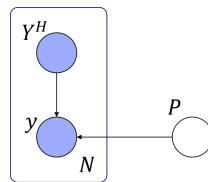
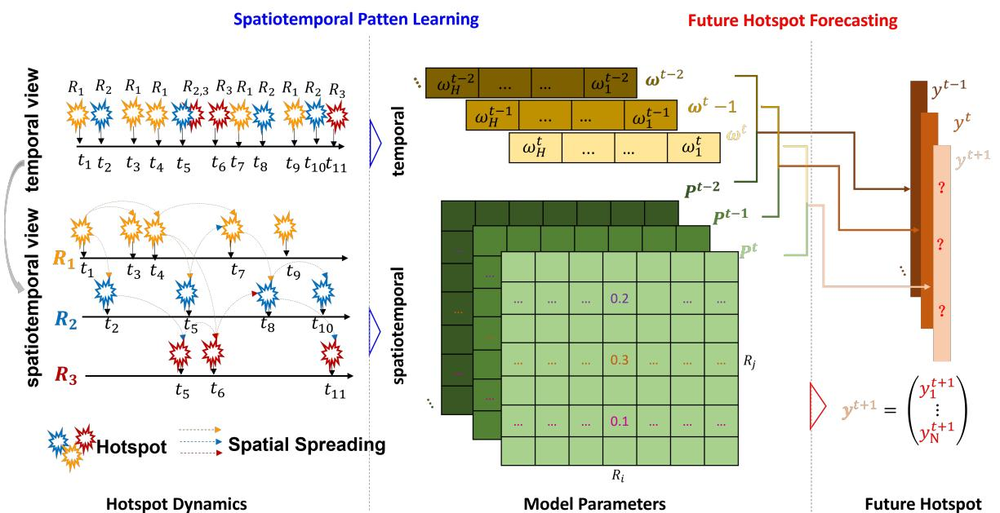
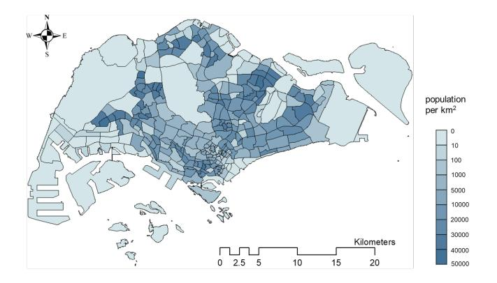
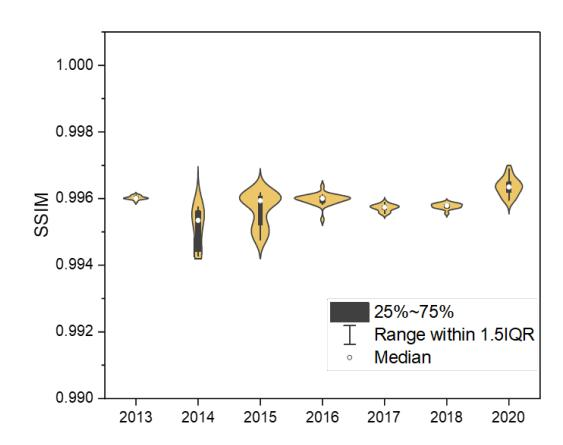
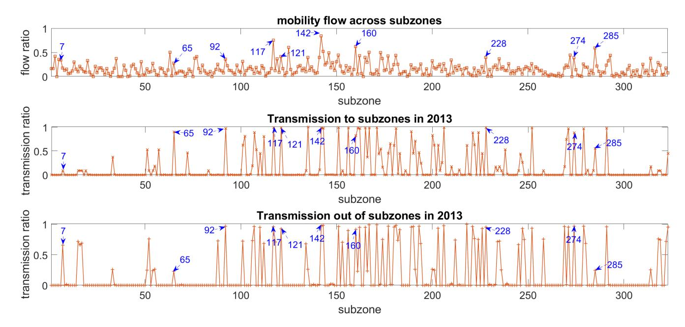
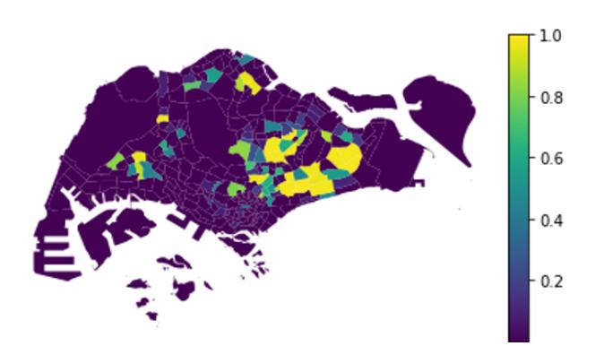
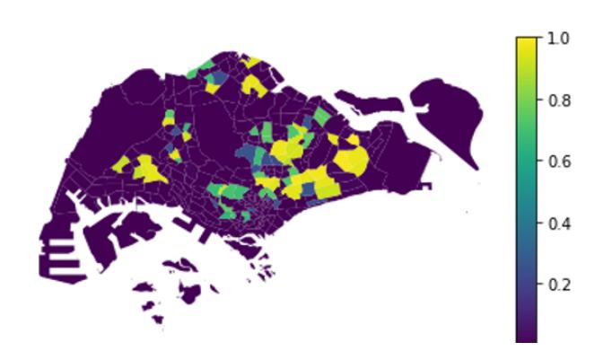
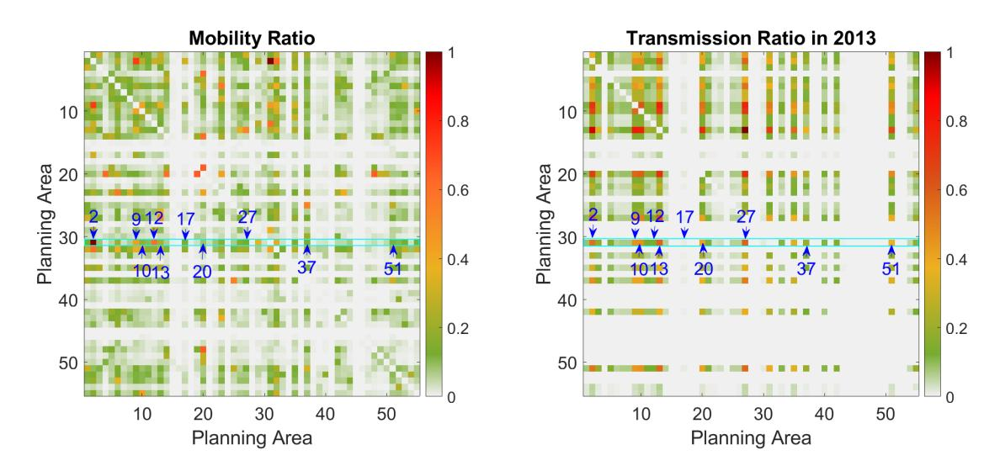
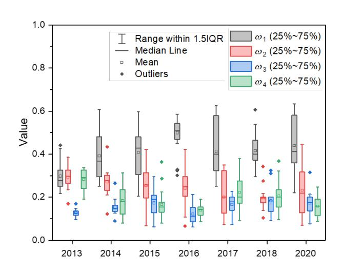

# Mining Citywide Dengue Spread Patterns in Singapore Through Hotspot Dynamics from Open Web Data

Liping Huang Agency for Science, Technology and Research (A\*STAR) Singapore liping.huang.sg@gmail.com

Gaoxi Xiao∗ Nanyang Technological University Singapore egxxiao@ntu.edu.sg

Stefan Ma Ministry of Health, Singapore Singapore stefan\_ma@moh.gov.sg

Hechang Chen∗ Jilin University Changchun, China chenhc@jlu.edu.cn

Shisong Tang Tsinghua University Beijing, China tangshisong13@gmail.com

Flora Salim University of New South Wales Sydney, NSW, Australia flora.salim@unsw.edu.au

### Abstract

Dengue, a mosquito-borne disease, continues to pose a persistent public health challenge in urban areas, particularly in tropical regions such as Singapore. Effective and affordable control requires anticipating where transmission risks are likely to emerge so that interventions can be deployed proactively rather than reactively. This study introduces a novel framework that uncovers and exploits latent transmission links between urban regions, mined directly from publicly available dengue case data. Instead of treating cases as isolated reports, we model how hotspot formation in one area is influenced by epidemic dynamics in neighboring regions. While mosquito movement is highly localized, long-distance transmission is often driven by human mobility, and in our case study, the learned network aligns closely with commuting flows, providing an interpretable explanation for citywide spread. These hidden links are optimized through gradient descent and used not only to forecast hotspot status but also to verify the consistency of spreading patterns, by examining the stability of the inferred network across consecutive weeks. Case studies on Singapore during 2013–2018 and 2020 show that four weeks of hotspot history are sufficient to achieve an average F-score of 0.79. Even under the COVID-19 "circuit breaker," when mobility patterns were severely disrupted, the model remained robust with an F-score of 0.83. Importantly, the learned transmission links align with commuting flows, highlighting the interpretable interplay between hidden epidemic spread and human mobility. By shifting from simply reporting dengue cases to mining and validating hidden spreading dynamics, this work transforms open web-based case data into a predictive and explanatory resource. The proposed framework advances epidemic modeling while providing a scalable, low-cost tool for public health planning, early intervention, and urban resilience.

© 2026 Copyright held by the owner/author(s). ACM ISBN 979-8-4007-2307-0/2026/04 <https://doi.org/10.1145/3774904.3793028>

### CCS Concepts

• Applied computing → Life and medical sciences; • Computing methodologies → Modeling and simulation; Data mining; Benchmarking.

### Keywords

Dengue Cases, Disease Spreading Pattern, Hotpot Dynamics, Machine Learning

#### ACM Reference Format:

Liping Huang, Gaoxi Xiao, Stefan Ma, Hechang Chen, Shisong Tang, and Flora Salim. 2026. Mining Citywide Dengue Spread Patterns in Singapore Through Hotspot Dynamics from Open Web Data. In Proceedings of the ACM Web Conference 2026 (WWW '26), April 13–17, 2026, Dubai, United Arab Emirates. ACM, New York, NY, USA, [9](#page-8-0) pages.<https://doi.org/10.1145/3774904.3793028>

### 1 Introduction

Dengue, a vector-borne viral infection transmitted to human kinds mainly by Aedes aegypti [\[12,](#page-8-1) [33\]](#page-8-2), remains endemic in many tropical and subtropical regions [\[10\]](#page-8-3). Each year, an estimated 60–100 million symptomatic infections and 14,000–20,000 deaths are attributed to dengue [\[2,](#page-7-0) [17\]](#page-8-4), with an annual global health cost estimated at about 9 billion dollars [\[24\]](#page-8-5). Dengue virus is grouped into four serotypes (DENV 1-4), which are closely related to each other, yet antigenically distinct and genetically diverse [\[32\]](#page-8-6). Limited understanding of the immunological interactions among these serotypes—particularly those that exacerbate disease severity—has hindered the development of effective and widely available vaccines [\[27\]](#page-8-7). Consequently, vector control through insecticides and larval source reduction remains the primary strategy for dengue prevention [\[29\]](#page-8-8).

Singapore, an equatorial city-state, faces heightened vulnerability due to its humid climate and highly urbanized environment, both of which provide ideal conditions for Aedes breeding and dengue transmission [\[3\]](#page-7-1). All four dengue serotypes co-circulate year-round [\[21\]](#page-8-9), contributing to recurring outbreaks and occasional nationwide epidemics [\[13,](#page-8-10) [14\]](#page-8-11). Major epidemics were recorded in 2013, 2014, and 2020, with the 2013 outbreak reaching 404.9 cases per 100,000 population (22,170 total cases) [\[18\]](#page-8-12), and the unprecedented 2020 outbreak reporting 35,315 cumulative cases [\[26\]](#page-8-13). Resurgence was

∗Corresponding authors

[This work is licensed under a Creative Commons Attribution 4.0 International License.](https://creativecommons.org/licenses/by/4.0) WWW '26, Dubai, United Arab Emirates

also noted in 2022, with 1,104 cases in a single week ending 30 July [\[19\]](#page-8-14).

Dengue imposes a significant economic burden in Singapore, estimated at US\$42.5 million annually [\[4\]](#page-7-2). To mitigate risk, the National Environment Agency (NEA) conducts regular inspections, eliminates breeding sites, and engages the public in preventive measures [\[5,](#page-7-3) [28\]](#page-8-15). During the 2020 outbreak alone, NEA carried out approximately 107,000 home inspections in May and June [\[26\]](#page-8-13). While effective, these large-scale efforts are resource-intensive. Their efficiency could be greatly improved by focusing interventions on areas at higher risk of future outbreaks. This requires methods that can anticipate where dengue hotspots will emerge [\[11\]](#page-8-16).

Existing research has explored dengue forecasting from multiple angles. Climatic variables such as rainfall and temperature have been used to predict national-level incidence weeks in advance [\[9\]](#page-8-17), but these approaches lack fine-grained spatial resolution. Other studies integrate diverse urban datasets—including population density, vector surveillance, vegetation indices, meteorology, and mobility data—together with machine learning models such as random forests to stratify spatial risks [\[20,](#page-8-18) [22\]](#page-8-19). While informative, these methods often require extensive, fine-grained, and near–realtime data (e.g., mobile phone mobility or detailed epidemiological records), which may not be feasible in many dengue-endemic settings [\[29\]](#page-8-8). The study in [\[29\]](#page-8-8) proposes to pick up 32 grids (1km × 1km) with highest numbers of predicted dengue cases. Such a forecasting certainly helps anchor urban regions that are with the highest dengue transmission risks. The method however demands rich datasets as inputs, including the residential address and date of onset of each confirmed case, the movement patterns recognized from mobile phone data, age of buildings, and fine-grained meteorological data etc., all of which need to be available almost in real time. Access to such rich data in real time however may not be feasible in some dengue endemic cities or nations, which impedes the applicability of the method. Despite of the extensive research efforts, a practical method for dynamically forecasting dengue risk at the urban scale, relying only on epidemiological surveillance data, remains a critical gap.

In Singapore, epidemiological data are systematically published by the National Environment Agency on a weekly basis and made publicly accessible through the [SGCharts platform.](#page-0-0) Leveraging this open dataset, our objective is to develop a method that uncovers spatial spreading patterns of dengue hotspots from epidemiological inputs alone. While mosquito movement is highly localized, long-distance transmission can arise through human mobility. In our case study, we show that the learned spreading network not only captures these unobserved dynamics but also exhibits strong alignment with the human mobility network, providing an interpretable explanation of how dengue can spread across the city. This approach offers government agencies a practical tool to enhance vector control planning, proactively allocate resources, and ultimately mitigate dengue transmission.

#### 2 Graphical Model View of Dengue Hotspot

We represent the dynamics of dengue hotspot spreading across urban regions using a directed acyclic graph (DAG) as in Fig. [1.](#page-1-0) The current-week hotspot �� in a region is influenced by two factors: (i) the observed hotspots of all regions in the previous �� weeks, denoted Y �� , and (ii) the hidden pattern of transmission links across urban regions, ��.

Figure 1: DAG for the Dengue Hotspot Spreading.

The figure illustrates the two dominant causal pathways considered in our analysis: temporal persistence of hotspots (Y �� → ��) and human-mediated long-distance transmission links (�� → ��). We intentionally omit explicit ecological factors that determine mosquito abundance. This choice is based on two considerations. First, mosquito activity and local ecological conditions primarily affect transmission within short spatial neighborhoods. Second, the previous ��-week hotspot matrix Y �� effectively summarizes these local effects, as recent infections already reflect the influence of the ecological factors. Including them as separate variables would add complexity without providing additional causal information for recognizing cross-region spread.

By focusing on Y �� and ��, the model captures the key mechanisms for citywide dengue transmission while remaining parsimonious and interpretable. This structure is well-suited for mining latent inter-region transmission links and emphasizes the pathways most relevant at the urban scale, while implicitly accounting for local entomological and ecological influences.

This simplification also improves interpretability and identifiability. Including ecological or entomological factors risks conflating local dynamics with cross-region transmission, while in practice these variables are often noisy or unavailable at the required resolution. By retaining only the two strongest causal channels—autoregressive persistence (�� �� → ��) and unobservale spatial transmission link (�� → ��)—we focus the model squarely on uncovering the latent transmission network across the city, which is the central objective of this study.

#### 3 Methodology

#### 3.1 Dengue Case Data

The NEA of Singapore regularly publishes geographical dengue transmission localities, each of which is the residential apartment or the workplace address of an infected person. This study uses dengue case data collected and published by SGCharts Outbreak [\(https:](https://outbreak.sgcharts.com/data) [//outbreak.sgcharts.com/data](https://outbreak.sgcharts.com/data) ), which systematically archived publicly available information from the National Environment Agency Singapore. We focus on the machine-friendly CSV files from 2013 to 2018 and 2020, capturing weekly dengue dynamics at high spatial granularity.

Each CSV file corresponds to a snapshot of NEA's dengue cluster webpage and includes structured fields for street address, latitude, longitude, cluster number, number of recent cases (last 2 weeks), total cluster cases, and collection date. Geocoded locations allow

Figure 2: Diagram of Dengue Hotspot Dynamics Modeling with Spatiotemporal Patten Learning and Hotspot Forecasting.

precise mapping of dengue cases at the apartment block level, enabling spatial and temporal analysis of outbreak patterns. Filenames follow a YYMMDD convention to indicate the date of data capture, ensuring chronological alignment for longitudinal studies. Historical coverage is particularly valuable because NEA only publishes current dengue data on its website; SGCharts preserves these historical snapshots, facilitating retrospective analyses and predictive modeling.

#### 3.2 Dengue Hotspot

In this study, the CSV datasets in the years from 2013 to 2018, and in the unprecedent dengue outbreak year 2020 have been used. Each record in the datasets denotes a single locality of an infection case in a certain specific week. For the outbreak year 2020, we collect the dengue locality data from 22 Feb to 3 July, which covers the whole period of the nationwide lockdown (known as the circuit breaker) for controlling the pandemics of COVID-19 as well as a period of time before and after it respectively. We define a subzone as a hotspot if it contains no less than a certain number (denoted as��) of localities in a given week. Let �� denote the number of the infection localities in subzone �� for a given week ��. The corresponding hotspot state is defined as

y �� = 1, ���� �� ≥ �� 0, ����ℎ������������ (1)

#### 3.3 Hotspot Dynamics Modeling

In the real situation, the regions that do not meet the hotspot threshold could also exert a potential impact on future hotspots. To take them into consideration, another state variable yˆ �� is defined in the

modeling of the hotspot dynamics where yˆ �� = 1 if �� �� ≥ 1; otherwise yˆ �� = 0. The process of dengue hotspot dynamics modeling is schematically shown in Fig. 1. Urban regions may become hotspots along the time axis, and such temporal dynamics can be further viewed from the spatiotemporal dimension, where the virus spreads across different regions.

It is known that dengue's main vector (Aedes aegypti), are highly anthropophilic, aggregating in and around human premises and dispersing relatively short distances (a few hundred meters) [\[23\]](#page-8-20). Thus, it is generally assumed that human movements contribute to the transmission of dengue on spatial scales that exceed the limits of mosquito dispersal [\[27\]](#page-8-7), carrying dengue virus to previously dengue-free areas and infecting local mosquitoes [\[7\]](#page-7-4). Infected mosquitoes' biting further transmits the dengue virus to local residents [\[31\]](#page-8-21). Driven by human movements, dengue virus may quickly disperse across cities or urban areas [\[1,](#page-7-5) [8,](#page-7-6) [25,](#page-8-22) [30\]](#page-8-23). The subzones used in this study averagely cover 1.35 ����2 , which in most cases exceeds the mosquito fly range. As the inter-subzone transmission is mainly due to human travel, it is reasonable to assume that the state y �� is associated with the epidemic dynamics of all subzones (including the target subzone �� itself) in previous weeks. The ultimate objective of the algorithm design is to utilize such latent association involved in the hotspot dynamics to forecast dengue hotspots in the next week, namely, to forecast the hotspot state y ��+1 ,�� ∈ 1, 2, . . . , ��, for all subzones.

�� Given the current week t, we utilize a matrix, P , to model the hotspot dynamics, with each matrix element indicating the underlying association of dengue spreading between two subzones, i.e., the dash lines in Fig. [2.](#page-2-0) Note that, as the transmission routes are invisible, the entities in the matrix, P ���� , which denotes the weight of the spreading link from subzone �� to subzone ��, is initially unknown.

The study in [\[16\]](#page-8-24) demonstrates that human commuting flows contribute to the dengue spreading across regions, which exceeds the flying range of the mosquitoes. We obtain the human mobility flows among subzones from the mobile phone data in 2011 used in [\[16\]](#page-8-24). Note that the aggregated network, GL, is learnt by the model based on only the dengue hotspot observations with no information of the mobility networks. In this study, we shall compare the learnt transmission network, GL, with the human commuting flows in Singapore to reveal the correlation between them.

We first describe the mobility network with the dataset used in [\[16\]](#page-8-24). The study in [\[16\]](#page-8-24) extracted the anonymized mobile users' home and work localities in 320m×320m grids and calculated the mobility flow between these grids. The home and work locations of a total of 2,307,230 anonymized mobile users are assigned to the corresponding grids.

Hence each record is a tuple (�� ′ , ���� �� ′ ), where �� ′ is the home location grid of a user m, and �� �� �� ′ is the user's work location grid. In this study, we map each grid to the corresponding subzone. Thus, we have a tuple (�� , ���� �� ) for each user ��. By aggregating the commuting flows between each pair of subzones, we have the mobility networks denoted as GM, where GM (��, ��) is the mobility flow between subzones�� and ��. Note that we let (�� �� , ���� �� ) contribute a mobility flow to both (��, ��) and (��,��). Hence GM is a symmetric graph. In our study, GM is generated based on the commuting flows in Singapore for year 2011. We shall compare GL and GM to test on the consistency between them. Note that, the mobility network GM is only available for year 2011. We assume that the citywide mobility pattern in 2011 remained largely the same for comparing GM with GL in 2013.

#### 4 Case Study and Analysis

#### 4.1 Study Area and Spatial Unit

The city-state of Singapore lies about one degree of latitude north of the equator (1.290270° N; 103.851959° E), covering a total of 781.9 km2 and accommodating 5.7 mil-lion residents. The urban redevelopment authority (URA) of Singapore divides the nation into 323 subzones [\[6\]](#page-7-7), each of which is typically centered around a focal point such as a neighborhood center. We utilize the sub-zones as the basic spatial units for dengue hotspot forecasting as the research in [\[15\]](#page-8-25). Except for those subzones whose population densities are lower than 10 per ����2 , the mean coverage of the subzones is only about 1.35 ����2 , which provides a relatively fine-grained spatial unit. On a subzone that is predicted to be likely a hotspot in the next week, NEA may invest more extensive vector control efforts. We visualize the urban subzones in Singapore in Fig. [3,](#page-4-0) where the sub-zones are color-coded by the population density. In this work, we set the threshold �� = 3 in Eq. [1.](#page-2-1) As each subzone only covers an average of 1.35 ����2 , having three or more localities with reported dengue cases implies that the subzone is of high transmission risk and possibly with intracommunity transmissions between close-by buildings. Applying NEA's mosquito control in such subzones may be effective.

#### 4.2 Hotspot Modeling Evaluation

Prior to analyzing the mined dengue transmission network across urban regions, it is essential to confirm the reliability of the dengue

Figure 3: Visualization of the Urban Subzones in Singapore with Corresponding Population Density.

hotspot dynamics model, since explainable parameters can only be derived from a well-validated framework. The forecasting results are shown in Table 1. As can be seen, results on the dengue case dataset of Singapore for years 2013-2018 and 2020 show that the mean Accuracy values vary from 0.9219 to 0.9988 in different years, the mean Precision values vary from 0.7744 to 0.9611, the mean Recall values vary from 0.6557 to 0.8833, and the mean F-Score values vary from 0.7127 to 0.9010. With such satisfactory performance, the proposed hotspot dynamics modeling method may provide us valuable knowledge of the geographical dengue risk distribution at a citywide scale, helping prevent further disease transmission. Taking only the dengue hotspot records as model inputs makes the model easy to be used for hotspot prediction. The acceptable forecasting performance for the special year of 2020 to a certain extent demonstrates the robustness of the proposed model. Modeling code can be found on GitHub at [https://github.com/lphuang2022/dengue](https://github.com/lphuang2022/dengue-hotspot-forecasting-and-spreading-network-recognition)[hotspot-forecasting-and-spreading-network-recognition.](https://github.com/lphuang2022/dengue-hotspot-forecasting-and-spreading-network-recognition)

| Year |         | Accuracy ( ��, �� | ) Precision | Recall | F-1    |
|------|---------|-------------------|-------------|--------|--------|
| 2013 | 0.9771, | 0.0134            | 0.7956      | 0.6557 | 0.7127 |
| 2014 | 0.9376  | , 0.0194          | 0.7848      | 0.7207 | 0.7398 |
| 2015 | 0.9637  | , 0.0162          | 0.7744      | 0.7374 | 0.7526 |
| 2016 | 0.9699  | , 0.0135          | 0.7800      | 0.7074 | 0.7320 |
| 2017 | 0.9988  | , 0.0016          | 0.9611      | 0.8833 | 0.9010 |
| 2018 | 0.9969  | , 0.028           | 0.9488      | 0.8260 | 0.8614 |
| 2020 | 0.9219  | , 0.0145          | 0.8626      | 0.8007 | 0.8294 |

Table 1: Dengue Hotspot Forecasting Performance for Seven Years in Singapore

#### 4.3 Stability of the Learned P ��

The hotspot prediction model incorporates the spatial correlation between subzones as a dynamic matrix P . Note that P and P ��+1 are independently learned by the gradient descent algorithm. Relative stability analysis for each pair of P and P ��+1 can help us understand the temporal dynamics of matrix P .

Figure 4: SSIM of the Learnt Matrix for Each Year

We utilize the Structure SIMilarity (SSIM) to analyze the similarity between P and P ��+1 , which is originally proposed for measuring the similarity between two images [\[16\]](#page-8-24). The range of the SSIM index value is between 0 and 1: when two metrics are nearly identical, their SSIM is close to 1. Before calculating SSIM, we first normalize P �� by row to homogenizing P in each week. Then, a higher value of SSIM between P and P ��+1 denotes a stronger stability of P . In the experiments, we calculate the SSIM between P and P ��+1 for each pair of adjacent epidemiological weeks of a given year. The SSIM values for each year are shown in Fig. [4.](#page-5-0) It could be observed that the values of SSIM approximate to 0.96 or larger values, which means that the spatial matrix P is quite stable between two continuous weeks.

#### 4.4 Interpreting the Spatial Spreading Network

In this section, we compare the learned spatial spreading network GL of 2013 with the commuting mobility network, GM. Note that the high diagonal values reflect a large number of local dengue transmissions which however may be caused by short-distance travels of the infected mosquitoes. In this section, we focus on inter-regional (non-diagonals) parts in both the mobility network, GM, and the spatial spreading network GL.

To facilitate analyzing the learned spreading network and comparing it with the mobility network, for each subzone ��, we further define following three metrics, transmission-in GL,����, transmissionout GL,������ and mobility ratio GMD, which are respectively calculated as following equations. D (��) is the population in subzone ��.

GL,���� = G���� ������ (G����) , G���� (��) = ∑︁�� ��=1 GM (��, ��) (7)

GL,������ = G������ ������ (G������ ) , G������ (��) = ∑︁�� ��=1 GM (��, ��) (8)

GMD = GD ������ (GD) , GD = ∑︁�� ��=1 GM (��, ��)D (��) (9)

As shown in Fig. [5,](#page-6-0) we pick ten subzones, which have high G���� values as well as high GL,���� and GL,������ , for comparisons. The geographical distribution of the mobility density ratios G���� and the transmission-in ratios, GL,���� are shown in Fig. [6](#page-6-1) and Fig. [7,](#page-6-2) which demonstrates the distribution similarities of the high values, especially in the east areas. Note that the local mobility flows within a subzone are excluded, i.e., GM (��,��) are set to be zero. This is because these values are high and make other values difficult to observe in the same figure. For the learned spreading network, it can be observed that the diagonals, GL (��,��), are also of high values. These high values reflect a large number of local dengue transmissions, which, however, may be caused by short-distance travels of the infected mosquitoes.

For further visualization, the subzone-based graph GM and GL are aggregated into planning areas, which are also defined by URA and are utilized in [\[16\]](#page-8-24). Specifically, a total of 55 planning areas cover the entire region of Singapore. The mobility density ratios, and the transmission-in ratios for year 2013 are shown in Fig. [8.](#page-7-8) We identify ten planning areas, namely 2, 9, 10, 12, 13, 17, 20, 27, 30, 37, 51, which are of high mobility flows to and from planning area 31.

From the figure on the right of Fig. [8,](#page-7-8) we find that these planning areas also have high transmission risks to and from the planning area 31. Such consistency to a certain extent indicates that the learned spreading network has significant similarities with the mobility flows, although the learning process does not make use of any mobility data.

#### 4.5 Temporal Weights Analysis

The temporal weights �� 1 ,���� ,���� 3 ,���� 4 are also analyzed to better understand the evolution of dengue risk over time. As shown in Fig. [9,](#page-7-9) the magnitudes of these weights vary across years, highlighting temporal heterogeneity in how past hotspots influence current conditions. Nevertheless, a consistent trend emerges:�� 1 and�� are generally larger than �� 3 and �� 4 . This implies that dengue hotspots in the most recent one to two weeks have the strongest influence on the present hotspot state of a subzone. Hotspots from three to four weeks ago still contribute, but their impact is weaker, though not negligible. These results suggest that while dengue risk decays with temporal distance, early signals remain relevant within a monthlong horizon—a property that can inform both predictive modeling and timely intervention strategies.

#### 5 Discusstion

#### 5.1 Dengue Hotspot Dynamics

In Singapore, NEA dynamically updates the information on dengue hotspots, which helps guide the vector control intervention. However, being able to forecast active transmission localities, rather than only knowing where they are currently, may allow mitigating mosquito density in advance, which would help prevent further virus transmission.

In this study, we propose a general model, at a city-wide level, that is capable of forecasting dengue hotspots. The spatial unit used in this study is the subzone, which is quite small with an average size of 1.35 ����2 and could help anchor the targeting areas for proactive vector control. Since whether a subzone turns to be or remains as a hotspot in the current week is collaboratively determined by epidemic dynamics of all subzones in the past a few weeks, the developed model incorporates such spatiotemporal impacts. By

Figure 5: Mobility Flow Ratio (top), Transmission Ratio to Subzones (middle), and Transmission Ratio out of Subzones (bottom)

minimizing the errors between estimations and observations of hotspots in the current week with a gradient descent algorithm, the dynamic impacts are learned, with which the one-week-ahead hotspots are forecast.

The proposed model takes only the dengue surveillance data in the previous four weeks as inputs, which is available in many other dengue endemic cities or countries. The proposed model hence may be applied to other urban areas with appropriate adjustments, e.g., to the spatial units and the threshold for defining a hotspot, etc.

## 5.2 Spreading Network Recognition

The warm and rainy climate in the urban environments in tropical or sub-tropical nations provide perfect breeding beds for dengue vectors, and the intensive daily commuting flows in urban environments expedite the citywide spread of dengue virus. Though many

Figure 6: Geographical Distribution of Mobility Ratios

studies have been carried out on the spatial spread of vector-borne disease at different scales, modeling the hotspot dynamics across regions in an endemic city remains a challenge due to the invisible infection pathways. Hence, a merit of the proposed model is that it captures both the spatial and temporal dynamics of dengue hotspots on a citywide scale. The unobservable transmission routes are set as the spatial correlation, P , which is found to remain rather stable between continuous weeks. The comparisons between the spreading network with the commuting flows in Singapore may help us better understand the geographically structured dengue transmission in this city.

It is worth noting that in the year 2020, with COVID-19 outbreak, Singapore has been experiencing an unprecedented dengue outbreak at the same time. What makes the case of this year's dengue spreading even more special is that the spike in early May

Figure 8: Mobility Ratios and Transmission Ratios to Planning Area 31.

coincided with Singapore's COVID-19 lockdown period known as Circuit Breaker (CB), from 7 April to 1 June. Revealing how the CB measurements impact the dengue spreading is pivotal, especially for identifying the correlation between the commuting flows and dengue spreading across urban areas.

#### 6 Conclusion

In conclusion, this study proposes a dynamics modeling of dengue hotspots to recognize the dengue spreading among urban regions. The case study in Singapore shows that the dengue hotspot dynamics can be captured by the proposed model at an accuracy. Moreover, the spatial spreading of dengue hotspots in a highly urbanized environment can be recognized by the proposed method, which has been verified via comparing the recognized network with human mobility among uban regions. The model requires only the geolocated dengue case data within the current and previous four weeks,

Figure 9: Temporal Weights Distribution for Each Year

which are available or can be made available in many dengue endemic cities or nations. Such kinds of findings indicate that the proposed method are suitable for routinely guiding vector control efforts. The proposed method, with appropriate adjustments, may help enhance dengue control in other urban areas.

#### Acknowledgments

Flora Salim would like to acknowledge the support of the ARC Center of Excellence for Automated Decision Making and Society (CE200100005) and the CSIRO-NSF grant titled "Collaborative Research: NSF-CSIRO: HCC: Small: Understanding Bias in AI Models for the Prediction of Infectious Disease Spread". This work is also supported in part by the Key R&D Project of Jilin Province (No. 20240304200 SF).

#### References

[1] D. H. Barmak, C. O. Dorso, and M. Otero. 2016. Modelling dengue epidemic spreading with human mobility. Physica A: Statistical Mechanics and its Applications (2016). [2] Samir Bhatt, Peter W. Gething, Oliver J. Brady, Jane P. Messina, Andrew W. Farlow, et al. 2013. The global distribution and burden of dengue. Nature (2013). [3] Oliver J. Brady, Dinar D. Kharisma, Nandyan N. Wilastonegoro, Kathleen M. O'Reilly, Emilie Hendrickx, Leonardo S. Bastos, Laith Yakob, and Donald S. Shepard. 2020. The cost-effectiveness of controlling dengue in Indonesia using Wmel Wolbachia released at scale: a modelling study. BMC Medicine (2020). [4] Luis R. Carrasco, Linda K. Lee, Vernon J. Lee, Eng Eong Ooi, Donald S. Shepard, Tun L. Thein, Victor Gan, Alex R. Cook, David Lye, Lee Ching Ng, and Yee Sin Leo. 2011. Economic impact of dengue illness and the cost-effectiveness of future vaccination programs in Singapore. PLoS Neglected Tropical Diseases (2011). [5] Yirong Chen, Janet Hui Yi Ong, Jayanthi Rajarethinam, Grace Yap, Lee Ching Ng, and Alex R. Cook. 2018. Neighbourhood level real-time forecasting of dengue cases in tropical urban Singapore. BMC Medicine (2018). [6] Data Government of Singapore. 2014. Master Plan 2014 Sub-zone Boundary. [https:](https://data.gov.sg/dataset/master-plan-2014-subzone-boundary-no-sea) [//data.gov.sg/dataset/master-plan-2014-subzone-boundary-no-sea.](https://data.gov.sg/dataset/master-plan-2014-subzone-boundary-no-sea) Accessed: 2022-08-04. [7] José F. Gil, Maximiliano Palacios, Alejandro J. Krolewiecki, Pedro Cortada, Rosana Flores, Cesar Jaime, Luis Arias, Carlos Villalpando, Anahí M. Alberti D'Ámato, Julio R. Nasser, and Juan P. Aparicio. 2016. Spatial spread of dengue in a nonendemic tropical city in northern Argentina. Acta Tropica (2016). [8] Giorgio Guzzetta, Cecilia A. Marques-Toledo, Roberto Rosà, Mauro Teixeira, and Stefano Merler. 2018. Quantifying the spatial spread of dengue in a nonendemic Brazilian metropolis via transmission chain reconstruction. Nature

Communications (2018). [9] Yien Ling Hii, Huaiping Zhu, Nawi Ng, Lee Ching Ng, and Joacim Rocklöv. 2012. Forecast of dengue incidence using temperature and rainfall. PLoS Neglected Tropical Diseases (2012). [10] Soon Hoe Ho, Jue Tao Lim, Janet Ong, Hapuarachchige Chanditha Hapuarachchi, Shuzhen Sim, and Lee Ching Ng. 2023. Singapore's 5 decades of dengue prevention and control: Implications for global dengue control. PLOS Neglected Tropical Diseases (2023). [11] Mingyong Kim, Dean Paini, and Raja Jurdak. 2019. Modeling stochastic processes in disease spread across a heterogeneous social system. Proceedings of the National Academy of Sciences (2019). [12] Mariana Lenharo. 2023. Dengue is spreading. Can new vaccines and antivirals halt its rise? Nature (2023). [13] Jue Tao Lim, Somya Bansal, Chee Seng Chong, Borame Dickens, Youming Ng, Lu Deng, et al. 2024. Efficacy of Wolbachia-mediated sterility to reduce the incidence of dengue: a synthetic control study in Singapore. The Lancet Microbe (2024). [14] Jue Tao Lim, Borame Sue Dickens, Haoyang Sun, Lee Ching Ng, and Alex R. Cook. 2020. Inference on dengue epidemics with Bayesian regime switching models. PLoS Computational Biology (2020). [15] Huang Liping, Xiao Gaoxi, Chen Hechang, Niu Xuetong, Fu Xiuju, Xu Haiyan, Xu George, Ma Stefan, Ong Janet, and Ng Lee Ching. 2022. Geographical clusters of dengue outbreak in Singapore during the COVID-19 nationwide lockdown of 2020. Scientific Data 9, 1 (2022), 547. [16] E. Massaro, D. Kondor, and C. Ratti. 2019. Assessing the interplay between human mobility and mosquito borne diseases in urban environments. Scientific Reports (2019). [17] Jane P. Messina, Oliver J. Brady, Nick Golding, Moritz U. G. Kraemer, G. R. William Wint, Ray, et al. 2019. The current and future global distribution and population at risk of dengue. Nature (2019). [18] Ministry of Health, Singapore. 2024. Vector-Borne Diseases. [https:](https://www.moh.gov.sg/docs/librariesprovider5/resources-statistics/reports/vector-borne--zoonotic-diseases.pdf) [//www.moh.gov.sg/docs/librariesprovider5/resources-statistics/reports/vector](https://www.moh.gov.sg/docs/librariesprovider5/resources-statistics/reports/vector-borne--zoonotic-diseases.pdf)[borne--zoonotic-diseases.pdf.](https://www.moh.gov.sg/docs/librariesprovider5/resources-statistics/reports/vector-borne--zoonotic-diseases.pdf) Accessed: 2024-02-18. [19] National Environment Agency (NEA). 2024. Dengue. [https://www.nea.gov.sg/](https://www.nea.gov.sg/dengue-zika/dengue/dengue-cases) [dengue-zika/dengue/dengue-cases.](https://www.nea.gov.sg/dengue-zika/dengue/dengue-cases) Accessed: 2024-02-18. [20] Janet Ong, Xu Liu, Jayanthi Rajarethinam, Suet Yheng Kok, Shaohong Liang, Choon Siang Tang, Alex R. Cook, Lee Ching Ng, and Grace Yap. 2018. Mapping dengue risk in Singapore using random forest. PLoS Neglected Tropical Diseases (2018). [21] J. Ong, X. Liu, J. Rajarethinam, G. Yap, D. Ho, and L. C. Ng. 2019. A novel entomological index, Aedes aegypti breeding percentage, reveals the geographical spread of the dengue vector in Singapore and serves as a spatial risk indicator for dengue. Parasites and Vectors (2019). [22] Nabeel Abdur Rehman, Shankar Kalyanaraman, Talal Ahmad, Fahad Pervaiz, Umar Saif, and Lakshminarayanan Subramanian. 2016. Fine-grained dengue forecasting using telephone triage services. Science Advances (2016). [23] Henrik Salje, Justin Lessler, Irina Maljkovic Berry, et al. 2017. Dengue diversity across spatial and temporal scales: Local structure and the effect of host population size. Science (2017). [24] Donald S. Shepard, Eduardo A. Undurraga, Yara A. Halasa, and Jeffrey D. Stanaway. 2016. The global economic burden of dengue: a systematic analysis. The Lancet Infectious Diseases (2016). [25] D. Soriano-Paños, J. H. Arias-Castro, A. Reyna-Lara, H. J. Martínez, S. Meloni, and J. Gómez-Gardeñes. 2020. Vector-borne epidemics driven by human mobility. Physical Review Research (2020). [26] Statista. 2022. Number of dengue fever cases in Singapore. [https://www.statista.](https://www.statista.com/statistics/963019/number-of-dengue-fever-cases-singapore/) [com/statistics/963019/number-of-dengue-fever-cases-singapore/.](https://www.statista.com/statistics/963019/number-of-dengue-fever-cases-singapore/) Accessed: 2022-08-04. [27] Steven T. Stoddard, Brett M. Forshey, Amy C. Morrison, et al. 2013. House-tohouse human movement drives dengue virus transmission. Proceedings of the National Academy of Sciences (2013). [28] Li Kiang Tan, Swee Ling Low, Haoyang Sun, Yuan Shi, Lilac Liu, Sally Lam, et al. 2019. Force of infection and true infection rate of dengue in Singapore: Implications for dengue control and management. American Journal of Epidemiology 188, 9 (2019), 1729–1738. [29] Pranav Tewari, Peihong Guo, Borame Dickens, Pei Ma, Somya Bansal, and Jue Tao Lim. 2023. Associations between dengue incidence, ecological factors, and anthropogenic factors in Singapore. Viruses (2023). [30] Huaiyu Tian, Zhe Sun, Nuno Rodrigues Faria, Jing Yang, Bernard Cazelles, Shanqian Huang, Bo Xu, Qiqi Yang, Oliver G. Pybus, and Bing Xu. 2017. Increasing airline travel may facilitate co-circulation of multiple dengue virus serotypes in Asia. PLoS Neglected Tropical Diseases (2017). [31] Amy Wesolowski, Taimur Qureshi, Maciej F. Boni, Pål Roe Sundsøy, Michael A. Johansson, Syed Basit Rasheed, Kenth Engø-Monsen, and Caroline O. Buckee. 2015. Impact of human mobility on the emergence of dengue epidemics in Pakistan. Proceedings of the National Academy of Sciences (2015). [32] Annelies Wilder-Smith, Eng Eong Ooi, Olaf Horstick, and Bridget Wills. 2015. Dengue. The Lancet (2015). [33] World Health Organization. 2024. Dengue and Severe Dengue. Accessed: 2024-02- 18.