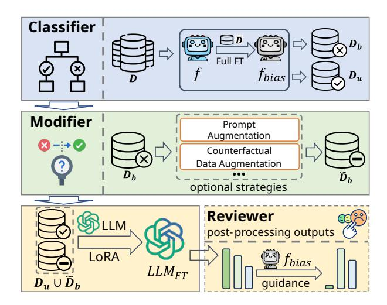
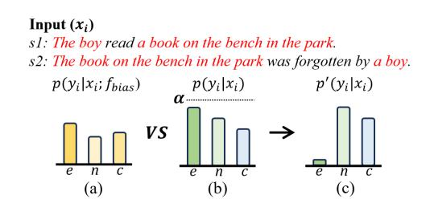
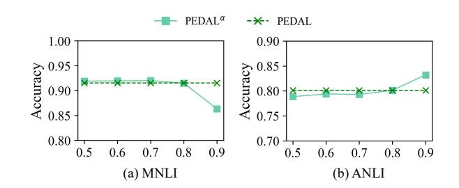
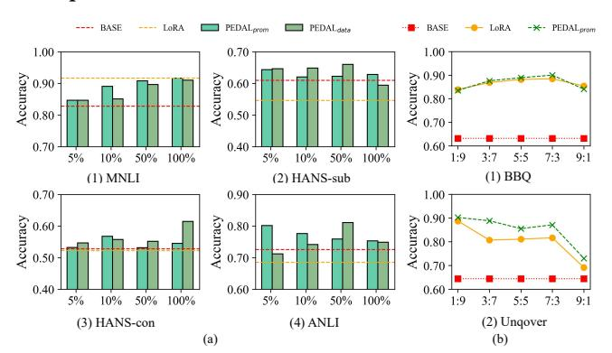
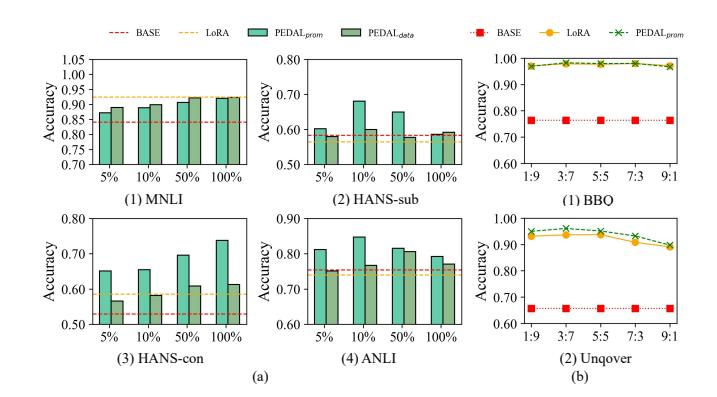

# Mitigating Fine-tuning Bias: A Parameter-Efficient Debiasing Framework for Large Language Models

| Qiuyu Li              |             |                          |
|-----------------------|-------------|--------------------------|
| Key Laboratory of     |             |                          |
| Knowledge Engineering |             |                          |
| with Big Data,        |             |                          |
| Hefei University of   |             |                          |
| Hefei, Anhui, China   |             |                          |
| Kun                   | Zhang ∗     |                          |
| Key Laboratory        |             | of                       |
| Knowledge             | Engineering |                          |
| with Big              | Data,       |                          |
| Hefei                 | University  | of                       |
| Hefei, Anhui,         | China       |                          |
|                       |             | Le Wu                    |
|                       |             | Innovation School of     |
|                       |             | Artificial Intelligence, |
|                       |             | Hefei University of      |
|                       |             | Hefei, Anhui, China      |
|                       |             | Hao Liu                  |
|                       |             | Key Laboratory of        |
|                       |             | Knowledge Engineering    |
|                       |             | with Big Data,           |
|                       |             | Hefei University of      |
|                       |             | Hefei, Anhui, China      |
| Hefei Xu              |             |                          |
| Key Laboratory of     |             |                          |
| Knowledge Engineering |             |                          |
| with Big Data,        |             |                          |
| Hefei University of   |             |                          |
| Hefei, Anhui, China   |             |                          |
|                       |             | Xin Li                   |
|                       | School      | of Information           |
|                       | Science     | and Technology,          |
|                       | University  | of Science and           |
|                       |             | Technology of China      |
|                       |             | Hefei, Anhui, China      |
|                       |             | Si Wei                   |
|                       |             | Artificial Intelligence  |
|                       |             | Research Institute,      |
|                       |             | iFLYTEK Company Limited  |
|                       |             | Hefei, Anhui, China      |

# Abstract

Parameter-efficient fine-tuning (PEFT) has become a practical solution for using limited tuning data to adapt large language models (LLMs) to downstream scenarios, such as web-based questionanswer assistants. However, such data is mostly collected from open web sources or created by human annotators, inevitably containing undesirable bias patterns, such as human-like stereotypes or spurious statistical associations. These patterns create shortcut connections between specific features and outputs within the tuning data. We observe that the low-dimensional adaptation space of PEFT modules is particularly prone to overfitting these shortcuts, leading to biased tuning and degraded unbiased performance. Existing debiasing methods either tune all parameters or use data augmentation (or filtering) to prevent shortcut learning. Despite progress, enormous parameters and limited data present big challenges to the unbiased tuning of LLMs. Moreover, targeting specific bias types limits their applications. To tackle these challenges, we propose PEDAL, a novel Parameter-Efficient DebiAsing framework for LLMs, which consists of three modules: Classifier, Modifier, and Reviewer. Instead of identifying bias patterns, Classifier determines whether a sample contains bias patterns, reducing biased data requirements and enhancing model generalizability. Then, Modifier is developed to modify the identified biased samples and break shortcut connections for unbiased tuning. Finally, Reviewer takes Classifier as guidance to adjust the outputs of fine-tuned LLMs, preventing residual shortcut activation. These designs enable PEDAL to

∗Kun Zhang is the corresponding author.

[This work is licensed under a Creative Commons Attribution 4.0 International License.](https://creativecommons.org/licenses/by/4.0) WWW '26, Dubai, United Arab Emirates.

© 2026 Copyright held by the owner/author(s). ACM ISBN 979-8-4007-2307-0/2026/04 <https://doi.org/10.1145/3774904.3793029>

generalize across bias types and data domains without modifying most model parameters. Extensive experiments on multiple LLMs and tasks demonstrate that PEDAL effectively mitigates various biases without harming task performance. We also prove the effectiveness of PEDAL in improving the fairness of LLM-based web services. Our code is available at: [https://github.com/lqy1024-stu/PEDAL.](https://github.com/lqy1024-stu/PEDAL)

### CCS Concepts

- Computing methodologies → Natural language generation;
- Hardware → Safety critical systems.

# Keywords

Debiasing, Fine-tuning, Large Language Models, Web Services

### ACM Reference Format:

Qiuyu Li, Kun Zhang, Le Wu, Hao Liu, Hefei Xu, Xin Li, and Si Wei. 2026. Mitigating Fine-tuning Bias: A Parameter-Efficient Debiasing Framework for Large Language Models. In Proceedings of the ACM Web Conference 2026 (WWW '26), April 13–17, 2026, Dubai, United Arab Emirates. ACM, New York, NY, USA, [12](#page-11-0) pages.<https://doi.org/10.1145/3774904.3793029>

### 1 Introduction

Fine-tuning has become a critical technique for enhancing LLM performance in vertical fields [\[7,](#page-8-0) [17,](#page-8-1) [39,](#page-8-2) [47\]](#page-9-0). It has been widely adopted by LLM-based customized web services, including sentiment analysis [\[11,](#page-8-3) [44\]](#page-9-1), online question-answer [\[2,](#page-8-4) [37\]](#page-8-5), and personalized recommendations [\[10,](#page-8-6) [45,](#page-9-2) [54\]](#page-9-3). Among these, parameterefficient fine-tuning is widely popular due to its ability to use limited downstream tuning data for effective task adaptation [\[12,](#page-8-7) [19,](#page-8-8) [55\]](#page-9-4). However, downstream data is usually obtained via scenario-specific collection [\[4\]](#page-8-9) or human annotation [\[15\]](#page-8-10). This inevitably introduces undesirable bias patterns, such as human-like stereotypes (e.g., poor people are more dishonest) [\[36\]](#page-8-11) or spurious statistical associations

| Example :    |                                       |
|--------------|---------------------------------------|
| premise      | : The other men shuffled.             |
| hypothesis   | : The other men were shuffled around. |
| label        | : entail                              |
| of dataset : |                                       |
|              | Feature Label Proportion              |
| lexical      | overlap entail 70%                    |
| lexical      | overlap non-entail 30%                |

**Bias pattern**: the spurious statistical association between the *lexical overlap* feature and the *entail* label, creating a shortcut connection that misleads LLMs to predict *entail* solely from *lexical overlap.*

Figure 1: An example from the natural language inference task that illustrates how shortcut connections between features and outputs affect the performance of fine-tuned LLMs.

(e.g., positive correlation between ice cream sales and drowning incidents in summer) [\[26\]](#page-8-12). Recent studies show that these bias patterns simplify the relation between features and outputs, creating shortcut connections between them [\[25,](#page-8-13) [61\]](#page-9-5). As shown in the upper part of Fig. [1,](#page-1-0) humans prefer to use similar expressions (e.g., high lexical overlap) to convey the identical semantics, creating a shortcut connection between lexical overlap feature and entail label in natural language inference (NLI) tasks. About 70% of entail samples in MNLI dataset [\[46\]](#page-9-6) exhibit lexical overlap. Although mainstream LLMs have adopted alignment during pre-training to avoid relying on such connections for inference [\[49,](#page-9-7) [50\]](#page-9-8), the connections are simple enough to be learned (i.e., the relationship between two sentences only depends on the ratio of repeated words). This raises a key question: "Will LLMs overfit these shortcut connections in the low-dimensional adaptation space of PEFT modules, thereby undermining the alignment and causing biased generation?"

To answer this question, we conduct a preliminary experiment to compare the performance of Qwen2-7B [\[51\]](#page-9-9) with zero-shot and LoRA-based fine-tuning on MNLI dataset. As shown in the lower part of Fig. [1,](#page-1-0) the fine-tuned Qwen2-7B achieves better task performance, with accuracy improving from 0.84 to 0.92 on the general test set. However, when we break the short connection between lexical overlap feature and entail label to construct an unbiased test set, the performance drops sharply (accuracy decreases from 0.61 to 0.54). Moreover, the fine-tuned model achieves 99% accuracy on samples where lexical overlap is associated with entail, but only 13% on samples where the same feature is associated with non-entail. In contrary, the zero-shot model has comparable performance across different groups. The results indicate that fine-tuning LLMs on such tuning data will cause models to overfit shortcut connections, leading them to learn bias patterns and generate biased outputs.

Recently, this problem has gained increasing attention, and many debiasing methods have been proposed [\[1,](#page-8-14) [42,](#page-9-10) [52,](#page-9-11) [56\]](#page-9-12). A common idea is to adjust all parameters to prevent models from learning bias patterns [\[25,](#page-8-13) [43\]](#page-9-13). These methods require jointly optimizing task objectives and additional debiasing objectives, which is impractical in LLM applications. Some studies aim to preserve the debiasing capability acquired during pre-training [\[1,](#page-8-14) [48\]](#page-9-14). For instance, inspired by

the ability of PEFTs to effectively capture information, Agarwal et al. [\[1\]](#page-8-14) proposed transferring debiasing information obtained by PEFTs on upstream tasks to downstream tasks. Unfortunately, this strategy is ineffective for mitigating new bias patterns learned during fine-tuning. Other studies focus on mitigating biases learned from tuning data during fine-tuning [\[18,](#page-8-15) [30,](#page-8-16) [56\]](#page-9-12). Among them, data augmentation or filtering are mainstream strategies, which aim to break shortcut connections between specific features and outputs [\[8,](#page-8-17) [57\]](#page-9-15). For example, Li et al. [\[18\]](#page-8-15) proposed a contrastive debiasing framework with data augmentation to mitigate social bias. Sattigeri et al. [\[38\]](#page-8-18) estimated the influence of samples on fairness metrics and filtered those with outsized influence before fine-tuning. Despite progress, these methods typically target specific bias types (e.g., gender with occupations) and design corresponding augmentation or filtering strategies. In fact, the tuning data contains various bias patterns, such as spurious correlations [\[14,](#page-8-19) [58\]](#page-9-16), social stereotypes [\[18\]](#page-8-15), and position bias [\[25\]](#page-8-13). Focusing on specific bias patterns limits the broad applicability for debiasing. Moreover, in PEFT settings with limited tuning data, augmenting all samples or filtering samples directly may distort task-related information and hinder the learning of task semantics. Thus, an important question remains: "How to realize effective and flexible debiasing in PEFT settings?"

To address the above problem, we propose a general Parameter-Efficient DebiAsing framework for LLMs (PEDAL), which mitigates biases in PEFT settings while preserving task performance. PEDAL consists of three modules: Classifier, Modifier, and Reviewer. First, unlike previous work, our designed Classifier no longer identifies specific bias patterns, but is used to determine whether a sample may contain bias patterns. We fine-tune a lightweight model using a small amount of biased data to realize this goal. Then, we develop a novel Modifier to break shortcut connections between specific features and outputs, preventing LLMs from learning bias patterns while preserving task performance. We propose two efficient strategies (i.e., prompt augmentation and counterfactual data augmentation) to achieve this goal. Finally, to prevent residual shortcut activation, we design a Reviewer to adjust the outputs of fine-tuned LLMs in a post-hoc manner. Extensive experiments on inference, question answering, and summarization tasks across various LLMs demonstrate the effectiveness and generalizability of PEDAL. Moreover, we use a customized question-answering assistant to prove the practical effectiveness of PEDAL in improving the fairness of LLM-based personalized web services.

### 2 Related Works

### 2.1 Debiasing in Full Fine-Tuning Setting

Language models incorporate information learned from tuning data into their parameters during fine-tuning [\[7,](#page-8-0) [12,](#page-8-7) [23,](#page-8-20) [61\]](#page-9-5). Therefore, the most common debiasing method is to adjust all model parameters to mitigate bias. These methods typically correct reliance on biased features by introducing additional debiasing objectives, ultimately obtaining debiasing capability at the parameter level [\[25,](#page-8-13) [43,](#page-9-13) [61\]](#page-9-5). For instance, Liu et al. [\[25\]](#page-8-13) proposed a selfsupervised position debiasing framework, which introduces a multiobjective module to jointly optimize the task and debiasing objectives, thereby mitigating position bias during fine-tuning. Zhou et al. [\[61\]](#page-9-5) designed an invariant risk minimization loss function

### 4 Experiments

To evaluate PEDAL, we answer the following research questions (RQs). RQ 1: Can PEDAL effectively mitigate bias patterns learned during fine-tuning while preserving task performance? RQ 2: What is the contribution of each module in PEDAL? RQ 3: How sensitive is PEDAL to the size of tuning data �� and to its composition (the ratio of biased to unbiased samples)? RQ 4: How robust is PEDAL across models of different scales? RQ 5: How effective is PEDAL in improving the fairness of LLM-based web services?

### 4.1 Experimental Setup

Datasets. We select three tasks: natural language inference (NLI), question answering (QA), and summarization. Details of the training and test sets for tasks are provided in Appendices [A](#page-9-18) and [B.](#page-9-19)

Training. For NLI task, we full fine-tune BERT [\[6\]](#page-8-22) on a biased data containing lexical overlap or negation bias [\[14\]](#page-8-19). We then randomly select 10,000 samples from MNLI dataset for downstream fine-tuning. For QA task, we construct a biased data using samples from BBQ dataset with disambiguated context [\[33\]](#page-8-26) and full finetune BERT on it. We then randomly select 10,000 samples from BBQ for downstream fine-tuning. For summarization task, following prior work [\[40\]](#page-9-20), we construct a biased data using samples from Newsroom dataset [\[9\]](#page-8-27), where the reference response is highly correlated with the beginning utterance of the given document. We full fine-tune T5-large [\[3\]](#page-8-28) on it and then select 10,000 samples from Newsroom for downstream fine-tuning.

Testing. For NLI task, we select 3,000 samples from MNLI to evaluate task performance, the unbiased datasets HANS [\[28\]](#page-8-29) and ANLI [\[31\]](#page-8-30) are used to evaluate debiasing performance. For QA task, we select 3,000 samples from BBQ to evaluate task performance, the unbiased dataset Unqover [\[16\]](#page-8-31) is used to evaluate debiasing performance. Accuracy is the evaluation metric for the above tasks. For summarization task, we select 3,000 samples from Newsroom to evaluate task performance. We use samples whose responses are unrelated to the beginning utterance of the given document as the unbiased data, and then select 1,000 of these to evaluate debiasing performance. ROUGE-L [\[21\]](#page-8-23) is the evaluation metric.

Baselines. 1) BASE: zero-shot learning of backbones. 2) Filter: removing potential biased samples detected by Classifier. 3) CDA: applying counterfactual data augmentation to all tuning samples. 4) LoRA-based methods: LoRA: fine-tuning backbones with LoRA; ΔLoRA [\[56\]](#page-9-12): performing the subtraction operation between PEMs; Ext-Sub [\[13\]](#page-8-21): integrating "expert" PEMs and "anti-expert" PEMs to achieve debiasing. 5) Fine-tuning debiasing methods: PEFT-Debias [\[1\]](#page-8-14): using PEFT to transfer debiasing information during pre-training to the fine-tuning stage; SOD [\[25\]](#page-8-13): a self-supervised debiasing framework that mitigates position bias; ADEPT [\[52\]](#page-9-11): using prompt tuning with pre-designed neutral and attribute tuples to mitigate social bias. 6) FairSteer [\[20\]](#page-8-32): an inference-time debiasing framework for mitigating social bias. Details of the baselines are provided in Appendix [D.](#page-10-1) For PEDAL, we evaluate two variants: PEDALprom that uses prompt augmentation, and PEDALdata that uses counterfactual data augmentation.

Backbones. We adopt two LLMs, Qwen2-7B [\[51\]](#page-9-9) and Deepseek-V2-7B [\[5\]](#page-8-33), as backbones. We also evaluate the robustness of PEDAL on Qwen2-1.5B [\[51\]](#page-9-9) and Qwen2.5-14B [\[53\]](#page-9-21).

Parameter Settings. For �� in Classifier, we set �� to 0.6 and analyze the impact of different �� values on PEDAL in Section [4.3.](#page-5-0) For �� in Reviewer, we set it to 0.8 and analyze the impact of different �� values on Reviewer in Section [4.3.](#page-5-0)

Implementation Details. For full fine-tuning, the BERT model is trained for 5 epochs and the T5-large model is trained for 10 epochs. The learning rate is 2e-4 and the batch size is 4. For downstream fine-tuning, all backbones are trained for 3 epochs with a learning rate of 1e-4 using the AdamW optimizer. The batch size is 4. We use LoRA implemented via Llama-factory [\[60\]](#page-9-22) on 8 NVIDIA RTX5880 GPUs, each with 48 GB of memory. The rank is 8. To ensure more stable results, all experiments are repeated 3 times and the averages are reported. Moreover, we use another common PEFT method, (IA)3 [\[22\]](#page-8-34), to verify the generality of PEDAL across different PEFT methods, with the results provided in Appendix [F.3.](#page-11-1)

### 4.2 Overall Performance (RQ 1)

To evaluate the effectiveness of PEDAL in debiasing fine-tuning, we conduct experiments on three tasks. As shown in Table [1,](#page-5-1) on all backbones, PEDAL effectively adapts LLMs to downstream tasks, achieving an average improvement of 7%−9% over BASE on general test sets and exhibiting the smallest performance drop compared to LoRA. Moreover, compared to all baselines, PEDAL has the best debiasing performance on unbiased test sets. The results demonstrate the effectiveness of PEDAL in mitigating bias while preserving task performance. When using different modifiers (i.e., prompt augmentation or counterfactual data augmentation), PEDAL consistently shows impressive performance. This highlights the flexibility of PEDAL. Compared with SOD and ADEPT, which target only specific bias patterns, PEDAL not only has broad applicability but also has certain advantages in mitigating specific biases.

Besides, we obtain the following conclusions from the baseline results: 1) Backbones have powerful zero-shot capabilities. However, due to the misleading of bias patterns, their unbiasedness degrades after fine-tuning. 2) Directly filtering biased samples improves unbiasedness but significantly degrades task performance. This is consistent with the motivation behind Classifier module. 3) Although CDA can mitigate bias, it degrades task performance, possibly because augmenting all samples introduces additional semantic noise. 4) Existing debiasing methods that target only specific bias patterns show limited generalization across different bias types.

To further evaluate the performance of PEDAL in mitigating stereotypes, we use �������� ���������� [\[33\]](#page-8-26) to quantify the bias degree against specific stereotypes when models answer questions in different contexts, i.e., ambiguous and disambiguated contexts in BBQ:

�������� = 2( ���������� �������� ) − 1, �������� = (1 − ����������������)��������, (8)

where �������� ∈ [−1, 1] and �������� ∈ [0, 1] denote bias scores in ambiguous and disambiguated contexts. The closer �������� and �������� are to 0, the less bias models have. ���������� and �������� denote the number of model outputs reflecting target bias and are not �� ������������.

The results are reported in Fig. [4,](#page-5-2) and the backbone is Qwen2-7B. We observe that the impact of different categories on the model varies. Compared to fine-tuned models, BASE exhibits a lower bias level, proving that fine-tuning will inevitably leads LLMs to learn biases. Compared to LoRA and ADEPT, PEDAL has lower

Table 1: Overall performance of PEDAL. For Newsroom, we report ����������-��. For all other datasets, we report ����������������. Bold and underlined fonts indicate the best and second-best results. For HANS, we present the results on its lexical overlap subset. All subset results are provided in Appendix [F.1.](#page-11-2) Since the counterfactual data augmentation strategy is unsuitable for mitigating position bias, the corresponding results are not reported. SOD is only suitable for mitigating position bias. ADEPT requires the pre-designed neutral and attribute tuples such as gender, it is only used to mitigate social stereotypes.

| Bias pattern Method QWen2-7B | General MNLI | lexical overlap HANS | bias Unbiased ANLI | General MNLI | negation HANS | bias Unbiased ANLI | General MNLI | mixed HANS | bias Unbiased ANLI | social General BBQ | stereotypes Unbiased Unqover | General News | position bias Unbiased News |
|------------------------------|--------------|----------------------|--------------------|--------------|---------------|--------------------|--------------|------------|--------------------|--------------------|------------------------------|--------------|-----------------------------|
| BASE                         | 84.10        | 87.86                | 75.39              | 84.10        | 87.86         | 75.39              | 84.10        | 87.86      | 75.39              | 76.35              | 65.70                        | 51.35        | 13.49                       |
| Filter                       | 87.24        | 88.74                | 76.63              | 86.28        | 89.13         | 76.42              | 88.10        | 89.87      | 77.25              | 91.42              | 89.46                        | 53.31        | 18.34                       |
| CDA                          | 90.03        | 88.29                | 74.26              | 89.59        | 87.46         | 74.89              | 90.86        | 88.01      | 74.45              | 96.01              | 91.23                        | /            | /                           |
| LoRA                         | 92.41        | 86.49                | 73.96              | 92.41        | 86.49         | 73.96              | 92.41        | 86.49      | 73.96              | 97.95              | 90.80                        | 56.14        | 17.22                       |
| Δ LoRA                       | 87.31        | 84.78                | 80.19              | 85.10        | 88.00         | 71.83              | 89.33        | 91.33      | 78.43              | 80.60              | 59.33                        | 48.62        | 18.16                       |
| Ext-Sub                      | 91.21        | 77.60                | 76.87              | 90.28        | 84.98         | 79.13              | 91.38        | 89.51      | 78.30              | 95.85              | 91.38                        | 49.26        | 18.39                       |
| PEFTDebias                   | 84.30        | 85.69                | 74.82              | 84.30        | 85.69         | 74.82              | 84.30        | 85.69      | 74.82              | 92.06              | 89.60                        | 50.26        | 15.12                       |
| SOD                          | /            | /                    | /                  | /            | /             | /                  | /            | /          | /                  | /                  | /                            | 53.09        | 20.10                       |
| ADEPT                        | /            | /                    | /                  | /            | /             | /                  | /            | /          | /                  | 95.23              | 90.54                        | /            | /                           |
| FairSteer                    | /            | /                    | /                  | /            | /             | /                  | /            | /          | /                  | 90.68              | 91.23                        | /            | /                           |
| PEDAL prom                   | 88.59        | 96.13                | 81.04              | 91.41        | 92.99         | 81.70              | 92.00        | 93.61      | 79.22              | 97.25              | 93.23                        | 55.24        | 20.15                       |
| PEDAL data Deepseek-V2-7B    | 91.93        | 97.98                | 78.48              | 91.66        | 95.56         | 79.17              | 92.34        | 95.23      | 79.09              | 96.60              | 95.65                        | /            | /                           |
| BASE                         | 82.76        | 79.46                | 72.56              | 82.76        | 79.46         | 72.56              | 82.76        | 79.46      | 72.56              | 63.13              | 64.43                        | 54.25        | 16.10                       |
| Filter                       | 85.64        | 84.52                | 71.86              | 86.23        | 83.13         | 70.89              | 86.27        | 84.31      | 73.13              | 80.22              | 83.23                        | 55.83        | 18.89                       |
| CDA                          | 88.46        | 84.36                | 70.21              | 89.02        | 83.75         | 71.36              | 88.05        | 83.59      | 72.58              | 86.43              | 86.32                        | /            | /                           |
| LoRA                         | 91.69        | 78.83                | 68.52              | 91.69        | 78.83         | 68.52              | 91.69        | 78.83      | 68.52              | 88.45              | 81.65                        | 57.20        | 18.30                       |
| Δ LoRA                       | 72.52        | 49.65                | 72.09              | 70.55        | 77.11         | 67.13              | 75.34        | 57.11      | 74.13              | 67.25              | 55.65                        | 46.22        | 16.72                       |
| Ext-Sub                      | 90.07        | 62.00                | 61.96              | 91.17        | 64.12         | 65.74              | 90.28        | 61.19      | 62.52              | 86.95              | 89.85                        | 48.75        | 17.22                       |
| PEFTDebias                   | 83.61        | 77.55                | 70.36              | 83.61        | 77.55         | 70.36              | 83.61        | 77.55      | 70.36              | 81.23              | 83.90                        | 53.25        | 17.28                       |
| SOD                          | /            | /                    | /                  | /            | /             | /                  | /            | /          | /                  | /                  | /                            | 55.42        | 19.90                       |
| ADEPT                        | /            | /                    | /                  | /            | /             | /                  | /            | /          | /                  | 86.69              | 83.36                        | /            | /                           |
| FairSteer                    | /            | /                    | /                  | /            | /             | /                  | /            | /          | /                  | 85.26              | 87.55                        | /            | /                           |
| PEDAL prom                   | 90.17        | 91.53                | 73.87              | 91.38        | 85.43         | 74.04              | 91.90        | 93.94      | 76.09              | 88.05              | 87.12                        | 56.44        | 20.26                       |
| PEDAL data                   | 91.73        | 90.97                | 72.61              | 91.41        | 94.70         | 74.83              | 91.03        | 91.17      | 75.17              | 87.55              | 95.10                        | /            | /                           |

(a) Disambiguated

(b) Ambiguated

BASE LoRA ADEPT *PEDA*Lprom *PEDAL*data

100

0

*Disability Gender Nationality Physical* *Race Religion*

*Age*

*Ses Sexual* Bias score

BASE LoRA ADEPT *PEDA*Lprom *PEDAL*data

Figure 4: Bias scores in each stereotype category from BBQ, split by whether the context is ambiguous or disambiguated.

�������� ���������� for both ambiguous and disambiguated contexts, which demonstrates its superiority in achieving debiased fine-tuning.

# 4.3 Detailed Analysis (RQ 2)

We conduct detailed experiments to analyze the contribution of each module in PEDAL. Qwen2-7B is selected as the backbone.

Verification of Classifier. In Section [1,](#page-0-0) we argue that prior debiasing methods highly rely on the accuracy of identifying biased samples. Thus, we examine how Classifier module affects PEDAL and prove that its effectiveness does not rely on a highly accurate Classifier. We manually change the number of potential biased samples

Table 2: Impact of Classifier on PEDAL. PEDALpart denotes modifying a subset of identified samples by Classifier, PEDALall denotes modifying all samples in tuning data ��.

| Bias Method | pattern MNLI | mixed HANS | bias ANLI | BBQ   | stereotypes Unqover | General | position bias Unbiased |
|-------------|--------------|------------|-----------|-------|---------------------|---------|------------------------|
| BASE        | 84.10        | 87.86      | 75.39     | 76.35 | 65.70               | 51.35   | 13.49                  |
| LoRA        | 92.41        | 86.49      | 73.96     | 97.95 | 90.80               | 56.14   | 17.22                  |
| PEDAL part  | 92.35        | 92.64      | 78.46     | 98.15 | 91.38               | 54.16   | 18.22                  |
| PEDAL       | all 90.21    | 93.83      | 80.04     | 96.05 | 93.38               | 52.75   | 20.55                  |
| PEDAL       | 92.00        | 93.61      | 79.22     | 97.25 | 93.23               | 55.24   | 20.15                  |

and report the results in Table [2.](#page-5-3) We observe that PEDAL and its variants show consistent improvements across all benchmarks, indicating the effectiveness of Classifier. Moreover, the performance gap between PEDALpart (modifying a subset of identified samples by Classifier) and PEDALall (modifying all tuning samples) is minimal, showing that the occasional classification error does not harm model performance. Thus, we conclude that Classifier mainly serves as a heuristic to detect potential biased samples rather than as a strict filter. PEDAL does not require a high-precision classifier, a lightweight model that roughly classifies bias-relevant inputs is sufficient to achieve strong debiasing performance. However, modifying more samples means overemphasizing bias patterns, which degrades task performance. Thus, we take the Classifier outputs as guidance to balance task and debiasing performance.

Furthermore, the threshold �� of Classifier affects the quality of potential biased samples. Note that there is no ground-truth

Table 3: The performance of PEDALprom across different �� values. ������ is the number of identified samples by Classifier.

Table 4: Impact of Reviewer on PEDAL. '+post' represents the fine-tuned model with the post-processing module. '↓' or '↑' denote decrease or increase values.

| Bias pattern Method | MNLI         | mixed bias HANS | ANLI         | social BBQ   | stereotypes Unqover |
|---------------------|--------------|-----------------|--------------|--------------|---------------------|
| BASE                | 84.10        | 87.86           | 75.39        | 76.35        | 65.70               |
| LoRA                | 92.41        | 86.49           | 73.96        | 97.95        | 90.80               |
| LoRA+post           | 91.52 ↓ 0 89 | 86.70 ↑ 0 21    | 76.22 ↑ 2 26 | 97.15 ↓ 0 80 | 93.46 ↑ 2 66        |
| PEDAL prom          | 92.00        | 93.61           | 79.22        | 97.25        | 93.23               |
| PEDAL prom +post    | 91.48 ↓ 0 52 | 94.42 ↑ 0 81    | 80.13 ↑ 0 91 | 96.72 ↓ 0 53 | 95.58 ↑ 2 35        |
| PEDAL data          | 92.34        | 95.23           | 79.09        | 96.60        | 95.65               |
| PEDAL data +post    | 91.21 ↓ 1 13 | 95.09 ↑ 0 14    | 81.65 ↑ 2 56 | 95.41 ↓ 1 19 | 97.78 ↑ 2 13        |

for biased and unbiased samples, we cannot report the accuracy of Classifier. Instead, based on confidence, we assume that increasing �� improves Classifier's precision while reducing its recall. We conduct experiments on NLI and QA tasks, and the results across different �� values are reported in Table [3.](#page-6-0) As �� increases from 0.5 to 0.9, the performance gap of PEDAL on the general and unbiased test sets is very small. E.g., the results on ANLI are 79.04, 79.22, 79.16, 79.13, and 79.20. This indicates that PEDAL is insensitive to ��. Thus, PEDAL is robust to the Classifier performance, and a lightweight model is enough. Besides, we count the number of potential biased samples under different �� and observe that changing �� from 0.6 to 0.7, the number has the biggest change. Thus, we set �� as 0.6.

Verification of Reviewer. Though Reviewer is not a necessary module of PEDAL, we validate its effectiveness for comprehensive analysis. The results are reported in Table [4.](#page-6-1) We observe that even with the standard LoRA, Reviewer improves debiasing performance (2.26% improvement on ANLI and 2.66% improvement on Unqover), proving its effectiveness. For PEDAL, Reviewer also enhances debiasing performance while largely preserving task performance. It strikes a better balance between these two objectives. Moreover, since Reviewer is tuning-free, it can be applied to other debiasing methods. This further demonstrates the flexibility of PEDAL.

Besides, we study the impact of the threshold �� on Reviewer. As shown in Fig. [5,](#page-6-2) when �� &gt; 0.8, task performance drops sharply while debiasing performance improves significantly. This is because a larger �� imposes stricter constraints on model outputs, which may reject correct predictions and increases sensitivity to bias patterns. Thus, we set �� as 0.8 to balance task and debiasing performance.

### 4.4 Data Sensitivity Test (RQ 3)

As mentioned before, the size of tuning data �� is an important factor for tuning LLMs. Thus, we study the impact of different �� sizes on the performance of PEDAL. Besides, we examine how different ratios of biased and unbiased samples in �� affect PEDAL.

Figure 5: Analysis of �� in ����������������, using PEDALprom as an example. PEDAL�� denotes PEDAL with different �� values.

Figure 6: Sensitivity analysis of PEDAL: (a) the impact of tuning data �� size; (b) the impact of varying ratios of biased and unbiased samples in ��. Taking mixed bias and social stereotypes as examples. The backbone is Deepseek-V2-7B. The results on Qwen2-7B are provided in Appendix [F.2.](#page-11-3)

To analyze the impact of different tuning data sizes, we fine-tune models using 5%, 10%, and 50% of the tuning data, respectively. As shown in Fig. [6\(](#page-6-3)a-1), compared to LoRA, PEDAL achieves comparable task performance using only 50% tuning data. As shown in Figs. [6\(](#page-6-3)a-2)-(a-4), compared to BASE and LoRA, PEDAL outperforms them in debiasing performance with only 5% tuning data, demonstrating its superiority in low-resource scenarios. Moreover, as the tuning data size increases, PEDAL rapidly improves task performance. However, debiasing performance drops when more than 50% of the tuning data is used.

To analyze the impact of different ratios of biased and unbiased samples, we randomly select different ratios of biased samples (with disambiguated context) and unbiased samples (with ambiguous context) from BBQ dataset to construct the tuning data. As shown in Fig. [6\(](#page-6-3)b), the results reveal two key conclusions: 1) As the ratio of biased samples increases, the debiasing performance of the finetuned model decreases consistently, as shown in Fig. [6\(](#page-6-3)b-2). This indicates that LLMs indeed learn bias patterns present in the tuning data during fine-tuning. 2) Compared to LoRA, PEDAL exhibits stronger debiasing robustness to the tuning data composed of a higher ratio of biased samples, while effectively preserving task performance, as shown in Fig. [6\(](#page-6-3)b-1).

### 4.5 Model Robustness (RQ 4)

To further verify the robustness of PEDAL, we conduct a systematic evaluation on models of different scales, including Qwen2-1.5B

Table 5: Overall performance of PEDAL on Qwen2-1.5B and Qwen2.5-14B. For HANS, we use the lexical overlap subset.

| Bias pattern Method QWen2-1.5B | lexical General MNLI | overlap HANS | bias Unbiased ANLI | General MNLI | negation HANS | bias Unbiased ANLI | General MNLI | mixed HANS | bias Unbiased ANLI | General BBQ | stereotypes Unbiased Unqover | General News | position bias Unbiased News |
|--------------------------------|----------------------|--------------|--------------------|--------------|---------------|--------------------|--------------|------------|--------------------|-------------|------------------------------|--------------|-----------------------------|
| BASE                           | 72.28                | 59.69        | 80.61              | 72.28        | 59.69         | 80.61              | 72.28        | 59.69      | 80.61              | 34.20       | 16.14                        | 39.12        | 10.29                       |
| CDA                            | 86.12                | 78.26        | 73.86              | 85.36        | 80.43         | 72.34              | 87.21        | 80.22      | 76.43              | 80.56       | 59.64                        | /            | /                           |
| LoRA                           | 90.97                | 78.49        | 69.17              | 90.97        | 78.49         | 69.17              | 90.97        | 78.49      | 69.17              | 83.65       | 58.53                        | 46.28        | 15.24                       |
| Δ LoRA                         | 68.97                | 50.00        | 81.69              | 72.41        | 80.77         | 56.30              | 84.48        | 76.36      | 78.09              | 38.70       | 22.18                        | 42.34        | 16.22                       |
| PEFTDebias                     | 74.66                | 60.24        | 80.16              | 74.66        | 60.24         | 80.16              | 74.66        | 60.24      | 80.16              | 70.63       | 60.12                        | 40.42        | 13.79                       |
| PEDAL prom                     | 91.34                | 80.67        | 83.57              | 90.79        | 88.98         | 79.35              | 91.10        | 82.77      | 81.74              | 82.75       | 67.80                        | 45.79        | 18.52                       |
| PEDAL data QWen2.5-14B         | 91.00                | 79.19        | 81.24              | 89.94        | 87.26         | 78.17              | 90.79        | 84.26      | 79.13              | 83.10       | 61.27                        | /            | /                           |
| BASE                           | 87.07                | 93.00        | 79.91              | 87.07        | 93.00         | 79.91              | 87.07        | 93.00      | 79.91              | 80.18       | 70.46                        | 60.72        | 17.33                       |
| CDA                            | 90.29                | 89.56        | 80.63              | 91.68        | 88.57         | 81.27              | 90.01        | 86.45      | 80.11              | 97.21       | 94.76                        | /            | /                           |
| LoRA                           | 93.07                | 71.67        | 75.22              | 93.07        | 71.67         | 75.22              | 93.07        | 71.67      | 75.22              | 98.85       | 93.24                        | 67.28        | 21.49                       |
| Δ LoRA                         | 74.97                | 59.04        | 84.96              | 76.34        | 90.42         | 67.57              | 90.41        | 87.59      | 79.94              | 85.64       | 61.10                        | 61.33        | 20.44                       |
| PEFTDebias                     | 89.63                | 90.55        | 77.49              | 89.63        | 90.55         | 77.49              | 89.63        | 90.55      | 77.49              | 88.68       | 91.86                        | 62.65        | 18.43                       |
| PEDAL prom                     | 92.96                | 98.04        | 85.96              | 92.66        | 98.48         | 84.43              | 92.55        | 97.50      | 80.70              | 98.50       | 95.23                        | 66.04        | 24.64                       |
| PEDAL data                     | 92.01                | 96.22        | 83.27              | 93.47        | 95.23         | 83.32              | 93.47        | 95.21      | 81.13              | 97.90       | 96.78                        | /            | /                           |

Figure 7: A case study on using PEDALprom to mitigate social stereotypes in the customized question-answer assistant.

and Qwen2.5-14B. As shown in Table [5,](#page-7-0) we draw the following conclusions: 1) As the model scale increases, both task performance and debiasing capability of the backbones consistently improve, indicating that larger models have stronger representation and alignment capabilities. 2) All baselines exhibit consistent results with those observed on Qwen2-7B, which further enhances the reliability of the above experimental analysis. 3) Across all models of different scales, PEDAL effectively transfers the capability of LLMs to downstream tasks and consistently achieves the best debiasing performance. This result demonstrates that PEDAL has strong scalability and robustness, making it broadly applicable to real-world scenarios across different model scales.

# 4.6 Case study (RQ 5)

To verify the practical effectiveness of PEDAL, we conduct a case analysis on a customized question-answer assistant. Specifically, we extract samples related to country or ethnicity from BBQ, and then fine-tune LLMs on these samples to obtain a professional question-answer assistant with national and ethnic knowledge. Here, we fine-tune Qwen2-7B using LoRA and PEDAL, respectively. As shown in Fig. [7,](#page-7-1) the model fine-tuned with LoRA inevitably uses stereotypes during inference (highlighted in red). In contrast, the model fine-tuned with PEDAL avoids relying on these stereotypes as much as possible and performs unbiased reasoning (highlighted in green). Furthermore, compared to LoRA, the expressiveness of the model fine-tuned with PEDAL is not affected. This case study demonstrates the practical effectiveness of PEDAL in improving the fairness of LLM-based personalized web services.

### 5 Conclusion

In this paper, we argue that tuning data often contains undesirable bias patterns, which will induce shortcuts and mislead LLMs into overfitting these bias patterns during fine-tuning, resulting in biased and even harmful content generation. In response, we proposed PEDAL, a general parameter-efficient debiasing framework for LLMs, which effectively mitigates bias patterns during finetuning while preserving task performance. Specifically, PEDAL consists of three modules: Classifier, Modifier, and Reviewer, which enable PEDAL to generalize across bias types and data domains without modifying most model parameters. Extensive experiments on different LLMs and tasks have demonstrated the superiority of PEDAL compared with advanced debiasing baselines. Moreover, we apply PEDAL to a customized question-answer assistant to prove its practical effectiveness. In future, we will extend it to multitasking scenarios and investigate how to enable LLMs to forget unknown bias patterns learned during fine-tuning.

# Acknowledgments

This work was supported in part by grants from the National Science and Technology Major Project (Grant No. 2023ZD0121103), the National Natural Science Foundation of China (No. 62376086, No. U23B2031, No. 721881011), and the Fundamental Research Funds for the Central Universities of China (No. JZ2025HGTG0289, PA2025IISL0114). The computation was completed on the Key Laboratory of Knowledge Engineering with Big Data (the Ministry of Education of China) (No. BigKEOpen2025-02) and the HPC Platform of Hefei University of Technology.

### References

[1] Sumit Agarwal, Aditya Srikanth Veerubhotla, and Srijan Bansal. 2023. PEFTDebias : Capturing debiasing information using PEFTs. In Proceedings of the 2023 Conference on Empirical Methods in Natural Language Processing. 1992–2000. [2] Hongru Cai, Yongqi Li, Wenjie Wang, Fengbin Zhu, Xiaoyu Shen, Wenjie Li, and Tat-Seng Chua. 2025. Large Language Models Empowered Personalized Web Agents. In Proceedings of the ACM on Web Conference. 198–215. [3] Hyung Won Chung, Le Hou, Shayne Longpre, Barret Zoph, Yi Tay, William Fedus, Yunxuan Li, Xuezhi Wang, Mostafa Dehghani, Siddhartha Brahma, Albert Webson, et al. 2024. Scaling Instruction-Finetuned Language Models. J. Mach. Learn. Res. 25 (2024), 70:1–70:53. [4] Christopher Clark, Kenton Lee, Ming-Wei Chang, Tom Kwiatkowski, Michael Collins, and Kristina Toutanova. 2019. BoolQ: Exploring the Surprising Difficulty of Natural Yes/No Questions. In Proceedings of the 2019 Conference of the North American Chapter of the Association for Computational Linguistics: Human Language Technologies. 2924–2936. [5] DeepSeek-AI, Aixin Liu, Bei Feng, Bin Wang, Bingxuan Wang, Bo Liu, Chenggang Zhao, Chengqi Dengr, Chong Ruan, Damai Dai, Daya Guo, Dejian Yang, Deli Chen, Dongjie Ji, Erhang Li, Fangyun Lin, Fuli Luo, Guangbo Hao, Guanting Chen, Guowei Li, H. Zhang, Hanwei Xu, Hao Yang, Haowei Zhang, et al. 2024. DeepSeek-V2: A Strong, Economical, and Efficient Mixture-of-Experts Language Model. arXiv:2405.04434 (2024). [6] Jacob Devlin, Ming-Wei Chang, Kenton Lee, and Kristina Toutanova. 2019. BERT: Pre-training of Deep Bidirectional Transformers for Language Understanding. In Proceedings of the 2019 Conference of the North American Chapter of the Association for Computational Linguistics: Human Language Technologies. 4171–4186. [7] Ning Ding, Yujia Qin, Guang Yang, Fuchao Wei, Zonghan Yang, Yusheng Su, Shengding Hu, Yulin Chen, Chi-Min Chan, Weize Chen, Jing Yi, Weilin Zhao, Xiaozhi Wang, Zhiyuan Liu, Hai-Tao Zheng, Jianfei Chen, Yang Liu, Jie Tang, Juanzi Li, and Maosong Sun. 2023. Parameter-efficient fine-tuning of large-scale pre-trained language models. Nat. Mac. Intell. 5, 3 (2023), 220–235. [8] Somayeh Ghanbarzadeh, Yan Huang, Hamid Palangi, Radames Cruz Moreno, and Hamed Khanpour. 2023. Gender-tuning: Empowering Fine-tuning for Debiasing Pre-trained Language Models. In Findings of the Association for Computational Linguistics: ACL. 5448–5458. [9] Max Grusky, Mor Naaman, and Yoav Artzi. 2018. Newsroom: A Dataset of 1.3 Million Summaries with Diverse Extractive Strategies. In Proceedings of the 2018 Conference of the North American Chapter of the Association for Computational Linguistics: Human Language Technologies. 708–719. [10] Zhuangzhuang He, Yifan Wang, Yonghui Yang, Peijie Sun, Le Wu, Haoyue Bai, Jinqi Gong, Richang Hong, and Min Zhang. 2024. Double correction framework for denoising recommendation. In Proceedings of the 30th ACM SIGKDD Conference on Knowledge Discovery and Data Mining. 1062–1072. [11] Md Shakil Hossain, Md. Mithun Hossain, Sudipto Chaki, Muhammad Firoz Mridha, Md. Saifur Rahman, and Mohammad Ali Moni. 2025. Dimension-Wise Gated Cross-Attention for Multimodal Sentiment Analysis. In Companion Proceedings of the ACM on Web Conference. 1979–1987. [12] Edward J. Hu, Yelong Shen, Phillip Wallis, Zeyuan Allen-Zhu, Yuanzhi Li, Shean Wang, Lu Wang, and Weizhu Chen. 2022. LoRA: Low-Rank Adaptation of Large Language Models. In The Tenth International Conference on Learning Representations. [13] Xinshuo Hu, Dongfang Li, Baotian Hu, Zihao Zheng, Zhenyu Liu, and Min Zhang. 2024. Separate the Wheat from the Chaff: Model Deficiency Unlearning via Parameter-Efficient Module Operation. In Thirty-Eighth AAAI Conference on Artificial Intelligence, Thirty-Sixth Conference on Innovative Applications of Artificial Intelligence, Fourteenth Symposium on Educational Advances in Artificial Intelligence. 18252–18260. [14] Nitish Joshi, Xiang Pan, and He He. 2022. Are All Spurious Features in Natural Language Alike? An Analysis through a Causal Lens. In Proceedings of the 2022 Conference on Empirical Methods in Natural Language Processing. 9804–9817. [15] Jiaxiang Li, Siliang Zeng, Hoi-To Wai, Chenliang Li, Alfredo García, and Mingyi Hong. 2024. Getting More Juice Out of the SFT Data: Reward Learning from Human Demonstration Improves SFT for LLM Alignment. In Proceedings of the 38th International Conference on Neural Information Processing Systems. 124292– 124318. [16] Tao Li, Tushar Khot, Daniel Khashabi, Ashish Sabharwal, and Vivek Srikumar. [n. d.]. UnQovering Stereotyping Biases via Underspecified Questions. In Findings of the Association for Computational Linguistics: EMNLP. 3475–3489. [17] Xiang Lisa Li and Percy Liang. 2021. Prefix-Tuning: Optimizing Continuous Prompts for Generation. In Proceedings of the 59th Annual Meeting of the Association for Computational Linguistics and the 11th International Joint Conference on Natural Language Processing. 4582–4597. [18] Yingji Li, Mengnan Du, Rui Song, Xin Wang, Mingchen Sun, and Ying Wang. 2024. Mitigating social biases of pre-trained language models via contrastive self-debiasing with double data augmentation. Artif. Intell. 332 (2024), 104143. [19] Yingji Li, Mengnan Du, Xin Wang, and Ying Wang. 2023. Prompt Tuning Pushes Farther, Contrastive Learning Pulls Closer: A Two-Stage Approach to Mitigate Social Biases. In Proceedings of the 61st Annual Meeting of the Association for Computational Linguistics. 14254–14267. [20] Yichen Li, Zhiting Fan, Ruizhe Chen, Xiaotang Gai, Luqi Gong, Yan Zhang, and Zuozhu Liu. 2025. FairSteer: Inference Time Debiasing for LLMs with Dynamic Activation Steering. In Findings of the Association for Computational Linguistics. 11293–11312. [21] Chin-Yew Lin. 2004. Rouge: A package for automatic evaluation of summaries. In Text summarization branches out. 74–81. [22] Haokun Liu, Derek Tam, Mohammed Muqeeth, Jay Mohta, Tenghao Huang, Mohit Bansal, and Colin A Raffel. 2022. Few-Shot Parameter-Efficient Fine-Tuning is Better and Cheaper than In-Context Learning. In Proceedings of the 36th International Conference on Neural Information Processing Systems. 1950–1965. [23] Shih-Yang Liu, Chien-Yi Wang, Hongxu Yin, Pavlo Molchanov, Yu-Chiang Frank Wang, Kwang-Ting Cheng, and Min-Hung Chen. [n. d.]. DoRA: Weight-Decomposed Low-Rank Adaptation. In Forty-first International Conference on Machine Learning. 32100–32121. [24] Yujian Liu, Xinliang Frederick Zhang, David Wegsman, Nicholas Beauchamp, and Lu Wang. 2022. POLITICS: Pretraining with Same-story Article Comparison for Ideology Prediction and Stance Detection. In Findings of the Association for Computational Linguistics. 1354–1374. [25] Zhongkun Liu, Zheng Chen, Mengqi Zhang, Zhaochun Ren, Pengjie Ren, and Zhumin Chen. 2024. Self-Supervised Position Debiasing for Large Language Models. In Findings of the Association for Computational Linguistics: ACL. 2897– 2917. [26] Junyu Luo, Xiao Luo, Kaize Ding, Jingyang Yuan, Zhiping Xiao, and Ming Zhang. 2024. RobustFT: Robust Supervised Fine-tuning for Large Language Models under Noisy Response. CoRR abs/2412.14922 (2024). [27] Congda Ma, Tianyu Zhao, and Manabu Okumura. 2024. Debiasing Large Language Models with Structured Knowledge. In Findings of the Association for Computational Linguistics. 10274–10287. [28] Tom McCoy, Ellie Pavlick, and Tal Linzen. 2019. Right for the Wrong Reasons: Diagnosing Syntactic Heuristics in Natural Language Inference. In Proceedings of the 57th Conference of the Association for Computational Linguistics. 3428–3448. [29] Nicholas Meade, Elinor Poole-Dayan, and Siva Reddy. 2022. An Empirical Survey of the Effectiveness of Debiasing Techniques for Pre-trained Language Models. In Proceedings of the 60th Annual Meeting of the Association for Computational Linguistics. 1878–1898. [30] Kevin Meng, David Bau, Alex Andonian, and Yonatan Belinkov. 2022. Locating and Editing Factual Associations in GPT. In Proceedings of the 35th International Conference on Neural Information Processing Systems. 17359–17372. [31] Yixin Nie, Adina Williams, Emily Dinan, Mohit Bansal, Jason Weston, and Douwe Kiela. 2020. Adversarial NLI: A New Benchmark for Natural Language Understanding. In Proceedings of the 58th Annual Meeting of the Association for Computational Linguistics. 4885–4901. [32] OpenAI, Aaron Hurst, Adam Lerer, Adam P. Goucher, Adam Perelman, Aditya Ramesh, Aidan Clark, AJ Ostrow, Akila Welihinda, Alan Hayes, Alec Radford, Aleksander Mądry, Alex Baker-Whitcomb, Alex Beutel, Alex Borzunov, Alex Carney, Alex Chow, Alex Kirillov, Alex Nichol, Alex Paino, Alex Renzin, Alex Tachard Passos, Alexander Kirillov, et al. 2024. GPT-4o System Card. arXiv[:2410.21276](https://arxiv.org/abs/2410.21276) [33] Alicia Parrish, Angelica Chen, Nikita Nangia, Vishakh Padmakumar, Jason Phang, Jana Thompson, Phu Mon Htut, and Samuel R. Bowman. 2022. BBQ: A handbuilt bias benchmark for question answering. In Findings of the Association for Computational Linguistics: ACL. 2086–2105. [34] Fabio Petroni, Tim Rocktäschel, Sebastian Riedel, Patrick Lewis, Anton Bakhtin, Yuxiang Wu, and Alexander H. Miller. 2019. Language Models as Knowledge Bases?. In Proceedings of the 2019 Conference on Empirical Methods in Natural Language Processing and the 9th International Joint Conference on Natural Language Processing. 2463–2473. [35] Adam Poliak, Jason Naradowsky, Aparajita Haldar, Rachel Rudinger, and Benjamin Van Durme. 2018. Hypothesis Only Baselines in Natural Language Inference. In Proceedings of the Seventh Joint Conference on Lexical and Computational Semantics. 180–191. [36] Xiangyu Qi, Yi Zeng, Tinghao Xie, Pin-Yu Chen, Ruoxi Jia, Prateek Mittal, and Peter Henderson. 2024. Fine-tuning Aligned Language Models Compromises Safety, Even When Users Do Not Intend To!. In The Twelfth International Conference on Learning Representations. [37] Jaspreet Ranjit, Brihi Joshi, Rebecca Dorn, Laura Petry, Olga Koumoundouros, Jayne Bottarini, Peichen Liu, Eric Rice, and Swabha Swayamdipta. 2024. OATH-Frames: Characterizing Online Attitudes Towards Homelessness with LLM Assistants. In Proceedings of the 2024 Conference on Empirical Methods in Natural Language Processing. 13033–13059. [38] Prasanna Sattigeri, Soumya Ghosh, Inkit Padhi, Pierre L. Dognin, and Kush R. Varshney. 2022. Fair Infinitesimal Jackknife: Mitigating the Influence of Biased Training Data Points Without Refitting. In Proceedings of the 36th International Conference on Neural Information Processing Systems. 35894–35906. [39] Haonan Shi, Tu Ouyang, and An Wang. 2025. Navigating the Designs of Privacy-Preserving Fine-tuning for Large Language Models. In Companion Proceedings of the ACM on Web Conference. 1298–1302.

[40] Kazutoshi Shinoda, Saku Sugawara, and Akiko Aizawa. 2022. Look to the Right: Mitigating Relative Position Bias in Extractive Question Answering. In Proceedings of the Fifth BlackboxNLP Workshop on Analyzing and Interpreting Neural Networks for NLP. 418–425. [41] Zhouhao Sun, Li Du, Xiao Ding, Yixuan Ma, Yang Zhao, Kaitao Qiu, Ting Liu, and Bing Qin. 2024. Causal-Guided Active Learning for Debiasing Large Language Models. In Proceedings of the 62nd Annual Meeting of the Association for Computational Linguistics. 14455–14469. [42] Himanshu Thakur, Atishay Jain, Praneetha Vaddamanu, Paul Pu Liang, and Louis-Philippe Morency. 2023. Language Models Get a Gender Makeover: Mitigating Gender Bias with Few-Shot Data Interventions. In Proceedings of the 61st Annual Meeting of the Association for Computational Linguistics (Short Papers). 340–351. [43] Yifan Wang and Vera Demberg. 2024. A Parameter-Efficient Multi-Objective Approach to Mitigate Stereotypical Bias in Language Models. In Proceedings of the 5th Workshop on Gender Bias in Natural Language Processing. 1–19. [44] Yulong Wang, Hong Li, and Ni Wei. 2025. SAHSD: Enhancing Hate Speech Detection in LLM-Powered Web Applications via Sentiment Analysis and Few-Shot Learning. In Proceedings of the ACM on Web Conference. 3014–3025. [45] Yu Wang, Lei Sang, Yi Zhang, and Yiwen Zhang. 2025. Intent representation learning with large language model for recommendation. In Proceedings of the 48th International ACM SIGIR Conference on Research and Development in Information Retrieval. 1870–1879. [46] Adina Williams, Nikita Nangia, and Samuel R. Bowman. 2018. A Broad-Coverage Challenge Corpus for Sentence Understanding through Inference. In Proceedings of the 2018 Conference of the North American Chapter of the Association for Computational Linguistics: Human Language Technologies. 1112–1122. [47] Sunghyeon Woo, Baeseong Park, Byeongwook Kim, Minjung Jo, Se Jung Kwon, Dongsuk Jeon, and Dongsoo Lee. 2024. DropBP: Accelerating Fine-Tuning of Large Language Models by Dropping Backward Propagation. In Proceedings of the 38th International Conference on Neural Information Processing Systems. 20170–20197. [48] Zhongbin Xie and Thomas Lukasiewicz. 2023. An Empirical Analysis of Parameter-Efficient Methods for Debiasing Pre-Trained Language Models. In Proceedings of the 61st Annual Meeting of the Association for Computational Linguistics. 15730–15745. [49] Dehong Xu, Liang Qiu, Minseok Kim, Faisal Ladhak, and Jaeyoung Do. 2024. Aligning Large Language Models via Fine-grained Supervision. In Proceedings of the 62nd Annual Meeting of the Association for Computational Linguistics, Short Papers. 673–680. [50] Hefei Xu, Le Wu, Chen Cheng, and Hao Liu. 2025. Multi-Value Alignment for LLMs via Value Decorrelation and Extrapolation. ArXiv:2511.17579 (2025). [51] An Yang, Baosong Yang, Binyuan Hui, Bo Zheng, Bowen Yu, Chang Zhou, Chengpeng Li, Chengyuan Li, Dayiheng Liu, Fei Huang, et al. 2024. Qwen2 technical report. arXiv:2407.10671 (2024). [52] Ke Yang, Charles Yu, Yi Ren Fung, Manling Li, and Heng Ji. 2023. ADEPT: A DEbiasing PrompT Framework. In Thirty-Seventh Conference on Artificial Intelligence, Thirty-Fifth Conference on Innovative Applications of Artificial Intelligence, Thirteenth Symposium on Educational Advances in Artificial Intelligence. 10780– 10788. [53] Qwen An Yang, Baosong Yang, Beichen Zhang, Binyuan Hui, Bo Zheng, Bowen Yu, Chengyuan Li, Dayiheng Liu, Fei Huang, Guanting Dong, Haoran Wei, Huan Lin, Jian Yang, Jianhong Tu, et al. 2024. Qwen2.5 Technical Report. arXiv:2412.15115 (2024). [54] Yonghui Yang, Le Wu, Zihan Wang, Zhuangzhuang He, Richang Hong, and Meng Wang. 2024. Graph bottlenecked social recommendation. In Proceedings of the 30th ACM SIGKDD Conference on Knowledge Discovery and Data Mining. 3853–3862. [55] Dacao Zhang, Kun Zhang, Shimao Chu, Le Wu, Xin Li, and Si Wei. 2025. MoRE: A Mixture of Low-Rank Experts for Adaptive Multi-Task Learning. In Findings of the Association for Computational Linguistics: ACL 2025. 1311–1324. [56] Jinghan Zhang, Shiqi Chen, Junteng Liu, and Junxian He. 2023. Composing parameter-efficient modules with arithmetic operations. In Proceedings of the 37th International Conference on Neural Information Processing Systems. 12589– 12610. [57] Kun Zhang, Guangyi Lv, Le Wu, Richang Hong, and Meng Wang. 2025. EMCRL: EM-Enhanced Negative Sampling Strategy for Contrastive Representation Learning. IEEE Transactions on Computational Social Systems 12, 3 (2025), 1256–1267. [58] Kun Zhang, Le Wu, Guangyi Lv, Enhong Chen, Shulan Ruan, Jing Liu, Zhiqiang Zhang, Jun Zhou, and Meng Wang. 2024. Description-Enhanced Label Embedding Contrastive Learning for Text Classification. IEEE Transactions on Neural Networks and Learning Systems 35, 10 (2024), 14889–14902. [59] Jieyu Zhao, Tianlu Wang, Mark Yatskar, Vicente Ordonez, and Kai-Wei Chang. 2017. Men Also Like Shopping: Reducing Gender Bias Amplification using Corpus-level Constraints. In Proceedings of the 2017 Conference on Empirical Methods in Natural Language Processing. 2979–2989. [60] Yaowei Zheng, Richong Zhang, Junhao Zhang, Yanhan Ye, and Zheyan Luo. 2024. LlamaFactory: Unified Efficient Fine-Tuning of 100+ Language Models. In Proceedings of the 62nd Annual Meeting of the Association for Computational Linguistics. 400–410. [61] Fan Zhou, Yuzhou Mao, Liu Yu, Yi Yang, and Ting Zhong. [n. d.]. Causal-Debias: Unifying Debiasing in Pretrained Language Models and Fine-tuning via Causal Invariant Learning. In Proceedings of the 61st Annual Meeting of the Association for Computational Linguistics. 4227–4241. A tuning datasets MNLI [\[46\]](#page-9-6) is a natural language inference dataset with 433k sentence pairs. Each pairs contains two sentence: premise and hypothesis. The relationship is labeled as: entail, neutral, or contradiction. BBQ [\[33\]](#page-8-26) is a QA dataset across 9 social dimensions. It includes two types of samples: those with ambiguous and disambiguated contexts, the latter of which may contain social biases. Newsroom [\[9\]](#page-8-27) is a large-scale summarization dataset with 1.3 million articles and expert-written summaries with high diversity. HANS [\[28\]](#page-8-29) is a unbiased dataset for NLI, aiming to evaluate heuristic biases. It contains 30,000 sentence pairs covering three bias types: lexical overlap, subsequence, and constituent. Each pairs includes a premise and a hypothesis, and is labeled as entail or non-entail. ANLI [\[31\]](#page-8-30) (Adversarial Natural Language Inference) is a large-scale NLI benchmark dataset, which is collected via an iterative, adversarial human-and-model-in-the-loop procedure. It aims to evaluate and enhance model robustness and generalization in inference tasks. The task format is consistent with the MNLI dataset. Unqover [\[16\]](#page-8-31) is question answer dataset used to evaluate stereotyping biases in the QA model. It consists of 40,000 unbiased question–answer pairs covering four dimensions of social bias. B Bias Patterns Spurious correlations. The "spurious correlations" in NLP tasks refer to undesirable feature-label correlations [\[14\]](#page-8-19). McCoy et al. [\[28\]](#page-8-29) identified lexical overlap bias, where the relationship between sentences relies on word overlap degree. Poliak et al. [\[35\]](#page-8-35) examined negation bias, where the presence of negative words in sentences lead models to predict their relationship as "contradiction". Social stereotypes. In NLP tasks, social stereotypes can be categorized into three primary categories: gender and orientation biases [\[18,](#page-8-15) [19\]](#page-8-8), racial and religious biases [\[18\]](#page-8-15), and political and cultural biases [\[24\]](#page-8-36). For instance, some models associate "nurse" more strongly with women [\[59\]](#page-9-23), or "CEO" predominantly with men [\[27\]](#page-8-37). Position bias. Previous studies [\[29,](#page-8-38) [40,](#page-9-20) [41\]](#page-9-24) have shown that LLMs are susceptible to position bias, that is, relying more on information at the beginning, end, or specific positions within the context. For instance, GPT-3.5 and QWen-2 perform better when the relevant information occurs at the beginning or end, but the performance drops significantly when the information occurs in the middle [\[25\]](#page-8-13). In this paper, we focus on the following bias patterns: lexical overlap bias and negation bias, social stereotypes, and position bias. C Prompt Template Construction To generate standard prompt templates for bias patterns, we use advanced LLMs (e.g., GPT-4o) to summarize and refine bias patterns in the biased data ��¯. The generated prompt templates for bias patterns are tailored to different tasks, as shown in Fig. [8.](#page-10-2) To generate counterfactual biased samples, we use the contextual modeling ability of LLMs with task-specific prompts. Fig. [9](#page-10-3) presents the prompt templates used for generating these samples.

| Backbone Bias pattern |          | BASE  | LoRA  | Δ LoRA | QWen2-7B Ext-Sub | PEDAL prom | PEDAL data | BASE  | LoRA  | Δ LoRA | Deepseek-V2-7B Ext-Sub | PEDAL prom | PEDAL data |
|-----------------------|----------|-------|-------|--------|------------------|------------|------------|-------|-------|--------|------------------------|------------|------------|
| lexical bias          |          |       |       |        |                  |            |            |       |       |        |                        |            |            |
|                       | HANS-lex | 87.86 | 86.49 | 84.78  | 77.60            | 96.13      | 97.98      | 79.46 | 78.83 | 49.65  | 62.00                  | 91.53      | 90.97      |
|                       | HANS-sub | 58.28 | 56.42 | 53.02  | 53.75            | 62.97      | 60.63      | 60.95 | 54.60 | 50.37  | 51.25                  | 60.63      | 62.27      |
|                       | HANS-con | 52.88 | 58.49 | 53.10  | 57.07            | 74.59      | 63.48      | 52.78 | 52.23 | 49.57  | 50.78                  | 53.38      | 56.20      |
| negation bias         |          |       |       |        |                  |            |            |       |       |        |                        |            |            |
|                       | HANS-lex | 87.86 | 86.49 | 88.00  | 84.98            | 92.99      | 95.56      | 79.46 | 78.83 | 77.11  | 64.12                  | 85.43      | 94.70      |
|                       | HANS-sub | 58.28 | 56.42 | 60.04  | 56.12            | 62.76      | 60.72      | 60.95 | 54.60 | 55.13  | 51.06                  | 60.17      | 60.15      |
|                       | HANS-con | 52.88 | 58.49 | 54.85  | 59.41            | 68.90      | 57.95      | 52.78 | 52.23 | 50.29  | 51.17                  | 54.06      | 54.76      |
| mixed bias            |          |       |       |        |                  |            |            |       |       |        |                        |            |            |
|                       | HANS-lex | 87.86 | 86.49 | 91.33  | 89.51            | 93.61      | 95.23      | 79.46 | 78.83 | 57.11  | 61.19                  | 93.94      | 91.17      |
|                       | HANS-sub | 58.28 | 56.42 | 59.53  | 59.04            | 60.74      | 59.14      | 60.95 | 54.60 | 54.98  | 51.34                  | 62.83      | 59.43      |
|                       | HANS-con | 52.88 | 58.49 | 55.60  | 57.18            | 74.07      | 61.26      | 52.78 | 52.23 | 52.26  | 50.68                  | 54.54      | 61.44      |

| Bias pattern Method QWen2-7B | lexical General MNLI | overlap HANS | bias Unbiased ANLI | General MNLI | negation HANS | bias Unbiased ANLI | General MNLI | mixed HANS | bias Unbiased ANLI | social General BBQ | stereotypes Unbiased Unqover | General News | position bias Unbiased News |
|------------------------------|----------------------|--------------|--------------------|--------------|---------------|--------------------|--------------|------------|--------------------|--------------------|------------------------------|--------------|-----------------------------|
| BASE                         | 84.10                | 87.86        | 75.39              | 84.10        | 87.86         | 75.39              | 84.10        | 87.86      | 75.39              | 76.35              | 65.70                        | 51.35        | 13.49                       |
| CDA                          | 86.01                | 88.56        | 84.76              | 86.12        | 86.20         | 84.42              | 85.61        | 86.58      | 84.64              | 83.23              | 86.56                        | /            | /                           |
| (IA) 3                       | 88.31                | 78.27        | 82.17              | 88.31        | 78.27         | 82.17              | 88.31        | 78.27      | 82.17              | 88.55              | 83.50                        | 54.36        | 16.08                       |
| Δ (IA) 3                     |                      |              |                    |              |               |                    |              |            |                    |                    |                              |              |                             |
|                              | 84.17                | 79.34        | 85.68              | 83.62        | 80.31         | 80.22              | 85.42        | 82.44      | 84.36              | 75.12              | 50.74                        | 50.12        | 17.68                       |
| PEFTDebias                   | 83.95                | 85.22        | 74.58              | 83.95        | 85.22         | 74.58              | 83.95        | 85.22      | 74.58              | 85.47              | 84.22                        | 51.24        | 14.53                       |
| PEDAL prom                   | 88.19                | 85.20        | 86.22              | 87.55        | 90.24         | 84.87              | 87.69        | 88.93      | 85.04              | 87.20              | 87.85                        | 54.01        | 18.53                       |
| PEDAL data                   | 86.41                | 90.99        | 85.17              | 85.69        | 88.93         | 86.17              | 86.52        | 89.44      | 86.09              | 86.65              | 89.05                        | /            | /                           |

|                                                                                                  | Lexical overlap bias                                                                                                                                                                                                 |
|--------------------------------------------------------------------------------------------------|----------------------------------------------------------------------------------------------------------------------------------------------------------------------------------------------------------------------|
| <prompt>                                                                                         | Note that there is a lexical overlap bias between the premise and hypothesis. Do not judgetheir relat                                                                                                               |
| ionship based on overlapping words, but rather on their semantics meaning and logic relationship | < /prompt>                                                                                                                                                                                                           |
| Negation                                                                                         | bias                                                                                                                                                                                                                 |
| <prompt>                                                                                         | Note that there is a negative word bias between the premise and hypothesis, such as 'not', 'no’, 'never',                                                                                                            |
| 'nothing',                                                                                       | etc. Do not judge their relationship solely based on the presence of these negative words,but rather on                                                                                                              |
| their semantics meaning and logic relationship.                                                  | < /prompt> Social stereotypes                                                                                                                                                                                        |
| <prompt>                                                                                         | Analyze the given scenario to identify and evaluate any possible social biasessuch as gender, race, occupation, age, etc. After conducting the analysis, provide an objective and fair answer to the question posed. |
| Avoid                                                                                            | any form of social bias in your final answer. < /prompt> Position bias                                                                                                                                               |
| <prompt>                                                                                         | When summarizing, ensure that you do not rely solely on the beginning information due to positional                                                                                                                  |
| bias; rather than consider the full breadth                                                      | of information to accurately capture the expressed meaning. < /prompt>                                                                                                                                               |

