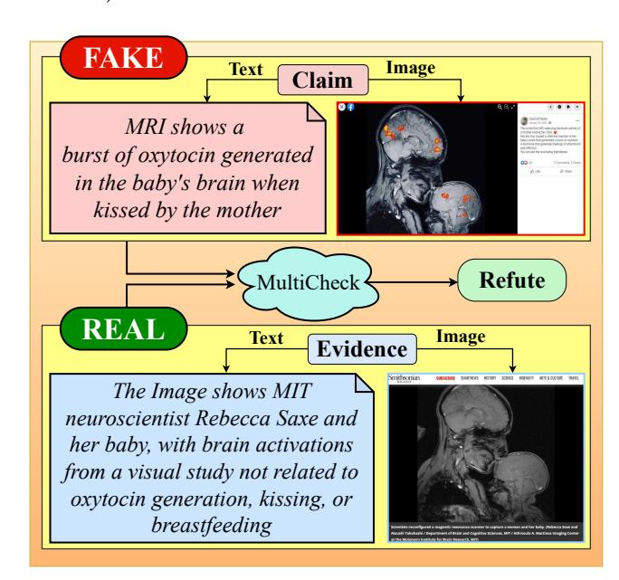
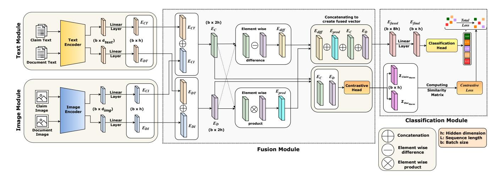
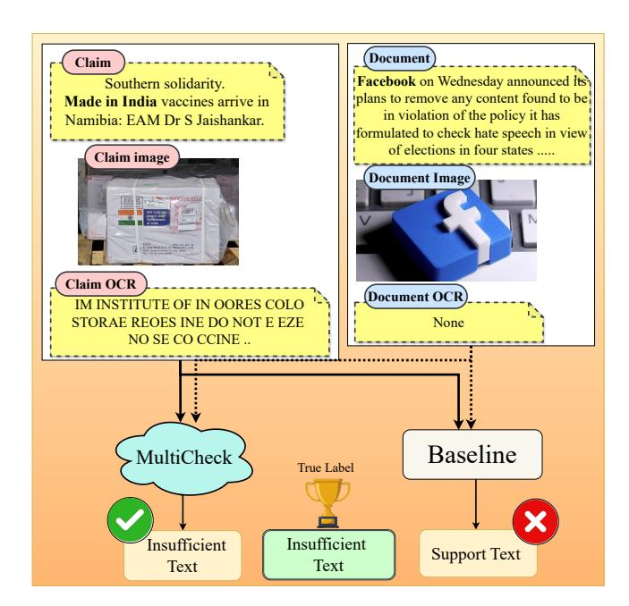
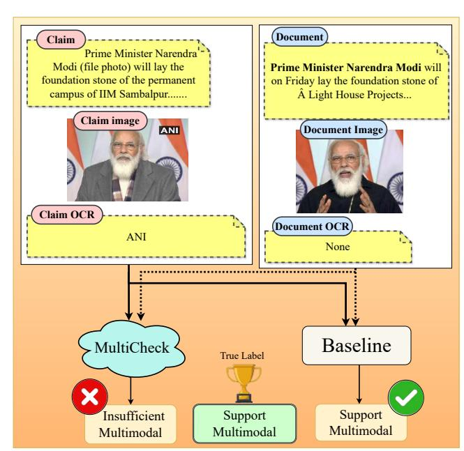
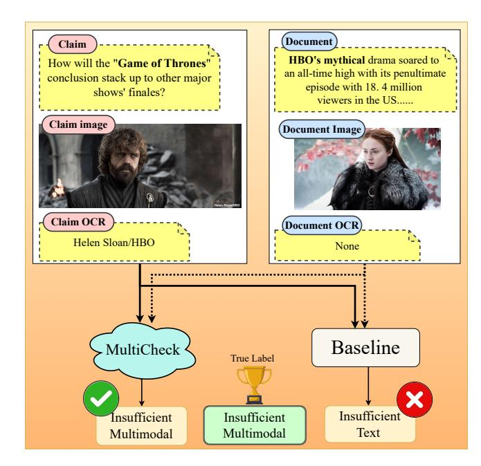

# MultiCheck: Strengthening Web Trust with Unified Multimodal Fact Verification

Aditya Kishore adityak21@iiserb.ac.in IISER Bhopal

Gaurav Kumar gaurav22@iiserb.ac.in IISER Bhopal

Jasabanta Patro jpatro@iiserb.ac.in IISER Bhopal

## Abstract

Misinformation on the web increasingly appears in multimodal forms, combining text, images, and OCR-rendered content in ways that amplify harm to public trust and vulnerable communities. While prior fact-checking systems often rely on unimodal signals or shallow fusion strategies, modern misinformation campaigns operate across modalities and require models that can reason over subtle cross-modal inconsistencies in a transparent and responsible manner. We introduce MultiCheck, a lightweight and interpretable framework for multimodal fact verification that jointly analyzes textual, visual, and OCR evidence. At its core, MultiCheck employs a relational fusion module based on element-wise difference and product operations, allowing for explicit cross-modal interaction modeling with minimal computational overhead. A contrastive alignment objective further helps the model distinguish between supporting and refuting evidence while maintaining a small memory and energy footprint, making it suitable for low-resource deployment. Evaluated on the Factify-2 (5-class) and Mocheg (3-class) benchmarks, MultiCheck achieves huge performance improvement and remains robust under noisy OCR and missing modality conditions. Its efficiency, transparency, and real-world robustness make it well-suited for journalists, civil society organisations, and web integrity efforts working to build a safer and more trustworthy web.

## CCS Concepts

• Computing methodologies → Machine learning; Representation Learning; Scene understanding / Visual content analysis; • Information systems → Multimedia information systems; • Applied computing → Document management and text processing; Document capture; Optical character recognition.

# Keywords

Multimodal Fact-Checking, Online Misinformation Detection, Web Trust and Safety, Vision–Language Alignment, Low-Resource Fact Verification, Responsible AI for the Web

# 1 Introduction:

Misinformation has emerged as a critical challenge in today's digital ecosystem, with significant impacts across domains such as politics, public health, and finance [\[7\]](#page-8-0). While early misinformation was primarily text-based [\[13,](#page-8-1) [24,](#page-8-2) [31\]](#page-8-3), recent campaigns increasingly blend text with images, audio, and video, making false claims more persuasive and harder to detect [\[1,](#page-8-4) [5,](#page-8-5) [30\]](#page-8-6). This surge in multimodal misinformation exposes the limitations of traditional fact-checking systems, which focus mainly on textual content [\[6,](#page-8-7) [30,](#page-8-6) [40\]](#page-8-8). As a result, the research community has shifted toward multimodal fact-checking, where claims are verified using both textual and

visual signals [\[3,](#page-8-9) [6\]](#page-8-7). Benchmarks such as FEVER [\[38\]](#page-8-10), Mocheg [\[44\]](#page-9-0), and Factify 2 [\[37\]](#page-8-11) have accelerated progress in this direction (see Section [2\)](#page-1-0).

Figure 1: Refuting a viral claim using combined text and image evidence.

As illustrated in Figure [1,](#page-0-0) a viral claim may be paired with a scientificlooking image that appears credible but is actually unrelated. Detecting such inconsistencies requires going beyond surface-level alignment to capture nuanced cross-modal relationships.

Despite this progress, multimodal fact-checking remains an open challenge. Unlike simple classification, it requires structured reasoning to determine whether modalities truly support or contradict each other. Existing approaches have generally followed one of the two strategies: (i) concatenating text–image embeddings [\[10,](#page-8-12) [28\]](#page-8-13), or (ii) performing late fusion of modality-specific encoders [\[17\]](#page-8-14). For example, Mocheg [\[44\]](#page-9-0) processes claims and evidence with separate encoders before shallow fusion, while Pro-CoFactv2 [\[15\]](#page-8-15) leverages attention-based mechanisms. Although these models capture imprecise correlations, they often miss fine-grained contradictions and struggle to understand modality-specific support signals, leading to limited transparency in reasoning about a claim. To overcome these limitations, we introduced "MultiCheck", a unified multimodal fact-checking framework that explicitly models cross-modal interactions. Our design integrates two key components: (i) a fusion module that captures semantic relations through element-wise difference and product operations, and (ii) a contrastive learning

objective that aligns semantically consistent claim–document pairs within a shared latent space, thereby improving representation consistency across modalities. This approach is motivated by prior advances in multimodal relational reasoning, where element-wise operations have proven effective in capturing fine-grained interactions in natural language inference [\[11\]](#page-8-16) and bilinear attention models [\[25\]](#page-8-17). These operations enable the model to encode both alignment and divergence between modalities, producing richer cross-modal representations. To further enhance semantic alignment, we introduced a contrastive head that applies a symmetric InfoNCE loss [\[33\]](#page-8-18) on projected claim–document embeddings, pulling together related pairs while pushing apart unrelated ones. Unlike prior approaches that rely on frozen embeddings or shallow probing over large VLMs such as PaLI-Gemma [\[8\]](#page-8-19), often wrapped in multi-stage agentic pipelines [\[6\]](#page-8-7), MultiCheck is fully trainable end-to-end. It uses compact text and image encoders, a simple relational fusion module based on element-wise difference and product, and a supervised contrastive head to jointly optimize classification and alignment. This purely discriminative design avoids heavy generative decoding and complex retrieval logic while still delivering competitive performance, making MultiCheck more suitable for resource-constrained, energy-aware multimodal fact verification. Our contributions are following,

- We proposed MultiCheck, a unified multimodal fact checking architecture that jointly models structured text, images, and OCR signals. We did an extensive experimental study across two benchmarks, Factify-2 and Mocheg, with multiple language vision backbones, fusion strategies, and training objectives. Our approach surpasses the baselines by a huge margin (gain of 47% and 33% in macro-f1 for factify2 and mocheg, respectively).
- We performed a comprehensive error analysis using statistical significance tests, showing that our model not only outperforms the baseline but does so in a structurally meaningful way, correcting more errors than it introduces. We supported our findings through qualitative analysis, highlighting how OCR cues and visual metadata can decisively shift predictions in subtle cases often missed by prior systems.
- Beyond standard evaluations, we further investigated Multi-Check's robustness under modality imbalance, OCR noise, and contrastive loss hyperparameters (��, ��), providing quantitative evidence of stability and graceful degradation.

# 2 Related works:

Recent research in automated fact-checking has highlighted the growing importance of incorporating multiple modalities, to tackle the diverse and evolving forms of misinformation [\[2\]](#page-8-20). Early works, such as FEVER [\[39\]](#page-8-21) and CLEF2018 [\[32\]](#page-8-22) are primarily focused on verifying textual claims, laying foundational methods for claim verification based solely on textual evidence. However, later studies found that misinformation exploits images, videos, and audio alongside text to build convincing narratives [\[4,](#page-8-23) [19\]](#page-8-24). These studies have revealed the limitations of purely text-based fact-checking methods and sparked a shift toward multimodal fact-checking. To tackle the limitation of text-based methods, systems were designed

to jointly process and reason over diverse types of content. For example, several studies, such as [\[17\]](#page-8-14) and [\[23,](#page-8-25) [46\]](#page-9-1), have explored architectures that integrated textual and visual features. These models employ mechanisms like attention or contrastive learning to enhance detection accuracy. Recent work has also leveraged large vision–language models (VLMs) for fact verification. Cekinel et al. [\[8\]](#page-8-19) proposed a probing-based classifier that uses a frozen PaLI-Gemma VLM with lightweight heads, achieving strong results on Factify-2. [\[6\]](#page-8-7) introduced DEFAME, a dynamic agent that combines multiple multimodal experts through a multi-stage retrieval and reasoning pipeline. These approaches showcase the power of VLMs but incur high computational and energy costs and require complex inference pipelines. In addition to these developments, comprehensive surveys, such as [\[3\]](#page-8-9), offer a detailed overview regarding the emerging field of multimodal fact-checking. They highlighted both the technical challenges and the promising research directions ahead. Key challenges include aligning information across modalities, managing incomplete or noisy evidence, and ensuring scalability for practical deployment. Despite significant progress, effectively integrating multimodal information remains an open research problem. This challenge continues to motivate the development of new architectures and learning methods. Robust fact verification in multimodal contexts still requires innovative solutions.

# 3 Dataset details:

For our experiments, we use two multimodal fact-checking datasets: Factify-2 [\[16\]](#page-8-26) and Mocheg [\[43\]](#page-9-2). Factify-2 contains 50,000 claim– evidence pairs sourced from verified news outlets and fact-checking platforms. Each instance includes the claim text, supporting or refuting evidence text, an associated image, and OCR-extracted text isllustrated in Figure [2,](#page-2-0) and is annotated using a five-class labeling scheme. Since the official test set is not publicly available, we follow the protocol of Cekinel et al. [\[8\]](#page-8-19) and treat the validation set as test data, reallocating 7,500 training examples to form a new validation split. Mocheg, in contrast, comprises 15,601 claims collected from fact-checking websites[1](#page-1-1) and annotated with three labels. The dataset includes a large amount of retrieved multimodal evidence, consisting of text and images taken from journalist-verified rulings. This makes Mocheg a stronger and more challenging open-domain benchmark. We used the official train/validation/test split provided in our experiments. The distribution of samples across classes for both datasets are reported in Table [1.](#page-2-1)

# 4 Methodology:

In this section, we present our proposed framework, illustrated in Figure [4.](#page-3-0) The framework consists of four components: (i) a text module, (ii) an image module, (iii) a fusion module, and (iv) a classification module. We describe each component in detail below. Text module: We used this module to generate text embeddings for claims and evidence documents. To create a claim embedding, we first concatenated the claim text with the OCR-extracted text from the claim image and then passed the combined input to a text encoder. We followed the same procedure to create the document embeddings (see Figure [3\)](#page-2-2). We employed pre-trained language

1<https://www.politifact.com>

"CNN PROJECTION: Joe Biden wins Colorado"...

**Claim**

**Claim Image**

*"CNN PROJECTION JOE BIDEN WINSO COLORADO E 2020 CAN"*

**Claim OCR**

*"ABC News characterized Joe Biden as the apparent winner, he is set to become the 46th president of the U.S"..*

**Document**

**Document Image**

**Document OCR**

*"NEWS YOUR VOICE YOUR VOTE 2020 OREGON PROJECTED WINNER JOE BIDEN"*

Figure 2: Example of a sample from the Factify 2.

| Classes                 | Factify | Train 2 Dataset | Validation [16] | Test  | Total  |
|-------------------------|---------|-----------------|-----------------|-------|--------|
| Support_Multimodal      |         | 5,580           | 1,420           | 1,500 | 8,500  |
| Support_Text            |         | 5,485           | 1,515           | 1,500 | 8,500  |
| Insufficient_Multimodal |         | 5,472           | 1,528           | 1,500 | 8,500  |
| Insufficient_Text       |         | 5,494           | 1,506           | 1,500 | 8,500  |
| Refute                  |         | 5,469           | 1,531           | 1,500 | 8,500  |
| Total (Factify 2)       |         | 27,500          | 7,500           | 7,500 | 42,500 |
|                         |         | Mocheg Dataset  | [44]            |       |        |
| Supported               |         | 3,826           | 501             | 817   | 5,144  |
| Refuted                 |         | 4,542           | 488             | 825   | 5,855  |
| Not Enough Info         |         | 3,301           | 501             | 800   | 4,602  |
| Total (Mocheg)          |         | 11,669          | 1,490           | 2,442 | 15,601 |

Table 1: Dataset statistics for Factify 2 and Mocheg across training, validation, and test splits.

models such as RoBERTa [\[27\]](#page-8-27), DeBERTa [\[21\]](#page-8-28), and SBERT [\[35\]](#page-8-29) as text encoders. Finally, we used a linear layer to ensure uniformity between the text and image module embeddings. Mathematically,

��CT ∈ R ��×ℎ ��DT ∈ R ��×ℎ

Where the claim and evidence document text embeddings are represented by ��CT and ��DT , respectively. Further, ℎ and �� represent the common latent space dimensionality and the batch size, respectively.

Image module: We use the image module to obtain embeddings for the images associated with claims and their corresponding evidence documents. To create an image embedding, we pass each image through a vision encoder, either ResNet50 [\[20\]](#page-8-30) or the Vision Transformer (ViT) [\[14\]](#page-8-31). We then apply a linear layer to ensure uniformity between the image and text module embeddings. Mathematically,

Figure 3: Illustration: The claim suggests Nepal shot down an Indian helicopter. However, the OCR text contradicts this by suggesting Indian aggression, not Nepali. Without OCR, the model could misclassify this. The fused text representation enables correct "Refute" labeling.

��CI ∈ R ��×ℎ ��DI ∈ R ��×ℎ

Where the claim and evidence document image embeddings are represented by ��CI and ��DI , respectively. Similarly,ℎ and�� represent latent space dimensionality and the batch size like previously. Fusion module: Our key innovation lies in the fusion module. While prior systems relied on simple feature concatenation [\[29,](#page-8-32) [36,](#page-8-33) [42\]](#page-9-3), our framework employed element-wise difference and product between claim and evidence embeddings to explicitly capture their alignment and divergence. Our approach is inspired by past works [\[10,](#page-8-12) [11,](#page-8-16) [18,](#page-8-34) [25,](#page-8-17) [26\]](#page-8-35), where a similar philosophy is used for natural language inference and modeling relational reasoning across modalities. We took ��CT , ��DT , ��CI and, ��DI generated by prior modules as input. The multimodal representation embeddings of claims and evidence documents were generated by concatenating text and image embeddings. Mathematically,

��C = ��CT ⊕ ��CI , where ��C ∈ R ��×2ℎ ��D = ��DT ⊕ ��DI , where ��D ∈ R ��×2ℎ

Where ⊕ represents the concatenation operation. We then computed element-wise difference and product to highlight the differences and alignment between ��C and ��D. Past works [\[11,](#page-8-16) [25\]](#page-8-17) show that these vectors offer a feature-level map of alignment and mismatch between the text and the image, helping the model identify key agreements and contradictions across them [\[45\]](#page-9-4). Mathematically,

��diff = |��C ⊖ ��D| , where ��diff ∈ R ��×2ℎ ��prod = ��C ⊗ ��D , where ��prod ∈ R ��×2ℎ

where ⊖ and ⊗ denote element-wise difference and product, respectively. Finally, we constructed a fused embedding by concatenating

Figure 4: Intuitive fusion representation using element-wise difference and product.

��diff, ��prod, ��C , and ��D . Mathematically,

��fused = ��diff ⊕ ��prod ⊕ ��C ⊕ ��D, where ��fused ∈ R ��×8ℎ

We believe this fused embedding robustly captures the refined interactions between text and image, providing a compact representation well-suited for veracity classification. Simultaneously, we integrated a contrastive projection head [\[41\]](#page-9-5) that encourages semantic alignment between matching claim-document pairs. Specifically, the embeddings ��C and ��D are passed through a shared two-layer projection network to obtain projected embeddings. Mathematically,

Zclaim = ��proj(��C) Zdoc = ��proj(��D)

where the projection function ��proj is defined as:

��proj(E) = W2 · ReLU(��1 · �� + B1) + B2

where, W1 ∈ R 2ℎ×ℎ , W2 ∈ R ℎ×ℎ , and B1, B2 ∈ R

where, W1, W2, B1 and B2 are weights and biases. This bottleneck structure compresses the dimension from 2h to h and reprojects it, yielding richer discriminative embeddings. Reprojecting these vectors from 2ℎ to ℎ removes duplication from concatenation, compressing features into a compact, discriminative space [\[9\]](#page-8-36). It balances contributions from text and image modalities, improving cross-modal alignment [\[34\]](#page-8-37). This shared latent space ensures cosine similarity captures true semantic claim–document alignment rather than raw backbone artifacts [\[33\]](#page-8-18). The resulting vector embeddings, Zclaim and Zdoc, are used to compute a symmetric InfoNCE loss [\[33\]](#page-8-18) during training. This loss pulls embeddings of matching claim–document pairs closer and pushes unrelated ones apart. By enforcing semantic alignment across modalities, it sharpens the model's ability to capture subtle cross-modal differences, improving both generalization and robustness.

Classification module: We used this module to classify the category of a claim over fine-grained veracity labels. We take the fused embedding vector from the fusion module and process it through a feedforward network with GELU activation [\[22\]](#page-8-38), and dropout regularization. The resulting representation serves as the

final embedding vector for classification. It is then passed to the classification head, which outputs predictions across veracity labels. Mathematically,

��final = FFN(��fused) ∈ R ��×ℎ

This final vector ��final is passed through a linear classifier:

P = Wcls · ��final + B, P ∈ R ��×��

where P contains the predicted logits over the �� veracity labels. We used the standard cross-entropy loss to supervise this classification. Mathematically,

LCE = − 1 �� ∑︁ ��=1 log exp ����,���� Í�� ��=1 exp ����,�� !

Here, Z ∈ R ��×�� is the logit matrix, where ����,�� is the logit for sample �� and class ��, and ���� is the index of the correct class for sample ��. Simultaneously, to improve discriminative learning and cross-modal alignment, we employed a symmetric contrastive loss (InfoNCE). The projected embeddings Zclaim and Zdoc are normalized to unit length following L2 Norm, ensuring that similarity comparisons depend only on their semantic content[\[33\]](#page-8-18). Mathematically,

zˆ = z ∥z∥2

We then computed the pairwise similarity matrix S as:

S = Zˆ claim · Zˆ ⊤ doc ∈ R ��×��

The ������ represents the cosine similarity between the ��-th claim and ��-th document. Then the InfoNCE loss is computed in both directions: (i) claim → evidence document and (ii) document evidence → claim

Lossclaim→doc = − 1 �� ∑︁ ��=1 log exp (������/��) Í�� ��=1 exp ������ /�� Lossdoc→claim = − 1 �� ∑︁ �� ��=1 log exp ���� �� /�� Í�� ��=1 exp ������ /�� 

Where, �� is the batch size and �� &gt; 0 is a temperature hyperparameter that controls the sharpness of the softmax. In Lclaim→doc, each row �� treats document �� as the positive example and all other documents where �� ≠ �� in the batch as in-batch negatives: the numerator exp(������/��) is the score of the true claim–document pair, while the denominator Í�� ��=1 exp(������ /��) sums over all documents in the batch. The reverse loss Ldoc→claim is defined analogously by viewing each document as the query and each claim as a candidate match. Then we take the average of both to calculate the final contrastive loss:

Lcontrastive = 1 2 (Lossclaim→doc + Lossdoc→claim)

The total training objective combines classification and contrastive supervision:

Ltotal = LCE + �� · Lcontrastive

Where �� balances the influence of the contrastive signal. We configured �� = 0.1 in all experiments. We believe this dual-objective training not only improves classification accuracy but also structures the latent space such that semantically aligned claim-document pairs are closer, while unrelated pairs remain well-separated. Empirically, the inclusion of the contrastive head consistently yields performance gains across all evaluated models. In line with prior findings, InfoNCE-based contrastive learning enhances discriminative representations across modalities [\[33,](#page-8-18) [34\]](#page-8-37).

### 5 Experiments:

In this section, we have reported our experiments to evaluate the effectiveness of the proposed framework.

#### 5.1 Experimental setup:

All experiments were conducted on a single NVIDIA A100 80GB GPU using PyTorch and Hugging Face Transformers. We evaluated the model performance using the macro F1 score, which balances class-wise F1 scores based on support (i.e., true instance count per class). We performed thorough hyperparameter tuning for both the contrastive and non-contrastive variants. The final configurations for the experiments are reported in Table [2.](#page-4-0) We assessed how (i) learning strategies, (ii) language and vision models, and (iii) fusion methods with element-wise operations affect the performance.

| Component        | Hyperparameter     | Value             |
|------------------|--------------------|-------------------|
| Reproducibility  | Seeds              | 42, 57, 196, 906  |
| Tokenization     | Max length         | 128               |
| Contrastive Loss | Temperature ( �� ) | 0.1               |
|                  | Loss weight ( �� ) | 0.1               |
| Optimization     | Optimizer          | Adam              |
|                  | Learning rate      | 1 × 10 − 5        |
|                  | Batch size         | 32                |
|                  | Num workers        | 4                 |
|                  | Epochs             | 20                |
| LR Scheduling    | Scheduler          | ReduceLROnPlateau |
| Early Stopping   | Patience           | 5                 |

Table 2: Hyperparameter settings used in all experiments.

## 5.2 Baselines:

For comparative evaluation, we considered two state-of-the-art models as baselines. They are explained in the following,

Baseline 1: We reproduced the Pro-CoFactv2 model, originally proposed by [\[15\]](#page-8-15) as our first baseline. This model leverages large pretrained encoders: DeBERTa-large for text and SwinV2-base for images, along with co-attention blocks, adapter layers, and a feature extractor. Both encoders are unfrozen and trained end-to-end. It applies linear fusion of text and image features, and jointly optimises a multi-loss objective: cross-entropy for classification and a supervised contrastive loss scaled by 0.3 to improve intra-class alignment in the embedding space. We replicated the original configuration using the same random seeds (42, 57, 196, 906), learning rate (5×10−5 ), batch size (32), and training duration (20 epochs). Sequence length is set to 128 due to GPU constraints, with a dropout rate of 0.1, 12 attention heads, and an intermediate hidden dimension of 256. Reproduced baseline performance is reported in Table [3.](#page-4-1)

Baseline 2: We also compared MultiCheck against the PaLI-Gemmabased system of Cekinel et al. [\[8\]](#page-8-19). Their work investigates multimodal fact-checking with large vision language models and reports both probing and fine-tuning results on Mocheg and Factify-2. For a fair comparison with our fully supervised setting, we use their fine-tuned PaLI-Gemma-3B model as a strong VLM baseline. Following Cekinel et al. [\[8\]](#page-8-19), we adopted the three-way label mapping on Factify-2 (merging Support\_Text / Support-Multimodal into Support, and Insufficient\_Text / Insufficient-Multimodal into NEI) and use the same three-way scheme on Mocheg. We directly compared our macro F1 scores on these three-way setups to the reported PaLI-Gemma fine-tuning results (Factify-2: 0.83 macro F1; Mocheg: 0.36 macro F1), treating them as a high-capacity, VLM-based reference point for end-to-end training rather than zero-shot prompting or pure probing. Although, due to our resource constraints, we were unable (it requires 60GB GPU memory and 37 hours to complete an epoch) to reproduce this baseline, we are reporting the actual values claimed by it for comparison to MultiCheck.

| Class        |            | Precision |         | Recall |         | F1   | Score   |
|--------------|------------|-----------|---------|--------|---------|------|---------|
| Support      | Text       | 0.48      | (±0.04) | 0.38   | (±0.06) | 0.42 | (±0.03) |
| Support      | Multimodal | 0.50      | (±0.04) | 0.61   | (±0.02) | 0.55 | (±0.02) |
| Insufficient | Text       | 0.50      | (±0.01) | 0.44   | (±0.07) | 0.46 | (±0.04) |
| Insufficient | Multimodal | 0.43      | (±0.02) | 0.46   | (±0.06) | 0.44 | (±0.02) |
| Refute       |            | 0.98      | (±0.00) | 0.98   | (±0.00) | 0.98 | (±0.00) |
| Macro        | F1 Score   |           |         | 0.57   | (±0.01) |      |         |

Table 3: Performance of the reproduced baseline 1 model (Pro-CoFactv2) on the Factify 2 dataset.

## 5.3 Experimental variants:

To thoroughly evaluate our models, we considered three variants of them. They are,

- With contrastive Head: This version integrates the contrastive projection head applied to ��C and ��D. Training includes a contrastive loss in addition to the standard crossentropy loss. We believe this encourages the model to learn modality-consistent and semantically aligned embeddings.
- With-out contrastive Head: In this version, the contrastive projection head and the associated loss are omitted. The model relies solely on cross-entropy loss for classification.

- Quantised version: To study efficient resource-conscious configurations, we additionally considered the quantized version of LLMs with 4-bit QLoRA [\[12\]](#page-8-39) adapters in MultiCheck. Specifically, we considered (i) the 4-bit quantized versions of the considered language models (DeBERTa, RoBERTa and SBERT), (ii) 4-bit quantized versions of LLaMA-3.1-8B and Mistral-7B with 4-bit QLoRA adapters. They are trained endto-end with the image encoder, while the contrastive head configurations remain unchanged (see Section 9.1 in the Appendix).

## 6 Results and Discussion:

In the following, we have reported our findings for various experimental setups. For Mocheg, we have reported results for the original 3-class labels. For Factify-2, we have reported results for both the 5-class and 3-class variants, allowing for direct comparison with different baselines. Some of the tables are kept in the appendix due to space constraints.

## 6.1 With contrastive head:

- Factify2/5-class:- For this configuration, we have reported the results in Table [4.](#page-6-0) Many of our model variants, such as RoBERTa+ResNet50, RoBERTa+ViT, and DeBERTa+ViT having the highest performance(∼ ���� 1 : 0.84, 47% ↑), outperform the highest macro-f1 reported baseline (���� 1 : 0.57:, see Table [3\)](#page-4-1). Gains are particularly high for the "Insufficient" (78% ↑ gain) and "Support" (68% ↑ gain) categories. All improvements are statistically significant (see, Table [12\)](#page-10-0).
- Factify2/3-class:- The results for this configuration are reported in Table [9.](#page-6-1) Several MultiCheck variants, such as RoBERTa+ResNet50, RoBERTa+ViT, DeBERTa+ViT, DeBERTa +ResNet50, and SBERT+ResNet50, outperform PaLI-Gemma (baseline 2) by a large margin (a maximum of ∼ ���� 1 : 0.90, 91% ↑). The largest gains are observed for "Support" ( 15% ↑) and "NEI" ( 15% ↑), while "Refute" remains essentially saturated (∼ 1.00).
- Mocheg/3-class:- : We have reported the results of this configuration in Table [6.](#page-6-2) Several MultiCheck variants, such as RoBERTa+ResNet50, DeBERTa+ResNet50 and RoBERTa+ViT, outperform PaLI-Gemma (baseline 2) by a significant margin (maximum ∼ ���� 1 : 0.48, 33% ↑)). All the labels, "Support" ( 24% ↑), "NEI" ( 117% ↑), and "Refute" ( 29% ↑) showed substantial improvements.

## 6.2 Without contrastive head:

- Factify2/5-class:- For this configuration, we have reported the results in Table [13.](#page-10-1) Many of our model variants, such as Roberta + ResNet50, Roberta + ViT and DeBERTa + ViT outperform the highest macro-f1 reported baseline (���� 1: 57, refer Table 15). All three of our best models achieved a macro-f1 score of 0.82 with a gain of (∼ 43.85% ↑) compared to the baseline. Gains are particularly significant for the "Insufficient" and "Support" categories. All improvements are statistically significant (see, Table 14)
- Factify2/3-class:- The results for this configuration are reported in Table [10.](#page-7-0) Several MultiCheck variants, such as

Roberta + ResNet50 (∼ ���� 1 : 0.86, 2.38% ↑) , Roberta + ViT (∼ ���� 1 : 0.87, 3.57% ↑), DeBERTa + ViT (∼ ���� 1 : 0.87, 3.57% ↑), DeBERTa + ResNet50 (∼ ���� 1 : 0.88, 4.76% ↑) and SBERT + ResNet50 (∼ ���� 1 : 0.86, 2.38% ↑) outperform PaLI-Gemma (baseline 2) (���� 1 : 0.84). The largest gains are observed for "Support" ( %) and "NEI" (0.76→0.85), while "Refute" remains essentially saturated ( ���� : 1).

- Mocheg/3-class:-: We have reported the results of this configuration in Table [8.](#page-6-3) Several MultiCheck variants, such as Roberta + ResNet50 (∼ ���� 1 : 0.43, 19.4% ↑), and DeBERTa + ResNet50 (∼ ���� 1 : 0.40, 11.1% ↑), outperform PaLI-Gemma (baseline 2) by a significant margin.

## 6.3 Quantized Version:

As we didn't see much variation in performance upon changing the random seeds, for quantized experiments, we produced results for a single seed. Our observatons are following,

- Factify2/5-class:- For this configuration, we have reported the results in Table [5.](#page-6-4) Two models LLaMa-3.1-8B QLoRA + ResNet50 and Mistral7B QLoRA + ResNet50 achieved the highest macro-f1 performance of 0.84, which is equal to the macro-f1 performance of Roberta+ResNet50, Roberta+ViT and DeBERTa+ViT model for Factify 2 dataset. There is a drop in macro-f1 performance in quantized model like Roberta QLoRA + ResNet50 (MF1: 0.82) as compared to Roberta + ResNet50 (MF1: 0.84) by 2.38% ↓.
- Mocheg/3-class:- : We have reported results for this configuration in Table [7.](#page-6-5) Mistral7B QLoRA + ResNet50 model reported the highest macro-f1 score of 0.49 among all other quantized model for Mocheg dataset. It can be observed that there is a drop in macro-f1 performance for quantized model as compared to model with contrastive head for this dataset as well. Interestingly, the DeBERTa QLoRA + ViT has achieved macro-f1 value of 0.47 which is higher than the macro-f1 value of DeBERTa + ViT model (MF1: 0.39) by 20.50% ↑.

# 6.4 Statistical significance test:

We did statistical significance tests with respect to baseline-1 (for the 5-class variant of Factify2). However, we could not do the same for baseline-2 (impacting the 3-class variant of Factify2 and Mocheg), which is not reproducible under a realistic GPU budget (requires 37 hours for a single epoch). We applied McNemar's test for overall accuracy and Bowker's test for class-level shifts. Tables [12](#page-10-0) show consistently high �� scores with p-values < 0.05, confirming significant improvements. Whereas Bowker's results further indicate structured, non-random gains in class predictions.

# 7 Ablation Studies:

- Modality Masking: To assess reliance on visual signals, we masked either the claim or document image while keeping text and OCR intact. Performance drops were modest: the full model (RoBERTa + ResNet50, contrastive head) fell from 0.84 → 0.75 when masking the claim image (–0.09) and 0.84 → 0.73 when masking the document image (–0.11). This shows that MultiCheck degrades gracefully and that text + OCR provide the primary discriminative signal, while images act

| Models   | With       | Contrastive | Head Support | Text    | Support | Multimodal | Insufficient | Text    | Insufficient | Multimodal | Refute |         | Macro | F1      |
|----------|------------|-------------|--------------|---------|---------|------------|--------------|---------|--------------|------------|--------|---------|-------|---------|
| Roberta  | +          | ResNet50    | 0.77         | (±0.02) | 0.83    | (±0.01)    | 0.82         | (±0.00) | 0.76         | (±0.02)    | 1.00   | (±0.00) | 0.84  | (±0.01) |
| Roberta  | +          | ViT         | 0.77         | (±0.02) | 0.84    | (±0.01)    | 0.82         | (±0.00) | 0.77         | (±0.01)    | 1.00   | (±0.00) | 0.84  | (±0.01) |
| DeBERTa  |            | + ViT       | 0.77         | (±0.01) | 0.84    | (±0.01)    | 0.83         | (±0.00) | 0.78         | (±0.01)    | 1.00   | (±0.00) | 0.84  | (±0.01) |
| DeBERTa  |            | + ResNet50  | 0.76         | (±0.02) | 0.81    | (±0.02)    | 0.81         | (±0.01) | 0.75         | (±0.02)    | 1.00   | (±0.00) | 0.83  | (±0.01) |
| SBERT    | + ResNet50 |             | 0.75         | (±0.01) | 0.83    | (±0.01)    | 0.79         | (±0.00) | 0.76         | (±0.01)    | 1.00   | (±0.00) | 0.82  | (±0.00) |
| Baseline | 1          |             | 0.42         | (±0.03) | 0.55    | (±0.02)    | 0.46         | (±0.04) | 0.44         | (±0.02)    | 0.98   | (±0.00) | 0.57  | (±0.01) |

Table 4: Class-wise F1 scores and Macro F1 for model combinations with contrastive head on Factify 2.

| QLoRA     | Models       | With Contrastive | Head Support Text | Support Multimodal | Insufficient Text | Insufficient Multimodal | Refute | Macro F1 |
|-----------|--------------|------------------|-------------------|--------------------|-------------------|-------------------------|--------|----------|
| Roberta   | QLoRA        | + ResNet50       | 0.73              | 0.81               | 0.79              | 0.75                    | 0.99   | 0.82     |
| Roberta   | QLoRA        | + ViT            | 0.74              | 0.82               | 0.79              | 0.74                    | 0.99   | 0.81     |
| DeBERTa   | QLoRA        | + ViT            | 0.74              | 0.82               | 0.78              | 0.75                    | 0.99   | 0.81     |
| DeBERTa   | QLoRA        | + ResNet50       | 0.73              | 0.80               | 0.78              | 0.75                    | 0.99   | 0.82     |
| SBERT     | QLoRA        | + ResNet50       | 0.67              | 0.79               | 0.73              | 0.71                    | 0.99   | 0.77     |
|           | LLaMA-3.1-8B | QLoRA + ResNet50 | 0.78              | 0.83               | 0.82              | 0.77                    | 1.00   | 0.84     |
|           | LLaMA-3.1-8B | QLoRA + ViT      | 0.69              | 0.80               | 0.77              | 0.72                    | 0.97   | 0.79     |
| Mistral7B | QLoRA        | + ResNet50       | 0.78              | 0.83               | 0.82              | 0.77                    | 1.00   | 0.84     |
| Mistral7B | QLoRA        | + ViT            | 0.67              | 0.80               | 0.76              | 0.71                    | 0.98   | 0.78     |

Table 5: Class-wise F1 scores and Macro F1 for model combinations with contrastive head on Factify 2 using QLoRA.

Table 6: Mocheg results (3-way: Support, NEI, Refute). Each value is mean F1 ± std across seeds.

| QLoRA     | Model        |      | With             |         |      |        |          |
|-----------|--------------|------|------------------|---------|------|--------|----------|
|           | Contrastive  | Head |                  |         |      |        |          |
|           |              |      |                  | Support | NEI  | Refute | Macro F1 |
| Roberta   | QLoRA        | +    | ResNet50         | 0.40    | 0.31 | 0.54   | 0.42     |
| Roberta   | QLoRA        | +    | ViT              | 0.37    | 0.32 | 0.51   | 0.40     |
| DeBERTa   | QLoRA        | +    | ViT              | 0.46    | 0.38 | 0.57   | 0.47     |
| DeBERTa   | QLoRA        | +    | ResNet50         | 0.46    | 0.39 | 0.57   | 0.47     |
| SBERT     | QLoRA        | +    | ResNet50         | 0.31    | 0.29 | 0.52   | 0.37     |
|           | LLaMA-3.1-8B |      | QLoRA + ResNet50 | 0.43    | 0.43 | 0.58   | 0.48     |
|           | LLaMA-3.1-8B |      | QLoRA + ViT      | 0.15    | 0.33 | 0.28   | 0.25     |
| Mistral7B | QLoRA        | +    | ResNet50         | 0.46    | 0.44 | 0.58   | 0.49     |
| Mistral7B | QLoRA        | +    | ViT              | 0.13    | 0.32 | 0.30   | 0.25     |

Table 7: Mocheg results (3-way: Support, NEI, Refute). Each value is mean F1 ± std across seeds.

Table 8: Mocheg results (3-way: Support, NEI, Refute) without contrasive head. Each value is mean F1 ± std across seeds.

Table 9: Factify 2 (3-way: Support, NEI, Refute) contrastive head. Each value is mean F1 ± std across seeds.

- OCR Noise Robustness: We injected ≈ 20% synthetic OCR noise into both claim and document text to evaluate noise robustness. Performance remained effectively unchanged (0.84 → 0.84, �� ≈ 0.0037), indicating that MultiCheck is highly stable under OCR corruption. The contrastive objective helps stabilize the model, preventing degradation under noisy text.

Table 10: Factify 2 (3-way: Support, NEI, Refute) without contrastive head. Each value is the mean F1 ± std across seeds.

- Hyper-parameter sensitivity of contrastive loss We performed a grid sweep over �� and �� reported in Table [11.](#page-7-1) Performance is stable in the 0.82–0.83 macro-F1 band, with a shallow optimum around (��, ��) ≈ (0.1, 0.1), confirming robustness of the dual-loss design.

Table 11: Macro F1 and accuracy across ��, �� combinations.

# 8 Error analysis:

We analysed the prediction mismatches between our approach and the baseline to better understand model behaviour. As shown in Figure [5,](#page-9-6) the baseline relied only on text, predicting Insufficient Text. However, our model used the OCR credit "Helen Sloan/HBO" to recognize the image as a licensed promotional photograph, details suggesting the image does not contribute new factual content, and correctly predicted Insufficient Multimodal. By recognizing the lack of substantive support in text and image, our model rightly predicted Insufficient Multimodal. This highlights the role of OCRextracted image sources in improving factual reasoning. Additional examples are discussed below:

## Additional examples of qualitative analysis:

Here, we have presented the dataset-referenced examples comparing our model with the baseline, showing how OCR cues such as credits, agency marks, or overlays can clarify or complicate the multimodal verification.

## Example A: When MultiCheck outperforms the baseline

- ID 4681: The baseline, relying only on text, misclassified "Made in India vaccines" as Support\_Text. In contrast, our model's multimodal fusion leveraged the OCR cue "COLO STORAE" (cold storage) to detect ambiguity and correctly predicted Insufficient\_Text. In Figure [6,](#page-9-7) this illustrates how even noisy OCR can reveal context missed by text-only models.

- ID 6968: The baseline predicted Support\_Text based on name and context matches in text (e.g., "Governor Jagdeep Dhankar"). In contrast, our model used the OCR cue "ANI" to identify the image as a generic press photo and, combining it with weak textual alignment, correctly predicted Insufficient\_Multimodal. This demonstrates its ability to dismiss superficial visual signals.

#### Example B: When baseline outperforms MultiCheck

- ID 7171: In this illustrated in Figure [7,](#page-9-8) our model was overly cautious. The OCR tag "ANI" led it to dismiss the image as generic, resulting in an Insufficient\_Multimodal prediction. However, the textual portion "will lay foundation stone" is a direct and verifiable event announcement, and the image provided valid context. The baseline correctly predicted Support\_Multimodal, highlighting that OCR cues can sometimes mislead when visual content, though generic, remains contextually relevant.

## 8.1 Quantized variants and memory footprint.

To study the deployability of MultiCheck under strict GPU budgets, we evaluated both the initially configured variants and their 4-bit quantized counterparts. For the RoBERTa / DeBERTa / SBERT configurations, we applied NF4 QLoRA to the text encoder while keeping the ResNet50 or ViT image encoders unchanged. Tables 16 and 18 report the peak GPU memory usage during training at a batch size of 32, as measured by nvidia-smi. On Factify-2, quantization reduces memory usage by roughly 30–60% across all backbones. The macro-F1 drop is negligible or within a few points, indicating that MultiCheck's fusion and contrastive heads remain effective even with low-precision text encoders. We further replaced the text encoder with larger causal language models—LLaMA-3.1-8B and Mistral-7B—and trained them using 4-bit NF4 QLoRA. As shown in Tables 17 and 19, the quantized LLM-based variants fit within 13–15,GB of GPU memory while incurring only small performance degradation on Factify-2 (negligible for LLaMA/Mistral+ResNet50 and at most a 5–6 macro-F1 point drop for ViT-based models). On Mocheg, the quantized LLaMA/Mistral+ResNet50 models also maintain competitive performance with negligible loss, whereas the ViTbased variants show a larger drop, suggesting that a higher-capacity text backbone is more beneficial when paired with a stable visual encoder. Overall, these results demonstrate that MultiCheck can leverage modern LLM backbones in an energy- and memory-efficient manner, making it feasible to deploy multi-billion-parameter text encoders for multimodal fact-checking on a single commodity GPU.

## 9 Conclusion:

This paper introduced MultiCheck, a unified framework for finegrained multimodal fact-checking that jointly reasons over text, images, and OCR signals. By combining structured representations from pre-trained encoders with a relational fusion module (elementwise difference and product) and a supervised contrastive objective, MultiCheck captures subtle agreements and contradictions between claims and evidence. Across Factify-2 and Mocheg, our models consistently outperform strong baselines, with especially large gains on challenging "Insufficient" and "Refute" cases.

#### References

- [1] Sara Abdali, Sina Shaham, and Bhaskar Krishnamachari. 2024. Multi-modal misinformation detection: Approaches, challenges and opportunities. Comput. Surveys 57, 3 (2024), 1–29. [2] Sahar Abdelnabi, Rakibul Hasan, and Mario Fritz. 2022. Open-domain, contentbased, multi-modal fact-checking of out-of-context images via online resources. In Proceedings of the IEEE/CVF conference on computer vision and pattern recognition. 14940–14949. [3] Mubashara Akhtar, Michael Schlichtkrull, Zhijiang Guo, Oana Cocarascu, Elena Simperl, and Andreas Vlachos. 2023. Multimodal Automated Fact-Checking: A Survey. In Findings of the Association for Computational Linguistics: EMNLP 2023. 5430–5448. [4] Firoj Alam, Stefano Cresci, Tanmoy Chakraborty, Fabrizio Silvestri, Dimiter Dimitrov, Giovanni Da San Martino, Shaden Shaar, Hamed Firooz, and Preslav Nakov. 2022. A Survey on Multimodal Disinformation Detection. In Proceedings of the 29th International Conference on Computational Linguistics. 6625–6643. [5] Javahir Askari. 2023. Deepfakes and Synthetic Media: What are they and how are techUK members taking steps to tackle misinformation and fraud. TechUK. August 18 (2023). [6] Tobias Braun, Mark Rothermel, Marcus Rohrbach, and Anna Rohrbach. 2024. Defame: Dynamic evidence-based fact-checking with multimodal experts. arXiv preprint arXiv:2412.10510 (2024). [7] Maria Mercedes Ferreira Caceres, Juan Pablo Sosa, Jannel A Lawrence, Cristina Sestacovschi, Atiyah Tidd-Johnson, Muhammad Haseeb UI Rasool, Vinay Kumar Gadamidi, Saleha Ozair, Krunal Pandav, Claudia Cuevas-Lou, et al. 2022. The impact of misinformation on the COVID-19 pandemic. AIMS public health 9, 2 (2022), 262. [8] Recep Firat Cekinel, Pinar Karagoz, and Çağrı Çöltekin. 2025. Multimodal Fact-Checking with Vision Language Models: A Probing Classifier based Solution with Embedding Strategies. In Proceedings of the 31st International Conference on Computational Linguistics, Owen Rambow, Leo Wanner, Marianna Apidianaki, Hend Al-Khalifa, Barbara Di Eugenio, and Steven Schockaert (Eds.). Association for Computational Linguistics, Abu Dhabi, UAE, 4622–4633. [https://aclanthology.](https://aclanthology.org/2025.coling-main.310/) [org/2025.coling-main.310/](https://aclanthology.org/2025.coling-main.310/) [9] Ting Chen, Simon Kornblith, Mohammad Norouzi, and Geoffrey Hinton. 2020. A simple framework for contrastive learning of visual representations. In International conference on machine learning. PmLR, 1597–1607. [10] Yen-Chun Chen, Linjie Li, Licheng Yu, Ahmed El Kholy, Faisal Ahmed, Zhe Gan, Yu Cheng, and Jingjing Liu. 2020. Uniter: Universal image-text representation learning. In European conference on computer vision. Springer, 104–120. [11] Alexis Conneau, Douwe Kiela, Holger Schwenk, Loïc Barrault, and Antoine Bordes. 2017. Supervised Learning of Universal Sentence Representations from Natural Language Inference Data. In Proceedings of the 2017 Conference on Empirical Methods in Natural Language Processing. 670–680. [12] Tim Dettmers, Artidoro Pagnoni, Ari Holtzman, and Luke Zettlemoyer. 2023. Qlora: Efficient finetuning of quantized llms. Advances in neural information processing systems 36 (2023), 10088–10115. [13] Giandomenico Di Domenico, Jason Sit, Alessio Ishizaka, and Daniel Nunan. 2021. Fake news, social media and marketing: A systematic review. Journal of business research 124 (2021), 329–341. [14] Alexey Dosovitskiy, Lucas Beyer, Alexander Kolesnikov, Dirk Weissenborn, Xiaohua Zhai, Thomas Unterthiner, Mostafa Dehghani, Matthias Minderer, G Heigold, S Gelly, et al. 2020. An Image is Worth 16x16 Words: Transformers for Image Recognition at Scale. In International Conference on Learning Representations. [15] Wei-Wei Du, Hong-Wei Wu, Wei-Yao Wang, and Wen-Chih Peng. 2023. Team Triple-Check at Factify 2: Parameter-Efficient Large Foundation Models with Feature Representations for Multi-Modal Fact Verification. In DE-FACTIFY@ AAAI. [16] Wei Wei Du, Hong Wei Wu, Wei Yao Wang, and Wen Chih Peng. 2024. Team triple-check at factify 2: Parameter-efficient large foundation models with feature representations for multi-modal fact verification. In CEUR Workshop Proceedings, Vol. 3555. CEUR-WS. [17] Yuxuan Du, Yaqing Yao, Chenghao Wang, and Kai Shu. 2023. PrecoFactV2: Improving Multimodal Fact-Checking via Precise and Coarse-Grained Evidence Matching. In Findings of the Association for Computational Linguistics: ACL 2023. 14671–14685. [18] Haisong Gong, Weizhi Xu, Shu Wu, Qiang Liu, and Liang Wang. 2024. Heterogeneous graph reasoning for fact checking over texts and tables. In Proceedings of the Thirty-Eighth AAAI Conference on Artificial Intelligence and Thirty-Sixth Conference on Innovative Applications of Artificial Intelligence and Fourteenth Symposium on Educational Advances in Artificial Intelligence. 100–108. [19] Michael Hameleers, Thomas E Powell, Toni GLA Van Der Meer, and Lieke Bos. 2020. A Picture Paints a Thousand Lies? The Effects and Mechanisms of Multimodal Disinformation and Rebuttals Disseminated via Social Media. Political Communication 37, 2 (2020), 281–301. [20] Kaiming He, Xiangyu Zhang, Shaoqing Ren, and Jian Sun. 2016. Deep residual learning for image recognition. In Proceedings of the IEEE conference on computer vision and pattern recognition. 770–778. [21] Pengcheng He, Xiaodong Liu, Jianfeng Gao, and Weizhu Chen. 2020. Deberta: Decoding-enhanced bert with disentangled attention. arXiv preprint arXiv:2006.03654 (2020). [22] Dan Hendrycks and Kevin Gimpel. 2016. Gaussian error linear units (gelus). arXiv preprint arXiv:1606.08415 (2016). [23] Mohammed Abdul Khaliq, Paul Yu-Chun Chang, Mingyang Ma, Bernhard Pflugfelder, and Filip Miletić. 2024. RAGAR, Your Falsehood Radar: RAG-Augmented Reasoning for Political Fact-Checking using Multimodal Large Language Models. In Proceedings of the Seventh Fact Extraction and VERification Workshop (FEVER), Michael Schlichtkrull, Yulong Chen, Chenxi Whitehouse, Zhenyun Deng, Mubashara Akhtar, Rami Aly, Zhijiang Guo, Christos Christodoulopoulos, Oana Cocarascu, Arpit Mittal, James Thorne, and Andreas Vlachos (Eds.). Association for Computational Linguistics, Miami, Florida, USA, 280–296. [doi:10.18653/v1/2024.fever-1.29](https://doi.org/10.18653/v1/2024.fever-1.29) [24] Bogoan Kim, Aiping Xiong, Dongwon Lee, and Kyungsik Han. 2021. A systematic review on fake news research through the lens of news creation and consumption: Research efforts, challenges, and future directions. PloS one 16, 12 (2021), e0260080. [25] Jin-Hwa Kim, Jaehyun Jun, and Byoung-Tak Zhang. 2018. Bilinear attention networks. Advances in neural information processing systems 31 (2018). [26] Yang Liu, Guanbin Li, and Liang Lin. 2023. Cross-Modal Causal Relational Reasoning for Event-Level Visual Question Answering. IEEE Transactions on Pattern Analysis and Machine Intelligence 45, 10 (2023), 11624–11641. [27] Yinhan Liu, Myle Ott, Naman Goyal, Jingfei Du, Mandar Joshi, Danqi Chen, Omer Levy, Mike Lewis, Luke Zettlemoyer, and Veselin Stoyanov. 2019. Roberta: A robustly optimized bert pretraining approach. arXiv preprint arXiv:1907.11692 (2019). [28] Jiasen Lu, Dhruv Batra, Devi Parikh, and Stefan Lee. 2019. ViLBERT: Pretraining Task-Agnostic Visiolinguistic Representations for Vision-and-Language Tasks. In Advances in Neural Information Processing Systems (NeurIPS). [29] Rahul Mishra, Dhruv Gupta, and Markus Leippold. 2020. Generating Fact Checking Summaries for Web Claims. In EMNLP W-NUT 2020: Conference on Empirical Methods in Natural Language Processing (EMNLP). [30] Davide Antonio Mura, Marco Usai, Andrea Loddo, Manuela Sanguinetti, Luca Zedda, Cecilia Di Ruberto, and Maurizio Atzori. 2025. Is it fake or not? A comprehensive approach for multimodal fake news detection. Online Social Networks and Media 47 (2025), 100314. [31] Gillian Murphy, Constance de Saint Laurent, Megan Reynolds, Omar Aftab, Karen Hegarty, Yuning Sun, and Ciara M Greene. 2023. What do we study when we study misinformation? A scoping review of experimental research (2016-2022). Harvard Kennedy School Misinformation Review (2023). [32] Preslav Nakov, David Corney, Maram Hasanain, Firoj Alam, Tamer Elsayed, Alberto Barrón-Cedeño, Paolo Papotti, Shaden Shaar, and Giovanni da San Martino. 2021. Automated Fact-Checking for Assisting Human Fact-Checkers. In 30th International Joint Conference on Artificial Intelligence, IJCAI 2021. International Joint Conferences on Artificial Intelligence, 4551–4558. [33] Aaron van den Oord, Yazhe Li, and Oriol Vinyals. 2018. Representation learning with contrastive predictive coding. arXiv preprint arXiv:1807.03748 (2018). [34] Alec Radford, Jong Wook Kim, Chris Hallacy, Aditya Ramesh, Gabriel Goh, Sandhini Agarwal, Girish Sastry, Amanda Askell, Pamela Mishkin, Jack Clark, et al. 2021. Learning transferable visual models from natural language supervision. In International conference on machine learning. PmLR, 8748–8763. [35] Nils Reimers and Iryna Gurevych. 2019. Sentence-BERT: Sentence Embeddings using Siamese BERT-Networks. In Proceedings of the 2019 Conference on Empirical Methods in Natural Language Processing and the 9th International Joint Conference on Natural Language Processing (EMNLP-IJCNLP). 3982–3992. [36] Ikumi Sata, Motoki Amagasaki, and Masato Kiyama. 2025. Multimodal Retrieval Method for Images and Diagnostic Reports Using Cross-Attention. AI 6, 2 (2025),
  - 38. [37] Sandeep Suryavardan, Saket Deshpande, Luchen Li, Tanishq Dadu, Prateek Kalluri, Shaden Shaar, Lei Zhang, and Preslav Nakov. 2023. Factify 2: Towards fine-grained multimodal fact verification with social media evidence. In Findings of the Association for Computational Linguistics: EMNLP 2023. [38] James Thorne, Andreas Vlachos, Christos Christodoulopoulos, and Arpit Mittal. 2018. FEVER: a Large-scale Dataset for Fact Extraction and VERification. In Proceedings of the 2018 Conference of the North American Chapter of the Association for Computational Linguistics: Human Language Technologies, Volume 1 (Long Papers), Marilyn Walker, Heng Ji, and Amanda Stent (Eds.). Association for Computational Linguistics, New Orleans, Louisiana, 809–819. [doi:10.18653/v1/](https://doi.org/10.18653/v1/N18-1074) [N18-1074](https://doi.org/10.18653/v1/N18-1074) [39] James Thorne, Andreas Vlachos, Christos Christodoulopoulos, and Arpit Mittal. 2018. FEVER: a Large-scale Dataset for Fact Extraction and VERification. In Proceedings of the 2018 Conference of the North American Chapter of the Association for Computational Linguistics: Human Language Technologies, Volume 1 (Long Papers). 809–819. [40] Shivani Tufchi, Ashima Yadav, and Tanveer Ahmed. 2023. A comprehensive survey of multimodal fake news detection techniques: advances, challenges, and opportunities. International Journal of Multimedia Information Retrieval 12, 2

Figure 6: Example of qualitative analysis of ID-4681, Sample from the dataset.

Figure 7: Example of qualitative analysis of ID-7171, Sample from the dataset.

(2023), 28. [41] Tongzhou Wang and Phillip Isola. 2020. Understanding contrastive representation learning through alignment and uniformity on the hypersphere. In Proceedings of the 37th International Conference on Machine Learning. 9929–9939. [42] Xinyu Wang, Min Gui, Yong Jiang, Zixia Jia, Nguyen Bach, Tao Wang, Zhongqiang Huang, and Kewei Tu. 2022. ITA: Image-Text Alignments for Multi-Modal Named Entity Recognition. In Proceedings of the 2022 Conference of the North American Chapter of the Association for Computational Linguistics: Human Language Technologies. 3176–3189. [43] Barry Menglong Yao, Aditya Shah, Lichao Sun, Jin-Hee Cho, and Lifu Huang. 2023. End-to-end multimodal fact-checking and explanation generation: A challenging dataset and models. In Proceedings of the 46th International ACM SIGIR Conference on Research and Development in Information Retrieval. 2733–2743. [44] Yaqing Yao, Yuxuan Du, Chenghao Wang, and Kai Shu. 2023. Mocheg: Multimodal contrastive hybrid evidence generation for multimodal fact-checking. In Findings of the Association for Computational Linguistics: ACL 2023. 10433–10447. [45] Hanlei Zhang, Hua Xu, Fei Long, Xin Wang, and Kai Gao. 2024. Unsupervised Multimodal Clustering for Semantics Discovery in Multimodal Utterances. In Proceedings of the 62nd Annual Meeting of the Association for Computational Linguistics (Volume 1: Long Papers). 18–35. [46] Dimitrina Zlatkova, Preslav Nakov, and Ivan Koychev. 2019. Fact-Checking Meets Fauxtography: Verifying Claims About Images. In Proceedings of the 2019 Conference on Empirical Methods in Natural Language Processing and the 9th International Joint Conference on Natural Language Processing (EMNLP-IJCNLP), Kentaro Inui, Jing Jiang, Vincent Ng, and Xiaojun Wan (Eds.). Association for Computational Linguistics, Hong Kong, China, 2099–2108. [doi:10.18653/v1/D19-](https://doi.org/10.18653/v1/D19-1216) [1216](https://doi.org/10.18653/v1/D19-1216)

# Appendix

Figure 5: Example of qualitative analysis, Sample from the dataset.

| Models  | Without Contrastive | Head McNemar’s |     |    |              |        |      |           |   |
|---------|---------------------|----------------|-----|----|--------------|--------|------|-----------|---|
|         |                     |                |     |    | at �� = 0 05 |        |      |           |   |
| Roberta | + ResNet50          | 1129.91        | ≪ 0 | 05 | ✓            | 75.64  | 3 56 | × 10 − 12 | ✓ |
| Roberta | + ViT               | 1243.45        | ≪ 0 | 05 | ✓            | 140.44 | 0    | 00        | ✓ |
| DeBERTa | + ViT               | 965.16         | ≪ 0 | 05 | ✓            | 122.93 | 0    | 00        | ✓ |
| DeBERTa | + ResNet50          | 1195.33        | ≪ 0 | 05 | ✓            | 153.76 | 0    | 00        | ✓ |
| SBERT   | + ResNet50          | 891.88         | ≪ 0 | 05 | ✓            | 100.06 | 0    | 00        | ✓ |
| Models  | With Contrastive    | Head           |     |    |              |        |      |           |   |
| Roberta | + ResNet50          | 1238.56        | ≪ 0 | 05 | ✓            | 91.85  | 2 33 | × 10 − 15 | ✓ |
| Roberta | + ViT               | 1333.14        | ≪ 0 | 05 | ✓            | 132.10 | 0    | 00        | ✓ |
| DeBERTa | + ViT               | 1480.57        | ≪ 0 | 05 | ✓            | 118.33 | 0    | 00        | ✓ |
| DeBERTa | + ResNet50          | 1217.24        | ≪ 0 | 05 | ✓            | 166.16 | 0    | 00        | ✓ |
| SBERT   | + ResNet50          | 1070.45        | ≪ 0 | 05 | ✓            | 82.03  | 2 00 | × 10 − 13 | ✓ |

Table 12: Significance-test results comparing the multimodal model against the baseline on Factify 2.

| Models  | Without    | Contrastive | Head Support | Text    | Support | Multimodal | Insufficient | Text    | Insufficient | Multimodal | Refute |         | Macro | F1      |
|---------|------------|-------------|--------------|---------|---------|------------|--------------|---------|--------------|------------|--------|---------|-------|---------|
| Roberta | +          | ResNet50    | 0.74         | (±0.01) | 0.82    | (±0.01)    | 0.78         | (±0.01) | 0.75         | (±0.01)    | 0.99   | (±0.01) | 0.82  | (±0.01) |
| Roberta | +          | ViT         | 0.75         | (±0.01) | 0.82    | (±0.01)    | 0.79         | (±0.01) | 0.75         | (±0.01)    | 1.00   | (±0.00) | 0.82  | (±0.00) |
| DeBERTa |            | + ViT       | 0.74         | (±0.01) | 0.82    | (±0.00)    | 0.78         | (±0.01) | 0.75         | (±0.01)    | 1.00   | (±0.00) | 0.82  | (±0.00) |
| DeBERTa |            | + ResNet50  | 0.74         | (±0.01) | 0.81    | (±0.01)    | 0.78         | (±0.01) | 0.74         | (±0.01)    | 1.00   | (±0.00) | 0.81  | (±0.00) |
| SBERT   | + ResNet50 |             | 0.71         | (±0.03) | 0.81    | (±0.02)    | 0.75         | (±0.02) | 0.74         | (±0.02)    | 0.99   | (±0.00) | 0.78  | (±0.05) |

Table 13: Class-wise F1 scores and Macro F1 for various model combinations on the Factify 2 dataset (no contrastive head). Each value is mean F1 ±std across seeds.

|         |        |             |      | Original Models |     | Quantized Models |           | Reduction |
|---------|--------|-------------|------|-----------------|-----|------------------|-----------|-----------|
| Models  | With   | Contrastive |      |                 |     |                  |           |           |
| Head    | Memory | footprint   |      |                 |     |                  |           |           |
|         |        |             |      |                 |     |                  | in Memory |           |
| Roberta | +      | ResNet50    | ≈ 12 | GB              | ≈ 5 | GB               | 58        | %         |
| Roberta | +      | ViT         | ≈ 13 | GB              | ≈ 7 | GB               | 46        | %         |
| DeBERTa |        | + ViT       | ≈ 13 | GB              | ≈ 5 | GB               | 62        | %         |
| DeBERTa |        | + ResNet50  | ≈ 15 | GB              | ≈ 7 | GB               | 53        | %         |
| SBERT   | +      | ResNet50    | ≈ 12 | GB              | ≈ 4 | GB               | 67        | %         |

Table 16: Model Memory footprint comparison between quantized and original versions on GPU computation for Mocheg

|                         | Quantized | Performance  |
|-------------------------|-----------|--------------|
| Models Memory footprint | Version   | Degradation  |
| LLaMA-3.1-8B + ResNet50 | ≈ 13 GB   | Negligible   |
| LLaMA-3.1-8B + ViT      | ≈ 13 GB   | by 23 points |
| Mistral7B + ViT         | ≈ 10 GB   | by 23 points |
| Mistral7B + ResNet50    | ≈ 10 GB   | Negligible   |

Table 17: Model Memory footprint of quantized LLM-based models on GPU computation for Mocheg

|         |        |             |      | Original Models |      | Quantized Models |           | Reduction |
|---------|--------|-------------|------|-----------------|------|------------------|-----------|-----------|
| Models  | With   | Contrastive |      |                 |      |                  |           |           |
| Head    | Memory | footprint   |      |                 |      |                  |           |           |
|         |        |             |      |                 |      |                  | in Memory |           |
| Roberta | +      | ResNet50    | ≈ 24 | GB              | ≈ 12 | GB               | 50        | %         |
| Roberta | +      | ViT         | ≈ 20 | GB              | ≈ 12 | GB               | 40        | %         |
| DeBERTa |        | + ViT       | ≈ 28 | GB              | ≈ 20 | GB               | 29        | %         |
| DeBERTa |        | + ResNet50  | ≈ 27 | GB              | ≈ 18 | GB               | 33        | %         |
| SBERT   | +      | ResNet50    | ≈ 12 | GB              | ≈ 5  | GB               | 58        | %         |

Table 18: Model Memory footprint comparison between quantized and original versions on GPU computation for factify

|                         | Quantized | Performance |
|-------------------------|-----------|-------------|
| Models Memory footprint | Version   | Degradation |
| LLaMA-3.1-8B + ResNet50 | ≈ 14 GB   | Negligible  |
| LLaMA-3.1-8B + ViT      | ≈ 14 GB   | by 5 points |
| Mistral7B + ViT         | ≈ 15 GB   | by 6 points |
| Mistral7B + ResNet50    | ≈ 15 GB   | Negligible  |

Table 19: Model Memory footprint of quantized LLM-based models on GPU computation for factify