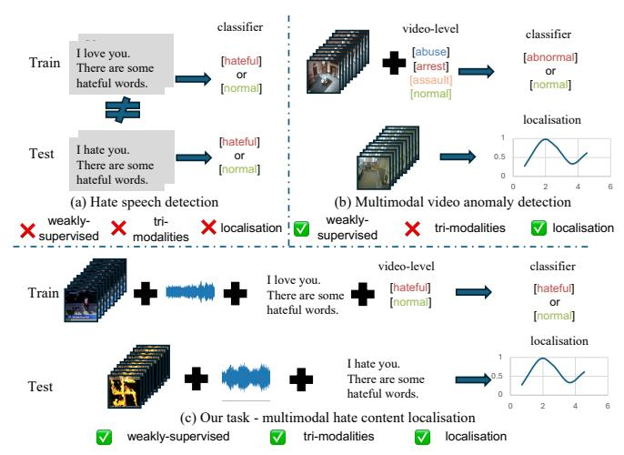
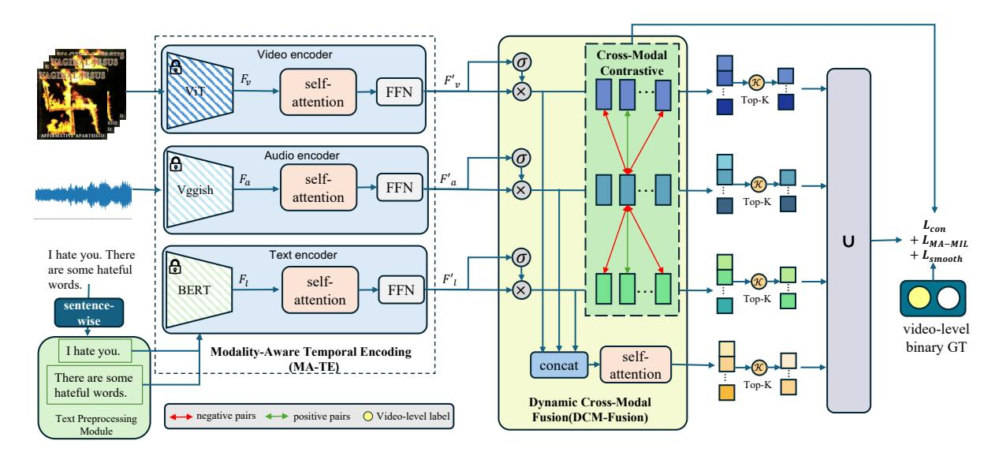
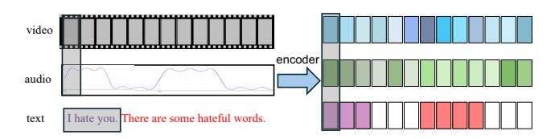
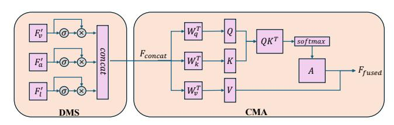
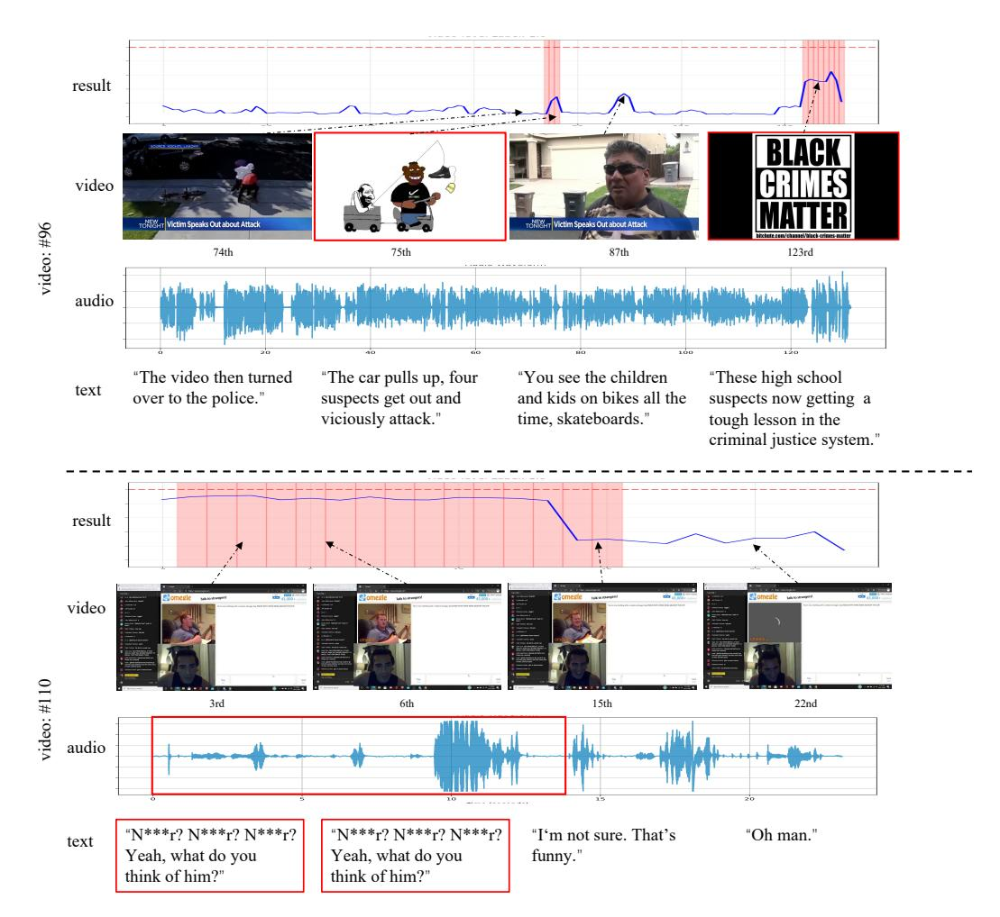

# MultiHateLoc: Towards Temporal Localisation of Multimodal Hate Content in Online Videos

Qiyue Sun∗†

Department of Computer Science, University of Exeter Exeter, UK julysun@mail.sdu.edu.cn

Tailin Chen∗ Department of Computer Science, University of Exeter Exeter, UK T.Chen2@exeter.ac.uk

Yinghui Zhang Department of Computer Science, University of Exeter Exeter, UK yz949@exeter.ac.uk

Yuchen Zhang Institute for Analytics and Data Science, University of Essex Essex, UK yuchen.zhang@essex.ac.uk

Jiangbei Yue Department of Computer Science, University of Exeter Exeter, UK J.Yue@exeter.ac.uk

Jianbo Jiao School of Computer Science, University of Birmingham Birmingham, UK j.jiao@bham.ac.uk

Zeyu Fu‡

Department of Computer Science, University of Exeter Exeter, UK Z.Fu@exeter.ac.uk

### Abstract

The rapid growth of video content on platforms such as TikTok and YouTube has intensified the spread of multimodal hate speech, where harmful cues emerge subtly and asynchronously across visual, acoustic, and textual streams. Existing research primarily focuses on video-level classification, leaving the practically crucial task of temporal localisation, identifying when hateful segments occur, largely unaddressed. This challenge is even more noticeable under weak supervision, where only video-level labels are available, and static fusion or classification-based architectures struggle to capture cross-modal and temporal dynamics. To address these challenges, we propose MultiHateLoc, the first framework designed for weakly-supervised multimodal hate localisation. MultiHateLoc incorporates (1) modality-aware temporal encoders to model heterogeneous sequential patterns, including a tailored textbased preprocessing module for feature enhancement; (2) dynamic cross-modal fusion to adaptively emphasise the most informative modality at each moment and a cross- modal contrastive alignment strategy to enhance multimodal feature consistency; (3) a modality-aware MIL objective to identify discriminative segments under video-level supervision. Despite relying solely on coarse labels, MultiHateLoc produces fine-grained, interpretable frame-level predictions. Experiments on HateMM and MultiHateClip show that

© 2026 Copyright held by the owner/author(s). ACM ISBN 979-8-4007-2307-0/2026/04 <https://doi.org/10.1145/3774904.3793032>

our method achieves state-of-the-art performance in the localisation task. [Code is available at https://github.com/Multimodal-](https://github.com/mmilabuk/multihateloc)[Intelligence-Lab-MIL/MultiHateLoc.](https://github.com/mmilabuk/multihateloc)

Disclaimer: This paper contains sensitive content that may be disturbing to some readers

### CCS Concepts

• Computing methodologies → Speech recognition; Scene anomaly detection.

# Keywords

Multimodal; Hateful Content Detection; Temporal Localisation

### ACM Reference Format:

Qiyue Sun, Tailin Chen, Yinghui Zhang, Yuchen Zhang, Jiangbei Yue, Jianbo Jiao, and Zeyu Fu. 2026. MultiHateLoc: Towards Temporal Localisation of Multimodal Hate Content in Online Videos. In Proceedings of the ACM Web Conference 2026 (WWW '26), April 13–17, 2026, Dubai, United Arab Emirates. ACM, New York, NY, USA, [9](#page-8-0) pages.<https://doi.org/10.1145/3774904.3793032>

# 1 Introduction

Video content has become the dominant medium for information dissemination on social platforms, with TikTok uploading 3.2 billion videos in 2021 and YouTube processing 500 hours of uploads per minute by early 2022. This unprecedented scale has accelerated the spread of hate content—defined as communication attacking groups based on race, gender, religion, or other identities. As online video ecosystems continue to grow, platforms face significant challenges in identifying such content due to its implicit, multimodal, and temporally sparse nature.

Early hate speech research primarily focused on text-only detection, leveraging linguistic features or deep neural networks to classify short social media posts such as tweets or comments [\[3,](#page-8-1) [8\]](#page-8-2).

∗ Equal contribution.

† Work was conducted while Qiyue Sun was a Research Assistant at the University of Exeter and a visiting PhD student at the University of Birmingham, with primary affiliation to Shandong University.

‡ Corresponding author.

[This work is licensed under a Creative Commons Attribution 4.0 International License.](https://creativecommons.org/licenses/by/4.0) WWW '26, Dubai, United Arab Emirates

Figure 1: Comparison of (a) Hate video detection, (b) Weakly-Supervised multimodal video anomaly detection, and (c) Multimodal hate video localisation.

However, harmful content rapidly evolved into visual and multimodal forms. Memes combine imagery and overlaid text to convey coded insults, satire, or hateful insinuations. This shift motivated multimodal hate meme detection (e.g., Facebook Hateful Memes Challenge [\[15\]](#page-8-3), Hate Speech Detection [\[11\]](#page-8-4)), demonstrating that cross-modal modelling is essential because hateful intent often emerges only when multiple modalities are considered together.

The focus of multimodal learning has expanded toward videobased hate content, where harmful cues unfold across visual frames, spoken language, background audio, and on-screen text [\[36,](#page-8-5) [37\]](#page-8-6). Early approaches typically rely on partial modalities, including vision-only abusive behaviour recognition [\[14\]](#page-8-7) and text–audio fusion for spoken toxicity analysis [\[1\]](#page-8-8). Building on HateMM [\[7\]](#page-8-9), several recent works further explore multimodal hate video classification [\[34\]](#page-8-10). A robust fusion study systematically compares modality combinations and feature encoders on HateMM and Hateful Memes [\[2\]](#page-8-11), CMFusion [\[38\]](#page-8-12) employs channel-wise and modalitywise fusion to strengthen tri-modal representation learning, and MoRe [\[17\]](#page-8-13) leverages retrieval-augmented evidence and a mixtureof-experts design to enhance robustness in short videos, while MM-HSD [\[4\]](#page-8-14) and MultiHateGNN [\[36\]](#page-8-5) introduce stronger multimodal backbones with cross-modal attention or graph neural networks for video-level prediction. ImpliHateVid [\[23\]](#page-8-15) extends to implicit hate in videos and also reports results on HateMM, and few-shot multimodal methods [\[20\]](#page-8-16) address label scarcity on the same dataset.

However, all these approaches produce a single binary label at the video level, classifying an entire video as either hateful or nonhateful, without identifying where within the video the harmful content actually occurs, as illustrated in Fig. [1\(](#page-1-0)a). This highlights a major limitation in current research: the lack of fine-grained temporal localisation. In real-world scenarios, hateful content often appears only in short segments of a video, while the rest may be benign. Simply labelling an entire video as hateful overlooks this nuance and limits the practicality of content moderation.

To address this gap, we study a new research task: multimodal hate content localisation, which aims to identify the precise temporal segments in which hate occurs across modalities, as shown

in Fig. [1](#page-1-0) (c). Rather than requiring detailed frame-level annotations, we explore this problem under a weakly supervised setting, inspired by recent advances in weakly supervised video anomaly detection (WSVAD) (see Fig. [1](#page-1-0) (b)). WSVAD methods [\[27,](#page-8-17) [28,](#page-8-18) [31\]](#page-8-19) are effective in learning temporal patterns from video-level labels by aligning visual and audio cues over time. However, they typically overlook the text modality, which is critical in the context of multimodal hate detection. Therefore, a major challenge in our work is to extend weakly supervised approaches to explicitly incorporate temporal modelling of text features, enabling a more complete and fine-grained understanding of multimodal hate content. A second major challenge in localising multimodal hate content lies in the high variability of modality relevance across time. Hate cues may not be evenly distributed; text might be dominant in one segment, while audio or visual signals become more salient elsewhere. This context-dependent salience makes it ineffective to apply static or early fusion strategies.

These challenges motivate our design of MultiHateLoc, as shown in Fig [2,](#page-2-0) the first multimodal hate localisation framework which incorporates 1) Modality-aware temporal modeling to capture intra-modal sequential information across dense video frames, audio features, and text sequences. We further proposed a novel text embedding module for sentence-wise text feature extraction. 2) Dynamic cross-modal fusion to adaptively emphasise the modality contributions based on context at each time-step and a cross-modal contrastive alignment strategy to enhance multimodal feature consistency. 3) Modality-aware top-K Multiple Instance Learning (MIL) objective that guides weak supervision toward the most relevant segments. Together, these components overcome the inherent limitations of prior work and enable fine-grained localisation of multimodal hate content. We evaluate MultiHateLoc on the HateMM [\[7\]](#page-8-9) and MultiHateClip [\[30\]](#page-8-20) datasets, achieving state-of-the-art localisation performance. To the best of our knowledge, this is the first work to provide a fully tri-modal, weakly-supervised, and temporally precise solution for hate content localisation in online videos.

Our contributions are summarised as follows:

- (1) We formalise the weakly-supervised multimodal hate content localisation task, distinguishing it from classification and anomaly detection.
- (2) We propose MultiHateLoc, which integrates newly proposed temporal modelling, dynamic cross-modal fusion, and modalityaware MIL to enable precise segment predictions.
- (3) Extensive experiments on two benchmark datasets validate our approach, establishing new benchmarks for the task.

### 2 Related work

# 2.1 Hate Speech Detection

Early research on hate speech detection has largely centered around textual content, where a wide array of machine learning and deep learning techniques have been explored. For example, MacAvaney et al. [\[21\]](#page-8-21) employed a multi-view SVM approach that combines diverse feature representations to improve both accuracy and interpretability. Badjatiya et al. [\[3\]](#page-8-1) investigated a range of neural models, including FastText, CNNs, and LSTMs, demonstrating their

Figure 2: Overview of the proposed MultiHateLoc framework. The framework integrates multi-modal features from video, audio, and text modalities, leveraging a uniform temporal modeling approach, a novel dynamic cross-modal fusion strategy, and a modality-wise top-K MIL loss. ���� , ����, and ���� represent the extracted features from video, audio and text, respectively. ���� indicates features derived from any one of these modalities.

effectiveness on social media datasets such as tweets. Other conventional techniques, such as support vector machines, have also been utilized for hate speech classification [\[8,](#page-8-2) [26\]](#page-8-22).

Despite promising results, these approaches are fundamentally limited by their reliance on a single modality — text. In real-world online discourse, hate speech can be highly nuanced, leveraging sarcasm, coded language, or context-dependent cues that are difficult to capture with text alone. This makes purely textual models susceptible to false negatives, particularly when hateful intent is implied rather than explicit [\[12,](#page-8-23) [24,](#page-8-24) [35\]](#page-8-25). These limitations underscore the need for models capable of integrating richer contextual and multimodal signals to improve robustness and generalizability.

## 2.2 Multimodal Hateful Content Detection

Multimodal approaches substantially outperform unimodal systems for hateful content detection. Early multimodal works combined image–text or video–text signals using concatenation, gating, or bilinear pooling [\[5,](#page-8-26) [11,](#page-8-4) [33\]](#page-8-27), and transformer-based architectures such as ViLBERT further improved cross-modal alignment [\[15\]](#page-8-3). More recent efforts extend to tri-modal settings, with HateMM [\[7\]](#page-8-9) demonstrating the benefits of jointly modeling video, audio, and text. Two main directions have emerged: (1) adapting pre-trained multimodal models, e.g., CLIP-based systems like VAD-CLIP [\[32\]](#page-8-28), which incorporate temporal modeling but still rely on global text features; and (2) task-specific fusion architectures such as MM-HSD [\[6\]](#page-8-29), CMFusion [\[38\]](#page-8-12), MoRE [\[18\]](#page-8-30) MultiHateGNN [\[36\]](#page-8-5). More recent works such as [\[34\]](#page-8-10) explore the label noise in hate videos and in DeHate[\[37\]](#page-8-6), a novel fine-grained large-scale hate content dataset has been proposed for advanced hate detection. While these methods advance video-level classification, a recent survey [\[16\]](#page-8-31) highlights persistent temporal misalignment across modalities and the lack of fine-grained grounding, especially for text and audio

cues. Consequently, existing multimodal hate detection methods remain classification-centric, leaving the problem of temporal localisation largely unexplored.

### 2.3 Weakly Supervised Video Anomaly Detection

Frame-level annotations are costly to obtain, so weakly supervised learning has become a common solution for temporal localisation tasks. Multi-Instance Learning (MIL) is widely used in this setting. It trains models with only video-level labels and allows them to infer the segments that contain target events. MIL-based methods have shown strong performance in action recognition and video anomaly detection. Examples include the MIL ranking framework by Sultani et al. [\[27\]](#page-8-17), self-supervised anomaly modeling by Rudolph et al. [\[25\]](#page-8-32), and GNN-based approaches for group-level anomalies [\[19,](#page-8-33) [29\]](#page-8-34). These works demonstrate that weak supervision can capture temporal patterns without detailed annotations. However, most research focuses on explicit visual anomalies in surveillance videos, which differs from the subtle and often crossmodal nature of hateful content.

Hate signals are frequently concealed. A video may look visually normal but contain harmful cues in the audio or text. Existing WS-VAD methods [\[19,](#page-8-33) [27,](#page-8-17) [32\]](#page-8-28) rely mainly on visual features, so they struggle to capture such multimodal patterns. To address this limitation, we propose a weakly supervised MIL framework that integrates video, audio, and textual features. It uses only videolevel labels but can still predict the temporal boundaries of hateful segments. This approach enables fine-grained localisation under weak supervision and fills an important gap in applying WS-VAD techniques to multimodal hate content.

Table 1: Performance comparison (mAP ↑, AUC ↑) of MultiHateLoc and baselines using different modality combinations on HateMM and MultiHateClip. We evaluate weaklysupervised anomaly detection (VAD-CLIP) and traditional fusion methods (Early Fusion, Late Fusion) under singlemodality (V, A, T), dual-modality (V+T, V+A, T+A), and tri-modality (V+A+T) settings. All baseline results are reproduced using the same feature extraction and training pipeline. Best results are shown in bold.

| Model Modality      | mAP   | HateMM / AUC | mAP   | / AUC   |
|---------------------|-------|--------------|-------|---------|
| VAD-CLIP [32]       |       |              |       |         |
| Video               | 0.531 | / 0.740      | 0.348 | / 0.605 |
| Audio               | 0.563 | / 0.762      | 0.405 | / 0.650 |
| Text                | 0.498 | / 0.712      | 0.367 | / 0.610 |
| V+A                 | 0.546 | / 0.752      | 0.380 | / 0.623 |
| V+T                 | 0.559 | / 0.761      | 0.393 | / 0.631 |
| T+A                 | 0.550 | / 0.755      | 0.385 | / 0.620 |
| Early Fusion V+A+T  | 0.565 | / 0.765      | 0.410 | / 0.662 |
| Late Fusion V+A+T   | 0.578 | / 0.779      | 0.401 | / 0.660 |
| CMFusion [38] V+A+T | 0.596 | / 0.763      | 0.420 | / 0.672 |
| V+T                 | 0.612 | / 0.775      | 0.404 | / 0.663 |
| V+A Ours            | 0.621 | / 0.781      | 0.414 | / 0.676 |
| T+A                 | 0.617 | / 0.777      | 0.408 | / 0.669 |
| V+A+T               | 0.645 | / 0.799      | 0.445 | / 0.750 |

# 4.2 Baseline Comparisons

Our task of weakly supervised multimodal hate content localisation has not been addressed in existing research. Existing multimodal hate detection studies focus exclusively on video-level classification, while related tasks such as video anomaly detection and audio–visual event localisation differ fundamentally in supervision, semantics, and modality structure. This mismatch makes direct comparison with existing benchmarks infeasible.

Therefore, instead of reusing mismatched benchmarks, we construct baselines from methods that can be reasonably adapted to our weakly-supervised scenario. Our goal is not to exhaust all possible models, but to build a meaningful and fair comparison set that reflects the core components required by our task. Specifically, we evaluate three complementary categories:

Weakly-supervised anomaly localisation (VAD-CLIP [\[32\]](#page-8-28)): These models naturally output temporal saliency curves under video-level labels, making them the closest analogue to our weaklysupervised setup. However, they lack the explicit cross-modal modelling and semantic alignment required for hate content.

Traditional multimodal fusion (Early Fusion, Late Fusion): These represent what multimodal hate classification systems could achieve when repurposed for localisation. Their limitations—static weighting and the absence of temporal reasoning—highlight the need for explicit temporal and cross-modal modeling.

Modern multimodal classifier (CMFusion [\[38\]](#page-8-12)): We include CMFusion to test whether a state-of-the-art tri-modal classifier can be adapted into a temporal localiser via a sliding-window strategy. This baseline allows us to contrast classification-driven fusion with our temporal, modality-aware approach.

Our evaluation thus focuses on a coherent and fair baseline set, consistent with the principles of prior temporal localisation benchmarks: compare only with methods that match the supervision level and can be adapted without unrealistic assumptions. As illustrated in Table [1,](#page-5-0) our framework consistently surpasses all baselines on both HateMM and MultiHateClip datasets. Specifically, on the HateMM dataset, our final model achieves an mAP of 0.645 and an AUC of 0.799, significantly outperforming the strongest baseline, Late Fusion (mAP: 0.578, AUC: 0.779), by approximately 6.7% in mAP and 2.0% in AUC. On the MultiHateClip dataset, which is notably more challenging due to its inherent complexity, our model attains an mAP of 0.445 and AUC of 0.750.

Additionally, the comparison between modality combinations (e.g., V+A, V+T, T+A) reveals that MultiHateLoc effectively leverages complementary information among modalities, achieving consistently better results than the single or dual modality configurations in VAD-CLIP. This underscores the importance and effectiveness of our dynamic modality selection and cross-modal fusion strategies. We also compare our model with up-to-data classification model CMFusion [\[38\]](#page-8-12), regarding to the fusion part, our model also consistently achieves better performance.

Overall, these quantitative improvements validate MultiHate-Loc's capability in accurately localising hate content by effectively integrating multimodal information under weak supervision.

### 4.3 Ablation Studies

In this section, we conduct ablation experiments on the HateMM dataset under the weakly-supervised setting to evaluate the impact of each component in our modality-aware learning framework.

4.3.1 Incremental Ablation Study. Table [2](#page-6-0) systematically evaluates the contribution of each module proposed in our MultiHate-Loc framework by incrementally incorporating these modules into baseline models. We begin from a basic early-fusion baseline that directly concatenates modality features without advanced temporal modeling or fusion strategies, achieving an mAP of 0.565 and an AUC of 0.765. The introduction of MA-TE slightly enhances the performance, confirming the benefit of capturing intra-modal temporal dependencies. Further improvement is observed when shifting from early fusion to late fusion with temporal modeling, resulting in an AP increase to 0.581 and an AUC to 0.770. This improvement highlights the advantage of independently processing each modality before fusion.

Integrating the DCM-Fusion, which combines CMA and DMS, yields a substantial improvement (mAP: 0.615, AUC: 0.785). This demonstrates the effectiveness of adaptively capturing inter-modal dependencies and adjusting modality contributions based on temporal relevance, thereby reducing noise from less informative modalities.

Adding the CM-Contrast brings further gains (mAP: 0.621, AUC: 0.789) by aligning heterogeneous modality features at the frame level, strengthening the model's ability to localise subtle crossmodal hate cues. Finally, integrating the MA-MIL module achieves the best performance (mAP: 0.645, AUC: 0.799), highlighting the advantage of adaptive segment selection under weak supervision.

Table 2: Ablation results on the HateMM dataset using frame-level mAP and AUC.

| Model                   | MA-TE CMA | DMS CM-Contrast | MA-MIL | mAP   | AUC   |
|-------------------------|-----------|-----------------|--------|-------|-------|
| Baseline (Early-Fusion) |           |                 |        | 0.565 | 0.765 |
| Baseline (Early-Fusion) | ✓         |                 |        | 0.577 | 0.766 |
| Baseline (Late-Fusion)  | ✓         |                 |        | 0.581 | 0.770 |
| MultiHateLoc            | ✓ ✓       |                 |        | 0.601 | 0.783 |
| MultiHateLoc            | ✓ ✓       | ✓               |        | 0.615 | 0.785 |
| MultiHateLoc            | ✓ ✓       | ✓ ✓             |        | 0.621 | 0.789 |
| MultiHateLoc            | ✓ ✓       | ✓ ✓             | ✓      | 0.645 | 0.799 |

Overall, the consistent performance gains validate the design of our modality-aware learning framework, where each module complements the others to progressively enhance weakly-supervised multimodal hate localisation.

4.3.2 Text Encoding Strategy. This section verifies the effectiveness of our sentence-wise text encoding by comparing it with naive text processing (common in prior works [\[7,](#page-8-9) [30\]](#page-8-20) and text-omitted settings. As shown in Table. [3,](#page-6-1) sentence-wise text encoding sig-

Table 3: Ablation study on Text Encoding Strategy

| Text         | Encoding | Strategy        |      | AP         | AUC   |
|--------------|----------|-----------------|------|------------|-------|
| VAD-CLIP     | [32]     | + W/O           | Text | 0.546      | 0.752 |
| VAD-CLIP     | [32]     | + Naive         | Text | 0.551      | 0.770 |
| VAD-CLIP     | [32]     | + Sentence-wise |      | Text 0.578 | 0.779 |
| MultiHateLoc |          | + W/O           | Text | 0.621      | 0.781 |
| MultiHateLoc |          | + Naive         | Text | 0.620      | 0.785 |
| MultiHateLoc |          | + Sentence-wise | Text | 0.645      | 0.799 |

nificantly improves localisation accuracy which validates (1) Our sentence-wise text encoding effectively solves the temporal misalignment problem of naive text processing methods, enabling precise mapping between text signals and video/audio frames; (2) Text modality is irreplaceable for weakly-supervised multimodal hate content localisation (WS-MHL), as it provides key discriminative signals that video and audio alone cannot capture. These findings fully justify the inclusion of sentence-wise text encoding in the MultiHateLoc framework.

4.3.3 Top-K Selection Sensitivity with Adaptive K. Table [4](#page-6-2) investigates the sensitivity and effectiveness of the adaptive selection parameter �� within our proposed Modality-Aware Multi-Instance Learning (MA-MIL) loss. Unlike conventional approaches that utilize a fixed number of top-scoring frames, our adaptive strategy dynamically selects a proportion of frames, effectively balancing between comprehensive context incorporation and the emphasis on discriminative content. The optimal balance is achieved at �� = 3

Table 4: Sensitivity analysis for the adaptive �� parameter in Top-K MIL Loss, where �� determines the portion of selected frames.

| 1 | K Value (100%) | Frames All | Selected Frames | mAP 0.612 | AUC 0.758 |
|---|----------------|------------|-----------------|-----------|-----------|
| 2 | (50%)          | Top        | 50%             | 0.630     | 0.785     |
| 3 | (33%)          | Top        | 33%             | 0.645     | 0.799     |
| 5 | (20%)          | Top        | 20%             | 0.620     | 0.762     |

(selecting the top 33% of frames), resulting in the highest mAP of 0.645 and AUC of 0.799. Selecting all frames (�� = 1, 100%) leads to a noticeable performance drop (mAP=0.612) due to the inclusion of irrelevant or noisy frames. Conversely, overly aggressive frame reduction (�� = 5, top 20%) excessively restricts contextual information, marginally decreasing the mAP to 0.620.

These findings validate the effectiveness of our adaptive �� selection approach, demonstrating its capability in guiding the model to focus on the most informative frames, thus significantly enhancing the accuracy and robustness of hate content localisation.

4.3.4 Module Simplification. Given the complexity of multimodal fusion, we also explore strategies to simplify individual modules while maintaining performance.

Simplification of Modality Attention. To balance performance and efficiency, we evaluate the impact of simplifying the modality attention mechanism by varying the number of attention heads. As shown in Table [5,](#page-6-3) reducing the attention heads from 4 to 2 slightly decreases the AP from 0.635 to 0.630, but significantly reduces the computation cost. Further reduction to a single head causes a noticeable performance drop to 0.620.

Table 5: Simplification of modality attention by varying the number of attention heads.

| #Self-Attention | Heads AP | AUC   |
|-----------------|----------|-------|
| 1               | 0.620    | 0.780 |
| 2               | 0.630    | 0.785 |
| 4               | 0.645    | 0.799 |

### 4.4 Visualization

To further validate the interpretability and fine-grained temporal localisation capabilities of our MultiHateLoc framework, we present two representative case studies from the HateMM dataset in Fig. [5.](#page-7-0) Each case is visualised using (i) a timeline showing the frame-level hate prediction probability, (ii) sampled video frames, (iii) aligned audio waveform segments, and (iv) corresponding transcribed text. These qualitative examples demonstrate that our model not only accurately performs weakly-supervised hate localisation but also adapts to the most informative modality at each timestamp.

In the first case (top row), the majority of the video content is non-hateful; however, several hate frames are briefly inserted. Our model successfully identifies these short hate segments, as shown by the sharply rising prediction scores and the correctly highlighted

Figure 5: Visualization of predictions and modality-specific hate localisation by our proposed MultiHateLoc framework on two samples from the HateMM dataset. For each video, the top curve shows frame-level hate prediction probabilities, where red-shaded areas indicate detected hate segments. Below, temporally aligned frames, audio waveforms, and text transcriptions are shown, with red boxes highlighting modality-specific regions identified as hateful.

frames. This example demonstrates the model's sensitivity to shortterm yet salient visual cues and its ability to detect hate signals even when they are sparsely distributed over time.

In contrast, the second case (bottom row) contains a visually benign video stream (a casual video call), while hateful expressions appear in both the audio and text modalities. Despite the absence of visual hate cues, MultiHateLoc accurately identifies the hate segment via textual and auditory clues. The model activates appropriately in response to hateful words or phrases, as evident from the red-highlighted audio waveform peaks and offensive transcriptions. This showcases our model's capability to rely on non-visual modalities when appropriate, underlining the strength of our dynamic modality selection and cross-modal attention mechanisms.

Together, these examples highlight the robustness and interpretability of MultiHateLoc: it not only localises hate at the frame level, but also attributes it to the correct modality, even in challenging cases with implicit or modality-specific expressions of hate.

### 5 Conclusion

We introduced MultiHateLoc, the first framework for weakly supervised multimodal hate content localisation, addressing a task that has been largely overlooked in prior research. By combining dynamic modality selection, cross-modal attention, and a modalityaware MIL objective, MultiHateLoc effectively captures the sparse and asynchronous cues that characterise hateful content across video, audio, and text. Experiments demonstrate that MultiHateLoc can produce accurate temporal localisation under video-level supervision. Comprehensive ablations verify the contribution of each component, and qualitative visualisations further show how the model identifies discriminative segments across modalities. Overall, this work opens a new research direction for fine-grained multimodal hateful video understanding under weak supervision.

# 6 Acknowledgments

This work was supported by the Alan Turing Institute and DSO National Laboratories Framework Grant Funding.

### References

- [1] Duarte Alves, Sara Cavaco, and Fernando Batista. 2023. Toxicity Detection in Spoken Utterances: A Multimodal (Audio+Text) Approach. In Proceedings of the 19th International Conference on Computational Semantics (IWCS). 120–131. [2] First Author and Others. 2025. Towards a Robust Framework for Multimodal Hate Detection: A Study on Video vs. Image-based Content. arXiv preprint arXiv:2502.07138 (2025). [3] Pinkesh Badjatiya, Shashank Gupta, Manish Gupta, and Vasudeva Varma. 2017. Deep learning for hate speech detection in tweets. In Proceedings of the 26th international conference on World Wide Web companion. 759–760. [4] Berta Céspedes-Sarrias, Carlos Collado-Capell, Pablo Rodenas-Ruiz, Olena Hrynenko, and Andrea Cavallaro. 2025. MM-HSD: Multi-Modal Hate Speech Detection in Videos. In Proceedings of the 33rd ACM International Conference on Multimedia. Accepted. [5] Anusha Chhabra and Dinesh Kumar Vishwakarma. 2023. Multimodal hate speech detection via multi-scale visual kernels and knowledge distillation architecture. Engineering Applications of Artificial Intelligence 126 (2023), 106991. [6] Berta Céspedes-Sarrias, Carlos Collado-Capell, Pablo Rodenas-Ruiz, Olena Hrynenko, and Andrea Cavallaro. 2025. MM-HSD: Multi-Modal Hate Speech Detection in Videos. arXiv preprint arXiv:2508.20546 (2025). arXiv[:2508.20546](https://arxiv.org/abs/2508.20546) <https://arxiv.org/abs/2508.20546> [7] Mithun Das, Rohit Raj, Punyajoy Saha, Binny Mathew, Manish Gupta, and Animesh Mukherjee. 2023. Hatemm: A multi-modal dataset for hate video classification. In Proceedings of the International AAAI Conference on Web and Social Media, Vol. 17. 1014–1023. [8] Fabio Del Vigna12, Andrea Cimino23, Felice Dell'Orletta, Marinella Petrocchi, and Maurizio Tesconi. 2017. Hate me, hate me not: Hate speech detection on facebook. In Proceedings of the first Italian conference on cybersecurity (ITASEC17). 86–95. [9] Jacob Devlin, Ming-Wei Chang, Kenton Lee, and Kristina Toutanova. 2018. Bert: Pre-training of deep bidirectional transformers for language understanding. arXiv preprint arXiv:1810.04805 (2018). [10] Alexey Dosovitskiy, Lucas Beyer, Alexander Kolesnikov, Dirk Weissenborn, Xiaohua Zhai, Thomas Unterthiner, Mostafa Dehghani, Matthias Minderer, Georg Heigold, Sylvain Gelly, et al. 2020. An image is worth 16x16 words: Transformers for image recognition at scale. arXiv preprint arXiv:2010.11929 (2020). [11] Raul Gomez, Jaume Gibert, Lluis Gomez, and Dimosthenis Karatzas. 2020. Exploring hate speech detection in multimodal publications. In Proceedings of the IEEE/CVF winter conference on applications of computer vision. 1470–1478. [12] Tommi Gröndahl, Luca Pajola, Mika Juuti, Mauro Conti, and N Asokan. 2018. All you need is" love" evading hate speech detection. In Proceedings of the 11th ACM workshop on artificial intelligence and security. 2–12. [13] S Hochreiter. 1997. Long Short-term Memory. Neural Computation MIT-Press (1997). [14] Xiaoyu Jiang, Jian Wang, and Bo Zhou. 2023. Abusive Behavior Recognition from Videos: A New Dataset and Benchmark. In Proceedings of the IEEE/CVF International Conference on Computer Vision Workshops (ICCVW). 3456–3465. [15] Douwe Kiela, Hamed Firooz, Aravind Mohan, Vedanuj Goswami, Amanpreet Singh, Pratik Ringshia, and Davide Testuggine. 2020. The hateful memes challenge: Detecting hate speech in multimodal memes. Advances in neural information processing systems 33 (2020), 2611–2624. [16] Girish A. Koushik, Diptesh Kanojia, and Helen Treharne. 2025. Recent Advances in Online Hate Speech Moderation: Multimodality and the Role of Large Models. In Companion Proceedings of the ACM on Web Conference 2025. Association for Computing Machinery (ACM), 2014–2023. [doi:10.1145/3643834.3651312](https://doi.org/10.1145/3643834.3651312) [17] Jian Lang, Rongpei Hong, Jin Xu, Yili Li, Xovee Xu, and Fan Zhou. 2025. MoRE: Retrieval-Augmented Multimodal Experts for Short Video Hate Detection. In The Web Conference (WWW). retrieval-augmented multimodal experts for short video hate detection. [18] Jian Lang, Rongpei Hong, Jin Xu, Yili Li, Xovee Xu, and Fan Zhou. 2025. MoRe:Biting Off More Than You Can Detect: Retrieval-Augmented Multimodal Experts for Short Video Hate Detection. In The Web Conference (WWW). ACM. [19] Nannan Li, Jia-Xing Zhong, Xiujun Shu, and Huiwen Guo. 2022. Weaklysupervised anomaly detection in video surveillance via graph convolutional label noise cleaning. Neurocomputing 481 (2022), 154–167. [20] J. Ma et al. 2025. Few-Shot Detection of Hate Videos Using Multi-Modal Representations. In Proceedings of the Web Conference. [21] Sean MacAvaney, Hao-Ren Yao, Eugene Yang, Katina Russell, Nazli Goharian, and Ophir Frieder. 2019. Hate speech detection: Challenges and solutions. PloS one 14, 8 (2019), e0221152. [22] Alec Radford, Jong Wook Kim, Tao Xu, Greg Brockman, Christine McLeavey, and Ilya Sutskever. 2023. Robust speech recognition via large-scale weak supervision. In International conference on machine learning. PMLR, 28492–28518. [23] Mohammad Zia Ur Rehman, Anukriti Bhatnagar, Omkar Kabde, Shubhi Bansal, and Nagendra Kumar. 2025. ImpliHateVid: A Benchmark Dataset and Two-stage Contrastive Learning Framework for Implicit Hate Speech Detection in Videos. In Proceedings of the 63rd Annual Meeting of the Association for Computational Linguistics. [24] Paul Röttger, Bertram Vidgen, Dong Nguyen, Zeerak Waseem, Helen Margetts, and Janet B Pierrehumbert. 2020. HateCheck: Functional tests for hate speech detection models. arXiv preprint arXiv:2012.15606 (2020). [25] Marco Rudolph, Bastian Wandt, and Bodo Rosenhahn. 2021. Same Same but DifferNet: Semi-Supervised Defect Detection With Normalizing Flows. In Proceedings of the IEEE/CVF Winter Conference on Applications of Computer Vision (WACV). 1907–1916. [26] Mahamat Saleh Adoum Sanoussi, Chen Xiaohua, George K Agordzo, Mahamed Lamine Guindo, Abdullah MMA Al Omari, and Boukhari Mahamat Issa. 2022. Detection of hate speech texts using machine learning algorithm. In 2022 IEEE 12th Annual Computing and Communication Workshop and Conference (CCWC). IEEE, 0266–0273. [27] Waqas Sultani, Chen Chen, and Mubarak Shah. 2018. Real-world anomaly detection in surveillance videos. In Proceedings of the IEEE conference on computer vision and pattern recognition. 6479–6488. [28] Yu Tian, Guansong Pang, Yuanhong Chen, Rajvinder Singh, Johan W Verjans, and Gustavo Carneiro. 2021. Weakly-supervised video anomaly detection with robust temporal feature magnitude learning. In Proceedings of the IEEE/CVF international conference on computer vision. 4975–4986. [29] Waseem Ullah, Tanveer Hussain, Fath U Min Ullah, Khan Muhammad, Mahmoud Hassaballah, Joel JPC Rodrigues, Sung Wook Baik, and Victor Hugo C de Albuquerque. 2023. AD-Graph: Weakly Supervised Anomaly Detection Graph Neural Network. International Journal of Intelligent Systems 2023, 1 (2023), 7868415. [30] Han Wang, Tan Rui Yang, Usman Naseem, and Roy Ka-Wei Lee. 2024. Multihateclip: A multilingual benchmark dataset for hateful video detection on youtube and bilibili. In Proceedings of the 32nd ACM International Conference on Multimedia. 7493–7502. [31] Peng Wu, Xuerong Zhou, Guansong Pang, Zhiwei Yang, Qingsen Yan, Peng Wang, and Yanning Zhang. 2024. Weakly supervised video anomaly detection and localization with spatio-temporal prompts. In Proceedings of the 32nd ACM International Conference on Multimedia. 9301–9310. [32] Peng Wu, Xuerong Zhou, Guansong Pang, Lingru Zhou, Qingsen Yan, Peng Wang, and Yanning Zhang. 2024. Vadclip: Adapting vision-language models for weakly supervised video anomaly detection. (2024). [33] Fan Yang, Xiaochang Peng, Gargi Ghosh, Reshef Shilon, Hao Ma, Eider Moore, and Goran Predovic. 2019. Exploring deep multimodal fusion of text and photo for hate speech classification. In Proceedings of the third workshop on abusive language online. 11–18. [34] Shuonan Yang, Tailin Chen, Rahul Singh, Jiangbei Yue, Jianbo Jiao, and Zeyu Fu. 2025. Revealing Temporal Label Noise in Multimodal Hateful Video Classification. In Proceedings of the 4th International Workshop on Multimodal Human Understanding for the Web and Social Media. 26–34. [35] Wenjie Yin and Arkaitz Zubiaga. 2021. Towards generalisable hate speech detection: a review on obstacles and solutions. PeerJ Computer Science 7 (2021), e598. [36] Jiangbei Yue, Shuonan Yang, Tailin Chen, Jianbo Jiao, and Zeyu Fu. 2025. Multimodal Hate Detection Using Dual-Stream Graph Neural Networks. In Proceedings of the British Machine Vision Conference (BMVC). [37] Yuchen Zhang, Tailin Chen, Jiangbei Yue, Yueming Sun, Rahul Singh, Jianbo Jiao, and Zeyu Fu. 2025. DeHate: A Holistic Hateful Video Dataset for Explicit and Implicit Hate Detection. In Proceedings of the 33rd ACM International Conference on Multimedia. 13177–13183. [38] Yinghui Zhang, Tailin Chen, Yuchen Zhang, and Zeyu Fu. 2024. Enhanced Multimodal Hate Video Detection via Channel-wise and Modality-wise Fusion. In 2024 IEEE International Conference on Data Mining Workshops (ICDMW). 183–
  - 190. [doi:10.1109/ICDMW65004.2024.00030](https://doi.org/10.1109/ICDMW65004.2024.00030)