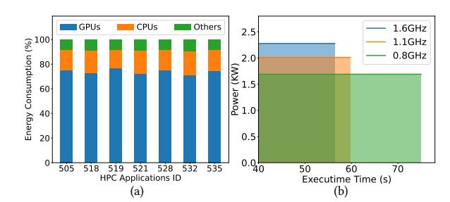
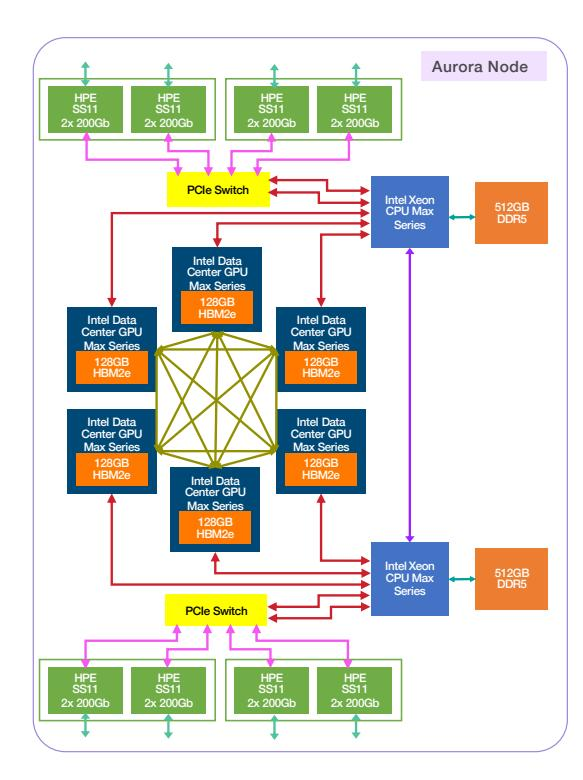
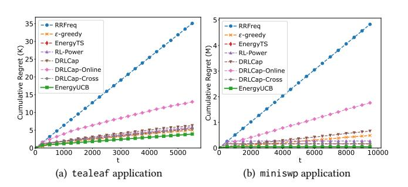
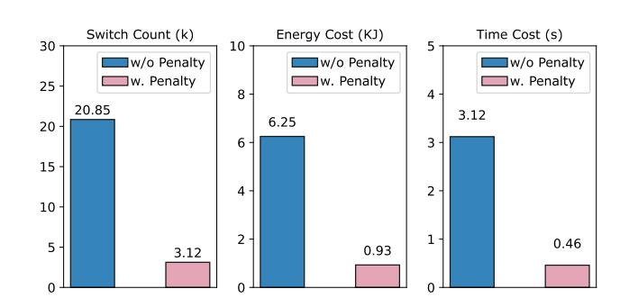
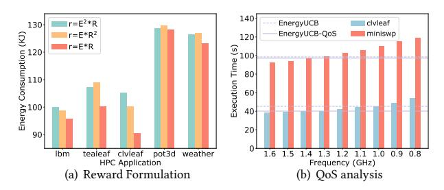

# Online GPU Energy Optimization with Switching-Aware Bandits

Xiongxiao Xu∗ Illinois Institute of Technology Chicago, IL, USA xxu85@hawk.illinoistech.edu

Solomon Abera Bekele Argonne National Laboratory Lemont, IL, USA sbekele@anl.gov

Brice Videau Argonne National Laboratory Lemont, IL, USA bvideau@anl.gov

Kai Shu Emory University Atlanta, GA, USA kai.shu@emory.edu

#### Abstract

Energy consumption has become a bottleneck for future computing architectures, from wearable devices to leadership-class supercomputers. Existing energy management techniques largely target CPUs, even though GPUs now dominate power draw in heterogeneous high performance computing (HPC) systems. Moreover, many prior methods rely on either purely offline or hybrid offline and online training, which is impractical and results in energy inefficiencies during data collection. In this paper, we introduce a practical online GPU energy optimization problem in a HPC scenarios. The problem is challenging because (1) GPU frequency scaling exhibits performance–energy trade-offs, (2) online control must balance exploration and exploitation, and (3) frequent frequency switching incurs non-trivial overhead and degrades quality of service (QoS). To address the challenges, we formulate online GPU energy optimization as a multi-armed bandit problem and propose EnergyUCB, a lightweight UCB-based controller that dynamically adjusts GPU core frequency in real time to save energy. Specifically, EnergyUCB (1) defines a reward that jointly captures energy and performance using a core-to-uncore utilization ratio as a proxy for GPU throughput, (2) employs optimistic initialization and UCBstyle confidence bonuses to accelerate learning from scratch, and (3) incorporates a switching-aware UCB index and a QoS-constrained variant that enforce explicit slowdown budgets while discouraging unnecessary frequency oscillations. Extensive experiments on real-world workloads from the world's third fastest supercomputer Aurora show that EnergyUCB achieves substantial energy savings with modest slowdown and that the QoS-constrained variant reliably respects user-specified performance budgets.

## CCS Concepts

- Computing methodologies → Machine learning approaches.

## Keywords

Energy; Sustainability; Bandits; Online Learning; GPUs

#### ACM Reference Format:

Xiongxiao Xu, Solomon Abera Bekele, Brice Videau, and Kai Shu. 2026. Online GPU Energy Optimization with Switching-Aware Bandits. In Proceedings of the ACM Web Conference 2026 (WWW '26), April 13–17, 2026, Dubai, United Arab Emirates. ACM, New York, NY, USA, [9](#page-8-0) pages. [https:](https://doi.org/10.1145/3774904.3793034) [//doi.org/10.1145/3774904.3793034](https://doi.org/10.1145/3774904.3793034)

### 1 Introduction

Energy consumption has become a central challenge for digital society, with direct consequences for environmental sustainability, economic resilience, and global equity [\[7\]](#page-8-1). As the scale and ubiquity of computation continue to grow, from everyday handheld gadgets [\[14,](#page-8-2) [23\]](#page-8-3), such as smartphones and wearable health devices, to the world's most powerful supercomputers [\[3\]](#page-8-4), such as the Aurora system at Argonne National Laboratory, the energy footprint of computing infrastructures increasingly affects national power grids as well as the accessibility and sustainability of digital services worldwide. For example, the Aurora supercomputer, the third-fastest system globally as of January 2026, reaches a peak power draw of about 60 MW, comparable to the electricity demand of a mid-sized U.S. city[1](#page-0-0) . Similarly, in 2022 the RIKEN Center was forced to power down one-third of the Fugaku supercomputer due to soaring energy prices in Japan[2](#page-0-1) . These examples highlight an urgent need for energy-aware computing across the stack from devices to data centers.

While progress has been made in reducing the energy consumption of computing systems, existing efforts have predominantly focused on CPUs [\[9,](#page-8-5) [30\]](#page-8-6). However, the growing importance of GPUs, particularly in AI model training, such as for large language models (LLMs) that demand substantial GPU computational resources, has shifted the focus. As of July 2025, nine of the top ten fastest supercomputers in the TOP500 list are GPU-powered[3](#page-0-2) . In these heterogeneous computing systems, GPUs have become the dominant energy consumers. Figure [1\(a\)](#page-1-0) plots the energy consumption distribution across components of a compute node in the Aurora supercomputer during SPEChpc 2021 benchmark runs, including GPUs, CPUs, and other components (e.g., memory). The results highlight that GPUs consume significantly more energy than CPUs

∗Work primarily performed while interning at Argonne National Laboratory.

ACM acknowledges that this contribution was authored or co-authored by an employee, contractor, or affiliate of the United States government. As such, the United States government retains a nonexclusive, royalty-free right to publish or reproduce this article, or to allow others to do so, for government purposes only. Request permissions from owner/author(s).

WWW '26, Dubai, United Arab Emirates ACM ISBN 979-8-4007-2307-0/2026/04

© 2026 Copyright held by the owner/author(s).

1https://www.anl.gov/aurora

2https://www.fujitsu.com/global/about/innovation/fugaku

3https://top500.org

Figure 1: (a) The distribution of energy consumption of CPUs, GPUs, and other components for multiple HPC applications on a compute node from Aurora supercomputer. (b) Performance-energy trade-off in GPUs for the HPC application **pot3d**. At 1.6 GHz, energy consumption is 128.46 (kJ)=2.277 (kW)×56.42 (s); at 1.1 GHz, energy consumption is 120.21 (kJ)=2.011 (kW)×59.78 (s); at 0.8 GHz, energy consumption is 126.78 (kJ)=1.690 (kW)×75.02 (s).

and other parts. For example, when running the SPEChpc application pot3d, GPUs account for 75.10% of the total energy consumption, over four times that of CPUs, which consume only 16.55%. This emphasizes the most importance of optimizing GPU energy usage for effective energy management in heterogeneous computing systems. Furthermore, existing solutions primarily operate in either purely offline settings or hybrid offline and online settings, which are often impractical and lead to excessive energy consumption. In real-world systems, the process of collecting prior data itself incurs additional energy overhead. To investigate these limitations, this paper introduces a novel online energy optimization problem.

However, online energy optimization in GPUs presents several challenges. First, there is an inherent trade-off between performance and energy efficiency in processors. Modern processors employ various energy-saving techniques, with dynamic voltage and frequency scaling (DVFS) being one of the most widely adopted. DVFS adjusts a processor's frequency and corresponding voltage to achieve energy efficiency. Although reducing frequency lowers power consumption, it often leads to performance degradation, resulting in longer execution time. Since energy is the product of power and execution time, this creates a complex performance-energy tradeoff across different frequencies. As illustrated in Figure [1\(b\),](#page-1-1) when the GPU core frequency decreases from 1.6 GHz to 1.1 GHz, the GPU power drops from 2.277 kW to 2.011 kW, while the execution time for the HPC application pot3d increases from 56.42s to 59.78s. Consequently, energy consumption decreases from 128.46 kJ to 120.21 kJ. However, when the frequency is further reduced to 0.8 GHz, power decreases to 1.690 kW, but the execution time significantly extends to 75.02s, causing energy consumption to rise from 120.21 kJ to 126.78 kJ.

Second, online optimization introduces an exploration & exploitation dilemma across discrete frequency levels. At the beginning of a job, the controller has no prior information about the GPU's behavior at different frequencies. It must actively explore these options and rely on feedback from hardware counters (e.g., energy consumption and core utilization) to build an on-the-fly profile of performance and energy. This process creates a tension between

exploration and exploitation: exploration focuses on testing frequencies that have rarely been used, while exploitation leverages observations from frequencies already tested. Because each trial consumes time and energy, it is crucial for the algorithm to strike an effective balance between exploration and exploitation.

Third, changing GPU frequency is not free. Each switch incurs latency and additional energy, and aggressive oscillations between nearby frequencies can degrade quality of service (QoS) for end users. An online controller must therefore reason about switching costs. For many latency-sensitive applications, it should respect explicit slowdown budgets specified by users. Designing a method that learns good frequency policies, limits unnecessary switching, and enforces QoS constraints is a key challenge for making GPU energy optimization practical in production HPC systems.

To address the aforementioned challenges, we formulate online GPU energy optimization as a multi-armed bandit problem and propose EnergyUCB, a lightweight UCB-based controller that dynamically adjusts GPU core frequency in real time. In this framework, frequency options are modeled as arms, and feedback from GPU hardware counters serves as the reward. We adopt the ratio of core-to-uncore utilization as a real-time proxy for GPU performance and design a reward that balances energy consumption and execution progress within each time step. Building on the merits of the bandit framework, EnergyUCB offers a principled solution to manage the exploration & exploitation dilemma during online frequency control. Extensive experiments demonstrate that EnergyUCB consistently reduces GPU energy consumption with modest slowdown, positioning it as a practical solution for largescale computing systems. The main contributions of this paper are summarized as follows:

- Problem. We introduce a new online GPU energy optimization task, and formalize it as a multi-armed bandit problem.
- Algorithm. We develop EnergyUCB, a lightweight UCB-based controller with optimistic initialization for fast bootstrapping and a switching-aware UCB index to reduce unnecessary frequency oscillations. We further present a QoS-constrained extension to enforce user-specified slowdown budgets.
- Evaluation. We evaluate EnergyUCB across diverse workload running on Aurora supercomputer with two metrics saved energy and energy regret. The extensive results demonstrate that EnergyUCB achieves substantial energy savings on Aurora while maintaining performance.
- Social Impact. An idealized full-scale deployment on a system like Aurora could potentially mitigate the daily energy footprint of 9,000 U.S. residents or 69,000 people (around 130 t CO2/day) in under-resourced regions, highlighting the potential societal benefits of energy-efficient GPU computing at scale. This impact would be significantly higher if extended across the global population of GPU devices in commercial and research infrastructures.

#### 2 Preliminaries

In this section, we introduce the architecture of the Intel PVC, basis of multi-armed bandits, and problem definition.

### 2.1 The Aurora Node Architecture

Figure [2](#page-2-0) shows that a single Aurora node comprises of two Intel Xeon CPU Max Series processors, known as Sapphire Rapids or

Figure 2: The architecture of an Aurora node.

SPR, equipped with on-package High Bandwidth Memory (HBM), and six Intel Data Center GPU Max Series, also known as Ponte Vecchio or PVC. Each Xeon CPUs have 52 cores, with two hardware threads per core, and are outfitted with 64GB of HBM. The PVC is built on the Xe Core architecture. Each Xe core is composed of 8 vector and 8 matrix engines, supported by 512 KB of L1 cache. They are interconnected using the Intel XeLink interfaces. Every node includes 8 HPE Slingshot-11 Network Interface Cards (NICs). A group of 16 Xe cores forms a slice, and 4 such slices are combined with a substantial L2 cache and 4 HBM2E memory controllers to create a stack or tile. In this work, we use Aurora's GPUs as a case study, but the framework is generic and can be applied to other GPU architectures.

#### 2.2 Multi-Armed Bandits

Basic Formulation. In many real-world scenarios, it is important to balance the exploration & exploitation dilemma, i.e., exploiting the current accumulated observations and exploring new knowledge through searching unknown spaces. A classic formulation of the decision-making framework to address the exploration & exploitation dilemma is the ��-armed bandit problem. Formally, there are �� finite arms. At each time step �� ∈ {1, 2, ...,�� }, one arm out of the �� arms is pulled, and let ���� ∈ {1, 2..., ��} be the arm pulled at time step ��. After ���� is pulled, the associated reward ���� of the arm ���� is observed by the bandit algorithm. Given a fixed time cost �� , the goal of the algorithm is to maximize the total rewards over a sequence of time steps �� as follows:

max∑︁�� ��=1 ���� (1)

The decision ���� at each time step �� involves choosing between exploiting the arm with the highest accumulated rewards until time �� − 1 and exploring other arms to gather more knowledge.

Reward Model. The generated reward of each arm �� follows a probability distribution ���� ∈ {��1, ��2, ..., ���� } with mean ���� ∈ {��1, ��2, ..., ���� }. When pulling an arm ��, the reward will be sampled independently from the distribution ���� . In other words, given the history up to time �� −1 and the choice of arm ���� at time ��, the reward is drawn independently with respect to the distribution of the chosen arm. In a formal way, let����−1 = {(��1, ��1, ), (��2, ��2, ), ..., (����−1, ����−1)} denote the history of observations until time �� − 1. The expected reward for arm �� can be written as follows:

��[���� |����−1, ���� = ��] = ���� (2)

It implies that the reward generated is randomly disturbed by noise. Cumulative Regret. The performance of the bandit algorithm is measured by the gap between the evaluated algorithm and the Oracle algorithm which can choose the best arm all the time. Formally, let �� ∗ = arg max��=1,2,...,�� ���� and �� ∗ = ���� ∗ be the index of the best arm selected by Oracle algorithm and the associated highest expected reward. We define the cumulative regret at time �� as follows:

��(�� ) = ∑︁�� ��=1 (�� ∗ − ������ ) (3)

The goal of the bandit algorithm is to minimize regret in Eq. [3](#page-2-1) or equally maximize reward in Eq. [1.](#page-2-2)

#### 2.3 Problem Definition

Following the above notations, we give a formal problem definition for the online energy consumption in GPUs.

Online Energy Optimization in GPUs. Given an application running on GPUs at the default maximum frequency, the task is to dynamically adjust the GPU core frequency to minimize energy consumption while ensuring timely completion. At each time step ��, the algorithm selects a frequency and observes data from hardware counters, leading to a reward ���� . By incorporating this feedback, the algorithm accumulates the knowledge and refines its frequency adjustment strategy. The process continues until the application completes at time �� .

There are two key points to emphasize. (1) The problem is set in a fully online environment. This means that the algorithm cannot access any prior information regarding profiles of GPUs and applications under frequencies. Instead, the algorithm must learn and adapt by directly interacting with real-time data from the GPUs' hardware counters. (2) The time cost �� varies across different applications and frequencies. Since each application requires a distinct workload, their completion times �� will differ. Additionally, the history of frequency changes affects the processing speed of GPUs, leading to variations in the completion time �� .

## 3 Methodology

In this section, we formulate online GPU energy optimization as a multi-armed bandit problem and introduce EnergyUCB, a lightweight bandit algorithm that dynamically adjusts GPU core frequencies real-time. EnergyUCB is designed to (i) balance the performance–energy trade-off when selecting frequencies, (ii) resolve the

under each setting but incur substantial energy loss during exploration. Pure exploitation strategies that always choose the empirically best frequency may miss better options due to insufficient observations of rarely chosen arms, leading to excessive energy usage. To address this dilemma, EnergyUCB adopts an upper confidence bound (UCB) strategy, which provides a principled way to trade off exploration and exploitation without assuming prior knowledge of the reward distribution. EnergyUCB maintains an empirical mean reward ��ˆ��,�� and a pull count ����,�� for each frequency ���� . The standard UCB index is

UCB��,�� = ��ˆ��,�� + �� √︄ ln�� max(1, ����,�� ) ,

where the first term encourages exploitation of high-reward frequencies, while the second term encourages exploration of less frequently selected ones.

Optimistic initialization. EnergyUCB adopts an optimistic initialization to encourage adaptive exploration under noisy measurement conditions. In large HPC systems, factors such as clock synchronization, temperature fluctuations, and network congestion [\[2,](#page-8-10) [19,](#page-8-11) [33\]](#page-8-12) can cause GPU hardware counters (e.g., energy counters) to report unstable values at early time steps, leading to high-variance observed rewards. In this setting, a naive warm-up that blindly tests each frequency once can be both noisy and wasteful, because every trial is executed on the real application. Instead of explicitly cycling through every frequency, EnergyUCB initializes each frequency ���� with an optimistic prior ��ˆ��,0 = ��init, which makes all arms initially attractive under the UCB index above. As rewards are observed, these estimates are updated online and suboptimal frequencies are naturally phased out, allowing EnergyUCB to accumulate information adaptively rather than through a fixed round-robin schedule. Switching-aware UCB. On Aurora, changing GPU core frequencies through the GEOPM runtime interface incurs a measurable overhead in both energy and time. While a single switch is inexpensive relative to the total application energy, frequent toggling between nearby frequencies can accumulate unnecessary overhead and extend execution time, making such behavior undesirable in a production setting. To capture this practical constraint, EnergyUCB employs a switching-aware UCB rule.

Let ����−1 denote the frequency index used at the previous time step. We define the switch-aware index for arm �� at time �� as:

SA-UCB��,�� = ��ˆ��,�� + �� √︄ ln�� max(1, ����,�� ) − �� 1{�� ≠ ����−1}, (5)

where �� ≥ 0 is a switching penalty and 1{·} is the indicator function. The decision rule in the exploration-exploitation phase then selects

���� = arg max ��∈ {1,...,��} SA-UCB��,�� . (6)

When �� = 0, EnergyUCB reduces to the standard UCB policy. For �� &gt; 0, the new frequency guarantees a sufficiently large expected gain to compensate for the penalty, thus discouraging unnecessary transitions and reflecting the hardware switching cost.

## 3.3 Constrained EnergyUCB for QoS Guarantee

Quality of service (QoS) is crucial in our setting, since minimizing energy inevitably increases execution time to some extent. Some users or applications may require an explicit performance guarantee, such as minimizing energy subject to at most 10% slowdown. To support such requirements, we extend EnergyUCB to a constrained variant that operates only on frequencies whose estimated slowdown is within a user-specified budget ��.

Let ��max denote the maximum GPU frequency and let ��ˆ�� be the estimated progress per decision interval under frequency ���� . We define the relative slowdown of arm �� as ���� = 1 − ��ˆ��/��ˆmax. Given a performance budget �� ∈ [0, 1), we construct the feasible set

K�� = {�� | ���� ≤ ��}.

Constrained EnergyUCB runs the policy only over arms in K�� , i.e., it selects ���� = arg max��∈K�� SA-UCB��,�� . This extension allows users to specify an interpretable constraint like �� = 0.05 (at most 5% slowdown), while EnergyUCB automatically searches for the energy-efficient configuration within the budget.

### 4 Experiments

In this section, we introduce the details of experiments, including experimental setup and experimental results. The code is here[4](#page-4-0) .

## 4.1 Experimental Setup

We provide details of experimental platform, dataset collection processes, baselines and evaluation metrics.

Experimental Platform. We conduct experiments on a node of the Aurora system shown in Figure [2](#page-2-0) with GEOPM (Global Extensible Open Power Manager) [\[12\]](#page-8-13) for telemetry monitoring and frequency control. GEOPM is a versatile tool that allows users to monitor system energy and power consumption while optimizing hardware settings to achieve energy or performance objectives. GEOPM consists of two primary components: the GEOPM Service and the GEOPM Runtime. The GEOPM Service provides user-level access to detailed hardware metrics and control options through a secure interface. Concurrently, the GEOPM Runtime leverages the GEOPM Service to adjust hardware settings based on real-time hardware metrics and feedback from various applications profiling. Dataset Collection. The SPEChpc 2021 benchmark suite [\[17\]](#page-8-14) is evaluated in the Aurora supercomputer. We specifically employ the MPI+OMP target offloading version of the tiny benchmarks to fully leverage all six GPUs in the system. The suite consists of seven benchmarks: 505.lbm, 518.tealeaf, 519.clvleaf, 521.miniswp, 528.pot3d, 532.sph\_exa, and 535.weather. Additionally, we run two representative LLMs and diffusion model in the Aurora system: Llama-2 [\[25\]](#page-8-15) and Stable Diffusion XL [\[22\]](#page-8-16). We set a 10ms sampling period for monitoring. On each application, we test all available frequencies of GPUs and collect the corresponding traces. Baselines. To the best of our knowledge, this is the first work to address the problem of online GPU energy consumption optimization without relying on any offline training. To this end, we compare EnergyUCB with the below three types of baselines:

- Static Algorithms: {1.6 GHz, 1.5 GHz,..., 0.8 GHz} represent the available frequency options for GPU cores on the Aurora supercomputer where the maximum frequency 1.6 GHz is the default setting. Each frequency setting is static, meaning that GPU cores maintain this frequency throughout the entire execution time.

4https://github.com/XiongxiaoXu/EnergyUCB-Bandit

Table 1: Energy consumption (Unit: kJ) results on various HPC applications. Best results are shown in bold.

|        | Methods       | lbm    | tealeaf | clvleaf | miniswp | pot3d  | sp h_exa | weather | llama    | diffusion |
|--------|---------------|--------|---------|---------|---------|--------|----------|---------|----------|-----------|
| 1.6    | GHz           | 93.94  | 109.79  | 100.65  | 187.13  | 131.13 | 1,353.41 | 134.61  | 1,277.71 | 772.21    |
| 1.5    | GHz           | 93.71  | 107.09  | 98.72   | 177.10  | 129.11 | 1,259.65 | 128.43  | 1,257.58 | 771.50    |
| 1.4    | GHz           | 97.42  | 105.52  | 94.72   | 171.60  | 127.24 | 1,216.60 | 125.52  | 1,211.42 | 770.91    |
| 1.3    | GHz           | 99.88  | 105.37  | 91.61   | 167.25  | 125.75 | 1,191.01 | 122.80  | 1,294.05 | 766.59    |
| 1.2    | GHz           | 104.42 | 101.65  | 90.99   | 164.45  | 126.66 | 1,163.51 | 121.75  | 1,177.68 | 771.07    |
| 1.1    | GHz           | 109.59 | 99.81   | 90.35   | 161.72  | 123.38 | 1,146.37 | 120.47  | 1,202.81 | 751.82    |
| 1.0    | GHz           | 116.04 | 98.61   | 88.41   | 160.17  | 125.19 | 1,116.52 | 122.52  | 1,114.29 | 766.73    |
| 0.9    | GHz           | 124.28 | 99.10   | 89.00   | 160.15  | 125.45 | 1,107.28 | 123.38  | 1,360.93 | 805.50    |
| 0.8    | GHz           | 131.61 | 100.59  | 91.23   | 158.74  | 128.79 | 1,090.24 | 122.97  | 1,210.13 | 747.20    |
|        | RRFreq        | 105.76 | 103.24  | 93.24   | 168.22  | 129.12 | 1,187.86 | 125.07  | 1,282.21 | 781.75    |
| ��     | -gree dy      | 100.86 | 100.88  | 91.32   | 168.28  | 130.08 | 1,106.65 | 123.24  | 1,273.75 | 785.02    |
|        | EnergyTS      | 99.17  | 100.79  | 91.76   | 168.02  | 129.50 | 1,104.55 | 123.95  | 1,268.31 | 784.18    |
|        | RL-Power      | 99.42  | 102.11  | 92.85   | 170.08  | 130.94 | 1,132.27 | 124.92  | 1,248.66 | 778.94    |
|        | DRLCap        | 101.88 | 103.97  | 93.77   | 175.92  | 131.86 | 1,168.33 | 125.41  | 1,231.56 | 785.53    |
|        | DRLCap-Online | 108.95 | 108.04  | 96.23   | 181.27  | 135.62 | 1,243.73 | 128.89  | 1,261.81 | 796.15    |
|        | DRLCap-Cross  | 98.85  | 102.84  | 92.02   | 169.80  | 134.94 | 1,183.86 | 126.35  | 1,291.55 | 789.25    |
|        | EnergyUCB     | 94.25  | 99.06   | 90.08   | 162.72  | 124.93 | 1,095.89 | 122.73  | 1127.17  | 750.90    |
| Saved  | Energy        | -0.31  | 10.73   | 10.57   | 24.41   | 6.2    | 257.52   | 11.88   | 150.54   | 21.31     |
| Energy | Regret        | 0.54   | 0.45    | 1.67    | 3.98    | 1.55   | 5.65     | 2.26    | 12.88    | 3.7       |

- Dynamic Algorithms: RRFreq (Round-Robin Frequency) cycles through each frequency in a circular order at each time ��. ��-greedy explores less frequently chosen options with probability �� and exploits the frequencies that have the highest reward with probability 1 − ��. EnergyTS (Thompson Sampling) is a Bayesian-based approach to balance exploration & exploitation by maintaining continuously updating a posterior distribution over the reward of each GPU frequency.
- Reinforcement Learning Algorithms: RL-Power [\[30\]](#page-8-6) is an online RL-based power management method originally designed for CPU power capping. We retain its learning and decision mechanism to our setting while restricting the action space to GPU core frequencies and constructing the state from GPU hardware counters. DRLCap [\[29\]](#page-8-17) is a deep RL framework for GPU frequency capping that combines offline pre-training with online adaptation to optimize energy efficiency across architectures. To adapt DRLCap to our workloads, we allocate the first 20% of each execution for training and deploy the learned policy on the remaining 80%. For a fair comparison with fully online methods, the energy consumed during the remaining 80% of execution is scaled by a factor of 1.25. We also evaluate two DRLCap variants: DRLCap-Online, which learns purely online on the target benchmark, and DRLCap-Cross, which is pre-trained on other benchmark suites and evaluated on the target benchmark.

#### Evaluation Metrics. We employ two metrics in the evaluation.

- Saved Energy measures the reduction in energy consumption achieved by EnergyUCB relative to the default maximum frequency (1.6 GHz). This metric reflects the practical benefit of deploying EnergyUCB on real systems.
- Energy Regret captures how close EnergyUCB is to the best possible static configuration. It is defined as the difference between the energy consumed by EnergyUCB and the minimum

Figure 3: Comparison of cumulative regret.

energy among all static frequencies. In an online setting, some exploration is unavoidable, so no dynamic algorithm can exactly achieve this minimum, i.e., energy regret must be larger than 0.

Implementation Details. The available frequency options are {0.8GHz, 0.9GHz, . . . , 1.6GHz}, totaling �� = 9 choices. The frequency adjustment interval is set to 10 ms, matching the sampling period of GEOPM. We repeat experiments 10 times and take the average values to mitigate randomness.

## 4.2 Experimental Results

In this subsection, we analyze experimental results, including energy consumption and cumulative regret analysis. Comparison of Energy Consumption. We compare EnergyUCB with the baselines w.r.t. the energy consumption. As shown in Table [1,](#page-5-0) we have the following key findings:

- There is no single optimal static frequency for all HPC applications. For example, GPUs achieve the lowest energy consumption at 1.5 GHz for lbm, whereas for miniswp and sph\_exa, the optimal frequency is 0.8 GHz. This variation arises because

different applications, which can be classified as either computebound or memory-bound [\[30\]](#page-8-6), respond differently to frequency scaling. Specifically, lbm is compute-bound, so lowering its frequency significantly increases execution time, leading to higher energy consumption. As a result, its optimal frequency is near the maximum. In contrast, miniswp is memory-bound, meaning that frequency reduction has little impact on execution time but lowers energy consumption, making its optimal frequency closer to the minimum.

- EnergyUCB achieves significant energy savings compared to the default maximum frequency setting at Aurora.Across nearly all applications, EnergyUCB reduces energy compared to the default 1.6 GHz at Aurora. For instance, EnergyUCB saves 257.52 kJ on a single node for sph\_exa. Scaling to 10,620 Aurora nodes, running sph\_exa would save enough electricity per day to support 9,149 U.S. residents or 69,342 people in underdeveloped regions [\[8\]](#page-8-18). For LLM workloads llama, EnergyUCB reduces the energy by 150.54 kJ per node, highlighting the high energy footprint of foundation-model inference and the necessity of energy-aware GPU scheduling for emerging AI applications.
- EnergyUCB consistently achieves lower energy than dynamic and RL algorithms. Compared with EnergyTS, EnergyUCB reduces energy by 141.14 kJ on llama and 8.66 kJ on sph\_exa. Against RL methods, EnergyUCB outperforms DRLCap by 104.39 kJ on llama and by 13.2 kJ on miniswp. For example, DRLCap consumes 1,231.56 kJ on llama, whereas EnergyUCB uses only 1,127.17 kJ. These results show that EnergyUCB resolves the exploration–exploitation dilemma more efficiently and adapts to workload characteristics faster than DRL-based baselines, which require long convergence to stabilize.
- The small energy regret indicates that EnergyUCB is close to the "optimal algorithm". The average energy regret and the average minimum energy across all benchmarks are 3.63 and 403.89, respectively, yielding an energy regret of only 0.89%. This demonstrates that EnergyUCB closely approximates the best static configuration, even though limited exploration is unavoidable in an online setting.

Cumulative Regret. We evaluate the cumulative regret of algorithms to assess their learning efficiency and convergence. As shown in Figure [3,](#page-5-1) the regret of EnergyUCB grows slowly and flattens out quickly, whereas the regrets of RRFreq increase almost linearly over time, with other dynamic and RL algorithms lying in between. This indicates that EnergyUCB rapidly identifies and exploits the optimal frequency, while baseline methods keep wasting energy on suboptimal choices. For example, for tealeaf, when the time step �� reaches 4,000 (about 40 seconds), the cumulative regret of EnergyUCB is only 1.99k, whereas RRFreq incurs 25.51k.

## 4.3 Ablation Study

To assess the contribution of each component in EnergyUCB, we compare it against two variants: w/o Opt. Ini. (removing optimistic initialization) and w/o Penalty (removing the switchingaware penalty). Table [2](#page-6-0) reports the results on the three most energyintensive applications. EnergyUCB consistently achieves the lowest total energy consumption, confirming the effectiveness of both optimistic initialization and the switching-aware UCB.

|           |          | EnergyUCB | (kJ) | w/o      | Opt.   | Ini. (kJ) | w/o      | Penalty (kJ) |
|-----------|----------|-----------|------|----------|--------|-----------|----------|--------------|
| sph_exa   | 1,095.89 | ±         | 0.52 | 1,116.71 | ±      | 2.28      | 1,102.70 | ± 0.75       |
| Llama     | 1,127.17 | ±         | 0.76 | 1,199.18 | ±      | 1.83      | 1,133.42 | ± 0.32       |
| Diffusion | 750.90   | ± 0.58    |      | 788.33   | ± 2.65 |           | 753.66   | ± 0.14       |

#### Table 2: Ablation study of EnergyUCB.

Removing optimistic initialization significantly increases energy consumption because the controller lacks reliable estimates in the early stage and performs excessive exploratory probes. For example, on Llama, the absence of optimistic initialization increases energy consumption by 72.01 kJ. Removing the switching-aware penalty also increases energy consumption (by 6.25 kJ on Llama), although the magnitude is smaller. This difference is expected. The optimistic initialization component directly contributes to learning the optimal frequency faster, whereas the switching-aware penalty primarily discourages oscillations between adjacent frequencies, thus reducing energy and time overhead of EnergyUCB itself. We analyze this switching cost more in the following subsection.

## 4.4 Switching Cost Analysis

A practical concern is if the act of switching frequencies in EnergyUCB introduces non-trivial time and energy overhead. In our implementation, GPU core frequencies are adjusted through the GEOPM runtime interface, and each switch incurs approximately 150 ��s latency and 0.3 J per switch. Although a single switch is inexpensive, the cumulative cost can become substantial if a controller oscillates frequently across thousands of decision intervals.

Figure [4](#page-6-1) compares w/o Penalty and with Penalty on the Llama application. The switching-aware design reduces the number of frequency changes from 20.85k to 3.12k, a 6.7× reduction. Consequently, the energy overhead introduced by EnergyUCB decreases from 6.25 kJ to 0.93 kJ, and the additional execution time induced by switching falls from 3.12 s to 0.46 s. These results confirm that while the per-switch overhead is small, the accumulated switching cost is non-negligible without explicit regularization. The switchingaware penalty in EnergyUCB effectively suppresses unnecessary transitions, keeping the switching overhead tiny in practice while preserving the same near-optimal energy savings.

## 4.5 Reward Formulation Analysis

Our reward is designed as the product of energy and performance, �� = �� ∗ ��, to explicitly balance the energy–performance trade-off.

Figure 4: Switching cost analysis of EnergyUCB.

Figure 5: Impact of two reward functions and QoS analysis.

In principle, different exponents can shift this balance. For instance, �� = �� ∗ �� places more weight on energy reduction, whereas �� = �� ∗ �� favors faster completion of HPC applications. We evaluate these three variants in Figure [5\(a\).](#page-7-0) Across all benchmarks, �� 2 ∗ �� and �� ∗�� 2 yield higher energy than �� ∗��. For example, on miniswp, �� 2 ∗ �� and �� ∗ �� 2 consume around 185 kJ, whereas �� ∗ �� uses about 167 kJ (an increase of 10.77%). Similarly, on clvleaf, they require over 100 kJ compared to about 90 kJ with �� ∗ �� (an increase of 11.11%). The squared terms amplify fluctuations in the noisy GPU environment, increasing variance in the observed rewards and slowing convergence. In contrast, the linear form �� ∗ �� yields more stable learning and the lowest overall energy usage.

## 4.6 Quality of Service Analysis

Aurora is configured by default to operate at the maximum GPU frequency (1.6 GHz) to minimize execution time. Although unconstrained EnergyUCB reduces energy consumption by dynamically lowering the frequency, it may introduce a modest performance penalty. Figure [5\(b\)](#page-7-1) reports execution time across static frequencies for two representative HPC applications and overlays the execution time achieved by both the unconstrained EnergyUCB (dashed line) and the constrained QoS variant (solid line).

For both clvleaf and miniswp, unconstrained EnergyUCB yields execution times comparable to running statically at 1.2–1.3 GHz. This corresponds to only moderate slowdowns of 14.46% and 6.26%, respectively, relative to the 1.6 GHz default. These results indicate that even without an explicit QoS requirement, EnergyUCB naturally operates in a regime with limited performance degradation while achieving substantial energy savings.

We further evaluate the constrained variant introduced in Section [3.3.](#page-4-1) Under a slowdown budget of �� = 0.05, constrained EnergyUCB selects higher frequencies than the unconstrained version and consistently maintains execution time within the user-specified limit: 4.05% slowdown on clvleaf and 4.82% on miniswp. Importantly, constrained EnergyUCB satisfies the QoS requirement without reverting to the maximum frequency; instead, it automatically identifies an operating point that respects the budget while still reducing energy consumption relative to the 1.6 GHz baseline.

### 5 Related Work

This work is related to two lines: (1) energy consumption optimization in CPUs/GPUs and (2) multi-armed bandits and its applications.

## 5.1 Energy Optimization in CPUs/GPUs

Energy optimization on CPUs has been widely studied [\[1,](#page-8-19) [6,](#page-8-20) [32\]](#page-8-21). Early work [\[37\]](#page-8-22) proposes DVFS scheduling for energy-efficient multiprocessor systems. [\[35\]](#page-8-23) leverages regression models to characterize performance–energy trade-offs. [\[30\]](#page-8-6) applies RL for runtime power control on CPUs. [\[31\]](#page-8-24) ensembles linear, nonlinear, tree, and rule-based models to predict power consumption of CANDLE workloads. Compared with CPUs, GPU energy optimization is less explored [\[27\]](#page-8-25) in the HPC environments. [\[13\]](#page-8-26) uses an offline neural model for GPU energy configuration based on static task characteristics. [\[26\]](#page-8-27) proposes GPOEO to dynamically optimize GPU settings but requires offline training before deployment. Recently, RL-based GPU DVFS methods have been explored. DRLCap [\[29\]](#page-8-17) uses deep RL by combining offline and online learning for GPU frequency capping. DSO [\[28\]](#page-8-28) fuses static code analysis and dynamic information for GPU energy optimization. While effective, these methods rely on offline pretraining before deployment.

## 5.2 Multi-Armed Bandit and Its Applications

Multi-armed bandit (MAB) [\[16\]](#page-8-29) is a sequential decision-making framework that balances exploration and exploitation. It has been applied in diverse domains including clinical trials [\[11\]](#page-8-30), dynamic pricing [\[20\]](#page-8-31), recommender systems [\[34\]](#page-8-32), anomaly detection [\[10\]](#page-8-33), and telecommunication [\[24\]](#page-8-34). For example, in clinical trials [\[11\]](#page-8-30), bandit algorithms are used to dynamically adjust the allocation of treatments to patients based on observed outcomes, with the goal of optimizing patient welfare and efficiently identifying the most effective treatments. Some noteworthy variants consider additional factors, such as side features of arms, and conversational feedback. For instance, contextual bandits [\[18\]](#page-8-35) incorporate side information (context) to make treatment/policy decisions and have been widely used in personalized recommendations. Conversational bandits [\[36\]](#page-8-36) learn user preferences interactively by explicitly querying the user. Neural bandits [\[4\]](#page-8-37) leverage non-linear neural networks to approximate reward functions. However, no prior work study an online switching-cost aware bandit framework for GPU energy optimization in HPC environments.

#### 6 Conclusion and Future Work

In this paper, we initiate a new problem of online GPU energy consumption optimization. To address the problem, we formulate it as a multi-armed bandit framework and propose a lightweight UCB-based algorithm EnergyUCB that effectively balances energy efficiency and performance. The extensive experiments across realworld workload from Aurora supercomputer demonstrates superior performance of the EnergyUCB and meaningful energy-saving implications. One exciting future direction is considering practical physical factors, such as the cooling system of supercomputers.

## Acknowledgments

This research utilized resources of the Argonne Leadership Computing Facility, a U.S. Department of Energy (DOE) Office of Science user facility at Argonne National Laboratory and supported by the U.S. DOE Office of Science-Advanced Scientific Computing Research Program, under Contract No. DE-AC02-06CH11357.

#### References

[1] Solomon Abera, M Balakrishnan, and Anshul Kumar. 2018. Performance-energy trade-off in CMPs with per-core DVFS. In Architecture of Computing Systems– ARCS 2018: 31st International Conference, Braunschweig, Germany, April 9–12, 2018, Proceedings 31. Springer, 225–238. [2] Bilge Acun, Phil Miller, and Laxmikant V Kale. 2016. Variation among processors under turbo boost in hpc systems. In Proceedings of the 2016 International Conference on Supercomputing. 1–12. [3] Scott Atchley, Christopher Zimmer, John Lange, David Bernholdt, Veronica Melesse Vergara, Thomas Beck, Michael Brim, Reuben Budiardja, Sunita Chandrasekaran, Markus Eisenbach, et al. 2023. Frontier: exploring exascale. In Proceedings of the International Conference for High Performance Computing, Networking, Storage and Analysis. 1–16. [4] Yikun Ban, Jingrui He, and Curtiss B Cook. 2021. Multi-facet contextual bandits: A neural network perspective. In Proceedings of the 27th ACM SIGKDD Conference on Knowledge Discovery & Data Mining. 35–45. [5] Alan W Beggs. 2005. On the convergence of reinforcement learning. Journal of economic theory 122, 1 (2005), 1–36. [6] Solomon Abera Bekele, M Balakrishnan, and Anshul Kumar. 2019. ML guided energy-performance trade-off estimation for uncore frequency scaling. In 2019 Spring Simulation Conference (SpringSim). IEEE, 1–12. [7] Ernst R Berndt. 1990. Energy use, technical progress and productivity growth: a survey of economic issues. Journal of Productivity Analysis 2 (1990), 67–83. [8] Doing Business. 2020. World Bank Group. línea]. Disponible en (2020). [9] Sophie Cerf, Raphaël Bleuse, Valentin Reis, Swann Perarnau, and Eric Rutten. 2021. Sustaining performance while reducing energy consumption: a control theory approach. In Euro-Par 2021: Parallel Processing: 27th International Conference on Parallel and Distributed Computing, Lisbon, Portugal, September 1–3, 2021, Proceedings 27. Springer, 334–349. [10] Kaize Ding, Jundong Li, and Huan Liu. 2019. Interactive anomaly detection on attributed networks. In Proceedings of the twelfth ACM international conference on web search and data mining. 357–365. [11] Audrey Durand, Charis Achilleos, Demetris Iacovides, Katerina Strati, Georgios D Mitsis, and Joelle Pineau. 2018. Contextual bandits for adapting treatment in a mouse model of de novo carcinogenesis. In Machine learning for healthcare conference. PMLR, 67–82. [12] Jonathan Eastep, Steve Sylvester, Christopher Cantalupo, Brad Geltz, Federico Ardanaz, Asma Al-Rawi, Kelly Livingston, Fuat Keceli, Matthias Maiterth, and Siddhartha Jana. 2017. Global Extensible Open Power Manager: A Vehicle for HPC Community Collaboration on Co-Designed Energy Management Solutions. In High Performance Computing: 32nd International Conference, ISC High Performance 2017, Frankfurt, Germany, June 18–22, 2017, Proceedings (Frankfurt, Germany). Springer-Verlag, Berlin, Heidelberg, 394–412. [doi:10.1007/978-3-319-58667-0\\_21](https://doi.org/10.1007/978-3-319-58667-0_21) [13] Yanhui Huang, Bing Guo, and Yan Shen. 2019. GPU energy consumption optimization with a global-based neural network method. IEEE Access 7 (2019), 64303–64314. [14] Dina Hussein, Ganapati Bhat, and Janardhan Rao Doppa. 2022. Adaptive energy management for self-sustainable wearables in mobile health. In Proceedings of the AAAI Conference on Artificial Intelligence, Vol. 36. 11935–11944. [15] Leslie Pack Kaelbling, Michael L Littman, and Andrew W Moore. 1996. Reinforcement learning: A survey. Journal of artificial intelligence research 4 (1996), 237–285. [16] Tor Lattimore and Csaba Szepesvári. 2020. Bandit algorithms. Cambridge University Press. [17] Junjie Li, Alexander Bobyr, Swen Boehm, William Brantley, Holger Brunst, Aurelien Cavelan, Sunita Chandrasekaran, Jimmy Cheng, Florina M. Ciorba, Mathew Colgrove, Tony Curtis, Christopher Daley, Mauricio Ferrato, Mayara Gimenes de Souza, Nick Hagerty, Robert Henschel, Guido Juckeland, Jeffrey Kelling, Kelvin Li, Ron Lieberman, Kevin McMahon, Egor Melnichenko, Mohamed Ayoub Neggaz, Hiroshi Ono, Carl Ponder, Dave Raddatz, Severin Schueller, Robert Searles, Fedor Vasilev, Veronica Melesse Vergara, Bo Wang, Bert Wesarg, Sandra Wienke, and Miguel Zavala. 2022. SPEChpc 2021 Benchmark Suites for Modern HPC Systems. In Companion of the 2022 ACM/SPEC International Conference on Performance Engineering (Bejing, China) (ICPE '22). Association for Computing Machinery, New York, NY, USA, 15–16. [doi:10.1145/3491204.3527498](https://doi.org/10.1145/3491204.3527498) [18] Lihong Li, Wei Chu, John Langford, and Robert E Schapire. 2010. A contextualbandit approach to personalized news article recommendation. In Proceedings of the 19th international conference on World wide web. 661–670. [19] Antonio Libri, Andrea Bartolini, Michele Magno, and Luca Benini. 2016. Evaluation of synchronization protocols for fine-grain HPC sensor data time-stamping and collection. In 2016 International Conference on High Performance Computing & Simulation (HPCS). IEEE, 818–825. [20] Kanishka Misra, Eric M Schwartz, and Jacob Abernethy. 2019. Dynamic online pricing with incomplete information using multiarmed bandit experiments. Marketing Science 38, 2 (2019), 226–252. [21] Oneapi.org. 2024. Level Zero Specification documentation. [https://spec.oneapi.](https://spec.oneapi.io/level-zero/latest/sysman/api.html#zes-engine-stats-t) [io/level-zero/latest/sysman/api.html#zes-engine-stats-t.](https://spec.oneapi.io/level-zero/latest/sysman/api.html#zes-engine-stats-t) Accessed: 2024-07-20. [22] Dustin Podell, Zion English, Kyle Lacey, Andreas Blattmann, Tim Dockhorn, Jonas Müller, Joe Penna, and Robin Rombach. 2023. Sdxl: Improving latent diffusion models for high-resolution image synthesis. arXiv preprint arXiv:2307.01952 (2023). [23] Muhammad Sarmad, Mishal Fatima, and Jawad Tayyub. 2022. Reducing Energy Consumption of Pressure Sensor Calibration Using Polynomial HyperNetworks with Fourier Features. In Proceedings of the AAAI Conference on Artificial Intelligence, Vol. 36. 12145–12153. [24] Dennis Soemers, Tim Brys, Kurt Driessens, Mark Winands, and Ann Nowé. 2018. Adapting to concept drift in credit card transaction data streams using contextual bandits and decision trees. In Proceedings of the AAAI conference on artificial intelligence, Vol. 32. [25] Hugo Touvron, Louis Martin, Kevin Stone, Peter Albert, Amjad Almahairi, Yasmine Babaei, Nikolay Bashlykov, Soumya Batra, Prajjwal Bhargava, Shruti Bhosale, et al. 2023. Llama 2: Open foundation and fine-tuned chat models. arXiv preprint arXiv:2307.09288 (2023). [26] Farui Wang, Weizhe Zhang, Shichao Lai, Meng Hao, and Zheng Wang. 2021. Dynamic GPU energy optimization for machine learning training workloads. IEEE Transactions on Parallel and Distributed Systems 33, 11 (2021), 2943–2954. [27] Guibin Wang. 2010. Power analysis and optimizations for GPU architecture using a power simulator. In 2010 3rd International Conference on Advanced Computer Theory and Engineering (ICACTE), Vol. 1. IEEE, V1–619. [28] Qiang Wang, Laiyi Li, Weile Luo, Yijia Zhang, and Bingqiang Wang. 2024. DSO: A GPU energy efficiency optimizer by fusing dynamic and static information. In 2024 IEEE/ACM 32nd International Symposium on Quality of Service (IWQoS). IEEE, 1–6. [29] Yiming Wang, Meng Hao, Hui He, Weizhe Zhang, Qiuyuan Tang, Xiaoyang Sun, and Zheng Wang. 2024. Drlcap: runtime gpu frequency capping with deep reinforcement learning. IEEE Transactions on Sustainable Computing 9, 5 (2024), 712–726. [30] Yiming Wang, Weizhe Zhang, Meng Hao, and Zheng Wang. 2021. Online power management for multi-cores: A reinforcement learning based approach. IEEE Transactions on Parallel and Distributed Systems 33, 4 (2021), 751–764. [31] Xingfu Wu and Valerie Taylor. 2023. Utilizing ensemble learning for performance and power modeling and improvement of parallel cancer deep learning CANDLE benchmarks. Concurrency and Computation: Practice and Experience 35, 15 (2023), e6516. [32] Xingfu Wu, Valerie Taylor, and Zhiling Lan. 2023. Performance and power modeling and prediction using MuMMI and 10 machine learning methods. Concurrency and Computation: Practice and Experience 35, 15 (2023), e7254. [33] Xiongxiao Xu, Kevin A. Brown, Tanwi Mallick, Xin Wang, Elkin Cruz-Camacho, Robert B. Ross, Christopher D. Carothers, Zhiling Lan, and Kai Shu. 2024. Surrogate Modeling for HPC Application Iteration Times Forecasting with Network Features. In Proceedings of the 38th ACM SIGSIM Conference on Principles of Advanced Discrete Simulation. 93–97. [34] Xiongxiao Xu, Hong Xie, and John CS Lui. 2021. Generalized contextual bandits with latent features: Algorithms and applications. IEEE Transactions on Neural Networks and Learning Systems 34, 8 (2021), 4763–4775. [35] Sheng Yang, Rishad A Shafik, Geoff V Merrett, Edward Stott, Joshua M Levine, James Davis, and Bashir M Al-Hashimi. 2015. Adaptive energy minimization of embedded heterogeneous systems using regression-based learning. In 2015 25th international workshop on power and timing modeling, optimization and simulation (PATMOS). IEEE, 103–110. [36] Xiaoying Zhang, Hong Xie, Hang Li, and John CS Lui. 2020. Conversational contextual bandit: Algorithm and application. In Proceedings of the web conference 2020. 662–672. [37] Dakai Zhu, Rami Melhem, and Bruce R Childers. 2003. Scheduling with dynamic voltage/speed adjustment using slack reclamation in multiprocessor real-time systems. IEEE transactions on parallel and distributed systems 14, 7 (2003), 686– 700.