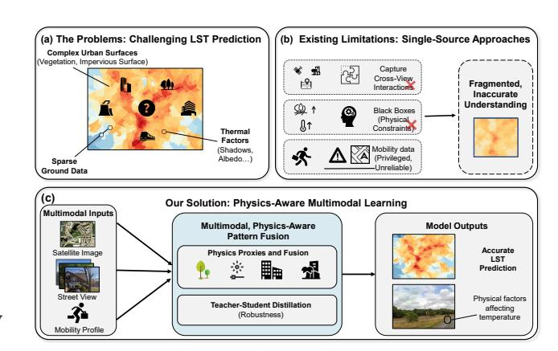
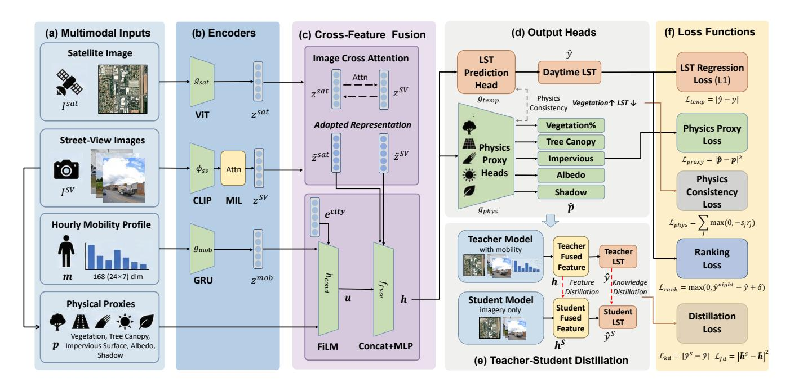
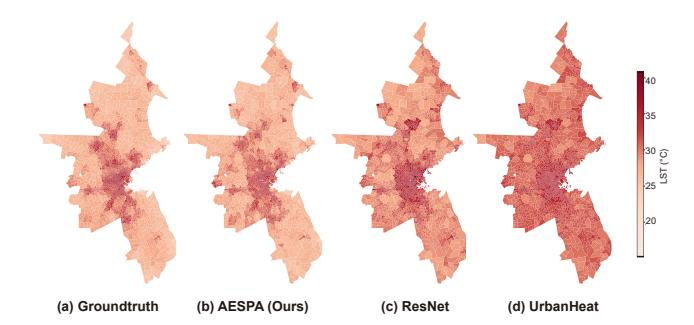
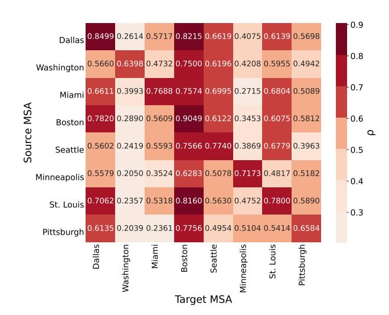
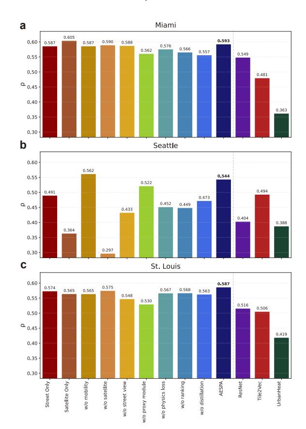
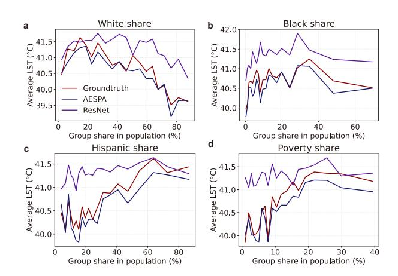

# **Physics-Aware Multimodal Urban Heat Mapping with Open Web Imagery and Mobility Data**

[Yuanyi You∗](https://orcid.org/0009-0000-8158-8114) Department of Electronic Engineering, BNRist, Tsinghua University Beijing, China yyy25@mails.tsinghua.edu.cn

[Yunke Zhang](https://orcid.org/0000-0003-0187-6015)∗ Department of Electronic Engineering, BNRist, Tsinghua University Beijing, China zyk21@mails.tsinghua.edu.cn

[Yong Li](https://orcid.org/0000-0001-5617-1659)† Department of Electronic Engineering, BNRist, Tsinghua University Beijing, China liyong07@tsinghua.edu.cn

# **Abstract**

Extreme urban heat is intensifying worldwide and often falls hardest on vulnerable communities, posing growing challenges for climate adaptation and Sustainable Development Goal 11. Fine-grained land surface temperature (LST) estimates are essential for identifying local heat risks, yet most operational approaches still rely on satellite products alone, which are constrained by cloud cover, revisit cycles, and limited sensitivity to human-scale morphology and activity. Meanwhile, web-based resources such as online imagery and mobility data offer rich but underused signals for scalable heat-risk monitoring. We present **AESPA**, a physics-aware multimodal framework for tract-level urban LST estimation that combines satellite imagery, street-view panoramas, mobility-derived activity profiles, and interpretable physical proxies. AESPA trains a teacher model that jointly leverages imagery and mobility, then distills its predictions and representations into an imagery-only student, enabling deployment in data-poor cities. Physics- and proxyguided losses encourage consistency with basic urban-climate relationships and yield attributions linked to vegetation, impervious surfaces, shading, and surface reflectance. We evaluate AESPA across eight major U.S. metropolitan areas under within-city and cross-city transfer protocols: AESPA reduces mean absolute error by about 32% and increases Pearson correlation between predicted and observed tract-level LST by 0.15 compared with the strongest satellite-based baseline, and improves transfer correlations by roughly 0.05-0.10. Its proxy attributions recover physically coherent gradients associated with neighborhood-level heat-exposure inequality, illustrating how web-based imagery and mobility can support transparent, deployable urban heat-risk monitoring in practice[1](#page-0-0) .

### **CCS Concepts**

• **Computing methodologies** → **Computer vision**; • **Humancentered computing** → *Collaborative and social computing*; • **Information systems** → **Spatial-temporal systems**.

ACM ISBN 979-8-4007-2307-0/2026/04 <https://doi.org/10.1145/3774904.3793035>

### **Keywords**

Urban heat estimation, multimodal learning, human mobility, knowledge distillation, climate equity

### **ACM Reference Format:**

Yuanyi You, Yunke Zhang, and Yong Li. 2026. Physics-Aware Multimodal Urban Heat Mapping with Open Web Imagery and Mobility Data. In *Proceedings of the ACM Web Conference 2026 (WWW '26), April 13–17, 2026, Dubai, United Arab Emirates.* ACM, New York, NY, USA, [10](#page-9-0) pages. [https:](https://doi.org/10.1145/3774904.3793035) [//doi.org/10.1145/3774904.3793035](https://doi.org/10.1145/3774904.3793035)

# **1 Introduction**

**Figure 1: Overview of the motivation of our work. Our model fills the gap of multimodal, physics-aware learning on the abundant thermal information across multi-view urban data from web platform to accurately predict land surface temperature.**

Extreme heat is intensifying under climate change, with cities emerging as critical hotspots due to the urban heat island (UHI) effect. Elevated urban temperatures exacerbate heat-related morbidity and mortality, strain energy and water systems, and disproportionately burden low-income, elderly, and marginalized communities [[1](#page-8-0), [14](#page-8-1), [21](#page-8-2), [35,](#page-8-3) [54\]](#page-9-1). Recent work further shows that heat *exposure* depends not only on where people live but also on where they travel during the day, as daily mobility concentrates people in persistent "heat traps" [\[12,](#page-8-4) [23\]](#page-8-5). Delivering the Sustainable Development Goal on sustainable cities and communities (SDG 11) [[29\]](#page-8-6) therefore requires reliable, fine-grained information on how heat is distributed across urban neighborhoods and how it interacts with the built environment and human activity. Yet city agencies and

∗Equal contribution.

†Corresponding author.

1The code and data are available at [https://github.com/tsinghua-fib-lab/AESPA.](https://github.com/tsinghua-fib-lab/AESPA)

This [work is licensed under a Creative Commons Attribution 4.0 International License.](https://creativecommons.org/licenses/by/4.0) *WWW '26, Dubai, United Arab Emirates*

© 2026 Copyright held by the owner/author(s).

community organizations often lack tract-level temperature maps that are timely, interpretable, and scalable, despite the growing availability of satellite imagery, street-view image, and open urban data from *web platforms* [\[40](#page-8-7)].

A primary line of work in urban heat mapping estimates land surface temperature (LST) or near-surface air temperature from satellite observations. Early methods use statistical downscaling and physical retrieval algorithms that combine thermal infrared bands with vegetation and built-up indices in regression or splitwindow frameworks [\[8](#page-8-8), [39](#page-8-9)]. More recent deep models leverage multi-source satellite products and auxiliary geophysical variables to improve prediction accuracy at finer spatial resolutions: Urban-Heat [[36](#page-8-10)] predicts fine-grained urban air temperature from multiresolution imagery with physically inspired objectives, and Deep-UHI [[55](#page-9-2)] introduces a context-aware thermodynamic framework for urban heat island forecasting, while other work couples splitwindow algorithms with neural networks or interpretable downscaling pipelines for LST retrieval [\[5](#page-8-11), [10](#page-8-12)]. These approaches demonstrate the power of satellite imagery, but remain largely satellitecentric: they are constrained by coarse thermal resolution and twodimensional surface proxies, with limited representation of streetlevel morphology, shading, and human behaviour.

At the same time, *Web platforms* now provide rich cross-view data about cities. Street-view imagery has been used to derive green view, sky view and façade indices and relate them to neighborhoodscale LST and microclimate [[38,](#page-8-13) [42,](#page-9-3) [53\]](#page-9-4), while multimodal and vision– language models leverage satellite and street-level images to infer socioeconomic status, segregation, health outcomes and land use [\[17–](#page-8-14)[20,](#page-8-15) [22](#page-8-16), [30,](#page-8-17) [50](#page-9-5), [52\]](#page-9-6). In parallel, mobility-based studies show that daily travel patterns concentrate people in persistent "heat traps" and strongly shape heat exposure beyond residential locations [[12](#page-8-4), [23\]](#page-8-5). Together, these developments suggest that satellite imagery, street-level morphology and human activity patterns jointly encode the fine-grained urban thermodynamics that matter for climate adaptation.

However, existing methods only partially exploit this multimodal context, leading to three concrete challenges. First, *multimodal context is fragmented*. Most temperature models operate on satellite imagery alone or add a few handcrafted street-view indices, without coherently integrating land cover, street-level form and mobility. Second, prevailing deep regressors are largely *physics-agnostic black boxes*. Without explicit ties to basic urban-climate mechanisms, they can violate simple thermal intuition (e.g., predicting higher temperature when vegetation increases), limiting their usefulness for planning [[41](#page-8-18)]. Third, *rich auxiliary signals such as mobility are unevenly available*. Mobility profiles are informative for exposure but often sparse, sensitive or missing, calling for models that can use them at training time without requiring them at deployment. These gaps motivate the need for a physically grounded, multimodal framework that can turn web-sourced imagery and mobility into reliable, tract-level urban temperature maps.

In this paper, we propose **AESPA** (**A**ligned **E**nvironmental **S**ensing with **P**hysics-aware **A**ttribution), a multimodal framework for finegrained urban temperature estimation at the census-tract level. AESPA encodes satellite patches and sets of street-view panoramas for each tract using strong vision backbones, and fuses them into a tract-level representation via a lightweight transformer. From the

same street-view pixels, it derives five physically motivated proxies that summarize tract-level street context: vegetation, tree canopy, impervious surface, apparent albedo, and shadow. These proxies serve a dual role: they are predicted by dedicated heads as auxiliary tasks, and they drive simple physics-aware regularizers that enforce monotone relationships between proxies and predicted temperature (e.g., more vegetation and canopy should not systematically raise predicted temperature, while higher imperviousness should not systematically cool it). To leverage richer signals where available without compromising deployability, AESPA trains a mobilityaware teacher model and distills its predictions and fused representations into an imagery-only student, treating mobility as *privileged information* for cross-city generalization. Figure [1](#page-0-1) summarizes the motivation of the AESPA model and how physical proxies align cross-view imagery with urban climatic mechanisms.

We evaluate AESPA across eight metropolitan statistical areas (MSAs) in the United States, using summer daytime land surface temperature at the census-tract level as the prediction target. We benchmark AESPA against strong satellite-only and proxy-based baselines, as well as ablated variants without certain modalities (satellite, street view, mobility) and without physics-aware losses, proxy heads, or teacher–student distillation. Across MSAs, AESPA achieves the lowest or second-lowest error in almost all cities, reducing average MAE from 1.95 ℃ for the best baseline to 1.33 ℃ and increasing the mean tract-level Pearson correlation from 0.61 to 0.76 in within-MSA experiments. In cross-MSA transfer, it further improves correlation by about 0.05–0.10 over imageryonly baselines, indicating stronger generalization to unseen cities. A tract-level case study in Dallas shows that AESPA more faithfully reproduces socioeconomic gradients in heat exposure than ResNet, supporting analysis of disparities across neighborhoods with different racial and poverty compositions. In summary, our main contributions are threefold:

- **Multimodal framework for tract-level temperature mapping.**AESPA integrates satellite imagery and street-view panoramas (plus mobility profiles during training) via vision encoders and cross-feature fusion to predict summer daytime temperature at the census-tract level across eight U.S. metropolitan areas.
- **Street-view physical proxies and physics-aware regularization.** From street-view pixels, AESPA derives five interpretable proxies (vegetation, canopy, imperviousness, apparent albedo, shadow) and uses them as auxiliary heads and sign-constrained regularizers, improving robustness and interpretability without requiring a full thermodynamic simulator.
- **Mobility-aware teacher–student distillation for imageryonly deployment.** AESPA treats mobility as privileged training information in a teacher model and distills its predictions and representations into an imagery-only student, enabling better cross-MSA generalization while requiring only widely available satellite and street-view imagery at deployment time.

# **2 Related Works**

# **2.1 Satellite-Based Temperature Estimation**

Accurate measurement of urban temperature is crucial for understanding the heat island effect and promoting sustainable cities (SDG 11) [\[29\]](#page-8-6). A primary thrust in this area involves estimating

land surface temperature and air temperature from satellite imagery. Early approaches relied on statistical downscaling and physical retrieval algorithms, combining thermal infrared data with vegetation or urban indices within traditional regression frameworks [[8,](#page-8-8) [39](#page-8-9)]. While computationally efficient, these methods are inherently limited in capturing the complex, fine-grained thermal variations driven by street-level urban morphology. The advent of deep learning has enabled more sophisticated fusion of multi-source satellite products. Contemporary work explores the use of multi-resolution imagery to predict urban air temperature through physically inspired loss functions [[36](#page-8-10)], while other approaches integrate thermodynamic context for forecasting urban heat island dynamics [[55\]](#page-9-2). Further innovations include hybrid models that couple physical radiative transfer equations with neural networks for robust temperature retrieval [[5](#page-8-11)], as well as interpretable downscaling pipelines designed for urban environments [\[10\]](#page-8-12).

These advances have substantially improved satellite-based temperature mapping, but they remain predominantly satellite-centric and do not exploit street-level views or human activity. In contrast, we treat satellite imagery as one component within a multimodal framework, combining it with street-view cues and simple physical constraints to model intra-urban temperature at finer scale.

### **2.2 Street-View Imagery and Urban Microclimate**

Street-view imagery provides a ground-level perspective on urban form, capturing features such as vegetation density and street canyon geometry that directly influence microclimate. Initial research focused on deriving quantitative indices—such as green view or sky view factor—and correlating them with neighborhood-scale temperature patterns using spatial statistical models [[53](#page-9-4)]. Subsequent studies have integrated these street-level features with traditional land cover data to improve temperature modeling, often within single-city contexts [\[38,](#page-8-13) [42\]](#page-9-3). Beyond microclimate, the computer vision community has leveraged joint analysis of satellite and street-view imagery for urban inference tasks, including socioeconomic assessment [[22](#page-8-16), [52\]](#page-9-6), health prediction [\[30\]](#page-8-17), and land use classification [\[17](#page-8-14), [50\]](#page-9-5).

This body of work highlights the value of street-view imagery, but most microclimate applications rely on a small number of predefined indices used as auxiliary covariates. Our approach instead derives physically grounded proxies directly from street-view pixels and uses them both as conditioning features and auxiliary learning targets, allowing street-level signals to regularize cross-modal temperature prediction in a more systematic way.

### **2.3 Physics-Constrained Environmental Machine Learning**

The integration of physical knowledge into machine learning has gained increasing attention as a means to improve the robustness and generalization of environmental and urban sensing systems. In the context of land surface temperature and urban heat estimation, recent frameworks have sought to embed physical principles—such as surface energy-balance constraints or radiative transfer equations directly into learning-based models. Examples include coupling split-window physical algorithms with neural networks for improved

LST retrieval [\[5](#page-8-11)], incorporating thermodynamic regularizations into downscaling and forecasting architectures [[4](#page-8-19), [27\]](#page-8-20), and using physicsinspired objectives to guide model training. Beyond urban heat, similar methodology has been applied to tasks such as human activity prediction [\[34,](#page-8-21) [49\]](#page-9-7) and high-resolution carbon emission estimation [[47](#page-9-8), [48\]](#page-9-9) from open data, underscoring the broad applicability of physics-aware learning in sustainability contexts. Surveys of this emerging field further emphasize the value of embedding interpretable physical components into data-driven urban modeling pipelines [\[41\]](#page-8-18).

While these approaches demonstrate improved consistency with domain knowledge, many depend on detailed physical forcings, high-resolution 3D geometry, or task-specific simulators and are typically designed for gridded remote-sensing inputs. We instead adopt a lightweight physics-aware design that encodes well-established monotonic relationships (e.g., between vegetation and temperature), together with optional spatial smoothness and day–night ordering, as soft constraints within a multimodal encoder. This aims to preserve physical plausibility and interpretability while remaining compatible with web-based satellite and street-view imagery for scalable urban temperature estimation.

### **3 Methods**

# **3.1 Problem Definition**

We aim to estimate fine-grained urban temperature at the level of census tracts across multiple U.S. metropolitan areas. Let �� denote the set of all tracts in our study, and index each tract by �� ∈ ��. For each tract �� we obtain three types of inputs that characterize its urban context: (1) a high-resolution satellite image �� sat �� ∈ ℝ �� ×�� ×3 centered on the tract; (2) a set of �� street-view images �� sv �� = {��sv ��,1 , … , ��sv ��,�� } sampled along roads within the tract, capturing human-scale morphology such as building facades, trees, and shading structures; (3) a 168-dimensional mobility profile **m**�� ∈ ℝ168 that summarizes hourly human activity over summer weeks.

For each tract ��, we observe a scalar target ���� ∈ ℝ, defined as the average summer daytime temperature over the study period. The learning task is to estimate a function ���� ∶ (�� sat �� , ��sv �� , **m**��) ↦ ̂���� parameterized by ��, such that the prediction �� ̂�� approximates the observed temperature ���� .

# **3.2 Model Overview**

We propose AESPA, a multimodal framework for tract-level urban temperature prediction. Building on the inputs defined in Section [3.1,](#page-2-0) it first encodes each modality with a dedicated encoder to obtain compact satellite, street-view, and mobility representations. These representations are merged by a cross-feature fusion block that models their interactions and produces a single tract embedding, from which the model regresses daytime temperature. To improve robustness and interpretability, we attach lightweight latent heads that recover physically meaningful factors from the same embedding and use them only during training to regularize the temperature mapping. Finally, we adopt a teacher–student design: a mobility-aware teacher is trained with all modalities, and an imagery-only student is distilled from it. The student branch, which relies only on imagery, is used at inference time. Figure [2](#page-3-0) illustrate the overall model.

**Table 1: LST prediction results on 8 U.S. MSAs. Best results are in bold and the second best results are underlined.**

### **4.1 Experimental Settings**

**Datasets.** We evaluate our model using multi-modal urban datasets collected from 8 metropolitan statistical areas (MSAs) in the United States. These datasets integrate socioeconomic indicators, satellite and street-view imagery, human mobility patterns, and Land Surface Temperature (LST) records; the details of the datasets can be found in Appendix [A](#page-9-12).

**Baseline Models.** We compare AESPA against following representative baselines: (i) **ResNet** [\[9](#page-8-29)] uses an ImageNet-pretrained ResNet-18 encoder applied separately to satellite and street-view images, followed by global average pooling and feature concatenation at the tract level. (ii) **Tile2Vec** [[15\]](#page-8-30) employs the same fusion architecture as the ResNet baseline, but initializes the ResNet-18 encoder with Tile2Vec-pretrained weights. (iii) **UrbanHeat** [[36\]](#page-8-10) follows a satellite-only design based on multi-scale context. It extracts satellite tiles centered at the tract centroid with approximate ranges of 250 m and 500 m, and apply a cross-attention module to fuse the two scales before regressing LST. (iv)**Proxy+Regression** uses the street-view–derived physical proxies aggregated at the tract level as input to a linear regression model.

**Training and Evaluation Metrics.** Training details can be found in Appendix [B](#page-9-13). We evaluate tract-level temperature prediction under two protocols: (i) *within-MSA* prediction, where models are trained and tested on tracts from the same MSA, and (ii) *cross-MSA* prediction, where models are trained on one MSA and directly evaluated on a different held-out MSA.

For both settings, we report two standard metrics on the corresponding test sets: First, the *Mean Absolute Error* (MAE) measures the average absolute difference between predicted and observed daytime LST values, with lower MAE indicating higher accuracy. Second, we compute the *Pearson correlation coefficient* �� between predicted and observed tract-level temperatures, which quantifies how well the model preserves the spatial ranking of hotter and cooler tracts; higher �� indicates better agreement.

### **4.2 Performance Evaluation**

**Overall Performance (RQ1).** Table [1](#page-5-0) reports within-MSA daytime LST prediction results across the eight U.S. MSAs. AESPA achieves the lowest MAE in 7 out of 8 MSAs and the highest or

**Figure 3: Groundtruth (a) and predicted LST of AESPA (b), UrbanHeat (c) and ResNet (d) in Boston MSA.**

second-highest Pearson correlation �� in all cases. On average, AESPA reduces MAE from 1.95∘C for the strongest baseline (ResNet) to 1.33∘C (a relative reduction of 32%), while increasing the mean correlation from 0.61 to 0.76. In individual cities, the gains are particularly pronounced in dense coastal MSAs such as Boston and Seattle, where AESPA lowers MAE by more than 1 ∘C compared with ResNet and improves �� by around 0.1–0.2. Only in Pittsburgh does ResNet obtain a slightly better performance, but AESPA remains competitive, indicating that the multimodal design is generally robust across diverse urban forms.

Figure [3](#page-5-1) provides a visual comparison for the Boston MSA. AESPA's predictions (b) closely reproduce both the cooler corridors and the localized hot spots in dense built-up areas visible in the groundtruth map (a), whereas UrbanHeat and ResNet (c-d) tend to oversmooth city-centre temperatures and miss cooler pockets embedded within otherwise warm regions. This agreement indicates that AESPA not only improves numerical accuracy but also better preserves fine-grained differences in heat levels across census tracts. **Ablation Studies (RQ2).** The lower part of Table [1](#page-5-0) reports ablations that progressively remove AESPA's key components. We first examine the role of multimodal fusion. Removing either satellite or street-view imagery (*w/o Satellite*, *w/o Street View*) increases the average MAE by about 6–10% and reduces the mean tract-level

**Figure 4: Comparison of performance (Pearson correlation** ��**) evaluated on cross-MSA experiments of AESPA model.**

correlation �� by roughly 0.06. The degradation is especially pronounced in Seattle and Minneapolis, where MAE increases by up to 0.66∘C and �� drops by about 0.30 when one view is removed, indicating that both nadir-view and street-level cues are needed to capture complex microclimates in dense, heterogeneous MSAs. Training single-view variants (*Satellite Only*, *Street View Only*) also underperforms the full model on average, although *Street View Only* comes close to AESPA in some MSAs, suggesting that streetlevel morphology carries strong predictive power that is further refined by satellite context. When mobility profiles are removed (*w/o Mobility*), performance declines more modestly (around 3% higher MAE and slightly lower ��), but the drop is consistent, confirming that mobility-informed supervision provides additional signal beyond static imagery.

We then investigate the physics-aware objectives. Disabling the physics-consistency, proxy, or day–night ranking losses (*w/o* ℒ*phys*, *w/o* ℒ*proxy*, *w/o* ℒ*rank*) all lead to worse average performance, with MAE increasing by 2–6% and �� decreasing by 0.01–0.02.The largest degradations occur for *w/o* ℒ*proxy* and *w/o* ℒ*rank*, particularly in Seattle and Minneapolis, indicating that enforcing monotonic relationships with street-view proxies and the day–night ordering helps stabilize learning in climates with strong diurnal contrast.

Finally, removing the teacher–student distillation (*w/o Distillation*) results in an average MAE increase of about 5% and a notable drop in �� (e.g., from 0.72 to 0.56 in Minneapolis), showing that guidance from the mobility-augmented teacher is important even for within-MSA prediction. Overall, these ablations support our design choices: fusing satellite and street-view imagery, incorporating lightweight physics-aware losses, and distilling from a mobility-informed teacher each make complementary contributions to the accuracy and robustness of AESPA. This suggests that the distillation process enables the student to internalize essential behavioral structures while remaining resilient to the noise and city-specific biases inherent in raw mobility data, ultimately leading to superior generalization.

**Figure 5: Average** �� **on cross-MSA experiments with Miami (a), Seattle (b), and St. Louis (c) as source MSA.**

**Cross-MSA Prediction (RQ3).** Figure [4](#page-6-0) summarizes the cross-MSA performance of AESPA (student). As expected, diagonal entries (train and test on the same MSA) are highest, but most offdiagonal cells still reach �� ≈ 0.5–0.7, indicating that a model trained in one MSA can recover much of the relative temperature ordering across census tracts in other MSAs without target labels. Transfers between climatically similar MSAs (e.g., Miami→Dallas, Boston→St. Louis) achieve the strongest correlations, whereas transfers into Washington and Minneapolis are consistently weaker, suggesting that these MSAs exhibit more distinctive climatic conditions.

Figure [5](#page-6-1) compares AESPA with ablated variants and baselines by averaging �� over all targets for three source MSAs. Across Miami, Seattle, and St. Louis, AESPA attains the highest average correlation and improves over ResNet and UrbanHeat by about 0.05– 0.10. Single-view models (*Street Only*, *Satellite Only*) and variants without physics-aware losses or the proxy module perform noticeably worse, and removing distillation further reduces �� for all three sources. These results show that multimodal fusion, lightweight physics constraints, and teacher–student distillation all contribute to AESPA's robustness when transferring to unseen MSAs. **Case Study: Socioeconomic Heat Gradients in Dallas (RQ4).** To examine whether AESPA can reveal intra-urban heat disparities across socioeconomic groups, we conduct a case study for

**Figure 6: Average LST as a function of Dallas MSA's tract-level socioeconomic features, comparing ground truth, AESPA, and ResNet.**

the Dallas MSA. For each census tract, we compute the share of White, Black, and Hispanic residents and the share of people living in poverty, then group tracts into bins by group share and plot the average daytime LST for ground truth, AESPA, and the bestperforming baseline in Figure [6.](#page-7-0) The ground-truth curves show clear socioeconomic gradients: tracts with lower White share and higher Hispanic or poverty share tend to be hotter, while LST peaks at intermediate Black shares. AESPA closely follows these patterns in both level and slope, whereas ResNet systematically overestimates temperatures and attenuates several gradients, particularly at high White shares and low poverty shares. This suggests that AESPA not only improves overall numerical accuracy but also better preserves the underlying relationships between heat exposure and neighborhood composition, enabling a more faithful characterization of intra-urban heat disparities.

### **5 Discussions**

Our findings show that web-based multimodal data can substantially enhance tract-level estimation of urban land surface temperature. By combining satellite imagery, street-view panoramas, mobility-derived activity profiles, and physically motivated proxies, AESPA consistently outperforms satellite-only and proxy-only baselines in both within-MSA and cross-MSA settings.Performance variations across cities are expected due to differences in urban morphology, data availability, and imaging conditions. In particular, methods relying on a single modality may be more sensitive to city-specific characteristics.The framework fits naturally into the vision of using web resources to support sustainable and equitable urban services, complementing emerging open workflows and dashboards for mapping urban heat and equity risks [\[7](#page-8-31), [33\]](#page-8-32).

These improvements carry direct implications for climate equity and the Sustainable Development Goals, particularly SDG 10 and SDG 11 [\[29\]](#page-8-6). A growing body of work has documented that lowerincome and racially marginalized neighborhoods are systematically hotter than wealthier, predominantly White areas in U.S. cities [[3](#page-8-33), [11](#page-8-34), [45](#page-9-14)]. AESPA's tract-level maps recover similar spatial disparities

from web-based data alone, and its proxy heads attribute elevated temperatures to combinations of reduced vegetation and canopy, higher impervious surfaces, and lower shading, consistent with established urban-climate mechanisms. Coupled with web-based visualization tools, these outputs could underpin interactive heatrisk dashboards that help city agencies, NGOs, and communities identify where heat burdens and adaptation deficits are concentrated and which levers (*e.g.*, urban greening, cool roofs, shading) are most relevant.

Methodologically, AESPA illustrates a pragmatic recipe for physicsaware multimodal learning in environmental applications. Recent work on physics-informed machine learning for weather and climate has shown that embedding domain constraints into neural networks can improve robustness and interpretability [[4](#page-8-19), [16,](#page-8-35) [41](#page-8-18), [51](#page-9-15)]. Instead of relying on detailed forcings or high-resolution 3D simulators, we encode a small set of well-established physical relationships (e.g., monotonic links between vegetation proxies and temperature) and a simple day–night ranking constraint as soft losses within a multimodal encoder. The teacher–student design further shows how richer modalities such as mobility, increasingly used to characterize thermal exposure and mobility-heat interactions [\[26](#page-8-36), [44](#page-9-16)], can be exploited during training and then distilled into an imagery-only student, improving cross-city generalization while keeping deployment lightweight and compatible with datapoor environments.

This work has limitations. Empirically, we focus on eight U.S. metropolitan areas with high data coverage; however, it remains to be seen how the framework generalizes to regions with sparse web data, distinct urban forms, or extreme climates. Furthermore, the physics-aware components in AESPA are designed as directionally consistent regularization rather than detailed physical simulations. While this maintains computational scalability, these priors remain relatively coarse and do not explicitly account for temporal dynamics, extreme heatwaves, or long-term adaptation trends. Future work could incorporate additional modalities – such as nighttime lights or semantic 3D information – and integrate richer physical constraints while preserving model efficiency. Finally, embedding AESPA into interactive web platforms that couple heat estimates with health, energy, or mobility indicators would further align with the Web4Good agenda. By transforming web-based imagery and mobility into transparent, deployable tools, such extensions can better support climate equity and heat risk mitigation. **Ethical Use of Data.** Protecting individual privacy is a paramount consideration throughout our study. The urban imagery data employed for our model training originates from publicly available sources with privacy-protective licenses [2](#page-7-1) .These images are coarsegrained in resolution, preventing the identification of individuals. The mobility patterns, socioeconomic indicators, and LST are all aggregated at the tract level, ensuring no individual targeting. Consequently, our research complies with ethical data usage standards.

# **Acknowledgments**

This work is supported by the National Key Research and Development Program of China under 2024YFC3307603. This work is also supported in part by Tsinghua University-Toyota Research Center.

2<https://trust.arcgis.com/en/privacy/privacy-tab-intro.htm>

### **References**

[1] Isabelle Anguelovski, Panagiota Kotsila, Loretta Lees, Margarita Triguero-Mas, and Amalia Calderón-Argelich. 2025. From heat racism and heat gentrification to urban heat justice in the USA and Europe. *Nature Cities* 2, 1 (2025), 8–16. [2] TC Chakraborty, Angel Hsu, Glenn Sheriff, and Diego Manya. 2020. United States surface urban heat Island database. [doi:10.17632/x9mv4krnm2.3](https://doi.org/10.17632/x9mv4krnm2.3) [3] TC Chakraborty, Andrew J Newman, Yun Qian, Angel Hsu, and Glenn Sheriff. 2023. Residential segregation and outdoor urban moist heat stress disparities in the United States. *One Earth* 6, 6 (2023), 738–750. [4] Linwei Chen, Bowen Fang, Lei Zhao, Yu Zang, Weiquan Liu, Yiping Chen, Cheng Wang, and Jonathan Li. 2022. DeepUrbanDownscale: A physics informed deep learning framework for high-resolution urban surface temperature estimation via 3D point clouds. *International Journal of Applied Earth Observation and Geoinformation* 106 (2022), 102650. [5] Yuanliang Cheng, Hua Wu, Zhao-Liang Li, Frank-M. Göttsche, Xingxing Zhang, Xiujuan Li, Huanyu Zhang, and Yitao Li. 2025. A robust framework for accurate land surface temperature retrieval: Integrating split-window into knowledgeguided machine learning approach. *Remote Sensing of Environment* 318 (2025), 114609. [6] Alexey Dosovitskiy, Lucas Beyer, Alexander Kolesnikov, Dirk Weissenborn, Xiaohua Zhai, Thomas Unterthiner, Mostafa Dehghani, Matthias Minderer, Georg Heigold, Sylvain Gelly, Jakob Uszkoreit, and Neil Houlsby. 2021. An Image is Worth 16x16 Words: Transformers for Image Recognition at Scale. In *International Conference on Learning Representations*. [https://openreview.net/forum?](https://openreview.net/forum?id=YicbFdNTTy) [id=YicbFdNTTy](https://openreview.net/forum?id=YicbFdNTTy) [7] Huilin Du, Wenfeng Zhan, Bingbing Zhou, Yang Ju, Zihan Liu, Ariane Middel, Kangning Huang, Lei Zhao, TC Chakraborty, Zhihua Wang, et al. 2025. Exacerbated heat stress induced by urban browning in the Global South. *Nature Cities* 2, 2 (2025), 157–169. [8] Subhanil Guha, Himanshu Govil, Anindita Dey, and Neetu Gill. 2018. Analytical study of land surface temperature with NDVI and NDBI using Landsat 8 OLI and TIRS data in Florence and Naples city, Italy. *European Journal of Remote Sensing* 51, 1 (2018), 667–678. [9] Kaiming He, Xiangyu Zhang, Shaoqing Ren, and Jian Sun. 2016. Deep residual learning for image recognition. In *Proceedings of the IEEE conference on computer vision and pattern recognition*. 770–778. [10] Nhat-Duc Hoang, Van-Duc Tran, and Thanh-Canh Huynh. 2025. From Data to Insights: Modeling Urban Land Surface Temperature Using Geospatial Analysis and Interpretable Machine Learning. *Sensors* 25, 4 (2025). [11] Angel Hsu, Glenn Sheriff, Tirthankar Chakraborty, and Diego Manya. 2021. Disproportionate exposure to urban heat island intensity across major US cities. *Nature communications* 12, 1 (2021), 2721. [12] Xinke Huang, Yuqin Jiang, and Ali Mostafavi. 2024. The emergence of urban heat traps and human mobility in 20 US cities. *npj Urban Sustainability* 4, 1 (2024), 6. [13] Maximilian Ilse, Jakub Tomczak, and Max Welling. 2018. Attention-based Deep Multiple Instance Learning. In *Proceedings of the 35th International Conference on Machine Learning (Proceedings of Machine Learning Research, Vol. 80)*, Jennifer Dy and Andreas Krause (Eds.). PMLR, 2127–2136. [14] Tomáš Janoš, Marcos Quijal-Zamorano, Natalia Shartova, Elisa Gallo, Raúl Fernando Méndez Turrubiates, Nadia Denisse Beltrán Barrón, Fabien Peyrusse, and Joan Ballester. 2025. Heat-related mortality in Europe during 2024 and health emergency forecasting to reduce preventable deaths. *Nature medicine* (2025), 1–10. [15] Neal Jean, Marshall Burke, Michael Xie, W Matthew Alampay Davis, David B Lobell, and Stefano Ermon. 2016. Combining satellite imagery and machine learning to predict poverty. *Science* 353, 6301 (2016), 790–794. [16] Karthik Kashinath, M Mustafa, Adrian Albert, JL Wu, C Jiang, Soheil Esmaeilzadeh, Kamyar Azizzadenesheli, R Wang, Ashesh Chattopadhyay, Aakanksha Singh, et al. 2021. Physics-informed machine learning: case studies for weather and climate modelling. *Philosophical Transactions of the Royal Society A* 379, 2194 (2021), 20200093. [17] Sibo Li, Xin Zhang, Yuming Lin, and Yong Li. 2024. M3 LUC: Multi-modal Model for Urban Land-Use Classification. In *Proceedings of the 32nd ACM International Conference on Advances in Geographic Information Systems*. 270–281. [18] Yuming Lin, Xin Zhang, Yu Liu, Zhenyu Han, Qingmin Liao, and Yong Li. 2024. Long-term detection and monitory of chinese urban village using satellite imagery. In *Proceedings of the Thirty-Third International Joint Conference on Artificial Intelligence*. 7349–7357. [19] Tianhui Liu, Jie Feng, Hetian Pang, Xin Zhang, Tianjian Ouyang, Zhiyuan Zhang, and Yong Li. 2025. CityLens: Benchmarking Large Language-Vision Models for Urban Socioeconomic Sensing. *arXiv preprint arXiv:2506.00530* (2025). [20] Tianhui Liu, Hetian Pang, Xin Zhang, Jie Feng, Yong Li, and Pan Hui. 2025. CityRiSE: Reasoning Urban Socio-Economic Status in Vision-Language Models via Reinforcement Learning. *arXiv preprint arXiv:2510.22282* (2025). [21] Yufei Liu and Guie Li. 2025. Inequities in thermal comfort and urban blue-green spaces cooling: An explainable machine learning study across residents of different socioeconomic statuses in Hangzhou, China. *Sustainable Cities and Society* 127 (2025), 106427. [doi:10.1016/j.scs.2025.106427](https://doi.org/10.1016/j.scs.2025.106427) [22] Yu Liu, Xin Zhang, Jingtao Ding, Yanxin Xi, and Yong Li. 2023. Knowledgeinfused contrastive learning for urban imagery-based socioeconomic prediction. In *Proceedings of the ACM web conference 2023*. 4150–4160. [23] Zhewei Liu, Chenyue Liu, and Ali Mostafavi. 2023. Beyond residence: A mobilitybased approach for improved evaluation of human exposure to environmental hazards. *Environmental Science & Technology* 57, 41 (2023), 15511–15522. [24] Ilya Loshchilov and Frank Hutter. [n. d.]. Decoupled Weight Decay Regularization. [25] Yanzhi Lu, Emma Jayne Sakamoto Ferranti, Lee Chapman, and Christian Pfrang. 2023. Assessing urban greenery by harvesting street view data: A review. *Urban Forestry Urban Greening* 83 (2023), 127917. [26] Amina Ly, Frances V Davenport, and Noah S Diffenbaugh. 2023. Exploring the influence of summer temperature on human mobility during the COVID-19 pandemic in the San Francisco Bay area. *GeoHealth* 7, 6 (2023), e2022GH000772. [27] Jun Ma, Huanfeng Shen, Menghui Jiang, Liupeng Lin, Chunlei Meng, Chao Zeng, Huifang Li, and Penghai Wu. 2024. A mechanism-guided machine learning method for mapping gapless land surface temperature. *Remote Sensing of Environment* 303 (2024), 114001. [28] Sara Mardanisamani and Mark Eramian. 2022. Segmentation of vegetation and microplots in aerial agriculture images: A survey. *The Plant Phenome Journal* 5, 1 (2022), e20042. [29] United Nations. 2015. Transforming our world: the 2030 Agenda for Sustainable Development. United Nations.<https://sdgs.un.org/2030agenda> Accessed: 2024- 12-03. [30] Tianjian Ouyang, Xin Zhang, Zhenyu Han, Yu Shang, and Yong Li. 2024. Health CLIP: Depression Rate Prediction Using Health Related Features in Satellite and Street View Images. In *Companion Proceedings of the ACM Web Conference 2024*. 1142–1145. [31] Ethan Perez, Florian Strub, Harm de Vries, Vincent Dumoulin, and Aaron Courville. 2018. FiLM: visual reasoning with a general conditioning layer. In *Proceedings of the Thirty-Second AAAI Conference on Artificial Intelligence and Thirtieth Innovative Applications of Artificial Intelligence Conference and Eighth AAAI Symposium on Educational Advances in Artificial Intelligence* (New Orleans, Louisiana, USA) *(AAAI'18/IAAI'18/EAAI'18)*. AAAI Press, Article 483, 10 pages. [32] Alec Radford, Jong Wook Kim, Chris Hallacy, Aditya Ramesh, Gabriel Goh, Sandhini Agarwal, Girish Sastry, Amanda Askell, Pamela Mishkin, Jack Clark, Gretchen Krueger, and Ilya Sutskever. 2021. Learning Transferable Visual Models From Natural Language Supervision. In *Proceedings of the 38th International Conference on Machine Learning (Proceedings of Machine Learning Research, Vol. 139)*, Marina Meila and Tong Zhang (Eds.). PMLR, 8748–8763. [33] Chiara Richiardi, Letizia Caroscio, Edoardo Crescini, Massimo De Marchi, Giovanni Marco De Pieri, Christopher Ceresi, Federico Baldo, Matteo Francobaldi, and Salvatore Eugenio Pappalardo. 2025. A global downstream approach to mapping surface urban heat islands using open data and collaborative technology. *Sustainable Geosciences: People, Planet and Prosperity* (2025), 100006. [34] Can Rong, Xin Zhang, Yanxin Xi, Hongjie Sui, Jingtao Ding, and Yong Li. 2025. Satellites Reveal Mobility: A Commuting Origin-destination Flow Generator for Global Cities. In *The Thirty-ninth Annual Conference on Neural Information Processing Systems Datasets and Benchmarks Track*. [https://openreview.net/forum?](https://openreview.net/forum?id=49W4eKKjPU) [id=49W4eKKjPU](https://openreview.net/forum?id=49W4eKKjPU) [35] Hua Shi, George Xian, Roger Auch, Kevin Gallo, and Qiang Zhou. 2021. Urban heat island and its regional impacts using remotely sensed thermal data—a review of recent developments and methodology. *Land* 10, 8 (2021), 867. [36] Minhyuk Song, Sungwon Han, Seungeon Lee, Donghyun Ahn, Jihee Kim, and Meeyoung Cha. 2025. Measuring Fine-Grained Urban Air Temperature with Satellite Imagery. In *Proceedings of the AAAI Conference on Artificial Intelligence*, Vol. 39. 28397–28404. [37] A. Trlica, L. R. Hutyra, C. L. Schaaf, A. Erb, and J. A. Wang. 2017. Albedo, Land Cover, and Daytime Surface Temperature Variation Across an Urbanized Landscape. *Earth's Future* 5, 11 (2017), 1084–1101. [38] Xiaobing Wei, Fangli Guan, Xucai Zhang, Nico Van de Weghe, and Haosheng Huang. 2023. Integrating planar and vertical environmental features for modelling land surface temperature based on street view images and land cover data. *Building and Environment* 235 (2023), 110231. [39] Qihao Weng, Dengsheng Lu, and Jacquelyn Schubring. 2004. Estimation of land surface temperature–vegetation abundance relationship for urban heat island studies. *Remote Sensing of Environment* 89, 4 (2004), 467–483. [40] Yanxin Xi, Yu Liu, Tong Li, Jingtao Ding, Yunke Zhang, Sasu Tarkoma, Yong Li, and Pan Hui. 2023. A satellite imagery dataset for long-term sustainable development in united states cities. *Scientific data* 10, 1 (2023), 866. [41] En Xu, Huandong Wang, Yunke Zhang, Sibo Li, Yinzhou Tang, Zhilun Zhou, Yuming Lin, Yuan Yuan, Xiaochen Fan, Jingtao Ding, and Yong Li. 2026. A survey of physics-informed AI for complex urban systems. *Information Fusion* 129 (2026), 104012.

- [42] Xiang Xu, Xintong Lyu, Wenjing Li, and Waishan Qiu. 2025. Supplementing street view imagery to local climate zones for modeling land surface temperature: a case study of Guangzhou. *Sustainable Cities and Society* (2025), 106644. [43] Ruyi Yao, Lixin Wang, Xin Huang, Weichen Wang, Shuangshuang Yang, Jin Yin, and Xinyan Chen. 2021. The relationship between land surface temperature and artificial impervious surface fraction in 682 global cities: spatiotemporal variations and drivers. *Environmental Research Letters* 16, 2 (2021), 024032. [44] Yanzhe Yin, Andrew Grundstein, Deepak R Mishra, Lakshmish Ramaswamy, Navid Hashemi Tonekaboni, and John Dowd. 2021. DTEx: A dynamic urban thermal exposure index based on human mobility patterns. *Environment International* 155 (2021), 106573. [45] Yi Yin, Liyin He, Paul O Wennberg, and Christian Frankenberg. 2023. Unequal exposure to heatwaves in Los Angeles: Impact of uneven green spaces. *Science Advances* 9, 17 (2023), eade8501. [46] Yihan Yin, Song Li, Xiaoyi Xing, Xinyi Zhou, Yujie Kang, Qi Hu, and Yanjing Li. 2024. Cooling Benefits of Urban Tree Canopy: A Systematic Review. *Sustainability* 16, 12 (2024). [47] Jinwei Zeng, Yu Liu, Jingtao Ding, Jian Yuan, and Yong Li. 2024. Estimating on-road transportation carbon emissions from open data of road network and origin-destination flow data. In *Proceedings of the Thirty-Eighth AAAI Conference on Artificial Intelligence and Thirty-Sixth Conference on Innovative Applications of Artificial Intelligence and Fourteenth Symposium on Educational Advances in Artificial Intelligence (AAAI'24/IAAI'24/EAAI'24)*. AAAI Press, Article 2509, 9 pages. [doi:10.1609/aaai.v38i20.30257](https://doi.org/10.1609/aaai.v38i20.30257) [48] Jinwei Zeng, Yu Liu, Guozhen Zhang, Jingtao Ding, Yuming Lin, Jian Yuan, and Yong Li. 2025. OpenCarbon: A Contrastive Learning-based Cross-Modality Neural Approach for High-Resolution Carbon Emission Prediction Using Open Data. In *Proceedings of the Thirty-Fourth International Joint Conference on Artificial Intelligence, IJCAI-25*, James Kwok (Ed.). International Joint Conferences on Artificial Intelligence Organization, 9999–10007. [doi:10.24963/ijcai.2025/1111](https://doi.org/10.24963/ijcai.2025/1111) AI and Social Good. [49] Jinwei Zeng, Guozhen Zhang, Can Rong, Jingtao Ding, Jian Yuan, and Yong Li. 2022. Causal learning empowered OD prediction for urban planning. In *Proceedings of the 31st ACM international conference on information & knowledge management*. 2455–2464. [50] Xin Zhang, Yu Liu, Yuming Lin, Qingmin Liao, and Yong Li. 2024. Uv-sam: Adapting segment anything model for urban village identification. In *Proceedings of the AAAI Conference on Artificial Intelligence*, Vol. 38. 22520–22528. [51] Yunke Zhang, Yuming Lin, Guanjie Zheng, Yu Liu, Nicholas Sukiennik, Fengli Xu, Yongjun Xu, Feng Lu, Qi Wang, Yuan Lai, et al. 2025. MetaCity: Data-driven sustainable development of complex cities. *The Innovation* 6, 2 (2025). [52] Yunke Zhang, Ruolong Ma, Xin Zhang, and Yong Li. 2025. Perceiving urban inequality from imagery using visual language models with chain-of-thought reasoning. In *Proceedings of the ACM on Web Conference 2025*. 5342–5351. [53] Yujia Zhang, Ariane Middel, and BL Turner. 2019. Evaluating the effect of 3D urban form on neighborhood land surface temperature using Google Street View and geographically weighted regression. *Landscape Ecology* 34, 3 (2019), 681–
- 697. [54] Yunke Zhang, Daoping Wang, Yu Liu, Kerui Du, Peng Lu, Pan He, and Yong Li. 2025. Urban food delivery services as extreme heat adaptation. *Nature Cities* 2, 2 (2025), 170–179. [55] Xingchen Zou, Weilin Ruan, Siru Zhong, Yuehong Hu, and Yuxuan Liang. 2025. Fine-grained Urban Heat Island Effect Forecasting: A Context-aware Thermodynamic Modeling Framework. In *Proceedings of the 31st ACM SIGKDD Conference on Knowledge Discovery and Data Mining V. 2*. 4226–4237.

# **A Dataset Details**

**Table 2: Basic statistics of 8 metropolitan statistical areas (MSAs) in the U.S.**

| MSA         | Average LST ( ∘ | C) #Census Tracts |
|-------------|-----------------|-------------------|
| Dallas      | 40.7            | 1,312             |
| Washington  | 33.57           | 1,359             |
| Miami       | 37.7            | 1,216             |
| Boston      | 31.54           | 1,003             |
| Seattle     | 31.82           | 718               |
| Minneapolis | 31.29           | 785               |
| St. Louis   | 34.88           | 615               |
| Pittsburgh  | 30.52           | 711               |

**Study Areas.** We focus on 8 metropolitan statistical areas (MSAs) in the U.S. and take census tract as our basic spatial unit. The MSAs are Dallas-Fort Worth-Arlington, TX Metro Area (shortened as "Dallas"), Washington-Arlington-Alexandria, DC-VA-MD-WV Metro Area ("Washington"), Miami-Fort Lauderdale-Pompano Beach, FL Metro Area ("Miami"), Boston-Cambridge-Newton, MA-NH Metro Area ("Boston"), Seattle-Tacoma-Bellevue, WA Metro Area ("Seattle"), Minneapolis-St. Paul-Bloomington, MN-WI Metro Area ("Minneapolis"), St. Louis, MO-IL Metro Area ("St. Louis"), Pittsburgh, PA Metro Area ("Pittsburgh"). Socioeconomic indicators for each census tract are gathered from the 2019 American Community Survey (ACS) 5 year estimates[3](#page-9-17) .

**Urban Imagery.** Urban imagery is collected from web-based mapping platforms. For every census tract, we obtain one nadirview satellite tile covering the tract and its immediate surroundings from Esri[4](#page-9-18) and resize it to 256 × 256 pixels for model input. In addition, we sample up to 40 street-view panoramas along public roads within each tract. These panoramas are downloaded via the Google Street View API[5](#page-9-19) and pre-processed (cropping, resizing, and normalization) before being encoded into tract-level visual representations.

**Mobility Data.** Human mobility data are derived from the Safe-Graph Weekly Patterns[6](#page-9-20) product for August to October 2019. For each census tract, we aggregate the hourly visitor counts of all points of interest (POIs) located within the tract into a 7 × 24 histogram. Summing over POIs and normalizing the histogram by its total count yields a 168-dimensional mobility profile **m**, which characterizes the distribution of visits to that tract over a week on average.

**LST Data.** Tract-level LST is sourced from the United States Surface Urban Heat Island database [\[2](#page-8-37)]. We extract summer daytime LST as the prediction target; the mean LST values for the eight MSAs are detailed in Table [2.](#page-9-21) While different modalities operate at varying native temporal resolutions, all dynamic signals are temporally aggregated to match the prediction horizon. Consequently, the model learns integrated heat exposure patterns within a consistent temporal window rather than modeling fine-grained, instantaneous dynamics.

# **B Implementation Details**

All models are trained for up to 30 epochs on a single NVIDIA A100 GPU. We first train the teacher model and then distill its knowledge into the student model. Optimization is performed with the AdamW optimizer [[24](#page-8-38)], using a learning rate of 1 × 10−4 and a weight decay of 0.05, together with early stopping based on validation performance. For the teacher stage, we set the loss weights to ��phys = 0.05, ��proxy = 0.0, and ��rank = 0.1. For the student stage, we use ��phys = 0.2, ��proxy = 0.3, ��rank = 0.1, ��kd = 0.1, and ��fd = 0.05. Within each MSA, data are split into 60%, 20%, and 20% of tracts for training, validation, and testing, respectively. We repeat all experiments with five random splits and report the average performance on test sets.

3<https://www.census.gov/programs-surveys/acs>

4<https://learn.arcgis.com/en/projects/download-imagery-from-an-online-database/>

5<https://developers.google.com/maps/documentation/streetview/overview>

6<https://docs.deweydata.io/docs/advan-research-weekly-patterns>