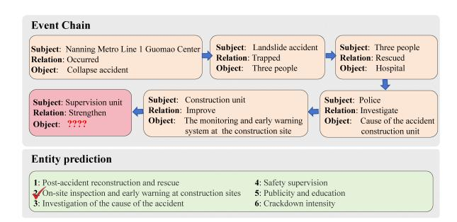
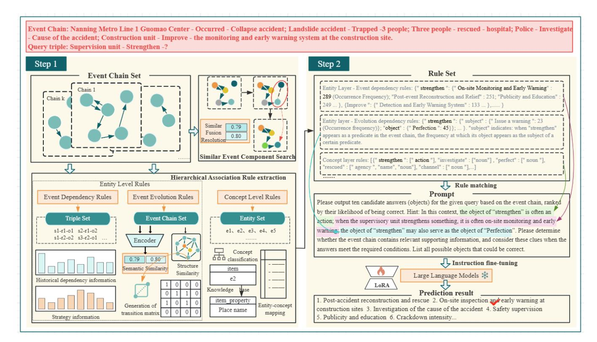
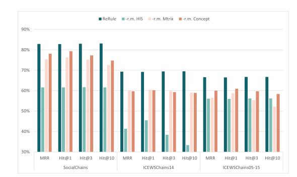
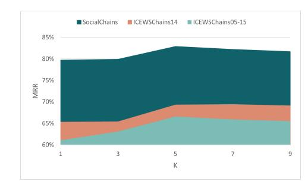

# ReRule: Temporal Rule-Augmented Language Modeling for Causal Event Chain Completion

Wei Zhang Beijing Institute of Technology Beijing, China 18035807939@163.com

Shufeng Hao∗ Taiyuan University of Technology Taiyuan, China haoshufeng@tyut.edu.cn

Chongyang Shi∗ Beijing Institute of Technology Beijing, China cy\_shi@bit.edu.cn

Usman Naseem Macquarie University Sydney, Australia usman.naseem@mq.edu.au

Jinyan Liu Beijing Institute of Technology Beijing, China jyliu@bit.edu.cn

Ziyu Li Beijing Institute of Technology Beijing, China lzy20020518@outlook.com

# Abstract

Complex web-based event sequences are essential for deciphering social dynamics and fostering positive social welfare outcomes computationally. Temporal knowledge graph completion and script event prediction have received attention for event sequence modeling. However, conventional knowledge graph models based on discrete quadruples fail to capture the global semantics and long-range dependencies of event chains, while script-based approaches often ignore the semantic roles and variations of entities within events. To address these limitations, we design a novel causal event chain completion task and propose a reasoning framework for key entity completion of query tuples in event chains. The framework first employs rule-guided filtering based on logical and temporal heuristics to prune the candidate space. Instruction-tuned generative models are then used to perform context-sensitive candidate generation and ranking. This hybrid design enables both factual consistency and flexible generalization. Our framework supports zero-shot reasoning as well as fine-tuned settings for domain-specific adaptation. We also construct three dedicated datasets for this task and conduct extensive evaluations. Experimental results demonstrate that our approach outperforms existing baselines across multiple metrics, highlighting its effectiveness in structured event modeling and entity inference.

# CCS Concepts

- Computing methodologies → Natural language processing; Knowledge representation and reasoning.

# Keywords

Event Chain Completion, Rule Mining, Pre-trained Language Model

### ACM Reference Format:

Wei Zhang, Shufeng Hao, Chongyang Shi, Usman Naseem, Jinyan Liu, and Ziyu Li. 2026. ReRule: Temporal Rule-Augmented Language Modeling

∗Corresponding author.

© 2026 Copyright held by the owner/author(s). ACM ISBN 979-8-4007-2307-0/2026/04 <https://doi.org/10.1145/3774904.3793037>

for Causal Event Chain Completion. In Proceedings of the ACM Web Conference 2026 (WWW '26), April 13–17, 2026, Dubai, United Arab Emirates. ACM, New York, NY, USA, [12](#page-11-0) pages.<https://doi.org/10.1145/3774904.3793037>

# 1 Introduction

In the current digital landscape, web technologies have been deeply integrated into social structure and processes. Social media, news platforms, and various digital applications, while archiving global events in a timely and massive manner, are increasingly involved in shaping public awareness and social responses to major social issues, such as public health crises, climate change, and humanitarian relief. Therefore, the in-depth mining and analysis of these complex web-based event sequences constitute a critical pathway not only for deciphering social dynamics but also for leveraging computational methods to improve social welfare.

The Knowledge Graph Completion task (KGC) has attracted widespread attention in enhancing event knowledge modeling and reasoning. Traditional KGC methods primarily focus on static knowledge graphs (KGs), where facts are represented as triples 〈subject, predicate, object〉, assuming all information is temporally invariant. Numerous approaches have been proposed in this setting, including translational models such as TransE [\[1\]](#page-7-0), which treat relations as vector translations, and more advanced methods such as RotatE [\[28\]](#page-8-0), ComplEx [\[29\]](#page-8-1), and ConvE [\[5\]](#page-7-1), which leverage geometric or neural modeling to capture complex relation patterns. However, real-world knowledge is inherently dynamic and temporal in nature. To address this, temporal knowledge graphs (TKGs) extend static KGs by incorporating time annotations into each fact, resulting in quadruples 〈subject, predicate, object, timestamp〉. This formulation enables the modeling of entity evolution and relation drift over time. Temporal embedding-based methods such as HyTE [\[4\]](#page-7-2), TTransE [\[11\]](#page-8-2), and more recent models like ConT [\[19\]](#page-8-3) and T-GAP [\[12\]](#page-8-4) have demonstrated that time-aware projections or sequential encoders can significantly improve temporal link prediction. Moreover, attention-based and frequency-aware models such as ExKGR [\[35\]](#page-8-5) and BoxTE [\[21\]](#page-8-6) further exploit temporal locality and relational uncertainty to improve reasoning. Despite these advances, TKGs still struggle to capture complex narrative structures that span multiple related events. In many real-world scenarios, temporal events are not isolated, but unfold in semantically coherent sequences—referred to as event chains—that reflect underlying causality, coherence, and progression. Examples include

[This work is licensed under a Creative Commons Attribution 4.0 International License.](https://creativecommons.org/licenses/by/4.0) WWW '26, Dubai, United Arab Emirates.

the escalation of international conflicts, multi-turn dialogues, and evolving user behaviors. Existing TKG models typically treat each event as an independent quadruple, thereby failing to capture the inter-event dependencies essential for narrative understanding. To mitigate this limitation, recent work has explored event-centric modeling techniques such as script learning and temporal event forecasting [\[16\]](#page-8-7). However, most of these methods lack structural grounding in TKGs or are limited in their generalizability to novel event contexts.

Figure 1: Causal Event Chain Completion.

To address these limitations, we propose a novel task causal event chain completion, where the objective of the task is to infer the missing entity—typically the object—in the final event of a temporally ordered event chain, as shown in Figure [1.](#page-1-0) Unlike conventional TKG completion tasks that consider isolated facts, our setting emphasizes context-aware inference over a sequence of interdependent events. It is highly relevant to practical applications such as event forecasting, narrative-based decision support, and early warning systems. This task poses unique challenges, including long-range temporal reasoning, representation of narrative flow, and handling of sparse or ambiguous targets. To address these challenges, we propose a hybrid inference framework that integrates symbolic reasoning with pretrained language models. Specifically, we incorporate (1) rule-guided filtering based on logical and temporal heuristics to prune the candidate space and (2) instruction-tuned generative models to perform context-sensitive candidate generation and ranking. This hybrid design enables both factual consistency and flexible generalization. Our framework supports zero-shot reasoning and fine-tuned settings for domain-specific adaptation. To validate the effectiveness of our method, we construct benchmark datasets from three sources: (i) ICEWS14, (ii) ICEWS05-15, and (iii) a self-curated Chinese temporal event dataset obtained via distant supervision and rule-based cleaning from real-world news corpora. These datasets across diverse domains and languages ensure a comprehensive evaluation of our model's robustness and adaptability. The main contributions of this work can be summarized as follows:

- We formalize a novel task of causal event chain completion that bridges temporal KGs with narrative event modeling, enabling temporally grounded and context-aware entity inference.

- We propose a hybrid reasoning framework that combines symbolic rule-based constraints with instruction-tuned generative language models to improve accuracy and generalization.
- We build a multilingual benchmark using ICEWS14, ICEWS05- 15, and a newly curated Chinese event dataset, and demonstrate that our approach achieves superior performance over strong zero-shot and fine-tuned baselines under standard evaluation metrics such as MRR and HIT@K.

### 2 ReRule

This section presents our proposed event chain entity completion model: ReRule (A multi-granularity rule-based and large language model-integrated event chain entity completion model). The overall architecture of the ReRule model is shown in Figure [2.](#page-2-0) The problem definition and each component of the event chain entity completion are then described in sequence.

# 2.1 Problem Definition

The entire event collection is represented as a unified temporal graph G = {E, R T }, consisting of multiple temporally ordered event chains {��1,��2, . . . ,���� }. E is a entity set, R is a predicate set among entities and T is a time set. Each event chain ���� is a sequence of event triples ���� = {��1, ��2, . . . , ����−1, ���� }, where each event ���� = (���� , ���� , ����) denotes a subject-relation-object triple. The final event ���� = (����, ����, ?) is the target query denoted as ��, for which the object is missing.

Unlike prior approaches that directly learn an embedding for the missing object o��, we propose an event chain entity completion method that integrates rule-based knowledge with large language models. Specifically, we construct a two-level rule set Rrule encompassing both concept-level and entity-level rules, and leverage LLMs to generate a candidate set of object entities O�� = {�� �� 1 , ���� , . . . , ���� �� }. The final objective is to identify the most likely entity ��ˆ�� from the top-ranked candidates:

��ˆ�� ∈ TopK (LLM(G, Rrule)) (1)

where LLM(·) denotes the generative module enhanced with rulebased prompts, and ��ˆ�� is the predicted target entity.

# 2.2 Similar Event Component Search

Due to the limitations of NLP tools in removing redundancy in the novel constructed event chain completion datasets that are structurally complete and semantically coherent, semantically identical entities may appear with different surface forms (e.g., "a man" vs. "man", or "police", "officers", "110 personnel"), which introduces noise in entity prediction. To mitigate this, we employ the event representation calibration to obtain a consistent event representation for semantical events with diverse expressions. We first embed the entity set E and predicate set R using a BERT encoder, and use cosine similarity to compute pairwise similarity scores. Then, the scores between entities or predicates exceeding a similarity threshold are obtained globally as a candidate entity or predicate. Meanwhile, we apply semantic role labeling with LTP 2.0 [\[3\]](#page-7-3) to construct coreference rules within each chain and merge co-referent mentions.

Table 1: Statistics of Different Types of Rules

| Rule          | Type            |           | SocialChains | ICEWSChains14 | ICEWSChains05-15 |
|---------------|-----------------|-----------|--------------|---------------|------------------|
| Historical    | Dependency      | Rules     | (A) 1542     | 3938          | 10821            |
| Strategic     | Rules           | (B)       | 1387         | 0             | 0                |
| Evolution     | Rules           | (C)       | 24516        | 3818          | 12921            |
| Concept-level |                 | Rules (D) | 7966         | 166           | 204              |
| Entity-level  | Rules           | (A+B+C)   | 27445        | 7756          | 23742            |
| Total         | Rules (A+B+C+D) |           | 35411        | 7922          | 23946            |

The resulting concept-level rules are stored as triples (���� , ��, ���� ) along with their confidence scores ��concept(���� , ��, ���� ). These rules complement entity-level rules by offering abstracted logical guidance, thereby improving robustness and adaptability in reasoning tasks under unseen or sparse entity conditions.

2.5.3 Comprehensive Rule Set. The comprehensive rule set is constructed by integrating entity-level and concept-level rules. As shown in Table [1,](#page-4-0) the rules are derived from different sources and vary in volume across datasets. All rules share a unified storage structure consisting of rule type (entity-level or concept-level), head entity, predicate, tail entity (or concept), and confidence score. These rules are persisted in a lightweight JSON format for efficient dynamic loading and retrieval during both training and inference.

This rule construction process systematically captures local dependencies and global evolution patterns in event chains, significantly enhancing the model's capacity for modeling and reasoning over complex event developments in the entity prediction task.

### 2.6 Training and Inference

To fully exploit rule-based evolution knowledge and the generative capabilities of large language models, we formulate the event chain completion task as an instruction-based question answering problem. We adopt the LoRA (Low-Rank Adaptation) technique to adapt ChatGLM3-6B through lightweight fine-tuning.

2.6.1 Input Construction and Data Organization. Each training and inference sample consists of two parts: 1) Prompt: The input prompt comprises the preceding ��−1 observed events and the query triple (��, ��, ?), augmented with relevant rules. These rules are incorporated through soft prompting and rule annotation. Specifically, matched rules are embedded into the prompt as natural language hints, while key elements such as entities, predicates, and rule alignments are tagged within the sequence to enhance structural awareness. This instruction-style prompt guides the model to understand event progression, recognize the prediction target, and adhere to rule constraints. 2) Target: The correct answer entity is provided in a structured natural language form, serving as the reference output for training. After rule augmentation, all data samples are organized as (Prompt, Target) pairs and split into training, validation, and test sets to ensure task consistency and fair generalization evaluation.

2.6.2 LoRA Fine-tuning Strategy. Considering the high computational cost and overfitting risks of full fine-tuning LLMs, we adopt LoRA for efficient adaptation. We freeze most of the original model's parameters and introduce low-rank trainable matrices to select

weight layers. During training, only the LoRA-specific parameters are updated, enabling the model to rapidly adapt to the event chain completion task while preserving prior knowledge. LoRA achieves task-specific adaptation with minimal training overhead, striking a balance between inference quality and fine-tuning efficiency.

2.6.3 Loss Function. We employ a standard language modeling loss. Specifically, the model generates an output sequence conditioned on the prompt, and the loss is calculated as token-level cross-entropy with the reference sequence:

L = − ∑︁��ˆ ��=1 log �� (���� | ��<�� , Prompt) (9)

where ��ˆ denotes the length of the target sequence, and �� (���� ��<�� , Prompt) is the probability of generating token ���� given the previous tokens and input prompt. This loss formulation allows the model to learn entity completion under a natural language generation paradigm, moving beyond traditional classification-based objectives.

2.6.4 Inference and Prediction. During inference, the model generates a candidate set of entities O�� = {�� �� 1 , ���� 2 , . . . , ���� �� } based on the input query and rule-enhanced prompt. The final prediction selects the top-�� entities as:

��ˆ�� ∈ TopK (LLM(��, Rrule)) (10)

The predicted entities are expected to satisfy both historical event progression and rule-based constraints, thereby improving both the accuracy and interpretability of the entity completion task.

### 3 Experiments

### 3.1 Dataset

As there is currently no publicly available benchmark for the event chain entity completion task, we construct three datasets, such as SocialChains, ICEWSChains14, and ICEWSChains05-15 datasets, to evaluate our proposed model and facilitate comparisons with existing baselines. These datasets are derived from the Chinese THUC-News corpus and the English ICEWS knowledge graph datasets.

SocialChains: The THUCNews corpus, compiled by Tsinghua University, contains over 740K news articles published between 2005 and 2011 across 14 categories. To construct structured event chains, we select documents from the "Society" category, which frequently exhibit coherent subject-action-object patterns (e.g., "suspect-attacked-victim" followed by "police-arrest-[X]"). These

Table 2: Dataset Statistics

| Dataset          | #Chains | #Triples | #Entities | #Predicates | Train  | Val   | Test  |
|------------------|---------|----------|-----------|-------------|--------|-------|-------|
| SocialChains     | 30,389  | 349,670  | 282,214   | 53,897      | 18,233 | 6,078 | 6,078 |
| ICEWSChains14    | 9,183   | 29,880   | 1,124     | 223         | 5,509  | 1,837 | 1,837 |
| ICEWSChains05-15 | 32,336  | 83,925   | 2,625     | 235         | 19,402 | 6,467 | 6,467 |

narratives are particularly suitable for modeling causality and temporal continuity. After preprocessing steps including sentence segmentation, event extraction, coreference resolution, and entity normalization, we obtain a high-quality Chinese event chain dataset, named SocialChains, characterized by rich entity and relation types, semantic coherence, and temporal structure.

ICEWSChains14 and ICEWSChains05-15: The ICEWS data is sourced from the Integrated Crisis Early Warning System and contains structured geopolitical events. We use the ICEWS14 and ICEWS05-15 subsets, which span 2014 and 2005–2015 respectively. Each event is represented as a quadruple (��, ��, ��, ��), with timestamp granularity of one day. We process these into English event chains named ICEWSChains14 and ICEWSChains05-15 by linking temporally and semantically adjacent events. A three-level quality control strategy focusing on entity consistency, chain continuity, and semantic cohesion is applied. We split each dataset into training/validation/test sets in a 6:2:2 ratio. Detailed statistics are summarized in Table [2.](#page-5-0)

### 3.2 Baseline Methods

We compare ReRule against a range of representative models, including static knowledge graph completion methods, such as Dist-Mult [\[36\]](#page-8-10), RGCN [\[26\]](#page-8-11), TransE [\[1\]](#page-7-0) and SACN [\[27\]](#page-8-12), temporal knowledge graph completion methods, such as RE-GCN [\[16\]](#page-8-7), CyGNet [\[38\]](#page-8-13), CNE [\[15\]](#page-8-14), CENET [\[34\]](#page-8-8) and xERTE [\[7\]](#page-7-4), and large language models, such as ChatGLM3 [\[6\]](#page-7-5) and T5 [\[23\]](#page-8-15).

For each baseline model, we adopt the hyperparameter settings reported in their original papers whenever applicable. However, due to the lack of prior work that exactly matches the setting of our event chain completion task, we adapt the input and output formats of all baseline models to support event chain data and produce predictions consistent with our task formulation. Additionally, we ensure that all models are trained and evaluated under comparable computational constraints, keeping core architectural components and key training parameters aligned for fair comparison. We compare ReRule with all baseline models using four standard metrics: MRR, Hits@1, Hits@3, and Hits@10.

# 3.3 Performance Comparison

To fairly and accurately evaluate the performance improvements of the proposed ReRule model, we conduct experiments following a standardized procedure on three constructed datasets: SocialChains, ICEWSChains14, and ICEWSChains05-15. The results are summarized in Table [3.](#page-6-0) Bold highlights the best performance, while underline denotes the second best.

Static knowledge graph completion models (e.g., DistMult, RGCN, TransE, SACN) perform poorly across all three datasets, with MRR scores consistently below 0.25. This suggests that static embeddingbased models, which lack temporal and sequential modeling, are

inadequate for capturing the causal and temporal dependencies inherent in event chains. Their limitations are particularly evident on the SocialChains dataset, where performance approaches unusable levels, indicating that simple static embeddings are insufficient for complex event chain prediction tasks.

Temporal knowledge graph completion models (e.g., RE-GCN, CyGNet, CNE, CENET, xERTE) demonstrate moderate improvements by leveraging temporal and structural information in graphs. Compared to static baselines, these methods show clear gains on Hits@10 in the SocialChains dataset. However, their overall MRR remains low, suggesting that these models struggle to capture finegrained chain-level dependencies. On the ICEWSChains14 and ICEWSChains05-15 datasets, RE-GCN, CENET, and xERTE achieve competitive results. It is because the extracted chain structures in these datasets preserve much of the original ICEWS event distribution. Furthermore, these methods benefit from architectural similarities between event chain modeling and conventional temporal KGC. Nonetheless, their lack of explicit chain-level reasoning still limits performance on sparse or structurally complex datasets, such as SocialChains.

Despite not being specifically designed for event chain completion, the T5 model captures sequence-level patterns more effectively than a finetuned ChatGLM3. Notably, ChatGLM3 performs poorly under direct instruction-based finetuning, indicating that this task poses non-trivial challenges for general-purpose LLMs and demands task-specific adaptation strategies.

The ReRule model further incorporates a hybrid mechanism of rule retrieval and large language model generation, achieving significant performance. On the SocialChains dataset, ChatGLM3+ReRule outperforms LLaMA3+ReRule across all metrics, achieving higher MRR and Hit@10 than all other baselines. This demonstrates its superior generalization and reasoning capabilities for Chinese social event chains. On the ICEWSChains14 and ICEWSChains05-15 datasets, while LLaMA3+ReRule achieves higher scores on Hit@3 and Hit@10, ChatGLM3+ReRule performs better on MRR and Hit@1, showing its adaptability and robustness in large-scale temporal event reasoning tasks.

Due to their design characteristics, LLaMA3 generally performs better on English datasets, while ChatGLM3 is more suited for Chinese. Overall, ChatGLM3+ReRule shows higher stability and better comprehensive performance, making it more suitable as the backbone model for the ReRule framework. Although LLaMA3+ReRule demonstrates competitiveness in some metrics, ChatGLM3+ReRule proves to be a more balanced choice across diverse event chain scenarios.

Table 3: Comparison of ReRule and baseline models on SocialChains, ICEWSChains14, and ICEWSChains05-15 datasets.

| Model                 | MRR   | Hit@1 | SocialChains Hit@3 | Hit@10 | MRR   | Hit@1 | ICEWSChains14 Hit@3 | Hit@10 | MRR   | Hit@1 | ICEWSChains05-15 Hit@3 | Hit@10 |
|-----------------------|-------|-------|--------------------|--------|-------|-------|---------------------|--------|-------|-------|------------------------|--------|
| DistMult              | 0.015 | 0.015 | 0.015              | 0.015  | 0.148 | 0.070 | 0.168               | 0.302  | 0.138 | 0.072 | 0.151                  | 0.240  |
| RGCN                  | –     | –     | –                  | –      | 0.001 | –     | –                   | 0.001  | 0.003 | –     | 0.004                  | 0.004  |
| TransE                | 0.018 | 0.010 | 0.022              | 0.035  | 0.182 | 0.021 | 0.278               | 0.481  | 0.209 | 0.040 | 0.316                  | 0.511  |
| SACN                  | 0.015 | 0.015 | 0.015              | 0.015  | 0.185 | 0.090 | 0.215               | 0.386  | 0.234 | 0.130 | 0.274                  | 0.434  |
| RE-GCN                | 0.016 | 0.001 | 0.004              | 0.105  | 0.367 | 0.266 | 0.412               | 0.553  | 0.381 | 0.276 | 0.432                  | 0.584  |
| CyGNet                | 0.081 | 0.060 | 0.092              | 0.120  | 0.351 | 0.257 | 0.394               | 0.532  | 0.368 | 0.273 | 0.412                  | 0.545  |
| CNE                   | 0.202 | 0.187 | 0.212              | 0.221  | 0.327 | 0.235 | 0.368               | 0.506  | 0.374 | 0.271 | 0.420                  | 0.575  |
| CENET                 | 0.124 | 0.093 | 0.135              | 0.173  | 0.396 | 0.293 | 0.449               | 0.585  | 0.431 | 0.325 | 0.486                  | 0.629  |
| xERTE                 | 0.193 | 0.179 | 0.201              | 0.217  | 0.408 | 0.327 | 0.457               | 0.573  | 0.466 | 0.378 | 0.523                  | 0.639  |
| ChatGLM3 (Fine-tuned) | 0.105 | 0.105 | 0.105              | 0.105  | 0.100 | 0.096 | 0.104               | 0.108  | 0.060 | 0.055 | 0.062                  | 0.070  |
| T5 (Fine-tuned)       | 0.326 | 0.280 | 0.360              | 0.417  | 0.101 | 0.062 | 0.114               | 0.215  | 0.097 | 0.056 | 0.113                  | 0.209  |
| LLaMA3+ReRule         | 0.795 | 0.805 | 0.822              | 0.829  | 0.641 | 0.512 | 0.746               | 0.797  | 0.594 | 0.479 | 0.676                  | 0.767  |
| ChatGLM3+ReRule       | 0.829 | 0.828 | 0.830              | 0.831  | 0.693 | 0.692 | 0.694               | 0.695  | 0.666 | 0.665 | 0.667                  | 0.667  |

Figure 3: Ablation results of ReRule on SocialChains, ICEWSChains14, and ICEWSChains05-15 datasets.

# 3.4 Ablation Study

To analyze the contribution of each component in ReRule, we constructed three ablated variants by removing or replacing key modules. Their results on three datasets are shown in Figure [3](#page-6-1) in terms of MRR and Hits@K.

- -r.m. HIS: This variant removes the event-level dependency rules (HIS) module from ReRule. During retrieval, it ignores rules associated with entity-level historical interactions, including strategy rules from external policy sets, thereby discarding triple-level historical knowledge.
- -r.m. Matrix: This variant excludes the evolutionary rules (Matrix) module. It ignores the evolutionary rules embedded in the entity layer of the dual-layer rule base, thereby removing knowledge of event chain evolution.
- -r.m. Concept: This variant removes the concept-level rule (Concept) module. During retrieval, it excludes abstract matching rules from the concept layer, discarding conceptual abstraction knowledge.

From the overall trend, removing any rule module significantly reduces model performance, confirming the importance of all three rule types in the event chain prediction task. Specifically, removing event-level dependency rules leads to a substantial drop in all

metrics on the SocialChains dataset, indicating the critical role of past interactions in entity prediction. The removal of evolutionary rules results in the largest performance degradation across all datasets, highlighting the importance of modeling event transitions and temporal logic. Lastly, although the removal of the conceptlevel module leads to relatively smaller performance drops, it still plays an auxiliary role by mapping entities to abstract categories, reducing the prediction space, and improving semantic consistency.

# 4 Case Study

To intuitively illustrate the overall design and implementation of the ReRule model and to investigate the effectiveness of rule-guided mechanisms in enhancing large language model reasoning, we conduct a detailed case study on a representative event chain.

Figure [4](#page-7-6) presents the construction of similar event chains during the rule-based event evolution process. The case centers around an incident involving a collapse in the Nanning Metro Line 1 at the Guomao Center, followed by related responses and interventions. The first row of the figure indicates the current query chain, while the others are retrieved based on a composite similarity metric that integrates key predicates, structural patterns, and semantic embeddings. Lighter cells indicate lower similarity scores, and stars denote the most similar chain in each comparison. From the visualization, we observe that the retrieved chains share key elements with the query chain, such as entities like construction companies or monitoring and early warning systems. Chains involving similar predicates like "strengthen", especially in the context of events leading to property damage or injury, tend to be ranked higher. Objects in these similar chains are extracted as examples during the rule mining process, and once their frequency surpasses a predefined threshold, they are included in the corresponding rule set.

Figure [5](#page-7-7) shows how rule matching, prompt generation, and prediction are performed. During prompt construction, the query triple is matched against various rule templates. First, at the concept level, the system retrieves rules associated with the predicate "strengthen", identifying its object type as predominantly Action. Then, at the entity level, the triple (supervision unit, strengthen, ?)

Figure 4: Similar event chain construction during the rulebased event evolution process

Figure 5: The rule-guided prompt generation and model prediction.

is matched against the rule set to retrieve statistically frequent objects. If the predicate occurs frequently enough, finer-grained rules involving subject-predicate pairs are also considered. Lastly, the query triple is evaluated in the context of previous event chains to identify whether its object co-occurs with other roles elsewhere in the chain (e.g., as a subject or object of another event). This hierarchical rule-matching process yields a structured prompt that serves as input for the LLM during fine-tuning. The generated answers are shown in the lower part of Figure [5.](#page-7-7) The top-ranked prediction is post-accident reconstruction and rescue, which—while frequently co-occurring with the predicate "strengthen"—typically appears with governmental or emergency response subjects, making it a suboptimal answer in this context. The second prediction, monitoring and early warning system, directly aligns with an earlier fact in the event chain—construction company–improve–monitoring system—and exhibits strong contextual and causal coherence. This indicates a correct inference. The third answer, accident cause investigation, is a partial match derived from related rules such as investigate–accident. However, the subject "supervision unit" is

misaligned, as such an action would more plausibly be undertaken by the police. Other predictions, like safety supervision, publicity and education, and crackdown intensity, reflect semantic relevance but fail to leverage the specific context of the input chain, thus being ranked lower.

This case study demonstrates the effectiveness of rule-guided prompting in enhancing LLM reasoning over structured event chains. By leveraging statistical constraints, event evolution rules, and concept-level semantic filters, ReRule facilitates a shift from mere linguistic association toward more knowledge-grounded inference, thereby improving semantic precision and reasoning interpretability in entity prediction tasks.

# 5 Conclusion

This paper proposes ReRule, a novel model for entity completion in event chains by integrating multi-granularity rule sets with pretrained language models. ReRule leverages structural insights from event chain data and designs a hierarchical rule construction mechanism at the entity, triple, and chain levels. These rules form a structured knowledge base that captures both conceptual abstraction and instance-level semantics. Built upon this, ReRule incorporates the rule set into a language model through instruction tuning, using soft prompts and explicit annotations to guide prediction. Additionally, a cooperative inference mechanism based on rule matching and language model scoring enhances prediction accuracy and robustness. Experimental results demonstrate that ReRule consistently achieves state-of-the-art performance across multiple datasets and metrics, exhibiting strong interpretability and generalization capability.

# Acknowledgments

This work is supported by the National Natural Science Foundation of China (No. 62372043), the Fundamental Research Programs of Shanxi Province (Grant No. 202503021211032), and Shanxi Scholarship Council of China (2024-61).

# References

[1] Antoine Bordes, Nicolas Usunier, Alberto Garcia-Duran, Jason Weston, and Oksana Yakhnenko. 2013. Translating Embeddings for Modeling Multi-relational Data. In Advances in Neural Information Processing Systems, Vol. 26. Curran Associates, Inc., Red Hook, NY, USA, 2787–2795. [2] Nathanael Chambers and Dan Jurafsky. 2008. Unsupervised learning of narrative event chains. In Proceedings of ACL-08: HLT. Association for Computational Linguistics, Columbus, Ohio, 789–797. [3] Wanxiang Che, Zhenghua Li, and Ting Liu. 2010. LTP: A chinese language technology platform. In Coling 2010: demonstrations. Coling 2010 Organizing Committee, Beijing, China, 13–16. [4] Shib Sankar Dasgupta, Swayambhu Nath Ray, and Partha Talukdar. 2018. Hyte: Hyperplane-based temporally aware knowledge graph embedding. In Proceedings of the 2018 conference on empirical methods in natural language processing. Association for Computational Linguistics, Brussels, Belgium, 2001–2011. [5] Tim Dettmers, Pasquale Minervini, Pontus Stenetorp, and Sebastian Riedel. 2018. Convolutional 2d knowledge graph embeddings. In Proceedings of the AAAI conference on artificial intelligence. AAAI Press, New Orleans, Louisiana, USA, 8 pages. [6] Team GLM, Aohan Zeng, Bin Xu, Bowen Wang, Chenhui Zhang, Da Yin, Dan Zhang, Diego Rojas, Guanyu Feng, Hanlin Zhao, et al. 2024. Chatglm: A family of large language models from glm-130b to glm-4 all tools. arXiv preprint arXiv:2406.12793 (2024). [7] Zhen Han, Peng Chen, Yunpu Ma, and Volker Tresp. 2020. xerte: Explainable reasoning on temporal knowledge graphs for forecasting future links. arXiv preprint arXiv:2012.15537 (2020).

- [8] Kaveh Hassani and Amir Hosein Khasahmadi. 2020. Contrastive multi-view representation learning on graphs. In International conference on machine learning. PMLR, 4116–4126. [9] Linmei Hu, Juanzi Li, Liqiang Nie, Xiao-Li Li, and Chao Shao. 2017. What happens next? Future subevent prediction using contextual hierarchical LSTM. In Proceedings of the AAAI Conference on Artificial Intelligence, Vol. 31. [10] Bram Jans, Steven Bethard, Ivan Vulic, and Marie-Francine Moens. 2012. Skip n-grams and ranking functions for predicting script events. In Proceedings of the 13th Conference of the European Chapter of the Association for Computational Linguistics (EACL 2012). ACL; East Stroudsburg, PA, 336–344. [11] Tingsong Jiang, Tianyu Liu, Tao Ge, Lei Sha, Sujian Li, Baobao Chang, and Zhifang Sui. 2016. Encoding temporal information for time-aware link prediction. In Proceedings of the 2016 conference on empirical methods in natural language processing. 2350–2354. [12] Jaehun Jung, Jinhong Jung, and U Kang. 2021. Learning to walk across time for interpretable temporal knowledge graph completion. In Proceedings of the 27th ACM SIGKDD Conference on Knowledge Discovery & Data Mining. 786–795. [13] Timothée Lacroix, Guillaume Obozinski, and Nicolas Usunier. 2020. Tensor decompositions for temporal knowledge base completion. arXiv preprint arXiv:2004.04926 (2020). [14] Zhongyang Li, Xiao Ding, and Ting Liu. 2018. Constructing narrative event evolutionary graph for script event prediction. arXiv preprint arXiv:1805.05081 (2018). [15] Zixuan Li, Saiping Guan, Xiaolong Jin, Weihua Peng, Yajuan Lyu, Yong Zhu, Long Bai, Wei Li, Jiafeng Guo, and Xueqi Cheng. 2022. Complex evolutional pattern learning for temporal knowledge graph reasoning. arXiv preprint arXiv:2203.07782 (2022). [16] Zixuan Li, Xiaolong Jin, Wei Li, Saiping Guan, Jiafeng Guo, Huawei Shen, Yuanzhuo Wang, and Xueqi Cheng. 2021. Temporal knowledge graph reasoning based on evolutional representation learning. In Proceedings of the 44th international ACM SIGIR conference on research and development in information retrieval. 408–417. [17] Ziyang Liu and Chaokun Wang. 2025. TeRDy: Temporal Relation Dynamics through Frequency Decomposition for Temporal Knowledge Graph Completion. In Proceedings of the 63rd Annual Meeting of the Association for Computational Linguistics (Volume 1: Long Papers), ACL 2025, Vienna, Austria, July 27 - August 1, 2025. Association for Computational Linguistics, 9611–9622. [18] Shangwen Lv, Wanhui Qian, Longtao Huang, Jizhong Han, and Songlin Hu. 2019. Sam-net: Integrating event-level and chain-level attentions to predict what happens next. In Proceedings of the AAAI conference on artificial intelligence, Vol. 33. 6802–6809. [19] Yunpu Ma, Volker Tresp, and Erik A Daxberger. 2019. Embedding models for episodic knowledge graphs. Journal of Web Semantics 59 (2019), 100490. [20] Puneet Mathur, Vlad I. Morariu, Aparna Garimella, Franck Dernoncourt, Jiuxiang Gu, Ramit Sawhney, Preslav Nakov, Dinesh Manocha, and Rajiv Jain. 2024. DocScript: Document-level Script Event Prediction. In Proceedings of the 2024 Joint International Conference on Computational Linguistics, Language Resources and Evaluation, LREC/COLING 2024, 20-25 May, 2024, Torino, Italy. ELRA and ICCL, 5140–5155. [21] Johannes Messner, Ralph Abboud, and Ismail Ilkan Ceylan. 2022. Temporal knowledge graph completion using box embeddings. In Proceedings of the AAAI Conference on Artificial Intelligence, Vol. 36. 7779–7787. [22] Zihan Qiu, Xiaoling Zhou, Chunyan An, Qiang Yang, and Zhixu Li. 2025. Neo-TKGC: Enhancing Temporal Knowledge Graph Completion with Integrated Node Weights and Future Information. In Proceedings of the Eighteenth ACM International Conference on Web Search and Data Mining, WSDM 2025, Hannover, Germany, March 10-14, 2025. ACM, 373–381. [23] Colin Raffel, Noam Shazeer, Adam Roberts, Katherine Lee, Sharan Narang, Michael Matena, Yanqi Zhou, Wei Li, and Peter J Liu. 2020. Exploring the limits of transfer learning with a unified text-to-text transformer. Journal of machine learning research 21, 140 (2020), 1–67. [24] Rachel Rudinger, Pushpendre Rastogi, Francis Ferraro, and Benjamin Van Durme. 2015. Script induction as language modeling. In Proceedings of the 2015 Conference on Empirical Methods in Natural Language Processing. 1681–1686. [25] Ali Sadeghian, Mohammadreza Armandpour, Anthony Colas, and Daisy Zhe Wang. 2021. Chronor: Rotation based temporal knowledge graph embedding. In Proceedings of the AAAI conference on artificial intelligence, Vol. 35. 6471–6479. [26] Michael Schlichtkrull, Thomas N Kipf, Peter Bloem, Rianne Van Den Berg, Ivan Titov, and Max Welling. 2018. Modeling relational data with graph convolutional networks. In The semantic web: 15th international conference, ESWC 2018, Heraklion, Crete, Greece, June 3–7, 2018, proceedings 15. Springer, 593–607. [27] Chao Shang, Yun Tang, Jing Huang, Jinbo Bi, Xiaodong He, and Bowen Zhou. 2019. End-to-end structure-aware convolutional networks for knowledge base completion. In Proceedings of the AAAI conference on artificial intelligence, Vol. 33. 3060–3067. [28] Zhiqing Sun, Zhi-Hong Deng, Jian-Yun Nie, and Jian Tang. 2019. Rotate: Knowledge graph embedding by relational rotation in complex space. arXiv preprint arXiv:1902.10197 (2019). [29] Théo Trouillon, Johannes Welbl, Sebastian Riedel, Éric Gaussier, and Guillaume Bouchard. 2016. Complex embeddings for simple link prediction. In International conference on machine learning. PMLR, 2071–2080. [30] Bokun Wang, Yang Yang, Xing Xu, Alan Hanjalic, and Heng Tao Shen. 2017. Adversarial Cross-Modal Retrieval. In Proceedings of the 25th ACM International Conference on Multimedia (Mountain View, California, USA). Association for Computing Machinery, New York, NY, USA, 154–162. [https://doi.org/10.1145/](https://doi.org/10.1145/3123266.3123326) [3123266.3123326](https://doi.org/10.1145/3123266.3123326) [31] Lihong Wang, Juwei Yue, Shu Guo, Jiawei Sheng, Qianren Mao, Zhenyu Chen, Shenghai Zhong, and Chen Li. 2021. Multi-level connection enhanced representation learning for script event prediction. In Proceedings of the web conference 2021. 3524–3533. [32] Shuchong Wei, Liangjun Zang, Xiaobin Zhang, Qianwen Liu, and Songlin Hu. 2024. Leveraging Evolution Patterns to Enhance Script Event Prediction by Large Language Models. In Database Systems for Advanced Applications - 29th International Conference, DASFAA 2024, Gifu, Japan, July 2-5, 2024, Proceedings, Part V (Lecture Notes in Computer Science, Vol. 14854). Springer, 371–380. [33] Feiyang Wu, Peixin Huang, Yanli Hu, Zhen Tan, and Xiang Zhao. 2025. Semantic and Sentiment Dual-Enhanced Generative Model for Script Event Prediction. In Proceedings of the 31st International Conference on Computational Linguistics, COL-ING 2025, Abu Dhabi, UAE, January 19-24, 2025. Association for Computational Linguistics, 9250–9259. [34] Yi Xu, Junjie Ou, Hui Xu, and Luoyi Fu. 2023. Temporal knowledge graph reasoning with historical contrastive learning. In Proceedings of the AAAI conference on artificial intelligence, Vol. 37. 4765–4773. [35] Cheng Yan, Feng Zhao, and Hai Jin. 2022. Exkgr: Explainable multi-hop reasoning for evolving knowledge graph. In International Conference on Database Systems for Advanced Applications. Springer, 153–161. [36] Bishan Yang, Wen-tau Yih, Xiaodong He, Jianfeng Gao, and Li Deng. 2014. Embedding entities and relations for learning and inference in knowledge bases. arXiv preprint arXiv:1412.6575 (2014). [37] Bo Zhou, Yubo Chen, Kang Liu, Jun Zhao, Jiexin Xu, Xiaojian Jiang, and Jinlong
  - Li. 2021. Multi-task self-supervised learning for script event prediction. In Proceedings of the 30th ACM International Conference on Information & Knowledge Management. 3662–3666. [38] Cunchao Zhu, Muhao Chen, Changjun Fan, Guangquan Cheng, and Yan Zhang. 2021. Learning from history: Modeling temporal knowledge graphs with sequential copy-generation networks. In Proceedings of the AAAI conference on artificial intelligence, Vol. 35. 4732–4740. A Related Work This section provides a comprehensive review of representative works in temporal knowledge graph completion and event chain prediction. A.1 Temporal Knowledge Graph Completion TKGC extends static KGC by incorporating temporal information into knowledge modeling. Time-aware extensions of translational models, including TTransE [\[11\]](#page-8-2) and HyTE [\[4\]](#page-7-2), introduce time embeddings or project entities into temporal hyperplanes. ConT [\[19\]](#page-8-3) and TNTComplEx [\[13\]](#page-8-16) treat time as a continuous variable and employ time-specific tensor decomposition. GNN-based methods have been adapted for TKGC as well. ExKGR [\[35\]](#page-8-5) designs eventaware attention over dynamic subgraphs. BoxTE [\[21\]](#page-8-6) leverages box embeddings to represent temporal intervals and reason over temporal scopes. Neo-TKGC [\[22\]](#page-8-17) leverages both graph structure and temporal dependencies to enhance entity and relation representation. TeRDy [\[17\]](#page-8-18) employs time-invariant embeddings and temporally dynamic embeddings to capture temporal relational dynamics. Some approaches further introduce logical constraints or temporal patterns to enhance interpretability and generalization. For example, CyGNet [\[38\]](#page-8-13) encodes periodic temporal dependencies, while ChronoR [\[25\]](#page-8-19) models relative temporal relations among entities and events. Despite these advancements, existing TKGC methods still face challenges in capturing long-range dependencies,

reasoning across multiple event chains, and handling ambiguous temporal contexts.

# A.2 Script Event Prediction

Script event prediction focuses on inferring the most plausible subsequent event based on a given sequence of prior events. Unlike structured knowledge graphs, this task often operates in unstructured narrative spaces, where events are described in natural language. It is closely related to temporal reasoning and complements TKGC by emphasizing causal and sequential patterns within event chains. Early methods adopt event-pair models, which rely on co-occurrence statistics to capture local dependencies. Chambers and Jurafsky [\[2\]](#page-7-8) introduce narrative chains using PMI to learn prototypical event transitions. Subsequent works [\[10,](#page-8-20) [24\]](#page-8-21) apply skip-gram-style models to estimate event-relatedness. However, such approaches are limited in modeling complex or long-range event structures. To address this, event-chain models were proposed to capture sequence-level patterns. Hu et al. [\[9\]](#page-8-22) employ hierarchical LSTMs to encode event and word sequences jointly. Lv et al. [\[18\]](#page-8-23) use attention to model inter-event dependencies. These models enhance temporal understanding but still struggle with non-linear structures. More recent event-graph models represent events as nodes connected via dependency edges, enabling richer structural reasoning. Li et al. [\[14\]](#page-8-24) build narrative event graphs and applied GNNs for context-aware representation. Wang et al. [\[31\]](#page-8-25) combine GCNs and sequential encoders for improved representation learning. SSD-GM [\[33\]](#page-8-26) employs event-centric structure information based on GNN and sentiment information to enhance the generative model. External knowledge models introduce background information to compensate for data sparsity. Zhou et al. [\[37\]](#page-8-27) utilized the TimeTravel dataset and designed self-supervised pretraining tasks for enhanced generalization. Wei et.al [\[32\]](#page-8-28) employ the intrinsic knowledge of LLMs for script event prediction by using event evolution patterns. Furthermore, DocSEP [\[20\]](#page-8-29) is designed to learn sequential ordering between events in long-form documents. In addition, recent advances in adversarial retrieval [\[30\]](#page-8-30) could be used to archive and align global event knowledge, thus providing rich evidence for event representation and reasoning. In summary, script prediction offers valuable insights for modeling temporal and causal dynamics in event chains, though challenges remain in generalization, structural reasoning, and knowledge integration.

# B Dataset Construction Details

This section introduces the construction details of the novel event chain datasets, such as the Chinese dataset SocialChains and the English datasets ICEWSChains14 and ICEWSChains05-15. Table [4](#page-10-0) presents a comparison of the number of event chains, average chain length, event chain integrity, and entity overlap rate on the three datasets.

# B.1 SocialChains

The event chain dataset SocialChains is extracted from the THUC-News news dataset. First, the DeepSeek knowledge extraction tool is used to extract structured event triplets from each event case in the event case library of THUCNews. Then, a semantically coherent event chain is formed by organizing events in relative chronological

order and subject organization. Further, we establish a multidimensional verification mechanism and standardized rules to enhance the quality of datasets.

Chain extraction We employ the DeepSeek-V3 API as the basic tool to extract event triplets, such as (subject, predicate, object), by using the designed prompt templates. The extracted event triplets are ranked according to the relative time sequence to form the social event chains. The number of event chains after extraction is 40003 for THUCNews. Meanwhile, we eliminate the event chains with sensitive event types or keywords, redundant event descriptions, and the absence of core event entities.

Multidimensional verification Despite the reliability of the DeepSeek-V3 model in event extraction, the initial event chain extraction results nevertheless contain certain discrepancies and errors in event representation. By examining the distribution of the existing event chain across multiple dimensions, such as entity, chain structure, and semantics, we employ standard NLP techniques to clean and balance the dataset, thereby enhancing its overall quality. The implementation procedure is detailed below:

- Entity distribution verification: Entity-level verification is to conduct word frequency and part-of-speech statistics on entities and predicates contained in the event chain dataset. On one hand, the numerous monetary numerical entities in the dataset not only provide limited informational value for model learning, but can also divert the model from its intended learning objective due to their high frequency. Therefore, the regular filtering mechanism is used to clean triples in the data set, such as "accident - loss of -1000 yuan" and "Wallet - have -200 dollars". On the other hand, some event triple items are null during extraction, owing to some events with only subject and predicate structure, or unclear entity relationships. Thus, we employ the "[PAD]" symbol to occupy the missed items in the triplet for unifying the representation.
- Chain distribution verification: The verification at the chain level focuses on the length and integrity of the event chain in the event chain dataset. On one hand, the extracted event chain length is obviously unbalanced in the dataset. Thus, event chains that are limited in number but markedly longer than the average are deleted after manual assessment. Meanwhile, singleton event chains (length=1) should be discarded, as they do not constitute a meaningful sequence. On the other hand, the event chain with a high proportion of "[PAD]" is considered to have low event integrity. Therefore, cleaning the event chain with a high proportion of "[PAD]" can ensure the relative integrity of the event chain dataset.
- Semantic distribution verification: The Semantic distribution verification focuses on the entity overlap of the event chain in the dataset. The same entity can be represented differently both within and across event chains. This inconsistency leads to a meaningless proliferation of entity mentions in the set, which ultimately degrades the model's accuracy in entity prediction. Thus, we use the overlapping rate of entities between chains to represent the degree of semantic association between different chains in the dataset. The average overlapping rate between all chain pairs is defined

Table 4: Comparison of SocialChains, ICEWSChains14, and ICEWSChains05-15 datasets before and after processing.

|         |         |              | Before | SocialChains After | Before | ICEWSChains14 After | Before | ICEWSChains05-15 After |
|---------|---------|--------------|--------|--------------------|--------|---------------------|--------|------------------------|
| Number  | of      | event chains | 40003  | 30389              | 2821   | 9183                | 5202   | 32336                  |
| Average | chain   | length       | 11.74  | 15.02              | 11.25  | 16.54               | 11.24  | 16.21                  |
| Event   | chain   | integrity    | 99.20% | 99.40%             | 100%   | 100%                | 100%   | 100%                   |
| Entity  | overlap | rate         | 0.25%  | 0.28%              | 0.43%  | 1.89%               | 0.48%  | 0.87%                  |

as:

���������������������������������� = 2 �� (�� − 1) ∑︁ 1≤��≤��≤�� |���� ∩ ���� |���� ∪ ���� (11)

where ���� denotes the entity set in the ��-th chain and �� is the number of chains. Using this metric, we can gauge the structural density of an event chain—ranging from sparse and isolated to densely interconnected— and evaluate its level of informational coherence.

- Manual verification: To ensure the reliability of the data set, 5% of the event chain samples were randomly selected from the final event chain data set, and two graduate students with the natural language processing background independently completed the annotation evaluation task. According to the original text content, each evaluator judges the rationality of the structure of each event in the event chain, the accuracy of the triple [subject, predicate, object], and whether the internal logical coherence of the event chain is good. In order to ensure the objectivity and consistency of the assessment, a unified assessment guide was provided for the two graduate students before the assessment, including event extraction criteria, entity unification principle, reference resolution rules, etc. The evaluation results show that more than 80% of the event chains are evaluated as "good" or "excellent", which verifies the effectiveness of the automatic extraction and processing process.

# B.2 ICEWSChains14 and ICEWSChains05-15

For standard temporal knowledge graph datasets like ICEWS14 and ICEWS05–15, the original data already comprises event triplets (subject, predicate, object) along with their corresponding timestamps. The primary processing objective is therefore to construct coherent event chains, strengthen their capacity for contextual narrative representation, and systematically organize and evaluate the data. The entire procedure adheres to the "entity-chain-semantics" triple quality control strategy—previously introduced for Chinese datasets—with the goal of enhancing structural rationality and semantic relevance. The specific workflow is outlined below:

Chain extraction Event chain extraction is to identify events with potential semantic links and connect them based on their timestamps to form a continuous chain. The specific steps are as follows:

- Initial screening of triplets: Sort the quadruple (s, p, o, t) in the original data by timestamp and unify the time granularity to be precise 'Day'; Simultaneously remove predicate terms with ambiguous meanings or significant statistical noise (such as "Unknown", "NA", etc.)

- Central event selection: Select triplets with moderate frequency of occurrence of subjects or objects in the data as central events to avoid model learning being dominated by high-frequency entities (such as "United States").
- Chain construction based on adjacency extension: Starting from a central event, a chain is constructed by chronologically ordering events from adjacent entities within a fixed time window (±30 days), and is subsequently pruned to a reasonable length.

Multidimensional verification To ensure that the constructed chain has a high degree of rationality in both structure and semantics, the quality control mechanisms are as follows:

- Entity frequency balance verification: Count the global occurrence frequency of entities in the chain, filter out chains dominated by high-frequency entities, and alleviate only the high-frequency entity learning problem;
- Chain distribution verification: Exclude singleton event chains (length=1), sample chains with a reasonable length range (such as 2-25) according to the actual distribution, and control the long tail effect;
- Semantic consistency verification: As the original ICEWS series dataset has clear entity types, the relevant operations for semantic consistency verification are omitted.

Figure 6: Impact of different �� values (top-�� similar event chains) on ReRule across three datasets

# C Event Chain Number Effect

The number of retrieved similar event chains (��) plays a crucial role in enriching the model's input with historical event evolution patterns. To investigate how �� influences performance, we fix the model structure and training procedure, and evaluate ReRule under different values of �� ∈ {1, 3, 5, 7, 9}. The results on all three datasets are shown in Figure [6.](#page-10-1) We observe a consistent "rise-then-fall" pattern across all datasets: model performance improves as �� increases

from 1 to 5, then declines when �� exceeds 5. This suggests that �� = 5 strikes the optimal balance between providing rich historical context and avoiding noise. When �� is small (e.g., �� = 1 or 3), the retrieved event chains are typically highly relevant but insufficient in number to capture diverse evolution trajectories. This leads to limited context and underutilization of useful patterns, resulting in lower MRR scores. In contrast, when �� is large (e.g., �� = 7 or 9), although more chains are incorporated, the likelihood of semantic drift or structural inconsistency increases. This introduces noisy or misleading information, which distracts the model and reduces prediction accuracy. These findings highlight the importance of carefully selecting �� to balance "information enrichment" and "semantic interference." While an insufficient number of chains results in sparse signals, an excessive number dilutes the model's focus.