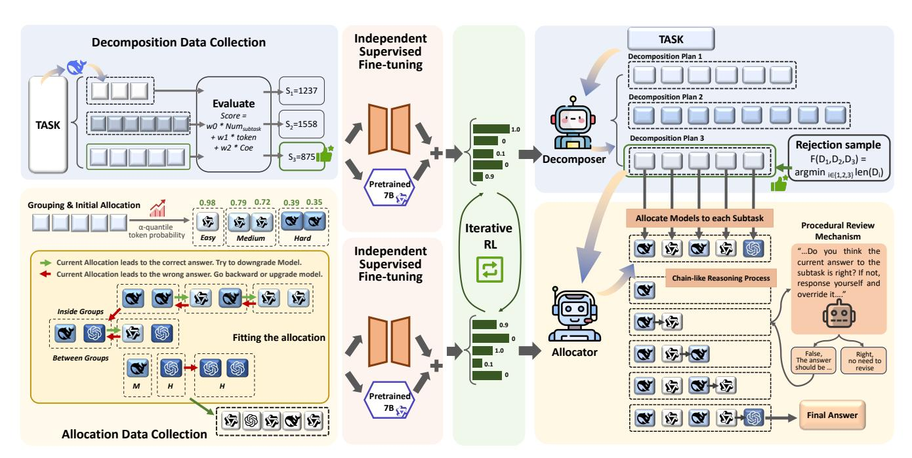
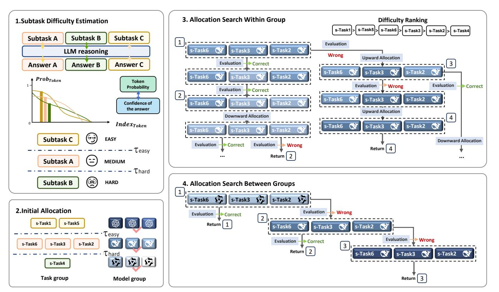
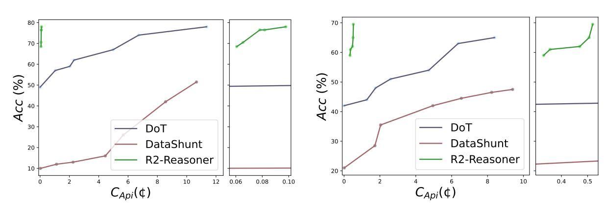
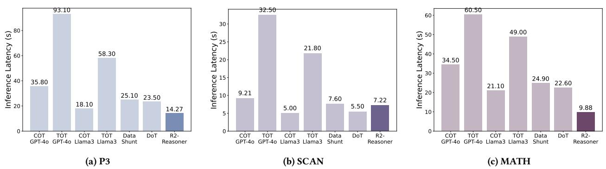

# Route-and-Reason: Energy-Efficient Scaling of LLM Reasoning via Reinforced Model Routing

Chenyang Shao∗ Department of Electronic Engineering, BNRist Tsinghua University Zhongguancun Academy Beijing, China shaocy24@mails.tsinghua.edu.cn

Xinyang Liu∗ Department of Electronic Engineering, BNRist Tsinghua University Beijing, China liuxinya21@mails.tsinghua.edu.cn

Yutang Lin Department of Electronic Engineering Tsinghua University Beijing, China yt-lin21@mails.tsinghua.edu.cn

Fengli Xu† Department of Electronic Engineering, BNRist Tsinghua University Zhongguancun Academy Beijing, China fenglixu@tsinghua.edu.cn

Yong Li Department of Electronic Engineering, BNRist Tsinghua University Zhongguancun Academy Beijing, China liyong07@tsinghua.edu.cn

# Abstract

Chain-of-thought has been proven essential for enhancing the complex reasoning abilities of Large Language Models (LLMs). However, the associated surge in test-time compute leads to prohibitive energy consumption and carbon footprints, posing strict challenges for sustainable AI deployment. Recent advances have explored routing queries among multiple models as a promising mitigation strategy. Yet, previous works operate primarily at the coarse-grained task level, often resulting in resource inefficiency by failing to align model capabilities with specific step-level difficulties. Collaboration at the level of intermediate reasoning steps (thoughts) could enable more efficient coordination, but it also poses significant challenges for router scheduling, placing immense demands on the quality of task decomposition and the precision of the router. To address this, we propose R2-Reasoner, a novel framework centered around a Reinforced Model Router designed to achieve energy-efficient and scalable LLM reasoning. This router orchestrates collaboration across 9 heterogeneous models, with parameter scales ranging from less than 1B to hundreds of billions. It functions by decomposing complex queries into subtasks and dynamically assigning each to its optimal model via a subtask allocator, minimizing computational overhead without compromising quality. Training involves a twostage alternating process for the decomposer and allocator, integrating supervised fine-tuning with reinforcement learning for selfsupervised refinement. Extensive experiments across 6 benchmarks demonstrate that R2-Reasoner reduces computational overhead by 84.46% in API cost and 71.14% in energy consumption compared to

© 2026 Copyright held by the owner/author(s). ACM ISBN 979-8-4007-2307-0/2026/04 <https://doi.org/10.1145/3774904.3793038>

state-of-the-art baselines while maintaining competitive accuracy. Our framework paves the way for the development of Green AI and more environmentally sustainable reasoning systems. Code is open-source at [https://github.com/tsinghua-fib-lab/R2-Reasoner.](https://github.com/tsinghua-fib-lab/R2-Reasoner)

# CCS Concepts

• Computing methodologies → Reinforcement learning; Cooperation and coordination.

# Keywords

Sustainable AI, Energy-efficient Inference, Model Router, Large Language Model, Reinforcement Learning

### ACM Reference Format:

Chenyang Shao∗ , Xinyang Liu∗ , Yutang Lin, Fengli Xu† , and Yong Li. 2026. Route-and-Reason: Energy-Efficient Scaling of LLM Reasoning via Reinforced Model Routing. In Proceedings of the ACM Web Conference 2026 (WWW '26), April 13–17, 2026, Dubai, United Arab Emirates. ACM, New York, NY, USA, [12](#page-11-0) pages.<https://doi.org/10.1145/3774904.3793038>

# 1 Introduction

Chain-of-Thought (CoT, [\[32\]](#page-9-0)) has endowed large language models (LLMs) with significantly enhanced reasoning capabilities. Building on this, LLM reasoning has progressed from prompting-based sequential thoughts to reinforcement learning–driven long-chain reasoning [\[5,](#page-8-0) [12,](#page-8-1) [18,](#page-8-2) [22,](#page-9-1) [27,](#page-9-2) [31\]](#page-9-3), further evolving into the paradigm of test-time scaling. This evolution, however, comes with a substantial increase in computational overhead, resulting in high energy consumption and expanded carbon footprint, which poses significant challenges for the sustainable deployment of large-scale AI systems. To mitigate such overhead, model router has been introduced to route queries across models according to problem difficulty, model capability and associated computational demand. This strategy is recognized as an effective means of balancing the enhancement of reasoning performance with energy efficiency. Its

∗ These authors contributed equally to this work.

† Corresponding author.

[This work is licensed under a Creative Commons Attribution 4.0 International License.](https://creativecommons.org/licenses/by/4.0) WWW '26, Dubai, United Arab Emirates

recent deployment in GPT-5 [\[23\]](#page-9-4) further demonstrates the great potential of this approach.

Recent studies have increasingly explored model routers in various scenarios. One line of research aims to select one or more models that are most suitable for each task from a knowledge coverage perspective [\[6,](#page-8-3) [9,](#page-8-4) [10,](#page-8-5) [35\]](#page-9-5). This approach can be viewed as a form of LLM ensembling, motivated by the observation that different LLMs exhibit complementary strengths in different knowledge domains. While effective for knowledge-intensive tasks such as factual QA, these methods are limited when applied to multi-step complex reasoning (e.g., mathematical derivations), and they seldom explicitly optimize for computational overhead or energy efficiency. Another line of work focuses on device-cloud collaboration, where local lightweight small language models (SLMs) and cloud-based LLMs are coordinated such that simpler tasks are routed to SLMs, while more complex tasks are escalated to LLMs [\[4,](#page-8-6) [13,](#page-8-7) [17,](#page-8-8) [26\]](#page-9-6). However, operating at the task level often results in overly coarse routing granularity, making accurate routing decisions challenging and introducing additional computational overhead.

To address these limitations, we revisit the problem of model routing from the perspective of sub-tasks. Even complex reasoning problems often comprise relatively simple sub-tasks, which can be effectively resolved by more computationally efficient smallscale language models (SLMs). If these simpler "thoughts" can be accurately identified and delegated to such SLMs, while reserving the more complex, capability-intensive sub-problems for larger LLMs, the overall energy consumption can be substantially reduced. This hierarchical approach aligns naturally with typical deployment scenarios in commercial Model-as-a-Service (MaaS) platforms (e.g. Azure), where a diverse pool of models is often maintained, enabling dynamic allocation based on sub-task complexity.

Nevertheless, implementing such a framework faces two core challenges. First, high-quality task decomposition, splitting the overall problem into coherent, solvable sub-tasks, is non-trivial [\[33,](#page-9-7) [38\]](#page-9-8), as poor decomposition can produce erroneous intermediate steps or inefficient work allocation, undermining both outcomes and efficiency [\[37,](#page-9-9) [39\]](#page-9-10). Second, determining the difficulty of each sub-task is challenging but critical for assigning the right model; errors may overload smaller models or waste larger ones, reducing inference efficiency and accuracy.

To overcome these challenges, we propose R2-Reasoner, a framework that leverages a Reinforced Model Router to efficiently scale LLM reasoning. As the core component, the Router operationalizes task decomposition and subtask allocation as two distinct yet interconnected LLMs: the Task Decomposer generates a structured sequence of sub-tasks from an input query, while the Subtask Allocator assigns each subtask to the most suitable model, ranging from lightweight SLMs to powerful LLMs, based on estimated difficulty. By explicitly separating decomposition and allocation, R2-Reasoner enables fine-grained, scalable collaboration across heterogeneous models, optimizing both computational efficiency and reasoning accuracy.

To fully unlock the potential of the Model Router, we develop a staged reinforcement learning pipeline that progressively refines its routing policy. We decouple the joint training of the Decomposer and Allocator into an alternating iterative process, avoiding the non-differentiability and gradient blockage in end-to-end updates across two LLMs. Specifically, this strategy synergizes supervised fine-tuning (SFT) with Group Relative Policy Optimization (GRPO) within an alternating framework, facilitating stable and coordinated policy refinement driven by self-supervised feedback. The framework requires no additional human annotation, ensuring robust adaptability in dynamic real-world scenarios.

Extensive evaluations across 6 benchmarks validate the efficacy of our framework. The results demonstrate a substantial reduction in inference costs, achieving an 84.46% decrease in API expenses and a 71.14% decrease in energy consumption while maintaining reasoning performance competitive with strong baseline methods and even improving average accuracy by 3.73%. Further experiments demonstrate that R2-Reasoner exhibits strong generalization, capable of directly adapting to previously unseen models. Moreover, our framework supports a flexible and controllable trade-off between accuracy and inference cost, enabling practical deployment across diverse energy and budget constraints. In summary, our key contributions are:

- We propose R2-Reasoner, a novel framework centered around a Reinforced Model Router designed to enable energy-efficient scaling of LLM reasoning at test-time. It facilitates fine-grained, collaborative reasoning by decomposing complex tasks and allocating subtasks across a diverse pool of heterogeneous models.
- We introduce an iterative training pipeline to optimize the Model Router, not only allowing for the iterative refinement of routing policy but also circumventing the non-differentiability that arises in end-to-end gradient propagation between two LLMs.
- Extensive experiments on six complex reasoning benchmarks demonstrate that R2-Reasoner can substantially reduce reasoning costs while maintaining high accuracy, effectively bridging the gap between advanced reasoning capabilities and the requirements of environmentally sustainable AI infrastructure.

# 2 Related works

### 2.1 Task Decomposition and Multi-step Reasoning

The chain-of-thought (CoT) prompting technique [\[32\]](#page-9-0) has emerged as a key method for enhancing LLM reasoning, enabling step-bystep inference without additional training. Building on this idea, more advanced paradigms such as tree-of-thought (ToT) [\[34\]](#page-9-11) generalize reasoning into structured sequences of intermediate "thoughts." Leveraging this notion, task decomposition methods and process reward models [\[18\]](#page-8-2) have been proposed to guide or supervise individual reasoning steps. Together, these approaches illustrate an emerging paradigm that scales reasoning through both structural decomposition and increased compute [\[27\]](#page-9-2).

# 2.2 Collaborative Reasoning Among LLMs

Recent research has explored several strategies for enabling collaborative reasoning among multiple language models, each with distinct trade-offs. Model partitioning [\[3,](#page-8-9) [17,](#page-8-8) [36\]](#page-9-12) distributes a single LLM across nodes, but suffers from high communication overhead and limited robustness. Simple referral [\[4\]](#page-8-6) routes easy queries to small models and harder ones to stronger LLMs, though performance depends on accurately assessing query difficulty. Token

Figure 1: Overview of Our R2-Reasoner Framework

correction [\[13\]](#page-8-7) lets a SLM draft outputs while a LLM revises suboptimal tokens, improving quality but incurring extra decoding costs. Despite these advances, existing methods remain constrained by coordination efficiency, accuracy, and scalability, underscoring the need for more adaptive collaboration frameworks.

# 3 Preliminaries

Problem Definition: We consider a scenario of a commercial Model-as-a-Service platform hosting a diverse set of heterogeneous models. The goal of the platform is to orchestrate these models to provide users with high-quality inference services while minimizing both operational costs and environmental impact. Let M�������� = {��1, ��2, . . . , ���� } denote the heterogeneous model pool available on the platform. Models in this pool vary in parameter scale and reasoning capability. The entire set of reasoning tasks is represented as T = {��1,��2, . . . ,���� }. Let the reasoning accuracy over the entire task set be denoted as ������, with the API cost represented by ��Api and the energy consumption presented by ��. Notably, ��Api serves as an appropriate proxy for energy consumption, as API pricing typically scales with model parameter size and reasoning chain length, which are the primary drivers of computational demand, and �� serves as a slightly rough but direct calculation of reasoning consumption.

For each task �� , denote the decomposition process as: �� → {�� 1 , �� 2 , . . . , ���� }. Based on the decomposed subtasks �� �� , the model routing scheme can be denoted as: �� : �� ↦→ M��������, which prioritizes assigning subtasks to the most resource-efficient models in M�������� that meet the difficulty requirements, while invoking high-capacity models only for subtasks that necessitate advanced reasoning capabilities. The goal of optimization is to minimize the discrepancy between the model's allocation scheme �� and the optimal scheme ��∗ : min |�� − ��∗ |. The optimal scheme ��∗ is derived

through a search strategy that maximizes the usage of eco-friendly, lower-cost models while maintaining accuracy. During the optimization process, as the allocation scheme approaches the optimal solution, the API cost (��������) and energy consumption (��) decrease, indicating a reduction in the system's overall energy footprint, while accuracy (������) remains well-maintained.

### 4 Methodology

The R2-Reasoner framework is centered around a Model Router, which consists of two primary modules: a Task Decomposer (Mdecomp) and a Subtask Allocator (Malloc). The Task Decomposer is engineered to break down complex input tasks �� into well-structured and logically ordered subtasks. Following this, the Subtask Allocator strategically routes each subtask �� to the most suitable model from M�������� . The routing is driven by the estimated difficulty of each subtask, aiming to strike an optimal balance between reasoning fidelity and energy efficiency. The design and training of these interconnected components are detailed below.

### 4.1 Generating Coherent Subtask Sequences via Task Decomposer

The Task Decomposer (Mdecomp) serves as the first stage of the Model Router, responsible for transforming a complex task �� into a sequence of logically connected subtasks {�� 1 , �� 2 , . . . , ���� }. The quality of this decomposition is crucial: redundant or incoherent breakdowns can cause error propagation, while clear and concise subtasks provide a strong foundation for subsequent allocation.

To supervise training, we construct a decomposition dataset Ddecomp using a rejection sampling strategy. For each task, multiple candidate decompositions are generated and then evaluated along three dimensions: Conciseness, assessed by the number of

Figure 2: Overview of Our Grouped Search Strategy for Optimal Allocation Scheme

To flexibly adapt to scenarios with different cost budgets, achieve a controllable accuracy–cost trade-off, and enhance reasoning robustness, we introduce an optional Procedural Review Mechanism (PRM). Let Mstrong denote a high-capability model (e.g., a frontier LLM from M��������) and Mthresh a pre-defined threshold model representing a minimum capability level. For each subtask �� �� , let ���� be the output generated by its initially assigned model ���� (�� ). If ���� (�� �� ) is below the threshold Mthresh, the output will be verified and potentially refined: �� final �� = PRM\_Verify(Mstrong, ����) The PRM\_Verify function utilizes Mstrong to assess the correctness of ���� . If ���� is deemed incorrect or suboptimal, Mstrong provides a corrected or refined response �� ′ �� ; otherwise,�� final = ���� . This�� final is then used for all subsequent reasoning steps. This mechanism allows targeted quality control, preserving accuracy while maintaining the cost-efficiency of allocation.

# 5 Experiments

# 5.1 Experimental Setup

Benchmarks We evaluate our framework on six widely-used opensource benchmarks:

(1) P3 [\[25\]](#page-9-13) for program synthesis. P3 defines each puzzle by a python program f and checks if the candidate input could make f return True. It places emphasis on the ability involved during coding process such as syntax correctness and algorithmic reasoning.

(2) SCAN [\[16\]](#page-8-10) for language-driven navigation. It consists of navigation commands with corresponding action sequences. By instructing machines to convert natural-language commands into a sequence of actions and comparing the generated sample with label, it focus on assessing the ability of logical traversal, backward reasoning and anomaly detection.

(3) MATH [\[14\]](#page-8-11) and CHAMP [\[19\]](#page-8-12)for solving challenging math problems. MATH consists of 12,500 challenging mathematics problems, while CHAMP contains 270 diverse high school competitionlevel math problems. They mainly involve LLM's conducting computation and memorizing mathematical knowledge. Solving math problems has been universally acknowledged as a crucial aspect to measure LLM's reasoning ability.

(4) CSQA [\[28\]](#page-9-14) and MuSiQue [\[30\]](#page-9-15) for commonsense reasoning. These 2 benchmarks require a broader commonsense knowledge base for LLM. Considering the knowledge base varies as the scale of LLM varies, they are suitable for testing if different LLMs in our framework could collaborate and compose an integrated knowledge base in commonsense scenario.

For each benchmark, we manually annotate a small set of samples for in-context learning in task decomposition and select another 200 tasks as the test set.

Baselines Considering the scenario of collaborative reasoning, we establish six baselines. (1) CoT [\[32\]](#page-9-0): The CoT (Chain of Thought) method asks a single LLM to solve a task by decomposing the original task into a sequence of sub-tasks and answering these sub-tasks sequentially. (2) ToT [\[34\]](#page-9-11): The ToT (Tree of Thoughts) method, based on the framework of CoT, prompts multiple answers (N = 2) for each sub-task, and retain the best answer by utilizing a scoring method. It also only deploys one certian LLM.

Table 1: Performance of R2-Reasoner and baselines on 6 benchmarks. CAPI is averaged expense for each task, and �� is the average energy consumption. API cost is measured in US dollar cents (¢), while energy consumption is measured in units of Joules(J). "-" appears in experiments where reasoning is conducted solely using local deployed SLMs without invoking the cloud-based LLMs or data is unavailable. The highest reasoning accuracy is highlighted in bold. The baseline with the highest Acc is underlined and used to compute the "Improvement" in the last row.

(3) DataShunt [\[4\]](#page-8-6): The Datashunt method dynamically selects between a SLM and a LLM to finish the task. The method first evaluates the difficulty of the given task, and allocate the task to either SLM or LLM to solve utilizing the CoT method. (4) AutoMix [\[2\]](#page-8-13): The AutoMix method consists of a few-shot self-verification mechanism conducted by SLM to evaluate the confidence toward an answer from SLM and a router that strategically routes queries to LLM based on the confidence. (5) DoT [\[26\]](#page-9-6): The DoT method decomposes a task into subtasks, builds a dependency graph, and allocates subtasks to SLMs or LLMs using a Plug-and-Play Adapter on SLMs. This framework enables efficient edge-cloud collaborative reasoning. (6) Router-R1 [\[35\]](#page-9-5): The Router-R1 method chooses an language model as the router itself, interweaving thinking process by the router with routing process by the routed models, and integrates every response into the context.

Selection and Deployment of LLMs In R2-Reasoner method, for candidate LLMs to solve different subtasks, We select Qwen2.5- 0.5B-instruct, Qwen2.5-1.5B-instruct, Qwen2.5-3B-instruct, Qwen2.5- 7B-instruct, Qwen2.5-14B-instruct, Qwen2.5-32B-instruct, Qwen2.5- 72B-instruct [\[24\]](#page-9-16), DeepSeek-V3 [\[8\]](#page-8-14), gpt-4o [\[21\]](#page-9-17) as the LLM pool. The ability of these LLMs increases following the order above. Among these models, Qwen2.5-0.5B-instruct, Qwen2.5-1.5B-instruct, Qwen2.5-3B-instruct, Qwen2.5-7B-instruct are fee free for being locally deployed, while the other cloud-based LLMs charges, and the price of the these LLMs also increases following the order above. For SFT and RL training on the task decomposer and subtask allocator, we select Qwen2.5-7B-instruct as the base model. For CoT and ToT baselines, we respectively deploy gpt-4o and LLaMA3-8B [\[20\]](#page-9-18) in our experiments. For DataShunt, AutoMix and DoT baselines, we select gpt-4o as the LLM and LLaMA3-8B as the SLM. For Router-R1 baseline, we adopt the same LLM pool as in our R2-Reasoner method.

Evaluation For evaluation, we set three metrics: Acc, CAPI and ��, which represents our three main concerns in LLM reasoning. Acc measures the accuracy of our framework and the baselines on four benchmarks.CAPI measures the average API cost for a single

task, calculated in US dollar cents. �� measures the average energy consumption for each task, calculated in units of Joules. Specifically, �� is obtained by multiplying the total number of FLOPs with the energy required per FLOP operation. The total number of FLOPs is computed as the sum of FLOPs consumed by each model. For a given model, the FLOPs can be approximated as

Total FLOPs ≈ 2��params · �� ,

where ��params denotes the scale of model parameters (For MoE architectures such as DeepSeek-V3, this corresponds to the dynamically activated parameter scale. Given the absence of officially details regarding the parameter scale of GPT-4o, we adopt the estimate of 200B parameters reported in MEDEC [\[1\]](#page-8-15) as a reasonable approximation.), and �� represents the sum of input and output tokens [\[15\]](#page-8-16). In addition, we assume that all models are deployed on NVIDIA A100 SXM GPUs. Under this assumption, the energy consumed per FLOP can be approximated by dividing the GPU's thermal design power (TDP) by its peak FLOPS throughput. These hardware specifications can be obtained from the GPU's technical documentation [\[7\]](#page-8-17).

# 5.2 Experimental Hyperparameters

We set sophisticatedly designed hyperparameters during dataset construction to better capture the ideal task decompostion and subtask allocation schemes.

During constructing the dataset for the Task Decomposer, we computed a weighted average over the three dimensions of task decomposition to obtain a score according to an equation [3,](#page-10-2) which involves three hyperparameters:���� ,���� , and���� . These three hyperparameters serve as weights for: (1) the total number of subtasks, (2) the total number of tokens used during inference, and (3) the coherence score, respectively. Empirically, these three components exhibit significantly different value ranges across a wide range of tasks. Specifically, our analysis shows that their average values are approximately 5.87 (number of subtasks), 676.59 (token count), and 0.1541 (coherence score). To ensure the comparability of these

components during weighted aggregation, our hyperparameter selection strategy is based on normalizing them to a similar scale. Accordingly, we set ���� = 100, ���� = 1, and ���� = 1000, which balances their contributions in the combined scoring function.

To obtain the Practicality and the binary correctness signal ��(��) ∈ {0, 1} in the scoring process, we adopt a locally deployed LLaMA3-8B as the baseline evaluation model Meval, which could offer provides fast, consistent, and relatively rigorous feedback for our task-decomposition framework.

During constructing the dataset for the Subtask Allocator, we initially categorize subtasks to groups of different difficulty level by an ��-quantile method. For the quantile value selection, lower ��-quantile value tends to overestimate the difficulty of all subtasks, shifting overall allocation toward the hard group, which results in selecting larger models. In contrast, higher ��-quantile value tends to underestimate subtask difficulty, shifting the allocation toward the easy group and thus selecting smaller models. After conducting pilot studies on multiple original tasks, we set �� = 0.3 as our quantile value to ensure a proper initial allocation.

To obtain the appropriate thresholds ��easy and ��hard, we originally set the ��easy as 0.66 and ��hard as 0.33, then we conduct a pilot study of dozens of original tasks on several benchmarks to check the ratio of across-group refinement. If the ratio is too high, which means our current threshold setting could not precisely group the subtasks based on their difficulty level, we examine the detailed token probability value and modify the set thresholds. Finally, the ��easy is set as 0.8, and ��hard is set as 0.52. Details regarding hardware resources and hyperparameter configurations used in training can be found in Appendix [C.](#page-11-1)

# 5.3 Main Results

The comparison between our framework and the baselines in six benchmarks are shown in Table [1.](#page-5-0) We have highlighted in bold the highest accuracy results among the eight baseline experiments on each benchmark, while the associated API costs and energy consumption are underlined. We compute the relative improvement of our results compared to the baseline with the highest accuracy. The experimental results demonstrate that our framework significantly reduces the API cost and energy consumption while retaining a comparable reasoning accuracy. The relative changes in accuracy compared to the highest baseline accuracy are: -9.52%, +10.29%, +21.43%, +2.59%, +1.83%, -4.24%. Even for P3, the decline in accuracy is still acceptable. The boost in accuracy on benchmark like MATH and SCAN validate the potential of our work in enhancing reasoning ability. Meanwhile, our framework achieves a tremendous reduction in API cost and energy consumption compared to the baseline with the highest accuracy, reaching averagely a decline of 84.46% in API cost and 71.14% in energy consumption.

The accuracy of our framework on benchmarks like MATH and SCAN surpassing the CoT and ToT method shows the potential disadvantage of excessive reasoning. It usually happens in reasoning process conducted by LLMs of large scale, often deviates from the correct and suitable answer for a subtask because it automatically proceed with reflective or divergent thinking. We design several precise and exquisite prompts attempting to avoid the phenomenon.

Overall, the results demonstrate that R2-Reasoner achieves energyefficient LLM reasoning, which shows great potential of constructing green and environment-friendly reasoning systems.

### 5.4 Ablation Study

To rigorously evaluate the contribution and of each stage, we report the performance metrics (������ and ������ �� ) of the Task Decomposer after each training stage, as summarized in Table [2.](#page-7-0) The table compares the base model, the model after supervised fine-tuning (SFT), and the final model after SFT combined with RL.

As observed, the SFT stage improves performance across all benchmarks compared to the base model. Importantly, the addition of the RL stage consistently further enhances both accuracy and cost efficiency on every task. For instance, accuracy increases by 5–8% on most benchmarks, while ������ �� is reduced or maintained at a comparable level. This consistent improvement demonstrates that the RL stage not only reliably enhances task performance but also stabilizes the routing decisions across tasks. Overall, these results strongly validate the effectiveness and robustness of our RL-based multi-stage training process.

# 5.5 Generalization to Newly Unseen LLMs

To evaluate the generalization capability of the proposed R2-Reasoner, we conduct an additional experiment in which several models are replaced with alternatives of comparable capacity, without retraining the framework. Specifically, Qwen2.5-7B is replaced with GLM-4- 9B-Chat [\[11\]](#page-8-18), and DeepSeek-V3 with Kimi-K2-Instruct [\[29\]](#page-9-19). The results are summarized in Table [3.](#page-7-1)

As observed, the performance of our framework remains largely stable on SCAN, MATH and CSQA. Accuracy decreases by 11.8% on P3, 13% on CHAMP and 9% on MuSiQue, which can be attributed to differences in the reasoning capabilities of the replaced models. Meanwhile, ������ �� increases due to the higher API costs associated with the new models. Overall, these results indicate that the framework exhibits robust generalization to previously unseen LLMs. Importantly, the R2-Reasoner does not rely on any particular model; as long as the relative ordering of model capabilities is preserved, the router can maintain stable and reliable performance across different model pools.

# 5.6 Trade-off Between Reasoning Cost and Accuracy

Our framework supports a flexible trade-off between accuracy and cost, enabling adaptation to different budget scenarios. By adjusting the routing threshold within R2-Reasoner, we can dynamically balance performance and expenditure. As shown in Figure [3,](#page-7-2) when compared against DoT and DataShunt baselines on MATH and SCAN benchmarks, our method establishes a new Pareto frontier. The results clearly show that R2-Reasoner consistently achieves significantly higher accuracy for a given cost budget, or conversely, reaches a target accuracy at a substantially lower cost than both competing methods.

This remarkable efficiency is quantitatively demonstrated across both datasets. On the MATH benchmark, R2-Reasoner achieves over 70% accuracy for less than 0.08 cents, while the stronger baseline,

- bar with the darkest color corresponds to our proposed method. The summarized results are presented in Figure [4.](#page-7-3) The inference latency results demonstrate significant differences among the evaluated routing methods across the four benchmark tasks. Notably, R2-Reasoner consistently achieves the lowest or near-lowest latency in most cases. For instance, on P3, R2-Reasoner completes inference in 14.27 seconds, substantially faster than CoT and ToT configurations with both GPT-4o and LLaMA 3-8B models, which require between 18.1 and 93.1 seconds. Similar trends are observed on MATH and CSQA, where R2-Reasoner reduces inference time by more than 50% compared to the heaviest baselines (ToT). On SCAN, R2-Reasoner incurs a slightly higher latency than CoT (LLaMA 3-8B), but it still remains considerably faster than the majority of other methods, including all GPT-4o-based baselines. This performance advantage can be attributed to the framework's adaptive routing strategy, which prioritizes lightweight models for simpler instances and selectively invokes higher-capacity models only when necessary. As a result, R2-Reasoner achieves both time efficiency and cost efficiency, without compromising task performance. Overall, these results highlight the framework's capability to perform fast and scalable reasoning across diverse benchmarks, demonstrating clear practical advantages over existing LLM routing methods. 6 Conclusion In this work, we present R2-Reasoner, a novel framework leveraging a reinforced Model Router to enable energy-efficient scaling of large language model reasoning. Enabled by an iterative training pipeline, our framework fosters adaptive, sustainable model collaboration by strategically allocating subtasks to the most resource-efficient models, thereby significantly minimizing computational waste. Looking forward, R2-Reasoner paves the way for Green AI in complex reasoning systems and energy-aware computing ecosystems. Acknowledgments This work was supported in part by the National Natural Science Foundation of China (grant no. 62472241 and 23IAA02114), in part by the joint project of Infinigence AI & Tsinghua University. References [1] Asma Ben Abacha, Wen-wai Yim, Yujuan Fu, Zhaoyi Sun, Meliha Yetisgen-Yildiz, Fei Xia, and Thomas Lin. 2025. Medec: A benchmark for medical error detection and correction in clinical notes. In Findings of the Association for Computational Linguistics: ACL 2025. 22539–22550. [2] Pranjal Aggarwal, Aman Madaan, Ankit Anand, Srividya Pranavi Potharaju, Swaroop Mishra, Pei Zhou, Aditya Gupta, Dheeraj Rajagopal, Karthik Kappaganthu, Yiming Yang, Shyam Upadhyay, Manaal Faruqui, and Mausam. 2025. AutoMix: Automatically Mixing Language Models. arXiv[:2310.12963](https://arxiv.org/abs/2310.12963) [cs.CL] <https://arxiv.org/abs/2310.12963> [3] Fenglong Cai, Dong Yuan, Zhe Yang, and Lizhen Cui. 2024. Edge-llm: A collaborative framework for large language model serving in edge computing. In 2024 IEEE International Conference on Web Services (ICWS). IEEE, 799–809. [4] Dong Chen, Yueting Zhuang, Shuo Zhang, Jinfeng Liu, Su Dong, and Siliang Tang. 2024. Data Shunt: Collaboration of Small and Large Models for Lower Costs and Better Performance. In Proceedings of the AAAI Conference on Artificial Intelligence, Vol. 38. 11249–11257. [5] Guoxin Chen, Minpeng Liao, Chengxi Li, and Kai Fan. 2024. Step-level Value Preference Optimization for Mathematical Reasoning. arXiv preprint arXiv:2406.10858 (2024). [6] Shuhao Chen, Weisen Jiang, Baijiong Lin, James Kwok, and Yu Zhang. 2024. Routerdc: Query-based router by dual contrastive learning for assembling large language models. Advances in Neural Information Processing Systems 37 (2024), 66305–66328. [7] NVIDIA Corporation. 2025. NVIDIA A100 Tensor Core GPU. [https://www.nvid](https://www.nvidia.com/en-us/data-center/a100/) [ia.com/en-us/data-center/a100/.](https://www.nvidia.com/en-us/data-center/a100/) Accessed: 2025-11-25. [8] DeepSeek-AI, Aixin Liu, Bei Feng, Bing Xue, Bingxuan Wang, Bochao Wu, Chengda Lu, Chenggang Zhao, Chengqi Deng, Chenyu Zhang, Chong Ruan, Damai Dai, Daya Guo, Dejian Yang, Deli Chen, Dongjie Ji, Erhang Li, Fangyun Lin, Fucong Dai, Fuli Luo, Guangbo Hao, Guanting Chen, Guowei Li, H. Zhang, Han Bao, Hanwei Xu, Haocheng Wang, Haowei Zhang, Honghui Ding, Huajian Xin, Huazuo Gao, Hui Li, Hui Qu, J. L. Cai, Jian Liang, Jianzhong Guo, Jiaqi Ni, Jiashi Li, Jiawei Wang, Jin Chen, Jingchang Chen, Jingyang Yuan, Junjie Qiu, Junlong Li, Junxiao Song, Kai Dong, Kai Hu, Kaige Gao, Kang Guan, Kexin Huang, Kuai Yu, Lean Wang, Lecong Zhang, Lei Xu, Leyi Xia, Liang Zhao, Litong Wang, Liyue Zhang, Meng Li, Miaojun Wang, Mingchuan Zhang, Minghua Zhang, Minghui Tang, Mingming Li, Ning Tian, Panpan Huang, Peiyi Wang, Peng Zhang, Qiancheng Wang, Qihao Zhu, Qinyu Chen, Qiushi Du, R. J. Chen, R. L. Jin, Ruiqi Ge, Ruisong Zhang, Ruizhe Pan, Runji Wang, Runxin Xu, Ruoyu Zhang, Ruyi Chen, S. S. Li, Shanghao Lu, Shangyan Zhou, Shanhuang Chen, Shaoqing Wu, Shengfeng Ye, Shengfeng Ye, Shirong Ma, Shiyu Wang, Shuang Zhou, Shuiping Yu, Shunfeng Zhou, Shuting Pan, T. Wang, Tao Yun, Tian Pei, Tianyu Sun, W. L. Xiao, Wangding Zeng, Wanjia Zhao, Wei An, Wen Liu, Wenfeng Liang, Wenjun Gao, Wenqin Yu, Wentao Zhang, X. Q. Li, Xiangyue Jin, Xianzu Wang, Xiao Bi, Xiaodong Liu, Xiaohan Wang, Xiaojin Shen, Xiaokang Chen, Xiaokang Zhang, Xiaosha Chen, Xiaotao Nie, Xiaowen Sun, Xiaoxiang Wang, Xin Cheng, Xin Liu, Xin Xie, Xingchao Liu, Xingkai Yu, Xinnan Song, Xinxia Shan, Xinyi Zhou, Xinyu Yang, Xinyuan Li, Xuecheng Su, Xuheng Lin, Y. K. Li, Y. Q. Wang, Y. X. Wei, Y. X. Zhu, Yang Zhang, Yanhong Xu, Yanhong Xu, Yanping Huang, Yao Li, Yao Zhao, Yaofeng Sun, Yaohui Li, Yaohui Wang, Yi Yu, Yi Zheng, Yichao Zhang, Yifan Shi, Yiliang Xiong, Ying He, Ying Tang, Yishi Piao, Yisong Wang, Yixuan Tan, Yiyang Ma, Yiyuan Liu, Yongqiang Guo, Yu Wu, Yuan Ou, Yuchen Zhu, Yuduan Wang, Yue Gong, Yuheng Zou, Yujia He, Yukun Zha, Yunfan Xiong, Yunxian Ma, Yuting Yan, Yuxiang Luo, Yuxiang You, Yuxuan Liu, Yuyang Zhou,
  - Z. F. Wu, Z. Z. Ren, Zehui Ren, Zhangli Sha, Zhe Fu, Zhean Xu, Zhen Huang, Zhen Zhang, Zhenda Xie, Zhengyan Zhang, Zhewen Hao, Zhibin Gou, Zhicheng Ma, Zhigang Yan, Zhihong Shao, Zhipeng Xu, Zhiyu Wu, Zhongyu Zhang, Zhuoshu Li, Zihui Gu, Zijia Zhu, Zijun Liu, Zilin Li, Ziwei Xie, Ziyang Song, Ziyi Gao, and Zizheng Pan. 2025. DeepSeek-V3 Technical Report. arXiv[:2412.19437](https://arxiv.org/abs/2412.19437) [cs.CL] <https://arxiv.org/abs/2412.19437> [9] Jasper Dekoninck, Maximilian Baader, and Martin Vechev. 2024. A unified approach to routing and cascading for llms. arXiv preprint arXiv:2410.10347 (2024). [10] Tao Feng, Yanzhen Shen, and Jiaxuan You. 2024. Graphrouter: A graph-based router for llm selections. arXiv preprint arXiv:2410.03834 (2024). [11] Team GLM, :, Aohan Zeng, Bin Xu, Bowen Wang, Chenhui Zhang, Da Yin, Dan Zhang, Diego Rojas, Guanyu Feng, Hanlin Zhao, Hanyu Lai, Hao Yu, Hongning Wang, Jiadai Sun, Jiajie Zhang, Jiale Cheng, Jiayi Gui, Jie Tang, Jing Zhang, Jingyu Sun, Juanzi Li, Lei Zhao, Lindong Wu, Lucen Zhong, Mingdao Liu, Minlie Huang, Peng Zhang, Qinkai Zheng, Rui Lu, Shuaiqi Duan, Shudan Zhang, Shulin Cao, Shuxun Yang, Weng Lam Tam, Wenyi Zhao, Xiao Liu, Xiao Xia, Xiaohan Zhang, Xiaotao Gu, Xin Lv, Xinghan Liu, Xinyi Liu, Xinyue Yang, Xixuan Song, Xunkai Zhang, Yifan An, Yifan Xu, Yilin Niu, Yuantao Yang, Yueyan Li, Yushi Bai, Yuxiao Dong, Zehan Qi, Zhaoyu Wang, Zhen Yang, Zhengxiao Du, Zhenyu Hou, and Zihan Wang. 2024. ChatGLM: A Family of Large Language Models from GLM-130B to GLM-4 All Tools. arXiv[:2406.12793](https://arxiv.org/abs/2406.12793) [cs.CL] [https://arxiv.org/abs/2406.1](https://arxiv.org/abs/2406.12793) [2793](https://arxiv.org/abs/2406.12793) [12] Daya Guo, Dejian Yang, Haowei Zhang, Junxiao Song, Peiyi Wang, Qihao Zhu, Runxin Xu, Ruoyu Zhang, Shirong Ma, Xiao Bi, et al. 2025. DeepSeek-R1 incentivizes reasoning in LLMs through reinforcement learning. Nature 645, 8081 (2025), 633–638. [13] Zixu Hao, Huiqiang Jiang, Shiqi Jiang, Ju Ren, and Ting Cao. 2024. Hybrid slm and llm for edge-cloud collaborative inference. In Proceedings of the Workshop on Edge and Mobile Foundation Models. 36–41. [14] Dan Hendrycks, Collin Burns, Saurav Kadavath, Akul Arora, Steven Basart, Eric Tang, Dawn Song, and Jacob Steinhardt. 2021. Measuring mathematical problem solving with the math dataset. arXiv preprint arXiv:2103.03874 (2021). [15] Jared Kaplan, Sam McCandlish, Tom Henighan, Tom B Brown, Benjamin Chess, Rewon Child, Scott Gray, Alec Radford, Jeffrey Wu, and Dario Amodei. 2020. Scaling laws for neural language models. arXiv preprint arXiv:2001.08361 (2020). [16] Brenden Lake and Marco Baroni. 2018. Generalization without systematicity: On the compositional skills of sequence-to-sequence recurrent networks. In International conference on machine learning. PMLR, 2873–2882. [17] En Li, Liekang Zeng, Zhi Zhou, and Xu Chen. 2019. Edge AI: On-demand accelerating deep neural network inference via edge computing. IEEE Transactions on Wireless Communications 19, 1 (2019), 447–457. [18] Hunter Lightman, Vineet Kosaraju, Yura Burda, Harri Edwards, Bowen Baker, Teddy Lee, Jan Leike, John Schulman, Ilya Sutskever, and Karl Cobbe. 2023. Let's Verify Step by Step. arXiv[:2305.20050](https://arxiv.org/abs/2305.20050) [cs.LG]<https://arxiv.org/abs/2305.20050> [19] Yujun Mao, Yoon Kim, and Yilun Zhou. 2024. CHAMP: A Competition-level Dataset for Fine-Grained Analyses of LLMs' Mathematical Reasoning Capabilities. arXiv preprint arXiv:2401.06961 (2024).

[20] Meta. 2024. Introducing Meta Llama 3: The most capable openly available LLM to date.<https://ai.meta.com/blog/meta-llama-3/> [21] OpenAI. 2024. Hello GPT-4o. [https://openai.com/index/hello-gpt-4o/.](https://openai.com/index/hello-gpt-4o/) [22] OpenAI. 2024. Introducing OpenAI o1.<https://openai.com/o1/> [23] OpenAI. 2025. Introducing GPT-5. [https://openai.com/index/introducing-gpt-5/.](https://openai.com/index/introducing-gpt-5/) [24] Qwen, :, An Yang, Baosong Yang, Beichen Zhang, Binyuan Hui, Bo Zheng, Bowen Yu, Chengyuan Li, Dayiheng Liu, Fei Huang, Haoran Wei, Huan Lin, Jian Yang, Jianhong Tu, Jianwei Zhang, Jianxin Yang, Jiaxi Yang, Jingren Zhou, Junyang Lin, Kai Dang, Keming Lu, Keqin Bao, Kexin Yang, Le Yu, Mei Li, Mingfeng Xue, Pei Zhang, Qin Zhu, Rui Men, Runji Lin, Tianhao Li, Tianyi Tang, Tingyu Xia, Xingzhang Ren, Xuancheng Ren, Yang Fan, Yang Su, Yichang Zhang, Yu Wan, Yuqiong Liu, Zeyu Cui, Zhenru Zhang, and Zihan Qiu. 2025. Qwen2.5 Technical Report. arXiv[:2412.15115](https://arxiv.org/abs/2412.15115) [cs.CL]<https://arxiv.org/abs/2412.15115> [25] Tal Schuster, Ashwin Kalyan, Oleksandr Polozov, and Adam Tauman Kalai. 2021. Programming puzzles. arXiv preprint arXiv:2106.05784 (2021). [26] Chenyang Shao, Xinyuan Hu, Yutang Lin, and Fengli Xu. 2025. Division-ofthoughts: Harnessing hybrid language model synergy for efficient on-device agents. In Proceedings of the ACM on Web Conference 2025. 1822–1833. [27] Charlie Snell, Jaehoon Lee, Kelvin Xu, and Aviral Kumar. 2024. Scaling LLM Test-Time Compute Optimally can be More Effective than Scaling Model Parameters. arXiv[:2408.03314](https://arxiv.org/abs/2408.03314) [cs.LG]<https://arxiv.org/abs/2408.03314> [28] Alon Talmor, Jonathan Herzig, Nicholas Lourie, and Jonathan Berant. 2018. Commonsenseqa: A question answering challenge targeting commonsense knowledge. arXiv preprint arXiv:1811.00937 (2018). [29] Kimi Team, Yifan Bai, Yiping Bao, Guanduo Chen, Jiahao Chen, Ningxin Chen, Ruijue Chen, Yanru Chen, Yuankun Chen, Yutian Chen, Zhuofu Chen, Jialei Cui, Hao Ding, Mengnan Dong, Angang Du, Chenzhuang Du, Dikang Du, Yulun Du, Yu Fan, Yichen Feng, Kelin Fu, Bofei Gao, Hongcheng Gao, Peizhong Gao, Tong Gao, Xinran Gu, Longyu Guan, Haiqing Guo, Jianhang Guo, Hao Hu, Xiaoru Hao, Tianhong He, Weiran He, Wenyang He, Chao Hong, Yangyang Hu, Zhenxing Hu, Weixiao Huang, Zhiqi Huang, Zihao Huang, Tao Jiang, Zhejun Jiang, Xinyi Jin, Yongsheng Kang, Guokun Lai, Cheng Li, Fang Li, Haoyang Li, Ming Li, Wentao Li, Yanhao Li, Yiwei Li, Zhaowei Li, Zheming Li, Hongzhan Lin, Xiaohan Lin, Zongyu Lin, Chengyin Liu, Chenyu Liu, Hongzhang Liu, Jingyuan Liu, Junqi Liu, Liang Liu, Shaowei Liu, T. Y. Liu, Tianwei Liu, Weizhou Liu, Yangyang Liu, Yibo Liu, Yiping Liu, Yue Liu, Zhengying Liu, Enzhe Lu, Lijun Lu, Shengling Ma, Xinyu Ma, Yingwei Ma, Shaoguang Mao, Jie Mei, Xin Men, Yibo Miao, Siyuan Pan, Yebo Peng, Ruoyu Qin, Bowen Qu, Zeyu Shang, Lidong Shi, Shengyuan Shi, Feifan Song, Jianlin Su, Zhengyuan Su, Xinjie Sun, Flood Sung, Heyi Tang, Jiawen Tao, Qifeng Teng, Chensi Wang, Dinglu Wang, Feng Wang, Haiming Wang, Jianzhou Wang, Jiaxing Wang, Jinhong Wang, Shengjie Wang, Shuyi Wang, Yao Wang, Yejie Wang, Yiqin Wang, Yuxin Wang, Yuzhi Wang, Zhaoji Wang, Zhengtao Wang, Zhexu Wang, Chu Wei, Qianqian Wei, Wenhao Wu, Xingzhe Wu, Yuxin Wu, Chenjun Xiao, Xiaotong Xie, Weimin Xiong, Boyu Xu, Jing Xu, Jinjing Xu, L. H. Xu, Lin Xu, Suting Xu, Weixin Xu, Xinran Xu, Yangchuan Xu, Ziyao Xu, Junjie Yan, Yuzi Yan, Xiaofei Yang, Ying Yang, Zhen Yang, Zhilin Yang, Zonghan Yang, Haotian Yao, Xingcheng Yao, Wenjie Ye, Zhuorui Ye, Bohong Yin, Longhui Yu, Enming Yuan, Hongbang Yuan, Mengjie Yuan, Haobing Zhan, Dehao Zhang, Hao Zhang, Wanlu Zhang, Xiaobin Zhang, Yangkun Zhang, Yizhi Zhang, Yongting Zhang, Yu Zhang, Yutao Zhang, Yutong Zhang, Zheng Zhang, Haotian Zhao, Yikai Zhao, Huabin Zheng, Shaojie Zheng, Jianren Zhou, Xinyu Zhou, Zaida Zhou, Zhen Zhu, Weiyu Zhuang, and Xinxing Zu. 2025. Kimi K2: Open Agentic Intelligence. arXiv[:2507.20534](https://arxiv.org/abs/2507.20534) [cs.LG]<https://arxiv.org/abs/2507.20534> [30] Harsh Trivedi, Niranjan Balasubramanian, Tushar Khot, and Ashish Sabharwal. 2022. MuSiQue: Multihop Questions via Single-hop Question Composition. arXiv[:2108.00573](https://arxiv.org/abs/2108.00573) [cs.CL]<https://arxiv.org/abs/2108.00573> [31] Peiyi Wang, Lei Li, Zhihong Shao, RX Xu, Damai Dai, Yifei Li, Deli Chen, Y Wu, and Zhifang Sui. 2023. Math-shepherd: A label-free step-by-step verifier for llms in mathematical reasoning. arXiv preprint arXiv:2312.08935 (2023). [32] Jason Wei, Xuezhi Wang, Dale Schuurmans, Maarten Bosma, Fei Xia, Ed Chi, Quoc V Le, Denny Zhou, et al. 2022. Chain-of-thought prompting elicits reasoning in large language models. Advances in Neural Information Processing Systems 35 (2022), 24824–24837. [33] Noam Wies, Yoav Levine, and Amnon Shashua. 2023. Sub-Task Decomposition Enables Learning in Sequence to Sequence Tasks. arXiv[:2204.02892](https://arxiv.org/abs/2204.02892) [cs.CL] <https://arxiv.org/abs/2204.02892> [34] Shunyu Yao, Dian Yu, Jeffrey Zhao, Izhak Shafran, Thomas L Griffiths, Yuan Cao, and Karthik Narasimhan. 2023. Tree of thoughts: Deliberate problem solving with large language models. arXiv preprint arXiv:2305.10601 (2023). [35] Haozhen Zhang, Tao Feng, and Jiaxuan You. 2025. Router-R1: Teaching LLMs Multi-Round Routing and Aggregation via Reinforcement Learning. arXiv preprint arXiv:2506.09033 (2025). [36] Mingjin Zhang, Jiannong Cao, Xiaoming Shen, and Zeyang Cui. 2024. Edge-Shard: Efficient LLM Inference via Collaborative Edge Computing. arXiv preprint arXiv:2405.14371 (2024). [37] Huaixiu Steven Zheng, Swaroop Mishra, Xinyun Chen, Heng-Tze Cheng, Ed H Chi, Quoc V Le, and Denny Zhou. 2023. Take a step back: Evoking reasoning via abstraction in large language models. arXiv preprint arXiv:2310.06117 (2023). [38] Denny Zhou, Nathanael Schärli, Le Hou, Jason Wei, Nathan Scales, Xuezhi Wang, Dale Schuurmans, Claire Cui, Olivier Bousquet, Quoc Le, et al. 2022. Least-tomost prompting enables complex reasoning in large language models. arXiv preprint arXiv:2205.10625 (2022). [39] Wang Zhu, Jesse Thomason, and Robin Jia. 2023. Chain-of-questions training with latent answers for robust multistep question answering. arXiv preprint arXiv:2305.14901 (2023). A Supplementary Experiment Results A.1 Performance Improvement of Decomposer To evaluate how the two stages of SFT and RL training have improved the task decomposer, we test 100 tasks on four benchmark (one from each category) and report results using two global metrics: Cd and the comprehensive Score (defined in Section [4.1\)](#page-2-0). The Cd is calculated as the accuracy of the final answer obtained by allocating all subtasks generated from the current checkpoint to Llama3-8B, while the Score is computed following Equation [3.](#page-10-2) The comparison between the base model and our trained checkpoints is shown in Table [4.](#page-9-20) On average, SFT and RL jointly yield a 27% increase in Cd and a 6% reduction in Score. Across all benchmarks, SFT provides consistent improvements, while RL exhibits mild instability but still contributes overall gains. We attribute this instability to potential insufficiencies in the reward function design. Model P3 SCAN MATH CSQA ���� ���������� ���� ���������� ���� ���������� ���� ���������� base 0.06 2200.51 0.38 1600.19 0.28 1311.71 0.69 1171.53 w/ SFT 0.10 1848.40 0.46 1557.43 0.31 1265.60 0.75 1161.46 w/ SFT+RL 0.10 1788.41 0.45 1508.50 0.34 1234.63 0.72 1201.73 Table 4: Performance improvement achieved of the Task Decomposer after multi-stage training. Beyond these global metrics, we further analyze decomposition quality on three finer-grained dimensions: Conciseness, Practicality, and Coherence. These dimensions are operationalized as follows: Conciseness: measured by the number of subtasks generated. Practicality: measured by the token cost required for reasoning. Coherence: measured by the proportion of logically incoherent subtask pairs (as described in Section [4.1\)](#page-2-0). Benchmark Conciseness Practicality Coherence SCAN 3.00→2.9263 2197.04→2208.89 0.1459→0.1367 MATH 7.54→4.36 848.03→939.45 0.0364→0.0116 Table 5: Evaluation of decomposition quality before and after the multi-stage training. Fewer subtasks are generally preferred, as they directly reduce API cost and latency. An excessive number of subtasks may cause redundancy and confusion. Token consumption is ideally lower, since concise answers are desirable, though moderately longer reasoning chains may yield more thorough inference. For coherence, a smaller value is better, indicating stronger logical consistency among subtasks. As shown in Table [5,](#page-9-21) our multi-stage training significantly improves decomposition quality across these dimensions, further validating the effectiveness of our approach.

| Module Element       | Detail                        |
|----------------------|-------------------------------|
| OS                   | Ubuntu 20.04.6 LTS            |
| CUDA                 | 12.4                          |
| Python               | 3.12.9                        |
| Pytorch              | 2.6.0                         |
| trl                  | 0.17.0                        |
| accelerate           | 1.6.0                         |
| peft                 | 0.15.1                        |
| flash_attn           | 2.7.4.post1                   |
| Device               | 2*NVIDIA A100 80G             |
| Workflow API         | Siliconflow & Microsoft Azure |
| Mode                 | Lora                          |
| Batch size           | 4, 8                          |
| Number of epochs     | 2, 3                          |
| Max token length     | 2048                          |
| Lora rank            | 32, 64                        |
| Optimizer            | AdamW                         |
| Learning rate        | 0.00002, 0.00003              |
| RL Training          |                               |
| Algorithm            | GRPO                          |
| Number of Generation | 4                             |
| Batch size           | 1                             |
| Global step          | 1024                          |
| Max token length     | 2048                          |
| Optimizer            | AdamW                         |
| Learning rate        | 0.0001, 0.00015               |

