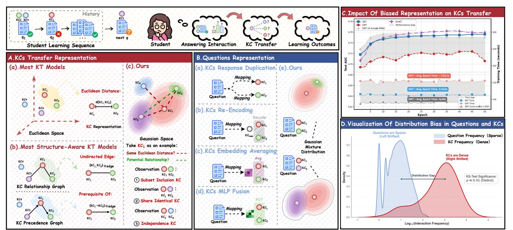
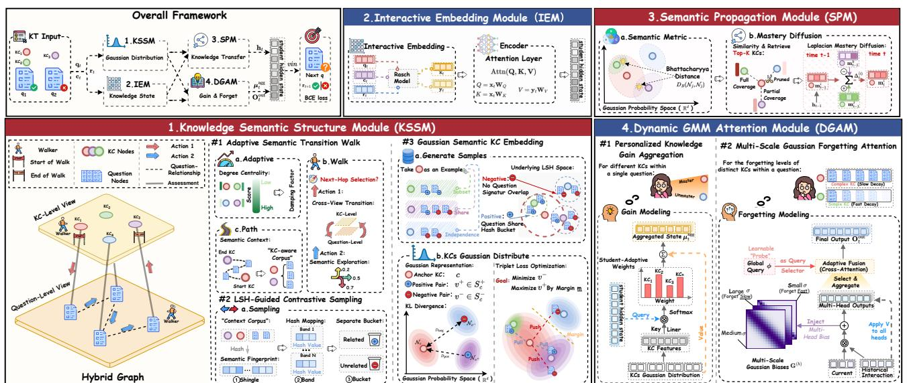
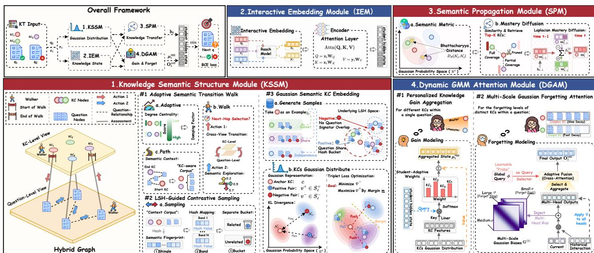
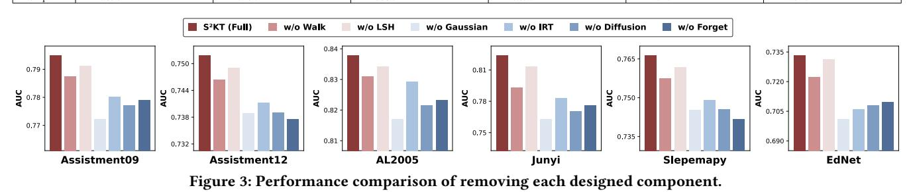
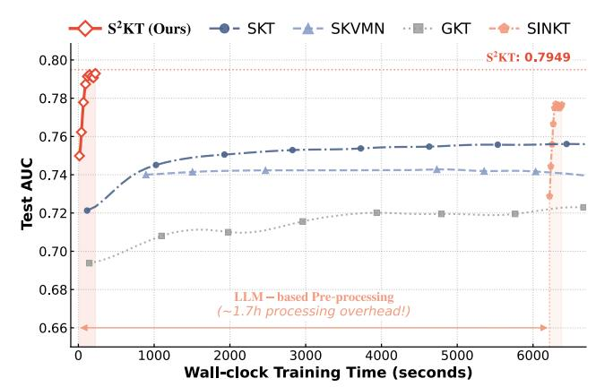
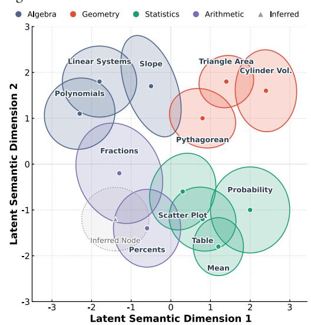
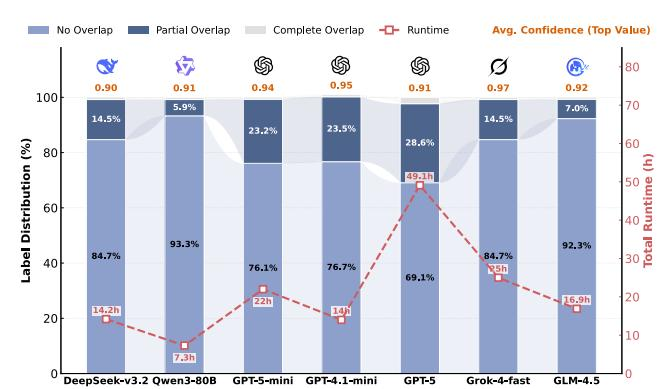

#### �� 2���� : Modeling Uncertainty in Knowledge Tracing via Semantic-aware Structured Gaussian Distributions

Wenhui Wu wuwh3@mails.neu.edu.cn School of Computer Science and Engineering Northeastern University Shenyang 110819, China

Tiancheng Zhang∗ tczhang@mail.neu.edu.cn School of Computer Science and Engineering Northeastern University Shenyang 110819, China

Hengyu Liu heli@cs.aau.dk Department of Computer Science Aalborg University Aalborg, Denmark

Lun Du dulun.dl@antgroup.com Ant Research Ant Group Beijing, China

Zikai Li 2301903@stu.neu.edu.cn School of Computer Science and Engineering Northeastern University Shenyang 110819, China

Mingxing Shao 2301935@stu.neu.edu.cn School of Computer Science and Engineering Northeastern University Shenyang 110819, China

Minghe Yu yuminghe@mail.neu.edu.cn Software College Northeastern University Shenyang 110819, China

Yifang Yin yin\_yifang@a-star.edu.sg Institute for Infocomm Research A\*STAR Singapore

Ge Yu yuge@mail.neu.edu.cn School of Computer Science and Engineering Northeastern University Shenyang 110819, China

# Abstract

Knowledge Tracing (KT) aims to track the evolving mastery of Knowledge Components (KCs) and serves as the cornerstone of personalized intelligent tutoring systems. Despite the advancements in deep learning, existing models predominantly rely on static and discrete relational structures. This paradigm is highly susceptible to data biases and fails to capture the continuous, uncertainty-aware semantic dependencies inherent in educational content. Such limitations hinder the precise quantification of latent Knowledge Transfer and oversimplify the complex, multi-scale forgetting dynamics associated with different KCs. Consequently, this exacerbates assessment bias against students with sparse interaction histories or atypical learning patterns. To address these challenges, we propose S 2KT (Semantic-aware Structured Knowledge Tracing). Specifically, we construct a robust semantic manifold using a centrality-guided adaptive graph-walking strategy and represent each KC as a Gaussian Embedding, explicitly capturing both semantic hierarchies and intrinsic uncertainty. To model fine-grained knowledge transfer, we introduce a semantic propagation mechanism based on the Bhattacharyya distance to diffuse mastery updates within the latent space. Furthermore, we propose a Dynamic GMM Attention Module that integrates Item Response Theory (IRT) with Gaussian mixture constraints. This module dynamically synthesizes personalized

∗Corresponding author.

[This work is licensed under a Creative Commons Attribution 4.0 International License.](https://creativecommons.org/licenses/by/4.0) WWW '26, Dubai, United Arab Emirates

© 2026 Copyright held by the owner/author(s). ACM ISBN 979-8-4007-2307-0/2026/04 <https://doi.org/10.1145/3774904.3793039>

learning gains while explicitly modeling heterogeneous forgetting trajectories coupled with KC complexity. Extensive experiments on six real-world datasets demonstrate that S 2KT significantly outperforms 22 state-of-the-art baselines in both accuracy and interpretability.

## CCS Concepts

• Applied computing → E-learning.

## Keywords

Knowledge Tracing; Semantic-aware Structured; Gaussian Distribution

#### ACM Reference Format:

Wenhui Wu, Tiancheng Zhang, Hengyu Liu, Lun Du, Zikai Li, Mingxing Shao, Minghe Yu, Yifang Yin, and Ge Yu. 2026. �� 2���� : Modeling Uncertainty in Knowledge Tracing via Semantic-aware Structured Gaussian Distributions. In Proceedings of the ACM Web Conference 2026 (WWW '26), April 13–17, 2026, Dubai, United Arab Emirates.ACM, New York, NY, USA, [12](#page-11-0) pages. <https://doi.org/10.1145/3774904.3793039>

# 1 Introduction

Knowledge Tracing (KT) is a pivotal paradigm that leverages students' historical interaction data to predict their future performance [\[13\]](#page-8-0). Fundamentally cast as a sequence prediction task, KT aims to dynamically model the evolution of students' knowledge mastery. This capability underpins widespread applications in online education, including Massive Open Online Courses (MOOCs) and Intelligent Tutoring Systems (ITS) [\[25\]](#page-8-1). By analyzing learning trajectories, KT facilitates the adaptive adjustment of instructional content and pacing, thereby improving learning outcomes [\[44\]](#page-8-2).

Figure 1: Illustration of the Knowledge Semantic Structure Contained in Questions.

Such adaptability is crucial for advancing next-generation education systems toward intelligence and personalization.

The central objective of KT is to assess a student's proficiency in specific Knowledge Components[1](#page-1-0) (KCs) based on their exercise performance [\[2\]](#page-8-3). A question is rarely an isolated entity; rather, it represents a specific constellation of KCs. Solving a question requires the synergistic application of these KCs, which collectively constitute the cognitive structure underlying the learning task.

In the context of Deep Learning-based KT (DLKT), the pioneering DKT model [\[42\]](#page-8-4) employed Recurrent Neural Networks (RNNs) [\[31\]](#page-8-5) to model knowledge states using interaction histories derived from question or KC IDs[2](#page-1-1) . Subsequent research has augmented this framework with architectures such as Graph Neural Networks (GNNs) [\[26\]](#page-8-6) and Transformers [\[48\]](#page-9-0). However, these models predominantly rely on discrete ID embeddings, which struggle to capture the complex, inherent semantic structures among KCs. Furthermore, to mitigate the sparsity of student-problem interactions, some approaches simplify the task by assuming a one-to-one mapping between questions and KCs [\[29,](#page-8-7) [32\]](#page-8-8). This oversimplification obscures the rich semantic structure embodied in real-world questions, thereby compromising the fidelity of student knowledge modeling.

Recent studies suggest that an effective KT method must rigorously align with the semantic structures of knowledge [\[1,](#page-8-9) [9\]](#page-8-10). Specifically, this necessitates satisfying two key criteria: (1) Inter-KC Modeling: modeling the transfer of learning gains across related domains by explicitly representing the semantic topologies among KCs; and (2) Intra-Question Modeling: performing fine-grained modeling of the inherent semantic compositions within questions to capture the comprehensive influence of multiple KCs.

To this end, existing research has attempted to model these aspects for more accurate characterization. Most studies utilize graph

structures to model KC relationships. For example, GKT [\[38\]](#page-8-11) represents connections via a knowledge graph, while SKT [\[47\]](#page-8-12) and SinKT [\[16\]](#page-8-13) employ prerequisite graphs derived from statistical inference or LLMs [\[3\]](#page-8-14). However, such methods typically only implicitly indicate sequential dependencies (see Fig. [1A](#page-1-2)(b)), failing to precisely distinguish logical relationships. Crucially, they neglect implicit semantic topologies—such as subordination (subset inclusion), attribute-based similarity (shared attributes), or independence (see Fig. [1A](#page-1-2)(c))—consequently impeding the quantification of KC associations. On the other hand, to alleviate sparsity and KC diversity challenges, some studies employ embedding fusion strategies, such as aggregating KC embeddings via Multi-Layer Perceptrons (MLPs) or averaging (see Fig. [1B](#page-1-2)). However, such naive aggregation often fails to preserve the distinct content of individual KCs and ignores their structural dependencies, ultimately limiting the representation capability of the student's knowledge state.

To further enhance the quality of student knowledge state modeling, two primary challenges:

#### Challenge I: How to capture the intrinsic uncertainty and continuous semantic topology among KCs?

Most prevailing KT paradigms rely on measuring KC similarities via discrete, deterministic embeddings. To capture structural dependencies, recent approaches have incorporated binary graph priors. However, our experiments (see Fig. [1C](#page-1-2)) indicate that these methods are brittle: reliance on low-quality or heuristically defined graphs often introduces significant structural noise, resulting in performance inferior to simple RNN-based models. We attribute this failure to two intrinsic mismatches between existing models and cognitive reality: (1) Granularity Mismatch: Concepts vary significantly in semantic scope and ambiguity. Conventional deterministic point embeddings cannot encode these uncertain semantic boundaries, thereby enforcing a rigid, uniform representation on heterogeneous

1A KC generalizes terms such as concept, principle, fact, or skill.

2An ID serves as a discrete symbolic identifier.

concepts. (2) Discrete Connectivity: Learning transfer is a continuous, probabilistic phenomenon, not a binary switch. Static binary graphs fail to capture the nuanced, continuous influence strength between concepts, especially within sparse interaction data. Consequently, a pivotal challenge remains: how to construct a representation that intrinsically supports both uncertainty-aware granularity and continuous semantic propagation.

#### Challenge II: How to effectively model the joint knowledge acquisition of heterogeneous semantics within questions?

While questions serve as the carriers of knowledge, they exhibit intrinsic heterogeneity relative to their constituent KCs. As illustrated in Fig. [1D](#page-1-2), questions and KCs follow two distinct distributions, residing in divergent semantic spaces. This distributional discrepancy implies that the relationship between a question and its KCs cannot be bridged by simple embedding fusion or averaging. Such naive aggregation strategies overlook the complex nature of student knowledge evolution, which is a dynamic process governed by both cumulative learning and memory decay. Consequently, the pivotal challenge lies in designing a mechanism that can adaptively model the dynamic knowledge acquisition for distinct KCs, explicitly accounting for their semantic distributional differences and the resulting heterogeneous forgetting trajectories.

To address these challenges, we propose the Semantic-aware Structured Knowledge Tracing (S2KT) framework, which introduces a Gaussian Mixture Distribution paradigm to model the uncertain and heterogeneous nature of student learning. To address Challenge I, we replace rigid point embeddings with Gaussian distributions to encapsulate semantic granularity. The Knowledge Semantic Structure Module constructs a hybrid graph and employs centrality-guided adaptive walks with LSH-based contrastive learning to capture robust topologies. Furthermore, the Semantic Propagation Module models knowledge transfer as a continuous diffusion process over the Gaussian manifold, quantified via the Bhattacharyya distance. To address Challenge II, we introduce the Dynamic GMM Attention Module to bridge the distributional gap. This module models the joint influence of multiple KCs as a Gaussian Mixture process, incorporating a multi-scale forgetting mechanism driven by KC-specific variances to capture heterogeneous decay rates and personalized knowledge gains. Extensive experiments on six real-world datasets validate that S2KT effectively reconstructs the semantic structure of KCs and integrates it into knowledge tracing, yielding significant improvements in student performance prediction accuracy.

Overall, we summarize our contributions as follows:

- We propose S2KT, which departs from deterministic embeddings by modeling KCs as Gaussian distributions. This novel approach effectively captures the uncertain semantic boundaries and varying granularity of KCs.
- We utilize adaptive walks and Bhattacharyya distance-based diffusion on a hybrid graph to enable robust and continuous knowledge transfer.
- We design a Dynamic GMM Attention Module with variancebased multi-scale forgetting to model heterogeneous decay rates and joint knowledge acquisition.
- Extensive experiments on six real-world datasets demonstrate that S2KT consistently outperforms 22 competitive baselines.

### 2 Preliminaries

In this section, we formally define the KT problem. Subsequently, we present the construction of the hybrid KC-Question graph, which serves as the structural foundation for modeling latent semantic dependencies in our proposed framework.

#### 2.1 Problem Formulation

The fundamental objective of KT is to model the dynamic evolution of a student's knowledge mastery throughout their learning process. Formally, let S, Q, and C denote the sets of distinct students, exercises, and KCs, respectively. For each student �� ∈ S, the learning trajectory is represented as a temporally ordered sequence of �� interactions, denoted as ���� = {��1, ��2, . . . , ���� }.

Each interaction is defined as a quadruple ���� = (���� ,���� , ���� , ���� ), where ���� ∈ Q represents the question attempting at step ��; ���� ⊆ C denotes the set of KCs associated with ���� (noting that an question may involve multiple KCs); ���� ∈ {0, 1} is a binary indicator where 1 signifies a correct response and 0 otherwise; and ���� represents the timestamp of the interaction.

Given the historical interaction sequence ���� up to time step �� , the goal of the KT task is to estimate the probability that student �� will correctly answer a target question ����+1 at the next time step. Mathematically, this is formulated as predicting �� (����+1 = 1 | ���� , ����+1).

## 2.2 Hybrid Graph Construction

To explicitly model the complex dependencies between questions and KCs, we construct a hybrid graph G�� = (V�� , E�� ), where the node set V�� = Q ∪ C is the union of disjoint question and KC sets. The edge set E�� = E������ ∪ E������ synthesizes two distinct types of interactions: (1) Implicit question correlations E������ = {(���� , ����) | ���� , ���� ∈ Q,sim(���� , ����) ≥ �� }, where edges are established if the pairwise similarity exceeds a threshold ��; since ground-truth labels for question relationships are unavailable, we employ a statistical inference method to compute sim(·) (detailed in Appendix C.1). (2) Explicit question-KC associations E������ = {(����, ����) | ���� ∈ Q, ���� ∈ K���� }, where K���� ⊆ C denotes the specific set of KCs required to solve question ����.

#### 3 Methodology

In this section, we present the technical framework of S2KT. As illustrated in Figure [2,](#page-3-0) the model captures the continuous and uncertainty-aware dynamics of student learning through four integral components: 1) Knowledge Semantic Structure Module Constructs Gaussian embeddings for KCs via a centrality-guided adaptive graph walk, capturing both semantic hierarchies and inherent uncertainties. 2) Interactive Embedding Module Encodes historical student interactions by incorporating IRT-based difficulty parameters and response variability to create granularity-aware representations. 3) Semantic Propagation Module Models latent knowledge transfer by diffusing mastery updates across semantically related KCs, quantified by the Bhattacharyya distance in the Gaussian space. 3) Dynamic GMM Attention Module Synthesizes personalized knowledge states by aggregating KC features and capturing multiscale forgetting dynamics via a Gaussian-constrained attention mechanism.

Figure 2: The overall architecture of the proposed S2KT.

#### 3.1 Knowledge Semantic Structure Module

3.1.1 Motivation. Effective KT requires a nuanced understanding of the semantic dependencies among KCs to accurately characterize learning transfer. However, prevailing methods typically derive KC relationships directly from statistical interaction data using simple connectivity measures. This approach suffers from two critical limitations: (1) Sparsity and Noise: Interaction data is often sparse and biased, leading to unreliable dependency inference; (2) Lack of Uncertainty Modeling: Existing deterministic embeddings fail to capture the inherent ambiguity and varying granularity of different KCs.

3.1.2 Formulation. We propose the Knowledge Semantic Structure Module, which conducts adaptive walks on a hybrid KC-Question graph to learn the semantic context of target KCs, and then embeds KCs as Gaussian distributions to jointly capture semantic similarity and uncertainty.

Adaptive Semantic Transition Walk. Standard random walks (e.g., DeepWalk [\[41\]](#page-8-15)) often fail to capture the structural nuances of long-tail KCs due to fixed path lengths. We propose a topologyaware strategy that adapts exploration depth based on node importance. Let G�� = (���� , ���� ) denote the KC subgraph. We compute the normalized degree centrality for each KC node ���� :

��deg (����) = �� (����) |���� | − 1 , (1)

where �� (����) is the degree. We then define an adaptive damping factor ���� to modulate the walk length:

���� = ��min + (��max − ��min)��deg (����), (2)

where ��min, ��max ∈ [0, 1]. Nodes with higher centrality are assigned larger ���� , enabling extended random walks to capture broader semantic associations.

To model the interplay between KCs and Questions, we utilize a hybrid graph G�� . We define an indicator function I�� (�� (��) ) which equals 1 if node �� (��) is a KC, and 0 otherwise. A semantic path

P = (�� (0) , . . . , ��(��) ) is generated starting from �� (0) ∈ ���� , where the path length is dynamically determined by the return to the KC view. The walk involves two stochastic actions:

- Action 1: Cross-View Transition. We dynamically control the switching probability between the KC view G�� and the Question view G�� to prevent semantic drift. At step ��, the transition probabilities are governed by the decay factor ��:

�� (view(��+1) = G�� | �� (��) ) = (�� ) I�� (�� (�� ) ) , (3)

�� (view(��+1) = G�� | �� (��) ) = 1 − �� (view(��+1) = G�� | �� (��) ). (4)

This exponential decay ensures that walks originating from a KC efficiently explore associated questions before converging back to the KC space, aligning the exploration scope with the structural complexity of the concept.

• Action 2: Semantic Exploration. Given the selected view V ∈ {G�� , G�� }, the next node �� is sampled from the neighbors NV (�� (��) ) proportional to edge weights:

�� (�� (��+1) = �� | �� (��) , V) = ��(�� (��) , ��) Í ′ ∈NV (�� (�� ) ) ��(�� (��) , ��′ ) . (5)

LSH-Guided Contrastive Sampling. To efficiently distill robust semantic signals from the generated paths P, we introduce a sampling mechanism based on Locality-Sensitive Hashing (LSH) [\[18\]](#page-8-16). This approach filters out noise and disentangles structurally unrelated KCs. For each question node visited, we construct a shingle combining the node identity and its walk context. These shingles are mapped to signature vectors and partitioned into bands. Questions colliding in the same LSH bucket are identified as structural candidates, implying latent semantic similarity.

For a target KC ���� , we define:

- Positive Set �� + : Questions co-occurring with ���� in LSH buckets, capturing high-confidence semantic overlaps.
- Negative Set �� − : Questions with zero signature overlap across all bands, representing the maximal separation in the hash space.

Table 1: Overall performance comparison. Bold scores represent the highest results among all the methods, while the second highest scores are underlined. The symbol "†" denotes models that explicitly incorporate knowledge semantic structures, and "‡" denotes models that consider the forgetting effect.

| Dataset Metric |          | AUC   | ↑      | Assistment09 | ACC   | ↑      |        | AUC   | ↑      | Assistment12 | ACC   | ↑      |        | AUC   | ↑                | AL2005 Sequential | ACC   | ↑ KT   | Models    | AUC   | ↑      | Junyi  | ACC   | ↑      |        | AUC   | ↑      | Slepemapy | ACC   | ↑      |        | AUC   | ↑      | Ednet  | ACC   | ↑      |
|----------------|----------|-------|--------|--------------|-------|--------|--------|-------|--------|--------------|-------|--------|--------|-------|------------------|-------------------|-------|--------|-----------|-------|--------|--------|-------|--------|--------|-------|--------|-----------|-------|--------|--------|-------|--------|--------|-------|--------|
| DKT            | 0.7571   | ±     | 0.0003 | 0.7296       | ±     | 0.0002 | 0.7207 | ±     | 0.0004 | 0.7299       | ±     | 0.0001 | 0.8153 | ±     | 0.0003           | 0.8088            | ±     | 0.0002 | 0.7510    | ±     | 0.0004 | 0.8388 | ±     | 0.0001 | 0.7400 | ±     | 0.0002 | 0.8105    | ±     | 0.0003 | 0.6607 | ±     | 0.0001 | 0.6614 | ±     | 0.0004 |
| DKT Plus       | 0.7614   | ±     | 0.0002 | 0.7327       | ±     | 0.0003 | 0.7241 | ±     | 0.0001 | 0.7315       | ±     | 0.0002 | 0.8188 | ±     | 0.0005           | 0.8110            | ±     | 0.0002 | 0.7506    | ±     | 0.0003 | 0.8383 | ±     | 0.0002 | 0.7414 | ±     | 0.0004 | 0.8122    | ±     | 0.0001 | 0.6643 | ±     | 0.0003 | 0.6664 | ±     | 0.0002 |
| AT-DKT         | 0.7544   | ±     | 0.0004 | 0.7259       | ±     | 0.0002 | 0.7173 | ±     | 0.0003 | 0.7278       | ±     | 0.0004 | 0.8136 | ±     | 0.0002           | 0.8077            | ±     | 0.0001 | 0.7500    | ±     | 0.0003 | 0.8382 | ±     | 0.0002 | 0.7401 | ±     | 0.0004 | 0.8115    | ±     | 0.0003 | 0.6613 | ±     | 0.0002 | 0.6642 | ±     | 0.0005 |
| ATKT           | 0.7344   | ±     | 0.0003 | 0.7175       | ±     | 0.0004 | 0.7029 | ±     | 0.0001 | 0.7197       | ±     | 0.0003 | 0.7925 | ±     | 0.0005           | 0.7985            | ±     | 0.0002 | 0.7360    | ±     | 0.0002 | 0.8329 | ±     | 0.0001 | 0.6906 | ±     | 0.0005 | 0.7983    | ±     | 0.0003 | 0.6297 | ±     | 0.0001 | 0.6519 | ±     | 0.0004 |
| KQN            | 0.7546   | ±     | 0.0002 | 0.7288       | ±     | 0.0004 | 0.7206 | ±     | 0.0003 | 0.7300       | ±     | 0.0002 | 0.8099 | ±     | 0.0003           | 0.8063            | ±     | 0.0004 | 0.7513    | ±     | 0.0001 | 0.8394 | ±     | 0.0003 | 0.7419 | ±     | 0.0002 | 0.8103    | ±     | 0.0004 | 0.6669 | ±     | 0.0005 | 0.6652 | ±     | 0.0002 |
| QIKT           | 0.7858   | ±     | 0.0004 | 0.7438       | ±     | 0.0001 | 0.7486 | ±     | 0.0003 | 0.7418       | ±     | 0.0002 | 0.8313 | ±     | 0.0005           | 0.8204            | ±     | 0.0002 | 0.7910    | ±     | 0.0004 | 0.8433 | ±     | 0.0001 | 0.7422 | ±     | 0.0002 | 0.8118    | ±     | 0.0003 | 0.7159 | ±     | 0.0002 | 0.6913 | ±     | 0.0004 |
|                |          |       |        |              |       |        |        |       |        |              |       |        |        |       | Memory-Augmented |                   |       |        | KT Models |       |        |        |       |        |        |       |        |           |       |        |        |       |        |        |       |        |
| DKVMN          | 0.7533   | ±     | 0.0003 | 0.7274       | ±     | 0.0002 | 0.7183 | ±     | 0.0002 | 0.7313       | ±     | 0.0004 | 0.7990 | ±     | 0.0001           | 0.8013            | ±     | 0.0003 | 0.7508    | ±     | 0.0005 | 0.8395 | ±     | 0.0002 | 0.7427 | ±     | 0.0004 | 0.8098    | ±     | 0.0001 | 0.6608 | ±     | 0.0002 | 0.6634 | ±     | 0.0003 |
| SKVMN          | † 0.7409 | ±     | 0.0002 | 0.7203       | ±     | 0.0004 | 0.7095 | ±     | 0.0001 | 0.7210       | ±     | 0.0003 | 0.7905 | ±     | 0.0002           | 0.7952            | ±     | 0.0002 | 0.7390    | ±     | 0.0004 | 0.8288 | ±     | 0.0001 | 0.7315 | ±     | 0.0005 | 0.8008    | ±     | 0.0003 | 0.6488 | ±     | 0.0002 | 0.6562 | ±     | 0.0001 |
| Deep-IRT       | 0.7561   | ±     | 0.0001 | 0.7285       | ±     | 0.0003 | 0.7178 | ±     | 0.0004 | 0.7309       | ±     | 0.0002 | 0.7873 | ±     | 0.0005           | 0.8447            | ±     | 0.0004 | 0.7499    | ±     | 0.0002 | 0.8394 | ±     | 0.0003 | 0.7403 | ±     | 0.0001 | 0.8090    | ±     | 0.0004 | 0.6595 | ±     | 0.0002 | 0.6624 | ±     | 0.0003 |
|                |          |       |        |              |       |        |        |       |        |              |       |        |        |       | Graph-Based      |                   |       | KT     | Models    |       |        |        |       |        |        |       |        |           |       |        |        |       |        |        |       |        |
| GKT †          | 0.7371   | ±     | 0.0003 | 0.7218       | ±     | 0.0001 | 0.7182 | ±     | 0.0002 | 0.7296       | ±     | 0.0004 | 0.8012 | ±     | 0.0005           | 0.8021            | ±     | 0.0003 | 0.7385    | ±     | 0.0001 | 0.8290 | ±     | 0.0002 | 0.7255 | ±     | 0.0004 | 0.7985    | ±     | 0.0003 | 0.6455 | ±     | 0.0005 | 0.6501 | ±     | 0.0002 |
| SKT †          | 0.7563   | ±     | 0.0004 | 0.7321       | ±     | 0.0002 | 0.7224 | ±     | 0.0001 | 0.7312       | ±     | 0.0003 | 0.8141 | ±     | 0.0002           | 0.8085            | ±     | 0.0004 | 0.7525    | ±     | 0.0005 | 0.8402 | ±     | 0.0003 | 0.7415 | ±     | 0.0001 | 0.8115    | ±     | 0.0002 | 0.6592 | ±     | 0.0004 | 0.6610 | ±     | 0.0001 |
| PEBG           | 0.7583   | ±     | 0.0001 | 0.7312       | ±     | 0.0003 | 0.7258 | ±     | 0.0002 | 0.7325       | ±     | 0.0004 | 0.8192 | ±     | 0.0005           | 0.8118            | ±     | 0.0002 | 0.7538    | ±     | 0.0003 | 0.8405 | ±     | 0.0001 | 0.7432 | ±     | 0.0004 | 0.8130    | ±     | 0.0005 | 0.6655 | ±     | 0.0003 | 0.6672 | ±     | 0.0002 |
| SinKT †        | 0.7773   | ±     | 0.0003 | 0.7343       | ±     | 0.0004 | 0.7455 | ±     | 0.0002 | 0.7384       | ±     | 0.0002 | 0.8291 | ±     | 0.0001           | 0.8169            | ±     | 0.0003 | 0.7812    | ±     | 0.0004 | 0.8413 | ±     | 0.0001 | 0.7449 | ±     | 0.0002 | 0.8127    | ±     | 0.0005 | 0.7212 | ±     | 0.0004 | 0.6905 | ±     | 0.0003 |
|                |          |       |        |              |       |        |        |       |        |              |       |        |        |       | Attention-based  |                   |       | KT     | Models    |       |        |        |       |        |        |       |        |           |       |        |        |       |        |        |       |        |
| SAKT           | 0.7356   | ±     | 0.0002 | 0.7129       | ±     | 0.0003 | 0.6980 | ±     | 0.0004 | 0.7197       | ±     | 0.0002 | 0.7831 | ±     | 0.0005           | 0.7948            | ±     | 0.0002 | 0.7265    | ±     | 0.0001 | 0.8324 | ±     | 0.0004 | 0.7165 | ±     | 0.0003 | 0.8088    | ±     | 0.0005 | 0.6561 | ±     | 0.0002 | 0.6610 | ±     | 0.0003 |
| AKT ‡          | 0.7850   | ±     | 0.0005 | 0.7433       | ±     | 0.0002 | 0.7457 | ±     | 0.0001 | 0.7409       | ±     | 0.0004 | 0.8241 | ±     | 0.0003           | 0.8059            | ±     | 0.0002 | 0.7908    | ±     | 0.0005 | 0.8460 | ±     | 0.0003 | 0.7502 | ±     | 0.0004 | 0.8108    | ±     | 0.0002 | 0.7154 | ±     | 0.0001 | 0.6901 | ±     | 0.0003 |
| SimpleKT       | 0.7804   | ±     | 0.0002 | 0.7419       | ±     | 0.0004 | 0.7414 | ±     | 0.0005 | 0.7364       | ±     | 0.0001 | 0.8245 | ±     | 0.0002           | 0.8129            | ±     | 0.0003 | 0.7837    | ±     | 0.0004 | 0.8423 | ±     | 0.0005 | 0.7493 | ±     | 0.0001 | 0.8131    | ±     | 0.0003 | 0.7126 | ±     | 0.0002 | 0.6885 | ±     | 0.0004 |
| DTransformer   | 0.7778   | ±     | 0.0004 | 0.7391       | ±     | 0.0002 | 0.7346 | ±     | 0.0003 | 0.7348       | ±     | 0.0005 | 0.8087 | ±     | 0.0001           | 0.8053            | ±     | 0.0004 | 0.7855    | ±     | 0.0002 | 0.8432 | ±     | 0.0003 | 0.7440 | ±     | 0.0005 | 0.8116    | ±     | 0.0001 | 0.7197 | ±     | 0.0004 | 0.6918 | ±     | 0.0002 |
| FlucKT         | ‡ 0.7895 | ±     | 0.0003 | 0.7456       | ±     | 0.0005 | 0.7453 | ±     | 0.0002 | 0.7382       | ±     | 0.0004 | 0.8237 | ±     | 0.0003           | 0.8102            | ±     | 0.0001 | 0.7914    | ±     | 0.0005 | 0.8455 | ±     | 0.0003 | 0.7505 | ±     | 0.0002 | 0.8127    | ±     | 0.0004 | 0.7237 | ±     | 0.0001 | 0.6916 | ±     | 0.0005 |
| FoLiBiKT       | ‡ 0.7899 | ±     | 0.0004 | 0.7443       | ±     | 0.0002 | 0.7454 | ±     | 0.0003 | 0.7408       | ±     | 0.0001 | 0.8230 | ±     | 0.0004           | 0.8102            | ±     | 0.0003 | 0.7923    | ±     | 0.0002 | 0.8461 | ±     | 0.0004 | 0.7510 | ±     | 0.0002 | 0.8126    | ±     | 0.0002 | 0.7233 | ±     | 0.0003 | 0.6958 | ±     | 0.0001 |
| SparseKT       | 0.7772   | ±     | 0.0002 | 0.7367       | ±     | 0.0005 | 0.7377 | ±     | 0.0004 | 0.7354       | ±     | 0.0002 | 0.8231 | ±     | 0.0003           | 0.8116            | ±     | 0.0001 | 0.7757    | ±     | 0.0004 | 0.8395 | ±     | 0.0002 | 0.7388 | ±     | 0.0001 | 0.8098    | ±     | 0.0003 | 0.7150 | ±     | 0.0005 | 0.6891 | ±     | 0.0002 |
| StableKT       | 0.7866   | ±     | 0.0001 | 0.7456       | ±     | 0.0004 | 0.7421 | ±     | 0.0003 | 0.7397       | ±     | 0.0002 | 0.8292 | ±     | 0.0005           | 0.8121            | ±     | 0.0003 | 0.7857    | ±     | 0.0002 | 0.8441 | ±     | 0.0004 | 0.7466 | ±     | 0.0001 | 0.8119    | ±     | 0.0002 | 0.7148 | ±     | 0.0003 | 0.6911 | ±     | 0.0005 |
| RobustKT       | 0.7895   | ±     | 0.0003 | 0.7443       | ±     | 0.0002 | 0.7472 | ±     | 0.0005 | 0.7428       | ±     | 0.0001 | 0.8293 | ±     | 0.0004           | 0.8137            | ±     | 0.0003 | 0.7934    | ±     | 0.0002 | 0.8459 | ±     | 0.0001 | 0.7454 | ±     | 0.0003 | 0.8117    | ±     | 0.0004 | 0.7127 | ±     | 0.0001 | 0.6866 | ±     | 0.0003 |
|                |          |       |        |              |       |        |        |       |        |              |       |        |        |       |                  | Proposed          |       | Method |           |       |        |        |       |        |        |       |        |           |       |        |        |       |        |        |       |        |
| 2 KT S         | 0.7949   | ±     | 0.0004 | 0.7548       | ±     | 0.0001 | 0.7518 | ±     | 0.0003 | 0.7472       | ±     | 0.0002 | 0.8378 | ±     | 0.0003           | 0.8242            | ±     | 0.0001 | 0.8238    | ±     | 0.0003 | 0.8497 | ±     | 0.0002 | 0.7663 | ±     | 0.0002 | 0.8161    | ±     | 0.0002 | 0.7332 | ±     | 0.0002 | 0.7026 | ±     | 0.0001 |
| %Improv.       |          | 0.63% |        |              | 1.23% |        |        | 0.43% |        |              | 0.73% |        |        | 0.78% |                  |                   | 0.46% |        |           | 3.83% |        |        | 0.43% |        |        | 2.04% |        |           | 0.42% |        |        | 1.31% |        |        | 0.98% |        |

Baselines & Implementation Details. To demonstrate the effectiveness of S2KT, we compare it against 22 competitive methods across four categories: Sequential (e.g., DKT [\[42\]](#page-8-4)), Graph-based (e.g., GKT [\[38\]](#page-8-11)), Memory-augmented (e.g., DKVMN [\[54\]](#page-9-2)), and Attentionbased methods (e.g., SimpleKT [\[34\]](#page-8-22)). A comprehensive list and descriptions of these baselines are detailed in Appendix E.1. Regarding implementation, all models are developed using PyTorch on NVIDIA A800 GPUs with 5-fold cross-validation. For S2KT, we optimize hyperparameters via grid search, with detailed settings provided in Appendix E.2. To facilitate reproducibility, our code and datasets are available at [https://github.com/NEUwwh/S2KT.](https://github.com/NEUwwh/S2KT)

#### 4.2 Overall Comparison (RQ1)

Table [1](#page-6-0) reports the performance comparison between S 2KT and 22 baselines across six datasets. S 2KT consistently yields the best results across all metrics. Our key observations are: (1) New Stateof-the-art Performance: S 2KT outperforms the best baselines with an average AUC improvement of 1.50% (a significant margin considering the field's saturation, where rigorous benchmarks [\[35\]](#page-8-23) estimate the cumulative gain since 2015 at only ∼3.5% under unified protocols). Notably, on the Junyi dataset, which is characterized by semantic structural dependencies, our model achieved a significant improvement of 3.83%. These results validate that our semantic structural modeling effectively captures fine-grained

knowledge transfer and concept interdependencies. (2) Superiority over structure-aware Methods: While structure-aware models (e.g., GKT) attempt to model transfer via explicit relations, they lag behind S 2KT by an average AUC gap of ∼7.5%. Their performance fluctuation suggests sensitivity to the quality of predefined structures. In contrast, the adaptive walk-based modeling in S 2KT captures latent dynamics robustly without relying on static structural priors. (3) Robustness Across Data Scales: S 2KT demonstrates strong generalization, maintaining superiority on both small-scale (Assistment09) and massive, sparse datasets (Ednet, Junyi). Unlike traditional sequential models (e.g., DKT) that degrade on complex distributions, S 2KT handles data heterogeneity by integrating semantic structures with sequence modeling. (4) Semantic-Enhanced Attention: Although attention-based baselines like SimpleKT are competitive, they often overlook intrinsic semantic logic. S 2KT addresses this by injecting semantic structural constraints into the attention mechanism. This effectively balances the capture of long-term sequential patterns with local semantic consistency, fully exploiting the Transformer architecture.

### 4.3 Ablation Study (RQ2)

We compare S2KT against six variants to validate its components: w/o Adaptive Walk (uses random walks); w/o LSH (uses random sampling); w/o Gaussian Emb. (uses deterministic vectors); w/o IRT (uses one-hot encoding); w/o Diffusion (removes KC dependencies); and w/o Forget (removes the forgetting mechanism). The

performance comparison of removing each of these designed components is illustrated in Figure [3:](#page-6-1) (1) Gaussian Structure: The significant drop in w/o Gaussian Emb. confirms that deterministic vectors fail to capture semantic relationships. Similarly, declines in w/o Adaptive Walk and w/o LSH validate the need for centralityguided context and effective sampling. (2) Propagation: The poor performance of w/o Diffusion, especially on the structure-rich Junyi dataset, underscores the necessity of Laplacian diffusion for propagating updates to alleviate sparsity. (3) Dynamics: The gap in w/o Forget, notably on temporal datasets (Slepemapy), indicates that the variant without explicit decay cannot capture differentiated decay rates, whereas our Gaussian approach models realistic cognitive evolution. (4) Granularity: w/o IRT lags behind, confirming that capturing item difficulty is essential for precise student profiling beyond generic KC labels.

Figure 4: Visualization of the Gaussian Semantic Space.

#### 4.4 Visualization of Semantic Structure (RQ3)

Figure [4](#page-7-0) illustrates the 2D projection of 13 sampled KCs, revealing: (1) Semantic Cohesion: KCs spontaneously cluster by pedagogical category (e.g., Geometry, Algebra) without supervision, verifying the module's ability to preserve semantic topology. (2) Probabilistic Granularity: The Gaussian (��, Σ) representation transcends point-vector limitations. It resolves Euclidean distance ambiguities via distributional overlap, quantifies knowledge sharing through ellipsoid volume, and intrinsically captures hierarchical entailment—where foundational concepts (large variance) spatially encapsulate specific ones. (3) Cross-Domain Transfer:"Soft" boundaries reveal latent intersections between disparate topics, acting as bridges for mastery propagation across shared capabilities. (4) Robustness: The structure-based encoding resolves polysemy (e.g., context-dependent labels) and enables zero-shot semantic inference for unannotated concepts via graph propagation.

# 4.5 Efficiency Analysis (RQ4)

To assess the deployability of �� 2KT in real-world educational scenarios, we investigate the critical trade-off between predictive effectiveness and computational cost. We benchmark our method against representative baselines that utilize either semantic-driven

Figure 5: Training Efficiency and Convergence Analysis.

or structure-based modeling paradigms. To ensure a fair comparison, we conduct all efficiency evaluations on the ASSIST09 dataset, a common benchmark shared across the original studies of the selected baselines. We strictly adhere to the hyperparameter settings reported in the respective papers. All models are evaluated on an identical platform (single NVIDIA A800 GPU, batch size 32) to ensure hardware consistency. As illustrated in Figure [5,](#page-7-1) �� 2KT achieves a superior Pareto frontier in the efficiency-accuracy tradeoff. The experimental results highlight three key advantages: (1) Rapid Convergence: �� 2KT achieves significantly faster convergence via the Semantic Propagation Module. By leveraging Laplacian diffusion, mastery updates effectively propagate to related KCs without requiring exhaustive interactions, accelerating learning even in sparse data scenarios. (2) Superior Effectiveness: Unlike deterministic point embeddings, �� 2KT employs Gaussian Semantic Embeddings to capture both concept centroid and uncertainty. Coupled with Dynamic GMM Attention, this probabilistic modeling enables nuanced distinction of student mastery, yielding higher predictive accuracy. (3) High Computational Efficiency: �� 2KT maintains high throughput through two key designs: LSH-guided sampling which prunes the semantic search space, and closed-form Gaussian metric computations. These mechanisms avoid the heavy overhead typical of large-scale Graph or LLM-based approaches.

## 5 Conclusion

In this paper, we proposed �� 2���� , a novel Semantic-aware Structured Knowledge Tracing framework that fundamentally shifts the representation paradigm from deterministic point embeddings to probabilistic Gaussian distributions. Through centrality-guided adaptive walks and Bhattacharyya distance-based diffusion, our model effectively captures knowledge uncertainty and continuous semantic dependencies. Moreover, the integration of a multi-scale forgetting mechanism allows for a nuanced characterization of personalized learning trajectories. Empirical results across six datasets confirm that �� 2���� outperforms current SOTA methods in accuracy while maintaining high computational efficiency.

## Acknowledgments

This work was supported by the National Natural Science Foundation of China (No. 62137001, 62272093).

#### References

- [1] Ghodai Abdelrahman and Qing Wang. 2019. Knowledge Tracing with Sequential Key-Value Memory Networks. In Proceedings of the 42nd International ACM SIGIR Conference on Research and Development in Information Retrieval (SIGIR). 175–184. [2] Ghodai Abdelrahman, Qing Wang, and Bernardo Nunes. 2023. Knowledge Tracing: A Survey. ACM Computing Surveys (CSUR) 55, 11 (2023), 1–37. [3] Josh Achiam et al. 2023. GPT-4 Technical Report. arXiv preprint arXiv:2303.08774 (2023). [4] Ben Athiwaratkun and Andrew Wilson. 2017. Multimodal Word Distributions. In Proceedings of the 55th Annual Meeting of the Association for Computational Linguistics (ACL). 1645–1656. [5] Susan M Barnett and Stephen J Ceci. 2002. When and Where Do We Apply What We Learn? A Taxonomy for Far Transfer. Psychological Bulletin 128, 4 (2002),
- 612. [6] Anil Bhattacharyya. 1943. On a Measure of Divergence between Two Statistical Populations Defined by their Probability Distributions. Bulletin of the Calcutta Mathematical Society 35 (1943), 99–110. [7] Haw-Shiuan Chang, Chih-Chieh Hsu, and Kuan-Ta Chen. 2020. Modeling exercise relationships in e-learning: A unified approach. In Proceedings of the 13th International Conference on Educational Data Mining (EDM). [8] Jiahao Chen, Zitao Liu, Shuyan Huang, Qiongqiong Liu, and Weiqi Luo. 2023. Improving Interpretability of Deep Sequential Knowledge Tracing Models with Question-Centric Cognitive Representations. In Proceedings of the AAAI Conference on Artificial Intelligence (AAAI), Vol. 37. 14196–14204. [9] Penghe Chen, Yu Lu, Vincent W Zheng, and Yang Pian. 2018. Prerequisite-Driven Deep Knowledge Tracing. In 2018 IEEE International Conference on Data Mining (ICDM). 39–48. [10] Youngduck Choi, Youngnam Lee, Junghyun Cho, Jineon Baek, Byungsoo Kim, Yeongmin Cha, Dongmin Shin, Chan Bae, and Jaewe Heo. 2020. EdNet: A largescale hierarchical dataset in education. In Proceedings of the 21st International Conference on Artificial Intelligence in Education (AIED). Springer, 69–73. [11] Nurendra Choudhary, Nikhil Rao, Sumeet Katariya, Karthik Subbian, and Chandan Reddy. 2021. Probabilistic Entity Representation Model for Reasoning over Knowledge Graphs. In Advances in Neural Information Processing Systems (NeurIPS), Vol. 34. 23440–23451. [12] Sanghyuk Chun, Seong Joon Oh, Rafael Sampaio De Rezende, Yannis Kalantidis, and Diane Larlus. 2021. Probabilistic Embeddings for Cross-Modal Retrieval. In Proceedings of the IEEE/CVF Conference on Computer Vision and Pattern Recognition (CVPR). 8415–8424. [13] Albert T Corbett and John R Anderson. 1994. Knowledge Tracing: Modeling the Acquisition of Procedural Knowledge. User Modeling and User-Adapted Interaction (UMUAI) 4, 4 (1994), 253–278. [14] Hermann Ebbinghaus. 1913. Memory: A Contribution to Experimental Psychology. Teachers College, Columbia University, New York. [15] Mingyu Feng, Neil Heffernan, and Kenneth R Koedinger. 2009. Addressing the assessment challenge with an online system that tutors as it assesses. User Modeling and User-Adapted Interaction (UMUAI) 19, 3 (2009), 243–266. [16] Lingyue Fu, Hao Guan, Kounianhua Du, Jianghao Lin, Wei Xia, Weinan Zhang, Ruiming Tang, Yasheng Wang, and Yong Yu. 2024. SinKT: A Structure-Aware Inductive Knowledge Tracing Model with Large Language Model. In Proceedings of the 33rd ACM International Conference on Information and Knowledge Management (CIKM). 632–642. [17] Aritra Ghosh, Neil Heffernan, and Andrew S Lan. 2020. Context-Aware Attentive Knowledge Tracing. In Proceedings of the 26th ACM SIGKDD International Conference on Knowledge Discovery & Data Mining (KDD). 2330–2339. [18] Aristides Gionis, Piotr Indyk, Rajeev Motwani, et al. 1999. Similarity Search in High Dimensions via Hashing. In International Conference on Very Large Data Bases (VLDB), Vol. 99. 518–529. [19] Teng Guo, Yu Qin, Yubin Xia, Mingliang Hou, Zitao Liu, Feng Xia, and Weiqi Luo. 2025. Enhancing Knowledge Tracing Through Decoupling Cognitive Pattern from Error-Prone Data. In Proceedings of the ACM Web Conference 2025 (WWW). 5108–5116. [20] Xiaopeng Guo, Zhijie Huang, Jie Gao, Mingyu Shang, Maojing Shu, and Jun Sun. 2021. Enhancing Knowledge Tracing via Adversarial Training. In Proceedings of the 29th ACM International Conference on Multimedia (MM). 367–375. [21] Neil T Heffernan and Cristina Lindquist Heffernan. 2014. The ASSISTments ecosystem: Building a platform that brings scientists and teachers together for minimally invasive research on human learning and teaching. International Journal of Artificial Intelligence in Education (IJAIED) 24, 4 (2014), 470–497. [22] Mingliang Hou, Xueyi Li, Teng Guo, Zitao Liu, Mi Tian, Renqiang Luo, and Weiqi Luo. 2025. Cognitive Fluctuations Enhanced Attention Network for Knowledge Tracing. In Proceedings of the AAAI Conference on Artificial Intelligence (AAAI), Vol. 39. 14265–14273. [23] Shuyan Huang, Zitao Liu, Xiangyu Zhao, Weiqi Luo, and Jian Weng. 2023. Towards Robust Knowledge Tracing Models via k-Sparse Attention. In Proceedings of the 46th International ACM SIGIR Conference on Research and Development in Information Retrieval (SIGIR). 2441–2445. [24] Yoonjin Im, Eunseong Choi, Heejin Kook, and Jongwuk Lee. 2023. Forgetting-Aware Linear Bias for Attentive Knowledge Tracing. In Proceedings of the 32nd ACM International Conference on Information and Knowledge Management (CIKM). 3958–3962. [25] Firuz Kamalov, David Santandreu Calonge, and Ikhlaas Gurrib. 2023. New Era of Artificial Intelligence in Education: Towards a Sustainable Multifaceted Revolution. Sustainability 15, 16 (2023), 12451. [26] Thomas N Kipf and Max Welling. 2017. Semi-Supervised Classification with Graph Convolutional Networks. In International Conference on Learning Representations (ICLR). [27] Solomon Kullback and Richard A Leibler. 1951. On Information and Sufficiency. The Annals of Mathematical Statistics 22, 1 (1951), 79–86. [28] Jinseok Lee and Dit-Yan Yeung. 2019. Knowledge Query Network for Knowledge Tracing: How Knowledge Interacts with Skills. In Proceedings of the 9th International Conference on Learning Analytics & Knowledge (LAK). 491–500. [29] Wonsung Lee, Jaeyoon Chun, Youngmin Lee, Kyoungsoo Park, and Sungrae Park. 2022. Contrastive Learning for Knowledge Tracing. In Proceedings of the ACM Web Conference 2022 (WWW). 2330–2338. [30] Xueyi Li, Youheng Bai, Teng Guo, Zitao Liu, Yaying Huang, Xiangyu Zhao, Feng Xia, Weiqi Luo, and Jian Weng. 2024. Enhancing Length Generalization for Attention Based Knowledge Tracing Models with Linear Biases. In Proceedings of the 33rd International Joint Conference on Artificial Intelligence (IJCAI). 5918–5926. [31] Zachary C Lipton, John Berkowitz, and Charles Elkan. 2015. A Critical Review of Recurrent Neural Networks for Sequence Learning. arXiv preprint arXiv:1506.00019 (2015). [32] Yunfei Liu, Yang Yang, Xianyu Chen, Jian Shen, Haifeng Zhang, and Yong Yu. 2020. Improving Knowledge Tracing via Pre-training Question Embeddings. In Proceedings of the 29th International Joint Conference on Artificial Intelligence (IJCAI). 1577–1583. [33] Zitao Liu, Qiongqiong Liu, Jiahao Chen, Shuyan Huang, Boyu Gao, Weiqi Luo, and Jian Weng. 2023. Enhancing Deep Knowledge Tracing with Auxiliary Tasks. In Proceedings of the ACM Web Conference 2023 (WWW). 4178–4187. [34] Zitao Liu, Qiongqiong Liu, Jiahao Chen, Shuyan Huang, and Weiqi Luo. 2023. SimpleKT: A Simple But Tough-to-Beat Baseline for Knowledge Tracing. In International Conference on Learning Representations (ICLR). [35] Zitao Liu, Qiongqiong Liu, Jiahao Chen, Shuyan Huang, Jiliang Tang, and Weiqi Luo. 2022. pyKT: A Python Library to Benchmark Deep Learning Based Knowledge Tracing Models. In Advances in Neural Information Processing Systems (NeurIPS), Vol. 35. 18542–18555. [36] Tomas Mikolov, Kai Chen, Greg Corrado, and Jeffrey Dean. 2013. Efficient Estimation of Word Representations in Vector Space. In International Conference on Learning Representations (ICLR) Workshop. [37] Alexander Miller, Adam Fisch, Jesse Dodge, Amir-Hossein Karimi, Antoine Bordes, and Jason Weston. 2016. Key-Value Memory Networks for Directly Reading Documents. In Proceedings of the 2016 Conference on Empirical Methods in Natural Language Processing (EMNLP). Association for Computational Linguistics, 1400–1409. [38] Hiromi Nakagawa, Yusuke Iwasawa, and Yutaka Matsuo. 2019. Graph-Based Knowledge Tracing: Modeling Student Proficiency Using Graph Neural Network. In IEEE/WIC/ACM International Conference on Web Intelligence (WI). 156–163. [39] Shalini Pandey and George Karypis. 2019. A Self-Attentive Model for Knowledge Tracing. In Proceedings of the 12th International Conference on Educational Data Mining (EDM). 384–389. [40] Jan Papoušek, Radek Pelánek, and Vít Stanislav. 2014. Adaptive practice of facts in domains with varied prior knowledge. In Proceedings of the 7th International Conference on Educational Data Mining (EDM). 6–13. [41] Bryan Perozzi, Rami Al-Rfou, and Steven Skiena. 2014. DeepWalk: Online Learning of Social Representations. In Proceedings of the 20th ACM SIGKDD International Conference on Knowledge Discovery and Data Mining (KDD). 701–710. [42] Chris Piech, Jonathan Bassen, Jonathan Huang, Surya Ganguli, Mehran Sahami, Leonidas J Guibas, and Jascha Sohl-Dickstein. 2015. Deep Knowledge Tracing. In Advances in Neural Information Processing Systems (NeurIPS), Vol. 28. [43] Georg Rasch. 1993. Probabilistic Models for Some Intelligence and Attainment Tests. ERIC. [44] Shuanghong Shen, Qi Liu, Zhenya Huang, Yonghe Zheng, Minghao Yin, Minjuan Wang, and Enhong Chen. 2024. A Survey of Knowledge Tracing: Models, Variants, and Applications. IEEE Transactions on Learning Technologies (TLT) 17 (2024), 1858–1879. [45] Yichun Shi and Anil K Jain. 2019. Probabilistic Face Embeddings. In Proceedings of the IEEE/CVF International Conference on Computer Vision (ICCV). 6902–6911. [46] John Stamper, Alexandru Niculescu-Mizil, Steven Ritter, Geoffrey Gordon, and Kenneth Koedinger. 2010. Algebra I 2005-2006. Development data set from KDD Cup 2010 educational data mining challenge. In Proceedings of the KDD Cup 2010 Educational Data Mining Challenge. [47] Shiwei Tong, Qi Liu, Wei Huang, Zhenya Huang, Enhong Chen, Chuanren Liu, Haiping Ma, and Shijin Wang. 2020. Structure-Based Knowledge Tracing: An Influence Propagation View. In 2020 IEEE International Conference on Data Mining (ICDM). 541–550.

[48] Ashish Vaswani, Noam Shazeer, Niki Parmar, Jakob Uszkoreit, Llion Jones, Aidan N Gomez, Łukasz Kaiser, and Illia Polosukhin. 2017. Attention Is All You Need. In Advances in Neural Information Processing Systems (NeurIPS), Vol. 30. [49] Luke Vilnis and Andrew McCallum. 2015. Word Representations via Gaussian Embedding. In International Conference on Learning Representations (ICLR). [50] Yuhan Wu, Yuanyuan Xu, Wenjie Zhang, Xiwei Xu, and Ying Zhang. 2024. Query2GMM: Learning Representation with Gaussian Mixture Model for Reasoning over Knowledge Graphs. In The ACM Web Conference (WWW). 2149–2158. [51] Chun-Kit Yeung. 2019. Deep-IRT: Make Deep Learning Based Knowledge Tracing Explainable Using Item Response Theory. arXiv preprint arXiv:1904.11738 (2019). [52] Chun-Kit Yeung and Dit-Yan Yeung. 2018. Addressing Two Problems in Deep Knowledge Tracing via Prediction-Consistent Regularization. In Proceedings of the Fifth Annual ACM Conference on Learning at Scale (L@S). 1–10. [53] Yu Yin, Le Dai, Zhenya Huang, Shuanghong Shen, Fei Wang, Qi Liu, Enhong Chen, and Xin Li. 2023. Tracing Knowledge Instead of Patterns: Stable Knowledge Tracing with Diagnostic Transformer. In Proceedings of the ACM Web Conference 2023 (WWW). 855–864. [54] Jiani Zhang, Xingjian Shi, Irwin King, and Dit-Yan Yeung. 2017. Dynamic Key-Value Memory Networks for Knowledge Tracing. In Proceedings of the 26th International Conference on World Wide Web (WWW). 765–774.

# A Notation Table

We list and explain the key notations used in our methodology in Table [2.](#page-9-3)

Table 2: Summary of Notations

# B Related Work

## B.1 Knowledge Tracing

Early KT relied on Bayesian approaches (BKT) [\[13\]](#page-8-0) which, despite their interpretability, were limited by the independence assumption among KCs. The paradigm shifted with DKT [\[42\]](#page-8-4), employing RNNs [\[31\]](#page-8-5) to model serialized knowledge states. Subsequent research has augmented this framework using Memory Networks [\[37\]](#page-8-24), GNNs [\[26\]](#page-8-6), and Transformers [\[48\]](#page-9-0) to capture finegrained fluctuations. Despite these advancements, most DLKT models rely on discrete ID embeddings, failing to encapsulate the latent semantic structures between KCs. Furthermore, to mitigate data sparsity, many approaches [\[8,](#page-8-25) [29,](#page-8-7) [32\]](#page-8-8) oversimplify the task into a

one-to-one mapping between questions and KCs, obscuring the rich semantic information inherent in real-world exercises. To align knowledge structures, recent works have incorporated auxiliary side information. Graph-based methods, such as GKT [\[38\]](#page-8-11), utilize knowledge graphs to characterize KC relationships, while methods like SKT [\[47\]](#page-8-12) and SinKT [\[16\]](#page-8-13) infer prerequisite relations via statistical methods or LLMs [\[3\]](#page-8-14). Although these approaches model dependencies, they typically treat them implicitly, neglecting the underlying semantic topology and hindering quantitative assessment of correlations. Additionally, handling questions with multiple KCs remains challenging. Existing solutions often employ naive fusion strategies (e.g., MLPs or average pooling) [\[8\]](#page-8-25) to aggregate KC embeddings. This coarse-grained aggregation dilutes the unique identity of individual KCs and ignores structural dependencies.

Different from prior works that rely on rigid point embeddings, our proposed �� 2���� framework addresses the heterogeneous distributional gap between Questions and KCs. We adopt a Gaussian Mixture Distribution paradigm to explicitly model the intrinsic uncertainty and continuous semantic topology of student learning.

# B.2 Probabilistic embedding

Traditional representation learning relies on deterministic point vectors (e.g., Word2Vec [\[36\]](#page-8-26)). While efficient, mapping entities to fixed Euclidean coordinates fails to capture inherent uncertainty, polysemy, and asymmetric hierarchies. To address this, research has shifted toward Probabilistic Embeddings, which represent entities as probability distributions. In the field of Natural Language Processing (NLP), probabilistic methods address polysemy and hierarchical entailment [\[49\]](#page-9-1), utilizing GMMs to capture dive rse semantics [\[4\]](#page-8-27). In Computer Vision (CV), they quantify uncertainty arising from noisy inputs [\[45\]](#page-8-28) (e.g., occlusion) and facilitate many-to-many multimodal matching [\[12\]](#page-8-29). Similarly, in Knowledge Graphs, models like PERM [\[11\]](#page-8-30) and Query2GMM [\[50\]](#page-9-4) leverage the closed-form properties of Gaussians to execute complex first-order logical operations, such as handling logical "OR" queries. However, directly adapting these paradigms to KT presents two fundamental challenges:

- Data Sparsity: Existing methods rely on rich contexts or dense features to shape distributions. In contrast, KT exercises often consist of sparse text or mere IDs, lacking the semantic signal required to fit complex Gaussian models. This often leads to inaccurate parameter estimation or "distribution collapse," negating the benefits of uncertainty modeling.
- Temporal Dynamics: While prior works focus on static entity ambiguity, KT aims to track the dynamic evolution of student "cognitive uncertainty." This temporal non-stationarity is ill-suited for traditional static probabilistic models.

# C Method Details

# C.1 Implicit Relation Modeling

Since explicit dependency annotations are unavailable, we construct the relation edges via a two-step data-driven inference. First, we infer KC-KC correlations based on performance consistency. We hypothesize that semantic similarity manifests as consistent response patterns. The dependency weight S C ���� between concepts

���� and ���� is calculated as the probability of observing identical outcomes (simultaneous success or failure) within student histories:

S C ���� = Í ��,��,��′ 1(�� �� = �� ′ �� ∧ �� �� = ���� ∧ �� ′ �� = ����) Count(���� , ����) (27)

where 1(·) is the indicator function and noise is filtered via a threshold ��.

Subsequently, we propagate these micro-level dependencies to infer Question-Question correlations. Let M ∈ {0, 1} | Q |× | C | be the Question-KC association matrix. We derive the question similarity matrix S Q by projecting questions into the learned concept manifold:

S Q = D − 2 (MSCM⊤ )D − 2 (28)

where D is the degree matrix for normalization. This matrix operation effectively diffuses semantic information, establishing connections between questions with disjoint KC sets if their underlying concepts are structurally correlated.

## D Datasets

Table 3: Statistics of the six datasets.

| Dataset      | Subject   | # Students | # Interactions | # Questions | # KCs |
|--------------|-----------|------------|----------------|-------------|-------|
| Assistment09 | Math      | 3,852      | 282,619        | 17,737      | 123   |
| Assistment12 | Math      | 46,674     | 6,123,270      | 179,999     | 265   |
| AL2005       | Math      | 574        | 609,979        | 173,650     | 112   |
| Junyi        | Math      | 191,874    | 25,852,548     | 721         | 39    |
| Slepemapy    | Geography | 84,911     | 9,797,342      | 2,911       | 1,458 |
| Ednet        | English   | 735,190    | 95,190,437     | 12,283      | 189   |

ASSIST09. [\[15\]](#page-8-31) [3](#page-10-0) Collected from the ASSISTments intelligent tutoring system, this dataset represents classic sparse K-12 mathematics interaction data. It is widely used for evaluating cold-start problems and multi-concept mapping tasks.

ASSIST12. [\[21\]](#page-8-32) [4](#page-10-1) This dataset comprises K-12 mathematics exercise records spanning a full school year with timestamps, making it ideal for verifying long-term temporal dependencies.

Algebra05. [\[46\]](#page-8-33)[5](#page-10-2) Derived from the KDD Cup 2010 challenge, this dataset records fine-grained, step-level interactions in algebra, which is effective for evaluating the validity of modeling cognitive processes.

Junyi. [\[7\]](#page-8-34) [6](#page-10-3) A large-scale Chinese mathematics dataset from Junyi Academy. It includes expert-annotated prerequisite relation graphs, suitable for assessing models on knowledge structure and semantic relationships.

Slepemapy. [\[40\]](#page-8-35) [7](#page-10-4) Originating from a geography practice system, this dataset focuses on factual knowledge retrieval. Its rich response time data allows for evaluating forgetting curves and memory decay mechanisms.

EdNet. [\[10\]](#page-8-36) [8](#page-10-5) Containing over 95 million TOEIC learning records from the Santa app, this is one of the largest public educational datasets. It serves to test the scalability and robustness of models on industrial-grade heterogeneous data.

In preprocessing each dataset, we divide the response sequences of each student into subsequences, with each subsequence comprising up to 200 responses. Subsequences with fewer than 3 responses are discarded, while those shorter than 200 responses are padded with zeros to achieve the required length. The statistics for the processed datasets are presented in Table [3.](#page-10-6)

## E Baselines & Implementation Details

## E.1 Baselines

Sequential Methods. DKT [\[42\]](#page-8-4) is a seminal approach utilizing RNNs to model evolving knowledge states as high-dimensional latent vectors. DKT+ [\[52\]](#page-9-5) adds reconstruction and waviness regularization terms to DKT to mitigate inconsistent predictions. AT-DKT [\[33\]](#page-8-37) augments DKT with auxiliary tasks like question tagging and individualized prior knowledge prediction. ATKT [\[20\]](#page-8-38) employs adversarial training with efficient perturbations to improve generalization on sparse data. KQN [\[28\]](#page-8-39) models interactions via dot-product similarity between student knowledge and skill embeddings. QIKT [\[8\]](#page-8-25) uses a dual-channel architecture to capture question-centric and concept-centric representations via an IRTbased layer.

Graph-Based Methods. GKT [\[38\]](#page-8-11) models knowledge structure as a graph, propagating influence across neighboring concepts using GNNs. SKT [\[47\]](#page-8-12) models knowledge tracing as influence propagation to capture both temporal effects and spatial relations. PEBG [\[32\]](#page-8-8) constructs a question-skill bipartite graph to learn distinct question embeddings incorporating side information. SinKT [\[16\]](#page-8-13) leverages LLMs to construct heterogeneous concept-question graphs for inductive predictions on unseen questions.

Memory-Augmented Methods. DKVMN [\[54\]](#page-9-2) utilizes a static key matrix for concepts and a dynamic value matrix for evolving mastery. SKVMN [\[1\]](#page-8-9) integrates a Hop-LSTM into DKVMN to capture sequential dependencies between memory accesses. Deep-IRT [\[51\]](#page-9-6) synthesizes DKVMN with Item Response Theory to explicitly estimate student ability and item difficulty parameters.

Attention-Based Methods. SAKT [\[39\]](#page-8-40) is the first self-attentive model adapting Transformers to weigh relevant past interactions. AKT [\[17\]](#page-8-41) employs monotonic attention and context-sensitive embeddings to model the decay of information relevance. SimpleKT [\[34\]](#page-8-22) combines standard dot-product attention with Rasch-model-based

3https://sites.google.com/site/assistmentsdata/home/assistment-2009-2010 data/combined-dataset-2009-10

4https://sites.google.com/site/assistmentsdata/datasets/2012-13-school-data-withaffect

5https://pslcdatashop.web.cmu.edu/KDDCup/downloads.jsp

6https://pslcdatashop.web.cmu.edu/DatasetInfo?datasetId=1198

7https://www.fi.muni.cz/adaptivelearning/data/slepemapy/

8https://github.com/riiid/ednet

question embeddings. DTransformer [\[53\]](#page-9-7) introduces a contrastive learning objective to ensure stability in diagnostic tracing. FlucKT [\[22\]](#page-8-42) uses decomposition-based causal convolution to disentangle longterm trends from short-term fluctuations. FoLiBiKT [\[24\]](#page-8-43) incorporates a linear bias term to explicitly penalize attention to distant interactions, modeling forgetting. SparseKT [\[23\]](#page-8-44) implements �� sparse attention to select only the top-�� most relevant interactions, filtering noise. StableKT [\[30\]](#page-8-45) employs linear biases and multi-head aggregation to maintain stability across long interaction sequences. RobustKT [\[19\]](#page-8-46) decouples true cognitive patterns from error-prone data to enhance reliability in noisy environments.

## E.2 Implementation Details

To ensure a fair comparison, baseline hyperparameters are initialized according to their original papers and carefully fine-tuned on our benchmark. For S2KT, we optimize hyperparameters via grid search: the learning rate is selected from {1�� −4 , 5�� −4 , 1�� −3 , 5�� −3 , 1�� −2 }, and the latent dimension �� is chosen from {16, 32, 64, 128}. We use the Adam optimizer with a batch size of {64, 128, 256}. The training process runs for a maximum of 200 epochs, with an early stopping strategy of 10 epochs based on the validation AUC to prevent overfitting.

## F Supplements For Experiments

## F.1 Empirical Analysis of LLM-driven Semantic Inference

To assess how well LLMs capture semantic relations between KCs in a KT context. We first filtered the original KC set to retain only those with textual annotations (to leverage the LLMs' language understanding). From this filtered set, we formed all pairs of KCs and defined three simplified semantic relation categories between any two KCs: Full Coverage (one KC's content fully entails the other), Partial Coverage (they share some content overlap), and No Coverage (no semantic overlap). For each KC pair, we prompted several different LLMs to judge the relation category using the standardized instruction template detailed in Table [4.](#page-11-1) We also recorded the inference time each model required to evaluate the entire dataset. The results, as illustrated in Figure [6,](#page-10-7) highlight three key observations: (1) High Confidence via Prompt Engineering: The LLMs consistently reported very high confidence scores on this task (mean ≈ 9.3 out of 10). This indicates that our prompts effectively guided the models to make self-consistent inferences and to quantify their certainty. (2) Model Variance and Data Bias: We observed substantial differences in the distribution of predicted relation categories across different LLMs. For instance, one model family might label many KC pairs as "partial coverage," whereas another might seldom do so. In contrast, models within the same family or training paradigm produced very similar relation distributions. This pattern strongly suggests that the discrepancies arise from the models' training data, not their architectures. Indeed, it is well-known that LLMs inherit biases and skewed patterns from their pretraining corpora. In KT, such "intrinsic" data bias may have led one LLM to perceive more semantic overlap between KCs than another, which in turn could bias any downstream KT model that relies on these semantic judgments. (3) High Computational

Cost: Although the dataset was small (123 KCs), LLM-based inference proved extremely time-consuming, taking on the order of 7–49 hours per model. For example, even the relatively efficient Qwen3-80B required 7.3 hours, whereas the computationally intensive GPT-5 took nearly 49.1 hours to process the same pairs. This highlights a significant practical bottleneck: utilizing LLMs for fine-grained semantic analysis in KT is resource-intensive.

Table 4: The detailed prompt template for semantic relationship labeling. The prompt utilizes coarse-grained semantic categories and confidence scores to resolve the representational heterogeneity among KC texts.

| Component             | Specification | Detail          |                  |                    |                    |
|-----------------------|---------------|-----------------|------------------|--------------------|--------------------|
| System Role           | Function as   | an              | educational      | domain             | expert. De        |
|                       | termine       | relationships   | based            | on                 | intrinsic semantic |
|                       | meaning       | rather than     | surface          | lexical            | matching.          |
| Criteria 1.           | Complete      |                 | Overlap:         | Concepts           | are semanti       |
| cally                 |               | interchangeable | or               | minor              | wording varia     |
| 2.                    | Partial       | Overlap:        |                  | Concepts           | share a logical    |
|                       | intersection  | (e.g.,          |                  | Definition-Example | , or shared        |
|                       | sub-scope)    | but             | contain          | distinct info.     |                    |
| 3.                    | No Overlap:   |                 | Concepts         | address            | disjoint top      |
| Guidelines            | Treat         | mathematical    |                  | formulas           | as core seman     |
| tic                   | content.      |                 |                  |                    |                    |
|                       | Handle        | ambiguity       | by               | selecting          | the plausible      |
| label                 | while         | lowering        | the              | confidence         | score.             |
|                       | Strictly      | adhere to       | the JSON         | format             | constraints.       |
| Few-Shot Example Text | for ����      | 1 :             | “Commutative     |                    | Property”          |
| Text                  | for ����      | 2 :             | “Definition      | of Slope”          |                    |
|                       | Output:       |                 | {"id1":"ID1",    |                    | "id2":"ID2",       |
|                       | "label":      | "No             | Overlap",        |                    | "explanation":     |
| "Text                 | 1             | describes       | an               | algebraic          | property,          |
| while                 | Text          | 2               | defines          | a                  | geometric          |
|                       | concept.",    |                 | "confidence":    | 0.97}              |                    |
| Input Text            | for ����      | 1 :             | {Concept_Text_1} |                    |                    |
| Text                  | for ����      | 2 :             | {Concept_Text_2} |                    |                    |
| Output JSON           | Object:       |                 | {id1,            | id2,               | label,             |
|                       | explanation,  |                 | confidence}      |                    |                    |