# Safeguarding Children at Scale: Cost-Effective Multimodal LLM Detection of Inappropriate YouTube Advertising

| Eman Nabeel ∗                   |            |         |                                 |
|---------------------------------|------------|---------|---------------------------------|
| Lahore University of Management |            |         |                                 |
|                                 | Haleema    | Jamil   | ∗                               |
| Lahore                          | University | of      | Management                      |
|                                 |            |         | Shizza Asher ∗                  |
|                                 |            |         | Lahore University of Management |
| Zaeem Mohtashim Khan ∗          |            |         |                                 |
| Lahore University of Management |            |         |                                 |
|                                 | Nida       | Tanveer |                                 |
| Lahore                          | University | of      | Management                      |
|                                 |            |         | Ihsan Ayyub Qazi                |
|                                 |            |         | Lahore University of Management |
|                                 | Zafar      | Ayyub   | Qazi                            |
| Lahore                          | University | of      | Management                      |
|                                 | Sciences   | & KAUST |                                 |

Pakistan & Saudi Arabia

# Abstract

Children represent a significant portion of YouTube's global audience, yet they face substantial risks from inappropriate advertising content. Recent studies reveal that inappropriate ads are shown on many child-oriented videos globally, with higher exposure in countries with weaker regulations, and YouTube's flawed labeling system further amplifying this inappropriate ad exposure. This paper presents the first systematic study using multimodal Large Language Models (LLMs) to detect inappropriate ads on child-oriented YouTube content. While multimodal LLMs can process videos directly, full video analysis is prohibitively expensive. Through comprehensive ablation studies across three state-of-the-art multilingual models using 2,466 advertisement videos, we systematically analyze the optimal combination of visual, audio, and text inputs to maximize performance while minimizing costs. Our analysis reveals a critical accuracy-cost tradeoff: low-cost inputs like audio transcriptions yield low performance, while comprehensive video analysis achieves high accuracy at unsustainable costs. To address this challenge, we propose a new frame sampling pipeline, DAVSP, which when combined with audio transcriptions and ad metadata, reduces processing costs by 21.4× on average while achieving F1 score within 1 percentage point of full video processing. Our work suggests that strategically configured multimodal LLMs hold significant promise for enabling scalable, cost-effective content moderation to protect children on global video platforms.

# CCS Concepts

- Computing methodologies → Machine learning approaches;
- Human-centered computing → Social tagging systems; •

∗These authors contributed equally to this work.

[This work is licensed under a Creative Commons Attribution-NonCommercial-](https://creativecommons.org/licenses/by-nc-nd/4.0)[NoDerivatives 4.0 International License.](https://creativecommons.org/licenses/by-nc-nd/4.0)

WWW '26, Dubai, United Arab Emirates © 2026 Copyright held by the owner/author(s). ACM ISBN 979-8-4007-2307-0/2026/04 <https://doi.org/10.1145/3774904.3793040>

Information systems → Multimedia information systems; Social advertising; • Security and privacy → Web application security; Social aspects of security and privacy; • Applied computing;

# Keywords

Child Safety; Content Moderation; Multimodal Large Language Models; YouTube Advertising; Web Safety; Video Analysis; Costefficient AI

#### ACM Reference Format:

Eman Nabeel, Haleema Jamil, Shizza Asher, Zaeem Mohtashim Khan, Nida Tanveer, Ihsan Ayyub Qazi, and Zafar Ayyub Qazi. 2026. Safeguarding Children at Scale: Cost-Effective Multimodal LLM Detection of Inappropriate YouTube Advertising. In Proceedings of the ACM Web Conference 2026 (WWW '26), April 13–17, 2026, Dubai, United Arab Emirates. ACM, New York, NY, USA, [12](#page-11-0) pages.<https://doi.org/10.1145/3774904.3793040>

# 1 Introduction

Children's exposure to online video content has reached unprecedented levels, fundamentally reshaping how young audiences consume media and information. YouTube has emerged as a dominant force in children's digital lives, with studies revealing that 9 in 10 children in the United States watch YouTube regularly, and a striking 95% of children aged 7-12 use the main YouTube platform rather than the safer YouTube Kids alternative [\[17,](#page-8-0) [27\]](#page-8-1). This platform dominance is exemplified by channels like Cocomelon, which has amassed over 195 million subscribers to become YouTube's third most-subscribed channel [\[8\]](#page-8-2).

However, this widespread adoption has created a critical child safety challenge that demands immediate attention. While advertisements remain YouTube's primary revenue model, they represent a significant threat vector for inappropriate content exposure among children. Unlike user-selected videos, advertisements are algorithmically served without parental oversight or child consent, creating an uncontrolled gateway for potentially harmful material. These ads can contain content inappropriate for young audiences, including violence, sexual themes, or age-inappropriate products, potentially affecting children's psychological development [\[20\]](#page-8-3).

Recent evidence reveals alarming inequality of this crisis. A comprehensive cross-national study spanning ten countries found that children in countries with weaker child safety regulations face eight times higher exposure to inappropriate advertisements on child-oriented YouTube videos [\[16\]](#page-8-4). This regulatory disparity creates vulnerable populations who bear disproportionate exposure to harmful content. The problem is amplified by YouTube's flawed content labeling system and digital inequality. YouTube relies on creators to self-identify videos as "madeForKids," but creators have strong financial incentives to avoid this label since it restricts engagement features and reduces ad revenue. Consequently, many child-oriented videos remain unlabeled, in one study, only 15.3% were properly designated [\[16\]](#page-8-4). This vulnerability is most acute in developing countries with low digital literacy [\[23,](#page-8-5) [24,](#page-8-6) [30\]](#page-8-7), where parents lack awareness of potential harms and safer alternatives.

Addressing this crisis demands extensive automation capable of operating at global scale. YouTube employs over 10,000 human annotators alongside advanced machine learning to enforce platform policies [\[14,](#page-8-8) [21\]](#page-8-9), yet significant gaps persist in detecting inappropriate ads on child-oriented content, particularly for improperly labeled and non-English videos. Traditional approaches face fundamental limitations [\[2,](#page-8-10) [34\]](#page-8-11): they struggle with nuanced, contextdependent age-appropriateness assessments, cannot scale to billions of daily ads, and require costly retraining when policies evolve.

Traditional deep learning approaches, such as CNN and RNN architectures, typically require training on task-specific labeled datasets, manually designed fusion mechanisms for combining modalities, and separate feature extractors for each input typeconstraints that demand substantial data collection effort and architectural engineering [\[6,](#page-8-12) [29\]](#page-8-13). These challenges are intensified in the context of YouTube ads, which are dynamically served and short-lived, making it difficult to assemble persistent, large-scale training datasets. Multimodal Large Language Models (LLMs) offer a compelling alternative: they can simultaneously process text, images, audio, and video, enabling nuanced content understanding and the detection of subtle audiovisual mismatches or problematic language patterns across cultural settings [\[5,](#page-8-14) [12,](#page-8-15) [25\]](#page-8-16). By leveraging pre-trained multimodal reasoning, our pipeline sidesteps the architectural overhead and data requirements that constrain conventional systems, making it particularly suitable for domains characterized by ephemeral content. Additionally, LLMs' zero-shot and few-shot learning capabilities allow rapid adaptation to new or evolving safety policies without extensive retraining. However, processing full-length video advertisements with complete multimodal inputs remains computationally expensive and potentially cost-prohibitive at platform scale, with performance varying across languages [\[31\]](#page-8-17). In this paper, we present the first systematic evaluation of multimodal LLMs for detecting inappropriate advertisements in child-oriented videos, addressing the critical accuracy-cost tradeoff for real-world deployment. Using 2,466 advertisement videos from the 1,500 popular child-oriented YouTube videos [\[16\]](#page-8-4), we conduct comprehensive ablation studies with three state-of-the-art multimodal LLMs (Gemini 2.5 Flash [\[12\]](#page-8-15), Claude 4 Sonnet [\[5\]](#page-8-14), and GPT-4o [\[25\]](#page-8-16)) to identify optimal input combinations that maximize detection accuracy while minimizing inference costs.

Our experiments reveal a fundamental accuracy-cost tradeoff alongside modality-specific failure patterns: low-cost inputs like audio transcripts yield low performance and miss visual violations, while full-video analysis achieves high accuracy at prohibitive cost but struggles with context-dependent content. To bridge the gap, we propose DAVSP (Dynamic Adaptive Visual-Semantic Processing), a smart frame sampling pipeline that addresses these complementary weaknesses by combining visual sampling with audio transcripts and metadata, reducing processing costs by 21.4× while achieving F1 score within 1 percentage point of full video processing.

Our findings, summarized in Table [1,](#page-2-0) suggest that strategically configured multimodal LLMs hold significant promise for enabling scalable, cost-effective content moderation to protect children from inappropriate advertising on global video platforms. This work provides platforms with potential pathways for improved ad moderation tools, offers policymakers insights into the feasibility of automated enforcement for child safety regulations, and establishes a benchmark (we share dataset and codebook) for researchers studying LLM behavior in multimodal safety applications.

# 2 Design and Methodology

We use the ad dataset released by Khan et al. [\[16\]](#page-8-4), initially comprising 3,000 labeled video ads shown alongside 1,500 popular childdirected YouTube videos. Collected from 10 countries (5 developed, 5 developing), the dataset spans multiple ad formats, including skippable, unskippable, sidebar, in-feed, and banner ads. By 2025, 534 ads had been removed or made private, yielding a final dataset of 2,466 ads for analysis. Consistent with recent LLM evaluations [\[18,](#page-8-18) [19\]](#page-8-19), our dataset is comparable in scale to those used in similar work. The dataset scale is further bounded by the real-world availability of madeForKids ads. The dataset specifically comprises ads from madeForKids child-directed videos that vary widely in region, theme, and language, making it a strong choice for our analysis.

Ad Annotations. In the original annotations, ads were categorized using a codebook derived from YouTube's content guidelines [\[10\]](#page-8-20), with five possible labels: child-directed, irrelevant, inappropriate, inaudible, and excluded. However, the annotations were based on 2023 guidelines, which are now outdated, and had limitations, particularly for non-English content, which was typically labeled using only metadata, such as titles and descriptions, without considering the actual audio content. To address these limitations, we reannotated the entire dataset using updated 2025 YouTube guidelines [\[15\]](#page-8-21), which introduce significant policy revisions. In particular, the updated guidelines classify health and beauty advertising (including food, beverages, cosmetics, and appearance-related products), any depiction of dating or romantic behavior, and all religion-related advertising as inappropriate for child-directed content, with the latter previously labeled as excluded.

Additionally, to improve the accuracy of non-English ad annotations, we generate English transcriptions for all videos using OpenAI's Whisper-v3-large [\[28\]](#page-8-22).[1](#page-1-0) This allowed us to fully consider audio content in videos that were previously labeled based only on visual cues or metadata, or marked as "inaudible."

Two independent annotators coded each video using a comprehensive codebook based on YouTube's advertising policies for "Made for Kids" content [\[10\]](#page-8-20). Following the framework detailed in our repository [\[22\]](#page-8-23), each video was assigned both primary and,

1The version we used was last updated on 2024-08-12.

Table 1: Key findings from our study on multimodal LLMs, highlighting performance trends and cost-accuracy trade-offs.

| Key Insights                |             | Descriptions  |               |                 |            |                 |             |               |          |                     |               |                          |
|-----------------------------|-------------|---------------|---------------|-----------------|------------|-----------------|-------------|---------------|----------|---------------------|---------------|--------------------------|
| (1) High Performance        | Multimodal  |               | LLMs          | achieve         | strong     | performance     | in          | content       |          | moderation, with    | Gemini 2.5    | Flash reaching 0.90      |
| F1                          | score       | for           |               | inappropriate   | ad         | classification. |             | Performance   | varies   | significantly       | across        | models, with Gemini      |
|                             |             | outperforming | Claude        | Sonnet          | 4 and      | GPT-4o.         |             |               |          |                     |               |                          |
| (2) Cost-Efficient Sampling | Our         | sampling      | pipeline      | matches         |            | full-video      | performance | while         |          | reducing inference  | cost by       | 21.4 ×                   |
| (3) Translation Boost       | Translating |               | audio         | transcripts     | to English |                 | improves    | performance.  |          | Gemini 2.5          | Flash shows a | 4-percentage-point       |
|                             |             | improvement   | in F1         | score.          |            |                 |             |               |          |                     |               |                          |
| (4) Modality Analysis       | Evaluating  |               | different     | modalities      |            | (transcripts,   | metadata,   | audio,        | video    | frames/sampling)    | reveals       | complementary            |
|                             | failure     |               | patterns:     | transcript-only | misses     | visual          |             | violations,   |          | metadata-only fails | with          | mismatched descriptions, |
|                             | and         | uniform       | sampling      | misses          | temporally |                 | localized   | inappropriate |          | content.            |               |                          |
| (5) Annotated Dataset We    |             | re-annotate   | an            | ads dataset     | using      | updated         |             | YouTube       | policies | and multimodal      | cues for      | greater rigor. The       |
|                             | resulting   |               | labels, code, | and             | codebook   | [22] are        | publicly    | released      | to       | support future      | research.     |                          |

where appropriate, secondary labels. The Inter-annotator agreement was strong, with a Cohen's Kappa (��) of 0.903. The initial disagreements were resolved through discussion between the coders. If a consensus could not be reached, a third annotator made the final determination. Codes assigned one of the following three labels to each ad video:

- Inappropriate: Ads containing content matching one or more prohibited categories in the codebook.
- Appropriate: Ads that did not meet the criteria for any prohibited category for child audiences.
- Other: Ads that could not be classified due to technical or quality issues, like distorted audio or unreadable text.

43 ad videos were labeled as "Other" and were thus omitted from the final dataset due to absence of a ground truth label. The dataset with updated labels, along with all code, is released in our repository [\[22\]](#page-8-23). The most common categories of inappropriate content in our dataset are shown in Table [2.](#page-2-1) The median and mean duration of the video ad was 30.1 s and 127.3 s, respectively. The dataset contains ads in more than 50 languages, as shown in Appendix Table [6.](#page-9-0) This includes high-resource languages such as English, Mandarin, Spanish, French, German and Japanese as well as low-resource languages such as Punjabi, Tamil, Urdu, Hindi, Bengali and Sinhala.

Table 2: Primary and secondary tag distributions.

(a) Primary tag distribution (b) Secondary Tags

| (a) Primary tag distribution |            |         |
|------------------------------|------------|---------|
| Primary Tag Freq.            |            |         |
| Appropriate 1482             |            |         |
| Inappropriate 941            |            |         |
| (b)                          | Secondary  | Tags    |
| Secondary                    | Tag        | Percent |
| Health                       | and Beauty | 25.4%   |
| Intimacy                     |            | 20.2%   |
| Unsuitable                   | Media      | 8.0%    |

Models. We evaluate 3 state-of-the-art multimodal LLMs: Gemini 2.5 Flash, Claude 4 Sonnet, and GPT-4o.[2](#page-2-2) Gemini 2.5 Flash is optimized for efficiency and long-context tasks, processing up to 1 million tokens across audio, video, and multilingual inputs, with strong performance on low-resource languages and high recall accuracy in retrieval tasks [\[12\]](#page-8-15). Claude Sonnet 4 offers structured reasoning and low hallucination rates, with a 200K (now 1 million) context window and extensive safety testing, making it well-suited for complex, sensitive moderation tasks [\[3,](#page-8-24) [4\]](#page-8-25). GPT-4o supports a

128K token context window and consistently outperforms GPT-4 in multilingual and multimodal benchmarks, including M3Exam and zero-shot tasks across languages [\[25,](#page-8-16) [35\]](#page-8-26). Together, these models capture current advances in multimodal language processing across dimensions of scale, reasoning, and cross-linguistic performance.

Prompt Construction and Strategies Overview. We designed a task-specific prompt based on YouTube's advertising guidelines, targeting restricted themes such as violence, intimacy, explicit language, and harmful behavior [\[10,](#page-8-20) [11\]](#page-8-27) to address the challenge of inappropriate ad classification (see GitHub repository for prompt [\[22\]](#page-8-23)). Because our task targets inappropriate advertising on YouTube, we align both our annotation codebook and our prompt with YouTube's "Made for Kids" advertising policies to ensure consistency between the moderation criteria and the platform context. We adopted chainof-thought (CoT) prompting [\[33\]](#page-8-28), which encourages the model to articulate intermediate reasoning steps before arriving at a classification. This improves interpretability and robustness by prompting the model to reflect on multiple content attributes (e.g., tone, visual cues, audio themes). It also supports content moderation workflows by allowing human reviewers to audit and understand the model's rationale when handling edge cases or disputed classifications. Moreover, all experiments were performed with the temperature kept at 0.

Contextual Inputs. In our analysis, we examine the contribution of contextual inputs by isolating them during inference to assess their individual effectiveness in ad classification. The first input, metadata, consists of video title, tags, description, channel title, and thumbnail, all extracted via YouTube's API. These elements combine textual and visual cues. Text-based fields offer insight into content themes, while the thumbnail provides static visual representation. The second modality, audio, captures acoustic properties like tone, pitch, and emotion, which may carry subtle cues not evident in text or visuals. Additionally, we analyze transcriptions derived from the video's speech content using Whisper v3-large, available in the native language or translated into English. This enables direct semantic interpretation of spoken dialogue. Lastly, we evaluate the complete video, encompassing synchronized audio and visual components, reflecting the integrated multimodal experience of viewers. By evaluating each input separately, we aim to identify which input(s) carry the most discriminative power.

2Experiments were conducted on or before August 2, 2025.

# 3 Results and Analysis

# 3.1 Impact of Individual Contextual Inputs

We conduct a systematic evaluation of how different input combinations affect performance, employing a standardized prompt across all experiments. All reported results are across 2,231 commonly run IDs out of 2,423 IDs, deducted mainly due to invalid responses from the LLMs, discussed in Appendix [A.2.](#page-9-1) We use Gemini 2.5 Flash as our baseline model for its inherent ability to handle diverse input modalities, including text, audio, images, and video. This multimodal flexibility makes it particularly well-suited for conducting controlled comparisons across input types. The comparative performance results across inputs are summarized in Table [3.](#page-3-0)[3](#page-3-1)

Table 3: Performance impact of individual contextual inputs.

| Input                  | Accuracy | Precision | Recall | F1 Score |
|------------------------|----------|-----------|--------|----------|
| Native Transcription   | 0.809    | 0.810     | 0.809  | 0.810    |
| English Transcription  | 0.845    | 0.844     | 0.845  | 0.845    |
| Metadata               | 0.850    | 0.850     | 0.850  | 0.850    |
| Audio                  | 0.861    | 0.863     | 0.861  | 0.862    |
| Video (audio included) | 0.895    | 0.900     | 0.895  | 0.896    |

Native Transcriptions. With native-language transcriptions, the model achieved 0.81 accuracy and F1 score, with 186 false positives (FPs) and 207 false negatives (FNs). FPs often occurred when the model over-interpreted benign emotional or dramatic language, especially in songs, vows, or idiomatic expressions, as inappropriate. FNs typically arose from the model's inability to recognize subtle or implicit risks without accompanying audio cues. Ads for sensitive products, like cosmetics, diet supplements, or gambling software, were frequently misclassified when scripts were calm, indirect, or metaphorical. Romantic phrases ("I love you"), figurative references to violence or death, and mild sexual innuendos also escaped detection. Without tone, emphasis, or sound effects, the model struggled to infer inappropriate context. These trends show that without audio, the model may miss subtle risks and overflag emotional but harmless language. Still, transcriptions alone are compact (431 tokens on average) and offer strong performance.

English Transcriptions. Translating audio transcriptions into English improved performance (4 pp increase in F1 score, 0.85 accuracy and 0.85 F1) by making previously inaccessible content interpretable and enabling consistent keyword matching. This improvement is largely due to the model's stronger understanding of English; a high-resource language that is heavily represented in its pretraining data. Native-language phrases carry nuance that the model struggles to interpret correctly, especially in low-resource languages where its linguistic competence is limited. In some cases, such as with Sinhala, it is unable to understand native transcription at all, leading to unreliable or completely incorrect predictions.

Despite improved performance, English transcriptions alone can cause significant misclassifications: 165 FPs and 189 FNs. FPs occur when the model over-interprets benign phrases without broader visual or tonal context. typically stem from vague or minimal transcriptions, like brief expressions ("Hey", "Thank you") or isolated

product mentions, which fail to convey inappropriate content embedded in visual or stylistic cues. Consequently, inappropriate intimacy, health and beauty content goes undetected. These patterns highlight the limitations of text-only inputs and the importance of multimodal context for accurate classification. Both, English and native transcriptions, require 431 input tokens.

Metadata. Metadata alone (e.g., video title, description, thumbnail, channel title, and tags) achieves strong performance (accuracy 0.85, F1=0.85) with 171 FPs and 175 FNs, similar to English transcriptions. However, this approach has limitations when metadata fails to capture actual video content. For example, a violent video featuring fight scenes (Appendix Figure [10\)](#page-10-0) was misclassified as appropriate because the title and description referenced only the storyline which seemed appropriate. Similarly, videos featuring weapons, alcohol, or offensive language are often missed when these elements aren't mentioned explicitly. Music videos pose additional challenges, as vague titles or promotional text offer little signal without lyrics or audio. Although metadata provides useful context, it is often insufficient to identify inappropriate content requiring visual or auditory cues.

FPs occur when the model flags appropriate content as inappropriate due to misleading or insufficient metadata. For example, videos with financial or sensitive-sounding titles get misclassified despite having harmless content. Sometimes metadata is entirely uninformative, such as a video titled "ADV2\_PEDESTAL: 1011566531101276629", giving the model little to infer from. On average, metadata contributes ≈563 tokens; 305 from text (title, description, tags, channel title) and 258 from the thumbnail, yielding comparable token costs and similar performance to transcriptions.

Native Audios. We also evaluated the model using only the audio stream as the contextual input, achieving 0.86 accuracy and 0.86 F1-score, with 183 FPs and 137 FNs. FPs often resulted from over-flagging romantic lyrics, sentimental narration, or expressive cartoon voices misread as violations. FNs often occurred when audio cues were soft, abstract, or emotionally subdued, such as gentle music, poetic language, or restrained dialogue, particularly in ads for health, beauty, or intimate products. The neutral tone masked sensitive content, causing the model to miss violations. These trends suggest the model lacks contextual awareness through visual content and overly relies on superficial auditory features, resulting in both under- and over-cautious decisions. Audio input required an average of 4,785 tokens per ad, with token count increasing proportionally to the duration of ad.

Video (including Audio). While video input (including audio) achieves a high accuracy and F1 score of 0.90, we analyze misclassifications to understand limitations. The model exhibits a cautious bias, frequently labeling acceptable ads as inappropriate, resulting in 70.7% (171 out of 242) of misclassifications being FPs. FPs often occurred when the model overinterpreted emotional or dramatic language, misclassifying hygiene products like soap and shampoo under "Health and Beauty" and flagging food-related ads as inappropriate even when not promotional. Ads centered on travel, adventure, or sports are incorrectly flagged under "Extreme Stunts and Dangerous Content," and the model sometimes hallucinates

3Reported F1 scores are weighted to account for class imbalance.

themes like bullying or interpersonal violence, especially in animated content. For FNs (71 from 242), the model occasionally overlooks mild intimacy in music videos, choosing to justify content as positive (Appendix Figure [9\)](#page-10-1). This suggests the model may require contextual information, like metadata, to better understand video intent or themes, as elements like titles or descriptions can help clarify messages not evident from visuals or transcriptions alone.

### 3.2 Impact of Input Combinations and Optimizations

To achieve a better balance between performance and cost, we evaluated combinations of contextual inputs. English transcriptions outperformed native ones with identical token counts, making them optimal for language-based input. While audio-only inputs yielded strong results, their high token cost limits practicality in cost-sensitive scenarios. As in Figure [1,](#page-5-0) audio-based inputs cluster at the high-cost end, while English transcriptions remain low-cost with comparable accuracy (1 pp. difference), making them efficient for capturing dialogue with minimal overhead. Full video inputs deliver the highest accuracy but also the greatest cost, as token usage scales with duration. To address this, we introduce the Dynamic Adaptive Visual-Semantic Processing (DAVSP), which reduces input size by sampling key frames with transcriptions. We evaluate alternative input combinations and analyze those on the Pareto Frontier in Figure [1,](#page-5-0) which offer optimal cost-accuracy trade-offs.

Table 4: Performance metrics for combinations and optimizations of contextual inputs.

| Input    | Combination |                | Accuracy             | F1 Score |
|----------|-------------|----------------|----------------------|----------|
| Uniform  | Sampling    | + English      | Transcriptions 0.860 | 0.862    |
| Metadata | + Native    | Transcriptions | 0.872                | 0.874    |
| Metadata | + Audio     |                | 0.869                | 0.871    |
| DAVSP    | + English   | Transcriptions | 0.868                | 0.870    |
| Metadata | + English   | Transcriptions | 0.876                | 0.877    |
| Uniform  | Sampling    | + Audio        | 0.879                | 0.880    |
| DAVSP    | + Audio     |                | 0.882                | 0.884    |
| DAVSP    | + Metadata  | + English      | Transcriptions 0.885 | 0.886    |
| Metadata | + Audio     | + Video        | 0.887                | 0.888    |
| DAVSP    | + Audio     | + Metadata     | 0.890                | 0.891    |

Metadata & English Transcriptions. Since both metadata-only and English transcription-only inputs yield relatively high F1 score (0.85), we explore their combination as a complementary strategy. Metadata results indicate a lack of contextual cues from the ad content itself, while transcription results often lack the broader thematic or intent-based context of the ad. Combining them addresses these limitations: metadata provides essential visual and semantic context through elements such as thumbnail, description, tags, and title, while transcriptions supply the narrative and dialogue-based cues and makeup for insufficient or missing metadata. Together, they offer a more holistic view of the ad's content and intent.

The combination of these inputs gives an accuracy of 0.876 and an F1 score of 0.877, a considerable jump from using just Metadata or English Transcriptions. Using the combination of data, the model is able to improve upon shortcomings of previous methods. 56.3% of ads misclassified using only English transcriptions were correctly classified when metadata was added. Of these corrections, 63% were originally FPs, cases where the model over-interpreted textual input as inappropriate. Metadata provided crucial context, such as brand or product categories, that clarified intent. For instance, a prom dress ad was wrongly flagged due to textual references suggesting intimacy or dating, but metadata identified it as a fashion ad, enabling correct classification. Similarly, ads with minimal spoken dialogue, like a film trailer with one line, were misclassified due to lack of cues, metadata, particularly thumbnails, revealed visual context (e.g., romantic scenes), improving accuracy.

Conversely, 44.1% metadata-only misclassifications were correctly classified when transcriptions were added, with 66.4% of these corrections being FNs. These involved music videos where inappropriate content appeared in lyrics, while metadata (e.g., title, description) was vague or misleading. For example, a romantic music video was missed due to a neutral title, and another video promoting freedom was misclassified because of tags like "romance song." Transcriptions provided crucial semantic and thematic context, helping the model disambiguate and improve accuracy.

The remaining misclassifications (190 FPs, 93 FNs) arise from missing visual cues, especially when both metadata and transcriptions fail to capture the ad's actual content. For example, a rubber gloves ad was misclassified because neither the metadata nor transcription indicated anything inappropriate, yet the video showed a person drinking beer, visible only through visual context. Representative cases appear in Appendix Figures [11](#page-10-2) and [12.](#page-10-3)

Uniform Sampling & English Transcriptions. To establish a visual baseline, we implemented a uniform sampling strategy guided by practical constraints and empirical validation. We extracted six equidistant frames from each video based on two key considerations: (1) preserving YouTube's standard 16:9 aspect ratio when arranged in a 3×2 grid, and (2) balancing visual coverage with token efficiency. Through systematic ablation studies, we evaluated 6-frame versus 8-frame configurations and found that while 6-frame grids maintained visual clarity and interpretability, 8-frame layouts introduced visual clutter that degraded classification accuracy by 1%. We also validated that concatenating frames into a single grid image versus processing them separately achieved equivalent performance while reducing image token usage by 6×, demonstrating computational efficiency without accuracy loss.

Using uniform sampling with English-translated audio transcriptions, the model achieved 0.860 accuracy and a 0.862 F1 score, substantially reducing FNs to 72 compared to transcription-only approaches. The visual content provides non-verbal context to the model, giving it access to cues that are missing from transcriptions alone. However, the model struggled with implicit violations in sensitive categories like intimacy or substance use, where visual cues are aesthetically framed (e.g., fashion ads with romantic undertones) and lack explicit verbal signals. The approach also generated 247 FPs by over-interpreting benign visual features in health/beauty advertisements, indicating the need for more sophisticated visual reasoning. Examples include ads for "xpression camera" (filter app) misclassified as external care and beauty, and a "MARKS" music video (cream powder sponsor) misclassified as consumable food and drinks despite no food content.

Dynamic Scene Sampling & English Transcriptions. DAVSP addresses uniform sampling's limitations by prioritizing temporally and visually significant content instead of treating all frames equally

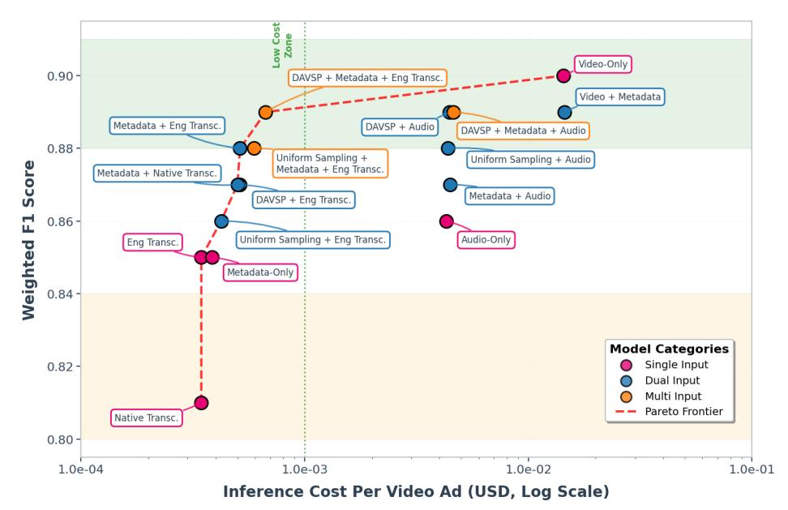

Figure 1: Accuracy–cost trade-off analysis. The scatter plot shows weighted F1 vs. inference cost per ad across model configurations using single, dual, or multimodal inputs. The dashed red line marks the Pareto frontier for optimal accuracy-to-cost ratio.

(Appendix Figure [18\)](#page-11-1). This approach, motivated by the observation that policy violations often occur at scene transitions or distinct segments, makes scene-aware sampling more effective.

We employ scene boundary detection using established computer vision techniques (SceneDetect python library [\[9\]](#page-8-29)) that identify transitions based on visual discontinuity metrics such as color histogram shifts between consecutive frames. To ensure robust scene detection across diverse video content, we implement an adaptive threshold mechanism: starting with a content detection threshold of 30 (empirically determined for typical YouTube ad content), we iteratively halve the threshold until at least 6 scenes are identified or the threshold reaches 0, preventing failures on videos with subtle transitions. The number of image grids �� adapts to video duration using a principled mapping function designed to balance coverage with computational constraints:

�� = 1 if �� &lt; 1, ⌊�� ⌋ if 1 ≤ �� &lt; 6, 5 if �� ≥ 6 (1)

 where �� is the video duration in minutes. From each of the top 6�� scenes (ranked by duration and occurrence), one frame is sampled uniformly, and grouped into 3×2 image grids for input. This approach preserves narrative continuity and emphasizes content-rich transitions, while adapting to different video lengths and styles. A pipeline diagram and analysis justifying the current maximum image grid size of 5 are provided in the Appendix [A.1.](#page-9-2)

DAVSP with English Transcriptions yielded an accuracy of 0.868 and an F1 score of 0.870, outperforming uniform sampling with reduced false FNs (68) and FPs (232). DAVSP selects frames based on video length, preventing duplication and enabling the model to process frames that uniform sampling would otherwise miss. Most remaining FNs involve subtle, context-dependent ads in sensitive categories like intimacy, health/beauty, or privacy risks, such as fashion

ads with revealing visuals or indirect data collection prompts, that lack explicit language or overt imagery. Short problematic segments may also be underrepresented due to scene duration-based frame selection. The FP reduction indicates improved distinction of borderline violations, though the model occasionally over-interprets ambiguous visual signals without strong textual context.

DAVSP, Metadata & English Transcriptions. To overcome DAVSP's limitations, we enhanced it with metadata to inform model reasoning. Using this, the model achieved 0.885 accuracy and a 0.886 F1 score, correcting 40% (121 of 306) of prior misclassifications. Many corrections involved ads where content appeared inappropriate in isolation but was acceptable when contextualized with metadata. For example, an ad for Peppa Pig toys was flagged due to an X-ray frame (Appendix Figure [14\)](#page-11-2) misread as medical promotion; metadata (title, tags) clarified it was for children's toys, enabling correct classification. This illustrates how metadata provides context that mitigates misinterpretation. Moreover, an ad for a song addressing domestic abuse was previously misclassified as appropriate (Appendix Figure [15\)](#page-11-3), as neither lyrics nor visuals explicitly depicted policy-violating content. When metadata was incorporated, the model detected contextual signals in the thumbnail, title, and description referencing domestic abuse, enabling accurate labeling.

Despite strong performance, an 11-percentage-points gap to perfect accuracy remains. Analyzing misclassifications reveals error patterns mirroring those with full video input. For FNs (73 out of 261), the model overlooks themes like mild intimacy or crude humor, interpreting them as wholesome. This occurs particularly in music videos and travel ads, where subtle cues are rationalized as emotional appeal. Although we observed that all these modalities appeared to be complementary, without contradicting eachother, as they were derived from the same video, however, there were a few cases where the model would try to justify mildly inappropriate content based on added context from metadata, especially in cases of

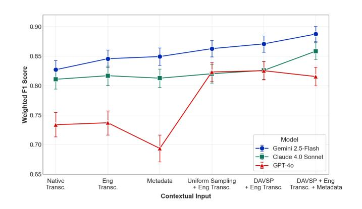

Korean Pop Songs with romantic lyrics but bright, safe visuals. Once the model was exposed to the video title, it occasionally rationalized the content by attributing it to cultural norms in Korea.

For FPs (188 out of 261), the model is overly cautious, especially toward financial services, where benign finance mentions trigger inappropriate classifications. Similarly, in health and beauty, products like medicated pillows or face washes are frequently flagged despite aligning with hygiene rather than policy-violating health claims. This conservative behavior contributes to FPs comprising 72% of total misclassifications. Lower FNs indicate that the pipeline successfully captures most inappropriate videos, while the higher FPs suggest that some safe videos may be flagged for review, a tradeoff that is acceptable since these can be efficiently validated through human oversight. Representative cases are shown in Appendix figures 10 and 11. The proposed pipeline achieves 0.89 F1 score, comparable to the full video baseline (0.90), while operating at significantly lower cost (Figure [1\)](#page-5-0), making it cost-effective.

### 3.3 Cross-Model Analysis

Trends across modalities, such as the improvements from using English transcriptions and the DAVSP pipeline, were consistent across all three models: Gemini 2.5 Flash, Claude 4 Sonnet, and GPT-4o as shown in Figure [2.](#page-6-0) However, Gemini outperformed the others and demonstrated stronger alignment with policy guidelines. Its advantage was particularly clear in low-resource languages and borderline policy categories, where it maintained higher stability and lower variance in predictions. Claude 4 Sonnet and GPT-4o showed similar patterns but with lower F1. Claude frequently misclassified hygiene, food, and healthcare ads as inappropriate, even when explicitly allowed by the prompt. It sometimes hallucinated violations (e.g., weapons, intimacy) and tended to focus on transcriptions, misinterpreting themes or missing contextual nuance, particularly in educational or family-friendly settings. Claude also showed the smallest F1 gain from improved modalities, indicating a preference for textual input over visual cues and limited capacity for multimodal reasoning. This behavior suggests that Claude's decision boundary is overly sensitive to textual phrasing, leading to reduced generalization in visually driven ad contexts. GPT-4o frequently misclassified items like toothpaste and diapers as food in text-only conditions, and failed to flag food ads as inappropriate even when policy violations were clear. This performance gap narrowed significantly when multimodal context was introduced, with GPT-4o achieving parity with Gemini and Claude under certain sampling conditions. Its underreaction to romantic or emotional cues in music resulted in missed violations, although in some borderline cases, this leniency reduced false positives. Representative cases can be seen in Appendix figures [13,](#page-11-4) [16](#page-11-5) and [17.](#page-11-6) In summary, all models improved with multimodal inputs, but Gemini was the most reliable and cost-efficient.Overall, Gemini's balanced sensitivity and multimodal reasoning make it better suited for scalable, policy-aware ad classification across diverse content types.

### 3.4 Performance across Languages

Gemini performs well across a broad range of languages, but its performance varies depending on linguistic group and dataset size. Figure [3](#page-7-0) summarizes these differences using bootstrap-estimated F1

Figure 2: Cross-model Performance Trend. Error bars indicate 95% bootstrap confidence intervals.

scores with 95% confidence intervals for our main pipeline (DAVSP + metadata + English transcripts). High-resource languages generally exhibit stable performance with narrow uncertainty bounds. For example, English achieves a F1 score of 0.888 (CI: 0.868-0.908), French 0.875 (CI: 0.832-0.918), Swedish 0.898 (CI: 0.852-0.938), and Spanish 0.892 (CI: 0.828-0.946). Medium-resource languages such as German (0.880; CI: 0.798-0.955), Arabic (0.836; CI: 0.752-0.912), and Urdu (0.934; CI: 0.868-0.983) follow similar trends, though with moderately wider intervals.

Performance variation is more pronounced for low-resource languages. Languages with small sample sizes, like Japanese (n=14, 0.792; CI: 0.560-1.000), Tamil (n=18, 0.876; CI: 0.739-1.000), Telugu (n=13, 0.912; CI: 0.727-1.000), and Turkish (n=12, 1.000; CI: 1.000- 1.000), exhibit wider confidence intervals due to higher statistical uncertainty. Some show near-perfect performance, while others display greater variability stemming from limited dataset coverage.

Qualitatively, several recurring error patterns span languages. For Korean ads, the model often overinterprets stylized music-video content such as intense choreography or dramatic visual effects as dangerous stunts. French-language errors frequently involve financial service advertisements being flagged as inappropriate despite complying with guideline definitions. English errors are more diverse, likely due to the high volume and heterogeneity of English-language ads. Across languages, we observe consistent themes similar to those found in the video input evaluation, including over-interpretation of intimacy, interpersonal conflict, health and beauty topics, and stunt-related content.

To quantify overall stability, we performed 10,000-iteration bootstrap resampling. Our main pipeline achieves a macro-F1 of 0.887 (CI: 0.874-0.900), indicating that the performance gap between the full-video and DAVSP pipelines lies within expected statistical variation. The per-language intervals further contextualize this result, highlighting where model performance is well-supported by data (e.g., English, French) and where estimates should be interpreted with caution due to limited sample sizes (e.g., Telugu, Japanese).

### 4 Cost Analysis

Reduction in Token Usage with DAVSP. Multimodal LLM processing demands substantial compute, making cost-efficiency essential for practical deployment. The baseline Gemini pipeline operates

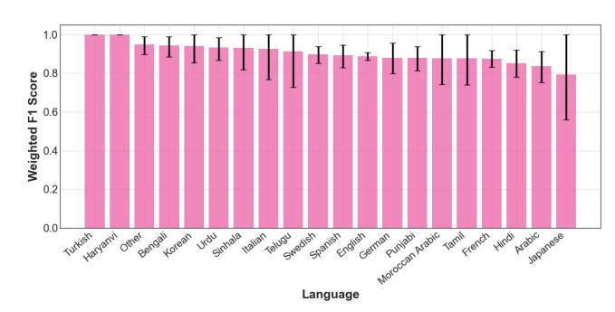

Figure 3: Weighted F1 performance across languages. Error bars indicate 95% bootstrap confidence intervals. Note: Languages with counts < 10 were included as "others".

at 1 frame/sec, with each frame using 263 tokens, audio consuming 32 tokens/sec, and prompts requiring 720 tokens. A typical ad (127 s on average) yields 38,185 input tokens with full video processing. DAVSP significantly reduces this count by utilizing sampled image grids. Specifically, for an average ad (127 s), DAVSP incorporates two image grids (516 tokens) and the prompt (720 tokens), amounting to a total of 1,236 tokens. This results in a substantial 31× reduction in input tokens compared to full-video processing. Cost across Models. Table [5](#page-7-1) shows cost variation across models for (DAVSP + metadata + English-Transcriptions) as input. Gemini 2.5 Flash provides the best performance-cost trade-off, achieving 0.89 F1 score with a 24.9× lower cost per request on average compared to Claude Sonnet. The variations in cost stems from differences in tokenization methods and Gemini's compression of all images into 768×768 tiles, which leads to lowest cost per image.

Bandwidth Savings: Beyond token efficiency, DAVSP delivers substantial bandwidth savings. DAVSP reduces file sizes from 1.42 MB to 0.5 MB per ad (2.9× reduction).

Table 5: Cross-model costs for the DAVSP + Metadata + English-Transcription pipeline per typical video ad.

| Model            | Tokens/Image | Tokens/Request | Cost (\$) | F1 Score |
|------------------|--------------|----------------|-----------|----------|
| Gemini 2.5 Flash | 258          | 2,230          | 0.000669  | 0.89     |
| GPT-4o           | 765          | 3,753          | 0.009383  | 0.81     |
| Claude Sonnet 4  | 1,334        | 5,552          | 0.016656  | 0.86     |

# 5 Related Work

LLMs in Content Moderation. Existing work on LLMs for content moderation primarily focuses on text. Kumar et al. [\[18\]](#page-8-18) evaluated LLMs on Reddit moderation, finding varying performance (median accuracy 63.7%) depending on context, but did not explore multimodal inputs. Alghowinem [\[1\]](#page-8-30) proposed multimodal analysis for YouTube Kids using "thin-slicing," though limited to pre-filtered content and not ads. Our work advances this field by combining multimodal LLM capabilities with efficient sampling strategies, achieving high interpretability while addressing the broader challenges of scalable, cross-lingual content moderation.

Automated Content Classification. Previous approaches to detecting inappropriate content primarily rely on deep learning models using video frames or metadata. While some frameworks achieve high accuracy (95.7% using CNN-BiLSTM for specific violation

types [\[34\]](#page-8-11), 90%+ for YouTube Kids classification [\[32\]](#page-8-31)), they often focus on limited criteria or require extensive training data. Metadatabased approaches [\[7,](#page-8-32) [13,](#page-8-33) [26\]](#page-8-34) show promise but typically achieve lower accuracy (around 83%) and lack interpretability.

### 6 Discussion and Impact

Our study offers benefits beyond accuracy and cost, providing actionable insights for improving online child safety.

LLMs as Multilingual Support Tools. LLMs can support human moderation by generating detailed violation explanations across languages and cultures. They detect subtle elements that human reviewers might miss due to language gaps, attention lapses, or rapid scene changes. This is especially useful for "gray area" content, where cultural, religious, or age-related norms vary. Instead of finetuning, LLMs can adapt via prompt changes. Advertisers can also use these tools to pre-screen ads for appropriateness, improving brand safety and reducing campaign rejection risks.

Scalability and Implementation. A moderation pipeline that effectively leverages LLMs for labeling needs to be scalable and low-cost since detection would run each time an ad is selected to be shown for a child-directed video. Due to the frequent labeling task, we offer DAVSP as a solution. At ad selection time, the system can use key frames and transcriptions to detect inappropriate ads and replace them with better alternatives. Moreover, LLMs can be used to flag inappropriate ads which can be later, human-reviewed, drastically reducing the number of ads to be human-annotated. Although our study centers on YouTube advertising, the cost-aware design principles we explore are platform-agnostic. Future work may extend this pipeline to open-source multimodal models, accounting for practical deployment and infrastructure considerations.

Policy Makers and Regulators. Our findings demonstrate feasibility of automated, scalable content moderation across regions and languages. While we rely on YouTube's region-neutral advertising guidelines to define inappropriateness, our results expose gray-area cases where cultural context plays a critical role. This highlights the need for policy frameworks that support culturally specific guidance while maintaining consistent baseline protections for children. Policy makers can use our results to develop evidence-based regulations that account for cultural differences while maintaining consistent safety standards. The cost analysis provides realistic benchmarks for mandating automated content screening without adding undue economic burden on platforms. Moreover, our work shows how technology can help enforce COPPA and similar regulations effectively across various jurisdictions.

Parents and Child Safety Advocates. Child safety organizations can use our methodology to conduct systematic audits of platform safety measures and advocate for specific improvements based on quantitative evidence, while parents gain clearer guidance on choosing safer platforms for kids.

# Acknowledgements

This work was supported by the Fund to the Global Partnership to End Violence Against Children (Safe Online), administered by UNICEF, under grant 25-EVAC-0012 to Lahore University of Management Sciences.

References [1] Sharifa Alghowinem. 2018. For a Safer YouTube Kids: an Extra Layer of Content Filtering Using Automated Multimodal Analysis. In Intelligent Systems Conference. IEEE, London, UK, 1–8. [2] Saeed Ibrahim Alqahtani, Wael M. S. Yafooz, Abdullah Alsaeedi, Liyakathunisa Syed, and Reyadh Alluhaibi. 2023. Children's Safety on YouTube: A Systematic Review. Applied Sciences 13, 6 (2023). [doi:10.3390/app13064044](https://doi.org/10.3390/app13064044) [3] Anthropic. 2025. Claude Sonnet 4. [https://www.anthropic.com/claude/sonnet,](https://www.anthropic.com/claude/sonnet) Accessed: 2025-07-20. [4] Anthropic. 2025. Claude Sonnet 4 now supports 1M tokens of context. [https:](https://claude.com/blog/1m-context) [//claude.com/blog/1m-context.](https://claude.com/blog/1m-context) Accessed: 2025-11-29. [5] Anthropic. 2025. Introducing Claude 4: Our most intelligent model yet. [https:](https://www.anthropic.com/news/claude-4) [//www.anthropic.com/news/claude-4.](https://www.anthropic.com/news/claude-4) [6] Tadas Baltrušaitis, Chaitanya Ahuja, and Louis-Philippe Morency. 2019. Multimodal machine learning: A survey and taxonomy. IEEE Transactions on Pattern Analysis and Machine Intelligence 41, 2 (2019), 423–443. [doi:10.1109/TPAMI.2018.](https://doi.org/10.1109/TPAMI.2018.2798607) [2798607](https://doi.org/10.1109/TPAMI.2018.2798607) [7] Le Binh, Rajat Tandon, Chingis Oinar, Jeffrey Liu, Uma Durairaj, Jiani Guo, Spencer Zahabizadeh, Sanjana Ilango, Jeremy Tang, Fred Morstatter, Simon Woo, and Jelena Mirkovic. 2022. Samba: Identifying Inappropriate Videos for Young Children on YouTube. In Proceedings of the 31st ACM International Conference on Information & Knowledge Management (Atlanta, GA, USA) (CIKM '22). Association for Computing Machinery, New York, NY, USA, 88–97. [doi:10.1145/3511808.](https://doi.org/10.1145/3511808.3557442) [3557442](https://doi.org/10.1145/3511808.3557442) [8] Social Blade. 2023. Top YouTubers in 'Made for Kids' Category. [https://socialblade.](https://socialblade.com/youtube/top/category/made-for-kids) [com/youtube/top/category/made-for-kids.](https://socialblade.com/youtube/top/category/made-for-kids) Accessed May 9, 2025. [9] Brandon Castellano and contributors. 2025. PySceneDetect: Video scene-cut detection tool.<https://www.scenedetect.com/> Open-source software. Latest release 2025-08-24.. [10] Google Advertising Policies Center. n.d.. Ads and made for kids content. [https:](https://support.google.com/adspolicy/answer/9683742) [//support.google.com/adspolicy/answer/9683742.](https://support.google.com/adspolicy/answer/9683742) Accessed: January 22, 2025. [11] Google Transparency Center. 2023. Ads and Made for Kids Content | Google Advertiser Policies. [https://www.youtube.com/watch?v=tEX56wQRHcI.](https://www.youtube.com/watch?v=tEX56wQRHcI) [12] Google DeepMind. 2024. Gemini 2.5 Flash: Ultra-fast lightweight models. [https:](https://deepmind.google/models/gemini/flash/) [//deepmind.google/models/gemini/flash/,](https://deepmind.google/models/gemini/flash/) Accessed: 2025-07-20. [13] Carsten Eickhoff and Arjen P de Vries. 2010. Identifying suitable YouTube videos for children. 3rd Networked and electronic media summit (NEM) (2010). [14] Google. 2024. Google Ads Policies. [https://support.google.com/adspolicy/answer/](https://support.google.com/adspolicy/answer/6008942) [6008942.](https://support.google.com/adspolicy/answer/6008942) Accessed: 2024-11-14. [15] Google Ads Help. 2025. Google Ads Policies. [https://support.google.](https://support.google.com/adspolicy/topic/7330871?hl=en&ref_topic=3230816,1308156,&sjid=12619790139636724429-NC) [com/adspolicy/topic/7330871?hl=en&ref\\_topic=3230816,1308156,&sjid=](https://support.google.com/adspolicy/topic/7330871?hl=en&ref_topic=3230816,1308156,&sjid=12619790139636724429-NC) [12619790139636724429-NC.](https://support.google.com/adspolicy/topic/7330871?hl=en&ref_topic=3230816,1308156,&sjid=12619790139636724429-NC) Accessed: 2025-07-30. [16] Emaan Bilal Khan, Nida Tanveer, Aima Shahid, Mohammad Jaffer Iqbal, Haashim Ali Mirza, Armish Javed, Ihsan Ayyub Qazi, and Zafar Ayyub Qazi. 2024. Analyzing Ad Exposure and Content in Child-Oriented Videos on YouTube. In Proceedings of the ACM Web Conference 2024. Association for Computing Machinery, New York, NY, USA. [doi:10.1145/3589334.3645585](https://doi.org/10.1145/3589334.3645585) [17] Kidscorp. 2023. YouTube or YouTube Kids? Reaching the right audience effectively and safely. [https://www.kidscorp.digital/resources/blog/youtube-or-youtube](https://www.kidscorp.digital/resources/blog/youtube-or-youtube-kids-reaching-the-right-audience-effectively-and-safely)[kids-reaching-the-right-audience-effectively-and-safely](https://www.kidscorp.digital/resources/blog/youtube-or-youtube-kids-reaching-the-right-audience-effectively-and-safely) Accessed: 2025-01-22. [18] Deepak Kumar, Yousef Anees AbuHashem, and Zakir Durumeric. 2024. Watch Your Language: Investigating Content Moderation with Large Language Models. Proceedings of the International AAAI Conference on Web and Social Media 18, 1 (May 2024), 865–878. [doi:10.1609/icwsm.v18i1.31358](https://doi.org/10.1609/icwsm.v18i1.31358) [19] Adi Levi, Or Levi, Sardhendu Mishra, and Jonathan Morra. 2025. AI vs. Human Moderators: A Comparative Evaluation of Multimodal LLMs in Content Moderation for Brand Safety. arXiv[:2508.05527](https://arxiv.org/abs/2508.05527) [cs.CV]<https://arxiv.org/abs/2508.05527> [20] Jeffrey Liu, Rajat Tandon, Uma Durairaj, Jiani Guo, Spencer Zahabizadeh, Sanjana Ilango, Jeremy Tang, Neelesh Gupta, Zoe Zhou, and Jelena Mirkovic. 2022. Did your child get disturbed by an inappropriate advertisement on YouTube? arXiv[:2211.02356](https://arxiv.org/abs/2211.02356) [cs.CY]<https://arxiv.org/abs/2211.02356> [21] Mashable. 2020. YouTube puts human content moderators back to work. [https:](https://mashable.com/article/youtube-human-content-moderation) [//mashable.com/article/youtube-human-content-moderation.](https://mashable.com/article/youtube-human-content-moderation) [22] Eman Nabeel, Haleema Jamil, Shizza Asher, Zaeem Mohtashim Khan, Nida Tanveer, Ihsan Ayyub Qazi, and Zafar Ayyub Qazi. 2025. LLMs-for-Online-Child-Safety.<https://github.com/nsgLUMS/LLMs-for-Online-Child-Safety> GitHub repository. [23] Ozioma C. Oguine, Oghenemaro Anuyah, Zainab Agha, Iris Melgarez, Adriana Alvarado Garcia, and Karla Badillo-Urquiola. 2025. Online Safety for All: Sociocultural Insights from a Systematic Review of Youth Online Safety in the Global South. arXiv[:2504.20308](https://arxiv.org/abs/2504.20308) [cs.HC]<https://arxiv.org/abs/2504.20308> [24] Timo Ojanen, Pimpawun Boonmongkon, Ronnapoom Samakkeekarom, Nattharat Samoh, Mudjalin Cholratana, Anusorn Payakkakom, and Thomas Guadamuz. 2014. Investigating online harassment and offline violence among young people in Thailand: Methodological approaches, lessons learned. Culture, health & sexuality 16 (07 2014), 1–16. [doi:10.1080/13691058.2014.931464](https://doi.org/10.1080/13691058.2014.931464) [25] OpenAI. 2024. GPT-4o: OpenAI's new flagship multimodal model. [https://openai.](https://openai.com/index/hello-gpt-4o/) [com/index/hello-gpt-4o/.](https://openai.com/index/hello-gpt-4o/) [26] Kostantinos Papadamou, Antonis Papasavva, Savvas Zannettou, Jeremy Blackburn, Nicolas Kourtellis, Ilias Leontiadis, Gianluca Stringhini, and Michael Sirivianos. 2021. Disturbed YouTube for Kids: Characterizing and Detecting Inappropriate Videos Targeting Young Children. arXiv[:1901.07046](https://arxiv.org/abs/1901.07046) [cs.SI] [27] Precise.TV. 2025. PARK: Precise Advertiser Report - Kids. [https://content.precise.](https://content.precise.tv/hubfs/PARK_%20Precise%20Advertiser%20Report%20-%20Kids%20%20.pdf) [tv/hubfs/PARK\\_%20Precise%20Advertiser%20Report%20-%20Kids%20%20.pdf.](https://content.precise.tv/hubfs/PARK_%20Precise%20Advertiser%20Report%20-%20Kids%20%20.pdf) [28] Alec Radford, Jong Wook Gao, William Kim, Prafulla Xu, Greg Brockman, Christine McLeavey, and Ilya Sutskever. 2022. Robust Speech Recognition via Large-Scale Weak Supervision. [https://cdn.openai.com/papers/whisper.pdf.](https://cdn.openai.com/papers/whisper.pdf) Accessed: 2025-07-30. [29] Dhanesh Ramachandram and Graham W Taylor. 2017. Deep multimodal learning: A survey on recent advances and trends. IEEE Signal Processing Magazine 34, 6 (2017), 96–108. [doi:10.1109/MSP.2017.2738401](https://doi.org/10.1109/MSP.2017.2738401) [30] Wonsun Shin and Nurzali Ismail. 2014. Exploring the Role of Parents and Peers in Young Adolescents' Risk Taking on Social Networking Sites. Cyberpsychology, behavior and social networking 17 (08 2014). [doi:10.1089/cyber.2014.0095](https://doi.org/10.1089/cyber.2014.0095) [31] WIRED Staff. 2023. The Dire Defect of 'Multilingual' AI Content Moderation. WIRED (23 May 2023). [https://www.wired.com/story/content-moderation](https://www.wired.com/story/content-moderation-language-artificial-intelligence/)[language-artificial-intelligence/](https://www.wired.com/story/content-moderation-language-artificial-intelligence/) Online. [32] Rashid Tahir, Faizan Ahmed, Hammas Saeed, Shiza Ali, Fareed Zaffar, and Christo Wilson. 2020. Bringing the Kid Back into YouTube Kids: Detecting Inappropriate Content on Video Streaming Platforms. In Proceedings of the 2019 IEEE/ACM International Conference on Advances in Social Networks Analysis and Mining (Vancouver, British Columbia, Canada) (ASONAM '19). Association for Computing Machinery, New York, NY, USA, 464–469. [doi:10.1145/3341161.3342913](https://doi.org/10.1145/3341161.3342913) [33] Shubham Vatsal and Harsh Dubey. 2024. A Survey of Prompt Engineering Methods in Large Language Models for Different NLP Tasks. arXiv[:2407.12994](https://arxiv.org/abs/2407.12994) [cs.CL] <https://arxiv.org/abs/2407.12994> [34] Kanwal Yousaf and Tabassam Nawaz. 2022. A Deep Learning-Based Approach for Inappropriate Content Detection and Classification of YouTube Videos. IEEE Access (2022). [doi:10.1109/ACCESS.2022.3147519](https://doi.org/10.1109/ACCESS.2022.3147519) [35] Wenxuan Zhang, Sharifah Mahani Aljunied, Chang Gao, Yew Ken Chia, and Lidong Bing. 2024. M3Exam: a multilingual, multimodal, multilevel benchmark for examining large language models. In Proceedings of the 37th International Conference on Neural Information Processing Systems (New Orleans, LA, USA) (NIPS '23). Curran Associates Inc., Red Hook, NY, USA, Article 240, 22 pages.

# A Appendix

### A.1 Justification for Maximum Grid Count Selection for DAVSP

We analyze model performance across varying maximum image grid limits for ads longer than 120 seconds. As shown in Figure 6, increasing the number of grids leads to consistent but diminishing improvements in accuracy and F1 score. For instance, the jump from 1 to 5 grids results in a clear performance gain, while further increases to 10 and 15 grids yield marginal returns.

Given the inference cost per image (e.g., \$0.01 for GPT-4o, \$0.02 for Claude-4), a maximum of 5 image grids offers a strong trade-off between cost and performance. This value is therefore used as the default in subsequent experiments.

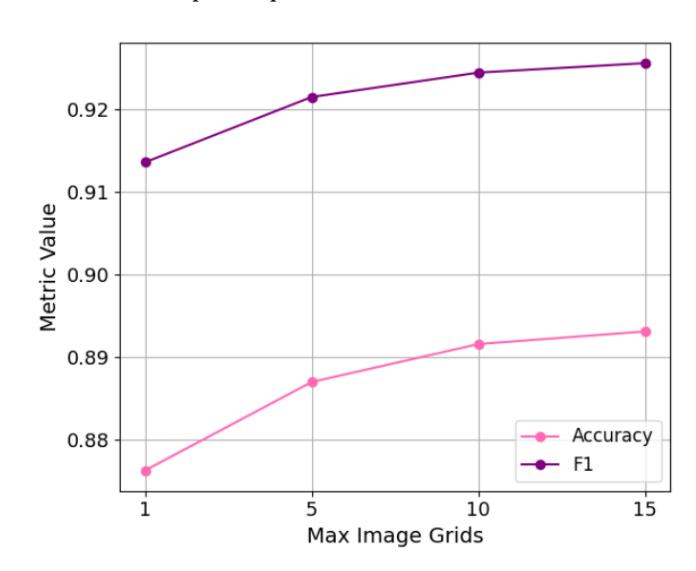

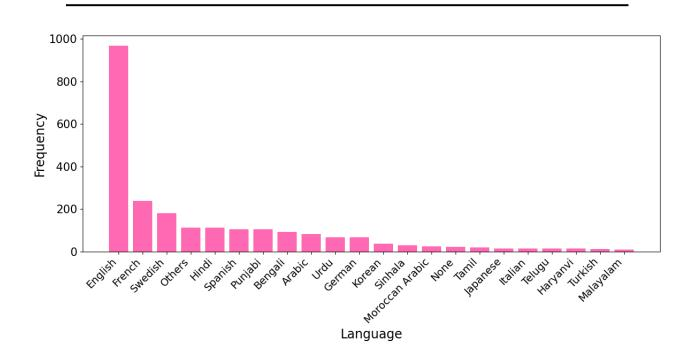

Figure 4: DAVSP: Maximum Number of Image Grids Analysis.

# A.2 Reasons for Invalid Responses

Out of the total 2,423 videos considered for analysis, Gemini failed to generate valid responses for approximately 189 videos. This was due to two non-configurable safety filters: 'Prohibited Content', defined by Gemini as prompts containing restricted material (typically related to CSAM), and 'Other', which encompasses all remaining reasons for prompt rejection. Consequently, these IDs were excluded from the final analysis. Moreover, for cases with metadata where thumbnails were not available, we moved forward without the thumbnail.

# A.3 Figures and Tables

Table 6: Language distribution across the dataset. Note: Ads with no speech are labelled as "None" while languages with ads lower than 10 are added to "Others".

| Language | Count | Language        | Count |
|----------|-------|-----------------|-------|
| English  | 967   | Korean          | 36    |
| French   | 237   | Sinhala         | 30    |
| Swedish  | 181   | Moroccan Arabic | 23    |
| Others   | 113   | None            | 21    |
| Hindi    | 112   | Tamil           | 18    |
| Spanish  | 105   | Japanese        | 14    |
| Punjabi  | 104   | Italian         | 14    |
| Bengali  | 92    | Telugu          | 13    |
| Arabic   | 83    | Haryanvi        | 13    |
| Urdu     | 66    | Turkish         | 12    |
| German   | 66    | Malayalam       | 10    |

Figure 5: Language Distribution of the dataset (Languages with less than 10 videos were added to others)

Figure 6: Prompt Structure.

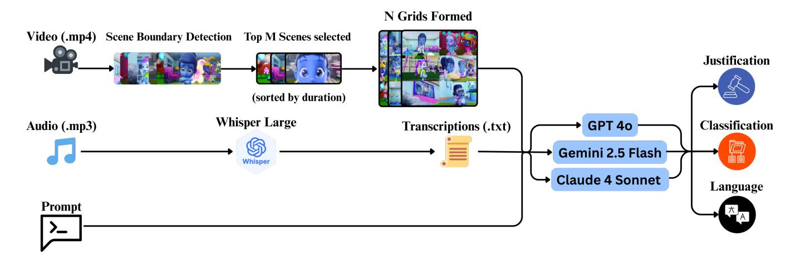

Figure 7: Pipeline Diagram for DAVSP with English Transcriptions

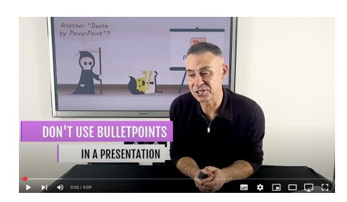

Figure 8: Video & Audio Input: Depiction of Death False Positive (ewQ\_wSgCFTU).

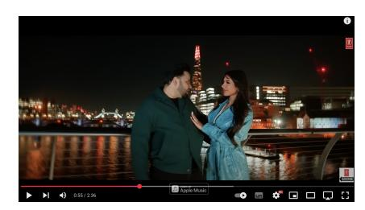

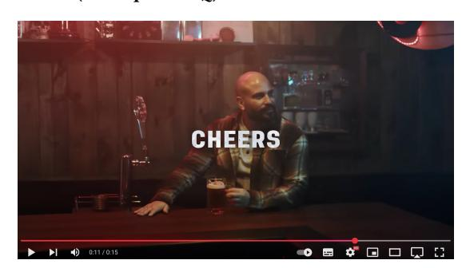

Figure 9: Video & Audio Input: Mild Intimacy False Negative (B1z2h\_tZZq0).

Figure 10: Metadata: Fight Sports False Negative (rMnxnd9HvsQ).

Figure 11: Metadata & English Transcriptions Correctly Classified: Movie trailer with intimacy and violence corrected by thumbnail (dN1ZqEuvVGQ).

Figure 12: Metadata & English Transcriptions False Negative: Rubber gloves ad with beer shot missed due to lack of visual cues (QpnHaKNCaT0)

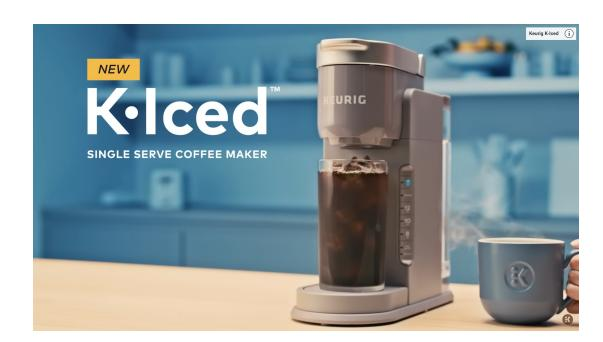

Figure 13: DAVSP: Gemini Coffee Machine False Positive (6\_u0Gsd-guo).

Figure 14: DAVSP & Metadata (Gemini): Peppa Pig X-Ray false positive corrected by metadata (YkVSw2RFGmY).

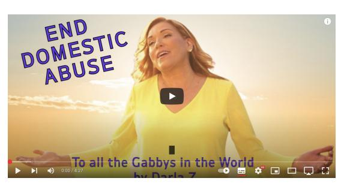

Figure 15: DAVSP & Metadata (Gemini): Domestic Abuse song false negative corrected by metadata (hkworAjntAI).

Figure 16: DAVSP: Claude Food Product False Positive (lLQs7sfJXTw).

Figure 17: DAVSP: GPT Toothpaste False Positive (DwNatxJH-BGo).

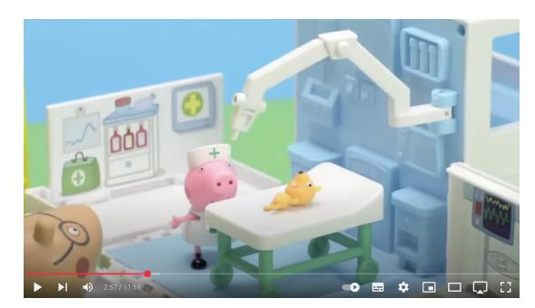

(a) Ex. 1: Uniform Sampling. (b) Ex. 1: Scene Sampling.

(c) Ex. 2: Uniform Sampling. (d) Ex. 2: Scene Sampling (1). (e) Ex. 2: Scene Sampling (2).

Figure 18: Comparison of Uniform Sampling vs Scene Sampling Approaches.