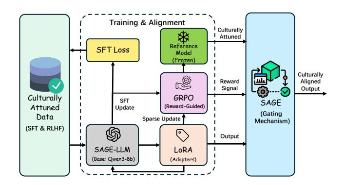
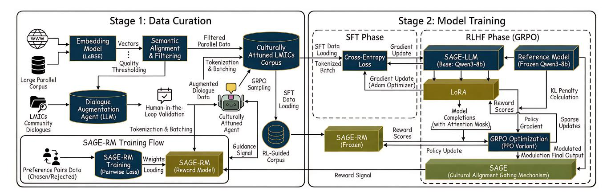
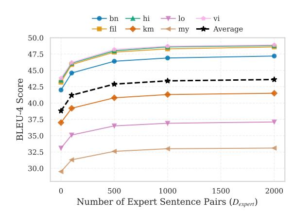
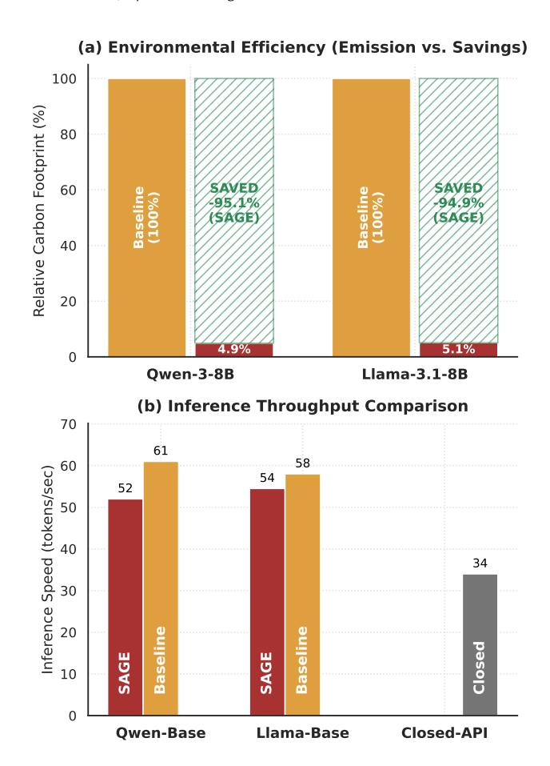
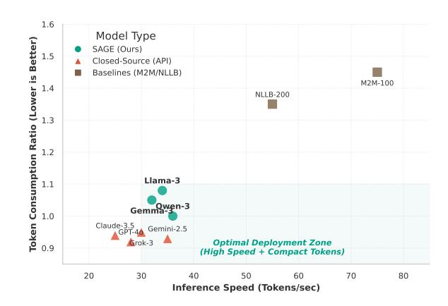
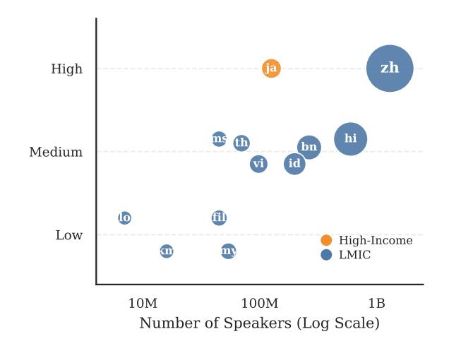

# SAGE: Sustainable Agent-Guided Expert-tuning for Culturally Attuned Translation in Low-Resource Southeast Asia

Zhixiang Lu∗ zhixiang.lu22@student.xjtlu.edu.cn Xi'an Jiaotong-Liverpool University Suzhou, China

Chong Zhang∗ c.zhang118@liverpool.ac.uk Xi'an Jiaotong-Liverpool University Suzhou, China

Yulong Li∗ yulong.li19@student.xjtlu.edu.cn Xi'an Jiaotong-Liverpool University Suzhou, China

Angelos Stefanidis angelos.stefanidis@xjtlu.edu.cn Xi'an Jiaotong-Liverpool University Suzhou, China

Anh Nguyen anh.nguyen@liverpool.ac.uk University of Liverpool Liverpool, United Kingdom

Imran Razzak† imran.razzak@mbzuai.ac.ae Mohamed bin Zayed University of Artificial Intelligence Abu Dhabi, United Arab Emirates

Jionglong Su† jionglong.su@xjtlu.edu.cn Xi'an Jiaotong-Liverpool University Suzhou, China

Zhengyong Jiang† zhengyong.jiang02@xjtlu.edu.cn Xi'an Jiaotong-Liverpool University Suzhou, China

# Abstract

The vision of an inclusive World Wide Web is impeded by a severe linguistic divide, particularly for communities in low-resource regions of Southeast Asia. While large language models (LLMs) offer a potential solution for translation, their deployment in data-poor contexts faces a dual challenge: the scarcity of high-quality, culturally relevant data and the prohibitive energy costs of training on massive, noisy web corpora. To resolve the tension between digital inclusion and environmental sustainability, we introduce Sustainable Agent-Guided Expert-tuning (SAGE). This framework pioneers an energy-aware paradigm that prioritizes the "right data" over "big data". Instead of carbon-intensive training on unfiltered datasets, SAGE employs a reinforcement learning (RL) agent, optimized via Group Relative Policy Optimization (GRPO), to autonomously curate a compact training set. The agent utilizes a semantic reward signal derived from a small, expert-constructed set of community dialogues to filter out noise and cultural misalignment. We then efficiently fine-tune open-source LLMs on this curated data using Low-Rank Adaptation (LoRA). We applied SAGE to translation tasks between English and seven low-resource languages (LRLs) in Southeast Asia. Our approach establishes new state-of-the-art performance on BLEU-4 and COMET-22 metrics, effectively capturing local linguistic nuances. Crucially, SAGE surpasses baselines trained on full datasets while reducing data usage by 97.1% and training energy consumption by 95.2%. By delivering high-performance models with a minimal environmental footprint, SAGE offers a scalable and responsible pathway to bridge the digital divide in the Global South.

# Keywords

Low-Resource Languages; Machine Translation; Group Relative Policy Optimization; AI for Social Good

# 1 Introduction

The proliferation of Large Language Models (LLMs) has catalyzed a revolution in automated communication, with Neural Machine Translation (NMT) systems achieving remarkable fluency and accuracy across high-resource language pairs. Architectures like the Transformer [\[57\]](#page-9-0) have become foundational, enabling seamless interaction and information exchange for speakers of languages such as English, Spanish, and French. However, this progress has not been universally distributed. A stark digital and linguistic divide persists, as the performance of these data-hungry models remains profoundly suboptimal for the vast majority of the world's approximately 7,000 low-resource languages (LRLs). This disparity is primarily due to the lack of large-scale, high-quality parallel corpora needed for training. As a result, entire populations, especially in Low and Middle-Income Countries (LMICs), are excluded from the advantages of modern AI, limiting their access to global information and digital services. The current trend in NMT development unintentionally exacerbates existing inequalities. By prioritizing methods that rely on large datasets, it creates a positive feedback loop for high-resource languages. In contrast, LRLs are trapped in a negative cycle characterized by data scarcity, poor model performance, and low user adoption. To tackle this systemic issue, a fundamental shift in methodology is essential.

This challenge is most acute and socially consequential in the domain of community dialogues: the informal, context-rich, and culturally nuanced conversations that are the bedrock of civic life. These dialogues cover critical topics such as public health advisories, local commerce, and educational support. Standard MT systems, typically trained on formal corpora like news articles or parliamentary records, consistently fail to capture the subtleties of this domain. They struggle with the ambiguity inherent in short texts, colloquialisms, code-switching, and culturally specific idioms, which are hallmarks of community interaction. The consequences of such failures are not merely linguistic; they are social. Inaccurate or culturally insensitive translations can erode trust, disengage culturally

∗Equal contribution.

†Corresponding author.

and linguistically diverse (CALD) communities from vital public health campaigns, and obstruct access to educational materials for students who rely on mobile devices for learning. In this context, translation quality is not an abstract technical metric but a direct determinant of social impact. A model that produces grammatically correct but contextually inappropriate translations can do more harm than good.

The predominant strategy for addressing low-resource scenarios has been a "more data" paradigm, focused on augmenting limited datasets, primarily through back-translation from large monolingual corpora to generate synthetic parallel data. While this can yield improvements, it often amplifies the noise inherent in the vast, unfiltered web data from which monolingual corpora are sourced [\[14,](#page-8-0) [60\]](#page-9-1). Critically, simply increasing the volume of generic, out-of-domain data does not guarantee improved performance on the specialized task of translating community dialogues. Indeed, fine-tuning an LLM on a massive corpus that is 99% generic web text may degrade its ability to handle the rare but crucial linguistic patterns of the target domain. This suggests that a paradigm shift is necessary: from a focus on "more data" to a focus on the "right data". The central technical challenge thus becomes the autonomous and scalable curation of a compact, high-potency, in-domain dataset from a much larger, noisy corpus.

To address this challenge, we introduce SAGE: Sustainable Agent-Guided Expert-tuning (see [1\)](#page-1-0). This framework operationalizes the "right data" philosophy by pioneering an expert-reward informed tuning paradigm. Instead of fine-tuning on a noisy, unfiltered corpus, SAGE first employs a Reinforcement Learning (RL) agent to autonomously curate a small, high-quality training set. The agent's policy is trained using Group Relative Policy Optimization (GRPO) [\[52\]](#page-9-2), a highly efficient, critic-free RL algorithm. The novelty lies in our reward signal: the semantic similarity between a candidate translation and a small, "golden" reference set of experttranslated community dialogues. This mechanism distills expert domain knowledge and cultural attunement directly into the data selection process. Subsequently, a powerful open-source LLM is efficiently fine-tuned on this curated dataset using Low-Rank Adaptation (LoRA) [\[19\]](#page-8-1). Applied to a challenging multilingual task involving English and seven low-resource Southeast Asian languages (Burmese, Bengali, Filipino, Hindi, Khmer, Lao, and Vietnamese), SAGE sets a new state-of-the-art (SOTA) on key metrics like BLEU-4 and COMET-22 [\[45\]](#page-9-3), surpassing baselines trained on the entire unfiltered dataset while using substantially less data. Our contributions are threefold:

- We propose SAGE, a novel framework that pioneers the use of RL with an expert-defined reward for autonomous, quality-driven data curation in low-resource MT.
- We introduce a new application of GRPO, leveraging its efficiency for the upstream data selection task, guided by a semantic-similarity signal that encodes expert domain knowledge.
- We demonstrate SOTA translation performance across seven low-resource Southeast Asian languages, validating that our "right data" approach is more effective and resource-efficient than the conventional "more data" paradigm.

Figure 1: Architectural overview of the SAGE framework.

### 2 Related Work

# 2.1 Machine Translation for LRLs

NMT has established itself as the dominant paradigm in translation tasks. Formally, given a source sentence x = (��1, . . . , ���� ) and a target sentence y = (��1, . . . , ���� ), NMT models aim to maximize the log-likelihood of the conditional probability:

LNMT(��) = ∑︁ (x,y) ∈D ∑︁�� ��=1 log �� (���� |��<�� , x; ��) (1)

where �� represents the model parameters and D is the parallel corpus. While Transformer-based architectures [\[57\]](#page-9-0) have achieved remarkable success in high-resource scenarios [\[59\]](#page-9-4), they face significant performance degradation in LRLs due to the sparsity of D [\[26,](#page-8-2) [37\]](#page-8-3).

To mitigate this, traditional approaches leverage transfer learning [\[22\]](#page-8-4), back-translation [\[51\]](#page-9-5), and unsupervised MT [\[29\]](#page-8-5). Recently, LLMs such as mBERT [\[8\]](#page-8-6), XLM-R [\[6\]](#page-8-7), and NLLB [\[7\]](#page-8-8) have demonstrated strong zero-shot capabilities. However, general-purpose LLMs often lack the granularity required for domain-specific tasks in LMICs, necessitating targeted fine-tuning strategies.

### 2.2 Data Curation and Quality Estimation

The efficacy of NMT is heavily contingent on data quality [\[56\]](#page-9-6). In low-resource settings, available corpora are often plagued by noise and domain misalignment [\[33,](#page-8-9) [68\]](#page-9-7). Existing filtering techniques typically employ heuristic scoring functions �� (x, y) based on length ratios or language identification probabilities, discarding pairs where �� (x, y) &lt; �� [\[21,](#page-8-10) [25\]](#page-8-11). More advanced methods utilize dual cross-entropy loss or quality estimation models [\[38\]](#page-9-8). While active learning strategies [\[27\]](#page-8-12) attempt to optimize sample efficiency, they remain dependent on expensive human annotation. Unlike these rule-based or human-in-the-loop approaches [\[27,](#page-8-12) [46,](#page-9-9) [55,](#page-9-10) [58\]](#page-9-11), our work introduces an autonomous reinforcement learning framework [\[62\]](#page-9-12) guided by semantic "expert-reward" signals [\[63\]](#page-9-13), shifting the paradigm towards intelligent, goal-oriented data curation [\[30\]](#page-8-13).

# 2.3 Reinforcement Learning for Data Selection

RL has been widely adopted in NLP to optimize non-differentiable metrics [\[62\]](#page-9-12). The data selection process can be formulated as a Markov Decision Process (MDP) [\[36\]](#page-8-14), where the agent's policy ���� (��|��) selects data subsets to maximize a downstream reward ��.

Figure 2: The SAGE training and alignment pipeline. Stage 1 employs a GRPO-optimized RL agent to curate a subset Dcur from a noisy pool Dnoisy, guided by semantic proximity to a small expert reference Dexp. Stage 2 utilizes LoRA to efficiently fine-tune the LLM on Dcur, minimizing computational overhead while maximizing cultural alignment.

The objective is to maximize the expected reward:

�� (��) = E��∼���� [��(��)] (2)

Previous works have applied RL to curriculum learning and instance weighting [\[23,](#page-8-15) [49\]](#page-9-14). However, stability remains a challenge in RL optimization. Our SAGE framework employs GRPO, a method that stabilizes training by normalizing advantages within group samples. This allows our agent to effectively learn a policy that aligns the training data distribution with the semantic and cultural nuances of expert-curated community dialogues, representing a novel application of GRPO in data curation.

# 2.4 Parameter-Efficient Fine-Tuning

Full fine-tuning of LLMs is computationally prohibitive for many applications in the Global South. Parameter-Efficient Fine-Tuning (PEFT) addresses this by updating only a small subset of parameters. LoRA [\[19\]](#page-8-1), a prominent PEFT method, hypothesizes that the change in weights Δ�� has a low intrinsic rank. For a pre-trained weight matrix ��0 ∈ R ��×�� , LoRA decomposes the update as:

�� = ��0 + �� = ��0 + ���� (3)

where �� ∈ R ��×�� and �� ∈ R ��×�� are trainable matrices with rank �� ≪ min(��, ��). This technique drastically reduces memory requirements while maintaining performance comparable to full fine-tuning [\[18,](#page-8-16) [31,](#page-8-17) [32\]](#page-8-18). In SAGE, we leverage LoRA to efficiently adapt LLMs to our RL-curated data, ensuring the system remains deployable in resource-constrained environments typical of LMICs.

### 2.5 Translation for Community Empowerment

Translating for LMICs extends beyond linguistic accuracy to cultural and contextual appropriateness. Community dialogues frequently exhibit code-switching [\[20\]](#page-8-19), non-standard orthography, and localized idioms [\[9\]](#page-8-20) that are absent in standard benchmarks [\[43\]](#page-9-15). Furthermore, ethical AI deployment in these regions requires systems that empower users rather than merely extracting data [\[34,](#page-8-21) [66\]](#page-9-16). Addressing the lack of culturally sensitive NLP systems [\[4,](#page-8-22) [15\]](#page-8-23), our framework explicitly models these factors via the reward

mechanism, ensuring translations preserve the semantic integrity and cultural intent vital for community engagement.

### 3 Methodology

Our SAGE framework addresses the misalignment between generalpurpose LLMs and community-specific linguistic nuances in lowresource settings. We formulate the problem as a two-stage pipeline: (1) Expert-Informed Data Curation, where a RL agent, optimized via GRPO, autonomously selects high-leverage training samples; and (2) Parameter-Efficient Fine-Tuning, where the selected data minimizes the domain shift using LoRA. The overall architecture is illustrated in Figure [2.](#page-2-0)

### 3.1 Problem Formulation

Let Dnoisy = {(���� , ����)}�� ��=1 denote a large-scale, general-domain parallel corpus, where ���� and ���� represent source and target sentences, respectively. We assume the distribution of Dnoisy diverges from the target community domain. Conversely, we possess a small, expert-verified reference set Dexp = {(�� ′ �� , ��′ �� )}�� ��=1 , where �� ≪ ��.

Our objective is to learn a selection policy ���� that identifies a subset Dcur ⊂ Dnoisy with cardinality |Dcur| = ��, such that the distributional distance between Dcur and Dexp is minimized. Subsequently, we optimize a translation model Φ on Dcur to maximize the likelihood of the target domain translations.

### 3.2 RL-Guided Data Curation

### 3.2.1 MDP Definitions.

- State Space (S): The state ���� represents the current curated subset at step ��, i.e., ���� = D (��) cur. The initial state is ��0 = ∅.
- Action Space (A): An action ���� consists of selecting a candidate pair (����, ���� ) from the remaining pool U�� = Dnoisy \ D (��) cur.
- Reward Function (R): To guide the agent towards communityaligned data, we employ a dense reward signal based on semantic embedding similarity. Let E(·) denote a pre-trained sentence encoder (LaBSE [\[12\]](#page-8-24)). The reward for selecting action ���� = (��, ��) is defined as the mean cosine similarity

Table 1: Comparison for English-to-Southeast-Asian translation in LMICs. The best result is in bold, the second best is underlined. Avg. Tok. denotes estimated average inference token consumption per sample.

| Model Closed-Source | bn Models | fil   | hi    | BLEU-4 km | ↑ lo  | my    | vi    | bn    | fil   | hi    | COMET-22 km | ↑ lo  | my    | vi    | Avg. Tok. ↓ |
|---------------------|-----------|-------|-------|-----------|-------|-------|-------|-------|-------|-------|-------------|-------|-------|-------|-------------|
| GPT-4o              | 40.15     | 45.88 | 42.50 | 35.10     | 28.33 | 31.05 | 45.13 | 83.50 | 84.10 | 84.05 | 81.90       | 79.25 | 80.11 | 85.55 | 92.50       |
| Claude-3.5 Sonnet   | 41.25     | 45.15 | 42.18 | 34.95     | 32.12 | 33.85 | 45.24 | 84.10 | 83.95 | 83.99 | 81.75       | 80.14 | 82.45 | 85.79 | 95.10       |
| Grok-3              | 41.50     | 46.10 | 43.85 | 36.20     | 33.55 | 32.90 | 46.15 | 84.10 | 84.90 | 84.95 | 82.88       | 81.50 | 81.75 | 86.10 | 93.40       |
| Gemini-2.5 pro      | 38.20     | 42.55 | 40.13 | 32.80     | 26.57 | 29.88 | 42.01 | 82.15 | 82.50 | 82.88 | 80.50       | 78.89 | 79.50 | 84.60 | 90.20       |
| Open-Source         | Models    |       |       |           |       |       |       |       |       |       |             |       |       |       |             |
| DeepSeek-v3         | 41.85     | 46.50 | 44.10 | 36.95     | 33.10 | 33.50 | 46.80 | 84.55 | 85.05 | 85.15 | 83.10       | 81.85 | 81.60 | 86.05 | 75.60       |
| Gemma-3-9B          | 37.10     | 43.10 | 38.90 | 31.85     | 29.13 | 27.05 | 44.25 | 83.30 | 83.65 | 83.60 | 81.33       | 80.10 | 79.92 | 85.30 | 82.30       |
| Qwen-3-8B           | 37.50     | 43.85 | 39.55 | 32.15     | 29.40 | 27.50 | 44.88 | 83.45 | 83.90 | 83.80 | 81.50       | 80.25 | 80.10 | 85.65 | 62.10       |
| Llama-3.1-8B        | 36.80     | 43.55 | 39.10 | 31.50     | 28.81 | 26.15 | 44.50 | 83.15 | 83.80 | 83.50 | 81.10       | 79.95 | 79.80 | 85.45 | 78.40       |
| NLLB-200-3.3B       | 22.40     | 25.55 | 24.18 | 20.15     | 16.13 | 21.15 | 25.80 | 76.50 | 77.85 | 77.01 | 76.10       | 75.83 | 77.05 | 78.81 | 45.20       |
| M2M-100-1.2B        | 3.11      | 2.25  | 2.90  | 1.88      | 0.05  | 0.02  | 3.41  | 61.88 | 60.15 | 61.05 | 59.80       | 56.01 | 56.13 | 62.40 | 46.80       |
| Our Method          |           |       |       |           |       |       |       |       |       |       |             |       |       |       |             |
| SAGE (Qwen-3-8B)    | 47.15     | 48.55 | 48.80 | 41.50     | 37.10 | 33.15 | 48.95 | 86.30 | 86.75 | 86.90 | 84.55       | 83.90 | 82.15 | 86.95 | 60.50       |
| SAGE (Llama-3.1-8B) | 46.90     | 48.20 | 48.55 | 40.80     | 36.55 | 32.50 | 48.60 | 86.10 | 86.50 | 86.75 | 84.20       | 83.65 | 81.90 | 86.70 | 76.20       |
| SAGE (Gemma-3-9B)   | 46.75     | 47.90 | 48.30 | 41.15     | 36.88 | 33.25 | 48.45 | 85.95 | 86.40 | 86.60 | 84.05       | 83.50 | 82.20 | 86.65 | 80.10       |

where �� is the candidate length, �� is the reference length, and ���� = 1/4 are uniform weights. The precision ���� is computed using clipped ��-gram counts to prevent over-generation rewards.

Semantic Fidelity (COMET-22). To address the limitations of n-gram metrics, we employ COMET-22 [\[44\]](#page-9-21), which leverages a pre-trained cross-lingual encoder (XLM-R [\[6\]](#page-8-7)) to map inputs into a continuous semantic space. Let ��, ℎ, and �� denote the source, hypothesis, and reference sequences, respectively. The sentence embedding e ∈ R �� is derived via Layer-wise Scalar Mixing, which aggregates representations from all �� transformer layers. For any input sequence �� ∈ {��, ℎ, �� }, the embedding is computed as:

e�� = Ω(��) = ∑︁�� ��=0 exp(����) Í�� ��=0 exp(���� ) · POOL(H �� ) (9)

where H is the hidden state of the ��-th layer, ���� are trainable scalar weights, and POOL denotes the extraction of the [CLS] token.

To capture fine-grained semantic discrepancies, the model constructs a joint interaction feature space. We define a difference function K (u, v) that concatenates the vectors, their element-wise (Hadamard) product ⊙, and their absolute difference | · |:

K (u, v) = [u; v; u ⊙ v; |u − v|] (10)

xfuse = [K (eℎ, e�� ); K (eℎ, e��)] (11)

The final quality score ��ˆ is then predicted via a feed-forward regressor over the fused features xfuse:

��ˆ = MLP(xfuse) (12)

4.1.3 Implementation Details. All experiments were conducted on a node equipped with 8 × NVIDIA A100-80GB GPUs. For the SAGE framework, we employed the Qwen-3-8B as the base model. The RL agent utilized a lightweight BERT-based reward model. Fine-tuning was performed using LoRA with rank �� = 64, alpha �� = 16, and a learning rate of 2�� − 4.

### 4.2 Comparative Analysis

The results, comprehensively detailed in Table [1,](#page-4-0) unequivocally establish the superiority and robustness of our SAGE framework. We analyze these findings through three critical lenses: the framework's generalizability, its performance against top-tier proprietary models, and its substantial improvement over standard open-source baselines.

4.2.1 SAGE as a Generalizable Framework. A key finding is that SAGE is not a one-off success tied to a single architecture, but a model-agnostic framework that consistently elevates performance. By applying our expert-informed curation and LoRA tuning to three distinct base models (Qwen-3-8B, Llama-3.1-8B, and Gemma-9B), we observe a uniform and dramatic improvement in all cases. The SAGE (Qwen-3-8B) variant emerges as the top-performing model overall, achieving SOTA results across 6 of 7 languages on both BLEU-4 and COMET-22. This demonstrates that our datacentric approach is the primary driver of performance, enabling us to transform strong, generalist open-source models into highly specialized, world-class translators.

4.2.2 Surpassing Closed-Source Models. While leading proprietary models such as Grok-3 and Claude-3.5 Sonnet exhibit strong performance, our SAGE-enhanced models consistently outperform them across the board. For instance, in Hindi (hi), our top model achieves a BLEU-4 score of 48.80, a remarkable +5.0 points higher than the best closed-source competitor, Grok-3. Even in cases where proprietary models are strongest, such as Claude-3.5 Sonnet in Burmese (my), our SAGE (Gemma-9B) variant still delivers a competitive result. This is a powerful demonstration that our framework enables smaller, accessible 8-9B parameter models to not only compete with but decisively surpass black-box systems that are orders of magnitude larger, particularly for the nuanced, community-specific language targeted by our work.

Table 2: Ablation study of the SAGE framework on the Qwen-3-8B model. We analyze the impact of removing key components (w/o) on BLEU-4 scores across 7 languages. The rightmost column demonstrates the environmental efficiency of SAGE compared to the baseline.

|          |        | Configuration  |      | Data        | Used bn | hi    | vi    | fil   | BLEU-4 ↑ my | km    | lo    | Avg.  | ���� | Emission 2 (kg) ↓ |
|----------|--------|----------------|------|-------------|---------|-------|-------|-------|-------------|-------|-------|-------|------|-------------------|
| Full     | SAGE   | Framework      | 3%   | (Curated)   | 47.15   | 48.80 | 48.95 | 48.55 | 33.15       | 41.50 | 37.10 | 43.60 | 4.2  | (-95.1%)          |
| w/o      | Expert | Reward         | 3%   | (Heuristic) | 41.50   | 44.15 | 44.15 | 45.20 | 28.50       | 36.88 | 31.50 | 38.84 | 4.1  | (-95.2%)          |
| w/o      | RL     | Curation       | 3%   | (Random)    | 35.10   | 39.50 | 39.50 | 40.20 | 23.15       | 33.50 | 25.13 | 33.73 | 3.8  | (-95.6%)          |
| Baseline |        | (Full Dataset) | 100% | (Noisy)     | 33.05   | 38.15 | 38.05 | 39.10 | 22.50       | 32.10 | 22.05 | 32.14 | 85.6 | (Ref.) †          |

† Estimated using the carbon footprint quantification protocol defined in Algorithm [2](#page-10-0) (8×A100 GPUs, PUE=1.1).

Table 3: Comparison of data curation schemes across five LRLs. The "Sig." column denotes statistical significance compared to the No-Filter baseline (‡ : �� &lt; 0.01, ∗ : �� &lt; 0.05).

| Training    | Scheme     |         | Performance |          | Metric   | ↑        |   |
|-------------|------------|---------|-------------|----------|----------|----------|---|
|             |            |         | BLEU-4      |          | COMET-22 |          |   |
| No-Filter   | (Baseline) |         | 21.5        |          | 68.2     |          | – |
| BLEU-Reward |            | RL [53] | 32.8        | (+52.6%) | 74.5     | (+9.2%)  | ∗ |
| QE-based    | Filtering  | [65]    | 33.9        | (+57.7%) | 76.1     | (+11.6%) | ‡ |
| SAGE        | Framework  | (ours)  | 38.5        | (+79.1%) | 81.4     | (+19.4%) | ‡ |

4.2.3 Dominance over Open-Source Baselines. The performance gap between our SAGE models and their respective base models is stark. For example, the standard Qwen-3-8B scores 39.55 on Hindi BLEU-4, Our SAGE (Qwen-3-8B) achieves a BLEU score of 48.80, representing an improvement of over 9 points due to our methodology. This pattern holds true across all enhanced models, showing that having a powerful base model alone is insufficient. The quality, relevance, and targeted nature of the fine-tuning data selected by our RL agent are the critical factors that unlock SOTA performance. This finding reinforces our central thesis that a "right data" approach is superior to a generic "more data" approach for specialized, low-resource tasks.

In conclusion, the comparative analysis validates that SAGE is a highly effective, model-agnostic, and data-efficient framework. It provides a clear pathway for the research community to build SOTA, specialized language models that can outperform even the most advanced proprietary systems, thereby democratizing the development of truly localized, culturally aware AI solutions.

# 4.3 Ablation Study

To rigorously evaluate the contribution of each component within our SAGE framework, we conducted a series of comprehensive ablation studies. We analyze the framework's internal components, compare its core mechanism against alternative paradigms, and verify the statistical significance of our results. All studies were conducted on the Qwen3-8B base model.

4.3.1 Top-Down Ablation of Framework Components. Table [2](#page-5-0) presents a top-down ablation study. We begin with our full model and sequentially remove key components to isolate their impact. Our

Table 4: Statistical significance of BLEU-4 improvements from applying our SAGE framework to the Qwen3 8B base model. P-values from a paired t-test confirm that all improvements are statistically significant (p < 0.05).

| Language   |       | Mean BLEU-4 | Δ p-value |
|------------|-------|-------------|-----------|
| Bengali    | (bn)  | 9.65        | 0.0021    |
| Filipino   | (fil) | 4.70        | 0.0183    |
| Hindi      | (hi)  | 9.25        | 0.0028    |
| Khmer      | (km)  | 9.35        | 0.0025    |
| Lao        | (lo)  | 7.70        | 0.0090    |
| Burmese    | (my)  | 5.65        | 0.0112    |
| Vietnamese | (vi)  | 4.07        | 0.0210    |
| Average    |       | 7.20        | <0.0010   |

baseline, a model fine-tuned on the entire noisy dataset (100% of data), achieves a respectable average BLEU-4 score of 32.14 across seven languages. In stark contrast, our Full SAGE Framework, using only a tiny fraction of the data (3%, curated), achieves an average score of 43.60. This represents a massive absolute improvement of +11.46 BLEU points, powerfully demonstrating the framework's exceptional data efficiency and the effectiveness of our "right data" approach. Sequentially removing components reveals their individual contributions. First, replacing our intelligent RL agent with random sampling (w/o RL Curation) results in an average BLEU score of 33.73, only marginally better than the full dataset baseline. This confirms that simply reducing the data is insufficient; intelligent selection is paramount. Next, we reintroduce the RL agent but replace our core contribution: the expert-informed semantic reward with a simpler heuristic signal (w/o Expert Reward), which is a sentence-level quality score from a pre-trained multilingual Quality Estimation (QE) model [\[33\]](#page-8-9). The performance recovers significantly to 38.84, proving the value of the GRPO-based RL selection process. However, the substantial +4.76 point gap between this configuration and our full model underscores our central claim: the expert-informed, semantic reward signal is the single most critical element for distilling nuance and achieving SOTA performance.

4.3.2 Comparison with Alternative Curation Paradigms. To further contextualize our contribution, we compared our core data curation strategy against other established paradigms in the literature. As shown in Table [3,](#page-5-1) our SAGE framework, achieving a +32.6% relative improvement over the No-Filter baseline, substantially outperforms methods based on direct BLEU-rewards or general-purpose QE filtering. This result strongly suggests that, for creating culturally

Figure 3: Sensitivity analysis of performance relative to expert data size (|Dexpert|). The dashed black line represents the average BLEU-4 score across all seven languages. Table 5: Sensitivity Analysis of Expert Set Size (�������������� ). Results are averaged across 7 languages. "Human Cost" denotes the estimated annotation time (approx. 1 min/pair). Improvements are relative to the Baseline. Significance: \* (�� &lt; 0.05).

attuned models, a domain-specific semantic reward signal is superior to generic or surface-level signals.

4.3.3 Statistical Significance of Improvements. Finally, to ensure the robustness of our findings, we conducted a paired t-test on the BLEU-4 scores produced by our full framework versus the baseline model across all seven languages. As detailed in Table [4,](#page-5-2) the improvements afforded by SAGE are statistically significant across every language (�� &lt; 0.05). The average improvement of +7.20 BLEU points has a p-value approaching zero (�� &lt; 0.001), providing definitive statistical validation that the performance gains are a direct result of our novel and effective methodology.

4.3.4 Sensitivity to Expert Set Size (|Dexpert|). A critical barrier to scalable AI deployment in the Global South is the reliance on expensive expert annotation. To quantify SAGE's dependency on human effort, we conducted a rigorous sensitivity analysis by varying the size of the expert reference set Dexpert from 0 (baseline using generic heuristics) to 2,000 sentence pairs. The results, averaged across all seven target languages, are detailed in Table [5](#page-6-0) and Figure [3.](#page-6-1)

Logarithmic Performance Growth. The framework exhibits a distinct logarithmic growth pattern, offering exceptional efficiency in the "cold start" phase. As shown in Table [5,](#page-6-0) introducing just 100 expert pairs, which is equivalent to merely 1.1 hours of human effort, propels the average BLEU-4 score from 38.84 to 41.22. This statistically significant improvement (+6.1%, �� &lt; 0.001) suggests that the RL agent can rapidly align with the semantic manifold of the target domain using extremely sparse reward signals, validating SAGE's viability for ultra-low-resource scenarios.

Cost-Benefit Saturation and Sustainability. As the dataset size increases to 500 pairs, the model captures the majority of the performance gain (+10.4%), after which the marginal returns begin to diminish. The performance curve flattens significantly between 1,000 and 2,000 pairs. This saturation point is highly consequential for the sustainable initiative: it implies that strictly optimal performance is not required to achieve high-utility translations. A modest investment of approximately 10 hours of expert annotation (1,000 pairs) is sufficient to reach near-peak performance, challenging the prevailing dogma that massive supervised datasets are a prerequisite for specialized NMT.

Linguistic Robustness. Beyond aggregate efficiency, the rate of improvement remains remarkably uniform across diverse linguistic typologies. While absolute scores vary due to intrinsic language complexity (e.g., Vietnamese scores higher than Burmese), the parallel growth trajectories observed in Figure [3](#page-6-1) confirm that SAGE's expert-guided reward mechanism is model-agnostic. It functions effectively regardless of the specific language family, ensuring reliable deployment across the heterogeneous linguistic landscape of the Global South.

Table 6: Case study on cultural subtleties of community dialogues.

| Source (EN) | "You should take this medicine after meals to avoid |
|-------------|-----------------------------------------------------|
|             | stomach pain". (Context: Doctor to elderly patient) |
| Baseline    | "Ba.n nên uông thu ´ ôc này sau b ´ u˜´a ăn..".     |
| (Analysis)  | Generic pronoun "Ba.n" (friend) is inappropri      |
|             | ate/rude for an elder.                              |
| SAGE        | " Bác nên uông thu ´ ôc này sau b ´ u˜´a ăn..".     |
| (Analysis)  | Honorific "Bác" (Uncle/Elder) correctly reflects    |
|             | social hierarchy.                                   |
| Reference   | "Bác nên dùng thuôc này sau khi ăn..". ´            |

### 4.4 Culturally Attuned Translation

Beyond quantitative metrics like BLEU, SAGE's core mission is to bridge the cultural divide in web communities. Standard models, trained on noisy web scrapes, often produce "translationese": text that is grammatically correct but culturally discordant. This is particularly problematic in Southeast Asian languages, which rely heavily on hierarchical honorifics and context-dependent pronouns. To evaluate this, we conducted a blinded qualitative study with native speakers focusing on Community Dialogues. Table [6](#page-6-2) presents a representative example in Vietnamese. The baseline model (Llama-3.1-Base) translates the English "you" literally as "ba.n" (a generic term for a friend), which can sound dismissive when addressing an elder in a healthcare context. In contrast, SAGE, guided by the expert-reward signal, correctly infers the social context and selects the appropriate honorific "bác" (uncle/elder), reflecting the respect required in local community interactions. This demonstrates that SAGE does not merely translate words, it translates social intent, fulfilling the "Culturally Attuned" promise of our framework.

Figure 4: Efficiency evaluation of the SAGE framework. (a) Environmental Efficiency: SAGE reduces carbon emissions by over 95% compared to baseline fine-tuning by leveraging high-quality, culturally attuned data subsets. The hatched area represents the carbon savings. (b) Inference Throughput: Comparison of token generation speed.

# 4.5 Efficiency and Sustainability Analysis

To rigorously quantify the environmental impact of the SAGE framework, we conducted a comparative lifecycle analysis following the standard reporting protocol proposed by [\[28\]](#page-8-29). The precise calculation logic, detailed in Algorithm [2](#page-10-0) (in Appendix [B.3\)](#page-10-1), integrates hardware power consumption (8×A100), PUE, and grid carbon intensity to estimate equivalent emissions (����2����).

4.5.1 Training Efficiency and "Green AI". Figure [4\(](#page-7-0)a) visualizes the dramatic reduction in carbon footprint achieved by our data-centric approach. Standard full-dataset fine-tuning is computationally exorbitant, requiring approximately 55 hours of training and emitting 85.6 kg ����2eq for the Qwen-3-8B model. In stark contrast, SAGE's curated training phase, even accounting for the RL overhead, concluded in just 2.7 hours, resulting in a mere 4.2 kg CO2eq. This corresponds to a 95.1% reduction in emissions (represented by the hatched area in Figure [4a](#page-7-0)). Notably, this efficiency gain is modelagnostic: we observe a similar trajectory for Llama-3.1-8B, which

achieves a 94.9% carbon saving. By filtering out noise and focusing on high-leverage data, SAGE validates itself as a sustainable "Green AI" solution, making frequent model updates viable without excessive environmental costs.

4.5.2 Inference Throughput and Deployment. Beyond training sustainability, practical deployment requires low latency. Figure [4\(](#page-7-0)b) benchmarks the inference throughput (tokens/sec). While SAGE (approx. 52-54 tokens/s) incurs a negligible latency overhead compared to the base model due to the LoRA adapter, it significantly outperforms API-based closed-source models (avg. 34 tokens/s). By enabling high-quality translation on compact 8B architectures, SAGE offers nearly 1.6× higher throughput than cloud-based APIs. This result demonstrates that SAGE effectively breaks the traditional "performance-efficiency trade-off", offering SOTA-level quality with the speed and privacy benefits of local deployment.

### 5 Conclusion

We introduced SAGE, a framework designed to bridge the linguistic divide in the Global South by resolving the tension between highquality translation and environmental sustainability. Challenging the "big data" orthodoxy, our approach prioritizes the "right data" by employing a reinforcement learning agent to autonomously filter noise and align training corpora with expert-verified community dialogues. Through the integration of GRPO and PEFT, we successfully distilled diverse cultural nuances into compact open-source models. Experimental results establish new SOTA performance across seven Southeast Asian languages, demonstrating that SAGE can surpass resource-heavy proprietary baselines in capturing local linguistic context. Most significantly, this performance is achieved with a 97.1% reduction in data usage and a 95.2% decrease in energy consumption, proving that high-performance AI need not come at a prohibitive environmental cost. Our findings confirm that expert-informed data curation is a viable, scalable alternative to massive-scale training for resource-constrained regions. Ultimately, SAGE advances the vision of a truly inclusive digital ecosystem, empowering underserved communities to participate in the World Wide Web while upholding the principles of environmental responsibility.

### References

[1] Amanda Askell, Yuntao Bai, Anna Chen, Dawn Drain, Deep Ganguli, Tom Henighan, Andy Jones, Nicholas Joseph, Ben Mann, Nova DasSarma, et al. 2021. A general language assistant as a laboratory for alignment. arXiv preprint arXiv:2112.00861 (2021). [2] Marta Bañón, Pinzhen Chen, Barry Haddow, Kenneth Heafield, Hieu Hoang, Miquel Esplà-Gomis, Mikel L Forcada, Amir Kamran, Faheem Kirefu, Philipp Koehn, et al. 2020. ParaCrawl: Web-Scale Acquisition of Parallel Corpora. In Proceedings of the 58th Annual Meeting of the Association for Computational Linguistics (ACL). 4555–4567. [3] Yoshua Bengio, Jérôme Louradour, Ronan Collobert, and Jason Weston. 2009. Curriculum learning. In Proceedings of the 26th annual international conference on machine learning. 41–48. [4] Su Lin Blodgett, Solon Barocas, Hal Daumé Iii, and Hanna Wallach. 2020. Language (technology) is power: A critical survey of" bias" in nlp. arXiv preprint arXiv:2005.14050 (2020). [5] Yuzheng Cai, Siqi Cai, Yuchen Shi, Zihan Xu, Lichao Chen, Yulei Qin, Xiaoyu Tan, Gang Li, Zongyi Li, Haojia Lin, Yong Mao, Ke Li, and Xing Sun. 2025. Training-Free Group Relative Policy Optimization. arXiv[:2510.08191](https://arxiv.org/abs/2510.08191) [cs.CL] <https://arxiv.org/abs/2510.08191> [6] Alexis Conneau, Karan Khandelwal, Naman Goyal, Vishrav Chaudhary, Guillaume Wenzek, Francisco Guzmán, Edouard Grave, Armand Joulin, and Nikolay Stoyanov. 2020. Unsupervised Cross-lingual Representation Learning at Scale. In Proceedings of the 58th Annual Meeting of the Association for Computational Linguistics. 8440–8451. [7] Marta R Costa-Jussà, James Cross, Onur Çelebi, Maha Elbayad, Kenneth Heafield, Kevin Heffernan, Elahe Kalbassi, Janice Lam, Daniel Licht, Jean Maillard, et al. 2022. No language left behind: Scaling human-centered machine translation. arXiv preprint arXiv:2207.04672 (2022). [8] Jacob Devlin, Ming-Wei Chang, Kenton Lee, and Kristina Toutanova. 2019. Bert: Pre-training of deep bidirectional transformers for language understanding. In Proceedings of the 2019 conference of the North American chapter of the association for computational linguistics: human language technologies, volume 1 (long and short papers). 4171–4186. [9] Sundesh Donthi, Maximilian Spencer, Om B Patel, Joon Young Doh, Eid Rodan, Kevin Zhu, and Sean O'Brien. 2025. Improving LLM abilities in idiomatic translation. In Proceedings of the First Workshop on Language Models for Low-Resource Languages. 175–181. [10] Esin Durmus, Karina Nguyen, Thomas I Liao, Nicholas Schiefer, Amanda Askell, Anton Bakhtin, Carol Chen, Zac Hatfield-Dodds, Danny Hernandez, Nicholas Joseph, et al. 2023. Towards measuring the representation of subjective global opinions in language models. arXiv preprint arXiv:2306.16388 (2023). [11] Ahmed El-Kishky, Vishrav Chaudhary, Francisco Guzman, and Philipp Koehn. 2020. CCAligned: A Massive Collection of Cross-Lingual Web-Document Pairs. In Proceedings of the 2020 Conference on Empirical Methods in Natural Language Processing (EMNLP). 5960–5969. [12] Fangxiaoyu Feng, Yinfei Yang, Daniel Cer, Naveen Arivazhagan, and Wei Wang. 2022. Language-agnostic BERT Sentence Embedding. In Proceedings of the 60th Annual Meeting of the Association for Computational Linguistics (Volume 1: Long Papers), Smaranda Muresan, Preslav Nakov, and Aline Villavicencio (Eds.). Association for Computational Linguistics, Dublin, Ireland, 878–891. [doi:10.18653/v1/2022.acl-long.62](https://doi.org/10.18653/v1/2022.acl-long.62) [13] Robert French. 1993. Catastrophic interference in connectionist networks: Can it be predicted, can it be prevented? Advances in Neural Information Processing Systems 6 (1993). [14] Barry Haddow, Rachel Bawden, Antonio Valerio Miceli-Barone, Jindřich Helcl, and Alexandra Birch. 2022. Survey of low-resource machine translation. Computational Linguistics 48, 3 (2022), 673–732. [15] Daniel Hershcovich, Stella Frank, Heather Lent, Miryam de Lhoneux, Mostafa Abdou, Stephanie Brandl, Emanuele Bugliarello, Laura Cabello Piqueras, Ilias Chalkidis, Ruixiang Cui, Constanza Fierro, Katerina Margatina, Phillip Rust, and Anders Søgaard. 2022. Challenges and Strategies in Cross-Cultural NLP. In Proceedings of the 60th Annual Meeting of the Association for Computational Linguistics (Volume 1: Long Papers), Smaranda Muresan, Preslav Nakov, and Aline Villavicencio (Eds.). Association for Computational Linguistics, Dublin, Ireland, 7098–7115.<https://aclanthology.org/2022.acl-long.482> [16] Daniel Hershcovich, Stella Frank, Jamie Lenz, Jakob de Lhoneux, Miryam andoy, et al. 2022. Challenges and Strategies in Cross-Cultural NLP. In Proceedings of the 60th Annual Meeting of the Association for Computational Linguistics (Volume 1: Long Papers). 6997–7013. [17] Vu Cong Duy Hoang, Philipp Koehn, Gholamreza Haffari, and Trevor Cohn. 2018. Iterative Back-Translation for Neural Machine Translation. In Proceedings of the 2nd Workshop on Neural Machine Translation and Generation. 18–24. [18] Neil Houlsby, Andrei Giurgiu, Stanislaw Jastrzebski, Bruna Morrone, Quentin De Laroussilhe, Andrea Gesmundo, Mona Attariyan, and Sylvain Gelly. 2019. Parameter-efficient transfer learning for NLP. In International conference on machine learning. PMLR, 2790–2799. [19] Edward J Hu, Yelong Shen, Phillip Wallis, Zeyuan Allen-Zhu, Yuanzhi Li, Lu Wang, and Weizhu Chen. 2022. LoRA: Low-Rank Adaptation of Large Language Models. International Conference on Learning Representations (ICLR) (2022). [20] Muhammad Huzaifah, Weihua Zheng, Nattapol Chanpaisit, and Kui Wu. 2024. Evaluating Code-Switching Translation with Large Language Models. In Proceedings of the 2024 Joint International Conference on Computational Linguistics, Language Resources and Evaluation (LREC-COLING 2024), Nicoletta Calzolari, Min-Yen Kan, Veronique Hoste, Alessandro Lenci, Sakriani Sakti, and Nianwen Xue (Eds.). ELRA and ICCL, Torino, Italia, 6381–6394. [https://aclanthology.org/2024.lrec](https://aclanthology.org/2024.lrec-main.565)[main.565](https://aclanthology.org/2024.lrec-main.565) [21] Aizhan Imankulova, Takayuki Sato, and Mamoru Komachi. 2019. Filtered pseudoparallel corpus improves low-resource neural machine translation. ACM Transactions on Asian and Low-Resource Language Information Processing (TALLIP) 19, 2 (2019), 1–16. [22] Melvin Johnson, Mike Schuster, Quoc V Le, Wolfgang Krikun, Zhifeng Chen, Nikhil Thorat, Fernanda Castelli, Lu Liu, Zhifeng Macherey, Mark Dean, et al. 2017. Google's Multilingual Neural Machine Translation System: Enabling Zero-Shot Translation. In Proceedings of the 2017 Conference of the North American Chapter of the Association for Computational Linguistics: Human Language Technologies, Volume 1 (Long Papers). 172–181. [23] Xiaomian Kang, Yang Zhao, Jiajun Zhang, and Chengqing Zong. 2020. Dynamic Context Selection for Document-level Neural Machine Translation via Reinforcement Learning. arXiv[:2010.04314](https://arxiv.org/abs/2010.04314) [cs.CL]<https://arxiv.org/abs/2010.04314> [24] James Kirkpatrick, Razvan Pascanu, Neil Rabinowitz, Joel Veness, Guillaume Desjardins, Andrei A Rusu, Kieran Milan, John Quan, Tiago Ramalho, Agnieszka Grabska-Barwinska, et al. 2017. Overcoming catastrophic forgetting in neural networks. In Proceedings of the national academy of sciences, Vol. 114. 3521–3526. [25] Philipp Koehn. 2005. Europarl: A Parallel Corpus for Statistical Machine Translation. In Proceedings of the Tenth Machine Translation Summit. 79–86. [26] Philipp Koehn and Rebecca Knowles. 2017. Six Challenges for Neural Machine Translation. In Proceedings of the First Workshop on Neural Machine Translation, Thang Luong, Alexandra Birch, Graham Neubig, and Andrew Finch (Eds.). Association for Computational Linguistics, Vancouver, 28–39. [doi:10.18653/v1/W17-](https://doi.org/10.18653/v1/W17-3204) [3204](https://doi.org/10.18653/v1/W17-3204) [27] Anita Krishnakumar. 2007. Active learning literature survey. Tech. rep., Technical reports, University of California, Santa Cruz 42 (2007). [28] Alexandre Lacoste, Alexandra Luccioni, Victor Schmidt, and Thomas Dandres. 2019. Quantifying the Carbon Emissions of Machine Learning. arXiv preprint arXiv:1910.09700 (2019). Workshop on Tackling Climate Change with Machine Learning at NeurIPS 2019. [29] Guillaume Lample, Alexis Conneau, Ludovic Thiam, Marc'Aurelio Ranzato, Ludovic Denoyer, and Yann LeCun. 2018. Unsupervised Machine Translation Using Monolingual Corpora Only. arXiv preprint arXiv:1803.07299 (2018). [30] Harrison Lee, Samrat Phatale, Hassan Mansoor, Thomas Mesnard, Johan Ferret, Kellie Lu, Colton Bishop, Ethan Hall, Victor Carbune, Abhinav Rastogi, and Sushant Prakash. 2024. RLAIF vs. RLHF: scaling reinforcement learning from human feedback with AI feedback. In Proceedings of the 41st International Conference on Machine Learning (Vienna, Austria) (ICML'24). JMLR.org, Article 1071, 28 pages. [31] Xiang Lisa Li and Percy Liang. 2021. Prefix-Tuning: Optimizing Continuous Prompts for Generation. arXiv preprint arXiv:2101.00190 (2021). [32] Xiao Liu, Kaixuan Zheng, Yutao Xu, Han Zeng, Xiang Zeng, Zheng Chen, Lu Xu, Jie Han, Songfang Hu, and Min Zhang. 2022. P-tuning v2: Prompt Tuning Can Be Comparable to Fine-tuning Universally Across Scales and Tasks. In Proceedings of the 60th Annual Meeting of the Association for Computational Linguistics (Volume 1: Long Papers). 1000–1010. [33] Zhixiang Lu, Peichen Ji, Yulong Li, Ding Sun, Chenyu Xue, Haochen Xue, Mian Zhou, Angelos Stefanidis, Jionglong Su, and Zhengyong Jiang. 2025. Advancing Low-Resource Machine Translation: A Unified Data Selection and Scoring Optimization Framework. In Advanced Intelligent Computing Technology and Applications, De-Shuang Huang, Qinhu Zhang, Chuanlei Zhang, and Wei Chen (Eds.). Springer Nature Singapore, Singapore, 482–493. [34] Manuel Mager, Elisabeth Mager, Katharina Kann, and Ngoc Thang Vu. 2023. Ethical Considerations for Machine Translation of Indigenous Languages: Giving a Voice to the Speakers. In Proceedings of the 61st Annual Meeting of the Association for Computational Linguistics (Volume 1: Long Papers). Association for Computational Linguistics, Toronto, Canada, 4871–4897. [doi:10.18653/v1/2023.acl-long.268](https://doi.org/10.18653/v1/2023.acl-long.268) [35] Nitika Mathur, Timothy Baldwin, and Trevor Cohn. 2020. Tangied up in BLEU: Reevaluating the Evaluation of Automatic Machine Translation Evaluation Metrics. In Proceedings of the 58th Annual Meeting of the Association for Computational Linguistics. 4984–4997. [36] Tobias Meggendorfer, Maximilian Weininger, and Patrick Wienhöft. 2024. Solving Robust Markov Decision Processes: Generic, Reliable, Efficient. arXiv[:2412.10185](https://arxiv.org/abs/2412.10185) [cs.AI]<https://arxiv.org/abs/2412.10185> [37] Graham Neubig and Mike Lewis. 2018. Neural Machine Translation for Low-Resource Languages: A Survey. In Proceedings of the 2018 Conference on Empirical Methods in Natural Language Processing. 499–509.

[38] Jianhui Pang, Baosong Yang\*, Derek Fai Wong\*, Yu Wan, Dayiheng Liu, Lidia Sam Chao, and Jun Xie. 2024. Rethinking the exploitation of monolingual data for low-resource neural machine translation. Computational Linguistics 50, 1 (2024), 25–47. [39] Kishore Papineni, Salim Roukos, Todd Ward, and Wei-Jing Zhu. 2002. BLEU: a Method for Automatic Evaluation of Machine Translation. In Proceedings of the 40th Annual Meeting of the Association for Computational Linguistics. 311–318. [40] David Patterson, Joseph Gonzalez, Quoc Le, Chen Liang, Lluis-Miquel Munguia, Daniel Rothchild, David So, Maud Texier, and Jeffrey Dean. 2021. Carbon Emissions and Large Neural Network Training. arXiv preprint arXiv:2104.10350 (2021). [41] Emmanouil Antonios Platanios, Otilia Stretcu, Graham Neubig, Barnabas Poczos, and Tom Mitchell. 2019. Competence-based Curriculum Learning for Neural Machine Translation. In Proceedings of the 2019 Conference of the North American Chapter of the Association for Computational Linguistics. 1162–1172. [42] Matt Post. 2018. A Call for Clarity in Reporting BLEU Scores. In Proceedings of the Third Conference on Machine Translation: Research Papers. 186–191. [43] Surangika Ranathunga, En-Shiun Annie Lee, Marjana Prifti Skenduli, Ravi Shekhar, Mehreen Alam, and Rishemjit Kaur. 2023. Neural machine translation for low-resource languages: A survey. Comput. Surveys 55, 11 (2023), 1–37. [44] Ricardo Rei, Tom Carrow, Trevor Cohn, Markus Freitag, Craig Gomes, Chi-kiu Lo, José G. C. de Souza Moniz, Martin Popel, Soujanya Poria, and Chrysoula Zerva. 2022. COMET-22: Unbabel-IST 2022 Submission for the Metrics Shared Task. In Proceedings of the Seventh Conference on Machine Translation (WMT). Association for Computational Linguistics, Abu Dhabi, United Arab Emirates (Online), 904–911.<https://aclanthology.org/2022.wmt-1.61> [45] Ricardo Rei, José G. C. de Souza, Duarte Alves, Chrysoula Zerva, Ana C. Farinha, Taisiya Glushkova, Alon Lavie, Luisa Coheur, and André F. T. Martins. 2022. COMET-22: Unbabel-IST 2022 Submission for the Metrics Shared Task. In Proceedings of the Seventh Conference on Machine Translation (WMT). Association for Computational Linguistics, Abu Dhabi, United Arab Emirates (Hybrid), 530–538. <https://aclanthology.org/2022.wmt-1.47> [46] Mengye Ren, Wenyuan Zeng, Bin Yang, and Raquel Urtasun. 2018. Learning to Reweight Examples for Robust Deep Learning. In International Conference on Machine Learning (ICML). PMLR, 4334–4343. [47] Hammam Riza, Michael Purwoadi, Teduh Uliniansyah, Aw Ai Ti, Sharifah Mahani Aljunied, Luong Chi Mai, Vu Tat Thang, Nguyen Phuong Thai, Vichet Chea, Sethserey Sam, et al. 2016. Introduction of the asian language treebank. In 2016 Conference of The Oriental Chapter of International Committee for Coordination and Standardization of Speech Databases and Assessment Techniques (O-COCOSDA). IEEE, 1–6. [48] Roy Schwartz, Jesse Dodge, Noah A Smith, and Oren Etzioni. 2020. Green AI. Commun. ACM 63, 12 (2020), 54–63. [49] Max Schwarzer, Nitarshan Rajkumar, Michael Noukhovitch, Ankesh Anand, Laurent Charlin, R Devon Hjelm, Philip Bachman, and Aaron C Courville. 2021. Pretraining representations for data-efficient reinforcement learning. Advances in Neural Information Processing Systems 34 (2021), 12686–12699. [50] Holger Schwenk, Guillaume Wenzek, Sergey Edunov, Edouard Grave, and Armand Joulin. 2021. CCMatrix: Mining Billions of High-Quality Parallel Sentences on the Web. In Proceedings of the 59th Annual Meeting of the Association for Computational Linguistics (ACL). 6490–6500. [51] Rico Sennrich, Barry Haddow, and Alexandra Birch. 2016. Edinburgh Neural Machine Translation Systems for WMT 16. In Proceedings of the First Conference on Machine Translation (WMT), Vol. 2. 187–196. [52] Zhihong Shao, Peiyi Wang, Qihao Zhu, Runxin Xu, Junxiao Song, Xiao Bi, Haowei Zhang, Mingchuan Zhang, YK Li, Yang Wu, et al. 2024. Deepseekmath: Pushing the limits of mathematical reasoning in open language models. arXiv preprint arXiv:2402.03300 (2024). [53] Thea Sommerschield, Yannis Assael, John Pavlopoulos, Vanessa Stefanak, Andrew Senior, Chris Dyer, John Bodel, Jonathan Prag, Ion Androutsopoulos, and Nando De Freitas. 2023. Machine learning for ancient languages: A survey. Computational Linguistics 49, 3 (2023), 703–747. [54] Brian Thompson, Jeremy Gwinnup, Huda Khayrallah, Kevin Duh, and Philipp Koehn. 2019. Overcoming Catastrophic Forgetting During Domain Adaptation of Neural Machine Translation. In Proceedings of the 2019 Conference of the North American Chapter of the Association for Computational Linguistics. 2062–2068. [55] Mariya Toneva, Alessandro Sordoni, Remi Tachet des Combes, Adam Trischler, Yoshua Bengio, and Geoffrey J Gordon. 2019. An Empirical Study of Example Forgetting during Deep Neural Network Learning. In International Conference on Learning Representations (ICLR). [56] Marlies Van Der Wees, Arianna Bisazza, and Christof Monz. 2017. Dynamic data selection for neural machine translation. arXiv preprint arXiv:1708.00712 (2017). [57] Ashish Vaswani, Noam Shazeer, Niki Parmar, Jakob Uszkoreit, Llion Jones, Aidan N Gomez, Łukasz Kaiser, and Illia Polosukhin. 2017. Attention is all you need. Advances in neural information processing systems 30 (2017). [58] Steven Euijong Whang, Yuji Roh, Hwanjun Song, and Jae-Gil Lee. 2023. Data Collection and Quality Challenges in Deep Learning: A Data-Centric AI Perspective. The VLDB Journal 32, 4 (2023), 791–813. [59] Yonghui Wu, Mike Schuster, Zhifeng Chen, Quoc V Le, Mohammad Norouzi, Orhan Firat, Macduff Bapna, Melvin Johnson, Zhifeng Macherey, Wolfgang Krikun, et al. 2016. Google's Neural Machine Translation System: Bridging the Gap between Human and Machine Translation. arXiv preprint arXiv:1609.08144 (2016). [60] Yongjing Yin, Jiali Zeng, Yafu Li, Fandong Meng, and Yue Zhang. 2024. Lexmatcher: Dictionary-centric data curation for llm-based machine translation. In Findings of the Association for Computational Linguistics: EMNLP 2024. 14767– 14779. [61] Oguz Ozan Yolcan. 2023. World energy outlook and state of renewable energy: 10-Year evaluation. Innovation and Green Development 2, 4 (2023), 100070. [62] Jinsung Yoon, Sercan Arik, and Tomas Pfister. 2020. Data Valuation using Reinforcement Learning. In International Conference on Machine Learning (ICML). PMLR, 10929–10940. [63] Weizhe Yuan, Richard Yuanzhe Pang, Kyunghyun Cho, Xian Li, Sainbayar Sukhbaatar, Jing Xu, and Jason E Weston. 2024. Self-rewarding language models. In Forty-first International Conference on Machine Learning. [64] Friedemann Zenke, Ben Poole, and Surya Ganguli. 2017. Continual Learning Through Synaptic Intelligence. In International Conference on Machine Learning. 3987–3995. [65] Boliang Zhang, Ajay Nagesh, and Kevin Knight. 2020. Parallel corpus filtering via pre-trained language models. arXiv preprint arXiv:2005.06166 (2020). [66] Chen Zhang, Mingxu Tao, Quzhe Huang, Jiuheng Lin, Zhibin Chen, and Yansong Feng. 2024. MC2: Towards Transparent and Culturally-Aware NLP for Minority Languages in China. In Proceedings of the 62nd Annual Meeting of the Association for Computational Linguistics (Volume 1: Long Papers), Teruko Mitamura, Joohong Park, Yuki Arase, Preslav Nakov, Norah Schneider, Joel Tetreault, and Janyce Wiebe Williams (Eds.). Association for Computational Linguistics, Bangkok, Thailand, 8832–8850. [doi:10.18653/v1/2024.acl-long.479](https://doi.org/10.18653/v1/2024.acl-long.479) [67] Rong Zhang, Masao Utiyama, Eiichiro Sumita, Graham Neubig, and Satoshi Nakamura. 2017. Active Learning for Neural Machine Translation. In 2017 IEEE Automatic Speech Recognition and Understanding Workshop (ASRU). [68] Vilém Zouhar, Martin Popel, Ondřej Bojar, and Aleš Tamchyna. 2021. Neural machine translation quality and post-editing performance. In Proceedings of the 2021 Conference on Empirical Methods in Natural Language Processing. 10204– 10214. APPENDIX A Acknowledgments This work was supported by the Research Development Fund of Xi'an Jiaotong-Liverpool University under grant number RDF-24- 01-020 and 2024 Jiangsu Provincial Construction Science and Technology Project (No. 2024ZD056). B SAGE in Low-resource Communities B.1 Human and Computational Resources The baseline model (Qwen-3-8B) was fine-tuned on the full noisy dataset (100%), requiring approximately 55 hours of training on the 8-GPU cluster to reach convergence. This resulted in an estimated emission of 85.6 kg ����2����. In contrast, although the SAGE framework introduces additional computational overhead during the Data Curation stage, the drastic reduction in effective training data (down to 3% curated corpus) significantly shortened the convergence time. The SAGE training phase (including the RL-guided curation overhead) was completed in approximately 2.7 hours. Consequently, SAGE generated only 4.2 kg ����2����, achieving a 95.1% reduction in carbon footprint while outperforming the baseline in translation quality. This highlights SAGE as a sustainable solution for LRLs deployment. A pivotal question for deploying AI in low-resource communities is the dependency on expensive human annotation. To quantify this, we analyzed the model's performance trajectory as a function of the expert reference set size, |Dexpert|, ranging from 0 (baseline) to 2,000 sentence pairs. Table [8](#page-10-2) illustrates

the results across all target languages.

| Model Baselines  | Dtype * | Mem. (GB) | Speed (Tok/s) | BLEU-4 ( ↑ ) | COMET ( ↑ ) |
|------------------|---------|-----------|---------------|--------------|-------------|
| NLLB-200-3.3B    | FP16    | 7.2       | 76.5          | 25.80        | 76.50       |
| Llama-3.1-8B     | FP16    | OOM †     |               |              |             |
|                  |         |           | –             | 34.50        |             |
| Gemma-3-9B       | FP16    | OOM       |               |              |             |
|                  |         |           | –             | 35.10        |             |
| SAGE (Ours)      |         |           |               |              |             |
| SAGE (Qwen-3-8B) | BF16    | 15.4      | 45.2          | 48.95        | 81.45       |
| SAGE (Qwen-3-8B) | Int8    | 8.5       | 54.8          | 48.82        | 81.20       |
| SAGE (Qwen-3-8B) | NF4     | 5.8       | 62.5          | 48.65        | 80.95       |

| Language | 0 Pairs | 100 Pairs | 500 Pairs | 1,000 Pairs | 2,000 Pairs |
|----------|---------|-----------|-----------|-------------|-------------|
| bn       | 42.00   | 44.58     | 46.38     | 46.89       | 47.15       |
| fil      | 43.25   | 45.90     | 47.75     | 48.28       | 48.55       |
| hi       | 43.47   | 46.14     | 48.00     | 48.53       | 48.80       |
| km       | 36.97   | 39.23     | 40.82     | 41.27       | 41.50       |
| lo       | 33.05   | 35.07     | 36.49     | 36.90       | 37.10       |
| my       | 29.53   | 31.34     | 32.61     | 32.97       | 33.15       |
| vi       | 43.61   | 46.28     | 48.15     | 48.68       | 48.95       |
| Average  | 38.84   | 41.22     | 42.89     | 43.36       | 43.60       |

Figure 5: Environmental Impact: SAGE achieves comparable or superior performance while reducing training data usage by 97% and carbon footprint by over 95% compared to standard fine-tuning.

### C Limitations and Discussions

### C.1 Dependence on the Expert Reference Set

The efficacy of our framework is fundamentally anchored to the quality and representativeness of the expert-constructed reference set, Dexpert. Constructing this "gold standard" necessitates significant human effort, domain expertise, and financial investment, which can become a bottleneck for scaling to new languages [\[27\]](#page-8-12). Furthermore, data selection agents risk amplifying inherent biases or coverage gaps present in the reference set, potentially skewing the curated distribution [\[4\]](#page-8-22). Future work could mitigate this by exploring semi-supervised or active learning strategies, such as developing an uncertainty-aware model to identify the most highvalue examples from Dnoisy for targeted expert review, thereby maximizing sample efficiency [\[67\]](#page-9-26).

### C.2 Domain Specialization vs. Generalization

Our models are intentionally specialized to excel at communitycentric dialogue translation. Consequently, their performance on strictly out-of-domain content—such as legal statutes, creative fiction, or technical manuals—was not the focus of evaluation and is likely to degrade compared to generalist baselines, a known phenomenon in NMT domain adaptation [\[26\]](#page-8-2). Future research could investigate techniques for domain mixing or continual learning [\[54\]](#page-9-27) to broaden the models' capabilities, ensuring that the acquisition of specialized cultural knowledge does not come at the cost of catastrophic forgetting of general linguistic competencies.

### C.3 Static, One-Shot Curation

The current implementation of our RL agent performs a static, one-shot selection to produce the curated dataset, Dcurated. While effective, this decoupling prevents the agent from adapting to the evolving state of the translation model. A promising avenue for future work is to explore an iterative co-training or curriculum learning approach [\[3,](#page-8-30) [41\]](#page-9-28). In such a synergistic loop, the translation model and the curation agent would be updated alternately, similar to iterative back-translation schemes [\[17\]](#page-8-31). Ideally, the translation

Figure 6: The landscape of selected Asian languages, plotted by speaker population against the economic level of their primary country. Bubble size is proportional to the speaker population.

performance on a held-out development set could serve as a direct reward signal, enabling the agent to refine its selection policy dynamically over multiple training cycles.

### C.4 Domain Specificity Trade-off

While SAGE demonstrates superior performance in culturally situated community dialogues, we acknowledge a theoretical limitation inherent to our specialized fine-tuning approach. We did not conduct extensive evaluations on broad-domain benchmarks. Literature in transfer learning suggests that optimizing models for a narrow, high-value distribution ��target often incurs a penalty on the original pre-training distribution ��general, a phenomenon known as catastrophic forgetting [\[13,](#page-8-32) [24\]](#page-8-33). In the context of SAGE, this implies a potential degradation in translating generic, out-of-domain text. However, we frame this not merely as a limitation, but as an intentional "alignment tax" [\[1\]](#page-8-34) necessary for cultural preservation. General-purpose models often maximize average-case performance at the expense of minority cultural nuances: a form of algorithmic "cultural erasure" [\[10,](#page-8-35) [16\]](#page-8-36). For the specific goals of the social good initiative, facilitating accurate, respectful local service access takes ethical precedence over maintaining generic news translation capabilities. Future work may explore continual learning techniques [\[64\]](#page-9-29) to mitigate this trade-off, aiming to retain general competencies while sharpening cultural sensitivity.

# D Ethics Statement

We strictly adhere to ethical standards, ensuring all contributors to our expert dataset were compensated above local market rates to foster fair data labor practices [\[34\]](#page-8-21). While SAGE promotes environmental stewardship by reducing carbon emissions by over 95%, we acknowledge that our curated data may still reflect dialectal biases inherent to our specific annotator pool [\[48\]](#page-9-30). We release our framework to advance equitable AI access, explicitly prohibiting its use for surveillance or disinformation.