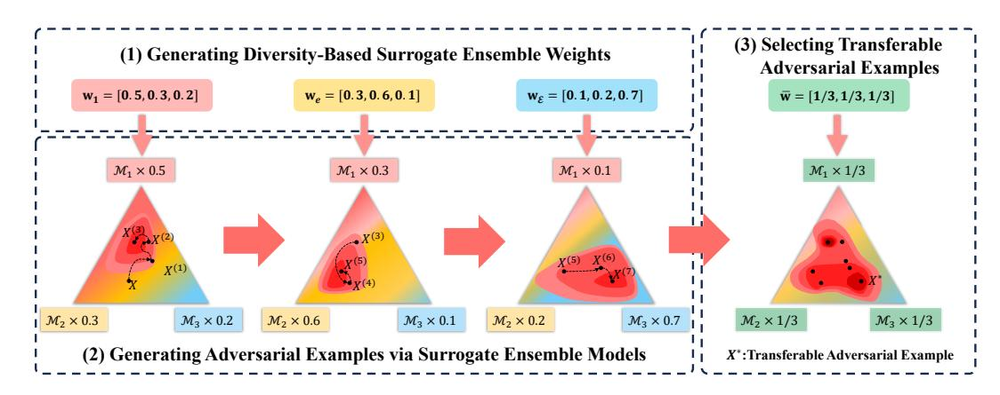
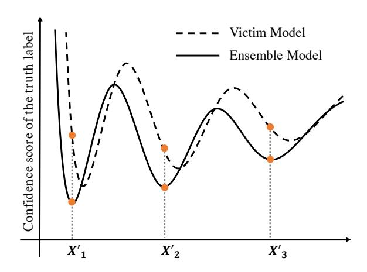
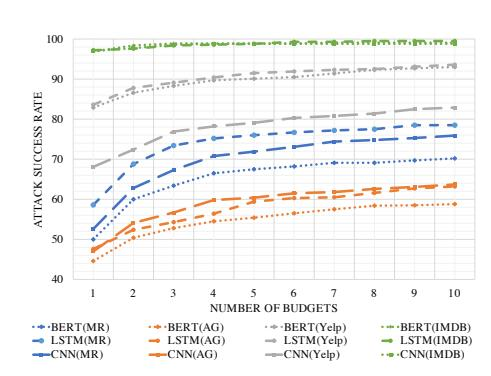

# SEP-Attack: A Simple and Effective Paradigm for Transfer-Based Textual Adversarial Attack

Han Liu Dalian University of Technology Dalian, China liu.han.dut@gmail.com

Zhi Xu Dalian University of Technology Dalian, China xu.zhi.dut@gmail.com

Xiaotong Zhang∗ Dalian University of Technology Dalian, China zxt.dut@hotmail.com

Feng Zhang Peking University Beijing, China fengzhangyvonne@gmail.com

Xiaoming Xu Dalian University of Technology Dalian, China xu.xm.dut@gmail.com

Wei Wang Macao Polytechnic University Macao, China weiwang@mpu.edu.mo

Fenglong Ma The Pennsylvania State University Pennsylvania, United States fenglong@psu.edu

Hong Yu Dalian University of Technology Dalian, China hongyu@dlut.edu.cn

## Abstract

Despite the strong performance of deep neural networks in modern Web and language applications, they remain vulnerable to adversarial attacks, especially transferable attacks that generate adversarial examples using surrogate models without accessing the victim model. Transferable attacks in the text domain are still underexplored, with only a few studies addressing this challenging issue, often with suboptimal results due to equal treatment of submodels or inaccurate estimation of importance scores. To address these challenges, we propose a simple yet effective paradigm for transferbased textual adversarial attack, named SEP-Attack. Specifically, we employ the Determinantal Point Process (DPP) to generate diverse surrogate ensemble weights, representing the transferability of submodels. Using these weights, we introduce a new metric to evaluate prediction confidence scores, which in turn are used to calculate word importance scores and generate adversarial candidates. Finally, we quantify the transferability score for each candidate and select the top ones as the final transferable adversarial examples. Experiments conducted on four datasets and two real-world APIs validate the efficacy of SEP-Attack, significantly outperforming state-of-the-art baselines.

# CCS Concepts

• Computing methodologies → Artificial intelligence; Natural language processing.

# Keywords

Textual Adversarial Attack, Transfer-Based Methods, Determinantal Point Process

∗Corresponding author.

[This work is licensed under a Creative Commons Attribution 4.0 International License.](https://creativecommons.org/licenses/by/4.0) WWW '26, Dubai, United Arab Emirates © 2026 Copyright held by the owner/author(s). ACM ISBN 979-8-4007-2307-0/2026/04 <https://doi.org/10.1145/3774904.3793042>

### ACM Reference Format:

Han Liu, Zhi Xu, Xiaotong Zhang, Feng Zhang, Xiaoming Xu, Wei Wang, Fenglong Ma, and Hong Yu. 2026. SEP-Attack: A Simple and Effective Paradigm for Transfer-Based Textual Adversarial Attack. In Proceedings of the ACM Web Conference 2026 (WWW '26), April 13–17, 2026, Dubai, United Arab Emirates. ACM, New York, NY, USA, [10](#page-9-0) pages. [https://doi.org/10.1145/](https://doi.org/10.1145/3774904.3793042) [3774904.3793042](https://doi.org/10.1145/3774904.3793042)

# 1 Introduction

Deep neural networks (DNNs) and large language models (LLMs) have become the backbone of modern Web-based applications, supporting tasks such as content moderation [\[3,](#page-8-0) [12,](#page-8-1) [15\]](#page-8-2), online recommendation [\[26,](#page-8-3) [36,](#page-8-4) [38\]](#page-8-5), and misinformation detection [\[1,](#page-8-6) [29,](#page-8-7) [39\]](#page-8-8). Despite their widespread adoption and strong performance, growing evidence shows that these models remain highly vulnerable to adversarial attacks [\[6,](#page-8-9) [43\]](#page-8-10). Such vulnerabilities raise serious societal and ethical concerns when models are deployed on the Web, where adversarial attacks can amplify harmful content, evade moderation systems, or trigger biased or misleading decisions. Understanding such risks is vital for building safe and reliable Web AI systems.

Existing adversarial attack methods can be divided into two categories based on the accessibility level of victim models: white-box attacks [\[9,](#page-8-11) [33\]](#page-8-12) and black-box attacks [\[24,](#page-8-13) [45\]](#page-8-14). White-box attacks allow the attacker full access to the victim model, including its architecture, parameters, and training data. Although these attacks are highly idealistic and impractical in most real-world scenarios, they are still valuable in controlled environments such as internal testing and model sharing. In contrast, black-box attacks assume that the attacker has no knowledge of the model's internal workings, which is more realistic in practical applications. Black-box attack methods can be further classified into query-based attacks and transfer-based attacks. Query-based attacks need to frequently query the victim model until an adversarial example is generated, which are probably limited by query restrictions and detection mechanisms. Transfer-based attacks aim to generalize adversarial vulnerabilities across different models without accessing any information of the victim models, making them particularly concerning

Figure 1: The overview of our proposed SEP-Attack framework, which consists of three main components. (1) Generating diversity-based surrogate ensemble weights with the Determinantal Point Process (DPP). (2) Generating adversarial examples via the surrogate ensemble model, with deeper red hues representing lower confidence scores under corresponding weights; and (3) Selecting transferable adversarial examples according transferability scores.

for real-world applications. Most existing transfer-based attacks have primarily focused on computer vision [\[4,](#page-8-15) [11,](#page-8-16) [27,](#page-8-17) [35\]](#page-8-18), where they often achieve their attacks by setting a target function and utilizing gradient descent on a surrogate model. However, these approaches face challenges in text attacks due to the discrete nature of text and variations in tokenization algorithms across different models [\[19,](#page-8-19) [44\]](#page-8-20). This challenging issue is still in its infancy and under-explored in the text domain.

HAWR [\[44\]](#page-8-20) proposes a method to generate adversarial examples by deriving highly-transferable adversarial word replacement rules through analyzing the changes in the ensemble's log-likelihood predictions caused by word substitutions. Ensemble [\[19\]](#page-8-19) generates a transfer-based adversarial example by leveraging TextFooler [\[17\]](#page-8-21) to generate adversarial examples on an ensemble model and subsequently transfer them to the victim model for the attack. However, these methods have several limitations when it comes to generating transferable text adversarial examples. On the other hand, the TextFooler-based approach calculates word importance by removing words from the sentence. This removal alters the context, causing inaccurate importance estimates that compromise the attack success rate.

To address these challenges and to support robustness research for responsible Web AI, we propose SEP-Attack, a Simple yet Effective Paradigm for transfer-based textual adversarial Attack. Specifically, "simple" refers to the straightforward and easily implementable core concept of SEP-Attack. Meanwhile, "effective" indicates that SEP-Attack demonstrates superior performance, significantly outperforming other strong baselines. An overview of SEP-Attack is illustrated in Figure [1.](#page-1-0) In SEP-Attack, we propose to utilize the Determinantal Point Process (DPP) to sample diverse surrogate ensemble weights to represent the levels of the transferability of submodels, resulting in a set of transferable adversarial examples. To address the challenge of accurately calculating word importance, we propose an approach that involves updating the important words and subsequently removing the unimportant ones. This strategy aims to mitigate the issues arising from inaccurate word importance

calculations. Finally, we identify transferable adversarial examples among all the examples generated from the ensemble model. We conduct experiments on four benchmark datasets, two real-world APIs (Alibaba Cloud and Google Cloud), and large language models. The results demonstrate that SEP-Attack achieves a significantly higher attack success rate compared to other strong baselines while also maintaining the lowest query budget cost[1](#page-1-1) .

# 2 Related Work

# 2.1 Query-Based Black-Box Attacks

Query-based black-box attacks aim to generate adversarial samples by querying the black-box victim models. Two main ways to achieve query-based attacks are the soft and hard-label settings. In the soft-label setting, attackers can access the model's output scores (i.e., probability distributions) and use them to design attack algorithms [\[10,](#page-8-22) [17,](#page-8-21) [22,](#page-8-23) [23\]](#page-8-24). For example, DeepWordBug [\[10\]](#page-8-22) focuses on generating character-level perturbations on important words using output scores. TextFooler [\[17\]](#page-8-21) uses output scores to calculate word-level importance and performs attacks by a greedy-based method. TextBugger [\[23\]](#page-8-24) aims to identify important sentences and replace words within these sentences to achieve attack objectives. The scores can also be used to train a surrogate model to achieve the attacks, such as BBA [\[22\]](#page-8-23). Unlike the soft-label scheme, the hardlabel setting only allows attackers to obtain the model's predicted labels [\[25,](#page-8-25) [32,](#page-8-26) [40–](#page-8-27)[42\]](#page-8-28). For instance, LeapAttack [\[41\]](#page-8-29) estimates the position of the decision boundary using a Monte Carlo estimation method and improves the success rate of hard-label adversarial attacks by gradually moving examples closer to the decision boundary. HQA-Attack [\[25\]](#page-8-25), the state-of-the-art model, enhances the success rate of adversarial attacks by finding the transition word, estimating the direction of word vectors and continuously improving the quality of examples. Although query-based approaches have achieved high success rate, they still require a large number of queries to the victim model, which is difficult to achieve in real-world applications.

1The source code is publicly available at https://github.com/ZevineXu/SEP-Attack

### 2.2 Transfer-Based Black-Box Attacks

Transfer-based black-box attacks aim to generate adversarial examples by manipulating gradients [\[8,](#page-8-30) [37\]](#page-8-31) or leveraging surrogate ensembles [\[8,](#page-8-30) [11,](#page-8-16) [19,](#page-8-19) [44\]](#page-8-20) to attack victim models. However, most existing work focuses on image attacks [\[8,](#page-8-30) [8,](#page-8-30) [37\]](#page-8-31), which are not directly applicable to the text domain due to its discrete nature and tokenization variations. Only a few models have been proposed recently in the text domain, which are all ensemble-based transfer attacks. Existing work HAWR [\[44\]](#page-8-20) generates highly-transferable adversarial examples by identifying and applying word replacement rules that significantly alter the predictions of an ensemble of neural text classifiers. These rules are derived by analyzing the changes in log-likelihood caused by word substitutions in the ensemble's predictions, allowing the creation of adversarial examples that can effectively fool multiple models. However, this work ignores semantic differences between different texts, thus leading to a low success rate of attacks for the generated adversarial examples. Another work Ensemble [\[19\]](#page-8-19) generates adversarial examples on the ensemble model based on TextFooler and then performs transfer attacks. This method addresses the issue of conflicts between different tokenization algorithms by employing synonym replacement. However, TextFooler calculates word importance by removing words without considering the problem of semantic changes in the text, resulting in the inaccurate calculation of word importance. Moreover, the TextFooler algorithm can only iterate once on the adversarial examples, which hampers its ability to effectively optimize the generated adversarial examples. Consequently, the success rate of this ensemble attack method is also low.

### 3 The Proposed Paradigm

### 3.1 Problem Formulation

In this work, we focus on the transfer-based adversarial attack which use the surrogate ensemble model M = {M1, · · · ,M�� }, and M�� is the ��-th submodel. Given a text �� = [��1, · · · , ���� , · · · , ����] with the ground truth label ��, where ���� represents the ��-th word and �� denotes the length of��, the goal of this work is to construct a set of potential adversarial examples X′ = {�� ′ 1 , · · · , ��′ �� } using the ensemble model M, where �� is the number of selected adversarial examples. Each potential adversarial example �� ′ �� = [�� ′ 1 , · · · , ��′ �� , · · · , ��′ �� ] is generated by replacing the original word ���� where part-of-speech (POS) is noun, verb, adverb, adjective with a synonym �� ′ in the synonym set S (����). An attack succeeds if any sample �� ′ �� ∈ X′ leads the victim model �� to a wrong prediction, i.e.,

�� (�� ′ �� ) ≠ �� (��), s.t. �� (�� ′ �� , ��) ≤ ��, ∃�� ∈ [1, ��], (1)

where �� (·, ·) is a distance metric that measures the level of perturbation between two texts, and �� is the predefined hyperparameter. Next, we provide the details of constructing potential adversarial examples X′ = {�� ′ 1 , · · · , ��′ �� } using the ensemble model M = {M1, · · · ,M�� }.

### 3.2 Generating Diversity-Based Surrogate Ensemble Weights

Intuitively, the ability to generate adversarial examples for each submodel in M is different. Thus, equally treating them when generating transferable adversarial examples is not reasonable. To enhance the attack success rate, an ideal solution is to learn a set of weights for submodels. However, this is challenging since we cannot query the victim model to obtain any feedback as guidance in optimizing the weights.

To solve this issue, we propose to employ the Determinantal Point Process (DPP) [\[5\]](#page-8-32) to estimate the best subset of weights in the whole weight space. DPP is commonly employed in recommendation systems to sample diverse subsets to generate a set of weights. The aim of diversification is to increase the discrepancy among adversarial examples. Specifically, we first randomly generate a weight space W ∈ R ��×�� , where W���� ∈ [0, 1], �� denotes the size of the space, and each row is a random weight vector for the ensemble model.

We then calculate the weight kernel matrix K = W × W⊤. Subsequently, the DPP algorithm samples a diverse subset based on the following probability formula:

�� (E) = det(KE) det(K) , (2)

where KE is the submatrix of K corresponding to the selected subset E, and �� (E) is the probability of selecting subset E. Intuitively, the largest �� (E) indicates the subset E is the most representative, containing sufficient yet diverse information to represent the entire weight space. Thus, the output of the DPP is the estimated diversitybased weights WE = [w1, · · · , w��] for the ensemble model, where �� is the size of the best representative subset E.

### 3.3 Generating Adversarial Examples via the Surrogate Ensemble Model

In the image domain, perturbations can be easily optimized by gradient-based methods, such as FGSM [\[13\]](#page-8-33) and PGD [\[31\]](#page-8-34). However, these approaches are not easily applicable to text world due to the discrete nature and variations in tokenization algorithms. In the text domain, TextFooler [\[17\]](#page-8-21) tries to overcome this by calculating word importance and sequentially replacing important words to achieve the desired attack. However, accurately determining word importance is difficult because the text undergoes constant changes during the replacement process. To tackle these issues, our proposed model SEP-Attack repeats the following three steps �� times: (1) Determining the replacement order, (2) Updating potential important words, and (3) Removing less important words. Before formally introducing the three steps, we first define the importance score of a text. The pseudocode is shown in Algorithm [1.](#page-3-0)

3.3.1 Confidence Score Calculation. For each weight vector w�� = [�� 1 , · · · ,���� �� ] ∈ WE, we can evaluate the confidence score of a prediction for a given text ��¯ in a weighted manner as follows:

�� (��, ��, ¯ w�� ) = ∑︁�� ��=1 �� ∗ M�� (��, �� ¯ ) − max ′≠�� M�� (��, �� ¯ ′ ) , (3)

where M�� (��, �� ¯ ) denotes the probability score assigned to the ground truth label ��, and M�� is the ��-th submodel. A higher �� value indicates a confident prediction for data ��¯ on label ��. In the context of transfer-based adversarial attacks, our objective is to find a example ��¯ that minimizes the confidence score �� (��, ��, ¯ w�� ). By reducing ��, we aim to decrease the model's confidence in its prediction, thereby increasing the likelihood of a successful attack.

Table 1: Model performance.

| Model   | MR(%) | AG(%) | Yelp(%) | IMDB(%) |
|---------|-------|-------|---------|---------|
| BERT    | 96.7  | 93.0  | 97.1    | 90.9    |
| ALBERT  | 88.8  | 92.8  | 95.7    | 90.5    |
| RoBERTa | 97.8  | 89.7  | 92.0    | 86.4    |
| LSTM    | 83.6  | 89.9  | 94.4    | 86.7    |
| TextCNN | 94.6  | 90.3  | 92.5    | 85.6    |

the BERT, we take ALBERT, RoBERTa, LSTM and TextCNN as the ensemble model.

4.1.3 Baseline. The proposed SEP-Attack is a transfer-based attack approach based on the ensemble model. Thus, we use two ensemble-based methods as the key baselines.

- Ensemble [\[19\]](#page-8-19) is an ensemble-based method that uses TextFooler to generate adversarial examples in surrogate models and transfers them to the victim model.
- HAWR [\[44\]](#page-8-20) is also an ensemble-based method that uses word replacement rulers to generate transferable adversarial examples.

Since ensemble-based methods only query the victim model in the inference stage, we also compare them against six query-based textual adversarial attack methods.

- TextFooler [\[17\]](#page-8-21) is a soft-label method that replaces the original word according to the word importance score.
- DeepWordBug [\[10\]](#page-8-22) is an early work on soft-label attack.
- TextBugger [\[23\]](#page-8-24) is also an early work on soft-label setting.
- BBA [\[22\]](#page-8-23) is recent work on soft-label attack.

Table 2: Comparison of ASR (%) when attacking against BERT, LSTM and TextCNN models.

| Dataset Method  | Budget BERT | LSTM | TextCNN |
|-----------------|-------------|------|---------|
| TextFooler      | 47.1        | 76.1 | 64.6    |
| DeepWordBug     | 37.8        | 50.7 | 45.8    |
| TextBugger      | 45.9        | 62.0 | 54.4    |
| BBA             | 61.7        | 74.7 | 71.9    |
| LeapAttack MR   | 63.1        | 68.0 | 67.7    |
| HQA-Attack      | 61.4        | 67.5 | 70.6    |
| Ensemble        | 19.1        | 26.2 | 22.2    |
| HAWR            | 38.0        | 49.5 | 45.6    |
| SEP-Attack      | 70.2        | 78.5 | 75.9    |
| TextFooler      | 18.8        | 29.4 | 23.1    |
| DeepWordBug     | 23.5        | 44.1 | 36.3    |
| TextBugger      | 27.6        | 50.7 | 45.3    |
| BBA             | 40.5        | 44.3 | 49.2    |
| LeapAttack AG   | 30.4        | 33.6 | 37.6    |
| HQA-Attack      | 33.0        | 36.2 | 36.7    |
| Ensemble        | 12.7        | 6.4  | 16.3    |
| HAWR            | 22.4        | 23.5 | 22.2    |
| SEP-Attack      | 58.8        | 63.2 | 63.7    |
| TextFooler      | 14.8        | 29.7 | 22.5    |
| DeepWordBug     | 27.7        | 48.8 | 48.0    |
| TextBugger      | 45.9        | 54.4 | 62.0    |
| BBA             | 44.0        | 61.4 | 51.3    |
| LeapAttack Yelp | 31.7        | 48.8 | 40.7    |
| HQA-Attack      | 34.4        | 54.3 | 45.1    |
| Ensemble        | 27.5        | 30.0 | 27.0    |
| HAWR            | 42.7        | 52.8 | 52.7    |
| SEP-Attack      | 93.0        | 93.6 | 82.9    |
| TextFooler      | 7.1         | 7.4  | 10.2    |
| DeepWordBug     | 16.5        | 29.6 | 27.3    |
| TextBugger      | 13.6        | 16.4 | 13.4    |
| BBA             | 45.4        | 61.6 | 56.9    |
| LeapAttack IMDB | 26.1        | 36.1 | 30.1    |
| HQA-Attack      | 27.8        | 42.4 | 31.5    |
| Ensemble        | 37.4        | 46.5 | 53.0    |
| HAWR            | 25.9        | 65.7 | 57.7    |
| SEP-Attack      | 99.1        | 99.5 | 98.8    |

- LeapAttack [\[41\]](#page-8-29) is an early work on hard-label setting.
- HQA-Attack [\[25\]](#page-8-25) is an recent work on hard-label setting.

4.1.4 Evaluation Metric. We quantify the attack performance by attack success rate (ASR). The attack success rate is defined as the rate of successfully finding misclassified texts from the original texts that are correctly classified, which directly measures the effectiveness of the attack method. Regarding the query budget, we allocate 100 query opportunities for query-based methods and 10 query opportunities for ensemble-based methods.

4.1.5 Implementation Details. We set �� = 0.15 in Eq. [\(1\)](#page-2-0), the ensemble model size �� = 4, the diversity-based surrogate ensemble weight size �� = 4, the exceed limits �� = 0.2 and the iteration �� = 10 for each w�� . Additionally, we use a restriction coefficient of �� = 0.02. All experiments are implemented on NVIDIA A800 GPUs.

Figure 3: Comparison on ASR(%) in different budget limits.

Table 3: Comparison of ASR (%) when attacking against models which defend with adversarial attacks.

| Victim Method      | Budget AG | IMDB |
|--------------------|-----------|------|
| TextFooler         | 16.0      | 7.6  |
| DeepWordBug        | 27.0      | 22.3 |
| TextBugger         | 29.3      | 14.5 |
| BBA                | 30.0      | 45.2 |
| LeapAttack HotFlip | 27.6      | 23.2 |
| HQA-Attack         | 29.1      | 24.3 |
| Ensemble           | 14.4      | 21.7 |
| HAWR               | 11.6      | 24.8 |
| SEP-Attack         | 33.3      | 85.4 |
| TextFooler         | 19.8      | 4.1  |
| DeepWordBug        | 20.9      | 4.75 |
| TextBugger         | 26.4      | 4.54 |
| BBA                | 39.2      | 37.8 |
| LeapAttack SHIELD  | 28.2      | 19.0 |
| HQA-Attack         | 41.6      | 24.4 |
| Ensemble           | 7.5       | 30.5 |
| HAWR               | 16.1      | 23.9 |
| SEP-Attack         | 47.1      | 97.9 |

### 4.2 Experimental Results

4.2.1 Performance Evaluation Regarding Attack Success Rates. To demonstrate the effectiveness of our method under an extremely low query budget, we conduct attacks on BERT, LSTM, and TextCNN models along with eight baselines. The experimental results are shown in Table [2.](#page-5-2) Despite our method having only one-tenth the number of queries compared to the query-based method, experimental results show that our method outperforms all other methods significantly. In short-text datasets like the AG dataset, when attacking BERT, LSTM, and TextCNN, our method achieves attack success rate improvements of 18.3%, 12.5%, and 14.5%, respectively, compared to the second-ranked method. In long-text datasets, the performance of our method is even more remarkable. For example, on the IMDB dataset, when attacking BERT, LSTM, and TextCNN, our attack success rates are close to 100%, with improvements of 53.7%, 33.8%, and 41.1%, respectively, compared to the secondranked method. This indicates that our method achieves high attack

success rates with a low query budget, demonstrating the effectiveness of our approach.

Figure [3](#page-6-0) illustrates the performance of our method attacking different models on diverse datasets across varying query budgets. The figure shows that our proposed SEP-Attack achieves significant effectiveness even at a query budget of 5, providing further evidences of the efficacy of our method.

4.2.2 Attack Models with Safety Guard Mechanisms. With the development of adversarial attacks, AI security issues gain increasing attention, leading to the emergence of defense methods against adversarial attacks. In order to demonstrate the effectiveness of our attack method in bypassing defense methods, we conduct experiments on attacking defense models. We use HotFlip [\[9\]](#page-8-11) to generate adversarial examples for adversarial training on BERT as the first victim model. As the second victim model, we employ the adversarial defense method form SHIELD [\[21\]](#page-8-43) with BERT as the architecture. We fine-tune these two models on the short text dataset AG and the long text dataset IMDB respectively. HotFlip achieves a refined classification success rate of 91.6% on the AG dataset and 89.6% on the IMDB dataset after fine-tuning BERT. Similarly, Shield achieves a refined classification success rate of 88.0% on both the AG and IMDB datasets after fine-tuning BERT.

The experimental results are presented in Table [3.](#page-6-1) Regardless of whether HotFlip or SHIELD is used as the victim model, the attack success rates of SEP-Attack significantly surpass that of previous methods. In the case of HotFlip, we achieve attack success rate improvements of 3.3%, and 40.2% on the AG and IMDB datasets, respectively. For SHIELD, we observe even greater attack success rate improvements on the AG and IMDB datasets, reaching 5.5% and 60.1%, respectively. Notably, when attacking SHIELD on the IMDB dataset, our attack success rate is 97.9%, achieving a nearperfect rate. These experimental results demonstrate the capability of our method to bypass the limitations of defense models, thereby inspiring the search for more effective adversarial defense methods.

4.2.3 Attack Real-World APIs. Sentiment analysis has widespread applications in the real world. To evaluate the effectiveness of our method in attacking real-world APIs, we conduct experiments targeting Alibaba Cloud and Google Cloud. Due to the limited query volume on both platforms, we compare SEP-Attack with BBA, Leap-Attack, HQA-Attack, Ensemble, and HAWR. We intergrat ALBERT, RoBERTa, LSTM, and TextCNN as the ensemble model and randomly select 100 data points from Yelp for experiments. The results are summarized in Table [4.](#page-7-0) The results clearly indicate that SEP-Attack achieves higher attack success rates than other methods, making it more proficient in attacking real-world APIs.

4.2.4 Attack Large Language Models. With the increasing size and enhanced performance of large language models (LLMs), their susceptibility to adversarial attacks has emerged as a crucial research focus. To evaluate the performance of our model on large language models, we conduct an ensemble-based attack, similar to real-world API attacks, on Meta-Llama-3-8B-Instruct [\[2\]](#page-8-44), Mistral-7B-Instructv0.2 [\[16\]](#page-8-45), and GPT-3.5, using the AG and Yelp datasets to assess their robustness. The classification accuracies of the models are as follows: Llama achieves 81.6% accuracy on AG and 94.2% on Yelp; Mistral achieves 75.0% accuracy on AG and 93.6% on Yelp;

Table 4: Comparison of ASR(%) when attacking against realworld APIs.

| Dataset Method  | Budget Alibaba | Google |
|-----------------|----------------|--------|
| TextBugger      | 56.5           | 17.5   |
| BBA             | 58.7           | 30.9   |
| LeapAttack      | 59.8           | 29.9   |
| HQA-Attack Yelp | 55.4           | 37.1   |
| Ensemble        | 18.6           | 16.5   |
| HAWR            | 9.8            | 18.6   |
| SEP-Attack      | 64.1           | 75.3   |

Table 5: Comparison of ASR(%) when attacking against large language models.

| Victim Method | AG   | Yelp |
|---------------|------|------|
| Ensemble      | 10.3 | 9.1  |
| HAWR Llama    | 18.8 | 12.2 |
| SEP-Attack    | 38.7 | 65.0 |
| Ensemble      | 16.5 | 16.8 |
| HAWR Mistral  | 20.4 | 22.3 |
| SEP-Attack    | 41.6 | 72.9 |
| Ensemble      | 12.8 | 16.3 |
| HAWR ChatGPT  | 15.6 | 14.5 |
| SEP-Attack    | 32.3 | 64.4 |

and GPT-3.5 achieves 82.4% accuracy on AG and 95.0% on Yelp. The experimental results of the attack are presented in Table [5,](#page-7-1) demonstrating that our proposed SEP-Attack method achieves significantly higher attack success rates (ASR) compared to the other two attack methods across all the tested models and datasets. For example, on the Llama model, SEP-Attack achieves an ASR of 38.7% on AG and 65.0% on Yelp, which are much higher than the ASR of Ensemble and HAWR. Similar improvements are observed on Mistral and GPT-3.5, demonstrating the superior capability of SEP-Attack in exploiting LLM vulnerabilities.

4.2.5 Parameter Investigation. In our parameter investigation, we conduct experiments with a query budget of 10 to evaluate the performance of SEP-Attack under low-query-budget constraints. We explore the impact of two key parameters, �� and ��, on the attack success rate. The detailed results are summarized in Tables [6](#page-7-2) and [7.](#page-7-3) For the perturbation budget ��, we find that higher values generally led to better attack success rates but at the cost of increased runtime. Specifically, �� = 0.200 provide a good balance between success rate and efficiency. For the parameter ��, our experiments show that �� = 0.02 achieves better performance than �� = 0, demonstrating the effectiveness of the candidate selection step described in Section [3.4.](#page-4-3) These findings highlight the importance of carefully tuning these parameters to optimize the performance of SEP-Attack under limited query budgets.

4.2.6 Ablation Study and Case Study. In order to demonstrate the effectiveness of each module, we perform ablation studies on the three datasets when attacking BERT. The results are shown in

Table 6: The adversarial attack performance of SEP-Attack with different �� when attacking BERT on AG and Yelp.

| Dataset | 0.175       | 0.200       | 0.225       |
|---------|-------------|-------------|-------------|
|         | ASR Time(s) | ASR Time(s) | ASR Time(s) |
| AG      | 50.2 16     | 58.8 20.6   | 59.6 30     |
| Yelp    | 86.7 207    | 93.0 245.4  | 94.2 289    |

Table 7: The adversarial attack performance of SEP-Attack with different �� when attacking BERT on AG and Yelp.

| Dataset | 0    | 0.01 | 0.02 | 0.03 | 0.05 | 0.1  | 0.2  | 0.3  |
|---------|------|------|------|------|------|------|------|------|
| AG      | 58.4 | 58.6 | 58.8 | 58.8 | 58.2 | 58.6 | 58.4 | 58.4 |
| Yelp    | 93.0 | 92.8 | 93.0 | 92.8 | 92.8 | 93.0 | 92.8 | 92.7 |

Table 8: The ablation study of SEP-Attack when attacking against BERT on different datasets.

Table [8.](#page-7-4) Random Weights refers to the surrogate ensemble weights generated through random sampling. w/o Selecting means that the SEP-Attack without the selecting transferable adversarial examples step. The experimental findings highlight the importance of both the diversity-based weights and the selection of transferable adversarial examples in achieving improved performance. We also list some concrete adversarial examples generated by SEP-Attack, which are shown in Appendix [B.](#page-9-2)

### 5 Conclusion

In this paper, we proposed SEP-Attack, a simple yet effective paradigm for transfer-based textual adversarial attacks, addressing the challenge of transferability in the text domain. Experiments on four datasets and two real-world APIs show that SEP-Attack consistently surpasses state-of-the-art baselines, demonstrating its robustness and practical value. Beyond improving attack performance, this work highlights the need to consider submodel diversity and reliable importance estimation when evaluating the security of Web-facing language models. Our findings provide insights that support building safer and more trustworthy Web AI systems. In future work, we plan to explore the theoretical foundations of SEP-Attack and extend it to other modalities.

# 6 Acknowledgements

This work was supported by National Natural Science Foundation of China (No. 62206038, 62106035), the Strategic Priority Research Program of the Chinese Academy of Sciences (No. XDA0490301), Liaoning Binhai Laboratory Project (No. LBLF-2023-01), Xiaomi Young Talents Program, and the Interdisciplinary Institute of Smart Molecular Engineering, Dalian University of Technology.

### References

- [1] Pir Noman Ahmad, Adnan Muhammad Shah, KangYoon Lee, and Wazir Muhammad. 2026. Misinformation detection on online social networks using pretrained language models. Information Processing and Management 63, 1 (2026), 104342. [2] AI@Meta. 2024. Llama 3 Model Card. (2024). [https://github.com/meta-llama/](https://github.com/meta-llama/llama3/blob/main/MODEL_CARD.md) [llama3/blob/main/MODEL\\_CARD.md](https://github.com/meta-llama/llama3/blob/main/MODEL_CARD.md) [3] Cong Chen, Wei Qu, Si Su, Yukun Feng, and Tao Li. 2025. A comprehensive review of LLM-based content moderation: advancements, challenges, and future directions. Knowledge-Based Systems 330 (2025), 114689. [4] Huanran Chen, Yichi Zhang, Yinpeng Dong, and Jun Zhu. 2024. Rethinking Model Ensemble in Transfer-based Adversarial Attacks. In International Conference on Learning Representations (ICLR). [5] Laming Chen, Guoxin Zhang, and Eric Zhou. 2018. Fast Greedy MAP Inference for Determinantal Point Process to Improve Recommendation Diversity. In Conference on Neural Information Processing Systems (NeurIPS). 5627–5638. [6] Yangyi Chen, Hongcheng Gao, Ganqu Cui, Fanchao Qi, Longtao Huang, Zhiyuan Liu, and Maosong Sun. 2022. Why Should Adversarial Perturbations be Imperceptible? Rethink the Research Paradigm in Adversarial NLP. In Conference on Empirical Methods in Natural Language Processing (EMNLP). 11222–11237. [7] Jacob Devlin, Ming-Wei Chang, Kenton Lee, and Kristina Toutanova. 2019. BERT: Pre-training of Deep Bidirectional Transformers for Language Understanding. In North American Chapter of the Association for Computational Linguistics (NAACL). 4171–4186. [8] Yinpeng Dong, Fangzhou Liao, Tianyu Pang, Hang Su, Jun Zhu, Xiaolin Hu, and Jianguo Li. 2018. Boosting Adversarial Attacks With Momentum. In Computer Vision and Pattern Recognition (CVPR). 9185–9193. [9] Javid Ebrahimi, Anyi Rao, Daniel Lowd, and Dejing Dou. 2018. HotFlip: White-Box Adversarial Examples for Text Classification. In Annual Meeting of the Association for Computational Linguistics (ACL). 31–36. [10] Ji Gao, Jack Lanchantin, Mary Lou Soffa, and Yanjun Qi. 2018. Black-Box Generation of Adversarial Text Sequences to Evade Deep Learning Classifiers. In IEEE Symposium on Security and Privacy (S&P). 50–56. [11] Zhijin Ge, Xiaosen Wang, Hongying Liu, Fanhua Shang, and Yuanyuan Liu. 2023. Boosting Adversarial Transferability by Achieving Flat Local Maxima. In Conference on Neural Information Processing Systems (NeurIPS). [12] Adrián Girón, Javier Huertas-Tato, and David Camacho. 2025. LLM synthetic generation to enhance online content moderation generalization in hate speech scenarios. Computing 107, 7 (2025), 164. [13] Ian J. Goodfellow, Jonathon Shlens, and Christian Szegedy. 2015. Explaining and Harnessing Adversarial Examples. In International Conference on Learning Representations (ICLR). [14] Sepp Hochreiter and Jürgen Schmidhuber. 1997. Long Short-Term Memory. Neural Computation (1997), 1735–1780. [15] Tao Huang. 2025. Content moderation by LLM: from accuracy to legitimacy. Artificial Intelligence Review 58, 10 (2025), 320. [16] Albert Q. Jiang, Alexandre Sablayrolles, Arthur Mensch, Chris Bamford, Devendra Singh Chaplot, Diego de las Casas, Florian Bressand, Gianna Lengyel, Guillaume Lample, Lucile Saulnier, Lélio Renard Lavaud, Marie-Anne Lachaux, Pierre Stock, Teven Le Scao, Thibaut Lavril, Thomas Wang, Timothée Lacroix, and William El Sayed. 2023. Mistral 7B.<abs/2310.06825> [17] Di Jin, Zhijing Jin, Joey Tianyi Zhou, and Peter Szolovits. 2020. Is BERT Really Robust? A Strong Baseline for Natural Language Attack on Text Classification and Entailment. In AAAI Conference on Artificial Intelligence (AAAI). 8018–8025. [18] Yoon Kim. 2014. Convolutional Neural Networks for Sentence Classification. In Conference on Empirical Methods in Natural Language Processing (EMNLP). 1746–1751. [19] Hyun Kwon and Sanghyun Lee. 2023. Ensemble transfer attack targeting text classification systems. Computers & Security 124 (2023), 102944. [20] Zhenzhong Lan, Mingda Chen, Sebastian Goodman, Kevin Gimpel, Piyush Sharma, and Radu Soricut. 2020. ALBERT: A Lite BERT for Self-supervised Learning of Language Representations. In International Conference on Learning Representations (ICLR). [21] Thai Le, Noseong Park, and Dongwon Lee. 2022. SHIELD: Defending Textual Neural Networks against Multiple Black-Box Adversarial Attacks with Stochastic Multi-Expert Patcher. In Annual Meeting of the Association for Computational Linguistics (ACL). 6661–6674. [22] Deokjae Lee, Seungyong Moon, Junhyeok Lee, and Hyun Oh Song. 2022. Query-Efficient and Scalable Black-Box Adversarial Attacks on Discrete Sequential Data via Bayesian Optimization. In International Conference on Machine Learning (ICML). 12478–12497. [23] Jinfeng Li, Shouling Ji, Tianyu Du, Bo Li, and Ting Wang. 2019. TextBugger: Generating Adversarial Text Against Real-world Applications. In Network and Distributed System Security Symposium (NDSS). [24] Linyang Li, Ruotian Ma, Qipeng Guo, Xiangyang Xue, and Xipeng Qiu. 2020. BERT-ATTACK: Adversarial Attack Against BERT Using BERT. In Conference on Empirical Methods in Natural Language Processing (EMNLP). 6193–6202. [25] Han Liu, Zhi Xu, Xiaotong Zhang, Feng Zhang, Fenglong Ma, Hongyang Chen, Hong Yu, and Xianchao Zhang. 2023. HQA-Attack: Toward High Quality Black-Box Hard-Label Adversarial Attack on Text. In Conference on Neural Information Processing Systems (NeurIPS). [26] Xiaodong Liu, Xiao Lin, Yiming Ding, Changcheng Li, Peng Jiang, and Weiran Shen. 2025. Optimizing Revenue through User Coupon Recommendations in Truthful Online Ad Auctions. In The Web Conference (WWW). ACM, 1380–1388. [27] Yanpei Liu, Xinyun Chen, Chang Liu, and Dawn Song. 2017. Delving into Transferable Adversarial Examples and Black-box Attacks. In International Conference on Learning Representations (ICLR). [28] Yinhan Liu, Myle Ott, Naman Goyal, Jingfei Du, Mandar Joshi, Danqi Chen, Omer Levy, Mike Lewis, Luke Zettlemoyer, and Veselin Stoyanov. 2019. RoBERTa: A Robustly Optimized BERT Pretraining Approach. arXiv preprint arXiv:1907.11692 abs/1907.11692 (2019). [29] Zhiwei Liu, Keyi Wang, Zhuo Bao, Xin Zhang, Jiping Dong, Kailai Yang, Mohsinul Kabir, Polydoros Giannouris, Rui Xing, Seongchan Park, Jaehong Kim, Dong Li, Qianqian Xie, and Sophia Ananiadou. 2025. FinNLP-FNP-LLMFinLegal-2025 Shared Task: Financial Misinformation Detection Challenge Task. In International Conference on Computational Linguistics (COLING). 271–276. [30] Andrew L. Maas, Raymond E. Daly, Peter T. Pham, Dan Huang, Andrew Y. Ng, and Christopher Potts. 2011. Learning Word Vectors for Sentiment Analysis. In Annual Meeting of the Association for Computational Linguistics (ACL). 142–150. [31] Aleksander Madry, Aleksandar Makelov, Ludwig Schmidt, Dimitris Tsipras, and Adrian Vladu. 2018. Towards Deep Learning Models Resistant to Adversarial Attacks. In International Conference on Learning Representations (ICLR). OpenReview.net. [32] Rishabh Maheshwary, Saket Maheshwary, and Vikram Pudi. 2021. Generating Natural Language Attacks in a Hard Label Black Box Setting. In AAAI Conference on Artificial Intelligence (AAAI). 13525–13533. [33] Zhao Meng and Roger Wattenhofer. 2020. A Geometry-Inspired Attack for Generating Natural Language Adversarial Examples. In COLING. 6679–6689. [34] Bo Pang and Lillian Lee. 2005. Seeing Stars: Exploiting Class Relationships for Sentiment Categorization with Respect to Rating Scales. In Annual Meeting of the Association for Computational Linguistics (ACL). 115–124. [35] Zeyu Qin, Yanbo Fan, Yi Liu, Li Shen, Yong Zhang, Jue Wang, and Baoyuan Wu. 2022. Boosting the Transferability of Adversarial Attacks with Reverse Adversarial Perturbation. In Conference on Neural Information Processing Systems (NeurIPS). [36] Haoran Tang, Shiqing Wu, Zhihong Cui, Yicong Li, Guandong Xu, and Qing
  - Li. 2025. Model-Agnostic Dual-Side Online Fairness Learning for Dynamic Recommendation. IEEE Transactions on Knowledge and Data Engineering 37, 5 (2025), 2727–2742. [37] Xiaosen Wang and Kun He. 2021. Enhancing the Transferability of Adversarial Attacks Through Variance Tuning. In Computer Vision and Pattern Recognition (CVPR). 1924–1933. [38] Likang Wu, Zhaopeng Qiu, Zhi Zheng, Hengshu Zhu, and Enhong Chen. [n. d.]. Exploring Large Language Model for Graph Data Understanding in Online Job Recommendations. In AAAI Conference on Artificial Intelligence (AAAI), Michael J. Wooldridge, Jennifer G. Dy, and Sriraam Natarajan (Eds.). 9178–9186. [39] Qingzheng Xu, Heming Du, Szymon Lukasik, Tianqing Zhu, Sen Wang, and Xin Yu. 2025. MDAM3 : A Misinformation Detection and Analysis Framework for Multitype Multimodal Media. In The Web Conference (WWW). ACM, 5285–5296. [40] Muchao Ye, Jinghui Chen, Chenglin Miao, Han Liu, Ting Wang, and Fenglong Ma. 2023. PAT: Geometry-Aware Hard-Label Black-Box Adversarial Attacks on Text. In ACM SIGKDD Conference on Knowledge Discovery and Data Mining (KDD). 3093–3104. [41] Muchao Ye, Jinghui Chen, Chenglin Miao, Ting Wang, and Fenglong Ma. 2022. LeapAttack: Hard-Label Adversarial Attack on Text via Gradient-Based Optimization. In ACM SIGKDD Conference on Knowledge Discovery and Data Mining (KDD). 2307–2315. [42] Muchao Ye, Chenglin Miao, Ting Wang, and Fenglong Ma. 2022. TextHoaxer: Budgeted Hard-Label Adversarial Attacks on Text. In AAAI Conference on Artificial Intelligence (AAAI). 3877–3884. [43] Kan Yuan, Di Tang, Xiaojing Liao, XiaoFeng Wang, Xuan Feng, Yi Chen, Menghan Sun, Haoran Lu, and Kehuan Zhang. 2019. Stealthy Porn: Understanding Real-World Adversarial Images for Illicit Online Promotion. In IEEE Symposium on Security and Privacy (S&P). 952–966. [44] Liping Yuan, Xiaoqing Zheng, Yi Zhou, Cho-Jui Hsieh, and Kai-Wei Chang. 2021. On the Transferability of Adversarial Attacks against Neural Text Classifier. In Conference on Empirical Methods in Natural Language Processing (EMNLP). 1612–1625. [45] Zhiyuan Zeng and Deyi Xiong. 2021. An Empirical Study on Adversarial Attack on NMT: Languages and Positions Matter. In Annual Meeting of the Association for Computational Linguistics (ACL). 454–460. [46] Xiang Zhang, Junbo Jake Zhao, and Yann LeCun. 2015. Character-level Convolutional Networks for Text Classification. In Conference on Neural Information Processing Systems (NeurIPS). 649–657.

# A Dataset Description

The detailed dataset information is as follows:

- MR [\[34\]](#page-8-35) is a short movie review dataset for binary sentiment classification.
- AG [\[46\]](#page-8-36) is a news topic classification dataset with four categories.
- Yelp [\[46\]](#page-8-36) is a binary sentiment classification dataset.
- IMDB [\[30\]](#page-8-37) is a movie review dataset for binary sentiment, with longer reviews compared to MR.

# B Case Study

We list some adversarial examples generated by SEP-Attack on MR, AG, Yelp and IMDB datasets which are in Table [9.](#page-9-3) Take the first adversarial example in Table [9](#page-9-3) as an example, just replacing the word "wonderful" with "extraordinaire" can change the prediction from "positive" to "negative", which demonstrates that SEP-Attack can generate an effective adversarial example.

Table 9: Adversarial examples generated by SEP-Attack in different datasets against the BERT model. The substituted original word is in the italics format, and the replacement is the following one.

|      |                | Adversarial    |            | Example   | Change of prediction |
|------|----------------|----------------|------------|-----------|----------------------|
|      | MR: it’s       | weird,         | wonderful  |           |                      |
| (    | extraordinaire | ),             | and        | not       | necessarily          |
| for  | kids.          |                |            |           |                      |
|      |                |                |            |           | Positive → Negative  |
| AG:  |                | unskilled jobs | ( tasks    | )         | to go there          |
| will | be no          | jobs for       |            | unskilled |                      |
|      | workers (      | assistants     | ) in       | britain   | within               |
| 10   | years,         | the leading    |            |           |                      |
|      | employers      | ( employing    |            | ) # 39;   |                      |
|      | organisation   | (              | organisms  | )         | claims today.        |
| the  | prediction     | is             | based      | on        | the growth in        |
|      |                |                |            |           | Bussiness → Sci/Tech |
|      | Yelp: tram     | has            | great (    | whopping  | ) pho ,              |
| and  | enough         | of it          | to feed    | all       | of                   |
|      | pittsburgh     | when           | the        | next (    | follows ) fake       |
| (    | fraudulent     | )              | armageddon |           | rolls around.        |
|      |                |                |            |           | Positive → Negative  |
|      | IMDB:          | focus is an    |            | engaging  | ( implicate )        |
|      | story told     | in urban       | ,          | wwii      | era setting          |
|      | william        | macy           | portrays   | (         | exemplifies )        |
|      | everyman       | who is         | taken      | out       | of his               |
|      | personal       | circumstances  |            | (         | screenplays )        |
| and  |                | challenged (   | disproved  | )         | with                 |
|      | decisions      | testing        | his        | values    | affecting            |
| the  |                | community      | laura      | dern,     | macy and             |
|      | david          | paymer give    | good       | (         | adequate )           |
|      | performances,  | so             | also (     | instead   | )                    |
| the  | good           | supporting     | ( aid      | )         | ensemble             |
|      |                |                |            |           | Positive → Negative  |