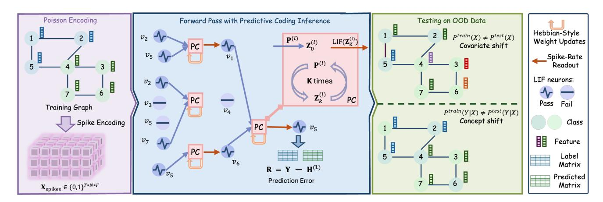
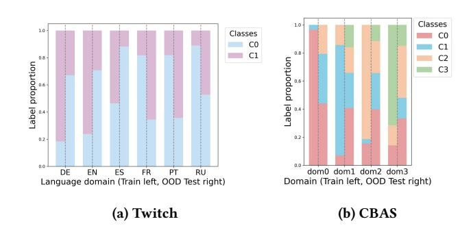
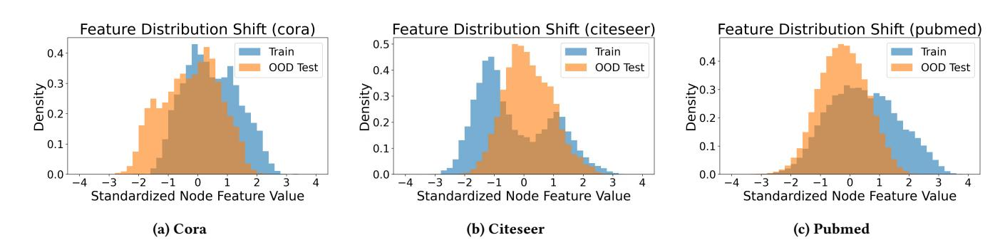
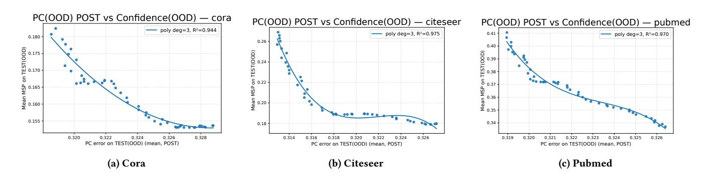
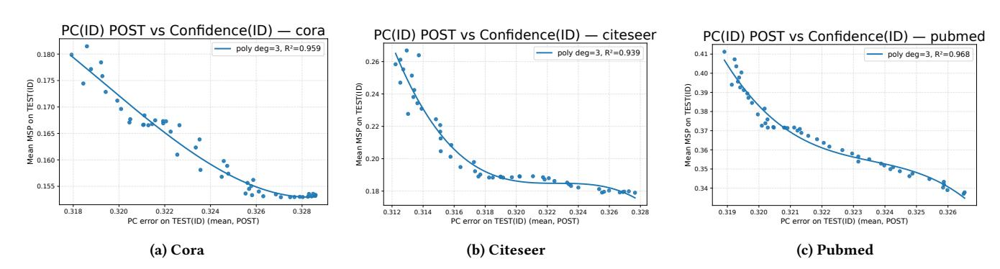
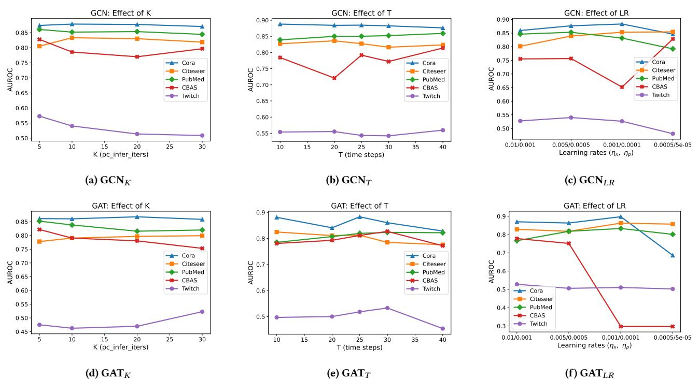

# Spiking Graph Predictive Coding for Reliable OOD Generalization

[Jing Ren](https://orcid.org/0000-0003-0169-1491)∗ RMIT University Melbourne, Australia jing.ren@ieee.org

Jiapeng Du∗ RMIT University Melbourne, Australia s4141788@student.rmit.edu.au

[Bowen Li](https://orcid.org/0009-0007-6470-5607) RMIT University Melbourne, Australia s3890442@student.rmit.edu.au

[Ziqi Xu](https://orcid.org/0000-0003-1748-5801) RMIT University Melbourne, Australia ziqi.xu@rmit.edu.au

Xin Zheng RMIT University Melbourne, Australia xin.zheng2@rmit.edu.au

Hong Jia University of Auckland Auckland, New Zealand hong.jia@auckland.ac.nz

Suyu Ma CSIRO's Data61 Melbourne, Australia suyu.ma@data61.csiro.au

Xiwei Xu CSIRO's Data61 Sydney, Australia xiwei.xu@data61.csiro.au

Feng Xia† RMIT University Melbourne, Australia f.xia@ieee.org

### Abstract

Graphs provide a powerful basis for modeling Web-based relational data, with expressive GNNs to support the effective learning in dynamic web environments. However, real-world deployment is hindered by pervasive out-of-distribution (OOD) shifts, where evolving user activity and changing content semantics alter feature distributions and labeling criteria. These shifts often lead to unstable or overconfident predictions, undermining the trustworthiness required for Web4Good applications. Achieving reliable OOD generalization demands principled and interpretable uncertainty estimation; however, existing methods are largely post-hoc, insensitive to distribution shifts, and unable to explain where uncertainty arises especially in high-stakes settings. To address these limitations, we introduce SpIking GrapH predicTive coding (SIGHT), an uncertainty-aware plug-in graph learning module for reliable OOD Generalization. SIGHT performs iterative, error-driven correction over spiking graph states, enabling models to expose internal mismatch signals that reveal where predictions become unreliable. Across multiple graph benchmarks and diverse OOD scenarios, SIGHT consistently enhances predictive accuracy, uncertainty estimation, and interpretability when integrated with GNNs.

#### CCS Concepts

- Information systems → Web applications; Social networks;
- Networks → Network algorithms.

© 2026 Copyright held by the owner/author(s). ACM ISBN 979-8-4007-2307-0/2026/04 <https://doi.org/10.1145/3774904.3793044>

## Keywords

Trustworthy AI, Uncertainty Estimation, Graph Neural Networks, OOD Detection, Interpretability

#### ACM Reference Format:

Jing Ren, Jiapeng Du, Bowen Li, Ziqi Xu, Xin Zheng, Hong Jia, Suyu Ma, Xiwei Xu, and Feng Xia. 2026. Spiking Graph Predictive Coding for Reliable OOD Generalization . In Proceedings of the ACM Web Conference 2026 (WWW '26), April 13–17, 2026, Dubai, United Arab Emirates. ACM, New York, NY, USA, [12](#page-11-0) pages.<https://doi.org/10.1145/3774904.3793044>

# 1 Introduction

Graphs provide a powerful abstraction for modeling relational dependencies across various Web-related structural data, such as social networks [\[34\]](#page-8-0), recommendation platforms [\[46,](#page-8-1) [52\]](#page-9-0), and knowledge graphs [\[23,](#page-8-2) [50\]](#page-9-1). To effectively model such complex and diverse graphs, graph neural networks (GNNs) have become powerful tools for mining social knowledge, identifying harmful behaviors, and enabling automated decision-making in Web environments [\[5,](#page-8-3) [16,](#page-8-4) [26,](#page-8-5) [44,](#page-8-6) [45\]](#page-8-7). Despite expressive success, graph out-ofdistribution (OOD) becomes a major obstacle for deploying GNNs in practice, when test graphs deviate from the training distribution [\[25,](#page-8-8) [51\]](#page-9-2). For example, in online social networks, users' activity may shift suddenly from routine conversations to emergency reporting or information seeking during extreme weather incidents. These forms of OOD shift make GNNs produce unstable, inaccurate, or overconfident predictions. Relevance to Web4Good. This research problem arises within the scope of responsible AI, aiming to build well-generalized GNNs with robustness, reliability, and transparency, leading to essential benefits for deploying graph learning systems in socially critical applications, such as risk detection, content governance, and public-safety interventions [\[15,](#page-8-9) [22,](#page-8-10) [41\]](#page-8-11).

Reliable graph OOD generalization aims to ensure that models can adapt to shifted distributions while producing well-calibrated uncertainty estimates that reflect prediction reliability. Existing approaches of model uncertainty estimation for GNNs mainly face two critical challenges: C1: Limited capability under OOD shifts, where most methods are post-hoc and decoupled from the inference

∗Both authors contributed equally to this research.

†Corresponding author.

[This work is licensed under a Creative Commons Attribution 4.0 International License.](https://creativecommons.org/licenses/by/4.0) WWW '26, Dubai, United Arab Emirates

process [\[40,](#page-8-12) [42\]](#page-8-13), so that the estimated uncertainty cannot explicitly adapt to distributional shifts; C2: Limited interpretability of uncertainty sources, where most methods lacks insight into where uncertainty arises, making it hard to determine when predictions should be trusted or overridden [\[20,](#page-8-14) [38\]](#page-8-15). Recent progress in incorporating the neuroscience concept of predictive coding (PC) [\[33\]](#page-8-16) into neural network design has demonstrated improved model calibration performance [\[2\]](#page-8-17). However, directly integrating PC with traditional GNNs is challenging under OOD scenarios, as dense synchronous updates conflict with PC's iterative, eventdriven dynamics. Hence, addressing these challenges is essential for building trustworthy and socially aligned graph learning systems in dynamic web environments [\[3,](#page-8-18) [12\]](#page-8-19).

In light of this, we propose a novel framework of SpIking GrapH predicTive coding, dubbed SIGHT, which enables predictive coding on graphs to operate through sparse and asynchronous spiking dynamics that naturally support local error correction and biologically inspired inference. Specifically, our proposed SIGHT contains two essential components: (1) Predictive coding module, which embeds predictive coding dynamics directly into the inference process, enabling uncertainty to emerge from the model's internal errorcorrection trajectory (addressing C1). (2) Spiking error-propagation mechanism, which exposes interpretable internal signals at each inference step. These sparse and asynchronous spikes explicitly reveal where and how the model struggles to reconcile conflicting information across the graph (addressing C2). SIGHT serves as an uncertainty-aware plug-in module for graph learning, designed to support reliable OOD generalization while maintaining computational efficiency and intrinsic interpretability.

- In summary, the contributions of this work are presented below:
- Practical Research Problem. We focus on the GNN model uncertainty estimation problem under the practical graph OOD scenarios, contributing to developing more robust, reliable, and interpretable predictions.
- Novel Framework. We first develop SIGHT, a lightweight plugin GNN uncertainty estimation model, which integrates spiking neural dynamics with predictive coding to perform iterative, error-driven corrections on graph predictions, offering transparent interpretability for uncertainty sources with accountable decision-making.
- Extensive Experiments. We conduct experiments across multiple benchmarks and GNN backbones, showing that our proposed SIGHT achieves superior OOD generalization ability and more accurate uncertainty estimation performance.

# 2 Related work

Graph OOD Generalization and Uncertainty Estimation. OOD Generalization and uncertainty estimation have become increasingly important in graph learning, especially as high-stakes social systems rely on AI models to analyze relational data collected from dynamic and often unstable environments [\[21,](#page-8-20) [43\]](#page-8-21). In real-world web settings, distribution shifts frequently arise due to changes in node attributes, evolving interaction patterns (i.e., covariate shift), or shifting societal contexts that alter the relationship between features and labels (i.e., concept shift) [\[1,](#page-8-22) [21,](#page-8-20) [24,](#page-8-23) [25\]](#page-8-8). These shifts can substantially degrade model reliability, leading to misleading

predictions or masking critical uncertainty in decisions that affect public welfare and vulnerable communities. Conventional GNNs remain particularly susceptible to these challenges, as they are typically trained to fit the observed distribution and lack principled mechanisms to detect, express, or reason about uncertainty under shift [\[43,](#page-8-21) [47–](#page-8-24)[49,](#page-9-3) [51\]](#page-9-2). Consequently, their predictions are often overconfident and provide limited insight into when and why the model struggles, hindering meaningful interpretability and reducing trustworthiness in web applications.

Uncertainty Estimation. Existing approaches largely fall into two categories: post-hoc calibration [\[10,](#page-8-25) [14,](#page-8-26) [18,](#page-8-27) [41\]](#page-8-11), which adjusts confidence after training, and intrinsic estimation techniques [\[37,](#page-8-28) [38\]](#page-8-15), which modify training to yield better-calibrated predictions. Posthoc calibration models, such as temperature scaling [\[10\]](#page-8-25), Bayesian graph models [\[7\]](#page-8-29), and deep ensembles [\[19\]](#page-8-30), improve the alignment between predicted probabilities and empirical correctness by adjusting model confidence after training, but they often fail under distribution shifts. By contrast, [\[38\]](#page-8-15) propose an intrinsic method, G-ΔUQ, which modifies the training process to produce calibrated predictions. However, these approaches offer limited explanation of where uncertainty originates, despite the fact that such interpretability is critical for trustworthy deployment in high-stake settings.

Predictive Coding. PC is a neurobiological theory proposing that the brain continually generates top-down predictions of sensory input, while bottom-up signals convey only the prediction errors, thereby driving perception and learning [\[4,](#page-8-31) [33\]](#page-8-16). This biologically inspired alternative to backpropagation (BP) [\[6,](#page-8-32) [35\]](#page-8-33) has been applied in generative modeling [\[28\]](#page-8-34), continual learning [\[30\]](#page-8-35), reinforcement learning [\[29\]](#page-8-36), graph learning [\[2\]](#page-8-17), and arbitrary network learning [\[36\]](#page-8-37). Moreover, [\[2\]](#page-8-17) find that replacing traditional BP in GNNs with PC can achieve better calibration than traditional GNNs in ID scenarios. However, predictive coding has not yet been explored in shifted graph environments where generalization ability, reliable decision-making, and uncertainty transparency are essential for deployment in high-stakes social systems.

# 3 Methodology

In this paper, we propose a flexible framework for spiking graph predictive coding, dubbed SIGHT, for reliable uncertainty estimation in GNN-based classification. Figure [1](#page-2-0) illustrates the overall framework of SIGHT. Specifically, SIGHT performs uncertainty-aware graph learning by integrating spiking dynamics with predictive coding. We first encode continuous node features into biologically plausible spike trains using Poisson encoding, and then conduct a forward pass through iterative predictive coding inference, where node states are refined via local mismatch correction. The resulting spike trains are aggregated through spike-rate readout to obtain stable representations, and model parameters are updated using local Hebbian-style rules driven by prediction errors, enabling efficient, interpretable, and OOD-sensitive learning

## 3.1 Preliminary

Notations. We consider a graph G = (V, E) composed of a node set V and an edge set E, where |V | = �� and the graph is represented by an adjacency matrix A ∈ R �� ×�� . Each node ���� ∈ V

Table 1: Node classification accuracy and uncertainty on ID and OOD datasets with the GCN backbone. Best results are in bold, and SIGHT is marked with . Results with the GAT backbone are in Table [6.](#page-10-0)

| Method          |         | ID    | Accuracy | ↑ OOD |       | ID      | ECE ↓ | OOD     |       | ID      | NLL ↓ | OOD     |       | ID      | BS ↓  | OOD     |      | ID    | AUROC | ↑ OOD |
|-----------------|---------|-------|----------|-------|-------|---------|-------|---------|-------|---------|-------|---------|-------|---------|-------|---------|------|-------|-------|-------|
| GCN Cora        | 89.8    | ± 0.3 | 43.5     | ± 5.2 | 0.019 | ± 0.003 | 0.391 | ± 0.071 | 0.318 | ± 0.008 | 2.595 | ± 0.512 | 0.150 | ± 0.004 | 0.919 | ± 0.103 | 88.7 | ± 0.3 | 59.9  | ± 3.7 |
| +G- Δ           | UQ 91.3 | ± 0.4 | 80.1     | ± 4.7 | 0.019 | ± 0.004 | 0.053 | ± 0.031 | 0.270 | ± 0.018 | 0.574 | ± 0.149 | 0.130 | ± 0.007 | 0.288 | ± 0.068 | 87.3 | ± 1.2 | 81.5  | ± 2.8 |
| +SIGHT Citeseer | 93.2    | ± 0.6 | 95.6     | ± 0.2 | 0.015 | ± 0.002 | 0.009 | ± 0.002 | 0.241 | ± 0.021 | 0.153 | ± 0.010 | 0.105 | ± 0.009 | 0.068 | ± 0.003 | 86.7 | ± 1.2 | 89.8  | ± 1.5 |
| GCN             | 82.1    | ± 0.4 | 46.6     | ± 1.9 | 0.026 | ± 0.003 | 0.334 | ± 0.027 | 0.503 | ± 0.012 | 1.838 | ± 0.051 | 0.252 | ± 0.006 | 0.793 | ± 0.026 | 84.1 | ± 0.8 | 74.1  | ± 1.6 |
| +G- Δ           | UQ 81.6 | ± 0.4 | 71.0     | ± 4.2 | 0.021 | ± 0.008 | 0.066 | ± 0.027 | 0.531 | ± 0.037 | 0.889 | ± 0.145 | 0.263 | ± 0.010 | 0.416 | ± 0.056 | 82.2 | ± 1.6 | 76.5  | ± 1.3 |
| +SIGHT Pubmed   | 86.6    | ± 0.7 | 91.2     | ± 0.4 | 0.028 | ± 0.006 | 0.024 | ± 0.004 | 0.452 | ± 0.023 | 0.307 | ± 0.016 | 0.204 | ± 0.010 | 0.136 | ± 0.008 | 80.1 | ± 1.1 | 83.4  | ± 0.8 |
| GCN             | 88.0    | ± 0.1 | 73.7     | ± 1.9 | 0.008 | ± 0.001 | 0.146 | ± 0.028 | 0.306 | ± 0.001 | 0.960 | ± 0.081 | 0.173 | ± 0.000 | 0.411 | ± 0.028 | 85.2 | ± 0.3 | 72.3  | ± 1.5 |
| +G- Δ           | UQ 91.3 | ± 0.2 | 83.8     | ± 0.7 | 0.006 | ± 0.001 | 0.090 | ± 0.009 | 0.236 | ± 0.002 | 0.668 | ± 0.048 | 0.129 | ± 0.002 | 0.263 | ± 0.013 | 86.3 | ± 0.4 | 74.2  | ± 0.3 |
| +SIGHT Twitch   | 90.0    | ± 0.1 | 90.1     | ± 0.2 | 0.009 | ± 0.001 | 0.006 | ± 0.001 | 0.275 | ± 0.001 | 0.275 | ± 0.004 | 0.149 | ± 0.001 | 0.148 | ± 0.002 | 85.5 | ± 0.4 | 85.1  | ± 0.2 |
| GCN             | 60.7    | ± 9.0 | 57.5     | ± 4.1 | 0.129 | ± 0.066 | 0.046 | ± 0.028 | 0.685 | ± 0.006 | 0.683 | ± 0.007 | 0.492 | ± 0.006 | 0.490 | ± 0.008 | 59.5 | ± 4.3 | 49.2  | ± 3.3 |
| +G- Δ           | UQ 64.8 | ± 9.9 | 58.3     | ± 2.9 | 0.163 | ± 0.067 | 0.065 | ± 0.024 | 0.690 | ± 0.021 | 0.687 | ± 0.009 | 0.497 | ± 0.021 | 0.494 | ± 0.009 | 58.0 | ± 9.1 | 45.4  | ± 1.5 |
| +SIGHT          | 59.3    | ± 6.6 | 60.6     | ± 1.4 | 0.077 | ± 0.033 | 0.039 | ± 0.009 | 0.676 | ± 0.035 | 0.671 | ± 0.005 | 0.483 | ± 0.033 | 0.478 | ± 0.005 | 56.1 | ± 6.9 | 52.2  | ± 3.9 |
| GCN CBAS        | 77.0    | ± 4.9 | 69.6     | ± 4.9 | 0.095 | ± 0.025 | 0.116 | ± 0.007 | 0.596 | ± 0.032 | 0.840 | ± 0.026 | 0.327 | ± 0.025 | 0.432 | ± 0.022 | 77.5 | ± 5.0 | 71.6  | ± 2.6 |
| +G- Δ           | UQ 76.4 | ± 5.2 | 65.1     | ± 2.8 | 0.125 | ± 0.018 | 0.131 | ± 0.039 | 0.611 | ± 0.058 | 0.881 | ± 0.043 | 0.337 | ± 0.036 | 0.461 | ± 0.031 | 77.4 | ± 6.4 | 66.9  | ± 7.4 |
| +SIGHT          | 93.9    | ± 2.2 | 76.4     | ± 2.8 | 0.071 | ± 0.021 | 0.086 | ± 0.020 | 0.241 | ± 0.067 | 0.746 | ± 0.075 | 0.114 | ± 0.034 | 0.363 | ± 0.032 | 81.6 | ± 4.9 | 73.0  | ± 1.8 |

### 3.4 Spike-Rate Readout

We adopt LIF neurons due to their biological plausibility and ability to capture temporal dynamics with lightweight, event-driven computation. Since each LIF neuron [\[8\]](#page-8-40) produces binary spikes, we extract rate codes by averaging across �� timesteps

H (��) = 1 �� ∑︁�� ��=1 Z (��) , (5)

where Z ∈ {0, 1} �� ×���� is the spike matrix at timestep ��. These rate codes provide stable representations for downstream prediction and learning.

# 3.5 Local Hebbian-Style Weight Updates

Local Hebbian updates allow SIGHT to perform biologically plausible, computationally efficient, and interpretable error-driven learning, without requiring global backpropagation. They align naturally with predictive coding dynamics and support event-driven spiking computation during OOD inference. At the top layer ��, the prediction error is defined as

R (��) = Y − H (��) , (6)

where Y is the one-hot label matrix.

For each layer ��, weights are updated as ΔW(��) ∝ (H (��−1) ) ⊤R (��) This rule couples presynaptic rates H (��−1) with postsynaptic residuals R (��) , implementing a biologically plausible outer-product Hebbian update. Crucially, no backpropagated error is required and each layer learns from its own residuals.

# 3.6 Computational Complexity Analysis

We conduct energy efficiency analysis and time complexity analysis.

Energy Efficiency Analysis. Spiking implementations introduce event-driven sparsity with only a fraction �� ≪ 1 of neurons fire per timestep. The effective cost per timestep is therefore O ��|E |����−1 + �������� . This makes SIGHT well-suited for neuromorphic hardware, where multiplications are replaced by accumulations triggered by spikes, reducing both latency and power consumption.

Time Complexity. For each layer�� with input dimension ����−1 and output dimension���� , a single graph convolution requires O |E |����−1+ ������ , where |E | is the number of edges. Predictive coding inference introduces an additional factor of �� inner iterations per layer. Thus, the per-layer cost is O ��(|E |����−1 +������) . Over �� layers and�� Poisson timesteps, the total complexity is O ���� Í�� ��=1 (|E |����−1 + ������) In practice, �� and �� are small constants, so the overhead remains linear in |E | and ��.

Comparison with Backpropagation. Backpropagation requires gradient chaining across all layers and timesteps, incurring O (���� ) memory and repeated backward passes. SIGHT avoids this by relying on local Hebbian updates ΔW(��) ∝ (H(��−1) ) ⊤R (��) , which only requires forward states and local residuals. This significantly reduces both runtime constants and memory footprint.

SIGHT achieves comparable asymptotic complexity to conventional GNNs while avoiding the heavy memory burden of backpropagation. Event-driven sparsity further improves efficiency, enabling scalable, energy-aware training and inference for large graphs and safety-critical applications.

# 4 Experiments

We conduct extensive experiments to evaluate SIGHT on five benchmark datasets. Our evaluation considers both node classification accuracy and the reliability of uncertainty estimation in ID and OOD scenarios. Additional experimental results are provided in Appendix [A.3.](#page-9-4)

Figure 2: Comparison of label distribution between training and testing sets on Twitch and CBAS.

Table 2: Statistics of the experimental datasets.

| Dataset  | # Nodes | # Edges | # Classes | # Features | Shift Type |
|----------|---------|---------|-----------|------------|------------|
| Cora     | 2,708   | 5,429   | 7         | 1,433      | Covariate  |
| Citeseer | 3,327   | 4,732   | 6         | 3,703      | Covariate  |
| Pubmed   | 19,717  | 44,338  | 3         | 500        | Covariate  |
| Twitch   | 34120   | 892346  | 2         | 128        | Concept    |
| CBAS     | 700     | 3962    | 4         | 4          | Concept    |

### 4.1 Experimental Setup

Datasets. In this paper, the experiments are conducted on five node classification datasets, i.e., Cora, Citeseer, Pubmed, Twitch, and CBAS. We evaluate SIGHT under two types of distribution shifts: covariate shift and concept shift. For citation networks (i.e., Cora, Citeseer, and PubMed), we apply covariate shift by following a commonly used benchmark [\[43\]](#page-8-21). Specifically, the original node labels retain while synthetically generating spurious node features to induce distribution shifts between the ID and OOD datasets, i.e., �� train (��) ≠ �� test(��) but �� train (�� |��) = �� test(�� |��). In contrast, for Twitch and CBAS [\[9\]](#page-8-41), we apply concept shift by altering the conditional distribution while keeping the input distribution stable, i.e., �� train (�� |��) ≠ �� test(�� |��).

For all datasets, we follow the dataset splits in [\[42\]](#page-8-13) and [\[9\]](#page-8-41) for training, validation, ID and OOD testing. More details of the dataset statistics are shown in Table [2,](#page-4-0) and the label distribution between training and testing sets are shown in Figure [3](#page-5-0) for covariate shift of Cora, Citeseer, and Pubmed, and Figure [2](#page-4-1) for concept shift of Twitch and CBAS.

Baselines. We adopt GCN [\[17\]](#page-8-38) and GAT [\[39\]](#page-8-39) as backbones since they form the foundational frameworks of most GNN models and are widely recognized as important and representative architectures in graph learning. In addition, we consider G-ΔUQ [\[38\]](#page-8-15), a recently proposed framework for uncertainty quantification on graphs. G-ΔUQ introduces graph-specific anchoring strategies that regularise the predictive distribution, thereby improving intrinsic uncertainty estimates. Unlike standard post-hoc calibration, it integrates uncertainty modelling directly into the training objective, making it a strong representative of training-based approaches. Finally, we also demonstrate that the combination of our framework with different post-hoc calibration models can further enhance calibration.

In our experiments, we adopt the post-hoc calibration models following [\[38\]](#page-8-15). Here is an introduction to these post-hoc strategies used in our experiments:

- CaGCN [\[41\]](#page-8-11) leverages the graph structure and an auxiliary GCN to generate node-wise temperatures.
- Dirichlet calibration [\[18\]](#page-8-27) models calibrated outputs with a Dirichlet distribution, capturing inter-class dependency in probability adjustment.
- Ensemble temperature scaling (ETS) [\[53\]](#page-9-5) extends this idea by combining multiple temperature-scaled models for improved flexibility.
- GATS [\[14\]](#page-8-26) further incorporates graph attention to capture the influence of neighboring nodes when learning these temperatures.
- Multi-class isotonic regression (IRM) [\[53\]](#page-9-5) applies non-parametric isotonic regression to better capture non-linear calibration mappings.
- Order-invariant calibration [\[32\]](#page-8-42) enforces invariance to label permutations, ensuring consistent probability estimates across classes.
- Spline [\[11\]](#page-8-43) fits smooth spline functions to adjust predicted probabilities.
- Vector scaling (VS) [\[10\]](#page-8-25) learns class-specific scaling parameters, allowing heterogeneous calibration across classes.

Evaluation Metrics. We evaluate performance using accuracy alongside four complementary calibration-oriented metrics: expected calibration error (ECE) [\[10\]](#page-8-25), negative log-likelihood (NLL), Brier Score (BS), and area under the receiver operating characteristic curve (AUROC). Specifically, ECE measures the discrepancy between predicted confidence and empirical accuracy, reflecting the overall calibration quality; NLL assesses how well the predicted probability distribution aligns with the true labels, penalizing overconfident wrong predictions; Brier Score quantifies the mean squared difference between predicted probabilities and actual outcomes, combining both calibration and refinement aspects; and AUROC evaluates the model's ability to distinguish between positive and negative samples, serving as a threshold-independent indicator of discriminative reliability. Details of how the metrics are calculated are introduced in Appendix [A.2.](#page-9-6)

Implementation. SIGHT is implemented with three layers of spiking graph convolution, each followed by predictive coding inference with �� = 20 iterations. Input node features are encoded into Poisson spike trains with �� = 25 time steps, and hidden dimensions are set to 128–128–64. For Cora, Citeseer, and PubMed, we use 500 training epochs with early stopping (patience = 100); for CBAS and Twitch, we use 1000 epochs with patience = 200. The learning rates are set to ���� = 0.005 and ���� = 0.0005 for Cora, Citeseer, PubMed, and CBAS, while higher rates ���� = 0.01 and ���� = 0.001 are used for Twitch. Each experiment is repeated with five random seeds for statistical robustness.

All experiments are conducted on a cloud server equipped with a single NVIDIA vGPU (48 GB memory) and 20 vCPUs (Intel Xeon Platinum 8470), with 90 GB system memory. The software environment includes Ubuntu 20.04, Python 3.8, PyTorch 2.0, PyTorch Geometric, snnTorch, and CUDA 11.8. We train models in a full-batch

Figure 3: Comparison of feature distribution between training and testing sets on Cora, Citeseer, and Pubmed.

Table 3: Accuracy and ECE under distribution shifts for different post-hoc calibration models using GCN and GAT backbones, w/o and w/ SIGHT ( ). ✗ denotes no post-hoc calibration.

| Model            | w/o  | SIGHT | Accuracy w/ | ↑ SIGHT | GCN w/o | SIGHT   | ECE ↓ w/ | SIGHT   | w/o  | SIGHT | Accuracy w/ | ↑ SIGHT | GAT w/o | SIGHT   | ECE ↓ w/ | SIGHT   |
|------------------|------|-------|-------------|---------|---------|---------|----------|---------|------|-------|-------------|---------|---------|---------|----------|---------|
| ✗                | 43.5 | ± 5.2 | 95.6        | ± 0.2   | 0.391   | ± 0.071 | 0.009    | ± 0.002 | 67.4 | ± 4.1 | 96.3        | ± 0.7   | 0.164   | ± 0.026 | 0.008    | ± 0.002 |
| CAGCN            | 40.9 | ± 3.3 | 95.6        | ± 0.2   | 0.439   | ± 0.081 | 0.037    | ± 0.019 | 67.4 | ± 4.1 | 95.8        | ± 0.7   | 0.255   | ± 0.031 | 0.042    | ± 0.022 |
| Dirichlet Cora   | 42.1 | ± 4.4 | 95.5        | ± 0.1   | 0.412   | ± 0.039 | 0.012    | ± 0.001 | 65.9 | ± 3.0 | 96.6        | ± 0.4   | 0.174   | ± 0.024 | 0.009    | ± 0.003 |
| ETS              | 42.1 | ± 5.7 | 95.6        | ± 0.2   | 0.419   | ± 0.055 | 0.009    | ± 0.001 | 67.0 | ± 3.9 | 95.2        | ± 1.0   | 0.176   | ± 0.017 | 0.011    | ± 0.003 |
| GATS             | 42.5 | ± 6.2 | 95.4        | ± 0.3   | 0.433   | ± 0.085 | 0.051    | ± 0.020 | 66.9 | ± 4.2 | 96.5        | ± 0.5   | 0.262   | ± 0.042 | 0.061    | ± 0.039 |
| IRM              | 41.8 | ± 4.4 | 95.4        | ± 0.2   | 0.434   | ± 0.045 | 0.009    | ± 0.001 | 67.4 | ± 4.1 | 96.6        | ± 0.3   | 0.188   | ± 0.021 | 0.008    | ± 0.001 |
| Order            | 41.1 | ± 3.9 | 95.5        | ± 0.1   | 0.407   | ± 0.031 | 0.012    | ± 0.005 | 66.6 | ± 3.8 | 96.4        | ± 0.3   | 0.179   | ± 0.025 | 0.009    | ± 0.002 |
| Spline           | 41.4 | ± 4.1 | 95.5        | ± 0.2   | 0.427   | ± 0.043 | 0.286    | ± 0.003 | 66.1 | ± 2.7 | 96.1        | ± 0.8   | 0.178   | ± 0.022 | 0.287    | ± 0.016 |
| VS               | 42.7 | ± 5.8 | 95.4        | ± 0.3   | 0.419   | ± 0.040 | 0.007    | ± 0.001 | 67.0 | ± 3.9 | 96.8        | ± 0.5   | 0.176   | ± 0.027 | 0.007    | ± 0.003 |
| ✗                | 46.6 | ± 1.9 | 91.2        | ± 0.4   | 0.334   | ± 0.027 | 0.024    | ± 0.004 | 46.6 | ± 1.9 | 93.4        | ± 0.2   | 0.334   | ± 0.027 | 0.028    | ± 0.003 |
| CAGCN Citeseer   | 46.9 | ± 2.1 | 90.9        | ± 0.2   | 0.448   | ± 0.057 | 0.036    | ± 0.008 | 66.5 | ± 3.2 | 92.7        | ± 0.2   | 0.257   | ± 0.027 | 0.041    | ± 0.008 |
| Dirichlet        | 47.1 | ± 2.0 | 90.9        | ± 0.3   | 0.333   | ± 0.028 | 0.025    | ± 0.002 | 66.3 | ± 3.1 | 92.8        | ± 0.5   | 0.123   | ± 0.023 | 0.029    | ± 0.006 |
| ETS              | 46.7 | ± 1.9 | 90.6        | ± 0.4   | 0.335   | ± 0.026 | 0.025    | ± 0.004 | 66.4 | ± 3.3 | 93.1        | ± 0.5   | 0.132   | ± 0.025 | 0.036    | ± 0.004 |
| GATS             | 47.0 | ± 2.1 | 90.9        | ± 0.2   | 0.459   | ± 0.050 | 0.072    | ± 0.011 | 67.1 | ± 3.4 | 93.3        | ± 0.3   | 0.293   | ± 0.031 | 0.052    | ± 0.003 |
| IRM              | 46.7 | ± 1.9 | 90.7        | ± 0.2   | 0.330   | ± 0.029 | 0.027    | ± 0.003 | 66.6 | ± 3.2 | 92.7        | ± 0.6   | 0.126   | ± 0.027 | 0.024    | ± 0.002 |
| Order            | 47.2 | ± 2.5 | 90.9        | ± 0.2   | 0.317   | ± 0.024 | 0.024    | ± 0.004 | 67.2 | ± 3.3 | 93.1        | ± 0.1   | 0.126   | ± 0.014 | 0.027    | ± 0.003 |
| Spline           | 46.8 | ± 2.0 | 90.9        | ± 0.1   | 0.315   | ± 0.026 | 0.173    | ± 0.002 | 66.3 | ± 3.0 | 92.7        | ± 0.7   | 0.125   | ± 0.029 | 0.177    | ± 0.002 |
| VS               | 46.9 | ± 2.1 | 90.7        | ± 0.4   | 0.334   | ± 0.035 | 0.021    | ± 0.002 | 66.2 | ± 2.9 | 92.8        | ± 0.1   | 0.125   | ± 0.020 | 0.024    | ± 0.003 |
| ✗                | 73.7 | ± 1.9 | 90.1        | ± 0.2   | 0.146   | ± 0.028 | 0.006    | ± 0.001 | 73.7 | ± 1.9 | 85.7        | ± 0.3   | 0.146   | ± 0.028 | 0.011    | ± 0.002 |
| CAGCN Pubmed     | 74.8 | ± 1.9 | 90.1        | ± 0.2   | 0.074   | ± 0.017 | 0.037    | ± 0.013 | 77.4 | ± 2.5 | 85.6        | ± 0.2   | 0.113   | ± 0.043 | 0.052    | ± 0.022 |
| Dirichlet        | 74.2 | ± 1.6 | 90.3        | ± 0.2   | 0.134   | ± 0.024 | 0.009    | ± 0.001 | 77.0 | ± 1.8 | 85.6        | ± 0.1   | 0.106   | ± 0.016 | 0.017    | ± 0.003 |
| ETS              | 74.9 | ± 1.9 | 90.2        | ± 0.2   | 0.125   | ± 0.029 | 0.007    | ± 0.001 | 77.2 | ± 2.3 | 85.8        | ± 0.4   | 0.104   | ± 0.021 | 0.010    | ± 0.003 |
| GATS             | 73.8 | ± 1.7 | 90.2        | ± 0.1   | 0.118   | ± 0.033 | 0.059    | ± 0.019 | 77.3 | ± 2.4 | 85.9        | ± 0.2   | 0.129   | ± 0.025 | 0.079    | ± 0.025 |
| IRM              | 74.2 | ± 1.5 | 90.2        | ± 0.2   | 0.141   | ± 0.021 | 0.005    | ± 0.001 | 77.2 | ± 1.9 | 85.5        | ± 0.4   | 0.114   | ± 0.022 | 0.007    | ± 0.002 |
| Order            | 74.1 | ± 1.8 | 90.3        | ± 0.2   | 0.136   | ± 0.022 | 0.007    | ± 0.001 | 77.1 | ± 2.0 | 86.1        | ± 0.2   | 0.114   | ± 0.025 | 0.009    | ± 0.001 |
| Spline           | 73.8 | ± 1.5 | 90.2        | ± 0.1   | 0.139   | ± 0.021 | 0.084    | ± 0.001 | 76.7 | ± 1.6 | 85.9        | ± 0.3   | 0.116   | ± 0.019 | 0.085    | ± 0.009 |
| VS               | 73.7 | ± 1.2 | 90.3        | ± 0.1   | 0.148   | ± 0.016 | 0.006    | ± 0.000 | 77.0 | ± 1.9 | 86.4        | ± 0.5   | 0.112   | ± 0.019 | 0.009    | ± 0.001 |
| ✗                | 57.5 | ± 4.1 | 60.6        | ± 1.4   | 0.046   | ± 0.028 | 0.039    | ± 0.009 | 57.5 | ± 4.1 | 60.1        | ± 3.3   | 0.046   | ± 0.028 | 0.031    | ± 0.027 |
| CAGCN            | 54.4 | ± 4.2 | 60.4        | ± 1.3   | 0.079   | ± 0.004 | 0.091    | ± 0.012 | 56.0 | ± 5.2 | 61.3        | ± 2.2   | 0.072   | ± 0.015 | 0.066    | ± 0.009 |
| Dirichlet Twitch | 55.7 | ± 3.9 | 60.4        | ± 1.3   | 0.016   | ± 0.006 | 0.012    | ± 0.002 | 55.9 | ± 5.3 | 60.4        | ± 3.0   | 0.031   | ± 0.017 | 0.019    | ± 0.009 |
| ETS              | 56.3 | ± 3.3 | 59.8        | ± 1.6   | 0.037   | ± 0.031 | 0.030    | ± 0.010 | 55.6 | ± 5.6 | 60.2        | ± 2.4   | 0.063   | ± 0.062 | 0.023    | ± 0.011 |
| GATS             | 55.2 | ± 3.8 | 60.4        | ± 1.6   | 0.050   | ± 0.020 | 0.091    | ± 0.018 | 55.8 | ± 5.4 | 61.2        | ± 2.3   | 0.035   | ± 0.018 | 0.058    | ± 0.011 |
| IRM              | 55.6 | ± 3.5 | 60.4        | ± 1.7   | 0.009   | ± 0.001 | 0.011    | ± 0.001 | 55.5 | ± 5.7 | 61.4        | ± 1.1   | 0.010   | ± 0.001 | 0.012    | ± 0.003 |
| Order            | 54.1 | ± 4.4 | 60.6        | ± 1.5   | 0.024   | ± 0.025 | 0.018    | ± 0.007 | 55.3 | ± 6.0 | 60.6        | ± 3.5   | 0.036   | ± 0.011 | 0.019    | ± 0.008 |
| Spline           | 54.8 | ± 4.1 | 60.2        | ± 1.4   | 0.140   | ± 0.029 | 0.026    | ± 0.015 | 55.6 | ± 5.6 | 61.8        | ± 1.1   | 0.099   | ± 0.106 | 0.034    | ± 0.024 |
| VS               | 55.5 | ± 3.8 | 60.8        | ± 1.4   | 0.040   | ± 0.026 | 0.011    | ± 0.002 | 55.8 | ± 5.4 | 60.7        | ± 2.1   | 0.039   | ± 0.011 | 0.015    | ± 0.004 |
| ✗                | 69.6 | ± 4.9 | 76.4        | ± 2.8   | 0.116   | ± 0.007 | 0.086    | ± 0.020 | 70.4 | ± 2.7 | 59.9        | ± 3.0   | 0.112   | ± 0.022 | 0.114    | ± 0.039 |
| CAGCN            | 65.4 | ± 3.6 | 72.2        | ± 1.9   | 0.115   | ± 0.036 | 0.124    | ± 0.022 | 66.0 | ± 7.4 | 57.8        | ± 2.6   | 0.125   | ± 0.038 | 0.165    | ± 0.017 |
| Dirichlet CBAS   | 67.8 | ± 3.0 | 76.7        | ± 1.8   | 0.090   | ± 0.013 | 0.092    | ± 0.019 | 66.0 | ± 7.4 | 61.8        | ± 2.4   | 0.085   | ± 0.017 | 0.116    | ± 0.024 |
| ETS              | 68.5 | ± 4.1 | 76.7        | ± 2.1   | 0.087   | ± 0.026 | 0.080    | ± 0.012 | 65.8 | ± 7.2 | 59.3        | ± 2.6   | 0.130   | ± 0.055 | 0.139    | ± 0.037 |
| GATS             | 68.4 | ± 4.4 | 78.5        | ± 1.3   | 0.149   | ± 0.090 | 0.135    | ± 0.029 | 65.7 | ± 7.1 | 62.3        | ± 3.3   | 0.131   | ± 0.039 | 0.129    | ± 0.025 |
| IRM              | 68.7 | ± 4.3 | 76.7        | ± 2.8   | 0.088   | ± 0.009 | 0.102    | ± 0.020 | 63.1 | ± 6.3 | 60.5        | ± 1.3   | 0.099   | ± 0.039 | 0.130    | ± 0.027 |
| Order            | 66.3 | ± 5.1 | 77.1        | ± 1.8   | 0.069   | ± 0.020 | 0.098    | ± 0.016 | 65.2 | ± 6.8 | 59.3        | ± 2.5   | 0.118   | ± 0.053 | 0.129    | ± 0.020 |
| Spline           | 68.7 | ± 4.4 | 76.7        | ± 2.8   | 0.136   | ± 0.099 | 0.126    | ± 0.015 | 67.1 | ± 8.8 | 58.7        | ± 2.7   | 0.152   | ± 0.058 | 0.143    | ± 0.030 |
| VS               | 67.5 | ± 3.3 | 74.8        | ± 2.6   | 0.101   | ± 0.029 | 0.097    | ± 0.009 | 69.2 | ± 7.4 | 58.4        | ± 1.7   | 0.095   | ± 0.011 | 0.094    | ± 0.024 |

setting with Adam optimizer. For fair comparison, our framework and all baselines employ temperature scaling as a post-processing step for calibration. As for the ROC thresholds ��, they are not manually chosen but derived from the empirical distribution of uncertainty scores. Formally, let

S = {��1, ��2, . . . , ���� }, (7)

then the threshold set is T = {−∞} ∪ S ∪ {+∞}. That is, each observed uncertainty score is treated as a potential threshold, so AUROC evaluates performance across all possible thresholds rather than relying on a fixed one.

### 4.2 Results

Comparison of Performance and Calibration. Table [1](#page-3-0) compares the node classification accuracy and calibration capabilities of the traditional GNN model on ID and OOD data after introducing different intrinsic calibration methods: G-ΔUQ and SIGHT. Overall, SIGHT achieves the best performance on the majority of benchmarks, particularly in OOD regimes. For example, on Cora and Citeseer, SIGHT significantly improves OOD accuracy by even 40% while also reducing ECE by 40 times. On Pubmed, SIGHT attains balanced gains, achieving strong ID accuracy and the best results on all OOD scenarios, indicating superior uncertainty awareness. On Twitch and CBAS, SIGHT consistently achieves lower calibration errors together with higher accuracy and AUROC, confirming its strong generalization and uncertainty estimation capabilities under different OOD conditions. These results highlight that SIGHT not only matches or surpasses accuracy-oriented baselines but also establishes new state-of-the-art calibration and OOD Generalization performance.

When combining SIGHT with different post-hoc calibration models, as shown in Table [3,](#page-5-1) SIGHT consistently produces bettercalibrated models, with Accuracy and ECE values outperforming those of the vanilla (w/o SIGHT) models in all datasets. For Cora and Citeseer, incorporating SIGHT into GNNs can increase even more than 50% Accuracy and ECE can be reduced even to 60 times that without SIGHT. Furthermore, integrating SIGHT with post-hoc calibration models enhances performance more effectively than applying the same calibration strategy to vanilla models. For a given post-hoc method, SIGHT not only improves calibration but also maintains or even surpasses the accuracy of baseline models across most datasets. Although certain combinations of SIGHT and post-hoc calibration methods may lead to slight performance degradation (e.g., SIGHT with GAT on CBAS), this should not be viewed as a limitation of SIGHT itself. Other post-hoc methods applied in the same setting also fail to yield significant improvements in either accuracy or calibration, and in some cases even cause further degradation. In contrast, when combined with GCN, SIGHT already achieves the best performance on CBAS. This suggests that the benefits of SIGHT are more effectively realised through appropriate backbone selection rather than additional post-hoc calibration, highlighting its inherent ability to deliver robust Generalization and well-calibrated uncertainty estimates. Overall, SIGHT consistently yields better-calibrated models for node classification tasks and can be combined with post-hoc calibration models for further gains.

OOD Detection. OOD detection [\[13,](#page-8-44) [34\]](#page-8-0) aims to classify samples as ID or OOD. To evaluate whether models assign higher uncertainty to shifted inputs [\[1\]](#page-8-22), we compare G-ΔUQ and SIGHT with GCN and GAT backbones. Their AUROC results are reported in Table [4.](#page-6-0)

Table 4: AUROC results for OOD detection. Best results are in bold, and SIGHT is marked with .

| Method |         | Cora  |      | Citeseer |      | Pubmed |      | Twitch |      | CBAS  |
|--------|---------|-------|------|----------|------|--------|------|--------|------|-------|
| GCN    | 70.4    | ± 2.8 | 74.1 | ± 1.1    | 72.6 | ± 1.2  | 53.2 | ± 0.5  | 74.5 | ± 3.8 |
| +G- Δ  | UQ 83.0 | ± 2.2 | 77.7 | ± 1.0    | 74.8 | ± 0.4  | 52.2 | ± 4.6  | 72.3 | ± 6.6 |
| +SIGHT | 89.0    | ± 1.6 | 84.0 | ± 1.2    | 85.1 | ± 0.2  | 54.5 | ± 2.4  | 78.1 | ± 2.4 |
| GAT    | 73.9    | ± 2.1 | 78.3 | ± 1.1    | 77.0 | ± 0.6  | 49.5 | ± 2.4  | 75.9 | ± 4.1 |
| +G- Δ  | UQ 83.3 | ± 2.4 | 80.4 | ± 1.1    | 82.7 | ± 0.8  | 49.3 | ± 3.9  | 78.3 | ± 5.3 |
| +SIGHT | 88.0    | ± 2.8 | 81.1 | ± 1.8    | 82.1 | ± 0.2  | 52.7 | ± 3.1  | 83.1 | ± 3.4 |

Across the three citation networks and the social network Twitch, SIGHT consistently achieves the highest AUROC under GCN backbone, substantially outperforming plain GCN and even the strong G-ΔUQ baseline nearly 20% and 7% at most, respectively. For the CBAS dataset, SIGHT with GAT remains competitive and surpasses the baselines, confirming its trustworthiness under diverse distribution shifts. These improvements highlight the effectiveness of predictive coding residuals in distinguishing ID from OOD samples. Overall, these results demonstrate that SIGHT provides reliable uncertainty estimation for OOD detection, outperforming both conventional GNNs and advanced calibration baselines.

Explainability of Predictive Coding on Uncertainty Estimation. This experiment measures PC error as an interpretability signal in our model trained on OOD datasets. Figure [4](#page-7-0) illustrates the correlation between PC error and model confidence measured by the mean maximum softmax probability (MSP), on the OOD splits of Cora, Citeseer, and Pubmed. Across all three datasets, we observe a strong negative correlation: as the average PC error increases, the MSP decreases. This indicates that larger residuals correspond to lower confidence, thereby providing an intrinsic and interpretable signal of uncertainty. Notably, the fitted polynomial curves show high �� 2 values (&gt; 0.94), confirming that PC errors serve as a reliable proxy for confidence across diverse graph benchmarks. These results highlight that SGPC does not require additional calibration procedures to extract meaningful uncertainty estimates, as the residuals themselves naturally align with confidence scores under distribution shifts.

Ablation Study. Table [5](#page-7-1) reports an ablation study with GCN and GAT backbone, where we compare the full SIGHT model against three variants: without spiking neurons, without predictive coding, and without the joint Spiking Predictive Coding mechanism. The complete SIGHT model consistently achieves the best performance across all datasets and metrics, confirming the effectiveness of combining spiking computation with predictive coding. When the spiking mechanism is removed, accuracy drops substantially and calibration metrics such as ECE and Brier Score deteriorate, indicating that event-driven representations are key to both Generalization and calibration. Excluding predictive coding yields relatively high accuracy on some datasets, but calibration performance significantly worsens, as reflected by higher NLL and ECE values, showing that local error feedback is essential for uncertainty estimation and well-calibrated predictions. Finally, removing the full spiking predictive coding loop leads to the most severe degradation across metrics. These results collectively demonstrate that both

Figure 4: Correlation between PC error and confidence scores on the Cora, Citeseer, and Pubmed OOD sets. Higher PC errors consistently correspond to lower confidence, showing that PC residuals serve as an intrinsic measure of uncertainty.

Table 5: Ablation study of SIGHT with GCN and GAT backbones. Best results are in bold.

|                | Method |      | Acc ↑ |       | ECE ↓   |       | NLL GCN ↓ |       | BS ↓    |      | AUROC | ↑    | Acc ↑ |       | ECE ↓   |       | NLL GAT ↓ |       | BS ↓    |      | AUROC ↑ |
|----------------|--------|------|-------|-------|---------|-------|-----------|-------|---------|------|-------|------|-------|-------|---------|-------|-----------|-------|---------|------|---------|
| SIGHT Cora     |        | 95.6 | ± 0.2 | 0.009 | ± 0.002 | 0.153 | ± 0.010   | 0.068 | ± 0.003 | 89.8 | ± 1.5 | 96.3 | ± 0.7 | 0.008 | ± 0.002 | 0.138 | ± 0.028   | 0.058 | ± 0.012 | 89.6 | ± 2.1   |
| w/o            | Spik   | 68.4 | ± 5.1 | 0.146 | ± 0.043 | 1.011 | ± 0.196   | 0.473 | ± 0.084 | 71.4 | ± 2.3 | 64.5 | ± 5.5 | 0.175 | ± 0.048 | 1.243 | ± 0.230   | 0.551 | ± 0.093 | 66.3 | ± 4.7   |
| w/o            | PC     | 95.2 | ± 0.3 | 0.020 | ± 0.005 | 0.158 | ± 0.004   | 0.076 | ± 0.002 | 89.3 | ± 1.4 | 97.1 | ± 0.2 | 0.017 | ± 0.005 | 0.135 | ± 0.022   | 0.048 | ± 0.006 | 83.3 | ± 5.2   |
| w/o            | SPC    | 43.5 | ± 5.2 | 0.391 | ± 0.071 | 2.595 | ± 0.512   | 0.919 | ± 0.103 | 59.9 | ± 3.7 | 67.4 | ± 4.1 | 0.164 | ± 0.026 | 1.072 | ± 0.108   | 0.498 | ± 0.059 | 71.1 | ± 3.2   |
| SIGHT Citeseer |        | 91.2 | ± 0.4 | 0.024 | ± 0.004 | 0.307 | ± 0.016   | 0.136 | ± 0.008 | 83.4 | ± 0.8 | 93.4 | ± 0.2 | 0.028 | ± 0.003 | 0.261 | ± 0.012   | 0.105 | ± 0.005 | 80.8 | ± 1.2   |
| w/o            | Spik   | 75.0 | ± 2.7 | 0.040 | ± 0.007 | 0.793 | ± 0.081   | 0.372 | ± 0.036 | 75.6 | ± 1.4 | 79.1 | ± 3.6 | 0.038 | ± 0.009 | 0.678 | ± 0.096   | 0.315 | ± 0.047 | 78.3 | ± 1.3   |
| w/o            | PC     | 92.1 | ± 0.2 | 0.037 | ± 0.005 | 0.296 | ± 0.011   | 0.126 | ± 0.004 | 82.3 | ± 1.3 | 93.2 | ± 0.3 | 0.051 | ± 0.007 | 0.287 | ± 0.009   | 0.110 | ± 0.005 | 79.0 | ± 1.9   |
| w/o            | SPC    | 46.6 | ± 1.9 | 0.334 | ± 0.027 | 1.838 | ± 0.051   | 0.793 | ± 0.026 | 74.1 | ± 1.6 | 66.6 | ± 3.3 | 0.125 | ± 0.022 | 0.968 | ± 0.085   | 0.470 | ± 0.037 | 77.4 | ± 1.3   |
| SIGHT Pubmed   |        | 90.1 | ± 0.2 | 0.006 | ± 0.001 | 0.275 | ± 0.004   | 0.148 | ± 0.002 | 85.1 | ± 0.2 | 85.7 | ± 0.3 | 0.011 | ± 0.002 | 0.380 | ± 0.009   | 0.210 | ± 0.005 | 81.7 | ± 0.8   |
| w/o            | Spik   | 78.3 | ± 1.2 | 0.116 | ± 0.013 | 0.665 | ± 0.043   | 0.338 | ± 0.018 | 77.1 | ± 1.6 | 79.1 | ± 3.6 | 0.038 | ± 0.009 | 0.678 | ± 0.096   | 0.315 | ± 0.047 | 78.3 | ± 1.3   |
| w/o            | PC     | 87.2 | ± 0.1 | 0.008 | ± 0.001 | 0.345 | ± 0.002   | 0.189 | ± 0.001 | 81.8 | ± 0.1 | 92.9 | ± 0.2 | 0.008 | ± 0.001 | 0.203 | ± 0.006   | 0.107 | ± 0.003 | 87.3 | ± 0.4   |
| w/o            | SPC    | 73.7 | ± 1.9 | 0.146 | ± 0.028 | 0.960 | ± 0.081   | 0.411 | ± 0.028 | 72.3 | ± 1.5 | 76.7 | ± 1.5 | 0.116 | ± 0.018 | 0.776 | ± 0.078   | 0.352 | ± 0.022 | 76.0 | ± 0.7   |
| SIGHT Twitch   |        | 60.6 | ± 1.4 | 0.039 | ± 0.009 | 0.671 | ± 0.005   | 0.478 | ± 0.005 | 52.2 | ± 3.9 | 60.1 | ± 3.3 | 0.031 | ± 0.027 | 0.670 | ± 0.013   | 0.477 | ± 0.012 | 51.6 | ± 4.7   |
| w/o            | Spik   | 59.5 | ± 5.5 | 0.016 | ± 0.003 | 0.669 | ± 0.012   | 0.476 | ± 0.012 | 50.2 | ± 4.5 | 55.4 | ± 7.9 | 0.072 | ± 0.041 | 0.681 | ± 0.014   | 0.488 | ± 0.014 | 46.6 | ± 7.6   |
| w/o            | PC     | 59.6 | ± 2.2 | 0.035 | ± 0.021 | 0.675 | ± 0.011   | 0.482 | ± 0.010 | 51.8 | ± 4.1 | 59.6 | ± 2.9 | 0.038 | ± 0.029 | 0.673 | ± 0.012   | 0.481 | ± 0.012 | 51.3 | ± 5.1   |
| w/o            | SPC    | 57.5 | ± 4.1 | 0.046 | ± 0.028 | 0.683 | ± 0.007   | 0.490 | ± 0.008 | 49.2 | ± 3.3 | 58.6 | ± 3.7 | 0.036 | ± 0.017 | 0.678 | ± 0.012   | 0.485 | ± 0.012 | 49.7 | ± 2.6   |
| SIGHT CBAS     |        | 76.4 | ± 2.8 | 0.086 | ± 0.020 | 0.746 | ± 0.075   | 0.363 | ± 0.032 | 73.0 | ± 1.8 | 60.0 | ± 3.0 | 0.114 | ± 0.039 | 0.978 | ± 0.054   | 0.504 | ± 0.029 | 81.0 | ± 5.3   |
| w/o            | Spik   | 74.8 | ± 6.2 | 0.093 | ± 0.021 | 0.726 | ± 0.105   | 0.359 | ± 0.066 | 73.8 | ± 3.5 | 73.0 | ± 2.8 | 0.088 | ± 0.019 | 0.802 | ± 0.030   | 0.396 | ± 0.008 | 72.3 | ± 6.7   |
| w/o            | PC     | 76.0 | ± 3.8 | 0.097 | ± 0.009 | 0.645 | ± 0.115   | 0.334 | ± 0.061 | 82.8 | ± 7.3 | 70.4 | ± 3.1 | 0.122 | ± 0.033 | 0.839 | ± 0.046   | 0.427 | ± 0.025 | 76.0 | ± 4.9   |
| w/o            | SPC    | 69.6 | ± 4.9 | 0.116 | ± 0.007 | 0.840 | ± 0.026   | 0.432 | ± 0.022 | 71.6 | ± 2.6 | 70.4 | ± 2.6 | 0.112 | ± 0.022 | 0.836 | ± 0.074   | 0.429 | ± 0.039 | 70.4 | ± 2.8   |

spiking computation and predictive coding contribute complementary strengths. Their integration in SIGHT is thus crucial for delivering high accuracy, strong calibration, and reliable OOD generalization.

From the perspective of dataset characteristics, it can also be observed that incorporating SIGHT into the same backbone consistently yields strong performance across different types of distribution shifts. Specifically, integrating SIGHT with GCN leads to better results on Cora, Pubmed, and CBAS, while combining it with GAT achieves the best performance on Citeseer and Twitch.

## 5 Conclusion

In this work, we developed a plug-in module designed to strengthen uncertainty-aware and interpretable graph learning in high-stakes social systems, where reliability and transparency is essential for responsible decision-making. SIGHT departs from deterministic GNNs by iteratively minimizing prediction errors over spiking graph states, enabling internal mismatch signals to surface when the inference process becomes unstable. This error-driven mechanism offers intuitive and principled interpretability for uncertainty. By revealing uncertainty through transparent internal dynamics rather than opaque confidence scores, SIGHT supports safer and more accountable decision-making in environments where model failures can have significant societal consequences. Extensive experiments demonstrate that SIGHT consistently improves uncertainty estimation and transparency across diverse distribution shifts while maintaining competitive predictive performance. These results highlight SIGHT as a promising direction for building trustworthy graph learning models tailored to socially critical applications.

For future work, we plan to extend SIGHT by disentangling its prediction–observation mismatch signals into node-, edge-, and structure-level components, enabling users to identify whether uncertainty originates from noisy features, unreliable neighbors, or distribution drift.

#### References

[1] Gleb Bazhenov, Denis Kuznedelev, Andrey Malinin, Artem Babenko, and Liudmila Prokhorenkova. 2023. Evaluating robustness and uncertainty of graph models under structural distributional shifts. In Advances in Neural Information Processing Systems, Vol. 36. 75567–75594. [2] Billy Byiringiro, Tommaso Salvatori, and Thomas Lukasiewicz. 2022. Robust graph representation learning via predictive coding. arXiv preprint arXiv:2212.04656 (2022). [3] Lung-Yi Chen and Yi-Pei Li. 2025. Uncertainty quantification with graph neural networks for efficient molecular design. Nature Communications 16, 1 (2025), 3262. [4] Hebb Do. 1949. The organization of behavior. [5] Xiaojing Du, Jiuyong Li, Debo Cheng, Lin Liu, Wentao Gao, Xiongren Chen, and Ziqi Xu. 2025. Telling Peer Direct Effects from Indirect Effects in Observational Network Data. In Forty-second International Conference on Machine Learning, ICML.<https://openreview.net/forum?id=qdKzBrYhiu> [6] Karl Friston. 2018. Does predictive coding have a future? Nature neuroscience 21, 8 (2018), 1019–1021. [7] Yarin Gal and Zoubin Ghahramani. 2016. Dropout as a bayesian approximation: Representing model uncertainty in deep learning. In International conference on machine learning. PMLR, 1050–1059. [8] Wulfram Gerstner and Werner M Kistler. 2002. Spiking neuron models: Single neurons, populations, plasticity. Cambridge university press. [9] Shurui Gui, Xiner Li, Limei Wang, and Shuiwang Ji. 2022. Good: A graph out-ofdistribution benchmark. Advances in Neural Information Processing Systems 35 (2022), 2059–2073. [10] Chuan Guo, Geoff Pleiss, Yu Sun, and Kilian Q Weinberger. 2017. On calibration of modern neural networks. In International conference on machine learning. PMLR, 1321–1330. [11] Kartik Gupta, Amir Rahimi, Thalaiyasingam Ajanthan, Thomas Mensink, Cristian Sminchisescu, and Richard Hartley. 2021. Calibration of Neural Networks using Splines. In International Conference on Learning Representations. [12] Shen Han, Zhiyao Zhou, Jiawei Chen, Zhezheng Hao, Sheng Zhou, Gang Wang, Yan Feng, Chun Chen, and Can Wang. 2025. Uncertainty-aware graph structure learning. In Proceedings of the ACM on Web Conference 2025. 4863–4874. [13] Dan Hendrycks, Mantas Mazeika, and Thomas Dietterich. 2019. Deep Anomaly Detection with Outlier Exposure. In International Conference on Learning Representations. [14] Hans Hao-Hsun Hsu, Yuesong Shen, Christian Tomani, and Daniel Cremers. 2022. What makes graph neural networks miscalibrated?. In Advances in Neural Information Processing Systems, Vol. 35. 13775–13786. [15] Davinder Kaur, Suleyman Uslu, Kaley J Rittichier, and Arjan Durresi. 2022. Trustworthy artificial intelligence: a review. ACM computing surveys (CSUR) 55, 2 (2022), 1–38. [16] Shima Khoshraftar and Aijun An. 2024. A survey on graph representation learning methods. ACM Transactions on Intelligent Systems and Technology 15, 1 (2024), 1–55. [17] Thomas N Kipf and Max Welling. 2017. Semi-supervised classification with graph convolutional networks. In International Conference on Learning Representations. 1–14. [18] Meelis Kull, Miquel Perello Nieto, Markus Kängsepp, Telmo Silva Filho, Hao Song, and Peter Flach. 2019. Beyond temperature scaling: Obtaining well-calibrated multi-class probabilities with dirichlet calibration. In Advances in neural information processing systems, Vol. 32. [19] Balaji Lakshminarayanan, Alexander Pritzel, and Charles Blundell. 2017. Simple and scalable predictive uncertainty estimation using deep ensembles. In Advances in neural information processing systems, Vol. 30. [20] Gaotang Li, Danai Koutra, and Yujun Yan. 2025. Tackling Size Generalization of Graph Neural Networks on Biological Data from a Spectral Perspective. In Proceedings of the 31st ACM SIGKDD Conference on Knowledge Discovery and Data Mining V. 2. 1341–1352. [21] Haoyang Li, Xin Wang, Ziwei Zhang, and Wenwu Zhu. 2025. Out-of-distribution generalization on graphs: A survey. IEEE Transactions on Pattern Analysis and Machine Intelligence (2025). [22] Weixin Liang, Girmaw Abebe Tadesse, Daniel Ho, Li Fei-Fei, Matei Zaharia, Ce Zhang, and James Zou. 2022. Advances, challenges and opportunities in creating data for trustworthy AI. Nature Machine Intelligence 4, 8 (2022), 669–677. [23] Jiaying Liu, Jing Ren, Wenqing Zheng, Lianhua Chi, Ivan Lee, and Feng Xia. 2020. Web of scholars: A scholar knowledge graph. In Proceedings of the 43rd international ACM SIGIR conference on research and development in information retrieval. 2153–2156. [24] Shikun Liu, Tianchun Li, Yongbin Feng, Nhan Tran, Han Zhao, Qiang Qiu, and Pan Li. 2023. Structural re-weighting improves graph domain adaptation. In International conference on machine learning. PMLR, 21778–21793. [25] Yang Liu, Xiang Ao, Fuli Feng, Yunshan Ma, Kuan Li, Tat-Seng Chua, and Qing He. 2023. FLOOD: A flexible invariant learning framework for out-of-distribution generalization on graphs. In Proceedings of the 29th ACM SIGKDD conference on knowledge discovery and data mining. 1548–1558. [26] Yixin Liu, Ming Jin, Shirui Pan, Chuan Zhou, Yu Zheng, Feng Xia, and Philip S Yu. 2022. Graph self-supervised learning: A survey. IEEE transactions on knowledge and data engineering 35, 6 (2022), 5879–5900. [27] Mahdi Pakdaman Naeini, Gregory Cooper, and Milos Hauskrecht. 2015. Obtaining well calibrated probabilities using bayesian binning. In Proceedings of the AAAI conference on artificial intelligence, Vol. 29. [28] Alexander Ororbia and Daniel Kifer. 2022. The neural coding framework for learning generative models. Nature communications 13, 1 (2022), 2064. [29] Alexander Ororbia and Ankur Mali. 2023. Active Predictive Coding: Brain-Inspired Reinforcement Learning for Sparse Reward Robotic Control Problems. In 2023 IEEE International Conference on Robotics and Automation (ICRA). IEEE, 3015–3021. [30] Alexander Ororbia, Ankur Mali, C Lee Giles, and Daniel Kifer. 2020. Continual learning of recurrent neural networks by locally aligning distributed representations. IEEE transactions on neural networks and learning systems 31, 10 (2020), 4267–4278. [31] Yaniv Ovadia, Emily Fertig, Jie Ren, Zachary Nado, David Sculley, Sebastian Nowozin, Joshua Dillon, Balaji Lakshminarayanan, and Jasper Snoek. 2019. Can you trust your model's uncertainty? evaluating predictive uncertainty under dataset shift. In Advances in neural information processing systems, Vol. 32. [32] Amir Rahimi, Amirreza Shaban, Ching-An Cheng, Richard Hartley, and Byron Boots. 2020. Intra order-preserving functions for calibration of multi-class neural networks. Advances in neural information processing systems 33 (2020), 13456– 13467. [33] Rajesh PN Rao and Dana H Ballard. 1999. Predictive coding in the visual cortex: a functional interpretation of some extra-classical receptive-field effects. Nature neuroscience 2, 1 (1999), 79–87. [34] Jing Ren, Feng Xia, Ivan Lee, Azadeh Noori Hoshyar, and Charu Aggarwal. 2023. Graph learning for anomaly analytics: Algorithms, applications, and challenges. ACM Transactions on Intelligent Systems and Technology 14, 2 (2023), 1–29. [35] Tommaso Salvatori, Ankur Mali, Christopher L Buckley, Thomas Lukasiewicz, Rajesh PN Rao, Karl Friston, and Alexander Ororbia. 2023. A Survey on Brain-Inspired Deep Learning via Predictive Coding. arXiv preprint arXiv:2308.07870 (2023). [36] Tommaso Salvatori, Luca Pinchetti, Beren Millidge, Yuhang Song, Tianyi Bao, Rafal Bogacz, and Thomas Lukasiewicz. 2022. Learning on arbitrary graph topologies via predictive coding. In Advances in neural information processing systems, Vol. 35. 38232–38244. [37] Jayaraman Thiagarajan, Rushil Anirudh, Vivek Sivaraman Narayanaswamy, and Timo Bremer. 2022. Single model uncertainty estimation via stochastic data centering. In Advances in Neural Information Processing Systems, Vol. 35. 8662– 8674. [38] Puja Trivedi, Mark Heimann, Rushil Anirudh, Danai Koutra, and Jayaraman J Thiagarajan. 2024. Accurate and Scalable Estimation of Epistemic Uncertainty for Graph Neural Networks. In The Twelfth International Conference on Learning Representations. [39] Petar Veličković, Guillem Cucurull, Arantxa Casanova, Adriana Romero, Pietro Liò, and Yoshua Bengio. 2018. Graph Attention Networks. In International Conference on Learning Representations. [40] Danny Wang, Ruihong Qiu, Guangdong Bai, and Zi Huang. 2025. GOLD: Graph Out-of-Distribution Detection via Implicit Adversarial Latent Generation. In The Thirteenth International Conference on Learning Representations. [41] Xiao Wang, Hongrui Liu, Chuan Shi, and Cheng Yang. 2021. Be confident! towards trustworthy graph neural networks via confidence calibration. In Advances in Neural Information Processing Systems, Vol. 34. 23768–23779. [42] Qitian Wu, Fan Nie, Chenxiao Yang, Tianyi Bao, and Junchi Yan. 2024. Graph out-of-distribution generalization via causal intervention. In Proceedings of the ACM Web Conference 2024. 850–860. [43] Qitian Wu, Hengrui Zhang, Junchi Yan, and David Wipf. 2022. Handling Distribution Shifts on Graphs: An Invariance Perspective. In International Conference on Learning Representations. [44] Feng Xia, Ciyuan Peng, Jing Ren, Falih Gozi Febrinanto, Renqiang Luo, Vidya Saikrishna, Shuo Yu, and Xiangjie Kong. 2026. Graph learning. Foundations and Trends® in Signal Processing 19, 4 (2026), 362–519. [45] Feng Xia, Ke Sun, Shuo Yu, Abdul Aziz, Liangtian Wan, Shirui Pan, and Huan Liu. 2021. Graph learning: A survey. IEEE Transactions on Artificial Intelligence 2, 2 (2021), 109–127. [46] Ziqi Xu, Chenglong Ma, Yongli Ren, Jeffrey Chan, Wei Shao, and Feng Xia. 2025. Towards Better Evaluation of Recommendation Algorithms with Bi-directional Item Response Theory. In Companion Proceedings of the ACM on Web Conference 2025. 1455–1459. [47] Nianzu Yang, Kaipeng Zeng, Qitian Wu, Xiaosong Jia, and Junchi Yan. 2022. Learning substructure invariance for out-of-distribution molecular representations. In Advances in Neural Information Processing Systems, Vol. 35. 12964–12978. [48] Gilad Yehudai, Ethan Fetaya, Eli Meirom, Gal Chechik, and Haggai Maron. 2021. From local structures to size generalization in graph neural networks. In International Conference on Machine Learning. PMLR, 11975–11986.

Table 6: Node classification accuracy and uncertainty calibration on ID and OOD datasets with the GAT backbone. Best results are in bold, and SIGHT is marked with . Results with the GCN backbone are in Table [1.](#page-3-0)

| Method          |         | ID    | Accuracy | ↑ OOD |       | ID      | ECE ↓ | OOD     |       | ID      | NLL ↓ | OOD     |       | ID      | BS ↓  | OOD     |      | ID     | AUROC | ↑ OOD |
|-----------------|---------|-------|----------|-------|-------|---------|-------|---------|-------|---------|-------|---------|-------|---------|-------|---------|------|--------|-------|-------|
| GAT Cora        | 90.6    | ± 0.5 | 67.4     | ± 4.1 | 0.015 | ± 0.001 | 0.164 | ± 0.026 | 0.286 | ± 0.027 | 1.072 | ± 0.108 | 0.137 | ± 0.011 | 0.498 | ± 0.059 | 88.9 | ± 0.7  | 71.1  | ± 3.2 |
| +G- Δ           | UQ 93.9 | ± 0.4 | 80.2     | ± 3.5 | 0.015 | ± 0.002 | 0.061 | ± 0.033 | 0.211 | ± 0.007 | 0.578 | ± 0.098 | 0.097 | ± 0.004 | 0.291 | ± 0.053 | 87.2 | ± 1.6  | 81.8  | ± 3.0 |
| +SIGHT Citeseer | 93.9    | ± 0.9 | 96.3     | ± 0.7 | 0.017 | ± 0.002 | 0.008 | ± 0.002 | 0.227 | ± 0.036 | 0.138 | ± 0.028 | 0.097 | ± 0.016 | 0.058 | ± 0.012 | 87.1 | ± 3.0  | 89.6  | ± 2.1 |
| GAT             | 82.1    | ± 0.4 | 46.6     | ± 1.9 | 0.026 | ± 0.003 | 0.334 | ± 0.027 | 0.503 | ± 0.012 | 1.838 | ± 0.051 | 0.252 | ± 0.006 | 0.793 | ± 0.026 | 84.1 | ± 0.8  | 74.1  | ± 1.6 |
| +G- Δ           | UQ 81.6 | ± 0.4 | 71.0     | ± 4.2 | 0.021 | ± 0.008 | 0.066 | ± 0.027 | 0.531 | ± 0.037 | 0.889 | ± 0.145 | 0.263 | ± 0.010 | 0.416 | ± 0.056 | 82.2 | ± 1.6  | 76.5  | ± 1.3 |
| +SIGHT Pubmed   | 88.8    | ± 0.5 | 93.4     | ± 0.2 | 0.020 | ± 0.006 | 0.028 | ± 0.003 | 0.414 | ± 0.022 | 0.261 | ± 0.012 | 0.175 | ± 0.010 | 0.105 | ± 0.005 | 77.7 | ± 1.74 | 80.8  | ± 1.2 |
| GAT             | 88.0    | ± 0.1 | 73.7     | ± 1.9 | 0.008 | ± 0.001 | 0.146 | ± 0.028 | 0.306 | ± 0.001 | 0.960 | ± 0.081 | 0.173 | ± 0.000 | 0.411 | ± 0.028 | 85.2 | ± 0.3  | 72.3  | ± 1.5 |
| +G- Δ           | UQ 91.3 | ± 0.2 | 83.8     | ± 0.7 | 0.006 | ± 0.001 | 0.090 | ± 0.009 | 0.236 | ± 0.002 | 0.668 | ± 0.048 | 0.129 | ± 0.002 | 0.263 | ± 0.013 | 86.3 | ± 0.4  | 74.2  | ± 0.3 |
| +SIGHT Twitch   | 86.0    | ± 0.3 | 85.7     | ± 0.3 | 0.012 | ± 0.002 | 0.011 | ± 0.002 | 0.376 | ± 0.009 | 0.380 | ± 0.009 | 0.208 | ± 0.005 | 0.210 | ± 0.005 | 81.6 | ± 0.7  | 81.7  | ± 0.8 |
| GAT             | 60.7    | ± 9.0 | 57.5     | ± 4.1 | 0.129 | ± 0.066 | 0.046 | ± 0.028 | 0.685 | ± 0.006 | 0.683 | ± 0.007 | 0.492 | ± 0.006 | 0.490 | ± 0.008 | 59.5 | ± 4.3  | 49.2  | ± 3.3 |
| +G- Δ           | UQ 64.8 | ± 9.9 | 58.3     | ± 2.9 | 0.163 | ± 0.067 | 0.065 | ± 0.024 | 0.690 | ± 0.021 | 0.687 | ± 0.009 | 0.497 | ± 0.021 | 0.494 | ± 0.009 | 58.0 | ± 9.1  | 45.4  | ± 1.5 |
| +SIGHT          | 51.2    | ± 2.9 | 60.1     | ± 3.3 | 0.103 | ± 0.033 | 0.031 | ± 0.027 | 0.719 | ± 0.021 | 0.670 | ± 0.013 | 0.524 | ± 0.019 | 0.477 | ± 0.012 | 49.8 | ± 2.4  | 51.6  | ± 4.7 |
| GAT CBAS        | 75.7    | ± 1.9 | 70.4     | ± 2.7 | 0.104 | ± 0.034 | 0.112 | ± 0.022 | 0.593 | ± 0.042 | 0.837 | ± 0.074 | 0.324 | ± 0.026 | 0.429 | ± 0.040 | 81.5 | ± 6.3  | 70.4  | ± 2.8 |
| +G- Δ           | UQ 80.1 | ± 6.8 | 73.0     | ± 7.2 | 0.101 | ± 0.030 | 0.123 | ± 0.047 | 0.529 | ± 0.128 | 0.759 | ± 0.134 | 0.284 | ± 0.072 | 0.389 | ± 0.082 | 82.1 | ± 2.3  | 74.8  | ± 8.1 |
| +SIGHT          | 82.6    | ± 0.6 | 60.0     | ± 3.0 | 0.126 | ± 0.027 | 0.114 | ± 0.039 | 0.515 | ± 0.034 | 0.978 | ± 0.054 | 0.261 | ± 0.013 | 0.504 | ± 0.029 | 84.6 | ± 0.0  | 81.0  | ± 5.3 |

Figure 5: Correlation between PC error and confidence scores on the Cora, Citeseer, and Pubmed ID test sets. Higher PC errors consistently correspond to lower confidence, showing that PC residuals serve as an intrinsic measure of uncertainty.

a favorable balance between predictive accuracy and calibration quality across diverse domains.

A.3.2 Explainability of Predictive Coding on Uncertainty Estimation. Other than OOD data shown in Figure [4,](#page-7-0) Figure [5](#page-10-1) reports the correlation between PC error and confidence on the ID test sets of Cora, Citeseer, and Pubmed. Similar to the OOD case, we observe a strong negative correlation: higher PC errors correspond to lower confidence. This shows that predictive coding residuals not only capture local mismatches between predictions and inputs but also faithfully reflect model certainty on in-distribution samples. The high �� 2 values of the polynomial fits further confirm that PC errors provide reliable, interpretable indicators of confidence, supporting the claim that SIGHT yields uncertainty estimates without post-hoc calibration.

A.3.3 Parameter Analysis. As introduced in [4.2,](#page-6-1) we further investigate the impact of different hyperparameters on SIGHT, including the number of predictive coding iterations ��, the number of timesteps �� , and the learning rate under both GCN and GAT backbones. Figure [6](#page-11-1) presents the sensitivity analysis. Across datasets, performance remains stable across a wide range of �� and �� , showing that SIGHT is robust to the choice of inference iterations and simulation length. In contrast, the learning rate has a more pronounced influence: overly large or small values lead to noticeable drops in AUROC, particularly on smaller datasets such as CBAS and Twitch. These findings demonstrate that SIGHT maintains strong and consistent performance without requiring fine-grained hyperparameter tuning, highlighting its practicality and trustworthiness in real-world settings.

(f) GAT����

Figure 6: Sensitivity analysis of SGPC under predictive coding iterations (��), timesteps (�� ), and learning rate (����) on AUROC are evaluated across five datasets.